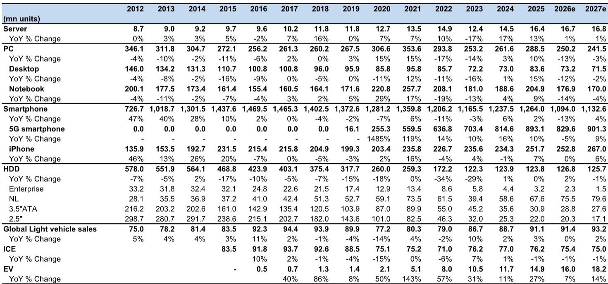
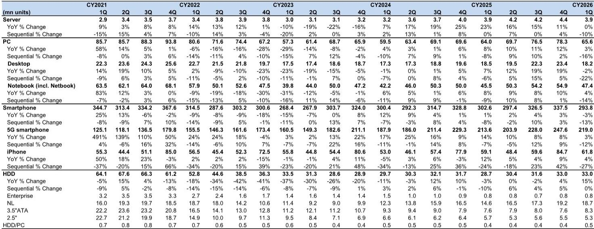
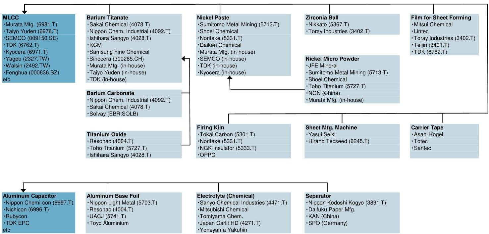

# The MLCC Cycle Has Shifted: AI Demand Is Reshaping the Passive Component Market, Not Just Boosting It

The narrative surrounding multilayer ceramic capacitors has quietly undergone a structural transformation. For years, investors viewed MLCCs as a cyclical commodity play—tied to smartphone volumes, automotive production, and the familiar rhythms of consumer electronics replacement cycles. The conventional wisdom held that MLCC pricing was destined for perpetual erosion, with ASPs declining predictably as miniaturization advanced and manufacturing scale expanded. That framework is now outdated.

April 2026 data from Japan's Ministry of Economy, Trade and Industry reveals something more interesting than a simple cyclical upturn. While headline production figures showed Japanese MLCC output value declining 10.4% year-on-year in dollar terms, export data painted a dramatically different picture: shipment value rising 16.0% year-on-year and 9.1% month-on-month. This divergence between domestic production statistics and trade data is not a statistical quirk. It signals a fundamental shift in what is being produced, where it is going, and what customers are willing to pay.

The critical insight is this: the MLCC market is bifurcating. Standard commodity capacitors continue to face price pressure, but the high-value segment—small-form-factor, large-capacity devices designed for AI servers and data center infrastructure—is entering a multiyear expansion phase that will reshape competitive dynamics. The global MLCC shipment value forecast for 2026 has been raised from $16.48 billion to $17.43 billion, representing 18.8% year-on-year growth. By 2028, the market is projected to reach $24.25 billion. These are not incremental adjustments. They reflect a recognition that the composition of demand has changed permanently.

The implications extend beyond component suppliers. Every investor with exposure to AI infrastructure, semiconductor capital equipment, or data center construction needs to understand how passive component bottlenecks could constrain or enable the next wave of GPU deployment. The humble MLCC—a component most market participants ignore—has become a strategic chokepoint in the AI supply chain.

## The Production-Export Divergence Reveals a Shift Toward Premium Product Mix, Not Weakness

The most analytically significant data point in the April METI release is the gap between production and export performance. Japanese MLCC output value in yen terms fell 1.1% year-on-year, while export value surged 28.0% in yen terms. In dollar terms, the divergence is equally stark: production down 10.4% versus exports up 16.0%.

This is not a contradiction. It is a signal about what is being manufactured domestically versus what is being shipped to international customers. Japanese capacitor manufacturers maintain significant overseas production capacity, particularly in Southeast Asia and China. The production statistics capture only domestic factory output. The export data captures goods leaving Japan regardless of origin. When exports grow while domestic production contracts, it suggests that manufacturers are increasingly routing higher-value products through Japanese distribution centers while producing standard components closer to end markets.

The ASP data supports this interpretation. Export ASP in dollar terms rose 5.0% year-on-year and 2.4% month-on-month to 0.501 cents per unit. This is particularly noteworthy given the long-term trend of ASP compression in the MLCC industry. For years, the dominant narrative was that miniaturization and manufacturing efficiency would continue to drive unit prices lower. The fact that export ASPs are rising—even as production ASPs declined 27.5% year-on-year—indicates that the product mix flowing through export channels is increasingly weighted toward premium, high-capacity devices that command better pricing.

The Greater China region, which absorbed 57.7% of Japanese MLCC exports in April, provides additional confirmation. Export volume to the region increased only 0.1% month-on-month, but dollar value rose 7.5%, and ASP jumped 7.4%. This is the signature of a mix shift: customers are buying roughly the same number of units but paying significantly more per unit because they are purchasing higher-specification components.

## AI Infrastructure Demand Is Driving a Multi-Year Re-rating of MLCC Shipment Value, With 2026-2028 Forecasts Revised Sharply Upward

The revised global MLCC shipment forecasts represent the most aggressive upward revision in recent memory. After two consecutive years of decline—from $17.47 billion in 2021 to $14.32 billion in 2022 and $12.64 billion in 2023—the market recovered to $13.30 billion in 2024 and $14.67 billion in 2025. The new forecasts project $17.43 billion for 2026, $20.89 billion for 2027, and $24.25 billion for 2028.

To understand the magnitude of this revision, consider the implied compound annual growth rate. From 2025 to 2028, the market is now expected to grow at approximately 18.2% annually. This far exceeds the historical CAGR of roughly 5-6% that characterized the pre-AI era. The revision is not merely a cyclical upswing; it reflects a structural change in the volume and value of capacitors required per unit of computing infrastructure.

The technical driver is straightforward. Next-generation GPUs and AI accelerator boards require significantly more MLCCs per unit than previous generations, and critically, they require capacitors with higher capacitance in smaller packages. This is not a trivial engineering challenge. Space constraints on ABF package substrates and AI accelerator boards mean that designers cannot simply add more standard capacitors. They must use components that pack more capacitance into less physical space. These components are inherently more valuable, both because they require more advanced manufacturing processes and because they face less competition from commoditized suppliers.

The implications for the supply chain are profound. AI server racks that might have used several hundred MLCCs in previous generations now require thousands. Data centers scaling to hundreds of megawatts of computing power create demand at a scale that was unimaginable during the smartphone-driven MLCC cycle of the late 2010s. And unlike smartphones, which have a replacement cycle of two to three years, data center infrastructure has a longer lifecycle and higher reliability requirements, creating sustained demand for premium components.

## Miniaturization and Capacitance Density Are Becoming the Defining Competitive Moats, Replacing Scale and Cost Leadership

For the past decade, the MLCC industry competed primarily on manufacturing scale and cost efficiency. The leaders were the companies that could produce the most units at the lowest cost, accepting that ASPs would decline as a function of volume growth. The competitive logic was straightforward: win on cost, capture market share, and offset margin compression through volume.

That logic is breaking down. The AI-driven demand for small, large-capacity MLCCs rewards a different set of capabilities: materials science expertise, precision manufacturing, and the ability to maintain capacitance stability under DC voltage bias and high-frequency operation. These are not capabilities that can be acquired simply by building more production lines. They require years of process engineering refinement and proprietary dielectric material formulations.

The market is beginning to recognize that the companies leading in miniaturization and capacitance density will capture disproportionate value. When a customer needs a capacitor that maintains stable performance at high frequencies where currents switch rapidly, they cannot substitute a standard commodity component. The premium they pay reflects genuine technical differentiation, not just temporary supply-demand imbalance.

This has important implications for how investors should evaluate MLCC manufacturers. Traditional metrics such as unit volume growth and capacity utilization rates are becoming less informative. The more relevant question is whether a company's product portfolio is shifting toward the high-capacity, small-form-factor segment that AI infrastructure demands. Companies that remain heavily weighted toward standard commodity capacitors may see volume growth without value growth, while those leading in miniaturization will benefit from both volume expansion and ASP improvement.

The risk profile has also shifted. The primary risk for market leaders is no longer demand destruction or pricing pressure from competitors. It is the operational challenge of ramping production fast enough to meet surging AI-related demand without sacrificing supply to other applications. A company that allocates too much capacity to AI servers at the expense of automotive or industrial customers risks losing share in those segments. But a company that fails to capture the AI opportunity risks being permanently relegated to the commodity end of the market.

## What the Report Does Not Fully Answer: The Currency Conundrum and the Boundary Between Cycle and Structure

Despite the clarity of the demand thesis, the April data leaves several important questions unresolved. The most immediate is the persistent divergence between yen-based and dollar-based metrics. Japanese MLCC production value fell 1.1% year-on-year in yen terms but dropped 10.4% in dollar terms. Export value rose 28.0% in yen but only 16.0% in dollars. These gaps are largely attributable to yen depreciation, but the magnitude of the divergence raises questions about how currency movements are affecting competitive dynamics.

If the yen remains weak, Japanese manufacturers gain a pricing advantage in export markets, potentially allowing them to capture share from Korean and Taiwanese competitors. But a weak yen also inflates the dollar-denominated revenue of Japanese companies, creating a misleading impression of underlying demand strength. Investors need to distinguish between genuine volume and mix improvements versus currency-driven revenue inflation. The report provides the data to ask this question but does not fully decompose the drivers.

A second unresolved question concerns the boundary between cyclical and structural demand. The AI infrastructure buildout is clearly structural, but it is happening against a backdrop of recovering automotive production and stabilizing consumer electronics demand. How much of the upward forecast revision reflects genuine AI pull-through versus normalization in other end markets? The report raises the 2026-2028 forecasts aggressively, but it does not provide a granular breakdown of demand by end-use segment. Investors are left to estimate how much of the growth is AI-specific versus broader recovery.

Finally, the report does not address the supply response. If MLCC manufacturers accelerate capacity expansion in response to AI demand, how quickly could new supply close the gap and compress pricing? The report notes that the leading manufacturer is expected to increase production in line with demand, but it does not model the industry-wide capacity pipeline. This is a critical variable for anyone trying to forecast where ASPs and margins will settle once the initial wave of AI deployment matures.

## A Decision Framework for Investors: Four Questions to Determine MLCC Exposure Quality

The shifting MLCC landscape requires a more nuanced evaluation framework than the traditional capacity-and-volume approach. Investors assessing exposure to this theme should consider four questions that separate structural beneficiaries from cyclical participants.

First, what is the product mix trajectory? A company that is increasing its revenue share from small, large-capacity MLCCs is positioned for ASP growth and margin expansion. A company whose mix is shifting toward standard commodity capacitors may see volume growth but value destruction. The key metric to track is not just total revenue but revenue per unit, adjusted for currency effects. Rising revenue per unit signals mix improvement; flat or declining revenue per unit, even with volume growth, signals commoditization.

Second, how exposed is the company to AI infrastructure versus other end markets? The demand profile for AI servers and data centers is fundamentally different from automotive or consumer electronics. AI demand is concentrated, high-growth, and technically demanding. Automotive demand is diversified, cyclical, and increasingly price-sensitive. A company with high AI exposure benefits from structural tailwinds; one with primarily automotive exposure faces a more uncertain demand environment.

Third, what is the company's competitive position in miniaturization and capacitance density? This is not easily measured by financial metrics alone. It requires understanding the company's R&D pipeline, patent portfolio, and customer qualification cycles. The leading indicators are design wins at major GPU and server manufacturers, not historical market share data.

Fourth, how flexible is the company's production capacity? The risk for market leaders is not insufficient demand but the operational challenge of reallocating capacity between applications. A company that can flexibly shift production toward high-value MLCCs without disrupting supply to existing customers has a strategic advantage. A company with rigid production lines dedicated to specific product categories may struggle to capture the AI opportunity without sacrificing other revenue streams.

These four questions provide a framework for distinguishing between companies that will benefit from the MLCC cycle shift and those that will be bystanders. The answers are not yet fully priced into the market, creating opportunities for investors who do the analytical work.

## The Full Report Contains the Data and Charts That Make These Distinctions Actionable

The analysis presented here draws on the April METI data and the revised global MLCC shipment forecasts, but the full report contains granular breakdowns that enable deeper analysis. The export value and ASP data by customs post—Narita, Osaka, and Kansai International—reveal important geographic patterns in product mix. The historical market size table provides context for evaluating the magnitude of the current forecast revisions. And the detailed company-level ratings and price targets offer a starting point for building a position around the MLCC theme.

These are not static reference points. They are analytical tools that allow investors to track the evolution of the MLCC market in real time and adjust their positioning as new data emerges. The divergence between production and export data, the mix shift toward premium products, and the acceleration in shipment value forecasts are all signals that can be monitored monthly to validate or challenge the structural thesis.

Join the community to read the full report and review the original charts.

*This article is for learning and discussion only and does not constitute investment advice.*

Personal reading notes and learning share only. Not investment advice.

