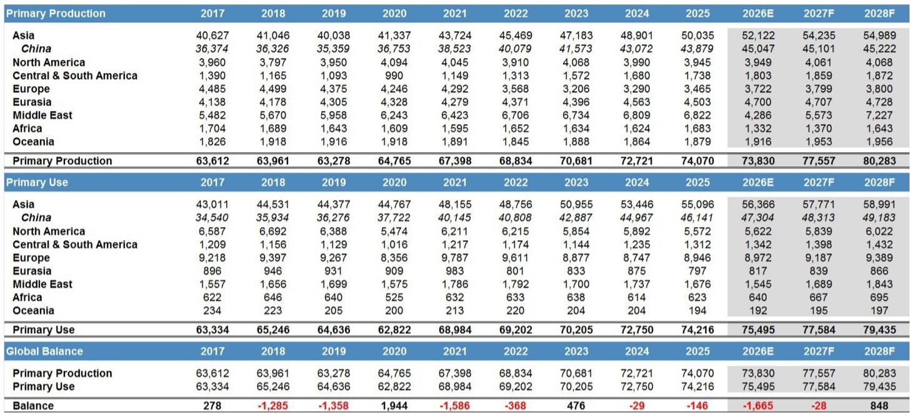
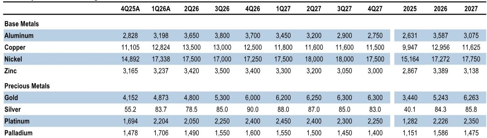
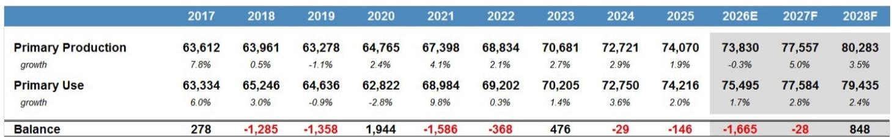

# The Aluminum Deficit Is Shifting from Invisible to Visible — and That Changes Everything for Prices

The global aluminum market is not just tight. It is structurally undersupplied by a margin that most participants have underestimated because the deficit has been hidden in stockpiles that do not appear on any exchange report. That concealment is about to end. According to the latest supply-demand balance from a leading global investment bank, the primary aluminum deficit for 2026 is now forecast at 1.7 million metric tons, with the second through fourth quarters alone implying a 2.3 million ton draw on inventory. These are not marginal numbers. They represent the largest sustained supply shortfall in the aluminum market in over a decade.

What makes this deficit unusual is not its size but its invisibility. For the past several quarters, the gap between physical supply and demand has been bridged by drawing down producer stocks, trader inventories, and consumer buffer holdings — metal that sits outside the exchange system and therefore escapes the scrutiny of most market participants. Industry feedback now suggests that only about two months of this hidden inventory remains. Once it is gone, the deficit will become visible in the only place that matters for price discovery: the exchange-registered warehouses and Chinese social inventory data that traders and analysts actually watch.

The implications are straightforward but powerful. A visible drawdown concentrated in China, which holds roughly 75 percent of global visible aluminum inventory, will push Shanghai Futures Exchange prices higher. To keep the export arbitrage open — and the rest of the world dependent on Chinese aluminum product exports — London Metal Exchange prices must follow. This arbitrage chase, not a geopolitical shock or a supply disruption, is the next core fundamental driver for higher LME aluminum prices. The market is in the middle innings of a structural repricing, and the second half of 2026 is when the real momentum arrives.

## The Deficit Is Real, But It Has Been Masked by a Draw on Hidden Stocks That Is Now Nearly Exhausted

The headline deficit numbers are striking, but they have not yet produced the price response one would expect. Global visible aluminum inventory, after drawing in recent weeks, remains roughly on par with end-February levels. This apparent contradiction — a massive deficit with no visible inventory collapse — has led some market participants to question whether the supply gap is as large as forecast. It is. The missing metal has simply been sourced from a different pool.

Invisible inventories include metal held by Middle East producers in consumer regions such as Asia, Europe, and the United States. These stocks have served as a buffer against disrupted production and logistics, particularly following the Strait of Hormuz disruptions that curtailed Middle East smelter output. They also include trader and merchant stocks held outside exchange warehouses to avoid higher LME rent, and consumer inventories drawn down to avoid the backwardation penalty that has punished holders of physical metal for most of this quarter. The backwardated forward curve creates a strong incentive to destock: why carry inventory when the market pays you to sell it now and buy it back later?

That incentive has been working. But the pool is finite. Industry feedback from recent conferences, including the Harbor Aluminum Summit, indicates that these hidden stocks now have roughly two months of drawdown coverage remaining. After that, the arithmetic changes. The bank's balance still shows a primary aluminum deficit of nearly 1 million tons that must be covered in the second half of 2026, including a 700,000 ton deficit in the third quarter alone. Even if the Strait of Hormuz reopens this month — which is the base case — Middle East smelters will take one to two quarters to ramp back up after a controlled shutdown. The supply gap does not disappear when the waterway reopens. It merely shifts from a geopolitical problem to a logistical and operational one.

The transition from invisible to visible inventory draws is not a theoretical construct. It is already beginning. This week brought a roughly 63,000 ton week-on-week draw in Chinese social inventory, the largest weekly draw since December 2023. That is the first signal of a pattern that is about to become the dominant narrative in the aluminum market.

## China's Capacity Cap and Export Role Create a Structural Tension That Locks in Higher LME Prices

China is the swing supplier for the global aluminum market. When the rest of the world needs metal, China exports more. When the rest of the world is oversupplied, China absorbs the surplus. That mechanism has worked for years, but it is now operating under constraints that make it a source of upward price pressure rather than a stabilizing force.

Chinese primary aluminum production is approaching the 45 million ton capacity cap that the government has enforced through energy-use inspections and emissions scrutiny. The bank's estimates show Chinese supply pushing above 45 million tons on an annualized basis in some quarters, driven by efficiency gains at individual smelters. But the structural brake remains in place: ongoing inspections of industrial energy use and emissions will prevent supply from significantly exceeding the cap. This is not a policy that will be relaxed in a tight market. If anything, domestic supply security concerns make Beijing more likely to enforce the cap strictly, ensuring that Chinese production serves domestic demand first and export demand second.

The export channel is the critical link. The ex-China market needs Chinese aluminum product exports to backfill the lost Middle East tonnes. The bank's data shows that Chinese exports have already risen to fill part of the gap, but the pace must accelerate. For that to happen, LME prices must stay high enough to keep the export arbitrage open. If Chinese domestic prices rise — which they will as visible inventory draws accelerate — the arbitrage narrows. To keep the channel open, LME prices must rise in tandem. This is not a one-time adjustment. It is a continuous process of arbitrage chasing that will persist as long as the structural deficit remains.

The implication is clear: the aluminum market has entered a regime where Chinese domestic tightness and global supply constraints are mutually reinforcing. Each draw on Chinese visible inventory pushes SHFE prices higher. Each SHFE price increase requires a higher LME price to maintain the export flow. The result is a self-sustaining upward pressure that will persist until either the deficit closes or demand destruction intervenes.

## The Middle East Ramp-Up Will Not Be a Quick Fix, and the Market Is Underpricing the Time Lag

Market participants who expect a rapid resolution to the aluminum deficit once the Strait of Hormuz reopens are likely to be disappointed. The bank's base case assumes that Middle East smelters begin the process of restarting idled production in the third quarter of 2026, with the ramp accelerating through the fourth quarter and into early 2027. But "beginning the process" is not the same as restoring output. Controlled shutdowns of aluminum smelters are not like flipping a switch. Potlines must be recommissioned, power supplies stabilized, and raw material flows reestablished. The process takes months, not weeks.

The data on Middle East production estimates illustrates the point. Production across Bahrain, Iran, Oman, Qatar, Saudi Arabia, and the UAE drops sharply in the second quarter of 2026, reflecting the full impact of the Strait disruption. The recovery is gradual, with production only approaching normal levels by the first quarter of 2027. Even under the most optimistic assumptions, the region will not be back to full output for at least three quarters after a reopening.

This timeline has two implications. First, the deficit in the second half of 2026 is locked in regardless of geopolitics. The supply losses have already occurred, and the recovery is too slow to close the gap within the forecast period. Second, any knee-jerk price decline following a Strait reopening — driven by lower energy prices or relief that the disruption is over — will be temporary. The underlying physical deficit will reassert itself within weeks, and prices will resume their upward trajectory.

The bank's analysis is explicit on this point: while aluminum could come under initial pressure following a sustained reopening, the pressure will not be sustained because Middle East production will still take multiple quarters to approach normalcy. The market is in the middle innings, and the second half of 2026 is when the deficit becomes most acute.

## What the Report Does Not Fully Answer: The Demand Side and the Timing of the Rollover

For all its analytical rigor, the report leaves several important questions unresolved. The most significant is the demand side. The bank forecasts 1.6 percent year-on-year domestic demand growth in China for 2026, and 2.5 percent growth when including boosted exports. But these are aggregate numbers that do not disaggregate demand by end-use sector. If Chinese construction or automotive demand softens more than expected, the export channel could narrow without requiring higher LME prices. Conversely, if demand proves stronger than forecast, the deficit could widen beyond the already substantial estimates.

A second open question is the timing of the price rollover. The report forecasts that aluminum prices will begin to decline in the second half of 2027, falling back below $3,000 per metric ton as the specter of a 2028 oversupply — approaching 1 million tons — comes into focus. But this forecast depends on the assumption that new Chinese-funded supply outside China, including projects in Indonesia, Angola, and Saudi Arabia, comes online on schedule. These projects are momentous in the long term, representing the end of a period of global supply discipline in aluminum. But in the near term, they do nothing to close the 2026 deficit. The question is whether the market will begin to discount the 2028 oversupply before the 2026 deficit has fully played out, creating a tension between spot tightness and forward weakness.

A third unresolved issue is the behavior of invisible inventories outside China. The report estimates roughly two months of drawdown coverage remaining, but this is based on industry feedback rather than hard data. If the hidden stockpiles are larger than estimated, the transition to visible draws could be delayed, extending the period of price suppression. If they are smaller, the transition could be abrupt and violent. The market is operating with incomplete information, and the margin of error is wide.

## A Decision Framework for Aluminum Exposure Over the Next 18 Months

For investors and corporate strategists, the report provides a clear framework for positioning. The key variables are time horizon, inventory visibility, and the China export arbitrage.

For a six-month horizon, the case for higher aluminum prices is compelling. The deficit is large, the invisible inventory buffer is nearly exhausted, and the transition to visible draws in China is already underway. The bank's price target of $3,750 per metric ton for the second half of 2026 and a push toward $4,000 on a spot basis is supported by the fundamental arithmetic. The primary risk is a faster-than-expected Middle East ramp-up, but even that scenario only delays the deficit rather than eliminating it.

For a 12-month horizon, the outlook becomes more nuanced. By the first half of 2027, the Middle East recovery should be well advanced, and the deficit should begin to narrow. The question is whether the supply response from new projects outside China will arrive quickly enough to prevent a prolonged period of tightness. The report suggests that 2027 will be relatively balanced, but the transition from deficit to surplus is rarely smooth. Prices could remain elevated longer than the base case assumes if project delays compound the supply gap.

For an 18-month horizon, the risk shifts to the downside. The looming 2028 oversupply of nearly 1 million tons will become the dominant narrative, and the market will begin to discount a structural surplus. Investors who hold physical aluminum or long futures positions into the second half of 2027 risk being caught on the wrong side of a rollover that the report explicitly forecasts. The strategic question is not whether to be bullish on aluminum, but when to turn bearish.

The decision framework also requires monitoring the China export arbitrage in real time. As long as Chinese visible inventory is drawing and the export channel remains open, the upward pressure on LME prices will persist. The moment Chinese inventory stabilizes or the arbitrage closes, the bull case weakens. This is not a static forecast. It is a dynamic process that requires continuous reassessment of the data.

## The Full Report Contains the Charts and Data That Make These Arguments Actionable

The analysis above is based on the bank's written conclusions and the charts embedded in the original report. But the real value lies in the data: the quarterly balance figures, the Middle East production estimates, the regional premium trends, the Chinese inventory trajectories, and the export volume history. These are not abstractions. They are the raw material for building conviction around a trade or a strategic hedge.

The original report includes seven charts that illustrate every key relationship discussed here. The global primary aluminum balance shows the quarterly deficit trajectory. The Middle East production estimates show the ramp timeline. The regional ingot premiums show how tightness is transmitting through the supply chain. The global visible inventory chart shows where the draws are concentrated. The Chinese export data shows the flow that keeps the market balanced. The weekly Chinese inventory change shows the first signs of the transition from invisible to visible. And the annualized Chinese production estimates show the constraints that prevent supply from responding fully.

Join the community to read the full report and review the original charts.

*This article is for learning and discussion only and does not constitute investment advice.*

Personal reading notes and learning share only. Not investment advice.

