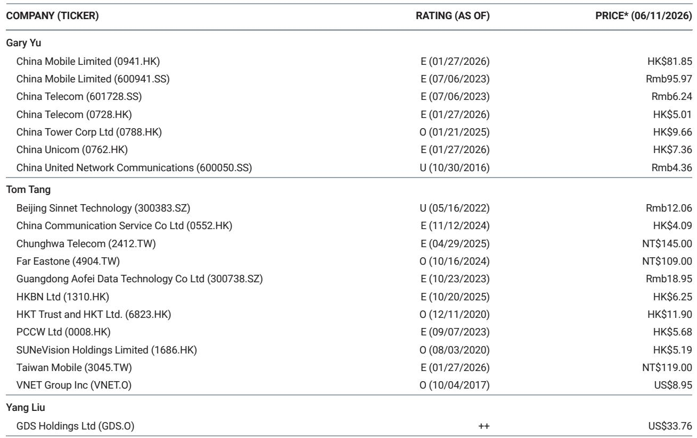
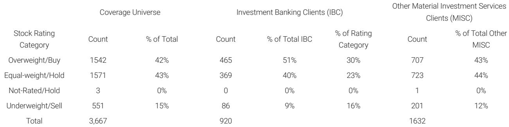

# The Rumored $295 Billion Government Data Center Plan Would Not Solve China's AI Bottleneck—But It Would Destroy the Private Cloud Market

A recent press report claiming that China's National Development and Reform Commission plans to invest $295 billion (Rmb 2 trillion) in data centers over the next five years has sent shockwaves through the market. Investors immediately began repricing data center operators and public cloud stocks, fearing a wave of state-subsidized oversupply from state-owned telecom carriers. Yet this narrative is built on a misreading of policy intent and a misunderstanding of where China's AI constraints actually lie. The market's worst fears are directionally correct only if the report is literally true—and there is strong reason to believe it is not.

The real story is more nuanced and, for private data center operators, far less apocalyptic. The Rmb 2 trillion figure appears to originate from a January 2025 government policy document, but that document referred to investment in *interconnectivity infrastructure* between data centers, not construction of the data centers themselves. This distinction matters enormously. A government-led push to build fiber networks, upgrade cross-region connectivity, and enhance security facilities is not the same as a government-led push to build server farms. The former complements private data centers; the latter would compete with them.

Even more important, the report's central premise—that China's AI ambitions are constrained by data center supply—misses the mark. The binding constraint on China's AI development is not floor space or power capacity. It is chipset production and design. Without access to leading-edge semiconductor fabrication and advanced chip design capabilities, building more data centers is like building more gas stations without securing a supply of gasoline. The government knows this, which is why its policy focus has been on semiconductor self-sufficiency, not data center expansion.

Nevertheless, the market is right to be alert to the risk of government intervention in data center infrastructure. The question is not whether the government will invest, but where it will invest and what that means for the competitive dynamics between state-owned telecom operators and private hyperscalers like Alibaba and ByteDance. The answer depends on whether one reads the press report as a factual forecast or a directional signal.

## The $295 Billion Figure Is Almost Certainly a Misinterpretation of a Network Investment Policy, Not a Data Center Construction Plan

The Bloomberg report that triggered the sell-off cited a government plan to invest Rmb 2 trillion in data centers over five years, with telecom operators building and running the infrastructure. But a careful reading of the underlying policy document—a January 2025 government policy read through—reveals a different story. The document states that "the construction of data infrastructure will drive the construction and upgrading of networks, computing power, and security facilities and is estimated to attract investment of Rmb 2 trillion over 5 years."

The critical phrase is "networks, computing power, and security facilities." This is not a data center construction plan. It is a connectivity and security plan. The government is signaling that it wants to improve the backbone networks that link data centers together, upgrade security infrastructure, and ensure that computing resources can be dynamically allocated across regions. This is a sensible policy response to the fragmentation of China's data center landscape, where hyperscalers and telecom operators have built capacity in silos with limited interconnection.

Why does this distinction matter? Because network investment is complementary to private data center operations, not competitive with them. Better connectivity between data centers improves utilization rates, enables workload migration, and reduces latency—all of which benefit existing operators. A telecom operator that builds a new data center is a competitor to GDS or VNET. A telecom operator that builds a fiber ring connecting existing data centers is an enabler.

The market's confusion is understandable. A $295 billion headline is attention-grabbing, and the telecom sector has a history of aggressive infrastructure build-outs. But the policy document's language is precise, and the distinction between building data centers and building networks is the difference between a negative shock and a neutral-to-positive development for the sector.

## China's AI Constraint Is Chip Supply, Not Data Center Capacity—And Government Policy Reflects This Reality

Even if the government were to invest Rmb 2 trillion in data center construction, it would not materially accelerate China's AI development. The reason is simple: AI workloads are compute-constrained, not space-constrained. A data center without high-performance AI chips—specifically, GPUs and AI accelerators—is just an expensive empty building.

China's semiconductor challenge is well documented. Export controls from the United States have restricted access to advanced chips from NVIDIA and other leading suppliers. Domestic alternatives, while improving, still lag in performance and yield. The result is a compute bottleneck that no amount of data center construction can solve. You can build a thousand data centers, but if you cannot fill them with the chips needed to train large language models, you have not advanced your AI capabilities.

The government understands this. Its policy focus has been on semiconductor investment, chip design ecosystem development, and domestic foundry capacity. The January 2025 policy document's emphasis on "computing power" and "security facilities" reflects this awareness. The government wants to ensure that the limited compute resources available are efficiently networked and securely managed, not that more physical space is built.

This insight has direct implications for the competitive landscape. Hyperscalers like Alibaba and ByteDance have been gaining market share in public cloud from state-owned telecom operators precisely because they have better access to chip supply chains. Alibaba's in-house T-head chips, ByteDance's model capabilities, and both companies' relationships with chip suppliers give them an edge that no amount of government-funded data center construction can erase. The trend of private hyperscalers outperforming state-owned telecom operators in cloud is structural, not cyclical.

## If the Report Were True, It Would Trigger a Supply Shock That Crushes Private Data Center Margins and Reshapes Market Structure

The scenario that the market fears—a literal Rmb 2 trillion government investment in data centers built and operated by telecom operators—would be devastating for private data center companies. The logic is straightforward: massive government-subsidized supply entering a market that is already approaching equilibrium would drive down utilization rates and pricing power across the board.

Private data center operators like GDS and VNET compete on location, power availability, and service quality. They cannot compete against government-subsidized capacity that is priced below cost. A wave of state-funded data center construction would compress margins, delay new project starts, and potentially trigger consolidation as weaker players exit the market. The telecom operators would gain market share not through superior service but through subsidized pricing.

This scenario would also reshape the public cloud market. Telecom operators would bundle their subsidized data center capacity with cloud services, undercutting Alibaba Cloud and ByteDance's cloud offerings. The government might justify this as a national security imperative—ensuring that AI infrastructure is controlled by state-owned entities. The result would be a bifurcated market: state-owned infrastructure for government and strategic applications, private infrastructure for commercial workloads.

But this scenario is unlikely for three reasons. First, it contradicts the government's current data center window guidance policy, which explicitly targets balanced supply and demand. Second, it would waste capital on a non-binding constraint. Third, it would undermine the very hyperscalers that are leading China's AI innovation. The government has shown no appetite for destroying the private sector's competitive advantage in cloud and AI.

## The Report Leaves Unanswered Questions That Should Define Investor Due Diligence

Despite the analytical clarity that comes from reading the underlying policy document, several important questions remain unresolved. These are not gaps in the report's logic but genuine uncertainties that investors must monitor.

First, what is the government's actual spending trajectory on data center-adjacent infrastructure? The Rmb 2 trillion figure over five years implies Rmb 400 billion per year. Even if this is network investment, it represents a significant increase in telecom capital expenditure. How much of this will flow to telecom operators' profit and loss statements, and how much will be passed through to equipment vendors and construction companies? The answer determines whether the telcos are winners or mere conduits.

Second, will the government's focus on network interconnectivity inadvertently create a more level playing field for smaller data center operators? Currently, hyperscalers benefit from proprietary networks that give them latency and reliability advantages. If the government builds a high-quality public interconnection network, it could reduce the competitive moat of the largest players. This would be a positive for secondary operators but a negative for market leaders.

Third, what is the timeline for chip supply improvement? If domestic chip production accelerates faster than expected, the compute bottleneck eases, and data center capacity becomes a binding constraint. In that scenario, government investment in data centers would be rational. The timing of chip supply improvements is the most important variable that the report cannot forecast.

Fourth, how will the government balance its desire for AI leadership with its commitment to market-based resource allocation? The tension between state-directed investment and private sector innovation is not unique to China, but it is particularly acute in the technology sector. Investors need to watch for policy signals that indicate the government's willingness to let market forces determine data center supply.

## A Decision Framework for Investors Navigating the Data Center Policy Risk

The uncertainty around government data center policy does not paralyze investment decisions. It reframes them. Investors should evaluate data center and cloud exposures through a structured lens that separates policy noise from structural trends.

The first filter is end-customer exposure. Data center operators that serve hyperscalers directly—Alibaba, ByteDance, Tencent—are insulated from government competition because their customers are the very companies that are winning market share from telecom operators. The government is unlikely to build data centers that compete with its most innovative AI champions. Operators serving government and state-owned enterprise customers face higher policy risk because their customers could be redirected to state-owned infrastructure.

The second filter is asset location. Data centers in Tier 1 cities and major economic hubs benefit from power constraints and land scarcity that make new construction difficult, regardless of government intent. Operators with existing assets in Beijing, Shanghai, and Guangzhou have a structural advantage. New government construction is more likely in Tier 2 and Tier 3 cities where land and power are available.

The third filter is contract structure. Operators with long-term, pre-paid contracts are less exposed to pricing pressure from new supply. Operators relying on short-term or spot-market pricing will be the first to feel the impact of any oversupply.

The fourth filter is balance sheet strength. A government-driven supply shock would trigger a margin compression cycle that punishes leveraged operators. Companies with strong balance sheets and access to capital can weather the storm and potentially acquire distressed assets. Weak operators will be forced to sell at unfavorable terms.

Applying this framework, the most resilient positions are data center operators with hyperscaler exposure, Tier 1 city assets, long-term contracts, and strong balance sheets. The most vulnerable are operators serving government customers in secondary cities with short-term pricing and high leverage.

## The Full Report Contains the Original Policy Document Analysis and Competitive Market Share Data That Investors Need to Form Their Own Conclusions

This article has synthesized the core analytical argument from the original research report, but it cannot replace the depth of the full analysis. The original report includes the exact language of the January 2025 policy document, the analysts' translation and interpretation, and the historical context of government data center policy. It also contains detailed market share data showing the trajectory of hyperscaler gains versus state-owned telecom operators in public cloud.

For investors who want to verify the claims made here, see the original charts, and understand the analysts' full reasoning, the complete report is essential reading. The policy document references, the competitive dynamics, and the supply-demand analysis are all presented with the rigor that serious investment decisions require.

Join the community to read the full report and review the original charts.

*This article is for learning and discussion only and does not constitute investment advice.*

Personal reading notes and learning share only. Not investment advice.

