June 12, 2026 05:05 AM GMT

## Optical | North America

# Optical Content Growing – Regardless of Architecture

Recent debate about near-packaged vs. co-packaged optics (NPO/CPO) misses that optical content is largely tied to bandwidth needs. Debate likely prevents stocks from reaching bull cases in NT, but growing more encouraged on LITE, COHR, GLW as they pull back and content expansion still in early days.

## Key Takeaways

The challenges of moving to co-packaged optics (CPO) are not new, with network builders examining all alternatives in journey.  
Regardless of whether 2.5D / 3D CPO or just NPO or OBO, the increase in optical content / lasers is driven by the need for more bandwidth.  
■ More conservative assumptions on CPO adoption in 2028 likely keep stocks away from bull cases for now, but still seen largely as a timing issue.  
- With fewer debates about bandwidth vs. architectures, we think the market has grown overly concerned on LITE / COHR / GLW and would be more positive on weakness.

Timing and exact architectures unknown, but regardless, optical content is rising. There has been meaningful volatility in LITE, COHR, GLW and the rest of the co-packaged optics (CPO) ecosystem over the last couple of weeks as timing questions re-emerged. We would note, adoption / timing have always been in question, as Tiffany Yeh / Andy Meng and myself have noted in multiple deep dives this year (see below for links), noting expectations for closer to 6-7mm optical engines of demand in 2027 (vs. some bullish investor expectations of 20-30mm). However, debating timeline of adoption misses that optical content is largely correlated to bandwidth needs – e.g., the more bandwidth, the more optics, whether that takes the form of co-packaged optics (CPO), near-packaged optics (NPO), or other optical formats. While given commitments of capacity as part of NVDA's equity investments in LITE, COHR, GLW likely prevent just instantly swapping one set of demand for another, we do think that these three vendors remain beneficiaries of the increase in optical content, particularly as it enters the scale-up domain. Lumentum echoed this sentiment in conference appearances this week and our HQ visit to Coherent yesterday noted similar takeaways.

MS & CO. LLC

## Meta A Marshall

Equity Analyst

Meta.Marshall@morganstanley.com +1 212 761-0430

## Antonio Jaramillo

Research Associate

Antonio.Jaramillo@morganstanley.com +1 212 761-4438

MS TAIWAN LIMITED+

## Tiffany Yeh

Equity Analyst

Tiffany.Yeh@morganstanley.com +886 2 7712-3032

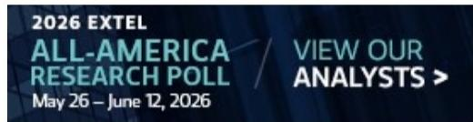

text_image

2026 EXTEL
ALL-AMERICA
RESEARCH POLL / VIEW OUR
ANALYSTS >
May 26 – June 12, 2026

## TELECOM & NETWORKING EQUIPMENT

North America

Industry View

In-Line

MS does and seeks to do business with companies covered in MS. As a result, investors should be aware that the firm may have a conflict of interest that could affect the objectivity of MS. Investors should consider MS as only a single factor in making their investment decision.

## For analyst certification and other important disclosures, refer to the Disclosure Section, located at the end of this report.

+= Analysts employed by non-U.S. affiliates are not registered with FINRA, may not be associated persons of the member and may not be subject to FINRA restrictions on communications with a subject company, public appearances and trading securities held by a research analyst account.

Exhibit 1: Optical Content Increasing, Discussion Is More Around Timing  
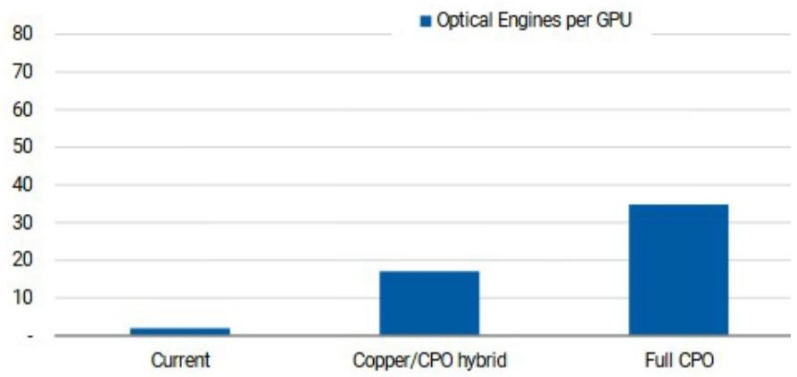

bar chart

| Category | Optical Engines per GPU |
|---|---|
| Current | 2 |
| Copper/CPO hybrid | 17 |
| Full CPO | 35 |

Source: MS

Exhibit 2: Our CPO Forecast Was Short of Bullish Expectations, but Still Points to Meaningful Growth Opportunity  
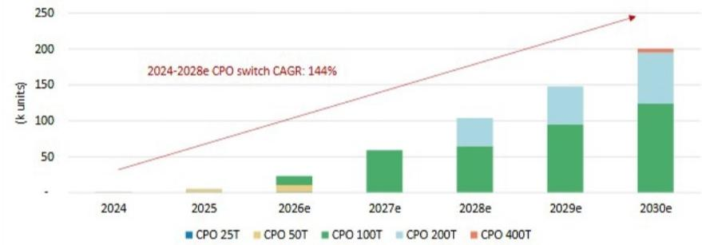

stacked bar chart

| Year | CPO 25T (k units) | CPO 50T (k units) | CPO 100T (k units) | CPO 200T (k units) | CPO 400T (k units) |
|---|---|---|---|---|---|
| 2024 | 0 | 0 | 0 | 0 | 0 |
| 2025e | 0 | 5 | 10 | 0 | 0 |
| 2027e | 0 | 5 | 30 | 0 | 0 |
| 2028e | 0 | 5 | 60 | 30 | 0 |
| 2029e | 0 | 5 | 90 | 40 | 5 |
| 2030e | 0 | 5 | 120 | 50 | 10 |
2024-2028e CPO switch CAGR: 144%

Source: Yole, MS estimates

What are the challenges? Does NPO solve them? We have been writing about CPO for years, with the cost / fragility of the solutions tending to be the gating item (see many of the deep dives below). The main crux of the debate being whether you can replicate a high confidence supply chain around optics equal to that of transceivers today for scale-out and copper for scale-up. According to Tiffany Yeh, with her coverage of key CPO enablers WinWay and FOCI, key bottlenecks to CPO production scaling are SolC yield (50-60%) and downstream assembly yield (20-50%). By keeping the packaging separate, in NPO you have less problems with production, assembly, and a customer can more easily fix if optics are not working. While not trivial to put the optics on the board, it is a step function easier than CPO. Additionally, the optical engine can be purchased separately from the GPU/XPU, which can allow for a more open ecosystem. We do see the market moving towards CPO/NPO, but 2028/2029 when we see bigger adoption.

Exhibit 3: Preliminary Expectations from 650 Group Put Larger Opportunity as Scale-Up  
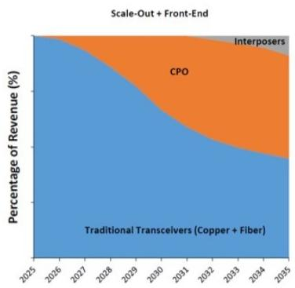

area chart

| Year | Traditional Transceivers (Copper + Fiber) (%) | CPO (%) | Interposers (%) |
|------|---------------------------------------------|---------|-----------------|
| 2025 | 100                                         | 0       | 0               |
| 2026 | 98                                          | 0       | 0               |
| 2027 | 95                                          | 0       | 0               |
| 2028 | 90                                          | 0       | 0               |
| 2029 | 85                                          | 0       | 0               |
| 2030 | 80                                          | 0       | 0               |
| 2031 | 75                                          | 0       | 0               |
| 2032 | 70                                          | 0       | 0               |
| 2033 | 65                                          | 0       | 0               |
| 2034 | 60                                          | 0       | 0               |
| 2035 | 55                                          | 0       | 0               |

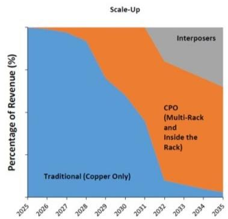

area chart

Scale-Up
| Year | Traditional (Copper Only) (%) | CPO (Multi-Rack and Inside the Rack) (%) | Interposers (%) |
|---|---|---|---|
| 2025 | 98 | 0 | 0 |
| 2026 | 97 | 0 | 0 |
| 2027 | 96 | 0 | 0 |
| 2028 | 95 | 0 | 0 |
| 2029 | 94 | 15 | 0 |
| 2030 | 93 | 35 | 0 |
| 2031 | 92 | 55 | 0 |
| 2032 | 91 | 75 | 0 |
| 2033 | 90 | 85 | 0 |
| 2034 | 89 | 90 | 0 |
| 2035 | 88 | 95 | 0 |

Source: 650 Group

CPO Notes / Deep Dives:

Coherent Corp: Takes from the Road: Demand Visibility High, Margin Levers Building (12 June 2026)

Thoughts on Investor Concerns Regarding CPO (10 June 2026)

AI Supply Chain: CPO and ASIC Dynamic Update (3 March 2026)

OFC 2026 Wrap-Up: Bright Lights, Big City (19 March 2026)

Framing the CPO opportunity for Soitec and Besi (3 March 2026)

Telecom & Networking Equipment: Into the Spotlight: Optical Market Opportunities (23 Feb 2026)

New Page for Networking Market; Initiate FOCI at OW (14 January 2025)

## Analysis

## Estimating Optical Content Increases

According to Nigel Van Putten, on his coverage of Soitec and Besi, the number of optical engines per GPU rises from 2 to 4 today to 17-18 in NVL576 and potentially >35 in a fully optical configuration. Today's pre-CPO setup uses 2-4 pluggable transceivers (two for the leaf, two for spine with oversubscription potentially reducing this number) per GPU, all in the scale-out network. NVL576 introduces co-packaged optics (CPO) for inter-rack scale-up traffic, lifting optical engine attach rate to \~17 per GPU, on our estimates (LITE has noted more like \~18 – content per OE for LITE is \~\$150-200). Eventually, for a fully optical variant, where the connection between GPU and the networking switch also moves to photonics, roughly doubles that to \~35. Looking ahead to Feynman architectures and Keyber rack architectures, OEs per-GPU could remain at that level if SerDes speeds move to 400G, but could double again if SerDes stays at 200G.

Exhibit 4: Market Missing That Regardless of Timing, Optical Content Increasing  
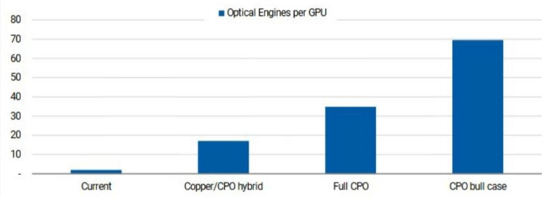

bar chart

| Category | Optical Engines per GPU |
|---|---|
| Current | 3 |
| Copper/CPO hybrid | 17 |
| Full CPO | 35 |
| CPO bull case | 70 |

Source: MS

Exhibit 5: Assumptions and Calculations of Optical Engines (OEs) per Rack Architecture

<table><tr><td>Metric</td><td>NVL72 Optical Scale-Out</td><td>NVL576 Hybrid</td><td>NVL576 Full CPO</td><td>Feynman Hybrid 200G</td><td>Feynman Full CPO 400G</td><td>Feynman Full CPO 200G</td></tr><tr><td>Configuration</td><td>NVL72</td><td>NVL576</td><td>NVL576</td><td>NVL1152</td><td>NVL1152</td><td>NVL1152</td></tr><tr><td>Total GPUs</td><td>72</td><td>576</td><td>576</td><td>1,152</td><td>1,152</td><td>1,152</td></tr><tr><td>Racks</td><td>1</td><td>8</td><td>8</td><td>8</td><td>8</td><td>8</td></tr><tr><td>GPUs per rack</td><td>72</td><td>72</td><td>72</td><td>144</td><td>144</td><td>144</td></tr><tr><td>Low-latency domain</td><td>72</td><td>576</td><td>576</td><td>1,152</td><td>1,152</td><td>1,152</td></tr><tr><td>Scale-up BW/GPU (Tb/s)</td><td>N/A</td><td>14.4</td><td>14.4</td><td>28.8</td><td>28.8</td><td>28.8</td></tr><tr><td>Scale-out BW/GPU (Tb/s)</td><td>1.6T</td><td>1.6T</td><td>1.6T</td><td>3.2T</td><td>3.2T</td><td>3.2T</td></tr><tr><td>Scale-out oversubscription</td><td>2:1</td><td>1.5:1</td><td>1.5:1</td><td>1:1</td><td>1:1</td><td>1:1</td></tr><tr><td>SerDes (Gb/s)</td><td>100</td><td>200</td><td>200</td><td>200</td><td>400</td><td>200</td></tr><tr><td>Scale-up medium</td><td>Copper</td><td>Hybrid</td><td>CPO</td><td>Hybrid</td><td>CPO</td><td>CPO</td></tr><tr><td>Scale-out medium</td><td>Plug/CPO</td><td>Plug/CPO</td><td>Plug/CPO</td><td>CPO</td><td>CPO</td><td>CPO</td></tr><tr><td>Intra-rack OEs (A)</td><td>-</td><td>-</td><td>10,368</td><td>-</td><td>20,736</td><td>41,472</td></tr><tr><td>Inter-pod OEs (B)</td><td>-</td><td>9,072</td><td>9,072</td><td>36,288</td><td>18,144</td><td>36,288</td></tr><tr><td>Scale-out OEs (C)</td><td>144</td><td>768</td><td>768</td><td>2,304</td><td>1,152</td><td>2,304</td></tr><tr><td>Total OEs (pod)</td><td>144</td><td>9,840</td><td>20,208</td><td>38,592</td><td>40,032</td><td>80,064</td></tr><tr><td>OEs per rack</td><td>144</td><td>1,230</td><td>2,526</td><td>4,824</td><td>5,004</td><td>10,008</td></tr><tr><td>OEs per GPU</td><td>2</td><td>17</td><td>35</td><td>34</td><td>35</td><td>70</td></tr></table>

Source: MS estimates

Exhibit 6: 6-7mm Optical Engines of Demand From 59K Switches in Model  
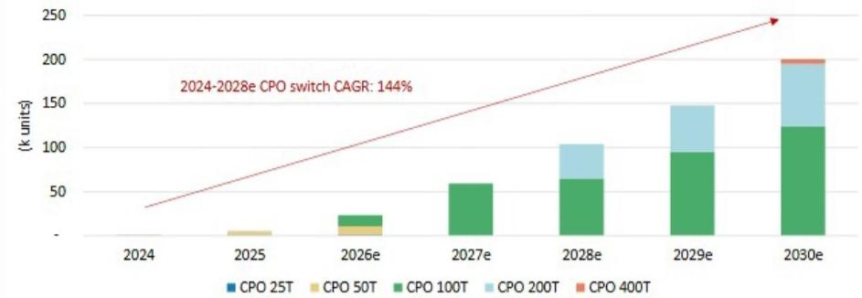

stacked bar chart

| Year | CPO 25T (k units) | CPO 50T (k units) | CPO 100T (k units) | CPO 200T (k units) | CPO 400T (k units) |
|---|---|---|---|---|---|
| 2024 | 0 | 0 | 0 | 0 | 0 |
| 2025e | 0 | 5 | 15 | 0 | 0 |
| 2027e | 0 | 10 | 60 | 0 | 0 |
| 2028e | 0 | 0 | 65 | 35 | 0 |
| 2029e | 0 | 0 | 95 | 45 | 5 |
| 2030e | 0 | 0 | 125 | 55 | 10 |
2024-2028e CPO switch CAGR: 144%

Source: Yole, MS (e) estimates

## Challenges Today

CPO can help surpass current transmission distance limits, but maintenance might be a challenge: In traditional architectures, optical modules (like transceivers) are typically separate from switch chips; the two components are connected via electrical interfaces. In CPO units, however, optical modules and switch/XPU chips are packaged together, enabling greater integration and direct communication over short-distance, high-speed optical connections. In our view, such packaging could also help consolidate more functions within the same area – but CPO is also facing several challenges. These include lower yields arising from technical complexity and being relatively difficult to replace for maintenance purposes.

Optical alignment and module-level test flow are identified as the current CPO testing bottlenecks: Because CPO uses single-mode fiber with a 9 m core, small tolerance errors can cause major optical loss; the FAU tolerance stack-up can reach 3.8 m, making sub-micron alignment essential. As fiber counts rise to 64 or 128, repeated alignment and FAU connection steps slow testing significantly. Therefore, test speed, alignment accuracy, and mechanism design remain key bottlenecks for CPO production.

Exhibit 7: CPO Challenges  
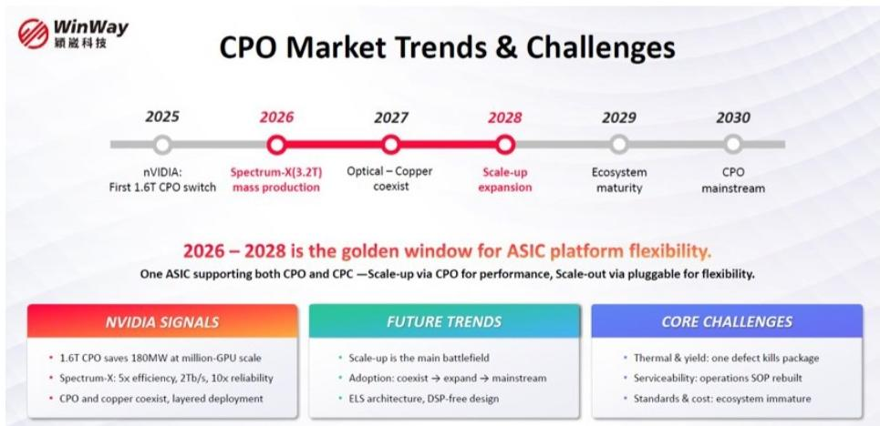

text_image

CPO Market Trends & Challenges
2025
nVIDIA:
First 1.6T CPO switch
2026
Spectrum-X(3.2T)
mass production
2027
Optical – Copper
coexist
2028
Scale-up
expansion
2029
Ecosystem
maturity
2030
CPO
mainstream
2026 – 2028 is the golden window for ASIC platform flexibility.
One ASIC supporting both CPO and CPC —Scale-up via CPO for performance, Scale-out via pluggable for flexibility.
NVIDIA SIGNALS
• 1.6T CPO saves 180MW at million-GPU scale
• Spectrum-X: 5x efficiency, 2Tb/s, 10x reliability
• CPO and copper coexist, layered deployment
FUTURE TRENDS
• Scale-up is the main battlefield
• Adoption: coexist → expand → mainstream
• ELS architecture, DSP-free design
CORE CHALLENGES
• Thermal & yield: one defect kills package
• Serviceability: operations SOP rebuilt
• Standards & cost: ecosystem immature

Source: WinWay.

Exhibit 8: NPO Is Just a Path Towards Eventual CPO or Interposers  
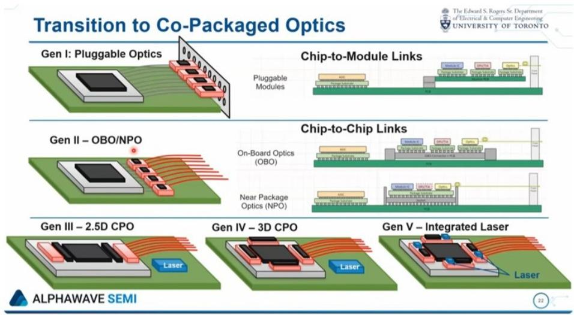

text_image

Transition to Co-Packaged Optics
Gen I: Pluggable Optics
Chip-to-Module Links
Pluggable Modules
Gen II – OBO/NPO
Chip-to-Chip Links
On-Board Optics (OBO)
Near Package Optics (NPO)
Gen III – 2.5D CPO
Gen IV – 3D CPO
Gen V – Integrated Laser
ALPHAWAVE SEMI

Source: University of Toronto / Alphawave Semi

## Challenges / Opportunity of CPO

Move to optics from copper in scale-up is an occasion to introduce CPO (not on-chip yet, but eventually on-chip). There are still a lot of technical challenges to be figured out with CPO. 1) CPO puts the optics on board, which are higher failure than the electronics, increasing the cost of failure and preventing "hot-swapping". 2) Second, high manufacturing costs – CPO carries \~8-10x higher ASPs than traditional pluggable solutions. 3) A lack of ecosystem maturity and standardization, as CPO concentrated with AVGO and NVDA vs a broad ecosystem of transceiver vendors, concentrating economics of the ecosystem even further. 4) CPO's technical complexity currently results in low yields. However, in order to accommodate the I/O and bandwidth needs, CPO will be needed (moving away from just on-board optics to on-chip optics).

Eventually, on-chip co-packaged optics help solve the I/O problem. The core idea of CPO is to integrate optical engines directly into the package of a switch chip or other processing chips, thereby enhancing data transmission speeds, shortening the transmission distance, reducing power consumption, and minimizing latency. CPO brings together a wide range of expertise in fiber optics, digital signal processing (DSP), application-specific integrated circuit (ASIC) switches, and packaging & test to provide disruptive system value for the data center and cloud infrastructure. While there are multiple forms of CPO, including NPO, for the purposes of scale-up, bandwidth needs are advanced, creating an I/O problem, that Optical I/O or 2.5D / 3D CPO is the direction this market would be headed.

## Advantages

Lowering power consumption. Leveraging CPO architecture could help lower power consumption, as the traditional designs of transceivers require electrical signals to travel long distances over copper interconnects, leading to high power consumption and signal loss – whereas CPO significantly reduces power consumption by minimizing electrical signal transmission distances, which would further help enhance performance. Shorter electrical interconnect paths and direct optical communication lead to faster data transmission with reduced latency and fewer bandwidth constraints.

## Challenges

Low yields given challenges in packaging / overall cost of solution high. CPO's technical complexity currently results in low yields, as integrating optical modules with chips involves addressing challenges such as thermal management, signal integrity, and packaging compatibility. CPO carries \~8-10x higher ASPs than traditional pluggable solutions.

Lack of ecosystem. CPO requires collaboration and integration across the optical, semiconductor, and system design supply chains, which is unprecedented, whereas, in pluggables, standards are clearly set as this has been a very mature product in the market. Additionally, with CPO solutions being offered up primarily by Nvidia and Broadcom (both covered by Joe Moore), this would concentrate the profits of networking further into two of its largest vendors.

Challenging to troubleshoot. CPO solutions are relatively hard to maintain and replace, whereas hot-swapping is often an option for traditional transceivers. CPO switches require that power be turned off to conduct troubleshooting, which might lead to higher maintenance fees for customers and requires the network to be offline for longer, a significant challenge.

## Valuation Methodology and Risks

## Coherent Corp (COHR.N)

\~28-30x Base FY28e EPS (\~\$11.50). Multiple trades at premium to historical trading range given AI exposure, trading more in-line with AI comps.

## Risks to Upside

- Interest expense worked down given exit businesses or accelerated delevering  
■ Pricing increases help gross margins  
■ 1.6T AI opportunity ramps faster than expected, benefitting margins  
■ Recovery in non-datacomm portions of business

## Risks to Downside

■ Macro headwinds or pricing increases difficult to achieve given tariffs  
■ SiC market competitive  
■ AI build out pause, catalyzed by DeepSeek  
■ Competitive pressures in datacomm

## Corning Inc (GLW.N)

Our base case valuation reflects \~35x on FY28 Base Case earnings power of \~\$5.1. Our multiple represents a premium to GLW's traditional trading range over the last 10 years given AI megatrend.

## Risks to Upside

■ Acceleration in AI capex data points continue  
■ Margins improve on fiber business as enter more into data center opportunity  
■ CPO adoption greater than expected  
■ Solar overhang on wafers quickly dissipates

## Risks to Downside

■ Delay in fiber deployment / AI plans  
■ Alternatives to CPO found in scale-up  
■ Macro disruption challenges pricing / margins, cash flow generation  
■ Pricing discipline dissipates in display

## Lumentum Holdings Inc (LITE.O)

30x CY28 P/E of \~\$30. \~30x is a premium to historical trading range given AI growth outlook

## Risks to Upside

■ Datacom ramps and revenue mix more attractive vs. expectations  
■ OCS ramps quickly, bringing additional revenue / profitability source  
■ AI demand remains strong, causing EML business to outperform and drive profitability

## Risks to Downside

■ EML pricing falls given oversupply on reduced AI demand  
■ CW takes share from EML  
■ Cloud Light hurts ability to improve margins  
■ Industrial demand falls on macro

## Disclosure Section

The information and opinions in MS were prepared by MS & Co. LLC, and/or MS C.T.V.M. S.A., and/or MS Mexico, Casa de Bolsa, S.A. de C.V., and/or MS Canada Limited. As used in this disclosure section, "MS" includes MS & Co. LLC, MS C.T.V.M. S.A., MS Mexico, Casa de Bolsa, S.A. de C.V., MS Canada Limited and their affiliates as necessary.

For important disclosures, stock price charts and equity rating histories regarding companies that are the subject of this report, please see the MS Disclosure Website at www.morganstanley.com/eqr/disclosures/webapp/generalresearch, or contact your investment representative or MS at 1585 Broadway, (Attention: Research Management), New York, NY, 10036 USA.

For valuation methodology and risks associated with any recommendation, rating or price target referenced in this research report, please contact the Client Support Team as follows: US/Canada +1 800 303-2495; Hong Kong +852 2848-5999; Latin America +1 718 754-5444 (U.S.); London +44 (0)20-7425-8169; Singapore +65 6834-6860; Sydney +61 (0)2-9770-1505; Tokyo +81 (0)3-6836-9000. Alternatively you may contact your investment representative or MS at 1585 Broadway, (Attention: Research Management), New York, NY 10036 USA.

## Analyst Certification

The following analysts hereby certify that their views about the companies and their securities discussed in this report are accurately expressed and that they have not received and will not receive direct or indirect compensation in exchange for expressing specific recommendations or views in this report: Meta A Marshall; Tiffany Yeh.

## Global Research Conflict Management Policy

MS has been published in accordance with our conflict management policy, which is available at www.morganstanley.com/institutional/research/conflictpolicies. A Portuguese version of the policy can be found at www.morganstanley.com.br

## Important Regulatory Disclosures on Subject Companies

The analyst or strategist (or a household member) identified below owns the following securities (or related derivatives): Antonio Jaramillo - Arista Networks(common or preferred stock); Meta A Marshall - Corning Inc(common or preferred stock).

As of May 29, 2026, MS beneficially owned 1% or more of a class of common equity securities of the following companies covered in MS: Arista Networks, Axon Enterprise Inc, Ciena Corporation, Cisco Systems Inc, Coherent Corp, Corning Inc, F5 Inc, Keysight Technologies Inc, Lumentum Holdings Inc, Motorola Solutions Inc, Zebra Technologies Corporation.

Within the last 12 months, MS managed or co-managed a public offering (or 144A offering) of securities of Lumentum Holdings Inc.

Within the last 12 months, MS has received compensation for investment banking services from Coherent Corp, Corning Inc, Lumentum Holdings Inc, Zebra Technologies Corporation.

In the next 3 months, MS expects to receive or intends to seek compensation for investment banking services from Arista Networks, Axon Enterprise Inc, Ciena Corporation, Cisco Systems Inc, Coherent Corp, Corning Inc, F5 Inc, Keysight Technologies Inc, Lumentum Holdings Inc, Motorola Solutions Inc, Zebra Technologies Corporation.

Within the last 12 months, MS has received compensation for products and services other than investment banking services from Cisco Systems Inc, Coherent Corp, Corning Inc, Motorola Solutions Inc, Zebra Technologies Corporation.

Within the last 12 months, MS has provided or is providing investment banking services to, or has an investment banking client relationship with, the following company: Arista Networks, Axon Enterprise Inc, Ciena Corporation, Cisco Systems Inc, Coherent Corp, Corning Inc, F5 Inc, Keysight Technologies Inc, Lumentum Holdings Inc, Motorola Solutions Inc, Zebra Technologies Corporation.

Within the last 12 months, MS has either provided or is providing non-investment banking, securities-related services to and/or in the past has entered into an agreement to provide services or has a client relationship with the following company: Axon Enterprise Inc, Cisco Systems Inc, Coherent Corp, Corning Inc, Motorola Solutions Inc, Zebra Technologies Corporation. MS & Co. LLC makes a market in the securities of Ciena Corporation, F5 Inc, Keysight Technologies Inc.

The equity research analysts or strategists principally responsible for the preparation of MS have received compensation based upon various factors, including quality of research, investor client feedback, stock picking, competitive factors, firm revenues and overall investment banking revenues. Equity Research analysts' or strategists' compensation is not linked to investment banking or capital markets transactions performed by MS or the profitability or revenues of particular trading desks.

MS and its affiliates do business that relates to companies/instruments covered in MS, including market making, providing liquidity, fund management, commercial banking, extension of credit, investment services and investment banking. MS sells to and buys from customers the securities/instruments of companies covered in MS on a principal basis. MS may have a position in the debt of the Company or instruments discussed in this report. MS trades or may trade as principal in the debt securities (or in related derivatives) that are the subject of the debt research report.

Certain disclosures listed above are also for compliance with applicable regulations in non-US jurisdictions.

## STOCK RATINGS

MS uses a relative rating system using terms such as Overweight, Equal-weight, Not-Rated or Underweight (see definitions below). MS does not assign ratings of Buy, Hold or Sell to the stocks we cover. Overweight, Equal-weight, Not-Rated and Underweight are not the equivalent of buy, hold and sell. Investors should carefully read the definitions of all ratings used in MS. In addition, since MS contains more complete information concerning the analyst's views, investors should carefully read MS, in its entirety, and not infer the contents from the rating alone. In any case, ratings (or research) should not be used or relied upon as investment advice. An investor's decision to buy or sell a stock should depend on individual circumstances (such as the investor's existing holdings) and other considerations.

## Global Stock Ratings Distribution

(as of May 31, 2026)

The Stock Ratings described below apply to MS's Fundamental Equity Research and do not apply to Debt Research produced by the Firm.

For disclosure purposes only (in accordance with FINRA requirements), we include the category headings of Buy, Hold, and Sell alongside our ratings of Overweight, Equal-weight, Not-Rated and Underweight. MS does not assign ratings of Buy, Hold or Sell to the stocks we cover. Overweight, Equal-weight, Not-Rated and Underweight are not the equivalent of buy, hold, and sell but represent recommended relative weightings (see definitions below). To satisfy regulatory requirements, we correspond Overweight, our most positive stock rating, with a buy recommendation; we correspond Equal-weight and Not-Rated to hold and Underweight to sell recommendations, respectively.

<table><tr><td></td><td colspan="2">Coverage Universe</td><td colspan="3">Investment Banking Clients (IBC)</td><td colspan="2">Other Material Investment Services Clients (MISC)</td></tr><tr><td>Stock Rating Category</td><td>Count</td><td>% of Total</td><td>Count</td><td>% of Total IBC</td><td>% of Rating Category</td><td>Count</td><td>% of Total Other MISC</td></tr><tr><td>Overweight/Buy</td><td>1542</td><td>42%</td><td>465</td><td>51%</td><td>30%</td><td>707</td><td>43%</td></tr><tr><td>Equal-weight/Hold</td><td>1571</td><td>43%</td><td>369</td><td>40%</td><td>23%</td><td>723</td><td>44%</td></tr><tr><td>Not-Rated/Hold</td><td>3</td><td>0%</td><td>0</td><td>0%</td><td>0%</td><td>1</td><td>0%</td></tr><tr><td>Underweight/Sell</td><td>551</td><td>15%</td><td>86</td><td>9%</td><td>16%</td><td>201</td><td>12%</td></tr><tr><td>Total</td><td>3,667</td><td></td><td>920</td><td></td><td></td><td>1632</td><td></td></tr></table>

Data include common stock and ADRs currently assigned ratings. Investment Banking Clients are companies from whom MS received investment banking compensation in the last 12 months. Due to rounding off of decimals, the percentages provided in the "% of total" column may not add up to exactly 100 percent.

## Analyst Stock Ratings

Overweight (O). The stock's total return is expected to exceed the average total return of the analyst's industry (or industry team's) coverage universe, on a risk-adjusted basis, over the next 12-18 months.

Equal-weight (E). The stock's total return is expected to be in line with the average total return of the analyst's industry (or industry team's) coverage universe, on a risk-adjusted basis, over the next 12-18 months.

Not-Rated (NR). Currently the analyst does not have adequate conviction about the stock's total return relative to the average total return of the analyst's industry (or industry team's) coverage universe, on a risk-adjusted basis, over the next 12-18 months.

Underweight (U). The stock's total return is expected to be below the average total return of the analyst's industry (or industry team's) coverage universe, on a risk-adjusted basis, over the next 12-18 months.

Unless otherwise specified, the time frame for price targets included in MS is 12 to 18 months.

## Analyst Industry Views

Attractive (A): The analyst expects the performance of his or her industry coverage universe over the next 12-18 months to be attractive vs. the relevant broad market benchmark, as indicated below.

In-Line (I): The analyst expects the performance of his or her industry coverage universe over the next 12-18 months to be in line with the relevant broad market benchmark, as indicated below. Cautious (C): The analyst views the performance of his or her industry coverage universe over the next 12-18 months with caution vs. the relevant broad market benchmark, as indicated below. Benchmarks for each region are as follows: North America - S&P 500; Latin America - relevant MSCI country index or MSCI Latin America Index; Europe - MSCI Europe; Japan - TOPIX; Asia - relevant MSCI country index or MSCI sub-regional index or MSCI AC Asia Pacific ex Japan Index.

Stock Price, Price Target and Rating History (See Rating Definitions)

Coherent Corp (COHR.N) - As of 06/12/26 GMT in USD
Industry : Telecom & Networking Equipment  
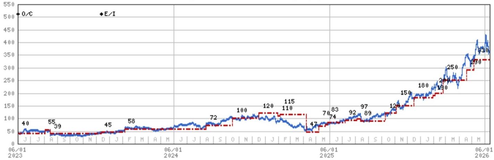

line chart

| Date       | Value |
| ---------- | ----- |
| 06/01 2023 | 40    |
|            | 55    |
|            | 39    |
|            | 45    |
|            | 58    |
|            | 72    |
|            | 100   |
|            | 120   |
|            | 115   |
|            | 110   |
|            | 47    |
|            | 70    |
|            | 83    |
|            | 74    |
|            | 92    |
|            | 97    |
|            | 89    |
|            | 120   |
|            | 150   |
|            | 180   |
|            | 200   |
|            | 250   |
|            | 290   |
|            | 330   |

Stock Rating History: 6/1/21 : E/I; 12/15/21 : 0/I; 4/12/22 : 0/C; 8/12/22 : E/C; 12/13/22 : 0/C; 12/13/23 : E/I  
Price Target History: 5/6/21 : 80; 12/15/21 : 82; 6/13/22 : 75; 8/12/22 : 59; 10/11/22 : 43; 12/13/22 : 45; 2/8/23 : 48;  
5/10/23 : 40; 8/3/23 : 55; 8/16/23 : 39; 12/13/23 : 45; 2/6/24 : 58; 8/15/24 : 72; 10/17/24 : 100; 12/17/24 : 120; 1/31/25 : 110;  
2/5/25 : 115; 4/8/25 : 47; 5/7/25 : 70; 5/22/25 : 74; 5/28/25 : 83; 7/8/25 : 92; 8/4/25 : 97; 8/13/25 : 89; 10/10/25 : 120;  
11/5/25 : 150; 12/17/25 : 180; 1/30/26 : 190; 2/4/26 : 200; 2/23/26 : 250; 4/19/26 : 290; 5/6/26 : 330  
Source: MS Date Format: MM/DD/YY Price Target No Price Target Assigned (NA)  
Stock Price (Not Covered by Current Analyst) — Stock Price (Covered by Current Analyst)  
Stock and Industry Ratings (abbreviations below) appear as ♦ Stock Rating/Industry View  
Stock Ratings: Overweight (O) Equal-weight (E) Underweight (U) Not-Rated (NR) No Rating Available (NA)  
Industry View: Attractive (A) In-line (I) Cautious (C) No Rating (NR)  
Effective January 13, 2014, the stocks covered by MS Asia Pacific will be rated relative to the analyst's industry (or industry team's) coverage.  
Effective January 13, 2014, the industry view benchmarks for MS Asia Pacific are as follows: relevant MSCI country index or MSCI sub-regional index or MSCI AC Asia Pacific ex Japan Index.

Corning Inc (GLW.N) - As of 06/12/26 GMT in USD
Industry : Telecom & Networking Equipment  
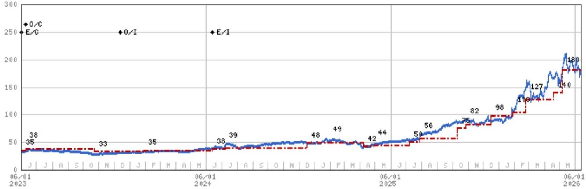

line chart

| Date       | E/C | E/I |
| ---------- | --- | --- |
| 06/01 2023 | 38  | 35  |
| 06/01 2024 | 39  | 38  |
| 06/01 2025 | 56  | 50  |
| 06/01 2026 | 180 | 140 |

Stock Rating History: 6/1/21 : E/I; 4/12/22 : E/C; 6/9/23 : 0/C; 12/13/23 : 0/I; 6/13/24 : E/I  
Price Target History: 4/27/21 : 40; 7/27/21 : 42; 10/26/21 : 40; 10/11/22 : 36; 12/13/22 : 35; 6/9/23 : 38; 10/24/23 : 33;  
1/30/24 : 35; 6/13/24 : 38; 7/8/24 : 39; 12/17/24 : 48; 1/29/25 : 49; 4/6/25 : 42; 4/29/25 : 44; 7/6/25 : 50; 7/29/25 : 56;  
10/10/25 : 75; 10/28/25 : 82; 12/17/25 : 98; 1/28/26 : 103; 2/23/26 : 127; 4/19/26 : 140; 5/7/26 : 180  
Source: MS Date Format : MM/DD/YY Price Target No Price Target Assigned (NA)  
Stock Price (Not Covered by Current Analyst) — Stock Price (Covered by Current Analyst)  
Stock and Industry Ratings (abbreviations below) appear as ♦ Stock Rating/Industry View  
Stock Ratings: Overweight (O) Equal-weight (E) Underweight (U) Not-Rated (NR) No Rating Available (NA)  
Industry View: Attractive (A) In-line (I) Cautious (C) No Rating (NR)  
Effective January 13, 2014, the stocks covered by MS Asia Pacific will be rated relative to the analyst's industry (or industry team's) coverage.  
Effective January 13, 2014, the industry view benchmarks for MS Asia Pacific are as follows: relevant MSCI country index or MSCI sub-regional index or MSCI AC Asia Pacific ex Japan Index.

Lumentum Holdings Inc (LITE.0) - As of 06/12/26 GMT in USD
Industry : Telecom & Networking Equipment  
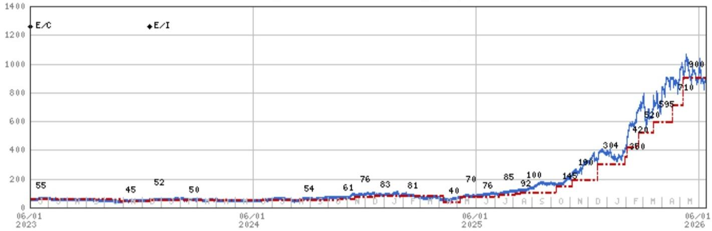

line chart

| Date       | E/C  | E/I  |
| ---------- | ---- | ---- |
| 06/01 2023 | 55   |      |
| 06/01 2024 |      |      |
| 06/01 2025 |      |      |
| 06/01 2026 | 900  |      |

Stock Rating History: 6/1/21 : E/I; 4/12/22 : E/C; 12/13/23 : E/I  
Price Target History: 5/12/21 : 81; 11/4/21 : 91; 2/3/22 : 97; 5/2/22 : 94; 8/16/22 : 96; 10/11/22 : 84; 11/6/22 : 75; 12/13/22 : 66; 4/5/23 : 60; 5/9/23 : 55; 10/27/23 : 45; 12/13/23 : 52; 2/8/24 : 50; 8/14/24 : 54; 10/17/24 : 61; 11/14/24 : 76; 12/17/24 : 83; 1/31/25 : 81; 4/6/25 : 40; 5/6/25 : 70; 6/3/25 : 76; 7/6/25 : 85; 8/4/25 : 92; 8/12/25 : 100; 10/10/25 : 145; 11/5/25 : 190; 12/17/25 : 304; 1/30/26 : 350; 2/3/26 : 420; 2/23/26 : 520; 3/18/26 : 595; 4/19/26 : 710; 5/6/26 : 900  
Source: MS Date Format : MM/DD/YY Price Target = No Price Target Assigned (NA)  
Stock Price (Not Covered by Current Analyst) — Stock Price (Covered by Current Analyst)  
Stock and Industry Ratings (abbreviations below) appear as ♦ Stock Rating/Industry View  
Stock Ratings: Overweight (O) Equal-weight (E) Underweight (U) Not-Rated (NR) No Rating Available (NA)  
Industry View: Attractive (A) In-line (I) Cautious (C) No Rating (NR)  
Effective January 13, 2014, the stocks covered by MS Asia Pacific will be rated relative to the analyst's industry (or industry team's) coverage.  
Effective January 13, 2014, the industry view benchmarks for MS Asia Pacific are as follows: relevant MSCI country index or MSCI sub-regional index or MSCI AC Asia Pacific ex Japan Index.

## Important Disclosures for MS Smith Barney LLC Customers

Important disclosures regarding any material conflict of interest that can reasonably be expected to have influenced MS Smith Barney LLC's choice of a third-party research provider or the subject company of a third-party research report, are available on the MS Wealth Management disclosure website at www.morganstanley.com/online/researchdisclosures. For MS specific disclosures, you may refer to https://www.morganstanley.com/eqr/disclosures/webapp/generalresearch.

Each MS report is reviewed and approved on behalf of MS Smith Barney LLC. This review and approval is conducted by the same person who reviews the research report on behalf of MS. This could create a conflict of interest.

## Other Important Disclosures

A member of Research who had or could have had access to the research prior to completion owns securities (or related derivatives) in the Cisco Systems Inc. This person is not a research analyst or a member of research analyst's household.

MS policy is to update research reports as and when the Research Analyst and Research Management deem appropriate, based on developments with the issuer, the sector, or the market that may have a material impact on the research views or opinions stated therein. In addition, certain Research publications are intended to be updated on a regular periodic basis (weekly/monthly/quarterly/annual) and will ordinarily be updated with that frequency, unless the Research Analyst and Research Management determine that a different publication schedule is appropriate based on current conditions.

MS is not acting as a municipal advisor and the opinions or views contained herein are not intended to be, and do not constitute, advice within the meaning of Section 975 of the Dodd-Frank Wall Street Reform and Consumer Protection Act.

MS produces an equity research product called a "Tactical Idea." Views contained in a "Tactical Idea" on a particular stock may be contrary to the recommendations or views expressed in research on the same stock. This may be the result of differing time horizons, methodologies, market events, or other factors. For all research available on a particular stock, please contact your sales representative or go to Matrix at http://www.morganstanley.com/matrix.

MS is provided to our clients through our proprietary research portal on Matrix and also distributed electronically by MS to clients. Certain, but not all, MS products are also made available to clients through third-party vendors or redistributed to clients through alternate electronic means as a convenience. For access to all available MS, please contact your sales representative or go to Matrix at http://www.morganstanley.com/matrix.

Any access and/or use of MS is subject to MS's Terms of Use (http://www.morganstanley.com/terms.html). By accessing and/or using MS, you are indicating that you have read and agree to be bound by our Terms of Use (http://www.morganstanley.com/terms.html). In addition you consent to MS processing your personal data and using cookies in accordance with our Privacy Policy and our Global Cookies Policy (http://www.morganstanley.com/privacy\_pledge.html), including for the purposes of setting your preferences and to collect readership data so that we can deliver better and more personalized service and products to you. To find out more information about how MS processes personal data, how we use cookies and how to reject cookies see our Privacy Policy and our Global Cookies Policy (http://www.morganstanley.com/privacy\_pledge.html). Please use the provided link to review the Terms and Conditions and Most Important Terms and Conditions for MS India Company Private Limited (https://www.morganstanley.com/assets/pdfs/about-us-global-offices/india/Terms\_and\_conditions.pdf) and the following link to review the audit report (https://ny.matrix.ms.com/eqr/research/webapp/researchdocs/

MSICPL\_Morgan\_Stanley\_Research\_Audit\_Report.pdf).

If you do not agree to our Terms of Use and/or if you do not wish to provide your consent to MS processing your personal data or using cookies please do not access our research. MS does not provide individually tailored investment advice. MS has been prepared without regard to the circumstances and objectives of those who receive it. MS recommends that investors independently evaluate particular investments and strategies, and encourages investors to seek the advice of a financial adviser. The appropriateness of an investment or strategy will depend on an investor's circumstances and objectives. The securities, instruments, or strategies discussed in MS may not be suitable for all investors, and certain investors may not be eligible to purchase or participate in some or all of them. MS is not an offer to buy or sell or the solicitation of an offer to buy or sell any security/instrument or to participate in any particular trading strategy. The value of and income from your investments may vary because of changes in interest rates, foreign exchange rates, default rates, prepayment rates, securities/instruments prices, market indexes, operational or financial conditions of companies or other factors. There may be time limitations on the exercise of options or other rights in securities/instruments transactions. Past performance is not necessarily a guide to future performance. Estimates of future performance are based on assumptions that may not be realized. If provided, and unless otherwise stated, the closing price on the cover page is that of the primary exchange for the subject company's securities/instruments.

The fixed income research analysts, strategists or economists principally responsible for the preparation of MS have received compensation based upon various factors, including quality, accuracy and value of research, firm profitability or revenues (which include fixed income trading and capital markets profitability or revenues), client feedback and competitive factors. Fixed Income Research analysts', strategists' or economists' compensation is not linked to investment banking or capital markets transactions performed by MS or the profitability or revenues of particular trading desks.

The "Important Regulatory Disclosures on Subject Companies" section in MS lists all companies mentioned where MS owns 1% or more of a class of common equity securities of the companies. For all other companies mentioned in MS, MS may have an investment of less than 1% in securities/instruments or derivatives of securities/instruments of companies and may trade them in ways different from those discussed in MS. Employees of MS not involved in the preparation of MS may have investments in securities/instruments or derivatives of securities/instruments of companies mentioned and may trade them in ways different from those discussed in MS. Derivatives may be issued by MS or associated persons.

With the exception of information regarding MS, MS is based on public information. MS makes every effort to use reliable, comprehensive information, but we make no representation that it is accurate or complete. We have no obligation to tell you when opinions or information in MS change apart from when we intend to discontinue equity research coverage of a subject company. Facts and views presented in MS have not been reviewed by, and may not reflect information known to, professionals in other MS business areas, including investment banking personnel.

MS personnel may participate in company events such as site visits and are generally prohibited from accepting payment by the company of associated expenses unless pre-approved by authorized members of Research management.

MS may make investment decisions that are inconsistent with the recommendations or views in this report.

To our readers based in Taiwan or trading in Taiwan securities/instruments: Information on securities/instruments that trade in Taiwan is distributed by MS Taiwan Limited ("MSTL"). Such information is for your reference only. The reader should independently evaluate the investment risks and is solely responsible for their investment decisions. MS may not be distributed to the public media or quoted or used by the public media without the express written consent of MS. Any non-customer reader within the scope of Article 7-1 of the Taiwan Stock Exchange Recommendation Regulations accessing and/or receiving MS is not permitted to provide MS to any third party (including but not limited to related parties, affiliated companies and any other third parties) or engage in any activities regarding MS which may create or give the appearance of creating a conflict of interest. Information on securities/instruments that do not trade in Taiwan is for informational purposes only and is not to be construed as a recommendation or a solicitation to trade in such securities/instruments. MSTL may not execute transactions for clients in these securities/instruments.

MS is not incorporated under PRC law and the research in relation to this report is conducted outside the PRC. MS does not constitute an offer to sell or the solicitation of an offer to buy any securities in the PRC. PRC investors shall have the relevant qualifications to invest in such securities and shall be responsible for obtaining all relevant approvals, licenses, verifications and/or registrations from the relevant governmental authorities themselves. Neither this report nor any part of it is intended as, or shall constitute, provision of any consultancy or advisory service of securities investment as defined under PRC law. Such information is provided for your reference only.

MS is disseminated in Brazil by MS C.T.V.M. S.A. located at Av. Brigadeiro Faria Lima, 3600, 6th floor, São Paulo - SP, Brazil; and is regulated by the Comissão de Valores Mobiliários; in Mexico by MS México, Casa de Bolsa, S.A. de C.V which is regulated by Comision Nacional Bancaria y de Valores. Paseo de los Tamarindos 90, Torre 1, Col. Bosques de las Lomas Floor 29, 05120 Mexico City; in Japan by MS MUFG Securities Co., Ltd. and, for Commodities related research reports only, MS Capital Group Japan Co., Ltd; in Hong Kong by MS Asia Limited (which accepts responsibility for its contents) and by MS Bank Asia Limited; in Singapore by MS Asia (Singapore) Pte. (Registration number 199206298Z) and/or MS Asia (Singapore) Securities Pte Ltd (Registration number 200008434H), regulated by the Monetary Authority of Singapore (which accepts legal responsibility for its contents and should be contacted with respect to any matters arising from, or in connection with, MS) and by MS Bank Asia Limited, Singapore Branch (Registration number T14FC0118J); in Australia to "wholesale clients" within the meaning of the Australian Corporations Act by MS Australia Limited A.B.N. 67 003 734 576, holder of Australian financial services license No. 233742, which accepts responsibility for its contents; in Australia to "wholesale clients" and "retail clients" within the meaning of the Australian Corporations Act by MS Wealth Management Australia Pty Ltd (A.B.N. 19 009 145 555, holder of Australian financial services license No. 24-0813, which accepts responsibility for its contents; in Korea by MS & Co International plc, Seoul Branch; in India by MS India Company Private Limited having Corporate Identification No (CIN) U22990MH1998PTC115305, regulated by the Securities and Exchange Board of India ("SEBI") and holder of licenses as a Research Analyst (SEBI Registration No. INH000001105); Stock Broker (SEBI Stock Broker Registration No. INZ000244438), Merchant Banker (SEBI Registration No. INM000011203), and depository participant with National Securities Depository Limited (SEBI Registration No. IN-DP-NSDL-567-2021) having registered office at Altimus, Level 39 & 40, Pandurang Budhkar Marg, Worli, Mumbai 400018, India; Telephone no. +91-22-61181000; Compliance Officer Details: Mr. Tejarshi Hardas, Tel. No.: +91-22-61181000 or Email: tejarshi.hardas@morganstanley.com; Grievance officer details: Mr. Tejarshi Hardas, Tel. No.: +91-22-61181000 or Email: msic-compliance@morganstanley.com. MS India Company Private Limited (MSICPL) may use AI tools in providing research services. All recommendations contained herein are made by the duly qualified research analysts; in Canada by MS Canada Limited; in Germany and the European Economic Area where required by MS Europe S.E., authorised and regulated by Bundesanstalt fuer Finanzdienstleistungsaufsicht (BaFin) under the reference number 149169; in the US by MS & Co. LLC, which accepts responsibility for its contents. MS & Co. International plc, authorized by the Prudential Regulation Authority and regulated by the Financial Conduct Authority and the Prudential Regulation Authority, disseminates in the UK research that it has prepared, and research which has been prepared by any of its affiliates, only to persons who (i) are investment professionals falling within Article 19(5) of the Financial Services and Markets Act 2000 (Financial Promotion) Order 2005 (as amended, the "Order"); (ii) are persons who are high net worth entities falling within Article 49(2)(a) to (d) of the Order; or (iii) are persons to whom an invitation or inducement to engage in investment activity (within the meaning of section 21 of the Financial Services and Markets Act 2000, as amended) may otherwise lawfully be communicated or caused to be communicated. RMB MS Proprietary Limited is a member of the JSE Limited and A2X (Pty) Ltd. RMB MS Proprietary Limited is a joint venture owned equally by MS International Holdings Inc. and RMB Investment Advisory (Proprietary) Limited, which is wholly owned by FirstRand Limited. The information in MS is being disseminated by MS Saudi Arabia, regulated by the Capital Market Authority in the Kingdom of Saudi Arabia, and is directed at Sophisticated investors only.

The information in MS is being communicated by MS & Co. International plc (DIFC Branch), regulated by the Dubai Financial Services Authority (the DFSA) or by MS & Co. International plc (ADGM Branch), regulated by the Financial Services Regulatory Authority Abu Dhabi (the FSRA), and is directed at Professional Clients only, as defined by the DFSA or the FSRA, respectively. The financial products or financial services to which this research relates will only be made available to a customer who we are satisfied meets the regulatory criteria of a Professional Client. A distribution of the different MS Research ratings or recommendations, in percentage terms for Investments in each sector covered, is available upon request from your sales representative.

The information in MS is being communicated by MS & Co. International plc (QFC Branch), regulated by the Qatar Financial Centre Regulatory Authority (the QFCRA), and is directed at business customers and market counterparties only and is not intended for Retail Customers as defined by the QFCRA.

As required by the Capital Markets Board of Turkey, investment information, comments and recommendations stated here, are not within the scope of investment advisory activity. Investment advisory service is provided exclusively to persons based on their risk and income preferences by the authorized firms. Comments and recommendations stated here are general in nature. These opinions may not fit to your financial status, risk and return preferences. For this reason, to make an investment decision by relying solely to this information stated here may not bring about outcomes that fit your expectations.

The trademarks and service marks contained in MS are the property of their respective owners. Third-party data providers make no warranties or representations relating to the accuracy, completeness, or timeliness of the data they provide and shall not have liability for any damages relating to such data. The Global Industry Classification Standard (GICS) was developed by and is the exclusive property of MSCI and S&P.

MS, or any portion thereof may not be reprinted, sold or redistributed without the written consent of MS.

Indicators and trackers referenced in MS may not be used as, or treated as, a benchmark under Regulation EU 2016/1011, or any other similar framework.

The issuers and/or fixed income products recommended or discussed in certain fixed income research reports may not be continuously followed. Accordingly, investors should regard those fixed income research reports as providing stand-alone analysis and should not expect continuing analysis or additional reports relating to such issuers and/or individual fixed income products. MS may hold, from time to time, material financial and commercial interests regarding the company subject to the Research report.

Registration granted by SEBI and certification from the National Institute of Securities Markets (NISM) in no way guarantee performance of the intermediary or provide any assurance of returns to investors. Investment in securities market are subject to market risks. Read all the related documents carefully before investing.

INDUSTRY COVERAGE: Telecom & Networking Equipment

<table><tr><td>COMPANY (TICKER)</td><td>RATING (AS OF)</td><td>PRICE* (06/11/2026)</td></tr><tr><td colspan="3">Meta A Marshall</td></tr><tr><td>Arista Networks (ANET.N)</td><td>O (10/31/2023)</td><td>$156.40</td></tr><tr><td>Axon Enterprise Inc (AXON.O)</td><td>O (12/03/2024)</td><td>$446.20</td></tr><tr><td>Ciena Corporation (CIEN.N)</td><td>E (10/10/2025)</td><td>$445.22</td></tr><tr><td>Cisco Systems Inc (CSCO.O)</td><td>O (04/08/2024)</td><td>$121.83</td></tr><tr><td>Coherent Corp (COHR.N)</td><td>E (12/13/2023)</td><td>$363.58</td></tr><tr><td>Corning Inc (GLW.N)</td><td>E (06/13/2024)</td><td>$176.55</td></tr><tr><td>F5 Inc (FFIV.O)</td><td>E (04/12/2022)</td><td>$393.84</td></tr><tr><td>Keysight Technologies Inc (KEYS.N)</td><td>E (10/10/2025)</td><td>$340.03</td></tr><tr><td>Lumentum Holdings Inc (LITE.O)</td><td>E (05/12/2021)</td><td>$889.59</td></tr><tr><td>Motorola Solutions Inc (MSI.N)</td><td>O (12/17/2025)</td><td>$410.35</td></tr><tr><td>Zebra Technologies Corporation (ZBRA.O)</td><td>E (12/02/2024)</td><td>$222.44</td></tr></table>

Stock Ratings are subject to change. Please see latest research for each company.  
\* Historical prices are not split adjusted.

© 2026 MS