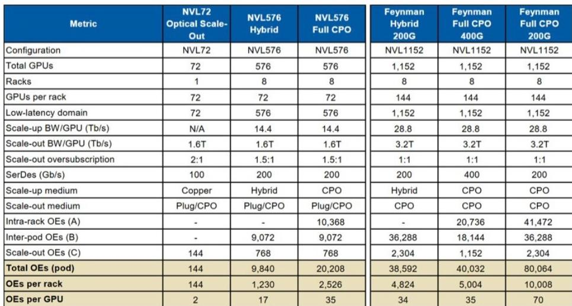
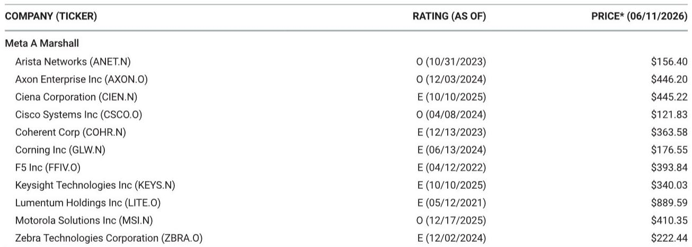

# Optical Content Is Growing Regardless of Architecture — The Market Is Debating the Wrong Question

The market has spent the last several weeks fixated on a single question: when will co-packaged optics arrive at scale? That debate has created meaningful volatility in Lumentum, Coherent, and Corning, as investors try to time an inflection point that keeps shifting. But the fixation on timing has obscured a far more important structural reality: optical content per GPU is rising, and it is rising independent of which architecture ultimately wins.

The debate between near-packaged optics and co-packaged optics is a distraction. What matters is that bandwidth demand is the true driver. Whether the industry lands on 2.5D CPO, 3D CPO, NPO, or on-board optics, the number of optical engines per GPU is set to increase by an order of magnitude from today's levels. The architecture debate determines the exact path, but the direction is already locked in.

This is not a forecast about 2028. The optical content expansion is already embedded in the current generation of scale-up architectures. The NVL576 configuration, which is being deployed today, already requires roughly 17 optical engines per GPU. That is up from just 2 to 4 in the prior generation. A fully optical variant would push that number to 35. And if SerDes speeds remain at 200G rather than moving to 400G in future architectures, that number could double again to 70.

The market is treating the CPO timeline debate as a binary event — either it happens in 2028 or it does not. But the optical content expansion does not wait for CPO to achieve mainstream adoption. It is happening now, in hybrid architectures, and it will accelerate regardless of which packaging technology ultimately dominates.

## The Bandwidth Imperative Overwhelms the Architecture Debate

The core insight that the market is underweighting is simple but powerful: optical content is not a function of packaging choice. It is a function of bandwidth requirements. As data center operators push toward higher bandwidth per GPU, they must move from copper to optical interconnects. The only question is at what point in the signal chain the optical conversion happens.

Current architectures use 2 to 4 pluggable transceivers per GPU, all in the scale-out network. The NVL576 hybrid architecture introduces CPO for inter-rack scale-up traffic, lifting the optical engine attach rate to approximately 17 per GPU. A fully optical variant, where the connection between GPU and the networking switch also moves to photonics, roughly doubles that to 35. Looking ahead to future architectures, optical engines per GPU could remain at that level if SerDes speeds move to 400G, but could double again if SerDes stays at 200G.

This is not a speculative projection. The NVL576 architecture is already being deployed. The optical content increase is already happening. The debate about whether CPO arrives in 2028 or 2029 is a debate about the marginal timing of the next leg of growth, not about whether the growth exists at all.

The market has been too quick to extrapolate CPO adoption delays into a bearish thesis for optical component vendors. But CPO is just one pathway. NPO, on-board optics, and other intermediate architectures all require more optical content than the current generation. The vendors that supply lasers, optical engines, and photonic components benefit from the bandwidth-driven expansion regardless of which architecture wins.

## The CPO Timeline Is a Timing Question, Not a Demand Question

The report makes clear that adoption and timing have always been in question. Expectations for CPO demand in 2027 are closer to 6 to 7 million optical engines, which is well below some bullish investor expectations of 20 to 30 million. That gap has caused volatility. But the gap between 6 million and 30 million is a gap in the forecast for 2027, not a gap in the long-term trajectory.

The CPO switch forecast shows a compound annual growth rate of 144% from 2024 to 2028. That is a rapid adoption curve by any standard. The fact that some investors expected an even steeper curve does not mean the actual curve is disappointing. It means the market had unrealistic near-term expectations that are now being corrected.

More importantly, the CPO forecast only captures one specific form of optical integration. The broader optical content expansion includes NPO, on-board optics, and hybrid architectures that combine copper and optical interconnects. The total addressable market for optical components is significantly larger than the CPO-specific forecast.

The report notes that given commitments of capacity as part of Nvidia's equity investments in Lumentum, Coherent, and Corning, it is unlikely that demand can simply be swapped from one vendor to another. These three vendors are structurally positioned to benefit from the increase in optical content, particularly as it enters the scale-up domain. The capacity commitments create a degree of revenue visibility that the market may be underestimating.

## NPO Is Not a Competitor to CPO — It Is a Stepping Stone

One of the most persistent misconceptions in the market is that NPO and CPO are competing architectures. They are not. NPO is a path toward eventual CPO or interposer-based integration. The transition from pluggable optics to on-board optics to near-package optics to 2.5D CPO to 3D CPO is a progression, not a set of mutually exclusive alternatives.

The key bottlenecks to CPO production scaling are silicon-on-interposer yield, which is currently 50 to 60%, and downstream assembly yield, which is 20 to 50%. These yields are not acceptable for volume production. NPO addresses these bottlenecks by keeping the packaging separate, which reduces production complexity, improves assembly yields, and allows customers to more easily fix optical components that are not working.

Putting optics on the board is not trivial, but it is a step function easier than CPO. NPO also allows the optical engine to be purchased separately from the GPU or XPU, which enables a more open ecosystem. This is strategically important because it prevents the complete concentration of optical supply chain economics in the hands of a small number of vertically integrated vendors.

The market should view NPO not as a threat to the CPO thesis, but as an intermediate solution that accelerates the adoption of optical content. NPO gets optics into the system earlier, builds the supply chain, and reduces the risk of CPO adoption. Every NPO deployment today creates demand for optical engines, lasers, and photonic components. That demand exists regardless of when CPO reaches mainstream adoption.

## The Unanswered Question: How Much Optical Content Can the Supply Chain Support?

The report identifies the key challenges to CPO adoption: low yields, high costs, lack of ecosystem maturity, and difficulty of maintenance. These are real constraints. But the report leaves an important question unanswered: what is the realistic capacity of the optical supply chain to support the projected growth in optical engines?

The forecast calls for 6 to 7 million optical engines of demand in 2027. That is a significant number, but it is not unreasonable given the current supply chain. The more interesting question is what happens when optical engines per GPU rise to 35 or 70. At that point, the total number of optical engines required for a single large-scale deployment could exceed the entire current production capacity of the industry.

The report does not fully address the supply chain implications of the bull case scenario. If optical engines per GPU reach 70 in future architectures, the industry would need to scale production by roughly 35 times from current levels. That would require massive capital investment, new manufacturing capacity, and significant improvements in yield. The timeline for that scaling is uncertain, and it could create bottlenecks that delay adoption even if the technology is ready.

Investors should watch for signs that the supply chain is preparing for this scale-up. Capacity commitments, capital expenditure guidance, and yield improvement trajectories from key component vendors will be more important indicators than the exact timeline of CPO adoption.

## A Decision Framework for Investors: Three Questions to Ask

The report provides the data and analysis, but it does not translate it into an actionable framework for decision-making. Here is how investors should think about the optical content opportunity.

First, distinguish between timing risk and demand risk. The market is currently pricing in significant timing risk, as evidenced by the volatility in optical component stocks. But timing risk is fundamentally different from demand risk. If the only question is whether adoption happens in 2028 or 2029, the long-term thesis remains intact. The correct response to timing risk is to size positions appropriately and be patient, not to abandon the thesis entirely.

Second, evaluate vendors based on their exposure to bandwidth growth, not their CPO-specific positioning. The report identifies Lumentum, Coherent, and Corning as beneficiaries of optical content expansion regardless of architecture. These vendors supply lasers, optical engines, and photonic components that are required across NPO, CPO, and hybrid architectures. Their revenue growth is tied to the number of optical engines deployed, not to the specific packaging technology used.

Third, monitor the yield and cost trajectory of CPO manufacturing. The current yields of 50 to 60% for silicon-on-interposer and 20 to 50% for downstream assembly are the primary constraints on CPO adoption. If these yields improve faster than expected, the CPO timeline could accelerate. If they remain stubbornly low, NPO and other intermediate architectures will capture more of the market. Either way, optical content grows. The question is how fast and through which pathway.

## The Full Report Answers Questions This Article Cannot

This article has argued that the market is debating the wrong question. The architecture debate matters for timing, but it does not change the direction of travel. Optical content per GPU is rising, and it will continue to rise as bandwidth demands increase.

But there are important questions that this article cannot fully address. How do the specific yield improvement trajectories differ across vendors? What is the exact optical engine content per vendor for each architecture scenario? How do the economics of NPO compare to CPO at different production volumes? What are the specific capacity commitments from Nvidia's equity investments, and how do they lock in demand for Lumentum, Coherent, and Corning?

The original report contains detailed exhibits that answer these questions. It includes the specific optical engine calculations for each rack architecture, the yield assumptions for CPO production, and the valuation methodology for each covered company. These details matter for investors who want to build conviction in their positions.

Join the community to read the full report and review the original charts.

*This article is for learning and discussion only and does not constitute investment advice.*

Personal reading notes and learning share only. Not investment advice.

