## Global Music

# Global Music: The Long View - Super fan economics, why concerts are now BTS company's center of gravity

Min-Joo Kang

+852 2123 2644

minjoo.kang@bernsteinsg.com

Robin Zhu

+852 2123 2659

robin.zhu@bernsteinsg.com

Ian Moore

+1 917 344 8434

ian.moore@bernsteinsg.com

David Dai, CFA

+852 2918 5704

david.dai@bernsteinsg.com

Christophe Cherblanc

+41 582 723 540

christophe.cherblanc@bernsteinsg.com

Charles Gou

+852 2123 2618

charles.gou@bernsteinsg.com

Hyrum Caesar

+81 3 6777 6979

hyrum.caesar@bernsteinsg.com

Nosher Ali Khan

+1 917 344 8578

nosher-ali.khan@bernsteinsg.com

Jack Lin

+852 2123 2683

jack.lin@bernsteinsg.com

Christopher Pancur

+44 20 7676 7280

christopher.pancur@bernsteinsg.com

K-pop has moved from a unit-driven business to a moment economy where fans spend less on albums and more on live, time-bound experiences with their artists. As the perceived value of emotional return per hour rises, concerts have become the natural center of gravity for industry monetization. Hybe demonstrates this shift at scale, using each show as a platform to monetize fandom across tickets, merch, and digital content.

“Moment” economy: Concerts take the wheel in K-pop. K-pop fandom has shifted from buying albums to buying time with their artists, with spend increasingly flowing to live moments rather than physical units, built around monetizing real-time interaction between fans and artists. In this framework, concert revenue becomes the natural center of gravity for the industry’s profit pool as the model rotates from unit-based albums to platforms that can repeatedly monetize live, time-bound fan engagement at scale.

Fans paying for time: Why experiences beat physical goods. The perceived value of time is rising even as the real value of a dollar is squeezed, pushing consumers toward experiences that maximize their emotional return per hour. In K-pop, intense fandom, social signaling, and constant digital sharing mean a 2-3 hour show throws off months of residual value through clips, interactions with the artist, and ongoing community engagement, supporting ticket and bundle pricing that would look excessive for any standalone product.

Filling seats, owning screens: How Hybe monetizes every moment. Hybe has turned BTS fandom into hard crowd-pulling power, filling 50k-capacity venues and selling out 80+ shows, so that every night on tour seeds a high-margin online profit pool in streaming, buzz, and digital content. Its 300+ concerts over 50+ cities looks beyond a local label calendar. BTS's latest comeback crystallises the model: a new album, a physical comeback stage, and instant dominance on global platforms show how a single IP can move the content value chain, shift bargaining power to the IP owner, and monetize fan consumption across Spotify, Netflix, and beyond.

Monetizing the hype: Hybe's concert-plus-merch profit engine. Concert revenue is usually a low-margin business once you factor in staging costs and promoter revenue share, but large-fandom IPs flip that script. In Hybe's case, each show is treated as a monetization node for a full stack of revenue streams: tickets, VIP and soundcheck packages, tour-exclusive merch, fan club memberships, and digital content layered on top. Hybe also benefits from structurally higher margins, retaining a greater share of tour economics as its global scale reduces reliance on local promoters.

Streaming to Stadiums: Unlocking superfan lifetime value. K-pop superfan monetization is becoming a powerful flywheel for both Spotify and Live Nation, converting high-ARPU digital engagement directly into live revenue. These fans already spend heavily, making them ideal for Spotify's premium upsell, while tools like Reserved seamlessly channel them into concerts, where they drive above-average pricing and sell-through. Spotify monetizes the fan online, Live Nation monetizes them offline, and together they maximize lifetime value.

BERNSTEIN TICKER TABLE

<table><tr><td rowspan="2">Ticker</td><td rowspan="2">Rating</td><td colspan="3">12 Jun 2026</td><td rowspan="2">TTMRel.</td><td colspan="4">Reported EPS</td><td colspan="3">Reported P/E (x)</td></tr><tr><td>Cur</td><td>Closing Price</td><td>Price Target</td><td>Cur</td><td>2025A</td><td>2026E</td><td>2027E</td><td>2025A</td><td>2026E</td><td>2027E</td></tr><tr><td>352820.KS (Hybe)</td><td>O</td><td>KRW</td><td>228,000</td><td>400,000</td><td>(63.7)%</td><td colspan="2">KRW (5,713.11)</td><td>10,055</td><td>10,175</td><td>(39.9)</td><td>22.7</td><td>22.4</td></tr><tr><td>LYV (Live Nation)</td><td>O</td><td>USD</td><td>172.51</td><td>200.00</td><td>(0.9)%</td><td>USD</td><td>(0.24)</td><td>0.24</td><td>2.84</td><td>(729.5)</td><td>710.6</td><td>60.8</td></tr><tr><td>SPOT (Spotify )</td><td>O</td><td>USD</td><td>482.00</td><td>625.00</td><td>(54.3)%</td><td>EUR</td><td>10.51</td><td>12.78</td><td>16.16</td><td>39.7</td><td>32.6</td><td>25.8</td></tr><tr><td>6758.JP (Sony)</td><td>M</td><td>JPY</td><td>3,292.00</td><td>3,500.00</td><td>(52.6)%</td><td>JPY</td><td>171.30</td><td>198.75</td><td>207.66</td><td>19.2</td><td>16.6</td><td>15.9</td></tr><tr><td>SONY (Sony )</td><td>M</td><td>USD</td><td>20.53</td><td>22.00</td><td>(43.2)%</td><td>USD</td><td>1.08</td><td>1.25</td><td>1.30</td><td>19.1</td><td>16.4</td><td>15.7</td></tr><tr><td>UMG.NA (Universal Music)</td><td>O</td><td>EUR</td><td>17.76</td><td>29.00</td><td>(52.5)%</td><td>EUR</td><td>1.03</td><td>1.09</td><td>1.17</td><td>17.3</td><td>16.4</td><td>15.1</td></tr><tr><td>ASIAX</td><td></td><td></td><td>1,966.72</td><td></td><td></td><td></td><td></td><td></td><td></td><td></td><td></td><td></td></tr><tr><td>SPX</td><td></td><td></td><td>7,431.46</td><td></td><td></td><td></td><td></td><td></td><td></td><td></td><td></td><td></td></tr><tr><td>JPL</td><td></td><td></td><td>2,549.03</td><td></td><td></td><td></td><td></td><td></td><td></td><td></td><td></td><td></td></tr><tr><td>EDME</td><td></td><td></td><td>1,570.59</td><td></td><td></td><td></td><td></td><td></td><td></td><td></td><td></td><td></td></tr></table>

O - Outperform, M - Market-Perform, U - Underperform, NR - Not Rated, CS - Coverage Suspended 352820.KS, UMG.NA estimate is Adjusted EPS; 352820.KS, UMG.NA valuation is Adjusted P/E (x); Source: Bloomberg, Bernstein estimates and analysis.

## INVESTMENT IMPLICATIONS

We rate Hybe (352820.KS) Outperform.

We rate SPOT & LYV Outperform.

We rate Sony Market-Perform with PT = ¥3,500.00.

We rate UMG Outperform.

## VALUATION COMPS TABLE

EXHIBIT 1: Asia Internet: valuation summary

<table><tr><td></td><td>Rating</td><td>Price target</td><td>Last price</td><td>Crncy</td><td>Market cap (US$mn)</td><td>2026E</td><td>PE 2027E</td><td>2028E</td><td>2026E</td><td>EV/sales 2027E</td><td>2028E</td></tr><tr><td colspan="12">China Internet coverage</td></tr><tr><td>Tencent</td><td>O</td><td>780</td><td>463.60</td><td>HKD</td><td>538,857</td><td>13.5x</td><td>11.6x</td><td>10.0x</td><td>4.4x</td><td>3.8x</td><td>3.3x</td></tr><tr><td>PDD</td><td>M</td><td>110</td><td>81.56</td><td>USD</td><td>116,092</td><td>7.5x</td><td>6.7x</td><td>6.0x</td><td>0.6x</td><td>0.4x</td><td>0.1x</td></tr><tr><td>Meituan</td><td>M</td><td>85</td><td>77.90</td><td>HKD</td><td>61,384</td><td>174.5x</td><td>16.2x</td><td>9.4x</td><td>0.8x</td><td>0.7x</td><td>0.6x</td></tr><tr><td>NetEase</td><td>O</td><td>150</td><td>125.82</td><td>USD</td><td>80,289</td><td>13.8x</td><td>12.9x</td><td>12.2x</td><td>3.3x</td><td>3.0x</td><td>2.8x</td></tr><tr><td>Boss Zhipin</td><td>O</td><td>18</td><td>13.70</td><td>USD</td><td>6,625</td><td>11.1x</td><td>9.2x</td><td>8.2x</td><td>2.6x</td><td>1.8x</td><td>1.3x</td></tr><tr><td>JD</td><td>O</td><td>40</td><td>28.56</td><td>USD</td><td>39,008</td><td>9.2x</td><td>6.8x</td><td>5.1x</td><td>0.2x</td><td>0.2x</td><td>0.2x</td></tr><tr><td>Alibaba</td><td>O</td><td>180</td><td>112.82</td><td>USD</td><td>270,670</td><td>28.3x</td><td>16.6x</td><td>14.1x</td><td>1.8x</td><td>1.7x</td><td>1.6x</td></tr><tr><td colspan="12">China Internet other</td></tr><tr><td>Kuaishou</td><td></td><td></td><td>45.88</td><td>HKD</td><td>25,396</td><td>10.4x</td><td>9.2x</td><td>8.1x</td><td>1.0x</td><td>0.9x</td><td>0.9x</td></tr><tr><td>Bilibili</td><td></td><td></td><td>17.86</td><td>USD</td><td>7,591</td><td>17.3x</td><td>13.6x</td><td>10.5x</td><td>1.1x</td><td>1.0x</td><td>0.9x</td></tr><tr><td>TME</td><td></td><td></td><td>9.22</td><td>USD</td><td>15,319</td><td>9.5x</td><td>8.6x</td><td>7.8x</td><td>2.0x</td><td>1.8x</td><td>1.7x</td></tr><tr><td>Baidu</td><td></td><td></td><td>115.77</td><td>USD</td><td>39,391</td><td>15.6x</td><td>13.2x</td><td>10.6x</td><td>1.2x</td><td>1.1x</td><td>1.0x</td></tr><tr><td>VIPshop</td><td></td><td></td><td>13.92</td><td>USD</td><td>6,685</td><td>5.4x</td><td>5.2x</td><td>5.0x</td><td>0.2x</td><td>0.2x</td><td>0.2x</td></tr><tr><td>Tencent Music</td><td></td><td></td><td>9.22</td><td>USD</td><td>15,319</td><td>9.5x</td><td>8.6x</td><td>7.8x</td><td>2.0x</td><td>1.8x</td><td>1.7x</td></tr><tr><td>Trip.com</td><td></td><td></td><td>46.47</td><td>USD</td><td>29,262</td><td>11.3x</td><td>9.9x</td><td>8.8x</td><td>2.3x</td><td>2.0x</td><td>1.8x</td></tr><tr><td>KE Holdings</td><td></td><td></td><td>16.89</td><td>USD</td><td>19,547</td><td>19.3x</td><td>16.5x</td><td>16.5x</td><td>1.1x</td><td>1.1x</td><td>1.1x</td></tr><tr><td colspan="12">Asian Internet</td></tr><tr><td>Naver</td><td>O</td><td>330,000</td><td>242,500</td><td>KRW</td><td>25,076</td><td>17.5x</td><td>15.9x</td><td>14.1x</td><td>1.9x</td><td>1.6x</td><td>1.4x</td></tr><tr><td>Kakao</td><td>O</td><td>80,000</td><td>40,900</td><td>KRW</td><td>11,910</td><td>23.0x</td><td>20.3x</td><td>16.7x</td><td>1.3x</td><td>1.0x</td><td>0.7x</td></tr><tr><td>Hybe</td><td>O</td><td>400,000</td><td>228,000</td><td>KRW</td><td>6,478</td><td>22.7x</td><td>22.4x</td><td>18.3x</td><td>1.5x</td><td>1.7x</td><td>1.4x</td></tr><tr><td>Coupang</td><td>U</td><td>12</td><td>16.82</td><td>USD</td><td>30,193</td><td>-45.9x</td><td>72.3x</td><td>36.4x</td><td>0.7x</td><td>0.6x</td><td>0.6x</td></tr><tr><td>Sea Ltd.</td><td></td><td></td><td>82.94</td><td>USD</td><td>50,799</td><td>22.2x</td><td>16.2x</td><td>12.9x</td><td>1.5x</td><td>1.2x</td><td>1.0x</td></tr><tr><td>Grab</td><td></td><td></td><td>3.30</td><td>USD</td><td>13,532</td><td>32.0x</td><td>21.4x</td><td>15.9x</td><td>2.3x</td><td>1.9x</td><td>1.6x</td></tr><tr><td colspan="12">US Internet</td></tr><tr><td>Amazon</td><td></td><td></td><td>238.55</td><td>USD</td><td>2,566,108</td><td>23.1x</td><td>20.6x</td><td>16.8x</td><td>3.2x</td><td>2.8x</td><td>2.6x</td></tr><tr><td>Alphabet</td><td></td><td></td><td>359.68</td><td>USD</td><td>4,369,972</td><td>25.2x</td><td>23.6x</td><td>19.5x</td><td>10.3x</td><td>8.5x</td><td>7.2x</td></tr><tr><td>Meta</td><td></td><td></td><td>566.98</td><td>USD</td><td>1,439,235</td><td>16.0x</td><td>14.7x</td><td>12.2x</td><td>5.7x</td><td>4.8x</td><td>4.1x</td></tr><tr><td>Netflix</td><td></td><td></td><td>80.34</td><td>USD</td><td>338,296</td><td>22.6x</td><td>20.8x</td><td>17.5x</td><td>6.7x</td><td>6.0x</td><td>5.4x</td></tr><tr><td>Uber</td><td></td><td></td><td>68.85</td><td>USD</td><td>140,151</td><td>21.2x</td><td>15.4x</td><td>12.5x</td><td>2.5x</td><td>2.2x</td><td>1.9x</td></tr><tr><td>Spotify</td><td></td><td></td><td>482.00</td><td>USD</td><td>99,211</td><td>32.5x</td><td>26.4x</td><td>21.6x</td><td>4.0x</td><td>3.5x</td><td>3.1x</td></tr><tr><td>DoorDash</td><td></td><td></td><td>150.58</td><td>USD</td><td>65,611</td><td>32.3x</td><td>21.9x</td><td>17.0x</td><td>3.6x</td><td>3.0x</td><td>2.5x</td></tr></table>

Pricing date June 12, 2026. The valuation multiples of our China and Asian Internet coverage are based on Bernstein estimates; the other companies shown reflect Bloomberg consensus estimates.  
Source: Corporate reports, Bloomberg, Bernstein estimates and analysis.

## DETAILS

## SUPER FAN ECONOMICS, WHY CONCERTS ARE NOW K-POP'S CENTER OF GRAVITY

K-pop's first generation emerged in the 1990s, led by SM Entertainment, with flagship IPs such as H.O.T. and S.E.S. defining the early idol model. Fan engagement was largely physical - album collecting, cable TV viewership, and intimate fan meetings and concerts. BoA marked the first true breakout at a regional level, paving the way for broader expansion. By the second generation, the industry had deepened its talent bench, building a pipeline of skilled producers and tiered regional IPs. That said, monetization remained heavily skewed toward physical album sales, which continued to anchor K-pop consumption through this period.

Over the past two decades, as K-pop evolved from 1st to 3rd to 4th generation, K-pop fandom has shifted from buying albums to buying time with their artists, with spend now flowing to live “moments” rather than physical units. As the value of time rises, fans are willing to pay up for experiences, making concert revenue the natural center of gravity for the industry’s profit pool. We see this “moment economy” - monetizing real-time interaction between fandom and artists via concerts and live formats - as the core money-making engine of modern K-pop, with Hybe at the forefront of capturing that value. With BTS returning as a global IP, concert revenue is set to become Hybe’s key earnings driver in 2026-2027, shifting investor focus from unit-based models to platforms that can repeatedly monetize live, time-bound fan engagement at scale.

## Fans paying for time... why experiences beat physical goods

As asset prices inflate, the true bottleneck is no longer capital - it is “time”. As time scarcity rises, its value compounds, while the relative value of physical goods declines. In this context, artist management is fundamentally about optimizing time: maximizing how artist hours are allocated and, more importantly, monetized.

At the same time, fandom willingness to pay for access, interaction, and shared moments is structurally increasing. This is already evident at Hybe, where even newly incubated IPs are commanding concert ticket prices comparable to global-tier acts. The implication is clear: the priority is no longer just maximizing artist output, but fully monetizing every touchpoint between artist and fandom. Concerts sit at the core, but the opportunity extends across all live and semi-live interactions.

This dynamic is reinforced by the rising “emotional return per hour.” In K-pop, a 2-3 hour concert does not end when the show finishes - it compounds through social sharing, fan content, and ongoing community engagement, effectively stretching a single event into months of monetizable value. This supports premium pricing not just for tickets, but for bundled experiences.

Hybe's BTS tour is a live case study: more than 80 global shows, every ticket sold, with scarcity turning each night into a prized "slice" of the artists' time that fans are eager to pay for. That willingness to buy the experience, layered on top of the scarcity of artist time, is driving a step-up in concert monetization and spilling into the online arena, as seen in the Arirang comeback where BTS took positions 1-14 on Spotify's global daily chart and the Netflix live special quickly hit the global no.1 spot.

## Filling seats, owning screens...how Hybe monetizes every moment

The global scaling of K-pop IP into franchise-level assets has laid the foundation for mainstream penetration. What began as a regional content export has evolved into a globally consumable live experience, with fandom expanding both geographically and in intensity. The data clearly points to a structural shift in monetization. Since 2015, industry revenue mix has steadily tilted toward concerts, with live events taking an increasing share of the profit pool through 2026E. This reweighting reflects a deeper behavioral change: fans are moving from product ownership to experience consumption, with concerts emerging as the core monetization layer.

K-pop is now a meaningful force on the global touring stage. Its share of the Top 100 global tours is approaching \~10%, underscoring both rising demand and increasing pricing power. This is no longer a niche category - K-pop is scaling within the global live entertainment ecosystem. Within this, Hybe is the clear market leader, commanding c.70% of K-pop concert revenue. Its scale advantage is translating into global positioning, effectively placing the company within a structurally expanding live market rather than a domestic idol industry. The post-2022 recovery marks a clear inflection. As global touring resumed, concert revenue has outpaced both album and digital growth, signaling that fandom expansion is increasingly monetized through live formats. This growth is not cyclical, but structural, driven by a larger and more engaged global fan base.

Importantly, the monetization opportunity is compounding. A more engaged "super fan" base is supporting higher spend per capita, opening incremental layers of IP monetization beyond ticket sales across merchandise, digital content, and ongoing

engagement loops.

Hybe has operationalized this at scale. The company consistently fills 50k-capacity venues and executes high-density tour schedules, with over 80 sold-out shows and 279 concerts across 53 cities in 2024 alone. This cadence resembles a global promoter model. Each offline event acts as a demand engine, seeding high-margin digital monetization through streaming, social amplification, and content recycling.

BTS represents the clearest expression of this model. Each comeback is orchestrated as a multi-platform global event: album release, live stage, and immediate chart dominance. The impact cascades across the value chain, reinforcing HYBE's bargaining power as an IP owner while driving simultaneous monetization across both offline and online channels.

The latest cycle illustrates the scalability. A full album sweep on global charts, paired with a Netflix live special and a global stadium tour, positions BTS as a repeatable touring franchise rather than a one-off act. With peak comeback revenue of \~KRW 1.5tn and a resilient long tail from catalog and streaming, BTS anchors HYBE's live earnings engine and underwrites its medium-term growth visibility.

EXHIBIT 2: Over the past two decades, as K-pop evolved from 1st to 3rd to 4th generation, K-pop fandom has shifted from buying albums to buying time with their artists, with spend now flowing to live “moments” rather than physical units.  
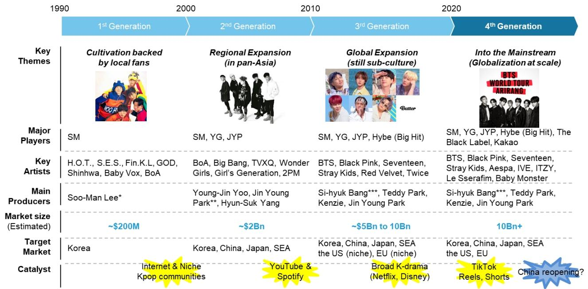  
Note 1: Market size is based on our estimation. Note 2: \*Founder of SM Entertainment, \*\* Founder of JYP, \*\*\* Founder of HYBE (previously, Mr. Bang was JYP producer).  
Source: Bernstein estimates and analysis.

EXHIBIT 3: Hybe has a clear strategic positioning and execution capability to scale in Western markets.  

\- The K-pop training system and processes will be implemented in local markets to incubate new artists, enhancing localization efforts vs. end-to-end process in Korea (e.g. Hybe's Multi-home, Multi-genre strategy).

\- K-pop companies organically gaining their popularity and bargaining power as global entertainment players and music platforms invest in K-pop music. (e.g. UMG has exclusive global distribution rights for Hybe's music)

\- In order to attract larger scale of global fandom, new contents will be more focusing on western mainstream audiences with collaborative works with the foreign producers and artists.

Source: Bernstein analysis.

EXHIBIT 4: K-pop is the most promising subsector within Korea's internet industry, driven by the global expansion of K-pop artists' large-scale international tours.  
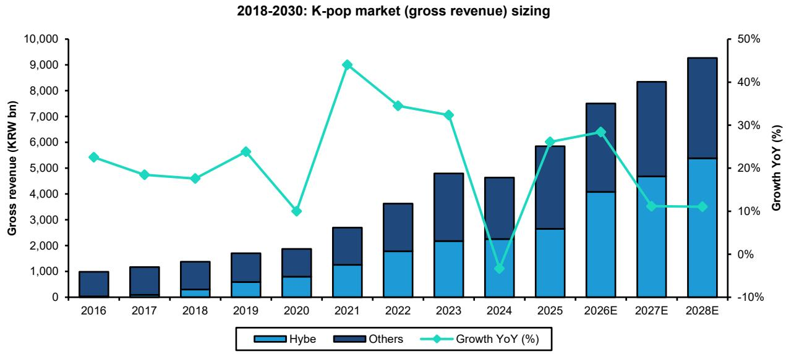

bar-line hybrid

2018-2030: K-pop market (gross revenue) sizing
| Year | Hybe (KRW bn) | Others (KRW bn) | Growth YoY (%) |
| :--- | :--- | :--- | :--- |
| 2016 | 1000 | 1000 | 23 |
| 2017 | 150 | 1200 | 19 |
| 2018 | 300 | 1400 | 18 |
| 2019 | 500 | 1600 | 26 |
| 2020 | 700 | 1800 | 11 |
| 2021 | 1200 | 2200 | 44 |
| 2022 | 1700 | 2400 | 34 |
| 2023 | 2100 | 2800 | 31 |
| 2024 | 2200 | 2600 | -3 |
| 2025 | 2600 | 3200 | 27 |
| 2026E | 4000 | 3400 | 29 |
| 2027E | 4600 | 3800 | 13 |
| 2028E | 5300 | 4100 | 13 |

Source: Corporate reports, Bloomberg, Bernstein estimates and analysis.

EXHIBIT 5: The rise of K-pop IPs into global franchises has laid the groundwork for the genre's penetration into mainstream global audiences.  
Axis Y: Youtube Viewership (Billion times)  
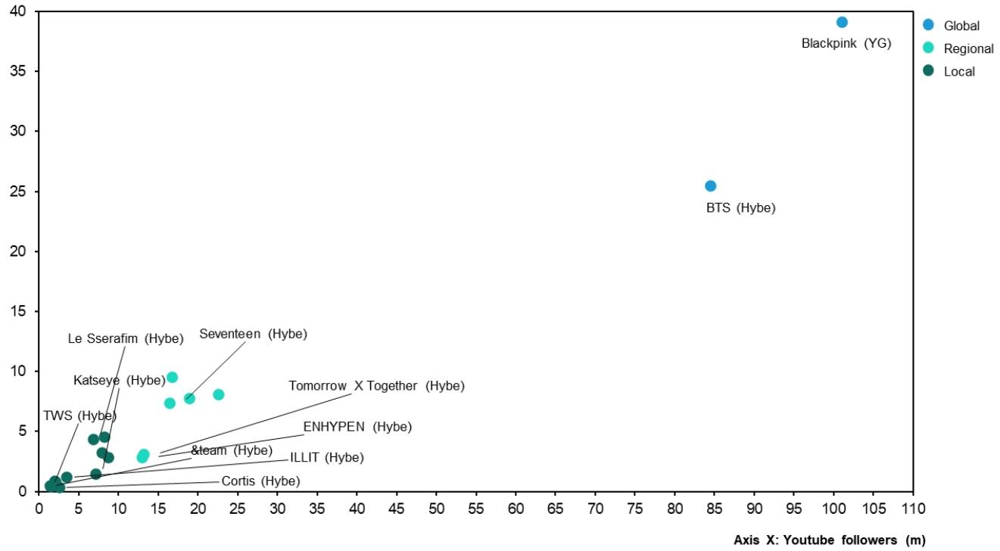

scatterplot

| Product           | Axis X: Youtube followers (m) | Global | Regional | Local |
| ----------------- | ----------------------------- | ------ | -------- | ----- |
| Blackpink (YG)    | 102                           | 39     | -        | -     |
| BTS (Hybe)        | 84                            | 25     | -        | -     |
| TWS (Hybe)        | 7                             | -      | -        | -     |
| Le Sserafim (Hybe)| 16                            | -      | -        | -     |
| Katseye (Hybe)    | 17                            | -      | -        | -     |
| Seventeen (Hybe)  | 19                            | -      | -        | -     |
| Tomorrow X Together (Hybe) | 22                        | -          | -        | -     |
| ENHYPEN (Hybe)   | 13                            | -      | -        | -     |
| &team (Hybe)     | 13                            | -      | -        | -     |
| ILLIT (Hybe)      | 13                            | -      | -        | -     |
| Cortis (Hybe)     | 7                             | -      | -        | -     |

Source: Youtube, Bernstein analysis.

EXHIBIT 6: Time series of K-pop industry revenue by segment highlighting concerts as an increasing share of total revenue, which we view as evidence of a shift in consumer IP consumption behavior.  
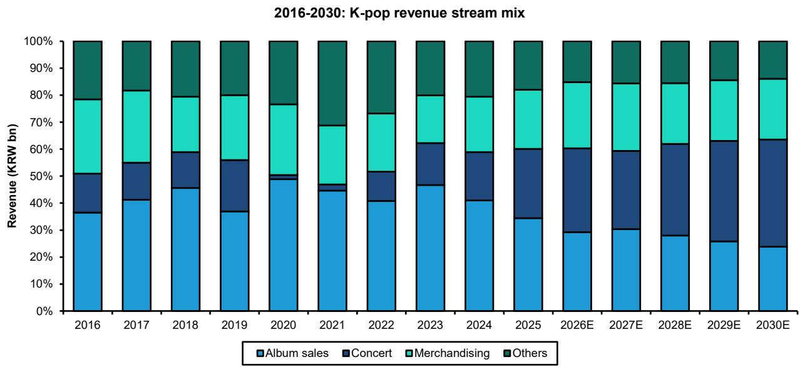

stacked bar chart

| Year   | Album sales | Concert | Merchandising | Others |
|--------|-------------|---------|---------------|--------|
| 2016   | 36%         | 14%     | 27%           | 18%    |
| 2017   | 41%         | 15%     | 25%           | 16%    |
| 2018   | 45%         | 14%     | 23%           | 17%    |
| 2019   | 37%         | 18%     | 24%           | 18%    |
| 2020   | 48%         | 2%      | 23%           | 23%    |
| 2021   | 44%         | 2%      | 21%           | 27%    |
| 2022   | 40%         | 10%     | 20%           | 25%    |
| 2023   | 46%         | 15%     | 15%           | 18%    |
| 2024   | 41%         | 17%     | 18%           | 18%    |
| 2025   | 34%         | 25%     | 19%           | 16%    |
| 2026E  | 29%         | 33%     | 23%           | 13%    |
| 2027E  | 30%         | 30%     | 23%           | 13%    |
| 2028E  | 28%         | 35%     | 20%           | 13%    |
| 2029E  | 26%         | 37%     | 19%           | 13%    |
| 2030E  | 24%         | 40%     | 19%           | 13%    |

Source: Corporate reports, Bloomberg, Bernstein estimates and analysis.

EXHIBIT 7: Highlight the post-2022 inflection as global touring resumes, with concert revenue growth outpacing album and digital segments, reflecting a rapidly expanding K-pop fandom.  
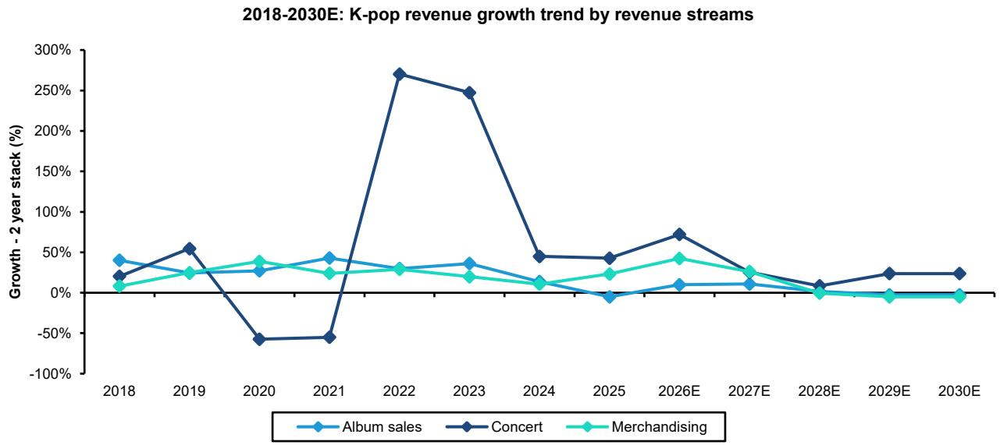

line chart

| Year   | Album sales | Concert | Merchandising |
| ------ | ----------- | ------- | ------------- |
| 2018   | 40%         | 20%     | 5%            |
| 2019   | 30%         | 55%     | 25%           |
| 2020   | 30%         | -60%    | 40%           |
| 2021   | 45%         | -60%    | 25%           |
| 2022   | 35%         | 270%    | 30%           |
| 2023   | 40%         | 250%    | 20%           |
| 2024   | 15%         | 45%     | 10%           |
| 2025   | -10%        | 45%     | 25%           |
| 2026E  | 10%         | 75%     | 45%           |
| 2027E  | 10%         | 30%     | 30%           |
| 2028E  | 5%          | 10%     | 5%            |
| 2029E  | 5%          | 30%     | 5%            |
| 2030E  | 5%          | 30%     | 5%            |

Source: Corporate reports, Bloomberg, Bernstein estimates and analysis.

EXHIBIT 8: K-pop concert revenue has shown strong compounding growth over time, and we see incremental opportunities for IP monetization through an increasingly engaged “super fan”.  
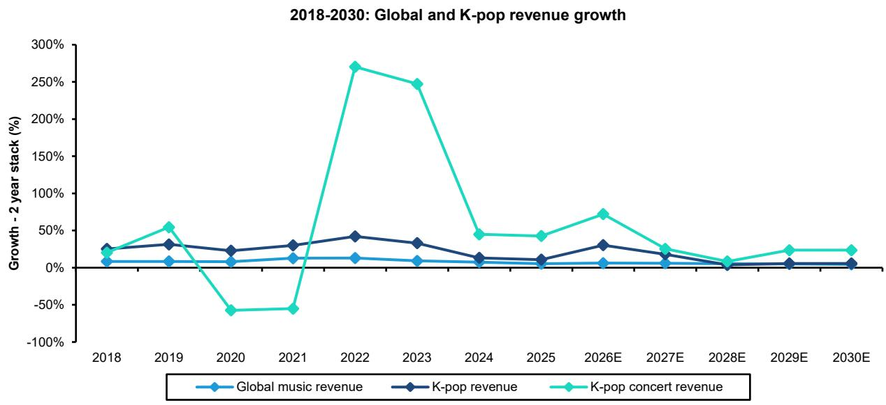

line chart

| Year   | Global music revenue | K-pop revenue | K-pop concert revenue |
| ------ | -------------------- | ------------- | --------------------- |
| 2018   | ~5%                  | ~25%          | ~20%                  |
| 2019   | ~5%                  | ~30%          | ~55%                  |
| 2020   | ~5%                  | ~25%          | ~-60%                 |
| 2021   | ~10%                 | ~30%          | ~-60%                 |
| 2022   | ~10%                 | ~40%          | ~270%                 |
| 2023   | ~5%                  | ~35%          | ~245%                 |
| 2024   | ~5%                  | ~15%          | ~45%                  |
| 2025   | ~5%                  | ~10%          | ~45%                  |
| 2026E  | ~5%                  | ~30%          | ~75%                  |
| 2027E  | ~5%                  | ~15%          | ~25%                  |
| 2028E  | ~5%                  | ~5%           | ~10%                  |
| 2029E  | ~5%                  | ~5%           | ~25%                  |
| 2030E  | ~5%                  | ~5%           | ~25%                  |

Source: IFPI, Corporate reports, Bernstein estimates and analysis.

EXHIBIT 9: K-pop is rapidly gaining share in the global Top 100 touring circuit, with its tour revenue footprint now approaching \~10% of global.  
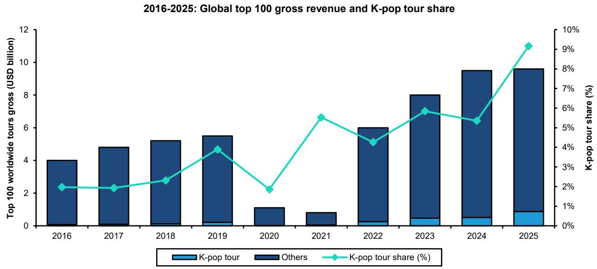

bar-line hybrid

2016-2025: Global top 100 gross revenue and K-pop tour share
| Year | Top 100 worldwide tours gross (USD billion) | K-pop tour share (%) |
| :--- | :--- | :--- |
| 2016 | 4.0 | 2.3 |
| 2017 | 4.8 | 2.2 |
| 2018 | 5.2 | 2.7 |
| 2019 | 5.5 | 4.5 |
| 2020 | 1.1 | 2.1 |
| 2021 | 0.8 | 6.6 |
| 2022 | 0.3 | 4.4 |
| 2023 | 0.5 | 5.8 |
| 2024 | 0.5 | 5.3 |
| 2025 | 0.9 | 9.3 |

Source: Corporate reports, Wikipedia, Bernstein estimates and analysis.

EXHIBIT 10: Hybe commands c.70% of K-pop concert revenue, dwarfing peers in scale and positioning itself within a structurally expanding global live market.  
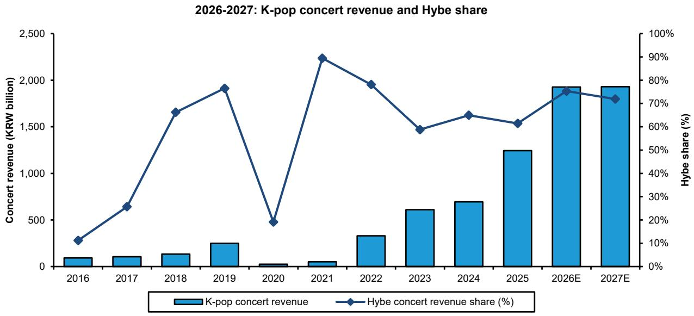

bar-line hybrid

2026-2027: K-pop concert revenue and Hybe share
| Year | K-pop concert revenue (KRW billion) | Hybe concert revenue share (%) |
| :--- | :--- | :--- |
| 2016 | 85 | 10 |
| 2017 | 95 | 27 |
| 2018 | 130 | 67 |
| 2019 | 250 | 89 |
| 2020 | 15 | 48 |
| 2021 | 45 | 90 |
| 2022 | 330 | 79 |
| 2023 | 620 | 58 |
| 2024 | 710 | 66 |
| 2025 | 1240 | 61 |
| 2026E | 1910 | 76 |
| 2027E | 1910 | 73 |

Source: Corporate reports, Bloomberg, Bernstein estimates and analysis.

EXHIBIT 11: BTS sits at the top tier globally in concert ticket pricing.  
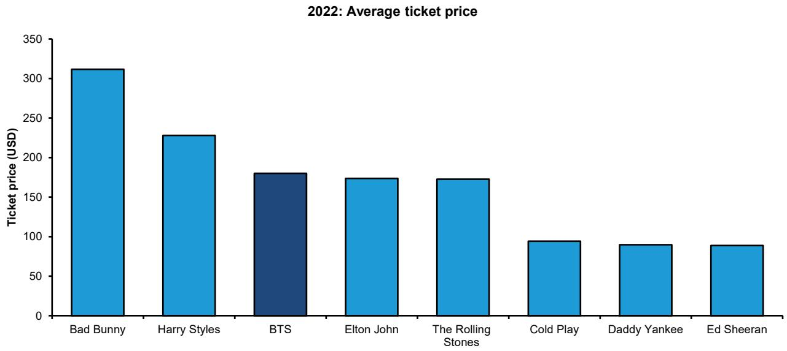

bar chart

2022: Average ticket price
| Artist | Ticket price (USD) |
| :--- | :--- |
| Bad Bunny | 312 |
| Harry Styles | 230 |
| BTS | 181 |
| Elton John | 174 |
| The Rolling Stones | 173 |
| Cold Play | 95 |
| Daddy Yankee | 91 |
| Ed Sheeran | 90 |

BTS's last concert was in 2022, just before their military service, ahead of their planned 2026 comeback.  
Source: Billboard Boxscore, Bernstein analysis.

EXHIBIT 12: Spending is shifting from goods to experiences, with fandom ARPU from concerts rising meaningfully above physical albums.  
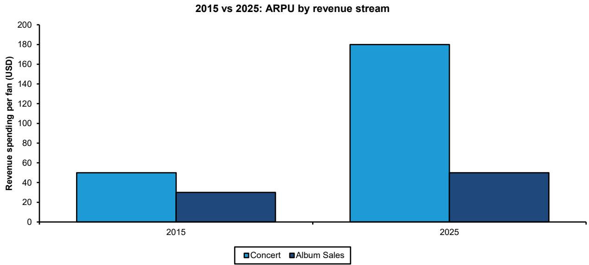

bar chart

2015 vs 2025: ARPU by revenue stream
| Year | Revenue spending per fan (USD) | Category |
| :--- | :--- | :--- |
| 2015 | 50 | Concert |
| 2015 | 30 | Album Sales |
| 2025 | 180 | Concert |
| 2025 | 50 | Album Sales |

Source: Bernstein estimates and analysis.

EXHIBIT 13: In a debased currency world, premium IP commands real pricing power.  
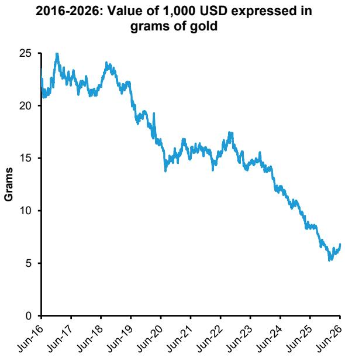

line chart

| Date   | Value (Grams) |
|--------|---------------|
| Jun-16 | 21.0          |
| Jun-17 | 24.5          |
| Jun-18 | 23.0          |
| Jun-19 | 22.0          |
| Jun-20 | 19.0          |
| Jun-21 | 16.0          |
| Jun-22 | 17.5          |
| Jun-23 | 14.5          |
| Jun-24 | 12.0          |
| Jun-25 | 9.0           |
| Jun-26 | 6.0           |

Originally published in our team note, "Long View: A Golden Age for First-Party Content IP."  
Source: Bloomberg, Bernstein analysis.

EXHIBIT 14: Artist time is scarce and valuable - the key is fully monetizing every minute.  
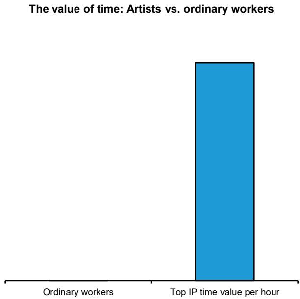

bar chart

| Category             | Value |
| -------------------- | ----- |
| Ordinary workers     | 0     |
| Top IP time value per hour | 70    |

Source: Bernstein analysis.

## Monetizing the hype: Hybe's concert-plus-merch profit engine

Concert revenue is usually a low-margin business once you factor in staging costs and promoter revenue share, but large-fandom IPs flip that script. In Hybe's case, each show is treated as a monetization node for a full stack of revenue streams: tickets, VIP and soundcheck packages, tour-exclusive merch, fan club memberships, and digital content layered on top. Crucially, tier-1 merch spend per head is now showing up not only at BTS dates but also across newer IP, proving that this bundling playbook is repeatable across the roster rather than a one-group anomaly.

As the mix shifts from low-margin physical albums toward higher-margin merch, content, fanclub, and streaming, Hybe's gross profit is set to grow much faster than reported revenue, even as concerts take a larger share of the top line. We see “concert plus” - ticket plus merch plus digital plus fanclub - as the right lens for Hybe’s live business, with the show itself as the anchor and an increasingly rich profit pool coming from everything wrapped around that moment.

Hybe's concert business has reached a scale that clearly differentiates it from traditional K-pop labels, positioning the company closer to a global live promoter model. Its revenue profile is increasingly driven by large-scale touring rather than being anchored to recorded music.

This shift is supported by a broad, diversified, and multi-tiered IP portfolio, which allows Hybe to continuously ramp its concert cadence across markets and artist tiers. The ability to deploy multiple acts at different stages of maturity enables a steady expansion in global touring activity. At the same time, Hybe's global tour unit economics stand out. With lower reliance on local promoters and a leaner take structure (c. $10\%$ vs $20 - 30\%+$ for peers), the company retains a greater share of tour economics, translating into structurally higher operating margins.

## Hybe vs global live leaders: reframing the valuation lens

We value Hybe at 400K on a DCF basis, implying one year forward PER of 43x (Q2 2027-Q1 2028), which sits meaningfully below Live Nation's multiple despite both being geared to structurally growing concert economics. Given Hybe's status as a top-four global concert revenue player, its uniquely diversified multi-label IP portfolio, and a BTS comeback that extends the live runway beyond 2026-2027, we believe the appropriate peer frame is global live and experience platforms rather than local K-pop labels.

This shift in lens reflects a step-change in earnings quality: tour cycles are increasingly discrete monetization windows where Hybe can flex capacity (dates, cities, venue sizes) and pricing (tiering, VIP, dynamic pricing), while bundling in tour merch, online concert tickets, and live video content. In our view, the market will increasingly reward platforms that can consistently convert fandom intensity into live willingness-to-pay rather than simply pushing incremental album volumes, supporting further re-rating potential for Hybe as a global offline concert promoter, with BTS tours and a deep IP bench underpinning concert-led upside and justifying comparison to global live leaders.

EXHIBIT 15: Concerts are emerging as the primary growth engine, as scaled IP portfolios enable K-pop companies to fill global venues.  
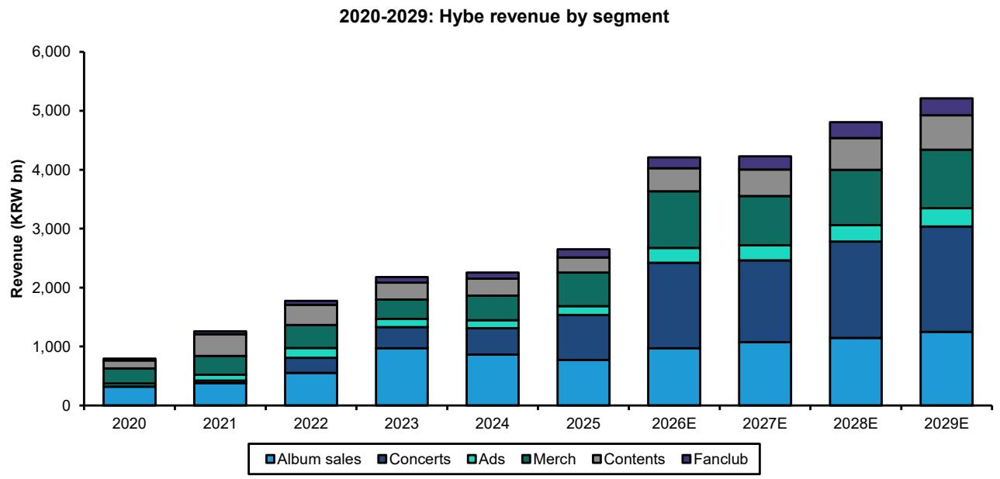

stacked bar chart

| Year   | Album sales | Concerts | Ads  | Merch | Contents | Fanclub |
|--------|-------------|----------|------|-------|----------|---------|
| 2020   | 300         | 100      | 50   | 200   | 100      | 50      |
| 2021   | 400         | 150      | 100  | 300   | 150      | 100     |
| 2022   | 550         | 200      | 150  | 400   | 200      | 150     |
| 2023   | 950         | 300      | 200  | 500   | 300      | 200     |
| 2024   | 850         | 400      | 250  | 600   | 350      | 250     |
| 2025   | 750         | 600      | 300  | 700   | 400      | 300     |
| 2026E  | 950         | 1100     | 350  | 900   | 450      | 350     |
| 2027E  | 1100        | 1300     | 400  | 1000  | 500      | 400     |
| 2028E  | 1150        | 1450     | 450  | 1150  | 550      | 450     |
| 2029E  | 1250        | 1650     | 500  | 1350  | 650      | 550     |

Source: Corporate reports, Bernstein estimates and analysis.

EXHIBIT 16: Concert margins may be thin, but bundled merch turns global tours into a meaningful profit pool.  
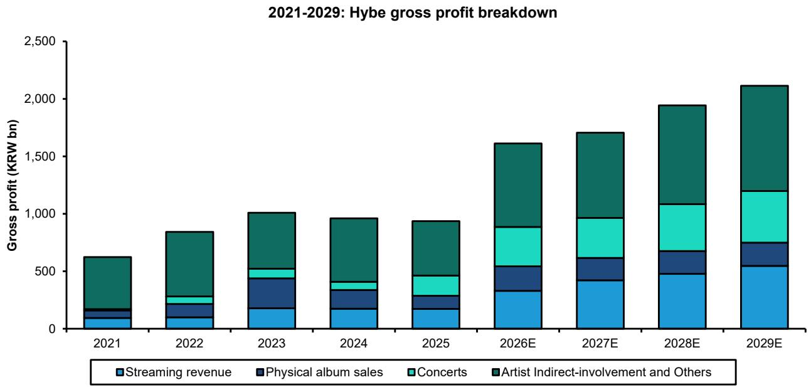

stacked bar chart

2021-2029: Hybe gross profit breakdown
| Year | Streaming revenue (KRW bn) | Physical album sales (KRW bn) | Concerts (KRW bn) | Artist Indirect-involvement and Others (KRW bn) |
| :--- | :--- | :--- | :--- | :--- |
| 2021 | 80 | 50 | 100 | 450 |
| 2022 | 90 | 100 | 70 | 600 |
| 2023 | 180 | 250 | 80 | 500 |
| 2024 | 170 | 150 | 70 | 600 |
| 2025 | 160 | 100 | 150 | 550 |
| 2026E | 320 | 200 | 300 | 850 |
| 2027E | 420 | 180 | 300 | 950 |
| 2028E | 470 | 150 | 350 | 1150 |
| 2029E | 530 | 180 | 450 | 1150 |

Source: Corporate reports, Bernstein estimates and analysis.

EXHIBIT 17: Hybe's concert revenue scale sets it apart, aligning its model with global live promoters rather than traditional labels.  
2016-2028E: K-pop concert revenue trend  
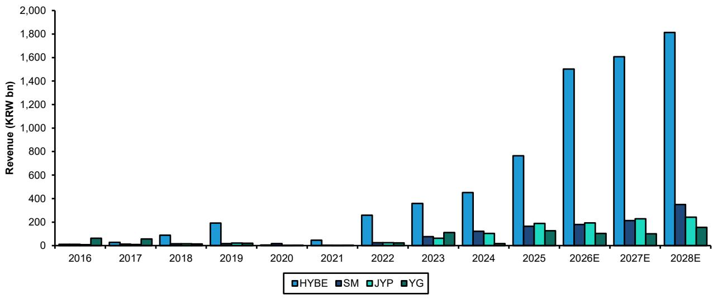

bar chart

| Year | HYBE (KRW bn) | SM (KRW bn) | JYP (KRW bn) | YG (KRW bn) |
| :--- | :--- | :--- | :--- | :--- |
| 2016 | 5 | 3 | 4 | 70 |
| 2017 | 30 | 10 | 10 | 60 |
| 2018 | 90 | 15 | 15 | 15 |
| 2019 | 200 | 20 | 25 | 25 |
| 2020 | 5 | 5 | 5 | 5 |
| 2021 | 50 | 5 | 5 | 5 |
| 2022 | 260 | 30 | 30 | 30 |
| 2023 | 360 | 70 | 60 | 110 |
| 2024 | 450 | 120 | 110 | 15 |
| 2025 | 770 | 170 | 190 | 130 |
| 2026E | 1500 | 190 | 200 | 110 |
| 2027E | 1610 | 220 | 230 | 110 |
| 2028E | 1820 | 360 | 240 | 160 |

Source: Corporate reports, Bloomberg, Bernstein estimates and analysis.

EXHIBIT 18: Hybe is ramping concert cadence on the back of a broad, multi-tiered IP portfolio.  
2021-2026: Hybe's number of concerts  
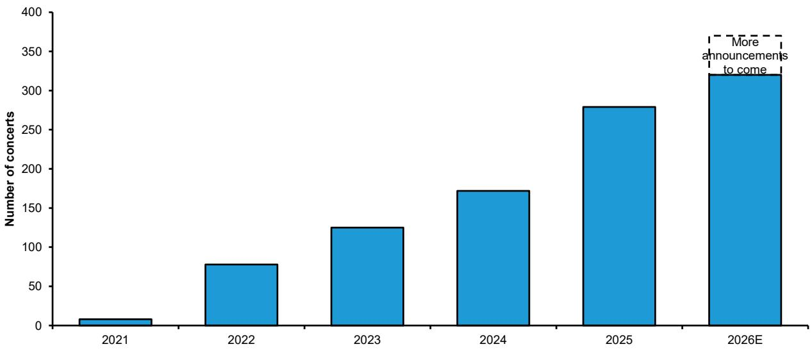

bar chart

| Year | Number of concerts |
| :--- | :--- |
| 2021 | 8 |
| 2022 | 79 |
| 2023 | 125 |
| 2024 | 173 |
| 2025 | 280 |
| 2026E | 323 |
More announcements to come

Source: Corporate reports, Bernstein estimates and analysis.

EXHIBIT 19: Concert GP margins are lower (c.25%), but pairing with high-margin merch (c.50%) lifts blended gross margins.  
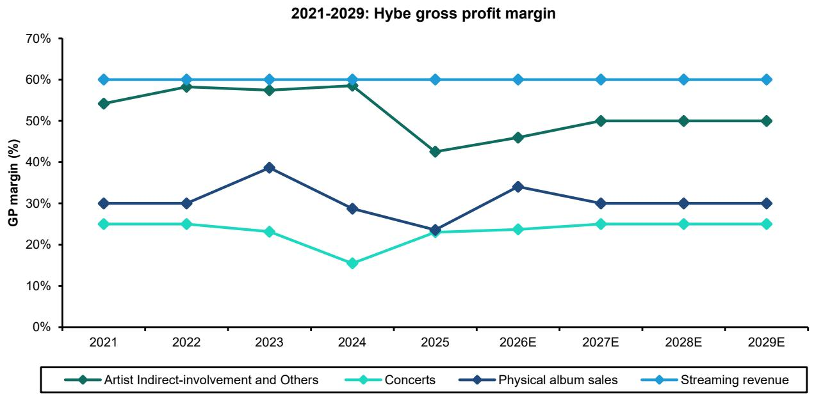

line chart

| Year   | Artist Indirect-involvement and Others | Concerts | Physical album sales | Streaming revenue |
|--------|------------------------------------------|----------|----------------------|-------------------|
| 2021   | 54%                                      | 25%      | 30%                  | 60%               |
| 2022   | 58%                                      | 25%      | 30%                  | 60%               |
| 2023   | 57%                                      | 23%      | 38%                  | 60%               |
| 2024   | 58%                                      | 15%      | 28%                  | 60%               |
| 2025   | 42%                                      | 23%      | 23%                  | 60%               |
| 2026E  | 45%                                      | 24%      | 34%                  | 60%               |
| 2027E  | 50%                                      | 25%      | 30%                  | 60%               |
| 2028E  | 50%                                      | 25%      | 30%                  | 60%               |
| 2029E  | 50%                                      | 25%      | 30%                  | 60%               |

Source: Corporate reports, Bernstein estimates and analysis.

EXHIBIT 20: Hybe's global tour unit economics stand apart, with lower local promoter take rates (\~10% vs. 20-30%+ for other labels), resulting in structurally higher margins.  
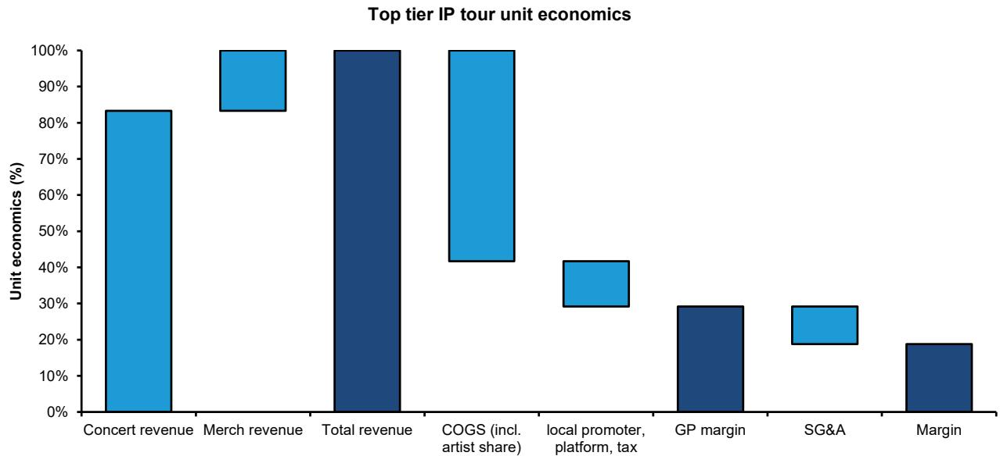

bar chart

Top tier IP tour unit economics
| Category | Unit economics (%) |
| :--- | :--- |
| Concert revenue | 83.5 |
| Merch revenue | 99.0 |
| Total revenue | 100.0 |
| COGS (incl. artist share) | 42.0 |
| local promoter, platform, tax | 41.5 |
| GP margin | 29.0 |
| SG&A | 28.5 |
| Margin | 19.0 |

This concert unit economics analysis is based on high-level assumptions and rough internal estimates, not on official disclosures or audited figures. The numbers presented (including ticket revenue, costs, margins, attendance, pricing, and profit contribution) are illustrative in nature and are intended solely to help understand the business model conceptually. Actual performance for any specific tour or show may differ materially from these estimates due to changes in pricing, venue mix, production scale, tax and fee structures, deal terms with promoters and partners, FX, and other operational or contractual factors. This analysis should not be relied upon as a precise forecast or as a representation of the company's actual or future financial results, and it should not be used as the sole basis for any investment, commercial, or strategic decision.

Source: Bernstein estimates and analysis.

EXHIBIT 21: We like Hybe, as consistent mid-sized successes have built a diversified IP portfolio.  
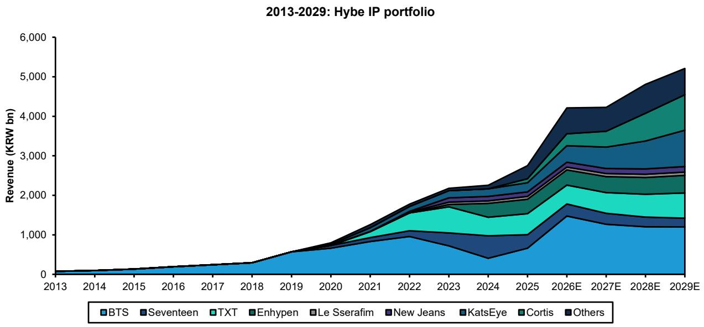

stacked area chart

| Year   | BTS   | Seventeen | TXT   | Enhypen | Le Sserafim | New Jeans | KatsEye | Cortis | Others |
|--------|-------|-----------|-------|---------|-------------|-----------|---------|--------|--------|
| 2013   | 0     | 0         | 0     | 0       | 0           | 0         | 0       | 0      | 0      |
| 2014   | 0     | 0         | 0     | 0       | 0           | 0         | 0       | 0      | 0      |
| 2015   | 0     | 0         | 0     | 0       | 0           | 0         | 0       | 0      | 0      |
| 2016   | 0     | 0         | 0     | 0       | 0           | 0         | 0       | 0      | 0      |
| 2017   | 0     | 0         | 0     | 0       | 0           | 0         | 0       | 0      | 0      |
| 2018   | 0     | 0         | 0     | 0       | 0           | 0         | 0       | 0      | 0      |
| 2019   | 0     | 0         | 0     | 0       | 0           | 0         | 0       | 0      | 0      |
| 2020   | 50    | 50        | 50    | 50      | 50          | 50        | 50      | 50     | 50     |
| 2021   | 1,00  | 1,00      | 1,00  | 1,00    | 1,00        | 1,00      | 1,00    | 1,00   | 1,00   |
| 2022   | 1,50  | 1,50      | 1,50  | 1,50    | 1,50        | 1,50      | 1,50    | 1,50   | 1,50   |
| 2023   | 2,00  | 2,00      | 2,00  | 2,00    | 2,00        | 2,00      | 2,00    | 2,00   | 2,00   |
| 2024   | 2,50  | 2,50      | 2,50  | 2,50    | 2,50        | 2,50      | 2,50    | 2,50   | 2,50   |
| 2025   | 3,50  | 3,50      | 3,50  | 3,50    | 3,50        | 3,50      | 3,50    | 3,50   | 3,50   |
| 2026E  | 4,50  | 4,50      | 4,50  | 4,50    | 4,50        | 4,50      | 4,50    | 4,50   | 4,50   |
| 2027E  | 4,50  | 4,50      | 4,50  | 4,50    | 4,50        | 4,50      | 4,50    | 4,50   | 4,50   |
| 2028E  | 4,75  | 4,75      | 4,75  | 4,75    | 4,75        | 4,75      | 4,75    | 4,75   | 4,75   |
| 2029E  | 5,25  | 5,25      | 5,25  | 5,25    | 5,25        | 5,25      | 5,25    | 5,25   | 5,25   |
The chart displays a stacked area chart with the x-axis labeled 'Year' (from '2013 to '2029E) and the y-axis labeled 'Revenue (KRW bn)' (ranging from ~1 to ~6,378). The legend identifies eight categories: BTS (blue), Seventeen (dark blue), TXT (light blue), Enhypen (green), Le Sserafim (gray), New Jeans (purple), KatsEye (teal), Cortis (yellow-green), and Others (black). The data is extracted from the provided image and presented in CSV format as requested. The chart is created using the formula 'Hybe IP portfolio'.

Source: Corporate reports, Bernstein estimates and analysis.

## AI can scale, time cannot: the human edge in K-pop

At its core, K-pop remains anchored by the human artist. No matter how advanced technology becomes, the emotional connection between fan and artist is still built on authenticity, presence, and perceived scarcity. That human anchor is what ultimately drives fandom intensity and willingness to pay.

The real bottleneck in the system is not content production, but the artist's time and attention. This scarcity is precisely what creates value. Every hour an artist spends - whether on music, touring, content, or fan interaction - is a finite resource that must be carefully allocated.

For labels and agencies, this reframes the optimization problem. The question is no longer “How do we produce more content?” but “How do we maximize the value of limited artist time across multiple monetization channels?” In this setup, AI and virtual elements act as operating leverage - amplifying reach, extending engagement, and filling gaps - but not replacing the core human IP.

This is why attempts to fully substitute artists with robots or virtual idols have struggled. Without a true human anchor, the emotional depth, scarcity, and sustained fandom economics are difficult to replicate, limiting their ability to scale into meaningful long-term franchises.

## EXHIBIT 22: Human scarcity wins - AI scales reach, but artist time drives K-pop value.

Nature of business comparison in Entertainment space "You can do multiple games, but fandom is only for 1 artist"

Music is one surface in a broader engagement product "Who is your bias?"

Pop Industry (especially K-pop)  

text_image

Sea
of
JIN

Purpose Of Use

Break time activities

Engaging

Type of Emotion

Joy

Love

Engaged Big IP

Multiple
(The more the better)

Only 1 (Top pick)

natural_image

Black-and-white photo of a young man singing on stage, holding a microphone (no visible text or symbols)

Source: Instagram, Bernstein analysis.

## US ENTERTAINMENT VIEW

The boom in K-pop is a shared tailwind for Live Nation and Spotify: the same Western, high-ARPU fanbase that Spotify monetizes on the stream is the one Live Nation seats at the show, and as of this year the two are wired together through a single partnership.

K-pop fans are among the prime customers for the superfan upgrades Spotify is now pushing. At its May 2026 Investor Day, Spotify made charging its most engaged listeners more a central part of the growth story, building toward a higher-priced superfan tier plank by plank, with lossless audio and track-mixing tools already live and exclusive concert access the newest addition. That willingness to pay is not theoretical, and HYBE's Weverse is the proof of it: the K-pop superfan platform reached 13.4 million monthly users in early 2026, up 20% quarter on quarter and newly profitable, with roughly 90% of its traffic outside Korea and committed fans spending into the hundreds of dollars a month on memberships, merchandise and content. Tencent Music's Super VIP tier, more than 20 million subscribers paying around five times the standard price, shows the model scales rather than cannibalizes. Because K-pop fandoms already spend like this, they are exactly the cohort Spotify's superfan add-ons are built to convert. And that consumption is increasingly Western: the US is now Spotify's single largest K-pop market (Exhibit 23), so each step up in the genre's popularity lands disproportionately among the high-ARPU listeners Spotify monetizes best.

EXHIBIT 23: In 2025 the US became Spotify's number one K-pop market for the first time confirming that the genre's streaming center of gravity has shifted to the high-ARPU West

<table><tr><td>Rank</td><td>Market</td><td>Region</td><td>Rank</td><td>Market</td><td>Region</td></tr><tr><td>1</td><td>United States</td><td>North America</td><td>6</td><td>Mexico</td><td>Latin America</td></tr><tr><td>2</td><td>Indonesia</td><td>Asia (SE Asia)</td><td>7</td><td>Thailand</td><td>Asia (SE Asia)</td></tr><tr><td>3</td><td>Japan</td><td>Asia</td><td>8</td><td>Taiwan</td><td>Asia</td></tr><tr><td>4</td><td>Philippines</td><td>Asia (SE Asia)</td><td>9</td><td>India</td><td>Asia (South Asia)</td></tr><tr><td>5</td><td>Brazil</td><td>Latin America</td><td>10</td><td>South Korea</td><td>Asia</td></tr></table>

Source: All K-pop, USA Inquirer

That spending does not stay only on the platform, and this is where the streaming story turns into a touring story. The clearest signal came at the same Investor Day, where Spotify launched "Reserved," which identifies an artist's superfans from their streaming activity and sets aside concert tickets for them, with Live Nation signed as the exclusive launch partner and more than \$1.5 billion in artist ticket sales already driven by Spotify's live tools. That demand is also unusually intense, because K-pop concertgoers behave more like superfans rather than casual buyers: on a like-for-like arena and stadium basis they fill 96% of capacity against 86% for all shows and pay about 27% more per ticket, \$132 against \$104 (Exhibit 24-Exhibit 25). These are higher-intent fans, which is precisely why the streaming-to-ticket pipe is worth building, and because their demand is concentrated in the West it favors the promoter best exposed there. Live Nation handles close to half of all Western K-pop touring gross. The fan Spotify surfaces on the stream is, increasingly by design, the fan Live Nation seats at the show.

EXHIBIT 24: On a like-for-like arena and stadium basis K-pop concertgoers behave like superfans, filling 96% of capacity versus 86% for all shows...  
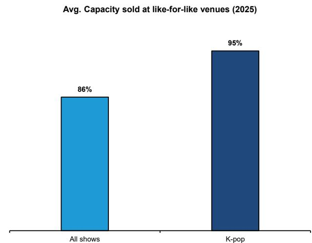

bar chart

Avg. Capacity sold at like-for-like venues (2025)
| Venue Type | Avg. Capacity Sold (%) |
| :--- | :--- |
| All shows | 86 |
| K-pop | 95 |

EXHIBIT 25: ...and paying about 27% more per ticket (\$132 versus \$104)  
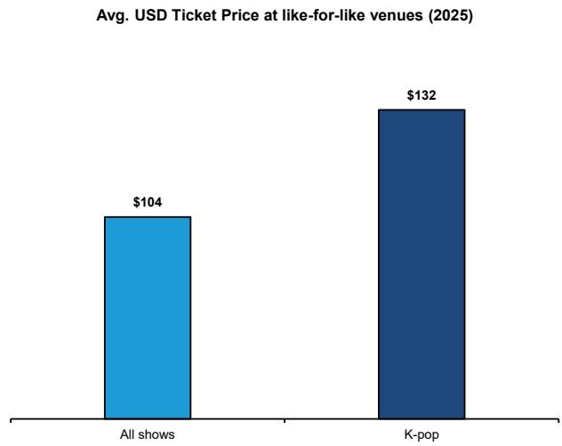

bar chart

Avg. USD Ticket Price at like-for-like venues (2025)
| Venue Type | Avg. USD Ticket Price ($) |
| :--- | :--- |
| All shows | 104 |
| K-pop | 132 |

Source: Pollstar, Bernstein analysis  
Source: Pollstar, Bernstein analysis

Western K-pop touring is, to a striking degree, a Live Nation business, and it is the segment we expect to grow from here. The United States is the single largest K-pop touring market in the world and Live Nation promoted about 60% of it in 2025 and roughly 81% of Mexico through OCESA (Exhibit 26). The obvious objection, that labels will self-promote and cut the promoter out as HYBE has begun to, is bounded: promoter relationships track the agency, JYP's touring is roughly 95% Live Nation, and self-promotion is contained to HYBE alone. With Western K-pop streaming still climbing and a heavy 2026 touring calendar already announced, led by BTS's return to stadiums, we see both names benefiting from the continuing popularity of K-pop: Spotify on the streams and the superfan add-ons, and Live Nation on the gate and the Reserved pipeline that now feeds it.

EXHIBIT 26: The US is the single largest K-pop touring market in the world and Live Nation promoted about 60% of it in 2025, with Live Nation also dominant across the other Western markets (Mexico \~81%, Netherlands \~71%, UK \~68%) while self-promotion stays contained to HYBE  
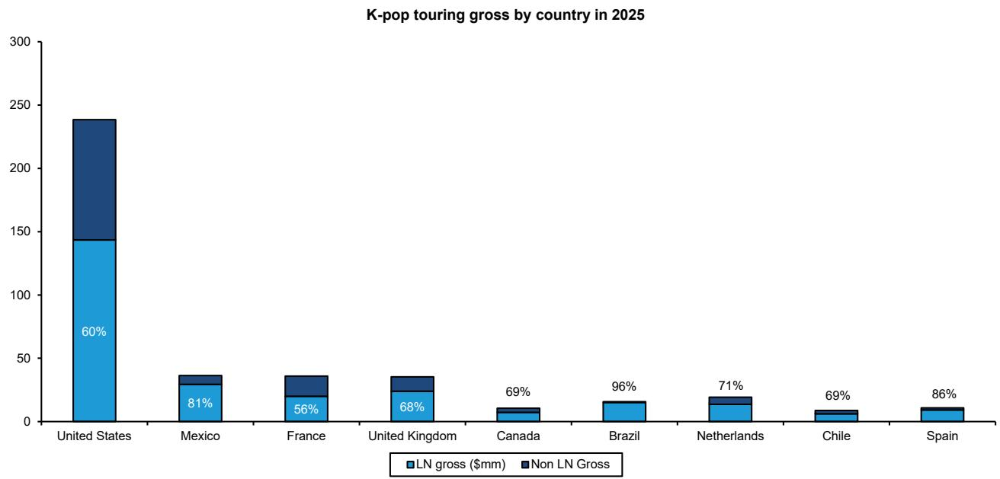

stacked bar chart

K-pop touring gross by country in 2025
| Country | LN gross ($mm) (%) | Non LN Gross (%) |
| :--- | :--- | :--- |
| United States | 60 | 108 |
| Mexico | 81 | 9 |
| France | 56 | 14 |
| United Kingdom | 68 | 10 |
| Canada | 0 | 9 |
| Brazil | 96 | 3 |
| Netherlands | 71 | 6 |
| Chile | 69 | 2 |
| Spain | 86 | 1 |

Source: Pollstar, Bernstein analysis

## I. REQUIRED DISCLOSURES

References to "Bernstein" or the "Firm" in these disclosures relate to the following entities: Bernstein Institutional Services LLC (April 1, 2024 onwards), Bernstein & Co., LLC (pre April 1, 2024), Bernstein Autonomous LLP, BSG France S.A. (April 1, 2024 onwards), Bernstein (Hong Kong) Limited 盛博香港有限公司, Bernstein (Canada) Limited, Bernstein (India) Private Limited (SEBI registration no. INH000006378), Bernstein (Singapore) Private Limited, Bernstein Japan KK (サンフォード・C・バーンスタイン株式会社) and analysts employed by SG Africa Technologies & Services to produce Bernstein under a Global Services Agreement in place between Bernstein and SG.

Bernstein is part of a joint venture between SG (SG) and AllianceBernstein, L.P. (AB). Unless specifically noted otherwise, for purposes of these disclosures, references to Bernstein's “affiliates” relate to both SG and AB and their respective affiliates.

## VALUATION METHODOLOGY

## Hybe Co Ltd

We have valued Hybe at a price target of KRW 400,000 based on a DCF valuation method, implying one year forward PER of 43x (Q2 2027-Q1 2028). (DCF assumptions: WACC=10.1%, Terminal growth rate: 3%; Risk-Free Rate of Return (Rf) = 3.4%, Market Risk Premium (Rm - Rf) = 15.3%, Beta = 0.5).

## Live Nation Entertainment, Inc.

We reach our price target of \$200/sh via a two-stage discounted free cash flow model which includes detailed quarterly financial forecasts over three years, annual forecasts of key line items over the following five years, and a terminal perpetuity. We assume a weighted average cost of capital of 9.0% and a terminal free cash flow growth rate of 3.0%.

## Spotify Technology SA

We reach our price target of \$625/sh via a two-stage discounted free cash flow model which includes detailed quarterly financial forecasts over three years, annual forecasts of key line items over the following five years, and a terminal perpetuity. We assume a weighted average cost of capital of 11% and a terminal free cash flow growth rate of 3.0%.

## Sony Group Corp

We have a ¥3,500 price target for Sony, based on a 17x P/E multiple of Q5-8 EPS, estimated at ¥208. We value the Sony ADR by converting the JPY price to USD based on an exchange rate of 159.21.

## Universal Music Group

Our €29 PT is based on a DCF valuation (wacc 7.8%, LT growth 3.3%), including the value of minorities stakes in Spotify and Tencent Music.

## RISKS

## Hybe Co Ltd

Downside risk: Lower-than-expected revenue from the BTS return; margin contraction due to higher take rates on key IPs; greater-than-expected investments in overseas subsidiaries

## Live Nation Entertainment, Inc.

Key risks to the downside include escalating regulatory scrutiny, GTV deceleration, international expansion challenges, and venue construction costs above expectations.

## Spotify Technology SA

Key risks to the downside include subscriber churn on price increases, delays to superfan tier launch, slowing video adoption by creators, geopolitical risks, and currency fluctuations.

## Sony Group Corp

Upside risks to our Sony target price: (1) A smaller-than-expected memory price hike; (2) A smaller-than-expected share loss to Samsung in Apple CIS orders; (3) Stronger-than-expected game software sales. Downside risks: (1) Fewer mobile/auto CIS sales or larger share loss in CIS market; (2) Slowdown of music streaming market growth or less profit sharing from streaming; (3) Management risk and competition in anime streaming or insufficient successful anime works in the future.

## Universal Music Group

Downside risks: Music streaming platforms holding prices flat for an extended period, volatility of hard to predict Physical sales, potential cyclicality of ad revenues (12% of group total)

## RATINGS DEFINITIONS, BENCHMARKS AND DISTRIBUTION

## EQUITY RATINGS DEFINITIONS

## Bernstein brand

The Bernstein brand rates stocks based on forecasts of relative performance for the next 12 months versus the S&P 500 for stocks listed on the U.S. and Canadian exchanges, versus the Bloomberg Europe Developed Markets Large and Mid Cap Price Return Index EUR (EDME) for stocks listed on the European exchanges and emerging markets exchanges outside of the Asia Pacific region, versus the Bloomberg Japan Large and Mid Cap Price Return Index USD (JPL) for stocks listed on the Japanese exchanges, and versus the Bloomberg Asia ex-Japan Large and Mid Cap Price Return Index (ASIAX) for stocks listed on the Asian (ex-Japan) exchanges -unless otherwise specified.

The Bernstein brand has three categories of ratings:

- Outperform: Stock will outpace the market index by more than 15 pp  
• Market-Perform: Stock will perform in line with the market index to within +/-15 pp  
• Underperform: Stock will trail the performance of the market index by more than 15 pp

Coverage Suspended: Coverage of a company under the Bernstein brand has been suspended. Ratings and price targets are suspended temporarily, are no longer current, and should therefore not be relied upon.

Not Rated: A rating assigned when the stock cannot be accurately valued, or the performance of the company accurately predicted, at the present time. The covering analyst may continue to publish research reports on the company to update investors on events and developments.

Not Covered (NC) denotes companies that are not under coverage.

Bernstein brand stock ratings are based on a 12-month time horizon.

## Autonomous brand – common stocks

The Autonomous brand rates common stocks as indicated below. As our benchmarks we use the Bloomberg Europe 500 Banks And Financial Services Index (BEBANKS) and Bloomberg Europe Dev Mkt Financials Large and Mid Cap Price Ret Index EUR (EDMFI) index for developed European banks and Payments, the Bloomberg Europe 500 Insurance Index (BEINSUR) for European insurers, the S&P 500 and S&P Financials for US banks and Payments coverage, S5LIFE for US Insurance, the S&P Insurance Select Industry (SPSIINS) for US Non-Life Insurers coverage, and the Bloomberg Emerging Markets Financials Large, Mid and Small Cap Price Return Index (EMLSF) for emerging market banks and insurers and Payments. Ratings are stated relative to the sector (not the market).

The Autonomous brand has three categories of common stock ratings:

- Outperform (OP): Stock will outpace the relevant index by more than 10 pp  
- Neutral (N): Stock will perform in line with the market index to within +/-10 pp  
• Underperform (UP): Stock will trail the performance of the relevant index by more than 10 pp

Coverage Suspended: Coverage of a company under the Autonomous research brand has been suspended. Ratings and price targets are suspended temporarily, are no longer current, and should therefore not be relied upon.

Not Rated: A rating assigned when the stock cannot be accurately valued, or the performance of the company accurately predicted, at the present time. The covering analyst may continue to publish research reports on the company to update investors on events and developments.

Those denoted as ‘Feature’ (e.g., Feature Outperform FOP, Feature Under Outperform FUP) are our core ideas.

Not Covered (NC) denotes companies that are not under coverage.

Autonomous brand common stock ratings are based on a 12-month time horizon.

## Autonomous brand – preferred stocks

The Autonomous brand has three categories of preferred stock ratings:

- Outperform (OP): The total return of the preferred instrument is expected to outperform preferred securities of other issuers operating in similar sectors or rating categories over the next six months.  
- Neutral (N): The total return of the preferred instrument is expected to perform in line with preferred securities of other issuers operating in similar sectors or rating categories over the next six months.  
- Underperform (UP): The total return of the preferred instrument is expected to underperform preferred securities of other issuers operating in similar sectors or rating categories over the next six months.

Autonomous preferred stock ratings are based on a 6-month time horizon.

## AUTONOMOUS CREDIT RESEARCH

Where this report contains investment recommendations for credit instruments, as defined in article 3(1)(35) of the Market Abuse Regulation, the information below is presented to comply with its disclosure requirements.

The report may also include reference(s) to published opinions by other Autonomous or Bernstein analysts covering the equity securities of the issuer(s) referenced herein. Please note an investment recommendation for credit instruments published by the author(s) of this report may differ from the published view of the analyst covering equity securities for the issuer(s) contained in this report and vice versa.

## CREDIT RATINGS DEFINITIONS

The Autonomous brand has three categories of credit ratings:

- Credit Outperform (C-OP): The total return of the Reference Credit Instrument is expected to outperform the credit spread of bonds of other issuers operating in similar sectors or rating categories over the next six months.  
- Credit Neutral (C-N): The total return of the Reference Credit Instrument is expected to perform in line with the credit spread of bonds of other issuers operating in similar sectors or rating categories over the next six months.  
- Credit Underperform (C-UP): The total return of the Reference Credit Instrument is expected to underperform the credit spread of bonds of other issuers operating in similar sectors or rating categories over the next six months.

Autonomous credit ratings are based on a 6-month time horizon.

A list of all investment recommendations produced by the author(s) of this report alongside credit ratings history are available upon request.

It is at the sole discretion of the Firm as to when to initiate, update and cease research coverage. The Firm has established, maintains and relies on information barriers to control the flow of information contained in one or more areas (i.e. the private side) within the Firm, and into other areas, units, groups or affiliates (i.e. public side) of the Firm

DISTRIBUTION OF EQUITY RATINGS/INVESTMENT BANKING SERVICES

<table><tr><td>Equity Rating</td><td>Market Abuse Regulation (MAR) and FINRA Rating Category</td><td>Global Rating Distribution</td><td>Investment Banking Relationships*</td></tr><tr><td>Outperform</td><td>BUY</td><td>51.1%</td><td>16.5%</td></tr><tr><td>Market-Perform (Bernstein Brand) Neutral (Autonomous Brand)</td><td>HOLD</td><td>36.3%</td><td>17.8%</td></tr><tr><td>Underperform</td><td>SELL</td><td>12.6%</td><td>14.9%</td></tr></table>

\* These figures represent the percentage of companies within each equity rating category for which affiliates of Bernstein have provided investment banking services within the previous 12 months.  
As of March 31, 2026. All figures are updated quarterly.

## PRICE CHARTS / RATINGS AND PRICE TARGET HISTORY

Hybe Co Ltd (352820.KS) Rating History for Bernstein as of 06/12/2026  
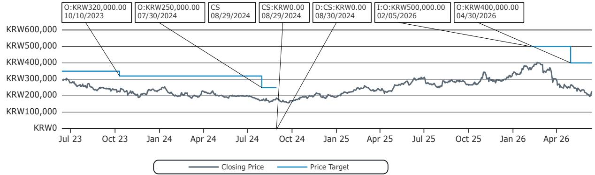

line chart

| Date       | Closing Price | Price Target |
| ---------- | ------------- | ------------ |
| 10/10/2023 | KRW320,000.00 | KRW320,000.00 |
| 07/30/2024 | KRW250,000.00 | KRW250,000.00 |
| 08/29/2024 | CS            | CS           |
| 08/29/2024 | CS:KRW0.00    | CS:KRW0.00   |
| 08/30/2024 | D:CS:KRW0.00  | D:CS:KRW0.00  |
| 02/05/2026 | I:O:KRW500,000.00 | I:O:KRW500,000.00 |
| 04/30/2026 | O:KRW400,000.00 | O:KRW400,000.00 |

Outperform (O); Market-Perform (M); Underperform (U); Coverage Suspended (CS); Not Covered (NC)

Live Nation Entertainment, Inc. (LYV) Rating History for Bernstein as of 06/12/2026  
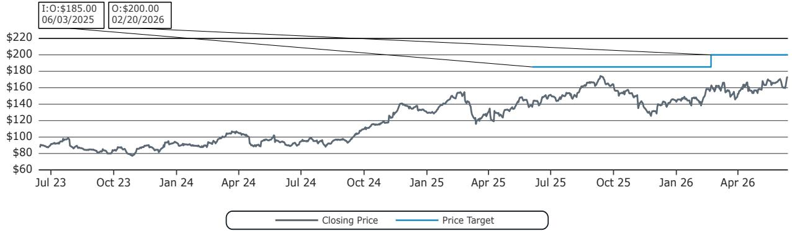

line chart

| Date       | Closing Price | Price Target |
| ---------- | ------------- | ------------ |
| 06/03/2025 | $185.00       | $185.00      |
| 02/20/2026 | $200.00       | $200.00      |

Outperform (O); Market-Perform (M); Underperform (U); Coverage Suspended (CS); Not Covered (NC)

Spotify Technology SA (SPOT) Rating History for Bernstein as of 06/12/2026  
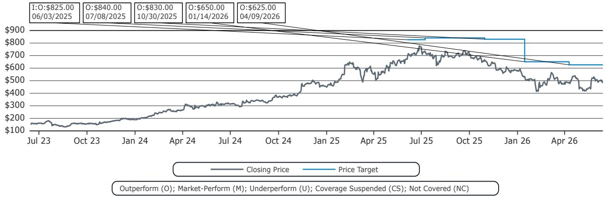

line chart

| Date       | Closing Price | Price Target |
| ---------- | ------------- | ------------ |
| 06/03/2025 | $825.00       |              |
| 07/08/2025 | $840.00       |              |
| 10/30/2025 | $830.00       |              |
| 01/14/2026 | $650.00       |              |
| 04/09/2026 | $625.00       |              |

Sony Group Corp (6758.JP) Rating History for Bernstein as of 06/12/2026  
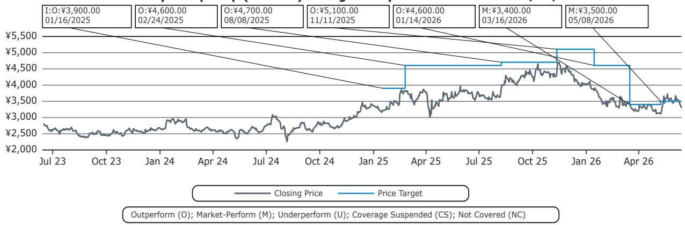

line chart

| Date       | Closing Price | Price Target |
| ---------- | ------------- | ------------ |
| 01/16/2025 | $3,900.00     | -            |
| 02/24/2025 | -             | $4,600.00    |
| 08/08/2025 | -             | $4,700.00    |
| 11/11/2025 | -             | $5,100.00    |
| 01/14/2026 | -             | $4,600.00    |
| 03/16/2026 | -             | $3,400.00    |
| 05/08/2026 | -             | $3,500.00    |

Sony Group Corp (SONY) Rating History for Bernstein as of 06/12/2026  
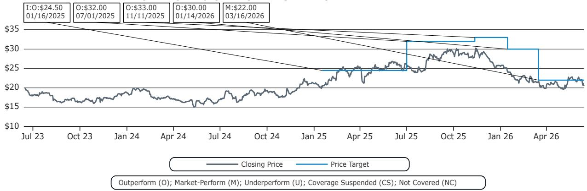

line chart

| Date       | Closing Price | Price Target |
| ---------- | ------------- | ------------ |
| 01/16/2025 | $24.50        | -            |
| 07/01/2025 | $32.00        | -            |
| 11/11/2025 | $33.00        | -            |
| 01/14/2026 | $30.00        | -            |
| 03/16/2026 | $22.00        | -            |

Universal Music Group (UMG.NA) Rating History for Bernstein as of 06/12/2026  
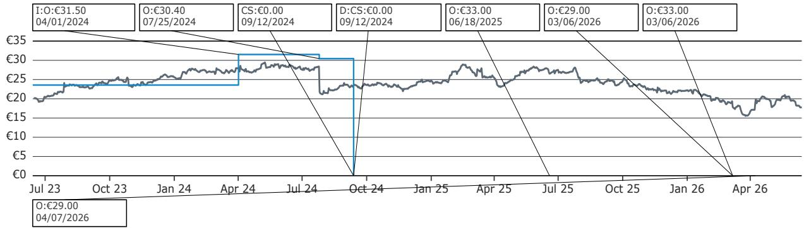

line chart

| Date       | Value  |
| ---------- | ------ |
| 04/01/2024 | €31.50 |
| 07/25/2024 | €30.40 |
| 09/12/2024 | €0.00  |
| 09/12/2024 | €0.00  |
| 06/18/2025 | €33.00 |
| 03/06/2026 | €29.00 |
| 03/06/2026 | €33.00 |
| 04/07/2026 | €29.00 |

text_image

Closing Price
Price Target
Outperform (O); Market-Perform (M); Underperform (U); Coverage Suspended (CS); Not Covered (NC)

All price target and closing price data in the chart(s) above are denominated in the currency noted in the Ticker Table of this report.

## CONFLICTS OF INTEREST

SG acted as Active Joint Bookrunner in UNIVERSAL MUSIC GROUP's bond issue (dual-tranche EUR 500m WNG - 4Y & 10Y). AB and/or its affiliates beneficially own 1% or more of a class of common equity securities of the following company: Hybe Co Ltd.

SG and/or its affiliates beneficially own 1% or more of a class of common equity securities of the following company: Spotify Technology SA.

SG and/or its affiliates beneficially own 0.5% or more of [the total issued share capital/any class of common equity securities] with a net [long/short] position of: Sony Group Corp.

Bernstein and/or affiliates have received compensation for investment banking services in the past twelve months from Universal Music Group.

Bernstein and/or affiliates have received compensation for non-investment banking securities-related products or services in the previous twelve months from the following clients: Live Nation Entertainment, Inc., Sony Group Corp and Universal Music Group.

Bernstein and/or affiliates expect to receive or intend to seek compensation for investment banking services in the next three months from Universal Music Group.

Certain affiliates of Bernstein act as market maker or liquidity provider in the debt securities of: Live Nation Entertainment, Inc..

Certain affiliates of Bernstein act as market maker or liquidity provider in the equities securities of: Universal Music Group.

Bernstein and/or affiliates had an investment banking client relationship during the past twelve months with Universal Music Group.

Affiliates of Bernstein managed or co-managed in the past twelve months a public offering of securities of Universal Music Group.

## OTHER MATTERS

The legal entity(ies) employing the analyst(s) listed in this report, and their location, can be determined by the country code of their phone number, as follows:

+1 Bernstein Institutional Services LLC; New York, New York, USA

+44 Bernstein Autonomous LLP; London UK

+212 SG Africa Technologies & Services; Casablanca, Morocco

+33 BSG France S.A.; Paris, France  
+34 BSG France S.A.; Madrid, Spain  
+41 Bernstein Autonomous LLP; Geneva, Switzerland  
+49 BSG France S.A.; Frankfurt, Germany  
+91 Bernstein (India) Private Limited; Mumbai, India  
+852 Bernstein (Hong Kong) Limited 盛博香港有限公司; Hong Kong, China  
+65 Bernstein (Singapore) Private Limited; Singapore  
+81 Bernstein Japan KK; Tokyo, Japan

Where this report has been prepared by research analyst(s) employed by a non-US affiliate, such analyst(s), is/are (unless otherwise expressly noted below) not registered as associated persons of Bernstein Institutional Services LLC or any other SEC-registered broker-dealer and are not licensed or qualified as research analysts with FINRA. Accordingly, such analyst(s) may not be subject to FINRA's restrictions regarding (among other things) communications by research analysts with a subject company, interactions between research analysts and investment banking personnel, participation by research analysts in solicitation and marketing activities relating to investment banking transactions, public appearances by research analysts, and trading securities held by a research analyst account.

Where this report has been prepared by research analyst(s) employed by SG Africa Technologies & Services (part of the SG group of companies), it has been prepared on behalf of a Bernstein company under a Global Services Agreement in place between Bernstein and SG.

## CERTIFICATION

Each research analyst listed in this report, who is primarily responsible for the preparation of the content of this report, certifies that all of the views expressed in this publication accurately reflect that analyst's personal views about any and all of the subject securities or issuers and that no part of that analyst's compensation was, is, or will be, directly or indirectly, related to the specific recommendations or views in this publication.

## II. ADDITIONAL GLOBAL CONFLICT DISCLOSURES

It is at the sole discretion of the Firm as to when to initiate, update and cease research coverage. The Firm has established, maintains and relies on information barriers to control the flow of information contained in one or more areas (i.e., the private side) within the Firm, and into other areas, units, groups or affiliates (i.e., public side) of the Firm.

## III. OTHER IMPORTANT INFORMATION AND DISCLOSURES

Separate branding is maintained for “Bernstein” and “Autonomous” research products.

- Bernstein produces a number of different types of research products including, among others, fundamental analysis and quantitative analysis under both the “Autonomous” and “Bernstein” brands. Recommendations contained within one type of research product may differ from recommendations contained within other types of research products, whether as a result of differing time horizons, methodologies or otherwise. Furthermore, views or recommendations within a research product issued under one brand may differ from views or recommendations under the same type of research product issued under the other brand. The Research Ratings System for the two brands and other information related to those Rating Systems are included in the previous section.  
- Autonomous operates as a separate business unit within the following entities: Bernstein Institutional Services LLC, Bernstein Autonomous LLP, Bernstein (Hong Kong) Limited 盛博香港有限公司 and Bernstein (India) Private Limited. For information relating to “Autonomous” branded products (including certain Sales materials) please visit: www.autonomous.com. For information relating to Bernstein branded products please visit: www.bernsteinresearch.com.

Analysts are compensated based on aggregate contributions to the research franchise as measured by account penetration, productivity and proactivity of investment ideas. No analysts are compensated based on performance in, or contributions to, generating investment banking revenues.

This report has been produced by an independent analyst as defined in Article 3 (1)(34)(i) of EU 596/2014 Market Abuse Regulation (“MAR”) and the same article of MAR as it forms part of United Kingdom domestic law by virtue of the European Union (Withdrawal) Act 2018.

To our readers in the United States: Bernstein Institutional Services LLC, a broker-dealer registered with the U.S. Securities and Exchange Commission (“SEC”) and a member of the U.S. Financial Industry Regulatory Authority, Inc. (“FINRA”) is distributing this publication in the United States and accepts responsibility for its contents. Where this material contains an analysis of debt product(s), such material is intended only for institutional investors and is not subject to the US independence and disclosure standards applicable to debt research prepared for retail investors.

Bernstein Institutional Services LLC may act as principal for its own account or as agent for another person (including an affiliate) in sales or purchases of any security which is a subject of this report. This report does not purport to meet the objectives or needs of any specific individuals, entities or accounts.

To our readers in Canada: If this publication pertains to a Canadian domiciled company, it is being distributed in Canada by Bernstein (Canada) Limited, which is licensed and regulated by the Canadian Investment Regulatory Organization. If the publication pertains to a non-Canadian domiciled company, it is being distributed by Bernstein Institutional Services LLC, which is licensed and regulated by both the SEC and FINRA, into Canada under the International Dealers Exemption.

This document may not be passed onto any person in Canada unless that person qualifies as "permitted client" as defined in Section 1.1 of NI 31-103.

To our readers in Brazil: This report has been prepared by Bernstein Institutional Services LLC, and Banco BTG Pactual S.A. ("BTG") is responsible for the distribution of this report in Brazil.

To readers in the United Kingdom: This publication has been issued or approved for issue in the United Kingdom by Bernstein Autonomous LLP, authorised and regulated by the Financial Conduct Authority and located at 60 London Wall, London EC2M 5SH, +44 (0)20-7170-5000. Registered in England & Wales No OC343985.

This document is for distribution only to persons who (i) have professional experience in matters relating to investments falling within Article 19(5) of the Financial Services and Markets Act 2000 (Financial Promotion) Order 2005 (as amended, the “Financial Promotion Order”), (ii) are persons falling within Article 49(2)(a) to (d) (“high net worth companies, unincorporated associations, etc.”) of the Financial Promotion Order, (iii) are outside the United Kingdom, or (iv) are persons to whom an invitation or inducement to engage in investment activity (within the meaning of section 21 of the FSMA) in connection with the issue or sale of any securities may otherwise lawfully be communicated or caused to be communicated (all such persons together being referred to as “relevant persons”). This document is directed only at relevant persons and must not be acted on or relied on by persons who are not relevant persons. Any investment or investment activity to which this document relates is available only to relevant persons and will be engaged in only with relevant persons.

To our readers in the member states of the EEA: This publication is being distributed by BSG France SA, which is authorised and regulated by the Autorité de Contrôle Prudentiel et de Résolution (ACPR) and Autorité des Marchés Financiers (AMF).

To our readers in Hong Kong: This publication is being distributed in Hong Kong by Bernstein (Hong Kong) Limited 盛博香港有限公司, which is licensed and regulated by the Hong Kong Securities and Futures Commission (Central Entity No. AXC846) to carry out Type 4 (Advising on Securities) regulated activities and subject to the licensing conditions mentioned in the SFC Public Register (https://www.sfc.hk/publicregWeb/corp/AXC846/details)). This publication is solely for professional investors, as defined in the Securities and Futures Ordinance (Cap. 571). The purpose of this report is solely to provide an analysis of the issuers referred to in this report and is not intended for any purpose contrary to the laws of Hong Kong.

To our readers in Singapore: This publication is being distributed in Singapore by Bernstein (Singapore) Private Limited, only to accredited investors or institutional investors, as defined in the Securities and Futures Act 2001 of Singapore ("SFA"). Recipients in Singapore should contact Bernstein (Singapore) Private Limited in respect of matters arising from, or in connection with, this publication. Bernstein (Singapore) Private Limited is regulated by the Monetary Authority of Singapore and licensed under the SFA as a capital markets services licence holder for dealing in capital markets products that are securities and collective investment schemes and an exempt financial adviser for advising on, issuing and promulgating analyses and reports on securities. Bernstein (Singapore) Private Limited is registered in Singapore with Company Registration No. 20213710W and located at 8 Marina Boulevard, #12-01, Marina Bay Financial Centre, Singapore 018981, +65-6326-7000.

To our readers in the People's Republic of China: The securities referred to in this document are not being offered or sold and may not be offered or sold, directly or indirectly, in the People's Republic of China (for such purposes, not including the Hong Kong and Macau Special Administrative Regions or Taiwan, the "PRC") in contravention of any applicable laws of the PRC.

This document does not constitute an offer to sell or the solicitation of an offer to buy any securities in the PRC to any person to whom it is unlawful to make the offer or solicitation in the PRC.

We do not represent that this document may be lawfully distributed, or that any securities may be lawfully offered, in compliance with any applicable registration or other requirements in the PRC, or pursuant to an exemption available thereunder, or assume any responsibility for facilitating any such distribution or offering. In particular, no action has been taken by us which would permit a public offering of any securities or distribution of this document in the PRC. Accordingly, the securities are not being offered or sold within the PRC by means of this document or any other document. Neither this document nor any advertisement or other offering material may be distributed or published in the PRC, except under circumstances that will result in compliance with any applicable laws and regulations.

To our readers in Japan: This publication is being distributed in Japan by Bernstein Japan KK (サンフォード・C・バーンスタイン株式会社), which is registered in Japan as a Financial Instruments Business Operator with the Kanto Local Finance Bureau (registration number: The Director-General of Kanto Local Finance Bureau (FIBO) No.3387) and regulated by the Financial Services Agency. It is also a member of Investment Management Association of Japan. This publication is solely for qualified institutional investors in Japan only, as defined in Article 2, paragraph (3), items (i) of the Financial Instruments and Exchange Act.

For the institutional client readers in Japan who have been granted access to the Bernstein website by Daiwa Group Inc. ("Daiwa"), your access to this document should not be construed as meaning that Bernstein is providing you with investment advice for any purposes. Whilst Bernstein has prepared this document, your relationship is, and will remain with, Daiwa, and Bernstein has neither any contractual relationship with you nor any obligations towards you.

To our readers in Australia: Bernstein (Hong Kong) Limited 盛博香港有限公司 is responsible for distributing research in Australia. It is regulated by the Securities and Exchange Commission under U.S. laws, by the Financial Conduct Authority under U.K. laws, which differs from Australian laws. Bernstein (Hong Kong) Limited 盛博香港有限公司 is exempt from the requirement to hold an Australian financial services license under the Corporations Act 2001 in respect of the provision of the following financial services to wholesale clients:

• providing financial product advice;  
• dealing in a financial product;  
• making a market for a financial product; and  
• providing a custodial or depository service.

To our readers in India: This publication is being distributed in India by Bernstein (India) Private Limited (SCB India) which is licensed and regulated by Securities and Exchange Board of India ("SEBI") as a research analyst entity under the SEBI (Research Analyst) Regulations, 2014, having registration no. INH000006378 and as a stock broker having registration no. INZ000213537. SCB India is currently engaged in the business of providing research and stock broking services. Please refer to www.bernsteinresearch.in for more information.

- SCB India is a Private limited company incorporated under the Companies Act, 2013, on April 12, 2017 bearing corporate identification number U65999MH2017FTC293762, and registered office at Level 3A, 4th Floor, First International Financial Centre, Plot Nos C-54 and C-55, G Block, Near CBI Office, Bandra Kurla Complex, Bandra (East), Mumbai 400098, Maharashtra, India (Phone No: +91-22-68421401).  
- For details of Associates (i.e., affiliates/group companies) of SCB India, kindly email MUM-BERNSTEIN-InCompliance@bernsteinsg.com.  
• SCB India does not have any disciplinary history as on the date of this report.  
- Except as noted above, SCB India and/or its Associates (i.e., affiliates/group companies), the Research Analysts authoring this report, and their relatives

• do not have any financial interest in the subject company  
- do not have actual/beneficial ownership of one percent or more in securities of the subject company;  
• is not engaged in any investment banking activities for Indian companies, as such;

• have not managed or co-managed a public offering in the past twelve months for any Indian companies;  
- have not received any compensation for investment banking services or merchant banking services from the subject company in the past 12 months;  
• have not received compensation for brokerage services from the subject company in the past twelve months;  
- have not received any compensation or other benefits from the subject company or third party related to the specific recommendations or views in this report; and  
- do not currently, but may in the future, act as a market maker in the financial instruments of the companies covered in the report.  
• do not have any conflict of interest in the subject company as of the date of this report.

- Except as noted above, the subject company has not been a client of SCB India during twelve months preceding the date of distribution of this research report. Neither SCB India nor its Associates (i.e., affiliates/group companies) have received compensation for products or services other than investment banking, merchant banking or brokerage services from the subject company in the past twelve months.  
- The principal research analyst(s) who prepared this report, members of the analysts' team, and members of their households are not an officer, director, employee or advisory board member of the companies covered in the report.  
- Our Compliance officer / Grievance officer is Ms. Rupal Talati, who can be reached at +91-22-68421451, or MUM-BERNSTEIN-InCompliance@bernsteinsg.com / Scbin-investorgrievance@bernsteinsg.com  
- The Research investor charter and Terms & Conditions of SCB India are available on its website and may be accessed at Bernstein (India) Private Limited (https://bernsteinresearch.in/) for your reference.  
- Disclaimer: Registration granted by SEBI, and certification from NISM, is in no way a guarantee of performance of the intermediary or provide any assurance of returns to investors. Investments in securities market are subject to market risks. Read all the related documents carefully before investing.

To our readers in Switzerland: This document is provided in Switzerland by or through Bernstein Autonomous LLP, and is provided only to qualified investors as defined in article 10 of the Swiss Collective Investment Scheme Act (“CISA”) and related provisions of the Collective Investment Scheme Ordinance and in strict compliance with applicable Swiss law and regulations. The products mentioned in this document may not be suitable for all types of investors. This document is based on the Directives on the Independence of Financial Research issued by the Swiss Bankers Association (SBA) in January 2008.

To our readers in the Middle East: Bernstein Autonomous LLP, DIFC branch has its principal office at Gate Village 06, DIFC, Dubai, UAE. Bernstein Autonomous LLP, DIFC branch is regulated by the Dubai Financial Services Authority (DFSA) with the registration number CL10040 and is provisioned for Arranging Deals in Investments and Advising on Financial Products. All communications and services are directed at Professional Clients and Market Counterparties only (as defined in the DFSA rulebook). Persons other than Professional Clients and Market Counterparties, such as Retail Clients, are not the intended recipients of our communications or services.

## LEGAL

All research publications are disseminated to our clients through posting on the firm's password protected websites, bernsteinresearch.com and autonomous.com. Certain, but not all, research publications are also made available to clients through third-party vendors or redistributed to clients through alternate electronic means as a convenience.

This publication has been published and distributed in accordance with the Firm's policy for management of conflicts of interest in investment research, a copy of which is available from Bernstein Institutional Services LLC, Director of Compliance, 245 Park Avenue, New York, NY 10167. Additional disclosures and information regarding Bernstein's business are available on our website www.bernsteinresearch.com.

The securities described herein may not be eligible for sale in all jurisdictions or to certain categories of investors where that permission profile is not consistent with the licenses held by the entities noted herein. This document is for distribution only as may be permitted by law. This publication is not directed to, or intended for distribution to or use by, any person or entity who is a citizen or resident of, or located in any locality, state, country or other jurisdiction where such distribution, publication, availability or use would be contrary to law or regulation or which would subject any of the entities referenced herein or any of their subsidiaries or affiliates to any registration or licensing requirement within such jurisdiction. This publication is based upon public sources we believe to be reliable, but no representation is made by us that the publication is accurate or complete. We do not undertake to advise you of any change in the reported information or in the opinions herein. This publication was prepared and issued by entity referred to herein for distribution to eligible counterparties or professional clients. This publication is not an offer to buy or sell any security, and it does not constitute investment, legal or tax advice. The investments referred to herein may not be suitable for you. Investors must make their own investment decisions in consultation with their professional advisors in light of their specific circumstances. The value of investments may fluctuate, and investments that are denominated in foreign currencies may fluctuate in value as a result of exposure to exchange rate movements. Information about past performance of an investment is not necessarily a guide to, indicator of, or assurance of, future performance.

This report is directed to and intended only for our clients who are “eligible counterparties”, “professional clients”, “institutional investors” and/or “professional investors” as defined by the aforementioned regulators, and must not be redistributed to retail clients as defined by the aforementioned regulators. Retail clients who receive this report should note that the services of the entities noted herein are not available to them and should not rely on the material herein to make an investment decision. The result of such act will not hold the entities noted herein liable for any loss thus incurred as the entities noted herein are not registered/authorised/licensed to deal with retail clients and will not enter into any contractual agreement/arrangement with retail clients. This report is provided subject to the terms and conditions of any agreement that the clients may have entered into with the entities noted herein. All research reports are disseminated on a simultaneous basis to eligible clients through electronic publication to our client portal.

The information in this report was prepared by Bernstein solely for the internal business use of our clients. Clients may store, display, analyze, reformat and print the information in this report for this limited use only. Clients may not copy, alter, create derivative works, resell, reverse engineer, commercially exploit, share or distribute any part of the information contained herein for any purpose without Bernstein's express written consent. These restrictions include extracting data or using the content to develop indices or other products. Further, you may not use this report, or any portion of this report, to train or finetune any third-party machine learning or artificial intelligence system, or as a prompt or input into any such system. You also may not, without Bernstein's express written consent, do any of the foregoing in connection with your own internal machine learning or artificial intelligence system.

Bernstein may use artificial intelligence tools in the preparation of its materials. Any such materials are reviewed by Bernstein's research analysts prior to publication.

This report has been prepared for information purposes only and is based on current public information that we consider reliable, but the entities noted herein do not warrant or represent (express or implied) as to the sources of information or data contained herein are accurate, complete, not misleading or as to its fitness for the purpose intended even though the entities noted herein rely on reputable or trustworthy data providers, it should not be relied upon as such. Opinions expressed are the author(s)' current opinions as of the date appearing on the material only and we do not undertake to advise you of any change in the reported information or in the opinions herein.

Any references to SG herein are purely factual, based upon publicly available information, and included for comparative purposes only. They do not constitute an opinion or recommendation with respect to the securities of SG.

This publication was prepared and issued by the entity referred to herein for distribution to eligible counterparties or professional clients. The information in this report is intended for general circulation and does not constitute an offer to buy or sell any security, investment, legal or tax advice nor a personal recommendation, as defined by any of the aforementioned regulators. It does not take into account the particular investment objectives, financial situations, or needs of individual investors. The report has not been reviewed by any of the aforementioned regulators and does not represent any official recommendation from the aforementioned regulators. The investments referred to herein may not be suitable for you. Investors must make their own investment decisions in consultation with advice sought from a financial adviser regarding the suitability of the investment product, taking into account the specific investment objectives, financial situation or particular needs of any recipient of the recommendation, before the recipient makes a commitment to purchase the investment product.

The analysis contained herein is based on numerous assumptions. Different assumptions could result in materially different results. The information in this report does not constitute, or form part of, any offer to sell or issue, or any offer to purchase or subscribe for shares, or to induce engagement in any other investment activity. The value of any securities or financial instruments mentioned in this report may fluctuate subject to market conditions. Information about past performance of an investment is not necessarily a guide to, indicative of, or assurance of future performance. Estimates of future performance mentioned by the research analyst in this report are based on assumptions that may not be realized due to unforeseen factors like market volatility/fluctuation. In relation to securities or financial instruments denominated in a foreign currency other than the clients' home currency, movements in exchange rates will have an effect on the value, either favorable or unfavorable. Before acting on any recommendations in this report, recipients should consider the appropriateness of investing in the subject securities or financial instruments mentioned in this report and, if necessary, seek independent professional advice.

The securities described herein may not be eligible for sale in all jurisdictions or to certain categories of investors where that permission profile is not consistent with the licenses held by the entities noted herein. This document is for distribution only as may be permitted by law. It is not directed to, or intended for distribution to or use by, any person or entity who is a citizen or resident of or located in any locality, state, country or other jurisdiction where such distribution, publication, availability or use would be contrary to law or regulation or would subject the entities noted herein to any regulation or licensing requirement within such jurisdiction.

Source: Bloomberg Index Services Limited. BLOOMBERG® is a trademark and service mark of Bloomberg Finance L.P. and its affiliates (collectively “Bloomberg”). Bloomberg or Bloomberg’s licensors own all proprietary rights in the Bloomberg Indices. Neither Bloomberg nor Bloomberg’s licensors approves or endorses this material, or guarantees the accuracy or completeness of any information herein, or makes any warranty, express or implied, as to the results to be obtained therefrom and, to the maximum extent allowed by law, neither shall have any liability or responsibility for injury or damages arising in connection therewith.

No part of this material may be reproduced, distributed or transmitted or otherwise made available without prior consent of the entities noted herein. Copyright Bernstein Institutional Services LLC Bernstein Autonomous LLP, BSG France S.A., Bernstein (Hong Kong) Limited 盛博香港有限公司, Bernstein (Canada) Limited, Bernstein (India) Private Limited (SEBI registration no. INH000006378), Bernstein (Singapore) Private Limited and Bernstein Japan KK (サンフォード・C・バーンスタイン株式会社). All rights reserved. The trademarks and service marks contained herein are the property of their respective owners. Any unauthorized use or disclosure is strictly prohibited. The entities noted herein may pursue legal action if the unauthorized use results in any defamation and/or reputational risk to the entities noted herein and research published under the Bernstein and Autonomous brands.