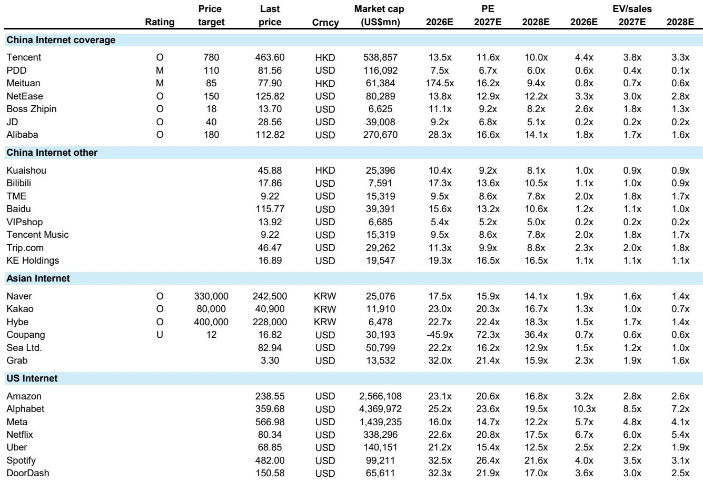
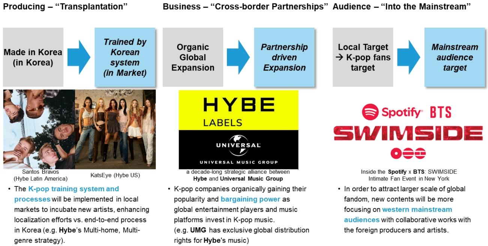

# The Moment Economy Has Overtaken the Unit Economy: Why Concert Revenue Is Now the Center of Gravity for Music Industry Profit

The music industry's most important structural shift is no longer about streaming versus downloads. It is about the collapse of the unit-based business model and the rise of a time-based monetization framework where concerts, not albums, have become the primary engine of profit. This is not a cyclical recovery in live entertainment. It is a fundamental reordering of how value is created and captured across the entire music ecosystem.

For decades, the music business measured success in units sold: albums, singles, and later, stream-equivalent albums. The artist's job was to produce content. The label's job was to distribute it. The fan's job was to consume it. That model is now structurally in decline, not because fans have stopped caring about music, but because they have changed what they are willing to pay for. A growing body of evidence from the global music industry, particularly from the K-pop sector, demonstrates that fans are increasingly spending not on owning music, but on experiencing it in real time alongside the artist.

This shift matters for every investor with exposure to entertainment, media, and platform companies. The companies that understand this transition and restructure their operations around the "moment economy" will capture disproportionate value. Those that remain anchored to unit-based thinking will find themselves competing for a shrinking pool of revenue. The report that follows, drawn from a global investment bank's deep-dive analysis of K-pop economics, provides the analytical framework for understanding this transition and its implications for the industry's most important players.

## The Core Shift: Fans Are No Longer Buying Products; They Are Buying Time With Artists

The most important insight from the report is that K-pop fandom has structurally rotated from album purchasing to experience purchasing. This is not a matter of taste or generational preference. It is a rational response to a changing economic environment in which the perceived value of time is rising even as the real purchasing power of money is squeezed.

Consider the math. A physical album costs roughly $15 to $25. The fan receives a tangible product, but the emotional return is largely front-loaded: the excitement of unboxing, the novelty of the photocard, and perhaps a few hours of listening. A concert ticket, by contrast, costs $100 to $300 or more. But the emotional return does not end when the show concludes. In the K-pop ecosystem, a two-to-three-hour concert generates months of residual value through social media clips, fan-edited content, community discussion, and the ongoing sense of shared experience. The emotional return per hour is dramatically higher for the live event than for the physical product.

This is not unique to K-pop. The broader consumer economy has been moving in this direction for years, with spending on experiences outpacing spending on goods across multiple demographic cohorts. But K-pop has operationalized this shift more aggressively than any other music genre. The report documents that Hybe, the company behind BTS, has built its entire business model around this insight. Each concert is not merely a revenue event in itself. It is a platform that seeds multiple streams of high-margin digital monetization, from streaming spikes to social media amplification to paid digital content.

The implication for investors is clear: the companies that will win in the next phase of the music industry are not necessarily those with the largest catalogues or the most efficient distribution. They are those that can repeatedly monetize live, time-bound fan engagement at scale.

## Hybe Has Turned the Concert Into a Full-Stack Monetization Platform

The report provides a detailed case study of how Hybe has operationalized the moment economy. The company's approach treats each concert not as a standalone event, but as a monetization node within a larger system. The ticket sale is only the first layer. On top of that, Hybe layers VIP packages, soundcheck experiences, tour-exclusive merchandise, fan club memberships, and digital content that extends the life of the event.

This is a fundamentally different business model from the traditional concert economics that most investors understand. In the conventional model, touring is often a break-even or low-margin activity, with the real profit coming from album sales and publishing rights that the tour promotes. Hybe has inverted this logic. The concert is the profit center. The album, the streaming release, and the digital content are all supporting assets that feed into the live event ecosystem.

The scale at which Hybe executes this model is striking. The report notes that the company filled 50,000-capacity venues across more than 80 sold-out shows in a single tour. In 2024 alone, Hybe staged 279 concerts across 53 cities. This is not the cadence of a typical record label. It is the operational profile of a global live entertainment company.

The structural advantage here is that Hybe's global scale reduces its dependence on local promoters. When a company can fill stadiums in multiple continents without relying on third-party marketing or local artist rosters, it retains a greater share of the economics. The report estimates that Hybe commands approximately 70% of K-pop concert revenue, a concentration that gives it significant bargaining power with venues, promoters, and platforms.

For investors, the question is whether this model is replicable. The answer is likely yes, but with significant barriers to entry. Building the fan base that can fill stadiums globally takes years of investment in artist development, content production, and community management. The companies that have already done this work, such as Hybe and the other major K-pop labels, have a structural head start that will be difficult to close.

## The Superfan Flywheel Connects Streaming Platforms to Live Events in a Virtuous Cycle

One of the most strategically important insights from the report is the identification of a "superfan flywheel" that connects digital platforms to live events. The logic works as follows: highly engaged fans, or "superfans," already spend disproportionately on digital music consumption. These fans are the ideal targets for premium streaming tiers, and platforms like Spotify have been investing in tools to convert them into higher-ARPU subscribers.

But the monetization does not stop at the digital layer. The same superfans are the ones most likely to buy concert tickets, and they are willing to pay above-average prices for premium access. The report identifies a symbiotic relationship between Spotify and Live Nation, where Spotify's tools for identifying and engaging superfans feed directly into Live Nation's ticketing infrastructure. Spotify monetizes the fan online; Live Nation monetizes them offline. Together, they maximize the lifetime value of the fan.

This flywheel has powerful implications for the valuation of both platform companies and live entertainment companies. The report rates both Spotify and Live Nation as Outperform, reflecting the view that the structural shift toward live monetization benefits both the digital gatekeeper and the physical venue operator. The key question for investors is whether this symbiosis can be maintained as the two companies inevitably compete for a larger share of the superfan's wallet.

The report also raises an important unresolved question: what happens when the superfan's spending capacity hits a ceiling? The current model assumes that fans will continue to increase their per-capita spend on live experiences. But there is a limit to how many concerts a fan can attend and how much they can pay for premium access. The companies that succeed in the long run will be those that can expand the superfan base, not just extract more from the existing one.

## What the Report Does Not Fully Address: The Fragility of Artist Dependency

For all its analytical rigor, the report leaves one critical question partially unanswered: what happens when the artist stops touring? The entire Hybe model is built around BTS, and while the company has successfully incubated new IPs, no artist in its roster has yet demonstrated the same global crowd-pulling power. The report acknowledges that newly incubated Hybe artists are commanding ticket prices comparable to global-tier acts, but it does not provide sufficient data to assess whether this pricing power is sustainable across multiple generations of artists.

This is not a minor concern. The history of the music industry is littered with companies that built their business models around a single artist or group, only to see their economics collapse when that artist retired, disbanded, or lost popularity. Hybe has diversified more than most, but the concentration of revenue around BTS remains a structural risk that the report does not fully model.

The second unresolved question is whether the moment economy can scale beyond K-pop. The report makes a compelling case that K-pop's unique characteristics, particularly its intensely engaged fan culture and its social media amplification dynamics, make it particularly suited to the live monetization model. But it is less clear whether Western pop, hip-hop, or other genres can replicate the same economics. The answer may be that the model works best for genres with the highest fan engagement intensity, which would imply a more limited addressable market than the report suggests.

## A Decision Framework for Investors: Four Questions to Ask About Any Music or Entertainment Company

The report's analysis can be distilled into a decision framework that investors can apply to any company in the music or live entertainment space. The framework consists of four questions:

First, what is the company's primary monetization mechanism? Is it selling units (albums, streams, downloads) or selling time (concerts, experiences, fan interactions)? Companies in the first category face structural headwinds. Companies in the second category have tailwinds, but only if they can scale the live experience without destroying its scarcity value.

Second, does the company own the fan relationship, or does it rent it from an artist? This is the most important strategic question. Companies that own the fan relationship, either through direct-to-consumer platforms or through long-term artist contracts, can capture value across multiple monetization layers. Companies that rent the relationship, through short-term licensing or distribution deals, are vulnerable to disintermediation.

Third, can the company convert offline engagement into online monetization, and vice versa? The most valuable companies in the moment economy are those that can operate across both channels. Hybe's ability to turn a concert into weeks of digital content consumption is a model for what this looks like in practice. Companies that are strong in only one channel will find themselves at a competitive disadvantage.

Fourth, what is the company's exposure to superfan concentration? Companies that depend on a small number of highly engaged fans for a large share of their revenue are vulnerable to fan fatigue, economic downturns, and shifting cultural trends. The ideal portfolio is one in which the superfan base is large, growing, and diversified across multiple artists and genres.

## The Full Report Contains the Data and Charts That Support This Analysis

The analysis presented here is based on a detailed report from a global investment bank that includes proprietary data on K-pop revenue trends, concert economics, and company-level financial projections. The report contains charts that illustrate the structural shift from unit-based to time-based monetization, the relative market share of K-pop in the global touring landscape, and the valuation frameworks for the key companies in the ecosystem.

For investors who want to dig deeper into the numbers, the full report provides the original data, the valuation comps tables, and the detailed financial models that support the Outperform ratings on Hybe, Spotify, and Live Nation. It also includes the analyst team's assessment of the risks and uncertainties that could disrupt the moment economy thesis.

Join the community to read the full report and review the original charts.

*This article is for learning and discussion only and does not constitute investment advice.*

Personal reading notes and learning share only. Not investment advice.

