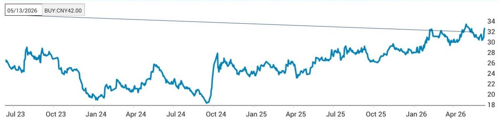
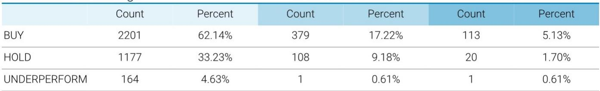
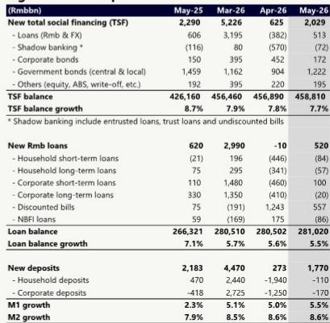

# JEF：K型经济深化，市场低估了结构性分化对金融资产定价的影响

五月的金融数据公布后，市场情绪一度被社融总量超预期所提振。但这份JEF研报揭示了一个更值得关注的信号：表面改善的流动性，其质量远低于市场直觉判断。M1增速超预期并非企业资本开支意愿的回暖，而是预防性现金囤积；新增贷款中超过100%由票据贴现驱动，居民信贷仍在收缩区间。这些数据合在一起指向一个结论——中国经济正在加速K型分化，而这一分化对金融资产定价的含义，远比总量数字所显示的更为深远。

这份报告的核心价值不在于它给出了哪些投资建议，而在于它提供了一个识别结构分化的分析框架。JEF团队从三个维度拆解了当前宏观数据的真实含义，并在此基础上提出了一个在金融板块内部的杠铃策略。以下是我们基于这份研报的解读与延伸思考。

## 1. 社融总量超预期的背后，是政府信用对私人信用的加速替代

五月新增社融2.03万亿元，超出市场预期19%。但拆解结构后，这一数字的“含金量”需要重新审视。政府债券发行贡献了1.22万亿元，占当月新增社融的60%。企业债券融资同比改善14.6%，部分抵消了企业中长期贷款的疲弱。而影子银行继续收缩，表外融资净减少。

这组数据的含义是清晰的：当前信用扩张的引擎已经从市场转向政府。这不是一个周期性的切换，而是一个结构性趋势的延续。2022年以来，政府债券在新增社融中的占比持续走高，从2021年的不到20%上升至当前接近40%的水平。这背后反映的是私人部门去杠杆与政府部门加杠杆的并行。

对于投资者而言，这一趋势意味着两个层面的含义。第一，信用扩张的效率在下降——政府债的乘数效应通常低于企业贷款和居民贷款。第二，银行资产的组合结构正在发生根本性变化，对政府债的依赖度上升意味着净息差的长期压力，因为政府债收益率远低于贷款收益率。这不是一个暂时现象，而是中国经济再平衡过程中不可避免的阶段。

## 2. M1改善是“假性回暖”，真正的企业现金需求并未恢复

五月M1增速录得5.5%，高于市场预期的5.0%。乍看之下，这是一个积极信号，因为M1通常被视为企业活期存款的代理变量，其改善往往预示着企业流动性状况好转。但JEF的解读提供了另一个视角：M1的改善更可能来自预防性流动性需求，而非企业真实的资本配置意愿。

支撑这一判断的关键证据来自PMI新订单指数。五月PMI新订单环比下降0.7个百分点至49.9，重新跌入收缩区间。当新订单收缩时，企业没有理由增加生产经营性现金持有。因此，M1的改善更可能反映了企业在不确定性加剧的环境下，选择持有更多活期存款以备不时之需。

这一判断如果成立，意味着当前M1的回升不具备可持续性。一旦企业发现预防性现金持有的机会成本上升（例如存款利率下行），或者经济预期出现边际改善，这部分“虚胖”的M1可能迅速转化为定期存款或理财产品。投资者不应将当前M1改善视为信贷需求回暖的先行指标。

## 3. 信贷结构揭示了一个尚未解决的问题：居民部门仍在主动去杠杆

五月新增人民币贷款5200亿元，同比少增约1000亿元。更值得关注的是结构：票据贴现新增5570亿元，占当月新增贷款的比重超过107%。这意味着，如果剔除票据贴现，其他所有贷款类别合计为净收缩。企业中长期贷款净减少20亿元，居民短期贷款净减少84亿元，居民中长期贷款净减少57亿元。

居民部门的信贷收缩尤其值得深思。从2022年开始，居民存款增速持续高于居民贷款增速，2023年这一趋势进一步强化。2025年居民存款增加约15万亿元，而居民贷款仅增加约0.8万亿元。2026年前七个月，居民存款继续增加约6万亿元，而居民贷款净减少约1万亿元。居民部门正在经历一个主动去杠杆的过程，其力度和持续时间都超出了此前的市场预期。

这一趋势对银行资产质量和息差的影响是双重的。一方面，按揭贷款和消费贷款的需求持续疲弱，银行被迫将信贷资源向票据贴现和公司贷款倾斜，这进一步压低了整体贷款收益率。另一方面，居民存款的持续高增长意味着银行的负债成本难以有效下降，因为居民存款的利率弹性远低于企业存款。净息差的压力可能比市场预期的更为持久。

## 4. K型经济的三个维度：出口与内需、服务业与制造业、上游与下游

JEF从三个维度刻画了当前经济的K型分化。第一个维度是服务业与制造业的分化。RatingDog PMI与官方PMI的差距在五月进一步扩大。RatingDog PMI录得54.4，而官方PMI仅为49.3。这一差距背后反映的是AI超级周期驱动的服务出口和高端制造活动在加速扩张，而传统制造业和基建活动则处于放缓区间。

第二个维度是出口与内需的分化。五月出口同比增长19.4%，超出市场预期的15%，创下2026年2月以来最强增速。出口的强劲主要由可再生能源和AI相关产品需求驱动。而与此同时，核心CPI环比下降0.1个百分点至1.1%，服务品和核心商品价格均表现疲弱。出口的繁荣并未有效传导至国内消费。

第三个维度是上游与下游的分化。PPI同比上涨3.9%，较四月的2.8%进一步走高，但PMI原材料价格指数环比下降，表明来自中东的通胀压力有所缓解。更关键的是，购进价格与出厂价格之间的持续差距表明，成本上涨的传导能力有限。下游行业仍处于通胀早期阶段，远未进入再通胀情景。

这三组分化共同指向一个核心判断：当前经济的K型特征不是短期波动，而是结构性的。出口部门、服务业、AI相关产业在加速增长，而内需、传统制造业、下游行业则面临持续压力。这一分化的持续时间取决于政策选择——是继续通过财政扩张托底传统部门，还是加速推动资源向高增长部门转移。目前来看，政策天平似乎更倾向于前者。

## 5. 杠铃策略的底层逻辑：在K型分化中寻找确定性

基于上述宏观判断，JEF在金融板块内部提出了一个杠铃策略：一端是中国银行（H股）和宁波银行（A股），另一端是港交所。这一策略的底层逻辑在于，K型分化意味着不同金融子行业面临截然不同的增长驱动因素。

对于国有大行而言，其优势在于对政府债和基建项目的敞口。在政府信用持续扩张的背景下，国有大行的资产扩张有更稳定的支撑。同时，其分红收益率在当前低利率环境下具有相对吸引力。中国银行作为跨境业务占比较高的国有大行，还受益于人民币国际化和资本账户开放的长期趋势。

对于城商行而言，宁波银行的代表意义在于其对区域经济的深度绑定。宁波银行所在的浙江地区是中国民营经济最活跃、出口竞争力最强的区域之一。在K型经济中，区域分化本身就是一个重要的投资主题。选择与高增长区域深度绑定的银行，本质上是做多区域经济分化。

港交所则代表了一个完全不同的逻辑。它不直接暴露于国内信贷周期，而是受益于资本账户开放的长期趋势。国务院近期出台的对外投资新规，其核心意图不是限制资本流出，而是将资本流动引导至官方渠道。QDII、港股通、理财通等正式渠道将成为跨境资本流动的主要载体，港交所作为这些渠道的核心基础设施，将长期受益于这一结构性变化。

## 6. 报告尚未完全回答的关键问题：K型分化何时会触发政策转向

这份JEF研报提供了一个有力的分析框架，但它也留下了一个尚未完全回答的问题：K型分化的持续是否会触发政策转向？如果内需持续疲弱，而出口部门面临贸易摩擦升级的风险，政策会否从当前的“托底式”扩张转向“刺激式”扩张？

目前来看，政策选择的约束条件正在发生变化。一方面，PPI持续走高限制了货币政策进一步宽松的空间。另一方面，居民部门去杠杆的惯性尚未消退，财政刺激的乘数效应正在递减。这意味着，政策转向的时点和力度存在高度不确定性。

一个值得关注的观察指标是居民存款与居民贷款之间的差额。如果居民存款增速开始放缓，或者居民贷款出现边际回暖，这可能意味着去杠杆过程接近尾声。另一个指标是核心CPI是否能够企稳回升。如果核心CPI持续低于1.0%，政策压力将显著上升。

这些问题的答案将直接影响金融资产的定价。如果政策转向，受益的将是内需敏感型资产，包括消费金融、零售银行和地产相关资产。如果政策维持现状，K型分化将持续，当前杠铃策略的有效性将得到验证。投资者需要密切跟踪这两个维度的信号。

---

上述分析只是基于JEF这份研报的初步解读。报告中还有更多关于银行估值模型、风险情景分析以及港交所盈利驱动因素的细节，我们无法在一篇文章中完全展开。例如，中国银行的DDM模型假设了怎样的长期ROE？宁波银行的区域经济优势在估值中如何体现？港交所的P/E倍数在不同市场情景下的敏感性如何？这些问题的答案，都在完整报告中。

欢迎来星球微信群继续讨论。我们会在群里分享这份JEF研报的完整版，以及我们基于报告的延伸分析。也欢迎你带着自己的判断和疑问来交流，K型经济的投资机会，值得更深入的拆解。

Personal reading notes and learning share only. Not investment advice.

