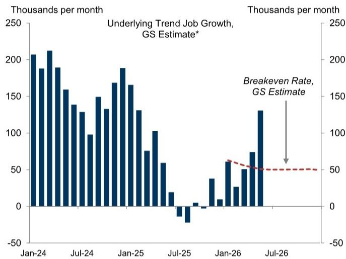
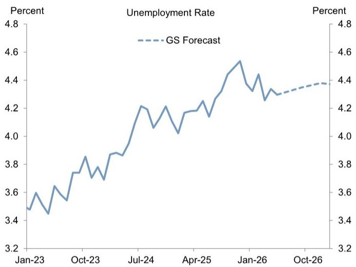
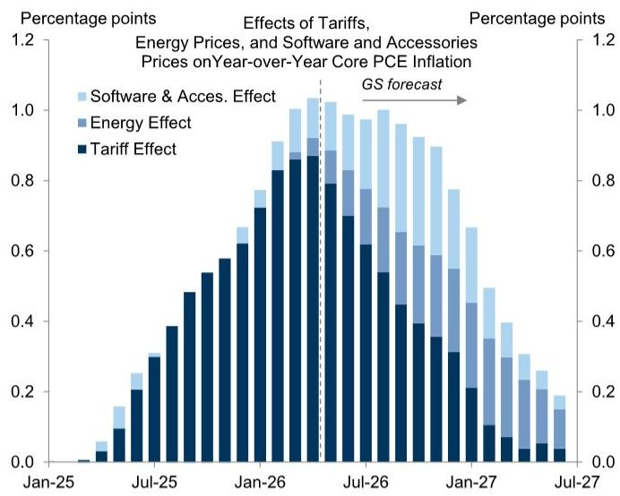
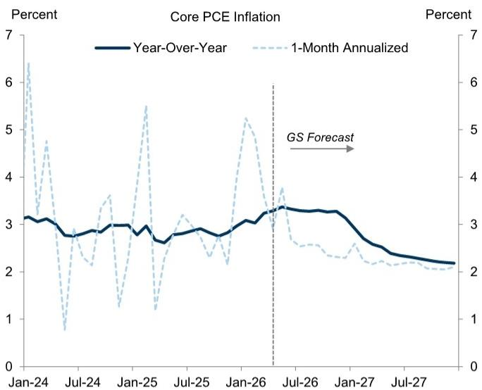
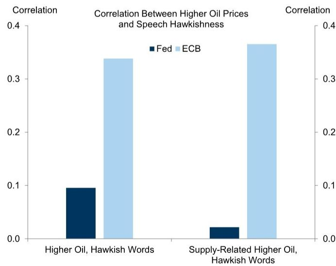
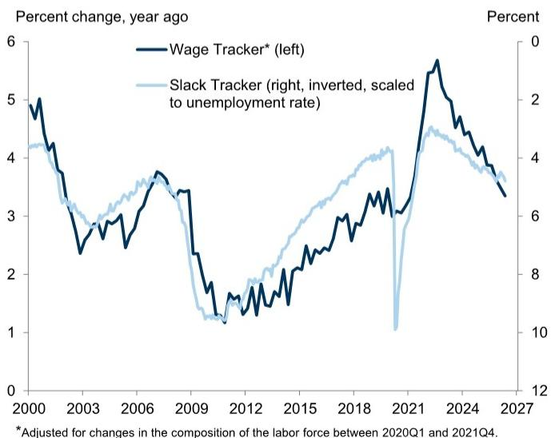
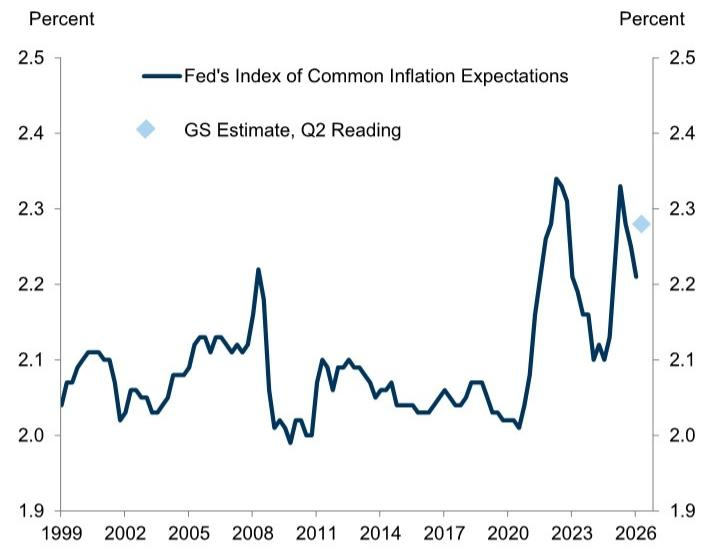
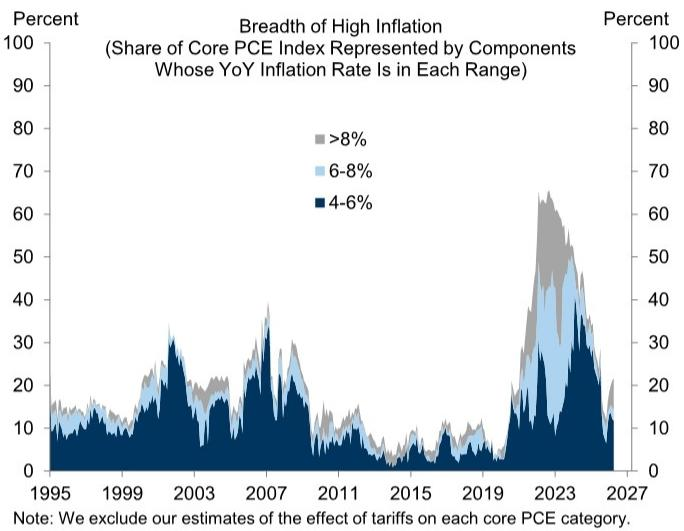
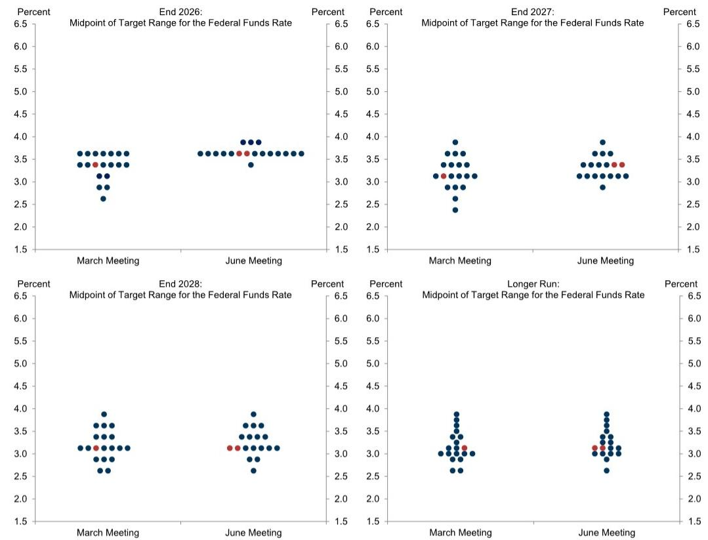
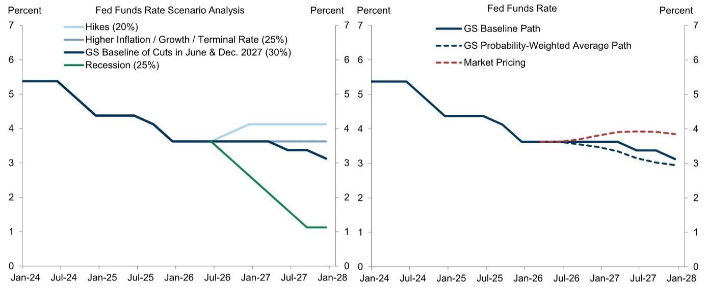

## US ECONOMICS ANALYST

# June FOMC Preview: Leadership Transition

The most important change in the economic data since the last FOMC meeting is the impressive pick-up in job growth that has put the labor market on a sturdier trajectory. This has left the focus on whether the inflation situation is becoming concerning enough to warrant a rate hike. The war and the increase in oil prices will likely drive headline PCE inflation above $4\%$ and leave core PCE inflation above $3\%$ all year. But so far the impact on inflation looks more like the usual passthrough from large oil shocks than the pandemic's wide-ranging shortages and price spikes.

We continue to see rate hikes as unlikely, both because the Fed has usually not hiked in response to oil price shocks in the past, and because conditions today, especially the more balanced state of the labor market, make it less likely that the oil shock will spark self-sustaining high inflation. That said, there have been some concerning signs already, and meaningful increases in inflation expectations or the breadth of high inflation across categories would make a hike more likely.

At its June meeting, the first under new Chairman Kevin Warsh, the FOMC is likely to keep the funds rate unchanged and drop the previous forward guidance suggesting cuts. We expect it to just remove from its post-meeting statement the phrase “the extent and timing of additional” in reference to adjustments to the funds rate, though there is plenty of room to simplify the statement further.

Consistent with the shift to balanced guidance, we expect the median dot to show no change to the funds rate in 2026, with three participants projecting a hike later this year. But we expect the median dot to still show two cuts eventually, most likely one in each of 2027 and 2028. A few neutral rate dots might rise, but the median is unlikely to increase. We assume that Warsh will not submit dots in light of his past criticism of forward guidance, but we are not sure.

The economic projections for 2026 are likely to show slightly lower GDP growth (-0.2pp to 2.2% Q4/Q4) and unemployment (-0.1pp to 4.3%) and much higher headline (+1.2pp to 3.9%) and core inflation (+0.6pp to 3.3%). We expect the 2027 inflation projections to rise by 0.1pp to 2.3%, implying that the consequences of the war for inflation will be limited beyond this year.

Because it will likely take quite a while for year-over-year core inflation to approach $2\%$ , we have penciled in the final two rate cuts in our forecast in June

## David Mericle

+1(212)357-2619

david.mericle@gs.com

GS & Co. LLC

and December 2027. A long pause would increase the probability that the FOMC could instead decide that the funds rate is already in an appropriate place if the economy continues to perform well, and we see a flat path as a plausible alternative to our baseline. Even so, our probability-weighted Fed forecast is meaningfully more dovish than market pricing, largely reflecting our skepticism of rate hikes.

Questions could come up in the press conference about Warsh's past criticisms of the Fed on themes including communications practices, balance sheet policy, and financial regulation. Our best guess is still that any changes to the first two will be limited, but this week's meeting should provide a better sense of Warsh's priorities and current thinking.

## June FOMC Preview: Leadership Transition

The most important change in the economic data since the last FOMC meeting is the impressive pick-up in job growth that has put the labor market on a much sturdier trajectory. While we still expect somewhat below-potential GDP growth in the second half of this year as high oil prices weigh on spending, we expect the unemployment rate to rise only a touch further to $4.4\%$ (Exhibit 1).

Exhibit 1: The Recent Pick-Up in Job Growth Has Provided Reassurance About the Labor Market Outlook  

bar chart

| Jan-24 | 208 |
| --- | --- |
| Feb-24 | 189 |
| Mar-24 | 213 |
| Apr-24 | 190 |
| May-24 | 160 |
| Jun-24 | 138 |
| Jul-24 | 129 |
| Aug-24 | 99 |
| Sep-24 | 150 |
| Oct-24 | 133 |
| Nov-24 | 168 |
| Dec-24 | 190 |
| Jan-25 | 165 |
| Feb-25 | 131 |
| Mar-25 | 76 |
| Apr-25 | 103 |
| May-25 | 59 |
| June-25 | -13 |
| Jul-25 | -30 |
| Aug-25 | -13 |
| Sep-25 | -3 |
| Oct-25 | -13 |
| Nov-25 | -3 |
| Dec-25 | -3 |
| Jan-26 | 61 |
| Feb-26 | 61 |
| Mar-26 | 61 |
| Apr-26 | 61 |
| May-26 | 61 |
| Jun-26 | 61 |
| Jul-26 | 50 (dashed line) |

\* We estimate underlying trend job growth as 0.75\*3-month average payroll growth + 0.25\*9-month average household employment growth; see our report "How to Read the Employment Report."

line chart

| Date   | Unemployment Rate |
|--------|-------------------|
| Jan-23 | 3.5               |
| Oct-23 | 3.7               |
| Jul-24 | 4.2               |
| Apr-25 | 4.1               |
| Jan-26 | 4.5               |
| Oct-26 | 4.4               |

Source: GS Global Investment Research, Department of Labor

The better labor market data allow the FOMC to focus on whether the inflation situation is becoming concerning enough to warrant a rate hike. The war and the increase in oil prices will likely drive headline PCE inflation above $4\%$ and leave core PCE inflation above $3\%$ all year, even as the effects of last year's tariff increases gradually drop out of the year-over-year calculation (Exhibit 2). But so far the impact on inflation looks more like the usual passthrough from large oil shocks than the pandemic's wide-ranging shortages and price spikes. We think that we have likely now moved through the most extreme effects of the increase in oil prices and in computer memory prices sparked by AI demand on the monthly pace of inflation, which we expect to decline in the remainder of the year.

Exhibit 2: The Combined Effect of Increases in Tariffs, Oil Prices, and Computer Memory Prices Is Likely to Hold Roughly Steady and Keep Year-over-Year Core PCE Inflation Above $3\%$ All Year but Should Fade in 2027  

bar chart

| Date    | Software & Acces. Effect | Energy Effect | Tariff Effect |
|---------|--------------------------|---------------|---------------|
| Jan-25  | 0.0                      | 0.0           | 0.0           |
| Jul-25  | 0.1                      | 0.0           | 0.1           |
| Jan-26  | 0.3                      | 0.1           | 0.3           |
| Jul-26  | 0.8                      | 0.4           | 0.8           |
| Jan-27  | 0.6                      | 0.3           | 0.6           |
| Jul-27  | 0.2                      | 0.2           | 0.2           |

line chart

| Date    | Year-Over-Year | 1-Month Annualized |
|---------|----------------|--------------------|
| Jan-24  | 3.0            | 6.5                |
| Jul-24  | 2.8            | 1.0                |
| Jan-25  | 3.0            | 5.5                |
| Jul-25  | 2.9            | 3.0                |
| Jan-26  | 3.1            | 5.2                |
| Jul-26  | 3.3            | 3.8                |
| Jan-27  | 3.2            | 2.5                |
| Jul-27  | 2.2            | 2.0                |

Source: GS Global Investment Research, Department of Commerce

## Rate Hikes Still Look Unlikely

We continue to see rate hikes as unlikely, for two main reasons. First, the Fed has usually not hiked in response to oil price shocks that looked unlikely to spark sustained high inflation historically, a difference with the reaction function of the ECB and other central banks (Exhibit 3, left). Second, conditions today, especially the more balanced state of the labor market and moderate starting point for wage growth (Exhibit 3, right), make it less likely that the oil shock will spark self-sustaining high inflation, at least if the effects of the war remain contained and oil prices follow roughly the path our strategists expect.

Exhibit 3: We See Rate Hikes as Unlikely Because the Fed Tends Not to Hike in Response to Oil Shocks and Because the Oil Shock Is Less Likely to Spark Self-Sustaining High Inflation in a More Balanced Labor Market  

bar chart

Correlation Between Higher Oil Prices and Speech Hawkishness
| Category | Fed | ECB |
|---|---|---|
| Higher Oil, Hawkish Words | 0.1 | 0.34 |
| Supply-Related Higher Oil, Hawkish Words | 0.025 | 0.37 |

line chart

| Year | Wage Tracker* (left) (%) | Slack Tracker (right, inverted, scaled to unemployment rate) (%) |
|---|---|---|
| 2000 | 5.0 | 4.2 |
| 2003 | 2.5 | 3.0 |
| 2006 | 3.8 | 3.5 |
| 2009 | 3.5 | 1.3 |
| 2012 | 1.5 | 1.8 |
| 2015 | 2.5 | 3.0 |
| 2018 | 3.5 | 4.0 |
| 2021 | 3.0 | 1.0 |
| 2024 | 5.5 | 4.5 |
| 2027 | 3.5 | 3.5 |

Source: GS Global Investment Research

That said, there have been some concerning signs already, including firmer PPI prints, large increases in the prices received components of the manufacturing surveys, and the now-reversed May spike in long-run Michigan inflation expectations. While we do not

see much risk of broad overheating, a longer war, higher oil prices, and more severe trade disruptions and supply shortages than we expect would raise the risk of pandemic-style inflation contagion, where initial shortage-driven price spikes make larger-than-usual price increases seem normal even to unaffected businesses. The clearest signs of drifting in that direction would be meaningful increases in either inflation expectations or the breadth of high inflation across categories (Exhibit 4), either of which would make a rate hike more likely.

Exhibit 4: Concerning Signals from Inflation Expectations or the Breadth of High Inflation Across Categories Would Make Hikes More Likely  

line chart

| Year | Fed's Index of Common Inflation Expectations (Percent) |
|------|--------------------------------------------------------|
| 1999 | 2.05                                                   |
| 2000 | 2.10                                                   |
| 2001 | 2.12                                                   |
| 2002 | 2.08                                                   |
| 2003 | 2.07                                                   |
| 2004 | 2.09                                                   |
| 2005 | 2.11                                                   |
| 2006 | 2.13                                                   |
| 2007 | 2.15                                                   |
| 2008 | 2.22                                                   |
| 2009 | 2.00                                                   |
| 2010 | 2.05                                                   |
| 2011 | 2.10                                                   |
| 2012 | 2.11                                                   |
| 2013 | 2.10                                                   |
| 2014 | 2.08                                                   |
| 2015 | 2.07                                                   |
| 2016 | 2.06                                                   |
| 2017 | 2.08                                                   |
| 2018 | 2.07                                                   |
| 2019 | 2.06                                                   |
| 2020 | 2.05                                                   |
| 2021 | 2.15                                                   |
| 2022 | 2.35                                                   |
| 2023 | 2.30                                                   |
| 2024 | 2.15                                                   |
| 2025 | 2.33                                                   |
| 2026 | 2.30                                                   |

area chart

| Year | >8% | 6-8% | 4-6% |
|------|-----|------|------|
| 1995 | ~10 | ~5   | ~5   |
| 1999 | ~15 | ~10  | ~10  |
| 2003 | ~20 | ~15  | ~15  |
| 2007 | ~30 | ~20  | ~20  |
| 2011 | ~15 | ~10  | ~10  |
| 2015 | ~5  | ~5   | ~5   |
| 2019 | ~10 | ~5   | ~5   |
| 2023 | ~65 | ~45  | ~40  |
| 2027 | ~20 | ~15  | ~15  |

Source: GS Global Investment Research, Federal Reserve, Department of Commerce

## The June Meeting

The June FOMC meeting will be the first under new Chairman Kevin Warsh. The FOMC is widely expected to keep the funds rate unchanged and drop the previous forward guidance suggesting cuts. We expect the FOMC to accomplish that by just removing the phrase “the extent and timing of additional” in reference to adjustments to the funds rate. But Exhibit 5 shows that there is plenty of further room to shorten and simplify the statement, which Warsh might prefer, because some sentences (pairs of which are highlighted in yellow and blue) partially overlap. The statement is also likely to acknowledge the pick-up in job growth in its first paragraph. We do not expect any dissents, though a dissent in favor of a hike is possible.

Exhibit 5: We Expect the FOMC to Shift to Balanced Guidance by Removing “the Extent and Timing of Additional” from Its Guidance, Though There Is Further Room to Simplify and Shorten the Statement

Recent indicators suggest that economic activity has been expanding at a solid pace. Job gains have remained lowpicked up, on average, and the unemployment rate has been little changed in recent months. Inflation is elevated, in part reflecting the recent increase in global energy prices.

The Committee seeks to achieve maximum employment and inflation at the rate of 2 percent over the longer run. Developments in the Middle East are contributing to a high level of uncertainty about the economic outlook. The Committee is attentive to the risks to both sides of its dual mandate.

In support of its goals, the Committee decided to maintain the target range for the federal funds rate at 3-1/2 to 3-3/4 percent. In considering the extent and timing of additional adjustments to the target range for the federal funds rate, the Committee will carefully assess incoming data, the evolving outlook, and the balance of risks. The Committee is strongly committed to supporting maximum employment and returning inflation to its 2 percent objective.

In assessing the appropriate stance of monetary policy, the Committee will continue to monitor the implications of incoming information for the economic outlook. The Committee would be prepared to adjust the stance of monetary policy as appropriate if risks emerge that could impede the attainment of the Committee's goals. The Committee's assessments will take into account a wide range of information, including readings on labor market conditions, inflation pressures and inflation expectations, and financial and international developments.

Source: GS Global Investment Research, Federal Reserve Board

The economic projections for 2026 are likely to show slightly lower GDP growth (-0.2pp to 2.2% Q4/Q4) and unemployment (-0.1pp to 4.3%) but much higher headline (+1.2pp to 3.9%) and core inflation (+0.6pp to 3.3%). A key question is how much the 2027 inflation projections will change, because this will give a sense of how concerned FOMC participants are that the latest in a series of inflation shocks will have long-lasting consequences. We expect both headline and core to rise 0.1pp to 2.3% (Exhibit 6).

Exhibit 6: The Economic Projections Are Likely to Show Lower GDP Growth, Slightly Lower Unemployment, and Considerably Higher Headline and Core Inflation in 2026

<table><tr><td colspan="4">Summary of Economic Projections</td><td rowspan="2">Longer run</td></tr><tr><td></td><td>2026</td><td>2027</td><td>2028</td></tr><tr><td>Real GDP Growth*</td><td></td><td></td><td></td><td></td></tr><tr><td>GS Forecast</td><td>1.9</td><td>2.2</td><td>2.3</td><td></td></tr><tr><td>GS Forecast of June SEP</td><td>2.2</td><td>2.3</td><td>2.1</td><td>2.0</td></tr><tr><td>March SEP</td><td>2.4</td><td>2.3</td><td>2.1</td><td>2.0</td></tr><tr><td>Unemployment*</td><td></td><td></td><td></td><td></td></tr><tr><td>GS Forecast</td><td>4.4</td><td>4.3</td><td>4.3</td><td></td></tr><tr><td>GS Forecast of June SEP</td><td>4.3</td><td>4.3</td><td>4.2</td><td>4.2</td></tr><tr><td>March SEP</td><td>4.4</td><td>4.3</td><td>4.2</td><td>4.2</td></tr><tr><td>PCE Inflation*</td><td></td><td></td><td></td><td></td></tr><tr><td>GS Forecast</td><td>3.8</td><td>2.2</td><td>2.0</td><td></td></tr><tr><td>GS Forecast of June SEP</td><td>3.9</td><td>2.3</td><td>2.0</td><td>2.0</td></tr><tr><td>March SEP</td><td>2.7</td><td>2.2</td><td>2.0</td><td>2.0</td></tr><tr><td>Core PCE Inflation*</td><td></td><td></td><td></td><td></td></tr><tr><td>GS Forecast</td><td>3.2</td><td>2.2</td><td>2.0</td><td></td></tr><tr><td>GS Forecast of June SEP</td><td>3.3</td><td>2.3</td><td>2.0</td><td></td></tr><tr><td>March SEP</td><td>2.7</td><td>2.2</td><td>2.0</td><td></td></tr><tr><td>Fed Funds Rate* (Median)</td><td></td><td></td><td></td><td></td></tr><tr><td>GS Forecast</td><td>3.625</td><td>3.125</td><td>3.125</td><td></td></tr><tr><td>GS Forecast of June SEP</td><td>3.625</td><td>3.375</td><td>3.125</td><td>3.125</td></tr><tr><td>March SEP</td><td>3.375</td><td>3.125</td><td>3.125</td><td>3.125</td></tr><tr><td>Addenda: Fed Funds Rate (Mean)</td><td></td><td></td><td></td><td></td></tr><tr><td>GS Forecast of June SEP</td><td>3.65</td><td>3.32</td><td>3.25</td><td>3.22</td></tr><tr><td>March SEP</td><td>3.35</td><td>3.19</td><td>3.19</td><td>3.16</td></tr></table>

\* Data shown are medians.  
Note: GDP growth and inflation forecasts are Q4/Q4. Unemployment is the Q4 average. The funds rate is the level at the end of the year.  
Source: GS Global Investment Research, Federal Reserve Board

Consistent with the shift to balanced guidance, the median dot is likely to show no change to the funds rate in 2026. We think that a few participants will project a hike later this year, and perhaps one will show a cut. We expect the median dot to still show two cuts eventually, most likely one in each of 2027 and 2028, though two in 2027 is also possible. A few neutral rate dots might rise, but the median is unlikely to increase at this meeting (Exhibit 7). We assume that Warsh will not submit dots in light of his past criticism of forward guidance, but we are not certain.

Exhibit 7: We Expect the Median Dot to Show No Change in 2026 and One Cut in Each of 2027 and 2028  

scatterplot

| Year | Meeting Month | Midpoint of Target Range for the Federal Funds Rate (Percent) |
|------|---------------|-------------------------------------------------------------|
| End 2026 | March Meeting | 3.5 |
| End 2026 | June Meeting | 3.5 |
| End 2027 | March Meeting | 3.0 |
| End 2027 | June Meeting | 3.0 |
| End 2028 | March Meeting | 3.0 |
| End 2028 | June Meeting | 3.0 |

Source: GS Global Investment Research, Federal Reserve Board

## Two More Cuts, but Not for a While

Until the war ends and FOMC participants feel confident that the upside risk to inflation it presents is behind us, the Fed's debate is likely to focus on potential rate hikes. Even then, in light of the large group on the FOMC that has expressed concern about many years of high inflation, we would not expect the FOMC to lower the funds rate until year-over-year core PCE inflation approaches $2\%$ . This is likely to take quite a while, and we have therefore penciled in the final two cuts in June and December 2027.

As we noted last week, a long pause would increase the probability that the FOMC could eventually instead conclude that the funds rate is already in an appropriate place if the economy continues to perform well, a conclusion that we would find reasonable but that most FOMC participants have not yet drawn. As a result, we see a flat path as a plausible alternative to our baseline and give it nearly as high a probability in our fed funds scenario analysis. Even so, our probability-weighted Fed forecast is meaningfully more dovish than market pricing, largely reflecting our skepticism of rate hikes (Exhibit 8).

Exhibit 8: Our Baseline Fed Forecast Calls for Two Final Cuts in June and December 2027; Our Probability-Weighted Fed Forecast Remains More Dovish Than Market Pricing, Reflecting Our Skepticism of Hikes  

line chart

| Period       | Hikes (20%) | Higher Inflation / Growth / Terminal Rate (25%) | GS Baseline of Cuts in June & Dec. 2027 (30%) | Recession (25%) | GS Baseline Path | GS Probability-Weighted Average Path | Market Pricing |
| ------------ | ----------- | --------------------------------------------- | ---------------------------------------------- | ---------------- | ---------------- | ------------------------------------- | ---------------- |
| Jan-24       | 5.4         | 5.4                                           | 5.4                                            | 5.4              | 5.4              | 5.4                                   | 5.4              |
| Jul-24       | 5.4         | 5.4                                           | 5.4                                            | 5.4              | 5.4              | 5.4                                   | 5.4              |
| Jan-25       | 4.4         | 4.4                                           | 4.4                                            | 4.4              | 4.4              | 4.4                                   | 4.4              |
| Jul-25       | 4.4         | 4.4                                           | 4.4                                            | 4.4              | 4.4              | 4.4                                   | 4.4              |
| Jan-26       | 3.6         | 3.6                                           | 3.6                                            | 3.6              | 3.6              | 3.6                                   | 3.6              |
| Jul-26       | 3.6         | 3.6                                           | 3.6                                            | 3.6              | 3.6              | 3.6                                   | 3.6              |
| Jan-27       | 4.1         | 3.6                                           | 3.6                                            | 3.6              | 3.6              | 3.6                                   | 3.8              |
| Jul-27       | 4.1         | 3.6                                           | 3.6                                            | 3.6              | 3.6              | 3.6                                   | 3.9              |
| Jan-28       | 4.1         | 3.6                                           | 3.1                                            | 1.1              | 3.1              | 3.0                                   | 3.8              |

Source: GS Global Investment Research

## The Leadership Transition

We do not expect any major institutional changes at Chairman Warsh's first meeting. But questions could come up in the press conference about whether he plans to act on his past criticisms of the Fed on themes including communications practices, balance sheet policy, and financial regulation.

On communications practices, Warsh has called for saying less, and many investors have wondered if he might move to cancel the Summary of Economic Projections. While we do see some potential areas for improvement, we do not expect any major near-term changes. The FOMC just had a lengthy discussion of its communication practices last year in its framework review and was unable to agree on any changes. In addition, because making the reaction function more transparent should itself support macroeconomic stabilization, we think it would be hard to justify moving in the opposite direction.

On the balance sheet, regulatory and supervisory changes are likely to have some impact on banks' demand for reserves balances and ultimately on the size of the balance sheet. But as we explained in greater depth in March, we do not expect the FOMC to shrink the balance sheet more substantially.

On financial regulatory policy, Warsh has argued for a lighter touch on small- and medium-sized banks in particular. Some changes are already underway under Vice Chair for Supervision Bowman, and while they have sparked some controversy on the FOMC, Warsh has praised these early steps.

The press conference should provide a better sense of Warsh's priorities and current thinking on these and other topics.

## David Mericle

## The US Economic and Financial Outlook

(% change on previous period, annualized, except where noted)

<table><tr><td rowspan="2"></td><td rowspan="2">2023</td><td rowspan="2">2024</td><td rowspan="2">2025</td><td rowspan="2">2026</td><td rowspan="2">2027</td><td rowspan="2">2025Q4</td><td colspan="4">2026</td><td colspan="4">2027</td></tr><tr><td>Q1</td><td>Q2</td><td>Q3</td><td>Q4</td><td>Q1</td><td>Q2</td><td>Q3</td><td>Q4</td></tr><tr><td colspan="15">OUTPUT AND SPENDING</td></tr><tr><td>Real GDP</td><td>2.9</td><td>2.8</td><td>2.1</td><td>2.1</td><td>2.1</td><td>0.5</td><td>1.6</td><td>2.3</td><td>1.9</td><td>1.9</td><td>2.1</td><td>2.2</td><td>2.3</td><td>2.3</td></tr><tr><td>Real GDP (annual=Q4/Q4, quarterly=yoy)</td><td>3.4</td><td>2.4</td><td>2.0</td><td>1.9</td><td>2.2</td><td>2.0</td><td>2.6</td><td>2.2</td><td>1.6</td><td>1.9</td><td>2.1</td><td>2.0</td><td>2.1</td><td>2.2</td></tr><tr><td>Consumer Expenditures</td><td>2.6</td><td>2.9</td><td>2.6</td><td>1.8</td><td>1.7</td><td>1.9</td><td>1.4</td><td>1.4</td><td>1.3</td><td>1.3</td><td>1.9</td><td>2.0</td><td>2.1</td><td>2.2</td></tr><tr><td>Residential Fixed Investment</td><td>-7.8</td><td>3.2</td><td>-2.2</td><td>-3.8</td><td>1.5</td><td>-1.7</td><td>-6.3</td><td>-5.2</td><td>1.5</td><td>1.5</td><td>2.2</td><td>2.2</td><td>2.2</td><td>2.2</td></tr><tr><td>Business Fixed Investment</td><td>7.3</td><td>2.9</td><td>4.1</td><td>6.5</td><td>5.7</td><td>2.4</td><td>10.1</td><td>7.2</td><td>7.5</td><td>6.9</td><td>4.9</td><td>4.9</td><td>4.9</td><td>4.9</td></tr><tr><td>Structures</td><td>16.7</td><td>1.1</td><td>-5.3</td><td>-3.8</td><td>2.0</td><td>-6.6</td><td>-5.4</td><td>0.4</td><td>-1.0</td><td>-0.2</td><td>3.5</td><td>3.5</td><td>3.5</td><td>3.5</td></tr><tr><td>Equipment</td><td>2.9</td><td>3.5</td><td>8.3</td><td>10.6</td><td>7.0</td><td>4.3</td><td>17.2</td><td>12.9</td><td>11.0</td><td>9.5</td><td>5.0</td><td>5.0</td><td>5.0</td><td>5.0</td></tr><tr><td>Intellectual Property Products</td><td>6.2</td><td>3.5</td><td>5.6</td><td>7.9</td><td>6.2</td><td>5.4</td><td>11.6</td><td>5.0</td><td>8.2</td><td>7.8</td><td>5.5</td><td>5.5</td><td>5.5</td><td>5.5</td></tr><tr><td>Federal Government</td><td>3.3</td><td>3.8</td><td>-1.2</td><td>-1.5</td><td>0.7</td><td>-16.7</td><td>9.5</td><td>-3.0</td><td>1.0</td><td>1.0</td><td>1.0</td><td>1.0</td><td>1.0</td><td>1.0</td></tr><tr><td>State &amp; Local Government</td><td>3.6</td><td>3.8</td><td>2.5</td><td>1.4</td><td>0.9</td><td>1.5</td><td>1.5</td><td>0.8</td><td>0.5</td><td>1.0</td><td>1.0</td><td>1.0</td><td>1.0</td><td>1.0</td></tr><tr><td>Net Exports ($bn, &#x27;17)</td><td>-925</td><td>-1,033</td><td>-1,091</td><td>-1,098</td><td>-1,170</td><td>-969</td><td>-1,064</td><td>-1,090</td><td>-1,109</td><td>-1,131</td><td>-1,147</td><td>-1,162</td><td>-1,178</td><td>-1,194</td></tr><tr><td>Inventory Investment ($bn, &#x27;17)</td><td>47</td><td>44</td><td>29</td><td>28</td><td>61</td><td>-16</td><td>-26</td><td>41</td><td>45</td><td>50</td><td>55</td><td>60</td><td>65</td><td>65</td></tr><tr><td>Nominal GDP</td><td>6.7</td><td>5.3</td><td>5.0</td><td>6.1</td><td>5.0</td><td>4.2</td><td>5.2</td><td>9.1</td><td>4.8</td><td>4.6</td><td>4.9</td><td>4.7</td><td>4.6</td><td>4.4</td></tr><tr><td>Industrial Production, Mfg.</td><td>-1.0</td><td>-1.0</td><td>0.8</td><td>3.5</td><td>3.9</td><td>-3.4</td><td>5.3</td><td>8.3</td><td>4.9</td><td>3.9</td><td>3.4</td><td>3.3</td><td>3.3</td><td>3.3</td></tr><tr><td colspan="15">HOUSING MARKET</td></tr><tr><td>Housing Starts (units, thous)</td><td>1,421</td><td>1,370</td><td>1,356</td><td>1,319</td><td>1,322</td><td>1,323</td><td>1,413</td><td>1,290</td><td>1,280</td><td>1,292</td><td>1,304</td><td>1,316</td><td>1,328</td><td>1,340</td></tr><tr><td>New Home Sales (units, thous)</td><td>666</td><td>684</td><td>679</td><td>670</td><td>644</td><td>711</td><td>690</td><td>690</td><td>662</td><td>638</td><td>626</td><td>632</td><td>649</td><td>670</td></tr><tr><td>Existing Home Sales (units, thous)</td><td>4,103</td><td>4,067</td><td>4,076</td><td>4,212</td><td>4,375</td><td>4,157</td><td>4,169</td><td>4,189</td><td>4,223</td><td>4,267</td><td>4,310</td><td>4,353</td><td>4,396</td><td>4,440</td></tr><tr><td>Case-Shiller Home Prices (%yoy)*</td><td>5.3</td><td>3.8</td><td>0.7</td><td>0.7</td><td>2.2</td><td>0.7</td><td>0.3</td><td>0.8</td><td>0.7</td><td>0.7</td><td>1.1</td><td>1.4</td><td>1.8</td><td>2.2</td></tr><tr><td colspan="15">INFLATION (% ch, yr/yr)</td></tr><tr><td>Consumer Price Index (CPI)**</td><td>3.3</td><td>2.9</td><td>2.7</td><td>3.8</td><td>2.2</td><td>2.7</td><td>2.7</td><td>4.0</td><td>3.8</td><td>3.8</td><td>3.5</td><td>2.4</td><td>2.4</td><td>2.2</td></tr><tr><td>Core CPI **</td><td>3.9</td><td>3.2</td><td>2.6</td><td>2.7</td><td>2.2</td><td>2.7</td><td>2.5</td><td>2.8</td><td>2.6</td><td>2.7</td><td>2.5</td><td>2.2</td><td>2.2</td><td>2.2</td></tr><tr><td>Core PCE** †</td><td>3.1</td><td>3.0</td><td>3.0</td><td>3.1</td><td>2.2</td><td>2.9</td><td>3.1</td><td>3.3</td><td>3.3</td><td>3.2</td><td>2.7</td><td>2.4</td><td>2.3</td><td>2.2</td></tr><tr><td colspan="15">LABOR MARKET</td></tr><tr><td>Unemployment Rate (%)^</td><td>3.8</td><td>4.1</td><td>4.4</td><td>4.4</td><td>4.3</td><td>4.4</td><td>4.3</td><td>4.3</td><td>4.3</td><td>4.4</td><td>4.4</td><td>4.4</td><td>4.3</td><td>4.3</td></tr><tr><td>U6 Underemployment Rate (%)^</td><td>7.2</td><td>7.6</td><td>8.4</td><td>8.2</td><td>8.1</td><td>8.4</td><td>8.0</td><td>8.1</td><td>8.2</td><td>8.2</td><td>8.2</td><td>8.2</td><td>8.1</td><td>8.1</td></tr><tr><td>Payrolls (thous, monthly rate)</td><td>210</td><td>122</td><td>10</td><td>72</td><td>50</td><td>-39</td><td>73</td><td>130</td><td>40</td><td>45</td><td>50</td><td>50</td><td>50</td><td>50</td></tr><tr><td>Employment-Population Ratio (%)^</td><td>60.1</td><td>59.9</td><td>59.7</td><td>59.1</td><td>59.0</td><td>59.7</td><td>59.2</td><td>59.2</td><td>59.1</td><td>59.1</td><td>59.0</td><td>59.0</td><td>59.0</td><td>59.0</td></tr><tr><td>Labor Force Participation Rate (%)^</td><td>62.5</td><td>62.5</td><td>62.4</td><td>61.8</td><td>61.6</td><td>62.4</td><td>61.9</td><td>61.8</td><td>61.8</td><td>61.8</td><td>61.7</td><td>61.7</td><td>61.7</td><td>61.6</td></tr><tr><td>Average Hourly Earnings (%yoy)</td><td>4.4</td><td>3.9</td><td>4.0</td><td>3.9</td><td>3.8</td><td>4.0</td><td>4.0</td><td>4.0</td><td>3.9</td><td>3.8</td><td>3.8</td><td>3.8</td><td>3.8</td><td>3.8</td></tr><tr><td colspan="15">GOVERNMENT FINANCE</td></tr><tr><td>Federal Budget (FY, $bn)</td><td>-1,694</td><td>-1,833</td><td>-1,775</td><td>-1,950</td><td>-2,050</td><td>--</td><td>--</td><td>--</td><td>--</td><td>--</td><td>--</td><td>--</td><td>--</td><td>--</td></tr><tr><td colspan="15">FINANCIAL INDICATORS</td></tr><tr><td>FF Target Range (Bottom-Top, %)^</td><td>5.25-5.5</td><td>4.25-4.5</td><td>3.5-3.75</td><td>3.5-3.75</td><td>3-3.25</td><td>3.5-3.75</td><td>3.5-3.75</td><td>3.5-3.75</td><td>3.5-3.75</td><td>3.5-3.75</td><td>3.5-3.75</td><td>3.25-3.5</td><td>3.25-3.5</td><td>3-3.25</td></tr><tr><td>10-Year Treasury Note^</td><td>3.88</td><td>4.58</td><td>4.18</td><td>4.40</td><td>4.25</td><td>4.18</td><td>4.30</td><td>4.50</td><td>4.45</td><td>4.40</td><td>4.35</td><td>4.30</td><td>4.25</td><td>4.25</td></tr><tr><td>Euro (€/$)^</td><td>1.11</td><td>1.04</td><td>1.17</td><td>1.18</td><td>1.20</td><td>1.17</td><td>1.15</td><td>1.16</td><td>1.19</td><td>1.18</td><td>1.19</td><td>1.20</td><td>1.20</td><td>1.20</td></tr><tr><td>Yen ($/¥)^</td><td>141</td><td>157</td><td>157</td><td>158</td><td>141</td><td>157</td><td>159</td><td>158</td><td>158</td><td>158</td><td>156</td><td>141</td><td>101</td><td>141</td></tr></table>

\* Weighted average of metro-level HPIs for 381 metro cities where the weights are dollar values of housing stock reported in the American Community Survey. Annual numbers are Q4/Q4.  
\*\* Annual inflation numbers are December year-on-year values. Quarterly values are Q4/Q4.  
† PCE = Personal consumption expenditures. ^ Denotes end of period.  
Note: Published figures in bold.  
Source: GS Global Investment Research

## The US Economics Team

## Jan Hatzius

+1(212)902-0394

jan.hatzius@gs.com

GS & Co. LLC

## Alec Phillips

+1(202)637-3746

alec.phillips@gs.com

GS & Co. LLC

## David Mericle

+1(212)357-2619

david.mericle@gs.com

GS & Co. LLC

## Ronnie Walker

+1(917)343-4543

ronnie.walker@gs.com

GS & Co. LLC

## Manuel Abecasis

+1(212)902-8357

manuel.abecasis@gs.com

GS & Co. LLC

## Elsie Peng

+1(212)357-3137

elsie.peng@gs.com

GS & Co. LLC

## Pierfrancesco Mei

+1(212)902-8809

pierfrancesco.mei@gs.com

GS & Co. LLC

## Jessica Rindels

+1(972)368-1516

jessica.rindels@gs.com

GS & Co. LLC

## Disclosure Appendix

## Reg AC

I, David Mericle, hereby certify that all of the views expressed in this report accurately reflect my personal views, which have not been influenced by considerations of the firm's business or client relationships.

Unless otherwise stated, the individuals listed on the cover page of this report are analysts in GS' Global Investment Research division.

Contributing Authors: David Mericle GS & Co. LLC.

Unless otherwise stated, the individuals listed in the Contributing Authors disclosure of this report are analysts in GS' Global Investment Research division.

## Disclosures

## Regulatory disclosures

## Disclosures required by United States laws and regulations

See company-specific regulatory disclosures above for any of the following disclosures required as to companies referred to in this report: manager or co-manager in a pending transaction; $1\%$ or other ownership; compensation for certain services; types of client relationships; managed/co-managed public offerings in prior periods; directorships; for equity securities, market making and/or specialist role. GS trades or may trade as a principal in debt securities (or in related derivatives) of issuers discussed in this report.

The following are additional required disclosures: Ownership and material conflicts of interest: GS policy prohibits its analysts, professionals reporting to analysts and members of their households from owning securities of any company in the analyst's area of coverage. Analyst compensation: Analysts are paid in part based on the profitability of GS, which includes investment banking revenues. Analyst as officer or director: GS policy generally prohibits its analysts, persons reporting to analysts or members of their households from serving as an officer, director or advisor of any company in the analyst's area of coverage. Non-U.S. Analysts: Non-U.S. analysts may not be associated persons of GS & Co. LLC and therefore may not be subject to FINRA Rule 2241 or FINRA Rule 2242 restrictions on communications with a subject company, public appearances and trading in securities covered by the analysts.

## Additional disclosures required under the laws and regulations of jurisdictions other than the United States

The following disclosures are those required by the jurisdiction indicated, except to the extent already made above pursuant to United States laws and regulations. Australia: GS Australia Pty Ltd and its affiliates are not authorised deposit-taking institutions (as that term is defined in the Banking Act 1959 (Cth)) in Australia and do not provide banking services, nor carry on a banking business, in Australia. This research, and any access to it, is intended only for “wholesale clients” within the meaning of the Australian Corporations Act, unless otherwise agreed by GS. In producing research reports, members of Global Investment Research of GS Australia may attend site visits and other meetings hosted by the companies and other entities which are the subject of its research reports. In some instances the costs of such site visits or meetings may be met in part or in whole by the issuers concerned if GS Australia considers it is appropriate and reasonable in the specific circumstances relating to the site visit or meeting. To the extent that the contents of this document contains any financial product advice, it is general advice only and has been prepared by GS without taking into account a client’s objectives, financial situation or needs. A client should, before acting on any such advice, consider the appropriateness of the advice having regard to the client’s own objectives, financial situation and needs. A copy of certain GS Australia and New Zealand disclosure of interests and a copy of GS’ Australian Sell-Side Research Independence Policy Statement are available at: https://www.goldmansachs.com/disclosures/australia-new-zealand/index.html. Brazil: Disclosure information in relation to CVM Resolution n. 20 is available at https://www.gs.com/worldwide/brazil/area/gir/index.html. Where applicable, the Brazil-registered analyst primarily responsible for the content of this research report, as defined in Article 20 of CVM Resolution n. 20, is the first author named at the beginning of this report, unless indicated otherwise at the end of the text. Canada: This information is being provided to you for information purposes only and is not, and under no circumstances should be construed as, an advertisement, offering or solicitation by GS & Co. LLC for purchasers of securities in Canada to trade in any Canadian security. GS & Co. LLC is not registered as a dealer in any jurisdiction in Canada under applicable Canadian securities laws and generally is not permitted to trade in Canadian securities and may be prohibited from selling certain securities and products in certain jurisdictions in Canada. If you wish to trade in any Canadian securities or other products in Canada please contact GS Canada Inc., an affiliate of The GS Group Inc., or another registered Canadian dealer. Hong Kong: Further information on the securities of covered companies referred to in this research may be obtained on request from GS (Asia) L.L.C. India: Further information on the subject company or companies referred to in this research may be obtained from GS (India) Securities Private Limited, Research Analyst - SEBI Registration Number INH000001493, 10th Floor, Ascent-Worli, Sudam Kalu Ahire Marg, Worli, Mumbai-400 025, India, Corporate Identity Number U74140MH2006FTC160634, Phone +91 22 6616 9000, Fax +91 22 6616 9001. GS may beneficially own 1% or more of the securities (as such term is defined in clause 2 (h) the Indian Securities Contracts (Regulation) Act, 1956) of the subject company or companies referred to in this research report. Investment in securities market are subject to market risks. Read all the related documents carefully before investing. Registration granted by SEBI and certification from NISM in no way guarantee performance of the intermediary or provide any assurance of returns to investors. GS (India) Securities Private Limited compliance officer and investor grievance contact details can be found at: https://www.goldmansachs.com/worldwide/india/documents/Grievance-Redressal-and-Escalation-Matrix.pdf, and a copy of the annual audit compliance report can be found at this link: https://publishing.gs.com/content/site/india-annual-compliance-report.html. Japan: See below. Korea: This research, and any access to it, is intended only for “professional investors” within the meaning of the Financial Services and Capital Markets Act, unless otherwise agreed by GS. Further information on the subject company or companies referred to in this research may be obtained from GS (Asia) L.L.C., Seoul Branch. New Zealand: GS New Zealand Limited and its affiliates are neither “registered banks” nor “deposit takers” (as defined in the Reserve Bank of New Zealand Act 1989) in New Zealand. This research, and any access to it, is intended for “wholesale clients” (as defined in the Financial Advisers Act 2008) unless otherwise agreed by GS. A copy of certain GS Australia and New Zealand disclosure of interests is available at: https://www.goldmansachs.com/disclosures/australia-new-zealand/index.html. Russia: Research reports distributed in the Russian Federation are not advertising as defined in the Russian legislation, but are information and analysis not having product promotion as their main purpose and do not provide appraisal within the meaning of the Russian legislation on appraisal activity. Research reports do not constitute a personalized investment recommendation as defined in Russian laws and regulations, are not addressed to a specific client, and are prepared without analyzing the financial circumstances, investment profiles or risk profiles of clients. GS assumes no responsibility for any investment decisions that may be taken by a client or any other person based on this research report. Singapore: GS (Singapore) Pte. (Company Number: 198602165W), which is regulated by the Monetary Authority of Singapore, accepts legal responsibility for this research, and should be contacted with respect to any matters arising from, or in connection with, this research. Taiwan: This material is for reference only and must not be reprinted without permission. Investors should carefully consider their own investment risk. Investment results are the responsibility of the individual investor. United Kingdom: Persons who would be categorized as retail clients in the United Kingdom, as such term is defined in the rules of the Financial Conduct Authority, should read this research in conjunction with prior GS on the covered

companies referred to herein and should refer to the risk warnings that have been sent to them by GS International. A copy of these risks warnings, and a glossary of certain financial terms used in this report, are available from GS International on request.

European Union and United Kingdom: Disclosure information in relation to Article 6 (2) of the European Commission Delegated Regulation (EU) (2016/958) supplementing Regulation (EU) No 596/2014 of the European Parliament and of the Council (including as that Delegated Regulation is implemented into United Kingdom domestic law and regulation following the United Kingdom's departure from the European Union and the European Economic Area) with regard to regulatory technical standards for the technical arrangements for objective presentation of investment recommendations or other information recommending or suggesting an investment strategy and for disclosure of particular interests or indications of conflicts of interest is available at https://www.gs.com/disclosures/europeanpolicy.html which states the European Policy for Managing Conflicts of Interest in Connection with Investment Research.

Japan: GS Japan Co., Ltd. is a Financial Instrument Dealer registered with the Kanto Financial Bureau under registration number Kinsho 69, and a member of Japan Securities Dealers Association, Financial Futures Association of Japan Type II Financial Instruments Firms Association, and Investment Management Association of Japan. Sales and purchase of equities are subject to commission pre-determined with clients plus consumption tax. See company-specific disclosures as to any applicable disclosures required by Japanese stock exchanges, the Japanese Securities Dealers Association or the Japanese Securities Finance Company.

## Global product; distributing entities

GS Global Investment Research produces and distributes research products for clients of GS on a global basis. Analysts based in GS offices around the world produce research on industries and companies, and research on macroeconomics, currencies, commodities and portfolio strategy. This research is disseminated in Australia by GS Australia Pty Ltd (ABN 21 006 797 897); in Brazil by GS do Brasil Corretora de Títulos e Valores Mobiliários S.A.; Public Communication Channel GS Brazil: 0800 727 5764 and / or contatogoldmanbrasil@gs.com. Available Weekdays (except holidays), from 9am to 6pm. Canal de Comunicação com o Público GS Brasil: 0800 727 5764 e/ou contatogoldmanbrasil@gs.com. Horário de funcionamento: segunda-feira à sexta-feira (exceto feriados), das 9h às 18h; in Canada by GS & Co. LLC; in Hong Kong by GS (Asia) L.L.C.; in India by GS (India) Securities Private Ltd.; in Japan by GS Japan Co., Ltd.; in the Republic of Korea by GS (Asia) L.L.C., Seoul Branch; in New Zealand by GS New Zealand Limited; in Russia by OOO GS; in Singapore by GS (Singapore) Pte. (Company Number: 198602165W); and in the United States of America by GS & Co. LLC. GS International has approved this research in connection with its distribution in the United Kingdom.

GS International (“GSI”), authorised by the Prudential Regulation Authority (“PRA”) and regulated by the Financial Conduct Authority (“FCA”) and the PRA, has approved this research in connection with its distribution in the United Kingdom.

European Economic Area: GS Bank Europe SE ("GSBE") is a credit institution incorporated in Germany and, within the Single Supervisory Mechanism, subject to direct prudential supervision by the European Central Bank and in other respects supervised by German Federal Financial Supervisory Authority (Bundesanstalt für Finanzdienstleistungsaufsicht, BaFin) and Deutsche Bundesbank and disseminates research within the European Economic Area.

## General disclosures

This research is for our clients only. Other than disclosures relating to GS, this research is based on current public information that we consider reliable, but we do not represent it is accurate or complete, and it should not be relied on as such. The information, opinions, estimates and forecasts contained herein are as of the date hereof and are subject to change without prior notification. We seek to update our research as appropriate, but various regulations may prevent us from doing so. Other than certain industry reports published on a periodic basis, the large majority of reports are published at irregular intervals as appropriate in the analyst's judgment.

GS conducts a global full-service, integrated investment banking, investment management, and brokerage business. We have investment banking and other business relationships with a substantial percentage of the companies covered by Global Investment Research. GS & Co. LLC, the United States broker dealer, is a member of SIPC (https://www.sipc.org).

Our salespeople, traders, and other professionals may provide oral or written market commentary or trading strategies to our clients and principal trading desks that reflect opinions that are contrary to the opinions expressed in this research. Our asset management area, principal trading desks and investing businesses may make investment decisions that are inconsistent with the recommendations or views expressed in this research.

We and our affiliates, officers, directors, and employees will from time to time have long or short positions in, act as principal in, and buy or sell, the securities or derivatives, if any, referred to in this research, unless otherwise prohibited by regulation or GS policy.

The views attributed to third party presenters at GS arranged conferences, including individuals from other parts of GS, do not necessarily reflect those of Global Investment Research and are not an official view of GS.

Any third party referenced herein, including any salespeople, traders and other professionals or members of their household, may have positions in the products mentioned that are inconsistent with the views expressed by analysts named in this report.

This research is focused on investment themes across markets, industries and sectors. It does not attempt to distinguish between the prospects or performance of, or provide analysis of, individual companies within any industry or sector we describe.

Any trading recommendation in this research relating to an equity or credit security or securities within an industry or sector is reflective of the investment theme being discussed and is not a recommendation of any such security in isolation.

This research is not an offer to sell or the solicitation of an offer to buy any security in any jurisdiction where such an offer or solicitation would be illegal. It does not constitute a personal recommendation or take into account the particular investment objectives, financial situations, or needs of individual clients. Clients should consider whether any advice or recommendation in this research is suitable for their particular circumstances and, if appropriate, seek professional advice, including tax advice. The price and value of investments referred to in this research and the income from them may fluctuate. Past performance is not a guide to future performance, future returns are not guaranteed, and a loss of original capital may occur. Fluctuations in exchange rates could have adverse effects on the value or price of, or income derived from, certain investments.

Certain transactions, including those involving futures, options, and other derivatives, give rise to substantial risk and are not suitable for all investors. Investors should review current options and futures disclosure documents which are available from GS sales representatives or at https://www.theocc.com/about/publications/character-risks.jsp and https://www.goldmansachs.com/disclosures/cftc\_fcm\_disclosures. Transaction costs may be significant in option strategies calling for multiple purchase and sales of options such as spreads. Supporting documentation will be supplied upon request.

Differing Levels of Service provided by Global Investment Research: The level and types of services provided to you by GS Global Investment Research may vary as compared to that provided to internal and other external clients of GS, depending on various factors including your individual preferences as to the frequency and manner of receiving communication, your risk profile and investment focus and perspective (e.g.,

marketwide, sector specific, long term, short term), the size and scope of your overall client relationship with GS, and legal and regulatory constraints. As an example, certain clients may request to receive notifications when research on specific securities is published, and certain clients may request that specific data underlying analysts' fundamental analysis available on our internal client websites be delivered to them electronically through data feeds or otherwise. No change to an analyst's fundamental research views (e.g., ratings, price targets, or material changes to earnings estimates for equity securities), will be communicated to any client prior to inclusion of such information in a research report broadly disseminated through electronic publication to our internal client websites or through other means, as necessary, to all clients who are entitled to receive such reports.

All research reports are disseminated and available to all clients simultaneously through electronic publication to our internal client websites. Not all research content is redistributed to our clients or available to third-party aggregators, nor is GS responsible for the redistribution of our research by third party aggregators. For research, models or other data related to one or more securities, markets or asset classes (including related services) that may be available to you, please contact your GS representative or go to https://research.gs.com.

Disclosure information is also available at https://www.gs.com/research/hedge.html or from Research Compliance, 200 West Street, New York, NY 10282.

## © 2026 GS.

You are permitted to store, display, analyze, modify, reformat, and print the information made available to you via this service only for your own use. You may not resell or reverse engineer this information to calculate or develop any index for disclosure and/or marketing or create any other derivative works or commercial product(s), data or offering(s) without the express written consent of GS. You are not permitted to publish, transmit, or otherwise reproduce this information, in whole or in part, in any format to any third party without the express written consent of GS. This foregoing restriction includes, without limitation, using, extracting, downloading or retrieving this information, in whole or in part, to train or finetune a machine learning or artificial intelligence system, or to provide or reproduce this information, in whole or in part, as a prompt or input to any such system.