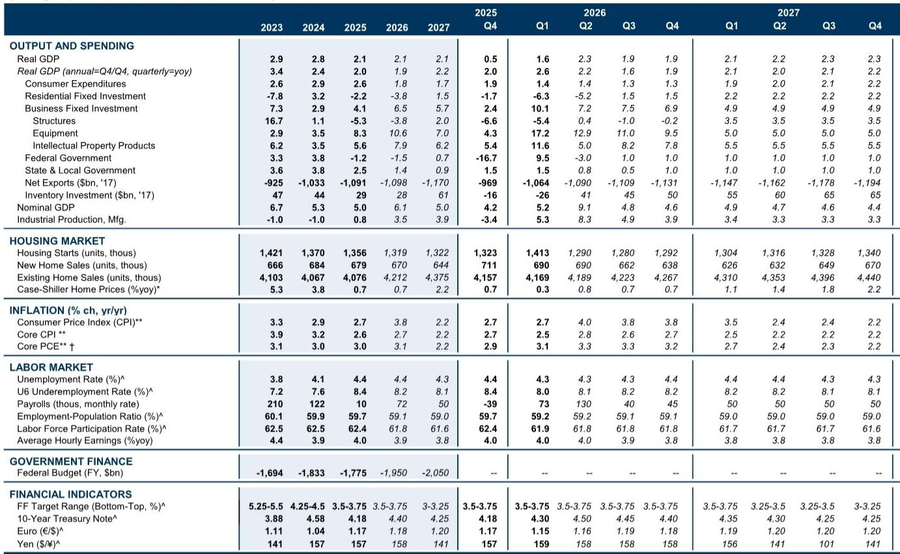
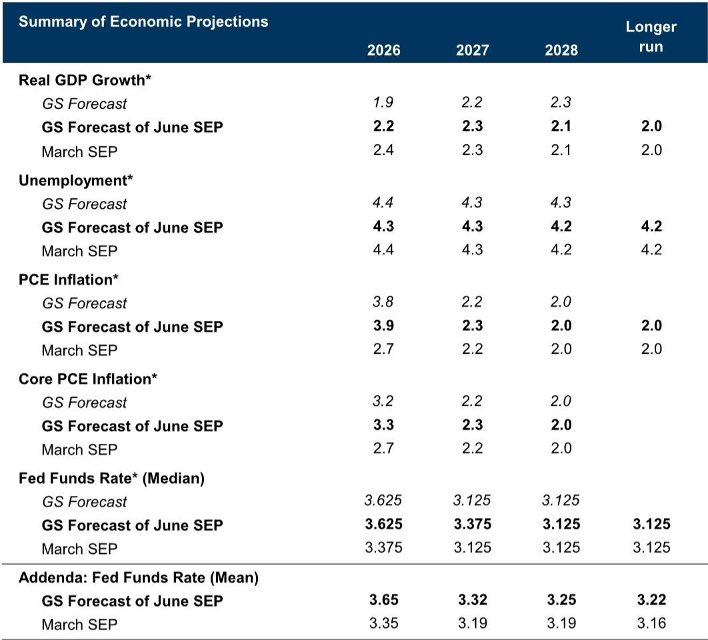

# The Fed’s June Meeting Marks a Regime Shift, Not Just a Pause

The Federal Reserve’s June meeting is not merely another data-dependent stop along a well-worn path. It represents a structural transition in both leadership and doctrine. With new Chairman Kevin Warsh presiding over his first FOMC meeting, and with a labor market that has unexpectedly strengthened even as inflation remains stubbornly above target, the Committee faces a strategic fork that goes far beyond the usual debate over the timing of cuts. The core argument of this analysis is that the Fed is moving from a rate-cutting bias to a genuinely balanced stance, and that this shift, combined with the unique nature of the current inflation shock, makes a prolonged pause the most likely outcome, not a prelude to further easing.

The market has been slow to price this transition. Many participants still assume that the Fed’s default setting is dovish, and that any period of high inflation will be met with patience rather than action. But the data tell a different story. Job growth has rebounded impressively, putting the labor market on a sturdier trajectory than most forecasters anticipated just three months ago. Meanwhile, headline PCE inflation is on track to exceed 4 percent, and core inflation will remain above 3 percent for the remainder of the year. The combination of a tightening labor market and elevated inflation would normally trigger a hawkish response. Yet the Fed is unlikely to hike. Understanding why requires a deeper look at the nature of this inflation shock and the Fed’s historical reaction function.

The most important insight from the underlying research is that the current inflation episode is structurally different from the pandemic-era surge. It is driven primarily by the pass-through from higher oil prices and, to a lesser extent, by computer memory price increases linked to AI demand. These are not the wide-ranging shortages and price spikes that characterized 2021 and 2022. The breadth of inflation across categories remains narrower, and inflation expectations, while showing some concerning flickers, have not become unanchored. This distinction matters because the Fed has historically refrained from hiking in response to oil price shocks that appear unlikely to generate self-sustaining high inflation. The ECB may react differently, but the Fed’s track record is clear: it treats supply-driven oil shocks as temporary unless they infect wage-setting behavior.

That said, the risks are not symmetrical. A longer war, further oil price increases, or more severe trade disruptions could change the calculus. The clearest warning signals would be a meaningful rise in long-run inflation expectations or a broadening of high inflation across more categories. Neither condition has been met yet, but the margin for error is shrinking.

## The New Chairman’s First Meeting Will Signal a Shift from Forward Guidance to Data-Dependent Flexibility

The June meeting is as much about process as it is about policy. Chairman Warsh has been a vocal critic of the Fed’s forward guidance practices in the past, and his first statement will be closely parsed for signs of a philosophical break. The most likely outcome is that the FOMC removes the phrase “the extent and timing of additional” from its guidance on adjustments to the funds rate, effectively eliminating the implicit bias toward cuts. This is a small change in wording but a large change in posture. It tells the market that the Fed no longer sees the next move as a cut, but as an open question.

The statement is also likely to acknowledge the recent pick-up in job growth, which would represent a notable upgrade from the more cautious language used in prior meetings. Beyond these changes, there is room for a more thorough simplification of the statement. The current text contains overlapping sentences and redundant clauses that could be streamlined. Warsh may prefer a shorter, clearer statement that reduces the amount of interpretive work required of market participants. Whether he pursues a full rewrite now or signals his intent to do so in future meetings remains an open question, but the direction of travel is clear: less forward guidance, more reliance on data.

The dot plot will reinforce this message. The median dot is expected to show no change to the funds rate in 2026, with three participants projecting a hike later this year. But the median is still likely to show two cuts over the longer horizon, most likely one in 2027 and one in 2028. This creates an interesting tension. The near-term dots are flat, the long-term dots are dovish, and a vocal minority is hawkish. The overall picture is one of deep uncertainty, not a clear path.

A further complication is whether Warsh will submit his own dot. Given his past criticism of forward guidance, he may choose to abstain. If he does, it would be a powerful signal that he views the dot plot itself as a flawed communication tool. The market would then have to decide whether to discount the remaining dots or treat them as less authoritative. This is the kind of second-order question that will preoccupy Fed watchers in the weeks following the meeting.

## The Economic Projections Will Show a Stagflationary Tilt That Is More Cyclical Than Structural

The June Summary of Economic Projections (SEP) is expected to show a notable deterioration in the near-term trade-off between growth and inflation. GDP growth for 2026 is likely to be revised down by 0.2 percentage points to 2.2 percent, while headline PCE inflation is expected to jump by 1.2 points to 3.9 percent. Core inflation is forecast to rise by 0.6 points to 3.3 percent. The unemployment rate is expected to edge down slightly to 4.3 percent, reflecting the stronger labor market data.

At first glance, this looks stagflationary. But the key question is whether the inflation overshoot is expected to persist. The research suggests that it will not. The 2027 inflation projections are expected to rise by only 0.1 point to 2.3 percent for both headline and core. This implies that the FOMC views the current inflation spike as largely transitory, driven by one-off factors that will fade as oil prices stabilize and the effects of tariffs drop out of year-over-year calculations.

This is a critical assumption. If the Committee is wrong, and the inflation shock proves more persistent, the SEP would need to be revised much higher in subsequent meetings. But for now, the projections tell a story of a temporary inflation overshoot that does not require a policy response. The Fed is essentially betting that the labor market is balanced enough to prevent wage-price spirals, and that the oil shock will behave like previous oil shocks rather than like the pandemic.

The implications for the neutral rate are also worth noting. A few participants may revise their estimates of the long-run funds rate upward, but the median is unlikely to change. This suggests that the Committee does not see the current environment as fundamentally altering the economy’s underlying structure. It is a cyclical shock, not a regime change. But if the neutral rate does drift higher over time, the current level of the funds rate may be less restrictive than assumed, which would reduce the urgency of future cuts.

## The Fed’s Historical Reluctance to Hike on Oil Shocks Provides Cover, but the Risk of Contagion Is Real

The research draws a clear distinction between the Fed’s reaction function and that of other central banks. The correlation between higher oil prices and hawkish FOMC rhetoric is close to zero, whereas for the ECB it is significantly positive. This is not an accident. The Fed has historically treated oil price shocks as supply-driven events that do not warrant a monetary policy response, provided they do not become embedded in inflation expectations or wage-setting behavior.

This historical pattern gives the current FOMC cover to remain on hold even as inflation runs well above target. But it also creates a vulnerability. If the current shock proves different, the Fed will be slow to react, and the cost of delay could be significant. The research identifies two key indicators to watch: inflation expectations and the breadth of high inflation across categories. If either shows a meaningful deterioration, the probability of a hike would increase substantially.

The breadth measure is particularly interesting. During the pandemic, the share of categories experiencing high inflation rose dramatically, reflecting the widespread nature of the shock. Today, the breadth is narrower, but it is still elevated relative to pre-pandemic norms. If it continues to widen, it would suggest that the oil shock is spilling over into other sectors, potentially creating the kind of self-sustaining inflation that the Fed fears most.

The implication for investors is that the Fed’s patience is conditional. It is not a blanket commitment to inaction. The market should be watching the same indicators the Fed is watching, and any signs of contagion should be treated as a potential trigger for a hawkish pivot.

## A Decision Framework for Investors: How to Position for a Long Pause with Tail Risks on Both Sides

The most useful way to think about the current environment is through a simple decision framework with three scenarios. The base case is a long pause. The Fed holds rates steady through 2026, with the final two cuts pushed into 2027. This scenario is consistent with the research’s probability-weighted forecast, which is more dovish than market pricing largely because of skepticism about the likelihood of hikes.

The upside risk is a flat path. If the economy continues to perform well and inflation gradually recedes, the FOMC could decide that the current level of the funds rate is already appropriate. In this scenario, the two cuts penciled in for 2027 and 2028 never materialize. The neutral rate may be higher than assumed, or the economy may simply be more resilient. This is a plausible alternative to the base case, and it would have significant implications for the yield curve and for rate-sensitive sectors.

The downside risk is a hike. This is not the base case, but it is not negligible. The research notes that a longer war, higher oil prices, or more severe trade disruptions could trigger a pandemic-style contagion in inflation. If that happens, the Fed would be forced to act, and the market would be caught offside. The probability of a hike is low, but the consequences are large.

For investors, the key takeaway is that the distribution of outcomes is wide and asymmetric. The base case favors a patient approach, but the tail risks require hedging. Long-duration bonds are vulnerable to a flat path or a hike, while equities may struggle if inflation expectations become unanchored. The safest position is to focus on the indicators that will determine which scenario plays out: labor market tightness, inflation breadth, and long-run inflation expectations.

## What the Report Leaves Unanswered: The Real Test Will Come in the Second Half of 2026

The research is thorough and well-reasoned, but it leaves several important questions unresolved. The most obvious is the behavior of oil prices. The analysis assumes that oil prices will follow the path expected by the research team’s strategists, but the war in the Middle East introduces enormous uncertainty. A prolonged conflict or a supply disruption could push oil prices much higher, forcing the Fed to reconsider its stance.

A second unresolved question is the behavior of wage growth. The labor market is more balanced than it was during the pandemic, but wage growth is still running above levels consistent with 2 percent inflation. If productivity growth does not pick up, the Fed may need to see further moderation in wages before it can be confident that inflation is on a sustainable path downward.

A third question is the impact of AI-driven demand on computer memory prices. The research notes that this is a factor in the current inflation picture, but it does not model how persistent it will be. If AI investment continues to surge, the effect on prices could last longer than expected, adding another layer of inflationary pressure.

Finally, the report does not fully address the implications of Chairman Warsh’s leadership style. He has been critical of the Fed’s communication practices, but it is unclear how quickly he will implement changes. If he moves aggressively to simplify the statement or reduce the role of forward guidance, the market will need to adjust to a new regime with less predictability.

These open questions are not weaknesses in the analysis. They are invitations for further research. The full report contains detailed charts and data that allow readers to explore these issues in greater depth. For serious investors, the value lies not in the conclusions alone, but in the framework for thinking about the uncertainties ahead.

Join the community to read the full report and review the original charts.

*This article is for learning and discussion only and does not constitute investment advice.*

Personal reading notes and learning share only. Not investment advice.

