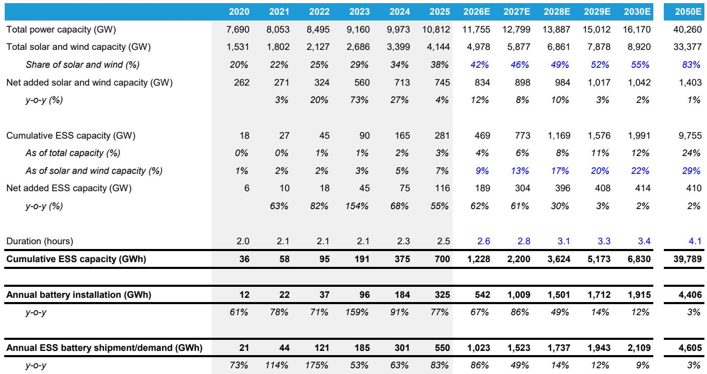
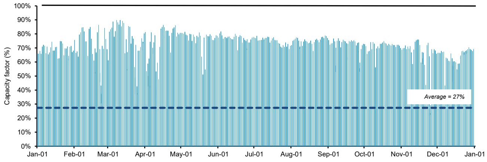
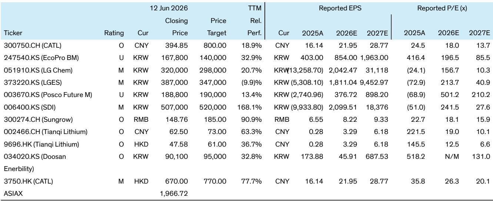

# Solar-Plus-Storage Can Now Deliver Baseload Power at Scale, Reshaping the Economics of AI and Data Center Energy

The energy industry has long operated under a fundamental assumption: renewables like solar cannot provide reliable, continuous baseload power. Intermittency was considered an unbridgeable gap, relegating solar to a supplementary role in the grid mix. A landmark project in the United Arab Emirates now challenges this orthodoxy. Masdar and EWEC are constructing a 5.2 GW solar farm paired with 19 GWh of battery storage, designed to deliver approximately 1 GW of continuous, firm power around the clock. This is not a pilot or a theoretical model. It is a fully financed, construction-stage project targeting completion by 2027.

This development arrives at a critical moment. The explosion in artificial intelligence and data center demand is creating a structural power deficit that conventional generation cannot fill quickly enough. The timelines for new gas plants have stretched to roughly four years due to turbine supply constraints, and nuclear projects routinely take six years or more. Solar-plus-storage can be deployed in roughly two years. The strategic question is no longer whether renewables can contribute to the grid. The question is whether they can compete with fossil fuels on reliability, cost, and speed for the most demanding 24/7 loads.

Our analysis of the Masdar project indicates that solar-plus-storage can achieve approximately 99.6% system reliability at a levelized cost of energy around $97 per megawatt-hour. This makes it cost-competitive with gas-fired generation when natural gas prices exceed roughly $8 per million British thermal units. In a world of volatile gas supply and mounting pressure to decarbonize, this represents a structural shift. The implications for energy strategy, capital allocation, and the competitive landscape of the power sector are profound. The key beneficiaries of this transition will be companies positioned in the energy storage value chain, particularly CATL in battery supply and Sungrow in system integration and power conversion.

## The Masdar Project Proves That Systematic Overbuild and Long-Duration Storage Can Solve Intermittency

The core innovation of the Masdar project is not in any single technology but in system design. The conventional approach to solar-plus-storage optimizes for cost per kilowatt-hour, minimizing overbuild and storage duration. This yields intermittent output suitable for peak shaving but not for baseload. Masdar flips the logic. By installing 5.2 GW of solar capacity to serve a 1 GW continuous load, the system is intentionally overbuilt by more than five times on a capacity basis and roughly 40% on an annual energy basis. The excess generation during daylight hours is not curtailed. It is stored in a 19 GWh battery system, equivalent to 19 hours of duration at full output.

This abundance is the key to reliability. During the day, solar generation directly serves the load while simultaneously charging the battery. At night and during cloudy periods, the battery discharges to maintain continuous output. Our modeling of the local irradiance profile shows that this design can sustain 1 GW of output with a system reliability of 99.6%, meaning the load is served for all but approximately 35 hours per year. This is comparable to the reliability of modern gas-fired combined-cycle plants. The remaining gap is covered by the surplus generation headroom built into the system.

The implication is clear: solar intermittency is not a physical limitation but an economic one. With sufficient overbuild and storage, variable renewables can be shaped into a firm, dispatchable product. The cost of doing so depends primarily on storage pricing, not solar module pricing. This reframes the entire debate about renewable integration.

## Energy Storage Dominates System Economics, Making Battery Cost Declines the Primary Driver of Competitiveness

A detailed breakdown of the Masdar project's capital expenditure reveals a striking fact: energy storage accounts for roughly half of the total system cost. We estimate the total project capex at approximately $6 billion for 1 GW of firm capacity, or roughly $6,000 per kilowatt. Within this, solar modules represent about $0.5 billion, inverters and balance-of-plant another $0.5 billion, and the battery storage system approximately $2.5 billion. The remaining $2.5 billion covers grid infrastructure, electrical works, engineering and construction, land acquisition, and development costs.

This allocation has a critical strategic implication. The competitiveness of solar-plus-storage as a baseload solution is no longer primarily driven by further reductions in solar module prices, which have already fallen dramatically. Instead, the trajectory of battery costs will determine how quickly this solution scales. Every 10% reduction in energy storage system costs translates into roughly a 5% reduction in total system capex, making it the most powerful lever for improving economics.

At current cost levels, the project achieves an estimated levelized cost of energy of $97 per megawatt-hour. This is competitive with gas-fired generation at fuel prices above $8 per million British thermal units. If storage costs continue their historical decline trajectory, a scenario with 12 hours of storage duration rather than 19 still achieves 95% system reliability at an LCOE of approximately $80 per megawatt-hour. This would expand the addressable market significantly, making solar-plus-storage competitive in regions with moderate gas prices.

The implication for investors is that the energy storage value chain, not solar manufacturing, is where the most significant growth and value creation will occur over the next decade. Companies with leadership in battery cell technology, system integration, and power conversion equipment are positioned to capture this structural shift.

## Faster Deployment Gives Solar-Plus-Storage a Critical Timing Advantage Over Gas and Nuclear for AI Demand

The urgency of AI and data center power demand cannot be overstated. Hyperscalers are planning new facilities that require 100 megawatts to over 1 gigawatt of continuous power, often in locations where grid capacity is already constrained. The traditional solution has been natural gas, but the supply chain for gas turbines is now a bottleneck. Lead times for new combined-cycle gas turbines have stretched to approximately four years due to manufacturing constraints and competition for components. Nuclear power, while offering zero-carbon baseload reliability, requires six years or more for permitting and construction, with significant execution risk.

Solar-plus-storage projects can be developed and constructed in roughly two years. The Masdar project, at gigawatt scale, is targeting completion by 2027 from announcement. This speed advantage is not marginal. It is the difference between meeting AI demand growth on schedule and facing multiyear delays that could constrain the pace of technological development. For data center operators, time-to-power is now a critical competitive variable.

This advantage is amplified by modularity. Solar-plus-storage can be built in phases, with generation and storage capacity added incrementally as demand materializes. Gas and nuclear plants require upfront commitment to full capacity. The ability to match capital deployment to load growth reduces financial risk and improves project economics.

The trade-off is land use. The Masdar project requires approximately 60 square kilometers of land, roughly the size of Manhattan. This is orders of magnitude more than a gas plant, which occupies less than 0.05 square kilometers for equivalent capacity. Solar-plus-storage is therefore best suited to regions with abundant, low-cost land and high solar irradiance. It is not a universal solution. But for the Middle East, parts of the American Southwest, Australia, and similar geographies, it is now a credible and competitive option.

## The Report Leaves Unanswered Questions About Scalability Beyond Ideal Geographies and the Role of Emerging Storage Technologies

While the Masdar project is a powerful proof point, several critical questions remain unresolved. The most important is whether this model can be replicated in regions with lower solar irradiance or higher land costs. The UAE benefits from some of the best solar resources on the planet, with capacity factors approaching 27% for fixed-tilt systems. In Northern Europe, the northeastern United States, or East Asia, capacity factors are significantly lower, requiring even greater overbuild and storage duration to achieve similar reliability. This would push LCOE higher and potentially erode the competitive advantage over gas.

A second open question concerns the role of emerging battery technologies. The report notes that next-generation batteries such as sodium-ion could further reduce costs, but it does not model their impact. Sodium-ion batteries promise lower raw material costs and improved safety, but their energy density is lower and their commercial maturity is unproven at the scale required for grid storage. If sodium-ion or other alternatives achieve cost parity with lithium-ion while offering longer cycle life, the economics of solar-plus-storage would improve dramatically. If they fail to scale, the trajectory of cost declines may slow.

Third, the interaction between multiple solar-plus-storage projects on the same grid is not addressed. As penetration of firm renewable power increases, the value of each additional unit may decline due to saturation effects. The first gigawatt of solar-plus-storage in a region may achieve the reliability levels modeled here. The tenth gigawatt may face different dynamics, as the grid becomes increasingly dependent on storage for evening and overnight supply. The system-level implications of scaling this solution to multiple gigawatts remain unexplored.

These questions do not invalidate the thesis. They define the frontier of analytical uncertainty. For readers seeking to make investment or strategic decisions, the full report provides the detailed modeling and scenario analysis needed to assess these risks.

## A Decision Framework for Evaluating Solar-Plus-Storage Opportunities

For executives and investors evaluating whether to commit capital to solar-plus-storage for baseload applications, the analysis suggests a structured decision framework based on three variables.

First, assess local solar resource and land availability. The model works best where annual capacity factors exceed 25% and land costs are below approximately $50,000 per hectare. Regions meeting these criteria include the Middle East, North Africa, the American Southwest, Australia, and parts of India and China. For regions with lower irradiance, the required overbuild and storage duration increase, pushing LCOE above $120 per megawatt-hour and eroding competitiveness.

Second, evaluate the local gas price environment. Solar-plus-storage is competitive with gas at fuel prices above $8 per million British thermal units. In the United States, where Henry Hub prices have historically averaged below $4, gas remains structurally advantaged. In Europe, Asia, and other import-dependent markets, delivered gas prices often exceed $10, creating a clear window for solar-plus-storage. The absence of fuel price risk is an additional strategic benefit, providing cost certainty over the 25-year project life.

Third, consider the time-to-power requirement. If the load must be served within two to three years, solar-plus-storage is likely the fastest option. If the timeline is five years or more, gas or nuclear may be viable alternatives, depending on local regulatory and supply chain conditions. The decision should also account for the cost of delay. For AI data centers, a one-year delay in power availability may result in lost revenue that far exceeds any incremental energy cost.

This framework is not exhaustive, but it provides a starting point for disciplined capital allocation. The full report includes detailed sensitivity analysis across these variables, enabling readers to stress-test their own assumptions.

## Join the Community to Read the Full Report and Review the Original Charts

The Masdar project marks a turning point in the economics of renewable energy. Solar-plus-storage can now deliver baseload power at scale, with reliability and cost that compete with gas in many markets. The implications for AI infrastructure, grid planning, and energy investment are significant. But the details matter. The full report includes the complete cost breakdown, reliability modeling, LCOE sensitivity analysis, and a comparison of solar-plus-storage against gas and nuclear across multiple scenarios. It also provides Bernstein's detailed analysis of the key beneficiaries in the energy storage value chain, including CATL and Sungrow. Join the community to read the full report and review the original charts.

*This article is for learning and discussion only and does not constitute investment advice.*

Personal reading notes and learning share only. Not investment advice.

