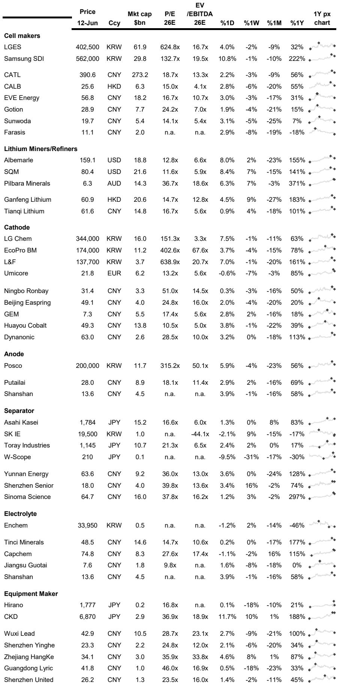
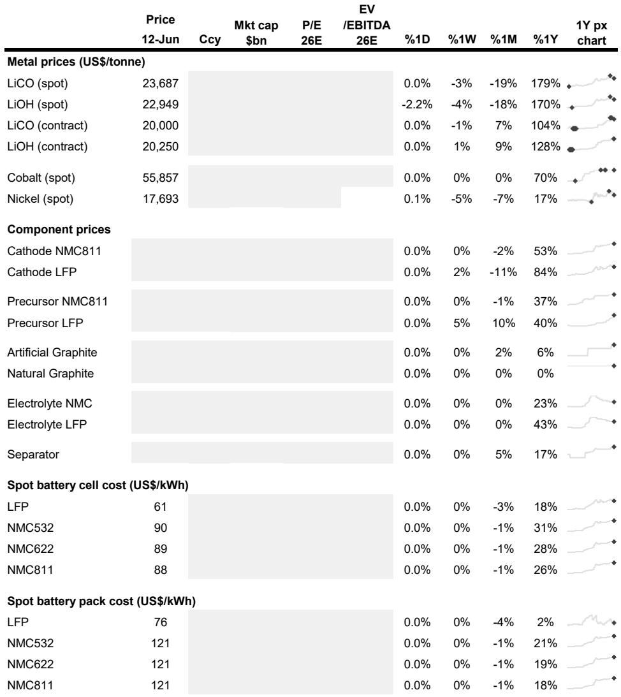
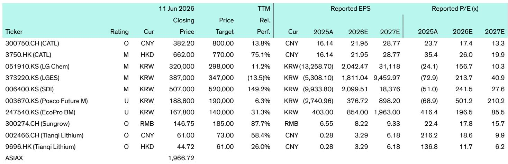

# Bernstein：全球储能市场正在经历从“量变”到“质变”的临界点

这份由Bernstein分析师Neil Beveridge团队发布的Battery Weekly报告，表面上是一份周度动态汇总，但当我们把北美、亚洲、欧洲三个区域本周发生的十几个事件放在一起看，一个更重要的信号浮现出来：全球储能市场正在从“产能扩张驱动”的阶段，转向“技术路线分化与商业模式验证驱动”的新阶段。

过去两年，市场对储能的理解主要停留在“量”的层面——多少GWh的产能规划、多少GW的装机目标。但本周的信息流显示，真正决定下一轮竞争格局的变量，已经从“谁建得更多”变成了“谁在技术路线上选对了方向、谁在商业闭环上走通了路径”。

这不是一个渐进式的变化。钠离子电池从实验室走向项目落地，固态电池从材料验证走向系统集成，车企从动力电池向储能领域的战略跨界，以及直接提锂技术在美国的首次商业化尝试——这些事件在同一个时间窗口密集出现，意味着行业正在为下一轮结构性增长做技术储备和商业模式测试。

对于产业决策者和投资者而言，现在需要回答的问题不再是“储能市场有多大”，而是“哪些技术路线将在下一轮竞争中胜出，哪些企业有能力完成从规模扩张到价值捕获的跃迁”。

## 1. 车企的储能战略转型正在加速，这不仅仅是“第二增长曲线”

通用汽车本周宣布进入固定式储能市场，与Peak Energy和Redwood Materials合作开发钠离子电池用于电网储能，并推进V2G技术。福特此前已经做了类似的布局。Bernstein的这份报告捕捉到了一个关键趋势：车企正在将其在动力电池领域积累的能力，系统性地向储能领域迁移。

这背后有两个驱动因素。第一，AI数据中心带来的电力需求激增，创造了一个全新的、高确定性的储能需求场景。Cypress Creek在阿肯色州的16.3GW光伏加1.9GWh储能项目，电力将直接供应给一家大型科技公司——这个案例的示范效应不容忽视。第二，车企在电池领域的研发投入和制造经验，使其在储能领域具备天然的供应链和技术优势。

但这里有一个市场尚未充分定价的含义：当通用、福特这样的车企大规模进入储能市场，它们带来的不仅是产能，更是对储能系统成本结构和性能标准的重新定义。传统储能电池企业面临的竞争压力，将远远超出市场目前的预期。

## 2. 钠离子电池的商业化进程比市场预期的更快，技术路线分化正在发生

本周有两个事件值得特别关注。一是通用汽车明确选择钠离子电池作为其储能业务的切入点，二是宁夏智耀在宁夏签约建设2GWh的钠离子电池项目，总投资10.6亿元人民币。

钠离子电池此前一直被市场视为“备选方案”，主要优势在于原材料成本低、资源丰富，但能量密度较低。然而，当储能场景对能量密度的要求低于动力电池时，钠离子电池的成本优势就变得非常突出。

Bernstein报告中提到，通用汽车选择钠离子电池的理由包括“成本更低、安全性更高、原材料丰富”。这三点恰好对应了大规模电网储能最核心的需求。如果钠离子电池能够在储能领域率先实现规模化应用，那么它对磷酸铁锂路线的替代效应，可能会在2027-2028年变得显著。

这不是一个遥远的假设。POSCO Holdings在美国犹他州的直接提锂示范项目计划2027年投产，这意味着锂资源供给端也在为钠离子电池的崛起做准备。技术路线的多元化，正在从概念走向现实。

## 3. 全球供应链的区域化重构正在从“口号”走向“合同”

本周的多个事件指向同一个方向：电池供应链的区域化布局已经进入实质性阶段。

EcoPro BM在匈牙利德布勒森的工厂已经开始量产高镍NCA正极材料，首批产品已交付欧洲车企。Lopal Tech计划投资1.6亿美元在印度尼西亚扩建LFP正极材料产能，新增12万吨年产能，主要服务LG能源解决方案和宁德时代的海外订单。Philenergy获得了Agratas在印度和英国的电池设备订单。

这些案例表明，区域化供应链不再是政策口号，而是企业基于客户需求做出的实际投资决策。对于投资者而言，这意味着需要重新评估那些在海外产能布局上领先的企业——它们的竞争优势可能不仅体现在成本上，更体现在对区域市场政策风险的对冲能力上。

但报告没有完全展开的一个问题是：区域化供应链的成本溢价究竟有多大？目前欧洲和美国的本土电池产能成本仍显著高于亚洲，这个溢价能否被政策补贴和客户溢价所覆盖，仍是一个需要持续跟踪的关键变量。

## 4. 固态电池的产业化路径正在从“材料验证”走向“系统集成”

ProLogium与法国汽车供应商OPmobility的合作协议，标志着固态电池的产业化进入了一个新阶段。双方的合作内容不是简单的材料供应，而是将固态电池电芯集成到模组和电池包中。

这背后的逻辑是：固态电池的商业化瓶颈，可能不在电芯本身，而在电芯与系统的集成。固态电池对温度、压力、封装的要求与传统锂离子电池完全不同，这意味着电池包的设计需要根本性的重构。

与此同时，日产与牛津大学、Gelion合作的硫基固态电池项目，以及CK Solution开发的专用于固态电池生产的除湿系统，都在指向同一个判断：固态电池的产业化不是一条单一路径，而是多个技术方向并行推进的过程。

对于投资者而言，需要关注的不只是哪家公司的固态电池能量密度更高，而是谁能够在系统集成层面率先解决工程化难题。这个判断框架目前尚未被市场充分定价。

## 5. 报告尚未完全回答的关键问题：电池回收的商业闭环何时能够跑通

韩国正在加速构建电池回收产业，KOMIR启动了综合回收供应链数据库项目，目标是为LG能源解决方案、三星SDI、SK On等企业提供关键材料的国内供应保障。通用汽车和Redwood Materials在密歇根州的二次利用储能项目，也展示了退役电池梯次利用的商业可能性。

但Bernstein这份报告没有深入分析的是：电池回收的经济性拐点何时到来。目前锂、镍、钴等关键矿产价格虽然有所回升，但距离回收成本线仍有距离。回收产业的商业闭环能否跑通，很大程度上取决于两个变量：一是矿产价格的长期走势，二是回收技术的成本下降曲线。

韩国政府的推动是一个重要信号，但政策驱动能否转化为可持续的商业模型，仍需观察。这可能是未来6-12个月最值得跟踪的产业变量之一。

---

以上分析仅基于Bernstein本周报告中的公开信息，但一份周度报告的篇幅远远不足以展开所有关键议题。比如，报告中提到的CATL与Capchem的电解液长协订单，背后反映的供应链锁定策略如何影响竞争格局？EVE Energy在SNEC上获得的67GWh订单，其客户结构和交付节奏如何？这些细节数据和分析框架，都在完整版报告中有更深入的展开。

欢迎来我们的知识星球微信群里继续讨论——我们每周都会围绕Bernstein等顶级机构的深度报告，拆解那些“报告没有明说但值得深挖”的关键问题。在群里，你可以直接获取完整版报告原文和原始数据表格，也可以与其他产业研究者一起探讨那些尚未被市场定价的结构性变化。

Personal reading notes and learning share only. Not investment advice.

