## Global Memory Tech

# Weekly theme: Vera memory cut, strong June, Samsung dividend, Kor conf preview

Industry Overview

## Thoughts on NVIDIA Vera CPU memory capacity reduction

The street is speculating a 50% SOCAMM memory content cut for NVIDIA's new CPU, Vera, vs the original spec (new 750GB vs old 1,500GB). We believe this is not true. Our check still shows 1,500GB-centric SOCAMM (192GB x 8) as a mainstream for Vera Rubin (with HBM4) vs 750GB (96GB x 8) for Vera CPU rack (without HBM). Of course, clients (Google, Amazon, MSFT, Meta) can opt 750GB or 1,500GB for Vera Rubin superchip or Vera CPU rack. Net-net, we conclude 1) Vera Rubin should continue to use 1,500GB (750GB possible but lower performance), and 2) Vera CPU rack also should initially use 1,500GB, but it can work with 750GB too. Initial SOCAMM orders were for Vera Rubin; thus, Vera CPU rack offers incremental SOCAMM demand – positive for its TAM.

## Upbeat memory sales/exports continue QTD

Korea's semis exports hit a new record high during the first 10 days of June: US\$11bn, +30% MoM or +206% YoY. Key contributors should be 100%+ ASP increase YoY. We also observed a more notable DRAM spot price rally this week (DDR4/DDR5 up by 3-4% WoW). We think NVIDIA Jensen's Korea visit after Computex Taiwan may have further supported sentiment (e.g., NVIDIA's L-T concern on memory chip shortages). Taiwanese memory names have also reported robust May sales growth YoY (Nanya Tech +730%, Phison Electronics +301%, etc.). China also reported very strong IC imports for May (US\$57bn +68% YoY) due to high chip prices (up near-70% YoY; volume down 1%). Overall, we expect memory chip pricing to remain strong across the region.

## Samsung: dividend payments likely to be larger and earlier

Samsung Electronics (SEC) can be a dividend play, in our view. We outline a simple analysis showing why cash dividends for 2026 results could be W50-70tn, with half potentially paid 4-5 months earlier than usual: 1) annual FCF likely W200tn+/-; 2) 50% payout ratio (of FCF) well guided; 3) employee special bonus to be paid (Jan 2027) by buyback-based treasury shares; 4) Samsung Life's (032830 KS) 10.0% stake cap may require it to sell excess SEC shares following SEC's buyback; and 5) retail investor tax benefits if 2026 year-end dividends are distributed in a 50:50 or 40:60 split through 4Q26/1Q27. SEC's preferred shares could be more attractive to investors that focus on higher dividend yields.

## BofA Korea Conference to reinforce super-cycle theme

We will host the Korea Conference over 15-19 June, marking its 18th anniversary with record high participants (\~200 investors, \~120 corporates). We anticipate more bullish sentiment during the conference. Three reasons: memory expert forecasts (chip shortages for 2027 or even 2028 likely to be presented); corporate guidance (global leadership/growth in tech, robot, defense, power, beauty, consumer, etc); and more favorable fund flows (ETF, long-only money) and value-up program (dividend, buyback, US listing). The BofA Korea research team will host a large-group investor call on 23 June 9:00AM HKT to share what the analysts learned during the conference.

## 13 June 2026

Equity

Global

Technology

Simon Woo, CFA >>

Research Analyst

BofA (Seoul)

+82 2 3707 0554

simon.woo@bofa.com

Dai Shen >>

Research Analyst

BofA (Hong Kong)

dai.shen@bofa.com

Vivek Arya

Research Analyst

BofAS

vivek.arya@bofa.com

Mikio Hirakawa >>

Research Analyst

BofAS Japan

mikio.hirakawa@bofa.com

Matt Shin >>

Research Analyst

BofA (Seoul)

matt.shin2@bofa.com

Exhibit 1: DRAM price strongly rebounded for two consecutive weeks, while NAND remained flat  
Spot prices – DRAM and NAND

<table><tr><td>US$</td><td>Current</td><td>WoW</td><td>QoQ</td><td>YoY</td></tr><tr><td colspan="5">DRAM spot</td></tr><tr><td>16Gb DDR5</td><td>44.8</td><td>3%</td><td>14%</td><td>675%</td></tr><tr><td>16Gb DDR4</td><td>66.6</td><td>4%</td><td>-14%</td><td>985%</td></tr><tr><td>8Gb DDR4</td><td>36.3</td><td>2%</td><td>8%</td><td>961%</td></tr><tr><td>4Gb DDR4</td><td>10.1</td><td>7%</td><td>56%</td><td>475%</td></tr><tr><td colspan="5">NAND spot</td></tr><tr><td>1Tb wafer</td><td>25.1</td><td>-1%</td><td>3%</td><td>390%</td></tr><tr><td>512Gb wafer</td><td>20.6</td><td>0%</td><td>0%</td><td>661%</td></tr><tr><td>256Gb wafer</td><td>10.5</td><td>0%</td><td>3%</td><td>601%</td></tr></table>

Source: DRAMeXchange  
BofA GLOBAL RESEARCH

AI: Artificial intelligence

ASP: Average selling price

CPU: Central processing unit

DDR4/5: $4^{th}/5^{th}$ gen double-data rate DRAM

DRAM: Dynamic random-access memory

GB: Gigabyte

GPU: Graphics processing unit

HBM: High bandwidth memory

HBM4/4e/5: $6^{th}/7^{th}/8^{th}$ gen of HBM

IC: Integrated circuit

NAND: Not-AND memory

SOCAMM: Small-outline compression attached memory module

TAM: Total addressable market

## Korea exports, China imports and Taiwan monthly sales

Exhibit 2: Significant jump in Jun (US\$11.1bn; +30% MoM); around 3x higher than 2025-average  
Korea semis exports – First 10 days of month US\$bn  
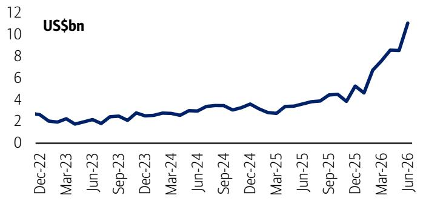

line chart

| Date    | Value (US$bn) |
|---------|---------------|
| Jun-26  | 11            |

Source: MoTIR  
BofA GLOBAL RESEARCH

Exhibit 4: China monthly integrated circuit (IC) imports and YoY  
IC imports reached a record high at US\$56.6bn in May, +68% YoY  
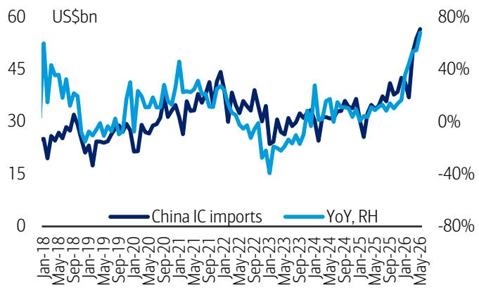

line chart

| Date    | China IC imports (US$bn) | YoY, RH (%) |
|---------|---------------------------|-------------|
| Jan-18  | ~25                       | ~45%        |
| May-18  | ~30                       | ~30%        |
| Sep-18  | ~20                       | ~20%        |
| Jan-19  | ~15                       | ~10%        |
| May-19  | ~25                       | ~25%        |
| Sep-19  | ~30                       | ~30%        |
| Jan-20  | ~20                       | ~20%        |
| May-20  | ~30                       | ~30%        |
| Sep-20  | ~35                       | ~45%        |
| Jan-21  | ~30                       | ~30%        |
| May-21  | ~35                       | ~35%        |
| Sep-21  | ~40                       | ~40%        |
| Jan-22  | ~35                       | ~30%        |
| May-22  | ~30                       | ~20%        |
| Sep-22  | ~25                       | ~10%        |
| Jan-23  | ~30                       | ~20%        |
| May-23  | ~35                       | ~30%        |
| Sep-23  | ~30                       | ~20%        |
| Jan-24  | ~35                       | ~30%        |
| May-24  | ~40                       | ~35%        |
| Sep-24  | ~35                       | ~30%        |
| Jan-25  | ~30                       | ~20%        |
| May-25  | ~35                       | ~30%        |
| Sep-25  | ~40                       | ~35%        |
| Jan-26  | ~45                       | ~40%        |
| May-26  | ~55                       | ~50%        |

Source: China General Customs  
BofA GLOBAL RESEARCH

Exhibit 6: Solid MoM growth led by memory names – ADATA +23%, Phison +13%, Nanya Tech +9%  
Taiwan tech companies' MoM monthly sales (May 2026)  
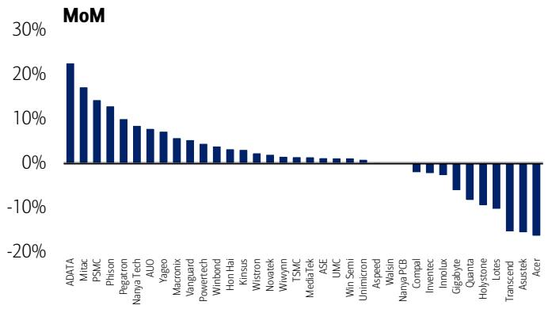

bar chart

| Company      | MoM Change |
| ------------ | ---------- |
| ADATA        | 22%        |
| Mitac        | 17%        |
| PSMC         | 14%        |
| Phison       | 13%        |
| Pegatron     | 10%        |
| Nanya Tech   | 8%         |
| AUO          | 7%         |
| Yageo        | 6%         |
| Macronix     | 5%         |
| Vanguard     | 4%         |
| Powertech    | 3%         |
| Winbond      | 2%         |
| Hon Hai      | 2%         |
| Kinsus       | 1%         |
| Wistron      | 1%         |
| Novatek      | 1%         |
| Wiwynn       | 1%         |
| TSMC         | 1%         |
| MediaTek     | 1%         |
| ASE          | 1%         |
| UMC          | 1%         |
| Win Semi     | 1%         |
| Unmicron     | 0%         |
| Aspeed       | 0%         |
| Walsin       | 0%         |
| Nanya PCB    | -2%        |
| Compal       | -3%        |
| Inventec     | -4%        |
| Innolux      | -5%        |
| Gigabyte     | -6%        |
| Quanta       | -7%        |
| Holystone    | -8%        |
| Lotes        | -9%        |
| Transcend    | -15%       |
| Asustek      | -16%       |
| Acer         | -17%       |

Source: Company reports  
BofA GLOBAL RESEARCH

Exhibit 3: YoY rebound accelerated to +206% in Jun; already five consecutive months of triple-digit growth  
Korea semis exports – First 10 days of month YoY growth  
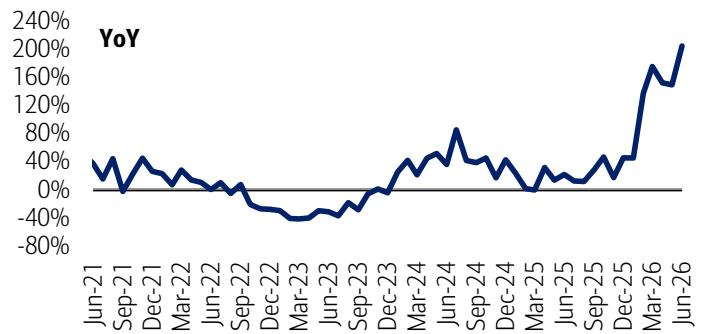

line chart

| Date    | YoY   |
|---------|-------|
| Jun-21  | ~30%  |
| Sep-21  | ~40%  |
| Dec-21  | ~30%  |
| Mar-22  | ~20%  |
| Jun-22  | ~10%  |
| Sep-22  | ~0%   |
| Dec-22  | ~-20% |
| Mar-23  | ~-40% |
| Jun-23  | ~-30% |
| Sep-23  | ~-10% |
| Dec-23  | ~0%   |
| Mar-24  | ~40%  |
| Jun-24  | ~80%  |
| Sep-24  | ~60%  |
| Dec-24  | ~40%  |
| Mar-25  | ~20%  |
| Jun-25  | ~30%  |
| Sep-25  | ~40%  |
| Dec-25  | ~60%  |
| Mar-26  | ~160% |
| Jun-26  | ~200% |

Source: MoTIR  
BofA GLOBAL RESEARCH

Exhibit 5: China monthly integrated circuit (IC) imports volume and YoY  
China IC imports reached 49.7bn units in May, -1% YoY  
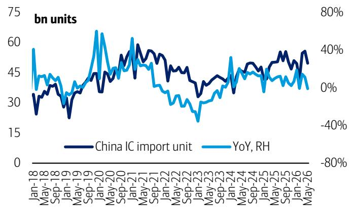

line chart

| Date    | China IC import unit | YoY, RH |
|---------|----------------------|---------|
| Jan-18  | ~30                  | ~40%    |
| May-18  | ~35                  | ~30%    |
| Sep-18  | ~30                  | ~20%    |
| Jan-19  | ~25                  | ~10%    |
| May-19  | ~35                  | ~25%    |
| Sep-19  | ~45                  | ~40%    |
| Jan-20  | ~65                  | ~60%    |
| May-20  | ~50                  | ~30%    |
| Sep-20  | ~55                  | ~40%    |
| Jan-21  | ~60                  | ~35%    |
| May-21  | ~50                  | ~20%    |
| Sep-21  | ~45                  | ~10%    |
| Jan-22  | ~40                  | ~0%     |
| May-22  | ~35                  | -10%    |
| Sep-22  | ~30                  | -20%    |
| Jan-23  | ~25                  | -30%    |
| May-23  | ~30                  | -20%    |
| Sep-23  | ~35                  | -10%    |
| Jan-24  | ~40                  | 0%      |
| May-24  | ~45                  | 10%     |
| Sep-24  | ~50                  | 20%     |
| Jan-25  | ~45                  | 10%     |
| May-25  | ~50                  | 20%     |
| Sep-25  | ~55                  | 30%     |
| Jan-26  | ~60                  | 40%     |
| May-26  | ~55                  | 30%     |

Source: China General Customs  
BofA GLOBAL RESEARCH

Exhibit 7: Positive YoY growth across all companies; notably strong rebound seen – Nanya +730%, Phison +301%, Quanta +94%, TSMC +30%  
Taiwan tech companies' YoY monthly sales (May 2026)  
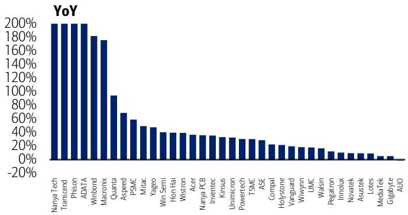

bar chart

| Company     | YoY   |
| ----------- | ----- |
| Nanya Tech  | 200%  |
| Transcend   | 200%  |
| Phison      | 200%  |
| ADATIA      | 200%  |
| Winbond     | 180%  |
| Quanta      | 170%  |
| Aspeed      | 90%   |
| PSMC        | 60%   |
| Mitac       | 50%   |
| Yageo       | 45%   |
| Win Semi    | 40%   |
| Hon Hai     | 35%   |
| Wistron     | 35%   |
| Acer        | 35%   |
| Nanya PCB   | 35%   |
| Inventec    | 35%   |
| Kinsus      | 30%   |
| Unimicron   | 30%   |
| Powertech   | 30%   |
| TSMC        | 30%   |
| ASE         | 25%   |
| Compal      | 20%   |
| Holystone    | 20%   |
| Vanguard    | 15%   |
| Wiwynn      | 15%   |
| UMC         | 15%   |
| Walsin      | 15%   |
| Pegatron    | 10%   |
| Inmolux     | 10%   |
| Novatek     | 10%   |
| Astrek      | 10%   |
| Lotes       | 10%   |
| MediaTek    | 5%    |
| Gigabyte    | 5%    |
| AUAO        | 0%    |

\*Nanya Tech up 730% YoY, Transcend +470%, Phison +301%, ADATA +210%  
Source: Company reports  
BofA GLOBAL RESEARCH

## BofA Memory Indicator

Exhibit 8: Our memory indicator reached an all-time high of 189 in Mar/Apr-26, driven by exceptionally strong DRAM/NAND spot pricing, rising ASPs and billings, along with Korea's $150\%+$ export growth.

BofA Memory Indicator – back to upturn level since Oct-2025 and hit highest peak in Mar/Apr-26 (back-tested)

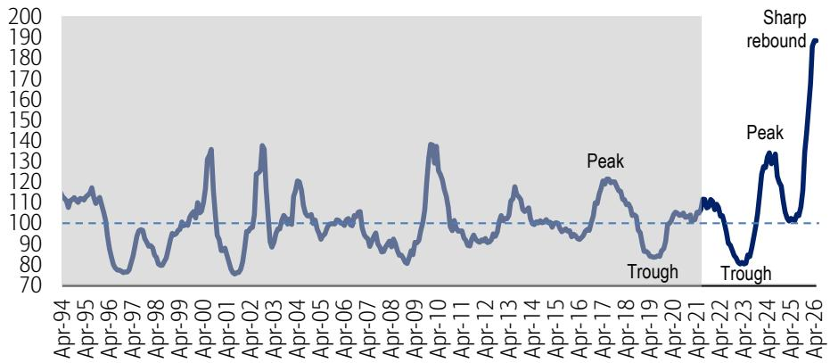

line chart

| Date    | Value |
|---------|-------|
| Apr-94  | 110   |
| Apr-95  | 115   |
| Apr-96  | 105   |
| Apr-97  | 95    |
| Apr-98  | 100   |
| Apr-99  | 110   |
| Apr-00  | 135   |
| Apr-01  | 75    |
| Apr-02  | 135   |
| Apr-03  | 90    |
| Apr-04  | 120   |
| Apr-05  | 105   |
| Apr-06  | 100   |
| Apr-07  | 105   |
| Apr-08  | 95    |
| Apr-09  | 85    |
| Apr-10  | 135   |
| Apr-11  | 100   |
| Apr-12  | 105   |
| Apr-13  | 115   |
| Apr-14  | 105   |
| Apr-15  | 100   |
| Apr-16  | 95    |
| Apr-17  | 120   |
| Apr-18  | 125   |
| Apr-19  | 95    |
| Apr-20  | 85    |
| Apr-21  | 105   |
| Apr-22  | 110   |
| Apr-23  | 80    |
| Apr-24  | 130   |
| Apr-25  | 105   |
| Apr-26  | 190   |

Note: Our indicator had previously been capped at \~140, but the recent unprecedented surge—driven by memory spot prices, ASPs, and billings—has led us to raise the ceiling (up to 240 levels) to reflect a more accurate relative comparison. This exceptional strength is further validated by strong earnings from memory chipmakers.  
Source: DRAMeXchange, WSTS, MoTIR Korea, BofA Global Research  
\*The shaded area represents back-tested results from January 1991 to March 2021. The unshaded area represents actual performance since April 2021. This performance is back-tested up to March-2021, and does not represent the actual performance of any account or fund. Back-tested performance depicts the theoretical (not actual) performance of a particular strategy over the time period indicated. No representation is being made that any actual portfolio is likely to have achieved returns similar to those shown herein.  
Disclaimer: The BofA Memory Indicator is intended to be an indicative metric only and may not be used for reference purposes or as a measure of performance for any financial instrument or contract, or otherwise relied upon by third parties for any other purpose, without the prior written consent of BofA Global Research. This indicator was not created to act as a benchmark. For methodology, see the 5 Aug 2024 Global Memory Tech report.  
BofA GLOBAL RESEARCH

Exhibit 9: May share price surged to record highs, supported by Samsung (strong 1Q results, optimism around HBM4 upside, and higher exposure to conventional DRAM), SK Hynix (solid 1Q performance and leadership in HBM3e/4), and Nanya Tech (record Jan–May monthly sales, up \~500–700% YoY).

BofA Memory Indicator is highly correlated with stock performance (back-tested)

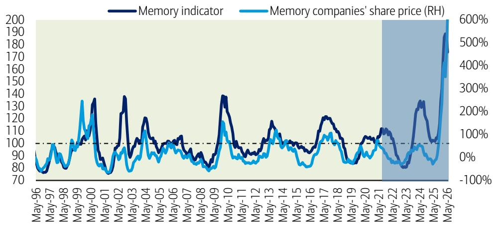

line chart

| Date   | Memory indicator | Memory companies' share price (RH) |
|--------|------------------|-----------------------------------|
| May-96 | ~80              | ~90%                              |
| May-97 | ~90              | ~100%                             |
| May-98 | ~100             | ~110%                             |
| May-99 | ~130             | ~130%                             |
| May-00 | ~140             | ~120%                             |
| May-01 | ~80              | ~70%                              |
| May-02 | ~130             | ~90%                              |
| May-03 | ~90              | ~80%                              |
| May-04 | ~120             | ~100%                             |
| May-05 | ~100             | ~90%                              |
| May-06 | ~100             | ~80%                              |
| May-07 | ~90              | ~70%                              |
| May-08 | ~80              | ~60%                              |
| May-09 | ~130             | ~110%                             |
| May-10 | ~100             | ~90%                              |
| May-11 | ~90              | ~80%                              |
| May-12 | ~100             | ~90%                              |
| May-13 | ~110             | ~100%                             |
| May-14 | ~100             | ~90%                              |
| May-15 | ~90              | ~80%                              |
| May-16 | ~120             | ~100%                             |
| May-17 | ~110             | ~110%                             |
| May-18 | ~100             | ~90%                              |
| May-19 | ~90              | ~80%                              |
| May-20 | ~100             | ~90%                              |
| May-21 | ~110             | ~100%                             |
| May-22 | ~80              | ~70%                              |
| May-23 | ~30              | ~50%                              |
| May-24 | ~350             | ~45%                              |
| May-25 | ~130             | ~35%                              |
| May-26 | ~200             | ~600%                             |

Note: Memory companies share price is average of Samsung, Hynix, Micron, and Nanya share price YoY changes  
Source: Bloomberg, BofA Global Research  
The light green shaded area represents back-tested results from January 1991 to March 2021. The blue shaded area represents actual data since April 2021. This performance is back-tested and does not represent the actual performance of any account or fund. Back-tested performance depicts the theoretical (not actual) performance of a particular strategy over the time period indicated. No representation is being made that any actual portfolio is likely to have achieved returns similar to those shown herein. For methodology, see the 5 Aug 2024 Global Memory Tech report.  
BofA GLOBAL RESEARCH

Exhibit 10: HBM, DDR5, and legacy DRAM drove a strong YoY rebound in April, with DRAM ASP/billings up +211%/+375% and NAND +282%/+366%; momentum carried into May with sharp YoY gains in spot pricing (DRAM +839%, NAND +646%) and Korea semiconductor exports rising +170%

Seven components of BofA Memory Indicator – MoM and YoY trends (back-tested)

<table><tr><td></td><td>May-25</td><td>Jun-25</td><td>Jul-25</td><td>Aug-25</td><td>Sep-25</td><td>Oct-25</td><td>Nov-25</td><td>Dec-25</td><td>Jan-26</td><td>Feb-26</td><td>Mar-26</td><td>Apr-26</td><td>May-26</td></tr><tr><td colspan="14">MoM</td></tr><tr><td>DRAM spot price</td><td>Up</td><td>Up</td><td>Up</td><td>Up</td><td>Up</td><td>Up</td><td>Up</td><td>Up</td><td>Up</td><td>Up</td><td>Up</td><td>Down</td><td>Up</td></tr><tr><td>NAND spot price</td><td>Down</td><td>Down</td><td>Down</td><td>Up</td><td>Up</td><td>Up</td><td>Up</td><td>Up</td><td>Up</td><td>Up</td><td>Up</td><td>Down</td><td>Down</td></tr><tr><td>Korea semis exports</td><td>Up</td><td>Up</td><td>Down</td><td>Up</td><td>Up</td><td>Down</td><td>Up</td><td>Up</td><td>Up</td><td>Up</td><td>Up</td><td>Down</td><td>Up</td></tr><tr><td>DRAM ASP</td><td>Down</td><td>Down</td><td>Up</td><td>Up</td><td>Up</td><td>Up</td><td>Up</td><td>Up</td><td>Up</td><td>Up</td><td>Up</td><td>Up</td><td>na</td></tr><tr><td>NAND ASP</td><td>Up</td><td>Down</td><td>Up</td><td>Down</td><td>Down</td><td>Up</td><td>Up</td><td>Up</td><td>Up</td><td>Up</td><td>Up</td><td>Up</td><td>na</td></tr><tr><td>DRAM billings</td><td>Up</td><td>Up</td><td>Up</td><td>Up</td><td>Up</td><td>Down</td><td>Up</td><td>Up</td><td>Down</td><td>Up</td><td>Up</td><td>Down</td><td>na</td></tr><tr><td>NAND billings</td><td>Up</td><td>Up</td><td>Down</td><td>Up</td><td>Up</td><td>Down</td><td>Up</td><td>Up</td><td>Up</td><td>Up</td><td>Up</td><td>Down</td><td>na</td></tr><tr><td>Avg of MoM trend</td><td>Up</td><td>Up</td><td>Down</td><td>Up</td><td>Up</td><td>Up</td><td>Up</td><td>Up</td><td>Up</td><td>Up</td><td>Up</td><td>Up</td><td>na</td></tr><tr><td colspan="14">YoY</td></tr><tr><td>DRAM spot price</td><td>Up</td><td>Up</td><td>Up</td><td>Up</td><td>Up</td><td>Up</td><td>Up</td><td>Up</td><td>Up</td><td>Up</td><td>Up</td><td>Up</td><td>Up</td></tr><tr><td>NAND spot price</td><td>Down</td><td>Down</td><td>Down</td><td>Down</td><td>Up</td><td>Up</td><td>Up</td><td>Up</td><td>Up</td><td>Up</td><td>Up</td><td>Up</td><td>Up</td></tr><tr><td>Korea semis exports</td><td>Up</td><td>Up</td><td>Up</td><td>Up</td><td>Up</td><td>Up</td><td>Up</td><td>Up</td><td>Up</td><td>Up</td><td>Up</td><td>Up</td><td>Up</td></tr><tr><td>DRAM ASP</td><td>Up</td><td>Up</td><td>Up</td><td>Up</td><td>Up</td><td>Up</td><td>Up</td><td>Up</td><td>Up</td><td>Up</td><td>Up</td><td>Up</td><td>na</td></tr><tr><td>NAND ASP</td><td>Down</td><td>Down</td><td>Down</td><td>Down</td><td>Down</td><td>Down</td><td>Up</td><td>Up</td><td>Up</td><td>Up</td><td>Up</td><td>Up</td><td>na</td></tr><tr><td>DRAM billings</td><td>Up</td><td>Up</td><td>Up</td><td>Up</td><td>Up</td><td>Up</td><td>Up</td><td>Up</td><td>Up</td><td>Up</td><td>Up</td><td>Up</td><td>na</td></tr><tr><td>NAND billings</td><td>Down</td><td>Down</td><td>Down</td><td>Down</td><td>Up</td><td>Up</td><td>Up</td><td>Up</td><td>Up</td><td>Up</td><td>Up</td><td>Up</td><td>na</td></tr><tr><td>Avg of YoY trend</td><td>Up</td><td>Up</td><td>Up</td><td>Up</td><td>Up</td><td>Up</td><td>Up</td><td>Up</td><td>Up</td><td>Up</td><td>Up</td><td>Up</td><td>na</td></tr><tr><td>Memory indicator</td><td>102</td><td>102</td><td>105</td><td>104</td><td>108</td><td>116</td><td>135</td><td>144</td><td>168</td><td>186</td><td>189</td><td>189</td><td>na</td></tr></table>

Source: DRAMeXchange, WSTS, MoTIE Korea, BofA Global Research estimates. This performance is back-tested and does not represent the actual performance of any account or fund. Back-tested performance depicts the theoretical (not actual) performance of a particular strategy over the time period indicated. No representation is being made that any actual portfolio is likely to have achieved returns similar to those shown herein. Notes: \*Apr-26 results recovered in all aspects in terms of YoY growth, but softened in terms of MoM change due to high base level in Mar-26  
\*\*For May-26, only spot prices and exports are reported so far  
\*\*\*DRAM spot price is based on weighted average MoM change of 16Gb DDR5, 16Gb DDR4 and 8Gb DDR4; NAND spot price is based on MoM change in 512Gb wafer spot price

BofA GLOBAL RESEARCH

Exhibit 11: Exceptionally strong DRAM/NAND spot pricing persisted through Apr–May, with DRAM ASPs and billings also rising sharply in April, while semiconductor exports remained robust, reaching record highs in May  
Seven components of BofA Memory Indicator – YoY  
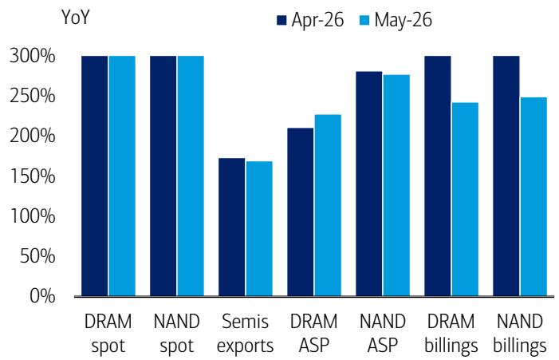

bar chart

| Category | Apr-26 (%) | May-26 (%) |
| :--- | :--- | :--- |
| DRAM spot | 300 | 300 |
| NAND spot | 300 | 300 |
| Semis exports | 170 | 168 |
| DRAM ASP | 210 | 228 |
| NAND ASP | 280 | 275 |
| DRAM billings | 300 | 245 |
| NAND billings | 300 | 250 |

\*All Apr data and May spot/exports are actual, but May billings are our estimates  
\*\*DRAM spot up +902%/839% YoY and NAND spot up +654%/646% YoY in Apr/May  
Source: DRAMeXchange, WSTS, MoTIR Korea, BofA Global Research estimates  
BofA GLOBAL RESEARCH

Exhibit 12: DRAM/NAND spot prices stabilized in Apr–May following a sharp rally in 4Q25/1Q26; however, semiconductor exports rebounded strongly MoM in May, while DRAM/NAND ASPs remained elevated in Apr even as billings showed some moderation  
Seven components of BofA Memory Indicator – MoM  
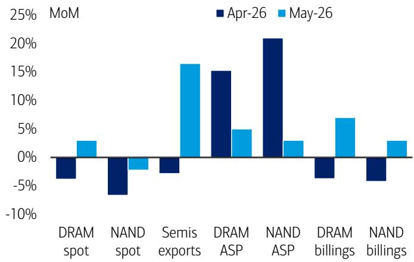

bar chart

| Category | Apr-26 (MoM) | May-26 (MoM) |
| :--- | :--- | :--- |
| DRAM spot | -4.5 | 3.0 |
| NAND spot | -7.0 | -1.5 |
| Semis exports | -3.0 | 16.0 |
| DRAM ASP | 15.0 | 5.0 |
| NAND ASP | 21.0 | 3.0 |
| DRAM billings | -3.5 | 7.0 |
| NAND billings | -5.0 | 3.0 |

\* All Apr data and May spot/exports are actual, but May billings are our estimates  
Source: DRAMeXchange, WSTS, MoTIR Korea, BofA Global Research estimates

BofA GLOBAL RESEARCH

## Memory spot/contract price trend

Exhibit 13: DRAM spot prices rebounded in 1H- June after softening through April–May, following a strong rally from September 2025 to January 2026. Prices have reached multi-decade highs, with 16Gb DDR5 at \~\$45 and DDR4 at \~\$65, driven by supply reallocation toward HBM and server DRAM—well above the prior \~\$10 peak in October 2017.

DRAM spot price – long-term trend (2000-2025)

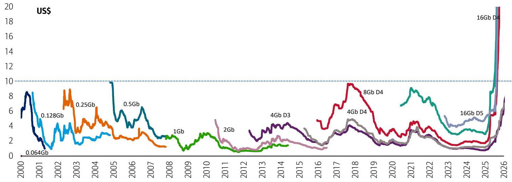

line chart

| Year | Value     |
|------|-----------|
| 2000 | 0.064Gb   |
| 2001 | 0.128Gb   |
| 2002 | 0.25Gb    |
| 2003 | 0.5Gb     |
| 2004 | 1Gb       |
| 2005 | 2Gb       |
| 2006 | 4Gb D3    |
| 2007 | 8Gb D4    |
| 2008 | 16Gb D5   |
| 2009 | 16Gb D4   |
| 2010 | 16Gb D4   |
| 2011 | 16Gb D4   |
| 2012 | 16Gb D4   |
| 2013 | 16Gb D4   |
| 2014 | 16Gb D4   |
| 2015 | 16Gb D4   |
| 2016 | 16Gb D4   |
| 2017 | 16Gb D4   |
| 2018 | 16Gb D4   |
| 2019 | 16Gb D4   |
| 2020 | 16Gb D4   |
| 2021 | 16Gb D4   |
| 2022 | 16Gb D4   |
| 2023 | 16Gb D4   |
| 2024 | 16Gb D4   |
| 2025 | 16Gb D4   |
| 2026 | 16Gb D4   |

Source: DRAMeXchange  
BofA GLOBAL RESEARCH

Exhibit 14: DRAM spot and contract prices reached record highs (\$35-40), then leveled off during April–May following a strong rally in 4Q25 and 1Q26.  
DRAM spot and contract price - quarterly average trend  
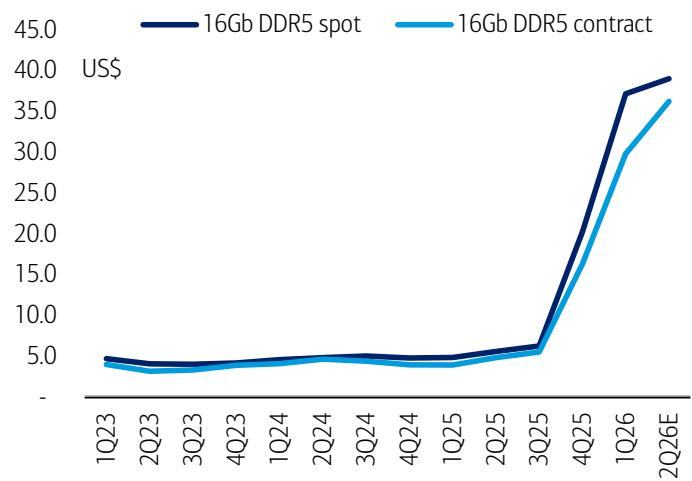

line chart

| Quarter | 16Gb DDR5 spot | 16Gb DDR5 contract |
| ------- | -------------- | ------------------ |
| 1Q23    | ~4.5           | ~4.0               |
| 2Q23    | ~4.0           | ~3.5               |
| 3Q23    | ~4.0           | ~3.5               |
| 4Q23    | ~4.0           | ~3.5               |
| 1Q24    | ~4.0           | ~3.5               |
| 2Q24    | ~4.0           | ~3.5               |
| 3Q24    | ~4.0           | ~3.5               |
| 4Q24    | ~4.0           | ~3.5               |
| 1Q25    | ~4.0           | ~3.5               |
| 2Q25    | ~4.0           | ~3.5               |
| 3Q25    | ~5.0           | ~5.0               |
| 4Q25    | ~15.0          | ~15.0              |
| 1Q26    | ~37.0          | ~30.0              |
| 2Q26E   | ~39.0          | ~36.0              |

2Q26 average is based on April and up until May  
Source: DRAMeXchange, TrendForce  
BofA GLOBAL RESEARCH

Exhibit 15: NAND wafer contract prices have surged significantly ahead of spot prices, with both now at record-high levels  
NAND wafer spot and contract price - quarterly average trend  
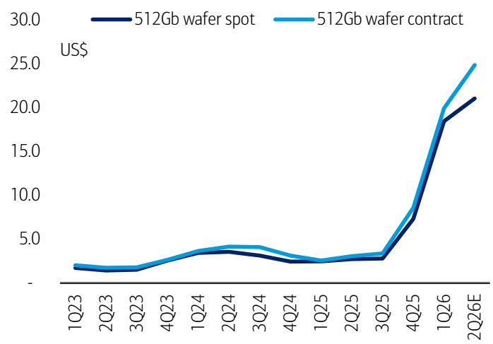

line chart

| Quarter | 512Gb wafer spot | 512Gb wafer contract |
| ------- | ---------------- | -------------------- |
| 1Q23    | ~2.0             | ~2.0                 |
| 2Q23    | ~1.8             | ~1.8                 |
| 3Q23    | ~1.9             | ~1.9                 |
| 4Q23    | ~2.5             | ~2.5                 |
| 1Q24    | ~3.5             | ~3.5                 |
| 2Q24    | ~4.0             | ~4.0                 |
| 3Q24    | ~3.8             | ~4.0                 |
| 4Q24    | ~3.0             | ~3.0                 |
| 1Q25    | ~2.8             | ~2.8                 |
| 2Q25    | ~3.0             | ~3.0                 |
| 3Q25    | ~3.0             | ~3.0                 |
| 4Q25    | ~7.0             | ~8.0                 |
| 1Q26    | ~18.0            | ~20.0                |
| 2Q26E   | ~21.0            | ~25.0                |

2Q26 average is based on April and up until May  
Source: DRAMeXchange, TrendForce  
BofA GLOBAL RESEARCH

Exhibit 16: Prices rebounded through May/1H-June, reaching an all-time high (\$45) following a volatile April. Uptrend was driven by strong gains in Oct (+70%), Nov (+60%), Jan (+25%), before moderating into a more subdued trend during Feb–Mar  
16Gb DDR5 spot price – daily, Oct '23 - Jun '26  
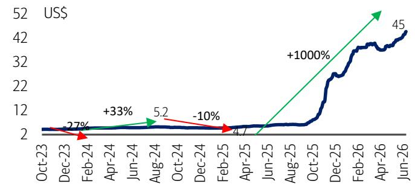

line chart

| Date    | Value |
|---------|-------|
| Oct-23  | 2     |
| Dec-23  | 27%   |
| Feb-24  | 5.2   |
| Apr-24  | -10%  |
| Jun-24  | 4.7   |
| Aug-24  | 4.7   |
| Oct-24  | 4.7   |
| Dec-24  | 4.7   |
| Feb-25  | 4.7   |
| Apr-25  | 4.7   |
| Jun-25  | 4.7   |
| Aug-25  | 4.7   |
| Oct-25  | 4.7   |
| Dec-25  | 4.7   |
| Feb-26  | 4.7   |
| Apr-26  | 4.7   |
| Jun-26  | 4.7   |

Source: DRAMeXchange  
BofA GLOBAL RESEARCH

Exhibit 18: 8Gb DDR4 prices rose sharply in 1H-Jun and throughout May after stabilizing in April; they remain significantly higher YoY due to supply cuts by major vendors, currently around \$30—well above the prior \~\$10 peak in October 2017  
8Gb DDR4 spot price trend, Oct '23 - Jun '26  
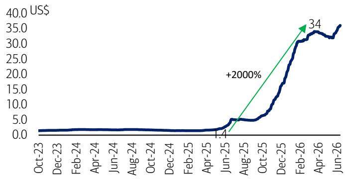

line chart

| Date    | Value |
|---------|-------|
| Jun-25  | 1.1   |
| Feb-26  | 34    |

Source: DRAMeXchange  
BofA GLOBAL RESEARCH

Exhibit 20: DDR4 and DDR5 (16Gb) contract prices are similar at US\$35-\$40 levels – DDR5 price premium no longer exists due to DDR4 shortage  
16Gb DDR5 vs 16Gb DDR4 contract price trend, Jan '23-May '26  
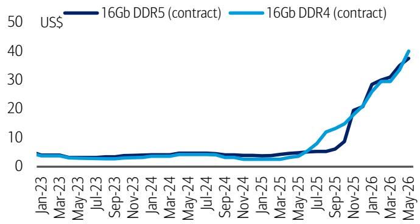

line chart

| Date    | 16Gb DDR5 (contract) | 16Gb DDR4 (contract) |
|---------|----------------------|----------------------|
| Jan-23  | ~4                   | ~4                   |
| Mar-23  | ~4                   | ~4                   |
| May-23  | ~4                   | ~4                   |
| Jul-23  | ~4                   | ~4                   |
| Sep-23  | ~4                   | ~4                   |
| Nov-23  | ~4                   | ~4                   |
| Jan-24  | ~4                   | ~4                   |
| Mar-24  | ~4                   | ~4                   |
| May-24  | ~4                   | ~4                   |
| Jul-24  | ~4                   | ~4                   |
| Sep-24  | ~4                   | ~4                   |
| Nov-24  | ~4                   | ~4                   |
| Jan-25  | ~4                   | ~4                   |
| Mar-25  | ~4                   | ~4                   |
| May-25  | ~4                   | ~4                   |
| Jul-25  | ~8                   | ~10                  |
| Sep-25  | ~18                  | ~20                  |
| Nov-25  | ~28                  | ~30                  |
| Jan-26  | ~35                  | ~35                  |
| Mar-26  | ~38                  | ~38                  |
| May-26  | ~40                  | ~40                  |

Source: TrendForce  
BofA GLOBAL RESEARCH

Exhibit 17: Modest uptick observed in May/1H-Jun (+6-7%), following a sequential slowdown from Feb (+10%) to flat momentum in Mar and a minor decline in Apr, after the strong Jan (+25%) surge and the sharp Oct–Nov-25 rally (+60–120%)  
16Gb DDR5 spot month-average price – MoM change, Oct '23 - Jun '26  
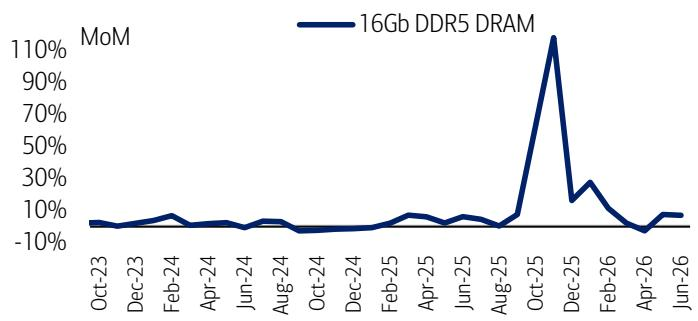

line chart

| Month    | MoM     |
| -------- | ------- |
| Oct-23   | ~0%     |
| Dec-23   | ~0%     |
| Feb-24   | ~5%     |
| Apr-24   | ~0%     |
| Jun-24   | ~0%     |
| Aug-24   | ~0%     |
| Oct-24   | ~0%     |
| Dec-24   | ~0%     |
| Feb-25   | ~5%     |
| Apr-25   | ~0%     |
| Jun-25   | ~0%     |
| Aug-25   | ~0%     |
| Oct-25   | ~110%   |
| Dec-25   | ~10%    |
| Feb-26   | ~30%    |
| Apr-26   | ~0%     |
| Jun-26   | ~5%     |

Source: DRAMeXchange  
BofA GLOBAL RESEARCH

Exhibit 19: Prices edged up slightly in late May/1H-June after a \~25% correction from April to mid-May, having peaked near \~\$80 in early March. Despite this pullback, prices remain elevated—up \~2000% from \~\$3 in October 2025—supported by strong gains through Sep–Dec (+30–70%) and January (+20%)  
16Gb DDR4 spot price trend, Jun '23 - Jun '26  
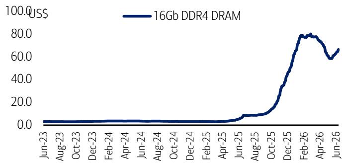

line chart

| Date    | Price (US$) |
|---------|-------------|
| Jun-23  | 0.0         |
| Aug-23  | 0.0         |
| Oct-23  | 0.0         |
| Dec-23  | 0.0         |
| Feb-24  | 0.0         |
| Apr-24  | 0.0         |
| Jun-24  | 0.0         |
| Aug-24  | 0.0         |
| Oct-24  | 0.0         |
| Dec-24  | 0.0         |
| Feb-25  | 0.0         |
| Apr-25  | 0.0         |
| Jun-25  | 5.0         |
| Aug-25  | 10.0        |
| Oct-25  | 30.0        |
| Dec-25  | 60.0        |
| Feb-26  | 80.0        |
| Apr-26  | 75.0        |
| Jun-26  | 65.0        |

Source: DRAMeXchange  
BofA GLOBAL RESEARCH

Exhibit 21: DDR5 and DDR4 contract prices up 10-15% MoM each in Apr/May-26 vs broadly stable in Mar; price strong through 2H25 and early 2026  
16Gb DDR5 vs 16Gb DDR4 contract price change - MoM, Jan '23-May '26  
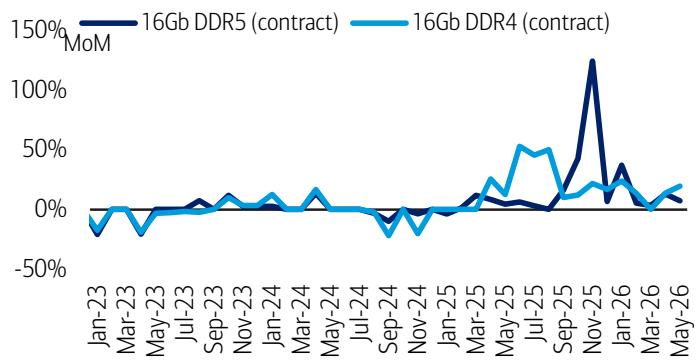

line chart

| Month    | 16Gb DDR5 (contract) | 16Gb DDR4 (contract) |
|----------|----------------------|----------------------|
| Jan-23   | -20%                 | -10%                 |
| Mar-23   | -10%                 | -20%                 |
| May-23   | 0%                   | 0%                   |
| Jul-23   | 0%                   | 0%                   |
| Sep-23   | 0%                   | 0%                   |
| Nov-23   | 0%                   | 0%                   |
| Jan-24   | 0%                   | 0%                   |
| Mar-24   | 0%                   | 0%                   |
| May-24   | 0%                   | 0%                   |
| Jul-24   | 0%                   | 0%                   |
| Sep-24   | 0%                   | -20%                 |
| Nov-24   | 0%                   | -10%                 |
| Jan-25   | 0%                   | 0%                   |
| Mar-25   | 0%                   | 0%                   |
| May-25   | 0%                   | 0%                   |
| Jul-25   | 0%                   | 0%                   |
| Sep-25   | 0%                   | 0%                   |
| Nov-25   | 120%                 | 0%                   |
| Jan-26   | 30%                  | 0%                   |
| Mar-26   | 0%                   | 0%                   |
| May-26   | 0%                   | 0%                   |

Source: TrendForce  
BofA GLOBAL RESEARCH

Exhibit 22: NAND spot prices broadly stable in 2H-May/1H-June, after trending down gradually through late March, April, and 1H-May, still up 50%+ YTD and 8x vs Feb-25 low (\$2.4)  
512Gb NAND wafer spot price – weekly, Mar '21 - Jun '26  
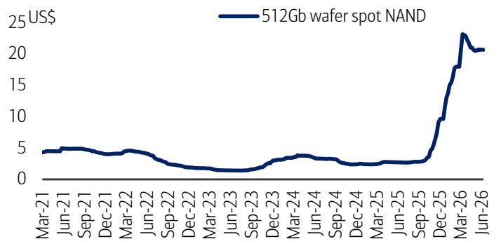

line chart

| Date    | Value (US$) |
|---------|-------------|
| Mar-21  | ~4.5        |
| Jun-21  | ~4.8        |
| Sep-21  | ~4.7        |
| Dec-21  | ~4.5        |
| Mar-22  | ~4.3        |
| Jun-22  | ~3.8        |
| Sep-22  | ~3.0        |
| Dec-22  | ~2.5        |
| Mar-23  | ~2.0        |
| Jun-23  | ~1.8        |
| Sep-23  | ~2.2        |
| Dec-23  | ~3.0        |
| Mar-24  | ~3.5        |
| Jun-24  | ~3.0        |
| Sep-24  | ~2.8        |
| Dec-24  | ~2.5        |
| Mar-25  | ~2.8        |
| Jun-25  | ~3.0        |
| Sep-25  | ~3.5        |
| Dec-25  | ~10.0       |
| Mar-26  | ~18.0       |
| Jun-26  | ~23.0       |

Source: DRAMeXchange  
BofA GLOBAL RESEARCH

Exhibit 24: Current contract price at \~\$25, around 10x vs Feb-25 bottom of \$2.5; prices significantly up in 4Q25/1Q26 and remained broadly stable thereafter  
NAND wafer contract price trend, Jul '23-May '26  
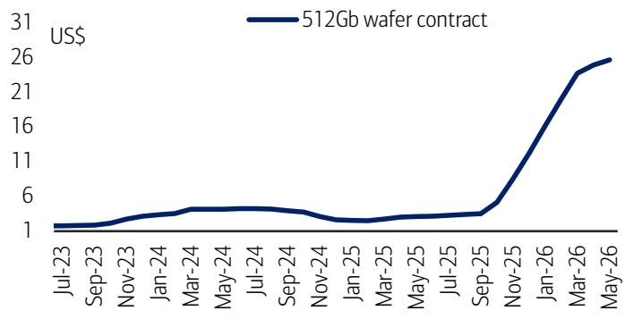

line chart

| Date    | 512Gb wafer contract (US$) |
|---------|-----------------------------|
| Jul-23  | 1                           |
| Sep-23  | 1                           |
| Nov-23  | 1                           |
| Jan-24  | 1                           |
| Mar-24  | 1                           |
| May-24  | 1                           |
| Jul-24  | 1                           |
| Sep-24  | 1                           |
| Nov-24  | 1                           |
| Jan-25  | 1                           |
| Mar-25  | 1                           |
| May-25  | 1                           |
| Jul-25  | 1                           |
| Sep-25  | 1                           |
| Nov-25  | 1                           |
| Jan-26  | 1                           |
| Mar-26  | 1                           |
| May-26  | 1                           |

Source: TrendForce, DRAMeXchange, BofA Global Research  
BofA GLOBAL RESEARCH

Exhibit 26: 16Gb DDR5 spot and contract prices are in the range of US\$35-40 vs historical range of US\$3-5  
16Gb DDR5 spot vs contract price trend (US\$), Jul '23-May '26  
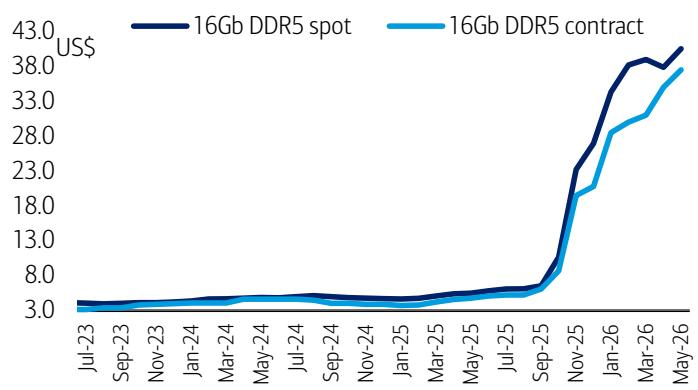

line chart

| Date   | 16Gb DDR5 spot | 16Gb DDR5 contract |
|--------|----------------|--------------------|
| Jul-23 | ~3.0           | ~3.0               |
| Sep-23 | ~3.0           | ~3.0               |
| Nov-23 | ~3.0           | ~3.0               |
| Jan-24 | ~3.0           | ~3.0               |
| Mar-24 | ~3.0           | ~3.0               |
| May-24 | ~3.0           | ~3.0               |
| Jul-24 | ~3.0           | ~3.0               |
| Sep-24 | ~3.0           | ~3.0               |
| Nov-24 | ~3.0           | ~3.0               |
| Jan-25 | ~3.0           | ~3.0               |
| Mar-25 | ~3.0           | ~3.0               |
| May-25 | ~3.0           | ~3.0               |
| Jul-25 | ~3.0           | ~3.0               |
| Sep-25 | ~8.0           | ~8.0               |
| Nov-25 | ~23.0          | ~22.0              |
| Jan-26 | ~38.0          | ~36.0              |
| Mar-26 | ~40.0          | ~38.0              |
| May-26 | ~42.0          | ~40.0              |

Source: DRAMeXchange, TrendForce  
BofA GLOBAL RESEARCH

Exhibit 23: Flat in 1H-June, while slightly corrected in Apr/May vs up +15-20% in Feb/ Mar-26 and up +40-70% MoM in Oct/Nov/Dec/Jan 512Gb NAND wafer spot average – MoM change, Jun'21 - Jun'26  
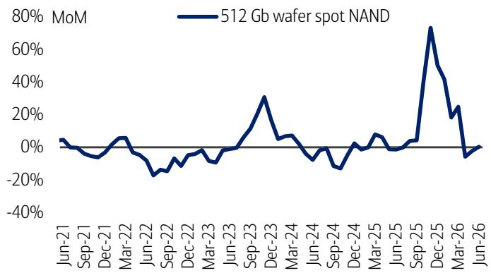

line chart

| Date    | 512 Gb wafer spot NAND (MoM) |
|---------|-----------------------------|
| Jun-21  | ~0%                         |
| Sep-21  | ~0%                         |
| Dec-21  | ~0%                         |
| Mar-22  | ~0%                         |
| Jun-22  | ~-20%                       |
| Sep-22  | ~-10%                       |
| Dec-22  | ~0%                         |
| Mar-23  | ~0%                         |
| Jun-23  | ~0%                         |
| Sep-23  | ~30%                        |
| Dec-23  | ~10%                        |
| Mar-24  | ~0%                         |
| Jun-24  | ~-10%                       |
| Sep-24  | ~-15%                       |
| Dec-24  | ~0%                         |
| Mar-25  | ~0%                         |
| Jun-25  | ~0%                         |
| Sep-25  | ~70%                        |
| Dec-25  | ~40%                        |
| Mar-26  | ~20%                        |
| Jun-26  | ~0%                         |

Source: DRAMeXchange  
BofA GLOBAL RESEARCH

Exhibit 25: Apr/May price only up +3-5% MoM each following Jan/Feb/Mar-26 rally (up 20-30% MoM) and Oct/Nov/Dec upturn (up 40-60% MoM)  
MoM change of NAND contract price (512Gb wafer), Jul '23-May '26  
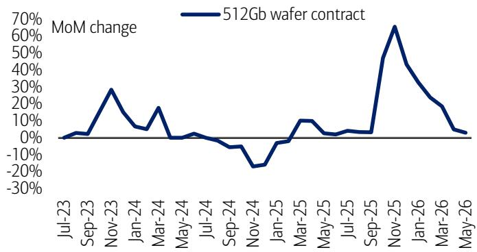

line chart

| Month    | MoM change |
| -------- | ---------- |
| Jul-23   | 0%         |
| Sep-23   | 0%         |
| Nov-23   | 30%        |
| Jan-24   | 10%        |
| Mar-24   | 15%        |
| May-24   | 0%         |
| Jul-24   | 0%         |
| Sep-24   | -10%       |
| Nov-24   | -20%       |
| Jan-25   | 0%         |
| Mar-25   | 10%        |
| May-25   | 0%         |
| Jul-25   | 0%         |
| Sep-25   | 60%        |
| Nov-25   | 40%        |
| Jan-26   | 20%        |
| Mar-26   | 10%        |
| May-26   | 0%         |

Source: DRAMeXchange, TrendForce, BofA Global Research  
BofA GLOBAL RESEARCH

Exhibit 27: May'26 spot/contract prices turned positive again after April's divergence (spot dip vs contract surge), prices had witnessed a sharp Oct–Dec'25 rally and subsequent Feb–Mar moderation  
16Gb DDR5 spot vs contract price trend – MoM change, Jul '23-May '26  
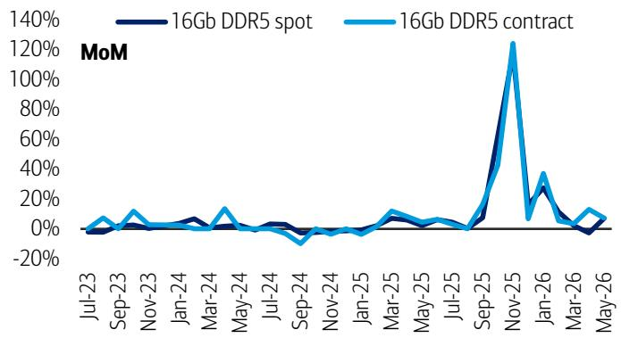

line chart

| Month    | 16Gb DDR5 spot | 16Gb DDR5 contract |
| -------- | -------------- | ------------------ |
| Jul-23   | ~0%            | ~0%                |
| Sep-23   | ~0%            | ~10%               |
| Nov-23   | ~0%            | ~0%                |
| Jan-24   | ~0%            | ~0%                |
| Mar-24   | ~0%            | ~10%               |
| May-24   | ~0%            | ~0%                |
| Jul-24   | ~0%            | ~0%                |
| Sep-24   | ~0%            | ~-10%              |
| Nov-24   | ~0%            | ~0%                |
| Jan-25   | ~0%            | ~0%                |
| Mar-25   | ~0%            | ~10%               |
| May-25   | ~0%            | ~0%                |
| Jul-25   | ~0%            | ~0%                |
| Sep-25   | ~10%           | ~120%              |
| Nov-25   | ~30%           | ~10%               |
| Jan-26   | ~20%           | ~40%               |
| Mar-26   | ~0%            | ~10%               |
| May-26   | ~0%            | ~10%               |

Source: DRAMeXchange, TrendForce  
BofA GLOBAL RESEARCH

Exhibit 28: Current NAND spot and contract prices are a few times higher than 2025 summer level  
512Gb NAND wafer spot vs contract price trend (US\$), May '19 - May '26  
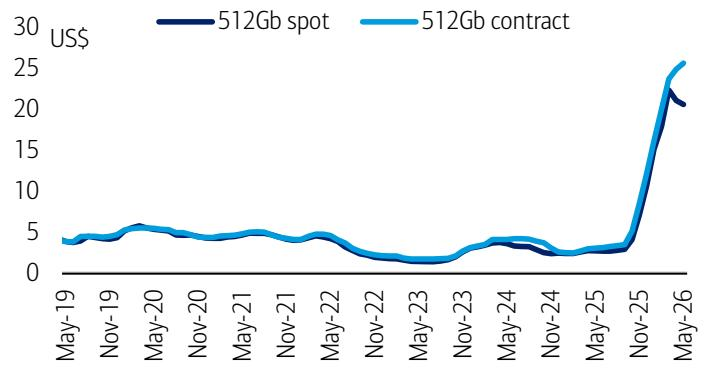

line chart

| Date    | 512Gb spot | 512Gb contract |
|---------|------------|----------------|
| May-19  | ~4         | ~4             |
| Nov-19  | ~5         | ~5             |
| May-20  | ~5         | ~5             |
| Nov-20  | ~4         | ~4             |
| May-21  | ~4         | ~4             |
| Nov-21  | ~3         | ~3             |
| May-22  | ~2         | ~2             |
| Nov-22  | ~1         | ~1             |
| May-23  | ~1         | ~1             |
| Nov-23  | ~2         | ~2             |
| May-24  | ~3         | ~3             |
| Nov-24  | ~2         | ~2             |
| May-25  | ~3         | ~3             |
| Nov-25  | ~4         | ~4             |
| May-26  | ~20        | ~25            |

Source: DRAMeXchange, TrendForce  
BofA GLOBAL RESEARCH

Exhibit 30: Current price of 64GB DDR4/DDR5 modules hit all-time high of more than \$1,000 level (DDR5: US\$1,200, DDR4: US\$1,100)  
Server DRAM contract price trend – DDR5 vs DDR4 modules, Jan '24-May '26  
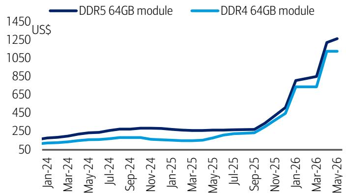

line chart

| Month   | DDR5 64GB module | DDR4 64GB module |
|---------|------------------|------------------|
| Jan-24  | ~150             | ~100             |
| Mar-24  | ~200             | ~120             |
| May-24  | ~220             | ~130             |
| Jul-24  | ~230             | ~140             |
| Sep-24  | ~240             | ~150             |
| Nov-24  | ~250             | ~160             |
| Jan-25  | ~240             | ~150             |
| Mar-25  | ~230             | ~140             |
| May-25  | ~240             | ~150             |
| Jul-25  | ~250             | ~160             |
| Sep-25  | ~260             | ~170             |
| Nov-25  | ~450             | ~400             |
| Jan-26  | ~800             | ~700             |
| Mar-26  | ~1200            | ~1100            |
| May-26  | ~1300            | ~1150            |

Source: TrendForce  
BofA GLOBAL RESEARCH

Exhibit 32: 2H-May SSD price declined after a sharp surge in 1Q26 and April (per DRAMeXchange), prices followed a gradual upward trend throughout 2025  
Client SSD price trend – mostly for PC (not server), Mar '24 - May '26  
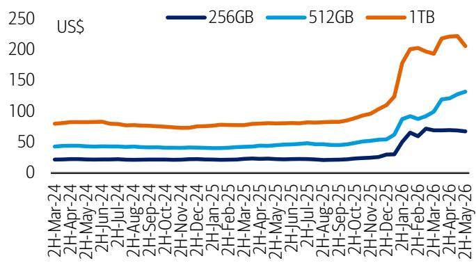

line chart

| Date       | 256GB | 512GB | 1TB  |
|------------|-------|-------|------|
| 2H-Mar-24  | ~20   | ~40   | ~80  |
| 2H-Apr-24  | ~20   | ~40   | ~80  |
| 2H-May-24  | ~20   | ~40   | ~80  |
| 2H-Jun-24  | ~20   | ~40   | ~80  |
| 2H-Jul-24  | ~20   | ~40   | ~80  |
| 2H-Aug-24  | ~20   | ~40   | ~80  |
| 2H-Sep-24  | ~20   | ~40   | ~80  |
| 2H-Oct-24  | ~20   | ~40   | ~80  |
| 2H-Nov-24  | ~20   | ~40   | ~80  |
| 2H-Dec-24  | ~20   | ~40   | ~80  |
| 2H-Jan-25  | ~20   | ~40   | ~80  |
| 2H-Feb-25  | ~20   | ~40   | ~80  |
| 2H-Mar-25  | ~20   | ~40   | ~80  |
| 2H-Apr-25  | ~20   | ~40   | ~80  |
| 2H-May-25  | ~20   | ~40   | ~80  |
| 2H-Jun-25  | ~20   | ~40   | ~80  |
| 2H-Jul-25  | ~20   | ~40   | ~80  |
| 2H-Aug-25  | ~20   | ~40   | ~80  |
| 2H-Sep-25  | ~20   | ~40   | ~80  |
| 2H-Oct-25  | ~20   | ~40   | ~80  |
| 2H-Nov-25  | ~20   | ~40   | ~80  |
| 2H-Dec-25  | ~20   | ~40   | ~80  |
| 2H-Jan-26  | ~60   | ~90   | ~110 |
| 2H-Feb-26  | ~70   | ~110  | ~130 |
| 2H-Mar-26  | ~75   | ~130  | ~150 |
| 2H-Apr-26  | ~75   | ~135  | ~165 |
| 2H-May-26  | ~75   | ~135  | ~165 |
| 2H-Jun-26  | ~75   | ~135  | ~165 |
| 2H-Jul-26  | ~75   | ~135  | ~165 |
| 2H-Aug-26  | ~75   | ~135  | ~165 |
| 2H-Sep-26  | ~75   | ~135  | ~165 |
| 2H-Oct-26  | ~75   | ~135  | ~165 |
| 2H-Nov-26  | ~75   | ~135  | ~165 |
| 2H-Dec-26  | ~75   | ~135  | ~165 |
| 2H-Jan-27  | ~75   | ~135  | ~165 |
| 2H-Feb-27  | ~75   | ~135  | ~165 |
| 2H-Mar-27  | ~75   | ~135  | ~165 |
| 2H-Apr-27  | ~75   | ~135  | ~165 |
| 2H-May-27  | ~75   | ~135  | ~165 |
| 2H-Jun-27  | ~75   | ~135  | ~165 |
| 2H-Jul-27  | ~75   | ~135  | ~165 |
| 2H-Aug-27  | ~75   | ~135  | ~165 |
| 2H-Sep-27  | ~75   | ~135  | ~165 |
| 2H-Oct-27  | ~75   | ~135  | ~165 |
| 2H-Nov-27  | ~75   | ~135  | ~165 |
| 2H-Dec-27  | ~75   | ~135  | ~165 |
| 2H-Jan-28  | ~75   | ~135  | ~165 |
| 2H-Feb-28  | ~75   | ~135  | ~165 |
| 2H-Mar-28  | ~75   | ~135  | ~165 |
| 2H-Apr-28  | ~75   | ~135  | ~165 |
| 2H-May-28  | ~75   | ~135  | ~165 |
| 2H-Jun-28  | ~75   | ~135  | ~165 |
| 2H-Jul-28  | ~75   | ~135  | ~165 |
| 2H-Aug-28  | ~75   | ~135  | ~165 |
| 2H-Sep-28  | ~75   | ~135  | ~165 |
| 2H-Oct-28  | ~75   | ~135  | ~165 |
| 2H-Nov-28  | ~75   | ~135  | ~165 |
| 2H-Dec-28  | ~75   | ~135  | ~165 |
| 2H-Jan-29  | ~75   | ~135  | ~165 |
| 2H-Feb-29  | ~75   | ~135  | ~165 |
| 2H-Mar-29  | ~75   | ~135  | ~165 |
| 2H-Apr-29  | ~75   | ~135  | ~165 |
| 2H-May-29  | ~75   | ~135  | ~165 |
| H/A          | -     | -     | -    |
The chart displays a line graph with three data series labeled as '1TB' (orange line) and 'XXGB' (blue line). The x-axis represents dates from March to May, and the y-axis represents numerical values for each data series. The data series are labeled as 'XXGB'. The chart is saved as a PNG file named 'boxplus.png'.

Note: SSD prices are as of 30 May 2026, reported by DRAMeXchange. TB = terabyte.  
Source: DRAMeXchange  
BofA GLOBAL RESEARCH

Exhibit 29: NAND spot and contract prices normalized in Apr/May after strong rally during Oct-25 – Dec-25 (up 40-50% per month) and Jan-Mar-26 (20-30% per month)  
512Gb NAND spot vs contract price trend – MoM change, May '19 - May '26  
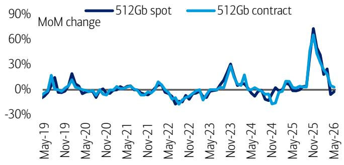

line chart

| Month    | 512Gb spot | 512Gb contract |
| -------- | ---------- | -------------- |
| May-19   | -10%       | -5%            |
| Nov-19   | 20%        | 15%            |
| May-20   | -5%        | -2%            |
| Nov-20   | 0%         | 0%             |
| May-21   | 5%         | 3%             |
| Nov-21   | -10%       | -5%            |
| May-22   | -20%       | -15%           |
| Nov-22   | -5%        | -3%            |
| May-23   | 10%        | 5%             |
| Nov-23   | 30%        | 25%            |
| May-24   | -10%       | -5%            |
| Nov-24   | -20%       | -15%           |
| May-25   | 5%         | 3%             |
| Nov-25   | 70%        | 60%            |
| May-26   | -5%        | -3%            |

Source: DRAMeXchange, TrendForce  
BofA GLOBAL RESEARCH

Exhibit 31: DDR4/DDR5 server contract prices remained flat in May, following a sharp 40–50% MoM increase in April 2026 and a similar 50–60% surge in January, after largely stable pricing conditions during February–March  
MoM change of server DRAM contract prices, Jan '24-May '26  
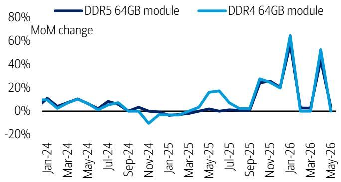

line chart

| Month    | DDR5 64GB module | DDR4 64GB module |
| -------- | ---------------- | ---------------- |
| Jan-24   | ~10%             | ~10%             |
| Mar-24   | ~5%              | ~10%             |
| May-24   | ~0%              | ~5%              |
| Jul-24   | ~5%              | ~0%              |
| Sep-24   | ~0%              | ~0%              |
| Nov-24   | ~0%              | ~-10%            |
| Jan-25   | ~0%              | ~0%              |
| Mar-25   | ~0%              | ~0%              |
| May-25   | ~0%              | ~15%             |
| Jul-25   | ~0%              | ~0%              |
| Sep-25   | ~0%              | ~0%              |
| Nov-25   | ~25%             | ~25%             |
| Jan-26   | ~60%             | ~65%             |
| Mar-26   | ~0%              | ~0%              |
| May-26   | ~40%             | ~50%             |

Source: TrendForce  
BofA GLOBAL RESEARCH

Exhibit 33: May prices have doubled compared to end-2025 levels, while the 2025 increase was more modest at around 35–40%  
Client SSD (for PC) price comparison – current vs. end-2025  
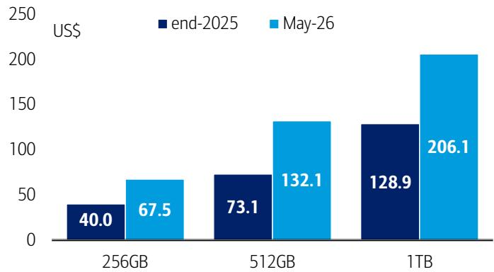

bar chart

| Category | end-2025 (US$) | May-26 (US$) |
| :--- | :--- | :--- |
| 256GB | 40.0 | 67.5 |
| 512GB | 73.1 | 132.1 |
| 1TB | 128.9 | 206.1 |

Note: SSD prices are as of 30 May 2026, reported by DRAMeXchange  
Source: DRAMeXchange  
BofA GLOBAL RESEARCH

## Valuation and stock performance

Exhibit 34: Memory companies still show very low P/E multiples despite robust stock price rally in May/early-June vs very strong earnings momentum (exceptionally strong DRAM and NAND ASP in 1Q/2Q26)

Valuation comparison among memory and semiconductor supply chain stocks

<table><tr><td rowspan="2"></td><td rowspan="2">Ticker</td><td rowspan="2">Rating</td><td rowspan="2">Price(Local)</td><td rowspan="2">Mcap($bn)</td><td colspan="3">P/E</td><td colspan="3">P/Book</td><td colspan="2">EV/EBITDA</td><td colspan="2">EV/Sales</td><td colspan="3">ROE</td><td colspan="2">Div. yield</td></tr><tr><td>FY25</td><td>FY26E</td><td>FY27E</td><td>FY25</td><td>FY26E</td><td>FY27E</td><td>FY26E</td><td>FY27E</td><td>FY26E</td><td>FY27E</td><td>FY25</td><td>FY26E</td><td>FY27E</td><td>FY26E</td><td>FY27E</td></tr><tr><td colspan="20">Memory/DRAM</td></tr><tr><td>SK Hynix</td><td>HXSCF</td><td>C-1-7</td><td>2,138,000</td><td>1,022.7</td><td>32.1</td><td>6.4</td><td>5.7</td><td>11.5</td><td>4.1</td><td>2.4</td><td>4.2</td><td>3.6</td><td>3.4</td><td>2.7</td><td>44.2%</td><td>94.2%</td><td>53.4%</td><td>0.2%</td><td>0.6%</td></tr><tr><td>Samsung</td><td>SSNLF</td><td>B-1-7</td><td>306,000</td><td>1,238.4</td><td>45.5</td><td>8.0</td><td>7.1</td><td>4.8</td><td>3.1</td><td>2.2</td><td>4.8</td><td>4.2</td><td>2.5</td><td>2.2</td><td>10.8%</td><td>45.8%</td><td>35.6%</td><td>1.0%</td><td>1.6%</td></tr><tr><td>Micron</td><td>MU</td><td>C-1-7</td><td>995.87</td><td>1,123.1</td><td>120.1</td><td>16.3</td><td>9.8</td><td>20.7</td><td>9.1</td><td>4.7</td><td>13.2</td><td>7.9</td><td>9.7</td><td>6.3</td><td>18.8%</td><td>78.5%</td><td>63.7%</td><td>0.0%</td><td>0.0%</td></tr><tr><td>Nanya</td><td>NNYAF</td><td>B-1-7</td><td>374.00</td><td>40.7</td><td>147.2</td><td>5.5</td><td>4.8</td><td>6.3</td><td>3.2</td><td>2.1</td><td>3.8</td><td>3.3</td><td>2.8</td><td>2.2</td><td>3.9%</td><td>69.2%</td><td>47.8%</td><td>3.8%</td><td>4.8%</td></tr><tr><td colspan="20">Memory/NAND</td></tr><tr><td>Kioxia</td><td>XIYUF</td><td>C-1-9</td><td>75,440.00</td><td>278.6</td><td>73.7</td><td>8.2</td><td>6.3</td><td>29.2</td><td>6.4</td><td>3.2</td><td>5.1</td><td>4.0</td><td>4.1</td><td>3.3</td><td>51.9%</td><td>128.2%</td><td>67.2%</td><td>0.0%</td><td>0.0%</td></tr><tr><td>Sandisk</td><td>SNDK</td><td>C-1-9</td><td>1,881.51</td><td>278.6</td><td>n/a</td><td>27.4</td><td>10.0</td><td>30.2</td><td>14.8</td><td>5.6</td><td>21.0</td><td>7.4</td><td>13.5</td><td>6.1</td><td>4.3%</td><td>75.8%</td><td>86.6%</td><td>0.0%</td><td>0.0%</td></tr><tr><td>Western Digital</td><td>WDC</td><td>C-1-7</td><td>529.29</td><td>193.7</td><td>n/a</td><td>53.6</td><td>32.1</td><td>34.4</td><td>14.8</td><td>10.3</td><td>33.9</td><td>20.6</td><td>14.2</td><td>10.6</td><td>22.5%</td><td>42.7%</td><td>42.2%</td><td>0.1%</td><td>0.1%</td></tr><tr><td>SIMO</td><td>SIMO</td><td>C-1-7</td><td>274.34</td><td>9.3</td><td>75.4</td><td>30.4</td><td>25.8</td><td>10.9</td><td>8.4</td><td>6.7</td><td>22.6</td><td>17.8</td><td>5.3</td><td>4.5</td><td>15.3%</td><td>31.9%</td><td>29.6%</td><td>0.9%</td><td>1.0%</td></tr><tr><td>Phison</td><td>PISNF</td><td>C-1-8</td><td>2,200.00</td><td>16.1</td><td>55.4</td><td>6.1</td><td>10.4</td><td>8.0</td><td>4.1</td><td>3.4</td><td>4.6</td><td>7.4</td><td>1.9</td><td>1.7</td><td>16.0%</td><td>89.2%</td><td>36.0%</td><td>8.6%</td><td>5.2%</td></tr><tr><td colspan="20">US/Taiwan semis</td></tr><tr><td>NVIDIA</td><td>NVDA</td><td>C-1-7</td><td>204.87</td><td>4,957.9</td><td>45.0</td><td>22.5</td><td>15.4</td><td>32.4</td><td>16.8</td><td>10.6</td><td>18.8</td><td>13.1</td><td>12.7</td><td>8.9</td><td>94.3%</td><td>95.9%</td><td>80.3%</td><td>0.4%</td><td>0.6%</td></tr><tr><td>AMD</td><td>AMD</td><td>C-1-9</td><td>488.45</td><td>796.5</td><td>117.1</td><td>65.1</td><td>36.8</td><td>12.6</td><td>10.7</td><td>8.2</td><td>47.0</td><td>28.3</td><td>16.0</td><td>10.3</td><td>11.3%</td><td>18.1%</td><td>26.3%</td><td>0.0%</td><td>0.0%</td></tr><tr><td>Broadcom</td><td>AVGO</td><td>C-1-7</td><td>385.57</td><td>1,834.4</td><td>56.5</td><td>33.2</td><td>21.5</td><td>22.7</td><td>17.4</td><td>11.2</td><td>26.4</td><td>16.8</td><td>17.5</td><td>11.5</td><td>45.3%</td><td>61.3%</td><td>65.5%</td><td>0.7%</td><td>0.7%</td></tr><tr><td>Intel</td><td>INTC</td><td>C-1-9</td><td>116.96</td><td>587.8</td><td>272.0</td><td>110.3</td><td>68.0</td><td>4.7</td><td>4.3</td><td>4.0</td><td>29.0</td><td>22.0</td><td>9.7</td><td>8.4</td><td>1.7%</td><td>4.1%</td><td>6.2%</td><td>0.0%</td><td>0.0%</td></tr><tr><td>Arm</td><td>ARM</td><td>C-2-9</td><td>342.23</td><td>365.5</td><td>193.4</td><td>165.3</td><td>120.5</td><td>44.1</td><td>34.9</td><td>27.0</td><td>130.6</td><td>94.0</td><td>61.6</td><td>46.1</td><td>25.0%</td><td>23.6%</td><td>25.5%</td><td>0.0%</td><td>0.0%</td></tr><tr><td>Qualcomm</td><td>QCOM</td><td>B-3-7</td><td>202.96</td><td>213.9</td><td>16.8</td><td>19.1</td><td>18.9</td><td>10.2</td><td>8.2</td><td>7.9</td><td>15.9</td><td>16.5</td><td>5.5</td><td>5.5</td><td>56.0%</td><td>47.4%</td><td>40.6%</td><td>1.8%</td><td>1.8%</td></tr><tr><td>TSMC</td><td>TSMWF</td><td>B-1-7</td><td>2,310</td><td>1,891.7</td><td>34.9</td><td>23.3</td><td>18.0</td><td>11.1</td><td>8.0</td><td>5.9</td><td>14.9</td><td>11.7</td><td>10.9</td><td>8.5</td><td>35.4%</td><td>39.8%</td><td>37.6%</td><td>1.0%</td><td>1.0%</td></tr><tr><td>MediaTek</td><td>MDTKF</td><td>B-1-7</td><td>4,180</td><td>211.7</td><td>63.2</td><td>64.3</td><td>30.7</td><td>16.7</td><td>17.7</td><td>12.2</td><td>50.3</td><td>24.8</td><td>10.2</td><td>6.1</td><td>26.4%</td><td>26.6%</td><td>46.8%</td><td>1.2%</td><td>2.6%</td></tr><tr><td colspan="20">Equipment</td></tr><tr><td>ASML</td><td>ASMLF</td><td>B-1-7</td><td>1,576.00</td><td>704.6</td><td>63.6</td><td>47.5</td><td>33.9</td><td>31.2</td><td>25.4</td><td>20.9</td><td>37.6</td><td>27.6</td><td>15.1</td><td>12.1</td><td>50.6%</td><td>58.7%</td><td>67.0%</td><td>0.6%</td><td>0.7%</td></tr><tr><td>AMAT</td><td>AMAT</td><td>B-1-7</td><td>552.64</td><td>438.8</td><td>58.7</td><td>45.5</td><td>34.1</td><td>21.5</td><td>15.0</td><td>10.5</td><td>38.8</td><td>29.1</td><td>13.3</td><td>10.6</td><td>38.6%</td><td>39.0%</td><td>36.0%</td><td>0.4%</td><td>0.4%</td></tr><tr><td>Lam</td><td>LRCX</td><td>C-1-7</td><td>362.52</td><td>453.4</td><td>87.8</td><td>64.2</td><td>48.0</td><td>45.9</td><td>39.6</td><td>28.5</td><td>52.6</td><td>39.4</td><td>19.6</td><td>15.4</td><td>57.9%</td><td>66.9%</td><td>68.9%</td><td>0.3%</td><td>0.3%</td></tr><tr><td>TEL</td><td>TOELF</td><td>C-1-7</td><td>63,400</td><td>199.1</td><td>50.7</td><td>42.5</td><td>34.5</td><td>14.1</td><td>11.9</td><td>9.9</td><td>28.8</td><td>23.7</td><td>9.2</td><td>7.9</td><td>29.3%</td><td>30.3%</td><td>31.4%</td><td>1.2%</td><td>1.4%</td></tr><tr><td>Hanmi Semi</td><td>HNSIF</td><td>C-1-7</td><td>297,500</td><td>22.5</td><td>131.9</td><td>94.3</td><td>49.3</td><td>41.1</td><td>31.0</td><td>20.5</td><td>73.3</td><td>36.6</td><td>35.9</td><td>20.0</td><td>34.8%</td><td>37.3%</td><td>49.8%</td><td>0.4%</td><td>0.7%</td></tr><tr><td>BESI</td><td>BESVF</td><td>B-1-7</td><td>307.90</td><td>28.8</td><td>182.7</td><td>71.9</td><td>43.4</td><td>58.4</td><td>42.9</td><td>31.7</td><td>54.7</td><td>34.5</td><td>24.6</td><td>17.5</td><td>29.2%</td><td>69.0%</td><td>84.3%</td><td>1.3%</td><td>2.2%</td></tr><tr><td>ASMPT</td><td>ASMVF</td><td>C-1-7</td><td>182.00</td><td>9.7</td><td>71.8</td><td>45.7</td><td>27.6</td><td>4.4</td><td>4.2</td><td>3.8</td><td>26.0</td><td>17.0</td><td>3.9</td><td>2.7</td><td>6.5%</td><td>9.4%</td><td>14.5%</td><td>1.1%</td><td>1.5%</td></tr></table>

Source: Company reports, BofA Global Research estimates; Mcap = market capitalization, ROE = return on equity, Div = dividend.  
BofA GLOBAL RESEARCH

Exhibit 35: Prices remained volatile this week amid global uncertainty, but remain broadly higher year-to-date, led by NAND and HDD players and supported by strength in DRAM, primarily driven by robust AI-related demand  
Memory companies – 2026 YTD stock performance comparison  
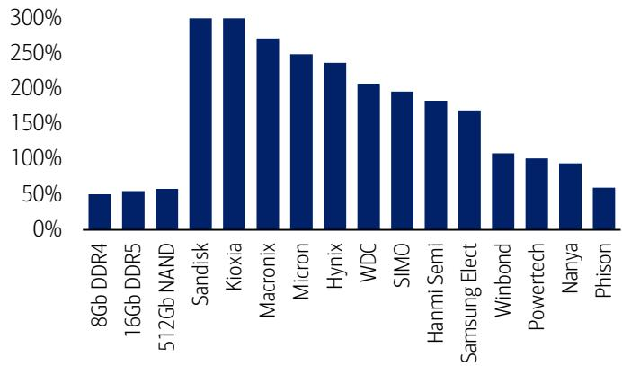

bar chart

| Company | Value (%) |
| :--- | :--- |
| 8Gb DDR4 | 50 |
| 16Gb DDR5 | 55 |
| 512Gb NAND | 60 |
| Sandisk | 300 |
| Kioxia | 300 |
| Macronix | 270 |
| Micron | 250 |
| Hynix | 235 |
| WDC | 205 |
| SIMO | 195 |
| Hanni Semi | 185 |
| Samsung Elect | 170 |
| Winbond | 105 |
| Powertech | 100 |
| Nanya | 95 |
| Phison | 60 |

SanDisk/Kioxia shows above 300% YTD return  
Source: Bloomberg, DRAMeXchange

Exhibit 36: CPU names such as Intel and AMD clearly outperforming other US big tech names such as NVIDIA/Apple/QCOM  
Global major tech companies – 2026 YTD stock performance comparison  
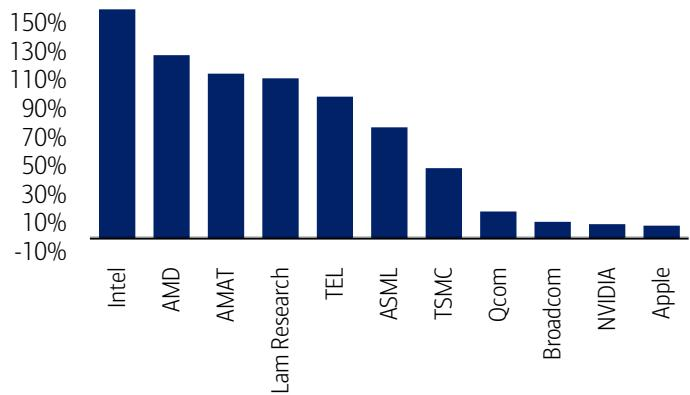

bar chart

| Company | Value (%) |
| :--- | :--- |
| Intel | 150 |
| AMD | 125 |
| AMAT | 115 |
| Lam Research | 110 |
| TEL | 95 |
| ASML | 75 |
| TSMC | 50 |
| Qcom | 20 |
| Broadcom | 10 |
| NVIDIA | 10 |
| Apple | 10 |

Source: Bloomberg  
BofA GLOBAL RESEARCH

BofA GLOBAL RESEARCH

Exhibit 37: Stocks mentioned  
Prices and ratings for stocks mentioned in this report

<table><tr><td>BofA Ticker</td><td>Bloomberg ticker</td><td>Company name</td><td colspan="2">Price Rating</td></tr><tr><td>SSNLF</td><td>005930 KS</td><td>Samsung common</td><td>W 306000</td><td>B-1-7</td></tr><tr><td>SSNNF</td><td>005935 KS</td><td>Samsung preferred</td><td>W 193500</td><td>B-1-7</td></tr></table>

Source: BofA Global Research  
BofA GLOBAL RESEARCH

## Price objective basis & risk

## Samsung Electronics (SSNLF)

Our PO of W440,000 is based on 11x 2027-28E P/E. This fair P/E of 11x is derived from long-term historical average (low-teens, peak cycle 7-10x, trough/mid-cycle 10-20x+) and bottom of proven foundry peer's 2009-2025 P/E band (10-20x), to be conservative (SEC's low EPS growth after 2026 upturn). Our GDR PO of US\$7,400 is automatically calculated at an FX rate of near-W1.48k/USD. Downside risks are mostly related to US tariffs, 12/16-hi HBM execution, memory price cuts, large foundry loss and aggressive capex increase. Upside risks could come from US Big Tech (new orders for HBM and even 2nm node foundry), conventional memory cycle (significant price hike), restructuring plan (significant cost cut) and shareholder return (payout ratio increase).

## Samsung Electronics Preferred (SSNNF)

Our PO of W300,000 for the preferred shares is based on a 32% fair discount (which is slightly higher than the past 6-month average) to the common shares, given no voting rights and limited cash dividend increase after special bonus and buyback. However, the dividend amount is almost the same for both types. This offers a higher yield for the preferred shares vs the common. The discount ratio (preferred share price vs common) was c.10% in 2021-22, but it rose to near-20% in 2024-25 (undervalued vs the common) and 30%+ in 1H26.

Common share PO of W440,000 is based on 11x 2027-28E P/E. This fair P/E of 11x is derived from long-term historical average (low-teens, peak cycle 7-10x, trough/mid-cycle 10-20x+) and bottom of proven foundry peer's 2009-2025 P/E band (10-20x), to be conservative (SEC's low EPS growth after 2026 upturn). Our GDR PO of US\$7,400 is automatically calculated at an FX rate of near-W1.48k/USD.

Downside risks are mostly related to US tariffs, 12/16-hi HBM execution, memory price cuts, large foundry loss and aggressive capex increase.

Upside risks could come from US Big Tech (new orders for HBM and even 2nm node foundry), conventional memory cycle (significant price hike), restructuring plan (significant cost cut) and shareholder return (payout ratio increase).

## Analyst Certification

We, Simon Woo, CFA and Matt Shin, hereby certify that the views each of us has expressed in this research report accurately reflect each of our respective personal views about the subject securities and issuers. We also certify that no part of our respective compensation was, is, or will be, directly or indirectly, related to the specific recommendations or view expressed in this research report.

APR - Semiconductor Coverage Cluster

<table><tr><td>Investment rating</td><td>Company</td><td>BofA Ticker</td><td>Bloomberg symbol</td><td>Analyst</td></tr><tr><td colspan="5">BUY</td></tr><tr><td></td><td>Alchip</td><td>ALCPF</td><td>3661 TT</td><td>Haas Liu</td></tr><tr><td></td><td>AMEC</td><td>XRTOF</td><td>688012 CH</td><td>Dai Shen</td></tr><tr><td></td><td>ASE Technology Holding</td><td>XSRIF</td><td>3711 TT</td><td>Haas Liu</td></tr><tr><td></td><td>ASE Technology Holding -ADR</td><td>ASX</td><td>ASX US</td><td>Haas Liu</td></tr><tr><td></td><td>ASMPT</td><td>ASMVF</td><td>522 HK</td><td>Simon Woo, CFA</td></tr><tr><td></td><td>Aspeed</td><td>XLKMF</td><td>5274 TT</td><td>Mike Yang</td></tr><tr><td></td><td>Chroma ATE</td><td>CRMJF</td><td>2360 TT</td><td>Haas Liu</td></tr><tr><td></td><td>eMemory</td><td>XYLWF</td><td>3529 TT</td><td>Mike Yang</td></tr><tr><td></td><td>GigaDevice</td><td>XGXIF</td><td>603986 CH</td><td>Daley Li, CFA</td></tr><tr><td></td><td>Global Unichip Corp.</td><td>GBUHF</td><td>3443 TT</td><td>Haas Liu</td></tr><tr><td></td><td>Grand Process Technology Corp</td><td>XZOWF</td><td>3131 TT</td><td>Mike Yang</td></tr><tr><td></td><td>Hanmi Semiconductor</td><td>HNSIF</td><td>042700 KS</td><td>Simon Woo, CFA</td></tr><tr><td></td><td>Hon Precision</td><td>XXPIF</td><td>7769 TT</td><td>Haas Liu</td></tr><tr><td></td><td>Horizon Robotics</td><td>HRZRF</td><td>9660 HK</td><td>Daley Li, CFA</td></tr><tr><td></td><td>Ingenic</td><td>XISCF</td><td>300223 CH</td><td>Dai Shen</td></tr><tr><td></td><td>InnoScience Technology</td><td>XSCHF</td><td>2577 HK</td><td>Daley Li, CFA</td></tr><tr><td></td><td>JCET Group Co Ltd</td><td>XJIEF</td><td>600584 CH</td><td>Dai Shen</td></tr><tr><td></td><td>King Yuan Electronics Corp.</td><td>KYUFF</td><td>2449 TT</td><td>Haas Liu</td></tr><tr><td></td><td>MediaTek</td><td>MDTKF</td><td>2454 TT</td><td>Haas Liu</td></tr><tr><td></td><td>Montage Technology</td><td>XRDFF</td><td>688008 CH</td><td>Daley Li, CFA</td></tr><tr><td></td><td>MPI Corporation</td><td>XMJCF</td><td>6223 TT</td><td>Mike Yang</td></tr><tr><td></td><td>Nanya Technology</td><td>NNYAF</td><td>2408 TT</td><td>Simon Woo, CFA</td></tr><tr><td></td><td>NCE Power</td><td>XVFFF</td><td>605111 CH</td><td>Daley Li, CFA</td></tr><tr><td></td><td>OmniVision</td><td>XXHQF</td><td>603501 CH</td><td>Dai Shen</td></tr><tr><td></td><td>Phison Electronics</td><td>PISNF</td><td>8299 TT</td><td>Simon Woo, CFA</td></tr><tr><td></td><td>Powerchip Semiconductor Manufacturing Co</td><td>XCHPF</td><td>6770 TT</td><td>Haas Liu</td></tr><tr><td></td><td>Powertech Technology</td><td>XPPZF</td><td>6239 TT</td><td>Simon Woo, CFA</td></tr><tr><td></td><td>Rockchip</td><td>XRPXF</td><td>603893 CH</td><td>Daley Li, CFA</td></tr><tr><td></td><td>Samsung Elec -G</td><td>SSNHZ</td><td>SMSN LI</td><td>Simon Woo, CFA</td></tr><tr><td></td><td>Samsung Electronics</td><td>SSNLF</td><td>005930 KS</td><td>Simon Woo, CFA</td></tr><tr><td></td><td>Samsung Electronics Preferred</td><td>SSNNF</td><td>005935 KS</td><td>Simon Woo, CFA</td></tr><tr><td></td><td>Silergy Corp.</td><td>SLEGF</td><td>6415 TT</td><td>Mike Yang</td></tr><tr><td></td><td>Silicon Motion</td><td>SIMO</td><td>SIMO US</td><td>Simon Woo, CFA</td></tr><tr><td></td><td>SK Hynix</td><td>HXSCF</td><td>000660 KS</td><td>Simon Woo, CFA</td></tr><tr><td></td><td>SK Square</td><td>SKSQF</td><td>402340 KS</td><td>Simon Woo, CFA</td></tr><tr><td></td><td>Taiwan Semiconductor Manufacturing Co.</td><td>TSM</td><td>TSM US</td><td>Haas Liu</td></tr><tr><td></td><td>Taiwan Semiconductor Manufacturing Co.</td><td>TSMWF</td><td>2330 TT</td><td>Haas Liu</td></tr><tr><td></td><td>Vanguard International Semiconductor Co</td><td>VGILF</td><td>5347 TT</td><td>Haas Liu</td></tr><tr><td></td><td>Winbond Electronics</td><td>WBEKF</td><td>2344 TT</td><td>Dai Shen</td></tr><tr><td></td><td>WinWay Technology</td><td>XWCLF</td><td>6515 TT</td><td>Mike Yang</td></tr><tr><td></td><td>WT Microelectronics</td><td>XZOPF</td><td>3036 TT</td><td>Mike Yang</td></tr><tr><td colspan="5">NEUTRAL</td></tr><tr><td></td><td>ASMedia Technology Inc.</td><td>XZSFF</td><td>5269 TT</td><td>Mike Yang</td></tr><tr><td></td><td>Black Sesame Intl Holding</td><td>BSIHF</td><td>2533 HK</td><td>Daley Li, CFA</td></tr><tr><td></td><td>Crystal Clear</td><td>XPPTF</td><td>300655 CH</td><td>Dai Shen</td></tr><tr><td></td><td>Kink</td><td>KIKCF</td><td>1560 TT</td><td>Haas Liu</td></tr><tr><td></td><td>LX Semicon</td><td>XLXSF</td><td>108320 KS</td><td>Simon Woo, CFA</td></tr><tr><td></td><td>Novatek</td><td>NVKMF</td><td>3034 TT</td><td>Haas Liu</td></tr><tr><td></td><td>Realtek</td><td>RLTKF</td><td>2379 TT</td><td>Mike Yang</td></tr><tr><td></td><td>Shenzhen Goodix</td><td>XQPLF</td><td>603160 CH</td><td>Daley Li, CFA</td></tr><tr><td colspan="5">UNDERPERFORM</td></tr><tr><td></td><td>Faraday</td><td>FDYTF</td><td>3035 TT</td><td>Haas Liu</td></tr><tr><td></td><td>GlobalWafers</td><td>XWLFF</td><td>6488 TT</td><td>Mike Yang</td></tr><tr><td></td><td>Hangzhou Silan Microelectronics</td><td>XDFRF</td><td>600460 CH</td><td>Daley Li, CFA</td></tr><tr><td></td><td>Hua Hong Semi</td><td>HHUSF</td><td>1347 HK</td><td>Dai Shen</td></tr><tr><td></td><td>Lion Electronics</td><td>XDHFF</td><td>605358 CH</td><td>Dai Shen</td></tr><tr><td></td><td>M31 Technology</td><td>XMTZF</td><td>6643 TT</td><td>Mike Yang</td></tr><tr><td></td><td>Macronix International</td><td>MXICF</td><td>2337 TT</td><td>Dai Shen</td></tr><tr><td></td><td>Maxscend</td><td>XMXSF</td><td>300782 CH</td><td>Daley Li, CFA</td></tr><tr><td></td><td>Parade</td><td>PRDWF</td><td>4966 TT</td><td>Mike Yang</td></tr><tr><td></td><td>Soulbrain</td><td>XSBOF</td><td>357780 KS</td><td>Simon Woo, CFA</td></tr><tr><td></td><td>United Microelectronics Corp.</td><td>XUMIF</td><td>2303 TT</td><td>Haas Liu</td></tr><tr><td></td><td>United Microelectronics Corp.</td><td>UMC</td><td>UMC US</td><td>Haas Liu</td></tr></table>

APR - Semiconductor Coverage Cluster

<table><tr><td>Investment rating</td><td>Company</td><td>BofA Ticker</td><td>Bloomberg symbol</td><td>Analyst</td></tr><tr><td></td><td>VeriSilicon</td><td>XMLZF</td><td>688521 CH</td><td>Daley Li, CFA</td></tr><tr><td></td><td>Win Semiconductors</td><td>WSMIF</td><td>3105 TT</td><td>Haas Liu</td></tr><tr><td></td><td>Wonik IPS</td><td>XRHQF</td><td>240810 KS</td><td>Simon Woo, CFA</td></tr></table>

## Disclosures

## Important Disclosures

Samsung common (SSNLF) Price Chart  
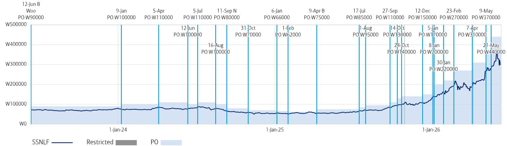

line chart

| Date       | Price     |
| ---------- | --------- |
| 12-Jun B   | W90000    |
| 9-Jan      | W100000   |
| 5-Apr      | W110000   |
| 5-Jul      | W110000   |
| 11-Sep N   | W80000    |
| 31-Oct     | W70000    |
| 6-Jan      | W66000    |
| 1-Feb      | W62000    |
| 9-Apr B    | W75000    |
| 17-Jul     | W85000    |
| 27-Sep     | W110000   |
| 14-Oct     | W130000   |
| 24-Oct     | W140000   |
| 12-Dec     | W150000   |
| 5-Jan      | W170000   |
| 30-Jan     | W220000   |
| 23-Feb     | W270000   |
| 7-Apr      | W310000   |
| 9-May      | W370000   |
| 21-May     | W440000   |

B: Buy, N: Neutral, U: Underperform, PO: Price Objective, NA: No longer valid, NR: No Rating

The Investment Opinion System is contained at the end of the report under the heading "Fundamental Equity Opinion Key". Dark grey shading indicates the security is restricted with the opinion suspended. Medium grey shading indicates the security is under review with the opinion withdrawn. Light grey shading indicates the security is not covered. Chart is current as of a date no more than one trading day prior to the date of the report.

Samsung preferred (SSNNF) Price Chart  
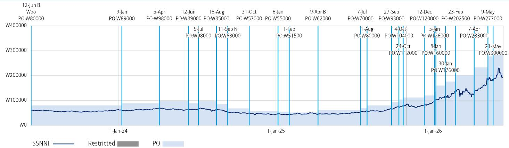

line chart

| Date       | Price     |
| ---------- | --------- |
| 12-Jun B   | W80000    |
| 9-Jan      | W89000    |
| 5-Apr      | W98000    |
| 12-Jun     | W89000    |
| 16-Aug     | W85000    |
| 31-Oct     | W57000    |
| 6-Jan      | W55000    |
| 9-Apr B    | W62000    |
| 17-Jul     | W70000    |
| 27-Sep     | W93000    |
| 14-Oct     | W104000   |
| 12-Dec     | W120000   |
| 23-Feb     | W202500   |
| 7-Apr      | W233000   |
| 9-May      | W277000   |
| 1-Jan-24   | W8000     |
| 1-Jan-25   | W51500    |
| 1-Jan-26   | W176000   |
| 21-May     | W300000   |

B: Buy, N: Neutral, U: Underperform, PO: Price Objective, NA: No longer valid, NR: No Rating

The Investment Opinion System is contained at the end of the report under the heading "Fundamental Equity Opinion Key". Dark grey shading indicates the security is restricted with the opinion suspended. Medium grey shading indicates the security is under review with the opinion withdrawn. Light grey shading indicates the security is not covered. Chart is current as of a date no more than one trading day prior to the date of the report.

Equity Investment Rating Distribution: Electrical Equipment Group (as of 31 Mar 2026)

<table><tr><td>Coverage Universe</td><td>Count</td><td>Percent</td><td>Inv. Banking Relationships $^{R1}$ </td><td>Count</td><td>Percent</td></tr><tr><td>Buy</td><td>18</td><td>66.67%</td><td>Buy</td><td>9</td><td>50.00%</td></tr><tr><td>Hold</td><td>3</td><td>11.11%</td><td>Hold</td><td>2</td><td>66.67%</td></tr><tr><td>Sell</td><td>6</td><td>22.22%</td><td>Sell</td><td>2</td><td>33.33%</td></tr></table>

Equity Investment Rating Distribution: Technology Group (as of 31 Mar 2026)

<table><tr><td>Coverage Universe</td><td>Count</td><td>Percent</td><td>Inv. Banking Relationships $^{R1}$ </td><td>Count</td><td>Percent</td></tr><tr><td>Buy</td><td>234</td><td>58.50%</td><td>Buy</td><td>123</td><td>52.56%</td></tr><tr><td>Hold</td><td>90</td><td>22.50%</td><td>Hold</td><td>43</td><td>47.78%</td></tr><tr><td>Sell</td><td>76</td><td>19.00%</td><td>Sell</td><td>23</td><td>30.26%</td></tr></table>

Equity Investment Rating Distribution: Global Group (as of 31 Mar 2026)

<table><tr><td>Coverage Universe</td><td>Count</td><td>Percent</td><td>Inv. Banking RelationshipsR1</td><td>Count</td><td>Percent</td></tr><tr><td>Buy</td><td>1993</td><td>55.76%</td><td>Buy</td><td>1186</td><td>59.51%</td></tr><tr><td>Hold</td><td>821</td><td>22.97%</td><td>Hold</td><td>509</td><td>62.00%</td></tr><tr><td>Sell</td><td>760</td><td>21.26%</td><td>Sell</td><td>400</td><td>52.63%</td></tr></table>

$^{R1}$ Issuers that were investment banking clients of BofA or one of its affiliates within the past 12 months. For purposes of this Investment Rating Distribution, the coverage universe includes only stocks. A stock rated Neutral is included as a Hold, and a stock rated Underperform is included as a Sell.

FUNDAMENTAL EQUITY OPINION KEY: Opinions include a Volatility Risk Rating, an Investment Rating and an Income Rating. VOLATILITY RISK RATINGS, indicators of potential price fluctuation, are: A - Low, B - Medium and C - High. INVESTMENT RATINGS reflect the analyst's assessment of both a stock's absolute total return potential as well as its attractiveness for investment relative to other stocks within its Coverage Cluster (defined below). Our investment ratings are: 1 - Buy stocks are expected to have a total return of at least 10% and are the most attractive stocks in the coverage cluster; 2 - Neutral stocks are expected to remain flat or increase in value and are less attractive than Buy rated stocks and 3 - Underperform stocks are the least attractive stocks in a coverage cluster. An investment rating of 6 (No Rating) indicates that a stock is no longer trading on the basis of fundamentals. Analysts assign investment ratings considering, among other things, the 0-12 month total return expectation for a stock and the firm's guidelines for ratings dispersions (shown in the table below). The current price objective for a stock should be referenced to better understand the total return expectation at any given time. The price objective reflects the analyst's view of the potential price appreciation (depreciation).

Investment rating Total return expectation (within 12-month period of date of initial rating) Ratings dispersion guidelines for coverage cluster $^{R2}$

<table><tr><td>Buy</td><td>≥ 10%</td><td>≤ 70%</td></tr><tr><td>Neutral</td><td>≥ 0%</td><td>≤ 30%</td></tr><tr><td>Underperform</td><td>N/A</td><td>≥ 20%</td></tr></table>

$^{R2}$ Ratings dispersions may vary from time to time where BofA Global Research believes it better reflects the investment prospects of stocks in a Coverage Cluster.

INCOME RATINGS, indicators of potential cash dividends, are: 7 - same/higher (dividend considered to be secure), 8 - same/lower (dividend not considered to be secure) and 9 - pays no cash dividend. Coverage Cluster is comprised of stocks covered by a single analyst or two or more analysts sharing a common industry, sector, region or other classification(s). A stock's coverage cluster is included in the most recent BofA Global Research report referencing the stock.

Price Charts for the securities referenced in this research report are available on the Price Charts website, or call 1-800-MERRILL to have them mailed.

BofAS or an affiliate was a manager of a public offering of securities of this issuer within the last 12 months: Samsung Electronics.

The issuer is or was, within the last 12 months, an investment banking client of BofAS and/or one or more of its affiliates: Samsung Electronics.

BofAS or an affiliate has received compensation from the issuer for non-investment banking services or products within the past 12 months: Samsung Electronics.

The issuer is or was, within the last 12 months, a non-securities business client of BofAS and/or one or more of its affiliates: Samsung Electronics.

In the US, retail sales and/or distribution of this report may be made only in states where these securities are exempt from registration or have been qualified for sale: Samsung Electronics.

BofAS or an affiliate has received compensation for investment banking services from this issuer within the past 12 months: Samsung Electronics.

BofAS or an affiliate expects to receive or intends to seek compensation for investment banking services from this issuer or an affiliate of the issuer within the next three months: Samsung Electronics.

The issuer is or was, within the last 12 months, a securities business client (non-investment banking) of BofAS and/or one or more of its affiliates: Samsung Electronics.

BofA Global Research personnel (including the analyst(s) responsible for this report) receive compensation based upon, among other factors, the overall profitability of BofA Corporation, including profits derived from investment banking. The analyst(s) responsible for this report may also receive compensation based upon, among other factors, the overall profitability of the Bank's sales and trading businesses relating to the class of securities or financial instruments for which such analyst is responsible.

## Other Important Disclosures

From time to time research analysts conduct site visits of covered issuers. BofA Global Research policies prohibit research analysts from accepting payment or reimbursement for travel expenses from the issuer for such visits.

Prices are indicative and for information purposes only. Except as otherwise stated in the report, for any recommendation in relation to an equity security, the price referenced is the publicly traded price of the security as of close of business on the day prior to the date of the report or, if the report is published during intraday trading, the price referenced is indicative of the traded price as of the date and time of the report and in relation to a debt security (including equity preferred and CDS), prices are indicative as of the date and time of the report and are from various sources including BofA trading desks.

The date and time of completion of the production of any recommendation in this report shall be the date and time of dissemination of this report as recorded in the report timestamp.

Recipients who are not institutional investors or market professionals should seek the advice of their independent financial advisor before considering information in this report in connection with any investment decision, or for a necessary explanation of its contents.

Officers of BofAS or one or more of its affiliates (other than research analysts) may have a financial interest in securities of the issuer(s) or in related investments.

Refer to BofA Global Research policies relating to conflicts of interest.

"BofA" includes BofA, Inc. ("BofAS") and its affiliates. Investors should contact their BofA representative or Merrill Global Wealth Management financial advisor if they have questions concerning this report or concerning the appropriateness of any investment idea described herein for such investor. "BofA" is a global brand for BofA Global Research.

Information relating to Non-US affiliates of BofA and Distribution of Affiliate Research Reports:

BofAS and/or BofA, Pierce, Fenner & Smith Incorporated ("MLPF&S") may in the future distribute, information of the following non-US affiliates in the US (short name: legal name, regulator): BofA (South Africa): BofA South Africa (Pty) Ltd., regulated by the Financial Sector Conduct Authority; MLI (UK): BofA International, regulated by the Financial Conduct Authority (FCA) and the Prudential Regulation Authority (PRA); BofASE (France): BofA Europe SA is authorized by the Autorité de Contrôle Prudentiel et de Résolution (ACPR) and regulated by the ACPR and the Autorité des Marchés Financiers (AMF). BofA Europe SA ("BofASE") with registered address at 51, rue La Boétie, 75008 Paris is registered under no 842 602 690 RCS Paris. In accordance with the provisions of French Code Monétaire et Financier (Monetary and Financial Code), BofASE is an établissement de crédit et d'investissement (credit and investment institution) that is authorised and supervised by the European Central Bank and the Autorité de Contrôle Prudentiel et de Résolution (ACPR) and regulated by the ACPR and the Autorité des Marchés Financiers. BofASE's share capital can be found at www.bofaml.com/BofASEdisclaimer; BofA Europe (Milan): BofA Europe Designated Activity Company, Milan

Branch, regulated by the Bank of Italy, the European Central Bank (ECB) and the Central Bank of Ireland (CBI); BofA Europe (Frankfurt): BofA Europe Designated Activity Company, Frankfurt Branch regulated by BaFin, the ECB and the CBI; BofA Europe (Zurich): BofA Europe Designated Activity Company, Zurich Branch, regulated by the Swiss Financial Market Supervisory Authority FINMA, the ECB and CBI; BofA Europe (Madrid): BofA Europe Designated Activity Company, Sucursal en España, regulated by the Bank of Spain, the ECB and the CBI; BofA (Australia): BofA Equities (Australia) Limited, regulated by the Australian Securities and Investments Commission; BofA (Hong Kong): BofA (Asia Pacific) Limited, regulated by the Hong Kong Securities and Futures Commission (HKSFC); BofA (Singapore): BofA (Singapore) Pte Ltd, regulated by the Monetary Authority of Singapore (MAS); BofA (Canada): BofA Canada Inc, regulated by the Canadian Investment Regulatory Organization; BofA (Mexico): BofA Mexico, SA de CV, Casa de Bolsa, regulated by the Comisión Nacional Bancaria y de Valores; BofAS Japan: BofA Japan Co., Ltd., regulated by the Financial Services Agency; BofA (Seoul): BofA International, LLC Seoul Branch, regulated by the Financial Supervisory Service; BofA (Taiwan): BofA (Taiwan) Ltd., regulated by the Securities and Futures Bureau; BofAS India: BofA India Limited, regulated by the Securities and Exchange Board of India (SEBI); BofA (Israel): BofA Israel Limited, regulated by Israel Securities Authority; BofA (DIFC): BofA International (DIFC Branch), regulated by the Dubai Financial Services Authority (DFSA); BofA (Brazil): BofA S.A. Corretora de Títulos e Valores Mobiliários, regulated by Comissão de Valores Mobiliários; BofA KSA Company: BofA Kingdom of Saudi Arabia Company, regulated by the Capital Market Authority. This information: has been approved for publication and is distributed in the United Kingdom (UK) to professional clients and eligible counterparties (as each is defined in the rules of the FCA and the PRA) by MLI (UK), which is authorized by the PRA and regulated by the FCA and the PRA - details about the extent of our regulation by the FCA and PRA are available from us on request; has been approved for publication and is distributed in the European Economic Area (EEA) by BofASE (France), which is authorized by the ACPR and regulated by the ACPR and the AMF; has been considered and distributed in Japan by BofAS Japan, a registered securities dealer under the Financial Instruments and Exchange Act in Japan, or its permitted affiliates; is issued and distributed in Hong Kong by BofA (Hong Kong) which is regulated by HKSFC; is issued and distributed in Taiwan by BofA (Taiwan); is issued and distributed in India by BofAS India; and is issued and distributed in Singapore to institutional investors and/or accredited investors (each as defined under the Financial Advisers Regulations) by BofA (Singapore) (Company Registration No 198602883D). BofA (Singapore) is regulated by MAS. BofA Equities (Australia) Limited (ABN 65 006 276 795), AFS License 235132 (MLEA) distributes this information in Australia only to 'Wholesale' clients as defined by s.761G of the Corporations Act 2001. With the exception of BofA N.A., Australia Branch, neither MLEA nor any of its affiliates involved in preparing this information is an Authorised Deposit-Taking Institution under the Banking Act 1959 nor regulated by the Australian Prudential Regulation Authority. No approval is required for publication or distribution of this information in Brazil and its local distribution is by BofA (Brazil) in accordance with applicable regulations. BofA (DIFC) is authorized and regulated by the DFSA. Information prepared and issued by BofA (DIFC) is done so in accordance with the requirements of the DFSA conduct of business rules. BofA Europe (Frankfurt) distributes this information in Germany and is regulated by BaFin, the ECB and the CBI. BofA entities, including BofA Europe and BofASE (France), may outsource/delegate the marketing and/or provision of certain research services or aspects of research services to other branches or members of the BofA group. You may be contacted by a different BofA entity acting for and on behalf of your service provider where permitted by applicable law. This does not change your service provider. Please refer to the Electronic Communications Disclaimers for further information.

This information has been prepared and issued by BofAS and/or one or more of its non-US affiliates. The author(s) of this information may not be licensed to carry on regulated activities in your jurisdiction and, if not licensed, do not hold themselves out as being able to do so. BofAS and/or MLPF&S is the distributor of this information in the US and accepts full responsibility for information distributed to BofAS and/or MLPF&S clients in the US by its non-US affiliates. Any US person receiving this information and wishing to effect any transaction in any security discussed herein should do so through BofAS and/or MLPF&S and not such foreign affiliates. Hong Kong recipients of this information should contact BofA (Asia Pacific) Limited in respect of any matters relating to dealing in securities or provision of specific advice on securities or any other matters arising from, or in connection with, this information. Singapore recipients of this information should contact BofA (Singapore) Pte Ltd in respect of any matters arising from, or in connection with, this information. For clients that are not accredited investors, expert investors or institutional investors BofA (Singapore) Pte Ltd accepts full responsibility for the contents of this information distributed to such clients in Singapore.

## General Investment Related Disclosures:

Taiwan Readers: Neither the information nor any opinion expressed herein constitutes an offer or a solicitation of an offer to transact in any securities or other financial instrument. No part of this report may be used or reproduced or quoted in any manner whatsoever in Taiwan by the press or any other person without the express written consent of BofA. This document provides general information only, and has been prepared for, and is intended for general distribution to, BofA clients. Neither the information nor any opinion expressed constitutes an offer or an invitation to make an offer, to buy or sell any securities or other financial instrument or any derivative related to such securities or instruments (e.g., options, futures, warrants, and contracts for differences). This document is not intended to provide personal investment advice and it does not take into account the specific investment objectives, financial situation and the particular needs of, and is not directed to, any specific person(s). This document and its content do not constitute, and should not be considered to constitute, investment advice for purposes of ERISA, the US tax code, the Investment Advisers Act or otherwise. Investors should seek financial advice regarding the appropriateness of investing in financial instruments and implementing investment strategies discussed or recommended in this document and should understand that statements regarding future prospects may not be realized. Any decision to purchase or subscribe for securities in any offering must be based solely on existing public information on such security or the information in the prospectus or other offering document issued in connection with such offering, and not on this document.

Securities and other financial instruments referred to herein, or recommended, offered or sold by BofA, are not insured by the Federal Deposit Insurance Corporation and are not deposits or other obligations of any insured depository institution (including, BofA, N.A.). Investments in general and, derivatives, in particular, involve numerous risks, including, among others, market risk, counterparty default risk and liquidity risk. No security, financial instrument or derivative is suitable for all investors. Digital assets are extremely speculative, volatile and are largely unregulated. In some cases, securities and other financial instruments may be difficult to value or sell and reliable information about the value or risks related to the security or financial instrument may be difficult to obtain. Investors should note that income from such securities and other financial instruments, if any, may fluctuate and that price or value of such securities and instruments may rise or fall and, in some cases, investors may lose their entire principal investment. Past performance is not necessarily a guide to future performance. Levels and basis for taxation may change.

This report may contain a short-term trading idea or recommendation, which highlights a specific near-term catalyst or event impacting the issuer or the market that is anticipated to have a short-term price impact on the equity securities of the issuer. Short-term trading ideas and recommendations are different from and do not affect a stock's fundamental equity rating, which reflects both a longer term total return expectation and attractiveness for investment relative to other stocks within its Coverage Cluster. Short-term trading ideas and recommendations may be more or less positive than a stock's fundamental equity rating.

BofA is aware that the implementation of the ideas expressed in this report may depend upon an investor's ability to "short" securities or other financial instruments and that such action may be limited by regulations prohibiting or restricting "shortselling" in many jurisdictions. Investors are urged to seek advice regarding the applicability of such regulations prior to executing any short idea contained in this report.

Foreign currency rates of exchange may adversely affect the value, price or income of any security or financial instrument mentioned herein. Investors in such securities and instruments, including ADRs, effectively assume currency risk.

BofAS or one of its affiliates is a regular issuer of traded financial instruments linked to securities that may have been recommended in this report. BofAS or one of its affiliates may, at any time, hold a trading position (long or short) in the securities and financial instruments discussed in this report.

BofA, through business units other than BofA Global Research, may have issued and may in the future issue trading ideas or recommendations that are inconsistent with, and reach different conclusions from, the information presented herein. Such ideas or recommendations may reflect different time frames, assumptions, views and analytical methods of the persons who prepared them, and BofA is under no obligation to ensure that such other trading ideas or recommendations are brought to the attention of any recipient of this information. In the event that the recipient received this information pursuant to a contract between the recipient and BofAS for the provision of research services for a separate fee, and in connection therewith BofAS may be deemed to be acting as an investment adviser, such status relates, if at all, solely to the person with whom BofAS has contracted directly and does not extend beyond the delivery of this report (unless otherwise agreed specifically in writing by BofAS). If such recipient uses the services of BofAS in connection with the sale or purchase of a security referred to herein, BofAS may act as principal for its own account or as agent for another person. BofAS is and continues to act solely as a broker-dealer in connection with the execution of any transactions, including transactions in any securities referred to herein.

## Copyright and General Information:

Copyright 2026 BofA Corporation. All rights reserved. iQdatabase® is a registered service mark of BofA Corporation. This information is prepared for the use of BofA clients and may not be redistributed, retransmitted or disclosed, in whole or in part, or in any form or manner, without the express written consent of BofA. This document and its content is provided solely for informational purposes and cannot be used for training or developing artificial intelligence (AI) models or as an input in any AI application (collectively, an AI tool). Any attempt to utilize this document or any of its content in connection with an AI tool without explicit written permission from BofA Global Research is strictly prohibited. BofA Global Research utilizes AI, including machine learning and other technologies, to enhance the services we provide to our clients. These technologies assist our analysts in various aspects of their work, including but not limited to data analysis, content extraction, content creation, data aggregation and summarization and identifying relevant information from diverse sources. All AI-driven processes are subject to review by BofA Global Research employees. BofA Global Research information is distributed simultaneously to internal and client websites and other portals by BofA and is not publicly-available material. Any unauthorized use or disclosure is prohibited. Receipt and review of this information constitutes your agreement not to redistribute, retransmit, or disclose to others the contents, opinions, conclusion, or information contained herein (including any investment recommendations, estimates or price targets) without first obtaining express permission from an authorized officer of BofA.

Materials prepared by BofA Global Research personnel are based on public information. Facts and views presented in this material have not been reviewed by, and may not reflect information known to, professionals in other business areas of BofA, including investment banking personnel. BofA has established information barriers between BofA Global Research and certain business groups. As a result, BofA does not disclose certain client relationships with, or compensation received from, such issuers. To the extent this material discusses any legal proceeding or issues, it has not been prepared as nor is it intended to express any legal conclusion, opinion or advice. Investors should consult their own legal advisers as to issues of law relating to the subject matter of this material. BofA Global Research personnel's knowledge of legal proceedings in which any BofA entity and/or its directors, officers and employees may be plaintiffs, defendants, co-defendants or co-plaintiffs with or involving issuers mentioned in this material is based on public information. Facts and views presented in this material that relate to any such proceedings have not been reviewed by, discussed with, and may not reflect information known to, professionals in other business areas of BofA in connection with the legal proceedings or matters relevant to such proceedings.

This information has been prepared independently of any issuer of securities mentioned herein and not in connection with any proposed offering of securities or as agent of any issuer of any securities. None of BofAS any of its affiliates or their research analysts has any authority whatsoever to make any representation or warranty on behalf of the issuer(s). BofA Global Research policy prohibits research personnel from disclosing a recommendation, investment rating, or investment thesis for review by an issuer prior to the publication of a research report containing such rating, recommendation or investment thesis.

Any information relating to sustainability in this material is limited as discussed herein and is not intended to provide a comprehensive view on any sustainability claim with respect to any issuer or security.

Any information relating to the tax status of financial instruments discussed herein is not intended to provide tax advice or to be used by anyone to provide tax advice. Investors are urged to seek tax advice based on their particular circumstances from an independent tax professional.

The information herein (other than disclosure information relating to BofA and its affiliates) was obtained from various sources and we do not guarantee its accuracy. This information may contain links to third-party websites. BofA is not responsible for the content of any third-party website or any linked content contained in a third-party website. Content contained on such third-party websites is not part of this information and is not incorporated by reference. The inclusion of a link does not imply any endorsement by or any affiliation with BofA. Access to any third-party website is at your own risk, and you should always review the terms and privacy policies at third-party websites before submitting any personal information to them. BofA is not responsible for such terms and privacy policies and expressly disclaims any liability for them.

All opinions, projections and estimates constitute the judgment of the author as of the date of publication and are subject to change without notice. Prices also are subject to change without notice. BofA is under no obligation to update this information and BofA ability to publish information on the subject issuer(s) in the future is subject to applicable quiet periods. You should therefore assume that BofA will not update any fact, circumstance or opinion contained herein.

Subject to the quiet period applicable under laws of the various jurisdictions in which we distribute research reports and other legal and BofA policy-related restrictions on the publication of research reports, fundamental equity reports are produced on a regular basis as necessary to keep the investment recommendation current.

Certain outstanding reports or investment opinions relating to securities, financial instruments and/or issuers may no longer be current. Always refer to the most recent research report relating to an issuer prior to making an investment decision.

In some cases, an issuer may be classified as Restricted or may be Under Review or Extended Review. In each case, investors should consider any investment opinion relating to such issuer (or its security and/or financial instruments) to be suspended or withdrawn and should not rely on the analyses and investment opinion(s) pertaining to such issuer (or its securities and/or financial instruments) nor should the analyses or opinion(s) be considered a solicitation of any kind. Sales persons and financial advisors affiliated with BofAS or any of its affiliates may not solicit purchases of securities or financial instruments that are Restricted or Under Review and may only solicit securities under Extended Review in accordance with firm policies.

Neither BofA nor any officer or employee of BofA accepts any liability whatsoever for any direct, indirect or consequential damages or losses arising from any use of this information.