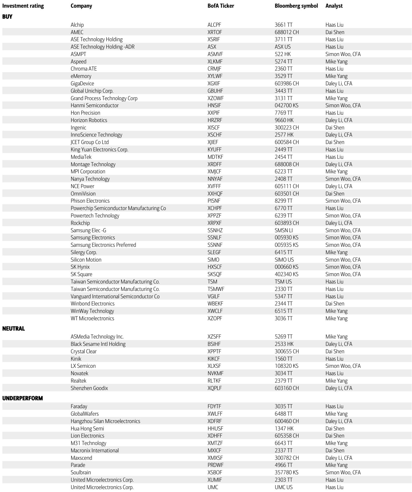
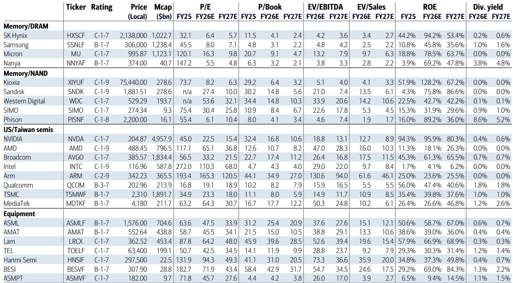
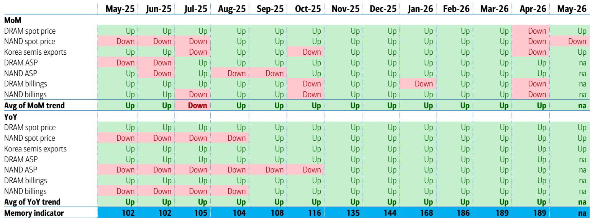

# The Vera Memory Panic Is a False Signal: The Real Memory Super-Cycle Has Not Peaked

The market is misreading the most critical signal in the memory sector today. Speculation that NVIDIA's Vera CPU will halve its SOCAMM memory content from 1,500GB to 750GB has created a wave of uncertainty about the sustainability of demand. This concern is analytically unsound and strategically misleading. The underlying data from Korea, Taiwan, and China point in the opposite direction: memory demand is accelerating, not decelerating, and the Vera story actually expands the total addressable market rather than contracting it. The real question for serious investors is not whether memory demand is peaking, but whether the current pricing cycle has room to run further than consensus expects.

The evidence is unambiguous. Korea's semiconductor exports for the first ten days of June reached an all-time high of USD 11 billion, representing a 206 percent year-on-year increase. This is not a one-off spike. It marks the fifth consecutive month of triple-digit export growth from the world's memory production hub. Taiwan's memory names are reporting year-on-year sales growth that defies normal cyclical patterns: Nanya Tech at 730 percent, Phison Electronics at 301 percent. China's integrated circuit imports hit a record USD 57 billion in May, up 68 percent year-on-year, driven entirely by price rather than volume. The BofA Memory Indicator, a composite measure of spot pricing, ASPs, billings, and export growth, has reached an all-time high of 189, breaking through historical ceilings that had previously capped at 140.

This is not a cycle behaving according to historical norms. It is a structural repricing of memory as an AI-enabling technology. The Vera speculation is a distraction from the core thesis.

## The Vera SOCAMM Reduction Narrative Confuses Product Segmentation with Demand Destruction

The market rumor that NVIDIA has cut Vera's memory content by 50 percent reflects a fundamental misunderstanding of product architecture. The original specification of 1,500GB of SOCAMM memory was designed for the Vera Rubin superchip, which pairs the Vera CPU with HBM4 memory. The lower 750GB configuration is a separate product: the Vera CPU rack, which operates without HBM. These are not substitutes. They are different solutions for different workloads.

Clients including Google, Amazon, Microsoft, and Meta have the option to choose either configuration for either platform, but the performance implications are not symmetrical. A 750GB Vera Rubin would be a materially lower-performance system, and there is no evidence that hyperscalers are opting for that trade-off. Initial SOCAMM orders were placed for Vera Rubin, not for Vera CPU rack. If anything, the Vera CPU rack represents incremental demand on top of the Vera Rubin baseline. The total addressable market for SOCAMM expands, not contracts, because the same memory technology now serves two distinct product lines.

The strategic implication for investors is clear: the Vera product family creates a second vector of memory demand that did not exist before. The market is treating this as a risk when it should be treated as an opportunity. The question is not whether memory content per Vera unit is declining. It is whether the combined volume of Vera Rubin and Vera CPU rack units will exceed what the market assumed when only one product was in the pipeline.

## Korea's Export Data and the BofA Memory Indicator Confirm We Are in Uncharted Pricing Territory

The BofA Memory Indicator has historically been capped at approximately 140, reflecting the cyclical nature of memory markets where booms are followed by corrections. The current reading of 189 has forced a methodological revision: the ceiling has been raised to 240 to accommodate the unprecedented strength. This is not a technical adjustment. It is an admission that the historical framework for understanding memory cycles is no longer adequate.

Korea's semiconductor exports in the first ten days of June were USD 11.1 billion, up 30 percent month-on-month. To put this in context, the average monthly export level for the full year of 2025 was roughly one-third of this ten-day figure. The acceleration is not linear. It is exponential. The primary driver is ASP increases of over 100 percent year-on-year, not volume growth. This is consistent with a supply-constrained market where demand is structurally outstripping capacity additions.

The spot price data reinforces this reading. DDR5 spot prices rose 3 percent week-on-week, DDR4 by 4 percent. The year-on-year comparisons are staggering: DDR5 up 675 percent, DDR4 up 985 percent. NAND has been relatively flat in recent weeks, but the year-on-year comparisons remain extreme: 390 percent for 1Tb wafer, 661 percent for 512Gb wafer. The market is not showing signs of topping out. It is showing signs of a second leg in the pricing cycle, driven by AI infrastructure buildout rather than consumer electronics replacement.

The critical insight for decision-makers is that the memory indicator is now in territory that has no historical precedent. Traditional cyclical frameworks that would predict a peak within 12 to 18 months are unreliable. The duration and amplitude of this cycle depend on AI capex trajectories, not on historical mean reversion.

## Samsung's Dividend Mechanics Create a New Class of Memory-Exposed Yield Instruments

Samsung Electronics is not typically viewed as a dividend play, but the mathematics now support that characterization. The analysis suggests that cash dividends for 2026 results could reach between KRW 50 trillion and KRW 70 trillion, with half potentially paid four to five months earlier than the standard schedule. This is not a speculative projection. It follows from five mechanistic factors: annual free cash flow likely exceeding KRW 200 trillion, a well-guided 50 percent payout ratio, employee special bonuses to be funded through buyback-based treasury shares, Samsung Life's 10 percent stake cap that may require it to sell excess Samsung Electronics shares following the buyback, and retail investor tax benefits tied to the timing of dividend distributions.

The structural point is that Samsung's dividend capacity is now a function of memory cycle earnings, and the memory cycle is at an all-time high. If the cycle persists, Samsung becomes a high-yield compounder that also offers memory exposure. If the cycle corrects, the dividend becomes a valuation floor. The risk-reward profile is asymmetric in favor of investors who can tolerate memory volatility.

The preferred shares of Samsung Electronics are particularly interesting. They offer higher dividend yields and may benefit disproportionately from the acceleration in payout timing. For institutional investors with yield mandates who are structurally underweight memory, this is a mechanism to gain exposure without taking direct commodity risk.

## The Korea Conference and Investor Sentiment Reveal a Gap Between Data and Conviction

The Korea Conference hosted by a global investment bank in mid-June 2026 set records for participation: approximately 200 investors and 120 corporates. The conference itself is a sentiment indicator. The fact that attendance is at an all-time high during a period of record memory prices suggests that institutional conviction is still building, not peaking.

Three factors are likely to reinforce bullish sentiment coming out of the conference. First, memory expert forecasts are expected to highlight chip shortages extending into 2027 or even 2028. This would contradict the prevailing market narrative that supply constraints are easing. Second, corporate guidance across technology, robotics, defense, power, beauty, and consumer sectors is expected to emphasize global leadership and growth, which supports the broader capex thesis. Third, fund flow dynamics are favorable: ETF inflows, long-only money rotation, and value-up programs including dividends, buybacks, and US listings are all supportive of Korean memory equities.

The gap that matters is between the data and the narrative. The data says this is the strongest memory cycle in history. The narrative says it cannot last. The conference is likely to narrow that gap, but it will not close it entirely. The unresolved question is whether the market will re-rate memory equities to reflect the structural nature of AI-driven demand, or whether it will continue to apply cyclical discounts that assume a correction is imminent.

## What the Report Does Not Fully Answer: The Demand Elasticity of AI Memory at Current Prices

The report provides extensive evidence that memory demand is strong and pricing is at record levels. It does not fully address the question of demand elasticity at these prices. If DDR5 is up 675 percent year-on-year, at what point do hyperscalers begin to optimize memory configurations to reduce per-unit costs? The Vera analysis suggests that NVIDIA is already offering lower-memory SKUs, but the report argues this is incremental demand rather than substitution. The distinction is analytically correct but strategically incomplete.

The deeper question is whether the hyperscalers' willingness to pay for memory is constrained by their overall AI infrastructure budgets. If GPU procurement costs continue to rise and memory costs continue to rise, total system costs may force architectural trade-offs that reduce memory content per GPU. The report's Vera analysis addresses one product family, but it does not model the broader system-level optimization that hyperscalers will inevitably pursue.

A second unanswered question is the supply response timeline. Memory manufacturers are adding capacity, but the lead times are long. If the cycle extends into 2028, capacity additions that are being planned today will come online during what could be the peak of the cycle. The risk is not that supply remains tight. The risk is that a wave of new capacity arrives just as demand growth decelerates, creating a classic memory overshoot. The report does not provide a supply-demand balance model that would allow investors to assess this risk quantitatively.

## A Decision Framework for Investors Navigating the Memory Super-Cycle

The report's data and analysis can be synthesized into a three-dimensional decision framework for investors. The first dimension is time horizon. Investors with a 6- to 12-month horizon should overweight memory equities based on the momentum in pricing, exports, and earnings. The data supports continued upside. Investors with a 24- to 36-month horizon need to model the supply response and demand elasticity risks that the report does not fully address. The second dimension is instrument selection. Direct equity exposure to Samsung, SK Hynix, and Micron offers the most direct leverage to the cycle. Samsung's preferred shares offer a yield-enhanced alternative. The third dimension is hedging. The memory cycle has no historical precedent at these levels, which means historical hedging strategies may not work. Investors should consider tail-risk hedges that protect against a synchronized collapse in AI capex and memory demand, even if that scenario appears unlikely today.

The framework leads to a clear strategic conclusion: the current cycle is real, the data is supportive, and the Vera narrative is a distraction. But the cycle's duration is uncertain, and the magnitude of the eventual correction will depend on factors that are not yet observable. The prudent approach is to maintain exposure while building the analytical capability to recognize the turning point when it arrives.

## Join the Community to Read the Full Report and Review the Original Charts

The analysis above is based on a single weekly report from a global investment bank. The full report contains detailed exhibits on DRAM and NAND spot pricing trends, Korea export data broken down by product category, China IC import volumes and unit trends, Taiwan monthly sales comparisons across more than 30 companies, and the complete BofA Memory Indicator methodology with back-tested performance since 1991. These exhibits provide the granular data that supports the strategic conclusions outlined here. They also reveal nuances that cannot be captured in a summary: the divergence between DRAM and NAND pricing trajectories, the compositional shifts in Korea's export mix, and the correlation between the memory indicator and equity performance across multiple cycles. For investors who want to make their own assessments rather than relying on second-hand interpretations, the original charts are essential. Join the community to read the full report and review the original charts.

*This article is for learning and discussion only and does not constitute investment advice.*

Personal reading notes and learning share only. Not investment advice.

