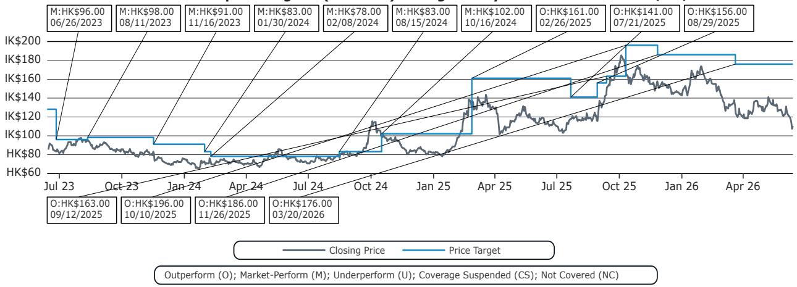
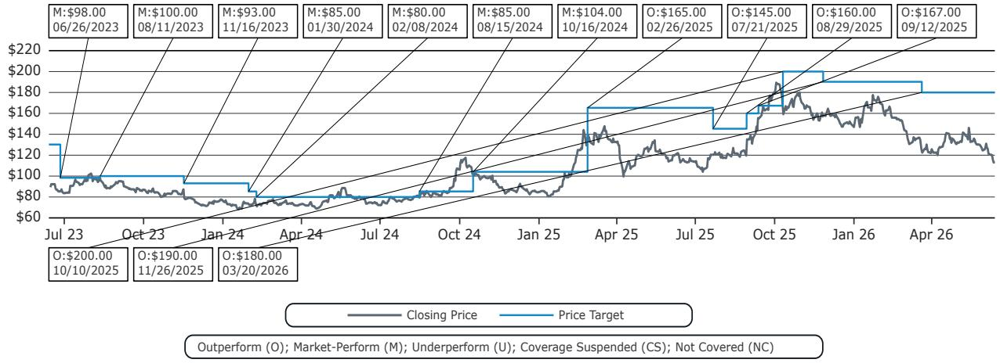
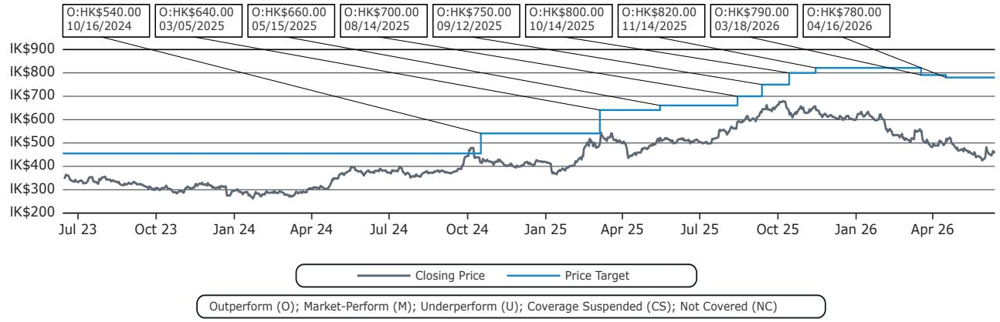

# The Frontier AI Model That Was Switched Off Proves Why Sovereign AI Is No Longer Optional

The AI frontier moved backward for the first time last weekend. It was not a technical failure, a market correction, or a funding freeze. It was a government decision. When Anthropic's Claude Fable 5 was launched and then un-launched by order of the US Department of Commerce on national security grounds, the industry witnessed something it had never seen before: a state-ordered rollback of capability. The model was restored within days, and the incident was called a misunderstanding. But the precedent remains. A frontier AI model, accessible only through the cloud, was turned off at the source. For any enterprise or government that depends on these systems, that weekend should change how you think about AI infrastructure.

The conventional narrative around AI competition has focused on benchmark scores, parameter counts, and training compute. That narrative is now incomplete. The real strategic question is no longer simply which model performs best on a given test. It is which model you can actually depend on when geopolitical winds shift. The Claude Fable 5 episode makes clear that cloud-deployed frontier models are not neutral tools. They are assets whose availability can be controlled by the jurisdiction in which they are hosted. For operators outside that jurisdiction, the risk is existential.

This report from a global investment bank argues that the incident creates a strong argument for sovereign AI. That argument is correct, but it may understate the implications. Sovereign AI is not just about national pride or technological independence. It is about operational continuity. As agentic AI capabilities improve and become embedded in mission-critical workflows, the ability to lose access to a model on a weekend whim becomes a business continuity risk of the first order. The question every CIO and chief strategy officer should be asking is not whether their AI provider is the best. It is whether their AI provider can be taken away.

The weekend also revealed something about the competitive dynamics between US and Chinese AI labs. It was probably not an accident that Kimi and Z.ai, two Chinese labs considered frontier in their own right, announced new models during the same weekend. K2.7 Code promised better reasoning efficiency. GLM-5.2 positioned itself against Claude Opus 4.8. Initial benchmark tests were encouraging. The report notes that these releases support the idea that China's leading labs can continue to keep pace with global peers. But the more important point may be rhetorical. Chinese open-weights models now occupy the high ground of availability. They cannot be switched off by a foreign government. That is a selling point no benchmark can capture.

## The Claude Fable 5 Episode Was Not a Bug. It Was a Feature of the Current Architecture.

The decision to restrict Claude Fable 5 was ostensibly about national security. The US Department of Commerce intervened because the model's capabilities were deemed too advanced to be made broadly available. Whether that concern was legitimate is beside the point. What matters is that the mechanism exists. A frontier model hosted in US data centers and accessible only via API can be turned off for users outside the US. The report frames this as a potential issue for dependability. That is an understatement.

Consider the implications for enterprise customers in Europe, Asia, or the Middle East who have built workflows around a US-hosted frontier model. They have no recourse. They cannot run the model locally. They cannot switch to a backup instance in another jurisdiction. They are dependent on a single point of control that sits in Washington. The Claude Fable 5 episode was resolved quickly, but the next one may not be. And the next one may involve a model that is embedded in critical infrastructure, not just a chatbot.

The irony of the episode was not lost on the developer community. Andrej Karpathy, a recent Anthropic hire, and Amanda Askell, head of personality alignment at Anthropic, were technically barred from using their own company's model. If the architects of the model cannot access it, what hope does a third-party enterprise have? The incident exposes a fundamental vulnerability in the current AI deployment model. Cloud-only access means that availability is a function of policy, not technology. And policy can change overnight.

## Chinese AI Labs Used the Window to Demonstrate That Availability Is a Competitive Advantage

The timing of the announcements from Kimi and Z.ai was almost certainly deliberate. While the US ecosystem was distracted by the Claude Fable 5 controversy, two Chinese labs pushed out new models that addressed exactly the vulnerability the episode highlighted. K2.7 Code focused on reasoning efficiency and capability upgrades. GLM-5.2 went head-to-head with Claude Opus 4.8. The report notes that both online developer feedback and locally-hosted benchmark tests returned encouraging results.

The strategic logic is clear. Chinese labs cannot compete with US labs on the narrative of frontier capability alone. But they can compete on the narrative of dependability. A model that may be slightly less capable but is guaranteed to be available is more valuable to many enterprise customers than a model that is slightly more capable but could disappear. This is not a trade-off that benchmark scores capture. It is a trade-off that risk management frameworks capture. And as AI becomes more embedded in critical operations, risk management will increasingly drive procurement decisions.

The report raises real counter-arguments. US labs still lead on raw capability, ecosystem breadth, and developer mindshare. But on the margin, the Claude Fable 5 episode shifts the calculus. Chinese open-weights models now have a rhetorical advantage they did not have before. They are not just cheaper or good enough. They are sovereign. For customers in jurisdictions that do not want to be dependent on US policy, that is a powerful argument.

## The Precedent Set by This Episode Is Not Bullish for US SOTA Labs' Global Aspirations

The report makes a point that deserves more attention than it will likely receive. An interesting precedent was set that is probably not bullish for the US state-of-the-art labs' global aspirations in use cases where dependability is important. It also notes that this precedent is not bullish for stock market narratives contingent on upcoming IPOs and continued success.

The connection to valuation is not speculative. When Chinese regulators shook up their Internet sector a few years ago, valuation multiples investors were willing to accept compressed dramatically. The mechanism was the same. A sudden policy intervention created uncertainty about the availability of key assets. Investors priced in a risk premium. The same dynamic could apply to US AI labs if customers outside the US begin to factor geopolitical access risk into their procurement decisions.

The US labs are preparing for a wave of IPOs. Their valuations depend on global revenue growth. If enterprise customers in Europe, Asia, and the Middle East begin to view US-hosted frontier models as risky, that growth may slow. The report does not quantify this risk, but the logic is straightforward. Dependability is a feature. If it is not guaranteed, customers will look for alternatives. And alternatives are increasingly available.

## What the Report Does Not Fully Answer: How Quickly Will Sovereign AI Become a Procurement Requirement?

The report makes a strong case for sovereign AI, but it leaves several important questions open. The most pressing is timing. How quickly will large enterprise and sovereign operators outside the US start asking uncomfortable questions about the dependability of cloud-deployed AI models? The answer depends on how many more Claude Fable 5 episodes occur. One incident can be dismissed as a misunderstanding. A pattern cannot.

The second open question is whether sovereign AI will be built on open-weights models or on proprietary models hosted in alternative jurisdictions. The Chinese labs are pushing open-weights models, but that approach has its own risks. Open-weights models can be forked, modified, and redistributed, but they also require significant infrastructure to run. Not every enterprise or government has the compute capacity to host a frontier model locally. The sovereign AI solution may end up being a hybrid: proprietary models hosted in data centers located in friendly jurisdictions, with contractual guarantees of availability.

The third question is whether the US government will impose permanent restrictions on frontier model access. The Claude Fable 5 episode was resolved, but the underlying policy concern has not gone away. If the US decides that certain capabilities are too dangerous to be broadly available, it may impose permanent licensing requirements on frontier models. That would create a two-tier market: models for US customers and models for everyone else. The implications for global AI competition would be profound.

## A Decision Framework for Evaluating AI Model Dependability in a Geopolitically Fractured Landscape

For readers who need to translate this analysis into actionable decisions, the following framework may be useful. It is not a checklist. It is a set of questions that every organization should ask before committing to a frontier AI model for mission-critical use cases.

First, where is the model hosted? If the model is only accessible via API from a single jurisdiction, you have a single point of failure that is not technical but political. The question is not whether that jurisdiction is friendly today. It is whether it will remain friendly for the entire lifecycle of your deployment.

Second, can you run the model locally? If the model is open-weights, the answer is yes. If it is proprietary and cloud-only, the answer is no. Local deployment gives you control. It also gives you the ability to audit, modify, and secure the model on your own terms. The trade-off is that local deployment requires infrastructure and expertise that many organizations do not have.

Third, what is the contractual guarantee of availability? Most cloud service agreements include uptime guarantees, but those guarantees are technical, not political. They do not cover the risk of a government order to shut down access. If your contract does not address this risk explicitly, you are effectively uninsured.

Fourth, what is the backup plan? If your primary model becomes unavailable, do you have an alternative that can be deployed quickly? The answer should not be a different model from the same provider. It should be a model from a different jurisdiction or a model that you host yourself.

Fifth, what is the cost of switching? If you build workflows, training data, and fine-tuning pipelines around a specific model, switching is expensive. The cost of switching should be factored into your initial procurement decision. The cheaper the model today, the more expensive the lock-in tomorrow.

## Join the Community to Read the Full Report and Review the Original Charts

The analysis above distills the strategic logic of the Claude Fable 5 episode, but it cannot capture the full depth of the original report. The report includes detailed benchmark comparisons, valuation frameworks for Tencent and Alibaba, and a ticker table with price targets that reflect the analysts' views on the intersection of AI competition and geostrategic risk. It also includes the full disclosure and methodology sections that serious investors require.

The questions left open in this article are not gaps in the report. They are deliberate provocations. The report identifies the trend. It is up to readers to decide how to position for it. Join the community to read the full report and review the original charts. The data behind the argument is worth examining in detail.

*This article is for learning and discussion only and does not constitute investment advice.*

Personal reading notes and learning share only. Not investment advice.

