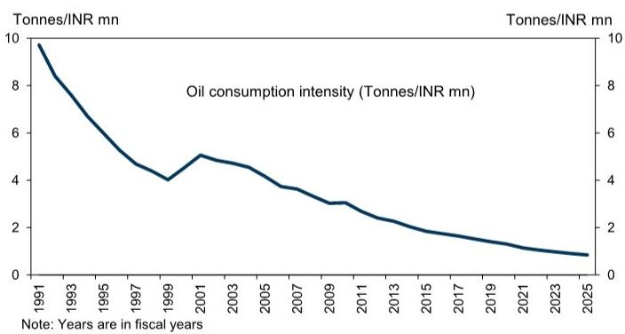
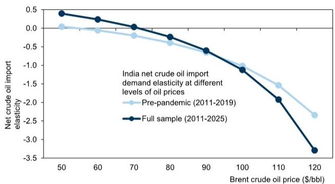
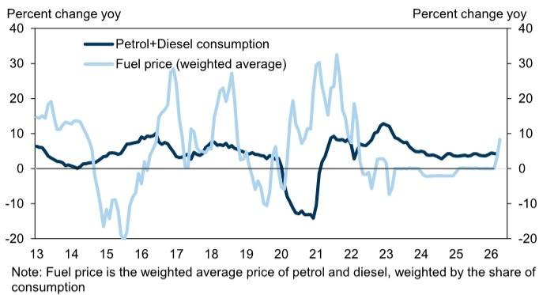
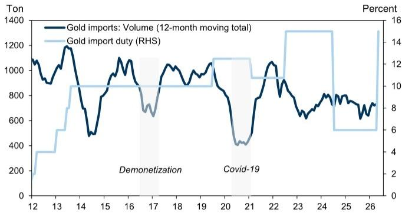
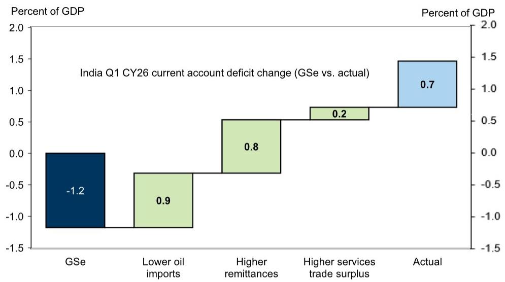
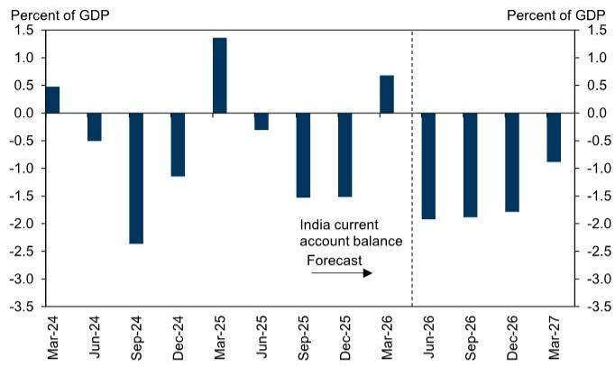
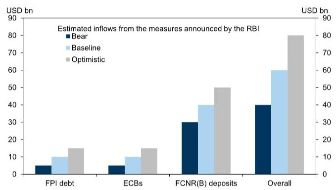
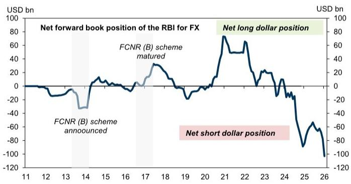
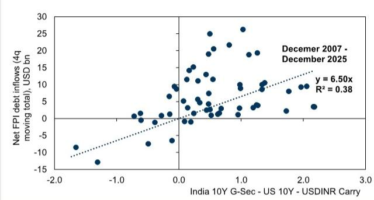

ASIA IN FOCUS

# India: A More Favourable Balance of Payments Outlook

The INR's recent weakness appears larger than what balance of payments (BoP) fundamentals would suggest. Despite softer capital inflows, India posted a \$7.2bn BoP surplus in Q1 CY26, supported by stronger remittances, robust services exports and low oil imports. In our view, this reflects precautionary dollar demand amid heightened Middle-East uncertainty. Going forward, higher oil prices will likely widen India's current account deficit, but the deterioration is likely to be less severe than in past energy shock episodes.

India's oil intensity has declined steadily since 1990s, reflecting improved energy efficiency, rising transport electrification, and a shift toward less energy-intensive growth. Post-pandemic, oil import volumes also appear more price-sensitive, with volumes now declining more when oil rises above \$80/bbl. As a result, higher oil prices may not translate into a proportionate increase in India's oil import bill. Separately, policymakers have often used import duties and administrative curbs to contain gold imports during episodes of external stress. Historically, duty hikes have begun to weigh on gold import volumes with a 1-2 month lag, and we expect the same in this cycle.

## A BoP surplus year, after two consecutive years of deficit: The RBI's

comprehensive set of measures to incentivize dollar inflows, including concessional forex swap rates for banks and quasi-sovereigns to raise USD funding, together with exemptions on interest and capital gains tax on G-Sec for FPIs, should underpin capital inflow revival and support the INR. Meanwhile, incorporating our lower oil and gold import assumptions, and better-than-expected Q1 data we lower our current account deficit forecast to 1.3% of GDP in CY26 and 1.7% of GDP in FY27 from 2.0% of GDP and 2.1% of GDP earlier. With our estimate of \$60bn of additional capital inflows from the RBI's measures, we expect India to record a balance of payments surplus of around 0.6% of GDP in CY26 FY27 each.

## Depreciation pressure on the INR should ease, but we don't see material

appreciation: An improved balance of payments outlook should help lower depreciation pressures on the INR. While the currency appears broadly fairly valued on a trade-weighted basis, we expect any renewed dollar inflows to be largely absorbed by the RBI through reserve accumulation and unwind the short forward book, limiting the scope for significant appreciation.

## Arjun Varma

+91(22)6616-9043

arjun.varma@gs.com

GS India SPL

## Santanu Sengupta

+91(22)6616-9042

santanu.sengupta@gs.com

GS India SPL

## Andrew Tilton

+852-2978-1802

andrew.tilton@gs.com

GS (Asia) L.L.C.

## Reassessing the balance of payments outlook

Recently, the INR has depreciated by more than India's external fundamentals would imply. Despite the energy shock and concerns around weaker capital inflows, India's balance of payments (BoP) posted a surplus of around \$7.2bn in Q1 CY26. The current account recorded a surplus of \$7bn, supported by record-high remittance inflows, a robust services trade surplus and a lower-than-expected oil import bill. In our view, the apparent divergence between the INR's weak performance and the strong underlying BoP position suggests that the recent pressure on the currency was driven more by precautionary and speculative demand for dollars amid heightened geopolitical uncertainty than by a deterioration in India's fundamental external position.

In this report, we reassess India's external balances. We examine how oil volumes may respond to higher prices, using evidence from oil intensity, historical demand elasticity, and fuel-price pass-through to domestic consumption. We further assess if gold imports could adjust lower, comparing recent import duty hikes to prior policy interventions. Finally, we evaluate the RBI's recent measures to incentivize dollar inflows, and update our overall balance of payments outlook.

## Lower oil intensity may help mitigate the impact of higher oil prices

India's oil intensity has declined steadily over the past three decades, reflecting improvements in energy efficiency, greater electrification of transportation and a gradual shift towards less energy-intensive sources of growth (Exhibit 1). As a result, increase in oil prices is likely to have a smaller impact on economic activity than in previous oil shock episodes. Despite the Middle-East driven energy shock, and lower oil (volume) imports, economic activity was resilient in Q1, partly due to fiscal and quasi-fiscal absorption of higher oil prices, and partly due to inventory drawdown.

Exhibit 1: India's oil intensity has declined over the last three decades  

line chart

Oil consumption intensity (Tonnes/INR mn)
| Year | Oil consumption intensity (Tonnes/INR mn) |
|---|---|
| 1991 | 10.0 |
| 1993 | 8.5 |
| 1995 | 7.0 |
| 1997 | 5.5 |
| 1999 | 4.0 |
| 2001 | 5.0 |
| 2003 | 4.5 |
| 2005 | 4.0 |
| 2007 | 3.5 |
| 2009 | 3.0 |
| 2011 | 2.5 |
| 2013 | 2.0 |
| 2015 | 1.8 |
| 2017 | 1.6 |
| 2019 | 1.4 |
| 2021 | 1.2 |
| 2023 | 1.0 |
| 2025 | 0.8 |

Source: CEIC, GS Global Investment Research

To assess the implications of a lower oil consumption intensity for the current account, we focus on net oil imports, in volume terms (crude oil imports plus petroleum product imports less petroleum product exports), which provides a better measure of India's underlying oil import requirement than crude oil imports alone. This is important, as a part of India's crude oil imports are processed and exported as refined petroleum products.

The relationship between Brent crude oil price and net crude oil import volumes appears non-linear: volume imports generally rose as prices increased from low levels. Beyond a threshold (around \$75-\$80/bbl), however, price increases were associated with lower import volumes $^{1}$ .

Including post-pandemic observations (excluding 2020 and 2021), the responsiveness of net crude import volume to changes in oil prices has increased across most price levels relative to the pre-pandemic period. The price threshold at which import volumes begin to decline has also moved higher to about \$75-80/bbl (from around \$60/bbl pre-pandemic), likely reflecting lower oil intensity and a greater economic capacity to absorb higher oil prices (Exhibit 2).

Exhibit 2: India's net crude oil import volumes have become more elastic (vs. the pre-pandemic period)  

line chart

| Brent crude oil price ($/bbl) | Pre-pandemic (2011-2019) | Full sample (2011-2025) |
|---|---|---|
| 50 | 0.0 | 0.4 |
| 60 | -0.1 | 0.3 |
| 70 | -0.3 | 0.1 |
| 80 | -0.5 | -0.3 |
| 90 | -0.7 | -0.6 |
| 100 | -1.0 | -1.1 |
| 110 | -1.5 | -2.0 |
| 120 | -2.5 | -3.3 |

Source: CEIC, GS Global Investment Research

One channel through which higher oil prices can reduce import volumes is weaker domestic fuel demand, given the recent fuel price hikes. As shown in Exhibit 3, higher fuel prices have weighed on fuel consumption demand in the past. Depending on the duration of the energy shock, sustained higher oil prices may necessitate further fuel price hikes, weighing on consumption and, in turn, net oil import volumes. Based on our estimates, every $10\%$ increase in fuel prices, lowers petrol and diesel consumption growth by around $3\%$ on an average over the next 12 months.

Exhibit 3: Domestic fuel price hikes likely to weigh on fuel consumption demand going forward  

line chart

| Year | Petrol+Diesel consumption | Fuel price (weighted average) |
|------|---------------------------|-------------------------------|
| 13   | ~5                        | ~15                           |
| 14   | ~0                        | ~10                           |
| 15   | ~5                        | ~-20                          |
| 16   | ~10                       | ~-10                          |
| 17   | ~5                        | ~30                           |
| 18   | ~5                        | ~25                           |
| 19   | ~5                        | ~-10                          |
| 20   | ~-10                      | ~-10                          |
| 21   | ~-15                      | ~30                           |
| 22   | ~10                       | ~-5                           |
| 23   | ~10                       | ~-5                           |
| 24   | ~5                        | ~0                            |
| 25   | ~5                        | ~0                            |
| 26   | ~5                        | ~5                            |

Source: CEIC, GS Global Investment Research

While higher oil prices mechanically lift India's oil import bill, but as discussed above import volumes are likely to respond more to a given level of oil price, given the lower oil consumption intensity. With Brent crude oil prices averaging around \$90/bbl in CY26 (vs. about \$70/bbl pre-conflict), our estimates imply a 10% price rise is associated with around a 6% decline in net import volumes. Alongside lower oil intensity and fuel-price pass-through weighing on demand, softer volumes should partly offset the trade-balance hit from higher prices.

## Gold import duties likely to curb gold imports

Historically, gold imports have remained elevated during periods of external stress, reflecting gold's role as a store of value during episodes of financial market volatility and geopolitical tensions. Gold imports averaged $1\%$ to $3\%$ of GDP during previous stress episodes. Gold imports are tracking at around $2.2\%$ of GDP in 2026 Q1, levels comparable to those observed during some of India's previous external stress episodes.

Given the share of gold imports in India's trade deficit, policymakers have historically relied on import duties to curb imports (See Appendix). As shown in Exhibit 4, higher import duties were typically followed by a decline in gold import volumes. The impact typically started to materialize 1-2 months after the import duty hike, with the full effect unfolding over 5-6 months (\~40-50% decline). Other policy and regulatory measures also weighed on gold imports. For instance, gold imports declined sharply in 2016-17 following demonetization, which disrupted cash-intensive jewellery purchases and temporarily weakened retail demand.

Exhibit 4: Gold import volumes typically weaken within 1-2 months of duty hikes, with the full impact materializing over 5-6 months  

line chart

| Year | Gold imports: Volume (12-month moving total) | Gold import duty (RHS) |
|------|-----------------------------------------------|------------------------|
| 12   | ~1100                                         | ~2                     |
| 13   | ~1200                                         | ~4                     |
| 14   | ~500                                          | ~8                     |
| 15   | ~1000                                         | ~8                     |
| 16   | ~1050                                         | ~8                     |
| 17   | ~900                                          | ~6                     |
| 18   | ~1000                                         | ~8                     |
| 19   | ~1050                                         | ~8                     |
| 20   | ~800                                          | ~8                     |
| 21   | ~400                                          | ~8                     |
| 22   | ~1050                                         | ~8                     |
| 23   | ~800                                          | ~14                    |
| 24   | ~750                                          | ~6                     |
| 25   | ~700                                          | ~6                     |
| 26   | ~750                                          | ~6                     |

Source: CEIC, GS Global Investment Research

Recent media reports suggest that the May 2026 import duty hike has started to weigh on gold imports and retail demand. However, elevated geopolitical uncertainty and record-high gold prices suggest that any adjustment in gold imports may prove temporary, particularly as jewellery demand typically strengthens during the wedding season (November-February). Moreover, while higher duties may help moderate official gold imports in the near term, they could potentially increase unofficial gold imports.

## Reassessing India's current account balance

India posted a current account surplus of \$7.0bn in Q1 CY26 (vs. our expectation of a deficit), mainly driven by a) lower-than-expected oil import bill, b) higher remittance receipts, and c) higher services trade surplus.

First, the oil import bill declined significantly in March — despite higher Brent crude oil prices — reflecting lower oil import volumes (-15% yoy) amidst supply disruptions from the Strait of Hormuz due to the Middle-East conflict. Second, remittance receipts rose to a record high of \$41bn in Q1 (4% of GDP), likely reflecting precautionary transfers by non-resident Indians due to the Middle-East conflict, contrary to our expectations of a slowdown amidst the Middle-East conflict. Third, services exports remained strong, led by robust software and business services exports (Exhibit 5).

Exhibit 5: Current account balance came in at a surplus (vs. our expectation of a deficit) mainly on lower oil imports and higher remittance receipts  

bar chart

India Q1 CY26 current account deficit change (GSe vs. actual)
| Category | Value (%) |
|---|---|
| GSe | -1.2 |
| Lower oil imports | 0.9 |
| Higher remittances | 0.8 |
| Higher services trade surplus | 0.2 |
| Actual | 0.7 |

Source: RBI, GS Global Investment Research

Given the better-than-expected current account balance, we reassess our outlook on the current account deficit for CY26, incorporating the Q1 print and the implications of the above analysis into our forecasts.

Oil: First, incorporating the lower-than-expected oil import bill in Q1, and a softer outlook for oil demand, we revise down our CY26 oil import forecast to \$220bn (5.6% of GDP) (vs. \$244bn earlier, 6.3% of GDP). Our revised forecast assumes around 2% lower oil import volume growth, reflecting increased sensitivity of oil demand to higher prices, the IEA's estimate of weaker oil demand growth in India since the onset of the conflict, and the recent moderation in petrol and diesel consumption following domestic fuel price hikes.  
Gold: Second, historically, gold import duty hikes have been followed by a decline in import volumes, with a 1-2 month lag. Given the recent increase in import duties and the early signs of moderation in imports, we revise down our CY26 gold import forecast to \$56bn (1.4% of GDP), from \$64bn (1.6% of GDP) earlier.  
■ Remittances: Third, we nudge up our CY26 remittance forecast to US\$136bn (vs. \$134bn earlier), reflecting the stronger-than-expected inflows in Q1. While precautionary transfers amid heightened uncertainty in the Gulf likely boosted remittance inflows in the first quarter, we assume a moderation in inflows over Q2-Q4, consistent with slower growth across GCC economies.

Taken together, we revise our current account deficit forecast for CY26 to \$46bn (1.3% of GDP), vs. \$78bn (2.0% of GDP earlier), while our FY27 forecast is lowered by 0.4pp to 1.7% of GDP (Exhibit 6).

Exhibit 6: We expect current account deficit to average around $1.3\%$ of GDP in CY26 and $1.7\%$ of GDP in FY27  

bar chart

| Date | Percent of GDP |
|---|---|
| Mar-24 | 0.5 |
| Jun-24 | -0.5 |
| Sep-24 | -2.5 |
| Dec-24 | -1.0 |
| Mar-25 | 1.3 |
| Jun-25 | -0.3 |
| Sep-25 | -1.5 |
| Dec-25 | -1.5 |
| Mar-26 | 0.7 |
| Jun-26 | -2.0 |
| Sep-26 | -2.0 |
| Dec-26 | -1.8 |
| Mar-27 | -0.9 |

Source: GS Global Investment Research

We introduce our 2027 forecasts for the current account deficit here as well. Incorporating our commodities team, new brent crude oil price path (\$80/bbl average), we expect current account deficit to remain at around 1.1% of GDP, underpinned by strong services exports and remittance receipts (Please see Appendix).

## Revisiting our capital flow assumptions

In line with our earlier research, the RBI, in coordination with the Government, announced a set of measures to attract foreign capital inflows, including concessional forex swap rate for quasi-sovereign companies and authorized dealer banks to raise USD funding through December 31, 2026, and full hedging support for fresh 3-5 year foreign currency deposits by banks through September 30, 2026. It also expanded the Fully Accessible Route (FAR)-eligible universe to include all new 15-year, 30-year, and 40-year G-Sec issuances and restored the export-proceeds realization period to nine months from 15-months earlier. We incorporate these measures into our capital account forecasts and reassess our balance of payments outlook for CY26 and CY27.

Foreign currency non-resident deposit (FCNR (B)) scheme: The RBI announced the FCNR (B) scheme with a similar framework used during 2013. The RBI will provide a full hedging support for fresh 3-5 year deposits through September 30, 2026 (Please see Appendix for details). We estimate around \$30-50bn of inflows from this scheme in CY26, all of which we expect to materialize by Q3. Some state and private sector banks have already raised the FCNR (B) deposit rates by around 2-4%.

■ External commercial borrowings (ECBs): The RBI announced a concessional forex swap rate of 1.5% (vs. the market prevailing rate of around 3%) for quasi sovereigns to raise USD funding through December 31, 2026 —reducing hedging costs and improving the economics of offshore funding relative to domestic borrowing. We estimate that ECB-related inflows could amount to around \$5-15bn over the next six months.

Foreign investment in government securities (G-Sec): The RBI has expanded the Fully Accessible Route (FAR) to include 15Y/30Y/40Y G-Secs, and the government has exempted foreign investors from tax on interest income and capital gains on G-Secs. Together, these steps improve the post-tax, hedged return profile of India's

10-year government bond, which should support FPI debt inflows. We estimate incremental G-Sec inflows of around \$10bn over the next 6-12 months (Please see Appendix for details) $^{2}$

Overall, we estimate around \$60bn of inflows from the various measures announced by the RBI to incentivize dollar flows in CY26 (Exhibit 7).

Exhibit 7: Overall, we estimate around \$40-80bn of inflows from the various measures announced by the RBI, with our baseline of around \$60bn in CY26  

bar chart

| Category | Bear (USD bn) | Baseline (USD bn) | Optimistic (USD bn) |
|---|---|---|---|
| FPI debt | 5 | 10 | 15 |
| ECBs | 5 | 10 | 15 |
| FCNR(B) deposits | 30 | 40 | 50 |
| Overall | 40 | 60 | 80 |
Estimated inflows from the measures announced by the RBI

Source: GS Global Investment Research

A common feature of both ECB and FCNR(B)-related inflows is that the associated foreign currency exposure will be absorbed by the RBI. As a result, the dollar inflows would be reflected in a higher net short forward FX position of the RBI (\~103bn in March 2026), as was the case when the FCNR (B) scheme was announced in 2013 (Exhibit 8), with the effect reversing as deposits mature or the borrowings are repaid.

Exhibit 8: The FCNR (B) scheme and the concessional swap facility for offshore borrowings by quasi-sovereigns will result in further increase in the RBI's net short dollar forward book  

line chart

| Year | Net forward book position of the RBI for FX (USD bn) |
|------|----------------------------------------------------|
| 11   | 0                                                  |
| 12   | -10                                                |
| 13   | -20                                                |
| 14   | -30                                                |
| 15   | 0                                                  |
| 16   | 10                                                 |
| 17   | 20                                                 |
| 18   | 30                                                 |
| 19   | 0                                                  |
| 20   | -10                                                |
| 21   | 80                                                 |
| 22   | 60                                                 |
| 23   | 20                                                 |
| 24   | -20                                                |
| 25   | -80                                                |
| 26   | -120                                               |

Source: RBI, GS Global Investment Research

Beyond debt-related inflows, the government also increased limits applicable to foreign portfolio investors in Indian equities. However, unlike ECB and FCNR(B) flows, which are directly incentivized by the recent measures, we believe the outlook for equity inflows will continue to be driven primarily by relative valuation premiums, and earnings expectations.

## Why have foreign equity flows remained subdued in recent years?

Foreign portfolio equity flows have remained weak, with net outflows of around \$20bn over the past two years and further \~\$29bn, year-to-date in CY26. While, the announcement of the India-US trade deal in February 2026 resulted in a brief recovery in inflows, the onset of the Middle-East conflict reversed all the recovery. In our view, fundamentally this reflects India's elevated valuation premium, weaker earnings momentum, and a depreciating INR lowering dollar returns for foreign investors. Overall, we expect foreign equity inflows to remain subdued in CY26, with our equity strategists expecting around \$25bn of net outflows.

This along with the revision to our current account balance forecasts, we expect India to record a balance of payments surplus of around $0.6\%$ of GDP in CY26 and FY27 each.

## FX view

In our view the INR has likely depreciated by more than what underlying balance of payments fundamentals would imply. India recorded a balance of payments surplus of \$7bn, despite weaker capital flows suggesting that recent pressure on the currency was likely driven more by precautionary and speculative demand for dollars amid heightened geopolitical uncertainty than by a deterioration in external fundamentals. Going forward, our revised forecasts imply a smaller current account deficit, while the RBI's recent measures to incentivize FCNR(B), ECB and portfolio debt inflows should underpin capital inflows. Taken together, we now expect the balance of payments to remain in surplus at around 0.6% of GDP in CY26 (0.6% of GDP in FY27), after two consecutive years of deficit, which should help limit further depreciation pressures on the INR. From a valuation perspective, the INR appears fairly valued on a trade-weighted basis, according to FX strategists. While it remains somewhat expensive relative to the CNY, it screens as relatively cheap versus several higher-carry EM currencies. That said, we do not expect a significant appreciation in the INR, as renewed dollar inflows are likely to be absorbed by the RBI through reserve accumulation and rebuilding of its FX buffers, including unwinding a significantly large short forward book (\~103bn as of March 2026).

## Appendix

## A1. Past regulation measures to curb gold imports

Import duty: Prior to 2012, gold imports were subject to a fixed customs duty of INR 300 per 10 grams, equivalent to roughly $1\%$ of the prevailing gold price. Faced with a widening current account deficit, the government raised import duties in multiple stages—from $2\%$ in January 2012 to $4\%$ in March 2012. In 2013, the government hiked import duties thrice to $10\%$ by August 2013 during the taper tantrum episode to contain the current account deficit. These duty increases were accompanied by a series of quantitative restrictions aimed at reducing gold imports and supporting the external balance.

Quantitative restriction: The most notable measure was the 80:20 scheme, introduced in 2013, under which importers were required to re-export at least $20\%$ of imported gold before being permitted to undertake additional imports. The government also restricted imports by nominated agencies and tightened import procedures. Together, these measures contributed to a sharp decline in official gold imports and helped narrow the current account deficit during the taper tantrum episode.

However, the measure were also criticized for distorting the domestic gold market, creating shortages for jewellers and encouraging a rise in gold smuggling and unofficial imports. The restrictions were gradually removed in 2014 as external pressures eased and concerns over market distortions increased.

## A2. FCNR(B) and ECB swap facility mechanics

## Estimating the foreign currency non-resident deposit flows

The RBI has reintroduced a concessional FCNR(B) swap window under which banks can swap incremental FCNR(B) deposits with the RBI at a subsidized rate, effectively absorbing the FX hedging cost of around 3%, through September 30 2026. During the 2013 FCNR(B) scheme, banks garnered around \$25bn of deposits, equivalent to around 2.2% of aggregate bank deposits at the time. Applying the same penetration rate to the current deposit base would imply potential inflows of around US\$55-60bn. However, we expect a lower take-up this time. First, around 15-20% of the 2013 inflows likely reflected switching from existing NRE deposits rather than entirely new inflows. Second, depositor economics appear less attractive than in 2013, with US funding or leverage costs currently around 4% compared with close to 1% during the previous scheme. Taking these factors into account, we estimate the FCNR(B) window could attract around \$30-50bn of incremental inflows over the next 3 months, with our baseline of around \$40bn.

## Estimating the potential External commercial borrowing (ECB) flows

The RBI has introduced a concessional forex swap rate of 1.5% (vs. the market prevailing rate of around 3%) for quasi-sovereign borrowers to raise USD funding through December 31, 2026. To estimate the potential impact on ECB inflows, we examine the two most recent episodes in which offshore borrowing costs were around 0.5-1.0pp cheaper than domestic funding costs—during 2013 and 2021 (when dollar rates were low). In both instances, incremental ECB inflows increased by around \$10bn over the subsequent four quarters. Based on these historical precedents and the current funding differential of around 0.8pp (including the RBI concession forex swap rate of 1.5%) (Exhibit 9), we estimate the latest measure could generate around \$5-15bn of additional ECB inflows over the next year.

Exhibit 9: The RBI concessional swap for ECB borrowings for quasi-sovereigns has effectively lowered dollar borrowing costs

<table><tr><td colspan="2">ECB borrowing mechanics</td></tr><tr><td>US 5Y SOFR (%)</td><td>3.9</td></tr><tr><td>+ PSU USD credit spread (Assumption) (%)</td><td>1.2</td></tr><tr><td>USD 5Y borrowing cost (%)</td><td>5.1</td></tr><tr><td>+ RBI concessional swap (%)</td><td>1.5</td></tr><tr><td>All-in hedged INR cost (including RBI concessional swap) (%)</td><td>6.6</td></tr><tr><td>Domestic PSU 5Y INR borrowing cost</td><td>7.4</td></tr><tr><td></td><td></td></tr><tr><td>Net offshore funding differential vs domestic borrowing cost (with RBI concession) (%)</td><td>-0.8</td></tr></table>

Source: GS Global Investment Research

## A3. Estimating the incremental FPI debt inflows from the announced tax changes

The RBI has expanded the Fully Accessible Route (FAR) to include 15Y/30Y/40Y G-Secs, and the government has exempted foreign investors from tax on interest income and long-term capital gains on G-Secs which were around $20\%$ and $12.5\%$ respectively.

To estimate the impact on debt inflows, we examine the historical relationship between FPI debt flows and the India-US 10Y yield differential adjusted for one-year hedging costs (Exhibit 10). Historically, every 100bp increase in the hedged yield differential has been associated with aorund \$6.5bn of additional FPI debt inflows. We estimate that the recent tax changes increase post-tax returns for foreign investors by around 1.4pp, implying potential incremental debt inflows of around \$10bn over the next 12 months.

Exhibit 10: FPI debt inflows have been closely associated with India - US 10Y yield differentials  

scatterplot

| India 10Y G-Sec - US 10Y - USDINR Carry | Net FPI debt inflows (4q moving total), USD bn |
| ---------------------------------------- | --------------------------------------------- |
| -2.0                                     | -15                                           |
| -1.0                                     | -10                                           |
| 0.0                                      | 0                                             |
| 1.0                                      | 10                                            |
| 2.0                                      | 25                                            |
| 3.0                                      | 20                                            |

Source: Bloomberg, GS Global Investment Research

## A4. Balance of Payments forecast

Exhibit 11: We now expect current account deficit at $1.3\%$ of GDP...

<table><tr><td>Amount ($ bn)</td><td>2025</td><td>2026F</td><td>2027</td></tr><tr><td>Current Account</td><td>-19</td><td>-49</td><td>-46</td></tr><tr><td>(as % of GDP)</td><td>-0.5</td><td>-1.3</td><td>-1.1</td></tr><tr><td>Goods Trade Balance</td><td>-313</td><td>-351</td><td>-363</td></tr><tr><td>Goods Exports</td><td>449</td><td>477</td><td>489</td></tr><tr><td>Oil Exports</td><td>56</td><td>69</td><td>66</td></tr><tr><td>Non-Oil Exports</td><td>389</td><td>407</td><td>423</td></tr><tr><td>Goods Imports</td><td>763</td><td>828</td><td>852</td></tr><tr><td>Oil Imports</td><td>180</td><td>220</td><td>208</td></tr><tr><td>Gold Imports</td><td>59</td><td>56</td><td>63</td></tr><tr><td>Non-Oil Non-Gold Imports</td><td>516</td><td>551</td><td>581</td></tr><tr><td>Services Trade Balance</td><td>210</td><td>221</td><td>243</td></tr><tr><td>Services Exports</td><td>412</td><td>438</td><td>483</td></tr><tr><td>Services Imports</td><td>203</td><td>217</td><td>240</td></tr><tr><td>Primary Income</td><td>-49</td><td>-58</td><td>-69</td></tr><tr><td>Secondary Income</td><td>134</td><td>138</td><td>143</td></tr></table>

Source: GS Global Investment Research

Exhibit 12: ...and a balance of payments surplus of $0.6\%$ of GDP in CY26

<table><tr><td>Amount ($ bn)</td><td>2025</td><td>2026F</td><td>2027</td></tr><tr><td>Current Account</td><td>-19</td><td>-49</td><td>-46</td></tr><tr><td>(as % of GDP)</td><td>-0.5</td><td>-1.3</td><td>-1.1</td></tr><tr><td>Goods Trade Balance</td><td>-313</td><td>-351</td><td>-363</td></tr><tr><td>Services Trade Balance</td><td>210</td><td>221</td><td>243</td></tr><tr><td>Primary Income</td><td>-49</td><td>-58</td><td>-69</td></tr><tr><td>Secondary Income</td><td>134</td><td>138</td><td>143</td></tr><tr><td>Capital Account</td><td>-3</td><td>72</td><td>58</td></tr><tr><td>as (% of GDP)</td><td>-0.1</td><td>1.8</td><td>1.3</td></tr><tr><td>Foreign direct investment</td><td>3</td><td>10</td><td>8</td></tr><tr><td>Foreign portfolio flows</td><td>-10</td><td>-13</td><td>30</td></tr><tr><td>Others (incl. Loans, banking capital etc)</td><td>4</td><td>71</td><td>20</td></tr><tr><td>Overall BoP deficit / surplus</td><td>-21</td><td>23</td><td>12</td></tr><tr><td>(as % of GDP)</td><td>-0.6</td><td>0.6</td><td>0.3</td></tr></table>

Source: GS Global Investment Research

## Disclosure Appendix

## Reg AC

We, Arjun Varma, Santanu Sengupta and Andrew Tilton, hereby certify that all of the views expressed in this report accurately reflect our personal views, which have not been influenced by considerations of the firm's business or client relationships.

Unless otherwise stated, the individuals listed on the cover page of this report are analysts in GS' Global Investment Research division.

Contributing Authors: Arjun Varma GS India SPL, Santanu Sengupta GS India SPL, Andrew Tilton GS (Asia) L.L.C..

Unless otherwise stated, the individuals listed in the Contributing Authors disclosure of this report are analysts in GS' Global Investment Research division.

## Disclosures

## Regulatory disclosures

## Disclosures required by United States laws and regulations

See company-specific regulatory disclosures above for any of the following disclosures required as to companies referred to in this report: manager or co-manager in a pending transaction; $1\%$ or other ownership; compensation for certain services; types of client relationships; managed/co-managed public offerings in prior periods; directorships; for equity securities, market making and/or specialist role. GS trades or may trade as a principal in debt securities (or in related derivatives) of issuers discussed in this report.

The following are additional required disclosures: Ownership and material conflicts of interest: GS policy prohibits its analysts, professionals reporting to analysts and members of their households from owning securities of any company in the analyst's area of coverage. Analyst compensation: Analysts are paid in part based on the profitability of GS, which includes investment banking revenues. Analyst as officer or director: GS policy generally prohibits its analysts, persons reporting to analysts or members of their households from serving as an officer, director or advisor of any company in the analyst's area of coverage. Non-U.S. Analysts: Non-U.S. analysts may not be associated persons of GS & Co. LLC and therefore may not be subject to FINRA Rule 2241 or FINRA Rule 2242 restrictions on communications with a subject company, public appearances and trading in securities covered by the analysts.

## Additional disclosures required under the laws and regulations of jurisdictions other than the United States

The following disclosures are those required by the jurisdiction indicated, except to the extent already made above pursuant to United States laws and regulations. Australia: GS Australia Pty Ltd and its affiliates are not authorised deposit-taking institutions (as that term is defined in the Banking Act 1959 (Cth)) in Australia and do not provide banking services, nor carry on a banking business, in Australia. This research, and any access to it, is intended only for “wholesale clients” within the meaning of the Australian Corporations Act, unless otherwise agreed by GS. In producing research reports, members of Global Investment Research of GS Australia may attend site visits and other meetings hosted by the companies and other entities which are the subject of its research reports. In some instances the costs of such site visits or meetings may be met in part or in whole by the issuers concerned if GS Australia considers it is appropriate and reasonable in the specific circumstances relating to the site visit or meeting. To the extent that the contents of this document contains any financial product advice, it is general advice only and has been prepared by GS without taking into account a client’s objectives, financial situation or needs. A client should, before acting on any such advice, consider the appropriateness of the advice having regard to the client’s own objectives, financial situation and needs. A copy of certain GS Australia and New Zealand disclosure of interests and a copy of GS’ Australian Sell-Side Research Independence Policy Statement are available at: https://www.goldmansachs.com/disclosures/australia-new-zealand/index.html. Brazil: Disclosure information in relation to CVM Resolution n. 20 is available at https://www.gs.com/worldwide/brazil/area/gir/index.html. Where applicable, the Brazil-registered analyst primarily responsible for the content of this research report, as defined in Article 20 of CVM Resolution n. 20, is the first author named at the beginning of this report, unless indicated otherwise at the end of the text. Canada: This information is being provided to you for information purposes only and is not, and under no circumstances should be construed as, an advertisement, offering or solicitation by GS & Co. LLC for purchasers of securities in Canada to trade in any Canadian security. GS & Co. LLC is not registered as a dealer in any jurisdiction in Canada under applicable Canadian securities laws and generally is not permitted to trade in Canadian securities and may be prohibited from selling certain securities and products in certain jurisdictions in Canada. If you wish to trade in any Canadian securities or other products in Canada please contact GS Canada Inc., an affiliate of The GS Group Inc., or another registered Canadian dealer. Hong Kong: Further information on the securities of covered companies referred to in this research may be obtained on request from GS (Asia) L.L.C. India: Further information on the subject company or companies referred to in this research may be obtained from GS (India) Securities Private Limited, Research Analyst - SEBI Registration Number INH000001493, 10th Floor, Ascent-Worli, Sudam Kalu Ahire Marg, Worli, Mumbai-400 025, India, Corporate Identity Number U74140MH2006FTC160634, Phone +91 22 6616 9000, Fax +91 22 6616 9001. GS may beneficially own 1% or more of the securities (as such term is defined in clause 2 (h) the Indian Securities Contracts (Regulation) Act, 1956) of the subject company or companies referred to in this research report. Investment in securities market are subject to market risks. Read all the related documents carefully before investing. Registration granted by SEBI and certification from NISM in no way guarantee performance of the intermediary or provide any assurance of returns to investors. GS (India) Securities Private Limited compliance officer and investor grievance contact details can be found at: https://www.goldmansachs.com/worldwide/india/documents/Grievance-Redressal-and-Escalation-Matrix.pdf, and a copy of the annual audit compliance report can be found at this link: https://publishing.gs.com/content/site/india-annual-compliance-report.html. Japan: See below. Korea: This research, and any access to it, is intended only for “professional investors” within the meaning of the Financial Services and Capital Markets Act, unless otherwise agreed by GS. Further information on the subject company or companies referred to in this research may be obtained from GS (Asia) L.L.C., Seoul Branch. New Zealand: GS New Zealand Limited and its affiliates are neither “registered banks” nor “deposit takers” (as defined in the Reserve Bank of New Zealand Act 1989) in New Zealand. This research, and any access to it, is intended for “wholesale clients” (as defined in the Financial Advisers Act 2008) unless otherwise agreed by GS. A copy of certain GS Australia and New Zealand disclosure of interests is available at: https://www.goldmansachs.com/disclosures/australia-new-zealand/index.html. Russia: Research reports distributed in the Russian Federation are not advertising as defined in the Russian legislation, but are information and analysis not having product promotion as their main purpose and do not provide appraisal within the meaning of the Russian legislation on appraisal activity. Research reports do not constitute a personalized investment recommendation as defined in Russian laws and regulations, are not addressed to a specific client, and are prepared without analyzing the financial circumstances, investment profiles or risk profiles of clients. GS assumes no responsibility for any investment decisions that may be taken by a client or any other person based on this research report. Singapore: GS (Singapore) Pte. (Company Number: 198602165W), which is regulated by the Monetary Authority of Singapore, accepts legal responsibility for this research, and should be contacted with respect to any matters arising from, or in connection with, this research. Taiwan: This material is for reference only and must not be reprinted without permission. Investors should carefully consider their own investment risk. Investment results are the responsibility of the individual investor. United Kingdom: Persons who would be categorized as retail clients in the United Kingdom, as such term is defined in the rules of the Financial Conduct Authority, should read this research in conjunction with prior GS on the covered

companies referred to herein and should refer to the risk warnings that have been sent to them by GS International. A copy of these risks warnings, and a glossary of certain financial terms used in this report, are available from GS International on request.

European Union and United Kingdom: Disclosure information in relation to Article 6 (2) of the European Commission Delegated Regulation (EU) (2016/958) supplementing Regulation (EU) No 596/2014 of the European Parliament and of the Council (including as that Delegated Regulation is implemented into United Kingdom domestic law and regulation following the United Kingdom's departure from the European Union and the European Economic Area) with regard to regulatory technical standards for the technical arrangements for objective presentation of investment recommendations or other information recommending or suggesting an investment strategy and for disclosure of particular interests or indications of conflicts of interest is available at https://www.gs.com/disclosures/europeanpolicy.html which states the European Policy for Managing Conflicts of Interest in Connection with Investment Research.

Japan: GS Japan Co., Ltd. is a Financial Instrument Dealer registered with the Kanto Financial Bureau under registration number Kinsho 69, and a member of Japan Securities Dealers Association, Financial Futures Association of Japan Type II Financial Instruments Firms Association, and Investment Management Association of Japan. Sales and purchase of equities are subject to commission pre-determined with clients plus consumption tax. See company-specific disclosures as to any applicable disclosures required by Japanese stock exchanges, the Japanese Securities Dealers Association or the Japanese Securities Finance Company.

## Global product; distributing entities

GS Global Investment Research produces and distributes research products for clients of GS on a global basis. Analysts based in GS offices around the world produce research on industries and companies, and research on macroeconomics, currencies, commodities and portfolio strategy. This research is disseminated in Australia by GS Australia Pty Ltd (ABN 21 006 797 897); in Brazil by GS do Brasil Corretora de Títulos e Valores Mobiliários S.A.; Public Communication Channel GS Brazil: 0800 727 5764 and / or contatogoldmanbrasil@gs.com. Available Weekdays (except holidays), from 9am to 6pm. Canal de Comunicação com o Público GS Brasil: 0800 727 5764 e/ou contatogoldmanbrasil@gs.com. Horário de funcionamento: segunda-feira à sexta-feira (exceto feriados), das 9h às 18h; in Canada by GS & Co. LLC; in Hong Kong by GS (Asia) L.L.C.; in India by GS (India) Securities Private Ltd.; in Japan by GS Japan Co., Ltd.; in the Republic of Korea by GS (Asia) L.L.C., Seoul Branch; in New Zealand by GS New Zealand Limited; in Russia by OOO GS; in Singapore by GS (Singapore) Pte. (Company Number: 198602165W); and in the United States of America by GS & Co. LLC. GS International has approved this research in connection with its distribution in the United Kingdom.

GS International ("GSI"), authorised by the Prudential Regulation Authority ("PRA") and regulated by the Financial Conduct Authority ("FCA") and the PRA, has approved this research in connection with its distribution in the United Kingdom.

European Economic Area: GS Bank Europe SE ("GSBE") is a credit institution incorporated in Germany and, within the Single Supervisory Mechanism, subject to direct prudential supervision by the European Central Bank and in other respects supervised by German Federal Financial Supervisory Authority (Bundesanstalt für Finanzdienstleistungsaufsicht, BaFin) and Deutsche Bundesbank and disseminates research within the European Economic Area.

## General disclosures

This research is for our clients only. Other than disclosures relating to GS, this research is based on current public information that we consider reliable, but we do not represent it is accurate or complete, and it should not be relied on as such. The information, opinions, estimates and forecasts contained herein are as of the date hereof and are subject to change without prior notification. We seek to update our research as appropriate, but various regulations may prevent us from doing so. Other than certain industry reports published on a periodic basis, the large majority of reports are published at irregular intervals as appropriate in the analyst's judgment.

GS conducts a global full-service, integrated investment banking, investment management, and brokerage business. We have investment banking and other business relationships with a substantial percentage of the companies covered by Global Investment Research. GS & Co. LLC, the United States broker dealer, is a member of SIPC (https://www.sipc.org).

Our salespeople, traders, and other professionals may provide oral or written market commentary or trading strategies to our clients and principal trading desks that reflect opinions that are contrary to the opinions expressed in this research. Our asset management area, principal trading desks and investing businesses may make investment decisions that are inconsistent with the recommendations or views expressed in this research.

We and our affiliates, officers, directors, and employees will from time to time have long or short positions in, act as principal in, and buy or sell, the securities or derivatives, if any, referred to in this research, unless otherwise prohibited by regulation or GS policy.

The views attributed to third party presenters at GS arranged conferences, including individuals from other parts of GS, do not necessarily reflect those of Global Investment Research and are not an official view of GS.

Any third party referenced herein, including any salespeople, traders and other professionals or members of their household, may have positions in the products mentioned that are inconsistent with the views expressed by analysts named in this report.

This research is focused on investment themes across markets, industries and sectors. It does not attempt to distinguish between the prospects or performance of, or provide analysis of, individual companies within any industry or sector we describe.

Any trading recommendation in this research relating to an equity or credit security or securities within an industry or sector is reflective of the investment theme being discussed and is not a recommendation of any such security in isolation.

This research is not an offer to sell or the solicitation of an offer to buy any security in any jurisdiction where such an offer or solicitation would be illegal. It does not constitute a personal recommendation or take into account the particular investment objectives, financial situations, or needs of individual clients. Clients should consider whether any advice or recommendation in this research is suitable for their particular circumstances and, if appropriate, seek professional advice, including tax advice. The price and value of investments referred to in this research and the income from them may fluctuate. Past performance is not a guide to future performance, future returns are not guaranteed, and a loss of original capital may occur. Fluctuations in exchange rates could have adverse effects on the value or price of, or income derived from, certain investments.

Certain transactions, including those involving futures, options, and other derivatives, give rise to substantial risk and are not suitable for all investors. Investors should review current options and futures disclosure documents which are available from GS sales representatives or at https://www.theocc.com/about/publications/character-risks.jsp and https://www.goldmansachs.com/disclosures/cftc\_fcm\_disclosures. Transaction costs may be significant in option strategies calling for multiple purchase and sales of options such as spreads. Supporting documentation will be supplied upon request.

Differing Levels of Service provided by Global Investment Research: The level and types of services provided to you by GS Global Investment Research may vary as compared to that provided to internal and other external clients of GS, depending on various factors including your individual preferences as to the frequency and manner of receiving communication, your risk profile and investment focus and perspective (e.g.,

marketwide, sector specific, long term, short term), the size and scope of your overall client relationship with GS, and legal and regulatory constraints. As an example, certain clients may request to receive notifications when research on specific securities is published, and certain clients may request that specific data underlying analysts' fundamental analysis available on our internal client websites be delivered to them electronically through data feeds or otherwise. No change to an analyst's fundamental research views (e.g., ratings, price targets, or material changes to earnings estimates for equity securities), will be communicated to any client prior to inclusion of such information in a research report broadly disseminated through electronic publication to our internal client websites or through other means, as necessary, to all clients who are entitled to receive such reports.

All research reports are disseminated and available to all clients simultaneously through electronic publication to our internal client websites. Not all research content is redistributed to our clients or available to third-party aggregators, nor is GS responsible for the redistribution of our research by third party aggregators. For research, models or other data related to one or more securities, markets or asset classes (including related services) that may be available to you, please contact your GS representative or go to https://research.gs.com.

Disclosure information is also available at https://www.gs.com/research/hedge.html or from Research Compliance, 200 West Street, New York, NY 10282.

## © 2026 GS.

You are permitted to store, display, analyze, modify, reformat, and print the information made available to you via this service only for your own use. You may not resell or reverse engineer this information to calculate or develop any index for disclosure and/or marketing or create any other derivative works or commercial product(s), data or offering(s) without the express written consent of GS. You are not permitted to publish, transmit, or otherwise reproduce this information, in whole or in part, in any format to any third party without the express written consent of GS. This foregoing restriction includes, without limitation, using, extracting, downloading or retrieving this information, in whole or in part, to train or finetune a machine learning or artificial intelligence system, or to provide or reproduce this information, in whole or in part, as a prompt or input to any such system.