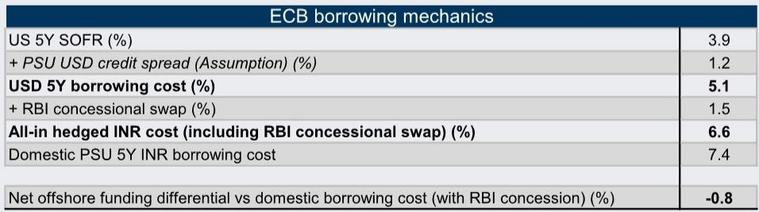
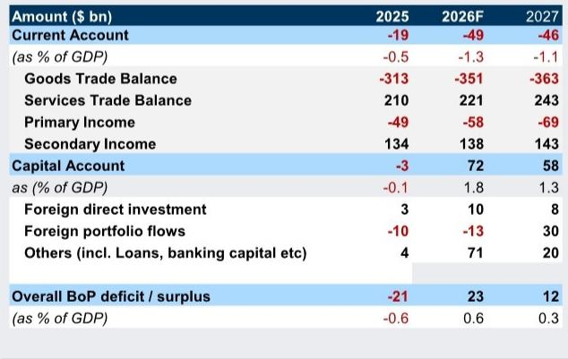

# GS：卢比贬值压力正在被结构性变量消化，而非基本面恶化

市场对印度卢比持续走弱的担忧，很可能高估了外部失衡的风险，而低估了印度国际收支结构正在发生的根本性变化。GS最新发布的《Asia in Focus：印度国际收支前景更为有利》报告，提出了一个与市场主流认知形成鲜明对比的判断：尽管中东地缘冲突推高油价、全球资本流动趋于谨慎，但印度在2026年第一季度仍录得约72亿美元的国际收支顺差，经常账户甚至出现70亿美元盈余。这份报告的核心贡献，不在于预测卢比何时见底，而在于系统性地拆解了印度外部账户中几个被市场忽视的“结构性缓冲器”——石油强度下降、进口弹性上升、黄金进口的政策可调节性，以及央行精心设计的一套资本流入激励机制。这些因素叠加在一起，意味着印度当前面临的国际收支压力，本质上不是一次不可持续的外部危机，而是一次由不确定性驱动的、可被政策工具对冲的周期性扰动。

GS据此大幅下调了印度经常账户赤字预测：2026年从GDP的2.0%下调至1.3%，2027财年从2.1%下调至1.7%。更重要的是，该机构预计印度在2026和2027财年每年都将录得约GDP 0.6%的国际收支顺差。这个判断如果成立，将意味着卢比的贬值空间比市场预期的要小得多，而印度资产的相对吸引力可能被系统性重估。

## 1. 市场误读了卢比走弱：这不是基本面恶化，而是预防性美元需求

GS在报告开头就直接点明了一个关键矛盾：卢比的近期弱势，看起来比国际收支基本面所暗示的要大。2026年第一季度，尽管面临能源冲击和资本流入放缓的担忧，印度的国际收支依然录得约72亿美元顺差。经常账户更是出现70亿美元盈余，背后是创纪录的侨汇流入、强劲的服务贸易顺差，以及低于预期的石油进口账单。

那么，卢比为什么还在走弱？GS的解释是：这主要反映了中东不确定性加剧背景下的预防性和投机性美元需求，而非印度外部基本面的恶化。这个区分至关重要。如果是基本面恶化驱动的贬值，政策空间有限，贬值可能持续；但如果只是不确定性和避险情绪驱动的短期需求冲击，那么随着地缘局势明朗化、央行政策工具生效，贬值压力就会自然缓解。

报告没有完全展开的一个问题是：预防性美元需求到底有多少是“可逆的”？如果中东冲突长期化，侨汇流入是否会从“预防性转移”转为“永久性外迁”？这个假设的验证，将是判断卢比中期走向的关键。

## 2. 石油冲击的影响正在被结构性降敏：印度不再是那个“油价一涨就受伤”的经济体

GS对印度石油进口的分析，是这份报告最具洞察力的部分之一。传统上，市场对印度外部脆弱性的担忧，很大程度上源于其作为石油净进口国的身份。但GS指出，印度石油消费强度（单位GDP的石油消耗）自1990年代以来持续下降，这反映了能效提升、交通电气化推进，以及经济增长向低能耗模式转型。

更关键的是，报告发现印度原油净进口量对油价的弹性已经发生了结构性变化。在疫情前，当布伦特原油价格超过约60美元/桶时，进口量开始下降；而现在的阈值已上移至约75-80美元/桶。这意味着印度经济对高油价的“忍耐力”提高了。同时，在油价超过80美元/桶后，进口量的下降幅度比以前更大——这种“非线性”响应，部分反映了国内燃料价格传导对需求的抑制作用。

GS的测算显示，燃料价格每上涨10%，未来12个月内汽油和柴油消费增速平均下降约3%。结合石油强度下降的趋势，该机构估计油价每上涨10%，净进口量将下降约6%。这意味着，即使油价维持在高位，印度石油进口账单的增幅也不会等比例扩大。

这里需要谨慎对待的是：石油需求的价格弹性在短期和中期可能表现不同。报告引用的数据主要基于历史相关性，但中东冲突导致的供应中断（如霍尔木兹海峡风险）可能使进口量下降更多是“被动”而非“主动”——这恰恰是报告承认但没有完全量化的一个不确定性。

## 3. 黄金进口：政策工具箱里还有一把可重复使用的钥匙

印度经常账户的另一个传统脆弱点是黄金进口。在地缘政治紧张时期，黄金作为避险资产的需求往往飙升，进一步恶化经常账户。但GS指出，印度政策制定者历史上曾多次使用进口关税和行政手段来抑制黄金进口，而且效果显著。

报告显示，关税上调通常在1-2个月后开始影响黄金进口量，5-6个月内进口量可下降40-50%。2026年5月的关税上调已经开始对进口和零售需求产生影响。GS据此将2026年黄金进口预测从640亿美元下调至560亿美元。

但报告也坦诚地指出了两个风险：一是地缘不确定性持续高企和黄金价格创纪录，可能使黄金进口的调整只是暂时的；二是更高的关税可能刺激非官方黄金进口。这个“灰色市场”问题在印度一直存在，但报告没有给出量化估算。如果非官方进口规模显著，官方国际收支数据可能高估改善程度。

## 4. 央行的“工具箱”远比市场想象的丰富：60亿美元额外资本流入的估算逻辑

GS认为，印度储备银行（RBI）近期推出的一揽子资本流入激励措施，其效果可能被市场低估。这些措施包括：为银行和准主权机构提供优惠外汇掉期利率以筹集美元资金、扩大外国投资者对政府证券的完全可进入路径、恢复出口收入汇回期限等。

报告估算，仅FCNR（B）存款计划一项，就可能带来300-500亿美元流入。加上外部商业借款和外国证券投资，RBI的整套措施预计可带来约600亿美元的额外资本流入。这个数字如果实现，将完全覆盖GS预测的经常账户赤字，并使印度录得国际收支顺差。

这里的关键问题是：这些资本流入是“有粘性”的还是“逐利性”的？FCNR（B）存款有期限限制，ECB需要偿还，证券投资更是高度敏感。报告指出，RBI可能会通过储备积累和缩减远期空头头寸来吸收这些流入，从而限制卢比大幅升值。这意味着，RBI的目标是“稳定”而非“推高”卢比——这为投资者提供了一个清晰的政策锚。

## 5. 报告尚未完全回答的关键问题：卢比会不会被低估？

GS明确表示，卢比在贸易加权基础上大致处于公允价值区间，因此不认为会有显著升值空间。但这里存在一个逻辑上的张力：如果国际收支持续顺差、资本流入超出预期，而RBI又通过干预来抑制升值，那么卢比是否可能被人为压低？被压低的卢比会不会反过来加剧输入性通胀，进而影响货币政策路径？

报告对这些二阶效应没有展开。此外，RBI的干预能力取决于其储备充足程度和远期头寸状况。报告提到了“解除短期远期头寸”，但没有量化RBI当前的净远期空头规模及其对干预可持续性的影响。这些未解问题，恰恰是投资者需要进一步跟踪的数据点。

## 6. 对观察框架的启示：从“脆弱性叙事”转向“韧性叙事”

综合GS的判断，投资者可能需要调整对印度的分析框架。过去几年，市场对印度的外部评估高度依赖“石油价格-经常账户赤字-卢比贬值”的线性叙事。但GS的报告揭示了一个更复杂的现实：石油强度下降、进口弹性上升、政策工具丰富、侨汇和软件服务出口成为稳定器——这些结构性变化正在改变印度的外部韧性。

这意味着，未来评估印度外部风险时，不能只看油价绝对水平，还要看印度的石油进口量对油价的响应函数是否已经改变；不能只看经常账户赤字，还要看资本账户的流入潜力；不能只看卢比汇率，还要看RBI的干预意愿和工具空间。

当然，这份报告也有其局限性。它假设中东冲突不会进一步升级到严重破坏霍尔木兹海峡通行的程度；它依赖历史弹性来预测未来行为，而历史可能无法完全涵盖极端情景；它对非官方黄金进口的估算缺失，可能使经常账户改善幅度被高估。这些不确定性，恰恰是完整报告附录中更详细讨论的内容。

---

GS这份报告的核心贡献，不是给出一个精确的卢比预测，而是提供了一个理解印度外部平衡的更新框架。在这个框架下，许多市场担忧的因素——高油价、资本外流、卢比贬值——都可以被结构性趋势和政策工具部分对冲。但框架的有效性，最终取决于那些尚未被充分验证的假设：预防性侨汇是否会持续、黄金关税能否抑制非法进口、RBI的资本流入措施能否在期限匹配上做到可持续。

这些问题，在完整报告的附录和敏感性分析中有更深入的展开。欢迎来星球微信群里继续讨论，我们将在社群中分享完整报告原文、GS的敏感性测算表格，以及针对上述未解问题的进一步推演。

Personal reading notes and learning share only. Not investment advice.

