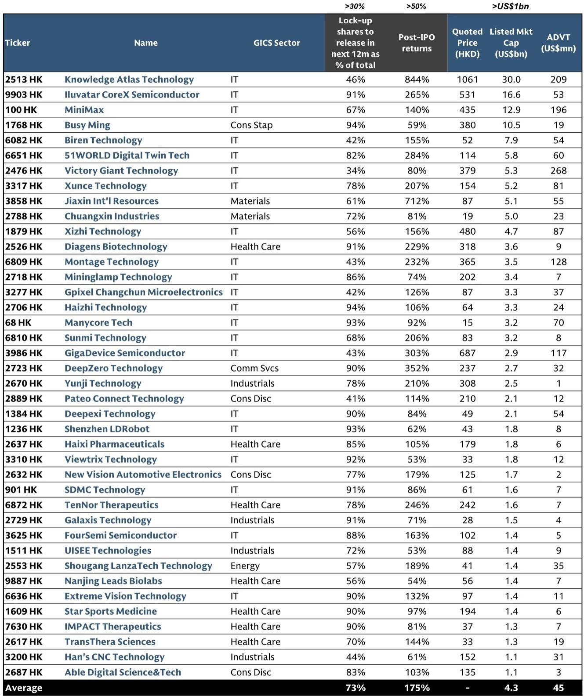
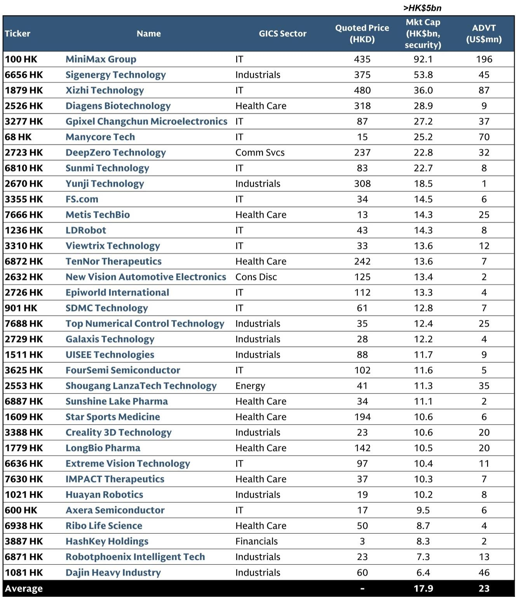
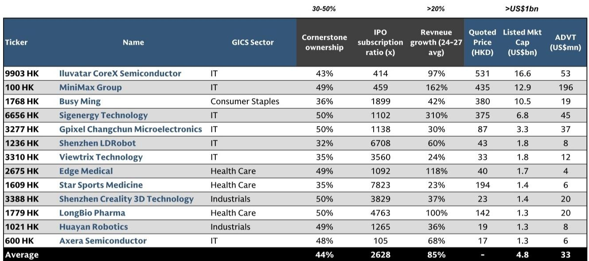

# GS：香港IPO市场的Alpha，藏在三个被低估的策略窗口里

香港IPO市场正在经历一次不容忽视的复苏。2025年至今，已有超过60只新股完成上市，首日平均涨幅45%，首月平均涨幅49%，三个月平均涨幅达到67%。这些数字本身已经足够吸引注意力，但GS这份研报的核心价值不在于确认“IPO赚钱”，而在于揭示了一个更关键的问题：在回报高度分化的市场中，什么样的信号能帮助你筛选出超额收益，什么样的风险会在锁定期后集中释放。

这份报告提出了三条清晰的交易策略路径，但真正值得产业决策者和投资者思考的，不是策略本身，而是这些策略背后反映出的市场结构性变化——IPO不再是简单的“打新”游戏，而是一个需要精细化判断的资产配置环节。

## 1. 大型股、独立上市与高认购倍数，构成了短期回报的最强信号

GS对2025年以来香港主板IPO的因子分析显示，有几个变量在统计上对首日及首周回报具有显著解释力。

首先是市值规模。大型股IPO在首日、首周、首月乃至三个月的时间窗口内，均持续跑赢小型股。这并非直觉上的“大盘股稳健”，而是反映了当前市场环境下，资金更倾向于向流动性好、机构覆盖充分的标的集中。小盘股虽然在极端行情下可能爆发，但概率和持续性都不及大盘股。

其次是上市类型。独立在港上市的公司，其表现显著优于A+H双重上市的公司。背后的逻辑并不复杂：双重上市的公司已经在A股市场有定价锚，香港市场的交易更多是套利或配置需求，而非纯粹的发现价格。而独立上市的公司，尤其是那些选择香港作为唯一上市地的企业，往往具备更强的融资诉求和市场沟通意愿，也更容易吸引增量资金。

第三个信号是零售超额认购倍数。GS的数据显示，高认购倍数的股票在上市首周内表现出更强的价格动能。但这个效应的持续性有限——到了六个月的时间窗口，其解释力几乎消失。这意味着，零售热度的价值在于“开盘情绪”，而不是“长期质量”。

综合来看，短期Alpha的捕捉，本质上是在寻找“大型、新鲜、受追捧”的标的。这三个条件同时满足时，首月回报的确定性显著提升。

## 2. 基石投资者的持股比例不是越高越好，30%到50%才是黄金区间

市场普遍将基石投资者的参与视为IPO质量的背书。GS的研报提供了一个更精细的视角：基石持股比例与后续回报之间并非线性关系。

数据显示，基石持股比例在30%到50%之间的公司，其上市后三个月的相对回报显著优于其他区间。低于30%意味着缺乏足够的长线资金背书，高于50%则会导致流通盘过小，反而抑制了二级市场的交易活跃度和价格发现功能。

这个发现对投资者的含义很直接：不要只看有没有基石，要看基石的持股比例是否合理。如果一家公司的基石持股超过50%，即便其基本面优秀，短期内也可能面临流动性折价。反之，如果基石持股过低，则需要警惕其是否缺乏机构认可。

报告还特别指出，国内基石投资者在锁定期后的卖出压力通常高于外资基石。这一点在后文讨论锁定期风险时会进一步展开。

## 3. 新经济行业的长期结构性优势，正在重塑IPO定价逻辑

GS将上市公司划分为“新经济”与“旧经济”两类，并发现新经济公司在三个月以上的持有期内，展现出持续的结构性超额收益。这个结论本身并不令人意外，但报告提供了一个更值得关注的细节：上市时的估值水平（以市销率衡量）并不是后续回报的显著决定因素。

换句话说，市场愿意为增长付费，而且这种付费意愿并不因为初始估值较高而减弱。GS的分析显示，高收入增长的公司——即便尚未盈利——在上市后的表现依然优于低增长的传统行业公司。这在生物科技和信息技术领域表现得尤为突出。

这意味着，对于新经济IPO，传统的“估值贵不贵”框架可能已经失效。投资者需要关注的是增长轨迹的可持续性，而不是静态的估值倍数。如果一家公司能够持续证明其收入增速高于行业平均，那么其IPO估值溢价在某种程度上是合理的，甚至是必要的。

## 4. 2740亿美元的锁定期解禁，是未来12个月最大的定价变量

这是整份报告中最具冲击力的数字。GS估算，未来12个月内，将有约2740亿美元的锁定期股份解禁进入香港市场，相当于香港市场总市值的4.4%。这个规模是历史最高水平，原因在于近年IPO的首发流通比例普遍较低，而上市后股价大幅上涨又放了解禁股份的市值。

历史数据显示，锁定期解禁后，股票价格在三个月内中位数下跌4%，六个月内下跌7%。但同样重要的是，回报的离散度极高。GS的分析指出，短期内（解禁后首周）表现的主要决定因素是“解禁股份占已发行股份的比例”。而中期（三个月到六个月）表现则取决于“解禁后的自由流通比例”和“解禁前的股价表现”。

这意味着，投资者不能简单地将所有解禁股视为同等风险。那些解禁比例小、解禁后流通盘仍然偏低、且前期涨幅不大的股票，可能受到的冲击相对有限。而那些解禁比例大、前期涨幅惊人、且国内基石持股比例高的股票，则需要高度警惕。

GS同时指出，这些解禁压力可以被指数纳入和南向通资金所对冲。但这需要具体的条件，并非自动发生。

## 5. 指数纳入与南向通资格，是锁定期后最重要的“安全垫”

报告指出，新上市股票在满足一定市值和流动性门槛后，可以快速纳入MSCI和恒生系列指数，最快仅需10个交易日。GS估算，追踪MSCI中国相关指数的被动资金规模约为1340亿美元，恒生指数和恒生科技指数的追踪资金规模分别为280亿美元和240亿美元。

这意味着，对于符合条件的大型IPO，指数纳入带来的被动买入可以在一定程度上对冲锁定期解禁的卖出压力。更重要的是，南向通资格为这些股票打开了内地流动性的闸门。历史数据显示，南向资金在股票纳入后的几个月内持续净买入，提供了结构性的价格支撑。

但这里有一个关键的限制条件：二次上市的公司通常不具备南向通资格。只有主要上市的公司才能享受这一红利。这进一步强化了前文提到的“独立上市优于双重上市”的判断。

## 报告尚未完全回答的关键问题：这些策略的可复制性能持续多久？

GS的研报提供了三个清晰的观察清单——潜在高回报新股名单、即将面临大规模解禁的股票名单、以及可能纳入南向通的候选名单。这些清单对于实战投资者具有直接参考价值。

但报告没有完全回答的问题是：当前IPO市场的强劲回报，在多大程度上是结构性的，在多大程度上是周期性的？2025年至2026年的IPO热潮，受益于流动性宽松、中国资产重估以及全球资金再配置等多重因素。如果这些条件发生变化，上述因子分析的结果是否仍然成立？

此外，报告对“新经济”的定义较为宽泛，涵盖了信息技术、医疗保健、可选消费等多个板块。但这些板块内部的商业模式差异巨大，其长期回报驱动因素也不尽相同。GS的分析提供了统计意义上的规律，但个体公司的基本面判断仍然需要更深入的研究。

最后，2740亿美元的解禁规模是一个总量概念，但实际卖出压力取决于市场环境和持有人意愿。如果市场情绪持续向好，部分持有人可能会选择持有而非卖出，实际冲击可能小于预期。反之，如果市场出现系统性调整，解禁压力可能被放大。

这些未解问题，正是深入阅读完整报告的价值所在。GS的原始研报中包含了对上述三个清单的具体股票名称、详细的因子回归数据、以及不同情景下的压力测试。这些内容无法在本文中一一展开，但对于真正希望在这个市场中捕捉Alpha的投资者来说，它们是必不可少的决策依据。

欢迎来星球微信群里继续讨论，我们会围绕这份报告的核心发现，结合最新的市场动态，持续跟踪这些策略的实战效果。

Personal reading notes and learning share only. Not investment advice.

