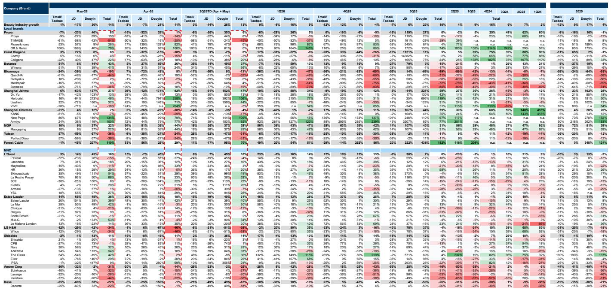
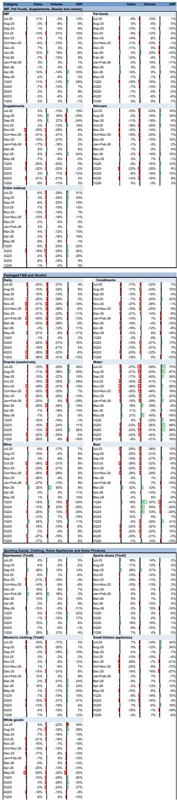
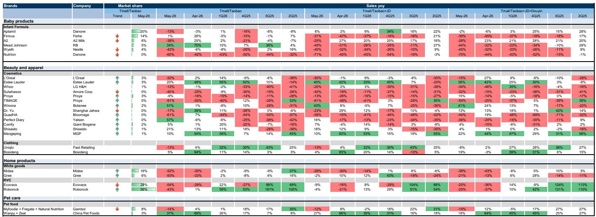

# GS：消费分化的本质不是需求疲软，而是品牌议价权的再分配

5月消费数据出炉，市场普遍关注的是“需求是不是又弱了”。但GS这份5月线上品牌追踪报告揭示了一个更值得深究的信号：品类层面的下滑与品牌层面的分化同时存在，且分化程度正在加剧。这并非简单的“消费降级”或“需求不足”所能概括。

真正的问题是：在平台补贴、政府刺激和618大促节奏的多重叠加下，哪些品牌有能力把外部变量转化为自身增长，哪些品牌正在失去定价权和渠道话语权。GS的数据表明，答案越来越取决于品牌在“全渠道运营”和“产品力溢价”上的真实能力，而非单纯依靠流量红利。

这份报告最值得关注的判断是：消费板块的投资逻辑正在从“赛道选择”切换到“品牌选择”。同一品类内，头部品牌的增速差距可以超过50个百分点。这意味着，未来的超额收益将更多来自对品牌个体竞争力的深度拆解，而非对宏观消费趋势的押注。

---

## 1. 五月线上消费的“假摔”背后，藏着结构性加速的品类

如果只看天猫、淘宝、京东三大平台的合并数据，5月消费表现确实令人担忧。女性服装勉强持平，运动鞋、美妆、保健品、乳制品、运动服饰、小家电、婴幼儿配方奶粉、啤酒、宠物食品、白电无一例外录得同比下滑，跌幅从2%到31%不等。

但GS的数据并没有停留在这一层。当纳入抖音渠道后，画面发生了根本性变化：美妆品类合并GMV同比增长14%，较4月的11%进一步加速。运动服饰和调味品的核心品牌GMV增速分别达到14%和47%，同样高于4月的9%和34%。

这意味着什么？传统电商平台的数据正在失去作为“消费温度计”的完整性。消费者正在大规模向内容电商迁移，而不同品牌对这一趋势的适应能力天差地别。那些在抖音上建立了有效运营体系的品牌，正在从这一渠道迁移中获益；而那些仍依赖传统货架电商的品牌，则面临流量枯竭的困境。

核心洞察：五月消费数据的“弱”是结构性的，而非总量的。真正的问题不是消费者不花钱，而是钱流向了不同的渠道和品牌。对于投资者而言，只看天猫京东数据已经不足以判断一个品牌的真实健康度。

## 2. 美妆领域正在上演“双轨分化”：本土品牌补贴反弹，国际品牌结构性领先

美妆是GS这份报告着墨最多的品类，也是最值得深入拆解的案例。

先看本土品牌。5月数据中，一批本土品牌出现明显反弹：林清轩同比增长110%，珀莱雅8%，巨子生物6%，上美集团7%。GS认为，这一反弹部分得益于一季度妇女节基数偏弱，以及平台和地方政府补贴力度的加大。

但反弹不等于反转。同期，华熙生物下滑19%，逸仙电商下滑36%。同样是本土品牌，业绩差距可以超过100个百分点。这提示我们：补贴红利并非雨露均沾，只有那些在产品力、品牌力和渠道运营上已经完成积累的企业，才能真正承接住外部刺激带来的增量。

再看国际品牌。雅诗兰黛集团同比增长36%，欧莱雅16%，资生堂11%。GS特别指出，雅诗兰黛在高端市场的表现尤为突出，欧莱雅的皮肤学级护肤品则成为其增长引擎。这些国际品牌的增长并非依赖补贴，而是源于产品组合的高端化和品类结构的优化。

进入6月前8天，抖音渠道的数据进一步印证了这一分化：欧莱雅和雅诗兰黛集团继续保持50%以上的同比增长，而本土品牌中只有毛戈平以60%以上的增速迎头赶上，巨子生物在低基数上加速至13%。

GS没有明说，但数据指向一个清晰的结论：美妆品类的竞争已经从“流量争夺战”进入“品牌价值战”。补贴可以带来短期脉冲，但无法改变品牌力的根本差距。那些能够同时驾驭高端化、功效化和全渠道运营的品牌，无论本土还是国际，都在获得结构性增长。

## 3. 运动服饰的“618前置效应”提醒我们：月度数据需要重新审视节奏

运动服饰品类的数据同样呈现出强烈的分化信号。

5月，在天猫、京东和抖音合并口径下，部分户外品牌如始祖鸟、迪桑特以及高端品牌Lululemon出现增速放缓，GS提示这在一定程度上受高基数影响。与此同时，阿迪达斯、李宁、安踏、斐乐、波司登、萨洛蒙等品牌则从4月加速，很可能受益于618购物节的促销前置。

这里有一个关键的方法论问题：618大促的节奏正在改变月度数据的可比性。部分品牌选择在5月中下旬就开始促销活动，将本应属于6月的销售前置到5月。这会导致5月数据虚高、6月数据相对偏弱，但合并看两个月的表现才能反映真实趋势。

GS在报告中明确提醒：“建议结合5-6月销售来评估整体表现。”这是一个重要的分析框架调整。对于依赖月度数据进行投资的决策者而言，如果不对促销节奏进行校准，很容易误判品牌的真实增长动能。

更深层的含义是：品牌对促销节奏的掌控能力本身，正在成为一项竞争壁垒。那些能够精准匹配平台资源、消费者心理和库存管理的品牌，可以在不牺牲利润率的前提下实现销售的平滑分布；而那些被动跟随大促节奏的品牌，则可能陷入“促销依赖—利润侵蚀—品牌力下降”的恶性循环。

## 4. 报告尚未完全回答的关键问题：补贴退出后的真实需求成色

GS的报告提供了丰富的数据，但有一个问题没有完全展开：当前的增长在多大程度上是补贴驱动的，又在多大程度上反映了真实需求的改善？

从美妆品类的反弹来看，平台补贴和地方政府消费券确实起到了催化作用。但补贴是有期限的。一旦补贴力度减弱或退出，那些依靠补贴拉动的销售能否持续？这是一个尚未验证的关键假设。

同样需要警惕的是抖音渠道的高速增长。抖音的流量分配机制与传统电商有本质区别，它更依赖内容创意和算法推荐，而非品牌自身的搜索流量。这意味着，在抖音上获得高增长的品牌，可能并不具备同等水平的品牌忠诚度和复购能力。一旦平台调整算法规则或流量成本上升，这些品牌可能会面临增长失速的风险。

另一个未解之谜是：国际品牌在高端市场的优势能否持续？雅诗兰黛和欧莱雅的强劲表现，部分得益于中国消费者对高端护肤品的持续需求。但如果宏观经济环境进一步承压，高端消费是否会出现降级？GS的数据没有给出答案，但这是一个值得持续跟踪的变量。

## 5. 投资者的观察框架：从“买赛道”转向“买个体”，关注三个核心指标

基于GS的这份报告，我们可以提炼出一个更实用的分析框架，用于评估消费品牌的投资价值。

第一，全渠道运营能力。数据已经证明，单一渠道的数据无法反映品牌全貌。投资者需要关注品牌在不同平台（天猫、京东、抖音、得物等）的布局深度和运营效率，特别是内容电商的渗透率。如果一个品牌在抖音的GMV占比持续提升，且增速高于行业均值，这通常意味着它正在获取结构性增量。

第二，价格带的稳定性。GS的数据显示，在多数品类中，ASP（平均售价）的波动比GMV更能反映品牌力。那些能够在促销环境中维持甚至提升ASP的品牌，往往拥有更强的定价权和产品力。相反，ASP持续下滑的品牌，即使GMV表现尚可，也可能面临品牌力稀释的风险。

第三，补贴依赖度。投资者需要区分“补贴驱动的增长”和“产品力驱动的增长”。一个简单的方法是观察品牌在非促销期间的销售表现。如果品牌在618、双11等大促之外的日常销售也能保持稳健增长，说明其增长更具内生性；如果增长高度集中在促销节点，则补贴退出的风险不容忽视。

这三个指标结合起来，可以帮助投资者从GS报告的海量数据中，识别出真正具备长期竞争力的品牌，而不是被短期促销数据所迷惑。

---

GS的这份报告揭示了一个正在发生的投资范式转变：消费行业的机会不再属于“赛道”，而属于“个体”。在一个高度分化、渠道碎片化、消费者主权崛起的市场里，宏观判断的价值正在下降，微观洞察的价值正在上升。

那些能够同时在全渠道运营、产品力升级和品牌价值建设上做到位的企业，无论规模大小，都可能在分化中脱颖而出。而那些仍然依赖单一渠道、促销驱动或流量红利的品牌，即使身处热门赛道，也可能面临增长天花板。

报告中的许多数据背后还有更深层的含义值得探讨——比如不同品类的ASP变化如何反映消费升级的真实方向，比如抖音渠道的利润结构是否可持续，又比如618合并数据将如何验证或推翻当前的判断。这些内容在完整报告中都有更详细的展开。

欢迎来星球微信群里继续讨论这些未解问题。我们会在群内分享完整的研报原文和更细致的图表解读，也会持续跟踪6月合并数据出来后的最新信号。

Personal reading notes and learning share only. Not investment advice.

