# Supportive liquidity conditions continued in May, though rising pressure ahead

Equity Strategy

## Launching the monthly product China Flow Lens

We are launching a new product to track fund flows, positioning, and capital supply-demand indicators in China's equity market. The report aims to provide a structured framework to assess evolving liquidity conditions and their trading implications.

## A better capital supply/demand mix for A-shares

Overall, liquidity conditions continue to favor A-shares over Hong Kong equities. While domestic liquidity remains strong and the restock of “national team” capital provides downside support for A-shares, Hong Kong faces near-term headwinds from slowing southbound inflows, tighter cross-border capital rules, and an upcoming wave of lock-up expirations. As such, despite faster style and sector rotations since May, we expect A-shares to remain relatively better supported than H-shares in the coming months.

## Liquidity support in the near term, rising pressures ahead

Capital flows to foreign-domiciled China equity funds tracked by EPFR accelerated in May, in line with narrowing UW in China among active EM funds in Apr. At the same time, China's domestic ETFs – often used by the “national team” for market support – continued to see heavy redemptions over the past month. However, with ETF outflows YTD already exceeding the inflows seen in 2023-25, residual selling pressure could ease into 2H26, in our view. On the capital supply side, stronger hybrid fund issuances and share buybacks supported A-share liquidity in May, lifting ADTV to \~RMB3.2tn. However, southbound flows to Hong Kong turned negative, with a net outflow of HKD3.6bn (vs. +HKD56.5bn in Apr). On the demand side, IPO financing and restricted share unlocks eased notably. That said, the upcoming CXMT IPO and a surge in Hong Kong lock-up expirations – projected at \~HKD270bn in Jul and \~HKD400bn in Sep by WIND – are likely to exert liquidity pressure on A-share and Hong Kong markets in the next 3 months.

Exhibit 1: Capital supply dynamics still favor A shares vs. Hong Kong stocks  
A-share and Hong Kong secondary market liquidity dashboard

<table><tr><td>A-share market</td><td>May-26</td><td>Apr-26</td><td>Imp.</td><td>Hong Kong</td><td>May-26</td><td>Apr-26</td><td>Imp.</td></tr><tr><td>ADTV (RMB bn)</td><td>3182.5</td><td>2343.8</td><td>▲</td><td>ADTV (HKD bn)</td><td>292.8</td><td>253.4</td><td>▲</td></tr><tr><td>Margin trading as % of MT</td><td>10.1%</td><td>9.8%</td><td>▼</td><td></td><td></td><td></td><td></td></tr><tr><td>New fund issuances (bn)</td><td>70.1</td><td>46.4</td><td>▲</td><td>Share buybacks (HKD bn)</td><td>22.0</td><td>13.6</td><td>▲</td></tr><tr><td>Share buybacks (RMB bn)</td><td>17.1</td><td>11.0</td><td>▲</td><td>SB capital flows (HKD bn)</td><td>-3.6</td><td>56.5</td><td>▼</td></tr><tr><td>NB trading as % of turnover</td><td>6.2%</td><td>6.1%</td><td>▼</td><td></td><td></td><td></td><td></td></tr><tr><td>4-Week fund flows (USD mn)</td><td>347.4</td><td>51.6</td><td>▲</td><td>4-Week fund flows (USD mn)</td><td>587.5</td><td>824.6</td><td>▼</td></tr><tr><td>IPO financing (RMB bn)</td><td>11.1</td><td>21.2</td><td>▲</td><td>IPO financing (HKD bn)</td><td>13.4</td><td>43.1</td><td>▲</td></tr><tr><td>Lock-up expirations (RMB bn)</td><td>184.9</td><td>303.8</td><td>▲</td><td>Lock-up expirations (HKD bn)</td><td>26.9</td><td>27.8</td><td>▲</td></tr><tr><td>Share reductions (RMB bn)</td><td>49.3</td><td>37.1</td><td>▼</td><td></td><td></td><td></td><td></td></tr></table>

Source: WIND, EPFR. Note: ▲/ ▶/ ▼ denote whether an indicator's movement is supportive, neutral, adverse to market liquidity relative to the previous month. A ▶ is assigned when the MoM change falls within 5%. See full exhibit on page 8  
BofA GLOBAL RESEARCH

## 12 June 2026

Equity Strategy

China

Patrick Pan, CFA >>

Research Analyst

BofA (Hong Kong)

+852 3508 4601

patrick.pan2@bofa.com

Winnie Wu >>

Research Analyst

BofA (Hong Kong)

+852 3508 3058

winnie.wu@bofa.com

Gina Wu >>

Strategist

BofA (Hong Kong)

+852 3508 8008

gina.wu@bofa.com

## Glossary

ADR: American depositary receipt  
ADTV: average daily trading value

CGB: China government bond

EM: emerging market

Imp.: Impact

MLF: Medium-term lending facility

MT: market turnover

"National team": state-backed institutional investors that step in to stabilize the market during periods of sharp volatility

OMO: open market operations

OW: overweight

PBOC: People's Bank of China

SB/NB: southbound/northbound

UW: underweight

## Supportive liquidity conditions continue

## Launching the new product of China Flow Lens

We are launching a monthly strategy product to track liquidity dynamics and investor sentiment in China's stock market. By integrating fund flows, positioning, and indicators on both capital supply and demand, the report offers a structured framework for assessing how liquidity and sentiment evolve – and what it implies for trading direction. Over the past decade, fund flow data have shown a strong correlation with China equities, particularly during market reversals triggered by major events. For instance, flows to foreign-domiciled China equity funds turned positive swiftly during the post-COVID reopening in late 2022 and again amid policy easing in September 2024.

Exhibit 2: Fund flow data show a strong correlation with China stocks  
Monthly capital flows to foreign-domiciled China funds (USD bn) vs. MSCI China and CSI 300 indices  

bar-line hybrid chart

| Date   | Fund flows (RHS) | MSCI China | CSI 300 |
|--------|------------------|----------|---------|
| Jan-17 | 1000             | 1000     | 1000    |
| Jul-17 | 1100             | 1200     | 1100    |
| Jan-18 | 1200             | 1600     | 1200    |
| Jul-18 | 1300             | 1400     | 1300    |
| Jan-19 | 1400             | 1300     | 1400    |
| Jul-19 | 800              | 1200     | 1200    |
| Jan-20 | 1200             | 1300     | 1300    |
| Jul-20 | 1500             | 1600     | 1500    |
| Jan-21 | 1800             | 1900     | 1600    |
| Jul-21 | 1400             | 1700     | 1500    |
| Jan-22 | 1300             | 1500     | 1400    |
| Jul-22 | 1600             | 700      | 1300    |
| Jan-23 | 1400             | 1200     | 1200    |
| Jul-23 | 1200             | 900      | 1100    |
| Jan-24 | 1100             | 800      | 1000    |
| Jul-24 | 900              | 700      | 900     |
| Jan-25 | 50               | 60       | 80      |
| Jul-25 | 1300             | 1400     | 1300    |
| Jan-26 | 1200             | 1500     | 1400    |

Source: WIND, EPFR  
BofA GLOBAL RESEARCH

## Fund flows and market allocation: recovering inflows – but for how long?

Following a slowdown in April this year, capital flows into foreign-domiciled China equity funds, tracked by EPFR, re-accelerated in May, with rolling 4-week net flows to active China funds turning positive again after March. By market, both A-share and Hong Kong-focused China funds saw solid inflows. In contrast, funds benchmarking the MSCI China Index continued to experience redemptions over the past 3 months, albeit at a moderating pace. While EPFR's coverage represents only a relatively small portion of the overall market, we believe the data still provides a useful indication of the broad direction of fund flows in the short term.

Exhibit 3: Foreign investors revisit A-share and Hong Kong stocks, but remain cautious on Chinese ADRs  
Weekly capital flows to foreign-domiciled China funds benchmarking against MSCI China, A-share indices, and Hong Kong indices (USD mn)

<table><tr><td>Benchmarks</td><td>4-Mar</td><td>11-Mar</td><td>18-Mar</td><td>25-Mar</td><td>1-Apr</td><td>8-Apr</td><td>15-Apr</td><td>22-Apr</td><td>29-Apr</td><td>6-May</td><td>13-May</td><td>20-May</td><td>27-May</td></tr><tr><td>China (Total)</td><td>2,194.9</td><td>-2,126.5</td><td>-1,106.9</td><td>1,723.4</td><td>-2,439.4</td><td>-271.9</td><td>328.9</td><td>385.5</td><td>-371.1</td><td>-1,016.7</td><td>935.3</td><td>2,809.8</td><td>-1,931.7</td></tr><tr><td>MSCI China</td><td>-302.0</td><td>-563.9</td><td>-229.9</td><td>-29.8</td><td>-209.8</td><td>30.4</td><td>67.0</td><td>-430.0</td><td>-492.8</td><td>-27.5</td><td>-152.0</td><td>-41.8</td><td>-35.2</td></tr><tr><td>A-share indices</td><td>-151.8</td><td>-423.0</td><td>-111.2</td><td>-110.0</td><td>-152.8</td><td>-41.9</td><td>205.1</td><td>-80.2</td><td>-31.3</td><td>3.1</td><td>307.0</td><td>120.2</td><td>-82.9</td></tr><tr><td>H-share indices</td><td>2,721.6</td><td>-914.0</td><td>-437.0</td><td>2043.8</td><td>-1,976.4</td><td>-259.1</td><td>262.9</td><td>470.6</td><td>350.1</td><td>-900.4</td><td>103.9</td><td>1,733.8</td><td>-349.7</td></tr></table>

Source: EPFR. Note: A-share index benchmarks include MSCI China A Share, MSCI China A 50, CSI 300, SSE Composite Index, SSE 50, Shenzhen ChiNext, and CSI 800. H-share index benchmarks include HSI, Hang Seng China Enterprise, and Hang Seng Tech. China (total) represents a broad universe of all EPFR-tracked foreign-domiciled funds with a China investment mandate, whose benchmarks also include other China-specific indices or multi-market indices (i.e., $70\% * \mathrm{CSI}300 + 30\% * \mathrm{HSI}$ ). AUM for funds linked to China (total)/MSCI China/A-share indices/H-share indices was USD194.4bn/USD27.7bn/USD16.1bn/USD47.0bn as of May 27  
BofA GLOBAL RESEARCH

It is also worth noting that heavy redemptions of China's domestic ETFs tracking broad market indices (i.e., SSE 50, CSI 300, CSI 500, CSI 1000, and ChiNext Index) – a key trading channel used by China's “national team” (Note: “national team” refers to state-backed institutional investors that step in to stabilize the market during periods of sharp declines or volatility) in market aid – persisted over the past month. However, against the market rebound over the past 2 years, cumulative YTD outflows from domestic ETFs have exceeded the inflows seen in 2023-25, suggesting that prior support has been largely unwound and that selling pressure could gradually ease in 2H26. While the retreat of “national team” weighed on A-share sentiment during the sharp rally in Jan 2026, looking ahead, it should reserve policy capacity for future market support in case of potential market turbulence, in our view.

Exhibit 4: Stock selling by China's "national team" continues  
Cumulative capital flows to China's domestic ETF funds (USD bn)  
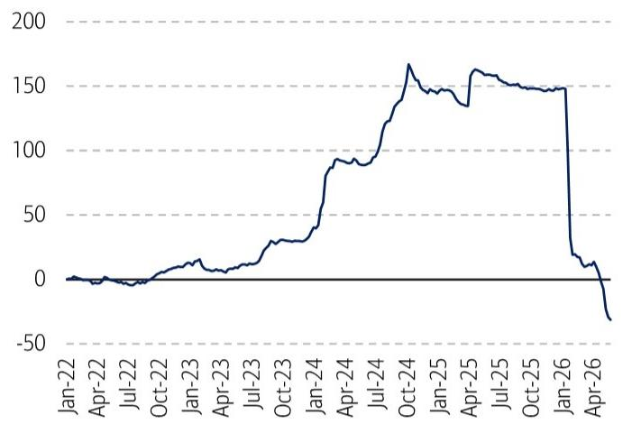

line chart

| Date | Value |
|---|---|
| Jan-22 | 0 |
| Apr-22 | -5 |
| Jul-22 | -10 |
| Oct-22 | 5 |
| Jan-23 | 10 |
| Apr-23 | 5 |
| Jul-23 | 15 |
| Oct-23 | 30 |
| Jan-24 | 80 |
| Apr-24 | 90 |
| Jul-24 | 100 |
| Oct-24 | 160 |
| Jan-25 | 145 |
| Apr-25 | 160 |
| Jul-25 | 155 |
| Oct-25 | 150 |
| Jan-26 | 150 |
| Apr-26 | -30 |

Source: EPFR  
BofA GLOBAL RESEARCH

Exhibit 5: SSE new account opening +11% MoM in May  
New account openings at the Shanghai Stock Exchange ('000)  
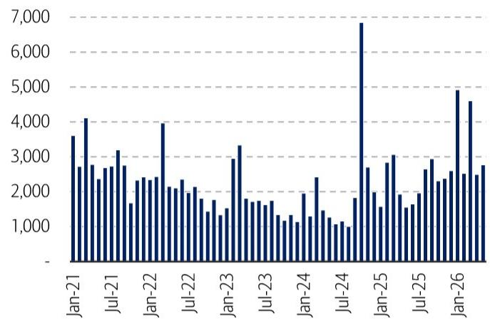

bar chart

| Date | Value |
|---|---|
| Jan-21 | 3600 |
| Feb-21 | 2700 |
| Mar-21 | 4100 |
| Apr-21 | 2800 |
| May-21 | 2500 |
| Jun-21 | 2700 |
| Jul-21 | 3200 |
| Aug-21 | 2800 |
| Sep-21 | 1700 |
| Oct-21 | 2300 |
| Nov-21 | 2400 |
| Dec-21 | 2300 |
| Jan-22 | 4000 |
| Feb-22 | 2100 |
| Mar-22 | 2300 |
| Apr-22 | 2400 |
| May-22 | 2100 |
| Jun-22 | 2300 |
| Jul-22 | 1900 |
| Aug-22 | 1800 |
| Sep-22 | 1700 |
| Oct-22 | 1600 |
| Nov-22 | 1500 |
| Dec-22 | 1400 |
| Jan-23 | 3300 |
| Feb-23 | 1800 |
| Mar-23 | 1700 |
| Apr-23 | 1800 |
| May-23 | 1700 |
| Jun-23 | 1600 |
| Jul-23 | 1500 |
| Aug-23 | 1400 |
| Sep-23 | 1300 |
| Oct-23 | 1400 |
| Nov-23 | 1500 |
| Dec-23 | 1600 |
| Jan-24 | 1900 |
| Feb-24 | 1800 |
| Mar-24 | 1700 |
| Apr-24 | 1600 |
| May-24 | 1500 |
| Jun-24 | 1400 |
| Jul-24 | 1300 |
| Aug-24 | 1200 |
| Sep-24 | 1100 |
| Oct-24 | 1000 |
| Nov-24 | 900 |
| Dec-24 | 800 |
| Jan-25 | 6800 |
| Feb-25 | 2700 |
| Mar-25 | 1900 |
| Apr-25 | 1800 |
| May-25 | 1700 |
| Jun-25 | 1600 |
| Jul-25 | 1500 |
| Aug-25 | 1600 |
| Sep-25 | 1700 |
| Oct-25 | 1800 |
| Nov-25 | 1900 |
| Dec-25 | 2600 |
| Jan-26 | 5900 |
| Feb-26 | 4600 |
| Mar-26 | 4500 |
| Apr-26 | 4400 |
| May-26 | 4300 |
| Jun-26 | 4400 |
| Jul-26 | 4500 |
| Aug-26 | 4600 |
| Sep-26 | 4700 |
| Oct-26 | 4800 |
| Nov-26 | 4900 |
| Dec-26 | 5800 |

Source: WIND. Note: This indicator is not included in our dashboard given the uncertainty around its release timing.  
BofA GLOBAL RESEARCH

In the charts below, we examine global EM funds' market allocations as of April 2026, which better reflect global fund managers' positioning than fund flows. According to the EPFR data, active funds notably expanded their exposure to South Korea and Taiwan stocks in April, funded by reductions in China and India holdings. However, these shifts can be distorted by market cap movements in other markets as well as existing positions. To mitigate such impact, we compare market exposure of active funds vs. passive funds (as proxies of market weights) and track how the gap evolves MoM.

Overall, we find active global EM funds' underweights in China and Taiwan actually narrowed in April, while underweights in India widened. Meanwhile, we observed that global EM fund managers turned more constructive on South Korea.

Exhibit 6: EM funds' exposure to South Korea and Taiwan stocks soar  
Market allocations by active global EM funds (%)  
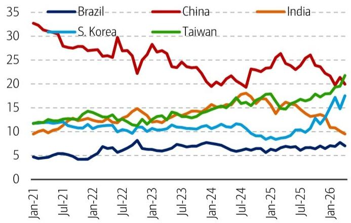

line chart

| Date | Brazil | China | India | S. Korea | Taiwan |
|---|---|---|---|---|---|
| Jan-21 | 4.5 | 32.5 | 9.5 | 11.5 | 11.5 |
| Jul-21 | 4.8 | 30.0 | 10.5 | 11.0 | 12.0 |
| Jan-22 | 4.0 | 27.0 | 11.5 | 10.5 | 13.0 |
| Jul-22 | 6.0 | 29.0 | 12.5 | 10.0 | 12.5 |
| Jan-23 | 6.5 | 22.0 | 13.5 | 10.5 | 12.0 |
| Jul-23 | 7.0 | 27.0 | 14.0 | 11.0 | 13.0 |
| Jan-24 | 7.5 | 23.0 | 15.0 | 11.5 | 14.0 |
| Jul-24 | 6.5 | 20.0 | 17.0 | 10.5 | 16.0 |
| Jan-25 | 6.0 | 26.0 | 14.5 | 9.0 | 17.5 |
| Jul-25 | 6.5 | 24.0 | 13.0 | 10.5 | 18.0 |
| Jan-26 | 7.0 | 20.0 | 9.5 | 17.0 | 21.0 |

Source: EPFR  
BofA GLOBAL RESEARCH

Exhibit 7: Active funds reduce their UW positions on China  
Active and passive global EM funds' exposure to China stocks $(\%)$  
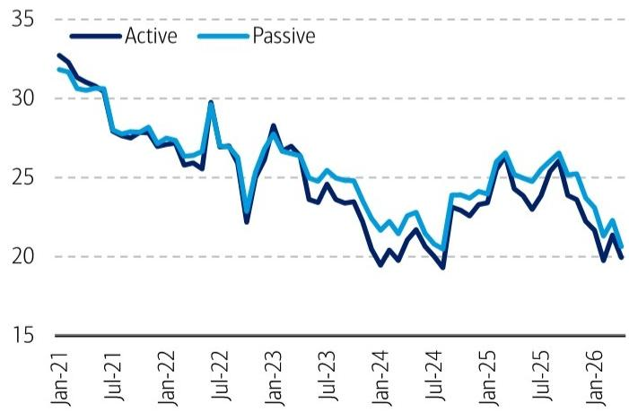

line chart

| Date   | Active | Passive |
|--------|--------|---------|
| Jan-21 | 33.0   | 32.0    |
| Jul-21 | 30.0   | 29.0    |
| Jan-22 | 27.0   | 28.0    |
| Jul-22 | 26.0   | 30.0    |
| Jan-23 | 28.0   | 27.0    |
| Jul-23 | 24.0   | 25.0    |
| Jan-24 | 20.0   | 21.0    |
| Jul-24 | 19.0   | 20.0    |
| Jan-25 | 26.0   | 27.0    |
| Jul-25 | 25.0   | 26.0    |
| Jan-26 | 20.0   | 21.0    |

Source: EPFR  
BofA GLOBAL RESEARCH

Exhibit 8: Active funds reduce their UW positions on Taiwan  
Active and passive global EM funds' exposure to Taiwan stocks (%)  
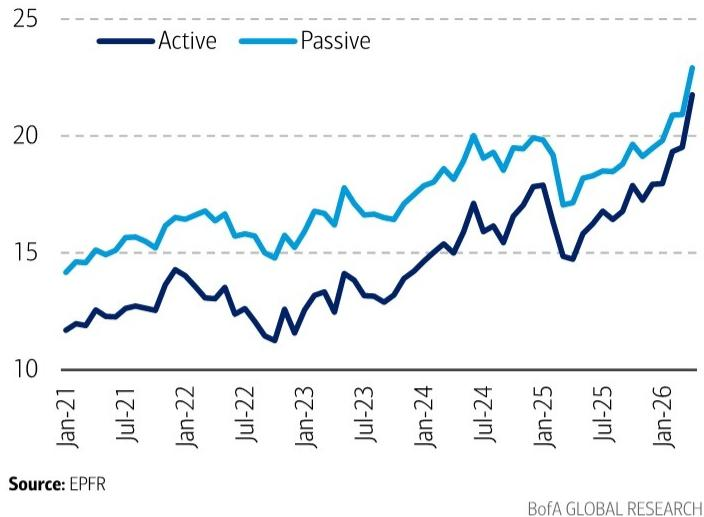

line chart

| Date   | Active | Passive |
|--------|--------|---------|
| Jan-21 | 11.5   | 14.0    |
| Jul-21 | 12.5   | 15.5    |
| Jan-22 | 14.0   | 16.5    |
| Jul-22 | 11.0   | 15.0    |
| Jan-23 | 13.0   | 17.0    |
| Jul-23 | 13.5   | 16.5    |
| Jan-24 | 15.0   | 18.0    |
| Jul-24 | 17.0   | 20.0    |
| Jan-25 | 18.0   | 19.5    |
| Jul-25 | 16.0   | 18.5    |
| Jan-26 | 22.0   | 23.0    |

Exhibit 9: Active funds increase their OW positions on South Korea  
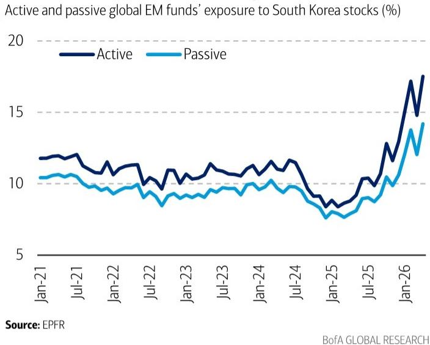

line chart

| Date   | Active | Passive |
|--------|--------|---------|
| Jan-21 | 11.5   | 10.5    |
| Jul-21 | 11.8   | 10.3    |
| Jan-22 | 11.2   | 9.8     |
| Jul-22 | 10.5   | 9.5     |
| Jan-23 | 10.8   | 9.7     |
| Jul-23 | 11.0   | 9.9     |
| Jan-24 | 11.3   | 10.1    |
| Jul-24 | 11.5   | 9.8     |
| Jan-25 | 8.5    | 7.5     |
| Jul-25 | 9.5    | 8.5     |
| Jan-26 | 17.0   | 14.0    |

Exhibit 10: Active funds increase their UW positions on India  
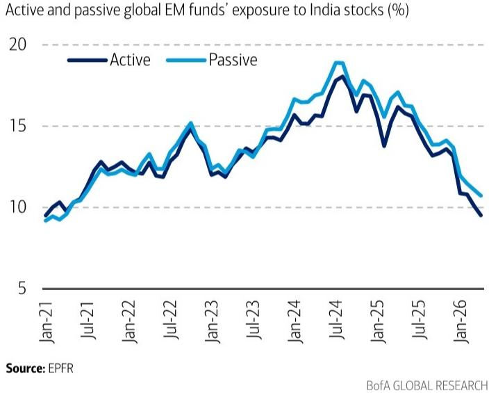

line chart

Active and passive global EM funds' exposure to India stocks (%)
| Date | Active (%) | Passive (%) |
|---|---|---|
| Jan-21 | 9.5 | 9.3 |
| Jul-21 | 12.8 | 12.5 |
| Jan-22 | 12.2 | 12.0 |
| Jul-22 | 14.8 | 15.0 |
| Jan-23 | 12.0 | 12.5 |
| Jul-23 | 13.5 | 13.8 |
| Jan-24 | 15.0 | 16.0 |
| Jul-24 | 17.8 | 18.8 |
| Jan-25 | 13.8 | 16.5 |
| Jul-25 | 15.5 | 16.0 |
| Jan-26 | 10.0 | 10.5 |
Source: EPFR
BofA GLOBAL RESEARCH

Exhibit 11: Active funds reduce their UW positions on Brazil  
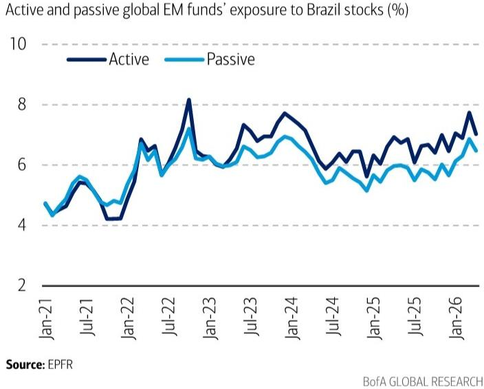

line chart

| Date   | Active | Passive |
|--------|--------|---------|
| Jan-21 | 4.5    | 4.3     |
| Jul-21 | 5.5    | 5.2     |
| Jan-22 | 4.0    | 4.8     |
| Jul-22 | 6.8    | 6.5     |
| Jan-23 | 8.2    | 7.0     |
| Jul-23 | 7.5    | 6.8     |
| Jan-24 | 7.8    | 7.0     |
| Jul-24 | 6.5    | 5.8     |
| Jan-25 | 6.0    | 5.5     |
| Jul-25 | 6.8    | 6.0     |
| Jan-26 | 7.8    | 6.8     |

## Capital supply: share buybacks higher; southbound flows slowing

New mutual funds continue to be well received by investors in mainland China. While equity fund issuances were broadly flat MoM, hybrid fund issuances rose to a 4-month high of 48.1bn shares in May. New account openings at the SSE also rose 11% MoM. Meanwhile, listed companies continue to act as incremental liquidity providers via share buybacks, dividend payouts, and broader “market value management” initiatives. Following a brief slowdown in early 2026, share buybacks across both A-share and Hong Kong markets have picked up since March, reaching RMB17.1bn and HKD22.0bn respectively in May—marking the highest levels in 12 and 16 months.

On the Stock Connect front, northbound trading remained stable, accounting for \~6.1-6.4% of A-share daily turnover in May. However, southbound capital flows from China mainland to Hong Kong notably slowed to -HKD3.6bn over the past month, versus an inflow of HKD56.5bn in April. This is consistent with investors' accelerating exit from HK equity ETFs listed in mainland China, which saw a record level of redemptions in the week of May 29. In our view, the reallocation toward A-share AI-related opportunities amid the ChiNext rally likely contributed to this shift.

Exhibit 12: Hybrid fund issuances almost double MoM
Issuances of new mutual funds (bn shares)  
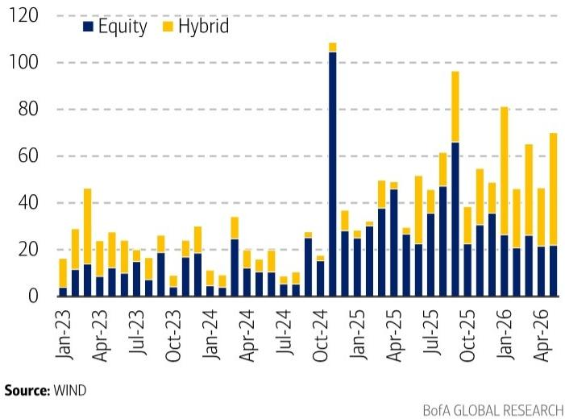

stacked bar chart

| Month | Equity | Hybrid |
|---|---|---|
| Jan-23 | 3 | 15 |
| Feb-23 | 12 | 28 |
| Mar-23 | 8 | 45 |
| Apr-23 | 11 | 24 |
| May-23 | 9 | 17 |
| Jun-23 | 14 | 10 |
| Jul-23 | 6 | 15 |
| Aug-23 | 18 | 8 |
| Sep-23 | 3 | 8 |
| Oct-23 | 17 | 10 |
| Nov-23 | 18 | 14 |
| Dec-23 | 4 | 8 |
| Jan-24 | 3 | 8 |
| Feb-24 | 12 | 14 |
| Mar-24 | 10 | 10 |
| Apr-24 | 12 | 14 |
| May-24 | 8 | 10 |
| Jun-24 | 6 | 8 |
| Jul-24 | 5 | 8 |
| Aug-24 | 15 | 10 |
| Sep-24 | 15 | 10 |
| Oct-24 | 105 | 5 |
| Nov-24 | 27 | 16 |
| Dec-24 | 26 | 10 |
| Jan-25 | 26 | 8 |
| Feb-25 | 30 | 10 |
| Mar-25 | 38 | 16 |
| Apr-25 | 45 | 16 |
| May-25 | 26 | 16 |
| Jun-25 | 21 | 16 |
| Jul-25 | 35 | 16 |
| Aug-25 | 46 | 19 |
| Sep-25 | 65 | 37 |
| Oct-25 | 21 | 16 |
| Nov-25 | 30 | 19 |
| Dec-25 | 35 | 19 |
| Jan-26 | 26 | 37 |
| Feb-26 | 25 | 37 |
| Mar-26 | 21 | 45 |
| Apr-26 | 21 | 59 |
Source: WIND
BofA GLOBAL RESEARCH

Exhibit 14: A-share buybacks hit the 12-month high Share buybacks value in the A-share market (RMB bn)  
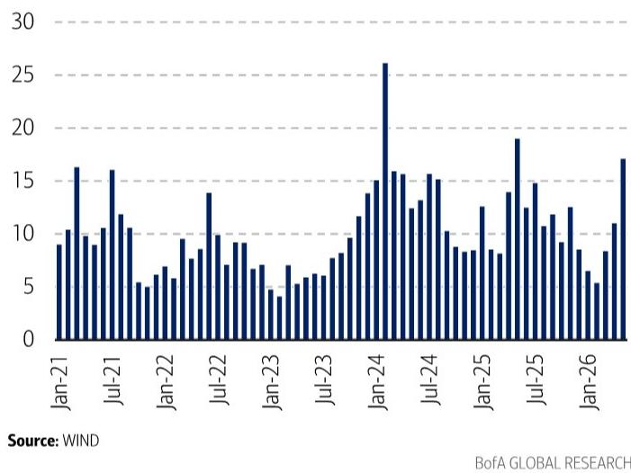

bar chart

| Date | Value |
|---|---|
| Jan-21 | 9 |
| Feb-21 | 10 |
| Mar-21 | 16 |
| Apr-21 | 10 |
| May-21 | 9 |
| Jun-21 | 10 |
| Jul-21 | 16 |
| Aug-21 | 11 |
| Sep-21 | 10 |
| Oct-21 | 5 |
| Nov-21 | 6 |
| Dec-21 | 7 |
| Jan-22 | 6 |
| Feb-22 | 9 |
| Mar-22 | 8 |
| Apr-22 | 7 |
| May-22 | 14 |
| Jun-22 | 10 |
| Jul-22 | 7 |
| Aug-22 | 9 |
| Sep-22 | 9 |
| Oct-22 | 6 |
| Nov-22 | 7 |
| Dec-22 | 7 |
| Jan-23 | 4 |
| Feb-23 | 5 |
| Mar-23 | 7 |
| Apr-23 | 5 |
| May-23 | 6 |
| Jun-23 | 6 |
| Jul-23 | 7 |
| Aug-23 | 8 |
| Sep-23 | 9 |
| Oct-23 | 11 |
| Nov-23 | 15 |
| Dec-23 | 16 |
| Jan-24 | 26 |
| Feb-24 | 16 |
| Mar-24 | 15 |
| Apr-24 | 16 |
| May-24 | 15 |
| Jun-24 | 16 |
| Jul-24 | 10 |
| Aug-24 | 9 |
| Sep-24 | 8 |
| Oct-24 | 8 |
| Nov-24 | 8 |
| Dec-24 | 13 |
| Jan-25 | 8 |
| Feb-25 | 8 |
| Mar-25 | 14 |
| Apr-25 | 19 |
| May-25 | 13 |
| Jun-25 | 15 |
| Jul-25 | 10 |
| Aug-25 | 11 |
| Sep-25 | 9 |
| Oct-25 | 13 |
| Nov-25 | 8 |
| Dec-25 | 6 |
| Jan-26 | 5 |
| Feb-26 | 8 |
| Mar-26 | 11 |
| Apr-26 | 17 |

Exhibit 16: Southbound capital flows to HK notably slowed in May
Cumulative southbound capital flows to HK stocks since 2026 (HKD bn)  
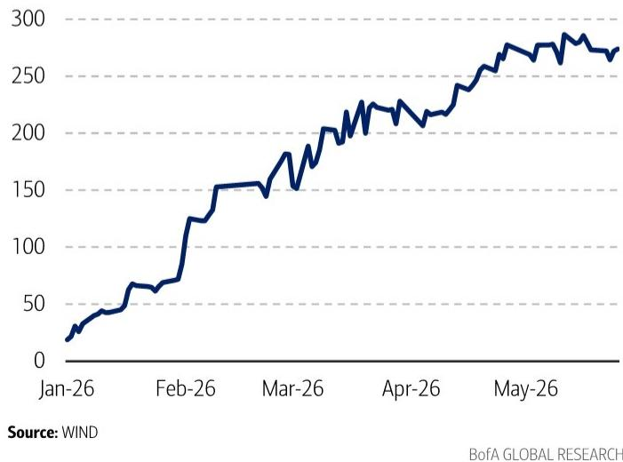

line chart

| Date   | Value |
|--------|-------|
| Jan-26 | 20    |
| Feb-26 | 150   |
| Mar-26 | 180   |
| Apr-26 | 220   |
| May-26 | 270   |

Exhibit 13: Investors exit HK ETFs at the fastest pace on record Changes in shares of HK equity ETFs listed in China mainland (bn shares)  
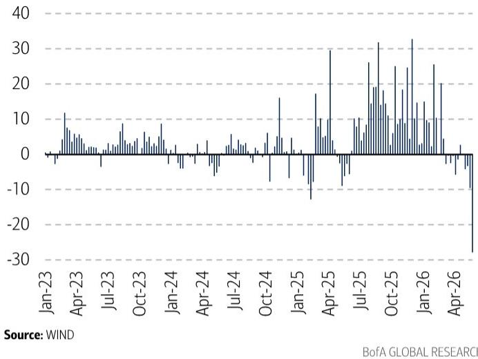

bar chart

| Date | Value |
|---|---|
| Jan-23 | 0 |
| Apr-23 | 12 |
| Jul-23 | 5 |
| Oct-23 | 8 |
| Jan-24 | 9 |
| Apr-24 | -3 |
| Jul-24 | 4 |
| Oct-24 | 6 |
| Jan-25 | -15 |
| Apr-25 | 30 |
| Jul-25 | 10 |
| Oct-25 | 32 |
| Jan-26 | 33 |
| Apr-26 | -28 |

Exhibit 15: Hong Kong stock buybacks hit the 16-month high Share buybacks in the Hong Kong market (HKD bn)  
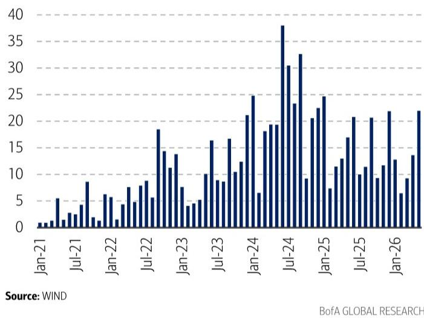

bar chart

| Date | Value |
|---|---|
| Jan-21 | 1 |
| Feb-21 | 1 |
| Mar-21 | 5 |
| Apr-21 | 1 |
| May-21 | 2 |
| Jun-21 | 3 |
| Jul-21 | 4 |
| Aug-21 | 8 |
| Sep-21 | 1 |
| Oct-21 | 6 |
| Nov-21 | 6 |
| Dec-21 | 4 |
| Jan-22 | 7 |
| Feb-22 | 8 |
| Mar-22 | 9 |
| Apr-22 | 5 |
| May-22 | 18 |
| Jun-22 | 14 |
| Jul-22 | 11 |
| Aug-22 | 13 |
| Sep-22 | 7 |
| Oct-22 | 4 |
| Nov-22 | 5 |
| Dec-22 | 10 |
| Jan-23 | 16 |
| Feb-23 | 9 |
| Mar-23 | 8 |
| Apr-23 | 17 |
| May-23 | 10 |
| Jun-23 | 12 |
| Jul-23 | 21 |
| Aug-23 | 6 |
| Sep-23 | 18 |
| Oct-23 | 19 |
| Nov-23 | 19 |
| Dec-23 | 38 |
| Jan-24 | 30 |
| Feb-24 | 23 |
| Mar-24 | 33 |
| Apr-24 | 9 |
| May-24 | 20 |
| Jun-24 | 24 |
| Jul-24 | 7 |
| Aug-24 | 11 |
| Sep-24 | 13 |
| Oct-24 | 17 |
| Nov-24 | 20 |
| Dec-24 | 11 |
| Jan-25 | 10 |
| Feb-25 | 11 |
| Mar-25 | 9 |
| Apr-25 | 10 |
| May-25 | 11 |
| Jun-25 | 20 |
| Jul-25 | 10 |
| Aug-25 | 11 |
| Sep-25 | 9 |
| Oct-25 | 10 |
| Nov-25 | 11 |
| Dec-25 | 6 |
| Jan-26 | 13 |
| Feb-26 | 9 |
| Mar-26 | 13 |
| Apr-26 | 13 |
Source: WIND
BofA GLOBAL RESEARCH

Exhibit 17: Trading contributions from the Stock Connect are stable Northbound and southbound trading as % of total market turnover  
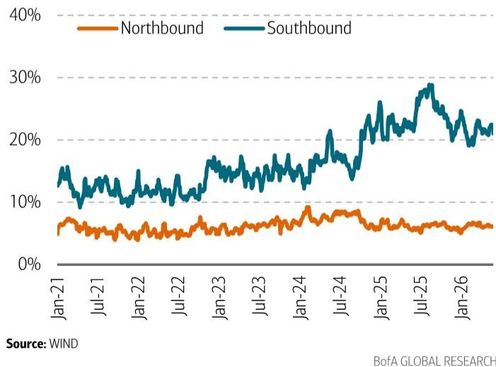

line chart

| Date   | Northbound | Southbound |
|--------|------------|------------|
| Jan-21 | ~6%        | ~15%       |
| Jul-21 | ~5%        | ~12%       |
| Jan-22 | ~5%        | ~10%       |
| Jul-22 | ~6%        | ~12%       |
| Jan-23 | ~7%        | ~15%       |
| Jul-23 | ~8%        | ~16%       |
| Jan-24 | ~9%        | ~18%       |
| Jul-24 | ~8%        | ~20%       |
| Jan-25 | ~7%        | ~25%       |
| Jul-25 | ~6%        | ~30%       |
| Jan-26 | ~6%        | ~22%       |

In terms of sector preferences (measured as allocations relative to market weights), southbound investors increased their OW positions in energy and communication services, while turning more constructive on materials and real estate in May. These additions were funded by reduced exposure to health care and information technology.

Exhibit 18: Southbound investors increase their OW positions in energy and communication services  
Sector OW (>1) and UW (<1) by southbound investors in the Hong Kong stock market

<table><tr><td></td><td>Mar-25</td><td>Apr-25</td><td>May-25</td><td>Jun-25</td><td>Jul-25</td><td>Aug-25</td><td>Sep-25</td><td>Oct-25</td><td>Nov-25</td><td>Dec-25</td><td>Jan-26</td><td>Feb-26</td><td>Mar-26</td><td>Apr-26</td><td>May-26</td></tr><tr><td>Communication Services</td><td>1.51</td><td>1.51</td><td>1.60</td><td>1.56</td><td>1.51</td><td>1.53</td><td>1.52</td><td>1.51</td><td>1.52</td><td>1.50</td><td>1.46</td><td>1.47</td><td>1.42</td><td>1.47</td><td>1.53</td></tr><tr><td>Consumer Discretionary</td><td>0.83</td><td>0.85</td><td>0.89</td><td>0.94</td><td>0.93</td><td>0.95</td><td>0.98</td><td>1.01</td><td>0.99</td><td>1.02</td><td>1.03</td><td>1.06</td><td>1.06</td><td>1.04</td><td>1.04</td></tr><tr><td>Consumer Staples</td><td>0.74</td><td>0.74</td><td>0.76</td><td>0.64</td><td>0.65</td><td>0.65</td><td>0.66</td><td>0.67</td><td>0.70</td><td>0.73</td><td>0.74</td><td>0.63</td><td>0.63</td><td>0.64</td><td>0.64</td></tr><tr><td>Energy</td><td>1.09</td><td>1.10</td><td>1.15</td><td>1.13</td><td>1.08</td><td>1.08</td><td>1.14</td><td>1.12</td><td>1.13</td><td>1.12</td><td>1.14</td><td>1.17</td><td>1.25</td><td>1.18</td><td>1.22</td></tr><tr><td>Financials</td><td>0.74</td><td>0.74</td><td>0.77</td><td>0.79</td><td>0.80</td><td>0.79</td><td>0.78</td><td>0.80</td><td>0.81</td><td>0.82</td><td>0.82</td><td>0.84</td><td>0.83</td><td>0.86</td><td>0.87</td></tr><tr><td>Health Care</td><td>1.70</td><td>1.81</td><td>1.56</td><td>1.76</td><td>1.80</td><td>1.77</td><td>1.69</td><td>1.61</td><td>1.64</td><td>1.62</td><td>1.58</td><td>1.61</td><td>1.61</td><td>1.66</td><td>1.63</td></tr><tr><td>Industrials</td><td>0.69</td><td>0.67</td><td>0.51</td><td>0.51</td><td>0.51</td><td>0.50</td><td>0.47</td><td>0.47</td><td>0.51</td><td>0.50</td><td>0.50</td><td>0.51</td><td>0.48</td><td>0.48</td><td>0.44</td></tr><tr><td>Information Technology</td><td>1.59</td><td>1.52</td><td>1.54</td><td>1.47</td><td>1.44</td><td>1.42</td><td>1.43</td><td>1.48</td><td>1.44</td><td>1.43</td><td>1.44</td><td>1.44</td><td>1.48</td><td>1.40</td><td>1.37</td></tr><tr><td>Materials</td><td>0.95</td><td>0.96</td><td>1.00</td><td>0.98</td><td>0.99</td><td>0.95</td><td>0.86</td><td>0.87</td><td>0.88</td><td>0.87</td><td>0.90</td><td>0.82</td><td>0.81</td><td>0.83</td><td>0.85</td></tr><tr><td>Real Estate</td><td>0.70</td><td>0.70</td><td>0.69</td><td>0.71</td><td>0.72</td><td>0.72</td><td>0.73</td><td>0.76</td><td>0.79</td><td>0.80</td><td>0.76</td><td>0.81</td><td>0.82</td><td>0.79</td><td>0.81</td></tr><tr><td>Utilities</td><td>1.22</td><td>1.25</td><td>1.32</td><td>1.32</td><td>1.26</td><td>1.25</td><td>1.28</td><td>1.24</td><td>1.26</td><td>1.29</td><td>1.26</td><td>1.28</td><td>1.33</td><td>1.33</td><td>1.34</td></tr></table>

Source: WIND. Note: We define southbound investors as overweight (OW) a sector when their allocation exceeds the market weight (sector allocation / market weight > 1), and underweight (UW) when their allocation is below the market weight (sector allocation / market weight < 1).

BofA GLOBAL RESEARCH

## Capital demand: short relief in May; watch IPOs and lock-up expirations in 3Q26

From a capital demand perspective, IPO financing value in both A-share and Hong Kong markets moderated notably in May. That said, we understand that HKEX maintains a solid IPO pipeline, while the upcoming mega IPO of ChangXin Memory Tech (CXMT), expected to raise \~RMB29.5bn (source: company filing), could exert pressure on A-share liquidity in the coming months once the IPO debuts, in our view. Amid the strong rally in the ChiNext Index in May, share reductions by major shareholders picked up to RMB49.3bn, although this remains below the peak of RMB60.3bn recorded in January.

Exhibit 19: IPO financing value notably eases in May  
IPO financing value in HK (HKD bn) and A-share market (RMB bn)  
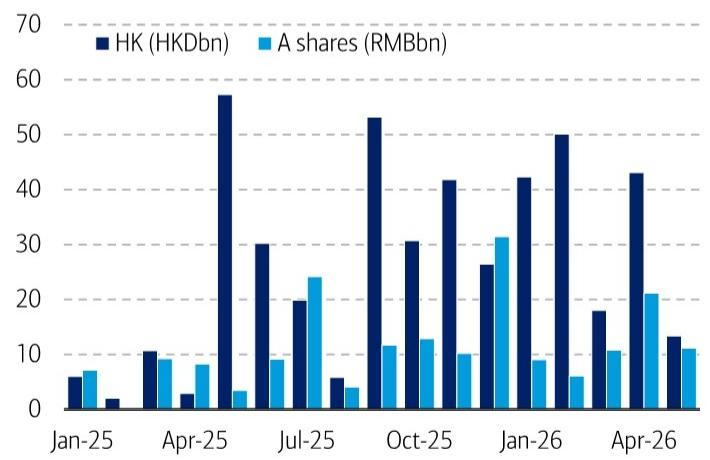

bar chart

| Month | HK (HKDbn) | A shares (RMBbn) |
|---|---|---|
| Jan-25 | 5 | 6 |
| Feb-25 | 1 | 0 |
| Mar-25 | 10 | 9 |
| Apr-25 | 3 | 8 |
| May-25 | 57 | 3 |
| Jun-25 | 30 | 9 |
| Jul-25 | 19 | 24 |
| Aug-25 | 5 | 4 |
| Sep-25 | 53 | 11 |
| Oct-25 | 30 | 12 |
| Nov-25 | 41 | 10 |
| Dec-25 | 26 | 31 |
| Jan-26 | 42 | 8 |
| Feb-26 | 50 | 5 |
| Mar-26 | 18 | 10 |
| Apr-26 | 43 | 21 |
| May-26 | 13 | 10 |

Source: WIND  
BofA GLOBAL RESEARCH

Exhibit 20: Major shareholders' stock selling continues to pick up  
Share reductions by major shareholders in the A-share market (RMB bn)  
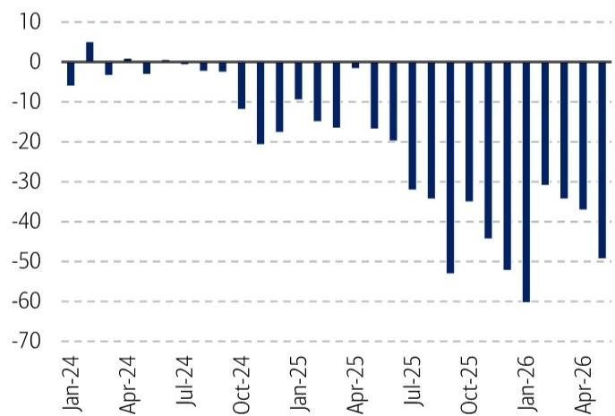

bar chart

| Month | Value |
|---|---|
| Jan-24 | -5 |
| Feb-24 | 5 |
| Mar-24 | -3 |
| Apr-24 | 0 |
| May-24 | -2 |
| Jun-24 | 0 |
| Jul-24 | -1 |
| Aug-24 | -3 |
| Sep-24 | -10 |
| Oct-24 | -18 |
| Nov-24 | -15 |
| Dec-24 | -15 |
| Jan-25 | -15 |
| Feb-25 | -18 |
| Mar-25 | -15 |
| Apr-25 | -18 |
| May-25 | -20 |
| Jun-25 | -30 |
| Jul-25 | -35 |
| Aug-25 | -55 |
| Sep-25 | -35 |
| Oct-25 | -45 |
| Nov-25 | -50 |
| Dec-25 | -60 |
| Jan-26 | -30 |
| Feb-26 | -35 |
| Mar-26 | -38 |
| Apr-26 | -48 |
| May-26 | -50 |

Source: WIND. Note: "share reductions by major shareholders" refers to situations where large shareholders sell down their stakes in a listed company. Major shareholders include founders/controlling shareholders, senior management, strategic or financial investor, or any shareholder holding $\geq 5\%$ of the company

BofA GLOBAL RESEARCH

Following the increase of IPOs since mid-2025, we also highlight the risk of liquidity pressure from lock-up expirations in the Hong Kong market in 3Q26. At the time of writing, the value of restricted stock unlocks is projected to hit a multi-year high of \~HKD270bn in July before surging further to \~HKD400bn in September, based on data compiled by WIND. While we think the impact may be contained in the A-share market, the value of restricted shares scheduled for unlocking could still reach \~RMB600bn by end-2026 – the highest level since mid-2023.

Exhibit 21: Limited pressure from A-share lock-up expirations  
Monthly amount of lock-up expiration in the A-share market (RMB bn)  
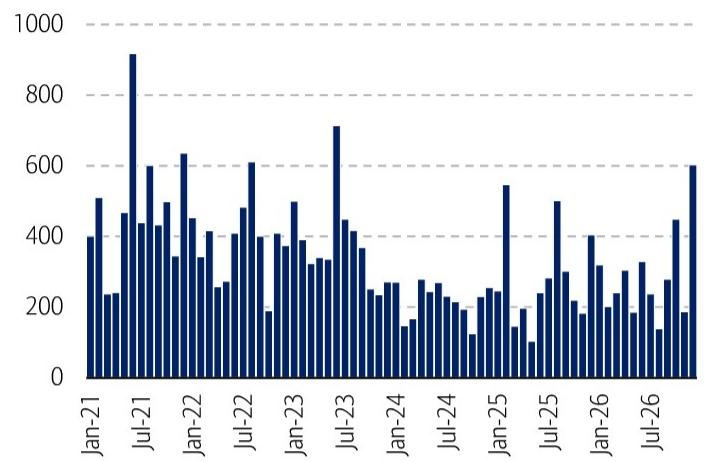

bar chart

| Date | Value |
|---|---|
| Jan-21 | 400 |
| Feb-21 | 500 |
| Mar-21 | 230 |
| Apr-21 | 460 |
| May-21 | 920 |
| Jun-21 | 430 |
| Jul-21 | 600 |
| Aug-21 | 430 |
| Sep-21 | 500 |
| Oct-21 | 340 |
| Nov-21 | 630 |
| Dec-21 | 450 |
| Jan-22 | 340 |
| Feb-22 | 410 |
| Mar-22 | 250 |
| Apr-22 | 400 |
| May-22 | 480 |
| Jun-22 | 600 |
| Jul-22 | 400 |
| Aug-22 | 180 |
| Sep-22 | 400 |
| Oct-22 | 380 |
| Nov-22 | 490 |
| Dec-22 | 380 |
| Jan-23 | 330 |
| Feb-23 | 330 |
| Mar-23 | 710 |
| Apr-23 | 440 |
| May-23 | 410 |
| Jun-23 | 360 |
| Jul-23 | 250 |
| Aug-23 | 260 |
| Sep-23 | 150 |
| Oct-23 | 270 |
| Nov-23 | 250 |
| Dec-23 | 260 |
| Jan-24 | 190 |
| Feb-24 | 180 |
| Mar-24 | 110 |
| Apr-24 | 130 |
| May-24 | 150 |
| Jun-24 | 170 |
| Jul-24 | 190 |
| Aug-24 | 180 |
| Sep-24 | 160 |
| Oct-24 | 140 |
| Nov-24 | 160 |
| Dec-24 | 180 |
| Jan-25 | 540 |
| Feb-25 | 150 |
| Mar-25 | 180 |
| Apr-25 | 90 |
| May-25 | 160 |
| Jun-25 | 190 |
| Jul-25 | 500 |
| Aug-25 | 300 |
| Sep-25 | 180 |
| Oct-25 | 400 |
| Nov-25 | 310 |
| Dec-25 | 190 |
| Jan-26 | 310 |
| Feb-26 | 180 |
| Mar-26 | 330 |
| Apr-26 | 190 |
| May-26 | 130 |
| Jun-26 | 440 |
| Jul-26 | 180 |
| Aug-26 | 600 |

Source: WIND  
BofA GLOBAL RESEARCH

Exhibit 22: Restricted stock unlocks in HK expected to surge in 3Q26  
Monthly amount of lock-up expiration in HKEX (HKD bn)  
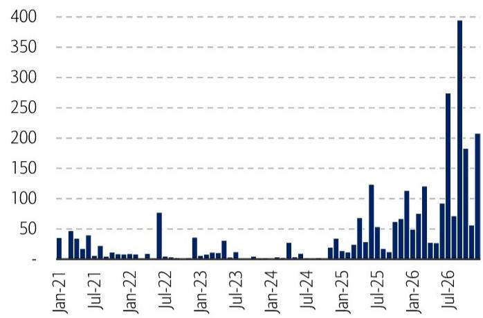

bar chart

| Date | Value |
|---|---|
| Jan-21 | 35 |
| Feb-21 | 48 |
| Mar-21 | 38 |
| Apr-21 | 25 |
| May-21 | 42 |
| Jun-21 | 10 |
| Jul-21 | 15 |
| Aug-21 | 12 |
| Sep-21 | 10 |
| Oct-21 | 10 |
| Nov-21 | 10 |
| Dec-21 | 10 |
| Jan-22 | 15 |
| Feb-22 | 75 |
| Mar-22 | 5 |
| Apr-22 | 5 |
| May-22 | 5 |
| Jun-22 | 5 |
| Jul-22 | 5 |
| Aug-22 | 5 |
| Sep-22 | 5 |
| Oct-22 | 5 |
| Nov-22 | 5 |
| Dec-22 | 5 |
| Jan-23 | 38 |
| Feb-23 | 10 |
| Mar-23 | 10 |
| Apr-23 | 15 |
| May-23 | 30 |
| Jun-23 | 15 |
| Jul-23 | 10 |
| Aug-23 | 5 |
| Sep-23 | 5 |
| Oct-23 | 5 |
| Nov-23 | 5 |
| Dec-23 | 5 |
| Jan-24 | 5 |
| Feb-24 | 5 |
| Mar-24 | 5 |
| Apr-24 | 5 |
| May-24 | 5 |
| Jun-24 | 5 |
| Jul-24 | 5 |
| Aug-24 | 5 |
| Sep-24 | 5 |
| Oct-24 | 5 |
| Nov-24 | 5 |
| Dec-24 | 5 |
| Jan-25 | 30 |
| Feb-25 | 10 |
| Mar-25 | 10 |
| Apr-25 | 10 |
| May-25 | 60 |
| Jun-25 | 30 |
| Jul-25 | 120 |
| Aug-25 | 50 |
| Sep-25 | 10 |
| Oct-25 | 10 |
| Nov-25 | 60 |
| Dec-25 | 70 |
| Jan-26 | 40 |
| Feb-26 | 70 |
| Mar-26 | 110 |
| Apr-26 | 70 |
| May-26 | 110 |
| Jun-26 | 30 |
| Jul-26 | 90 |
| Aug-26 | 390 |
| Sep-26 | 70 |
| Oct-26 | 180 |
| Nov-26 | 50 |
| Dec-26 | 180 |
| Jan-27 | 50 |
| Feb-27 | 180 |
| Mar-27 | 180 |
| Apr-27 | 180 |
| May-27 | 180 |
| Jun-27 | 180 |
| Jul-27 | 180 |
| Aug-27 | 180 |
| Sep-27 | 180 |
| Oct-27 | 180 |
| Nov-27 | 180 |
| Dec-27 | 180 |

Source: WIND  
BofA GLOBAL RESEARCH

## Overview of market liquidity and sentiment

With China's economic activities losing momentum in April (see note: April activity data, May 18), the PBOC intensified liquidity injections via OMOs and MLFs in the second half of May, with interbank lending rates of DR007 and Shibor trending lower to $1.35\%$ and $1.41\%$ on average in the past month, vs. $1.36\%$ and $1.47\%$ , respectively, in April.

Exhibit 23: Interbank lending rates trend lower amid strong liquidity  
DR007, Shibor – 3 month, and CGB yield (%, 5-day moving average)  
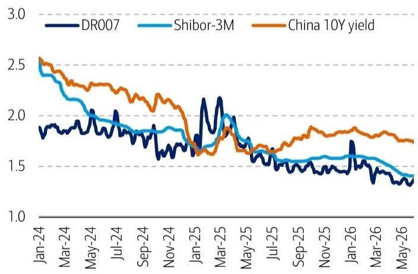

line chart

| Date   | DR007 | Shibor-3M | China 10Y yield |
|--------|-------|-----------|-----------------|
| Jan-24 | 1.85  | 2.50      | 2.55            |
| Mar-24 | 1.90  | 2.30      | 2.40            |
| May-24 | 1.95  | 2.10      | 2.30            |
| Jul-24 | 1.85  | 1.95      | 2.20            |
| Sep-24 | 1.75  | 1.85      | 2.10            |
| Nov-24 | 1.65  | 1.80      | 2.00            |
| Jan-25 | 1.70  | 1.75      | 1.80            |
| Mar-25 | 2.15  | 1.90      | 1.75            |
| May-25 | 1.60  | 1.65      | 1.65            |
| Jul-25 | 1.55  | 1.60      | 1.60            |
| Sep-25 | 1.50  | 1.55      | 1.70            |
| Nov-25 | 1.45  | 1.50      | 1.80            |
| Jan-26 | 1.70  | 1.45      | 1.85            |
| Mar-26 | 1.35  | 1.40      | 1.75            |
| May-26 | 1.30  | 1.35      | 1.70            |

Source: Bloomberg  
BofA GLOBAL RESEARCH

Exhibit 24: Average A-share turnover surged above RMB3tn in May  
Average daily trading value in the A-share market (RMB bn)  
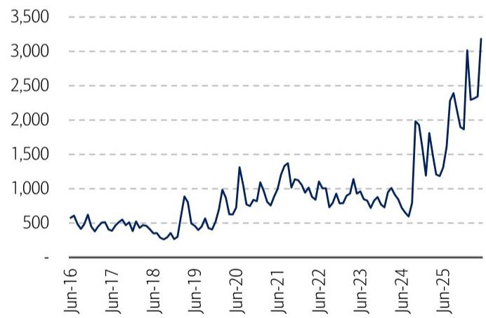

line chart

| Date   | Value |
|--------|-------|
| Jun-16 | 500   |
| Jun-17 | 400   |
| Jun-18 | 300   |
| Jun-19 | 800   |
| Jun-20 | 1300  |
| Jun-21 | 1400  |
| Jun-22 | 1000  |
| Jun-23 | 1100  |
| Jun-24 | 600   |
| Jun-25 | 2400  |
| Jun-26 | 3200  |

Source: WIND  
BofA GLOBAL RESEARCH

The marginal loosening of liquidity environment bodes well for the A-share market sentiment. The average daily turnover at Shanghai and Shenzhen stock exchanges hit record highs of more than RMB3.0tn in May. Meanwhile, margin trading heats up again, with its contribution to the A-share total turnover staying elevated at the level of \~10%. On the flip side, investor sentiment in Hong Kong has been relatively tepid. The average daily turnover in the main board posted a print of HKD279.1bn in May, which is well below the peak levels of more than HKD300bn in March and in last September.

Exhibit 25: Margin trading activities heat up again in May  
Margin trading as % of A-share market turnover (5-day moving average)  
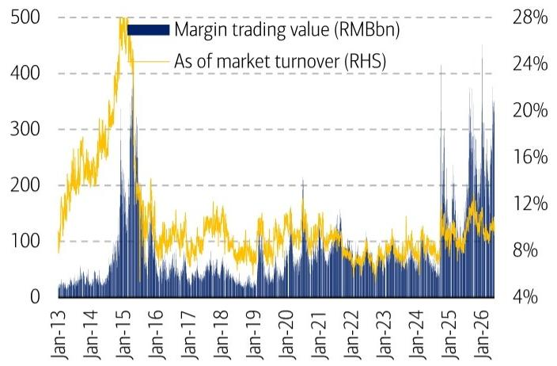

bar-line hybrid chart

| Date   | Margin trading value (RMBbn) | As of market turnover (RHS) |
|--------|-------------------------------|-----------------------------|
| Jan-13 | ~50                           | ~8%                         |
| Jan-14 | ~100                          | ~16%                        |
| Jan-15 | ~500                          | ~28%                        |
| Jan-16 | ~100                          | ~12%                        |
| Jan-17 | ~50                           | ~8%                         |
| Jan-18 | ~100                          | ~12%                        |
| Jan-19 | ~50                           | ~8%                         |
| Jan-20 | ~100                          | ~12%                        |
| Jan-21 | ~50                           | ~8%                         |
| Jan-22 | ~100                          | ~12%                        |
| Jan-23 | ~50                           | ~8%                         |
| Jan-24 | ~100                          | ~12%                        |
| Jan-25 | ~400                          | ~24%                        |
| Jan-26 | ~350                          | ~16%                        |

Source: WIND  
BofA GLOBAL RESEARCH

Exhibit 26: Hong Kong market turnover stays elevated  
Average daily trading value in the Hong Kong stock market (HKD bn)  
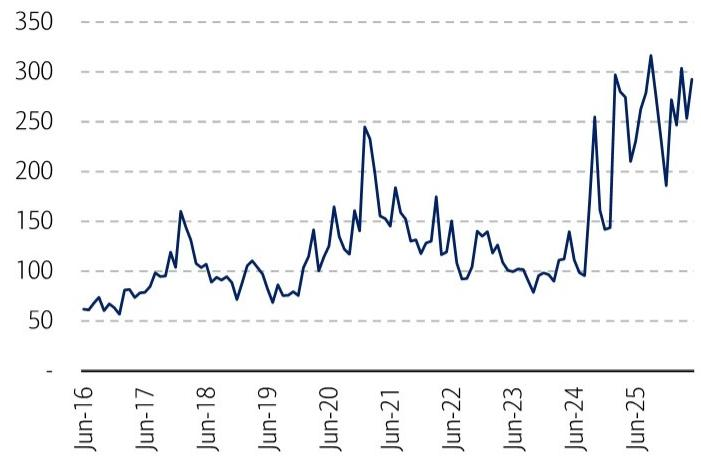

line chart

| Date   | Value |
|--------|-------|
| Jun-16 | 60    |
| Jun-17 | 80    |
| Jun-18 | 150   |
| Jun-19 | 100   |
| Jun-20 | 160   |
| Jun-21 | 240   |
| Jun-22 | 140   |
| Jun-23 | 100   |
| Jun-24 | 250   |
| Jun-25 | 310   |

Source: WIND  
BofA GLOBAL RESEARCH

After compiling fund flow data alongside indicators from both the capital supply and demand sides, we present our liquidity dashboard below, with green/amber/red arrow denoting movements that are supportive/neutral/adverse to secondary market liquidity. Overall, divergent domestic capital supply dynamics continue to favor A-shares over Hong Kong stocks (see note China conference feedback, May 15). Apart from slowing southbound capital inflows, recent tightening on cross-border capital flows and the upcoming wave of lock-up expirations represent key liquidity risks for the Hong Kong market in the short term.

Exhibit 27: Divergent capital supply dynamics still favor A shares vs. Hong Kong stocks  
A-share and Hong Kong market liquidity dashboard

<table><tr><td></td><td>A-share market</td><td>May-26</td><td>Apr-26</td><td>Impact</td><td>Hong Kong</td><td>May-26</td><td>Apr-26</td><td>Impact</td></tr><tr><td rowspan="2">Overall</td><td>Average daily trading value (RMB bn)</td><td>3,182.50</td><td>2,343.8</td><td>▲</td><td rowspan="2">Average daily trading value (HKD bn)</td><td rowspan="2">292.8</td><td rowspan="2">253.4</td><td rowspan="2">▲</td></tr><tr><td>Margin trading as % of market turnover</td><td>10.10%</td><td>9.80%</td><td>▶</td></tr><tr><td rowspan="4">Capital Supply</td><td>New mutual fund issuances (bn)</td><td>70.1</td><td>46.4</td><td>▲</td><td>Shares buyback (HKD bn)</td><td>22</td><td>13.6</td><td>▲</td></tr><tr><td>Shares buyback (RMB bn)</td><td>17.1</td><td>11</td><td>▲</td><td rowspan="2">Southbound capital flows (HKD bn)</td><td rowspan="2">-3.6</td><td rowspan="2">56.5</td><td rowspan="2">▼</td></tr><tr><td>Northbound trading as % of turnover</td><td>6.20%</td><td>6.10%</td><td>▶</td></tr><tr><td>4-week China equity fund flows (USD mn)</td><td>347.4</td><td>51.6</td><td>▲</td><td>4-week China equity fund flows (USD mn)</td><td>587.5</td><td>824.6</td><td>▼</td></tr><tr><td rowspan="3">Capital Demand</td><td>IPO financing (RMB bn)</td><td>11.1</td><td>21.2</td><td>▲</td><td>IPO financing (HKD bn)</td><td>13.4</td><td>43.1</td><td>▲</td></tr><tr><td>Lock-up expirations (RMB bn)</td><td>184.9</td><td>303.8</td><td>▲</td><td rowspan="2">Lock-up expirations (HKD bn)</td><td rowspan="2">26.9</td><td rowspan="2">27.8</td><td rowspan="2">▶</td></tr><tr><td>Share reductions by major shareholders (RMB bn)</td><td>49.3</td><td>37.1</td><td>▼</td></tr></table>

Source: WIND, EPFR.  
Note: ▲/▶/▼ denote whether an indicator's movement is supportive, neutral, adverse to market liquidity relative to the previous month. A ▲ is assigned when the MoM change is supportive to liquidity—specifically, a >5% increase in overall/capital supply indicator or a >5% decline in capital demand indicator. A ▼ is assigned when the MoM change is adverse to liquidity—a >5% decline in overall/capital supply indicator or a >5% increase in capital demand indicator. A ▶ is assigned when the MoM change falls within 5%.  
BofA GLOBAL RESEARCH

## Disclosures

## Important Disclosures

Due to the nature of strategic analysis, the issuers or securities recommended or discussed in this report are not continuously followed. Accordingly, investors must regard this report as providing stand-alone analysis and should not expect continuing analysis or additional reports relating to such issuers and/or securities.

BofA Global Research personnel (including the analyst(s) responsible for this report) receive compensation based upon, among other factors, the overall profitability of BofA Corporation, including profits derived from investment banking. The analyst(s) responsible for this report may also receive compensation based upon, among other factors, the overall profitability of the Bank's sales and trading businesses relating to the class of securities or financial instruments for which such analyst is responsible.

## Other Important Disclosures

Prices are indicative and for information purposes only. Except as otherwise stated in the report, for any recommendation in relation to an equity security, the price referenced is the publicly traded price of the security as of close of business on the day prior to the date of the report or, if the report is published during intraday trading, the price referenced is indicative of the traded price as of the date and time of the report and in relation to a debt security (including equity preferred and CDS), prices are indicative as of the date and time of the report and are from various sources including BofA trading desks.

The date and time of completion of the production of any recommendation in this report shall be the date and time of dissemination of this report as recorded in the report timestamp.

Recipients who are not institutional investors or market professionals should seek the advice of their independent financial advisor before considering information in this report in connection with any investment decision, or for a necessary explanation of its contents.

Officers of BofAS or one or more of its affiliates (other than research analysts) may have a financial interest in securities of the issuer(s) or in related investments.

Refer to BofA Global Research policies relating to conflicts of interest.

"BofA" includes BofA, Inc. ("BofAS") and its affiliates. Investors should contact their BofA representative or Merrill Global Wealth Management financial advisor if they have questions concerning this report or concerning the appropriateness of any investment idea described herein for such investor. "BofA" is a global brand for BofA Global Research.

## Information relating to Non-US affiliates of BofA and Distribution of Affiliate Research Reports:

BofAS and/or BofA, Pierce, Fenner & Smith Incorporated ("MLPF&S") may in the future distribute, information of the following non-US affiliates in the US (short name: legal name, regulator): BofA (South Africa): BofA South Africa (Pty) Ltd., regulated by the Financial Sector Conduct Authority; MLI (UK): BofA International, regulated by the Financial Conduct Authority (FCA) and the Prudential Regulation Authority (PRA); BofASE (France): BofA Europe SA is authorized by the Autorité de Contrôle Prudentiel et de Résolution (ACPR) and regulated by the ACPR and the Autorité des Marchés Financiers (AMF). BofA Europe SA ("BofASE") with registered address at 51, rue La Boétie, 75008 Paris is registered under no 842 602 690 RCS Paris. In accordance with the provisions of French Code Monétaire et Financier (Monetary and Financial Code), BofASE is an établissement de crédit et d'investissement (credit and investment institution) that is authorised and supervised by the European Central Bank and the Autorité de Contrôle Prudentiel et de Résolution (ACPR) and regulated by the ACPR and the Autorité des Marchés Financiers. BofASE's share capital can be found at www.bofaml.com/BofASEdisclaimer; BofA Europe (Milan): BofA Europe Designated Activity Company, Milan Branch, regulated by the Bank of Italy, the European Central Bank (ECB) and the Central Bank of Ireland (CBI); BofA Europe (Frankfurt): BofA Europe Designated Activity Company, Frankfurt Branch regulated by BaFin, the ECB and the CBI; BofA Europe (Zurich): BofA Europe Designated Activity Company, Zurich Branch, regulated by the Swiss Financial Market Supervisory Authority FINMA, the ECB and CBI; BofA Europe (Madrid): BofA Europe Designated Activity Company, Sucursal en España, regulated by the Bank of Spain, the ECB and the CBI; BofA (Australia): BofA Equities (Australia) Limited, regulated by the Australian Securities and Investments Commission; BofA (Hong Kong): BofA (Asia Pacific) Limited, regulated by the Hong Kong Securities and Futures Commission (HKSFC); BofA (Singapore): BofA (Singapore) Pte Ltd, regulated by the Monetary Authority of Singapore (MAS); BofA (Canada): BofA Canada Inc, regulated by the Canadian Investment Regulatory Organization; BofA (Mexico): BofA Mexico, SA de CV, Casa de Bolsa, regulated by the Comisión Nacional Bancaria y de Valores; BofAS Japan: BofA Japan Co., Ltd., regulated by the Financial Services Agency; BofA (Seoul): BofA International, LLC Seoul Branch, regulated by the Financial Supervisory Service; BofA (Taiwan): BofA (Taiwan) Ltd., regulated by the Securities and Futures Bureau; BofAS India: BofA India Limited, regulated by the Securities and Exchange Board of India (SEBI); BofA (Israel): BofA Israel Limited, regulated by Israel Securities Authority; BofA (DIFC): BofA International (DIFC Branch), regulated by the Dubai Financial Services Authority (DFSA); BofA (Brazil): BofA S.A. Corretora de Títulos e Valores Mobiliários, regulated by Comissão de Valores Mobiliários; BofA KSA Company: BofA Kingdom of Saudi Arabia Company, regulated by the Capital Market Authority. This information: has been approved for publication and is distributed in the United Kingdom (UK) to professional clients and eligible counterparties (as each is defined in the rules of the FCA and the PRA) by MLI (UK), which is authorized by the PRA and regulated by the FCA and the PRA - details about the extent of our regulation by the FCA and PRA are available from us on request; has been approved for publication and is distributed in the European Economic Area (EEA) by BofASE (France), which is authorized by the ACPR and regulated by the ACPR and the AMF; has been considered and distributed in Japan by BofAS Japan, a registered securities dealer under the Financial Instruments and Exchange Act in Japan, or its permitted affiliates; is issued and distributed in Hong Kong by BofA (Hong Kong) which is regulated by HKSFC; is issued and distributed in Taiwan by BofA (Taiwan); is issued and distributed in India by BofAS India; and is issued and distributed in Singapore to institutional investors and/or accredited investors (each as defined under the Financial Advisers Regulations) by BofA (Singapore) (Company Registration No 198602883D). BofA (Singapore) is regulated by MAS. BofA Equities (Australia) Limited (ABN 65 006 276 795), AFS License 235132 (MLEA) distributes this information in Australia only to 'Wholesale' clients as defined by s.761G of the Corporations Act 2001. With the exception of BofA N.A., Australia Branch, neither MLEA nor any of its affiliates involved in preparing this information is an Authorised Deposit-Taking Institution under the Banking Act 1959 nor regulated by the Australian Prudential Regulation Authority. No approval is required for publication or distribution of this information in Brazil and its local distribution is by BofA (Brazil) in accordance with applicable regulations. BofA (DIFC) is authorized and regulated by the DFSA. Information prepared and issued by BofA (DIFC) is done so in accordance with the requirements of the DFSA conduct of business rules. BofA Europe (Frankfurt) distributes this information in Germany and is regulated by BaFin, the ECB and the CBI. BofA entities, including BofA Europe and BofASE (France), may outsource/delegate the marketing and/or provision of certain research services or aspects of research services to other branches or members of the BofA group. You may be contacted by a different BofA entity acting for and on behalf of your service provider where permitted by applicable law. This does not change your service provider. Please refer to the Electronic Communications Disclaimers for further information.

This information has been prepared and issued by BofAS and/or one or more of its non-US affiliates. The author(s) of this information may not be licensed to carry on regulated activities in your jurisdiction and, if not licensed, do not hold themselves out as being able to do so. BofAS and/or MLPF&S is the distributor of this information in the US and accepts full responsibility for information distributed to BofAS and/or MLPF&S clients in the US by its non-US affiliates. Any US person receiving this information and wishing to effect any transaction in any security discussed herein should do so through BofAS and/or MLPF&S and not such foreign affiliates. Hong Kong recipients of this information should contact BofA (Asia Pacific) Limited in respect of any matters relating to dealing in securities or provision of specific advice on securities or any other matters arising from, or in connection with, this information. Singapore recipients of this information should contact BofA (Singapore) Pte Ltd in respect of any matters arising from, or in connection with, this information. For clients that are not accredited investors, expert investors or institutional investors BofA (Singapore) Pte Ltd accepts full responsibility for the contents of this information distributed to such clients in Singapore.

## General Investment Related Disclosures:

Taiwan Readers: Neither the information nor any opinion expressed herein constitutes an offer or a solicitation of an offer to transact in any securities or other financial instrument. No part of this report may be used or reproduced or quoted in any manner whatsoever in Taiwan by the press or any other person without the express written consent of BofA. This document provides general information only, and has been prepared for, and is intended for general distribution to, BofA clients. Neither the information nor any opinion expressed constitutes an offer or an invitation to make an offer, to buy or sell any securities or other financial instrument or any derivative related to such securities or instruments (e.g., options, futures, warrants, and contracts for differences). This document is not intended to provide personal investment advice and it does not take into account the specific investment objectives, financial situation and the particular needs of, and is not directed to, any specific person(s). This document and its content do not constitute, and should not be considered to constitute, investment advice for purposes of ERISA, the US tax code, the Investment Advisers Act or otherwise. Investors should seek financial advice regarding the appropriateness of investing in financial instruments and implementing investment strategies discussed or recommended in this document and should understand that statements regarding future prospects may not be realized. Any decision to purchase or subscribe for securities in any offering must be based solely on existing public information on such security or the information in the prospectus or other offering document issued in connection with such offering, and not on this document.

Securities and other financial instruments referred to herein, or recommended, offered or sold by BofA, are not insured by the Federal Deposit Insurance Corporation and are not deposits or other obligations of any insured depository institution (including, BofA, N.A.). Investments in general and, derivatives, in particular, involve numerous risks, including, among others, market risk, counterparty default risk and liquidity risk. No security, financial instrument or derivative is suitable for all investors. Digital assets are extremely speculative, volatile and are largely unregulated. In some cases, securities and other financial instruments may be difficult to value or sell and reliable information about the value or risks related to the security or financial instrument may be difficult to obtain. Investors should note that income from such securities and other financial instruments, if any, may fluctuate and that price or value of such securities and instruments may rise or fall and, in some cases, investors may lose their entire principal investment. Past performance is not necessarily a guide to future performance. Levels and basis for taxation may change.

This report may contain a short-term trading idea or recommendation, which highlights a specific near-term catalyst or event impacting the issuer or the market that is anticipated to have a short-term price impact on the equity securities of the issuer. Short-term trading ideas and recommendations are different from and do not affect a stock's fundamental equity rating, which reflects both a longer term total return expectation and attractiveness for investment relative to other stocks within its Coverage Cluster. Short-term trading ideas and recommendations may be more or less positive than a stock's fundamental equity rating.

BofA is aware that the implementation of the ideas expressed in this report may depend upon an investor's ability to "short" securities or other financial instruments and that such action may be limited by regulations prohibiting or restricting "shortselling" in many jurisdictions. Investors are urged to seek advice regarding the applicability of such regulations prior to executing any short idea contained in this report.

Foreign currency rates of exchange may adversely affect the value, price or income of any security or financial instrument mentioned herein. Investors in such securities and instruments, including ADRs, effectively assume currency risk.

BofAS or one of its affiliates is a regular issuer of traded financial instruments linked to securities that may have been recommended in this report. BofAS or one of its affiliates may, at any time, hold a trading position (long or short) in the securities and financial instruments discussed in this report.

BofA, through business units other than BofA Global Research, may have issued and may in the future issue trading ideas or recommendations that are inconsistent with, and reach different conclusions from, the information presented herein. Such ideas or recommendations may reflect different time frames, assumptions, views and analytical methods of the persons who prepared them, and BofA is under no obligation to ensure that such other trading ideas or recommendations are brought to the attention of any recipient of this information. In the event that the recipient received this information pursuant to a contract between the recipient and BofAS for the provision of research services for a separate fee, and in connection therewith BofAS may be deemed to be acting as an investment adviser, such status relates, if at all, solely to the person with whom BofAS has contracted directly and does not extend beyond the delivery of this report (unless otherwise agreed specifically in writing by BofAS). If such recipient uses the services of BofAS in connection with the sale or purchase of a security referred to herein, BofAS may act as principal for its own account or as agent for another person. BofAS is and continues to act solely as a broker-dealer in connection with the execution of any transactions, including transactions in any securities referred to herein.

## Copyright and General Information:

Copyright 2026 BofA Corporation. All rights reserved. iQdatabase® is a registered service mark of BofA Corporation. This information is prepared for the use of BofA clients and may not be redistributed, retransmitted or disclosed, in whole or in part, or in any form or manner, without the express written consent of BofA. This document and its content is provided solely for informational purposes and cannot be used for training or developing artificial intelligence (AI) models or as an input in any AI application (collectively, an AI tool). Any attempt to utilize this document or any of its content in connection with an AI tool without explicit written permission from BofA Global Research is strictly prohibited. BofA Global Research utilizes AI, including machine learning and other technologies, to enhance the services we provide to our clients. These technologies assist our analysts in various aspects of their work, including but not limited to data analysis, content extraction, content creation, data aggregation and summarization and identifying relevant information from diverse sources. All AI-driven processes are subject to review by BofA Global Research employees. BofA Global Research information is distributed simultaneously to internal and client websites and other portals by BofA and is not publicly-available material. Any unauthorized use or disclosure is prohibited. Receipt and review of this information constitutes your agreement not to redistribute, retransmit, or disclose to others the contents, opinions, conclusion, or information contained herein (including any investment recommendations, estimates or price targets) without first obtaining express permission from an authorized officer of BofA.

Materials prepared by BofA Global Research personnel are based on public information. Facts and views presented in this material have not been reviewed by, and may not reflect information known to, professionals in other business areas of BofA, including investment banking personnel. BofA has established information barriers between BofA Global Research and certain business groups. As a result, BofA does not disclose certain client relationships with, or compensation received from, such issuers. To the extent this material discusses any legal proceeding or issues, it has not been prepared as nor is it intended to express any legal conclusion, opinion or advice. Investors should consult their own legal advisers as to issues of law relating to the subject matter of this material. BofA Global Research personnel's knowledge of legal proceedings in which any BofA entity and/or its directors, officers and employees may be plaintiffs, defendants, co-defendants or co-plaintiffs with or involving issuers mentioned in this material is based on public information. Facts and views presented in this material that relate to any such proceedings have not been reviewed by, discussed with, and may not reflect information known to, professionals in other business areas of BofA in connection with the legal proceedings or matters relevant to such proceedings.

This information has been prepared independently of any issuer of securities mentioned herein and not in connection with any proposed offering of securities or as agent of any issuer of any securities. None of BofAS any of its affiliates or their research analysts has any authority whatsoever to make any representation or warranty on behalf of the issuer(s). BofA Global Research policy prohibits research personnel from disclosing a recommendation, investment rating, or investment thesis for review by an issuer prior to the publication of a research report containing such rating, recommendation or investment thesis.

Any information relating to sustainability in this material is limited as discussed herein and is not intended to provide a comprehensive view on any sustainability claim with respect to any issuer or security.

Any information relating to the tax status of financial instruments discussed herein is not intended to provide tax advice or to be used by anyone to provide tax advice. Investors are urged to seek tax advice based on their particular circumstances from an independent tax professional.

The information herein (other than disclosure information relating to BofA and its affiliates) was obtained from various sources and we do not guarantee its accuracy. This information may contain links to third-party websites. BofA is not responsible for the content of any third-party website or any linked content contained in a third-party website. Content contained on such third-party websites is not part of this information and is not incorporated by reference. The inclusion of a link does not imply any endorsement by or any affiliation with BofA. Access to any third-party website is at your own risk, and you should always review the terms and privacy policies at third-party websites before submitting any personal information to them. BofA is not responsible for such terms and privacy policies and expressly disclaims any liability for them.

All opinions, projections and estimates constitute the judgment of the author as of the date of publication and are subject to change without notice. Prices also are subject to change without notice. BofA is under no obligation to update this information and BofA ability to publish information on the subject issuer(s) in the future is subject to applicable quiet periods. You should therefore assume that BofA will not update any fact, circumstance or opinion contained herein.

Certain outstanding reports or investment opinions relating to securities, financial instruments and/or issuers may no longer be current. Always refer to the most recent research report relating to an issuer prior to making an investment decision.

In some cases, an issuer may be classified as Restricted or may be Under Review or Extended Review. In each case, investors should consider any investment opinion relating to such issuer (or its security and/or financial instruments) to be suspended or withdrawn and should not rely on the analyses and investment opinion(s) pertaining to such issuer (or its securities and/or financial instruments) nor should the analyses or opinion(s) be considered a solicitation of any kind. Sales persons and financial advisors affiliated with BofAS or any of its affiliates may not solicit purchases of securities or financial instruments that are Restricted or Under Review and may only solicit securities under Extended Review in accordance with firm policies.

Neither BofA nor any officer or employee of BofA accepts any liability whatsoever for any direct, indirect or consequential damages or losses arising from any use of this information.