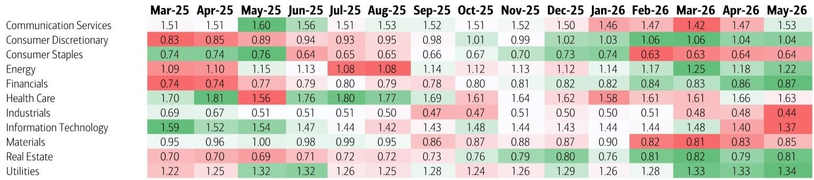
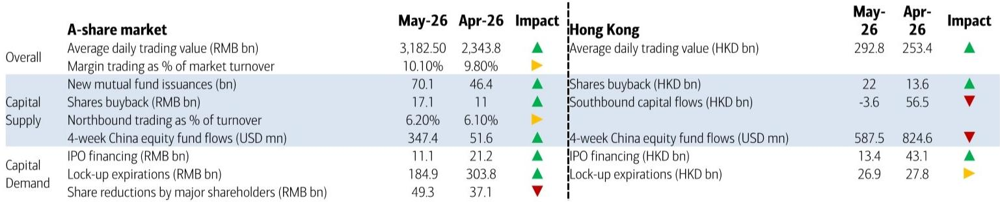
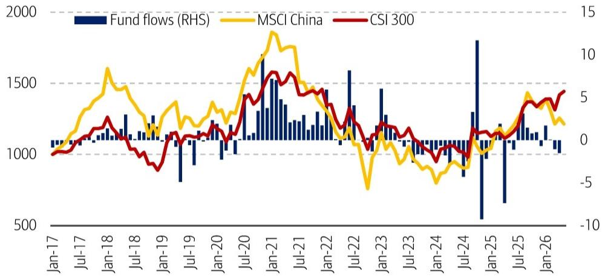

# China's Liquidity Support for A-Shares Is Holding in May, But the Second Half of 2026 Brings Unavoidable Pressure

The narrative surrounding China's equity markets in May 2026 is one of a deceptive calm. On the surface, liquidity conditions appear firmly supportive. Average daily trading value in A-shares surged to approximately RMB 3.2 trillion, a significant jump from April. Foreign capital flows into China-domiciled funds re-accelerated, and the retreat of the "national team" through ETF redemptions, while a headline concern, may actually be a sign of policy capacity being conserved rather than withdrawn. For an investor scanning the monthly dashboard, the data suggests a market that is well-provisioned with capital.

Yet, this surface-level strength masks a strategic divergence that is becoming increasingly critical. The real story of May 2026 is not about the aggregate liquidity level; it is about the shifting composition of that liquidity. The support for A-shares is becoming more domestically driven and more reliant on corporate actions like buybacks, while the Hong Kong market is beginning to feel the strain of a sudden reversal in southbound flows and a looming wall of lock-up expirations. The question for investors is not whether liquidity is supportive today, but whether the drivers of that support are sustainable into the third and fourth quarters.

The most important analytical shift is the recognition that the "national team" has largely completed its cycle of market intervention. Cumulative outflows from domestic ETFs have now exceeded the total inflows seen during the entire 2023-2025 period. This is not a bearish signal per se; it means the floor that state-backed capital provided has been removed, but the ceiling of selling pressure from that same source has also been lowered. The market is now standing on its own feet. The key risk is not that the national team sells more, but that no other institutional buyer steps in to fill the void if sentiment turns.

The second-order implication is a market that is more sensitive to event risk. With the stabilizing hand of state capital largely withdrawn, the A-share market is now more exposed to the natural ebb and flow of fund flows, retail participation, and corporate activity. The upcoming CXMT IPO and the surge in Hong Kong lock-up expirations – projected at HKD 270 billion in July and nearly HKD 400 billion in September – are not just data points; they are stress tests for a market that has lost its primary shock absorber. The liquidity support of May may prove to be the last easy month before these pressures fully materialize.

## The Divergence in Capital Supply Favors A-Shares Over Hong Kong in the Near Term, But the Gap Is Narrowing

The most actionable insight from the May data is the clear bifurcation in capital supply dynamics between the two markets. A-shares are benefiting from a virtuous cycle of domestic support. Hybrid fund issuances hit a four-month high, new account openings at the Shanghai Stock Exchange rose 11% month-over-month, and share buybacks reached their highest level in twelve months at RMB 17.1 billion. These are not passive inflows; they are active decisions by both retail investors and corporate management to commit capital to the market. The implication is that the domestic liquidity base is broadening, not just deepening.

In contrast, the Hong Kong market is facing a sudden and sharp reversal in its most reliable source of incremental demand. Southbound flows turned negative in May, with a net outflow of HKD 3.6 billion compared to an inflow of HKD 56.5 billion in April. This is a swing of over HKD 60 billion in a single month. While Hong Kong also saw a pickup in share buybacks to a sixteen-month high of HKD 22.0 billion, this is insufficient to offset the loss of mainland demand. The structural problem for Hong Kong is that its liquidity is more dependent on cross-border policy and sentiment, both of which are now showing signs of strain.

This divergence creates a clear tactical preference. For the next one to two months, A-shares are likely to remain relatively better supported. The domestic liquidity engine is running on multiple cylinders: new fund issuance, retail account openings, and corporate buybacks. Hong Kong, by contrast, is relying almost entirely on corporate buybacks to offset a sudden stop in mainland capital flows. However, this is a near-term call. The gap in support is narrowing, and the second half of 2026 will test whether A-shares can maintain this advantage without the national team's direct involvement.

## Foreign Fund Flows Are Recovering, But the Composition Reveals a Cautious Rotation, Not a Full Re-Engagement

The re-acceleration of capital flows into foreign-domiciled China equity funds in May is a positive headline, but it requires careful interpretation. The data shows that inflows are concentrated in funds that benchmark against A-share and Hong Kong indices, while funds tracking the MSCI China Index continue to see redemptions. This pattern suggests that foreign investors are selectively re-engaging with specific segments of the China market rather than making a broad-based bet on the entire Chinese equity complex.

The deeper insight comes from the comparison of active versus passive fund positioning. In April, active global emerging market funds narrowed their underweight positions in China and Taiwan, while increasing their underweight in India and expanding their overweight in South Korea. This is not a simple "risk-on" move for China. It is a relative rotation within the EM universe, funded by reductions in India and, to a lesser extent, by a reallocation away from China ADRs. The underweight in China is narrowing, but it is still an underweight. Foreign investors are nibbling, not gorging.

The strategic implication is that foreign capital is unlikely to be the marginal driver of a sustained rally in China equities in the near term. The recovery in flows is real, but it is measured and cautious. The data does not yet support a narrative of a wholesale return of foreign capital. Instead, it points to a tactical adjustment by fund managers who are reducing their extreme positioning against China but are not yet willing to commit to an overweight stance. The real test for foreign demand will come not in May's inflow data, but in how these flows behave when the lock-up expiration wave hits in September.

## The Withdrawal of the National Team Is a Double-Edged Sword That Creates Both Risk and Policy Optionality

The persistent redemption of domestic ETFs by the national team has been a source of anxiety for market participants. It is natural to view the removal of a large, stabilizing buyer as a bearish signal. However, this interpretation misses a critical strategic nuance. The national team's intervention in 2023-2025 was a crisis response. Its withdrawal now, against the backdrop of a market that has rebounded significantly from its lows, is not an abandonment of the market but a normalization of policy.

The data supports this view. Cumulative YTD outflows from domestic ETFs have already exceeded the total inflows of the previous three years. This means the "excess" support has been fully unwound. The national team is no longer an active buyer, but it is also no longer a latent seller of the positions it accumulated. The selling pressure from this channel is likely to ease in the second half of 2026, not because the national team will return, but because there is simply less left to sell.

The more important implication is the policy optionality this creates. By stepping back now, the national team has replenished its capacity to intervene again if the market faces a genuine crisis, such as a sharp selloff triggered by the CXMT IPO or the Hong Kong lock-up wave. The market should interpret the current ETF outflows not as a lack of government support, but as a strategic redeployment of that support for future contingencies. For investors, this means the downside tail risk for A-shares is partially capped, but the upside catalyst from direct state buying is also absent.

## The Report Raises Unanswered Questions About the Sustainability of Retail Participation and the Impact of the Lock-Up Wave

For all its analytical rigor, the report leaves several critical questions unresolved. The first concerns the sustainability of the retail participation that has driven much of the recent A-share liquidity improvement. New account openings rose 11% month-over-month in May, and hybrid fund issuances hit a four-month high. But is this a structural increase in retail engagement, or a cyclical response to a market that has already rallied? The report does not provide data on the holding period or turnover behavior of these new accounts. If these are short-term speculative accounts, they could become a source of selling pressure rather than a stable base of liquidity.

The second and more consequential question is the precise impact of the upcoming lock-up expiration wave in Hong Kong. The report projects approximately HKD 270 billion in lock-up expirations in July and nearly HKD 400 billion in September. These are staggering numbers, but the report does not model how much of this supply will actually be sold versus rolled over or held. The market impact will depend not just on the gross amount of shares unlocked, but on the ownership structure of those shares. Are they held by strategic investors with long-term commitments, or by financial investors who are more likely to monetize? The report provides the scale of the risk but not the probability of its materialization.

The third unresolved question is the trajectory of southbound flows. The sudden reversal from a HKD 56.5 billion inflow in April to a HKD 3.6 billion outflow in May is dramatic. Is this a one-month anomaly driven by specific regulatory actions or window-dressing, or is it the beginning of a trend? The report hints at tighter cross-border capital rules as a headwind, but it does not quantify the impact of these rules or provide a forward-looking estimate of southbound flows for the next quarter. Without this, the outlook for Hong Kong liquidity remains highly uncertain.

## A Decision Framework for Navigating the Liquidity Divergence in the Second Half of 2026

For investors, the May data suggests a clear but conditional strategy. The framework has three legs. First, maintain a relative preference for A-shares over Hong Kong equities for the next one to two months. The domestic liquidity support from buybacks, fund issuance, and retail participation is broad-based and self-reinforcing. Hong Kong's reliance on corporate buybacks alone to offset a sharp reversal in southbound flows is a fragile foundation. The tactical trade is to be long A-shares and underweight Hong Kong, but this position should be actively managed with a stop-loss trigger tied to the behavior of southbound flows.

Second, prepare for the September lock-up expiration event in Hong Kong by reducing exposure to stocks with large near-term unlock schedules. The report's data on lock-up expirations is a clear red flag. Investors should not wait for the selling to materialize. The prudent action is to front-run the event by reducing positions in Hong Kong stocks that have significant unlocks in July and September. This is not a call on the fundamental value of these companies; it is a risk management decision based on identifiable supply-side pressure.

Third, monitor the national team's ETF flow data as a leading indicator of policy intent. If the pace of ETF redemptions slows significantly or reverses, it would be a powerful signal that the government is preparing to support the market through the lock-up wave. Conversely, if redemptions continue at the current pace, it confirms that the authorities are comfortable with the market's ability to absorb supply without intervention. This data point is more important than any single macro indicator for the next three months.

The overarching strategic conclusion is that the liquidity environment is still supportive, but the margin of safety is shrinking. The easy gains from national team support and surging southbound flows are behind us. The second half of 2026 will be a period of digestion, not expansion. The markets that can generate their own liquidity through corporate buybacks and domestic retail participation will outperform. Those that rely on cross-border capital flows or passive ETF inflows will struggle. The divergence is real, and it demands a differentiated portfolio strategy.

Join the community to read the full report and review the original charts.

*This article is for learning and discussion only and does not constitute investment advice.*

Personal reading notes and learning share only. Not investment advice.

