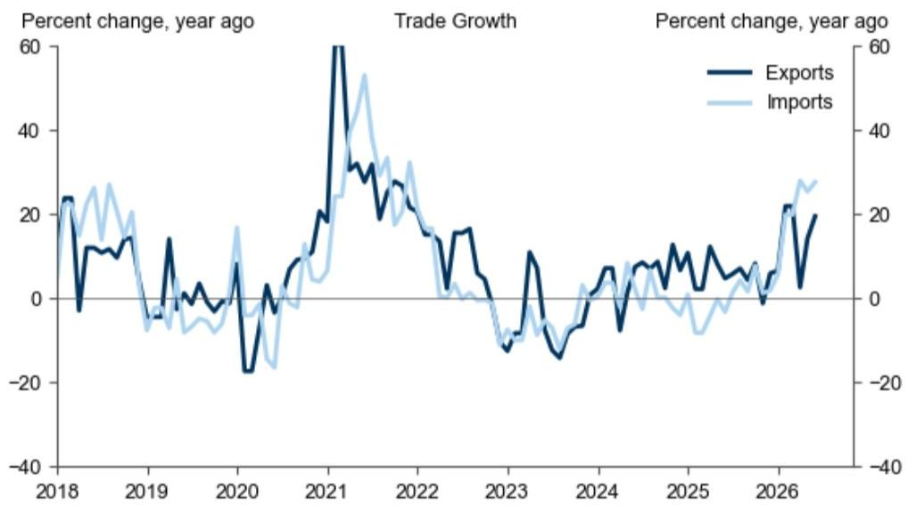
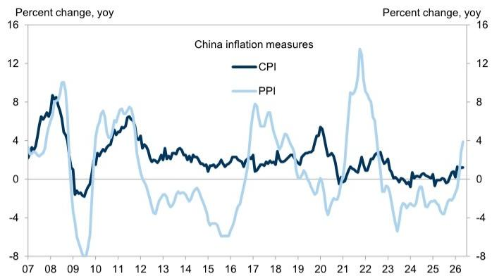

# GS：中国经济的“温差”正在扩大，市场低估了结构分化的烈度

五月的中国宏观数据，呈现出一幅让人难以简单下判断的画面。出口和进口双双超预期，PPI同比继续攀升，但CPI纹丝不动，信贷总量看似回暖，细节却透露出需求的疲软。GS在最新一期中国经济快报中，用一组看似矛盾的数据，揭示了一个核心判断：中国经济正在经历一轮罕见的“结构性温差”——供给端受AI资本开支和上游价格修复的拉动，而需求端，尤其是终端消费和私人投资，依然在低位徘徊。市场如果只看到贸易数据亮眼就认为经济复苏已经稳固，很可能误判了接下来的政策节奏和资产定价逻辑。这份报告真正的价值，不在于罗列数据，而在于点出了“温差”背后，哪些是可持续的结构性力量，哪些是短期扰动，以及政策可能如何回应。

## 1. AI资本开支已成中国贸易增长的“单引擎”，其可持续性才是关键问题

五月的贸易数据无疑是这份报告最亮眼的信号。出口同比增长19.4%，进口同比增长27.5%，双双超出市场预期。但GS并没有停留在“贸易强劲”这个结论上，而是直接指出了驱动力的集中度问题：半导体和自动数据处理设备（含数据中心设备）两项，合计贡献了五月出口和进口增长的大约一半。

这意味着，中国贸易的韧性，正在高度依赖AI资本开支这一条主线。这不是一个分散的、由全球消费需求回暖带动的全面复苏，而是一个由特定产业周期驱动的结构性脉冲。从服务器、芯片到数据中心基础设施，中国既是全球AI硬件供应链的重要出口方，也是关键设备和原材料的进口方。因此，贸易数据的两端同步走强，本质上反映的是同一个故事——全球AI投资热潮在实物层面的落地。

对于投资者而言，这里的关键问题不是五月的贸易数据好不好，而是这一增长引擎的可持续性。全球AI资本开支是否会在未来几个季度出现边际放缓？中国在AI硬件供应链中的份额是否面临地缘政治风险？这些问题，报告没有给出确定的答案，但它的数据框架已经为读者提供了追问的方向。如果AI资本开支出现周期性回落，中国贸易数据的“单引擎”模式将面临严峻考验。

## 2. PPI与CPI的“剪刀差”持续扩大，上游涨价无法传导至下游，暴露的是需求端的真实疲软

五月的通胀数据，是这份报告中最具警示意义的信号。PPI同比从四月的2.8%进一步攀升至五月的3.9%，但CPI同比却纹丝不动，维持在1.2%的水平。GS明确点出了这一现象背后的含义：上游价格涨幅无法传导至消费端，说明终端需求依然疲弱。

这一判断，与市场部分乐观情绪形成了鲜明对比。有人将PPI的回升解读为工业复苏的证据，但GS的数据分析表明，如果需求足够强劲，上游成本上涨理应通过产业链向消费者传导。传导链条的断裂，恰恰揭示了当前经济的核心矛盾：供给端（尤其是上游资源和AI相关制造业）在资本开支和价格修复的推动下表现活跃，但需求端——无论是居民消费还是企业投资——并未同步跟上。

信贷数据进一步印证了这一点。GS在报告摘要中直接指出，五月信贷数据虽然总量超预期，但细节显示贷款需求依然疲弱。这意味着，金融体系并不缺流动性，缺的是愿意借钱的主体。对于资产定价而言，这一判断的含义是：上游资源品和AI硬件相关资产的景气度，可能无法外溢到更广泛的消费和地产链条。投资者如果仅因PPI回升就押注经济全面复苏，可能忽略了需求端这一最大的不确定性。

## 3. “六网”投资计划并非新故事，但市场对其规模和政策节奏的定价仍不充分

近期有媒体报道称中国政府计划投入2万亿元用于数据中心建设，一度引发市场热议。GS在报告中对此做了冷静的“澄清”：这并非新消息，而是今年三月“十五五”规划中提出的“六网”建设的一部分。“六网”包括水网、新型电网、算力网（含数据中心）、下一代通信网、城市地下管网和物流网。GS引用发改委主任在三月份“两会”期间的表述指出，今年中国在“六网”领域的投资规模可能超过7万亿元，约占GDP的5%。

这一信息的重要性，不在于数字本身，而在于它揭示了政策框架的稳定性。市场往往对短期新闻反应过度，却对已经写入规划的中长期投资主线定价不足。数据中心投资2万亿元的新闻之所以引发关注，恰恰说明市场对“六网”这一政策框架的认知还不够深入。GS的报告实际上是在提醒读者：不要被短期新闻牵着走，真正的结构性投资机会，已经写在了规划里。

但这里同样存在一个未被充分讨论的问题：7万亿元的投资规模，究竟有多少是增量，多少是既有的投资计划被重新归类？不同网络的建设周期和回报特征差异巨大，数据中心和新型电网可能更具商业可行性，而城市地下管网和物流网的回报模式则更依赖政府付费。投资者需要进一步拆解“六网”的内部结构，才能判断哪些领域真正具备可持续的投资机会。

## 4. 报告尚未完全回答的关键问题：AI资本开支的“二阶效应”是否被高估

GS这份报告的数据框架非常清晰，但它也留下了一个重要的待解问题：AI资本开支对中国经济的拉动，除了直接体现在贸易和固定资产投资上之外，其“二阶效应”——即对就业、工资和消费的间接拉动——究竟有多大？

从当前的PPI和CPI数据来看，这种传导似乎非常有限。AI和数据中心建设创造了高技能岗位，但这类岗位的体量相对于庞大的就业人口而言依然很小。同时，AI对传统岗位的替代效应，可能在短期内对部分行业的就业和收入产生负面冲击。报告提到了“弱终端需求”，但没有深入探讨AI资本开支是否正在加剧而非缓解这种需求疲弱。

这是一个值得持续跟踪的问题。如果AI投资带动的就业和收入增长，不足以抵消其对传统行业的冲击和结构性失业，那么“供给强、需求弱”的格局就可能长期化。这种情况下，政策可能需要更多地从需求侧发力，而不是继续加码供给侧的投资刺激。

## 5. 读者应建立的观察框架：用“温差”而非“温度”来理解中国经济

对于产业决策者和高净值读者而言，GS这份报告提供的最有价值的分析框架，不是某一个数据点的好坏，而是“温差”这个概念。中国经济的不同部门、不同环节，正在以截然不同的速度运行。出口和上游产业在AI周期的驱动下高速运转，而消费和下游产业仍在低位徘徊。

在这样的框架下，投资者应该避免两种极端判断：一是因为贸易数据好就全面看多中国经济，二是因为消费数据弱就全面看空。正确的做法是，根据“温差”来重新配置资产和判断风险。与AI资本开支和“六网”建设相关的上游资产，可能仍有一定的景气度支撑；而与终端消费、房地产和传统制造业相关的资产，则需要等待需求端出现实质性的改善信号。

同时，这一框架也提供了一个观察政策走向的视角。如果“温差”持续扩大，政策的重心可能会从供给侧的投资刺激，逐步转向需求侧的消费补贴和收入支持。五月的CPI数据已经为政策提供了足够的理由——通胀不是问题，通缩压力才是。接下来，市场需要密切关注的是，政策工具箱中是否有新的、针对需求端的工具被启用。

GS这份报告，用不到一页的篇幅，勾勒出了一幅“温差”分明的中国经济图景。贸易数据亮眼，但依赖单一引擎；PPI回升，但传导链条断裂；投资计划宏大，但需求端尚未跟上。这些信号合在一起，指向一个结论：市场真正需要关注的，不是中国经济是“好”还是“坏”，而是不同部门之间的“温差”是否正在超出政策可控的范围。这份报告没有给出所有答案，但它提供了正确的提问方式。

Personal reading notes and learning share only. Not investment advice.

