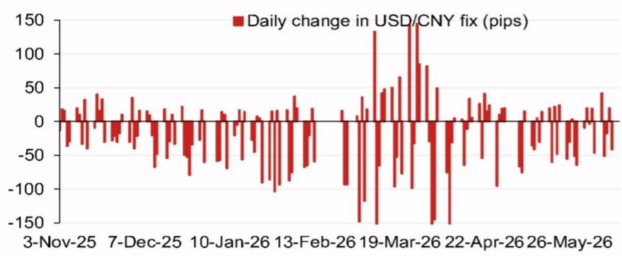
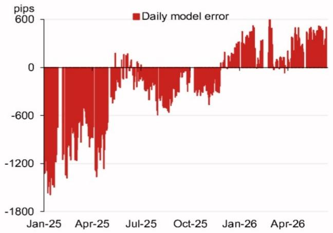

# NOM：人民币中间价模型正在发出一个被市场低估的政策信号

人民币中间价的设定机制，正在成为观察中国政策意图最精确的窗口。NOM最新发布的USD/CNY中间价模型测算给出了一个值得认真对待的信号：模型无逆周期因子调整的预测值为6.7544，较前一日官方中间价低565个基点，较前一日官方即期收盘价低72个基点。这不是一个普通的波动，而是一个系统性的偏移。

这份报告的真正价值不在于预测了一个具体的汇率数字，而在于它揭示了一个事实：在看似平静的中间价背后，模型与实际定价之间的偏差正在积累，而这种偏差本身就是政策意图的表达。对于关注中国资产定价、跨境资本流动和出口竞争力的决策者来说，理解这个偏差的含义，比猜测下一个中间价是多少更重要。

## 1. 模型偏差的累积方向，比任何单日预测都更具信号意义

NOM的模型误差图表显示了一个值得注意的趋势。从2025年1月到2026年4月，每日模型误差（即模型预测值与实际中间价之间的差值）从约-1800个基点逐步收敛至接近零，并在2026年4月转为正值约600个基点。这个轨迹说明了两件事。

第一，2025年初，实际中间价显著强于模型预测，这意味着当时政策端在主动引导人民币汇率偏强，以对抗贬值预期或支撑市场信心。第二，到2026年4月，误差方向逆转，实际中间价开始弱于模型预测，尽管幅度不大，但方向性的转变才是关键。

这个转变的含义是，政策端对汇率贬值的容忍度正在上升，或者更准确地说，政策端不再认为维持偏强汇率是当前优先目标。对于观察者而言，这比任何一次具体的中间价调整都更重要，因为它反映的是政策立场的边际变化，而不是战术性的日间操作。

## 2. 逆周期因子的使用频率和幅度，正在成为政策态度的晴雨表

NOM的模型给出了两种预测值：无逆周期因子调整的6.7544，以及包含逆周期因子调整的6.7757。后者比前者高约213个基点。逆周期因子本质上是一个政策工具，用于在不改变中间价形成机制的前提下，向市场传递政策意图。

2025年初，当模型误差高达-1800个基点时，逆周期因子很可能被积极使用来支撑人民币。而到了2026年4月，误差转为正值后，逆周期因子的使用力度可能已经在下降。NOM的报告没有直接给出逆周期因子的具体数值，但两个预测值之间的差值本身就是一种信号。

这个信号的含义是：政策端不再需要用逆周期因子来对抗市场的贬值压力，或者说，政策端认为当前的贬值压力是可控的，甚至是可以接受的。对于交易者来说，这意味著做空人民币的政策成本在下降，但同时也意味着政策端保留了随时重新启用逆周期因子的权力。

## 3. 2026年下半年的事件日历，正在为汇率政策的调整提供窗口

NOM的报告附带了2026年下半年的事件日历。这些事件不是孤立的政治日程，而是汇率政策可能发生调整的关键节点。7月底的政治局经济工作会议将定调下半年的经济工作优先级，11月在深圳举办的APEC会议是中国展示开放姿态的重要场合，而年底中国国家主席对美国的访问则是中美关系的最直接风向标。

每一个事件都对应着不同的汇率政策需求。APEC会议前后，政策端可能倾向于维持汇率稳定以营造良好氛围。而中美高层会晤前后，汇率可能成为谈判筹码的一部分。7月的政治局会议则可能根据上半年经济数据调整对出口和资本流动的态度。

这些事件之所以重要，不是因为它们本身会直接改变汇率，而是因为它们为政策端提供了调整汇率立场的合理窗口。一个在7月会议后出现的中间价变化，和一个在APEC期间出现的中间价变化，市场会给出完全不同的解读。

## 4. 报告尚未完全回答的关键问题：模型误差的容忍度边界在哪里

NOM的模型给出了预测值，但报告没有回答一个更关键的问题：政策端对模型误差的容忍度边界在哪里。2025年初的-1800个基点误差表明，政策端可以容忍非常大的偏差来维持汇率稳定。但当误差转为正值后，政策端会容忍多大幅度的偏差？

这个问题的答案取决于政策端对“贬值”的定义。如果政策端认为当前汇率水平已经充分反映了基本面，那么即便模型显示应该更弱，实际中间价也可能不会跟随。如果政策端认为贬值有助于对冲关税风险或提振出口，那么模型误差可能会进一步扩大。

NOM的模型本身不回答这个问题，但它的价值在于提供了一个基准。有了这个基准，市场可以更精确地衡量政策端每一次中间价调整的偏离程度，从而判断政策意图是战术性的还是战略性的。这是任何单一汇率预测都无法提供的分析框架。

## 5. 对决策者而言，真正需要关注的是模型与现实的偏离趋势，而非具体点位

对于持有人民币资产或关注中国市场的读者来说，这份NOM报告最重要的启示不是6.7544或6.7757这两个数字，而是“模型误差方向已变”这个事实。当误差从负转正，意味着政策端从“主动引导偏强”转向了“允许市场力量发挥更大作用”。

这个转变对资产定价的含义是深远的。如果政策端不再主动支撑汇率，那么人民币的贬值压力将更直接地反映在即期汇率上，而不是被中间价所掩盖。这意味着出口企业的汇兑损益将更加波动，跨境投资者的汇率对冲成本将上升，而以人民币计价的资产相对于美元资产的吸引力将发生变化。

同时，政策端的容忍度并非无限。一旦模型误差扩大到某个临界点，或者外部环境出现意外变化，政策端随时可以重新收紧。因此，决策者需要持续跟踪模型误差的变化趋势，而不是只看某个时间点的中间价水平。

## 6. 模型误差的收敛本身，就是一个值得进一步探讨的观察框架

NOM的模型误差图表显示了一个从-1800到+600的收敛过程。这个收敛本身就是一个值得拆解的现象。是模型预测在向实际中间价靠拢，还是实际中间价在向模型预测靠拢？如果是前者，说明模型本身在自我修正；如果是后者，说明政策端在主动调整。

从数据趋势看，2025年初的大幅负误差在随后几个月中逐步缩小，这个过程很可能是双向的：一方面，模型预测随着市场环境变化而调整；另一方面，政策端也在逐步放松对中间价的干预。到2026年4月误差转正时，可能意味着政策端的放松已经超过了模型所隐含的合理水平。

这个观察框架的实用价值在于：它提供了一个动态的、可量化的政策监测工具。任何一次中间价的调整，都可以通过模型误差的变化来解读其政策意图。误差扩大意味着政策干预加强，误差缩小意味着政策干预减弱。这个框架不需要依赖对政策意图的主观猜测，而是基于可验证的数学关系。

## 欢迎来星球微信群里继续讨论

NOM这份报告的完整价值，远不止于我们上面讨论的这几个维度。报告中还包含了更详细的事件日历、模型假设的敏感性分析、以及不同情景下的汇率路径推演。这些内容我们无法在一篇文章中全部展开，但它们对于理解人民币汇率的定价逻辑至关重要。

特别是，模型误差的容忍度边界到底在哪里，逆周期因子在什么条件下会被重新激活，以及2026年下半年的事件如何影响汇率政策的节奏——这些问题都需要结合报告的完整数据和假设来深入讨论。欢迎来星球微信群，与我们一起拆解这份报告的每一个细节，探讨人民币汇率的下一步走向。

Personal reading notes and learning share only. Not investment advice.

