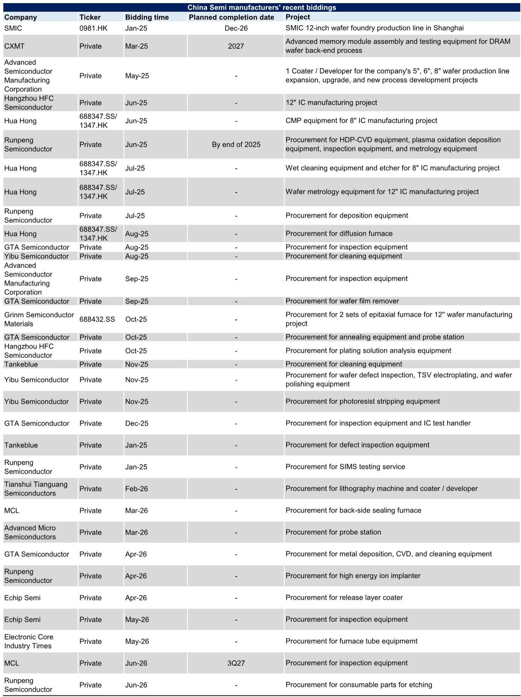
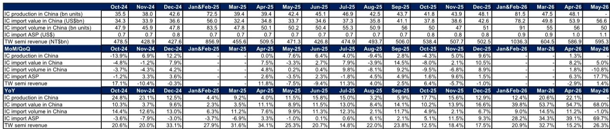
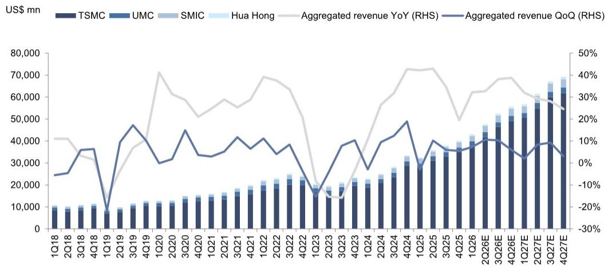

# China’s Semiconductor Import Surge Is Not About Volume—It Is About a Structural Shift in Value

The most important number in the latest Greater China semiconductor data is not the 68.0% year-on-year jump in IC import value for May 2026. It is the fact that IC import volume actually declined by 1.0% year-on-year in the same month. When value rises by more than two-thirds while volume falls, the entire conversation about China’s semiconductor demand must be reframed. This is not a story of simply buying more chips. It is a story of buying fundamentally different, higher-value chips at rapidly accelerating prices.

The implied IC import average selling price surged 69.7% year-on-year in May 2026, following a 39.1% increase in April. These are not cyclical pricing fluctuations. They represent a structural repricing of the semiconductor content flowing into China, driven by the intersection of generative AI deployment, advanced driver-assistance systems, and a deliberate national strategy to move up the value chain. The market is not just growing; it is upgrading.

Inventory data reinforces this interpretation. China’s electronics sector days of inventory stood at 61 days in April 2026, essentially in line with the 59 days recorded in April 2025 and the historical average. There is no evidence of panic buying or stockpiling distortion. The demand is real, it is end-use driven, and it is increasingly concentrated in premium product categories.

This article examines what the April-May data actually reveals about the trajectory of China’s semiconductor ecosystem, where the risks and opportunities lie for investors, and why the most important analytical question remains unanswered.

## The Divergence Between Import Volume and Import Value Reveals a Market That Is Reconfiguring, Not Just Expanding

For most of the past two years, IC import volume and value moved in the same direction. In April 2026, volume grew 11.2% year-on-year while value grew 54.7%. In May, volume turned negative at -1.0% while value accelerated to 68.0%. This divergence is not a statistical anomaly. It is a signal that the composition of imports is shifting decisively toward higher-ASP devices.

The data implies that China is importing fewer, but far more expensive, chips. The obvious candidates are advanced logic devices for AI accelerators, high-bandwidth memory, and complex system-on-chip designs for autonomous driving platforms. These are not commodity components. They are the building blocks of a new generation of computing infrastructure.

What makes this shift strategically significant is that it is happening alongside robust domestic production. IC production in China grew 22.1% year-on-year in April 2026, up from 20.6% in March. Domestic fabs are running at high utilization, yet the country still needs to import premium devices that domestic suppliers cannot yet produce at scale or at the required performance levels. This creates a two-tier market: a domestic tier serving mature-node applications and a import-dependent tier for leading-edge technology.

The implication for investors is clear. Companies positioned in the advanced node ecosystem—whether in design, foundry, or advanced packaging—are capturing a disproportionate share of value creation. Firms that remain focused on mature-node, high-volume, low-ASP products face a different, more competitive dynamic.

## Taiwan Semiconductor Revenue Growth Confirms That the Foundry Cycle Is Broadening, Not Peaking

Aggregate revenue for major Taiwan-listed semiconductor companies rose 26.3% year-on-year in May 2026, accelerating from 15.2% in April. On a month-on-month basis, foundry revenue grew 1.5%, IC design grew 0.9%, and OSAT grew 1.5%. These are not signs of a cycle topping out. They indicate broad-based demand across the value chain.

The acceleration in Taiwan’s semiconductor revenue is particularly instructive because Taiwan’s foundries serve both domestic and Chinese customers. The fact that Taiwan revenue growth reaccelerated in May while China’s IC import volume declined suggests that the mix shift toward higher-value devices is happening across the entire Greater China ecosystem, not just within mainland China’s direct procurement.

This also points to a structural change in how the supply chain operates. The days when China imported large volumes of low-cost chips for consumer electronics assembly are fading. The new normal is a supply chain optimized for AI workloads, automotive electronics, and high-performance computing. Each of these end markets demands chips with higher transistor counts, larger die sizes, and more advanced packaging—all of which drive up ASPs and revenue per wafer.

For investors, this means that foundry and OSAT exposure remains attractive, but the differentiation will come from which players have the technology to serve the premium segment. Foundries with leading-edge process nodes and advanced packaging capabilities are likely to see sustained pricing power, while those limited to legacy nodes may face margin pressure as capacity expands.

## The Semiconductor Production Equipment Data Raises a Puzzle That the Report Does Not Fully Resolve

One of the most intriguing data points in the report is the behavior of semiconductor production equipment imports. In April 2026, China’s SPE import value fell 4.2% year-on-year and 19.8% month-on-month to USD 3.0 billion. This stands in sharp contrast to the robust IC production and import value growth.

At first glance, this seems contradictory. If China is ramping up domestic production and shifting toward higher-value chips, why would equipment imports decline? The report notes that lithography import volume from the Netherlands fell 40% year-on-year to just 9 units, with ASP down 39%. This suggests that the equipment import decline is concentrated in specific categories, particularly advanced lithography.

One possible explanation is that China is front-loading equipment purchases in anticipation of further export controls, and the April dip represents a digestion period after a surge in prior months. Another possibility is that the equipment mix is shifting toward domestic or non-Dutch suppliers, which may not be fully captured in the import data. A third explanation, which the report does not explore in depth, is that China’s domestic equipment suppliers are beginning to fill gaps in the value chain, reducing the need for certain imports.

The report does provide a counterpoint: semiconductor test equipment import value surged 48.4% year-on-year and 46.6% month-on-month in April, with import ASP jumping 234.9% month-on-month. This suggests that while certain front-end equipment categories are under pressure, back-end and testing equipment demand is accelerating. The divergence between front-end and back-end equipment imports is itself a meaningful signal that warrants further investigation.

The open question for investors is whether the equipment import slowdown is temporary or structural. If it is temporary, the capex cycle for China’s semiconductor industry remains intact. If it is structural, it implies that capacity expansion is hitting a constraint that could limit future production growth.

## A Decision Framework for Investors: Three Filters for Positioning in China Semiconductors

Based on the patterns in the April-May data, investors should evaluate semiconductor exposure through three lenses rather than relying on aggregate growth rates.

First, assess end-market exposure. The data clearly shows that generative AI and automotive ADAS/AD are the primary demand drivers. Companies with direct revenue exposure to these end markets are likely to benefit from both volume growth and ASP expansion. Companies serving legacy consumer electronics or industrial applications face a more uncertain demand environment.

Second, evaluate technology positioning within the value chain. The divergence between import value and volume demonstrates that the market is rewarding technology differentiation. In design, this means companies with advanced node IP or AI-specific architectures. In foundry, it means players with leading-edge process capability. In equipment, it means suppliers of test and advanced packaging gear, which are seeing accelerating demand.

Third, monitor the equipment import data as a leading indicator. The decline in front-end equipment imports, particularly lithography, could signal a future capacity constraint. If equipment imports do not recover in the coming months, it may indicate that China’s domestic production growth is approaching a ceiling. Conversely, a rebound in equipment imports would confirm that the capacity expansion cycle remains on track.

The report expresses a positive view on companies with strong company-specific drivers such as new product ramps, product mix upgrades, and market share gains. This is consistent with the data. Aggregate demand is solid, but the dispersion between winners and losers is likely to widen as the market differentiates based on technology capability.

## What the Data Does Not Yet Tell Us About the Sustainability of the ASP Uplift

The most critical unanswered question in the report is whether the ASP uplift is sustainable. IC import ASP has risen from USD 0.7 in mid-2024 to USD 1.1 in May 2026. That is a 57% increase in two years. If this trend continues, China’s IC import bill could reach levels that are economically unsustainable, even for a government willing to subsidize strategic industries.

There are two scenarios. In the first scenario, the ASP uplift reflects a permanent shift in the product mix toward higher-value devices. As China deploys AI infrastructure at scale and automates its vehicle fleet, the average chip entering the country will naturally be more complex and expensive. In this scenario, the import value growth is a structural feature of the market.

In the second scenario, part of the ASP increase is driven by supply constraints and premium pricing for scarce advanced chips. If capacity expands and competition increases, ASPs could normalize. The report’s own data shows that IC import volume declined in May, which could indicate demand destruction at current price levels.

The report does not take a definitive position on this question, and neither can a single month of data. But the distinction matters enormously for valuation. If the ASP uplift is structural, companies in the advanced node value chain deserve premium multiples. If it is cyclical, current revenue levels may prove unsustainable.

## Why This Analysis Points to the Need for a Deeper Look at the Original Data

The April-May data set contains more nuance than any summary can capture. The divergence between import value and volume, the behavior of equipment imports across categories, and the relationship between domestic production and import requirements all deserve close examination. The report includes detailed exhibits on IC production trends, inventory dynamics, and revenue trajectories that reveal patterns invisible in headline numbers.

For serious investors, the question is not whether China’s semiconductor market is growing. It is clearly growing. The question is which parts of the value chain are capturing the growth, and whether the current pricing environment is sustainable. The data supports a selective, bottom-up approach that favors companies with proprietary technology and exposure to the highest-growth end markets.

Join the community to read the full report and review the original charts.

*This article is for learning and discussion only and does not constitute investment advice.*

Personal reading notes and learning share only. Not investment advice.

