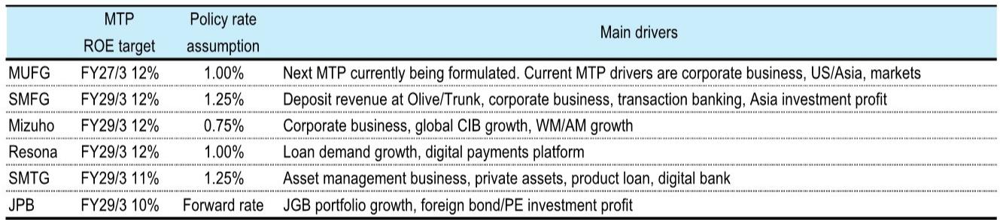
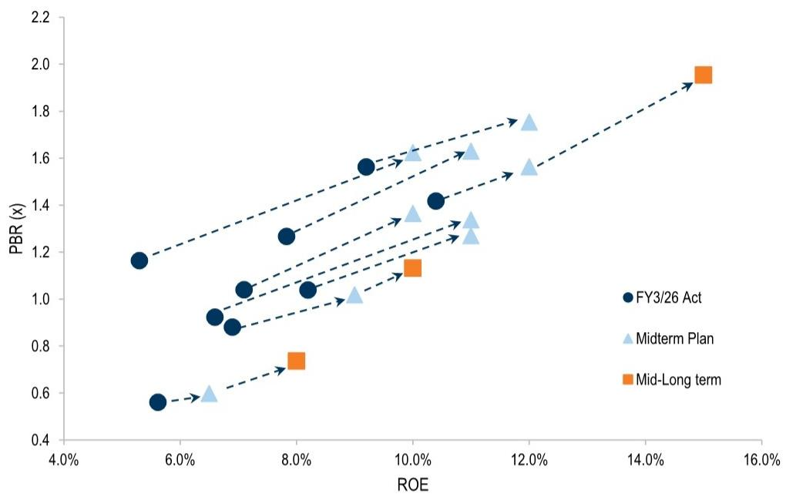

# GS：日本银行股的估值重估才刚刚开始，市场低估了ROE目标的战略含义

当市场还在争论日本央行加息路径的不确定性时，一份来自GS的研报揭示了一个更值得关注的信号：日本主要银行正在系统性地将ROE目标从“可接受的10%”上调至“全球同业级别的15%”。这不是简单的财务预测调整，而是日本银行业经营逻辑的根本性转变。

三菱UFJ金融集团（MUFG）预计本财年就能实现其当前中期计划的12% ROE目标，并已明确将目光投向“中双位数”水平。三井住友金融集团（SMFG）更是在今年3月就向市场抛出了15%的中长期ROE目标，并详细拆解了实现路径。Mizuho金融集团（Mizuho）则将中期ROE目标从10%提升至12%，并直言要“超越PBR 2.0倍”。

这些数字背后，隐藏着一个更大的叙事：日本银行股长期以来被视为“低增长、低回报”的估值折价，可能正在被系统性地修复。GS的报告提供了一个关键的分析框架——当ROE从当前的6-10%区间向中期目标的10-12%甚至中长期目标的15%迈进时，沿着当前的P/B-ROE斜率推算，对应的市净率倍数存在显著的上行空间。

这不是一个短期交易信号，而是一个结构性重估的起点。

## 1. 中期计划中的ROE目标不再是“愿景”，而是“路线图”

GS这份报告的核心贡献，在于它系统性地梳理了日本主要银行在最新一轮财报季中更新的中期计划。这些计划不再是模糊的“我们希望提高盈利能力”，而是包含了具体的政策利率假设、业务驱动因素和量化目标。

以SMFG为例，其12%的中期ROE目标建立在1.25%政策利率假设之上，驱动因素包括Olive/Trunk存款平台收入、公司业务、交易银行业务以及亚洲投资利润。Mizuho的12%目标则基于0.75%的政策利率，更依赖公司业务、全球投行和财富管理增长。而Resona控股在1.0%政策利率假设下设定12%目标，若利率升至1.5%，其ROE目标可达到14%——这已经超过了部分大型银行的水平。

这些目标之所以可信，是因为它们不再依赖单一的利率上行假设。报告明确指出，利润增长不仅受益于国内利率上升带来的存贷利差扩大，还来自广泛的对金融功能的需求：旺盛的国内融资需求、活跃的资本市场、企业重组和业务继承加速、无现金支付普及，以及“从储蓄到投资”的长期趋势下资产管理产品的提供。

换句话说，日本银行的利润增长引擎正在从单一利率驱动转向多元业务驱动。这是ROE目标可实现的底层逻辑。

## 2. P/B-ROE框架下的“隐形上行空间”：一个需要关注的量化信号

GS报告中最具洞察力的部分，是其对P/B-ROE关系的图形化展示。这张散点图揭示了当前日本银行股的定价状态与中期计划目标之间的差距。

当前，ROE在6-10%区间的银行股，其P/B倍数在0.6-1.5倍之间。但如果沿着同样的P/B-ROE斜率推演，当ROE逐步提升至中期计划的10-12%时，对应的P/B倍数将进入1.35-1.75倍区间。而对于那些设定了15%中长期ROE目标的银行，其对应的P/B倍数可能达到1.95倍。

这里需要强调的是，GS报告做了审慎的假设：“假设其他条件（如外部环境）保持不变”。这个假设本身就包含了不确定性——利率环境、经济增速、信用周期都可能发生变化。但即便如此，这个框架提供了一个清晰的参照系：当前市场对日本银行股的定价，可能尚未充分反映中期计划中ROE提升的含金量。

值得注意的另一个细节是，日本邮政银行（Japan Post Bank）在最新中期计划中预计ROE将从FY3/26的5.3%大幅升至FY3/29的10%。其经常性利润的增长预期中，约8000亿日元来自日元利率资产驱动（主要是JGB组合重建），2000亿日元来自风险资产驱动（如PE和外国债券投资信托）。这进一步说明，即使是被市场视为“保守”的机构，也正在积极利用利率环境变化。

## 3. “超越PBR 2.0倍”：Mizuho的战略宣言揭示了什么

在众多银行中，Mizuho金融集团的表述最为直接和引人注目。报告引用其声明：“明确表示意图利用其稳健稳定的业务组合优势，通过提升ROE和PER，实现与全球同业相当的P/B水平（‘Beyond PBR 2.0x’）。”

这句话的潜台词是：日本银行股长期以来低于1倍P/B的交易状态，是市场对其盈利能力和增长前景的系统性低估。而Mizuho认为，当ROE提升至与全球同业相当的水平时，P/B倍数也应该向全球标准回归。

这个逻辑是否成立，取决于两个关键变量：一是日本银行的ROE能否持续提升至全球水平；二是市场是否愿意给予日本银行与欧美同业相同的估值倍数。GS报告并未直接回答第二个问题，但提供了观察框架——如果ROE提升是可持续的，且市场逐步认可其业务转型的成果，那么估值修复的空间是客观存在的。

从SMFG的案例来看，其15%的中长期ROE目标已经参考了美国银行同业的ROE水平和两个市场之间的利差。这表明，日本银行管理层自身也在用全球基准来校准目标，这本身就具有信号意义。

## 4. 报告尚未完全回答的关键问题：ROE提升的可持续性与信用周期的交互

GS这份报告的严谨之处在于，它没有回避不确定性。尽管中期计划中的ROE目标令人鼓舞，但有几个关键问题仍然悬而未决：

第一，政策利率假设的敏感性。报告显示，不同银行的中期计划假设的政策利率在0.75%至1.25%之间，部分银行仅假设0-2次额外加息。如果日本央行的加息节奏慢于预期，或者利率最终未能达到这些假设水平，ROE目标的实现将面临挑战。

第二，信用周期的潜在影响。日本经济虽然处于复苏通道，但全球经济增长放缓、地缘政治风险等因素仍可能对日本企业盈利和信贷质量产生冲击。报告没有深入讨论信用成本上升对ROE的侵蚀作用。

第三，业务转型的“二阶效应”。银行向投行、财富管理、数字银行等高增长领域转型，必然伴随着成本投入和风险暴露的重新配置。这些转型举措的ROE贡献是否能够如期实现，仍需时间验证。

第四，P/B-ROE斜率的稳定性。GS报告中的P/B-ROE关系图建立在当前市场定价基础上。如果市场对日本银行股的风险溢价发生变化（例如，因日本经济结构性改革预期改善），P/B-ROE斜率本身可能发生变化，从而改变估值测算结果。

## 5. 投资者的观察框架：从“利率交易”转向“ROE验证”

对于关注日本银行股的投资者而言，GS这份报告提供了一个清晰的行动框架：将注意力从短期的利率预期博弈，转向中期ROE目标的验证过程。

具体而言，有几个关键指标值得持续跟踪：

一是各银行中期计划的执行进度。报告特别提到，GS计划“跟踪各银行朝着其披露的ROE目标推进的战略进展”。这意味着，未来几个季度的财报数据、业务组合变化、成本控制效果，将成为判断ROE目标可信度的关键依据。

二是政策利率假设与实际路径的差距。不同银行对利率的敏感性不同。Resona控股在1.5%政策利率下ROE可达14%，说明其存款基础对利率上行高度敏感。而Mizuho的0.75%假设相对保守，但也意味着其对利率上行的依赖度较低。

三是P/B-ROE关系的动态变化。如果部分银行率先实现或超越其ROE目标，市场是否会给予其更高的P/B倍数？这将验证估值修复逻辑是否成立。

四是全球同业比较。SMFG和MUFG已经明确将美国银行作为ROE和P/B的参照系。如果日本银行与欧美同业的估值差距开始收敛，将是一个重要的结构性信号。

日本银行股的重估故事，本质上是一个关于“盈利可持续性”和“估值合理性”的叙事。GS的报告提供了一个严谨的分析起点，但最终的答案，需要在实际经营数据和市场定价中逐步浮现。

---

以上内容是基于GS研报《Japan Banks: Refocusing on new midterm plan ROE targets, potential P/B upside》的深度解读。报告中还包含了更多关于各银行具体驱动因素的拆解、政策利率假设的敏感性分析，以及一张关键的P/B-ROE散点图——这张图直观地展示了当前定价与潜在目标之间的差距。如果你想进一步讨论这些银行之间的差异化竞争策略，或者想看看GS对特定银行的详细测算，欢迎来星球微信群里继续交流。我们会在群内分享原始研报的完整图表和更多延伸分析。

Personal reading notes and learning share only. Not investment advice.

