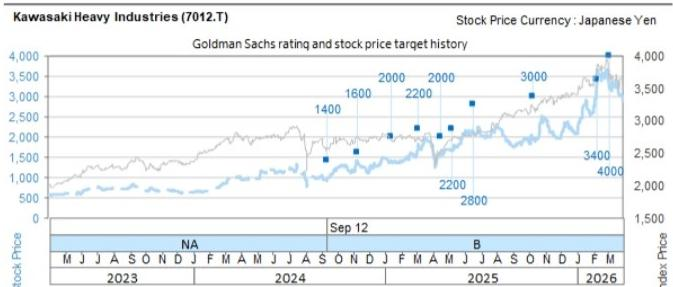
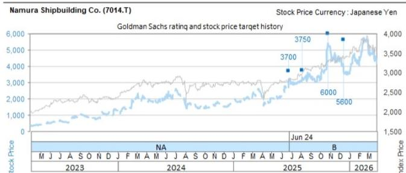
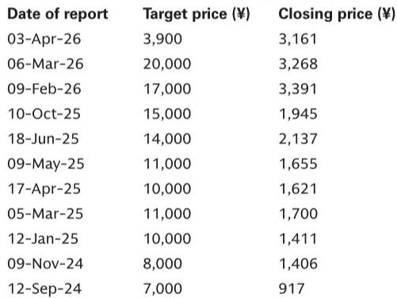

# GS：日本造船业重启LNG船建造，真正的信号是供给侧的“再入场”而非需求爆发

2026年6月15日，日本经济新闻一则报道，在资本市场投下了一颗信号弹：今治造船、川崎重工、名村造船所计划在2035年左右联合重启LNG运输船的建造。对于全球造船业而言，这则消息的价值不在于“日本要造更多船”，而在于一个曾在价格战中主动退出的玩家，正在以新的联盟形式重新入局。

GS第一时间发布了点评。这份报告的核心判断，不是需求端的景气度，而是供给端的结构性变化——日本造船业正在从“被动退出”转向“主动再配置”。这一变化，对投资者理解全球造船产能格局、日本造船企业的中长期盈利能见度，具有框架性的意义。

## 1. 日本造船业的重返，不是扩张，而是“替代性供给”的战略卡位

理解这则新闻，首先要回到一个基本事实：日本造船业在LNG船领域，已经缺席了整整七年。自2019年最后一艘LNG船交付后，日本船厂在与中国和韩国对手的价格竞争中全面撤退。

GS报告明确指出，目前一艘17万立方米级LNG船的单价约为2.5亿美元（按160日元兑1美元汇率计算，约合400亿日元）。在这个价位上，日韩中三方各有优势：韩国在大型化、标准化方面领先；中国在成本控制和规模化方面占据主动；日本则在精密焊接、复杂船型设计上仍有积累。

日本企业此次联合重启，其战略意图不在于争夺全球市场份额，而在于确保“本土能源供应链的自主可控”。报道中提到，目前约有100艘LNG船专门为日本供应液化天然气，按20年替换周期计算，每年需要约5艘新船来维持运力。这意味着，即便没有外部订单，仅日本国内的替换需求，就足以支撑一个每年1200亿至2000亿日元的稳定市场。

GS估算，当前日本造船业（仅限商船）的市场规模约为1.3万亿至1.5万亿日元。这意味着，LNG船建造业务一旦启动，将贡献约8%至15%的增量收入。这不是“爆发式增长”，但这是一个极其稳定的、可预测的现金流来源。

## 2. 联盟模式的真正看点：技术共享如何解决“过去退出的根本原因”

日本船厂当年退出LNG船建造，根源在于成本结构无法与中韩对手竞争。如今，三家企业的联合方案，试图从根本上解决这个问题。

报道披露，三家公司将共享LNG船设计技术，并集中调配焊接工人。核心提案是利用川崎重工的坂出工厂作为生产基地。这背后的逻辑是：将分散的技术能力、人力资源和产能集中到一个平台上，通过共享来降低单位成本。

这里需要特别关注“焊接工人”这一细节。LNG船的核心技术难点之一，是殷瓦钢（Invar）的焊接工艺，这种材料在极低温下保持稳定，但对焊接精度要求极高。日本在这一领域有深厚积累，但熟练工人的培养周期极长。三家企业共享焊工资源，意味着劳动力瓶颈将得到缓解，同时也意味着产能利用率可以更高。

GS对此的判断是，如果该计划落地，对于名村造船（买入评级）和川崎重工（中性评级）而言，将提供“稳定的中长期需求”。但报告同时谨慎指出，对于川崎重工，需要仔细审视产品组合对利润率的影响。这里隐含的担忧是：如果联合建造模式下的定价低于川崎重工独立建造的边际成本，那么即便订单量增加，利润贡献也可能低于预期。

## 3. 政府支持的“隐形杠杆”：2030年代的政策承诺能否转化为订单保障

这则新闻中，日本政府的角色不容忽视。报道提到，政府将考虑通过向船东提供“导入补助金”来支持这一计划，并计划在2026年6月制定的“官民投资路线图”中纳入相关细节。

这是典型的日本式产业政策：政府不直接干预企业决策，但通过提供需求侧补贴，降低船东更换老旧船舶的成本，从而间接创造订单。从逻辑上看，这一政策设计是合理的——如果船东因环保法规或运营成本压力不愿意主动更换船舶，政府补贴可以加速替换周期。

但这里有一个关键的未解问题：补贴的规模和落地节奏。GS报告没有对此展开，但投资者需要意识到，任何政府补贴都面临预算约束和政治周期风险。2026年6月的路线图能否如期制定，补贴金额是否足以覆盖船东的替换成本，都将直接影响这一计划的可行性。

从更宏观的视角看，这一政策信号表明，日本政府正在将“能源安全”与“造船业竞争力”绑定。如果这一逻辑成立，那么日本造船业的复苏，将不仅仅是一个商业故事，而是一个国家战略选择。

## 4. 报告尚未完全回答的关键问题：利润率的“天花板”在哪里

GS报告对三家企业的评级差异，隐藏着一个值得深挖的问题：同一项业务，对不同公司的影响为何不同？

对于名村造船，GS给出买入评级，12个月目标价5600日元，基于2.6倍市净率。对于川崎重工，评级仅为中性，目标价3900日元，基于14倍EV/EBITDA但附加20%的行业相对折价。这一折价，很大程度上源于川崎重工的多元化业务结构——它不仅造船，还生产摩托车、航空发动机、工程机械等。GS在风险提示中明确指出，需要关注“低盈利业务板块的重组进展”以及“综合企业折价”的问题。

这意味着，即便LNG船业务为川崎重工带来增量收入，其利润能否真正体现在股价中，取决于管理层能否有效剥离或改善其他亏损业务。对于名村造船，情况则更为清晰：它的业务相对聚焦，LNG船业务的增量几乎可以直接转化为利润增长。

但GS报告没有完全展开的是：联合建造模式下，三家企业之间的利润分配机制。技术共享、焊工共享、产能共享，听起来很美好，但实际操作中，如何定价、如何分摊成本、如何分配订单，这些细节将直接决定每家公司的实际收益。报告提到“leading proposal is to utilize Kawasaki Heavy Industries' Sakaide Works as the production base”，这意味着川崎重工可能承担更多的固定成本，而名村造船和今治造船则更多是技术和人力的输出方。这种不对称的投入结构，是否会转化为不对称的利润分配，是投资者需要持续跟踪的问题。

## 5. 对投资者的观察框架：三个需要持续验证的假设

基于GS报告的逻辑，投资者可以将以下三个假设作为观察日本造船业未来发展的框架：

第一，替换需求是否真的“刚性”。GS报告假设“100艘LNG船每20年替换一次”，但这一假设成立的前提是，现有LNG船的使用寿命确实为20年，且船东愿意在2030年代集中替换。如果船东通过延长船舶寿命或转向其他燃料方案来推迟替换，那么需求预测将面临下调风险。

第二，成本竞争力能否持续改善。日本船厂退出LNG船建造的根本原因是价格竞争。如今，通过联盟模式降低了部分成本，但能否在价格上与中韩对手抗衡，仍是一个问号。GS报告没有给出具体的成本对比数据，这需要投资者从后续的订单价格和利润率中寻找答案。

第三，政府补贴的“承诺”与“兑现”之间的差距。日本政府在过去十年中多次提出支持造船业的计划，但实际效果参差不齐。2026年6月的路线图是一个关键节点，届时补贴的具体金额、覆盖范围、申请条件将首次明确。在此之前，市场对LNG船业务的定价，可能更多基于预期而非确定性。

---

GS这份报告的真正价值，在于它提供了一个观察日本造船业“供给侧再配置”的框架。LNG船建造的重启，不是简单的“产能扩张”，而是“产能重组”——将分散的技术、人力、产能集中到一个平台上，以应对一个稳定但非爆发式的市场需求。

但正如报告所暗示的，这一战略的成功，不仅取决于企业自身的执行力，还取决于政府政策的落地节奏、成本竞争力的持续验证，以及利润分配机制的合理性。这些不确定性，正是投资者需要持续跟踪和讨论的核心议题。

欢迎来星球微信群里继续讨论。我们会在社群中持续跟踪2026年6月“官民投资路线图”的制定进展，以及三家企业后续的成本数据和订单情况，帮助大家在不确定性中寻找确定性。

Personal reading notes and learning share only. Not investment advice.

