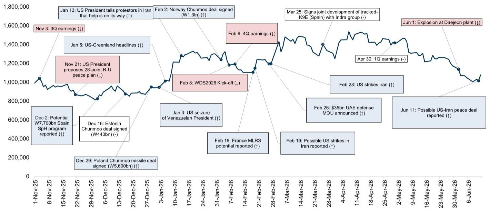
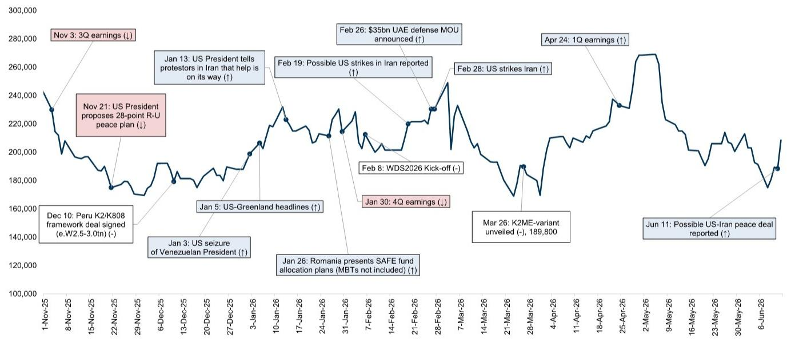
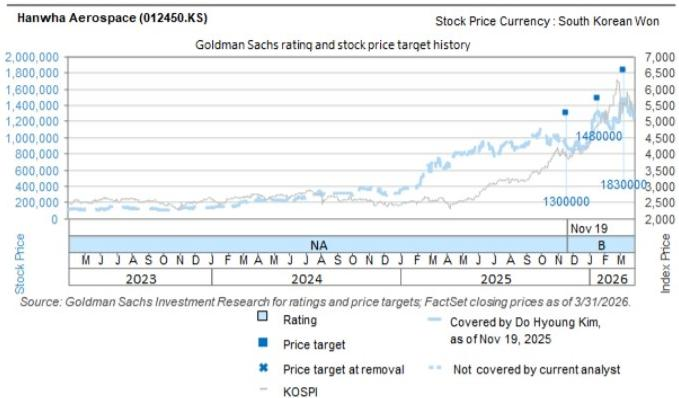

# South Korea's Defense Stocks Are Not a Geopolitical Bet—They Are a Structural Re-Rating Opportunity Waiting for a Single Catalyst

The market is treating Hanwha Aerospace and Hyundai Rotem as binary options on Middle East peace. That is a mistake. What the sell-off since April has revealed is not a deterioration in fundamentals, but a pricing mechanism that has become pathologically dependent on headlines. The share price decline of both names—despite an order pipeline that, at 100% win-rate, would generate earnings per share compound annual growth rates of 32% and 48% respectively through 2028—represents a disconnect that strategic investors should find deeply interesting.

On the surface, the logic of the sell-off appears self-evident. After a sharp re-rating in March and April driven by expectations of swift Middle Eastern restocking of air defense systems, the subsequent escalation of regional tensions halted discussions on potential order pipelines. With limited sector catalysts following first-quarter results, the market had little to anchor on beyond deteriorating sentiment. But this narrative conflates a temporary pause in negotiations with a structural impairment of demand.

The recent strength in both stocks, triggered by media reports of a potential US-Iran peace agreement, was not a speculative spike. It was the market beginning to price in what should have been obvious: the underlying demand drivers for South Korean defense exports have not changed. What has changed is the market's willingness to discount that demand against a geopolitical risk premium that is now excessive. The peace agreement is not the thesis. It is merely the key that unlocks the market's ability to see the thesis clearly.

This is a moment that rewards analytical patience. The sector's valuation compression has created a situation where the downside is bounded by fundamental backlogs, while the upside is a function of probability-weighted order wins that the market has temporarily dismissed. For investors who can separate geopolitical noise from structural demand, the current setup offers an asymmetric risk-reward profile that is rare in defense equities.

## The Market Has Mistaken a Negotiation Pause for a Demand Problem

The share price trajectories of Hanwha Aerospace and Hyundai Rotem since their April highs tell a story that is easy to misinterpret. Both stocks declined steadily through May and early June, underperforming the KOSPI by a widening margin. The narrative that emerged was straightforward: Middle Eastern tensions had frozen order pipelines, and without near-term catalysts, the sector had lost its momentum.

This interpretation is superficially plausible but analytically incomplete. The orders in question—air defense systems, multiple launch rocket systems, and main battle tanks—are not discretionary purchases that can be canceled or indefinitely postponed. They are responses to identified capability gaps that have been validated by the very conflicts that are now delaying their finalization. The paradox is that the same geopolitical tensions that have put these discussions on hold are also reinforcing the strategic rationale for the orders themselves.

What the market has priced in is not a reduction in the probability of these orders materializing, but an increase in the uncertainty around their timing. The distinction matters. A timing delay compresses near-term valuation multiples but does not destroy long-term earnings power. The market, however, has been treating the delay as if it were a cancellation. The result is that both stocks now trade at valuations that imply a significantly lower probability of order wins than the underlying strategic realities warrant.

The evidence for this mispricing is visible in the order pipeline data. At a 100% win-rate, Hanwha Aerospace's potential orders total 95.5 trillion won, while Hyundai Rotem's stand at 89.5 trillion won. Even at a conservative 50% win-rate, these figures exceed the firms' projected overseas revenues for 2026 through 2030 by a wide margin. The market is effectively discounting these pipelines at a rate that assumes a probability of success well below 50%, despite the fact that many of these programs are at advanced stages of discussion and are driven by sovereign defense requirements that are not subject to normal commercial negotiation cycles.

## The Peace Agreement Is Not the Catalyst—It Is the Permission Structure for Valuation Re-Rating

Friday's share price strength in response to reports of a potential US-Iran peace agreement was widely characterized as a relief rally. That framing understates the significance of what is happening. A peace agreement in the Middle East would not create new demand for South Korean defense equipment. What it would do is remove the primary obstacle to the market's willingness to price in existing demand.

The distinction is critical for understanding the investment opportunity. The order pipelines for Hanwha and Rotem are not contingent on peace. They are contingent on the resolution of negotiation standstills that were caused by the conflict itself. Once the geopolitical environment stabilizes, the conversations that have been paused can resume—and the underlying demand that drove those conversations in the first place remains intact.

This means that the market is currently offering investors a choice. They can wait for the peace agreement to be finalized and then chase the stocks higher as the market gradually reprices the order pipelines. Or they can recognize that the probability of eventual order wins is already high, that the valuation discount is already excessive, and that the peace agreement is merely the most visible of several potential catalysts that could trigger a re-rating.

The asymmetry is compelling. If the peace agreement materializes, the stocks should re-rate substantially as the market begins to price in the order pipelines that it has been ignoring. If the peace agreement does not materialize, the downside is limited by the existing backlogs and the eventual inevitability of order finalizations once the geopolitical environment stabilizes. The risk is not that the orders disappear—it is that they take longer than expected to materialize.

## The Earnings Power Embedded in the Order Pipeline Is Underappreciated

The most striking feature of the current valuation is the disconnect between the potential earnings growth implied by the order pipeline and the earnings growth that the market is currently pricing. Under the probability-weighted model, Hanwha Aerospace's earnings per share compound annual growth rate from 2025 to 2028 is 32%, while Hyundai Rotem's is 48%. These are not aspirational targets. They are derived from specific, identifiable order programs that have been reported in media and discussed with government counterparts.

To understand why the market is not pricing this growth, one must look at the composition of the order pipeline. For Hanwha, the largest potential orders include 20 trillion won from Saudi Arabia for infantry fighting vehicles, K9 howitzers, and Chunmoo systems, 15 trillion won from the Middle East for M-SAM and L-SAM air defense systems, and 11 trillion won from the United States for K9 howitzers. For Hyundai Rotem, the pipeline is dominated by 24 trillion won from Poland for K2 tanks, 18.4 trillion won from Saudi Arabia, and 11.2 trillion won from the UAE.

These are not speculative opportunities. They are programs that have been publicly discussed, in many cases with memoranda of understanding or framework agreements already in place. The delay is not about whether these orders will happen—it is about when they will be signed. And in the defense industry, where procurement cycles are measured in years rather than quarters, a delay of a few months should not be grounds for a 20% to 30% valuation compression.

The market's impatience is creating an opportunity for investors with a longer time horizon. The earnings power that will be unlocked as these orders are finalized is substantial, and the current valuation does not reflect it. The question is not whether the earnings growth will materialize—it is whether investors are willing to wait for it.

## What the Report Does Not Fully Answer: The Risk of Domestic Procurement Shift

For all the clarity that the order pipeline analysis provides, there is one risk that the report raises but does not fully resolve: the possibility that regional geopolitical developments could shift the focus of NATO's Eastern Flank and MENA countries toward domestic procurement. This is not a trivial concern. The defense industry is inherently political, and sovereign governments have strong incentives to support their own industrial bases, particularly during periods of heightened geopolitical tension.

The risk is most acute for the NATO Eastern Flank. Countries like Poland and Romania have been among the most aggressive buyers of South Korean defense equipment, but they are also under pressure to develop their own domestic production capabilities. If these countries decide that the strategic importance of self-sufficiency outweighs the cost and capability advantages of South Korean equipment, the order pipeline could be materially affected.

However, this risk is not as severe as it might appear. The domestic procurement shift would take years to implement, and even then, it would not eliminate the need for South Korean equipment in the interim. Moreover, the scale of the orders in the pipeline—24 trillion won from Poland alone for Hyundai Rotem—suggests that these countries have already committed to South Korean platforms at a level that would be difficult to reverse without significant political and economic costs.

The more nuanced risk is that the domestic procurement shift could affect the timing and structure of future orders rather than existing ones. This is a risk that investors should monitor, but it does not undermine the fundamental thesis. The orders that are currently in the pipeline are too far advanced to be derailed by a shift in procurement strategy that has not yet been articulated.

## A Decision Framework for Positioning in Korean Defense

For investors evaluating whether to enter or add to positions in Hanwha Aerospace and Hyundai Rotem, the decision framework should be based on three variables: the probability of order wins, the timing of those wins, and the valuation discount relative to fair value.

On the probability of order wins, the evidence is compelling. The order pipeline is not a wish list—it is a collection of programs that have been publicly discussed, with government-to-government agreements in many cases. The probability of these orders materializing is high, and the market's current discounting implies a probability that is unrealistically low.

On timing, the uncertainty is real but manageable. The peace agreement would be the most visible catalyst, but it is not the only one. Even without peace, the underlying demand drivers will eventually force the resolution of negotiation standstills. The question is whether the investor's time horizon is long enough to tolerate the uncertainty.

On valuation, the current discount is substantial. Both stocks are trading at multiples that imply a significantly lower earnings growth trajectory than the order pipeline would suggest. Even under conservative assumptions, the upside from current levels is meaningful.

The framework suggests that the current risk-reward is attractive for investors with a 12- to 18-month time horizon. The downside is protected by existing backlogs and the eventual inevitability of order finalizations. The upside is driven by the re-rating that will occur as the market begins to price in the order pipeline.

## Join the Community to Read the Full Report and Review the Original Charts

The analysis above captures the strategic logic of the Korean defense sector, but the full picture requires a deeper dive into the specific order programs, the probability-weighted earnings models, and the valuation frameworks that underpin the investment thesis. The original report from a global investment bank includes detailed charts showing the share price trajectories and the composition of the order pipelines, as well as the price targets and risk factors that informed the analysis.

For investors who want to understand the full scope of the opportunity—including the specific order programs that are most likely to materialize and the scenarios under which the valuation discount could close—the full report is essential reading. It provides the granularity that is necessary for making informed investment decisions in a sector where the difference between a good outcome and a great outcome is often a matter of timing and probability.

Join the community to read the full report and review the original charts.

*This article is for learning and discussion only and does not constitute investment advice.*

Personal reading notes and learning share only. Not investment advice.

