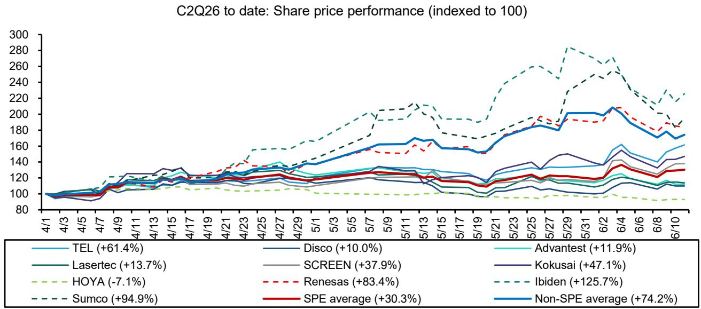
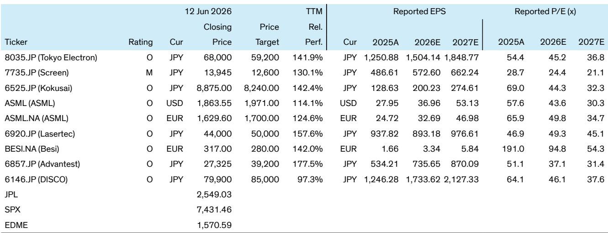

# The Semiconductor Equipment Pricing Cycle Has Begun, and the Market Has Not Priced It In

The semiconductor equipment sector has been the quiet underperformer in a market captivated by the price hikes of memory chips, analog components, and substrates. Investors have piled into commodity tech on a simple narrative: rising prices mean rising profits. That thesis is correct, but it is incomplete. The same pricing power that has driven the commodity rally is now migrating upstream to the companies that build the factories themselves. The equipment makers are beginning to raise prices, and the market is only starting to notice.

This is not a marginal development. For the past two years, semiconductor equipment stocks have lagged behind the very companies they supply. The logic seemed straightforward: equipment demand is a lagging indicator, tied to capacity expansion that follows a commodity price recovery. But that logic assumes equipment companies are passive beneficiaries of volume growth. What the market has missed is that these companies are not just volume plays. They are pricing stories in their own right, and the structural conditions are now aligned for a multi-year repricing cycle.

Three forces are converging. First, the yen has depreciated roughly 30 percent against the dollar over the past three years, giving Japanese equipment makers a natural pricing lever they have been reluctant to use. Second, customer capacity expansion is creating genuine supply constraints, allowing equipment vendors to charge premiums for expedited delivery and new model introductions. Third, and most importantly, the leading companies have publicly stated their intention to raise margins through pricing, not just cost reduction. This marks a strategic shift that could reshape the earnings trajectory of the entire sector.

The implications are significant. If the largest Japanese equipment makers can lift gross margins by several hundred basis points through pricing alone, the consensus earnings estimates for 2027 and 2028 are likely too low. The market is pricing in a recovery, but it is not pricing in a repricing. That gap is the opportunity.

## Japanese Equipment Makers Are Finally Willing to Use the Yen Depreciation as a Pricing Lever

The most underappreciated structural advantage in the semiconductor equipment industry today belongs to Japanese companies that price their products in yen. Over the past three years, the yen has weakened by approximately 30 percent against the US dollar. For a company like Tokyo Electron or Screen, this means that if they had simply maintained yen-denominated prices, their dollar-equivalent revenue would have fallen dramatically relative to their global competitors. Instead of absorbing this currency headwind, they now have the opportunity to adjust prices upward to capture value that was previously lost.

Historically, Japanese equipment makers have been reluctant to exercise this pricing power. The culture of long-term customer relationships and the fear of losing market share to Korean or European competitors kept pricing discipline weak. But recent comments from Tokyo Electron and Screen suggest a fundamental change in strategy. Tokyo Electron has made margin improvement a top priority, and its management has outlined a three-step pricing framework that is both methodical and credible.

The first step involves charging higher prices for expedition requests. When customers need faster delivery, they are willing to pay a premium. Historically, Tokyo Electron did not charge for this. Now it will. The second step is negotiating inflation-related surcharges for material, labor, and other cost increases. The third and most powerful step is pricing new model introductions at higher levels, reflecting the added value of improved technology, additional functions, and new materials. Through these measures, Tokyo Electron aims to lift gross margins to above 50 percent and operating margins closer to 35 percent. The current consensus does not reach those levels until fiscal year 2029, if at all.

Screen is pursuing a similar two-stage strategy. It has already secured customer acceptance for inflation-related price increases and is now negotiating additional price hikes tied to new model introductions. The target is a 30 percent operating margin, while consensus sits at 27 percent for fiscal year 2028. Kokusai Electric, which also prices in yen, is expected to follow the same playbook.

The critical insight is that this pricing power is not dependent on demand being strong. It is based on a correction of past under-pricing. The yen depreciation has created a permanent cost advantage for Japanese equipment makers relative to their global peers. They are now choosing to convert that advantage into higher margins rather than passing it through to customers. That is a structural change, not a cyclical one.

## Pricing Power Is Not Uniform Across the Sector, and the Differentiation Creates a Clear Investment Hierarchy

Not every equipment company will benefit equally from this pricing cycle. The winners are those that have the most room to raise prices and the most willingness to do so. The distinction between front-end and back-end equipment makers is particularly important.

Companies like Tokyo Electron, Screen, and Kokusai price predominantly in yen and have historically maintained lower margins than their global peers. They have the most to gain from a deliberate pricing strategy. Their margin targets are above current consensus, which means any progress toward those targets will generate positive earnings surprises.

In contrast, companies like DISCO, Lasertec, and Advantest already price in a mix of yen and US dollars and have already experienced significant margin expansion. Their pricing power is more mature, and the incremental benefit from further price hikes will be milder. This suggests that Japanese front-end equipment names are likely to outperform back-end names in the near term, simply because the front-end companies have more room to run.

The European equipment makers present a different case. ASML and Besi benefit primarily from product upgrades rather than currency-driven pricing adjustments. ASML's next-generation EUV systems carry an average selling price that is roughly 60 percent higher than current models, and the gross margin on those systems is expected to exceed 60 percent. This is a pure technology premium, not a pricing catch-up. But even ASML has room to charge more for faster delivery, given the current tight supply environment. The company has been reported to be exploring premium pricing for expedited delivery, which would add another layer to its margin story.

The implication for investors is clear: the sector is not a monolith. The pricing cycle will benefit some companies far more than others, and the differentiation is predictable. The companies with the largest gap between current margins and target margins, and with the clearest pricing strategy, offer the most upside to consensus estimates.

## The Market Consensus Is Still Anchored to Volume, Not Price, and That Creates a Mispricing

The most important analytical question for semiconductor equipment investors today is not whether demand will recover. It is whether the market has correctly modeled the impact of pricing on earnings. The evidence suggests it has not.

Consider Tokyo Electron. The consensus assumes gross margins of approximately 48 percent and operating margins of roughly 30 percent even in fiscal year 2029. The company's own target is above 50 percent gross margin and closer to 35 percent operating margin. The difference represents a potential earnings uplift of 15 to 20 percent relative to current consensus, purely from pricing. That is not a small adjustment. It is a structural re-rating of the earnings power of the business.

For Screen, the gap is smaller but still meaningful. Consensus expects 27 percent operating margins in fiscal year 2028. The company targets 30 percent. That three-percentage-point difference, if achieved, would flow almost entirely to the bottom line.

The reason the market has not priced this in is understandable. Equipment companies have historically been volume-driven, and analysts have modeled them as such. The pricing cycle is new, and it is not yet visible in reported financials. But the strategic shift is real, and the management teams have been explicit about their intentions.

The risk is not that pricing fails to materialize. The risk is that the market treats pricing as a one-time event rather than a structural change. If Japanese equipment makers successfully reset their pricing framework, the new margin levels should persist even after the current capacity expansion cycle peaks. That would permanently raise the earnings base of these companies and justify higher valuation multiples.

## What the Report Does Not Fully Answer: The Customer Reaction Function and the Limits of Pricing Power

For all its analytical rigor, the report leaves several critical questions unresolved. The most important is how customers will react to sustained price increases. The report notes that SK Hynix has already received requests for 3 to 4 percent price hikes, but it does not analyze whether such increases are sustainable or whether they will trigger a shift in customer behavior.

The risk is that aggressive pricing by Japanese equipment makers could accelerate customer efforts to diversify their supply chains or develop in-house equipment capabilities. Samsung and TSMC have both invested in internal equipment development, and rising external prices could make those investments more attractive. If customers begin to push back or substitute away from Japanese suppliers, the pricing cycle could be shorter and shallower than the report assumes.

A second unresolved question is the interaction between pricing and volume. If equipment makers raise prices, they may reduce the total addressable market for new capacity. Memory manufacturers, in particular, are sensitive to equipment costs because they account for a large share of total capital expenditure. Higher equipment prices could delay or reduce capacity expansion plans, which would then reduce equipment demand. The report treats pricing and volume as independent variables, but they are linked.

A third open question is the competitive response from non-Japanese equipment makers. If Tokyo Electron and Screen raise prices significantly, ASML and Applied Materials may see an opportunity to gain market share by holding prices steady. The European and US equipment makers have different cost structures and different strategic priorities. The report does not model how competitive dynamics might shift in response to Japanese pricing actions.

These questions do not invalidate the thesis, but they define the boundaries of uncertainty. Investors who want to act on this opportunity need to monitor customer reactions, capacity plans, and competitive responses closely. The pricing cycle is real, but its magnitude and duration are not predetermined.

## A Decision Framework for Investors: Three Questions to Determine Exposure

For investors evaluating their position in semiconductor equipment, the pricing cycle creates a clear set of analytical priorities. The following framework can help determine which companies offer the most attractive risk-reward.

First, what is the gap between current margins and target margins, and how much of that gap is driven by pricing versus cost reduction? The companies with the largest pricing-driven margin gaps offer the most upside to consensus estimates. Tokyo Electron and Screen score highly on this measure. DISCO and Lasertec score lower because their margins are already elevated.

Second, does the company have pricing leverage that it has not yet exercised? The key indicators are currency exposure, historical pricing discipline, and recent management commentary. Japanese front-end equipment makers have the strongest combination of these factors. Back-end makers and European companies have less room for incremental pricing gains.

Third, what is the customer concentration and bargaining power? Companies that sell to a diverse set of customers with low bargaining power have more pricing flexibility. Companies that depend on a small number of large customers, particularly memory manufacturers, face more pushback. Tokyo Electron and Kokusai have relatively diversified customer bases. Screen has higher exposure to specific customers and may face more resistance.

This framework suggests that the most attractive opportunities are in Japanese front-end equipment names with clear pricing strategies and significant margin gaps. The least attractive are in companies that have already captured most of their pricing potential or that face concentrated customer pushback.

The sector is entering a new phase. For years, equipment stocks were valued on volume expectations. Now they are becoming pricing stories. The market has not fully adjusted to this shift. The companies that act first, and the investors who recognize the pattern early, will capture the most value.

Join the community to read the full report and review the original charts.

*This article is for learning and discussion only and does not constitute investment advice.*

Personal reading notes and learning share only. Not investment advice.

