# Software Landscape Benchmarking

## Security Software Technology

Brian Essex, CFA

(1-212) 622-5990

brian.essex@JPM.com

JPM Securities LLC

John Lee

(1-212) 622-6064

John.h.lee@JPM.com

JPM Securities LLC

Alex Isaac

(1-212) 622-9159

alex.isaac@JPM.com

JPM Securities LLC

The authors wish to thank Rachit Agrawal, of the JPM Global Research Center, for contributions to this report.

This material is provided for information only and is not intended as a recommendation or an offer or solicitation for the purchase or sale of any security or financial instrument. This material is not a research report, although it may refer to information and data contained in JPM published research reports or models from all JPM affiliated regions. Opinions and estimates constitute our judgment as of the date of this material and are subject to change without notice. Past performance is not indicative of future results. Securities, financial instruments or strategies mentioned herein may not be suitable for all investors. The opinions and recommendations herein do not take into account individual client circumstances, objectives, or needs and are not intended as recommendations of particular securities, financial instruments or strategies to particular clients. The recipients of this material must make their own independent decisions regarding any securities or financial instruments mentioned herein. Please refer to the most recent published research or model for complete information on the specific security or financial instrument mentioned in this material, including important disclosures and Research Analysts' certifications. © 2026 JPM Chase & Co. All rights reserved. This material or any portion hereof may not be reprinted, sold or redistributed without the written consent of JPM. It is

## Software Universe Comps Overview – As of 6/12/26

<table><tr><td></td><td colspan="2">EV/Sales</td><td colspan="2">EV/Sales/G</td><td colspan="2">EV/EBITDA</td><td colspan="2">EV/FCF</td><td colspan="2">EV/(FCF-SBC)</td><td colspan="2">P/E</td><td rowspan="2">N</td></tr><tr><td>Averages</td><td>CY26E</td><td>CY27E</td><td>CY26E</td><td>CY27E</td><td>CY26E</td><td>CY27E</td><td>CY26E</td><td>CY27E</td><td>CY26E</td><td>CY27E</td><td>CY26E</td><td>CY27E</td></tr><tr><td>Total</td><td>5.7x</td><td>4.8x</td><td>0.41x</td><td>0.42x</td><td>16.6x</td><td>15.3x</td><td>20.3x</td><td>18.2x</td><td>24.9x</td><td>22.2x</td><td>21.6x</td><td>20.1x</td><td>101</td></tr><tr><td>Large Cap (&gt;$20bn Mkt Cap)</td><td>10.3x</td><td>8.5x</td><td>0.49x</td><td>0.55x</td><td>23.7x</td><td>19.1x</td><td>28.0x</td><td>26.8x</td><td>31.2x</td><td>27.5x</td><td>27.4x</td><td>26.2x</td><td>31</td></tr><tr><td>Mid Cap ($3bn - $20bn Mkt Cap)</td><td>5.0x</td><td>4.3x</td><td>0.37x</td><td>0.33x</td><td>17.3x</td><td>17.0x</td><td>21.5x</td><td>18.2x</td><td>20.8x</td><td>20.0x</td><td>20.8x</td><td>19.6x</td><td>41</td></tr><tr><td>Small Cap (&lt;$3bn Mkt Cap)</td><td>1.9x</td><td>1.7x</td><td>0.40x</td><td>0.38x</td><td>8.6x</td><td>9.4x</td><td>11.4x</td><td>9.4x</td><td>24.4x</td><td>18.9x</td><td>14.2x</td><td>11.3x</td><td>29</td></tr><tr><td>Security &amp; Analytics</td><td>9.2x</td><td>7.6x</td><td>0.51x</td><td>0.51x</td><td>23.7x</td><td>22.2x</td><td>26.8x</td><td>25.7x</td><td>26.6x</td><td>27.9x</td><td>26.0x</td><td>27.8x</td><td>23</td></tr><tr><td>Vertical</td><td>4.7x</td><td>4.1x</td><td>0.36x</td><td>0.39x</td><td>14.6x</td><td>13.7x</td><td>19.7x</td><td>15.8x</td><td>25.6x</td><td>21.5x</td><td>20.6x</td><td>16.0x</td><td>36</td></tr><tr><td>Rule of 40: Growth (&gt;20% y/y)</td><td>13.7x</td><td>11.7x</td><td>0.48x</td><td>0.48x</td><td>25.4x</td><td>12.5x</td><td>34.2x</td><td>44.1x</td><td>34.7x</td><td>37.6x</td><td>30.3x</td><td>20.1x</td><td>12</td></tr><tr><td>Growth (10-19% y/y)</td><td>7.0x</td><td>6.9x</td><td>0.43x</td><td>0.46x</td><td>17.3x</td><td>17.4x</td><td>21.8x</td><td>22.0x</td><td>24.1x</td><td>27.2x</td><td>22.2x</td><td>22.1x</td><td>11</td></tr><tr><td>Growth (&lt;10% y/y)</td><td>4.3x</td><td>5.0x</td><td>0.76x</td><td>0.59x</td><td>9.6x</td><td>13.6x</td><td>11.9x</td><td>16.2x</td><td>16.7x</td><td>21.4x</td><td>13.3x</td><td>17.5x</td><td>6</td></tr></table>

<table><tr><td rowspan="2">Averages</td><td colspan="2">Revenue Growth</td><td colspan="2">Gross Margins</td><td colspan="2">FCF Margins</td><td colspan="2">SBC as % of Rev</td></tr><tr><td>CY26E</td><td>CY27E</td><td>CY26E</td><td>CY27E</td><td>CY26E</td><td>CY27E</td><td>CY26E</td><td>CY27E</td></tr><tr><td>Total</td><td>17%</td><td>14%</td><td>76%</td><td>76%</td><td>20%</td><td>23%</td><td>13%</td><td>12%</td></tr><tr><td>Large Cap (&gt;$20bn Mkt Cap)</td><td>24%</td><td>17%</td><td>76%</td><td>76%</td><td>19%</td><td>24%</td><td>12%</td><td>12%</td></tr><tr><td>Mid Cap ($3bn - $20bn Mkt Cap)</td><td>14%</td><td>13%</td><td>78%</td><td>78%</td><td>25%</td><td>27%</td><td>13%</td><td>12%</td></tr><tr><td>Small Cap (&lt;$3bn Mkt Cap)</td><td>7%</td><td>9%</td><td>72%</td><td>72%</td><td>15%</td><td>16%</td><td>13%</td><td>13%</td></tr><tr><td>Security &amp; Analytics</td><td>17%</td><td>15%</td><td>80%</td><td>80%</td><td>15%</td><td>14%</td><td>15%</td><td>14%</td></tr><tr><td>Vertical</td><td>16%</td><td>13%</td><td>72%</td><td>72%</td><td>9%</td><td>9%</td><td>9%</td><td>9%</td></tr><tr><td>Rule of 40: Growth (&gt;20% y/y)</td><td>39%</td><td>36%</td><td>75%</td><td>75%</td><td>6%</td><td>-7%</td><td>11%</td><td>9%</td></tr><tr><td>Growth (10-19% y/y)</td><td>16%</td><td>15%</td><td>79%</td><td>79%</td><td>29%</td><td>32%</td><td>9%</td><td>10%</td></tr><tr><td>Growth (&lt;10% y/y)</td><td>7%</td><td>7%</td><td>81%</td><td>80%</td><td>38%</td><td>34%</td><td>11%</td><td>9%</td></tr></table>

## Security Software & Analytics Comps Table – As of 6/12/26

<table><tr><td>Company</td><td>Market Cap</td><td>Ticker</td><td>Rating</td></tr><tr><td>C3.ai Inc</td><td>1,547</td><td>AI</td><td>UW</td></tr><tr><td>Cellebrite DI Ltd</td><td>3,329</td><td>CLBT</td><td>OW</td></tr><tr><td>Check Point Software</td><td>13,163</td><td>CHKP</td><td>OW</td></tr><tr><td>Crowdstrike Holdings Inc</td><td>176,081</td><td>CRWD</td><td>OW</td></tr><tr><td>Elastic</td><td>6,356</td><td>ESTC</td><td>OW</td></tr><tr><td>Fortinet Inc</td><td>108,672</td><td>FTNT</td><td>UW</td></tr><tr><td>Gitlab Inc</td><td>4,766</td><td>GTLB</td><td>N</td></tr><tr><td>IBM</td><td>258,329</td><td>IBM</td><td>N</td></tr><tr><td>JFrog Ltd</td><td>9,737</td><td>FROG</td><td>OW</td></tr><tr><td>Netskope</td><td>3,620</td><td>NTSK</td><td>OW</td></tr><tr><td>Okta Inc</td><td>21,404</td><td>OKTA</td><td>OW</td></tr><tr><td>Palo Alto Networks Inc</td><td>225,653</td><td>PANW</td><td>OW</td></tr><tr><td>Qualys Inc</td><td>3,969</td><td>QLYS</td><td>UW</td></tr><tr><td>Rapid7 Inc</td><td>552</td><td>RPD</td><td>N</td></tr><tr><td>SailPoint Inc</td><td>8,256</td><td>SAIL</td><td>OW</td></tr><tr><td>SentinelOne Inc</td><td>5,079</td><td>S</td><td>N</td></tr><tr><td>Tenable Holdings Inc</td><td>3,154</td><td>TENB</td><td>OW</td></tr><tr><td>Varonis Systems Inc</td><td>4,429</td><td>VRNS</td><td>OW</td></tr><tr><td>Zscaler Inc</td><td>21,416</td><td>ZS</td><td>OW</td></tr></table>

<table><tr><td colspan="2">Pricing</td></tr><tr><td>Price6/12/2026</td><td>JPMPT</td></tr><tr><td>10.90</td><td>7.00</td></tr><tr><td>12.84</td><td>20.00</td></tr><tr><td>124.06</td><td>135.00</td></tr><tr><td>682.80</td><td>800.00</td></tr><tr><td>60.35</td><td>80.00</td></tr><tr><td>146.30</td><td>75.00</td></tr><tr><td>27.79</td><td>32.00</td></tr><tr><td>272.24</td><td>270.00</td></tr><tr><td>77.69</td><td>76.00</td></tr><tr><td>9.04</td><td>14.00</td></tr><tr><td>116.29</td><td>120.00</td></tr><tr><td>279.62</td><td>326.00</td></tr><tr><td>111.24</td><td>87.00</td></tr><tr><td>7.14</td><td>7.00</td></tr><tr><td>14.62</td><td>22.00</td></tr><tr><td>14.85</td><td>18.00</td></tr><tr><td>26.80</td><td>35.00</td></tr><tr><td>33.34</td><td>39.00</td></tr><tr><td>129.52</td><td>205.00</td></tr></table>

<table><tr><td colspan="2"></td></tr><tr><td colspan="2">EV/Sales</td></tr><tr><td>CY26</td><td>CY27</td></tr><tr><td>4.3x</td><td>4.0x</td></tr><tr><td>5.1x</td><td>4.2x</td></tr><tr><td>3.8x</td><td>3.6x</td></tr><tr><td>29.0x</td><td>23.8x</td></tr><tr><td>2.9x</td><td>2.5x</td></tr><tr><td>13.5x</td><td>12.3x</td></tr><tr><td>3.1x</td><td>2.6x</td></tr><tr><td>4.2x</td><td>4.0x</td></tr><tr><td>14.2x</td><td>12.0x</td></tr><tr><td>3.7x</td><td>3.0x</td></tr><tr><td>6.0x</td><td>5.4x</td></tr><tr><td>17.1x</td><td>14.5x</td></tr><tr><td>4.5x</td><td>4.2x</td></tr><tr><td>0.9x</td><td>0.9x</td></tr><tr><td>6.2x</td><td>5.2x</td></tr><tr><td>3.6x</td><td>3.0x</td></tr><tr><td>2.9x</td><td>2.7x</td></tr><tr><td>5.0x</td><td>4.1x</td></tr><tr><td>5.0x</td><td>4.2x</td></tr></table>

<table><tr><td rowspan="2"></td><td colspan="2">EV/Sales/G</td></tr><tr><td>CY26</td><td>CY27</td></tr><tr><td></td><td>-0.11x</td><td>0.56x</td></tr><tr><td></td><td>0.25x</td><td>0.21x</td></tr><tr><td></td><td>1.32x</td><td>0.59x</td></tr><tr><td></td><td>1.22x</td><td>1.11x</td></tr><tr><td></td><td>0.16x</td><td>0.15x</td></tr><tr><td></td><td>0.85x</td><td>1.25x</td></tr><tr><td></td><td>0.17x</td><td>0.16x</td></tr><tr><td></td><td>0.64x</td><td>0.76x</td></tr><tr><td></td><td>0.71x</td><td>0.63x</td></tr><tr><td></td><td>0.14x</td><td>0.13x</td></tr><tr><td></td><td>0.60x</td><td>0.54x</td></tr><tr><td></td><td>0.61x</td><td>0.81x</td></tr><tr><td></td><td>0.52x</td><td>0.58x</td></tr><tr><td></td><td>-0.42x</td><td>0.85x</td></tr><tr><td></td><td>0.32x</td><td>0.28x</td></tr><tr><td></td><td>0.18x</td><td>0.17x</td></tr><tr><td></td><td>0.33x</td><td>0.32x</td></tr><tr><td></td><td>0.27x</td><td>0.19x</td></tr><tr><td></td><td>0.22x</td><td>0.24x</td></tr></table>

<table><tr><td colspan="2">EV/EBITDA</td></tr><tr><td>CY26</td><td>CY27</td></tr><tr><td>---</td><td>---</td></tr><tr><td>19.0x</td><td>15.5x</td></tr><tr><td>9.4x</td><td>8.8x</td></tr><tr><td>---</td><td>---</td></tr><tr><td>16.8x</td><td>12.9x</td></tr><tr><td>37.4x</td><td>33.7x</td></tr><tr><td>---</td><td>---</td></tr><tr><td>14.8x</td><td>14.1x</td></tr><tr><td>---</td><td>53.5x</td></tr><tr><td>---</td><td>73.4x</td></tr><tr><td>22.7x</td><td>14.8x</td></tr><tr><td>56.5x</td><td>45.2x</td></tr><tr><td>10.1x</td><td>9.5x</td></tr><tr><td>4.9x</td><td>4.8x</td></tr><tr><td>31.3x</td><td>25.4x</td></tr><tr><td>22.7x</td><td>16.9x</td></tr><tr><td>11.4x</td><td>10.2x</td></tr><tr><td>---</td><td>30.1x</td></tr><tr><td>18.6x</td><td>15.5x</td></tr></table>

<table><tr><td colspan="2">EV/FCF</td></tr><tr><td>CY26</td><td>CY27</td></tr><tr><td>---</td><td>---</td></tr><tr><td>16.4x</td><td>13.5x</td></tr><tr><td>8.9x</td><td>8.2x</td></tr><tr><td>---</td><td>74.8x</td></tr><tr><td>15.5x</td><td>14.0x</td></tr><tr><td>40.8x</td><td>38.3x</td></tr><tr><td>19.2x</td><td>13.7x</td></tr><tr><td>19.0x</td><td>17.7x</td></tr><tr><td>59.7x</td><td>40.1x</td></tr><tr><td>---</td><td>40.6x</td></tr><tr><td>21.8x</td><td>18.7x</td></tr><tr><td>47.4x</td><td>35.2x</td></tr><tr><td>10.8x</td><td>11.0x</td></tr><tr><td>5.5x</td><td>5.7x</td></tr><tr><td>39.8x</td><td>24.4x</td></tr><tr><td>55.7x</td><td>35.6x</td></tr><tr><td>11.7x</td><td>10.3x</td></tr><tr><td>36.2x</td><td>24.5x</td></tr><tr><td>22.0x</td><td>15.4x</td></tr></table>

<table><tr><td colspan="2">EV/(FCF-SBC)</td></tr><tr><td>CY26</td><td>CY27</td></tr><tr><td>---</td><td>---</td></tr><tr><td>22.2x</td><td>18.1x</td></tr><tr><td>11.2x</td><td>10.4x</td></tr><tr><td>--</td><td>--</td></tr><tr><td>---</td><td>---</td></tr><tr><td>46.9x</td><td>44.8x</td></tr><tr><td>---</td><td>---</td></tr><tr><td>20.9x</td><td>19.1x</td></tr><tr><td>---</td><td>---</td></tr><tr><td>---</td><td>---</td></tr><tr><td>49.5x</td><td>37.4x</td></tr><tr><td>---</td><td>55.9x</td></tr><tr><td>15.3x</td><td>16.6x</td></tr><tr><td>20.2x</td><td>30.1x</td></tr><tr><td>---</td><td>---</td></tr><tr><td>---</td><td>---</td></tr><tr><td>37.5x</td><td>29.1x</td></tr><tr><td>---</td><td>---</td></tr><tr><td>---</td><td>---</td></tr></table>

<table><tr><td colspan="2">P/E</td></tr><tr><td>CY26</td><td>CY27</td></tr><tr><td>---</td><td>---</td></tr><tr><td>22.9x</td><td>19.5x</td></tr><tr><td>11.7x</td><td>10.6x</td></tr><tr><td>---</td><td>---</td></tr><tr><td>20.1x</td><td>16.1x</td></tr><tr><td>46.4x</td><td>43.3x</td></tr><tr><td>34.3x</td><td>28.6x</td></tr><tr><td>22.0x</td><td>20.1x</td></tr><tr><td>---</td><td>62.7x</td></tr><tr><td>---</td><td>---</td></tr><tr><td>30.4x</td><td>26.4x</td></tr><tr><td>---</td><td>64.0x</td></tr><tr><td>14.6x</td><td>13.5x</td></tr><tr><td>4.6x</td><td>4.7x</td></tr><tr><td>45.7x</td><td>37.5x</td></tr><tr><td>40.1x</td><td>29.7x</td></tr><tr><td>13.6x</td><td>11.5x</td></tr><tr><td>---</td><td>42.2x</td></tr><tr><td>29.2x</td><td>24.9x</td></tr></table>

<table><tr><td>Average</td></tr><tr><td>Median</td></tr></table>

<table><tr><td>7.1x</td><td>6.1x</td></tr><tr><td>4.5x</td><td>4.1x</td></tr></table>

<table><tr><td>0.42x</td><td>0.50x</td></tr><tr><td>0.32x</td><td>0.54x</td></tr></table>

<table><tr><td>21.2x</td><td>24.0x</td></tr><tr><td>18.6x</td><td>15.5x</td></tr></table>

<table><tr><td>26.9x</td><td>24.5x</td></tr><tr><td>20.5x</td><td>18.2x</td></tr></table>

<table><tr><td>28.0x</td><td>29.1x</td></tr><tr><td>21.6x</td><td>29.1x</td></tr></table>

<table><tr><td>25.8x</td><td>28.4x</td></tr><tr><td>22.9x</td><td>25.6x</td></tr></table>

<table><tr><td colspan="3">Other Related JPM Coverage</td></tr><tr><td>Dropbox Inc</td><td>6,412 DBX</td><td>N</td></tr><tr><td>Datadog Inc</td><td>83,852 DDOG</td><td>OW</td></tr><tr><td>Dynatrace Inc</td><td>12,181 DT</td><td>OW</td></tr><tr><td>Microsoft Corp</td><td>2,909,059 MSFT</td><td>OW</td></tr><tr><td>Cloudflare Inc</td><td>80,568 NET</td><td>N</td></tr></table>

<table><tr><td>27.09</td><td>25.00</td></tr><tr><td>229.90</td><td>320.00</td></tr><tr><td>40.75</td><td>45.00</td></tr><tr><td>390.74</td><td>550.00</td></tr><tr><td>228.48</td><td>145.00</td></tr></table>

<table><tr><td>3.4x</td><td>3.4x</td></tr><tr><td>18.5x</td><td>15.3x</td></tr><tr><td>4.9x</td><td>4.3x</td></tr><tr><td>8.1x</td><td>6.8x</td></tr><tr><td>28.1x</td><td>21.8x</td></tr></table>

<table><tr><td>-12.07x</td><td>-6.47x</td></tr><tr><td>0.67x</td><td>0.92x</td></tr><tr><td>0.27x</td><td>0.30x</td></tr><tr><td>0.45x</td><td>0.47x</td></tr><tr><td>0.93x</td><td>0.87x</td></tr></table>

<table><tr><td>7.2x</td><td>6.8x</td></tr><tr><td>---</td><td>---</td></tr><tr><td>31.1x</td><td>26.2x</td></tr><tr><td>17.6x</td><td>15.2x</td></tr><tr><td>---</td><td>---</td></tr></table>

<table><tr><td>9.7x</td><td>8.9x</td></tr><tr><td>66.1x</td><td>57.9x</td></tr><tr><td>16.3x</td><td>16.2x</td></tr><tr><td>---</td><td>58.0x</td></tr><tr><td>---</td><td>---</td></tr></table>

<table><tr><td>15.3x</td><td>14.1x</td></tr><tr><td>---</td><td>---</td></tr><tr><td>30.7x</td><td>37.5x</td></tr><tr><td>---</td><td>---</td></tr><tr><td>---</td><td>---</td></tr></table>

<table><tr><td>8.4x</td><td>8.0x</td></tr><tr><td>---</td><td>---</td></tr><tr><td>22.4x</td><td>18.7x</td></tr><tr><td>22.5x</td><td>18.6x</td></tr><tr><td>---</td><td>---</td></tr></table>

<table><tr><td colspan="3">Non-Covered Security, Analytics, and DevOps Coverage</td></tr><tr><td>Atlassian Corp</td><td>23,101 TEAM</td><td>NC</td></tr><tr><td>BlackBerry Ltd</td><td>5,915 BB</td><td>NC</td></tr><tr><td>Commvault Systems Inc</td><td>5,527 CVLT</td><td>NC</td></tr><tr><td>Gen Digital Inc</td><td>14,811 GEN</td><td>NC</td></tr><tr><td>MongoDB Inc</td><td>27,943 MDB</td><td>NC</td></tr><tr><td>N-able Inc/US</td><td>602 NABL</td><td>NC</td></tr><tr><td>Palantir Technologies Inc</td><td>329,053 PLTR</td><td>NC</td></tr><tr><td>Rubrik Inc</td><td>13,888 RBRK</td><td>NC</td></tr></table>

<table><tr><td>88.52</td><td>--</td></tr><tr><td>9.19</td><td>--</td></tr><tr><td>127.76</td><td>--</td></tr><tr><td>24.32</td><td>--</td></tr><tr><td>342.52</td><td>--</td></tr><tr><td>3.21</td><td>--</td></tr><tr><td>127.99</td><td>--</td></tr><tr><td>68.19</td><td>--</td></tr></table>

<table><tr><td>3.3x</td><td>2.9x</td></tr><tr><td>9.8x</td><td>9.1x</td></tr><tr><td>4.3x</td><td>3.9x</td></tr><tr><td>4.3x</td><td>4.0x</td></tr><tr><td>8.6x</td><td>7.3x</td></tr><tr><td>1.6x</td><td>1.5x</td></tr><tr><td>41.5x</td><td>28.6x</td></tr><tr><td>8.1x</td><td>6.6x</td></tr></table>

<table><tr><td>0.16x</td><td>0.19x</td></tr><tr><td>0.98x</td><td>1.15x</td></tr><tr><td>0.40x</td><td>0.35x</td></tr><tr><td>0.37x</td><td>0.60x</td></tr><tr><td>0.42x</td><td>0.41x</td></tr><tr><td>0.18x</td><td>0.17x</td></tr><tr><td>0.57x</td><td>0.63x</td></tr><tr><td>0.32x</td><td>0.31x</td></tr></table>

<table><tr><td>10.6x</td><td>9.6x</td></tr><tr><td>51.5x</td><td>40.9x</td></tr><tr><td>20.5x</td><td>17.7x</td></tr><tr><td>9.0x</td><td>7.7x</td></tr><tr><td>41.8x</td><td>33.6x</td></tr><tr><td>5.2x</td><td>4.6x</td></tr><tr><td>71.6x</td><td>49.0x</td></tr><tr><td>---</td><td>---</td></tr></table>

<table><tr><td>12.4x</td><td>9.7x</td></tr><tr><td>68.6x</td><td>46.1x</td></tr><tr><td>19.7x</td><td>19.2x</td></tr><tr><td>13.4x</td><td>12.2x</td></tr><tr><td>46.6x</td><td>37.7x</td></tr><tr><td>10.4x</td><td>9.5x</td></tr><tr><td>---</td><td>52.7x</td></tr><tr><td>44.6x</td><td>32.1x</td></tr></table>

<table><tr><td>---</td><td>44.1x</td></tr><tr><td>---</td><td>56.8x</td></tr><tr><td>35.9x</td><td>35.4x</td></tr><tr><td>15.6x</td><td>14.0x</td></tr><tr><td>---</td><td>---</td></tr><tr><td>25.1x</td><td>22.8x</td></tr><tr><td>---</td><td>69.3x</td></tr><tr><td>---</td><td>---</td></tr></table>

<table><tr><td>14.6x</td><td>13.2x</td></tr><tr><td>51.9x</td><td>46.4x</td></tr><tr><td>25.4x</td><td>21.9x</td></tr><tr><td>8.7x</td><td>7.6x</td></tr><tr><td>55.8x</td><td>46.7x</td></tr><tr><td>7.7x</td><td>6.7x</td></tr><tr><td>---</td><td>62.0x</td></tr><tr><td>---</td><td>---</td></tr></table>

## Most Expensive and Least Expensive Stock Performance

YTD Performance – 5 Most Expensive and 5 Least Expensive (>20% y/y Growth) Software Stocks\*  
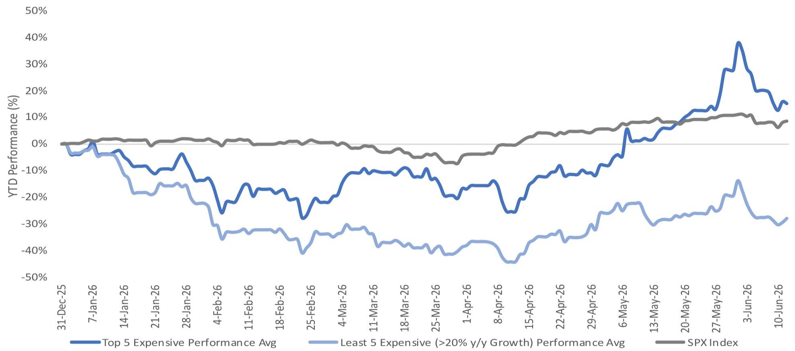

line chart

| Date       | Top 5 Expensive Performance Avg | Least 5 Expensive (>20% y/y Growth) Performance Avg | SPX Index |
|------------|----------------------------------|-----------------------------------------------------|---------|
| 31-Dec-25  | ~0%                              | ~0%                                                 | ~0%     |
| 7-Jan-26   | ~-5%                             | ~-5%                                                | ~0%     |
| 14-Jan-26  | ~-10%                            | ~-10%                                               | ~0%     |
| 21-Jan-26  | ~-15%                            | ~-15%                                               | ~0%     |
| 28-Jan-26  | ~-20%                            | ~-20%                                               | ~0%     |
| 4-Feb-26   | ~-25%                            | ~-25%                                               | ~0%     |
| 11-Feb-26  | ~-20%                            | ~-30%                                               | ~0%     |
| 18-Feb-26  | ~-15%                            | ~-35%                                               | ~0%     |
| 25-Feb-26  | ~-20%                            | ~-40%                                               | ~0%     |
| 4-Mar-26   | ~-15%                            | ~-35%                                               | ~0%     |
| 11-Mar-26  | ~-10%                            | ~-30%                                               | ~0%     |
| 18-Mar-26  | ~-10%                            | ~-35%                                               | ~0%     |
| 25-Mar-26  | ~-15%                            | ~-40%                                               | ~0%     |
| 1-Apr-26   | ~-20%                            | ~-35%                                               | ~0%     |
| 8-Apr-26   | ~-25%                            | ~-45%                                               | ~0%     |
| 15-Apr-26  | ~-15%                            | ~-35%                                               | ~5%     |
| 22-Apr-26  | ~-10%                            | ~-30%                                               | ~5%     |
| 29-Apr-26  | ~-10%                            | ~-25%                                               | ~5%     |
| 6-May-26   | ~5%                              | ~-20%                                               | ~10%    |
| 13-May-26  | ~10%                             | ~-30%                                               | ~10%    |
| 20-May-26  | ~15%                             | ~-25%                                               | ~10%    |
| 27-May-26  | ~30%                             | ~-20%                                               | ~10%    |
| 3-Jun-26   | ~40%                             | ~-15%                                               | ~10%    |
| 10-Jun-26  | ~15%                             | ~-30%                                               | ~10%    |

\*Most Expensive Software Stocks on EV/Sales CY26E are PLTR, CRWD, NET, APP, and DDOG, in that order. Least Expensive Growth Software Stocks on EV/Sales CY26E are BRZE, TEAM, NTSK, AVPT, and YOU, in that order. Data as of 6/12/26.  
Source: Bloomberg Finance L.P.

## YTD Price Performance

Software vs Tech Sectors  
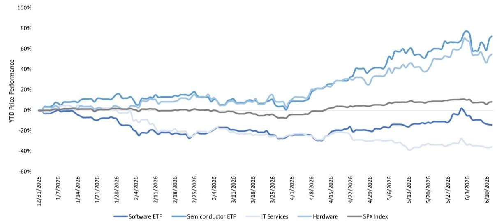

line chart

| Date       | Software ETF | Semiconductor ETF | IT Services | Hardware | SPX Index |
|------------|--------------|-------------------|-------------|----------|-----------|
| 12/31/2025 | -            | -                 | -           | -        | -         |
| 1/7/2026   | -            | -                 | -           | -        | -         |
| 1/14/2026  | -            | -                 | -           | -        | -         |
| 1/21/2026  | -            | -                 | -           | -        | -         |
| 1/28/2026  | -            | -                 | -           | -        | -         |
| 2/4/2026   | -            | -                 | -           | -        | -         |
| 2/11/2026  | -            | -                 | -           | -        | -         |
| 2/18/2026  | -            | -                 | -           | -        | -         |
| 2/25/2026  | -            | -                 | -           | -        | -         |
| 3/4/2026   | -            | -                 | -           | -        | -         |
| 3/11/2026  | -            | -                 | -           | -        | -         |
| 3/18/2026  | -            | -                 | -           | -        | -         |
| 3/25/2026  | -            | -                 | -           | -        | -         |
| 4/1/2026   | -            | -                 | -           | -        | -         |
| 4/8/2026   | -            | -                 | -           | -        | -         |
| 4/15/2026  | -            | -                 | -           | -        | -         |
| 4/22/2026  | -            | -                 | -           | -        | -         |
| 4/29/2026  | -            | -                 | -           | -        | -         |
| 5/6/2026   | -            | -                 | -           | -        | -         |
| 5/13/2026  | -            | -                 | -           | -        | -         |
| 5/20/2026  | -            | -                 | -           | -        | -         |
| 5/27/2026  | -            | -                 | -           | -        | -         |
| 6/3/2026   | -            | -                 | -           | -        | -         |
| 6/10/2026  | -            | -                 | -           | -        | -         |

Source: Bloomberg Finance L.P.

Security & Analytics  
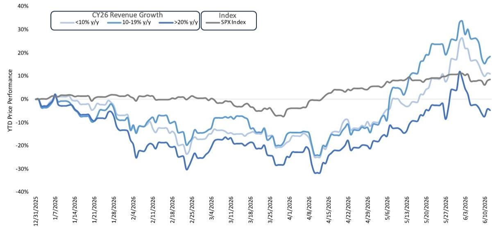

line chart

| Date       | <10% y/y | 10-19% y/y | >20% y/y | SPX Index |
|------------|----------|------------|----------|-----------|
| 12/31/2025 | -        | -          | -        | -         |
| 1/7/2026   | -        | -          | -        | -         |
| 1/14/2026  | -        | -          | -        | -         |
| 1/21/2026  | -        | -          | -        | -         |
| 1/28/2026  | -        | -          | -        | -         |
| 2/4/2026   | -        | -          | -        | -         |
| 2/11/2026  | -        | -          | -        | -         |
| 2/18/2026  | -        | -          | -        | -         |
| 2/25/2026  | -        | -          | -        | -         |
| 3/4/2026   | -        | -          | -        | -         |
| 3/11/2026  | -        | -          | -        | -         |
| 3/18/2026  | -        | -          | -        | -         |
| 3/25/2026  | -        | -          | -        | -         |
| 4/1/2026   | -        | -          | -        | -         |
| 4/8/2026   | -        | -          | -        | -         |
| 4/15/2026  | -        | -          | -        | -         |
| 4/22/2026  | -        | -          | -        | -         |
| 4/29/2026  | -        | -          | -        | -         |
| 5/6/2026   | -        | -          | -        | -         |
| 5/13/2026  | -        | -          | -        | -         |
| 5/20/2026  | -        | -          | -        | -         |
| 5/27/2026  | -        | -          | -        | -         |
| 6/3/2026   | -        | -          | -        | -         |
| 6/10/2026  | -        | -          | -        | -         |

Source: Bloomberg Finance L.P.

## EV/Sales/Growth

Large Cap (>\$20bn)\*  
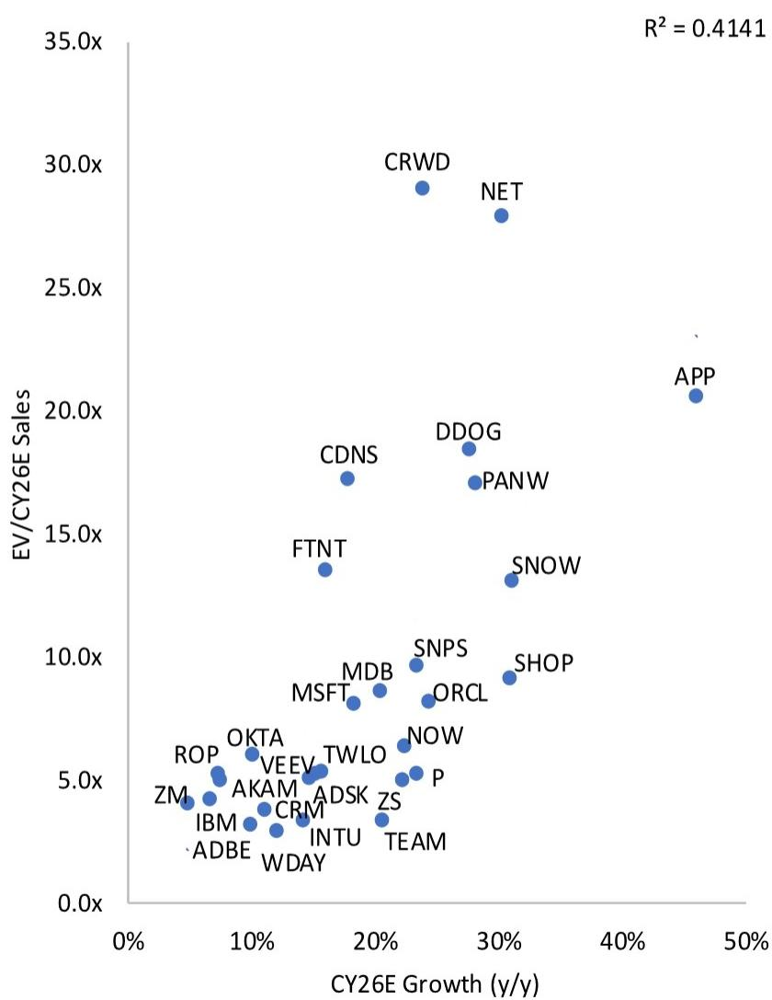

Security & Analytics  
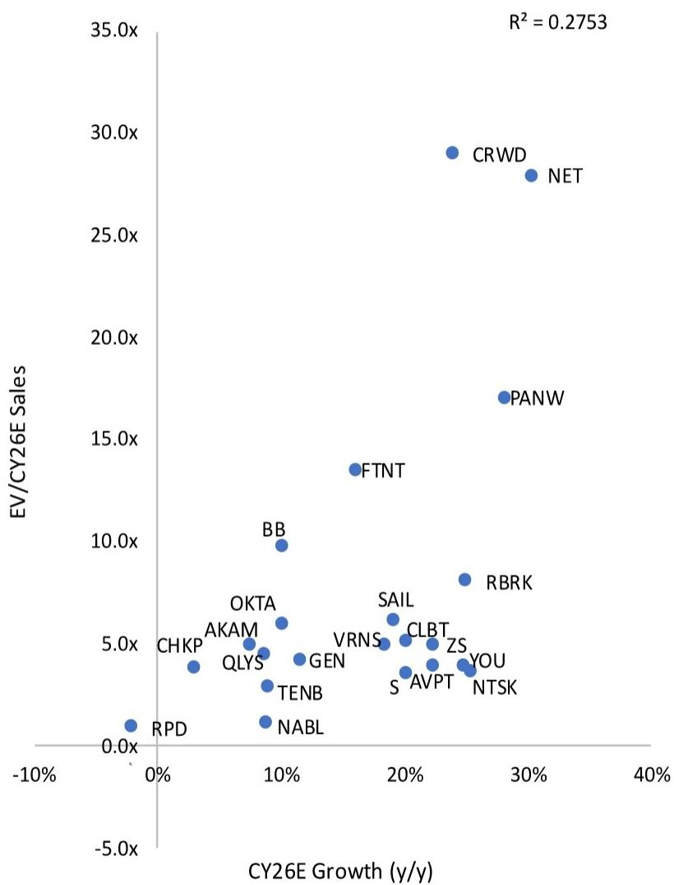

scatterplot

| Company | EV/CY26E Sales | CY26E Growth (y/y) |
|---------|----------------|--------------------|
| CRWD    | 29.0x          | 24%                |
| NET     | 28.0x          | 30%                |
| PANW    | 17.0x          | 28%                |
| FTNT    | 13.5x          | 16%                |
| BB      | 9.5x           | 10%                |
| RBRK    | 8.0x           | 25%                |
| SAIL    | 6.0x           | 19%                |
| CLBT    | 5.0x           | 21%                |
| ZS      | 5.0x           | 22%                |
| YOU     | 4.0x           | 24%                |
| NTSK    | 3.5x           | 25%                |
| AVPT    | 3.0x           | 20%                |
| S       | 3.0x           | 20%                |
| GEN     | 4.0x           | 11%                |
| VRNS    | 5.0x           | 18%                |
| CLBT    | 5.0x           | 21%                |
| OKTA    | 6.0x           | 10%                |
| AKAM    | 5.0x           | 7%                 |
| QLYS    | 4.5x           | 8%                 |
| TENB    | 3.0x           | 9%                 |
| NABL    | 1.5x           | 9%                 |
| RPD     | -0.5x          | -1%                |

## Benchmarking – Unit Economics

LTV:CAC  
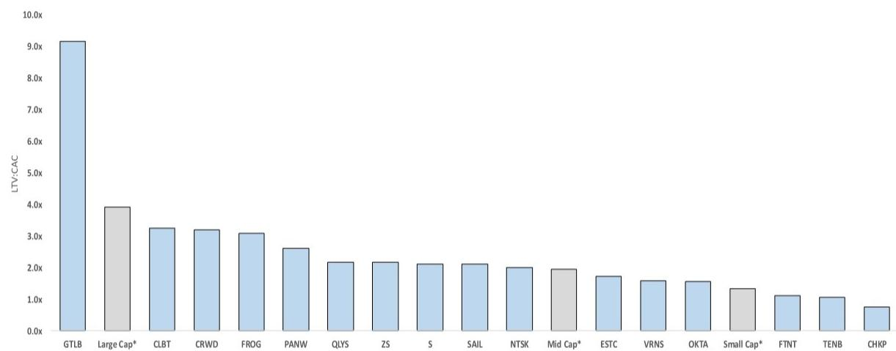

bar chart

| Company | LTV:CAC |
|---|---|
| GTLB | 9.1x |
| Large Cap* | 3.9x |
| CLBT | 3.3x |
| CRWD | 3.2x |
| FROG | 3.1x |
| PANW | 2.6x |
| QLYS | 2.2x |
| ZS | 2.2x |
| S | 2.1x |
| SAIL | 2.1x |
| NTSK | 2.0x |
| Mid Cap* | 1.9x |
| ESTC | 1.7x |
| VRNS | 1.6x |
| OKTA | 1.5x |
| Small Cap* | 1.3x |
| FTNT | 1.1x |
| TENB | 1.0x |
| CHKP | 0.8x |

Source: Bloomberg Finance L.P. and JPM estimates for churn (Blue denotes Essex Coverage; Large Cap > \$20bn, Mid Cap > \$3bn, Small Cap < \$3bn; data as of C1Q26)  
\*Approximately 80 stocks from broader software universe

CAC  
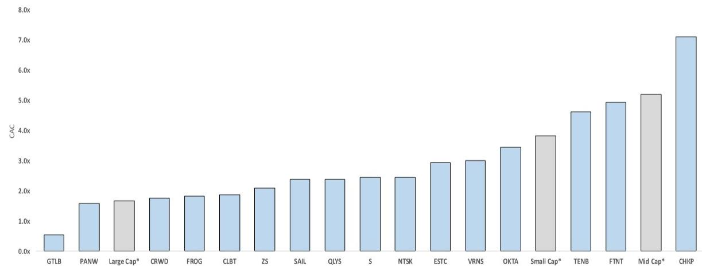

bar chart

| Entity | CAC |
|---|---|
| GTLB | 0.5x |
| PANW | 1.6x |
| Large Cap* | 1.7x |
| CRWD | 1.8x |
| FROG | 1.8x |
| CLBT | 1.9x |
| ZS | 2.1x |
| SAIL | 2.4x |
| QLYS | 2.4x |
| S | 2.5x |
| NTSK | 2.5x |
| ESTC | 3.0x |
| VRNS | 3.0x |
| OKTA | 3.5x |
| Small Cap* | 3.9x |
| TENB | 4.6x |
| FTNT | 4.9x |
| Mid Cap* | 5.2x |
| CHKP | 7.1x |

Source: Bloomberg Finance L.P. and JPM estimates for churn (Blue denotes Essex Coverage; Large Cap > \$20bn, Mid Cap > \$3bn, Small Cap < \$3bn; last reported Q, data as of C1Q26)

\*Approximately 80 stocks from broader software universe

## Benchmarking – Growth and Efficiency

Rule of 40 (MRQ Rev Growth + EBIT)  
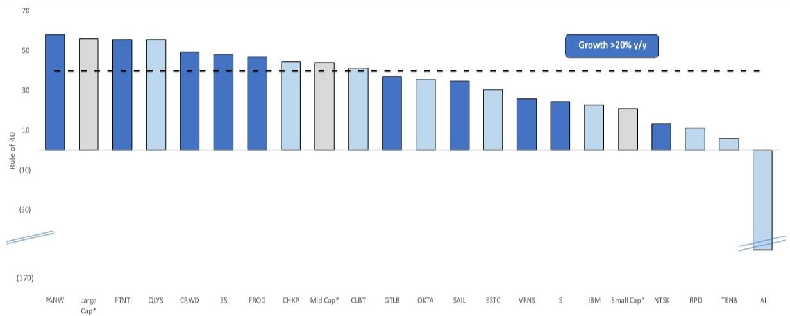

bar chart

| Company | Value |
| :--- | :--- |
| PANW | 54 |
| Large Cap* | 53 |
| FTNT | 53 |
| QLYS | 53 |
| CRWD | 50 |
| ZS | 49 |
| FROG | 48 |
| CHKP | 47 |
| Mid Cap* | 47 |
| CLBT | 46 |
| GTLB | 34 |
| OKTA | 33 |
| SAIL | 32 |
| ESTC | 30 |
| VRNS | 28 |
| S | 27 |
| IBM | 26 |
| Small Cap* | 25 |
| NTSK | 12 |
| RPD | 11 |
| TENB | 8 |
| AI | -170 |
Growth >20% y/y

Source: Bloomberg Finance L.P (Blue denotes Essex coverage); (Large Cap > \$20bn, Mid Cap > \$3bn, Small Cap < \$3bn; last reported Q, \*Approximately +100 stocks from broader software universe)

Revenue Growth  
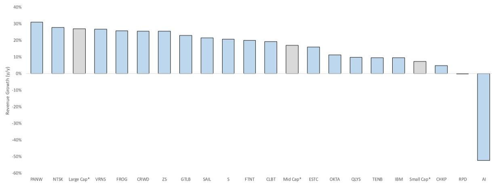

bar chart

| Company | Revenue Growth (y/y) (%) |
|---|---|
| PANW | 31 |
| NTSK | 28 |
| Large Cap* | 27 |
| VRNS | 27 |
| FROG | 26 |
| CRWD | 25 |
| ZS | 25 |
| GTLB | 23 |
| SAIL | 21 |
| S | 20 |
| FTNT | 20 |
| CLBT | 19 |
| Mid Cap* | 17 |
| ESTC | 16 |
| OKTA | 11 |
| QLYS | 10 |
| TENB | 10 |
| IBM | 10 |
| Small Cap* | 7 |
| CHKP | 4 |
| RPD | -1 |
| AI | -53 |

Source: Bloomberg Finance L.P (Blue denotes Essex coverage); (Large Cap > \$20bn, Mid Cap > \$3bn, Small Cap < \$3bn; last reported Q, \*Approximately +100 stocks from broader software universe)

## Benchmarking – Margins (1/3)

TTM FCF Margin  
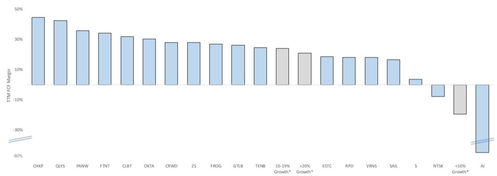

bar chart

| Company | TTM FCF Margin (%) |
| :--- | :--- |
| CHKP | 47 |
| QLYS | 46 |
| PANW | 33 |
| FTNT | 32 |
| CLBT | 31 |
| OKTA | 30 |
| CRWD | 29 |
| ZS | 29 |
| FROG | 28 |
| GTLB | 28 |
| TENB | 27 |
| 10-19% Growth* | 27 |
| >20% Growth* | 25 |
| ESTC | 14 |
| RPD | 14 |
| VRNS | 14 |
| SAIL | 13 |
| S | -6 |
| NTSK | -8 |
| <10% Growth* | -22 |
| AI | -78 |

Source: Bloomberg Finance L.P (Blue denotes Essex coverage); FCF Margin = (Cash flow from Operations – Capex) /  
Revenue; last reported Q, \*Approximately +100 stocks from broader software universe)

Adjusted Gross Margin  
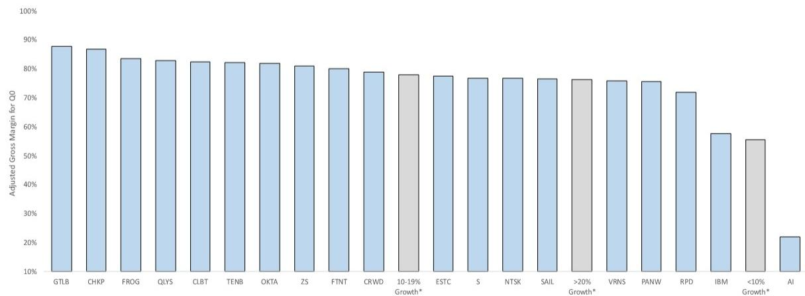

bar chart

| Company | Adjusted Gross Margin for Q0 (%) |
|---|---|
| GTLB | 88 |
| CHKP | 87 |
| FROG | 83 |
| QLYS | 82.5 |
| CLBT | 82 |
| TENB | 82 |
| OKTA | 81.5 |
| ZS | 81 |
| FTNT | 80 |
| CRWD | 79 |
| 10-19% Growth* | 78 |
| ESTC | 77.5 |
| S | 76.5 |
| NTSK | 76.5 |
| SAIL | 76.5 |
| >20% Growth* | 76 |
| VRNS | 75.5 |
| PANW | 75.5 |
| RPD | 72 |
| IBM | 57.5 |
| <10% Growth* | 56 |
| AI | 22 |

Source: Bloomberg Finance L.P (Blue denotes Essex coverage); Gross Margin is Non-GAAP, last reported Q,  
\*Approximately +100 stocks from broader software universe)

## Benchmarking – Margins (2/3)

S&M as % of Revenue  
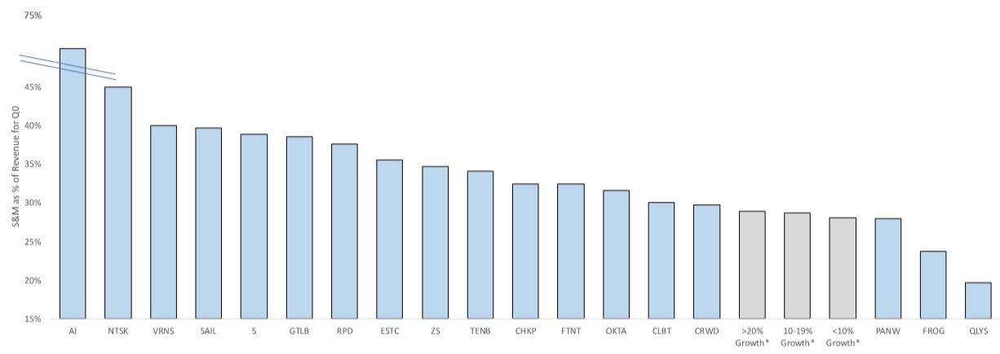

bar chart

| Company | S&M as % of Revenue for Q0 (%) |
| :--- | :--- |
| AI | 68 |
| NTSK | 45 |
| VRNS | 40 |
| SAIL | 40 |
| S | 39 |
| GTLB | 39 |
| RPD | 38 |
| ESTC | 36 |
| ZS | 35 |
| TENB | 34 |
| CHKP | 33 |
| FTNT | 33 |
| OKTA | 32 |
| CLBT | 30 |
| CRWD | 30 |
| >20% Growth* | 29 |
| 10-19% Growth* | 29 |
| <10% Growth* | 28 |
| PANW | 28 |
| FROG | 24 |
| QLYS | 20 |

Source: Bloomberg Finance L.P (Blue denotes Essex coverage; last reported Q); S&M is Non-GAAP, \*Approximately +100 stocks from broader software universe

R&D as % of Revenue  
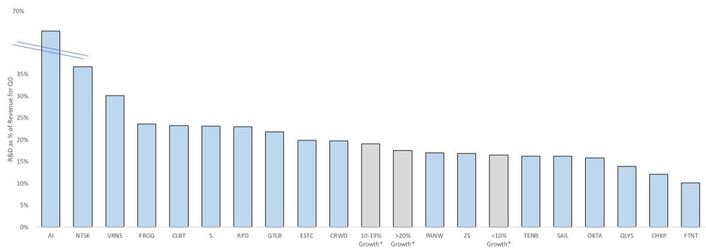

bar chart

| Company | R&D as % of Revenue for CO (%) |
| :--- | :--- |
| AI | 68 |
| NTSK | 36 |
| VRNS | 30 |
| FROG | 24 |
| CLBT | 23.5 |
| S | 23.5 |
| RPD | 23.5 |
| GTLB | 22 |
| ESTC | 20 |
| CRWD | 20 |
| 10-19% Growth* | 19.5 |
| >20% Growth* | 17.5 |
| PANW | 17 |
| ZS | 17 |
| <10% Growth* | 16.5 |
| TENB | 16.5 |
| SAIL | 16.5 |
| OKTA | 16 |
| QLYS | 14 |
| CHKP | 12 |
| FTNT | 10 |

Source: Bloomberg Finance L.P (Blue denotes Essex coverage; last reported Q); R&D is Non-GAAP, \*Approximately +100 stocks from broader software universe

## Benchmarking – Margins (3/3)

G&A as % of Revenue  
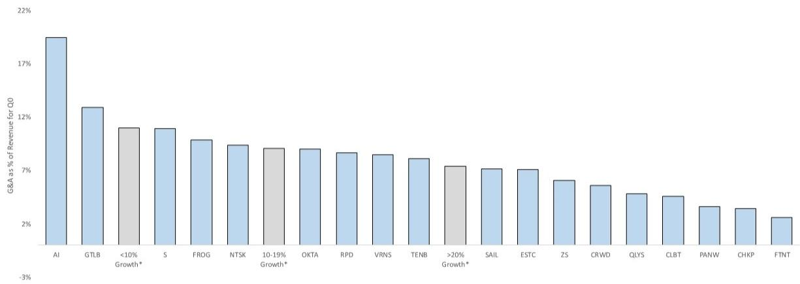

bar chart

| Company | G&A as % of Revenue for QO (%) |
| :--- | :--- |
| AI | 18.5 |
| GTLB | 12.3 |
| <10% Growth* | 11.8 |
| S | 11.7 |
| FROG | 11.4 |
| NTSK | 11.2 |
| 10-19% Growth* | 11.1 |
| OKTA | 11.0 |
| RPD | 10.8 |
| VRNS | 10.7 |
| TENB | 10.6 |
| >20% Growth* | 7.1 |
| SAIL | 7.0 |
| ESTC | 7.0 |
| ZS | 6.7 |
| CRWD | 6.6 |
| QLYS | 5.5 |
| CLBT | 5.4 |
| PANW | 3.0 |
| CHKP | 2.9 |
| FTNT | 2.2 |

Source: Bloomberg Finance L.P (Blue denotes Essex coverage; last reported Q); G&A is Non-GAAP, \*Approximately +100 stocks from broader software universe

Operating Margin  
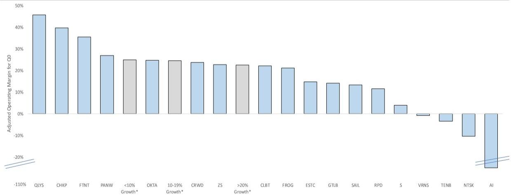

bar chart

| Company | Adjusted Operating Margin for Q0 (%) |
| :--- | :--- |
| QLYS | 46 |
| CHKP | 40 |
| FTNT | 35 |
| PANW | 27 |
| <10% Growth* | 25 |
| OKTA | 24.5 |
| 10-19% Growth* | 24.5 |
| CRWD | 23.5 |
| ZS | 22.5 |
| >20% Growth* | 22.5 |
| CLBT | 22 |
| FROG | 21 |
| ESTC | 14.5 |
| GTLB | 13.5 |
| SAIL | 13 |
| RPD | 11.5 |
| S | 3.5 |
| VRNS | -0.5 |
| TENB | -2.5 |
| NTSK | -8.5 |
| AI | -18.5 |

Source: Bloomberg Finance L.P (Blue denotes Essex coverage; last reported Q); Operating Margin is Non-GAAP, \*Approximately +100 stocks from broader software universe

## Benchmarking – Net Retention Rate – As of 6/12/26

Net Retention Rate  
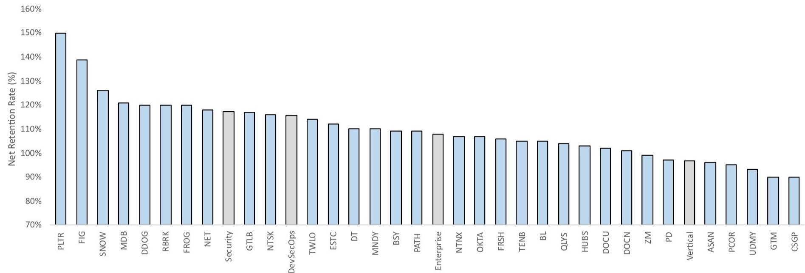

bar chart

| Entity | Net Retention Rate (%) |
| :--- | :--- |
| PLTR | 149.5 |
| FIG | 138.7 |
| SNOW | 126.0 |
| MDB | 120.8 |
| DDOG | 119.8 |
| RBRK | 119.6 |
| FROG | 119.5 |
| NET | 117.8 |
| Security | 117.2 |
| GTLB | 116.8 |
| NTSK | 115.9 |
| DevSecOps | 115.5 |
| TWLO | 114.0 |
| ESTC | 112.0 |
| DT | 109.8 |
| MNDY | 109.6 |
| BSY | 108.8 |
| PATH | 108.7 |
| Enterprise | 107.5 |
| NTNX | 106.5 |
| OKTA | 106.3 |
| FRSH | 105.5 |
| TENB | 104.7 |
| BL | 104.5 |
| QLYS | 103.8 |
| HUBS | 102.8 |
| DOCU | 102.2 |
| DOCN | 101.2 |
| ZM | 99.2 |
| PD | 96.8 |
| Vertical | 96.2 |
| ASAN | 95.5 |
| PCOR | 94.8 |
| UDMY | 93.2 |
| GTM | 89.5 |
| CSGP | 89.3 |

Source: Company reports, Bloomberg Finance L.P  
Note: Security: NET, NTSK, OKTA, PLTR, QLYS, RBRK, TENB; DevSecOps: DDOG, DT, ESTC, FROG, GTLB; Enterprise: ASAN, BL, DOCN, DOCU, FIG, FRSH, GTM, HUBS, MDB, MNDY, NTNX, PATH, PD, SNOW, TWLO, ZM; Vertical: BSY, CSGP, PCOR, UDMY

## Benchmarking – Net Cash – As of 6/12/26

Net Cash as a \% of Stock Price  
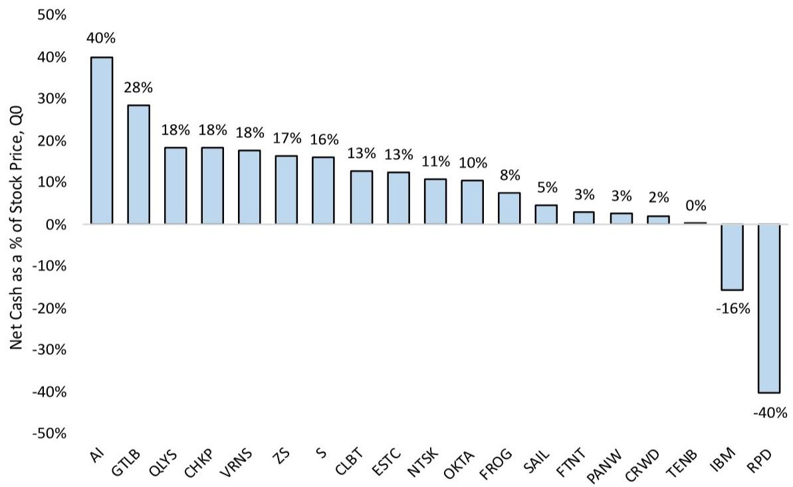

bar chart

| Company | Net Cash as a % of Stock Price, QO |
| :--- | :--- |
| AI | 40% |
| GTLB | 28% |
| QLYS | 18% |
| CHKP | 18% |
| VRNS | 18% |
| ZS | 17% |
| S | 16% |
| CLBT | 13% |
| ESTC | 13% |
| NTSK | 11% |
| OKTA | 10% |
| FROG | 8% |
| SAIL | 5% |
| FTNT | 3% |
| PANW | 3% |
| CRWD | 2% |
| TENB | 0% |
| IBM | -16% |
| RPD | -40% |

Source: Company reports, Bloomberg Finance L.P

## Benchmarking – Market Sensitivity & Stock Based Compensation

Beta  
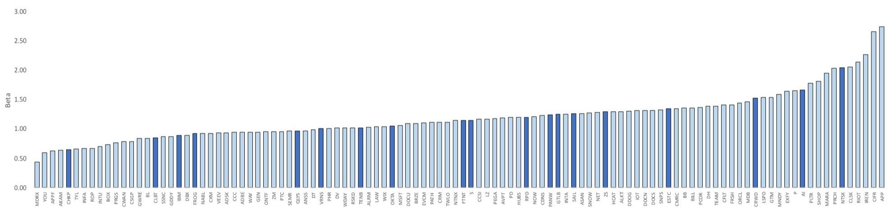

bar chart

| Ticker | Beta |
|---|---|
| MDRX | 0.45 |
| YOU | 0.60 |
| APPF | 0.63 |
| AKAM | 0.64 |
| CHKP | 0.65 |
| TYL | 0.66 |
| INFA | 0.67 |
| ROP | 0.68 |
| INTU | 0.70 |
| BOX | 0.72 |
| PRGS | 0.75 |
| CWAN | 0.77 |
| CSGP | 0.80 |
| GWRE | 0.83 |
| BL | 0.85 |
| CLBT | 0.86 |
| SSNC | 0.87 |
| GDDY | 0.88 |
| IBM | 0.90 |
| DBX | 0.91 |
| FROG | 0.92 |
| NABL | 0.93 |
| CXM | 0.94 |
| VEEV | 0.95 |
| ADSK | 0.96 |
| CCC | 0.97 |
| ADBE | 0.98 |
| WAY | 0.99 |
| GEN | 0.99 |
| ONTF | 0.99 |
| ZM | 0.99 |
| PTC | 0.99 |
| SEMR | 0.99 |
| QIYS | 0.99 |
| ANSS | 0.99 |
| DT | 1.00 |
| VRNS | 1.01 |
| PHR | 1.02 |
| DV | 1.03 |
| WDAY | 1.04 |
| RSKD | 1.05 |
| TENB | 1.06 |
| ALRM | 1.07 |
| LAW | 1.08 |
| WIX | 1.09 |
| OKTA | 1.10 |
| MSFT | 1.11 |
| DOCU | 1.12 |
| BRZE | 1.13 |
| EVCM | 1.14 |
| PATH | 1.15 |
| CRM | 1.16 |
| TWLO | 1.17 |
| NTNX | 1.18 |
| FTNT | 1.19 |
| S | 1.20 |
| CCSI | 1.21 |
| LZ | 1.22 |
| PEGA | 1.23 |
| AVPT | 1.24 |
| PD | 1.25 |
| HUBS | 1.26 |
| RPD | 1.27 |
| NOW | 1.28 |
| CDNS | 1.29 |
| PANW | 1.30 |
| GTLB | 1.31 |
| INTA | 1.32 |
| SAIL | 1.33 |
| ASAN | 1.34 |
| SNOW | 1.35 |
| NET | 1.36 |
| ZS | 1.37 |
| HCAT | 1.38 |
| ALKT | 1.39 |
| DDOG | 1.40 |
| IOT | 1.41 |
| DOCN | 1.42 |
| DOCS | 1.43 |
| SNPS | 1.44 |
| ESTC | 1.45 |
| CMRC | 1.46 |
| BB | 1.47 |
| BILL | 1.48 |
| PCOR | 1.49 |
| DH | 1.50 |
| TEAM | 1.51 |
| CFLT | 1.52 |
| FRSH | 1.53 |
| ORCL | 1.54 |
| MDB | 1.55 |
| CRWD | 1.56 |
| LSPD | 1.57 |
| GTM | 1.58 |
| MNDY | 1.59 |
| EXFY | 1.60 |
| P | 1.61 |
| AI | 1.62 |
| PUTR | 1.63 |
| SHOP | 1.64 |
| MARA | 1.65 |
| PRCH | 1.66 |
| NTSK | 1.67 |
| CLSK | 1.68 |
| RIOT | 1.69 |
| IREN | 1.70 |
| CIFR | 1.71 |
| APP | 2.75 |

Source: Bloomberg Finance L.P (Dark blue denotes Essex coverage)

SBC as a \% of revenue  
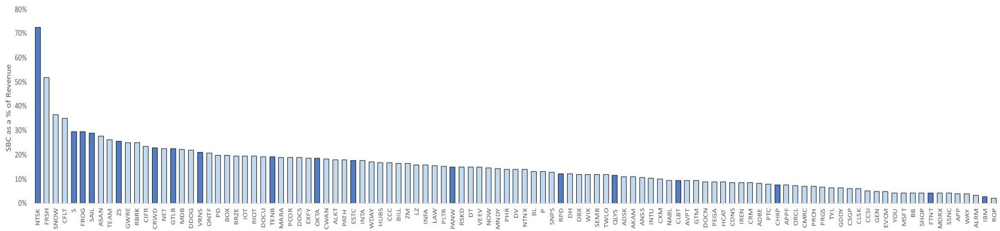

bar chart

| Company | SBC as a % of Revenue (%) |
|---|---|
| NTSK | 72.5 |
| FRSH | 51.8 |
| SNOW | 36.5 |
| CFLT | 34.9 |
| S | 29.5 |
| FROG | 29.2 |
| SAIL | 28.8 |
| ASAN | 27.5 |
| TEAM | 26.0 |
| ZS | 25.5 |
| GWRE | 25.0 |
| RBRK | 24.8 |
| CIFR | 23.5 |
| CRWD | 23.0 |
| NET | 22.5 |
| GTLB | 22.3 |
| MDB | 22.0 |
| DDOG | 21.8 |
| VRNS | 21.5 |
| ONTF | 21.0 |
| PD | 19.5 |
| BOX | 19.3 |
| BRZE | 19.2 |
| IOT | 19.0 |
| RIOT | 18.8 |
| DOCU | 18.7 |
| TENB | 18.6 |
| MARA | 18.5 |
| PCOR | 18.4 |
| DOCS | 18.3 |
| EXFY | 18.2 |
| OKTA | 18.0 |
| CWAN | 17.9 |
| ALKT | 17.8 |
| PATH | 17.7 |
| ESTC | 17.6 |
| INTA | 17.5 |
| WDAY | 17.4 |
| HUBS | 17.3 |
| CCC | 17.2 |
| BILL | 17.1 |
| ZM | 16.9 |
| LZ | 16.7 |
| INFA | 16.5 |
| LAW | 16.4 |
| PLTR | 16.3 |
| PANW | 15.8 |
| RSKD | 15.5 |
| DT | 15.3 |
| VEEV | 15.2 |
| NOW | 15.0 |
| MNDY | 14.8 |
| PHR | 14.7 |
| DV | 14.6 |
| NTNX | 14.5 |
| BL | 14.3 |
| P | 14.0 |
| SNPS | 13.8 |
| RPD | 12.5 |
| DH | 12.3 |
| DBX | 12.0 |
| WIX | 11.8 |
| SEMR | 11.6 |
| TWLO | 11.5 |
| QLYS | 11.3 |
| ADSK | 10.8 |
| AKAM | 10.6 |
| ANSS | 10.5 |
| INTU | 10.4 |
| CXM | 9.8 |
| NABL | 9.6 |
| CLBT | 9.4 |
| AVPT | 9.2 |
| GTM | 9.0 |
| DOCN | 8.8 |
| PEGA | 8.6 |
| HCAT | 8.4 |
| CDNS | 8.2 |
| IREN | 8.0 |
| CRM | 7.8 |
| ADBE | 7.6 |
| PTC | 7.4 |
| CHKP | 7.2 |
| APPF | 6.8 |
| ORCL | 6.6 |
| CMRC | 6.4 |
| PRCH | 6.2 |
| PRGS | 6.0 |
| TYL | 5.8 |
| GDDY | 5.6 |
| CSGP | 5.4 |
| CLSK | 5.2 |
| CCSI | 5.0 |
| GEN | 4.8 |
| EVCN | 4.6 |
| YOU | 4.4 |
| MSFT | 4.2 |
| BB | 4.0 |
| SHOP | 3.8 |
| FTNT | 3.6 |
| MDRX | 3.4 |
| SSNC | 3.2 |
| APP | 3.0 |
| WAY | 2.8 |
| ALRM | 2.6 |
| IBM | 2.4 |
| ROP | 2.2 |

Source: Bloomberg Finance L.P (Dark blue denotes Essex coverage; last reported Q)

## Benchmarking – Ownership

% US Ownership  
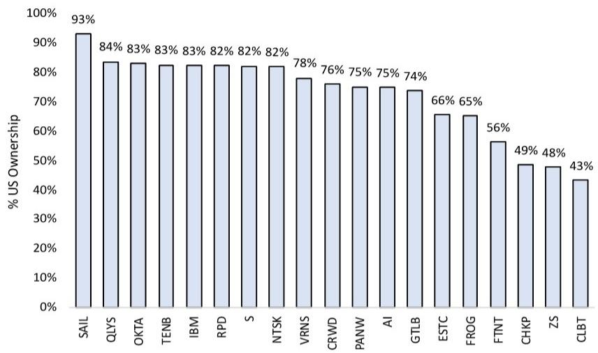

bar chart

| Company | % US Ownership (%) |
| :--- | :--- |
| SAIL | 93 |
| QLYS | 84 |
| OKTA | 83 |
| TENB | 83 |
| IBM | 83 |
| RPD | 82 |
| S | 82 |
| NTSK | 82 |
| VRNS | 78 |
| CRWD | 76 |
| PANW | 75 |
| AI | 75 |
| GTLB | 74 |
| ESTC | 66 |
| FROG | 65 |
| FTNT | 56 |
| CHKP | 49 |
| ZS | 48 |
| CLBT | 43 |

% Insider Ownership  
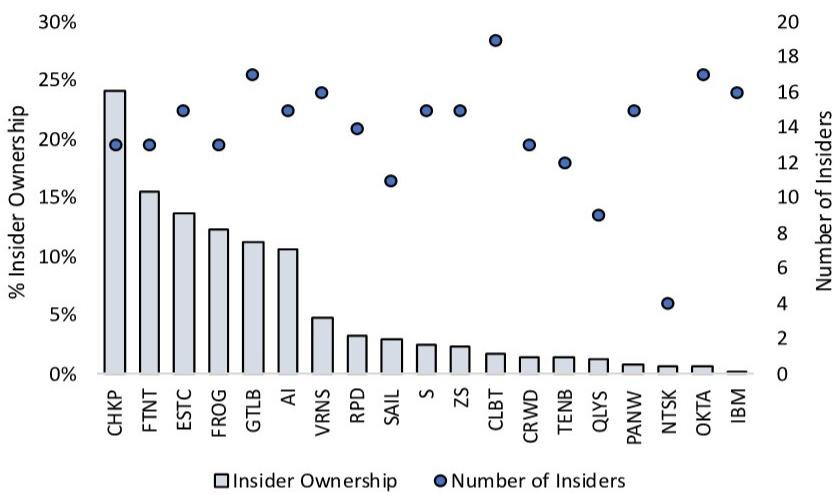

bar-line hybrid

| Company | % Insider Ownership (%) | Number of Insiders |
|---|---|---|
| CHKP | 24 | 13 |
| FTNT | 15.5 | 14 |
| ESTC | 13.8 | 15 |
| FROG | 12.5 | 16 |
| GTLB | 11.3 | 17 |
| AI | 10.7 | 16 |
| VRNS | 4.8 | 15 |
| RPD | 3.2 | 14 |
| SAIL | 2.9 | 12 |
| S | 2.5 | 15 |
| ZS | 2.3 | 15 |
| CLBT | 1.8 | 19 |
| CRWD | 1.6 | 18 |
| TENB | 1.6 | 14 |
| QLYS | 1.5 | 9 |
| PANW | 1.2 | 15 |
| NTSK | 0.9 | 4 |
| OKTA | 0.8 | 17 |
| IBM | 0.3 | 16 |

% Investment Advisor Ownership  
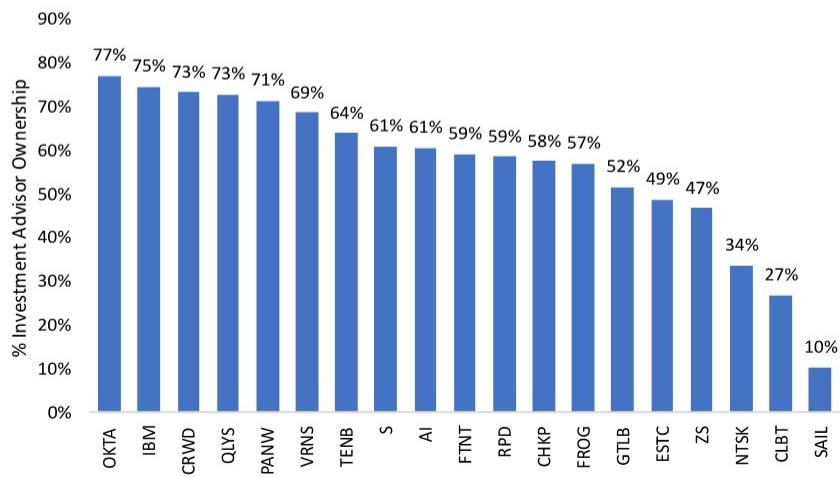

bar chart

| Company | % Investment Advisor Ownership (%) |
| :--- | :--- |
| OKTA | 77 |
| IBM | 75 |
| CRWD | 73 |
| QLYS | 73 |
| PANW | 71 |
| VRNS | 69 |
| TENB | 64 |
| S | 61 |
| AI | 61 |
| FTNT | 59 |
| RPD | 59 |
| CHKP | 58 |
| FROG | 57 |
| GTLB | 52 |
| ESTC | 49 |
| ZS | 47 |
| NTSK | 34 |
| CLBT | 27 |
| SAIL | 10 |

% Hedge Fund Ownership  
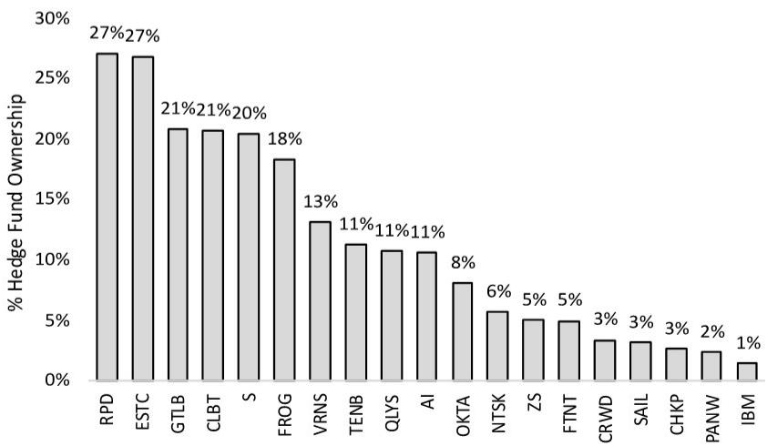

bar chart

| Company | % Hedge Fund Ownership (%) |
| :--- | :--- |
| RPD | 27 |
| ESTC | 27 |
| GTLB | 21 |
| CLBT | 21 |
| S | 20 |
| FROG | 18 |
| VRNS | 13 |
| TENB | 11 |
| QLYS | 11 |
| AI | 11 |
| OKTA | 8 |
| NTSK | 6 |
| ZS | 5 |
| FTNT | 5 |
| CRWD | 3 |
| SAIL | 3 |
| CHKP | 3 |
| PANW | 2 |
| IBM | 1 |

## Benchmarking – Security Software RPO

cRPO Growth (y/y)  
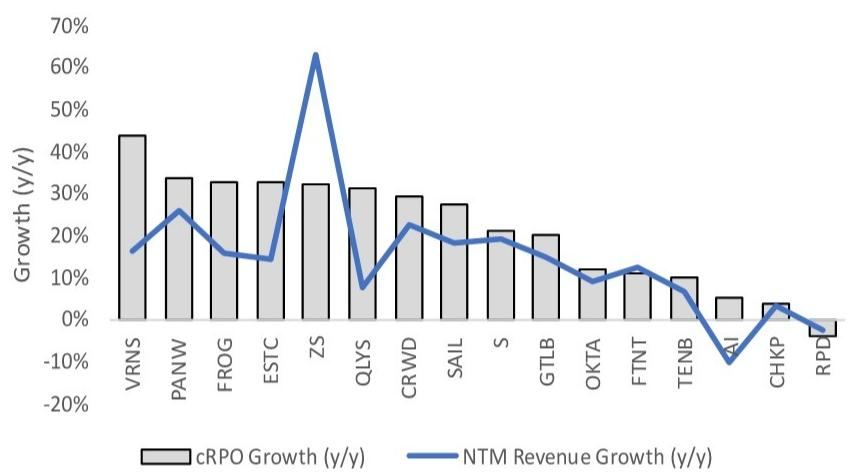

bar-line hybrid

| Company | cRPO Growth (y/y) (%) | NTM Revenue Growth (y/y) (%) |
|---|---|---|
| VRNS | 44 | 16 |
| PANW | 33 | 26 |
| FROG | 32 | 15 |
| ESTC | 32 | 14 |
| ZS | 32 | 63 |
| QLYS | 30 | 7 |
| CRWD | 29 | 22 |
| SAIL | 27 | 18 |
| S | 20 | 18 |
| GTLB | 20 | 14 |
| OKTA | 11 | 9 |
| FTNT | 11 | 12 |
| TENB | 10 | 6 |
| AI | 5 | -10 |
| CHKP | 3 | 2 |
| RPD | -2 | -2 |

RPO Growth (y/y)  
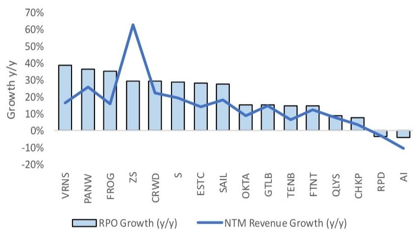

bar-line hybrid

| Company | RPO Growth (y/y) (%) | NTM Revenue Growth (y/y) (%) |
| :--- | :--- | :--- |
| VRNS | 39 | 16 |
| PANW | 37 | 26 |
| FROG | 35 | 16 |
| ZS | 29 | 64 |
| CRWD | 29 | 22 |
| S | 28 | 20 |
| ESTC | 28 | 15 |
| SAIL | 28 | 18 |
| OKTA | 15 | 9 |
| GTLB | 15 | 14 |
| TENB | 15 | 6 |
| FTNT | 15 | 12 |
| QLYS | 9 | 8 |
| CHKP | 7 | 4 |
| RPD | -2 | -3 |
| AI | -2 | -10 |

cRPO Coverage (% of NTM Rev)  
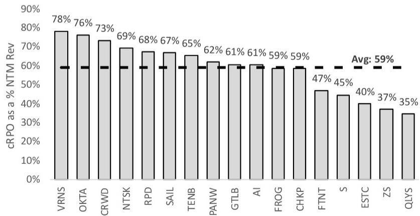

bar chart

| Company | cRPO as a % NTM Rev (%) |
| :--- | :--- |
| VRNS | 78 |
| OKTA | 76 |
| CRWD | 73 |
| NTSK | 69 |
| RPD | 68 |
| SAIL | 67 |
| TENB | 65 |
| PANW | 62 |
| GTLB | 61 |
| AI | 61 |
| FROG | 59 |
| CHKP | 59 |
| FTNT | 47 |
| S | 45 |
| ESTC | 40 |
| ZS | 37 |
| QLYS | 35 |
Avg: 59%

## Benchmarking – Interest Rates vs Multiples

Interest Rates vs Multiples  
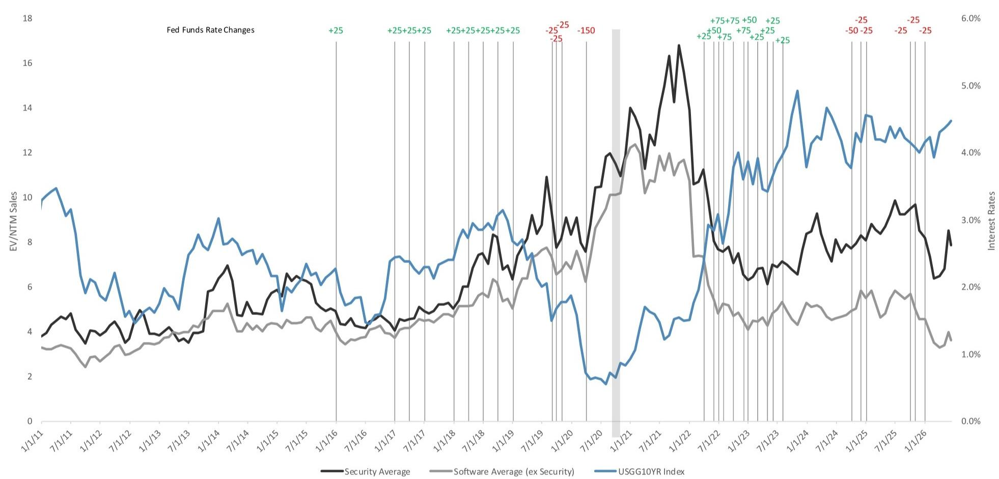

line chart

| Date     | Security Average | Software Average (ex Security) | USGG10YR Index |
|----------|------------------|-------------------------------|----------------|
| 1/1/16   | ~4.5             | ~3.5                          | ~7.0           |
| 1/1/17   | ~4.8             | ~3.8                          | ~7.5           |
| 1/1/18   | ~5.2             | ~4.2                          | ~8.0           |
| 1/1/19   | ~6.0             | ~4.8                          | ~8.5           |
| 1/1/20   | ~7.5             | ~5.5                          | ~5.0           |
| 1/1/21   | ~10.0            | ~7.0                          | ~4.0           |
| 1/1/22   | ~16.5            | ~10.0                         | ~5.5           |
| 1/1/23   | ~8.0             | ~6.0                          | ~3.0           |
| 1/1/24   | ~9.0             | ~7.0                          | ~4.5           |
| 1/1/25   | ~8.5             | ~6.5                          | ~4.0           |
| 1/1/26   | ~8.0             | ~6.0                          | ~4.5           |

## Appendix - Software Comp Detail (1/3) – As of 6/12/26

<table><tr><td>Company</td><td>Ticker</td><td>JPM Analyst</td><td>Rating</td></tr><tr><td>Adobe</td><td>ADBE</td><td>Arti Vula</td><td>OW</td></tr><tr><td>Autodesk</td><td>ADSK</td><td>Alexei Gogolev</td><td>OW</td></tr><tr><td>C3.ai</td><td>AI</td><td>Brian Essex</td><td>UW</td></tr><tr><td>Akamai</td><td>AKAM</td><td>Arti Vula</td><td>UW</td></tr><tr><td>Alkami</td><td>ALKT</td><td>Ella Smith</td><td>OW</td></tr><tr><td>Alarm.com</td><td>ALRM</td><td>Ella Smith</td><td>UW</td></tr><tr><td>AppLovin</td><td>APP</td><td>Cory Carpenter</td><td>N</td></tr><tr><td>Appfolio</td><td>APPF</td><td>Alexei Gogolev</td><td>OW</td></tr><tr><td>Asana</td><td>ASAN</td><td>Not Covered</td><td>--</td></tr><tr><td>AvePoint</td><td>AVPT</td><td>Not Covered</td><td>--</td></tr><tr><td>BlackBerry</td><td>BB</td><td>Not Covered</td><td>--</td></tr><tr><td>BigCommerce</td><td>CMRC</td><td>Not Covered</td><td>--</td></tr><tr><td>BILL</td><td>BILL</td><td>Tien-tsin Huang</td><td>OW</td></tr><tr><td>BlackLine</td><td>BL</td><td>Not Covered</td><td>--</td></tr><tr><td>Box</td><td>BOX</td><td>Not Covered</td><td>--</td></tr><tr><td>Braze</td><td>BRZE</td><td>Alexei Gogolev</td><td>OW</td></tr><tr><td>CCC Intelligent</td><td>CCC</td><td>Alexei Gogolev</td><td>UW</td></tr><tr><td>Consensus Cloud</td><td>CCSI</td><td>Not Covered</td><td>--</td></tr><tr><td>Cadence Design</td><td>CDNS</td><td>Harlan Sur</td><td>OW</td></tr><tr><td>Check Point Software</td><td>CHKP</td><td>Brian Essex</td><td>OW</td></tr><tr><td>Cellebrite DI</td><td>CLBT</td><td>Brian Essex</td><td>OW</td></tr><tr><td>Cleanspark</td><td>CLSK</td><td>Not Covered</td><td>--</td></tr><tr><td>Salesforce</td><td>CRM</td><td>Arti Vula</td><td>--</td></tr><tr><td>Crowdstrike</td><td>CRWD</td><td>Brian Essex</td><td>OW</td></tr><tr><td>CoreWeave</td><td>CRWV</td><td>Arti Vula</td><td>N</td></tr><tr><td>CoStar Group</td><td>CSGP</td><td>Alexei Gogolev</td><td>OW</td></tr><tr><td>Clearwater Analytics</td><td>CWAN</td><td>Alexei Gogolev</td><td>--</td></tr><tr><td>Sprinklr</td><td>CXM</td><td>Not Covered</td><td>--</td></tr><tr><td>Dropbox</td><td>DBX</td><td>Arti Vula</td><td>N</td></tr><tr><td>Datadog</td><td>DDOG</td><td>Arti Vula</td><td>OW</td></tr><tr><td>DigitalOcean</td><td>DOCN</td><td>Not Covered</td><td>--</td></tr><tr><td>Doximity</td><td>DOCS</td><td>Alexei Gogolev</td><td>N</td></tr><tr><td>DocuSign</td><td>DOCU</td><td>Arti Vula</td><td>N</td></tr><tr><td>Definitive Healthcare</td><td>DH</td><td>Not Covered</td><td>--</td></tr><tr><td>Dynatrace</td><td>DT</td><td>Arti Vula</td><td>OW</td></tr><tr><td>DoubleVerify</td><td>DV</td><td>Arti Vula</td><td>OW</td></tr><tr><td>Elastic NV</td><td>ESTC</td><td>Brian Essex</td><td>OW</td></tr><tr><td>EverCommerce</td><td>EVCM</td><td>Not Covered</td><td>--</td></tr><tr><td>Expensify</td><td>EXFY</td><td>Not Covered</td><td>--</td></tr><tr><td>JFrog</td><td>FROG</td><td>Brian Essex</td><td>OW</td></tr><tr><td>Freshworks</td><td>FRSH</td><td>Not Covered</td><td>--</td></tr><tr><td>Fortinet</td><td>FTNT</td><td>Brian Essex</td><td>UW</td></tr><tr><td>Gen Digital</td><td>GEN</td><td>Not Covered</td><td>--</td></tr></table>

<table><tr><td colspan="3">Pricing</td></tr><tr><td>Price 6/12/2026</td><td>Market Cap</td><td>Current EV</td></tr><tr><td>204.02</td><td>82,016</td><td>83,035</td></tr><tr><td>198.43</td><td>42,067</td><td>41,242</td></tr><tr><td>10.90</td><td>1,547</td><td>926</td></tr><tr><td>133.50</td><td>20,028</td><td>22,402</td></tr><tr><td>15.19</td><td>1,616</td><td>1,875</td></tr><tr><td>46.65</td><td>2,627</td><td>2,620</td></tr><tr><td>496.77</td><td>168,270</td><td>169,026</td></tr><tr><td>161.21</td><td>5,773</td><td>5,622</td></tr><tr><td>7.39</td><td>1,776</td><td>1,352</td></tr><tr><td>10.87</td><td>2,458</td><td>2,014</td></tr><tr><td>9.19</td><td>5,915</td><td>5,751</td></tr><tr><td>2.70</td><td>222</td><td>223</td></tr><tr><td>33.18</td><td>3,739</td><td>3,400</td></tr><tr><td>28.73</td><td>2,006</td><td>2,148</td></tr><tr><td>25.39</td><td>3,558</td><td>3,533</td></tr><tr><td>21.66</td><td>2,400</td><td>2,012</td></tr><tr><td>4.60</td><td>2,792</td><td>4,043</td></tr><tr><td>34.81</td><td>663</td><td>1,120</td></tr><tr><td>384.96</td><td>105,373</td><td>106,873</td></tr><tr><td>124.06</td><td>13,163</td><td>10,757</td></tr><tr><td>12.84</td><td>3,329</td><td>2,900</td></tr><tr><td>16.48</td><td>4,414</td><td>5,942</td></tr><tr><td>165.89</td><td>144,490</td><td>171,933</td></tr><tr><td>682.80</td><td>176,081</td><td>172,274</td></tr><tr><td>100.55</td><td>52,990</td><td>68,036</td></tr><tr><td>32.84</td><td>13,596</td><td>13,375</td></tr><tr><td>24.33</td><td>7,177</td><td>7,902</td></tr><tr><td>5.34</td><td>1,284</td><td>842</td></tr><tr><td>27.09</td><td>6,412</td><td>8,425</td></tr><tr><td>229.90</td><td>83,852</td><td>80,078</td></tr><tr><td>170.44</td><td>19,075</td><td>18,942</td></tr><tr><td>20.04</td><td>3,908</td><td>3,160</td></tr><tr><td>45.03</td><td>8,847</td><td>8,033</td></tr><tr><td>0.84</td><td>88</td><td>64</td></tr><tr><td>40.75</td><td>12,181</td><td>11,009</td></tr><tr><td>10.20</td><td>1,674</td><td>1,500</td></tr><tr><td>60.35</td><td>6,356</td><td>5,554</td></tr><tr><td>9.13</td><td>1,647</td><td>2,035</td></tr><tr><td>1.26</td><td>118</td><td>52</td></tr><tr><td>77.74</td><td>9,744</td><td>9,002</td></tr><tr><td>9.45</td><td>2,676</td><td>1,897</td></tr><tr><td>146.30</td><td>108,672</td><td>105,534</td></tr><tr><td>24.32</td><td>14,811</td><td>22,415</td></tr></table>

<table><tr><td colspan="13">Valuation</td></tr><tr><td colspan="2">EV/Sales</td><td colspan="2">EV/Sales/G</td><td colspan="2">EV/EBITDA</td><td colspan="2">EV/FCF</td><td colspan="2">EV/(FCF-SBC)</td><td colspan="3">P/E</td></tr><tr><td>CY26E</td><td>CY27E</td><td>CY26E</td><td>CY27E</td><td>CY26E</td><td>CY27E</td><td>CY26E</td><td>CY27E</td><td>CY26E</td><td>CY27E</td><td>CY26E</td><td>CY27E</td><td></td></tr><tr><td>3.1x</td><td>2.9x</td><td>0.26x</td><td>0.40x</td><td>6.5x</td><td>6.2x</td><td>8.5x</td><td>8.0x</td><td>11.1x</td><td>10.3x</td><td>8.4x</td><td>7.8x</td><td></td></tr><tr><td>5.0x</td><td>4.6x</td><td>0.35x</td><td>0.44x</td><td>12.7x</td><td>11.4x</td><td>14.8x</td><td>13.6x</td><td>20.2x</td><td>18.6x</td><td>15.7x</td><td>13.5x</td><td></td></tr><tr><td>4.3x</td><td>3.8x</td><td>NM</td><td>0.53x</td><td>---</td><td>---</td><td>---</td><td>---</td><td>---</td><td>---</td><td>---</td><td>---</td><td></td></tr><tr><td>5.0x</td><td>4.5x</td><td>0.68x</td><td>0.38x</td><td>12.7x</td><td>11.4x</td><td>---</td><td>32.8x</td><td>---</td><td>---</td><td>20.0x</td><td>17.5x</td><td></td></tr><tr><td>3.5x</td><td>3.0x</td><td>0.18x</td><td>0.18x</td><td>19.3x</td><td>14.1x</td><td>31.3x</td><td>20.2x</td><td>---</td><td>---</td><td>17.7x</td><td>12.6x</td><td></td></tr><tr><td>2.5x</td><td>2.3x</td><td>0.37x</td><td>0.52x</td><td>12.2x</td><td>11.0x</td><td>13.1x</td><td>11.9x</td><td>15.6x</td><td>14.1x</td><td>17.5x</td><td>16.2x</td><td></td></tr><tr><td>20.6x</td><td>15.7x</td><td>0.45x</td><td>0.42x</td><td>23.8x</td><td>17.2x</td><td>31.7x</td><td>23.2x</td><td>33.6x</td><td>24.5x</td><td>28.9x</td><td>21.4x</td><td></td></tr><tr><td>5.0x</td><td>4.3x</td><td>0.29x</td><td>0.25x</td><td>17.2x</td><td>13.7x</td><td>19.5x</td><td>16.6x</td><td>26.7x</td><td>22.8x</td><td>23.1x</td><td>18.6x</td><td></td></tr><tr><td>1.6x</td><td>1.5x</td><td>0.18x</td><td>0.18x</td><td>12.8x</td><td>10.2x</td><td>11.6x</td><td>9.1x</td><td>--</td><td>--</td><td>---</td><td>---</td><td></td></tr><tr><td>3.9x</td><td>3.3x</td><td>0.18x</td><td>0.16x</td><td>20.4x</td><td>17.0x</td><td>19.1x</td><td>15.0x</td><td>--</td><td>--</td><td>27.8x</td><td>22.4x</td><td></td></tr><tr><td>9.8x</td><td>9.1x</td><td>0.98x</td><td>1.15x</td><td>51.5x</td><td>40.9x</td><td>68.6x</td><td>46.1x</td><td>--</td><td>--</td><td>51.9x</td><td>46.4x</td><td></td></tr><tr><td>0.6x</td><td>0.6x</td><td>0.17x</td><td>0.13x</td><td>5.1x</td><td>4.6x</td><td>7.9x</td><td>6.3x</td><td>--</td><td>--</td><td>---</td><td>---</td><td></td></tr><tr><td>1.9x</td><td>1.7x</td><td>0.14x</td><td>0.11x</td><td>7.0x</td><td>6.2x</td><td>7.3x</td><td>5.8x</td><td>14.3x</td><td>9.7x</td><td>11.6x</td><td>9.1x</td><td></td></tr><tr><td>2.8x</td><td>2.5x</td><td>0.29x</td><td>0.23x</td><td>9.5x</td><td>8.1x</td><td>13.4x</td><td>11.1x</td><td>--</td><td>--</td><td>---</td><td>---</td><td></td></tr><tr><td>2.8x</td><td>2.5x</td><td>0.32x</td><td>0.31x</td><td>9.0x</td><td>8.0x</td><td>9.8x</td><td>8.8x</td><td>--</td><td>--</td><td>---</td><td>---</td><td></td></tr><tr><td>2.2x</td><td>1.9x</td><td>0.10x</td><td>0.12x</td><td>23.5x</td><td>15.4x</td><td>22.9x</td><td>16.2x</td><td>---</td><td>---</td><td>34.4x</td><td>22.3x</td><td></td></tr><tr><td>3.5x</td><td>3.2x</td><td>0.35x</td><td>0.40x</td><td>8.3x</td><td>7.6x</td><td>13.2x</td><td>11.5x</td><td>25.8x</td><td>18.7x</td><td>10.0x</td><td>9.0x</td><td></td></tr><tr><td>3.1x</td><td>3.0x</td><td>1.45x</td><td>0.90x</td><td>5.9x</td><td>5.8x</td><td>9.8x</td><td>13.6x</td><td>--</td><td>--</td><td>---</td><td>---</td><td></td></tr><tr><td>17.2x</td><td>15.2x</td><td>0.97x</td><td>1.16x</td><td>39.0x</td><td>31.6x</td><td>58.1x</td><td>46.9x</td><td>---</td><td>--</td><td>48.1x</td><td>---</td><td></td></tr><tr><td>3.8x</td><td>3.6x</td><td>1.33x</td><td>0.59x</td><td>9.4x</td><td>8.8x</td><td>8.9x</td><td>8.2x</td><td>11.2x</td><td>10.4x</td><td>11.7x</td><td>10.6x</td><td></td></tr><tr><td>5.1x</td><td>4.3x</td><td>0.26x</td><td>0.22x</td><td>19.0x</td><td>15.5x</td><td>16.4x</td><td>13.5x</td><td>22.2x</td><td>18.1x</td><td>22.9x</td><td>19.5x</td><td></td></tr><tr><td>9.3x</td><td>7.1x</td><td>NM</td><td>0.23x</td><td>---</td><td>16.8x</td><td>NA</td><td>---</td><td>--</td><td>--</td><td>---</td><td>---</td><td></td></tr><tr><td>3.7x</td><td>3.4x</td><td>0.34x</td><td>0.36x</td><td>9.2x</td><td>8.4x</td><td>11.4x</td><td>10.7x</td><td>--</td><td>--</td><td>---</td><td>---</td><td></td></tr><tr><td>29.0x</td><td>23.8x</td><td>1.22x</td><td>1.11x</td><td>---</td><td>---</td><td>---</td><td>74.8x</td><td>--</td><td>--</td><td>---</td><td>---</td><td></td></tr><tr><td>5.4x</td><td>2.7x</td><td>0.04x</td><td>0.06x</td><td>9.3x</td><td>6.0x</td><td>---</td><td>---</td><td>---</td><td>---</td><td>---</td><td>---</td><td></td></tr><tr><td>3.5x</td><td>3.1x</td><td>0.20x</td><td>0.28x</td><td>16.5x</td><td>14.6x</td><td>21.3x</td><td>21.4x</td><td>28.8x</td><td>29.4x</td><td>24.7x</td><td>23.1x</td><td></td></tr><tr><td>8.4x</td><td>7.1x</td><td>0.29x</td><td>0.39x</td><td>23.9x</td><td>19.3x</td><td>42.5x</td><td>28.0x</td><td>--</td><td>--</td><td>---</td><td>---</td><td></td></tr><tr><td>1.0x</td><td>0.9x</td><td>0.81x</td><td>0.24x</td><td>5.3x</td><td>4.7x</td><td>5.6x</td><td>5.2x</td><td>--</td><td>--</td><td>---</td><td>---</td><td></td></tr><tr><td>3.4x</td><td>3.4x</td><td>NM</td><td>NM</td><td>7.2x</td><td>6.8x</td><td>9.7x</td><td>9.1x</td><td>15.3x</td><td>14.1x</td><td>8.4x</td><td>7.5x</td><td></td></tr><tr><td>18.5x</td><td>15.3x</td><td>0.67x</td><td>0.92x</td><td>---</td><td>---</td><td>66.1x</td><td>56.9x</td><td>---</td><td>---</td><td>---</td><td>---</td><td></td></tr><tr><td>16.6x</td><td>10.9x</td><td>0.61x</td><td>0.21x</td><td>43.4x</td><td>27.1x</td><td>---</td><td>62.1x</td><td>--</td><td>--</td><td>---</td><td>---</td><td></td></tr><tr><td>4.8x</td><td>4.5x</td><td>0.57x</td><td>0.59x</td><td>9.6x</td><td>8.9x</td><td>9.6x</td><td>9.8x</td><td>15.7x</td><td>16.7x</td><td>14.0x</td><td>13.1x</td><td></td></tr><tr><td>2.3x</td><td>2.1x</td><td>0.26x</td><td>0.26x</td><td>7.5x</td><td>6.9x</td><td>7.5x</td><td>7.2x</td><td>18.3x</td><td>18.4x</td><td>9.9x</td><td>8.8x</td><td></td></tr><tr><td>0.3x</td><td>0.3x</td><td>NM</td><td>1.43x</td><td>1.1x</td><td>1.2x</td><td>1.7x</td><td>1.3x</td><td>--</td><td>--</td><td>---</td><td>---</td><td></td></tr><tr><td>4.9x</td><td>4.3x</td><td>0.27x</td><td>0.30x</td><td>31.1x</td><td>26.2x</td><td>16.3x</td><td>17.1x</td><td>30.7x</td><td>37.5x</td><td>22.4x</td><td>18.5x</td><td></td></tr><tr><td>1.8x</td><td>1.7x</td><td>0.22x</td><td>0.19x</td><td>5.4x</td><td>4.9x</td><td>9.0x</td><td>8.0x</td><td>24.8x</td><td>19.6x</td><td>9.0x</td><td>7.9x</td><td></td></tr><tr><td>2.9x</td><td>2.5x</td><td>0.16x</td><td>0.16x</td><td>16.8x</td><td>12.9x</td><td>15.5x</td><td>14.0x</td><td>---</td><td>---</td><td>20.1x</td><td>16.1x</td><td></td></tr><tr><td>3.3x</td><td>3.1x</td><td>0.71x</td><td>0.56x</td><td>11.0x</td><td>10.1x</td><td>22.3x</td><td>19.8x</td><td>--</td><td>--</td><td>---</td><td>---</td><td></td></tr><tr><td>0.4x</td><td>0.4x</td><td>NM</td><td>NM</td><td>2.2x</td><td>2.1x</td><td>6.8x</td><td>6.0x</td><td>--</td><td>--</td><td>---</td><td>---</td><td></td></tr><tr><td>14.3x</td><td>12.2x</td><td>0.71x</td><td>0.64x</td><td>---</td><td>53.6x</td><td>59.7x</td><td>40.1x</td><td>---</td><td>---</td><td>---</td><td>62.7x</td><td></td></tr><tr><td>2.0x</td><td>1.7x</td><td>0.14x</td><td>0.12x</td><td>8.1x</td><td>6.5x</td><td>7.2x</td><td>6.0x</td><td>--</td><td>--</td><td>---</td><td>---</td><td></td></tr><tr><td>13.5x</td><td>12.2x</td><td>0.85x</td><td>1.24x</td><td>37.4x</td><td>33.7x</td><td>40.8x</td><td>38.3x</td><td>46.9x</td><td>44.8x</td><td>46.4x</td><td>43.3x</td><td></td></tr><tr><td>4.3x</td><td>4.0x</td><td>0.37x</td><td>0.60x</td><td>9.0x</td><td>7.7x</td><td>13.4x</td><td>12.2x</td><td>--</td><td>--</td><td>8.7x</td><td>7.6x</td><td></td></tr></table>

## Appendix - Software Comp Detail (2/3) – As of 6/12/26

<table><tr><td>Company</td><td>Ticker</td><td>JPM Analyst</td><td>Rating</td></tr><tr><td>GoDaddy</td><td>GDDY</td><td>Alexei Gogolev</td><td>OW</td></tr><tr><td>Gitlab</td><td>GTLB</td><td>Brian Essex</td><td>N</td></tr><tr><td>Guidewire Software</td><td>GWRE</td><td>Alexei Gogolev</td><td>OW</td></tr><tr><td>Health Catalyst</td><td>HCAT</td><td>Not Covered</td><td>--</td></tr><tr><td>HubSpot</td><td>HUBS</td><td>Arti Vula</td><td>OW</td></tr><tr><td>IBM</td><td>IBM</td><td>Brian Essex</td><td>N</td></tr><tr><td>Intapp</td><td>INTA</td><td>Alexei Gogolev</td><td>OW</td></tr><tr><td>Intuit</td><td>INTU</td><td>Arti Vula</td><td>OW</td></tr><tr><td>Samsara</td><td>IOT</td><td>Alexei Gogolev</td><td>N</td></tr><tr><td>CS Disco</td><td>LAW</td><td>Not Covered</td><td>--</td></tr><tr><td>Legalzoom.com</td><td>LZ</td><td>Ella Smith</td><td>OW</td></tr><tr><td>MongoDB</td><td>MDB</td><td>Not Covered</td><td>--</td></tr><tr><td>Veradigm</td><td>MDRX</td><td>Alexei Gogolev</td><td>--</td></tr><tr><td>Monday.com</td><td>MNDY</td><td>Arti Vula</td><td>OW</td></tr><tr><td>Microsoft</td><td>MSFT</td><td>Arti Vula</td><td>OW</td></tr><tr><td>N-able /US</td><td>NABL</td><td>Not Covered</td><td>--</td></tr><tr><td>Cloudflare</td><td>NET</td><td>Arti Vula</td><td>N</td></tr><tr><td>ServiceNow</td><td>NOW</td><td>Arti Vula</td><td>OW</td></tr><tr><td>Nutanix</td><td>NTNX</td><td>Samik Chatterjee</td><td>N</td></tr><tr><td>Netskope</td><td>NTSK</td><td>Brian Essex</td><td>OW</td></tr><tr><td>Okta</td><td>OKTA</td><td>Brian Essex</td><td>OW</td></tr><tr><td>Oracle</td><td>ORCL</td><td>Arti Vula</td><td>OW</td></tr><tr><td>Palo Alto Networks</td><td>PANW</td><td>Brian Essex</td><td>OW</td></tr><tr><td>UiPath</td><td>PATH</td><td>Not Covered</td><td>--</td></tr><tr><td>Paycom Software</td><td>PAYC</td><td>Arti Vula</td><td>N</td></tr><tr><td>Procore</td><td>PCOR</td><td>Alexei Gogolev</td><td>OW</td></tr><tr><td>Pegasystems</td><td>PEGA</td><td>Alexei Gogolev</td><td>OW</td></tr><tr><td>Phreesia</td><td>PHR</td><td>Alexei Gogolev</td><td>N</td></tr><tr><td>Palantir</td><td>PLTR</td><td>Not Covered</td><td>--</td></tr><tr><td>PagerDuty</td><td>PD</td><td>Not Covered</td><td>--</td></tr><tr><td>Porch Group Inc.</td><td>PRCH</td><td>Not Covered</td><td>--</td></tr><tr><td>Progress Software</td><td>PRGS</td><td>Not Covered</td><td>--</td></tr><tr><td>Everpure</td><td>P</td><td>Samik Chatterjee</td><td>OW</td></tr><tr><td>PTC</td><td>PTC</td><td>Alexei Gogolev</td><td>UW</td></tr><tr><td>Qualys</td><td>QLYS</td><td>Brian Essex</td><td>UW</td></tr><tr><td>Rubrik</td><td>RBRK</td><td>Not Covered</td><td>--</td></tr><tr><td>Roper</td><td>ROP</td><td>Chigusa Katoku</td><td>UW</td></tr><tr><td>Rapid7</td><td>RPD</td><td>Brian Essex</td><td>N</td></tr><tr><td>Riskified</td><td>RSKD</td><td>Not Covered</td><td>--</td></tr><tr><td>SentinelOne</td><td>S</td><td>Brian Essex</td><td>N</td></tr><tr><td>SailPoint</td><td>SAIL</td><td>Brian Essex</td><td>OW</td></tr></table>

<table><tr><td colspan="3">Pricing</td></tr><tr><td>Price 6/12/2026</td><td>Market Cap</td><td>Current EV</td></tr><tr><td>76.24</td><td>10,238</td><td>12,739</td></tr><tr><td>27.79</td><td>4,766</td><td>3,409</td></tr><tr><td>122.56</td><td>10,426</td><td>10,353</td></tr><tr><td>1.85</td><td>134</td><td>177</td></tr><tr><td>187.98</td><td>9,884</td><td>8,193</td></tr><tr><td>272.24</td><td>258,329</td><td>298,648</td></tr><tr><td>23.90</td><td>1,885</td><td>1,738</td></tr><tr><td>276.73</td><td>76,377</td><td>75,009</td></tr><tr><td>33.66</td><td>19,781</td><td>18,977</td></tr><tr><td>3.58</td><td>228</td><td>125</td></tr><tr><td>5.91</td><td>1,046</td><td>863</td></tr><tr><td>342.80</td><td>27,966</td><td>25,539</td></tr><tr><td>4.80</td><td>518</td><td>72</td></tr><tr><td>77.57</td><td>3,790</td><td>2,578</td></tr><tr><td>390.74</td><td>2,909,059</td><td>2,862,210</td></tr><tr><td>3.21</td><td>602</td><td>877</td></tr><tr><td>228.48</td><td>80,568</td><td>78,379</td></tr><tr><td>102.15</td><td>106,224</td><td>102,533</td></tr><tr><td>49.31</td><td>14,176</td><td>13,504</td></tr><tr><td>9.04</td><td>3,620</td><td>3,231</td></tr><tr><td>116.29</td><td>21,404</td><td>19,165</td></tr><tr><td>184.13</td><td>536,739</td><td>627,187</td></tr><tr><td>279.62</td><td>225,653</td><td>219,853</td></tr><tr><td>10.55</td><td>5,568</td><td>4,153</td></tr><tr><td>134.52</td><td>6,887</td><td>7,409</td></tr><tr><td>42.36</td><td>6,394</td><td>5,803</td></tr><tr><td>32.76</td><td>5,859</td><td>5,385</td></tr><tr><td>9.06</td><td>562</td><td>571</td></tr><tr><td>127.99</td><td>329,053</td><td>321,026</td></tr><tr><td>8.96</td><td>712</td><td>664</td></tr><tr><td>10.28</td><td>1,090</td><td>1,413</td></tr><tr><td>31.47</td><td>1,345</td><td>2,213</td></tr><tr><td>72.31</td><td>24,838</td><td>23,333</td></tr><tr><td>113.68</td><td>13,477</td><td>14,211</td></tr><tr><td>111.24</td><td>3,969</td><td>3,240</td></tr><tr><td>68.19</td><td>13,888</td><td>13,276</td></tr><tr><td>334.97</td><td>35,038</td><td>44,403</td></tr><tr><td>7.14</td><td>552</td><td>775</td></tr><tr><td>4.94</td><td>728</td><td>452</td></tr><tr><td>14.85</td><td>5,079</td><td>4,266</td></tr><tr><td>14.62</td><td>8,256</td><td>7,865</td></tr></table>

<table><tr><td colspan="13">Valuation</td></tr><tr><td colspan="2">EV/Sales</td><td colspan="2">EV/Sales/G</td><td colspan="2">EV/EBITDA</td><td colspan="2">EV/FCF</td><td colspan="2">EV/(FCF-SBC)</td><td colspan="3">P/E</td></tr><tr><td>CY26E</td><td>CY27E</td><td>CY26E</td><td>CY27E</td><td>CY26E</td><td>CY27E</td><td>CY26E</td><td>CY27E</td><td>CY26E</td><td>CY27E</td><td>CY26E</td><td>CY27E</td><td></td></tr><tr><td>2.4x</td><td>2.3x</td><td>0.39x</td><td>0.34x</td><td>7.3x</td><td>6.6x</td><td>7.1x</td><td>6.4x</td><td>8.3x</td><td>7.5x</td><td>10.4x</td><td>7.1x</td><td></td></tr><tr><td>3.1x</td><td>2.6x</td><td>0.17x</td><td>0.16x</td><td>---</td><td>---</td><td>19.2x</td><td>13.7x</td><td>---</td><td>---</td><td>34.3x</td><td>28.6x</td><td></td></tr><tr><td>6.5x</td><td>5.6x</td><td>0.26x</td><td>0.28x</td><td>27.6x</td><td>19.5x</td><td>26.9x</td><td>21.0x</td><td>54.0x</td><td>36.6x</td><td>30.9x</td><td>22.9x</td><td></td></tr><tr><td>0.7x</td><td>0.7x</td><td>NM</td><td>NM</td><td>5.6x</td><td>5.6x</td><td>--</td><td>---</td><td>--</td><td>--</td><td>---</td><td>---</td><td></td></tr><tr><td>2.2x</td><td>1.9x</td><td>0.12x</td><td>0.13x</td><td>8.6x</td><td>7.1x</td><td>9.4x</td><td>8.2x</td><td>26.2x</td><td>22.6x</td><td>14.4x</td><td>12.6x</td><td></td></tr><tr><td>4.2x</td><td>4.0x</td><td>0.64x</td><td>0.77x</td><td>14.8x</td><td>14.1x</td><td>19.0x</td><td>17.7x</td><td>20.9x</td><td>19.1x</td><td>22.0x</td><td>20.1x</td><td></td></tr><tr><td>2.8x</td><td>2.5x</td><td>0.20x</td><td>0.18x</td><td>12.9x</td><td>10.2x</td><td>12.9x</td><td>8.9x</td><td>45.5x</td><td>19.0x</td><td>17.4x</td><td>12.4x</td><td></td></tr><tr><td>3.3x</td><td>3.0x</td><td>0.24x</td><td>0.26x</td><td>6.5x</td><td>6.8x</td><td>10.9x</td><td>10.0x</td><td>16.3x</td><td>15.0x</td><td>11.0x</td><td>8.6x</td><td></td></tr><tr><td>9.4x</td><td>7.9x</td><td>0.37x</td><td>0.40x</td><td>42.8x</td><td>34.6x</td><td>67.8x</td><td>38.3x</td><td>---</td><td>---</td><td>46.8x</td><td>44.3x</td><td></td></tr><tr><td>0.7x</td><td>0.6x</td><td>0.06x</td><td>0.06x</td><td>---</td><td>73.1x</td><td>---</td><td>---</td><td>--</td><td>--</td><td>---</td><td>---</td><td></td></tr><tr><td>1.0x</td><td>1.0x</td><td>0.10x</td><td>0.15x</td><td>4.3x</td><td>3.7x</td><td>5.4x</td><td>4.5x</td><td>11.1x</td><td>9.3x</td><td>8.1x</td><td>6.5x</td><td></td></tr><tr><td>8.6x</td><td>7.3x</td><td>0.42x</td><td>0.41x</td><td>41.8x</td><td>33.6x</td><td>46.6x</td><td>37.8x</td><td>--</td><td>--</td><td>55.8x</td><td>46.7x</td><td></td></tr><tr><td>0.1x</td><td>0.1x</td><td>NM</td><td>0.03x</td><td>0.8x</td><td>0.7x</td><td>---</td><td>---</td><td>--</td><td>--</td><td>8.9x</td><td>8.0x</td><td></td></tr><tr><td>1.8x</td><td>1.5x</td><td>0.09x</td><td>0.10x</td><td>40.3x</td><td>29.0x</td><td>9.0x</td><td>7.8x</td><td>17.8x</td><td>15.3x</td><td>17.5x</td><td>14.4x</td><td></td></tr><tr><td>8.1x</td><td>6.8x</td><td>0.44x</td><td>0.47x</td><td>17.6x</td><td>15.2x</td><td>---</td><td>---</td><td>---</td><td>---</td><td>22.5x</td><td>19.6x</td><td></td></tr><tr><td>1.6x</td><td>1.5x</td><td>0.18x</td><td>0.17x</td><td>5.2x</td><td>4.6x</td><td>10.4x</td><td>9.5x</td><td>--</td><td>--</td><td>---</td><td>---</td><td></td></tr><tr><td>27.9x</td><td>21.8x</td><td>0.92x</td><td>0.87x</td><td>---</td><td>---</td><td>---</td><td>---</td><td>---</td><td>---</td><td>---</td><td>---</td><td></td></tr><tr><td>6.3x</td><td>5.3x</td><td>0.28x</td><td>0.33x</td><td>15.9x</td><td>13.6x</td><td>18.3x</td><td>15.6x</td><td>32.8x</td><td>26.7x</td><td>24.5x</td><td>20.6x</td><td></td></tr><tr><td>4.5x</td><td>4.0x</td><td>0.37x</td><td>0.29x</td><td>18.7x</td><td>15.4x</td><td>17.2x</td><td>12.7x</td><td>--</td><td>--</td><td>25.5x</td><td>21.8x</td><td></td></tr><tr><td>3.7x</td><td>3.0x</td><td>0.14x</td><td>0.13x</td><td>---</td><td>73.4x</td><td>---</td><td>40.6x</td><td>---</td><td>---</td><td>---</td><td>---</td><td></td></tr><tr><td>6.0x</td><td>5.5x</td><td>0.60x</td><td>0.54x</td><td>22.7x</td><td>14.8x</td><td>21.8x</td><td>18.7x</td><td>49.5x</td><td>37.4x</td><td>30.4x</td><td>26.4x</td><td></td></tr><tr><td>8.2x</td><td>5.9x</td><td>0.34x</td><td>0.16x</td><td>19.1x</td><td>15.9x</td><td>---</td><td>---</td><td>---</td><td>---</td><td>25.2x</td><td>20.7x</td><td></td></tr><tr><td>17.0x</td><td>15.1x</td><td>0.61x</td><td>0.84x</td><td>56.5x</td><td>45.2x</td><td>47.4x</td><td>35.2x</td><td>---</td><td>55.9x</td><td>---</td><td>64.0x</td><td></td></tr><tr><td>2.3x</td><td>2.2x</td><td>0.22x</td><td>0.26x</td><td>9.2x</td><td>8.3x</td><td>9.7x</td><td>8.6x</td><td>--</td><td>--</td><td>---</td><td>---</td><td></td></tr><tr><td>3.4x</td><td>3.2x</td><td>0.51x</td><td>0.46x</td><td>7.9x</td><td>7.3x</td><td>15.9x</td><td>15.0x</td><td>21.8x</td><td>22.0x</td><td>12.3x</td><td>10.2x</td><td></td></tr><tr><td>3.9x</td><td>3.4x</td><td>0.27x</td><td>0.26x</td><td>15.1x</td><td>11.2x</td><td>20.5x</td><td>15.2x</td><td>---</td><td>52.7x</td><td>27.7x</td><td>21.1x</td><td></td></tr><tr><td>2.7x</td><td>2.4x</td><td>0.18x</td><td>0.21x</td><td>8.6x</td><td>7.9x</td><td>9.4x</td><td>7.9x</td><td>13.7x</td><td>10.8x</td><td>11.8x</td><td>10.5x</td><td></td></tr><tr><td>1.1x</td><td>1.1x</td><td>0.13x</td><td>0.21x</td><td>4.4x</td><td>4.3x</td><td>6.7x</td><td>6.5x</td><td>44.4x</td><td>36.0x</td><td>6.6x</td><td>6.4x</td><td></td></tr><tr><td>41.5x</td><td>28.6x</td><td>0.57x</td><td>0.63x</td><td>71.6x</td><td>49.0x</td><td>---</td><td>52.7x</td><td>--</td><td>--</td><td>---</td><td>62.0x</td><td></td></tr><tr><td>1.3x</td><td>1.3x</td><td>1.67x</td><td>0.52x</td><td>4.8x</td><td>4.6x</td><td>7.1x</td><td>6.1x</td><td>--</td><td>--</td><td>---</td><td>---</td><td></td></tr><tr><td>2.8x</td><td>2.4x</td><td>0.14x</td><td>0.12x</td><td>13.4x</td><td>9.9x</td><td>19.9x</td><td>13.6x</td><td>--</td><td>--</td><td>---</td><td>---</td><td></td></tr><tr><td>2.2x</td><td>2.2x</td><td>1.35x</td><td>2.02x</td><td>5.5x</td><td>5.5x</td><td>8.3x</td><td>8.2x</td><td>--</td><td>--</td><td>---</td><td>---</td><td></td></tr><tr><td>5.2x</td><td>4.5x</td><td>0.22x</td><td>0.22x</td><td>22.2x</td><td>17.4x</td><td>33.8x</td><td>21.1x</td><td>41.0x</td><td>--</td><td>28.9x</td><td>23.3x</td><td></td></tr><tr><td>5.2x</td><td>4.8x</td><td>0.89x</td><td>0.39x</td><td>10.7x</td><td>9.0x</td><td>14.5x</td><td>13.2x</td><td>19.3x</td><td>17.8x</td><td>14.0x</td><td>11.6x</td><td></td></tr><tr><td>4.5x</td><td>4.2x</td><td>0.52x</td><td>0.58x</td><td>10.1x</td><td>9.5x</td><td>10.8x</td><td>11.0x</td><td>15.3x</td><td>16.6x</td><td>14.6x</td><td>13.5x</td><td></td></tr><tr><td>8.1x</td><td>6.6x</td><td>0.32x</td><td>0.31x</td><td>---</td><td>---</td><td>44.6x</td><td>32.1x</td><td>--</td><td>--</td><td>---</td><td>---</td><td></td></tr><tr><td>5.2x</td><td>4.9x</td><td>0.72x</td><td>1.02x</td><td>13.5x</td><td>12.7x</td><td>17.0x</td><td>16.0x</td><td>18.1x</td><td>17.0x</td><td>15.3x</td><td>14.3x</td><td></td></tr><tr><td>0.9x</td><td>0.9x</td><td>NM</td><td>0.86x</td><td>4.9x</td><td>4.8x</td><td>5.5x</td><td>5.7x</td><td>20.2x</td><td>30.1x</td><td>4.6x</td><td>4.7x</td><td></td></tr><tr><td>1.2x</td><td>1.1x</td><td>0.11x</td><td>0.11x</td><td>14.1x</td><td>8.9x</td><td>11.5x</td><td>7.7x</td><td>--</td><td>--</td><td>---</td><td>---</td><td></td></tr><tr><td>3.6x</td><td>3.0x</td><td>0.18x</td><td>0.17x</td><td>22.7x</td><td>16.9x</td><td>55.7x</td><td>35.6x</td><td>---</td><td>---</td><td>40.1x</td><td>29.7x</td><td></td></tr><tr><td>6.2x</td><td>5.2x</td><td>0.32x</td><td>0.28x</td><td>31.3x</td><td>25.4x</td><td>39.8x</td><td>24.4x</td><td>---</td><td>---</td><td>45.7x</td><td>37.5x</td><td></td></tr></table>

## Appendix - Software Comp Detail (3/3) – As of 6/12/26

<table><tr><td>Company</td><td>Ticker</td><td>JPM Analyst</td><td>Rating</td></tr><tr><td>Shopify</td><td>SHOP</td><td>Bryan Smilek</td><td>OW</td></tr><tr><td>Snowflake</td><td>SNOW</td><td>Arti Vula</td><td>OW</td></tr><tr><td>Synopsys</td><td>SNPS</td><td>Harlan Sur</td><td>OW</td></tr><tr><td>SS&amp;C Technologies</td><td>SSNC</td><td>Alexei Gogolev</td><td>N</td></tr><tr><td>Atlassian</td><td>TEAM</td><td>Not Covered</td><td>--</td></tr><tr><td>Tenable</td><td>TENB</td><td>Brian Essex</td><td>OW</td></tr><tr><td>Twilio</td><td>TWLO</td><td>Arti Vula</td><td>OW</td></tr><tr><td>Tyler</td><td>TYL</td><td>Alexei Gogolev</td><td>OW</td></tr><tr><td>Waystar</td><td>WAY</td><td>Alexei Gogolev</td><td>OW</td></tr><tr><td>Workday</td><td>WDAY</td><td>Arti Vula</td><td>OW</td></tr><tr><td>Wix.com</td><td>WIX</td><td>Alexei Gogolev</td><td>UW</td></tr><tr><td>Clear Secure</td><td>YOU</td><td>Cory A Carpenter</td><td>OW</td></tr><tr><td>Veeva Systems</td><td>VEEV</td><td>Alexei Gogolev</td><td>OW</td></tr><tr><td>Varonis Systems</td><td>VRNS</td><td>Brian Essex</td><td>OW</td></tr><tr><td>ZoomInfo</td><td>GTM</td><td>Arti Vula</td><td>OW</td></tr><tr><td>Zoom</td><td>ZM</td><td>Arti Vula</td><td>N</td></tr><tr><td>Zscaler</td><td>ZS</td><td>Brian Essex</td><td>OW</td></tr></table>

<table><tr><td colspan="3">Pricing</td></tr><tr><td>Price 6/12/2026</td><td>Market Cap</td><td>Current EV</td></tr><tr><td>108.24</td><td>141,075</td><td>135,332</td></tr><tr><td>232.78</td><td>80,400</td><td>79,727</td></tr><tr><td>453.89</td><td>87,212</td><td>94,742</td></tr><tr><td>67.68</td><td>16,758</td><td>23,657</td></tr><tr><td>88.52</td><td>23,101</td><td>22,953</td></tr><tr><td>26.80</td><td>3,154</td><td>3,147</td></tr><tr><td>204.08</td><td>32,195</td><td>30,842</td></tr><tr><td>298.84</td><td>12,894</td><td>12,548</td></tr><tr><td>18.75</td><td>3,659</td><td>4,957</td></tr><tr><td>130.80</td><td>33,264</td><td>30,887</td></tr><tr><td>45.91</td><td>2,588</td><td>1,692</td></tr><tr><td>50.25</td><td>5,093</td><td>4,293</td></tr><tr><td>159.54</td><td>26,482</td><td>19,169</td></tr><tr><td>33.34</td><td>4,429</td><td>3,643</td></tr><tr><td>10.03</td><td>3,034</td><td>4,176</td></tr><tr><td>93.68</td><td>28,126</td><td>20,405</td></tr><tr><td>129.52</td><td>21,416</td><td>17,877</td></tr></table>

<table><tr><td colspan="13">Valuation</td></tr><tr><td colspan="2">EV/Sales</td><td colspan="2">EV/Sales/G</td><td colspan="2">EV/EBITDA</td><td colspan="2">EV/FCF</td><td colspan="2">EV/(FCF-SBC)</td><td colspan="2">P/E</td><td></td></tr><tr><td>CY26E</td><td>CY27E</td><td>CY26E</td><td>CY27E</td><td>CY26E</td><td>CY27E</td><td>CY26E</td><td>CY27E</td><td>CY26E</td><td>CY27E</td><td>CY26E</td><td>CY27E</td><td></td></tr><tr><td>9.1x</td><td>7.4x</td><td>0.30x</td><td>0.32x</td><td>48.5x</td><td>37.7x</td><td>50.3x</td><td>40.6x</td><td>64.3x</td><td>50.8x</td><td>57.6x</td><td>46.5x</td><td></td></tr><tr><td>13.1x</td><td>10.4x</td><td>0.42x</td><td>0.45x</td><td>53.6x</td><td>36.8x</td><td>56.2x</td><td>45.4x</td><td>---</td><td>---</td><td>---</td><td>---</td><td></td></tr><tr><td>9.6x</td><td>8.7x</td><td>0.41x</td><td>0.81x</td><td>24.0x</td><td>18.3x</td><td>24.4x</td><td>27.4x</td><td>32.5x</td><td>--</td><td>30.4x</td><td>---</td><td></td></tr><tr><td>3.5x</td><td>3.3x</td><td>0.40x</td><td>0.49x</td><td>8.8x</td><td>7.8x</td><td>15.6x</td><td>13.6x</td><td>17.7x</td><td>15.1x</td><td>9.8x</td><td>8.6x</td><td></td></tr><tr><td>3.3x</td><td>2.9x</td><td>0.16x</td><td>0.19x</td><td>10.6x</td><td>9.6x</td><td>12.4x</td><td>9.7x</td><td>--</td><td>--</td><td>---</td><td>---</td><td></td></tr><tr><td>2.9x</td><td>2.7x</td><td>0.33x</td><td>0.32x</td><td>11.4x</td><td>10.2x</td><td>11.7x</td><td>10.3x</td><td>37.5x</td><td>29.1x</td><td>13.6x</td><td>11.5x</td><td></td></tr><tr><td>5.3x</td><td>4.8x</td><td>0.34x</td><td>0.55x</td><td>26.8x</td><td>24.7x</td><td>26.3x</td><td>24.3x</td><td>51.0x</td><td>41.3x</td><td>37.9x</td><td>34.4x</td><td></td></tr><tr><td>4.9x</td><td>4.5x</td><td>0.51x</td><td>0.39x</td><td>16.8x</td><td>13.3x</td><td>17.5x</td><td>15.7x</td><td>22.8x</td><td>20.4x</td><td>23.6x</td><td>19.7x</td><td></td></tr><tr><td>3.9x</td><td>3.5x</td><td>0.22x</td><td>0.36x</td><td>9.2x</td><td>8.3x</td><td>15.7x</td><td>14.4x</td><td>17.9x</td><td>16.4x</td><td>11.3x</td><td>10.8x</td><td></td></tr><tr><td>2.9x</td><td>2.6x</td><td>0.24x</td><td>0.23x</td><td>8.8x</td><td>7.7x</td><td>9.6x</td><td>8.8x</td><td>20.1x</td><td>18.8x</td><td>11.9x</td><td>9.9x</td><td></td></tr><tr><td>0.7x</td><td>0.7x</td><td>0.05x</td><td>0.05x</td><td>4.9x</td><td>3.6x</td><td>3.6x</td><td>2.7x</td><td>7.7x</td><td>4.6x</td><td>8.8x</td><td>6.7x</td><td></td></tr><tr><td>3.9x</td><td>3.4x</td><td>0.16x</td><td>0.18x</td><td>11.3x</td><td>8.7x</td><td>9.2x</td><td>7.6x</td><td>10.3x</td><td>8.4x</td><td>22.6x</td><td>17.4x</td><td></td></tr><tr><td>5.3x</td><td>4.7x</td><td>0.35x</td><td>0.37x</td><td>11.6x</td><td>10.3x</td><td>12.2x</td><td>10.4x</td><td>19.0x</td><td>16.1x</td><td>17.6x</td><td>16.1x</td><td></td></tr><tr><td>5.0x</td><td>4.2x</td><td>0.27x</td><td>0.20x</td><td>---</td><td>30.1x</td><td>36.2x</td><td>24.5x</td><td>---</td><td>---</td><td>---</td><td>42.2x</td><td></td></tr><tr><td>3.5x</td><td>3.5x</td><td>NM</td><td>NM</td><td>8.7x</td><td>8.6x</td><td>9.4x</td><td>9.1x</td><td>12.4x</td><td>11.6x</td><td>9.0x</td><td>9.2x</td><td></td></tr><tr><td>4.0x</td><td>3.9x</td><td>0.84x</td><td>1.02x</td><td>9.2x</td><td>8.9x</td><td>11.8x</td><td>10.4x</td><td>21.2x</td><td>16.1x</td><td>15.7x</td><td>15.4x</td><td></td></tr><tr><td>5.0x</td><td>4.2x</td><td>0.22x</td><td>0.24x</td><td>18.6x</td><td>15.5x</td><td>22.0x</td><td>15.4x</td><td>---</td><td>---</td><td>29.2x</td><td>24.9x</td><td></td></tr></table>

## Appendix – JPM U.S. Software Equity Research

## Large and SMiD Cap Security & Analytics

Brian Essex, CFA AC

brian.essex@jpmchase.com

(1-212) 622-5990

John Lee

John.h.lee@JPM.com

(1-212) 622-6064

Alex Isaac

alex.isaac@JPM.com

(1-212) 622-9159

## Large Cap Enterprise Software

Arti Vula, CFA AC

arti.vula@jpmchase.com

(1-415) 315-5919

Jaiden R Patel

jaiden.patel@jpmchase.com

(1-646) 342-6427

Brian Hyska

brian.hyska@jpmchase.com

(1-212) 622-2883

Mashu Nishi

mashu.nishi@JPM.com

(1-212) 622-0078

## Vertical Software

Alexei Gogolev AC

alexei.gogolev@jpmchase.com

(1-212) 622-9391

Ella Smith

ella.smith@jpmchase.com

(1-212) 622-2451

Destiny Jackson

destiny.jackson@JPM.com

(1-212) 622-4360

Isabella A Camaj

bella.camaj@JPM.com

(1-212) 834-2379