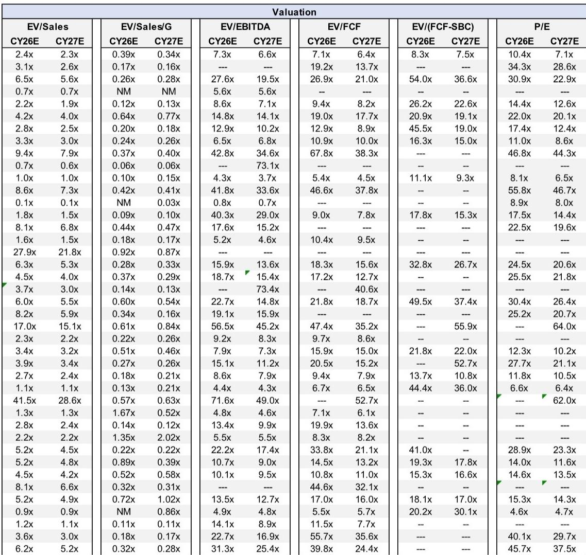
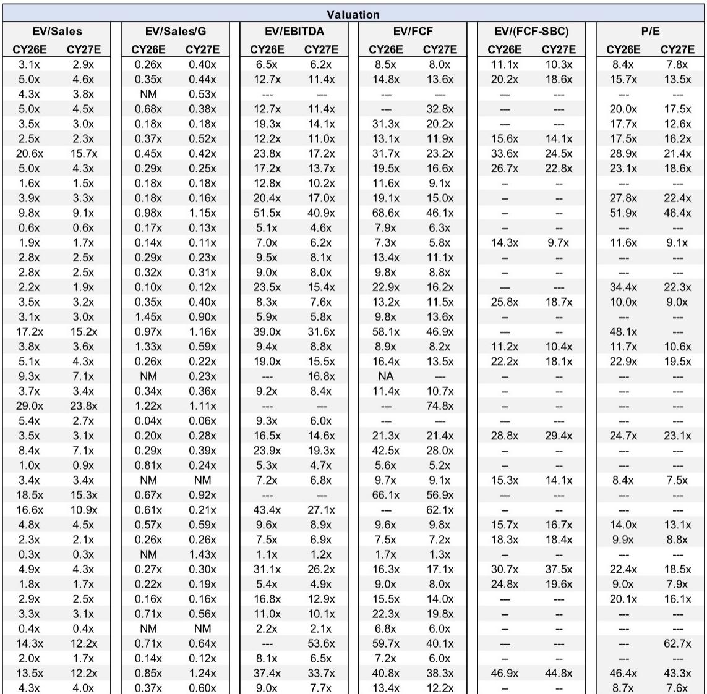

# JPM：软件估值分化背后，是市场对“利润质量”的重新定价

这份由JPM软件研究团队在2026年6月发布的《Software Landscape Benchmarking》报告，表面上是例行估值对比，但如果我们仔细拆解其数据结构和行业覆盖，会发现一个更值得关注的信号：软件市场的估值分化正在从“增长溢价”转向“利润质量溢价”，而安全软件板块正处于这一分化的最前沿。

报告覆盖了101家软件公司，从Crowdstrike到Elastic，从Palo Alto Networks到Zscaler，涵盖了从大型股到小型股、从安全软件到垂直软件的完整谱系。但真正有价值的，不是这些数字本身，而是数字背后透露出的行业结构性变化。

本文尝试从五个层次拆解这份报告的隐含判断，以及这些判断对产业决策者和投资者的含义。

## 1. 安全软件板块的估值溢价并非来自增长更快，而是来自利润更稳定

报告数据显示，安全与分析软件板块（Security & Analytics）的EV/Sales倍数在CY26E为9.2x，远高于全行业平均的5.7x，也高于垂直软件的4.7x。但如果只看收入增长，安全软件板块的CY26E增速为17%，仅略高于全行业平均的17%和垂直软件的16%。

这意味着安全软件的高估值，不能简单地用“增长更快”来解释。更关键的是利润质量的差异。

安全软件板块的毛利率为80%，高于全行业平均的76%和垂直软件的72%。在FCF利润率方面，安全软件为15%，低于全行业平均的20%，但这主要是由于该板块SBC（股权激励）占收入比重高达15%，远超垂直软件的9%和全行业平均的13%。

换句话说，安全软件公司正在用更激进的股权激励来换取更优质的客户留存和更可预测的经常性收入。市场愿意为这种“高SBC但高粘性”的模式支付溢价，本质上是在为收入的可见性和利润的可预测性买单。

这对产业决策者的含义是：在安全软件领域，单纯追求收入增长已经不够，市场正在奖励那些能够在增长与利润质量之间找到平衡点的公司。

## 2. 大型股与小型股的估值鸿沟，反映的不是规模溢价，而是市场对“可重复性”的定价

报告按照市值将101家公司分为三档：大型股（市值超过200亿美元）、中型股（30亿至200亿美元）、小型股（低于30亿美元）。大型股的EV/Sales倍数为10.3x，中型股为5.0x，小型股仅为1.9x。

这种倍数差异在传统分析中常被归因于“流动性溢价”或“规模溢价”，但报告的数据揭示了一个更微妙的解释。

大型股的CY26E收入增速为24%，远高于中型股的14%和小型股的7%。但大型股的FCF利润率仅为19%，低于中型股的25%。这意味着大型股的高估值，并非来自更高的当期利润，而是来自市场对其未来利润可重复性的信任。

大型股的毛利率为76%，与全行业平均持平，但其SBC占比仅为12%，低于小型股的13%和安全软件板块的15%。这表明大型股在股权激励上更加克制，利润质量更高。

更值得关注的是，大型股的EV/(FCF-SBC)倍数为31.2x，远高于中型股的20.8x，但大型股的SBC占比更低，意味着这个倍数的差异主要来自市场对大型股“真实自由现金流”的更高信任。

所以，大型股与小型股的估值鸿沟，本质上不是规模溢价，而是“利润可重复性溢价”。市场正在为那些能够证明自己可以在不依赖股权激励的情况下持续产生自由现金流的公司，支付越来越高的价格。

## 3. 增长最快的公司，FCF质量反而最差，这揭示了一个被低估的风险

报告将公司按收入增速分为三档：高增长（超过20%）、中增长（10%-19%）、低增长（低于10%）。数据揭示了一个反直觉的现象：高增长公司的FCF利润率在CY26E仅为6%，远低于中增长公司的29%和低增长公司的38%。

更令人担忧的是，高增长公司的CY27E预期FCF利润率进一步恶化至-7%，而中增长和低增长公司则分别改善至32%和34%。

这意味着，当前市场上增速最快的公司，实际上是在用现金流换增长。它们在CY26E的SBC占比为11%，虽然低于安全软件板块的15%，但考虑到其FCF利润率已经为负，SBC的实际稀释效应更加严重。

高增长公司的EV/Sales倍数为13.7x，远高于中增长公司的7.0x和低增长公司的4.3x。但如果用EV/(FCF-SBC)来衡量，高增长公司为34.7x，中增长公司为24.1x，低增长公司为16.7x。差距虽然仍然存在，但已经大幅收窄。

这说明，市场对高增长公司的估值溢价，在一定程度上是建立在“这些公司未来能够改善FCF”的假设之上的。如果这些公司无法在增长放缓的同时实现FCF改善，估值下修的风险将非常显著。

对于产业决策者而言，这意味着在安全软件领域，单纯追求高增长可能正在成为一条越来越危险的道路。那些能够在增长和利润之间找到平衡的“中增长”公司，反而可能是更安全的投资标的。

## 4. 报告尚未完全回答的关键问题：SBC的隐性成本是否被系统性低估

这份报告的数据体系非常完整，但有一个关键问题没有被充分讨论：SBC（股权激励）的真实成本。

报告提供了EV/(FCF-SBC)这个指标，试图将SBC作为真实成本纳入估值框架。但在安全软件板块，这个指标的应用存在明显的局限性。

以Crowdstrike为例，其EV/Sales倍数为29.0x，但EV/(FCF-SBC)数据在CY26E和CY27E均为空白。这意味着要么公司没有披露足够的SBC数据，要么SBC的规模使得这个指标失去了意义。

同样，Zscaler的EV/Sales倍数为5.0x，EV/(FCF-SBC)在CY26E和CY27E也均为空白。Palo Alto Networks的EV/Sales为17.1x，EV/(FCF-SBC)同样数据缺失。

这不是数据收集的问题，而是反映了安全软件行业的一个结构性特征：SBC的规模可能已经大到使得“真实自由现金流”的计算变得异常困难。当一个公司的SBC占收入比重达到15%时，任何基于FCF的估值指标都需要谨慎对待。

报告没有深入讨论的是：如果市场开始将SBC视为真实的现金成本（而不是非现金费用），安全软件板块的估值将面临多大的调整压力？这个问题在报告中留下了伏笔，但尚未被充分解答。

## 5. 读者的观察框架：从“增长/估值矩阵”转向“利润质量/增长可持续性矩阵”

基于以上分析，我们可以提炼出一个比传统“增长/估值”矩阵更有洞察力的框架。

传统框架关注的是“收入增速 vs. EV/Sales倍数”，这个框架在2021年的牛市中有用，但在当前环境下已经不够。更有价值的框架是“利润质量 vs. 增长可持续性”。

利润质量可以通过三个指标来衡量：FCF利润率、SBC占收入比重、毛利率。增长可持续性则可以通过收入增速的稳定性、客户留存率、以及收入的可预测性来判断。

在这个新框架下，安全软件板块的公司可以大致分为四类：

第一类是“高利润质量+高增长可持续性”，代表公司如Palo Alto Networks和Crowdstrike。这类公司享受最高的估值溢价，但需要持续证明自己能够维持利润质量。

第二类是“高利润质量+低增长可持续性”，代表公司如Check Point和Qualys。这类公司估值较低，但可能被市场低估。

第三类是“低利润质量+高增长可持续性”，代表公司如SentinelOne和Zscaler。这类公司面临最大的估值风险，因为市场对它们改善利润的预期可能过于乐观。

第四类是“低利润质量+低增长可持续性”，这类公司需要警惕，因为它们既没有增长故事，也没有利润安全垫。

这个框架的价值在于，它迫使读者在评估一家安全软件公司时，不能只看收入增速或估值倍数，而必须同时关注利润质量和增长的可持续性。

---

这份报告最值得深思的地方，不是它提供了多少数据，而是它揭示了软件行业正在经历的深层变化：市场正在从“为增长付费”转向“为可预测的利润付费”。安全软件板块作为这一变化的先行者，其估值逻辑的演变，可能会在未来几年成为整个软件行业的范式。

但报告中仍有许多未解的问题。比如，SBC在不同会计准则下的处理差异，对跨市场估值比较的影响有多大？安全软件板块的高毛利率，是否能够持续抵御来自云巨头的竞争压力？当利率环境发生变化时，这些估值倍数会如何调整？

这些问题，在报告的完整版本中有更深入的讨论，但限于篇幅，我们无法在一篇文章中全部展开。如果你对这些未解问题感兴趣，欢迎来我们的星球微信群里继续讨论。我们会定期组织对这类深度报告的拆解和研讨，帮助大家从数据中提炼出真正有操作价值的洞察。

Personal reading notes and learning share only. Not investment advice.

