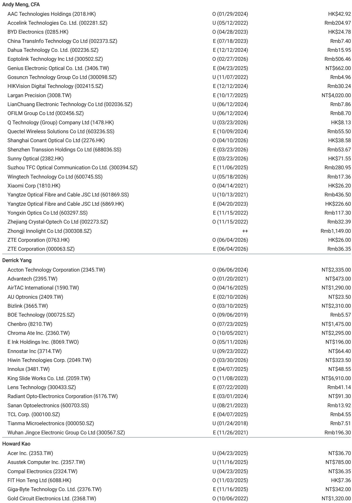
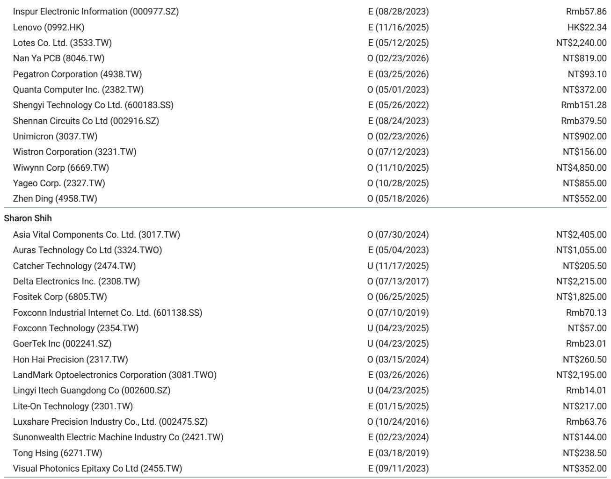
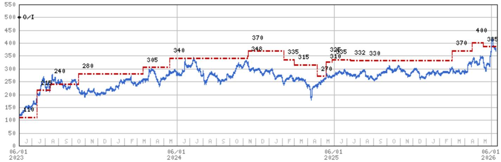

# Notebook Shipments Are Signaling a Deeper Structural Shift, Not Just a Cyclical Downturn

The latest data from the top five notebook ODMs presents a picture that is far more troubling than a simple inventory correction. May 2026 shipments of 9.3 million units came in 7% below analyst estimates, marking a 12% year-over-year decline. This is not a temporary blip. The second quarter is now expected to be essentially flat sequentially at 29.3 million units, a performance that is 12 percentage points below the 15-year average seasonal growth of 12%. The third quarter outlook is even more sobering: a forecast of 29 million units represents a 1% sequential decline in what is historically a seasonally strong quarter that averages 5% growth.

The conventional narrative has been that component constraints are the primary bottleneck. That explanation is becoming insufficient. While supply-side issues are real, the pattern of weakness across multiple quarters and the deliberate shift by PC OEMs toward higher-end models suggests something more fundamental is at work. The industry is not simply waiting for parts to arrive. It is restructuring production around a permanently altered demand landscape, where volume growth is being sacrificed for margin preservation. Investors who treat this as a normal cyclical trough risk misreading the strategic direction of the entire value chain.

## Component Constraints Are a Symptom, Not the Root Cause, of the Industry's Malaise

The report explicitly identifies component constraints as the key bottleneck, forcing ODMs to prioritize higher-end, more profitable models. This is a critical admission that deserves deeper scrutiny. If the problem were purely about component availability, one would expect a sharp rebound once supply normalizes. But the data suggests otherwise. The May shortfall was broad-based, with Wistron missing estimates by 15% and Compal by 5%. Quanta was the only ODM to hit its target, and it did so by maintaining flat month-over-month shipments while others declined.

The real story is that PC OEMs are making a strategic choice. Faced with limited components, they are not simply trying to maximize unit volume. They are actively allocating scarce resources to premium models that generate higher average selling prices and better margins. This is a rational response to a demand environment where the low-end and mid-range segments are under structural pressure from tablets, smartphones, and the lengthening replacement cycle of mature PC fleets. The component constraint is providing cover for a deeper strategic pivot. Once supply improves, the question is whether OEMs will revert to volume-driven behavior or continue to prioritize mix improvement. The answer will define the industry for the next several years.

## The 3Q Forecast Reveals a Break from Historical Seasonality That Cannot Be Ignored

The introduction of a third-quarter estimate of 29 million units, representing a 1% sequential decline against a 15-year average of 5% growth, is the most telling data point in the entire report. This is not a conservative forecast. It is a fundamental break from historical patterns. For an industry that has traditionally relied on back-to-school and holiday build cycles to drive second-half momentum, a flat-to-declining third quarter suggests that the normal demand cadence is broken.

Several factors are converging to produce this outcome. First, enterprise demand, which typically drives the second-half ramp, is being cannibalized by the shift to cloud-based productivity tools and the growing acceptance of longer device lifecycles. Second, consumer demand remains weak across most major markets, with inflation and macroeconomic uncertainty suppressing discretionary spending on non-essential electronics. Third, and most importantly, the AI PC narrative, which many had hoped would drive a replacement cycle, has not materialized in shipment data. The premium models that OEMs are prioritizing may include some AI-capable devices, but the volume is insufficient to move the aggregate numbers.

This third-quarter estimate should be read as a statement of structural weakness. If actual shipments come in even lower, which is a real possibility given the report's own cautious language about component availability and demand downside, the implications for the entire supply chain will be severe. Inventory levels across component suppliers, panel makers, and battery manufacturers will need to be re-evaluated downward.

## The Shift to Premium Models Is Reshaping the Competitive Dynamics Among ODMs

Not all ODMs are equally exposed to the current environment, and the divergence in performance is revealing. Quanta, the largest ODM by volume, managed to meet its May estimate precisely, suggesting that its exposure to premium models and its relationships with key customers like Apple have provided a buffer. Wistron missed by 15%, and the "Others" category, which includes smaller players, missed by 17%. Compal and Pegatron also missed, though by smaller margins.

This dispersion is not random. The ODMs that are more heavily weighted toward high-end commercial notebooks and server-related products are faring better than those that rely on consumer and mid-range notebooks. As OEMs continue to shift their mix upward, the ODMs that can support complex, higher-value manufacturing will gain share, while those optimized for high-volume, low-margin production will face increasing pressure. The report's own valuation risks for individual ODMs highlight this divergence. Quanta's upside risks include stronger-than-expected server demand and faster AI server penetration, while Compal's risks are tied to weaker notebook demand and margin contraction from price competition.

The strategic implication is clear: the ODM landscape is bifurcating. Investors should expect consolidation among the weaker players and a widening valuation gap between those that can participate in premium and server segments and those that cannot. The report's cautious stance on Pegatron, with its explicit reference to "weaker end demand outlook for smartphone and PC business," underscores this point.

## What the Report Does Not Fully Answer: The Demand Side Remains a Black Box

For all its detailed shipment data and supply-side analysis, the report leaves the most important question unanswered: where is the end demand? The report states it is "difficult to predict the exact timing" of demand downside, and this uncertainty is the critical analytical gap. The data on ODM shipments tells us what is being built, but it does not tell us what is being sold through to end users. If channel inventories are rising, the current production cuts may be insufficient to prevent a more severe correction later. If inventories are lean, then the production cuts may be overly cautious.

The report does not provide channel inventory data, sell-through rates, or end-user demand surveys. This is not a criticism of the analysis, which is focused on the ODM supply chain, but it is a limitation that readers must acknowledge. The 3Q estimate of 29 million units is based on ODM guidance and analyst adjustments for component availability. It does not incorporate a robust demand forecast. The cautious language about "demand downside in 2H" is a placeholder for a deeper analysis that the report does not, and perhaps cannot, provide.

This analytical gap creates a significant strategic risk. If demand is weaker than the ODMs and OEMs currently assume, the production cuts in 3Q may need to be followed by even deeper cuts in 4Q, leading to a year-end inventory correction that punishes the entire supply chain. Conversely, if demand surprises to the upside, the component constraints could create a scramble for capacity that benefits the most agile ODMs. The report provides the supply-side framework, but the demand-side question remains the critical variable that investors must monitor independently.

## A Decision Framework for Navigating the Notebook Supply Chain in a Sub-Seasonal Environment

For investors and strategists trying to position themselves in the notebook ecosystem, the report provides enough data to construct a useful decision framework. The framework rests on three variables: component availability, demand trajectory, and ODM mix.

First, assess component availability as a tactical signal, not a strategic one. If component constraints ease in the second half, the immediate reaction may be a production catch-up that boosts 3Q numbers above the current estimate. However, this would be a temporary relief, not a trend reversal. The strategic question is whether OEMs use improved supply to chase volume or to further improve mix. The latter scenario is more likely given the margin pressure across the industry.

Second, treat the demand trajectory as the primary uncertainty. The report's cautious stance on 2H demand is the right baseline, but investors should prepare for two scenarios. In the base case, demand remains weak but stable, and the production cuts are sufficient to keep inventory in check. In the bear case, demand deteriorates further, leading to a sharp inventory correction in 4Q that drives a 20% or greater year-over-year decline. The probability of the bear case increases if macroeconomic conditions worsen or if enterprise IT spending is delayed.

Third, use ODM mix as a differentiator. ODMs with high exposure to premium commercial notebooks, servers, and AI-related products will outperform those tied to consumer and mid-range segments. Quanta and Wistron, with their server and high-end notebook exposure, appear better positioned than Compal and Pegatron. However, this is a relative call, not an absolute one. Even the best-positioned ODMs face a challenging volume environment.

The framework leads to a clear conclusion: the notebook supply chain is in a structural transition, not a cyclical trough. The old playbook of buying the dip on volume weakness no longer applies. The winners will be those that can capture value through mix improvement and new product categories, not those that simply build more units.

Join the community to read the full report and review the original charts.

*This article is for learning and discussion only and does not constitute investment advice.*

Personal reading notes and learning share only. Not investment advice.

