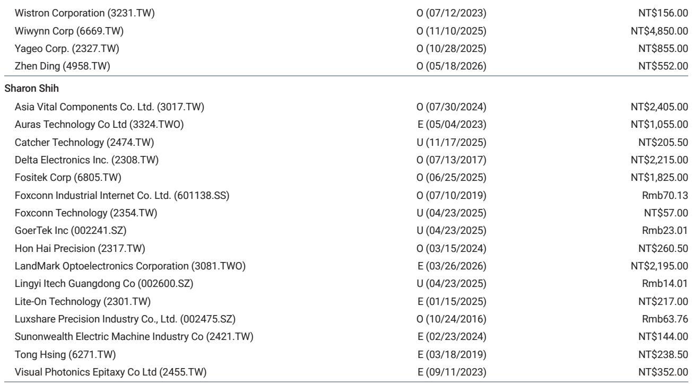
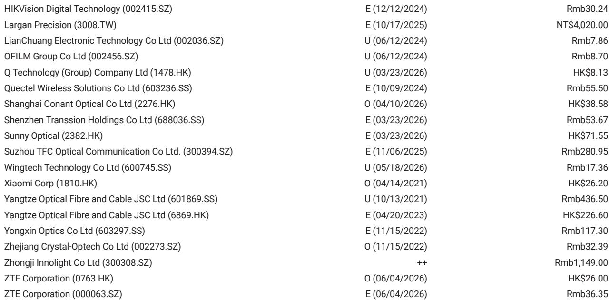
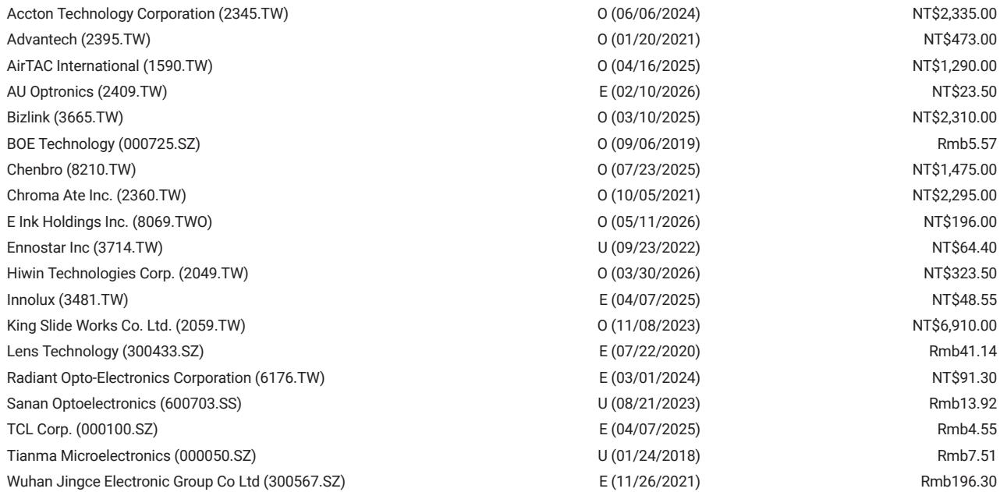

# iPhone Build Strength Is Not a Demand Story: It Signals a Strategic Pivot to Premium-Only Product Architecture

The latest supply chain data from a major global investment bank reveals a pattern that appears contradictory at first glance. iPhone builds for the June quarter are estimated at 52 million units, down only 7% sequentially, compared to the historical norm of 15% to 25% declines. This is not a seasonal anomaly. It is a structural signal that Apple is executing a deliberate shift in its product cycle, one that prioritizes revenue per unit over volume growth and repositions the entire iPhone lineup toward the premium segment.

The numbers are precise but the implications are broad. For the September quarter, preliminary build estimates stand at 54 million units, up 4% quarter-over-quarter but down 2% year-over-year. The flat-to-declining annual trajectory, despite a stronger-than-expected June, tells the real story. The iPhone 18 Pro and Pro Max models, along with the debut of the iPhone Fold, are scheduled for the second half of this year. The standard iPhone 18 will not arrive until the first half of next year. This staggered launch schedule is not a production delay. It is a deliberate architectural choice to front-load premium models and defer the volume driver.

The strategic logic is clear. Apple is compressing its product cycle to concentrate high-margin hardware in a narrower window, while using the lower-volume, higher-price models to absorb cost inflation from memory and materials. This is not a defensive posture. It is an offensive redefinition of what the iPhone franchise can deliver in an era of component cost pressure and saturated smartphone markets.

For investors and supply chain analysts, the question is no longer about how many iPhones Apple will ship. The question is what the mix of those shipments means for revenue, margin, and the competitive landscape. The build data tells us that Apple is willing to accept lower total unit volume in exchange for a richer product mix. That trade-off has profound consequences for every company in the hardware ecosystem, from assembly partners to component suppliers.

The report provides the data. The argument that follows interprets what the pattern means and why it matters for strategic decision-making.

## The Shift from Volume to Value Is Visible in the Build Trajectory, Not Just the Price Tag

The most telling data point in the report is not the absolute build number but the comparison to historical patterns. A 7% sequential decline in June builds, versus a typical 15% to 25% drop, means Apple is building inventory at a pace that defies the usual post-launch slowdown. This is not because demand is surging across all models. It is because the mix has shifted toward premium models that carry longer production cycles and higher per-unit margins.

The iPhone 16 Pro Max, for example, saw builds of 10 million units in the March quarter and is still running at 3 million units in the June quarter. By contrast, the iPhone 16 and 16 Plus, the volume models, have already tapered to 2 million and zero units respectively. The pattern repeats across generations. The iPhone 17 Pro and Pro Max models are still being built at 10 million and 8 million units in the June quarter, while the standard iPhone 17 has dropped to 8 million units and the iPhone Air to zero.

This is not a demand story. It is a supply architecture story. Apple is using its production capacity to sustain premium-model availability deep into the product cycle, while allowing volume models to fade faster. The result is a build profile that looks strong in aggregate but masks a deliberate strategy to shift the center of gravity upward.

The so-what for investors is straightforward. Revenue per unit is rising even as total units flatten. For the full year 2025, total iPhone builds came in at 227.5 million units, up 6% year-over-year. But the mix has moved decisively toward Pro and Pro Max models, which carry average selling prices that are 40% to 60% higher than the base models. The revenue impact of a 6% volume increase is amplified by a much larger increase in average selling price.

## The iPhone Fold Represents a New Category Logic That Changes the Build Economics for the Entire Lineup

The report introduces a preliminary build estimate of 7 to 8 million units for the iPhone Fold in the second half of this year. That number is small relative to the total iPhone build of 54 million units in the September quarter alone. But its strategic importance far exceeds its volume share.

The iPhone Fold is not a niche product. It is a structural test of whether Apple can create a new premium category that commands a price point well above even the Pro Max models. If successful, it will pull the entire product line upward, creating a new ceiling for average selling prices and a new floor for component costs. If it fails to gain traction, the risk is not just the 7 to 8 million units of lost volume but the opportunity cost of a stalled product architecture.

The report flags that the ramp-up progress will be monitored closely. This is the right focus. The critical variable is not whether the iPhone Fold ships on time but whether it achieves sell-through rates that justify the production investment. If the build estimate is conservative and demand exceeds supply, the implications for Apple's revenue and margin are substantial. If the build estimate proves optimistic and inventory builds, the risk is a write-down that could ripple through the supply chain.

For component suppliers, the iPhone Fold creates a new set of winners and losers. The foldable display, hinge mechanism, and battery architecture are all different from standard iPhones. Suppliers that have invested in foldable-specific capacity will benefit disproportionately. Suppliers that are optimized for volume models may see their utilization rates decline as the mix shifts.

## iPad Builds Confirm the Same Pattern: Mature Categories Are Being Managed for Margin, Not Growth

The iPad build data in the report reinforces the same strategic logic. June quarter iPad builds are estimated at 13 million units, up 8% quarter-over-quarter but down 10% year-over-year. September quarter builds are also 13 million units, flat quarter-over-quarter and down 7% year-over-year.

The year-over-year declines are explained by a higher base in the prior year due to product launches. But the flat sequential trajectory is the more important signal. Apple is not trying to grow iPad volume. It is managing the category for stability and margin, using the same premium-mix strategy that it applies to iPhone.

The iPad Air and iPad Pro models now dominate the build mix, while the base iPad and iPad mini have declined. In the June quarter, the iPad Air 11-inch and 13-inch models together account for 5.5 million units out of 13 million total. The iPad Pro models add another 1.5 million units. The base iPad accounts for 6 million units, but that number has been flat for several quarters.

The pattern is consistent. Apple is willing to accept lower total volume in exchange for a richer mix. The so-what for the broader technology hardware sector is that the era of volume-driven growth in consumer electronics is over. The companies that will win are those that can deliver higher value per unit, not those that can ship the most units.

## What the Report Does Not Fully Answer: The Demand Elasticity of the Premium-Only Strategy

The report provides detailed supply-side data but leaves a critical question unresolved. How elastic is demand for iPhones at the new, higher average selling prices? The build data shows that Apple is confident enough to shift its production architecture toward premium models. But the report does not provide sell-through data that would confirm whether end-user demand is keeping pace.

The risk is that Apple is building premium models faster than consumers are willing to buy them. The historical pattern of 15% to 25% sequential declines in June builds is not an arbitrary benchmark. It reflects the natural rhythm of consumer demand after the launch quarter. If Apple is deliberately deviating from that pattern, it is either because demand is unusually strong or because Apple is willing to hold more inventory than it has in the past.

The report notes that iPhone shipments in May were up month-over-month, which suggests that sell-through is holding up. But month-over-month data is noisy and does not provide a clear picture of demand elasticity at the higher price points. The true test will come in the September quarter, when the iPhone 18 Pro, Pro Max, and Fold are all on the market simultaneously.

For readers who want to make their own assessment, the full report includes the original charts that show the quarter-by-quarter build data for every model. Those charts reveal the precise timing of when each model peaks and fades. They are the raw material for building a demand model that goes beyond the aggregate numbers.

## A Decision Framework for Supply Chain and Investment Strategy

The report data can be translated into a three-part decision framework for anyone who needs to position a portfolio or a supply chain in response to Apple's product cycle.

First, assess your exposure to the premium-mix shift. If you are a supplier of components that are used disproportionately in Pro and Pro Max models, your volume outlook is more stable than the aggregate build numbers suggest. If you are a supplier of components that are used primarily in base models, your volume is declining even as total iPhone builds hold steady. The data in the report allows you to calculate the mix shift for each component category by analyzing the build data for each model.

Second, evaluate the iPhone Fold as a binary risk-reward event. The 7 to 8 million unit build estimate is a point estimate, not a range. The actual outcome could be significantly higher or lower. The report flags that the ramp-up progress will be monitored, which is a signal that the estimate is uncertain. For investors, the right approach is to model two scenarios: one in which the iPhone Fold achieves 10 million units of sell-through and one in which it achieves 5 million units. The difference in revenue and margin impact is large enough to move the stock.

Third, watch the iPad category as a leading indicator. The iPad is a lower-volume, lower-margin category than the iPhone. If Apple is willing to accept year-over-year declines in iPad volume in order to maintain mix discipline, it is a signal that the same discipline will apply to the iPhone. The iPad data is a canary in the coal mine for Apple's overall margin strategy.

## The Unresolved Questions That Make the Full Report Worth Reading

The report is rich with data but leaves several meaningful open questions that only the full analysis can address. How does the build data for the iPhone 18 Pro and Pro Max compare to the launch trajectory of the iPhone 17 Pro series? What is the implied average selling price for the September quarter given the mix of models? How do the memory and material cost hikes affect the margin assumptions embedded in the build estimates?

The answers to these questions require access to the original charts and the detailed model-by-model build data. The summary provides the top-line numbers, but the strategic insight comes from the granularity.

Join the community to read the full report and review the original charts.

*This article is for learning and discussion only and does not constitute investment advice.*

Personal reading notes and learning share only. Not investment advice.

