# Global Macro Outlook and Strategy

Global Rates, Commodities, Currencies and Emerging Markets

Luis Oganes AC

(44-20) 7742-1420

luis.oganes@JPM.com

JPM Securities plc

## US Rates

Money markets price an earlier and more aggressive Fed hiking path than our forecast, though with labor market data potentially suggesting policy may not be restrictive and term premium normalizing, this justifies an upward sloping OIS curve. Global central bank tightening combined with unattractive Treasury valuations versus other DM government bonds should anchor Treasury yields at higher levels, and could push yields higher from here. We project 2- and 10-year yields will rise to 4.20% and 4.70%, respectively, at YE26. Stay short 10-year Treasuries versus Bunds, and enter 10s/30s Treasury curve flatteners, as a soft-bearish trade with relative value. Given large funding gaps emerging in FY27 and beyond, we expect Treasury to remove the “at least” from its forward guidance in August, to prepare for a multi-quarter series of coupon increases commencing in February 2027. The administration's focus on lowering long-end yields increases risks this forward guidance change may be delayed, potentially pushing coupon increases later into 2027. We adjust lower our projections for foreign demand for Treasuries, as well as our bank demand forecast

## International Rates

After the sharp sell-off driven by the energy price spike at the start of the Middle East conflict in late February, DM front-end rates have traded in a wide range over the past couple of months. With inflation still high but growth broadly holding up, we expect most DM central banks to deliver a gradual and shallow policy tightening over the coming months. OIS markets are broadly pricing a larger and faster tightening than our forecasts across most DM. On the Middle East conflict, we believe that risks remain skewed more towards the ongoing status quo and Strait of Hormuz limbo. We continue to expect EUR and GBP rates to range trade and our strategy is to favour long positions when valuations are close levels projected in our energy price spike scenario.

## Commodities

We estimate June oil flows through Hormuz are running at 5.1 mbd, up from 2.9 mbd in May, 3.3 mbd in April, and 2.2 mbd in March. The rebound is meaningful, but it still leaves flows at only about 25% of pre-war levels. NWE storage sits at record lows for this time of year, and the longer summer TTF prices remain at a premium to winter prices and at a discount to JKM, the higher the risk of policy intervention.  
The sharp deficit in aluminum is taking time to transmit through the supply chain, a process that will continue even after the Strait reopens. As part of the US-China summit held on May 15-16 in Beijing, China has agreed to purchase US agricultural products of at least \$17 billion per year in addition to the already agreed upon purchase commitments of 25 million tonnes of soybean purchases per year in 2026-28.

## Currencies

Pockets of upside inflation surprises in G10, rising US real yields, and a fading debasement narrative keep our bullish USD/bullish carry barbell strategy intact. Chair Warsh's inaugural FOMC is the marquee event next week, with the 2027 dot and the press conference set to be market-movers. An orthodox acknowledgement of stronger US cyclicals may be enough to constitute a hawkish outcome for the dollar, which continues to trade at a discount to rates fair value; we head into event long. History counsels that the dollar reliably appreciates \~5% in the 6 months leading up to the first Fed hike of a cycle, FX carry benefits, and vol ratchets 3-5pts post-delivery. Elsewhere in G10, a fully-priced hike, potential QT halt, and Ueda's absence at the presser skew JPY risks dovish at next week's BoJ; hawkish Norges vs. dovish Riksbank divergence could headline European CB outcomes; while the Makerfield by-election aftermath will likely prove a bigger GBP driver than the BoE.

## Emerging Markets

Resilient cyclical backdrop, low fundamental vulnerabilities and the proactive stance of several EM central banks to allow for continued carry outperformance even as higher inflation and a likely hawkish shift by the Fed could challenge the asset class.  
We turn OW EM FX (from MW) in higher yielders and currencies where central banks are ready to hike and also favor frontier FX. Elsewhere, we note that valuations do not offer a clear risk reward amid elevated risks and we stay MW rates, sovereign and corporate credit.

Page

<table><tr><td>1</td><td>US Rates: Raising year-end forecasts, stay short Treasuries versus bunds</td><td>2</td></tr><tr><td>2</td><td>International Rates: More of the same over 2H: range trade duration, cross market long EUR vs. US</td><td>11</td></tr><tr><td>3</td><td>FX: Central banks take centre stage</td><td>18</td></tr><tr><td>4</td><td>Commodities: Schrödinger&#x27;s Strait</td><td>27</td></tr><tr><td>5</td><td>Emerging Markets: Stay OW EM FX and MW Rates, EM Sovereigns &amp; Corporates</td><td>32</td></tr><tr><td>6</td><td>Appendix</td><td>38</td></tr></table>

JPM US interest rate forecast, %

<table><tr><td></td><td>Actual12-Jun-26</td><td>2Q2630-Jun-26</td><td>3Q2630-Sep-26</td><td>4Q2631-Dec-26</td><td>1Q2731-Mar-27</td><td>2Q2730-Jun-27</td></tr><tr><td colspan="7">Rates (%)</td></tr><tr><td>Effective funds rate</td><td>3.62</td><td>3.62</td><td>3.62</td><td>3.62</td><td>3.62</td><td>3.62</td></tr><tr><td>S OFR</td><td>3.60</td><td>3.60</td><td>3.60</td><td>3.60</td><td>3.60</td><td>3.60</td></tr><tr><td></td><td></td><td></td><td></td><td></td><td></td><td></td></tr><tr><td>2-yr Treasury</td><td>4.08</td><td>4.15</td><td>4.15</td><td>4.20</td><td>4.20</td><td>4.30</td></tr><tr><td>3-yr Treasury</td><td>4.13</td><td>4.20</td><td>4.20</td><td>4.25</td><td>4.25</td><td>4.35</td></tr><tr><td>5-yr Treasury</td><td>4.21</td><td>4.30</td><td>4.40</td><td>4.45</td><td>4.50</td><td>4.50</td></tr><tr><td>7-yr Treasury</td><td>4.34</td><td>4.40</td><td>4.45</td><td>4.55</td><td>4.65</td><td>4.65</td></tr><tr><td>10-yr Treasury</td><td>4.48</td><td>4.55</td><td>4.65</td><td>4.70</td><td>4.75</td><td>4.75</td></tr><tr><td>20-yr Treasury</td><td>4.98</td><td>5.05</td><td>5.15</td><td>5.20</td><td>5.25</td><td>5.25</td></tr><tr><td>30-yr Treasury</td><td>4.97</td><td>5.00</td><td>5.10</td><td>5.15</td><td>5.15</td><td>5.15</td></tr><tr><td colspan="7">Spreads (bp)</td></tr><tr><td>Fed funds/2yr</td><td>46</td><td>53</td><td>53</td><td>58</td><td>58</td><td>68</td></tr><tr><td>2s/10s</td><td>40</td><td>40</td><td>50</td><td>50</td><td>55</td><td>45</td></tr><tr><td>2s/5s</td><td>13</td><td>15</td><td>25</td><td>25</td><td>30</td><td>20</td></tr><tr><td>5s/10s</td><td>27</td><td>25</td><td>25</td><td>25</td><td>25</td><td>25</td></tr><tr><td>5s/30s</td><td>76</td><td>70</td><td>70</td><td>70</td><td>65</td><td>65</td></tr><tr><td>10s/30s</td><td>49</td><td>45</td><td>45</td><td>45</td><td>40</td><td>40</td></tr></table>

Source: JPM

We forecast US GDP will grow 2.0% (q4/q4) in 2026, while core PCE remains firm at 3.4% (q4/q4). The unemployment rate should gradually fall over 2026, reaching 4.1% (%q/q, saar) in 4Q26  
We expect the Fed to remain on pause for the whole of 2026, holding the funds rate target range to $3.5 - 3.75\%$ . We see the Fed as likely to raise policy rates in 3Q27 as labour markets tighten and inflation remains above target  
- Against this backdrop, we see 2-year Treasury yields reaching $4.20\%$ by YE26. Meanwhile 10-year yields should rise to $4.70\%$ by YE26  
• We see the intermediate section of the curve underperforming, with 2s/10s modestly steeper over the period

Three-month moving average of nonfarm payroll growth (lhs, '000s) versus continuing jobless claims (rhs, '000s)  
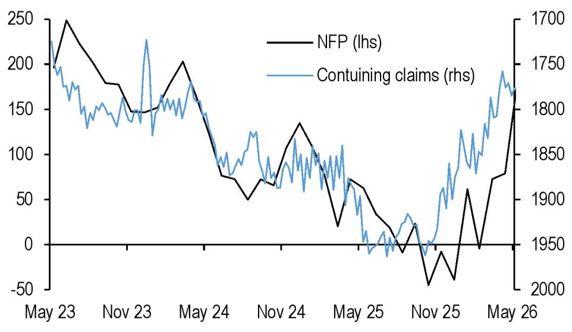

line chart

| Date   | NFP (lhs) | Containing claims (rhs) |
|--------|-----------|--------------------------|
| May 23 | 250       | 1700                     |
| Nov 23 | 150       | 1750                     |
| May 24 | 200       | 1800                     |
| Nov 24 | 100       | 1850                     |
| May 25 | 50        | 1900                     |
| Nov 25 | -50       | 1950                     |
| May 26 | 1700      | 1800                     |

Source: BLS, Department of Labor

10-year Treasury/German bund spread regressed on 1y1y USD/EUR OIS spread (bp), regression over the last 5 years; bp  
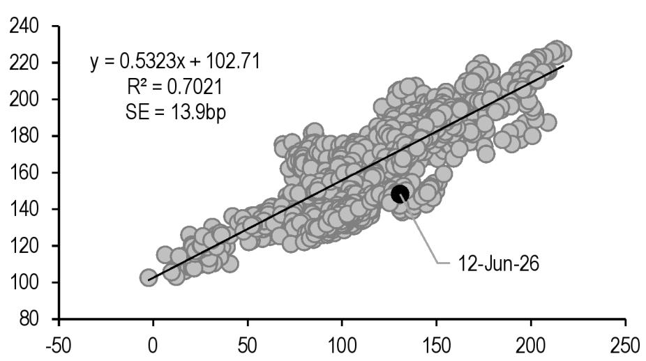

scatterplot

| Date       | Value |
| ---------- | ----- |
| 12-Jun-26  | 140   |

Source: JPM

- OIS forwards are pricing in a full hike by the January meeting, and upward of 35bp in hikes over the next 1- to 2 years, a more hawkish pricing than our own projection of a single hike in 3Q27. However, we do not think this gap will close soon, as a stable unemployment rate leaves a question of whether the current stance of monetary policy is actually restrictive  
- A steeper OIS curve should propagate through to higher Treasury yields, and we think valuations also support Treasury yields rising further from current levels: intermediate Treasury yields appear 24bp too low to fair value model  
- Central banks which lean hawkish could act to keep yields across the DM and in the US buoyed at higher levels than prevailed pre-conflict, especially as Treasuries remain relatively unattractive compared to other DM bonds. For this reason, alongside relatively attractive European valuations, we recommend selling 10-year Treasuries versus German bunds

Current levels for various Treasury curves, with 5-year statistics and regression statistics from curve fair-value models\* with current residuals and z-scores;

<table><tr><td>Curve</td><td>Last</td><td>Min</td><td>Max</td><td>Avg</td><td>%</td><td>R^2</td><td>1y1y OIS</td><td>5y5y BE</td><td>Tariff dummy</td><td>Fed Balance Sheet</td><td>Current residual</td><td>Current Z-score</td><td>3m C+R</td></tr><tr><td>2s/5s</td><td>13</td><td>-78</td><td>78</td><td>-5</td><td>67%</td><td>71%</td><td>-0.32</td><td>0.75</td><td>0.07</td><td>-0.02</td><td>31.1</td><td>1.5</td><td>3.3</td></tr><tr><td>2s/10s</td><td>40</td><td>-109</td><td>136</td><td>9</td><td>62%</td><td>82%</td><td>-0.52</td><td>0.93</td><td>0.14</td><td>-0.05</td><td>37.2</td><td>1.5</td><td>4.0</td></tr><tr><td>2s/30s</td><td>89</td><td>-119</td><td>203</td><td>40</td><td>64%</td><td>87%</td><td>-0.67</td><td>0.84</td><td>0.26</td><td>-0.08</td><td>51.5</td><td>1.9</td><td>5.7</td></tr><tr><td>3s/7s</td><td>21</td><td>-55</td><td>88</td><td>8</td><td>62%</td><td>86%</td><td>-0.29</td><td>0.46</td><td>0.05</td><td>-0.03</td><td>14.9</td><td>1.3</td><td>0.3</td></tr><tr><td>5s/10s</td><td>27</td><td>-36</td><td>71</td><td>14</td><td>67%</td><td>93%</td><td>-0.20</td><td>0.18</td><td>0.07</td><td>-0.03</td><td>6.1</td><td>1.0</td><td>0.7</td></tr><tr><td>5s/20s</td><td>77</td><td>-23</td><td>133</td><td>54</td><td>68%</td><td>90%</td><td>-0.27</td><td>-0.02</td><td>0.19</td><td>-0.04</td><td>17.0</td><td>1.6</td><td>0.8</td></tr><tr><td>5s/30s</td><td>76</td><td>-46</td><td>141</td><td>45</td><td>69%</td><td>93%</td><td>-0.35</td><td>0.09</td><td>0.20</td><td>-0.06</td><td>20.3</td><td>1.7</td><td>2.4</td></tr><tr><td>7s/10s</td><td>14</td><td>-21</td><td>31</td><td>6</td><td>69%</td><td>95%</td><td>-0.09</td><td>0.08</td><td>0.05</td><td>-0.02</td><td>2.5</td><td>0.9</td><td>0.8</td></tr><tr><td>10s/20s</td><td>50</td><td>13</td><td>65</td><td>40</td><td>72%</td><td>71%</td><td>-0.07</td><td>-0.20</td><td>0.12</td><td>-0.01</td><td>11.0</td><td>1.6</td><td>0.1</td></tr><tr><td>10s/30s</td><td>49</td><td>-18</td><td>70</td><td>31</td><td>72%</td><td>87%</td><td>-0.15</td><td>-0.09</td><td>0.12</td><td>-0.02</td><td>14.2</td><td>1.9</td><td>1.7</td></tr><tr><td>20s/30s</td><td>-1</td><td>-32</td><td>11</td><td>-9</td><td>74%</td><td>90%</td><td>-0.08</td><td>0.11</td><td>0.00</td><td>-0.02</td><td>3.3</td><td>1.1</td><td>1.6</td></tr></table>

\*5-year regression of various Treasury curves on 1y1y OIS rates (%), 5y5y TIPS seasonally-adjusted breakevens (%), tariff dummy for trade uncertainty that turns 1 between 4/2/25 and 2/26/26, and Fed balance sheet size relative to GDP (%)  
Source: JPM

- The Treasury curve has retraced to its flattest levels in over a year, also driven by the hawkish shift in Fed policy expectation. However, most curve pairs appear too steep after controlling for 1y1y OIS, 5y5y TIPS breakevens, the Fed’s balance sheet as a share of GDP, and our trade policy uncertainty variable, using a sample over the last 5 years  
- Combined with our modest bearish bias conveyed in our interest rate forecasts, rich valuations versus other DM government bonds, and the output of our curve model, we think flatteners offer better value than outright duration shorts  
- Along the curve, we recommend 10s/30s flatteners as this curve appears 14bp steep after adjusting for its fundamental drivers, a divergence of nearly 2 standard deviations

Statistics from JPM 10-year Treasury fair-value model; units as indicated

<table><tr><td>Factor</td><td>Current value</td><td>Coefficient</td><td>T-stat</td></tr><tr><td>1y1y OIS rate; %</td><td>3.365</td><td>0.603</td><td>86.36</td></tr><tr><td>JPM US FRI; % pts</td><td>92.4</td><td>-0.055</td><td>-9.02</td></tr><tr><td>5y5y TIPS breakevens; %</td><td>1.975</td><td>0.080</td><td>1.71</td></tr><tr><td>Fed B/S as share of US economy</td><td>21.1</td><td>-0.113</td><td>-39.20</td></tr><tr><td>Tariff dummy variable*</td><td>1</td><td>-0.074</td><td>-4.35</td></tr><tr><td>R=squared; %</td><td>98.1%</td><td></td><td></td></tr><tr><td>Standard Error, bp</td><td>13.6</td><td></td><td></td></tr><tr><td>Residual; bp</td><td>-11.6</td><td></td><td></td></tr></table>

\* Represents trade policy uncertainty, that is 1 on and after 4/2/25  
Source: JPM, Federal Reserve

- The US Attorney for DC announced it was ending the investigation into the Fed headquarters cost overrun, which paved the way for the swearing in of Kevin Warsh as the new Chair of the Federal Reserve  
We continue to believe that the Committee's tradition of collegiality and respect for dissent means that policy is ultimately a collective decision, and that the chair's effectiveness depends on their ability to align his views with the broader group  
- Warsh has made the case for simultaneously shrinking the balance sheet and cutting rates, as this would reduce the Fed's footprint in the market while having a more neutral impact on financial conditions overall. Our fair value model suggests that it would take close to \$1tn reduction in the size of the balance sheet even to warrant a 25bp cut

JPM projection of net privately-held borrowing, Treasury buybacks, Federal Reserve purchases of Treasuries, and expected change in Treasuries held by private investors; \$bn

<table><tr><td rowspan="2">Year</td><td rowspan="2">Total net privately-held borrowing</td><td rowspan="2">Buybacks</td><td colspan="2">Fed secondary market purchases</td><td colspan="2">Net change in privately-held debt outstanding</td></tr><tr><td>Bills</td><td>Coupons</td><td>Bills</td><td>Coupons</td></tr><tr><td>CY 2020</td><td>4301</td><td>0</td><td>157</td><td>2184</td><td>2390</td><td>-432</td></tr><tr><td>CY 2021</td><td>1607</td><td>0</td><td>0</td><td>938</td><td>-1195</td><td>1961</td></tr><tr><td>CY 2022</td><td>1681</td><td>0</td><td>0</td><td>99</td><td>-37</td><td>1539</td></tr><tr><td>CY 2023</td><td>3122</td><td>0</td><td>0</td><td>0</td><td>2047</td><td>1107</td></tr><tr><td>CY 2024</td><td>2422</td><td>85</td><td>0</td><td>0</td><td>538</td><td>1823</td></tr><tr><td>CY 2025</td><td>2105</td><td>195</td><td>38</td><td>0</td><td>322</td><td>1719</td></tr><tr><td>CY 2026</td><td>2108</td><td>240</td><td>410</td><td>0</td><td>410</td><td>1293</td></tr><tr><td>CY 2027</td><td>2045</td><td>240</td><td>300</td><td>0</td><td>326</td><td>1419</td></tr></table>

Source: U.S. Treasury, JPM

- IEEPA tariff refunds have been issued a modestly faster pace than we anticipated, and we now expect \$75bn in refunds in FY26 and an additional \$50bn in FY27. Moreover, we forecast a slower pace of tariff revenue accumulation this year at \$325bn in FY26, before returning to a \$400bn pace in FY27  
- Net of these factors, we now expect a deficit of \$2.020tn in FY26 and \$1.960tn in FY27, versus \$1.955tn and \$2.050tn, respectively, at the start of the year  
- Net of Fed purchases and buybacks, this translates to a \$410bn change in privately-held bills and \$1.293tn in net privately-held coupon issuance

US Treasury net coupon borrowing capacity under unchanged issuance \* and under JPM forecast\*\* versus total funding needs; \$bn  
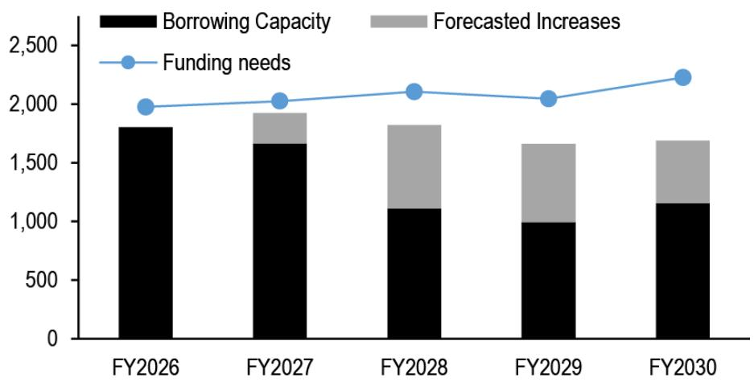

bar-line hybrid chart

| Fiscal Year | Borrowing Capacity | Forecasted Increases | Funding needs |
|-------------|--------------------|----------------------|--------------|
| FY2026      | 1800               | -                    | 2000         |
| FY2027      | 1650               | 350                  | 2050         |
| FY2028      | 1100               | 750                  | 2100         |
| FY2029      | 1000               | 700                  | 2050         |
| FY2030      | 1150               | 650                  | 2250         |

\* Incorporates SOMA add-ons from maturities of first-time Fed bill purchases
\*\*Assumes multi-quarter series of increases to 2s through 10s beginning in February 2027  
Source: US Treasury, CBO, JPM

T-bill share of total debt vs. share of privately-held debt, including JPM forecasts\*; %  
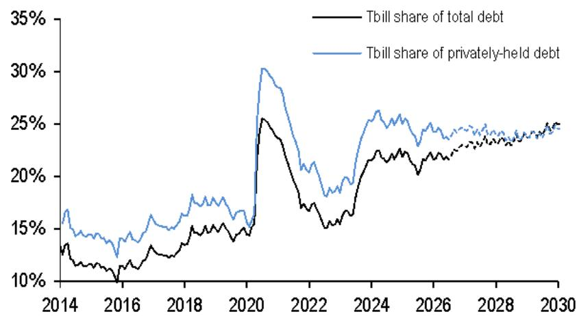

line chart

| Year | Tbill share of total debt | Tbill share of privately-held debt |
|------|----------------------------|-------------------------------------|
| 2014 | ~13%                       | ~16%                                |
| 2016 | ~10%                       | ~14%                                |
| 2018 | ~14%                       | ~17%                                |
| 2020 | ~25%                       | ~30%                                |
| 2022 | ~15%                       | ~20%                                |
| 2024 | ~22%                       | ~26%                                |
| 2026 | ~23%                       | ~24%                                |
| 2028 | ~24%                       | ~25%                                |
| 2030 | ~25%                       | ~24%                                |

\*JPM forecasts reflect a multi-quarter series of nominal coupon auction size increases beginning in February 2027 concentrated in 2s through 10s, while 20s and 30s are left unchanged (see US Treasury Market Daily, 1/23/26 for details), and assume RMPs at a pace of \$10bn/mo  
Source: JPM

- Under their current schedule, Treasury remains well funded in FY26, though large gaps emerge in FY27 and beyond. We expect Treasury to remove the guidance that it anticipates maintaining unchanged coupon auction sizes for “at least” the next several quarters in August ahead of revising coupon auction sizes higher in February 2027...  
...However, if potential political considerations for leaving guidance unchanged in May grows ahead of midterms, we see increased risk that Treasury will continue to leave guidance unchanged. This would push auction size increases further into FY27 and suggest increased reliance on T-bills over the interim. Given Fed RMPs and the ongoing reinvestment of MBS paydowns into T-bills, we see the privately-held bill share as staying relatively stable over the medium term

Annual net foreign purchases of long-term Treasuries by type\*; \$bn  
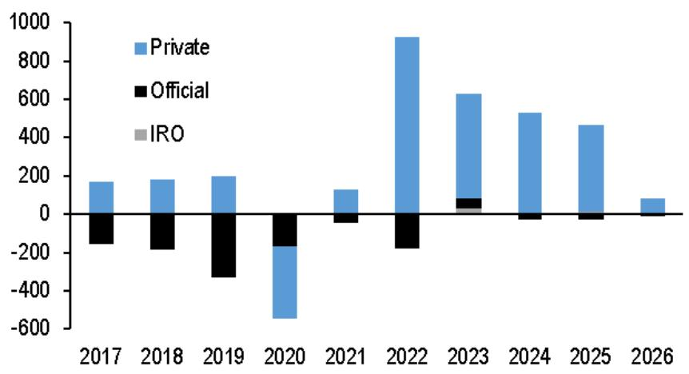

stacked bar chart

| Year | Private | Official | IRO |
|------|---------|----------|-----|
| 2017 | 150     | -150     | 0   |
| 2018 | 150     | -150     | 0   |
| 2019 | 150     | -300     | 0   |
| 2020 | -400    | -100     | 0   |
| 2021 | 100     | -50      | 0   |
| 2022 | 900     | -200     | 0   |
| 2023 | 600     | 50       | 0   |
| 2024 | 500     | -50      | 0   |
| 2025 | 450     | -50      | 0   |
| 2026 | 50      | -50      | 0   |

\*Through March 2026  
Source: Treasury International Capital System

Quarterly change in commercial bank holdings of non-MBS Treasury and agency securities\*; \$bn  
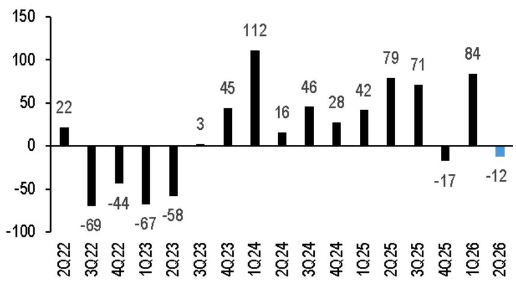

bar chart

| Quarter | Value |
| :--- | :--- |
| 2Q22 | 22 |
| 3Q22 | -69 |
| 4Q22 | -44 |
| 1Q23 | -67 |
| 2Q23 | -58 |
| 3Q23 | 3 |
| 4Q23 | 45 |
| 1Q24 | 112 |
| 2Q24 | 16 |
| 3Q24 | 46 |
| 4Q24 | 28 |
| 1Q25 | 42 |
| 2Q25 | 79 |
| 3Q25 | 71 |
| 4Q25 | -17 |
| 1Q26 | 84 |
| 2Q26 | -12 |

\*2Q26 through 5/27/26  
Source: Federal Reserve

- Foreign demand is running at its slowest pace since 2021, and demand continues to shorten along the curve. A resilient US economy, a Fed shifting hawkishly, and attractive valuations in home jurisdiction government bonds suggest foreign demand should remain weak  
• Commercial bank demand has waned alongside firmer loan growth and unattractive valuations. We lower our demand forecast  
- The AUM of the top core bond funds continue to increase at a robust clip, and we would expect yields near their cycle highs will keep inflows strong  
• We continue to project reduced LDI demand. With DB pension plans heavily invested in fixed income securities, funding ratios above 100%, and the volatility in funding ratios having declined considerably, duration demand is likely to remain muted

Annual net issuance of Treasuries versus purchases by investor types; \$bn

<table><tr><td></td><td>2017</td><td>2018</td><td>2019</td><td>2020</td><td>2021</td><td>2022</td><td>2023</td><td>2024</td><td>2025</td><td>2026*</td></tr><tr><td>UST net issuance; $bn</td><td>557</td><td>1134</td><td>1068</td><td>4301</td><td>1607</td><td>1353</td><td>2434</td><td>1974</td><td>2425</td><td>2428</td></tr><tr><td>Investor</td><td></td><td></td><td></td><td></td><td></td><td></td><td></td><td></td><td></td><td></td></tr><tr><td>Foreign Investors</td><td>308</td><td>120</td><td>298</td><td>67</td><td>606</td><td>393</td><td>594</td><td>609</td><td>509</td><td>450</td></tr><tr><td>Commercial banks</td><td>-43</td><td>87</td><td>126</td><td>328</td><td>449</td><td>9</td><td>-83</td><td>194</td><td>179</td><td>150</td></tr><tr><td>Pension/Insurance**</td><td>151</td><td>57</td><td>6</td><td>13</td><td>179</td><td>-8</td><td>143</td><td>226</td><td>183</td><td>150</td></tr><tr><td>Broker dealers</td><td>17</td><td>132</td><td>-47</td><td>-9</td><td>-104</td><td>85</td><td>121</td><td>130</td><td>71</td><td>100</td></tr><tr><td>Mutual funds/ETFs</td><td>186</td><td>121</td><td>187</td><td>24</td><td>410</td><td>127</td><td>101</td><td>211</td><td>259</td><td>225</td></tr><tr><td>Money market funds</td><td>-95</td><td>189</td><td>178</td><td>1343</td><td>-651</td><td>-751</td><td>1236</td><td>725</td><td>250</td><td>400</td></tr><tr><td>Fed</td><td>-9</td><td>-214</td><td>60</td><td>2388</td><td>963</td><td>-594</td><td>-720</td><td>-475</td><td>-100</td><td>410</td></tr><tr><td>Demand gap***</td><td>41</td><td>640</td><td>262</td><td>146</td><td>-244</td><td>2091</td><td>1042</td><td>354</td><td>1075</td><td>543</td></tr></table>

\* JPM estimates  
\*\* Includes private and state pension funds, life and property/casualty insurance companies  
\*\*\* Positive number means supply exceeds estimated demand  
Source: JPM, Federal Reserve

\- If our projections become reality, other investors will need to absorb \$543bn in additional Treasury supply. This supports our thesis that with Treasury market ownership continuing to shift toward more price-sensitive investors, alongside a Fed on hold, this should help keep intermediate and long-end yields anchored at somewhat higher levels through the remainder of this year

<table><tr><td colspan="2"></td><td>Page</td></tr><tr><td>1</td><td>US Rates: Raising year-end forecasts, stay short Treasuries versus bunds</td><td>2</td></tr><tr><td>2</td><td>International Rates: More of the same over 2H: range trade duration, cross market long EUR vs. US</td><td>11</td></tr><tr><td>3</td><td>FX: Central banks take centre stage</td><td>18</td></tr><tr><td>4</td><td>Commodities: Schrödinger&#x27;s Strait</td><td>27</td></tr><tr><td>5</td><td>Emerging Markets: Stay OW EM FX and MW Rates, EM Sovereigns &amp; Corporates</td><td>32</td></tr><tr><td>6</td><td>Appendix</td><td>38</td></tr></table>

Cumulative change in 1Yx1Y OIS curves in EUR, USD and GBP; Since 1 Jan, bp  
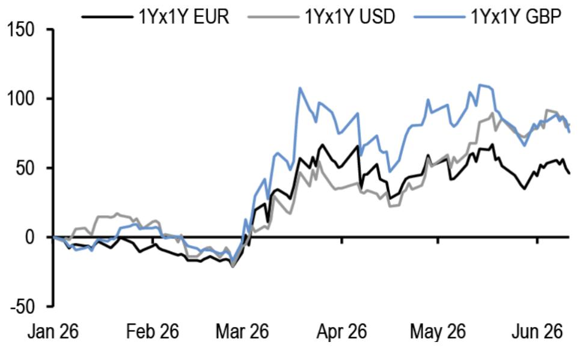

line chart

| Date   | 1Yx1Y EUR | 1Yx1Y USD | 1Yx1Y GBP |
|--------|-----------|-----------|-----------|
| Jan 26 | 0         | 0         | 0         |
| Feb 26 | -10       | 10        | 5         |
| Mar 26 | -20       | -15       | -10       |
| Apr 26 | 60        | 40        | 100       |
| May 26 | 50        | 60        | 90        |
| Jun 26 | 45        | 85        | 75        |

Delivered change in policy rates in 2026 and cumulative change priced in by end-26 across DM OIS markets vs. JPM forecasts $^{*}$ ; Bp  
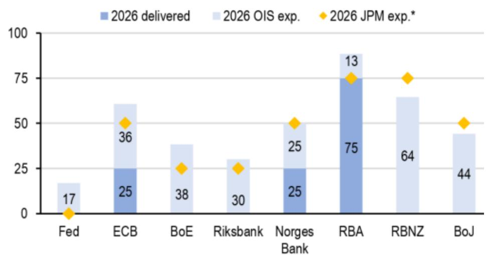

bar-line hybrid

| Bank | 2026 delivered | 2026 OIS exp. | 2026 JPM exp.* |
| :--- | :--- | :--- | :--- |
| Fed | 0 | 17 | 17 |
| ECB | 25 | 36 | 50 |
| BoE | 0 | 38 | 25 |
| Riksbank | 0 | 30 | 25 |
| Norges Bank | 25 | 25 | 50 |
| RBA | 75 | 13 | 75 |
| RBNZ | 0 | 64 | 75 |
| BoJ | 0 | 44 | 50 |

Source: JPM.  
Source: JPM.

- In 2H26, we expect DM economies to remain broadly resilient despite elevated inflation from the energy shock, with risks of weaker performance in the Europe. We expect most DM central banks to deliver a gradual and shallow policy tightening over the coming months. Relative to our forecast, OIS markets are broadly pricing a larger and faster tightening  
- On the Middle East conflict, we think energy prices are unlikely to fall quickly after a re-opening of the Strait of Hormuz. We still expect EUR and GBP rates to range trade and we continue to favour long positions when valuations are at the upper end of the range, close to the levels projected in our energy price spike scenario.  
- In terms of our trading portfolio, we hold shorts in 10Y UST vs. Bunds given still rich relative Treasury valuations in the intermediate sector and supportive RV. We tactically pay Sep26 MPC OIS and sell Jun27 3M SONIA vs. Jun27 Euribor. We remain biased to pay Scandinavian rates vs. Euribor. In Antipodean markets, we stay received 2Yx1Y AUD-USD spread and paid 5Yx5Y NZD-AUD spread.

10Y US-Germany yield spread regressed against 1Yx1Y USD-EUR OIS rate and US-Euro Forecast revision index (FRI);  
Past 12M; bp  
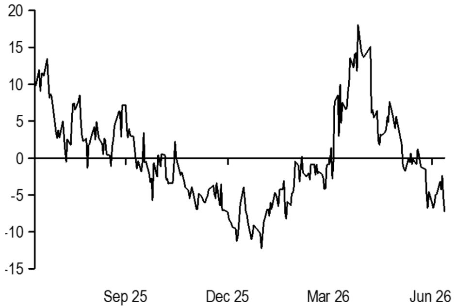

line chart

| Date    | Value |
|---------|-------|
| Sep 25  | 13.0  |
| Dec 25  | -12.0 |
| Mar 26  | 18.0  |
| Jun 26  | -7.0  |

Source: JPM.

2s/10s German par curve regressed against 1Yx1Y €STR rate; Bp  
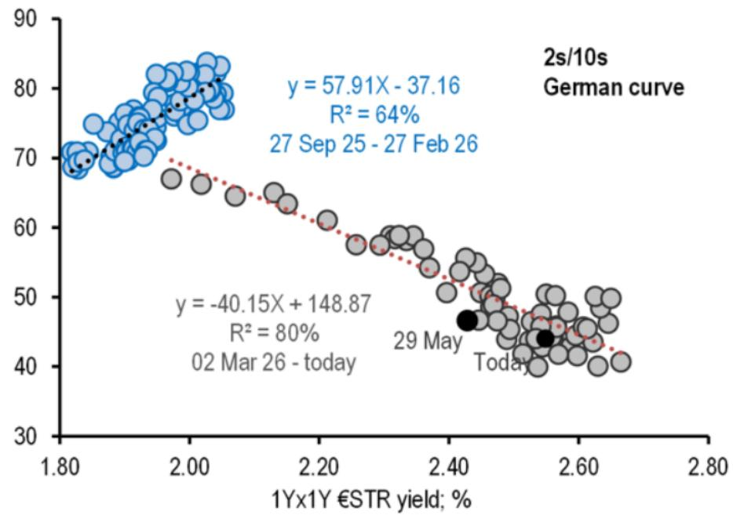

scatterplot

| Date       | 1Yx1Y €STR yield (%) | Y/Y Ratio |
| ---------- | --------------------- | --------- |
| 27 Sep 25  | 37.16                 | 57.91     |
| 27 Feb 26  | -                     | 64%       |
| 02 Mar 26  | -                     | -         |
| 29 May     | ~2.40                 | -40.15    |
| Today      | ~2.50                 | -         |

Source: JPM.

Duration: Over 2H26, we maintain a strategic bullish duration bias on 10Y Germany both outright and cross-market vs. US, with yields likely to range-trade over the near-term. We expect 1Yx1Y €STR to stay in a 2.35%-2.80% range and 10Y Bund yields in a 2.85–3.15% range. Over the near-term, we prefer to trade the ranges tactically from the long side and retain a bias to scale into long duration on moves back toward \~3.10%. Cross-market, we keep longs in 10Y Germany vs. US.  
- Intra-EMU strategy: We maintain our cautious stance on intra-EMU and €-SSA spreads: uncertainty remains elevated, valuations do not look particularly cheap, and positioning remains modestly crowded on the OW side. Hold long 30Y EU vs. swap to express our strategic OW EU theme. Keep UW 10Y Belgium vs. France/Germany in 50:50 flies as an attractive convex hedge against tail risk of further escalation in the Middle East conflict.

MPC OIS step pricing, (LHS) cumulative tightening priced (RHS) and JPM cumulative Bank Rate forecast (RHS)  
Bp  
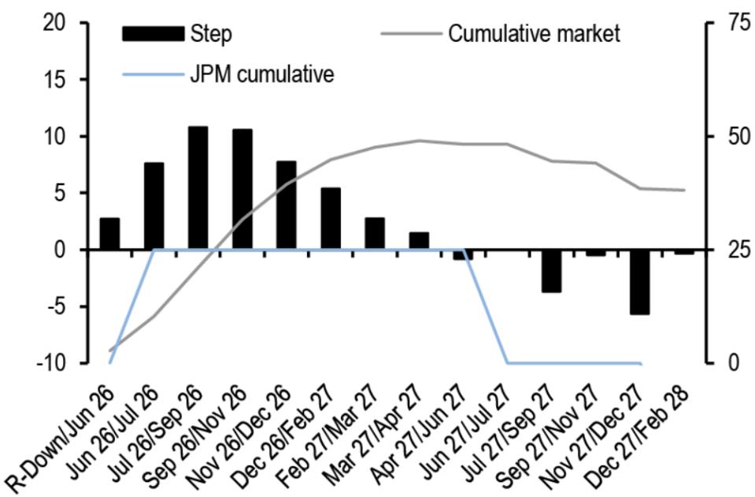

bar-line hybrid chart

| Date           | Step | Cumulative market | JPM cumulative |
| -------------- | ---- | ----------------- | -------------- |
| R-Down/Jun 26  | 3    | -10               | -10            |
| Jun 26/Jul 26  | 8    | -5                | 0              |
| Jul 26/Sep 26  | 11   | 0                 | 0              |
| Sep 26/Nov 26  | 11   | 25                | 0              |
| Nov 26/Dec 26  | 8    | 50                | 0              |
| Dec 26/Feb 27  | 5    | 50                | 0              |
| Feb 27/Mar 27  | 3    | 50                | 0              |
| Mar 27/Apr 27  | 1    | 50                | 0              |
| Apr 27/Jun 27  | -1   | 50                | 0              |
| Jun 27/Jul 27  | -4   | 50                | 0              |
| Jul 27/Sep 27  | -1   | 50                | 0              |
| Sep 27/Nov 27  | -1   | 50                | 0              |
| Nov 27/Dec 27  | -6   | 50                | 0              |
| Dec 27/Feb 28  | -1   | 50                | 0              |

Source: JPM.

6M and 2Y residuals from regressing 10Y gilt yields vs. 10Y US, 1Yx1Y SONIA and BoE  
Past 2Y, bp  
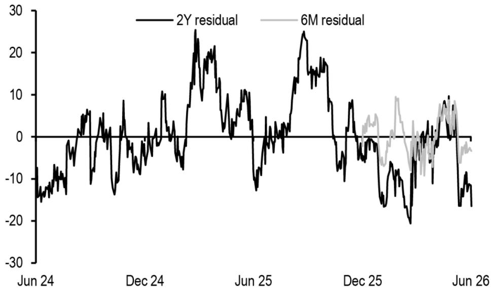

line chart

| Date   | 2Y residual | 6M residual |
|--------|-------------|-------------|
| Jun 24 | -15         | -15         |
| Dec 24 | 10          | -5          |
| Jun 25 | 25          | -10         |
| Dec 25 | -10         | 5           |
| Jun 26 | -15         | -5          |

Source: JPM.

We expect the BoE to keep rates on hold at 3.75% at the June meeting, with only a couple of bp of hikes priced in, with a 7-2 vote as Pill and Greene are likely to dissent for a 25bp rate hike. We recommended tactically paying Sep26 MPC OIS and selling Jun27 3M SONIA futures vs. Jun27 Euribor futures as a low beta short proxy on Jun27 SONIA  
We broadly expect GBP rates to range-trade around our Strait of Hormuz limbo scenario over the summer with 1Yx1Y SONIA in $3.95\% -4.6\%$ and 10Y gilts in a $4.65\% -5.20\%$ range as the macro impacts from higher energy prices will take time to dissipate and the medium-term outlook for the conflict remains unclear. Markets have recently priced in increased optimism around the US-Iran deal, but we think the potential for a further significant rally is limited  
- On politics, if Burnham wins the upcoming by-election (18 $^{th}$ June), we expect limited market impact and we would look to tactically fade any steepening as we think it is too early to consider the fiscal implications.

SEK 3M FRA inter-meeting steps and cumulative pricing; current and 30 April levels  
Bp  
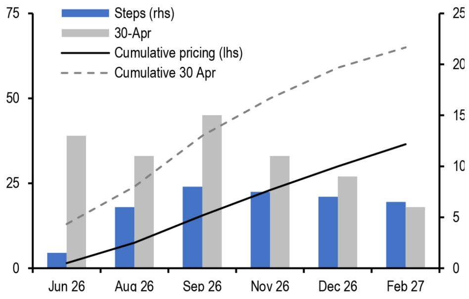

bar-line hybrid chart

| Month    | Steps (rhs) | 30-Apr | Cumulative pricing (lhs) | Cumulative 30 Apr |
| -------- | ----------- | ------ | ------------------------ | ----------------- |
| Jun 26   | 5           | 40     | 1                        | 5                 |
| Aug 26   | 15          | 35     | 3                        | 10                |
| Sep 26   | 25          | 45     | 5                        | 15                |
| Nov 26   | 20          | 35     | 8                        | 18                |
| Dec 26   | 20          | 28     | 10                       | 20                |
| Feb 27   | 18          | 18     | 12                       | 22                |

Source: JPM.

NOK 3M FRA curve\*;  
As of 12 Jun; %  
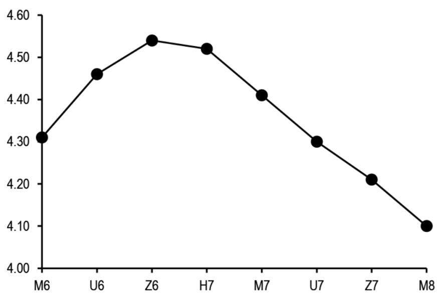

line chart

| Category | Value |
|---|---|
| M6 | 4.31 |
| U6 | 4.45 |
| Z6 | 4.54 |
| H7 | 4.52 |
| M7 | 4.41 |
| U7 | 4.30 |
| Z7 | 4.21 |
| M8 | 4.10 |

Source: JPM.

• Sweden: risk-reward supports higher money market yields.

• We favour trading duration tactically from the short side but prefer to position for cross-market underperformance of vs. Euro by paying Dec26 SEK FRA vs. Euribor.  
- Upcoming parliamentary elections raise the risk of more fiscal easing. We hold 5Yx5Y (Stibor – Euribor) spread wideners

\- Norway: Sticky core inflation pressures, labour market resilience and steady growth support a hawkish Norges Bank bias over the coming months.

- Position for pricing out easing over 3Q27-1Q28: We expect a hike in September but there are risks that market would price a longer pause thereafter (i.e. take out easing priced beyond 3Q27) rather than a higher peak. We recommend entering Dec26/Dec27 NOK 3M FRA curve steepeners.  
- Position for cross-market underperformance vs Euro: Nibor yields should remain relatively sticky, and we hold our NOK-EUR Dec26 3M FRA wideners
15

Change in JGB Yields  
Bp  
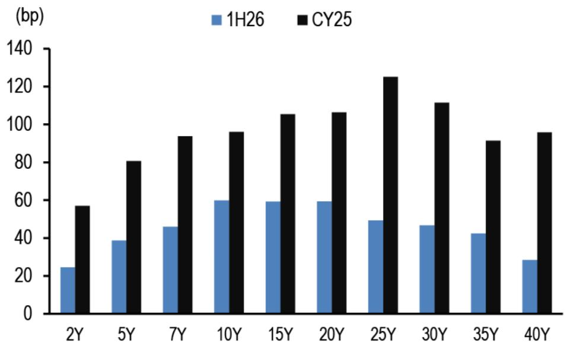

bar chart

| Term | 1H26 | CY25 |
|------|------|------|
| 2Y   | 24   | 57   |
| 5Y   | 39   | 80   |
| 7Y   | 46   | 94   |
| 10Y  | 60   | 96   |
| 15Y  | 59   | 105  |
| 20Y  | 59   | 106  |
| 25Y  | 49   | 125  |
| 30Y  | 47   | 111  |
| 35Y  | 42   | 91   |
| 40Y  | 28   | 96   |

Source: JPM.

RBA OIS meeting date OIS; current (red) and range since mid-March (blue)  
%  
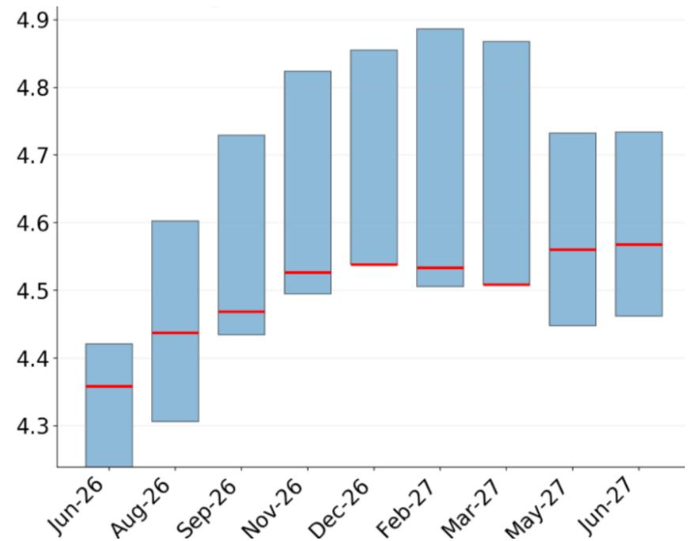

bar chart

| Month | Value |
|---|---|
| Jun-26 | 4.42 |
| Aug-26 | 4.61 |
| Sep-26 | 4.73 |
| Nov-26 | 4.83 |
| Dec-26 | 4.86 |
| Feb-27 | 4.89 |
| Mar-27 | 4.87 |
| May-27 | 4.73 |
| Jun-27 | 4.73 |

Source: JPM.

Japan: The front-end (up to 5Y sector) is likely to remain stable with BoJ peak priced around 2%, while the 6–10y sector faces the strongest supply pressure and is expected to underperform. Although the super-long sector has seen improved supply-demand conditions, structural demand remains weak due to reliance on overseas and pension flows and exposure to fiscal risks.

## • Australia/New Zealand:

- Elevated inflation will keep the RBA sidelined this year, even as the macro data starts to soften with rate cuts likely from mid-2027. Open tactical Nov-26/May-27 RBA OIS flattener and keep 2Yx1Y AUD-USD (IRS-SFR) spread tightener.  
- NZD yields remain high beta to US, while the NZD curve has already flattened into a hiking cycle, but without the level of the cash rate being priced as overly restrictive. Stay paid the NZD-AUD 5Y5Y IRS spread.

## Euro area

- Euro duration: Strategic bullish duration on 10Y Germany both outright and cross-market vs. US, with yields likely to range-trade over near-term. Keep short 10Y UST vs. Bund.  
- Intra-EMU: Stay cautious on intra-EMU/€-SSA spreads. Aim to trade French spreads tactically around Presidential election newsflow and trade Italian spreads tactically around 2027 budget negotiations.  
- Derivatives: We hold bullish duration proxies via 3Mx(1Yx1Y) receiver fly and favour bullish structures on Sep27 Euribor implemented via 1Y midcurves. Hold 1Y/2Yx1Y conditional bear-flatteners via 3M payers and also enter Dec26/Dec28 conditional bear flattener. Hold 2s/10s conditional bull steepener with bias towards adding 2s/10s bear-steepeners towards end-3Q26. Keep medium term 10s/30s steepening bias. Hold longs in Dec26 SOFR put versus Euribor. Stay neutral on German swap spreads but medium-term bias towards modest narrowing of Schatz spread and widening of Bund spreads. Hold Bund/Buxl swap spread curve steepening bias. Expect volatility normalization to continue. Stay short 3Mx(3Yx1Y) unhedged straddles. Enter 2s/10s vol curve steepener and hold 3Mx5Y/1Yx5Y expiry curve steepener.

## UK

- UK: Tactically pay Sep26 MPC OIS. Sell Jun27 3M SONIA futures vs. Jun27 Euribor. Stay neutral duration, expect 10Y gilt yield to range trade. Tactical flattening bias on 10s/30s gilt curve. Medium term narrowing bias on 10Y swap spreads. Keep1Yx5Y/1Yx10Y volatility curve steepeners.

## Scandinavia

- Sweden: rotate from paying Sep26 SEK 3M FRA versus Euribor into paying Dec26 SEK 3M FRA vs Euribor. We hold 5Yx5Y (Stibor – Euribor) spread wideners. Stay neutral swap spreads.  
- Norway: enter Dec26/Dec27 NOK 3M FRA curve steepeners to position for a steepening of the front-end of the money market curve. Hold our Dec26 NOK-EUR 3M FRA wideners

## Japan

\- Japan: Keep tactical 5s/20s JGB curve steepeners. Enter tactical 5s10s30s JGB body short.

## Antipodean

\- Australia & New Zealand: Stay received the AUD USD 2Y1Y spread. Stay paid the NZDAUD 5Y5Y spread. Open a Nov-26/May-27 RBA OIS flattener.

<table><tr><td colspan="2"></td><td>Page</td></tr><tr><td>1</td><td>US Rates: Raising year-end forecasts, stay short Treasuries versus bunds</td><td>2</td></tr><tr><td>2</td><td>International Rates: More of the same over 2H: range trade duration, cross market long EUR vs. US</td><td>11</td></tr><tr><td>3</td><td>FX: Central banks take centre stage</td><td>18</td></tr><tr><td>4</td><td>Commodities: Schrödinger&#x27;s Strait</td><td>27</td></tr><tr><td>5</td><td>Emerging Markets: Stay OW EM FX and MW Rates, EM Sovereigns &amp; Corporates</td><td>32</td></tr><tr><td>6</td><td>Appendix</td><td>38</td></tr></table>

## LHS: Payrolls (3M MA). RHS: USD TWI

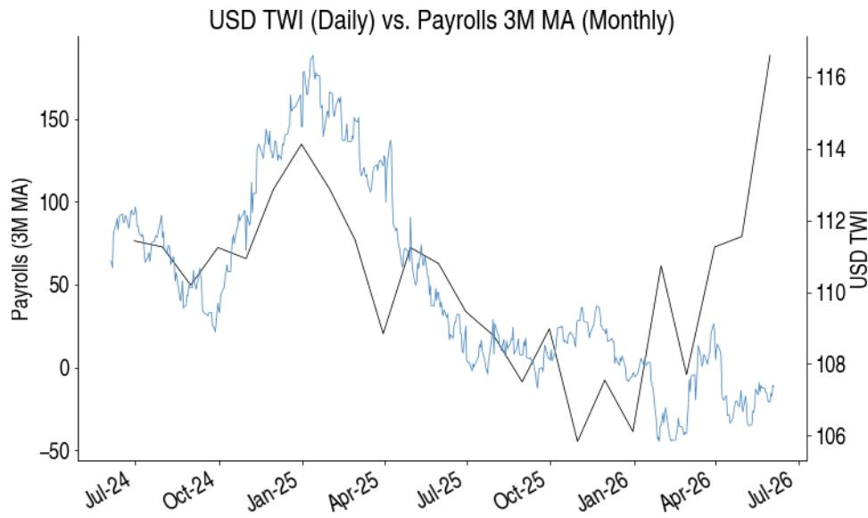

line chart

| Date   | Payrolls (3M MA) | USD TWI |
|--------|------------------|---------|
| Jul-24 | ~90              | ~111    |
| Oct-24 | ~50              | ~110    |
| Jan-25 | ~170             | ~114    |
| Apr-25 | ~80              | ~108    |
| Jul-25 | ~60              | ~109    |
| Oct-25 | ~20              | ~108    |
| Jan-26 | ~-50             | ~106    |
| Apr-26 | ~-40             | ~108    |
| Jul-26 | ~-30             | ~116    |

Source: JPM

## % of countries with policy rate less than US. Dotted line uses JPM Economists forecasts

% of countries with policy rate less than US. Dotted line uses JPM Economists forecasts  
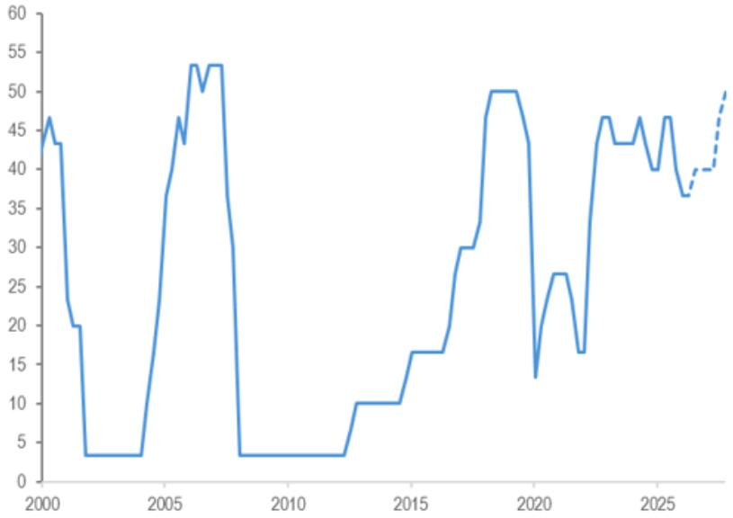

line chart

| Year | Value |
| ---- | ----- |
| 2000 | 46    |
| 2001 | 43    |
| 2002 | 20    |
| 2003 | 3     |
| 2004 | 3     |
| 2005 | 37    |
| 2006 | 46    |
| 2007 | 53    |
| 2008 | 53    |
| 2009 | 3     |
| 2010 | 3     |
| 2011 | 3     |
| 2012 | 3     |
| 2013 | 10    |
| 2014 | 10    |
| 2015 | 17    |
| 2016 | 17    |
| 2017 | 30    |
| 2018 | 50    |
| 2019 | 50    |
| 2020 | 13    |
| 2021 | 27    |
| 2022 | 16    |
| 2023 | 47    |
| 2024 | 43    |
| 2025 | 47    |
| 2026 | 43    |
| 2027 | 47    |
| 2028 | 50    |

Source: JPM Economics

- The firming inflation outlook kicked off by the US-Iran conflict is intensifying, even as the growth outlook is starting to recover.  
- Signs of US exceptionalism continue to intensify as well. The dollar will maintain its yield dominance even if the Fed is on hold; if data were to nudge the Fed to put hikes on the table amid strong US growth/ equity performance, it would be a reversion to US exceptionalism of recent years, a risk we remain sensitive to.  
- Against this backdrop, our preferred strategy continues to be (1) long USD particularly vs the low yielders (EUR, CAD), (2) overweight FX carry globally (AUD, NOK in DM; BRL, HUF in EM)

## Blue shaded area highlights the phase of reliable USD TWI appreciation in the lead-up to the first Fed hike across cycles

USD TWI, indexed to 100 on Day 0  
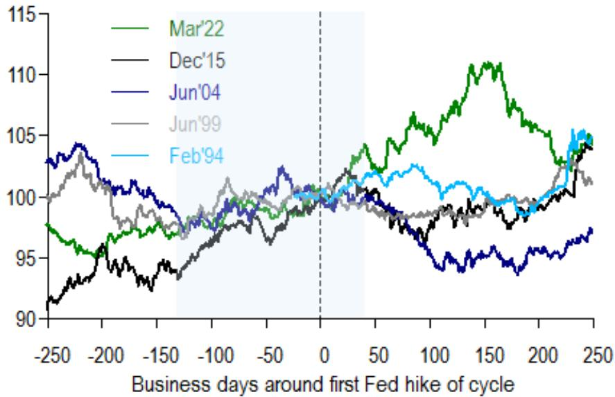

line chart

| Business days around first Fed hike of cycle | Mar'22 | Dec'15 | Jun'04 | Jun'99 | Feb'94 |
| --------------------------------------------- | ------ | ------ | ------ | ------ | ------ |
| -250                                          | 98     | 91     | 103    | 100    | 100    |
| -200                                          | 96     | 94     | 104    | 101    | 101    |
| -150                                          | 97     | 93     | 102    | 100    | 100    |
| -100                                          | 98     | 95     | 101    | 99     | 99     |
| -50                                           | 99     | 97     | 102    | 100    | 100    |
| 0                                             | 100    | 99     | 100    | 99     | 100    |
| 50                                            | 102    | 100    | 99     | 98     | 101    |
| 100                                           | 105    | 98     | 95     | 97     | 102    |
| 150                                           | 110    | 99     | 94     | 98     | 103    |
| 200                                           | 108    | 100    | 96     | 99     | 104    |
| 250                                           | 105    | 104    | 97     | 102    | 105    |

Source: JPM

## Total returns (transaction cost included) from Global FX carry strategy index based on carry / vol rankings, around the onset of Fed hiking cycles

FX carry TR index, indexed to 100 on day 0  
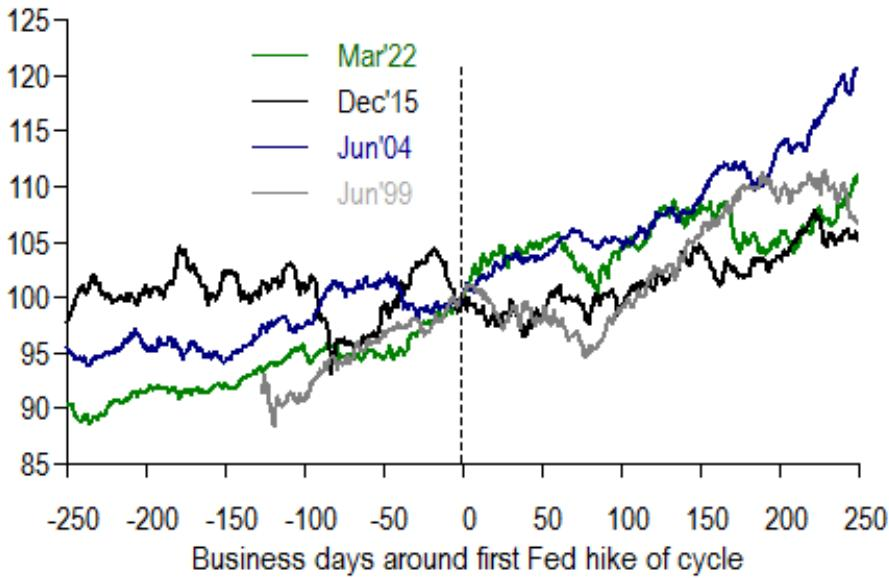

line chart

| Business days around first Fed hike of cycle | Mar'22 | Dec'15 | Jun'04 | Jun'99 |
| -------------------------------------------- | ------ | ------ | ------ | ------ |
| -250                                         | 89     | 100    | 95     | 90     |
| -200                                         | 90     | 101    | 96     | 91     |
| -150                                         | 91     | 102    | 97     | 92     |
| -100                                         | 92     | 103    | 98     | 93     |
| -50                                          | 93     | 104    | 99     | 94     |
| 0                                            | 94     | 105    | 100    | 95     |
| 50                                           | 95     | 106    | 101    | 96     |
| 100                                          | 96     | 107    | 102    | 97     |
| 150                                          | 97     | 108    | 103    | 98     |
| 200                                          | 98     | 109    | 104    | 99     |
| 250                                          | 99     | 110    | 105    | 100    |

Source: JPM Economics

- Before assessing the quantum of USD upside from any actual tightening in coming months, it is worth anchoring expectations in the historical record.  
- Reliable dollar appreciation in the lead-up: The broad dollar tends to appreciate $\sim 5\%$ in the period between $\sim 6$ -months leading up to the first Fed hike to $\sim 1$ -month after, before an element of sell-the-fact sets in, absent an abnormally ferocious cycle such as 2022.  
- FX carry is fine when the Fed tightens: Fed tightening has historically not only not been a problem for FX carry, but has actually been actively beneficial in the early quarters both in the lead-up to and following the first hike.

Fed hikes in the past cycles  
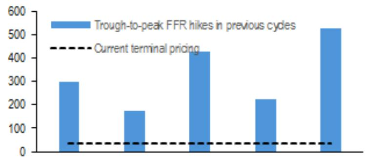

bar chart

| Year | Trough-to-peak FFR hikes in previous cycles |
| ---- | ------------------------------------------ |
| 1    | 300                                        |
| 2    | 170                                        |
| 3    | 420                                        |
| 4    | 220                                        |
| 5    | 520                                        |

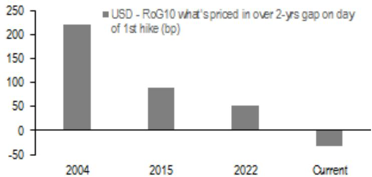

bar chart

| Year | USD - RoG10 what's priced in over 2-yrs gap on day of 1st hike (bp) |
| :--- | :--- |
| 2004 | 220 |
| 2015 | 90 |
| 2022 | 50 |
| Current | -30 |

Source: JPM

- While Fed's urgency to tighten in coming months remains a topic of intense market debate, we note that the quantum of USD upside in the event of actual tightening is subject to conflicting forces.  
- On the one hand, the next Fed cycle is almost certainly not going to be a 2022 redux given the starting point of much better adjusted real rates, better-behaved inflation expectations, less acute demand-side inflation pressures and looser labor markets this time around.  
- On the other hand, the lesson of history is that if/when Fed hikes do eventually get going, the cycle rarely turns out to be shallow: the delivered peak-to-trough tightening amplitude has not been less than 175bp in the last 5 hiking cycles, for which current USD OIS terminal pricing is patently unprepared.

Rolling cross-sectional R2 of weekly changes in real yields vs FX (USD, EUR, GBP, JPY, AUD, CAD). 1m rolling avg.  
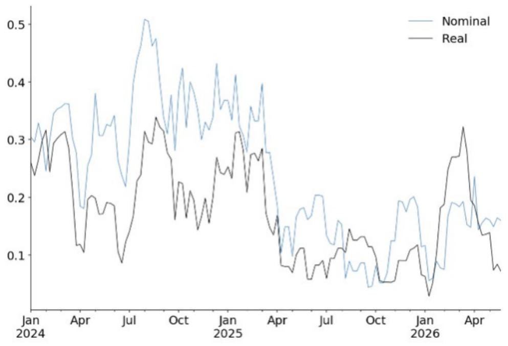

line chart

| Date       | Nominal | Real  |
| ---------- | ------- | ----- |
| Jan 2024   | 0.30    | 0.25  |
| Apr 2024   | 0.35    | 0.30  |
| Jul 2024   | 0.50    | 0.35  |
| Oct 2024   | 0.40    | 0.30  |
| Jan 2025   | 0.45    | 0.35  |
| Apr 2025   | 0.35    | 0.25  |
| Jul 2025   | 0.20    | 0.15  |
| Oct 2025   | 0.15    | 0.10  |
| Jan 2026   | 0.20    | 0.15  |
| Apr 2026   | 0.15    | 0.10  |

Source: JPM

• Real yields should matter for FX given energy-driven inflation/breakevens and CB reaction functions. During the early stages of war, yields explained FX returns better than nominals, and real carry has also outperformed nominal carry in our systematic signals.  
- Possible explanations for current dislocations: 1) USD is slightly cheap in expectations of an Iran deal; 2) RoW real yields could improve if energy normalizes, and 3) The binary nature of the conflict and still-persistent oil/USD correlations may dilute ‘relative’ signals  
- It is possible that the USD catches higher to rates, though history also suggests rates can come lower to the USD (1H'25 rates catch down to USD; 4Q'23 rates and USD converges; 3Q'23 cheap USD catches higher to rates)

## Food CPU YoY% at El Nino onset, +6M, +12M (All episodes starting 2000)

Food CPI YoY%: At El Nino Onset, +6M, +12M (All Episodes)  
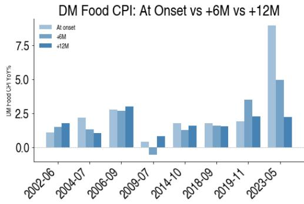

bar chart

| Date     | At onset | +6M  | +12M |
| -------- | -------- | ---- | ---- |
| 2002-06  | 1.0      | 1.5  | 2.0  |
| 2004-07  | 2.0      | 1.5  | 1.0  |
| 2006-09  | 2.5      | 2.5  | 3.0  |
| 2009-07  | 0.5      | -1.0 | 1.0  |
| 2014-10  | 1.5      | 1.5  | 1.5  |
| 2018-09  | 1.5      | 1.5  | 1.5  |
| 2019-11  | 2.0      | 3.5  | 2.5  |
| 2023-05  | 8.5      | 5.0  | 2.5  |

EM Food CPI: At Onset vs +6M vs +12M  
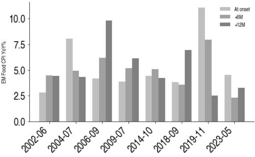

bar chart

| Date | At onset (%) | +6M (%) | +12M (%) |
|---|---|---|---|
| 2002-06 | 2.8 | 4.5 | 4.5 |
| 2004-07 | 8.1 | 5.0 | 4.3 |
| 2006-09 | 4.2 | 6.2 | 9.8 |
| 2009-07 | 3.9 | 5.3 | 6.1 |
| 2014-10 | 4.5 | 5.1 | 4.2 |
| 2018-09 | 3.8 | 3.6 | 6.9 |
| 2019-11 | 10.8 | 7.9 | 2.4 |
| 2023-05 | 4.6 | 2.3 | 3.3 |

Source: JPM, Bloomberg Finance L.P.

## FX carry returns: Prior 12M vs Post 12M since El Nino onset (excl. covid)

FX Carry Returns: Prior 12M vs Post 12M After EI Nino Onset (excl. COVID)  
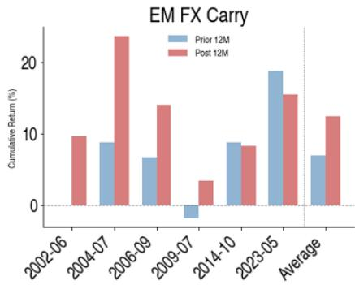

bar chart

| Date       | Prior 12M | Post 12M |
| ---------- | --------- | -------- |
| 2002-06    |           |          |
| 2004-07    |           |          |
| 2006-09    |           |          |
| 2009-07    |           |          |
| 2014-10    |           |          |
| 2023-05    |           |          |
| Average    |           |          |

G10 FX Carry  
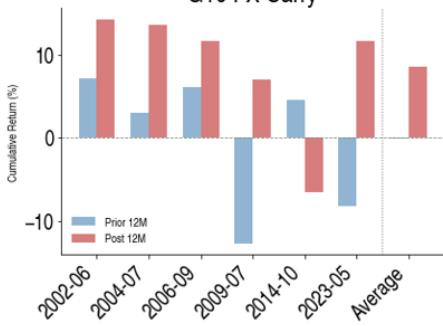

bar chart

LBOE PER SHARE
| Period | Prior 12M (%) | Post 12M (%) |
| :--- | :--- | :--- |
| 2002-06 | 7 | 14 |
| 2004-07 | 3 | 13 |
| 2006-09 | 6 | 11 |
| 2009-07 | -13 | 7 |
| 2014-10 | 4 | -5 |
| 2023-05 | -8 | 11 |
| Average | | 8 |

Global FX Carry  
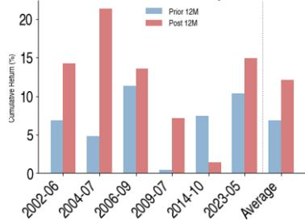

bar chart

| Period | Prior 12M (%) | Post 12M (%) |
|---|---|---|
| 2002-06 | 7 | 14.5 |
| 2004-07 | 4.8 | 21.3 |
| 2006-09 | 11.5 | 13.7 |
| 2009-07 | 0.5 | 7.3 |
| 2014-10 | 7.6 | 1.5 |
| 2023-05 | 10.5 | 15.1 |
| Average | 7.1 | 12.3 |

Source: JPM, Bloomberg Finance L.P.

\- In our view, a transmission channel into FX markets is via inflation/ monetary policy with implications for FX carry. Historically, DM inflation impact from El Niño has been subdued, but has been more idiosyncratically relevant for EM. On average, FX carry returns tend to be stronger in higher inflation regimes and post El Niño.

X: Projected policy rate X: Projected real policy rate in 4Q'26  
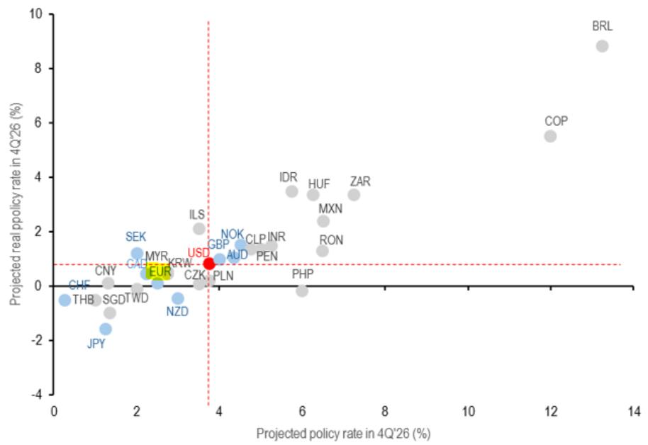

scatterplot

| Currency | Projected policy rate in 4Q'26 (%) | Projected real ppolicy rate in 4Q'26 (%) |
|----------|------------------------------------|------------------------------------------|
| BRL      | 13.5                               | 8.8                                      |
| COP      | 12.0                               | 5.5                                      |
| IDR      | 5.8                                | 3.5                                      |
| HUF      | 6.2                                | 3.3                                      |
| MXN      | 6.5                                | 2.5                                      |
| ZAR      | 7.2                                | 3.3                                      |
| RON      | 6.5                                | 1.2                                      |
| IDR      | 5.8                                | 3.5                                      |
| NOK      | 4.2                                | 1.8                                      |
| CLP INR  | 4.5                                | 1.5                                      |
| AUD      | 4.0                                | 1.0                                      |
| PEN      | 5.0                                | 1.0                                      |
| PLN      | 4.0                                | 0.8                                      |
| CZK      | 3.5                                | 0.0                                      |
| USD      | 3.8                                | 0.8                                      |
| EUR      | 2.5                                | 0.5                                      |
| SEK      | 2.0                                | 1.2                                      |
| MYR      | 2.2                                | 0.8                                      |
| CNY      | 1.5                                | -0.5                                     |
| CHF      | 0.5                                | -0.8                                     |
| THB      | 0.8                                | -1.0                                     |
| SGDTWD   | 1.2                                | -1.2                                     |
| NZD      | 2.8                                | -0.5                                     |
| JPY      | 1.0                                | -1.8                                     |

Source: JPM

EUR/USD: Actual vs. select fair value  
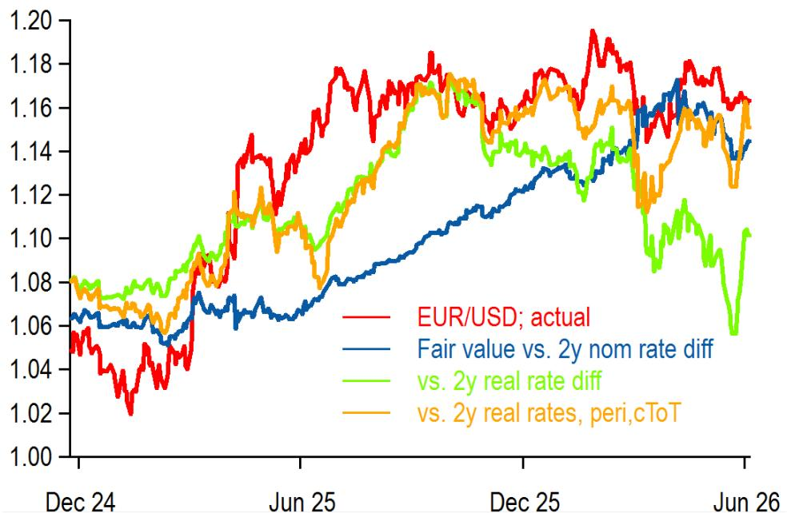

line chart

| Date   | EUR/USD; actual | Fair value vs. 2y nom rate diff | vs. 2y real rate diff | vs. 2y real rates, peri,cToT |
|--------|-----------------|----------------------------------|------------------------|------------------------------|
| Dec 24 | 1.05            | 1.06                             | 1.08                   | 1.07                         |
| Jun 25 | 1.18            | 1.08                             | 1.16                   | 1.17                         |
| Dec 25 | 1.19            | 1.13                             | 1.15                   | 1.16                         |
| Jun 26 | 1.16            | 1.14                             | 1.06                   | 1.15                         |

Source: JPM

- Two bearish euro factors have intensified since we pivoted to a bearish EUR/USD forecast: 1) relative growth divergence between the EU and US has widened (via PMIs and EASIs); 2) hawkish Fed re-pricing has moved rate differentials in favour of the dollar  
- The euro will still be a relative low yielder even with a couple of rate hikes consistent with our baseline. Also, EUR/USD is going into the ECB meeting overshooting vs. our measures of short-term fair value (1.10-1.15)  
We previously downgraded EUR/USD medium-term targets to 3Q'26 1.15, 1Q'27 1.13. Near-term target at 1.17 unchanged as any resolution between the US and Iran should result in EUR/USD strength, but we expect this to be short-lived.

FF rate, USD 1y1y, DXY  
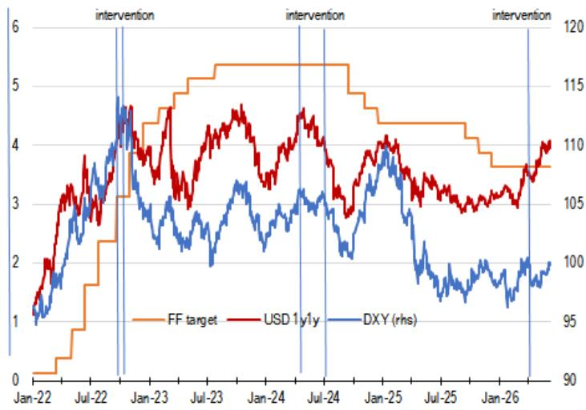

line chart

| Date    | FF target | USD 1y1y | DXY (rhs) |
|---------|-----------|----------|-----------|
| Jan-22  | 1         | 1        | 1         |
| Jul-22  | 2         | 3        | 3         |
| Jan-23  | 5         | 4        | 4         |
| Jul-23  | 5         | 4        | 3         |
| Jan-24  | 5         | 4        | 3         |
| Jul-24  | 5         | 4        | 3         |
| Jan-25  | 4         | 3        | 2         |
| Jul-25  | 4         | 3        | 1         |
| Jan-26  | 3         | 3        | 1         |
| Jul-26  | 3         | 4        | 2         |

Source: JPM, Bloomberg Finance L.P.

JPY contracts in IMM future  
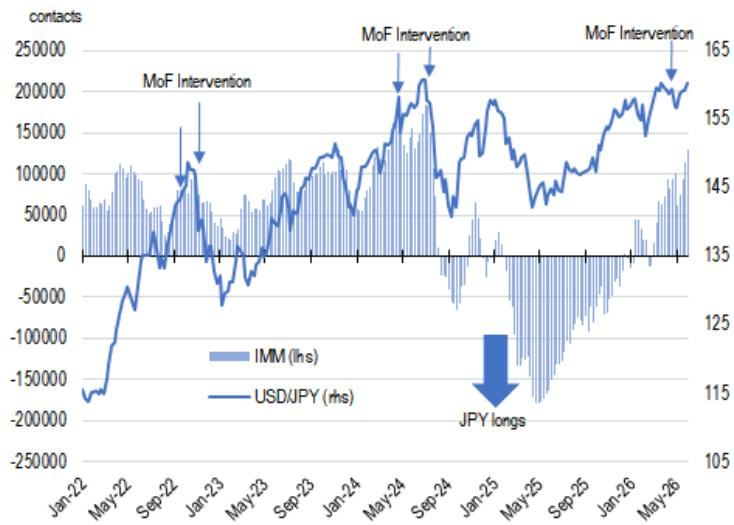

line chart

| Date     | IMM (lhs) | USD/JPY (rhs) |
|----------|-----------|---------------|
| Jan-22   | ~100000   | ~105          |
| May-22   | ~100000   | ~115          |
| Sep-22   | ~100000   | ~125          |
| Jan-23   | ~100000   | ~135          |
| May-23   | ~100000   | ~145          |
| Sep-23   | ~100000   | ~155          |
| Jan-24   | ~100000   | ~165          |
| May-24   | ~100000   | ~165          |
| Sep-24   | ~100000   | ~165          |
| Jan-25   | ~100000   | ~165          |
| May-25   | ~100000   | ~165          |
| Sep-25   | ~100000   | ~165          |
| Jan-26   | ~100000   | ~165          |
| May-26   | ~100000   | ~165          |

Source: JPM, Bloomberg Finance L.P.

- Our medium- to long-term USD/JPY target already assumed intervention prior to the JPY 162 cycle high; Intervention concerns may cap USD/JPY for a while, but we expect it to eventually break out of its range and move higher; our targets remain 158 in 2Q26, 160 in 3Q26, and 164 in 4Q26.  
- The global monetary policy cycle remains unfavorable for JPY, and the Takaichi administration's policy mix heightens risks of elevated inflation and further depreciation. Elevated oil prices reinforce our medium- to long-term bearish outlook.  
- In the 2022 and 2024 episodes, the authorities did not try to defend any specific level. This can be seen as consistent with G7 FX commitments, but more fundamentally it simply underscores that, for a currency like the yen—freely traded under a floating regime and with a large market—intervention has difficulty stopping or reversing an underlying trend driven by fundamentals.

Fixing bias calculated as difference between actual fix and JPM estimate with CCF  
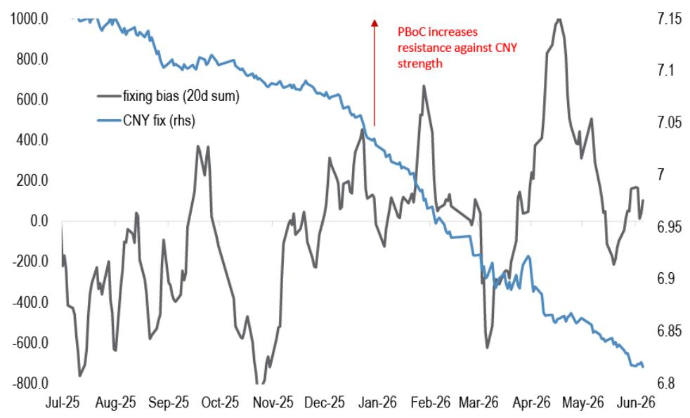

line chart

| Date   | fixing bias (20d sum) | CNY fix (rhs) |
|--------|------------------------|---------------|
| Jul-25 | -800.0                 | 7.15          |
| Aug-25 | -400.0                 | 7.10          |
| Sep-25 | -200.0                 | 7.05          |
| Oct-25 | 400.0                  | 7.00          |
| Nov-25 | -800.0                 | 6.95          |
| Dec-25 | 200.0                  | 6.90          |
| Jan-26 | 400.0                  | 6.85          |
| Feb-26 | 600.0                  | 6.80          |
| Mar-26 | -600.0                 | 6.75          |
| Apr-26 | 800.0                  | 6.70          |
| May-26 | 1000.0                 | 6.65          |
| Jun-26 | 200.0                  | 6.60          |

Source for both: Bloomberg Finance L.P., JPM

CNH positioning on JPM EM client survey, and USD/CNH Spot  
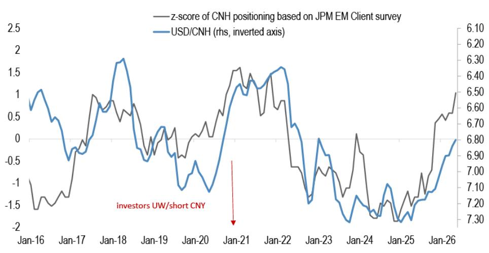

line chart

| Date   | z-score of CNH positioning based on JPM EM Client survey | USD/CNH (rhs, inverted axis) |
|--------|----------------------------------------------------------|-------------------------------|
| Jan-16 | -1.5                                                     | 6.5                           |
| Jan-17 | -0.5                                                     | 6.3                           |
| Jan-18 | 1.0                                                      | 6.4                           |
| Jan-19 | 0.0                                                      | 6.2                           |
| Jan-20 | -0.5                                                     | 6.0                           |
| Jan-21 | 1.5                                                      | 6.3                           |
| Jan-22 | 1.0                                                      | 6.4                           |
| Jan-23 | -1.0                                                     | 6.2                           |
| Jan-24 | -1.5                                                     | 6.0                           |
| Jan-25 | -1.0                                                     | 6.1                           |
| Jan-26 | 1.0                                                      | 6.5                           |

- PBoC's resistance towards CNY strength has moderated since May. Crowded positioning aside, investor anxiety about reversal risk in USD/CNH appears to stem from two factors. First, recent CNY strength seems at odds with deteriorating activity data. Second, the FX-rates disconnect has become more pronounced.  
• We remain constructive on the CNY in the near term and continue to position for downside in USD/CNH via options, and an expected state visit by President Xi to the US in September may add impetus for near-term downside in USD/CNH.  
We have also tentatively lifted the back end of the forecast to 6.75–6.80 for 1H27, after spot troughing in 2H26, recognizing that USD/CNY is unlikely to fully buck broader dollar trends—particularly if the US exceptionalism narrative gains traction and the risk of incremental Fed hikes increases into 2027.

<table><tr><td colspan="2"></td><td>Page</td></tr><tr><td>1</td><td>US Rates: Raising year-end forecasts, stay short Treasuries versus bunds</td><td>2</td></tr><tr><td>2</td><td>International Rates: More of the same over 2H: range trade duration, cross market long EUR vs. US</td><td>11</td></tr><tr><td>3</td><td>FX: Central banks take centre stage</td><td>18</td></tr><tr><td>4</td><td>Commodities: Schrödinger&#x27;s Strait</td><td>27</td></tr><tr><td>5</td><td>Emerging Markets: Stay OW EM FX and MW Rates, EM Sovereigns &amp; Corporates</td><td>32</td></tr><tr><td>6</td><td>Appendix</td><td>38</td></tr></table>

Oil exports via the Strait of Hormuz
kbd, 10 day MA  
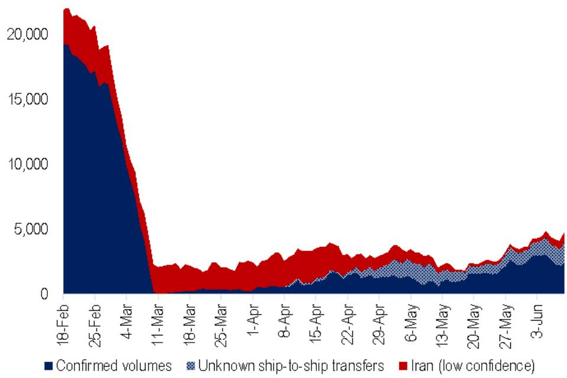

stacked bar chart

| Date | Confirmed volumes | Unknown ship-to-ship transfers | Iran (low confidence) |
| :--- | :--- | :--- | :--- |
| 18-Feb | 19500 | 0 | 2200 |
| 25-Feb | 17000 | 0 | 2000 |
| 4-Mar | 10000 | 0 | 1500 |
| 11-Mar | 100 | 0 | 2000 |
| 18-Mar | 500 | 0 | 2000 |
| 25-Mar | 500 | 0 | 2000 |
| 1-Apr | 500 | 0 | 2000 |
| 8-Apr | 500 | 500 | 2500 |
| 15-Apr | 1000 | 500 | 3000 |
| 22-Apr | 1500 | 1000 | 2500 |
| 29-Apr | 1500 | 1500 | 2500 |
| 6-May | 1500 | 1500 | 2500 |
| 13-May | 1500 | 1500 | 2500 |
| 20-May | 1500 | 1500 | 2500 |
| 27-May | 2500 | 2500 | 3500 |
| 3-Jun | 3500 | 3500 | 4500 |

Source: Kpler, JPM Commodities Research

Persian Gulf exports, by export channel
kbd  
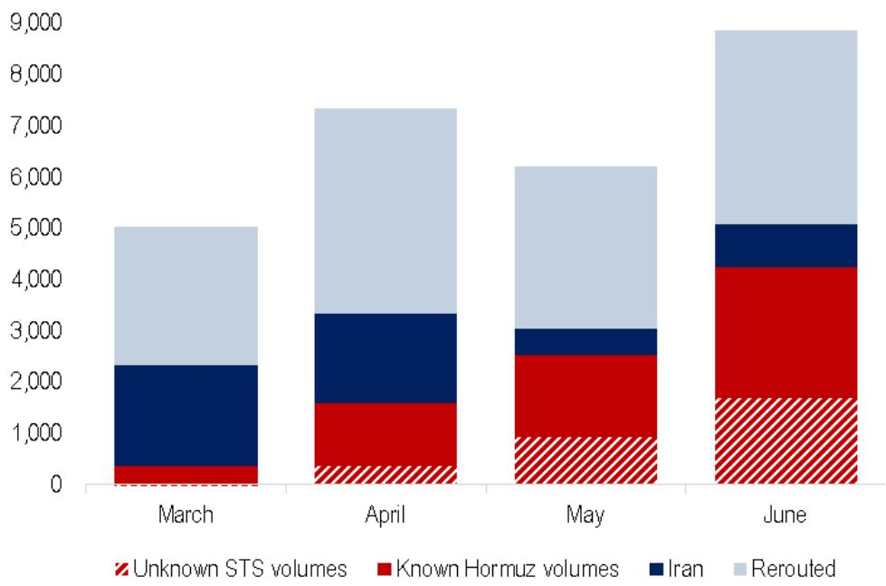

stacked bar chart

| Month | Unknown STS volumes | Known Hormuz volumes | Iran | Rerouted |
|-------|---------------------|----------------------|------|----------|
| March | 0                   | 300                  | 1800 | 2500     |
| April | 400                 | 1500                 | 1600 | 3500     |
| May   | 1000                | 1700                 | 500  | 2800     |
| June  | 1700                | 2800                 | 800  | 3500     |

Source: Kpler, JPM Commodities Research

- Since March 1, the Strait of Hormuz has been treated by much of the world as effectively closed. Major military operations disrupted commercial shipping, insurers withdrew coverage, tanker traffic collapsed, and oil exports from the Persian Gulf fell sharply. By any conventional definition, the Strait has ceased functioning as a normal maritime corridor in the eyes of nervous global markets. Yet over the last two weeks, particularly since the Memorial Day, a growing volume of oil appears to be finding its way through.  
- On our measure, the box is starting to creak open. We estimate June oil flows through Hormuz are running at 5.1 mbd, up from 2.9 mbd in May, 3.3 mbd in April, and 2.2 mbd in March. The rebound is meaningful, but it still leaves flows at only about 25% of pre-war levels. Within that total, roughly 0.8 mbd is labeled as Iranian exports. These cargos likely do not reflect “true” Hormuz transits: they appear to move, then pause in Omani waters, and likely turn back following US Navy blockade. We include the 0.8 mbd in our crossings estimate, but flag them as low-certainty.

## NWE gas storage level

% full

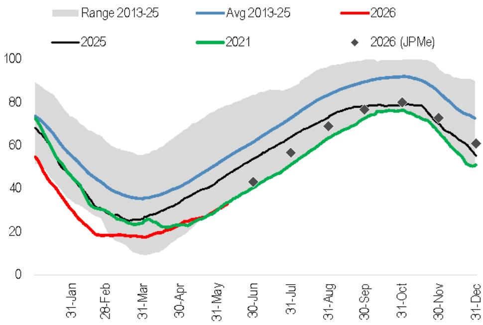

line chart

| Date     | 2026 | 2025 | 2021 | 2026 (JPMe) |
|----------|------|------|------|-------------|
| 31-Jan   | ~55  | ~70  | ~75  | -           |
| 28-Feb   | ~18  | ~40  | ~35  | -           |
| 31-Mar   | ~18  | ~25  | ~25  | -           |
| 30-Apr   | ~25  | ~35  | ~30  | -           |
| 31-May   | ~30  | ~45  | ~40  | -           |
| 30-Jun   | ~40  | ~55  | ~50  | ~45         |
| 31-Jul   | ~55  | ~70  | ~65  | ~55         |
| 31-Aug   | ~70  | ~85  | ~80  | ~70         |
| 30-Sep   | ~75  | ~90  | ~85  | ~75         |
| 31-Oct   | ~80  | ~95  | ~90  | ~80         |
| 30-Nov   | ~70  | ~85  | ~80  | ~70         |
| 31-Dec   | ~60  | ~75  | ~70  | ~60         |

Source: AGSI, GIE, Bloomberg Finance L.P., JPM Commodities Research

## 2026 and 2027 September-November TTF spread

EUR/MWh

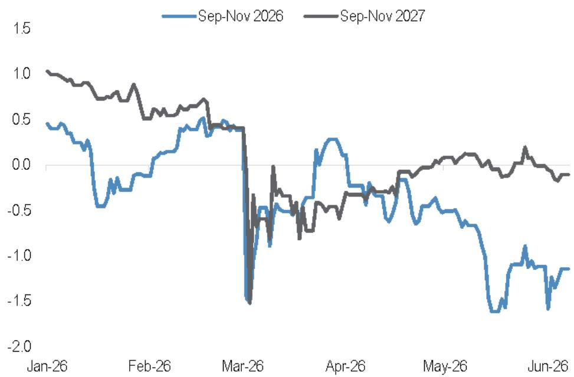

line chart

| Date    | Sep-Nov 2026 | Sep-Nov 2027 |
|---------|--------------|--------------|
| Jan-26  | 0.4          | 1.0          |
| Feb-26  | -0.5         | 0.8          |
| Mar-26  | -1.5         | -1.5         |
| Apr-26  | 0.3          | -0.3         |
| May-26  | -0.8         | 0.1          |
| Jun-26  | -1.5         | -0.2         |

Source: Bloomberg Finance L.P., JPM Commodities Research

- NWE storage sits at record lows for this time of year, and the longer summer TTF prices remain at a premium to winter prices and at a discount to JKM, the higher the risk of policy intervention. TTF discount to JKM is pulling spot cargoes to Asia where demand remains robust and developing (super) El Niño summer risks even higher cooling demand in Asia. Meanwhile, incremental LNG supply growth is slowing, Golden Pass appears to be facing start-up challenges, and Qatar’s ramp-up will still take 2-3 months after a Hormuz re-opening.  
- The TTF/JKM curve echoes last year's narrative of Europe being unwilling to outbid Asia in the summer, growing comfortable with relatively low pre-winter storage levels and relying on LNG imports in winter as needed. That approach led to significant price spikes in January during a brief transatlantic cold spell, and the risks are significantly higher this winter. Put differently, if our summer forecast (55 EUR/MWh) proves too high, our winter forecast (60 EUR/MWh) may well prove significantly too low.

## Global primary aluminum balance, quarterly

Thousand mt

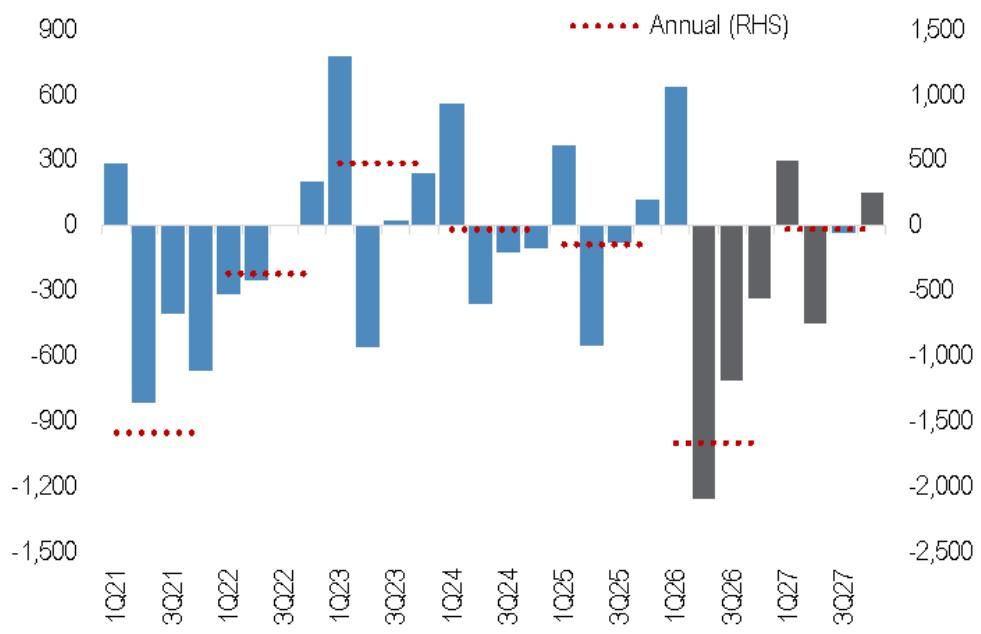

bar-line hybrid chart

| Quarter | Bar Value | Line Value |
|---------|-----------|------------|
| 1Q21    | 300       | -1,000     |
| 2Q21    | -800      | -1,000     |
| 3Q21    | -400      | -1,000     |
| 4Q21    | -600      | -1,000     |
| 1Q22    | -300      | -300       |
| 2Q22    | -200      | -300       |
| 3Q22    | 200       | -300       |
| 4Q22    | 700       | -300       |
| 1Q23    | -600      | 300        |
| 2Q23    | 10        | 300        |
| 3Q23    | 250       | 300        |
| 4Q23    | -350      | -100       |
| 1Q24    | 550       | -100       |
| 2Q24    | -400      | -100       |
| 3Q24    | -250      | -100       |
| 4Q24    | -550      | -100       |
| 1Q25    | 350       | -100       |
| 2Q25    | -650      | -100       |
| 3Q25    | 150       | -100       |
| 4Q25    | 650       | -1,500     |
| 1Q26    | -1,250    | -1,500     |
| 2Q26    | -750      | -1,500     |
| 3Q26    | -350      | -1,500     |
| 4Q26    | 350       | -1,500     |
| 1Q27    | -550      | -1,500     |
| 2Q27    | 450       | -1,500     |
| 3Q27    | 55        | -1,500     |

Source: Company Reports, Government and Industry data, IAI, CRU, JPM Commodities Research

## JPM estimates for Middle East primary aluminum production, quarterly

Thousand mt, annualized

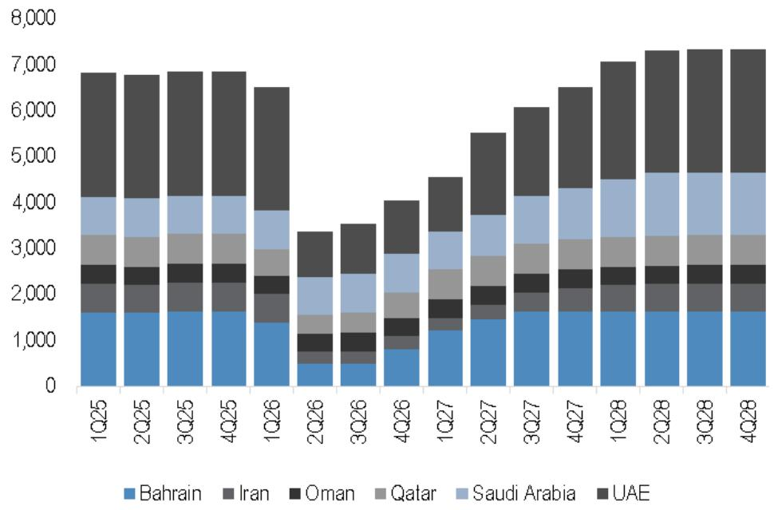

stacked bar chart

| Quarter | Bahrain | Iran | Oman | Qatar | Saudi Arabia | UAE |
|---------|---------|------|------|-------|--------------|-----|
| 1Q25    | 1600    | 700  | 300  | 600   | 900          | 200 |
| 2Q25    | 1600    | 700  | 300  | 600   | 900          | 200 |
| 3Q25    | 1600    | 700  | 300  | 600   | 900          | 200 |
| 4Q25    | 1600    | 700  | 300  | 600   | 900          | 200 |
| 1Q26    | 1400    | 700  | 300  | 600   | 900          | 200 |
| 2Q26    | 500     | 200  | 100  | 400   | 600          | 150 |
| 3Q26    | 500     | 200  | 100  | 400   | 600          | 150 |
| 4Q26    | 800     | 200  | 150  | 450   | 750          | 150 |
| 1Q27    | 1200    | 250  | 250  | 550   | 850          | 150 |
| 2Q27    | 1400    | 350  | 350  | 650   | 1150         | 150 |
| 3Q27    | 1600    | 450  | 450  | 750   | 1450         | 150 |
| 4Q27    | 1650    | 550  | 550  | 850   | 1650         | 150 |
| 1Q28    | 1650    | 650  | 650  | 950   | 1950         | 150 |
| 2Q28    | 1650    | 750  | 750  | 1150  | 2250         | 150 |
| 3Q28    | 1650    | 850  | 850  | 1350  | 2450         | 150 |
| 4Q28    | 1650    | 950  | 950  | 1550  | 2650         | 150 |

Source: Company reports, CRU, JPM Commodities Research

- Even with higher Chinese supply forecasts and a base case that Middle East smelters begin the process of ramping up idled production next quarter, we still forecast a more than 2 mmt aluminum deficit over 2Q26-4Q26. For now, this supply gap is being bridged first by a draw in “invisible” inventories (producer/trader/consumer stocks). Yet these hidden stocks are also now depleting, with industry feedback suggesting only \~2 more months of drawdown coverage. With our balances showing a primary aluminum deficit of nearly 1 mmt that still needs to be covered in 2H26, the deficit should increasingly transmit into draws in visible inventory, which are heavily concentrated (75%) in China.  
- The sharp deficit in aluminum is taking time to transmit through the supply chain, a process that will continue even after the Strait reopens. We are in the middle innings and still think aluminum prices are biased higher in the coming quarters. We still expect an ultimate push towards \$4,000/mt and now see aluminum prices averaging \$3,750/mt over 2H26.

Total US agriculture exports \$ billion  
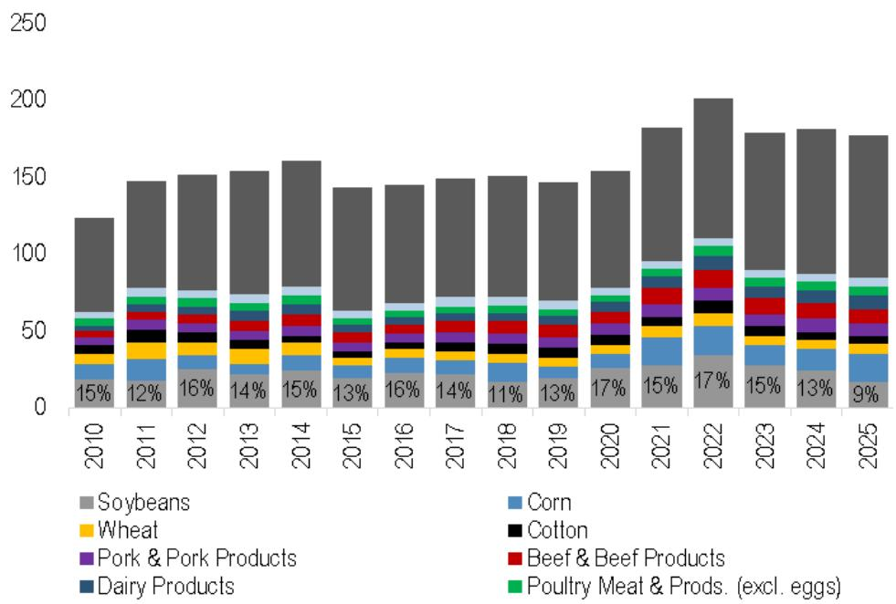

stacked bar chart

| Year | Soybeans (%) | Wheat (%) | Pork & Pork Products (%) | Dairy Products (%) | Corn (%) | Cotton (%) | Beef & Beef Products (%) | Poultry Meat & Prods. (excl. eggs) (%) |
|---|---|---|---|---|---|---|---|---|
| 2010 | 12 | 1 | 3 | 4 | 15 | 7 | 6 | 8 |
| 2011 | 14.5 | 12 | 4 | 5 | 16 | 8 | 7 | 9 |
| 2012 | 15.5 | 13 | 4.5 | 4.5 | 16 | 8 | 7 | 9 |
| 2013 | 15.5 | 14 | 5 | 5 | 16 | 8 | 7 | 9 |
| 2014 | 16.5 | 15 | 5.5 | 6 | 16 | 8 | 7 | 9 |
| 2015 | 14.5 | 13 | 5.5 | 4.5 | 13 | 7 | 7 | 8 |
| 2016 | 14.5 | 16 | 5.5 | 4.5 | 13 | 7 | 7 | 9 |
| 2017 | 14.8 | 14 | 6 | 5.5 | 13 | 7 | 7 | 9 |
| 2018 | 14.8 | 11 | 6.5 | 5.5 | 13 | 7 | 7 | 9 |
| 2019 | 14.5 | 13 | 6.5 | 5.5 | 13 | 7 | 7 | 9 |
| 2020 | 15.2 | 17 | 6.5 | 6.5 | 13 | 7 | 7 | 9 |
| 2021 | 18.2 | 15 | 8.5 | 7.5 | 13 | 7 | 7 | 9 |
| 2022 | 20.2 | 17 | 9.5 | 8.5 | 13 | 7 | 7 | 9 |
| 2023 | 17.8 | 15 | 8.5 | 8.5 | 13 | 7 | 7 | 9 |
| 2024 | 18.0 | 13 | 8.5 | 8.5 | 13 | 7 | 7 | 9 |
| 2025 | 17.5 | 9 | 8.5 | 8.5 | 13 | 7 | 7 | 9 |
The chart displays the percentage composition of U.S. agricultural exports by commodity type over time, with each year's total summing to a total of approximately $200 million for that year.

Source: USDA, JPM Commodities Research

US agriculture exports to China
\$ billion  
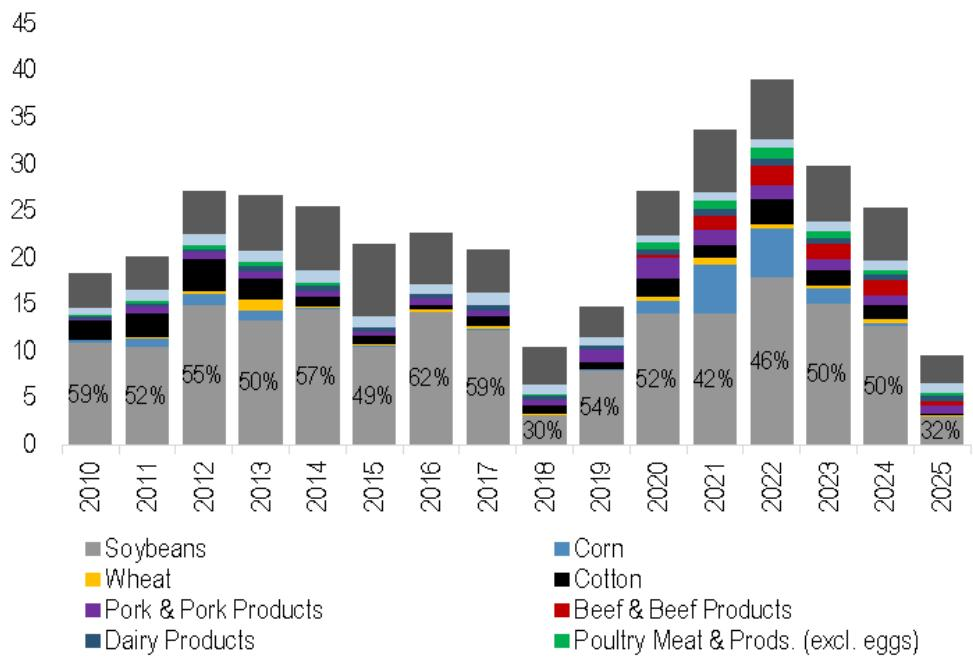

stacked bar chart

| Year | Soybeans | Wheat | Pork & Pork Products | Dairy Products | Corn | Cotton | Beef & Beef Products | Poultry Meat & Prods. (excl. eggs) |
|------|----------|-------|----------------------|-----------------|------|--------|----------------------|------------------------------------|
| 2010 | 59%      | -     | -                    | -               | -    | -      | -                    | -                                  |
| 2011 | 52%      | -     | -                    | -               | -    | -      | -                    | -                                  |
| 2012 | 55%      | -     | -                    | -               | -    | -      | -                    | -                                  |
| 2013 | 50%      | -     | -                    | -               | -    | -      | -                    | -                                  |
| 2014 | 57%      | -     | -                    | -               | -    | -      | -                    | -                                  |
| 2015 | 49%      | -     | -                    | -               | -    | -      | -                    | -                                  |
| 2016 | 62%      | -     | -                    | -               | -    | -      | -                    | -                                  |
| 2017 | 59%      | -     | -                    | -               | -    | -      | -                    | -                                  |
| 2018 | 30%      | -     | -                    | -               | -    | -      | -                    | -                                  |
| 2019 | 54%      | -     | -                    | -               | -    | -      | -                    | -                                  |
| 2020 | 52%      | -     | -                    | -               | -    | -      | -                    | -                                  |
| 2021 | 42%      | -     | -                    | -               | -    | -      | -                    | -                                  |
| 2022 | 46%      | -     | -                    | -               | -    | -      | -                    | -                                  |
| 2023 | 50%      | -     | -                    | -               | -    | -      | -                    | -                                  |
| 2024 | 50%      | -     | -                    | -               | -    | -      | -                    | -                                  |
| 2025 | 32%      | -     | -                    | -               | -    | -      | -                    | -                                  |

Source: USDA, JPM Commodities Research

- As part of the US-China summit held on May 15-16 in Beijing, China has agreed to purchase US agricultural products of at least \$17 billion per year in addition to the already agreed upon purchase commitments (announced November 1, 2025) of 25 million tonnes of soybean purchases per year in 2026-28.  
- The White House fact sheet also mentioned that China renewed export licenses for more than 400 US beef facilities and added new listings. This was further corroborated by the US Meat Export Federation, which confirmed China’s General Administration of Customs (GACC) officially granting a 5-year registration extension to 425 US beef plants and adding 77 additional registrations.  
- Additionally, the fact sheet stated a resumption of imports of poultry from US states that are determined by USDA to be free of pathogenic avian influenza.

<table><tr><td colspan="2"></td><td>Page</td></tr><tr><td>1</td><td>US Rates: Raising year-end forecasts, stay short Treasuries versus bunds</td><td>2</td></tr><tr><td>2</td><td>International Rates: More of the same over 2H: range trade duration, cross market long EUR vs. US</td><td>11</td></tr><tr><td>3</td><td>FX: Central banks take centre stage</td><td>18</td></tr><tr><td>4</td><td>Commodities: Schrödinger&#x27;s Strait</td><td>27</td></tr><tr><td>5</td><td>Emerging Markets: Stay OW EM FX and MW Rates, EM Sovereigns &amp; Corporates</td><td>32</td></tr><tr><td>6</td><td>Appendix</td><td>38</td></tr></table>

1st principle component measure derived from positioning, flow, vol, skew and technical indicators  
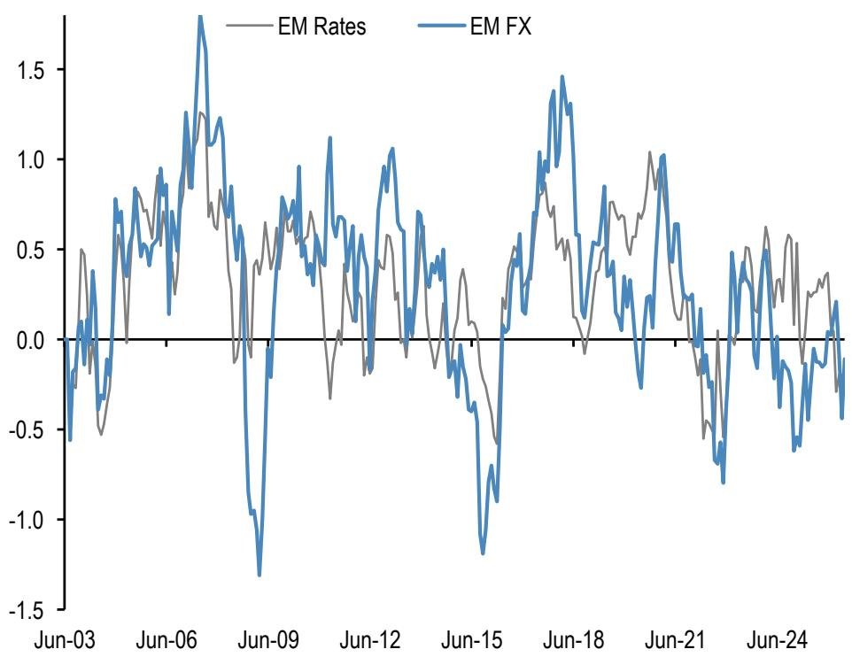

line chart

| Date   | EM Rates | EM FX |
|--------|----------|-------|
| Jun-03 | -0.5     | -0.6  |
| Jun-06 | 0.8      | 1.7   |
| Jun-09 | -0.2     | -1.3  |
| Jun-12 | 0.6      | 1.1   |
| Jun-15 | -0.4     | -1.2  |
| Jun-18 | 0.5      | 1.4   |
| Jun-21 | 0.3      | 0.6   |
| Jun-24 | -0.1     | -0.5  |

Source: JPM, Bloomberg Finance L.P., IIF, EPFR

Divergence in regional performance remains considerable  
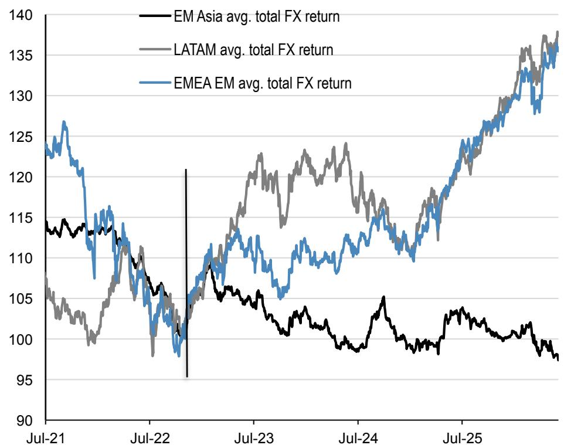

line chart

| Date   | EM Asia avg. total FX return | LATAM avg. total FX return | EMEA EM avg. total FX return |
|--------|------------------------------|----------------------------|------------------------------|
| Jul-21 | 114                          | 106                        | 124                          |
| Jul-22 | 108                          | 103                        | 107                          |
| Jul-23 | 105                          | 120                        | 110                          |
| Jul-24 | 100                          | 115                        | 115                          |
| Jul-25 | 98                           | 130                        | 135                          |

Source: JPM, Bloomberg Finance L.P.

- This is comprised of OWs in Latam (CLP and MXN); OWs in EMEA EM (CZK, HUF, ZAR partially hedged for EURUSD moves via a smaller UW in RSD) and UW in EM Asia (UW THB).  
- Our portfolio remains pro-carry but we also rotate into currencies where central banks are proactively turning hawkish in response to a stronger growth/inflation mix.  
• We remain UW EM Asia, where pressures from the energy shock are most prevalent and where yields are still broadly inadequate to inspire inflows.

## Cross-currents of still large oil volatility, upcoming tightening cycles but better levels and solid fundamentals keep us MW EM Rates

21d rolling correlation between GBI-EM GD yield and 1m fwd Brent crude oil prices, %, using daily changes  
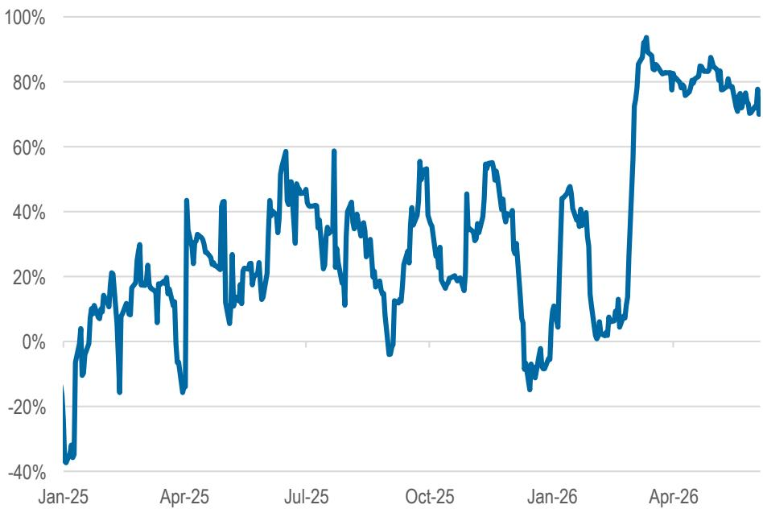

line chart

| Date   | Value |
|--------|-------|
| Jan-25 | -35%  |
| Apr-25 | 45%   |
| Jul-25 | 60%   |
| Oct-25 | 55%   |
| Jan-26 | -15%  |
| Apr-26 | 90%   |

Source: JPM, Bloomberg Finance L.P.

Left axis: simple average cumulative changes in 5y swap yields (PLN, HUF, CZK, ILS, ZAR, MXN, CLP, INR, KRW, MYR, THB, SGD) from the start of each historical episode and current episode, bp. Bottom axis: business days since start of episode  
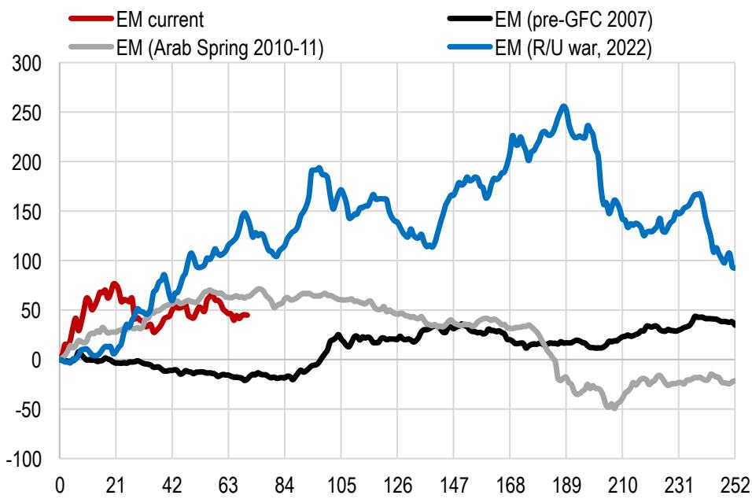

line chart

| Time | EM current | EM (pre-GFC 2007) | EM (Arab Spring 2010-11) | EM (R/U war, 2022) |
|------|------------|-------------------|--------------------------|--------------------|
| 0    | 0          | 0                 | 0                        | 0                  |
| 21   | 70         | 0                 | 30                       | 40                 |
| 42   | 50         | -10               | 60                       | 80                 |
| 63   | 40         | -15               | 70                       | 150                |
| 84   | 30         | -20               | 65                       | 190                |
| 105  | 25         | -15               | 60                       | 160                |
| 126  | 20         | -10               | 55                       | 140                |
| 147  | 15         | -5                | 50                       | 180                |
| 168  | 10         | 0                 | 45                       | 220                |
| 189  | 5          | 5                 | -50                      | 250                |
| 210  | 0          | 10                | -60                      | 150                |
| 231  | -5         | 20                | -40                      | 170                |
| 252  | -10        | 30                | -30                      | 100                |

Source: JPM, Bloomberg Finance L.P.

- Rolling correlations of GBI-EM yields to oil prices are still very elevated, albeit off the highs. Accordingly, given the potentially large range of oil price outcomes, it is hard to take a strong directional EM rates view. If oil prices fall sharply on conflict resolution, it is a rather obvious conclusion that EM rates will move sharply lower as an initial reaction.  
- Our portfolio OWs are largely idiosyncratically driven (Hungary, Colombia, Mexico), balanced by UWs in Chile, Peru and Thailand.  
- With higher-for-longer oil prices and resilient EM growth, we view EM rates through the reflationary lens into 2H26. We believe the most comparable periods for EM rates into 2H26 are pre-GFC (2005-07), post-GFC (2010-11) and post-QE (2016-19), where EM growth was recovering but inflationary pressures were not extreme and EM FX was not under pressure.

GBI-EM Model Portfolio and YTD performance  
GBI-EM Model Portfolio and YTD Performance

<table><tr><td colspan="4">Portfolio Attribution YTD (bp)</td><td colspan="4">Portfolio Positions</td></tr><tr><td></td><td>Bonds</td><td>FX</td><td>Total</td><td></td><td>Bond CTD</td><td>Bond Weight</td><td>FX Weight</td></tr><tr><td>Country positions</td><td>+35</td><td>+31</td><td>+66</td><td>Country positions</td><td>0.075</td><td>3.02%</td><td>2.25%</td></tr><tr><td>Overlay contribution</td><td>+1</td><td>-6</td><td>-6</td><td>Overlay position</td><td>-0.075</td><td>-1.96%</td><td>-</td></tr><tr><td>Final portfolio</td><td>+36</td><td>+24</td><td>+60</td><td>Final portfolio</td><td>0.000</td><td>1.05%</td><td>2.25%</td></tr></table>

<table><tr><td>Annualized TEV (bp)</td><td>+46</td><td>Annualized vol of final portfolio active positions (inc. overlays)</td></tr><tr><td>1-month VaR (bp)</td><td>-23</td><td>Portfolio excess return at the 5th percentile over 1-month period. Historical VaR is -21bp</td></tr></table>

<table><tr><td></td><td colspan="2">Final positions</td><td colspan="3">Country positions</td><td colspan="3">YTD excess returns (country positions, bp)</td></tr><tr><td></td><td>Bond View</td><td>FX View</td><td>Bond CTD</td><td>Bond Weight</td><td>FX Weight</td><td>Bonds</td><td>FX</td><td>Total</td></tr><tr><td>GBI-EM</td><td>MW</td><td>OW</td><td>0.075</td><td>+3.02%</td><td>+2.25%</td><td>+35</td><td>+31</td><td>+66</td></tr><tr><td>EM Asia</td><td>UW</td><td>UW</td><td>(0.100)</td><td>-1.65%</td><td>-1.00%</td><td>-0</td><td>+6</td><td>+6</td></tr><tr><td>EMEA EM</td><td>OW</td><td>OW</td><td>0.150</td><td>+3.63%</td><td>+1.50%</td><td>+34</td><td>+15</td><td>+49</td></tr><tr><td>Latin America</td><td>MW</td><td>OW</td><td>0.025</td><td>+1.46%</td><td>+1.75%</td><td>+2</td><td>+10</td><td>+11</td></tr><tr><td>China</td><td>MW</td><td>MW</td><td>-</td><td>-</td><td>-</td><td>-</td><td>-</td><td>-</td></tr><tr><td>India</td><td>MW</td><td>MW</td><td>-</td><td>-</td><td>-</td><td>-</td><td>+0</td><td>+0</td></tr><tr><td>Indonesia</td><td>MW</td><td>MW</td><td>-</td><td>-</td><td>-</td><td>-</td><td>-</td><td>-</td></tr><tr><td>Malaysia*</td><td>MW</td><td>MW</td><td>-</td><td>-</td><td>-</td><td>-</td><td>+0</td><td>+0</td></tr><tr><td>Thailand</td><td>UW</td><td>UW</td><td>(0.100)</td><td>-1.65%</td><td>-1.00%</td><td>-0</td><td>+6</td><td>+5</td></tr><tr><td>Czech Republic</td><td>MW</td><td>OW</td><td>-</td><td>-</td><td>+0.75%</td><td>-</td><td>-1</td><td>-1</td></tr><tr><td>Hungary</td><td>OW</td><td>OW</td><td>0.150</td><td>+3.63%</td><td>+1.50%</td><td>+21</td><td>+16</td><td>+38</td></tr><tr><td>Poland</td><td>MW</td><td>MW</td><td>-</td><td>-</td><td>-</td><td>-4</td><td>-6</td><td>-10</td></tr><tr><td>Romania</td><td>MW</td><td>MW</td><td>-</td><td>-</td><td>-</td><td>+7</td><td>-1</td><td>+6</td></tr><tr><td>Turkey</td><td>MW</td><td>MW</td><td>-</td><td>-</td><td>-</td><td>-</td><td>+5</td><td>+5</td></tr><tr><td>Serbia</td><td>MW</td><td>UW</td><td>-</td><td>-</td><td>-1.25%</td><td>-</td><td>+1</td><td>+1</td></tr><tr><td>South Africa</td><td>MW</td><td>OW</td><td>-</td><td>-</td><td>+0.50%</td><td>+9</td><td>+0</td><td>+9</td></tr><tr><td>Brazil</td><td>MW</td><td>MW</td><td>-</td><td>-</td><td>-</td><td>-8</td><td>+0</td><td>-8</td></tr><tr><td>Chile</td><td>UW</td><td>OW</td><td>(0.075)</td><td>-1.48%</td><td>+0.50%</td><td>+1</td><td>+1</td><td>+2</td></tr><tr><td>Colombia</td><td>OW</td><td>MW</td><td>0.100</td><td>+2.38%</td><td>-</td><td>+1</td><td>-</td><td>+1</td></tr><tr><td>Dominican Republic</td><td>MW</td><td>MW</td><td>-</td><td>-</td><td>-</td><td>+4</td><td>+6</td><td>+10</td></tr><tr><td>Mexico</td><td>OW</td><td>OW</td><td>0.100</td><td>+2.07%</td><td>+1.00%</td><td>+1</td><td>+4</td><td>+5</td></tr><tr><td>Peru</td><td>UW</td><td>MW</td><td>(0.125)</td><td>-1.94%</td><td>-</td><td>+3</td><td>-2</td><td>+1</td></tr><tr><td>Uruguay</td><td>MW</td><td>MW</td><td>-</td><td>-</td><td>-</td><td>-</td><td>-</td><td>-</td></tr><tr><td>Paraguay</td><td>OW</td><td>OW</td><td>0.025</td><td>+0.43%</td><td>+0.25%</td><td>+0</td><td>+0</td><td>+0</td></tr></table>

\*FX carry returns calculated using T-Bills (up to 3m)  
Source: JPM; YTD statistics as of 05-Jun-26 COB. \*FX returns calculated using Malaysia T-bills (up to 3m).

## EM credit spreads will hold tight levels and could even grind tighter unless there is a concern of a growth shock; Stay MW

In 2006-7, EM sovereigns (ex CCC) were even tighter for a wider level of JULI STW (bp)  
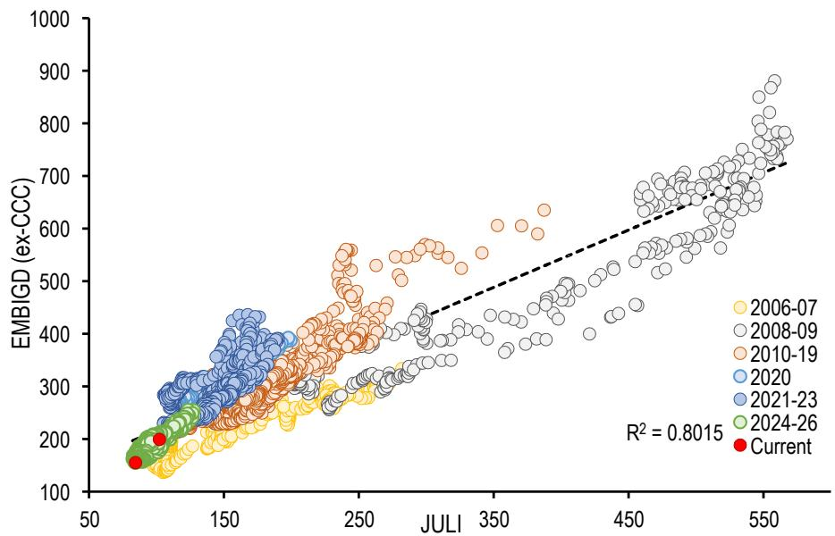

scatterplot

| JULI | EMBIGD (ex-CCC) | Period     |
|------|-----------------|------------|
| 50   | 150             | Current    |
| 100  | 200             | 2024-26    |
| 150  | 300             | 2021-23    |
| 200  | 400             | 2020       |
| 250  | 500             | 2008-09    |
| 300  | 600             | 2010-19    |
| 350  | 700             | 2006-07    |
| 400  | 800             | —          |
| 450  | 900             | —          |
| 500  | 1000            | —          |

Note: VENZ – spread chg to date: -2744, to peak sell off: -1994.  
Source: JPM.

EM corporate sensitivity to rates by region with local funding and external vulnerability assessment

<table><tr><td rowspan="2"></td><td colspan="6">CEMBI sensitivity to rates</td></tr><tr><td>Average life</td><td>Duration</td><td colspan="2">YTW Note</td><td>Local funding</td><td>External vulnerability</td></tr><tr><td>Asia</td><td>5.6</td><td>3.7</td><td>5.5</td><td>Overall short duration</td><td>Low but rising rates, abundant local liquidity</td><td>Low due to strong current accounts and FX reserves</td></tr><tr><td>Asia IG</td><td>5.9</td><td>4.0</td><td>5.0</td><td>Short for IG</td><td>Very strong local investor support</td><td>Strong current account surplus with high ratings</td></tr><tr><td>Asia HY</td><td>4.5</td><td>2.9</td><td>7.6</td><td>Very short duration, high yield</td><td></td><td>Smaller surpluses and some external concerns</td></tr><tr><td>Latin America</td><td>7.7</td><td>4.7</td><td>6.8</td><td>Longest region</td><td rowspan="3">Rates on the higher side, especially Brazil. Local funding markets still in development phase</td><td rowspan="3">Medium risk, but commodity cycle provides some offsets</td></tr><tr><td>Latin America IG</td><td>9.6</td><td>6.0</td><td>5.7</td><td>Longest segment</td></tr><tr><td>Latin America HY</td><td>6.4</td><td>3.9</td><td>7.8</td><td>Long for HY</td></tr><tr><td>Middle East</td><td>6.3</td><td>4.2</td><td>5.8</td><td>Average</td><td rowspan="3">Strong local investor support, but hard currency liquidity dependent on oil exports</td><td rowspan="3">Low due to pegged currencies, but geopolitics a variable</td></tr><tr><td>Middle East IG</td><td>6.7</td><td>4.5</td><td>5.4</td><td></td></tr><tr><td>Middle East HY</td><td>5.0</td><td>3.3</td><td>7.5</td><td></td></tr><tr><td>EM Europe</td><td>5.1</td><td>3.5</td><td>7.2</td><td>Short with high yield</td><td>Mixed, EUR funding an option</td><td>Mixed, watch Turkey</td></tr><tr><td>Africa</td><td>7.5</td><td>4.3</td><td>6.3</td><td>Average</td><td></td><td>High</td></tr></table>

Source: JPM.

- EM credit spreads will hold tight levels and could even grind tighter unless there is a concern of a growth shock. EM credit spreads are historically tight, and the risks ahead seem asymmetric for marginal additional tightening vs potentially significant widening. That said, credit spread product is broadly tight across different asset classes. If we compare the EMBIGD (ex CCC) vs the historically tight levels for US IG credit, we can see back in 2006-07 period, EM sovereigns were even tighter for a wider level of JULI.  
• We believe that EM corporates should be less exposed to the negative repercussions from higher rates compared to history as well as other EM asset classes.  
- There are three broad channels through which higher rates can affect the fundamentals of EM corporates - direct impact on funding costs in both hard and local currency, external vulnerability concerns on a country level if there is perceived weakness in the balance of payments with currency volatility, and ultimately fears of global recession risk.

<table><tr><td colspan="8">Portfolio Returns YTD</td><td colspan="5">Portfolio Attribution YTD</td></tr><tr><td colspan="5">Benchmark return</td><td colspan="3">2.81%</td><td colspan="4">Market position return (bp):</td><td>4</td></tr><tr><td colspan="5">Portfolio return</td><td colspan="3">3.24%</td><td colspan="4">Credit selection return (bp):</td><td>39</td></tr><tr><td colspan="5">Portfolio Performance (bp)</td><td colspan="3">43</td><td colspan="4">Portfolio Outperformance (bp):</td><td>43</td></tr><tr><td colspan="5">Portfolio return -12 months-</td><td colspan="3">13.4%</td><td colspan="5"></td></tr><tr><td colspan="5">Benchmark return -12 months-</td><td colspan="3">12.2%</td><td colspan="5"></td></tr><tr><td colspan="2"></td><td colspan="3">As of June 12, 2026</td><td colspan="3">Since Initiation</td><td colspan="5">YTD Changes &amp; Returns</td></tr><tr><td>Credit selection returns</td><td>View</td><td>Current Position</td><td>Spread</td><td>Duration</td><td>Initiation Date</td><td>Spread Chg vs EMBIG (bp)</td><td>Spread Chg (bp)</td><td>Spread Chg vs EMBIG (bp)</td><td>Spread Returns (bp)</td><td>Carry Returns (bp)</td><td>Credit Returns (bp)</td><td></td></tr><tr><td>Argentina</td><td>OW</td><td>1.0%</td><td>435</td><td>4.4</td><td>3-Oct-24</td><td>(716)</td><td>(125)</td><td>(105)</td><td>4</td><td>2</td><td>5</td><td></td></tr><tr><td>Colombia</td><td>OW</td><td>1.0%</td><td>189</td><td>6.2</td><td>8-Jun-26</td><td>(10)</td><td>(10)</td><td>(10)</td><td>1</td><td>(0)</td><td>0</td><td></td></tr><tr><td>Ecuador</td><td>OW</td><td>1.0%</td><td>386</td><td>5.6</td><td>25-Nov-25</td><td>(206)</td><td>(106)</td><td>(86)</td><td>7</td><td>1</td><td>8</td><td></td></tr><tr><td>Egypt</td><td>OW</td><td>1.0%</td><td>356</td><td>5.7</td><td>8-Apr-26</td><td>(54)</td><td>(105)</td><td>(54)</td><td>2</td><td>0</td><td>2</td><td></td></tr><tr><td>Saudi Arabia</td><td>OW</td><td>1.0%</td><td>81</td><td>6.3</td><td>8-May-26</td><td>0</td><td>(2)</td><td>0</td><td>2</td><td>0</td><td>(0)</td><td></td></tr><tr><td>South Africa</td><td>OW</td><td>1.0%</td><td>193</td><td>8.0</td><td>28-May-26</td><td>(6)</td><td>(10)</td><td>(6)</td><td>0</td><td>(0)</td><td>0</td><td></td></tr><tr><td>Trinidad and Tobago</td><td>OW</td><td>1.0%</td><td>148</td><td>5.5</td><td>27-Apr-26</td><td>(21)</td><td>(33)</td><td>(21)</td><td>1</td><td>(0)</td><td>0</td><td></td></tr><tr><td>Brazil</td><td>UW</td><td>-1.0%</td><td>182</td><td>6.8</td><td>8-Jun-26</td><td>10</td><td>10</td><td>10</td><td>1</td><td>0</td><td>1</td><td></td></tr><tr><td>Honduras</td><td>UW</td><td>-0.3%</td><td>176</td><td>3.7</td><td>6-Mar-26</td><td>(2)</td><td>(23)</td><td>(2)</td><td>0</td><td>0</td><td>0</td><td></td></tr><tr><td>Indonesia</td><td>UW</td><td>-0.8%</td><td>76</td><td>7.1</td><td>29-Oct-24</td><td>114</td><td>17</td><td>37</td><td>5</td><td>1</td><td>6</td><td></td></tr><tr><td>Nigeria</td><td>UW</td><td>-1.0%</td><td>264</td><td>5.8</td><td>28-May-26</td><td>0</td><td>(4)</td><td>0</td><td>2</td><td>0</td><td>0</td><td></td></tr><tr><td>Oman</td><td>UW</td><td>-1.0%</td><td>87</td><td>5.7</td><td>8-May-26</td><td>8</td><td>6</td><td>8</td><td>1</td><td>0</td><td>1</td><td></td></tr><tr><td>Philippines</td><td>UW</td><td>-0.8%</td><td>70</td><td>7.4</td><td>24-Apr-26</td><td>7</td><td>(2)</td><td>7</td><td>2</td><td>1</td><td>1</td><td></td></tr><tr><td>Poland</td><td>UW</td><td>-0.8%</td><td>87</td><td>7.6</td><td>8-Apr-26</td><td>38</td><td>(13)</td><td>38</td><td>3</td><td>1</td><td>4</td><td></td></tr><tr><td>Sri Lanka</td><td>UW</td><td>-0.8%</td><td>171</td><td>5.8</td><td>21-May-26</td><td>(59)</td><td>(69)</td><td>(59)</td><td>2</td><td>-</td><td>(3)</td><td></td></tr><tr><td>Uruguay</td><td>UW</td><td>-0.8%</td><td>61</td><td>9.1</td><td>18-Feb-26</td><td>(2)</td><td>(12)</td><td>(2)</td><td>0</td><td>1</td><td>1</td><td></td></tr><tr><td colspan="2">Closed position return (bp):</td><td colspan="5">11.7</td><td colspan="5">Current Credit selection return(bp)</td><td>28</td></tr></table>

Source: JPM

<table><tr><td colspan="2"></td><td>Page</td></tr><tr><td>1</td><td>US Rates: Raising year-end forecasts, stay short Treasuries versus bunds</td><td>2</td></tr><tr><td>2</td><td>International Rates: More of the same over 2H: range trade duration, cross market long EUR vs. US</td><td>11</td></tr><tr><td>3</td><td>FX: Central banks take centre stage</td><td>18</td></tr><tr><td>4</td><td>Commodities: Schrödinger&#x27;s Strait</td><td>27</td></tr><tr><td>5</td><td>Emerging Markets: Stay OW EM FX and MW Rates, EM Sovereigns &amp; Corporates</td><td>32</td></tr><tr><td>6</td><td>Appendix</td><td>38</td></tr></table>

<table><tr><td rowspan="3"></td><td colspan="3">Real GDP</td><td colspan="6">Real GDP</td><td colspan="4">Consumer prices</td></tr><tr><td colspan="3">% over a year ago</td><td colspan="6">% over previous period, saar</td><td colspan="4">% over a year ago</td></tr><tr><td>2025</td><td>2026</td><td>2027</td><td>4Q25</td><td>1Q26</td><td>2Q26</td><td>3Q26</td><td>4Q26</td><td>1Q27</td><td>4Q25</td><td>2Q26</td><td>4Q26</td><td>2Q27</td></tr><tr><td>United States</td><td>2.1</td><td>2.0</td><td>2.0</td><td>0.5</td><td>1.6</td><td>2.5</td><td>1.5</td><td>1.8</td><td>2.3</td><td>2.7</td><td>3.9 ↓</td><td>3.8 ↓</td><td>2.1 ↑</td></tr><tr><td>Canada</td><td>1.9</td><td>0.4</td><td>1.5</td><td>-1.0</td><td>-0.1</td><td>1.0</td><td>1.4</td><td>1.4</td><td>1.7</td><td>2.2</td><td>2.8</td><td>2.2</td><td>1.4</td></tr><tr><td>Latin America</td><td>2.1</td><td>1.8</td><td>2.0</td><td>2.1</td><td>1.3</td><td>3.1</td><td>2.1</td><td>1.6</td><td>1.8</td><td>3.9</td><td>4.5</td><td>4.6</td><td>3.6</td></tr><tr><td>Argentina</td><td>4.4</td><td>3.2</td><td>3.2</td><td>2.5</td><td>1.3</td><td>5.5</td><td>4.0</td><td>3.0</td><td>2.8</td><td>31.8</td><td>32.8</td><td>29.4</td><td>20.5</td></tr><tr><td>Brazil</td><td>2.3</td><td>1.8</td><td>1.6</td><td>1.0</td><td>4.5</td><td>2.0</td><td>0.8</td><td>0.4</td><td>1.6</td><td>4.5</td><td>4.6</td><td>4.8</td><td>3.6</td></tr><tr><td>Chile</td><td>2.5</td><td>1.6</td><td>3.6</td><td>2.1</td><td>-1.1</td><td>4.5</td><td>4.1</td><td>3.5</td><td>1.5</td><td>3.4</td><td>4.4</td><td>3.8</td><td>2.8</td></tr><tr><td>Colombia</td><td>2.6</td><td>2.6</td><td>1.5</td><td>0.1</td><td>2.4</td><td>2.5</td><td>1.5</td><td>0.5</td><td>1.5</td><td>5.3</td><td>5.8</td><td>6.2</td><td>5.9</td></tr><tr><td>Ecuador</td><td>3.7</td><td>3.0</td><td>2.0</td><td>12.7</td><td>4.5</td><td>0.3</td><td>1.0</td><td>2.0</td><td>3.0</td><td>1.4</td><td>1.9</td><td>2.2</td><td>1.5</td></tr><tr><td>Mexico</td><td>0.5</td><td>1.0</td><td>1.7</td><td>2.9</td><td>-2.4</td><td>3.3</td><td>2.5</td><td>2.0</td><td>1.6</td><td>3.7</td><td>4.3</td><td>4.3</td><td>3.6</td></tr><tr><td>Peru</td><td>3.4</td><td>2.8</td><td>3.0</td><td>2.2</td><td>2.4</td><td>5.0</td><td>4.0</td><td>4.0</td><td>2.0</td><td>1.4</td><td>4.2</td><td>4.2</td><td>2.8</td></tr><tr><td>Uruguay</td><td>1.8</td><td>0.8</td><td>1.6</td><td>0.5</td><td>-0.6</td><td>2.0</td><td>3.2</td><td>1.0</td><td>1.3</td><td>4.0</td><td>3.1</td><td>4.3</td><td>5.1</td></tr><tr><td>Asia/Pacific</td><td>4.5</td><td>4.3 ↑</td><td>3.6</td><td>5.1</td><td>5.9</td><td>3.4 ↑</td><td>3.1 ↑</td><td>3.2 ↑</td><td>3.9 ↓</td><td>1.2</td><td>2.1</td><td>2.3</td><td>2.1 ↑</td></tr><tr><td>Japan</td><td>1.1</td><td>0.6 ↓</td><td>0.7</td><td>0.7 ↓</td><td>1.8 ↓</td><td>0.2</td><td>1.0</td><td>0.8</td><td>0.8</td><td>2.7</td><td>1.4</td><td>3.1</td><td>3.7</td></tr><tr><td>Australia</td><td>2.0</td><td>2.0</td><td>1.8</td><td>3.5</td><td>1.1</td><td>1.6</td><td>1.5</td><td>1.9</td><td>1.5</td><td>3.6</td><td>4.9</td><td>4.6</td><td>3.4</td></tr><tr><td>New Zealand</td><td>0.2</td><td>1.9</td><td>2.3</td><td>1.0</td><td>3.3</td><td>1.2</td><td>3.4</td><td>1.2</td><td>4.0</td><td>3.1</td><td>4.0</td><td>3.7</td><td>2.5</td></tr><tr><td>EM Asia</td><td>5.2 ↑</td><td>4.9</td><td>4.2 ↑</td><td>5.8</td><td>6.7</td><td>3.9 ↑</td><td>3.5 ↑</td><td>3.6 ↑</td><td>4.5 ↓</td><td>0.9</td><td>1.9 ↓</td><td>2.1</td><td>1.7</td></tr><tr><td>China</td><td>5.0</td><td>4.7</td><td>3.9</td><td>5.2</td><td>6.7</td><td>4.0</td><td>3.2</td><td>3.2</td><td>4.5</td><td>0.6</td><td>1.2</td><td>0.9</td><td>0.7</td></tr><tr><td>India</td><td>7.7</td><td>6.5</td><td>6.3</td><td>7.5</td><td>8.0</td><td>5.1</td><td>5.0</td><td>6.2</td><td>6.3</td><td>0.8</td><td>4.1</td><td>5.6</td><td>5.5</td></tr><tr><td>Ex China/India</td><td>4.0</td><td>4.7 ↑</td><td>3.6 ↑</td><td>6.6 ↑</td><td>6.0 ↑</td><td>3.0 ↑</td><td>3.4 ↑</td><td>3.3 ↑</td><td>3.6 ↓</td><td>1.8</td><td>2.8 ↓</td><td>3.4</td><td>2.5 ↑</td></tr><tr><td>Hong Kong</td><td>3.6</td><td>3.4</td><td>2.9</td><td>4.3</td><td>12.2</td><td>3.0</td><td>2.8</td><td>2.8</td><td>3.0</td><td>1.3</td><td>1.6</td><td>1.7</td><td>1.6</td></tr><tr><td>Indonesia</td><td>5.1</td><td>4.7</td><td>4.9</td><td>5.7</td><td>5.7</td><td>3.7</td><td>3.3</td><td>3.0</td><td>5.3</td><td>2.8</td><td>2.7</td><td>3.6</td><td>3.0</td></tr><tr><td>Korea</td><td>1.1 ↑</td><td>3.7 ↑</td><td>2.7 ↑</td><td>-0.4 ↑</td><td>7.5 ↑</td><td>2.0 ↑</td><td>4.0 ↑</td><td>3.0 ↑</td><td>2.5 ↓</td><td>2.4</td><td>3.0</td><td>3.5 ↑</td><td>2.6 ↑</td></tr><tr><td>Malaysia</td><td>5.2</td><td>4.6</td><td>4.1</td><td>5.9</td><td>1.7</td><td>5.0</td><td>4.5</td><td>4.0</td><td>4.0</td><td>1.4</td><td>2.0</td><td>2.1</td><td>1.8</td></tr><tr><td>Philippines</td><td>4.4</td><td>4.0</td><td>5.6</td><td>2.4</td><td>3.8</td><td>4.9</td><td>5.7</td><td>8.2</td><td>4.1</td><td>1.7</td><td>6.9 ↓</td><td>8.1 ↓</td><td>4.9 ↑</td></tr><tr><td>Singapore</td><td>5.0</td><td>4.3</td><td>2.7</td><td>5.2</td><td>3.9</td><td>3.0</td><td>2.0</td><td>2.0</td><td>3.0</td><td>1.2</td><td>1.9</td><td>2.4</td><td>2.0</td></tr><tr><td>Taiwan</td><td>8.8</td><td>9.9 ↑</td><td>3.7</td><td>28.7</td><td>6.9</td><td>4.5 ↑</td><td>3.2 ↓</td><td>3.2 ↓</td><td>4.0</td><td>1.3</td><td>2.1 ↓</td><td>2.2</td><td>1.7 ↑</td></tr><tr><td>Thailand</td><td>2.4</td><td>2.1</td><td>2.5</td><td>7.6</td><td>2.7</td><td>-1.1</td><td>1.2</td><td>2.0</td><td>3.2</td><td>-0.5</td><td>2.8</td><td>3.9</td><td>1.4</td></tr><tr><td>Western Europe</td><td>1.5</td><td>0.5</td><td>1.2</td><td>0.7</td><td>-0.3</td><td>0.5</td><td>1.0</td><td>1.2</td><td>1.3</td><td>2.3</td><td>3.0</td><td>3.2 ↓</td><td>2.2</td></tr><tr><td>Euro area</td><td>1.5</td><td>0.3</td><td>1.2</td><td>0.7</td><td>-0.9</td><td>0.3</td><td>1.0</td><td>1.3</td><td>1.3</td><td>2.1</td><td>3.1</td><td>3.2</td><td>2.0</td></tr><tr><td>Germany</td><td>0.3</td><td>0.8</td><td>1.4</td><td>1.0</td><td>1.4</td><td>0.3</td><td>1.3</td><td>1.5</td><td>1.5</td><td>2.3</td><td>2.8</td><td>2.6</td><td>2.0</td></tr><tr><td>France</td><td>0.9</td><td>0.5</td><td>1.0</td><td>0.8</td><td>-0.4</td><td>0.0</td><td>0.5</td><td>1.0</td><td>1.0</td><td>0.8</td><td>2.7</td><td>2.9</td><td>1.6</td></tr><tr><td>Italy</td><td>0.7</td><td>0.6</td><td>0.5</td><td>1.2</td><td>1.1</td><td>-0.3</td><td>0.3</td><td>0.5</td><td>0.5</td><td>1.2</td><td>3.1</td><td>4.0</td><td>1.7</td></tr><tr><td>Spain</td><td>2.8</td><td>2.2</td><td>1.6</td><td>3.1</td><td>2.5</td><td>1.5</td><td>1.5</td><td>1.5</td><td>1.5</td><td>3.1</td><td>3.6</td><td>3.3</td><td>2.6</td></tr><tr><td>Norway</td><td>1.7</td><td>1.0 ↓</td><td>1.6 ↓</td><td>0.6</td><td>0.6</td><td>1.4 ↓</td><td>1.8</td><td>1.8</td><td>1.8</td><td>3.1</td><td>3.3</td><td>3.7</td><td>2.6</td></tr><tr><td>Sweden</td><td>1.7</td><td>2.1</td><td>2.0</td><td>3.4</td><td>-0.6</td><td>4.0</td><td>2.0</td><td>2.3</td><td>2.0</td><td>0.5</td><td>0.3 ↓</td><td>0.9 ↓</td><td>2.0 ↑</td></tr><tr><td>United Kingdom</td><td>1.4</td><td>1.2</td><td>1.0</td><td>0.6</td><td>2.5</td><td>1.0</td><td>0.5</td><td>1.0</td><td>1.2</td><td>3.4</td><td>2.9</td><td>3.7</td><td>3.1</td></tr><tr><td>EMEA EM</td><td>2.1</td><td>2.0</td><td>2.9</td><td>2.0</td><td>-0.6 ↑</td><td>4.2</td><td>3.2</td><td>2.8</td><td>2.7</td><td>10.6</td><td>10.5</td><td>9.7 ↓</td><td>8.0 ↓</td></tr><tr><td>Czech Republic</td><td>2.5</td><td>2.1</td><td>2.2</td><td>2.9</td><td>0.6</td><td>2.5</td><td>2.0</td><td>2.5</td><td>2.1</td><td>2.2</td><td>2.2 ↓</td><td>2.4 ↓</td><td>2.2 ↓</td></tr><tr><td>Hungary</td><td>0.4</td><td>1.9</td><td>2.7</td><td>0.7</td><td>3.2</td><td>1.8</td><td>1.9</td><td>2.5</td><td>3.0</td><td>3.8</td><td>1.9 ↓</td><td>3.3 ↓</td><td>4.0 ↓</td></tr><tr><td>Israel</td><td>2.9</td><td>3.7</td><td>4.1</td><td>2.9</td><td>-3.3</td><td>10.0</td><td>5.0</td><td>3.8</td><td>3.5</td><td>2.5</td><td>2.0</td><td>1.9</td><td>1.7</td></tr><tr><td>Poland</td><td>3.6</td><td>3.4</td><td>2.9</td><td>4.1</td><td>2.4</td><td>4.3</td><td>3.3</td><td>3.0</td><td>2.8</td><td>2.6</td><td>3.1 ↓</td><td>3.3 ↓</td><td>3.1 ↓</td></tr><tr><td>Romania</td><td>0.7</td><td>0.0</td><td>3.0</td><td>-7.4 ↑</td><td>0.0 ↑</td><td>3.4</td><td>3.6</td><td>3.2</td><td>2.8</td><td>9.7</td><td>10.7 ↑</td><td>5.7 ↓</td><td>5.0</td></tr><tr><td>Russia</td><td>1.0</td><td>1.0</td><td>1.9</td><td>3.1</td><td>-3.1</td><td>4.3</td><td>2.0</td><td>1.8</td><td>1.5</td><td>6.6</td><td>5.5</td><td>5.3</td><td>4.4</td></tr><tr><td>South Africa</td><td>1.1</td><td>1.1 ↑</td><td>1.4</td><td>1.5</td><td>2.2 ↑</td><td>0.0</td><td>1.5</td><td>1.2</td><td>1.6</td><td>3.6</td><td>4.6</td><td>4.9</td><td>3.3</td></tr><tr><td>Türkiye</td><td>3.6</td><td>3.0</td><td>4.6</td><td>1.5</td><td>0.5</td><td>4.0</td><td>5.5</td><td>4.6</td><td>4.5</td><td>31.6</td><td>32.5</td><td>29.8</td><td>24.3</td></tr><tr><td>Global</td><td>2.8</td><td>2.4</td><td>2.4</td><td>2.3</td><td>2.5</td><td>2.5</td><td>2.1 ↑</td><td>2.2</td><td>2.6</td><td>2.7</td><td>3.5</td><td>3.6</td><td>2.5</td></tr><tr><td>Developed markets</td><td>1.8</td><td>1.3</td><td>1.6</td><td>0.6</td><td>0.9</td><td>1.5</td><td>1.3</td><td>1.5</td><td>1.8</td><td>2.6</td><td>3.4 ↓</td><td>3.5 ↓</td><td>2.2</td></tr><tr><td>Emerging markets</td><td>4.2</td><td>4.0</td><td>3.6</td><td>4.7</td><td>4.8</td><td>3.8 ↑</td><td>3.2 ↑</td><td>3.2 ↑</td><td>3.8 ↓</td><td>2.8</td><td>3.6</td><td>3.6</td><td>2.9</td></tr><tr><td>Emerging ex China</td><td>3.6</td><td>3.5 ↑</td><td>3.4</td><td>4.3</td><td>3.3 ↑</td><td>3.7 ↑</td><td>3.3 ↑</td><td>3.2 ↑</td><td>3.3 ↓</td><td>4.7</td><td>5.7</td><td>5.9</td><td>4.9</td></tr><tr><td>Global — PPP weighted</td><td>3.3</td><td>2.9</td><td>2.9</td><td>3.1</td><td>3.1 ↑</td><td>2.8</td><td>2.4</td><td>2.5</td><td>3.0</td><td>2.9</td><td>3.8</td><td>3.9</td><td>3.0</td></tr></table>

Source: Government agencies and JPM Global Economics. Details on request. Note: For some emerging economies seasonally adjusted GDP data are estimated by JPM. Bold denotes changes from last edition of Global Data Watch, with arrows showing the direction of changes. Underline indicates beginning of JPM forecasts. Unless noted, concurrent nominal GDP weights calculated with current FX rates are used in computing our global and regional aggregates. Regional CPI aggregates exclude Argentina and Ecuador. Source: JPM. Any long-form nomenclature for references to China; Hong Kong; and Taiwan within this research material is Mainland China; Hong Kong SAR (China) and Taiwan (China).

<table><tr><td rowspan="2"></td><td rowspan="2">Official rate</td><td rowspan="2">Current rate (%pa)</td><td colspan="2">4-qtr change (bp)</td><td rowspan="2">Last change</td><td rowspan="2">Next mtg</td><td rowspan="2">Forecast next change</td><td colspan="5">Forecast (%pa)</td></tr><tr><td>Last</td><td>Next</td><td>Jun 26</td><td>Sep 26</td><td>Dec 26</td><td>Mar 27</td><td>Jun 27</td></tr><tr><td>Global</td><td></td><td>3.96</td><td>-54</td><td>-13</td><td></td><td></td><td></td><td>3.96</td><td>3.98</td><td>3.96</td><td>3.91</td><td>3.83</td></tr><tr><td>excluding US</td><td></td><td>4.05</td><td>-42</td><td>-18</td><td></td><td></td><td></td><td>4.06</td><td>4.07</td><td>4.05</td><td>3.98</td><td>3.87</td></tr><tr><td>Developed</td><td></td><td>3.07</td><td>-38</td><td>13</td><td></td><td></td><td></td><td>3.08</td><td>3.17</td><td>3.19</td><td>3.19</td><td>3.19</td></tr><tr><td>Emerging</td><td></td><td>5.28</td><td>-79</td><td>-51</td><td></td><td></td><td></td><td>5.27</td><td>5.16</td><td>5.10</td><td>4.97</td><td>4.78</td></tr><tr><td>Latin America</td><td></td><td>10.07</td><td>-72</td><td>-82</td><td></td><td></td><td></td><td>10.02</td><td>9.82</td><td>9.64</td><td>9.45</td><td>9.25</td></tr><tr><td>EMEA EM</td><td></td><td>14.88</td><td>-409</td><td>-248</td><td></td><td></td><td></td><td>14.71</td><td>14.36</td><td>13.99</td><td>13.22</td><td>12.40</td></tr><tr><td>EM Asia</td><td></td><td>2.31</td><td>-8</td><td>-2</td><td></td><td></td><td></td><td>2.33</td><td>2.30</td><td>2.33</td><td>2.34</td><td>2.29</td></tr><tr><td>The Americas</td><td></td><td>4.53</td><td>-73</td><td>-11</td><td></td><td></td><td></td><td>4.53</td><td>4.50</td><td>4.47</td><td>4.45</td><td>4.42</td></tr><tr><td>United States</td><td>Fed funds</td><td>3.75</td><td>-75</td><td>0</td><td>10 Dec 25 (-25bp)</td><td>17 Jun 26</td><td>Sep 27 (+25bp)</td><td>3.75</td><td>3.75</td><td>3.75</td><td>3.75</td><td>3.75</td></tr><tr><td>Canada</td><td>O/N rate</td><td>2.25</td><td>-50</td><td>0</td><td>29 Oct 25 (-25bp)</td><td>15 Jul 26</td><td>On hold</td><td>2.25</td><td>2.25</td><td>2.25</td><td>2.25</td><td>2.25</td></tr><tr><td>Brazil</td><td>SELIC O/N</td><td>14.50</td><td>-25</td><td>-225</td><td>29 Apr 26 (-25bp)</td><td>17 Jun 26</td><td>Jun 26 (-25bp)</td><td>14.25</td><td>13.75</td><td>13.25</td><td>12.75</td><td>12.25</td></tr><tr><td>Mexico</td><td>Repo rate</td><td>6.50</td><td>-199</td><td>0</td><td>7 May 26 (-25bp)</td><td>25 Jun 26</td><td>On hold</td><td>6.50</td><td>6.50</td><td>6.50</td><td>6.50</td><td>6.50</td></tr><tr><td>Chile</td><td>Disc rate</td><td>4.50</td><td>-50</td><td>75</td><td>16 Dec 25 (-25bp)</td><td>16 Jun 26</td><td>Oct 26 (+25bp)</td><td>4.50</td><td>4.50</td><td>4.75</td><td>5.00</td><td>5.25</td></tr><tr><td>Colombia</td><td>Repo rate</td><td>11.25</td><td>200</td><td>50</td><td>31 Mar 26 (+100bp)</td><td>30 Jun 26</td><td>Jun 26 (+50bp)</td><td>12.00</td><td>12.00</td><td>12.00</td><td>12.00</td><td>11.75</td></tr><tr><td>Peru</td><td>Reference</td><td>4.25</td><td>-25</td><td>100</td><td>11 Sep 25 (-25bp)</td><td>9 Jul 26</td><td>9 Jul 26 (+25bp)</td><td>4.25</td><td>4.50</td><td>4.75</td><td>5.00</td><td>5.25</td></tr><tr><td>Europe/Africa</td><td></td><td>5.38</td><td>-87</td><td>-41</td><td></td><td></td><td></td><td>5.34</td><td>5.45</td><td>5.36</td><td>5.19</td><td>4.96</td></tr><tr><td>Euro area</td><td>Depo rate</td><td>2.25</td><td>25</td><td>25</td><td>6 Jun 26 (+25bp)</td><td>23 Jul 26</td><td>Sep 26 (+25bp)</td><td>2.25</td><td>2.50</td><td>2.50</td><td>2.50</td><td>2.50</td></tr><tr><td>United Kingdom</td><td>Bank rate</td><td>3.75</td><td>-50</td><td>0</td><td>7 Aug 25 (-25bp)</td><td>18 Jun 26</td><td>Jul 26 (+25bp)</td><td>3.75</td><td>4.00</td><td>4.00</td><td>4.00</td><td>3.75</td></tr><tr><td>Norway</td><td>Dep rate</td><td>4.25</td><td>-25</td><td>0</td><td>7 May 26 (+25bp)</td><td>18 Jun 26</td><td>Sep 26 (+25bp)</td><td>4.25</td><td>4.50</td><td>4.50</td><td>4.50</td><td>4.25</td></tr><tr><td>Sweden</td><td>Repo rate</td><td>1.75</td><td>-50</td><td>25</td><td>23 Sep 25 (-25bp)</td><td>17 Jun 26</td><td>Sep 26 (+25bp)</td><td>1.75</td><td>2.00</td><td>2.00</td><td>2.00</td><td>2.00</td></tr><tr><td>Czech Republic</td><td>2-wk repo</td><td>3.50</td><td>0</td><td>50</td><td>7 May 25 (-25bp)</td><td>18 Jun 26</td><td>Jun 26 (+25bp)</td><td>3.75</td><td>4.00</td><td>4.00</td><td>4.00</td><td>4.00</td></tr><tr><td>Hungary</td><td>Base rate</td><td>6.25</td><td>-25</td><td>-100</td><td>24 Feb 26 (-25bp)</td><td>23 Jun 26</td><td>Jun 26 (-25bp)</td><td>6.00</td><td>6.00</td><td>6.00</td><td>5.75</td><td>5.25</td></tr><tr><td>Israel</td><td>Base rate</td><td>3.75</td><td>-75</td><td>-75</td><td>25 May 26 (-25bp)</td><td>6 Jul 26</td><td>Jul 26 (-25bp)</td><td>3.75</td><td>3.25</td><td>3.00</td><td>3.00</td><td>3.00</td></tr><tr><td>Poland</td><td>7-day interv</td><td>3.75</td><td>-150</td><td>0</td><td>4 Mar 26 (-25bp)</td><td>8 Jul 26</td><td>On hold</td><td>3.75</td><td>3.75</td><td>3.75</td><td>3.75</td><td>3.75</td></tr><tr><td>Romania</td><td>Base rate</td><td>6.50</td><td>0</td><td>-25</td><td>7 Aug 24 (-25bp)</td><td>8 Jul 26</td><td>May 27 (-25bp)</td><td>6.50</td><td>6.50</td><td>6.50</td><td>6.50</td><td>6.25</td></tr><tr><td>Russia</td><td>Key pol rate</td><td>14.50</td><td>-550</td><td>-450</td><td>24 Apr 26 (-50bp)</td><td>19 Jun 26</td><td>Jun 26 (-50bp)</td><td>14.00</td><td>13.00</td><td>12.00</td><td>11.00</td><td>10.00</td></tr><tr><td>South Africa</td><td>Repo rate</td><td>7.00</td><td>-25</td><td>0</td><td>28 May 26 (+25bp)</td><td>23 Jul 26</td><td>Jul 26 (+25bp)</td><td>7.00</td><td>7.25</td><td>7.25</td><td>7.25</td><td>7.00</td></tr><tr><td>Türkiye</td><td>1-wk repo</td><td>37.00</td><td>-900</td><td>-400</td><td>22 Jan 26 (-100bp)</td><td>23 Jul 26</td><td>21 Jan 27 (-100bp)</td><td>37.00</td><td>37.00</td><td>37.00</td><td>35.00</td><td>33.00</td></tr><tr><td>Asia/Pacific</td><td></td><td>2.23</td><td>-1</td><td>8</td><td></td><td></td><td></td><td>2.28</td><td>2.26</td><td>2.31</td><td>2.33</td><td>2.32</td></tr><tr><td>Australia</td><td>Cash rate</td><td>4.35</td><td>50</td><td>0</td><td>5 May 26 (+25bp)</td><td>16 Jun 26</td><td>Aug &#x27;27 (-25bp)</td><td>4.35</td><td>4.35</td><td>4.35</td><td>4.35</td><td>4.35</td></tr><tr><td>New Zealand</td><td>Cash rate</td><td>2.25</td><td>-100</td><td>100</td><td>26 Nov 25 (-25bp)</td><td>8 Jul 26</td><td>Jul 26 (+25bp)</td><td>2.25</td><td>2.75</td><td>3.00</td><td>3.25</td><td>3.25</td></tr><tr><td>Japan</td><td>O/N call rate</td><td>0.75</td><td>27</td><td>75</td><td>19 Dec 25 (+25bp)</td><td>16 Jun 26</td><td>Jun 26 (+25bp)</td><td>1.00</td><td>1.00</td><td>1.25</td><td>1.25</td><td>1.50</td></tr><tr><td>Hong Kong</td><td>Disc. wndw</td><td>4.00</td><td>-475</td><td>0</td><td>10 Dec 25 (-25bp)</td><td>-</td><td>Sep 27 (+25bp)</td><td>4.00</td><td>4.00</td><td>4.00</td><td>4.00</td><td>4.00</td></tr><tr><td>China</td><td>7-day rev repo</td><td>1.40</td><td>0</td><td>-20</td><td>7 May 25 (-10bp)</td><td>-</td><td>3Q 26 (-10bp)</td><td>1.40</td><td>1.30</td><td>1.30</td><td>1.30</td><td>1.20</td></tr><tr><td>Korea</td><td>Base rate</td><td>2.50</td><td>0</td><td>100</td><td>29 May 25 (-25bp)</td><td>16 Jul 26</td><td>July 26 (+25bp)</td><td>2.50</td><td>2.75</td><td>3.00</td><td>3.25</td><td>3.50</td></tr><tr><td>Indonesia</td><td>BI RRR</td><td>5.50</td><td>0</td><td>50</td><td>9 June 26 (+25bp)</td><td>18 Jun 26</td><td>Jun 26 (+25bp)</td><td>5.75</td><td>6.00</td><td>6.00</td><td>6.00</td><td>6.00</td></tr><tr><td>India</td><td>Repo  $rate^2$ </td><td>5.25</td><td>-25</td><td>0</td><td>5 Dec 25 (-25bp)</td><td>5 Aug 26</td><td>On hold</td><td>5.25</td><td>5.25</td><td>5.25</td><td>5.25</td><td>5.25</td></tr><tr><td>Malaysia</td><td>O/N rate</td><td>2.75</td><td>-300</td><td>0</td><td>9 Jul 25 (-25bp)</td><td>9 Jul 26</td><td>On hold</td><td>2.75</td><td>2.75</td><td>2.75</td><td>2.75</td><td>2.75</td></tr><tr><td>Philippines</td><td>Rev repo</td><td>4.50</td><td>-100</td><td>150</td><td>23 Apr 26 (+25bp)</td><td>18 Jun 26</td><td>Jun 26 (+50bp)</td><td>5.00</td><td>5.50</td><td>6.00</td><td>6.00</td><td>6.00</td></tr><tr><td>Thailand</td><td>1-day repo</td><td>1.00</td><td>-75</td><td>0</td><td>25 Feb 26 (-25bp)</td><td>24 Jun 26</td><td>On hold</td><td>1.00</td><td>1.00</td><td>1.00</td><td>1.00</td><td>1.00</td></tr><tr><td>Taiwan</td><td>Official disc.</td><td>2.00</td><td>0</td><td>0</td><td>21 Mar 24 (+12.5bp)</td><td>18 Jun 26</td><td>On hold</td><td>2.00</td><td>2.00</td><td>2.00</td><td>2.00</td><td>2.00</td></tr></table>

Source: JPM.  
Bold denotes move since last GDW and forecast changes. Underline denotes policy meeting during upcoming week. Aggregates are GDP-weighted averages.  
Any long-form nomenclature for references to China; Hong Kong; and Taiwan within this research material is Mainland China;  
Hass Koss SAR (China) and Taiwan (China)

<table><tr><td colspan="2"></td><td>12-Jun</td><td>Sep-26</td><td>Dec-26</td><td>Mar-27</td><td>Jun-27</td><td>YTD chg. (bp)</td></tr><tr><td rowspan="9">US</td><td>Fed funds</td><td>3.50-3.75</td><td>3.50-3.75</td><td>3.50-3.75</td><td>3.50-3.75</td><td>3.50-3.75</td><td>-</td></tr><tr><td>SOFR</td><td>3.64</td><td>3.60</td><td>3.60</td><td>3.60</td><td>3.65</td><td>-</td></tr><tr><td>2Y bmk yield</td><td>4.07</td><td>4.15</td><td>4.20</td><td>4.20</td><td>4.30</td><td>62</td></tr><tr><td>5Y bmk yield</td><td>4.19</td><td>4.40</td><td>4.45</td><td>4.50</td><td>4.50</td><td>51</td></tr><tr><td>10Y bmk yield</td><td>4.47</td><td>4.65</td><td>4.70</td><td>4.75</td><td>4.75</td><td>34</td></tr><tr><td>30Y bmk yield</td><td>4.96</td><td>5.10</td><td>5.15</td><td>5.15</td><td>5.15</td><td>15</td></tr><tr><td>2s/10s bmk curve</td><td>40</td><td>50</td><td>50</td><td>55</td><td>45</td><td>-27</td></tr><tr><td>10s/30s bmk curve</td><td>49</td><td>45</td><td>45</td><td>40</td><td>40</td><td>-19</td></tr><tr><td>2s/30s bmk curve</td><td>89</td><td>95</td><td>95</td><td>95</td><td>85</td><td>-46</td></tr></table>

<table><tr><td rowspan="2">Euro area</td><td>Refi rate</td><td>2.40</td><td>2.65</td><td>2.65</td><td>2.65</td><td>2.65</td><td>-</td></tr><tr><td>Depo rate</td><td>2.25</td><td>2.50</td><td>2.50</td><td>2.50</td><td>2.50</td><td>-</td></tr><tr><td></td><td>3M Euribor</td><td>2.38</td><td>2.50</td><td>2.50</td><td>2.50</td><td>2.50</td><td>36</td></tr><tr><td></td><td>2Y bmk yield</td><td>2.62</td><td>2.60</td><td>2.55</td><td>2.45</td><td>2.40</td><td>50</td></tr><tr><td></td><td>5Y bmk yield</td><td>2.72</td><td>2.70</td><td>2.65</td><td>2.60</td><td>2.55</td><td>28</td></tr><tr><td></td><td>10Y bmk yield</td><td>3.00</td><td>2.95</td><td>2.90</td><td>2.85</td><td>2.80</td><td>15</td></tr><tr><td></td><td>30Y bmk yield</td><td>3.55</td><td>3.45</td><td>3.45</td><td>3.40</td><td>3.35</td><td>8</td></tr><tr><td></td><td>2s/10s bmk curve</td><td>38</td><td>35</td><td>35</td><td>40</td><td>40</td><td>-35</td></tr><tr><td></td><td>10s/30s bmk curve</td><td>55</td><td>50</td><td>55</td><td>55</td><td>55</td><td>-7</td></tr><tr><td></td><td>2s/30s bmk curve</td><td>93</td><td>85</td><td>90</td><td>95</td><td>95</td><td>-42</td></tr><tr><td>vs. 6s</td><td>2Y swap spread</td><td>20</td><td>20</td><td>19</td><td>18</td><td>17</td><td>7</td></tr><tr><td></td><td>5Y swap spread</td><td>12</td><td>12</td><td>13</td><td>13</td><td>14</td><td>3</td></tr><tr><td></td><td>10Y swap spread</td><td>3</td><td>2</td><td>4</td><td>6</td><td>7</td><td>-2</td></tr><tr><td></td><td>30Y swap spread</td><td>-35</td><td>-34</td><td>-31</td><td>-29</td><td>-26</td><td>-12</td></tr></table>

<table><tr><td rowspan="10">10Y spread to Germany (curve adj.)</td><td>Austria</td><td>25</td><td>28</td><td>28</td><td>28</td><td>28</td><td>-3</td></tr><tr><td>Belgium</td><td>55</td><td>55</td><td>58</td><td>60</td><td>55</td><td>5</td></tr><tr><td>Finland</td><td>35</td><td>33</td><td>33</td><td>33</td><td>33</td><td>5</td></tr><tr><td>France</td><td>75</td><td>75</td><td>80</td><td>85</td><td>75</td><td>7</td></tr><tr><td>Greece</td><td>69</td><td>70</td><td>70</td><td>70</td><td>70</td><td>9</td></tr><tr><td>Ireland</td><td>18</td><td>15</td><td>15</td><td>15</td><td>15</td><td>-3</td></tr><tr><td>Italy</td><td>78</td><td>85</td><td>85</td><td>80</td><td>80</td><td>11</td></tr><tr><td>Netherlands</td><td>11</td><td>10</td><td>10</td><td>10</td><td>10</td><td>0</td></tr><tr><td>Portugal</td><td>36</td><td>38</td><td>38</td><td>38</td><td>38</td><td>6</td></tr><tr><td>Spain</td><td>48</td><td>45</td><td>45</td><td>45</td><td>45</td><td>7</td></tr><tr><td></td><td>EU</td><td>40</td><td>38</td><td>35</td><td>35</td><td>35</td><td>8</td></tr></table>

<table><tr><td colspan="2"></td><td>12-Jun</td><td>Sep-26</td><td>Dec-26</td><td>Mar-27</td><td>Jun-27</td><td>YTD chg. (bp)</td></tr><tr><td rowspan="8">UK</td><td>Base rate</td><td>3.75</td><td>4.00</td><td>4.00</td><td>4.00</td><td>3.75</td><td>-</td></tr><tr><td>2Y bmk yield</td><td>4.27</td><td>4.25</td><td>4.20</td><td>4.15</td><td>4.10</td><td>51</td></tr><tr><td>5Y bmk yield</td><td>4.40</td><td>4.35</td><td>4.35</td><td>4.35</td><td>4.25</td><td>33</td></tr><tr><td>10Y bmk yield</td><td>4.86</td><td>4.80</td><td>4.80</td><td>4.75</td><td>4.70</td><td>30</td></tr><tr><td>30Y bmk yield</td><td>5.56</td><td>5.45</td><td>5.45</td><td>5.45</td><td>5.40</td><td>36</td></tr><tr><td>2s/10s bmk curve</td><td>59</td><td>55</td><td>60</td><td>60</td><td>60</td><td>-21</td></tr><tr><td>10s/30s bmk curve</td><td>70</td><td>65</td><td>65</td><td>70</td><td>70</td><td>6</td></tr><tr><td>2s/30s bmk curve</td><td>129</td><td>120</td><td>125</td><td>130</td><td>130</td><td>-15</td></tr><tr><td rowspan="4">vs. SONIA</td><td>2Y swap spread</td><td>-10</td><td>-10</td><td>-12</td><td>-15</td><td>-17</td><td>15</td></tr><tr><td>5Y swap spread</td><td>-21</td><td>-22</td><td>-24</td><td>-26</td><td>-26</td><td>18</td></tr><tr><td>10Y swap spread</td><td>-44</td><td>-45</td><td>-47</td><td>-50</td><td>-50</td><td>12</td></tr><tr><td>30Y swap spread</td><td>-69</td><td>-70</td><td>-68</td><td>-65</td><td>-65</td><td>4</td></tr></table>

<table><tr><td>Japan</td><td>Policy rate</td><td>0.75</td><td>1.00</td><td>1.25</td><td>1.25</td><td>1.50</td><td>-</td></tr><tr><td></td><td>2Y bmk yield</td><td>1.42</td><td>1.45</td><td>1.50</td><td>1.50</td><td>1.60</td><td>25</td></tr><tr><td></td><td>5Y bmk yield</td><td>1.90</td><td>1.95</td><td>2.00</td><td>2.00</td><td>2.05</td><td>35</td></tr><tr><td></td><td>10Y bmk yield</td><td>2.64</td><td>2.95</td><td>2.95</td><td>2.95</td><td>3.05</td><td>57</td></tr><tr><td></td><td>20Y bmk yield</td><td>3.52</td><td>3.85</td><td>3.85</td><td>3.85</td><td>3.95</td><td>54</td></tr><tr><td></td><td>30Y bmk yield</td><td>3.79</td><td>4.10</td><td>4.10</td><td>4.10</td><td>4.10</td><td>39</td></tr><tr><td></td><td>2s/10s bmk curve</td><td>122</td><td>150</td><td>145</td><td>145</td><td>145</td><td>32</td></tr><tr><td></td><td>10s/30s bmk curve</td><td>116</td><td>115</td><td>115</td><td>115</td><td>105</td><td>-18</td></tr><tr><td></td><td>2s/30s bmk curve</td><td>237</td><td>265</td><td>260</td><td>260</td><td>250</td><td>14</td></tr></table>

<table><tr><td rowspan="3">Australia</td><td>Cash rate</td><td>4.35</td><td>4.35</td><td>4.35</td><td>4.35</td><td>4.35</td><td>-</td></tr><tr><td>3Y bmk yield</td><td>4.47</td><td>4.30</td><td>4.10</td><td>4.10</td><td>4.00</td><td>34</td></tr><tr><td>10Y bmk yield</td><td>4.90</td><td>4.60</td><td>4.50</td><td>4.60</td><td>4.50</td><td>16</td></tr></table>

<table><tr><td rowspan="3">New Zealand</td><td>Cash rate</td><td>2.25</td><td>2.75</td><td>3.00</td><td>3.25</td><td>3.25</td><td>-</td></tr><tr><td>2Y bmk yield</td><td>3.50</td><td>3.50</td><td>3.50</td><td>3.50</td><td>3.50</td><td>50</td></tr><tr><td>10Y bmk yield</td><td>4.55</td><td>4.40</td><td>4.30</td><td>4.20</td><td>4.15</td><td>11</td></tr></table>

<table><tr><td rowspan="3">Sweden</td><td>Repo rate</td><td>1.75</td><td>2.00</td><td>2.00</td><td>2.00</td><td>2.00</td><td>-</td></tr><tr><td>2-year govt</td><td>2.26</td><td>2.35</td><td>2.35</td><td>2.30</td><td>2.25</td><td>18</td></tr><tr><td>10-year govt</td><td>2.82</td><td>2.80</td><td>2.80</td><td>2.75</td><td>2.75</td><td>0</td></tr></table>

<table><tr><td rowspan="3">Norway</td><td>Depo rate</td><td>4.25</td><td>4.50</td><td>4.50</td><td>4.50</td><td>4.25</td><td>-</td></tr><tr><td>2-year govt</td><td>4.43</td><td>4.55</td><td>4.45</td><td>4.20</td><td>4.00</td><td>46</td></tr><tr><td>10-year govt</td><td>4.38</td><td>4.30</td><td>4.25</td><td>4.10</td><td>4.00</td><td>29</td></tr></table>

Source: JPM. Levels as of 2pm London time. \*\*Newly issued benchmark change is from inception up to COB

## JPM commodities price forecast

Quarterly and annual averages

<table><tr><td colspan="2"></td><td>1Q26A</td><td>2Q26</td><td>3Q26</td><td>4Q26</td><td>1Q27</td><td>2Q27</td><td>3Q27</td><td>4Q27</td><td>2026</td><td>2027</td></tr><tr><td colspan="12">Energy</td></tr><tr><td>WTI Crude</td><td>US$/bbl</td><td>73</td><td>95</td><td>97</td><td>93</td><td>80</td><td>75</td><td>65</td><td>61</td><td>89</td><td>70</td></tr><tr><td>Brent Crude</td><td>US$/bbl</td><td>78</td><td>103</td><td>104</td><td>98</td><td>85</td><td>79</td><td>69</td><td>65</td><td>96</td><td>75</td></tr><tr><td>US Natural Gas (Henry Hub)</td><td>US$/MMBtu</td><td>4.0</td><td>3.4</td><td>3.6</td><td>4.2</td><td>4.0</td><td>3.5</td><td>3.6</td><td>3.9</td><td>3.8</td><td>3.7</td></tr><tr><td>European Natural Gas (TTF)</td><td>EUR/MWh</td><td>40</td><td>50</td><td>55</td><td>60</td><td>60</td><td>40</td><td>40</td><td>45</td><td>51</td><td>46</td></tr><tr><td>UK Natural Gas (NBP)</td><td>GBp/Therm</td><td>101</td><td>124</td><td>137</td><td>153</td><td>153</td><td>99</td><td>99</td><td>114</td><td>129</td><td>116</td></tr><tr><td>Japan Korea Marker (JKM)</td><td>US$/MMBtu</td><td>13.2</td><td>18.1</td><td>19.3</td><td>21.0</td><td>21.0</td><td>14.7</td><td>14.7</td><td>15.9</td><td>17.9</td><td>16.6</td></tr><tr><td colspan="12">Base Metals</td></tr><tr><td>Aluminum</td><td>US$/mt</td><td>3,198</td><td>3,650</td><td>3,800</td><td>3,700</td><td>3,450</td><td>3,200</td><td>2,900</td><td>2,750</td><td>3,587</td><td>3,075</td></tr><tr><td>Copper</td><td>US$/mt</td><td>12,824</td><td>13,500</td><td>13,000</td><td>12,500</td><td>11,800</td><td>11,600</td><td>11,600</td><td>11,500</td><td>12,956</td><td>11,625</td></tr><tr><td>Nickel</td><td>US$/mt</td><td>17,338</td><td>17,500</td><td>17,000</td><td>17,250</td><td>17,500</td><td>18,000</td><td>18,000</td><td>17,500</td><td>17,272</td><td>17,750</td></tr><tr><td>Zinc</td><td>US$/mt</td><td>3,237</td><td>3,420</td><td>3,500</td><td>3,400</td><td>3,300</td><td>3,200</td><td>3,050</td><td>3,000</td><td>3,389</td><td>3,138</td></tr><tr><td colspan="12">Precious Metals</td></tr><tr><td>Gold</td><td>US$/t oz</td><td>4,873</td><td>4,800</td><td>5,300</td><td>6,000</td><td>6,200</td><td>6,250</td><td>6,300</td><td>6,300</td><td>5,243</td><td>6,263</td></tr><tr><td>Silver</td><td>US$/t oz</td><td>83.7</td><td>78.5</td><td>85.0</td><td>90.0</td><td>88.0</td><td>87.0</td><td>85.0</td><td>83.0</td><td>84.3</td><td>85.8</td></tr><tr><td>Platinum</td><td>US$/t oz</td><td>2,204</td><td>2,050</td><td>2,250</td><td>2,400</td><td>2,450</td><td>2,400</td><td>2,300</td><td>2,250</td><td>2,226</td><td>2,350</td></tr><tr><td>Palladium</td><td>US$/t oz</td><td>1,706</td><td>1,490</td><td>1,550</td><td>1,600</td><td>1,550</td><td>1,500</td><td>1,450</td><td>1,400</td><td>1,586</td><td>1,475</td></tr><tr><td colspan="12">Agriculture</td></tr><tr><td>Wheat</td><td>USc/bu</td><td>556</td><td>560</td><td>560</td><td>580</td><td>570</td><td>570</td><td>560</td><td>600</td><td>564</td><td>575</td></tr><tr><td>Corn</td><td>USc/bu</td><td>438</td><td>460</td><td>450</td><td>470</td><td>460</td><td>460</td><td>450</td><td>480</td><td>455</td><td>463</td></tr><tr><td>Soybeans</td><td>USc/bu</td><td>1,117</td><td>1,100</td><td>1,050</td><td>1,100</td><td>1,100</td><td>1,130</td><td>1,100</td><td>1,150</td><td>1,092</td><td>1,120</td></tr><tr><td>Sugar (ICE #11)</td><td>Usc/lb</td><td>14.6</td><td>15.5</td><td>15.5</td><td>17.0</td><td>17.0</td><td>16.5</td><td>17.0</td><td>17.5</td><td>15.7</td><td>17.0</td></tr><tr><td>Cotton (ICE #2)</td><td>Usc/lb</td><td>64</td><td>73</td><td>74</td><td>75</td><td>75</td><td>76</td><td>76</td><td>76</td><td>72</td><td>76</td></tr><tr><td>MDE-Bursa Palm Oil</td><td>MYR/tonne</td><td>4,173</td><td>4,200</td><td>4,500</td><td>4,500</td><td>4,600</td><td>4,500</td><td>4,600</td><td>4,700</td><td>4,343</td><td>4,600</td></tr></table>

Exchange rates vs. U.S dollar

<table><tr><td rowspan="2">Majors</td><td colspan="5">Current</td></tr><tr><td>29-May</td><td>Jun 26</td><td>Sep 26</td><td>Dec 26</td><td>Mar 27</td></tr><tr><td>EUR</td><td>1.16</td><td>1.17</td><td>1.15</td><td>1.14</td><td>1.13</td></tr><tr><td>JPY</td><td>159</td><td>158</td><td>160</td><td>164</td><td>164</td></tr><tr><td>GBP</td><td>1.34</td><td>1.34</td><td>1.31</td><td>1.28</td><td>1.30</td></tr><tr><td>AUD</td><td>0.72</td><td>0.73</td><td>0.71</td><td>0.69</td><td>0.69</td></tr><tr><td>CAD</td><td>1.38</td><td>1.37</td><td>1.38</td><td>1.39</td><td>1.39</td></tr><tr><td>NZD</td><td>0.60</td><td>0.62</td><td>0.62</td><td>0.61</td><td>0.61</td></tr><tr><td>JPM USD index</td><td>107.1</td><td>106.7</td><td>107.1</td><td>107.4</td><td>107.5</td></tr><tr><td>DXY</td><td>99.1</td><td>98.6</td><td>100.3</td><td>101.5</td><td>101.9</td></tr></table>

<table><tr><td colspan="3">JPM forecast gain/loss vs March 27*</td></tr><tr><td>Spot</td><td>Forwards</td><td>Consensus**</td></tr><tr><td>-3.0%</td><td>-4.1%</td><td>-5.0%</td></tr><tr><td>-2.9%</td><td>-5.2%</td><td>-7.3%</td></tr><tr><td>-3.3%</td><td>-3.1%</td><td>-4.5%</td></tr><tr><td>-3.8%</td><td>-3.2%</td><td>-5.5%</td></tr><tr><td>-0.5%</td><td>-1.7%</td><td>-2.9%</td></tr><tr><td>2.1%</td><td>1.4%</td><td>0.0%</td></tr><tr><td>0.4%</td><td>1.1%</td><td>1.6%</td></tr><tr><td>2.8%</td><td>-4.0%</td><td>5.1%</td></tr></table>

<table><tr><td colspan="4">Actual change in local FX vs USD</td></tr><tr><td>Past 1mo</td><td>Past 3mo</td><td>YTD</td><td>Past 12mos</td></tr><tr><td>-0.3%</td><td>-1.4%</td><td>-0.9%</td><td>2.4%</td></tr><tr><td>0.7%</td><td>-2.0%</td><td>-1.6%</td><td>-9.5%</td></tr><tr><td>-0.3%</td><td>-0.4%</td><td>-0.3%</td><td>-0.5%</td></tr><tr><td>0.8%</td><td>0.8%</td><td>7.5%</td><td>11.3%</td></tr><tr><td>-1.0%</td><td>-1.3%</td><td>-0.7%</td><td>-0.1%</td></tr><tr><td>2.5%</td><td>-0.4%</td><td>3.8%</td><td>0.1%</td></tr><tr><td>-0.2%</td><td>1.0%</td><td>-0.6%</td><td>-2.5%</td></tr><tr><td>0.1%</td><td>1.5%</td><td>0.8%</td><td>-0.2%</td></tr></table>

Europe, Middle East & Africa

<table><tr><td>CHF</td><td>0.78</td><td>0.78</td><td>0.79</td><td>0.80</td><td>0.81</td></tr><tr><td>ILS</td><td>2.80</td><td>2.85</td><td>2.80</td><td>2.70</td><td>2.70</td></tr><tr><td>SEK</td><td>9.25</td><td>9.23</td><td>9.39</td><td>9.47</td><td>9.47</td></tr><tr><td>NOK</td><td>9.25</td><td>9.06</td><td>9.13</td><td>9.21</td><td>9.29</td></tr><tr><td>CZK</td><td>20.85</td><td>20.77</td><td>21.22</td><td>21.49</td><td>21.77</td></tr><tr><td>PLN</td><td>3.63</td><td>3.68</td><td>3.74</td><td>3.77</td><td>3.81</td></tr><tr><td>HUF</td><td>304</td><td>299</td><td>296</td><td>298</td><td>296</td></tr><tr><td>TRY</td><td>45.89</td><td>46.60</td><td>49.00</td><td>51.40</td><td>53.70</td></tr><tr><td>ZAR</td><td>16.23</td><td>16.40</td><td>16.40</td><td>16.00</td><td>16.00</td></tr></table>

<table><tr><td>-2.9%</td><td>-6.0%</td><td>-4.0%</td></tr><tr><td>3.9%</td><td>3.2%</td><td>7.4%</td></tr><tr><td>-2.3%</td><td>-3.8%</td><td>-6.0%</td></tr><tr><td>-0.4%</td><td>0.1%</td><td>-2.2%</td></tr><tr><td>-4.2%</td><td>-4.6%</td><td>-6.2%</td></tr><tr><td>-4.6%</td><td>-4.4%</td><td>-6.1%</td></tr><tr><td>2.7%</td><td>3.5%</td><td>1.2%</td></tr><tr><td>-14.5%</td><td>14.0%</td><td>-2.5%</td></tr><tr><td>1.4%</td><td>4.0%</td><td>1.7%</td></tr></table>

<table><tr><td>1.2%</td><td>-1.6%</td><td>1.3%</td><td>5.2%</td></tr><tr><td>6.5%</td><td>11.8%</td><td>13.6%</td><td>24.4%</td></tr><tr><td>0.7%</td><td>-2.4%</td><td>-0.5%</td><td>3.2%</td></tr><tr><td>0.9%</td><td>2.8%</td><td>9.0%</td><td>9.4%</td></tr><tr><td>0.2%</td><td>-1.6%</td><td>-1.3%</td><td>5.2%</td></tr><tr><td>0.5%</td><td>-1.5%</td><td>-1.1%</td><td>2.8%</td></tr><tr><td>2.9%</td><td>4.8%</td><td>7.5%</td><td>16.7%</td></tr><tr><td>-1.7%</td><td>-4.2%</td><td>-6.4%</td><td>-14.8%</td></tr><tr><td>3.7%</td><td>-1.8%</td><td>2.0%</td><td>9.7%</td></tr></table>

<table><tr><td>Americas</td><td>ARS</td><td>1410</td><td>1450</td><td>1500</td><td>1550</td><td>1600</td></tr><tr><td></td><td>BRL</td><td>5.04</td><td>5.05</td><td>5.10</td><td>5.20</td><td>5.15</td></tr><tr><td></td><td>CLP</td><td>890</td><td>880</td><td>875</td><td>870</td><td>865</td></tr><tr><td></td><td>COP</td><td>3640</td><td>3750</td><td>3850</td><td>3900</td><td>3900</td></tr><tr><td></td><td>MXN</td><td>17.35</td><td>17.40</td><td>17.35</td><td>17.30</td><td>17.30</td></tr><tr><td></td><td>PEN</td><td>3.41</td><td>3.55</td><td>3.60</td><td>3.60</td><td>3.60</td></tr></table>

<table><tr><td>-11.9%</td><td>7.0%</td><td>5.3%</td></tr><tr><td>-2.0%</td><td>5.0%</td><td>2.1%</td></tr><tr><td>2.8%</td><td>2.8%</td><td>0.6%</td></tr><tr><td>-6.7%</td><td>0.7%</td><td>-3.7%</td></tr><tr><td>0.3%</td><td>2.8%</td><td>2.3%</td></tr><tr><td>-5.2%</td><td>-3.8%</td><td>-7.2%</td></tr></table>

<table><tr><td>-1.3%</td><td>-0.8%</td><td>3.0%</td><td>-16.0%</td></tr><tr><td>-1.0%</td><td>1.6%</td><td>8.5%</td><td>12.3%</td></tr><tr><td>2.1%</td><td>-1.9%</td><td>1.2%</td><td>5.1%</td></tr><tr><td>-0.5%</td><td>3.1%</td><td>3.8%</td><td>13.2%</td></tr><tr><td>1.1%</td><td>-0.7%</td><td>3.8%</td><td>11.4%</td></tr><tr><td>3.2%</td><td>-1.8%</td><td>-1.5%</td><td>6.1%</td></tr></table>

Source: JPM  
\* Positive indicates JPM more bullish on local currency than spot, consensus or forward rates.  
\*\* Bloomberg FX Consensus Forecasts compares 4Q'26

Exchange rates vs. U.S dollar

<table><tr><td colspan="7">Current</td></tr><tr><td>Majors</td><td></td><td>15-May</td><td>Jun 26</td><td>Sep 26</td><td>Dec 26</td><td>Mar 27</td></tr><tr><td rowspan="10">Asia</td><td>CNY</td><td>6.77</td><td>6.80</td><td>6.75</td><td>6.70</td><td>6.70</td></tr><tr><td>HKD</td><td>7.84</td><td>7.82</td><td>7.83</td><td>7.83</td><td>7.83</td></tr><tr><td>IDR</td><td>17874</td><td>17200</td><td>17300</td><td>17300</td><td>17300</td></tr><tr><td>INR</td><td>95.00</td><td>93.50</td><td>95.00</td><td>96.60</td><td>97.00</td></tr><tr><td>KRW</td><td>1507</td><td>1440</td><td>1430</td><td>1430</td><td>1430</td></tr><tr><td>MYR</td><td>3.96</td><td>3.90</td><td>3.85</td><td>3.80</td><td>3.75</td></tr><tr><td>PHP</td><td>61.60</td><td>60.50</td><td>60.00</td><td>60.00</td><td>60.00</td></tr><tr><td>SGD</td><td>1.28</td><td>1.27</td><td>1.26</td><td>1.25</td><td>1.25</td></tr><tr><td>TWD</td><td>31.36</td><td>31.50</td><td>31.40</td><td>31.40</td><td>31.40</td></tr><tr><td>THB</td><td>32.54</td><td>32.00</td><td>31.90</td><td>31.80</td><td>31.70</td></tr><tr><td>EMCI</td><td></td><td>47.3</td><td>45.8</td><td>45.6</td><td>45.4</td><td>45.3</td></tr></table>

JPM forecast gain/loss vs March 27\*

<table><tr><td>Spot</td><td>Forwards</td><td>Consensus**</td></tr><tr><td>1.0%</td><td>-1.4%</td><td>0.6%</td></tr><tr><td>0.1%</td><td>-0.8%</td><td>-0.4%</td></tr><tr><td>3.3%</td><td>5.3%</td><td>-0.9%</td></tr><tr><td>-2.1%</td><td>1.1%</td><td>-2.8%</td></tr><tr><td>5.4%</td><td>4.6%</td><td>1.0%</td></tr><tr><td>5.7%</td><td>5.0%</td><td>3.7%</td></tr><tr><td>2.7%</td><td>4.0%</td><td>0.3%</td></tr><tr><td>2.2%</td><td>0.0%</td><td>0.8%</td></tr><tr><td>-0.1%</td><td>0.7%</td><td>-0.6%</td></tr><tr><td>2.7%</td><td>1.1%</td><td>1.3%</td></tr><tr><td>-4.1%</td><td>0.1%</td><td>-2.2%</td></tr></table>

Actual change in local FX vs USD

<table><tr><td>Past 1mo</td><td>Past 3mo</td><td>YTD</td><td>Past 12mos</td></tr><tr><td>1.1%</td><td>1.4%</td><td>3.3%</td><td>6.2%</td></tr><tr><td>0.0%</td><td>-0.2%</td><td>-0.7%</td><td>0.1%</td></tr><tr><td>-3.3%</td><td>-6.2%</td><td>-6.6%</td><td>-8.9%</td></tr><tr><td>-0.2%</td><td>-4.2%</td><td>-5.4%</td><td>-10.0%</td></tr><tr><td>-1.2%</td><td>-4.5%</td><td>-4.5%</td><td>-9.0%</td></tr><tr><td>-0.3%</td><td>-1.8%</td><td>2.4%</td><td>7.0%</td></tr><tr><td>0.0%</td><td>-6.4%</td><td>-4.5%</td><td>-9.5%</td></tr><tr><td>0.3%</td><td>-0.9%</td><td>0.7%</td><td>0.8%</td></tr><tr><td>0.7%</td><td>-0.4%</td><td>0.2%</td><td>-4.6%</td></tr><tr><td>0.5%</td><td>-4.5%</td><td>-3.2%</td><td>0.7%</td></tr><tr><td>0.3%</td><td>-0.8%</td><td>1.9%</td><td>3.8%</td></tr></table>

Exchange rates vs Euro

<table><tr><td>JPY</td><td>185</td><td>185</td><td>184</td><td>187</td><td>185</td></tr><tr><td>GBP</td><td>0.87</td><td>0.87</td><td>0.88</td><td>0.89</td><td>0.87</td></tr><tr><td>CHF</td><td>0.91</td><td>0.91</td><td>0.91</td><td>0.91</td><td>0.91</td></tr><tr><td>SEK</td><td>10.78</td><td>10.80</td><td>10.80</td><td>10.80</td><td>10.70</td></tr><tr><td>NOK</td><td>10.78</td><td>10.60</td><td>10.50</td><td>10.50</td><td>10.50</td></tr><tr><td>CZK</td><td>24.28</td><td>24.30</td><td>24.40</td><td>24.50</td><td>24.60</td></tr><tr><td>PLN</td><td>4.23</td><td>4.30</td><td>4.30</td><td>4.30</td><td>4.30</td></tr><tr><td>HUF</td><td>354</td><td>350</td><td>340</td><td>340</td><td>335</td></tr><tr><td>RON</td><td>5.25</td><td>5.30</td><td>5.35</td><td>5.40</td><td>5.40</td></tr><tr><td>TRY</td><td>53.48</td><td>54.52</td><td>56.35</td><td>58.60</td><td>60.68</td></tr><tr><td>BRL</td><td>5.87</td><td>5.91</td><td>5.87</td><td>5.93</td><td>5.82</td></tr><tr><td>MXN</td><td>20.20</td><td>20.36</td><td>19.95</td><td>19.72</td><td>19.55</td></tr></table>

<table><tr><td>0.1%</td><td>-1.1%</td><td>-2.4%</td></tr><tr><td>-0.3%</td><td>1.0%</td><td>0.6%</td></tr><tr><td>0.1%</td><td>-2.0%</td><td>1.1%</td></tr><tr><td>0.7%</td><td>0.3%</td><td>-1.0%</td></tr><tr><td>2.6%</td><td>4.4%</td><td>3.0%</td></tr><tr><td>-1.3%</td><td>-0.5%</td><td>-1.2%</td></tr><tr><td>-1.7%</td><td>-0.3%</td><td>-1.2%</td></tr><tr><td>5.8%</td><td>7.9%</td><td>6.6%</td></tr><tr><td>-2.7%</td><td>-0.1%</td><td>-3.0%</td></tr><tr><td>-11.9%</td><td>18.9%</td><td>2.7%</td></tr><tr><td>0.9%</td><td>9.5%</td><td>7.6%</td></tr><tr><td>3.3%</td><td>7.2%</td><td>7.7%</td></tr></table>

Actual change in local FX vs EUR

<table><tr><td>0.9%</td><td>-0.6%</td><td>-0.8%</td><td>-11.6%</td></tr><tr><td>-0.1%</td><td>1.1%</td><td>0.5%</td><td>-2.9%</td></tr><tr><td>1.5%</td><td>-0.2%</td><td>2.2%</td><td>2.7%</td></tr><tr><td>1.0%</td><td>-1.0%</td><td>0.4%</td><td>0.8%</td></tr><tr><td>1.2%</td><td>4.3%</td><td>9.9%</td><td>6.9%</td></tr><tr><td>0.4%</td><td>-0.2%</td><td>-0.4%</td><td>2.6%</td></tr><tr><td>0.7%</td><td>-0.1%</td><td>-0.3%</td><td>0.4%</td></tr><tr><td>3.2%</td><td>6.3%</td><td>8.5%</td><td>13.9%</td></tr><tr><td>-2.8%</td><td>-3.0%</td><td>-3.1%</td><td>-3.8%</td></tr><tr><td>-1.4%</td><td>-2.9%</td><td>-5.5%</td><td>-16.7%</td></tr><tr><td>-0.7%</td><td>3.1%</td><td>9.9%</td><td>9.7%</td></tr><tr><td>1.4%</td><td>0.7%</td><td>4.7%</td><td>8.8%</td></tr></table>

↑ indicates a revision resulting in a stronger currency forecast, ↓ indicates a revision resulting in a weaker currency forecast. Source: JPM  
\* Positive indicates JPM more bullish on local currency than spot, consensus or forward rates. \*\* Bloomberg FX Consensus Forecasts compares 1Q'27

<table><tr><td rowspan="2"></td><td rowspan="2">By 1H27 Carry and Duration By 1H27 FX Spot vs. USD</td><td colspan="3">Total Return</td><td colspan="3">Yield</td><td colspan="3">Carry and Duration Rt</td><td colspan="3">FX Spot vs. USD</td><td colspan="3">FX Spot Return vs. USD</td></tr><tr><td>2H26F</td><td>1H27</td><td>By 1H27</td><td>Current</td><td>2H26F</td><td>1H27F</td><td>2H26F</td><td>1H27</td><td>By 1H27</td><td>Current</td><td>2H26F</td><td>1H27F</td><td>2H26F</td><td>1H27</td><td>By 1H27</td></tr><tr><td>GBI-EM Global Diversified</td><td></td><td>4.2%</td><td>3.1%</td><td>7.4%</td><td>6.24%</td><td>6.18%</td><td>6.10%</td><td>5.1%</td><td>2.3%</td><td>7.5%</td><td></td><td></td><td></td><td>-0.9%</td><td>0.8%</td><td>-0.1%</td></tr><tr><td>China</td><td></td><td>7.7%</td><td>-5.0%</td><td>2.3%</td><td>1.80%</td><td>1.75%</td><td>1.70%</td><td>3.0%</td><td>-0.5%</td><td>2.5%</td><td>6.78</td><td>6.85</td><td>6.85</td><td>4.5%</td><td>-4.5%</td><td>-0.2%</td></tr><tr><td>India</td><td></td><td>-2.6%</td><td>5.1%</td><td>2.4%</td><td>7.15%</td><td>7.30%</td><td>7.40%</td><td>4.0%</td><td>1.6%</td><td>5.7%</td><td>94.94</td><td>89.00</td><td>89.50</td><td>-6.4%</td><td>3.5%</td><td>-3.1%</td></tr><tr><td>Indonesia</td><td></td><td>-9.3%</td><td>11.7%</td><td>1.3%</td><td>6.91%</td><td>7.15%</td><td>7.30%</td><td>0.6%</td><td>4.5%</td><td>5.1%</td><td>18015</td><td>17000</td><td>17100</td><td>-9.9%</td><td>6.9%</td><td>-3.7%</td></tr><tr><td>Malaysia</td><td></td><td>3.4%</td><td>-2.8%</td><td>0.5%</td><td>3.77%</td><td>3.90%</td><td>4.00%</td><td>2.0%</td><td>0.4%</td><td>2.4%</td><td>4.02</td><td>4.00</td><td>4.00</td><td>1.3%</td><td>-3.2%</td><td>-1.9%</td></tr><tr><td>Thailand</td><td></td><td>-8.1%</td><td>6.0%</td><td>-2.6%</td><td>2.31%</td><td>2.55%</td><td>2.70%</td><td>-2.8%</td><td>2.9%</td><td>-0.0%</td><td>32.63</td><td>32.50</td><td>33.50</td><td>-5.5%</td><td>3.0%</td><td>-2.6%</td></tr><tr><td>Czech Republic</td><td></td><td>2.7%</td><td>5.7%</td><td>8.5%</td><td>4.60%</td><td>4.50%</td><td>4.50%</td><td>3.6%</td><td>1.7%</td><td>5.4%</td><td>20.93</td><td>21.79</td><td>21.21</td><td>-0.9%</td><td>3.8%</td><td>2.9%</td></tr><tr><td>Hungary</td><td></td><td>15.1%</td><td>-5.5%</td><td>8.7%</td><td>5.45%</td><td>5.05%</td><td>4.80%</td><td>12.8%</td><td>-3.4%</td><td>8.9%</td><td>307.89</td><td>330.36</td><td>318.97</td><td>2.0%</td><td>-2.1%</td><td>-0.1%</td></tr><tr><td>Poland</td><td></td><td>0.4%</td><td>7.8%</td><td>8.2%</td><td>5.25%</td><td>5.25%</td><td>5.25%</td><td>2.6%</td><td>2.9%</td><td>5.6%</td><td>3.67</td><td>3.79</td><td>3.66</td><td>-2.1%</td><td>4.7%</td><td>2.4%</td></tr><tr><td>Romania</td><td></td><td>6.9%</td><td>8.3%</td><td>15.8%</td><td>6.70%</td><td>6.50%</td><td>6.30%</td><td>7.4%</td><td>1.3%</td><td>8.8%</td><td>4.54</td><td>4.57</td><td>4.48</td><td>-0.5%</td><td>6.9%</td><td>6.4%</td></tr><tr><td>Serbia</td><td></td><td>2.7%</td><td>5.9%</td><td>8.7%</td><td>5.17%</td><td>5.30%</td><td>5.30%</td><td>3.2%</td><td>1.6%</td><td>4.9%</td><td>101.51</td><td>104.91</td><td>101.29</td><td>-0.5%</td><td>4.2%</td><td>3.7%</td></tr><tr><td>South Africa</td><td></td><td>10.0%</td><td>7.6%</td><td>18.4%</td><td>9.02%</td><td>9.00%</td><td>8.50%</td><td>6.2%</td><td>6.7%</td><td>13.3%</td><td>16.46</td><td>15.70</td><td>15.70</td><td>3.6%</td><td>0.9%</td><td>4.5%</td></tr><tr><td>Turkey</td><td></td><td>1.6%</td><td>16.4%</td><td>18.2%</td><td>35.51%</td><td>35.50%</td><td>35.50%</td><td>21.5%</td><td>13.3%</td><td>37.7%</td><td>46.08</td><td>48.00</td><td>53.50</td><td>-16.4%</td><td>2.7%</td><td>-14.2%</td></tr><tr><td>Brazil</td><td></td><td>21.4%</td><td>-0.2%</td><td>21.1%</td><td>14.79%</td><td>13.50%</td><td>13.00%</td><td>14.5%</td><td>5.8%</td><td>21.1%</td><td>5.15</td><td>5.35</td><td>5.40</td><td>6.0%</td><td>-5.6%</td><td>0.0%</td></tr><tr><td>Chile</td><td></td><td>9.5%</td><td>2.1%</td><td>11.8%</td><td>5.47%</td><td>5.40%</td><td>5.60%</td><td>4.9%</td><td>0.2%</td><td>5.1%</td><td>915</td><td>840</td><td>830</td><td>4.5%</td><td>1.8%</td><td>6.4%</td></tr><tr><td>Colombia</td><td></td><td>11.5%</td><td>-3.1%</td><td>8.0%</td><td>12.56%</td><td>12.50%</td><td>11.75%</td><td>14.7%</td><td>2.2%</td><td>17.3%</td><td>3591</td><td>3800</td><td>3800</td><td>-2.8%</td><td>-5.3%</td><td>-7.9%</td></tr><tr><td>Dominican Republic</td><td></td><td>13.4%</td><td>-2.0%</td><td>11.1%</td><td>9.92%</td><td>9.75%</td><td>9.50%</td><td>7.8%</td><td>5.0%</td><td>13.2%</td><td>58.40</td><td>63.50</td><td>63.50</td><td>5.2%</td><td>-6.7%</td><td>-1.8%</td></tr><tr><td>Mexico</td><td></td><td>15.3%</td><td>0.2%</td><td>15.5%</td><td>9.10%</td><td>8.75%</td><td>8.25%</td><td>10.4%</td><td>3.5%</td><td>14.3%</td><td>17.50</td><td>17.40</td><td>17.30</td><td>4.4%</td><td>-3.1%</td><td>1.1%</td></tr><tr><td>Peru</td><td></td><td>-3.9%</td><td>8.4%</td><td>4.1%</td><td>6.08%</td><td>6.25%</td><td>6.50%</td><td>2.3%</td><td>1.3%</td><td>3.6%</td><td>3.47</td><td>3.30</td><td>3.25</td><td>-6.0%</td><td>7.0%</td><td>0.5%</td></tr><tr><td>Uruguay</td><td></td><td>6.9%</td><td>4.4%</td><td>11.6%</td><td>7.44%</td><td>7.50%</td><td>7.50%</td><td>7.7%</td><td>-0.1%</td><td>7.6%</td><td>40.45</td><td>38.50</td><td>38.00</td><td>-0.7%</td><td>4.4%</td><td>3.7%</td></tr></table>

-20% -10% 0% 10% 20% 30% 40% 50%  
Source: JPM; Using current index weights for forward projections. As of 05-June-26 COB.

Analyst Certification: The Research Analyst(s) denoted by an “AC” on the cover of this report certifies (or, where multiple Research Analysts are primarily responsible for this report, the Research Analyst denoted by an “AC” on the cover or within the document individually certifies, with respect to each security or issuer that the Research Analyst covers in this research) that: (1) all of the views expressed in this report accurately reflect the Research Analyst’s personal views about any and all of the subject securities or issuers; and (2) no part of any of the Research Analyst's compensation was, is, or will be directly or indirectly related to the specific recommendations or views expressed by the Research Analyst(s) in this report. For all Korea-based Research Analysts listed on the front cover, if applicable, they also certify, as per KOFIA requirements, that the Research Analyst’s analysis was made in good faith and that the views reflect the Research Analyst’s own opinion, without undue influence or intervention.

All authors named within this report are Research Analysts who produce independent research unless otherwise specified. In Europe, Sector Specialists (Sales and Trading) may be shown on this report as contacts but are not authors of the report or part of the Research Department.

## Important Disclosures

Company-Specific Disclosures: Important disclosures, including price charts and credit opinion history tables (if applicable), are available for compendium reports and all JPM-covered companies, and certain non-covered companies, by visiting https://www.jpmm.com/research/disclosures, calling 1-800-477-0406, or e-mailing research.disclosure.inquiries@JPM.com with your request.

Company-Specific Disclosures: JPM does and seeks to do business with companies covered in its research reports. As a result, investors should be aware that the firm may have a conflict of interest that could affect the objectivity of this report. Investors should consider this report as only a single factor in making their investment decision. Important disclosures, including price charts and credit opinion history tables (if applicable), are available for compendium reports and all JPM-covered companies, and certain non-covered companies, by visiting https://www.jpmm.com/research/disclosures, calling 1-800-477-0406, or e-mailing research.disclosure.inquiries@JPM.com with your request.

## History of Investment Recommendations:

A history of JPM investment recommendations disseminated during the preceding 12 months can be accessed on the Research & Commentary page of http://www.JPMmarkets.com where you can also search by analyst name, sector or financial instrument.

## Explanation of Emerging Markets Sovereign Research Ratings System and Valuation & Methodology:

Ratings System: JPM uses the following issuer portfolio weightings for Emerging Markets Sovereign Research: Overweight (over the next three months, the recommended risk position is expected to outperform the relevant index, sector, or benchmark credit returns); Marketweight (over the next three months, the recommended risk position is expected to perform in line with the relevant index, sector, or benchmark credit returns); and Underweight (over the next three months, the recommended risk position is expected to underperform the relevant index, sector, or benchmark credit returns). NR is Not Rated. In this case, JPM has removed the rating for this security because of either legal, regulatory or policy reasons or because of lack of a sufficient fundamental basis. The previous rating no longer should be relied upon. An NR designation is not a recommendation or a rating. NC is Not Covered. An NC designation is not a rating or a recommendation. Recommendations will be at the issuer level, and an issuer recommendation applies to all of the index-eligible bonds at the same level for the issuer. When we change the issuer-level rating, we are changing the rating for all of the issues covered, unless otherwise specified. Ratings for quasi-sovereign issuers in the EMBIG may differ from the ratings provided in EM corporate coverage.

Valuation & Methodology: For JPM's Emerging Markets Sovereign Research, we assign a rating to each sovereign issuer (Overweight, Marketweight or Underweight)

based on our view of whether the combination of the issuer's fundamentals, market technicals, and the relative value of its securities will cause it to outperform, perform in line with, or underperform the credit returns of the EMBIGD index over the next three months. Our view of an issuer's fundamentals includes our opinion of whether the issuer is becoming more or less able to service its debt obligations when they become due and payable, as well as whether its willingness to service debt obligations is increasing or decreasing.

JPM Emerging Markets Sovereign Research Ratings Distribution, as of April 4, 2026

<table><tr><td></td><td>Overweight (buy)</td><td>Marketweight (hold)</td><td>Underweight (sell)</td></tr><tr><td>Global Sovereign Research Universe*</td><td>6%</td><td>84%</td><td>10%</td></tr><tr><td>IB clients**</td><td>100%</td><td>86%</td><td>100%</td></tr></table>

\*Please note that the percentages may not add to 100% because of rounding.  
\*\*Percentage of subject issuers within each of the "Overweight, "Marketweight" and "Underweight" categories for which JPM has provided investment banking services within the previous 12 months.  
For purposes of FINRA ratings distribution rules only, our Overweight rating falls into a buy rating category; our Marketweight rating falls into a hold rating category; and our Underweight rating falls into a sell rating category. The Emerging Markets Sovereign Research Rating Distribution is at the issuer level. Issuers with an NR or an NC designation are not included in the table above. This information is current as of the end of the most recent calendar quarter.

## Explanation of Credit Research Valuation Methodology, Ratings and Risk to Ratings:

JPM uses a bond-level rating system that incorporates valuations (relative value) and our fundamental view on the security. Our fundamental credit view of an issuer is based on the company's underlying credit trends, overall creditworthiness and our opinion on whether the issuer will be able to service its debt obligations when they become due and payable. We analyze, among other things, the company's cash flow capacity and trends and standard credit ratios, such as gross and net leverage, interest coverage and liquidity ratios. We also analyze profitability, capitalization and asset quality, among other variables, when assessing financials. Analysts also rate the issuer, based on the rating of the benchmark or representative security. Unless we specify a different recommendation for the company's individual securities, an issuer recommendation applies to all of the bonds at the same level of the issuer's capital structure. We may also rate certain loans and preferred securities, as applicable. This report also sets out within it the material underlying assumptions used.

We use the following ratings for bonds (issues), issuers, loans, and preferred securities: Overweight (over the next three months, the recommended risk position is expected to outperform the relevant index, sector, or benchmark); Neutral (over the next three months, the recommended risk position is expected to perform in line with the relevant index, sector, or benchmark); and Underweight (over the next three months, the recommended risk position is expected to underperform the relevant index, sector, or benchmark).

For CDS, we use the following rating system: Long Risk (over the next three months, the credit return on the recommended position is expected to exceed the relevant index, sector or benchmark); Neutral (over the next three months, the credit return on the recommended position is expected to match the relevant index, sector or benchmark); and Short Risk (over the next three months, the credit return on the recommended position is expected to underperform the relevant index, sector or benchmark).

JPM Credit Research Ratings Distribution, as of April 04, 2026

<table><tr><td></td><td>Overweight (buy)</td><td>Neutral (hold)</td><td>Underweight (sell)</td></tr><tr><td>Global Credit Research Universe*</td><td>27%</td><td>57%</td><td>16%</td></tr><tr><td>IB clients**</td><td>84%</td><td>84%</td><td>89%</td></tr></table>

\*Please note that the percentages may not add to 100% because of rounding.  
\*\*Percentage of subject companies within each of the "Overweight," "Neutral" and "Underweight" categories for which JPM has provided investment banking services within the previous 12 months.  
For purposes of FINRA ratings distribution rules only, our Overweight rating falls into a buy rating category; our Neutral rating falls into a hold rating category; and our Underweight rating falls into a sell rating category. The Credit Research Rating Distribution is at the issuer level. Issuers with an NR or an NC designation are not included in the table above. This information is current as of the end of the most recent calendar quarter.

Analysts' Compensation: The research analysts responsible for the preparation of this report receive compensation based upon various factors, including the quality and accuracy of research, client feedback, competitive factors, and overall firm revenues.

Registration of non-US Analysts: Unless otherwise noted, the non-US analysts listed on the front of this report are employees of non-US affiliates of JPM Securities LLC, may not be registered as research analysts under FINRA rules, may not be associated persons of JPM Securities LLC, and may not be subject to FINRA Rule 2241 or 2242 restrictions on communications with covered companies, public appearances, and trading securities held by a research analyst account.

## Other Disclosures

JPM is a marketing name for investment banking businesses of JPM Chase & Co. and its subsidiaries and affiliates worldwide.

UK MIFID FICC research unbundling exemption: UK clients should refer to UK MIFID Research Unbundling exemption for details of JPM's implementation of the FICC research exemption and guidance on relevant FICC research categorisation.

Any long form nomenclature for references to China; Hong Kong; Taiwan; and Macau within this research material are Mainland China; Hong Kong SAR (China); Taiwan (China); and Macau SAR (China).

JPM may, from time to time, write on issuers or securities targeted by economic or financial sanctions imposed or administered by the governmental authorities of the U.S., EU, UK or other relevant jurisdictions (Sanctioned Securities). Nothing in this report is intended to be read or construed as encouraging, facilitating, promoting or otherwise approving investment or dealing in such Sanctioned Securities. Clients should be aware of their own legal and compliance obligations when making investment decisions.

Any digital or crypto assets discussed in this research report are subject to a rapidly changing regulatory landscape. For relevant regulatory advisories on crypto assets, including bitcoin and ether, please see https://www.JPM.com/disclosures/cryptoasset-disclosure.

The author(s) of this research report may not be licensed to carry on regulated activities in your jurisdiction and, if not licensed, do not hold themselves out as being able to do so.

Exchange-Traded Funds (ETFs): JPM Securities LLC (“JPMS”) acts as authorized participant for substantially all U.S.-listed ETFs. To the extent that any ETFs are mentioned in this report, JPMS may earn commissions and transaction-based compensation in connection with the distribution of those ETF shares and may earn fees for performing other trade-related services, such as securities lending to short sellers of the ETF shares. JPMS may also perform services for the ETFs themselves, including acting as a broker or dealer to the ETFs. In addition, affiliates of JPMS may perform services for the ETFs, including trust, custodial, administration, lending, index calculation and/or maintenance and other services.

Options and Futures related research: If the information contained herein regards options- or futures-related research, such information is available only to persons who have received the proper options or futures risk disclosure documents. Please contact your JPM Representative or visit https://www.theocc.com/components/docs/riskstoc.pdf for a copy of the Option Clearing Corporation's Characteristics and Risks of Standardized Options or https://www.finra.org/sites/default/files/2020-08/Security\_Futures\_Risk\_Disclosure\_Statement\_2020.pdf for a copy of the Security Futures Risk Disclosure Statement.

Changes to Interbank Offered Rates (IBORs) and other benchmark rates: Certain interest rate benchmarks are, or may in the future become, subject to ongoing international, national and other regulatory guidance, reform and proposals for reform. For more information, please consult: https://www.JPM.com/global/disclosures/interbank\_offered\_rates

Private Bank Clients: Where you are receiving research as a client of the private banking businesses offered by JPM Chase & Co. and its subsidiaries (“JPM Private Bank”), research is provided to you by JPM Private Bank and not by any other division of JPM, including, but not limited to, the JPM Corporate and Investment Bank and its Global Research division.

Legal entity responsible for the production and distribution of research: The legal entity identified below the name of the Reg AC Research Analyst who authored this material is the legal entity responsible for the production of this research. Where multiple Reg AC Research Analysts authored this material with different legal entities identified below their names, these legal entities are jointly responsible for the production of this research. Where more than one legal entity is listed under an analyst's name, the first legal entity is responsible for the production unless stated otherwise. Research Analysts from various JPM affiliates may have contributed to the production of this material but may not be licensed to carry out regulated activities in your jurisdiction (and do not hold themselves out as being able to do so). Unless otherwise stated below in the legal entity disclosures, this material has been distributed by the legal entity responsible for production, or where more than one legal entity is listed under the analyst's name, the first legal entity will be responsible for distribution. If you have any queries, please contact the relevant Research Analyst in your jurisdiction or the entity in your jurisdiction that has distributed this research material.

## Legal Entities Disclosures and Country-/Region-Specific Disclosures:

Argentina: JPM Chase Bank N.A Sucursal Buenos Aires is regulated by Banco Central de la República Argentina (“BCRA”- Central Bank of Argentina) and Comisión Nacional de Valores (“CNV”- Argentinian Securities Commission - ALYC y AN Integral N°51).

Australia: JPM Securities Australia Limited (“JPMSAL”) (ABN 61 003 245 234/AFS Licence No: 238066) is regulated by the Australian Securities and Investments Commission and is a Market Participant of ASX Limited, a Clearing and Settlement Participant of ASX Clear Pty Limited and a Clearing Participant of ASX Clear (Futures) Pty Limited. This material is issued and distributed in Australia by or on behalf of JPMSAL only to "wholesale clients" (as defined in section 761G of the Corporations Act 2001). A list of all financial products covered can be found by visiting https://www.jpmm.com/research/disclosures. JPM seeks to cover companies of relevance to the domestic and international investor base across all Global Industry Classification Standard (GICS) sectors, as well as across a range of market capitalisation sizes. If applicable, in the course of conducting public side due diligence on the subject company(ies), the Research Analyst team may at times perform such diligence through corporate engagements such as site visits, discussions with company representatives, management presentations, etc. Research issued by JPMSAL has been prepared in accordance with JPM Australia’s Research Independence Policy which can be found at the following link: JPM Australia - Research Independence Policy.

Brazil: Banco JPM S.A. is regulated by the Comissao de Valores Mobiliarios (CVM) and by the Central Bank of Brazil. Ombudsman JPM: 0800-7700847 / 0800-7700810 (For Hearing Impaired) / ouvidoria.jp.morgan@jpmchase.com.

Canada: JPM Securities Canada Inc. is a registered investment dealer, regulated by the Canadian Investment Regulatory Organization and the Ontario Securities Commission and is the participating member on Canadian exchanges. This material is distributed in Canada by or on behalf of JPM Securities Canada Inc.

Chile: Inversiones JPM Limitada is an unregulated entity incorporated in Chile.

China: JPM Securities (China) Company Limited has been approved by CSRC to conduct the securities investment consultancy business.

Colombia: Banco JPM Colombia S.A. is supervised by the Superintendencia Financiera de Colombia (SFC). Any reference in this material to products or services offered abroad by entities other than the Bank in Colombia is included exclusively for descriptive purposes. Such references do not constitute, and should not be construed as, promotional activity or the provision of financial products or services within Colombian territory, as defined under applicable Colombian regulation.

Dubai International Financial Centre (DIFC): JPM Chase Bank, N.A., Dubai Branch is regulated by the Dubai Financial Services Authority (DFSA) and its registered address is Dubai International Financial Centre - The Gate, West Wing, Level 3 and 9 PO Box 506551, Dubai, UAE. This material has been distributed by JPM Chase Bank, N.A., Dubai Branch to persons regarded as professional clients or market counterparties as defined under the DFSA rules.

European Economic Area (EEA): Unless specified to the contrary, research is distributed in the EEA by JPM SE (“JPM SE”), which is authorised as a credit institution by the Federal Financial Supervisory Authority (Bundesanstalt für Finanzdienstleistungsaufsicht, BaFin) and jointly supervised by the BaFin, the German Central Bank (Deutsche Bundesbank) and the European Central Bank (ECB). JPM SE is a company headquartered in Frankfurt with registered address at TaunusTurm, Taunustor 1, Frankfurt am Main, 60310, Germany. The material has been distributed in the EEA to persons regarded as professional investors (or equivalent) pursuant to Art. 4 para. 1 no. 10 and Annex II of MiFID II and its respective implementation in their home jurisdictions (“EEA professional investors”). This material must not be acted on or relied on by persons who are not EEA professional investors. Any investment or investment activity to which this material relates is only available to EEA relevant persons and will be engaged in only with EEA relevant persons.

Hong Kong: JPM Securities (Asia Pacific) Limited (CE number AAJ321) is regulated by the Hong Kong Monetary Authority and the Securities and Futures Commission in Hong Kong, and JPM Broking (Hong Kong) Limited (CE number AAB027) is regulated by the Securities and Futures Commission in Hong Kong. JPM Chase Bank, N.A., Hong Kong Branch (CE Number AAL996) is regulated by the Hong Kong Monetary Authority and the Securities and Futures Commission, is organized under the laws of the United States with limited liability. Where the distribution of this material is a regulated activity in Hong Kong, the material is distributed in Hong Kong by or through JPM Securities (Asia Pacific) Limited and/or JPM Broking (Hong Kong) Limited.

India: JPM India Private Limited (Corporate Identity Number - U67120MH1992FTC068724), having its registered office at JPM Tower, Off. C.S.T. Road, Kalina, Santacruz - East, Mumbai – 400098, is registered with the Securities and Exchange Board of India (SEBI) as a ‘Research Analyst’ having registration number INH000001873. JPM India Private Limited is also registered with SEBI as a member of the National Stock Exchange of India Limited and the Bombay Stock Exchange Limited (SEBI Registration Number – INZ000239730) and as a Merchant Banker (SEBI Registration Number - MB/INM000002970). Telephone: 91-22-6157 3000, Facsimile: 91-22-6157 3990 and Website: http://www.jpmipl.com. JPM Chase Bank, N.A. - Mumbai Branch is licensed by the Reserve Bank of India (RBI) (Licence No. 53/ Licence No. BY.4/94; SEBI - IN/CUS/014/ CDSL : IN-DP-CDSL-444-2008/ IN-DP-NSDL-285-2008/ INBI00000984/ INE231311239) as a Scheduled Commercial Bank in India, which is its primary license allowing it to carry on Banking business in India and other activities, which a Bank branch in India are permitted to undertake. For non-local research material, this material is not distributed in India by JPM India Private Limited. Compliance Officer: Ashutosh Sharma; ashutosh.j.sharma@jpmchase.com; +912261575002. Grievance Officer: Ramprasadh K, jpmipl.research.feedback@JPM.com; +912261573000. Registration granted by SEBI and certification from NISM in no way guarantee performance of the intermediary or provide any assurance of returns to investors. Please visit Terms and Conditions and Most Important Terms and Conditions (MITC). The annual Compliance audit report is available at http://www.jpmipl.com/#research.

Indonesia: PT JPM Sekuritas Indonesia is a member of the Indonesia Stock Exchange and is registered and supervised by the Otoritas Jasa Keuangan (OJK).

Korea: JPM Securities (Far East) Limited, Seoul Branch, is a member of the Korea Exchange (KRX). JPM Chase Bank, N.A., Seoul Branch, is licensed as a branch office of foreign bank (JPM Chase Bank, N.A.) in Korea. Both entities are regulated by the Financial Services Commission (FSC) and the Financial Supervisory Service (FSS). For non-macro research material, the material is distributed in Korea by or through JPM Securities (Far East) Limited, Seoul Branch.

Japan: JPM Securities Japan Co., Ltd. and JPM Chase Bank, N.A., Tokyo Branch are regulated by the Financial Services Agency in Japan.

Malaysia: This material is issued and distributed in Malaysia by JPM Securities (Malaysia) Sdn Bhd (18146-X), which is a Participating Organization of Bursa Malaysia Berhad and holds a Capital Markets Services License issued by the Securities Commission in Malaysia.

Mexico: JPM Casa de Bolsa, S.A. de C.V., JPM Grupo Financiero is member of the Mexican Stock Exchange (“Bolsa Mexicana de Valores”) and the Institutional Stock Exchange (“Bolsa Institucional de Valores”), and it is authorized to act as a broker dealer by the National Banking and Securities Exchange Commission (“Comisión Nacional Bancaria y de Valores”).  
New Zealand: This material is issued and distributed by JPMSAL in New Zealand only to "wholesale clients" (as defined in the Financial Markets Conduct Act 2013). JPMSAL is registered as a Financial Service Provider under the Financial Service providers (Registration and Dispute Resolution) Act of 2008.  
Philippines: JPM Securities Philippines Inc. is a Trading Participant of the Philippine Stock Exchange and a member of the Securities Clearing Corporation of the Philippines and the Securities Investor Protection Fund. It is regulated by the Securities and Exchange Commission.  
Singapore: This material is issued and distributed in Singapore by or through JPM Securities Singapore Private Limited (JPMSS) [MDDI (P) 057/08/2025 and Co. Reg. No.: 199405335R], which is a member of the Singapore Exchange Securities Trading Limited, and/or JPM Chase Bank, N.A., Singapore branch (JPMCB Singapore), both of which are regulated by the Monetary Authority of Singapore. This material is issued and distributed in Singapore only to accredited investors, expert investors and institutional investors, as defined in Section 4A of the Securities and Futures Act, Cap. 289 (SFA). This material is not intended to be issued or distributed to any retail investors or any other investors that do not fall into the classes of “accredited investors,” “expert investors” or “institutional investors,” as defined under Section 4A of the SFA. Recipients of this material in Singapore are to contact JPMSS or JPMCB Singapore in respect of any matters arising from, or in connection with, the material.  
South Africa: JPM Equities South Africa Proprietary Limited and JPM Chase Bank, N.A., Johannesburg Branch are members of the Johannesburg Securities Exchange and are regulated by the Financial Services Conduct Authority (FSCA).  
Taiwan: JPM Securities (Taiwan) Limited is a participant of the Taiwan Stock Exchange (company-type) and regulated by the Taiwan Securities and Futures Bureau. Material relating to equity securities is issued and distributed in Taiwan by JPM Securities (Taiwan) Limited, subject to the license scope and the applicable laws and the regulations in Taiwan. To the extent that JPM Securities (Taiwan) Limited produces research materials on securities not listed on the Taiwan Stock Exchange or Taipei Exchange (“Non-Taiwan Listed Securities”), these materials shall not constitute securities recommendations for the purpose of applicable Taiwan regulations, and, for the avoidance of doubt, JPM Securities (Taiwan) Limited does not act as broker for Non-Taiwan Listed Securities. According to Paragraph 2, Article 7-1 of Operational Regulations Governing Securities Firms Recommending Trades in Securities to Customers (as amended or supplemented) and/or other applicable laws or regulations, please note that the recipient of this material is not permitted to engage in any activities in connection with the material that may give rise to conflicts of interests, unless otherwise disclosed in the “Important Disclosures” in this material.  
Thailand: This material is issued and distributed in Thailand by JPM Securities (Thailand) Ltd., which is a member of the Stock Exchange of Thailand and is regulated by the Ministry of Finance and the Securities and Exchange Commission. The registered address is 548 One City Center Building, 50th Floor, Ploenchit Road, Lymphini, Pathum Wan, Bangkok 10330.  
UK: Research is produced in the UK by JPM Securities plc (“JPMS plc”) which is a member of the London Stock Exchange and is authorised by the Prudential Regulation Authority and regulated by the Financial Conduct Authority and the Prudential Regulation Authority or JPM Markets Limited (“JPMML Ltd”) which is authorised and regulated by the Financial Conduct Authority. Unless specified to the contrary, this material is distributed in the UK by JPMS plc and is directed in the UK only to: (a) persons having professional experience in matters relating to investments falling within article 19(5) of the Financial Services and Markets Act 2000 (Financial Promotion) (Order) 2005 (“the FPO”); (b) persons outlined in article 49 of the FPO (high net worth companies, unincorporated associations or partnerships, the trustees of high value trusts, etc.); or (c) any persons to whom this communication may otherwise lawfully be made; all such persons being referred to as "UK relevant persons". This material must not be acted on or relied on by persons who are not UK relevant persons. Any investment or investment activity to which this material relates is only available to UK relevant persons and will be engaged in only with UK relevant persons. A description of JPM EMEA’s policy for prevention and avoidance of conflicts of interest related to the production of Research can be found at the following link: JPM EMEA - Research Independence Policy.  
U.S.: JPM Securities LLC (“JPMS”) is a member of the NYSE, FINRA, SIPC, and the NFA. JPM Chase Bank, N.A. is a member of the FDIC. Material published by non-U.S. affiliates is distributed in the U.S. by JPMS who accepts responsibility for its content.  
General: Additional information is available upon request. The information in this material has been obtained from sources believed to be reliable. While all reasonable care has been taken to ensure that the facts stated in this material are accurate and that the forecasts, opinions and expectations contained herein are fair and reasonable, JPM Chase & Co. or its affiliates and/or subsidiaries (collectively JPM) make no representations or warranties whatsoever to the completeness or accuracy of the material provided, except with respect to any disclosures relative to JPM and the Research Analyst's involvement with the issuer that is the subject of the material. Accordingly, no reliance should be placed on the accuracy, fairness or completeness of the information contained in this material. There may be certain discrepancies with data and/or limited content in this material as a result of calculations, adjustments, translations to different languages, and/51 local regulatory restrictions, as applicable. These discrepancies should not impact the overall investment analysis, views and/or recommendations of the subject company(ies) that may be discussed in the material. Artificial intelligence tools may have been used in

any loss arising from any use of this material or its contents, and neither JPM nor any of its respective directors, officers or employees, shall be in any way responsible for the contents hereof, apart from the liabilities and responsibilities that may be imposed on them by the relevant regulatory authority in the jurisdiction in question, or the regulatory regime thereunder. Opinions, forecasts or projections contained in this material represent JPM's current opinions or judgment as of the date of the material only and are therefore subject to change without notice. Periodic updates may be provided on companies/industries based on company-specific developments or announcements, market conditions or any other publicly available information. There can be no assurance that future results or events will be consistent with any such opinions, forecasts or projections, which represent only one possible outcome. Furthermore, such opinions, forecasts or projections are subject to certain risks, uncertainties and assumptions that have not been verified, and future actual results or events could differ materially. The value of, or income from, any investments referred to in this material may fluctuate and/or be affected by changes in exchange rates. All pricing is indicative as of the close of market for the securities discussed, unless otherwise stated. Past performance is not indicative of future results. Accordingly, investors may receive back less than originally invested. This material is not intended as an offer or solicitation for the purchase or sale of any financial instrument. The opinions and recommendations herein do not take into account individual client circumstances, objectives, or needs and are not intended as recommendations of particular securities, financial instruments or strategies to particular clients. This material may include views on structured securities, options, futures and other derivatives. These are complex instruments, may involve a high degree of risk and may be appropriate investments only for sophisticated investors who are capable of understanding and assuming the risks involved. The recipients of this material must make their own independent decisions regarding any securities or financial instruments mentioned herein and should seek advice from such independent financial, legal, tax or other adviser as they deem necessary. JPM may trade as a principal on the basis of the Research Analysts' views and research, and it may also engage in transactions for its own account or for its clients' accounts in a manner inconsistent with the views taken in this material, and JPM is under no obligation to ensure that such other communication is brought to the attention of any recipient of this material. Others within JPM, including Strategists, Sales staff and other Research Analysts, may take views that are inconsistent with those taken in this material. Employees of JPM not involved in the preparation of this material may have investments in the securities (or derivatives of such securities) mentioned in this material and may trade them in ways different from those discussed in this material. This material is not an advertisement for or marketing of any issuer, its products or services, or its securities in any jurisdiction.

Confidentiality and Security Notice: This transmission may contain information that is privileged, confidential, legally privileged, and/or exempt from disclosure under applicable law. If you are not the intended recipient, you are hereby notified that any disclosure, copying, distribution, or use of the information contained herein (including any reliance thereon) is STRICTLY PROHIBITED. Although this transmission and any attachments are believed to be free of any virus or other defect that might affect any computer system into which it is received and opened, it is the responsibility of the recipient to ensure that it is virus free and no responsibility is accepted by JPM Chase & Co., its subsidiaries and affiliates, as applicable, for any loss or damage arising in any way from its use. If you received this transmission in error, please immediately contact the sender and destroy the material in its entirety, whether in electronic or hard copy format. This message is subject to electronic monitoring: https://www.JPM.com/disclosures/email

MSCI: Certain information herein (“Information”) is reproduced by permission of MSCI Inc., its affiliates and information providers (“MSCI”) ©2026. No reproduction or dissemination of the Information is permitted without an appropriate license. MSCI MAKES NO EXPRESS OR IMPLIED WARRANTIES (INCLUDING MERCHANTABILITY OR FITNESS) AS TO THE INFORMATION AND DISCLAIMS ALL LIABILITY TO THE EXTENT PERMITTED BY LAW. No Information constitutes investment advice, except for any applicable Information from MSCI ESG Research. Subject also to msci.com/disclaimer

Sustainalytics: Certain information, data, analyses and opinions contained herein are reproduced by permission of Sustainalytics and: (1) includes the proprietary information of Sustainalytics; (2) may not be copied or redistributed except as specifically authorized; (3) do not constitute investment advice nor an endorsement of any product or project; (4) are provided solely for informational purposes; and (5) are not warranted to be complete, accurate or timely. Sustainalytics is not responsible for any trading decisions, damages or other losses related to it or its use. The use of the data is subject to conditions available at https://www.sustainalytics.com/legal-disclaimers. ©2026 Sustainalytics. All Rights Reserved.

"Other Disclosures" last revised May 16, 2026.

Copyright 2026 JPM Chase & Co. All rights reserved. This material or any portion hereof may not be reprinted, sold or redistributed without the written consent of JPM. It is strictly prohibited to use or share without prior written consent from JPM any research material received from JPM or an authorized third-party (“JPM Data”) in any third-party artificial intelligence (“AI”) systems or models when such JPM Data is accessible by a third-party.