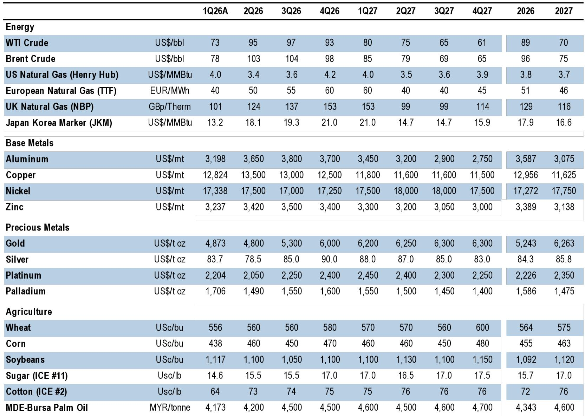
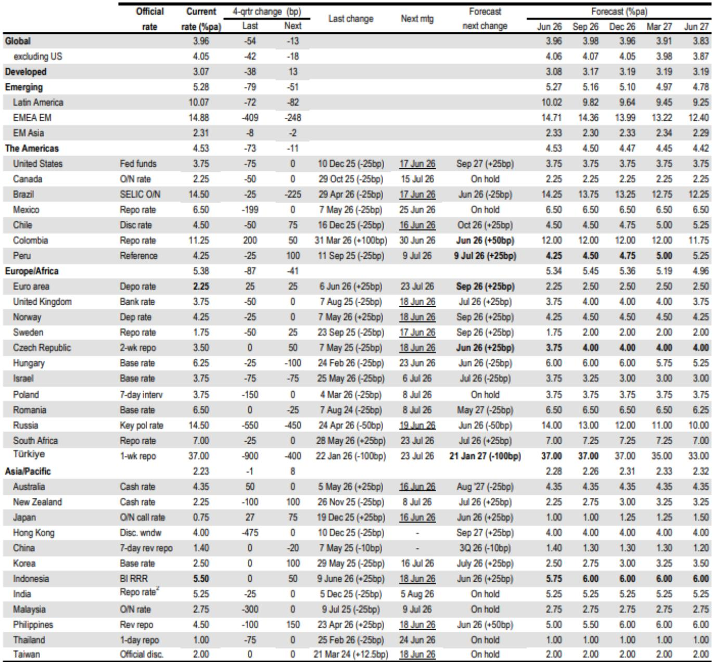
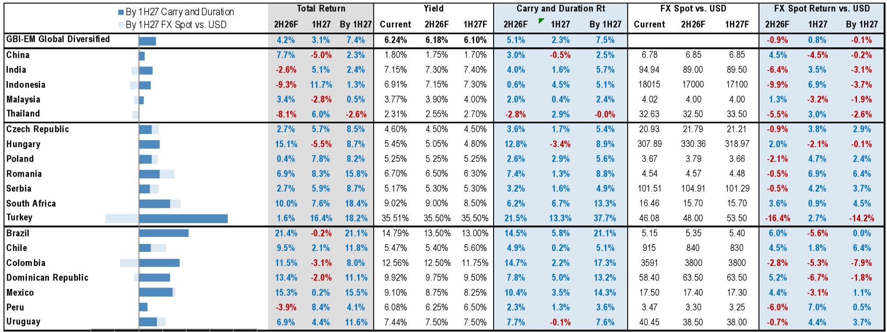

# The Fed Is Not Done: Why Treasury Yields Will Rise Further and Curve Flatteners Offer the Best Risk-Reward

The dominant narrative in global fixed income markets today is that the Federal Reserve has completed its tightening cycle and that the next move will be a cut. This view is dangerously complacent. A careful reading of the macroeconomic data, the trajectory of fiscal policy, and the structural dynamics of the Treasury market suggests the opposite: the Fed is likely to resume hiking in the third quarter of 2027, and long-term Treasury yields have further room to rise. The market is pricing in a more aggressive path than our baseline forecast, but the real risk is that the market is still not hawkish enough.

The central tension in the current environment is between a labor market that shows no clear signs of breaking and an inflation rate that remains stubbornly above target. Core PCE is projected to end 2026 at 3.4%, nearly double the Fed's target. The unemployment rate is forecast to drift down to 4.1% by the fourth quarter of 2026. This is not the profile of an economy that needs monetary accommodation. It is the profile of an economy where policy may not be restrictive enough. The three-month moving average of nonfarm payroll growth has stabilized, and continuing jobless claims are not rising in a way that signals a downturn. If the labor market remains this resilient, the Fed's pause is a prelude to action, not a permanent resting point.

What makes this moment particularly important is that the Treasury market is already pricing in a steeper path for the OIS curve than our official forecast. The market sees a full hike by the January meeting and upwards of 35 basis points of tightening over the next one to two years. We project a single hike in the third quarter of 2027. The gap between market pricing and our forecast is significant, but it will not close quickly. The reason is structural: a stable unemployment rate leaves an open question about whether the current stance of policy is actually restrictive. If it is not, then the market's pricing is not wrong; it is simply early.

## The Treasury Curve Is Artificially Steep, and Flatteners Are the Right Trade to Express a Bearish View

The Treasury curve has retraced to its flattest levels in over a year, driven by the hawkish shift in Fed policy expectations. But most curve pairs appear too steep after controlling for the fundamental drivers: the one-year one-year OIS rate, five-year five-year TIPS breakevens, the Fed's balance sheet as a share of GDP, and a trade policy uncertainty variable. The residual for the 10s/30s curve is 14 basis points, a divergence of nearly two standard deviations from fair value. This is not a statistical artifact; it is a signal that the market is overestimating the persistence of steepness.

The implication is clear: outright duration shorts are not the most efficient way to express a bearish view. The curve is already pricing in a significant amount of tightening, and the risk is that the market shifts from pricing in a steepening path to pricing in a higher level of rates across the curve. In that environment, flatteners outperform short positions because they capture the repricing of the long end without the same degree of exposure to short-end volatility. The 10s/30s flattener is particularly attractive because the long end is where the fiscal story becomes most acute.

The fundamental driver of long-term yields is not just monetary policy; it is the interaction between fiscal supply and investor demand. The Treasury's funding needs are large and growing. Net of Fed purchases and buybacks, the change in privately held coupon debt is projected to be $1.293 trillion in 2026 and $1.419 trillion in 2027. The bill share of total debt is elevated, and the Treasury will need to extend maturities. The forward guidance from the Treasury is likely to change in August, removing the "at least" language and preparing the market for a multi-quarter series of coupon increases beginning in February 2027. The administration's focus on lowering long-end yields creates a political risk that this guidance change may be delayed, but the underlying arithmetic is inexorable. If the Treasury delays, the eventual adjustment will be more disruptive.

## Treasuries Remain Unattractive Relative to Other Developed Market Bonds, and This Divergence Will Persist

The relative value case against Treasuries is one of the most compelling arguments in the global rates complex. Intermediate Treasury yields appear 24 basis points too low relative to a fair value model that incorporates OIS rates, breakevens, the Fed's balance sheet, and trade policy uncertainty. At the same time, European valuations are relatively attractive. Central banks across the developed world are leaning hawkish, and this will act to keep yields buoyed at higher levels than prevailed before the Middle East conflict.

The cross-market trade that captures this dynamic most effectively is selling 10-year Treasuries versus German bunds. The spread between the two has been compressed by the convergence of monetary policy expectations, but the fundamental drivers are diverging. The US fiscal trajectory is more challenging than that of the euro area, and the Fed is more likely to resume hiking than the ECB. The regression of the 10-year Treasury/German bund spread on the one-year one-year USD/EUR OIS spread shows that the current level of the spread is consistent with a higher equilibrium. The trade is not just a relative value play; it is a bet on the divergence of fiscal and monetary regimes.

The risk to this view is that the Middle East conflict escalates in a way that disrupts energy supplies and forces a synchronized easing cycle. But the base case from the report is that the conflict remains in a state of "Schrodinger's Strait": the Strait of Hormuz is neither fully open nor fully closed, and oil flows are recovering but remain well below pre-war levels. The rebound in June flows to 5.1 million barrels per day from 2.9 million in May is meaningful, but it still leaves flows at only about 25% of pre-war levels. This uncertainty keeps a floor under energy prices and supports the hawkish bias of central banks.

## The Dollar's Appreciation Is Not Yet Priced In, and the Fed's First Hike Will Be a Catalyst for Further Gains

The dollar continues to trade at a discount to rates fair value, and the history of Fed hiking cycles is clear: the dollar appreciates approximately 5% in the six months leading up to the first hike of a cycle. The current environment is no different. Pockets of upside inflation surprises in G10, rising US real yields, and a fading debasement narrative all support a bullish dollar and bullish carry barbell strategy.

The marquee event next week is Chair Warsh's inaugural FOMC meeting. The 2027 dot and the press conference will be the market-moving elements. An orthodox acknowledgement of stronger US cyclicals may be enough to constitute a hawkish outcome for the dollar. The market is already long, but the positioning is not extreme enough to preclude further gains. The risk is that the Fed delivers a dovish surprise by emphasizing the uncertainty around the outlook, but the data does not support that narrative. The labor market is tight, inflation is sticky, and fiscal policy is expansionary. The Fed's own projections will need to reflect this reality.

In other G10 currencies, the divergence is becoming more pronounced. The Bank of Japan is likely to sound dovish at its next meeting, with a fully priced hike, a potential quantitative tightening halt, and Governor Ueda's absence at the press conference skewing risks. In Europe, the hawkish Norges Bank versus the dovish Riksbank divergence could headline outcomes. For the pound, the aftermath of the Makerfield by-election will likely prove a bigger driver than the Bank of England. The common thread is that central banks are taking center stage, and the dollar is the primary beneficiary of the divergence.

## The Report Raises a Critical Open Question: How Will the Market Absorb the Coming Wave of Treasury Supply Without a Disruption in Term Premium?

The report provides a detailed framework for understanding the Treasury's funding needs and the likely path of coupon increases. But it leaves open a question that will define the next phase of the market: how will the private sector absorb this supply without a significant increase in term premium? The projections for foreign demand for Treasuries have been adjusted lower, and the bank demand forecast has also been reduced. The Fed's balance sheet is shrinking, and the Treasury is not buying back enough to offset the net issuance.

The answer to this question depends on the behavior of real money investors, particularly pension funds and insurance companies. If long-term yields rise to levels that attract duration-sensitive buyers, the absorption may be orderly. But if the market requires a significant premium to take down the supply, the adjustment could be disruptive. The report's fair value model suggests that the 10-year Treasury yield should be higher than current levels, but the magnitude of the adjustment is uncertain.

The second-order implication is that the term premium may normalize from its current compressed levels, adding to the upward pressure on long-term yields. This is not a forecast of a crisis; it is a recognition that the structural dynamics of the Treasury market have changed. The era of quantitative easing and foreign reserve accumulation is over. The market must now find a new equilibrium, and that equilibrium will likely involve higher yields and a steeper term premium.

## A Decision Framework for Positioning in the Current Environment

For investors trying to navigate this environment, the framework should be organized around three questions. First, what is the probability that the Fed resumes hiking in 2027? The report's baseline is a single hike in the third quarter, but the risks are skewed to an earlier and more aggressive path. If the labor market remains resilient and inflation does not decline meaningfully, the Fed will be forced to act. The market is already pricing in a more aggressive path, but the gap between market pricing and the report's forecast is not a reason to fade the market; it is a reason to position for a convergence that could be driven by the Fed catching up to market expectations.

Second, where is the best risk-reward in the curve? The report's analysis suggests that flatteners offer better value than outright duration shorts. The 10s/30s flattener is the most attractive because the curve appears 14 basis points steep after adjusting for fundamentals. The trade is a bet that the market will shift from pricing in a steeper path to pricing in a higher level of rates, which compresses the long end relative to the front end.

Third, which cross-market trades capture the divergence in monetary and fiscal regimes? Selling 10-year Treasuries versus German bunds is the most straightforward expression. The trade is supported by relative valuations, fiscal trajectories, and central bank policy. The risk is that the conflict in the Middle East escalates and forces a synchronized easing, but the base case is that the divergence persists.

The report's analysis of emerging markets adds another layer to the framework. The resilient cyclical backdrop, low fundamental vulnerabilities, and proactive stance of several EM central banks support continued carry outperformance. The report turns overweight EM FX in higher yielders and currencies where central banks are ready to hike. This is not a blanket endorsement of EM; it is a selective call that requires active management of country-specific risks.

## Join the community to read the full report and review the original charts.

The full report contains detailed fair value models, supply projections, and cross-market analysis that cannot be fully captured in a summary. The charts on Treasury curve residuals, the Fed's balance sheet impact, and the evolution of the bill share of total debt provide the empirical foundation for the arguments presented here. For investors who want to understand the nuances of the positioning and the specific trade recommendations, the original document is essential reading.

*This article is for learning and discussion only and does not constitute investment advice.*

Personal reading notes and learning share only. Not investment advice.

