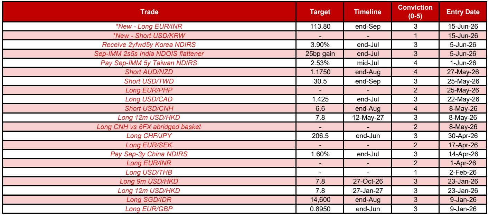

# NOM：市场低估了中东协议对全球资产定价的连锁效应，而非仅关注地缘风险本身

这份NOM研报的核心判断，并非简单地“看多”或“看空”某个市场，而是提出一个更具结构性的观点：市场正在低估美伊临时协议签署后，全球资产定价逻辑从“地缘风险溢价”向“宏观基本面与相对价值”切换的深度和速度。NOM认为，真正的交易机会不在于赌局势升级或缓和，而在于捕捉这种定价逻辑切换带来的、由本地因素驱动的相对价值交易。

报告发布的时间点——美伊即将于6月19日签署谅解备忘录前夕——本身就极具信号意义。自5月22日以来，NOM已经基于“局势缓和”的假设调整了策略仓位。如今，随着协议签署的确认，NOM进一步强化了这一立场，并做出了数项关键调整。这并非一次简单的战术性调整，而是对全球宏观交易主题的一次系统性重估。

报告最值得关注的信号，不是某个具体的汇率目标价，而是其背后清晰的投资框架：在美元整体偏弱的背景下，交易的重心应从“做多或做空美元”这种笼统的方向性押注，转向“基于各国本地因素（经济增长、货币政策、资本流动、政治风险）进行多空配对交易”。这意味着，未来一段时间的赢家，将是那些能够精准识别并利用各国基本面差异的投资者。

## 1. 美伊协议不仅是地缘事件，更是全球资产重定价的触发器

研报明确指出，美伊临时协议的签署，其意义远超出中东地缘政治本身。它直接触发了全球资产定价框架的三个核心变量的变化：能源价格、美元走势和风险偏好。

首先，协议的核心内容之一——重新开放霍尔木兹海峡——直接指向能源供给侧。一旦海峡通航恢复，全球能源价格面临的下行压力将显著增加。这对于高度依赖能源进口的经济体（如新西兰、印度、韩国）是重大利好，而对于能源出口国（如澳大利亚）则构成拖累。NOM正是基于这一逻辑，维持了对澳元兑纽元的空头头寸。

其次，能源价格的回落将逆转此前因能源危机而强化的“贸易条件”效应，即能源出口国货币的强势和进口国货币的弱势。这种逆转，是NOM判断美元整体将走弱的核心论据之一。一个更弱的美元环境，为新兴市场货币，尤其是那些基本面扎实、出口竞争力强的货币（如人民币、新台币），提供了升值的空间。

最后，局势缓和直接提升了全球风险偏好。这并非简单的“避险情绪消退”，而是意味着资金将从“避险资产”（如美元、日元）和“防御性头寸”中流出，重新配置到那些此前因风险溢价而被低估的资产上。NOM报告中提到的“低beta于美元和石油”的交易（如做多瑞郎/日元、欧元/英镑），正是在这种风险偏好改善环境下，寻求相对价值的表现。

因此，这份研报的核心洞察是：不要仅仅把美伊协议看作一个“利好”或“利空”消息。它是一个触发器，迫使市场重新审视所有资产的定价基础——能源成本、美元流动性和风险情绪。谁能更早、更准确地理解这种定价框架的切换，谁就能在新的市场格局中占据先机。

## 2. 美元整体偏弱，但真正的机会在于“本地因素”驱动的相对价值交易

NOM对美元的整体判断是“选择性做空”。这并非一个无条件的看空美元宣言，而是一个有条件的策略：在美元整体走弱的背景下，寻找那些由各自经济体本地因素驱动、能够跑赢美元指数的货币对。

报告中的核心交易头寸清晰地体现了这一思路：

*   **做空美元/人民币（目标6.60）**：这是NOM高确信度的头寸。理由并非简单看空美元，而是基于中国的强劲出口、持续的贸易顺差、人民币被低估的估值（模型显示平均低估9.7%）以及央行引导汇率走低的信号。这是典型的“本地因素”驱动——中国自身的经济基本面和政策意图，才是人民币走强的根本动力。

*   **做空美元/新台币（目标30.5）**：逻辑与人民币类似，但叠加了台湾地区在人工智能、半导体等科技领域的强劲增长和出口优势。台湾的贸易顺差扩大、GDP高增长预期，以及科技股带来的资本流入，都是支持新台币走强的本地因素。

*   **做多欧元/印度卢比（目标113.8）**：这是一个非常精妙的相对价值交易。NOM认为，在能源价格下跌的环境中，欧元将是主要的受益者，而印度卢比则面临资本外流、财政赤字扩Daiwa央行干预能力下降等多重压力。这不是在赌欧元或卢比的绝对方向，而是在赌两者之间相对强弱关系的改变。

这些例子共同指向一个结论：在美元走弱的大背景下，交易的核心不再是“买什么货币”，而是“买哪个国家的故事”。投资者需要从宏观主题（能源、美元）下沉到国别层面，去分析每个经济体的增长动力、政策周期、资本流动和地缘政治风险，才能找到真正的超额收益来源。

## 3. 亚洲利率市场：从单边押注转向相对价值，韩国与印度呈现不同逻辑

NOM在亚洲利率市场的策略同样体现了“从方向到相对价值”的转变。报告明确指出，在近期利率大幅下行后，市场焦点应转向相对价值交易。

*   **韩国利率**：NOM维持“接收韩国2年远期5年利率”的头寸，但将确信度从4/5下调至3/5。这表明，尽管韩国利率在和平协议下仍有下行空间（作为高beta市场，对地缘风险缓和最为敏感），但前期涨幅已部分消化了利好。报告隐含的逻辑是：韩国更强的财政状况意味着其利率进一步下行的空间可能受限，因此需要降低单边押注的力度，等待更好的入场时机。

*   **印度利率**：NOM推荐“做平印度2年与5年NDOIS利差”的交易（Sep-2s5s NDOIS flattener）。这是一个典型的曲线交易，而非方向性押注。其背后逻辑是：印度央行（RBI）可能通过买入长期国债来压低长端利率，同时市场对短期利率的预期可能因通胀和资本外流而保持坚挺。这种曲线平坦化交易，正是对印度本地货币政策、财政状况和资本流动复杂博弈的综合反映。

这里有一个值得深思的伏笔：报告对印度市场的分析，揭示了其面临的内部矛盾——高增长、高通胀、资本外流、财政扩张压力、央行独立性受质疑。这些因素交织在一起，使得押注印度利率方向变得异常困难。NOM选择用相对价值交易（曲线平坦化）来捕捉这些矛盾，而非单边做多或做空，本身就是一种高明的策略选择。它暗示，对于复杂市场，投资者需要更精细的工具来管理风险和捕捉收益。

## 4. 报告尚未完全回答的关键问题：韩国与印尼的交易逻辑仍需验证

尽管报告逻辑清晰，但有两个交易头寸的“低确信度”提示了当前市场仍存在的重大不确定性，这也是报告价值所在——它清晰地标出了风险点。

*   **做空美元/韩元（确信度1/5）**：这是一个“观察但不交易”的头寸。NOM认为，韩元走强需要多个条件同时满足：美伊局势缓和（已接近实现）、企业外汇对冲需求增加、散户资金流出放缓。但报告也坦诚，韩国股市上涨可能反而会刺激本地和外国投资者的外汇需求，形成“悖论”。这是一个非常诚实且重要的提醒：地缘政治缓和只是必要条件，而非充分条件。韩元能否真正走强，还取决于韩国国内资本流动的微观结构，而这部分变量目前仍存在很大不确定性。

*   **做多新加坡元/印尼盾（确信度从5/5降至3/5）**：这个头寸的确信度连续下调，本身就说明问题。尽管报告仍看好新加坡元，但对印尼盾的担忧却在加剧。印尼央行可能不升息、央行通过购债压低收益率、社会不稳定风险、MSCI评估可能引发外资流出、以及主权评级可能被下调——这一系列负面因素叠加，使得做多新加坡元/印尼盾的交易变得风险重重。报告没有完全回答的问题是：印尼盾的贬值压力究竟有多大，以及这些负面因素何时会集中爆发。

这两个低确信度的头寸，恰恰是报告最宝贵的部分。它们揭示了当前市场中最具争议、最不明确、也最可能产生超额收益的领域。投资者不应盲目跟从，而应将其作为深入研究的起点，去验证这些不确定性何时、以何种方式被市场消化。

## 5. 全球外汇的“低beta”策略：在波动中寻找稳健的相对价值

在G10外汇领域，NOM同样强调了“相对价值”和“低beta”策略。这表明，即使在发达市场，单纯的方向性押注也面临挑战。

*   **做空澳元/纽元（确信度4/5）**：这是G10中确信度最高的头寸。逻辑清晰：能源价格下跌利好纽元（进口国）而非澳元（出口国）；澳洲联储加息周期已结束，而新西兰联储加息周期仍在开启；头寸仍相对拥挤。这是一个由基本面、政策面和仓位面共同支撑的、逻辑自洽的交易。

*   **做多美元/加元（确信度3/5）**：这是一个看似矛盾的交易。做多美元/加元，却在美元整体偏弱的背景下。NOM的解释是，加元对油价的敏感性已降低，而美加两国经济基本面和利率差异才是未来驱动汇率的核心。如果中东局势永久性缓和，他们甚至考虑将头寸转为做多欧元/加元。这再次印证了其“从地缘风险驱动转向宏观基本面驱动”的核心框架。

*   **做多瑞郎/日元和欧元/英镑（确信度3/5）**：这两个交易被明确标记为“低beta于美元和石油”。这意味着，无论美元和石油如何波动，这两个交易都有可能提供正收益。它们的逻辑依赖于各自央行的政策差异（瑞士央行干预温和、日本央行加息预期已部分消化；欧央行与英央行终端利率差异）。这是一种典型的“对冲”或“绝对收益”思路，旨在剥离市场系统性风险，专注于捕捉微观结构带来的alpha。

这些G10交易共同勾勒出一个图景：即使在发达市场，投资者也应放弃“赌方向”的思维，转而寻找那些由央行政策差异、经济周期错位和仓位结构驱动的、逻辑清晰、风险可控的相对价值交易。

---

这份NOM研报的价值，不仅在于它给出了具体的交易建议，更在于它提供了一个完整的、可复用的分析框架。它告诉我们，在宏观环境发生结构性转变时（如地缘局势缓和），如何系统地重新评估全球资产定价逻辑，并从中筛选出那些由本地因素驱动、逻辑自洽、风险可控的交易机会。对于高净值读者和产业决策者而言，理解这个框架，远比记住几个汇率目标价更有意义。

报告本身并未穷尽所有问题。例如，韩国和印尼的交易逻辑何时才能从“观察”变为“执行”？美伊协议第二阶段谈判中那些棘手问题（如以色列-黎巴嫩停火、伊朗-阿曼对海峡的管辖权）将如何演变？这些不确定性，恰恰是未来超额收益的潜在来源。我们星球微信群里，每周都会围绕这些未解问题展开深度讨论，欢迎你来，一起拆解这些更复杂、也更诱人的投资谜题。

Personal reading notes and learning share only. Not investment advice.

