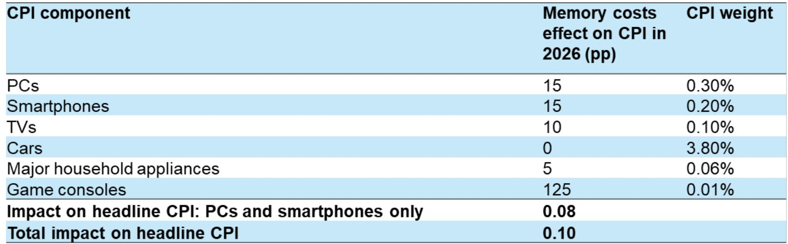

# 摩根斯坦利：存储器价格的结构性重置，远比市场理解的更深远

2026年，全球存储器市场规模将从2025年的约2200亿美元跃升至约8900亿美元。增量部分——约6000亿美元——已经超过了智能手机、PC或服务器任何一个单一品类的完整市场空间。

这不是一个周期性波动。这是存储器作为数字世界基础输入品，其价格行为正在经历一次结构性重置。

摩根斯坦利在最新发布的《Chipflation – Implications of a Memory Crisis》全球宏观论坛报告中，用一个核心概念概括了这一变化：Chipflation。芯片通胀。报告由首席固定收益策略师Vishwanath Tirupattur领衔，联合半导体、IT硬件、商品策略、美国公共政策和美国经济研究团队共同撰写。这不是一份单一的行业报告，而是一次跨资产、跨领域的系统性推演。

市场目前对这场存储器危机的定价，仍停留在“供应紧张”的周期叙事中。但报告揭示的真相是：AI正在从根本上改变存储器的需求结构和定价逻辑，而供给端的三家寡头格局和地缘政治约束，使得传统的“扩产-降价”循环已经失效。

以下是我们从这份报告中提炼出的五个核心洞察，以及一个报告尚未完全回答的关键问题。

## 1. 存储器不再遵循摩尔定律：价格六倍上涨背后的结构性断裂

过去一年，存储器价格上涨超过六倍。对于习惯了半导体价格长期下行的产业界和投资者来说，这个数字本身就是一个信号。

摩根斯坦利的分析框架清晰地指出，这不是一次普通的库存周期反转。报告用了一个关键区分：这是一个供给问题，还是一个需求问题？答案是两者兼具，但驱动因素完全不同。

从需求端看，AI创造了突然且价格弹性极低的需求跃升。HBM（高带宽存储器）的使用量，在单个AI芯片层面增长了7倍，在AI系统层面增长了65倍，在AI集群层面增长了惊人的1800倍。到2028年，HBM将占据领先制程存储器晶圆的约34%，而2023年这一比例仅为约6%。

从供给端看，全球DRAM市场约90%的产出由三家厂商控制——三星、SK海力士和美光。这种高度集中的供给结构，在面临价格弹性极低的AI需求时，天然具有定价权。更关键的是，中国在全球存储器产能中的份额正从18%上升至2028年的超过23%，占全球净晶圆增量的约30%。地缘政治因素使得这一产能扩张路径充满不确定性。

这两个力量合在一起，意味着存储器价格可能不会像过去那样在周期高点后迅速回落。报告的核心判断是：价格弹性较低的需求遇到了缺乏弹性的供给，这才是结构性重置的本质。

对于产业决策者而言，这意味着过去十年“存储器越来越便宜”的假设已经失效。任何依赖存储器作为核心成本项的终端产品——从服务器到PC到智能手机——都需要重新审视其成本结构和定价策略。

## 2. AI优先分配正在制造消费级存储器的系统性短缺

摩根斯坦利的分析揭示了一个被市场低估的连锁效应：当AI需求成为存储器厂商的优先分配对象时，消费级市场将出现结构性缺口。

报告给出的数字非常具体。在2027年的供应分配推演中，总DRAM+HBM供应为5760亿Gb，但扣除HBM分配后，剩余的非服务器供应仅为1730亿Gb。再扣除其他非服务器需求，最终分配给PC和智能手机的只有1300亿Gb，而这一市场的需求为1450亿Gb。这意味着约190亿Gb的缺口，相当于需求的13%。

这个缺口的具体含义是什么？报告估算，这将导致2027年约15%的PC DRAM短缺和约12%的智能手机DRAM短缺，对应约5800万台PC和1.34亿部智能手机。

这不是一个“可能发生”的情景。这是基于当前产能规划、AI需求增长轨迹和厂商优先分配逻辑的基准预测。存储器厂商没有动力去优先满足利润率较低的消费级市场，尤其是在HBM和AI服务器DRAM的利润率远超传统产品的情况下。

这个判断的产业含义是：消费电子市场的竞争逻辑正在被改写。过去，终端厂商可以通过与存储器供应商的长期合作获得稳定供应。但在AI优先的分配逻辑下，消费电子品牌将面临供应量和价格的双重不确定性。那些能够将存储器成本转嫁给终端消费者、或者通过产品溢价消化成本压力的品牌，将获得结构性优势。

## 3. 芯片通胀的传导路径：PPI已经确认，CPI只是时间问题

摩根斯坦利的经济学家团队对通胀传导做了量化分析。结论是：芯片通胀在生产者价格指数（PPI）中已经清晰可见，但对消费者价格指数（CPI）的影响目前仍较为温和。

数据显示，2026年美国电子元件PPI同比上涨约26.9%，上游中间投入品价格涨幅更为显著。但报告估算，存储器成本对2026年整体CPI的拉动仅为约10个基点。其中，PC和智能手机两个品类合计贡献约8个基点，游戏主机的贡献虽然单品类高达125个基点，但由于权重极低，对整体CPI的影响微乎其微。

这一差异的关键在于：CPI指数对电子产品进行了质量调整，而ASP（平均售价）系列数据没有。报告通过散点图展示了PC领域ASP与CPI之间的关系：ASP上涨30%时，CPI仅上涨约10%。在智能手机领域，两者的关联性甚至更弱。

这意味着什么？终端制造商正在承担大部分成本压力。他们要么通过产品升级（如增加内存、提升性能）来合理化涨价，要么直接压缩自身利润空间。报告暗示，消费端生产商正在面临艰难的利润决策。

对于投资者而言，这意味着需要关注两个层面的传导：第一，哪些终端品牌有能力将成本转嫁给消费者？第二，那些无法转嫁成本的品牌，其利润率将在未来几个季度面临显著压力。芯片通胀对CPI的温和影响，恰恰反映了企业利润被挤压的现实。

## 4. 存储器市场增量已超终端市场总量，供应链权力正在转移

摩根斯坦利报告中一个引人深思的数据点是：存储器市场的增量规模已经超过了它所服务的终端市场。2026年存储器市场预计达到约8900亿美元，增量约6000亿美元。这个增量大于智能手机、PC或服务器任何一个市场的完整规模。

这意味着什么？存储器已经不再是一个“配件”或“组件”，它正在成为整个数字经济的定价锚。

过去，存储器厂商的定价权受制于下游终端市场的规模和集中度。当PC和智能手机是存储器的主要消耗者时，终端厂商（如苹果、戴尔、三星电子）拥有较强的议价能力。但现在，AI服务器和超大规模数据中心成为了边际定价者，他们的需求价格弹性极低，对存储器价格的敏感度远低于消费电子厂商。

这种供应链权力的转移，正在重塑整个科技产业的利润分配格局。存储器厂商从“成本中心”变成了“价值中心”。而终端设备制造商，尤其是消费电子品牌，正从“定价者”变成“价格接受者”。

报告没有直接点明，但我们可以从逻辑上推导：这可能导致科技产业链的利润池发生永久性迁移。过去二十年，利润从硬件制造商流向平台公司和软件公司。未来五年，一部分利润可能会回流到核心半导体和存储器制造商手中。

## 5. 政策干预的空间有限且方向偏紧，供给瓶颈短期无解

摩根斯坦利的美国公共政策策略团队在报告中评估了美国和中国的政策选项。结论是：即使两国政府试图采取措施缓解存储器价格压力，实际见效也需要数年时间。

报告特别指出，美国的政策选择倾向于更严格而非更宽松的方向。这意味着，在可预见的未来，供给侧的约束不仅不会放松，反而可能因地缘政治因素而加剧。

中国正在快速扩张存储器产能，但这一扩张本身也受到技术管制和设备出口限制的影响。从产能建设到良率爬坡，再到真正形成有效供给，通常需要3到5年的时间窗口。即便中国的产能扩张按计划推进，短期内也无法缓解当前的价格压力。

对于产业决策者而言，这意味着不能寄希望于“政策救市”或“产能快速释放”来缓解存储器短缺。任何依赖存储器的产品规划、成本预算和供应链策略，都需要建立在“高价格、紧供给”将成为新常态的假设之上。

## 报告尚未完全回答的关键问题：需求破坏何时会触发价格回调？

摩根斯坦利的分析框架非常完整，但有一个问题报告没有充分展开：当存储器价格上涨到一定程度，AI需求本身是否会出现破坏？

目前，AI芯片和系统的投资回报率仍然较高，超大规模云厂商的资本支出仍在快速增长。但如果存储器价格持续高企，AI系统的总拥有成本将显著上升。当AI投资的边际回报开始下降时，需求的价格弹性可能会重新出现。

报告提到了“价格弹性较低的需求”，但并没有量化这个弹性在什么价格水平下会发生变化。这是一个关键的未解问题。如果AI需求在某个价格阈值上出现破坏，存储器市场的定价逻辑可能会再次改变。

这个问题的答案，取决于AI应用的实际商业化进展、超大规模云厂商的资本支出纪律、以及替代技术（如存算一体架构、新型非易失性存储器）的进展。这些变量目前都充满不确定性。

我们将在社群中持续跟踪这些变量的变化，并基于摩根斯坦利报告的完整版数据，进一步拆解存储器市场的二阶效应和三阶效应。

---

关于“AI需求的价格弹性会在什么水平上被激活”这个问题，我们正在社群中展开深入讨论。如果你对存储器产业链的利润转移、消费电子品牌的应对策略、以及芯片通胀对宏观经济的影响有更深入的兴趣，欢迎来我们的微信群继续讨论。我们会定期分享机构报告的完整解读、数据图表和跨行业比较分析。

Personal reading notes and learning share only. Not investment advice.

