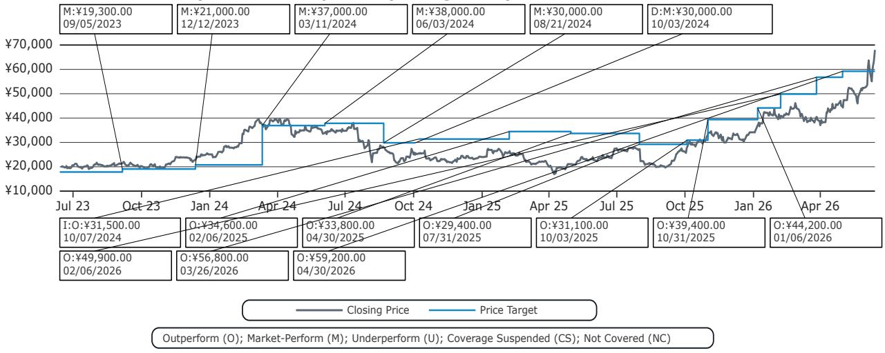
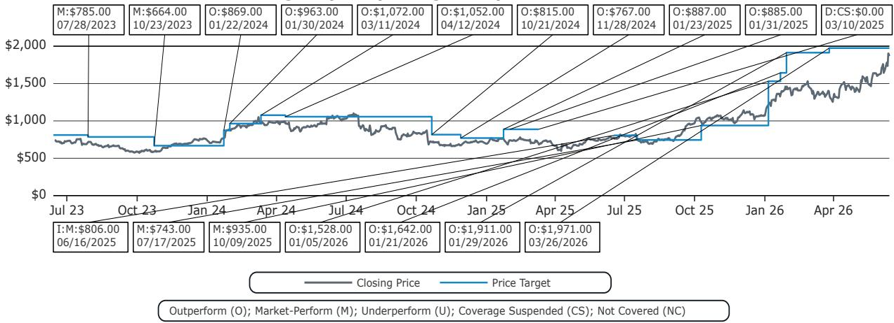

# Bernstein：韩国设备进口数据揭示的不是周期复苏，而是记忆体结构性扩张的加速

半导体设备进口数据，通常被市场视为周期风向标。当韩国5月半导体设备进口同比飙升51%时，许多投资者的第一反应是“周期回来了”。但这份Bernstein研报揭示的图景远比“周期复苏”复杂——它指向的是记忆体领域一次由技术节点跃迁驱动的结构性资本支出扩张，而非简单的需求回暖。理解这一区别，对于判断设备供应链上各家公司的相对受益程度至关重要。

市场之所以容易误读，是因为传统框架下进口激增往往与下游需求旺盛挂钩。然而，Bernstein团队通过拆解进口来源国别和设备品类，发现本轮增长的核心驱动力来自韩国两大记忆体巨头——三星和SK海力士——对1c纳米DRAM节点的激进导入，以及由此带来的光刻强度（litho intensity）显著提升。这不是一个“量”的故事，而是一个“质”的故事。

这份报告最值得关注的判断是：韩国设备进口的强劲势头，正在从总量层面验证记忆体资本开支的结构性上调，但不同设备供应商之间将出现显著分化。光刻设备供应商ASML有望持续受益于高价值量系统的密集交付，测试设备供应商Advantest可能迎来超预期的季度收入，而日本设备商东京电子（TEL）的收入动能则显示出边际放缓的迹象。这种分化，恰恰是投资者需要重新校准预期的地方。

## 1. 光刻设备进口创下季度内第二高纪录，ASML在韩收入动能持续强化

韩国从荷兰进口的半导体设备——几乎可以视为ASML光刻系统的代理变量——在5月达到9.28亿欧元，这是有记录以来季度内第二高的单月数字，环比增长28%，同比增幅约150%。Bernstein的回归模型据此估算，ASML第二季度在韩国的系统销售额约为23.1亿欧元，虽然环比下降18%，但同比翻倍有余。

这意味着什么？韩国将在ASML第二季度系统销售总额中占据约37%的份额。对于一个季度前市场还在担忧记忆体资本开支放缓的行业而言，这一比例本身就说明了很多问题。更关键的是，Bernstein指出，这一强劲势头很可能得到了1c节点DRAM产能扩张和快速采用的支撑——1c节点相比前代产品需要显著更高的光刻强度。

从投资含义来看，ASML在记忆体领域的收入集中度正在上升，这既是机遇也是风险。机遇在于，记忆体客户的资本开支计划通常更为集中和可预测，一旦进入交付周期，收入能见度较高；风险在于，如果下游记忆体价格出现超预期下跌，客户可能临时调整交付节奏。但就当前数据而言，ASML在韩国的收入动能尚未见顶。

## 2. 测试设备进口同比翻倍，Advantest季度收入可能显著超出市场预期

测试设备是这份报告中另一个值得深挖的信号。韩国从日本和马来西亚进口的测试设备在5月环比增长5%，同比增幅高达103%。Bernstein指出，Advantest的记忆体测试收入与韩国测试设备进口数据之间存在良好的相关性。

基于回归模型，Bernstein估算Advantest第二季度在韩国的测试收入可能环比增长84%。作为对比，市场共识预期Advantest整体公司收入仅环比增长3%。即便Bernstein也谨慎地指出这一回归仅基于两个月的数据且近期相关性有所减弱，但如此巨大的差距仍然值得投资者高度关注。

这里的核心逻辑在于：记忆体客户在导入新节点时，测试环节的需求往往滞后于光刻和刻蚀等前道设备。如果1c节点的产能爬坡正在加速，那么测试设备的需求释放可能才刚刚开始。Advantest的韩国收入如果确实如模型所示出现井喷，将意味着市场对其全年业绩的预期存在系统性低估。

## 3. 日本设备进口环比骤降，东京电子的收入节奏出现短期逆风

与ASML和Advantest形成对比的是，东京电子相关品类（CVD、干法刻蚀、清洗、涂胶显影、RTP等）的韩国进口数据在5月环比下降27%，尽管同比仍增长52%。Bernstein的回归模型显示，东京电子第二季度在韩国的收入可能环比下降15%，而市场共识预期为环比持平。

这一分化值得深入思考。它可能反映了不同设备在客户扩产周期中的交付节奏差异。光刻设备作为产能扩张的“瓶颈”环节，通常优先交付和安装；而刻蚀和沉积设备则可能在后续批次中集中发货。但无论如何，5月单月数据的骤降至少表明，东京电子第二季度的收入可能面临短期压力。

从竞争格局的角度看，这种节奏差异并不意味着东京电子的长期竞争力受损。但如果市场将韩国设备进口总量增长简单线性外推到所有设备供应商，东京电子的季度业绩就可能成为预期差来源。这一点，对于持有或关注日本半导体设备板块的投资者尤为重要。

## 4. 韩国记忆体资本开支与进口数据出现短期背离，但下半年有望加速修复

一个值得注意的细节是：尽管设备进口数据持续攀升，三星和SK海力士第一季度的合并资本开支却环比下降。Bernstein将其归因于季节性因素以及部分基础设施投资在2025年第四季度前置。

这种短期背离并不罕见，但关键在于后续走势。两家公司均已明确指引2026年资本开支将大幅增长，重点投向基础设施和战略设备。Bernstein据此判断，未来资本开支将恢复增长，甚至可能很快超过当前的进口数据。

这意味着什么？当前设备进口的强劲势头并非昙花一现，而是更大规模资本开支周期的前奏。如果三星和SK海力士下半年启动新一轮设备采购，进口数据有望在现有高位基础上进一步上移。这对整个半导体设备板块而言，是一个中期层面的积极信号。

## 5. 报告尚未完全回答的关键问题：设备进口的结构性可持续性如何评估？

尽管Bernstein的数据分析极具说服力，但仍有几个关键问题需要投资者自行判断。

第一，1c节点的光刻强度提升是一次性跃迁还是持续趋势？如果是前者，那么ASML在韩国的收入可能在2026年下半年达到峰值；如果是后者，则意味着记忆体客户对光刻设备的需求将维持在结构性高位。报告没有给出明确结论。

第二，测试设备需求的爆发是否可持续？Advantest的韩国收入如果确实在第二季度环比增长84%，那么基数效应将使得后续季度增速自然放缓。市场需要区分“一次性补货”和“持续性需求释放”。

第三，东京电子的环比下滑是节奏问题还是份额问题？如果只是交付节奏差异，那么下半年有望修复；但如果涉及客户供应链调整或技术路线变化，则需要更长时间观察。报告没有展开这一层面的分析。

这些未解问题，恰恰是深入阅读完整报告和持续跟踪后续数据的关键所在。欢迎来知识星球微信群继续讨论，我们将结合Bernstein的后续更新和更多交叉验证数据，持续追踪这一主题的演变。

Personal reading notes and learning share only. Not investment advice.

