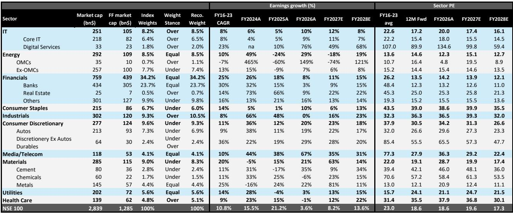
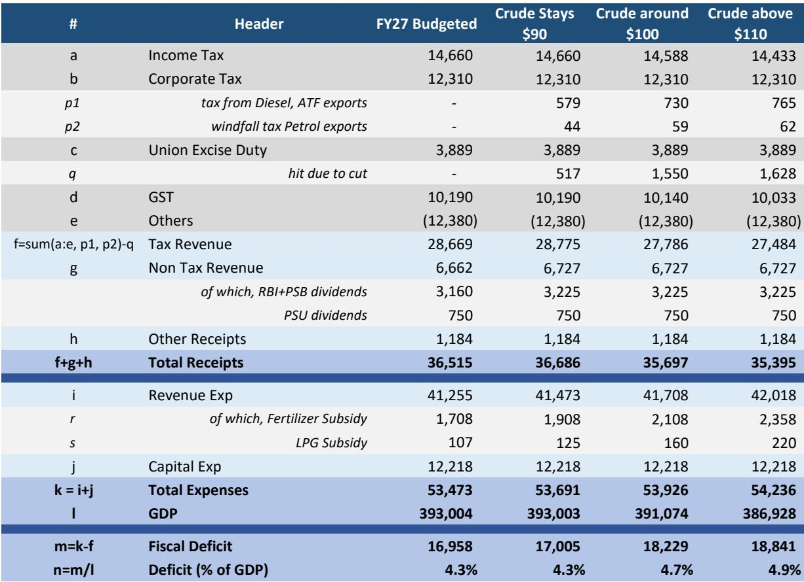
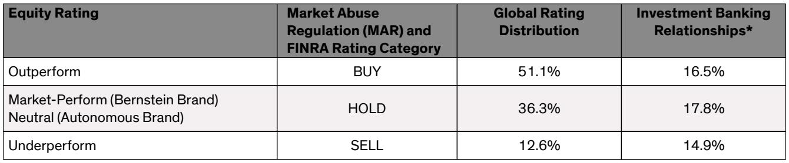

# A US-Iran Peace Deal Reshapes India’s Market Calculus, But the Real Story Is Not the Rebound

The announcement of a US-Iran peace deal, confirmed by both parties and their mediators, marks a definitive turning point for Indian markets that have been held hostage by Middle Eastern geopolitics for months. This is not another fleeting ceasefire; it is a structural shift in the risk landscape that demands a fundamental reassessment of sector positioning, fiscal trajectory, and strategic exposure. The immediate market celebration is warranted, but the most consequential implications lie beneath the surface of the crude oil price decline.

Indian equities have been trading under the shadow of a potential escalation that threatened to push crude into triple digits, disrupt supply chains through the Strait of Hormuz, and exacerbate an already challenging inflation environment. The removal of that tail risk is significant, but it is not a catalyst for a broad-based bull market. The peace deal solves one problem—geopolitical uncertainty—while leaving several others intact, including elevated valuations, the structural headwind of the AI trade, and domestic monsoon risks.

The real analytical challenge is to distinguish between the transient relief rally and the durable shifts in fundamentals that will define the next 12 months. Crude oil prices have already corrected to $83, but this move is driven more by sentiment than by a material change in supply-demand dynamics. The reopening of the Strait of Hormuz removes a supply disruption risk, but it does not create a surplus of oil. Demand is likely to pick up as global economic activity stabilizes, which will provide a floor under prices. The most realistic scenario is that crude remains rangebound between $75 and $90, far from the panic levels of $100-plus, but also far from the benign $60-$70 range that would provide a genuine tailwind for the Indian economy.

This nuance is critical because it determines which sectors genuinely benefit and which are merely riding the wave of relief. The market will initially treat all Middle East-sensitive names as winners, but the dispersion between structural beneficiaries and cyclical noise will widen rapidly as the initial euphoria fades. Investors who treat this as a simple "peace trade" will find themselves holding the wrong positions when the dust settles.

## The Rebound Trade Has Clear Winners, But They Are Narrower Than The Market Believes

The direct beneficiaries of the peace deal are concentrated in sectors where the operating model is highly sensitive to crude oil prices and Middle Eastern exposure. Oil marketing companies (OMCs) stand to gain the most immediately, as lower crude prices improve their margins and reduce the need for government-administered price caps. Aviation stocks will benefit from lower fuel costs, and travel-related names with MENA exposure will see a normalization of demand that was suppressed by conflict fears. These are the obvious, first-order trades, and they will likely play out over the next few weeks.

Healthcare is a more interesting beneficiary, not because of direct Middle East exposure, but because the easing of geopolitical tensions reduces the risk of US pricing pressures that had been a headwind for Indian pharmaceutical exporters. The US regulatory environment becomes more predictable when the administration is not distracted by a major foreign policy crisis, and this creates a favorable backdrop for companies that have been navigating a complex pricing landscape. This is a second-order effect that the market may not fully price in immediately.

The infrastructure-linked opportunity is perhaps the most underappreciated aspect of the peace deal. A decisive end to hostilities in the Middle East will likely unlock a wave of investment announcements in energy-linked and water-linked infrastructure across the region. Indian industrial companies with capabilities in these areas could see meaningful order inflows over the coming months, particularly if the peace deal facilitates greater economic integration between the Gulf states and South Asia. This is a medium-term catalyst that extends well beyond the initial relief rally.

However, the temptation to extrapolate these sectoral benefits into a broad market call must be resisted. The IT sector, for example, may benefit from an easing of the rate hike overhang in the US, which could support corporate spending on technology. But this is a marginal improvement in a sector that is still grappling with structural challenges around AI disruption and client budget optimization. The peace deal does not change the fact that India is on the wrong side of the AI trade, and IT companies will need to demonstrate genuine transformation rather than cyclical recovery to justify their current valuations.

## The Fiscal Glide Path Hinges On Sanction Waivers, Not Just Lower Crude

The most consequential strategic implication of the peace deal for India is not the immediate crude price decline, but the possibility of a sanction waiver on Iranian crude. Iran has claimed that the deal includes such a waiver, and while the details remain unconfirmed, the logic is compelling. The US has a strong incentive to suppress crude prices quickly, and allowing Iranian oil back into the market is the most effective way to achieve that without triggering a recession. If a waiver materializes, crude prices could fall below $80, and the impact on India's fiscal arithmetic would be transformative.

The Bernstein analysis shows that India's fiscal deficit target of 4.3% for FY27 is achievable if crude stays around $90, but it deviates to 4.7% at $100 and 4.9% at $110. A move below $80 would not only keep the deficit on track but could actually improve the fiscal trajectory, creating room for either higher capital expenditure or lower borrowing. This is the difference between a government that is constrained by energy costs and one that has fiscal flexibility to pursue growth-oriented policies.

The rupee would also benefit from lower crude prices, as India's import bill shrinks and the current account deficit narrows. A stronger rupee would in turn support foreign portfolio inflows, creating a virtuous cycle that reinforces the positive market sentiment. But this scenario is contingent on the sanction waiver being real and durable. If the waiver is partial, temporary, or subject to renegotiation, the benefits will be muted, and the market will quickly revert to focusing on the structural challenges that remain.

The Chabahar port opportunity is an even bigger strategic catalyst that is not yet priced into the market. If the peace deal facilitates the operationalization of Chabahar as a transit hub for Indian goods to Central Asia, the implications for trade costs and connectivity are profound. Lower shipping costs and reduced dependence on the Pakistan corridor would be a structural positive for Indian manufacturing and exports. This is a multi-year story that will unfold slowly, but the peace deal creates the geopolitical conditions for it to move from possibility to reality.

## The Report Does Not Fully Address The Risk Of Narrative Divergence Between US And Iran

The report correctly identifies that both parties will try to spin narratives due to domestic political compulsions, and that some devious details may only become visible in weeks. This is a critical caveat that deserves deeper exploration. The US and Iran have fundamentally different constituencies and objectives, and the peace deal may be interpreted very differently in Washington and Tehran. If the US presents the deal as a victory for economic pressure while Iran presents it as a validation of its regional role, the implementation could become fraught with contradictions.

The risk is that the deal unravels not through a single dramatic event, but through a series of small disagreements over interpretation. What constitutes a "sanction waiver" in practice? How quickly can Iranian oil actually ramp up production given years of underinvestment? Will the US administration face domestic political backlash for easing pressure on Iran? These questions are not fully answered by the report, and they represent the key analytical uncertainty that investors must monitor.

The market is pricing in a clean, linear path from peace deal to lower crude to higher equity prices. But the real world is rarely that cooperative. The most likely outcome is a messy, iterative process where the benefits accrue gradually and unevenly, and where periodic setbacks create volatility. Investors who position for a smooth recovery may be disappointed, while those who build portfolios that can withstand periodic turbulence will be rewarded.

## A Decision Framework For Navigating The Post-Deal Landscape

For investors trying to translate the peace deal into actionable portfolio decisions, the framework should prioritize durability over velocity. The initial rebound will reward those who are fastest to react, but the sustainable alpha will come from identifying which sectors have genuine structural tailwinds versus those that are merely experiencing a temporary relief rally.

The first filter should be exposure to crude oil price sensitivity. Sectors where crude is a direct input cost—OMCs, aviation, select chemicals—will benefit immediately and durably, provided the crude price decline holds. Sectors where crude is an indirect macro factor—consumer staples, autos—will see more muted benefits because the transmission mechanism is slower and more diffuse.

The second filter should be the nature of the geopolitical exposure. Companies with direct operations or contracts in the Middle East will benefit from a normalization of the operating environment, but this benefit is one-time and may already be partially priced in. Companies that stand to gain from the infrastructure buildout that follows a peace deal have a longer runway for growth, but the timing of order inflows is uncertain.

The third filter should be the domestic macro environment. The peace deal does not fix India's monsoon problem, it does not address the El Nino risk that the IMD has confirmed, and it does not change the fact that recent fuel and LPG price hikes will feed into inflation prints that have a supportive base effect from last year. Rate cuts remain effectively priced out for the near future, and the RBI will remain cautious until it sees concrete evidence that inflation is durably under control.

Investors should overweight sectors where the peace deal creates a structural improvement in the earnings outlook, and underweight sectors where the benefit is primarily sentiment-driven. The IT sector, for example, may rally on the back of lower US rate expectations, but the underlying demand environment remains challenged. Healthcare has a more compelling case because the pricing pressure relief is tangible and the sector's growth trajectory is less dependent on the broader macro cycle.

## The Full Picture Requires A Deeper Dive Into The Data

The analysis presented here captures the key strategic implications of the US-Iran peace deal for Indian markets, but the full picture requires a detailed examination of the sector-level positioning, the fiscal sensitivity analysis, and the scenario planning that underpins the conclusions. The Bernstein report contains specific sector weight recommendations, earnings growth projections, and valuation benchmarks that are essential for building a precise portfolio strategy.

The exhibit showing sector positioning as of June 1 reveals a nuanced stance that goes beyond simple overweight and underweight calls. The overweight on IT, OMCs, industrials, and healthcare, combined with underweight on consumer discretionary and materials, reflects a sophisticated view of which sectors will benefit from the evolving macro environment. The fiscal deficit sensitivity table provides a clear framework for understanding how different crude price scenarios translate into government fiscal space, which in turn affects bond yields, currency, and equity risk premiums.

These are not details that can be summarized in a single article. They require careful study and integration into an investment process. The original report contains charts and tables that visualize these relationships in a way that text alone cannot replicate. For investors who want to move beyond the headlines and build a position that is grounded in rigorous analysis, the full report is an essential resource.

Join the community to read the full report and review the original charts.

*This article is for learning and discussion only and does not constitute investment advice.*

Personal reading notes and learning share only. Not investment advice.

