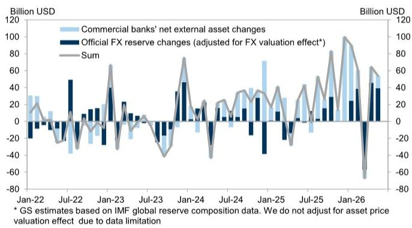
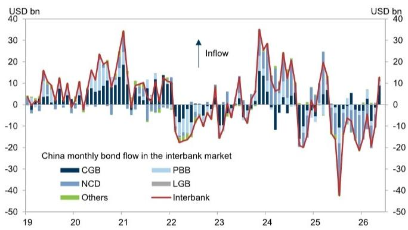
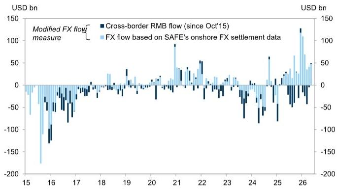

# China’s FX Inflows Are Accelerating, But the Composition Shift Reveals a More Fragile Recovery

China recorded net foreign exchange inflows of USD 50 billion in May, up sharply from USD 37 billion in April, according to the most granular reading of the country’s cross-border capital movements. At first glance, this appears to be an unambiguous positive signal: capital is flowing into the world’s second-largest economy at an accelerating pace, suggesting renewed confidence among foreign investors and a resilient trade surplus. But beneath the aggregate number lies a more nuanced story. The composition of these inflows is shifting in ways that raise important questions about sustainability, the role of policy intervention, and the true nature of China’s external position.

The May data, drawn from the State Administration of Foreign Exchange (SAFE), reveal that the current account channel remains the dominant driver of inflows, contributing USD 37 billion. Goods trade alone generated USD 53 billion of net inflows, up from USD 47 billion in April. Yet the FX conversion ratio for goods trade fell to 51 percent in May, down from 56 percent in April and significantly below the 74 percent average seen in the first quarter. This decline matters because it indicates that exporters are choosing to hold a larger share of their foreign currency earnings offshore rather than converting them into renminbi. In other words, the trade surplus is generating dollars, but those dollars are not fully entering the onshore financial system.

The portfolio investment channel tells a different story. North-Bound Bond Connect flows turned positive in May, recording USD 13 billion of inflows after a USD 10 billion outflow in April. This marks the first net bond purchase by foreign investors since April 2025, driven primarily by purchases of Chinese government bonds (CGBs). The broader proxy for capital flows—net foreign receipts related to portfolio investment—also showed improvement, rising to USD 18 billion in May from USD 14 billion in April. These figures suggest that foreign institutional investors are beginning to return to China’s bond market, attracted by yield differentials and a more stable renminbi outlook.

The official FX reserves rose by USD 39 billion after adjusting for valuation effects, while commercial banks’ net external assets increased by USD 15 billion. The combined increase in official reserves and bank external assets points to a broad-based accumulation of foreign assets by the Chinese financial system. But the divergence between the current account and portfolio channels, combined with the declining conversion ratio, suggests that the recovery in capital inflows is not yet self-sustaining. It may be more dependent on specific policy measures and market conditions than on a fundamental shift in investor sentiment.

## The Declining FX Conversion Ratio Signals a Structural Shift in Exporters’ Behavior

The drop in the FX conversion ratio from 74 percent in the first quarter to 51 percent in May is not a seasonal blip. It represents a strategic decision by Chinese exporters to retain foreign currency earnings rather than convert them into renminbi. This behavior is typically driven by expectations of renminbi depreciation, higher offshore yields, or a desire to maintain liquidity in hard currency. In the current environment, all three factors are likely at play.

Exporters are rational actors. When they expect the renminbi to weaken, they have a clear incentive to delay conversion. When offshore dollar deposit rates exceed onshore renminbi deposit rates, holding dollars becomes an income-maximizing strategy. And when geopolitical uncertainties or trade policy risks increase, maintaining a foreign currency buffer provides operational flexibility. The declining conversion ratio therefore acts as a real-time barometer of exporter sentiment. It suggests that the people who are closest to China’s trade flows—the exporters themselves—are not fully confident in the renminbi’s near-term outlook.

This has direct implications for the effectiveness of monetary policy. If a growing share of trade surplus dollars remains outside the onshore system, the People’s Bank of China has less control over domestic liquidity conditions. The central bank’s ability to manage the renminbi exchange rate is also constrained, because the supply-demand balance in the onshore FX market is increasingly disconnected from the true volume of trade-related dollar inflows. The May data therefore contain a warning: the trade surplus is large, but it is not translating into the kind of onshore dollar liquidity that would support renminbi stability or ease domestic financial conditions.

## The Return of Foreign Bond Buyers Is Real but Concentrated and Conditional

The turnaround in North-Bound Bond Connect flows is encouraging, but it requires careful interpretation. The USD 13 billion inflow in May reversed ten consecutive months of net outflows. However, the buying was concentrated in Chinese government bonds, with negligible purchases of local government bonds, policy bank bonds, or negotiable certificates of deposit. This concentration matters because it reveals the specific calculus driving foreign investors back into the market.

CGBs are the most liquid, most transparent, and most creditworthy instruments in China’s onshore bond market. They are also the instruments most likely to be included in global bond indices and held by central banks as reserve assets. The fact that foreign investors are buying CGBs but not other renminbi-denominated bonds suggests that their motivation is not a broad-based reallocation into Chinese credit. Instead, it reflects a tactical decision to capture yield carry in the safest available instrument, combined with a view that renminbi depreciation risk has diminished in the near term.

This creates a conditional recovery. If the renminbi stabilizes or appreciates modestly, foreign demand for CGBs may continue. But if depreciation pressures re-emerge, or if global risk appetite shifts, the same investors who bought in May could reverse their positions just as quickly. The portfolio channel remains highly sensitive to exchange rate expectations and global interest rate differentials. It is not yet driven by a structural conviction about China’s long-term growth prospects or the attractiveness of its capital markets.

Furthermore, the net foreign receipts measure—which captures both FX and renminbi-denominated flows—showed USD 18 billion of inflows in May, up from USD 14 billion in April. This broader measure suggests that some portfolio inflows are occurring through channels that do not appear in the Bond Connect data, such as direct offshore purchases of Chinese securities. But even this more comprehensive gauge remains well below the levels seen in early 2025, before the outflows began. The recovery is real, but it is not yet broad or deep.

## The Combined Increase in Official Reserves and Bank External Assets Raises Questions About Sterilization and Policy Coordination

The adjusted increase in official FX reserves of USD 39 billion, combined with the USD 15 billion rise in commercial banks’ net external assets, means that the Chinese financial system absorbed approximately USD 54 billion of foreign currency in May. This is a large number, and it raises the question of how the authorities are managing the associated domestic liquidity implications.

When the central bank purchases foreign currency to build reserves, it creates renminbi liquidity unless the operation is fully sterilized through the issuance of central bank bills or other tools. Similarly, when commercial banks increase their external assets, they are effectively lending dollars abroad, which reduces the domestic renminbi money supply. The net effect on domestic liquidity depends on the interaction between these two channels and on the sterilization actions taken by the PBOC.

The May data suggest that the authorities are allowing some of the FX inflows to flow through to the banking system rather than being fully absorbed by the central bank. Commercial banks’ net external assets have been rising steadily, reaching USD 1,505 billion in outstanding terms. This trend indicates that banks are increasingly acting as intermediaries for capital outflows, channeling dollars to offshore borrowers or investing in foreign assets. It also implies that the PBOC may be relying less on outright reserve accumulation and more on market-based mechanisms to manage the exchange rate.

This shift has strategic implications. By allowing banks to build external assets, the authorities are effectively creating a private-sector buffer that can absorb future capital flow reversals. But they are also reducing the transparency of China’s external position, because commercial bank balance sheets are less visible and less predictable than official reserves. The true scale of China’s net foreign asset position is becoming harder to measure, and the policy tools available to manage capital flows are becoming more diffuse.

## What the Report Does Not Fully Answer: The Sustainability of Portfolio Inflows and the Role of Policy Levers

The SAFE data provide a detailed snapshot of May’s flows, but they leave several critical questions unanswered. First, how much of the portfolio inflow was driven by genuine long-term allocation decisions versus short-term carry trades? The concentration in CGBs and the sensitivity to exchange rate expectations suggest that a significant portion may be speculative in nature. If global interest rates rise or if the renminbi weakens again, these inflows could reverse rapidly.

Second, what is the role of policy intervention in the May data? The report notes that North-Bound Bond Connect flows turned positive for the first time since April 2025, but it does not disclose whether the Chinese authorities took specific steps to encourage this outcome. Measures such as adjusting the counter-cyclical factor in the renminbi daily fixing, issuing offshore central bank bills, or providing guidance to state-owned banks could all have influenced the flow data. Without understanding the policy backdrop, it is difficult to assess whether the May improvement is a genuine market recovery or a managed outcome.

Third, how sustainable is the goods trade surplus? The USD 53 billion net inflow from goods trade in May is large, but it reflects both export volumes and import compression. If domestic demand recovers and imports rise, the trade surplus could narrow, reducing the current account contribution to overall inflows. The decline in the FX conversion ratio suggests that even the current surplus is not fully benefiting the onshore financial system.

Finally, what is the relationship between the increase in commercial banks’ external assets and the broader capital account liberalization agenda? The USD 1,505 billion in outstanding bank external assets represents a significant pool of private-sector foreign currency holdings. If the authorities decide to encourage repatriation of these assets—through tax incentives, regulatory changes, or moral suasion—it could provide a substantial boost to onshore FX liquidity. But if banks continue to build external assets, the net effect on China’s external position could be more ambiguous than the headline inflows suggest.

## A Decision Framework for Interpreting China’s Capital Flow Data

For investors and analysts trying to make sense of China’s external position, the May data offer a useful framework for ongoing assessment. The framework consists of three layers: the volume of flows, the composition of flows, and the behavioral signals embedded in the data.

At the volume layer, the key metric is the preferred FX flow measure, which combines onshore spot transactions, forward transactions, and cross-border renminbi flows. This aggregate gives a top-down view of whether net capital is flowing into or out of China. In May, the answer was clearly positive, with USD 50 billion of net inflows. But volume alone is misleading without understanding composition.

At the composition layer, the critical distinction is between current account and portfolio account flows. Current account inflows are more stable and less sensitive to short-term market conditions, but they depend on trade volumes and exporter behavior. Portfolio inflows are more volatile and more sensitive to exchange rate expectations, but they signal foreign investor confidence. The May data show that both channels were positive, but the current account channel was three times larger than the portfolio channel. This imbalance means that China’s external position remains heavily dependent on trade, which is itself subject to geopolitical and cyclical risks.

At the behavioral layer, the FX conversion ratio is the most important leading indicator. It captures the willingness of exporters to bring dollars onshore, which in turn affects onshore liquidity and exchange rate stability. A declining conversion ratio, as seen in May, is a warning signal that the private sector is hedging against renminbi depreciation. If this ratio continues to fall, it will offset the positive impact of the trade surplus and put downward pressure on the renminbi.

Investors should also monitor the divergence between official reserves and bank external assets. When both are rising, as in May, it suggests that the financial system is absorbing inflows through multiple channels. But when reserves are rising while bank external assets are falling, it may indicate that the central bank is intervening more aggressively. When both are falling, it signals net capital outflows. The combination of rising reserves and rising bank external assets is the most benign scenario, but it also creates a larger stock of private-sector foreign assets that could be deployed in ways that are not immediately visible to policymakers.

## The Analytical Gap That Demands Deeper Investigation

The May SAFE data provide a valuable but incomplete picture of China’s capital flow dynamics. The headline numbers are positive, but the underlying signals—the declining conversion ratio, the concentration of bond buying, the buildup of bank external assets—point to a recovery that is fragile and conditional. The most important analytical gap is the absence of a clear explanation for why the conversion ratio is falling and whether this trend is likely to continue.

A falling conversion ratio could reflect rational hedging by exporters in an environment of renminbi depreciation expectations. It could also reflect structural changes in how Chinese companies manage their foreign currency earnings, such as the growth of offshore supply chains or the use of trade finance instruments that delay conversion. It could even reflect policy-driven incentives for exporters to retain dollars, such as relaxed requirements for repatriation or the development of offshore dollar deposit markets. Each of these explanations has different implications for the outlook, and the SAFE data alone cannot distinguish between them.

Similarly, the portfolio inflow data raise questions about the role of the PBOC’s communication strategy and the impact of China’s economic policy announcements on foreign investor sentiment. Did the May bond buying reflect a genuine reassessment of China’s credit risk, or was it a response to specific policy signals such as the stabilization of the renminbi fixing or the announcement of fiscal stimulus measures? Without access to transaction-level data or investor surveys, it is impossible to know.

These gaps are not limitations of the report itself, but rather reflections of the inherent complexity of China’s capital flow system. The authorities release a wealth of data, but they do not always provide the context needed to interpret it. This creates an opportunity for analysts who are willing to dig deeper, cross-reference multiple data sources, and build their own frameworks for understanding the forces driving China’s external position.

Join the community to read the full report and review the original charts.

*This article is for learning and discussion only and does not constitute investment advice.*

Personal reading notes and learning share only. Not investment advice.

