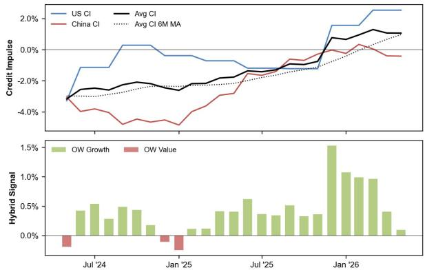
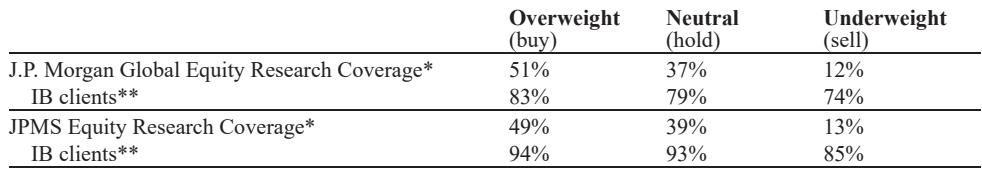
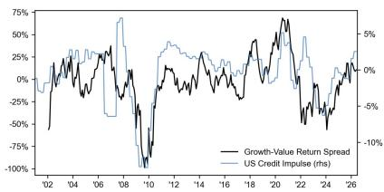

# The Credit Impulse Signal for Growth Over Value Is Still Flashing—But the Conviction Window Is Closing

The most overlooked macro input for equity style rotation is not earnings momentum, valuation spreads, or central bank rhetoric. It is credit impulse: the change in the flow of new credit relative to GDP. And right now, the combined US-China credit impulse is still marginally pointing toward Growth over Value. But the signal has lost nearly all of its conviction over the past three months, and the latest data prints from both the Federal Reserve and the People's Bank of China are pulling in opposite directions. For investors who rely on this framework, the question is no longer whether to lean Growth, but how to prepare for the moment when the signal inverts.

The logic is straightforward. Credit impulse acts as a proxy for the risky component of the discount rate. Growth stocks, with their longer-duration cash flows, are disproportionately sensitive to changes in this discount rate. When credit creation accelerates, the risky discount rate falls, and Growth names reprice upward. When credit creation decelerates, the opposite happens. A global investment bank's quantitative strategy team has built a simple averaged US-China credit impulse signal that has generated a 53% hit rate and an annualized return of 9.9% in a Growth versus Value backtest since 2018. That is not a trivial edge in a market where style rotation often feels like a coin flip.

The signal is currently still in "Overweight Growth" territory. But the conviction behind that signal has eroded meaningfully. Three months ago, the aggregate impulse was rising with clear momentum. Today, it sits only marginally above its six-month moving average. The latest data releases have created a divergence that demands careful interpretation.

---

## The US Credit Impulse Is Accelerating, and That Alone Favors Growth—but Only if China Does Not Pull the Aggregate Down

The first quarter of 2026 US flow-of-funds data revealed a clear step-up in private-sector credit creation. The US credit impulse rose to plus 2.5 percentage points from plus 1.6 percentage points in the prior quarter. This is a material acceleration. In the historical relationship between US credit impulse and the Growth versus Value return spread in MSCI China, such moves have typically preceded or coincided with a rotation toward Growth. The mechanism is not mysterious: easier credit conditions in the world's largest economy reduce global risk premiums and lower the effective discount rate applied to long-duration equity exposures.

But the US data alone is not sufficient. The aggregate signal used in the quantitative framework averages the US and China impulses together. And China's contribution has been deteriorating.

China's May total social financing data marked the third consecutive month of slowing credit expansion. The China credit impulse has now slipped to minus 0.4 percentage points. This is not a catastrophic decline, but it is a persistent one. The trend is clearly negative, and it has been for several months. The result is an aggregate US-China credit impulse that is still trending higher, but only barely. It is now hovering just above its six-month average, which is the kind of marginal positioning that historically has preceded reversals in the signal.

The implication is that the Growth trade is being propped up almost entirely by the US leg. If the US impulse were to stabilize or decline, or if China's impulse were to deteriorate further, the aggregate signal would flip to neutral or negative with surprising speed. Investors who are overweight Growth based on this framework should be watching both data series with equal intensity, not just the one that confirms their current positioning.

---

## The China Credit Impulse Has Become the Swing Factor, and Its Trajectory Is the Most Uncertain Variable in the Model

Since the inclusion of A-shares in MSCI indices in 2018, the China credit impulse has shown a remarkably close tracking relationship with the Growth versus Value return spread in China equities. When Chinese credit creation accelerates, Growth outperforms. When it decelerates, Value takes the lead. This relationship has held through the post-COVID credit boom, the property sector deleveraging, and the uneven recovery of 2024 and 2025.

The current reading of minus 0.4 percentage points is not yet deep in negative territory. But it is the direction of travel that matters more than the level. Three consecutive months of slowing TSF data suggest that the policy transmission mechanism is still not functioning as intended. Despite various measures to stimulate lending, the real economy's demand for credit remains tepid, and the financial system's willingness to extend new credit is constrained by legacy asset quality concerns.

The open question is whether Chinese authorities will respond with further easing measures that could reverse this trend. The report does not provide a forecast on this point, and it would be imprudent to assume one. But the analytical framework implies that if China's credit impulse stabilizes or improves, the aggregate signal would regain conviction. If it continues to deteriorate, the Growth trade becomes increasingly fragile.

This is the kind of second-order question that the quantitative model cannot answer. It can tell you what the signal is saying now. It cannot tell you whether the signal will persist. That is a judgment call that requires qualitative assessment of policy intent, structural reform progress, and the health of the credit transmission mechanism.

---

## The Aggregate Signal Is Positive but Marginal, and Marginal Signals Have Historically Produced the Worst Risk-Reward

One of the most underappreciated features of any quantitative signal is the difference between a strong signal and a marginal one. A credit impulse reading that is decisively above its historical average and trending higher provides a high-conviction backdrop for the Growth trade. A reading that is barely above its six-month moving average, as the current aggregate is, has historically produced a much weaker risk-reward profile.

The reason is intuitive. When the signal is strong, it tends to persist. When it is marginal, it is more likely to reverse, and reversals in credit impulse have historically been accompanied by sharp rotations in style factor performance. The backtest from the global investment bank's quant team shows that the worst drawdowns in the Growth versus Value trade have occurred not when the signal was clearly negative, but when it was transitioning from positive to negative.

The current positioning of the aggregate impulse just above its six-month average places the signal in exactly this transitional zone. It is not yet flashing a warning. But it is no longer flashing a confident green light either. The signal has shifted from "buy Growth" to "hold Growth with a tight stop." That is a subtle but critical distinction for portfolio construction.

---

## The Report Raises a Question It Does Not Fully Answer: What Happens When the Two Largest Economies' Credit Cycles Diverge?

The quantitative framework used in the analysis averages the US and China credit impulses into a single signal. This is a reasonable simplification for a systematic strategy. But it obscures a deeper analytical problem: what happens when the credit cycles of the world's two largest economies are moving in opposite directions?

The current configuration is a textbook example. The US impulse is accelerating. The China impulse is decelerating. The average is marginally positive. But an average of two diverging signals is not the same as a signal from two synchronized economies. The model treats the divergence as a reduction in conviction, which is correct. But it does not address the question of whether the divergence itself creates unique risks that are not captured by the average.

For example, if the US impulse continues to accelerate while the China impulse continues to decelerate, the aggregate could remain positive for some time. But the underlying driver of the Growth trade would be entirely dependent on the US leg. Any negative surprise in US credit conditions would then have an outsized impact on the signal. Conversely, if the China impulse were to recover while the US impulse stabilized, the signal would strengthen from a more balanced foundation.

The report does not resolve this ambiguity. It presents the data and the framework, and it notes the divergence. But it does not offer a rule for how to weight the two components when they conflict. This is not a criticism of the analysis. It is an honest acknowledgment that quantitative models have limits, and that the current environment is testing those limits. For readers who want to use this framework in their own decision-making, this unresolved question is precisely where the value of judgment comes in. The model tells you the signal. You have to decide how much to trust it.

---

## A Decision Framework for Investors: Treat the Current Signal as a Conditional Overweight, Not an Unconditional One

How should an investor operationalize this analysis? The answer is to distinguish between the signal itself and the conviction behind it.

The signal is "Overweight Growth." That is the output of the model. But the conviction is low. The aggregate impulse is barely above its six-month average. The two components are diverging. The historical hit rate of 53% is better than random, but it is not overwhelming. In this context, the appropriate response is not to ignore the signal, but to treat it as a conditional overweight rather than an unconditional one.

A conditional overweight means that the Growth tilt should be sized according to the strength of the signal, not just its direction. In the current environment, that suggests a modest tilt rather than a aggressive one. It also suggests that the position should be monitored more frequently than usual, and that a clear exit rule should be established in advance. If the aggregate impulse falls below its six-month average, the conditional overweight should be reduced or neutralized. If the China impulse deteriorates further, the same applies.

This framework also implies that the Growth overweight should be concentrated in names that have some buffer against a reversal. Stocks with strong fundamental growth, reasonable valuations, and lower sensitivity to discount rate changes would be less vulnerable if the credit impulse signal flips. In contrast, the most extended, highest-duration Growth names would be the most exposed.

The decision framework is not complicated. But it requires discipline. The temptation in a low-conviction signal is to ignore it entirely or to over-interpret it. The correct approach is to acknowledge the signal, size the position appropriately, and prepare for a potential reversal. That is the essence of quantitative humility.

---

## Join the Community to Read the Full Report and Review the Original Charts

The analysis above draws on a detailed quantitative strategy report that includes the full backtest results, the construction methodology for the credit impulse indicators, and the historical relationship between each leg of the signal and the Growth versus Value return spread. The original charts show the precise tracking between US credit impulse and the return spread since 2002, and between China credit impulse and the spread since the 2018 A-share inclusion. These visualizations are essential for understanding the nuances of the framework, particularly the periods when the relationship broke down and what that meant for subsequent performance.

The report also contains the full data series for the aggregate credit impulse, the six-month moving average, and the hybrid signal that determines the Overweight Growth or Overweight Value recommendation. For investors who want to replicate or adapt this framework for their own use, the raw data and the explicit methodology are available in the original document.

Join the community to read the full report and review the original charts. The unresolved questions raised here—how to weight diverging credit cycles, when to override a marginal signal, and what fundamental factors can provide a buffer against a style rotation—are exactly the kinds of debates that benefit from a shared analytical foundation and an engaged audience.

*This article is for learning and discussion only and does not constitute investment advice.*

Personal reading notes and learning share only. Not investment advice.

