## Investor Presentation | Asia Pacific

## China Equity Strategy: Forging New Horizons

MS ASIA LIMITED+

## Laura Wang

Equity Strategist

Laura.Wang@morganstanley.com +852 2848-6853

## Chloe Liu

Equity Strategist

Chloe.Liu1@morganstanley.com +852 2848-5497

## Vicky Wu

Equity Strategist

Vicky.Wu@morganstanley.com +852 3963-3928

## Asia Summer School 2026

MS does and seeks to do business with companies covered in MS. As a result, investors should be aware that the firm may have a conflict of interest that could affect the objectivity of MS. Investors should consider MS as only a single factor in making their investment decision.

## For analyst certification and other important disclosures, refer to the Disclosure Section, located at the end of this report.

+= Analysts employed by non-U.S. affiliates are not registered with FINRA, may not be associated persons of the member and may not be subject to FINRA restrictions on communications with a subject company, public appearances and trading securities held by a research analyst account.

## FOUNDATION

## MS

Jun 15, 2026

## INVESTOR PRESENTATION

## China Equity Strategy Forging New Horizons

MS
Asia/Pacific

MS Asia Limited+

## Laura Wang

## Equity Strategist

Laura.Wang@morganstanley.com

+852 2848-6853

## Chloe Liu

## Equity Strategist

Chloe.Liu1@morganstanley.com

+852 2848-5497

## Vicky Wu

## Equity Strategist

Vicky.Wu@morganstanley.com

+852 3963-3928

MS does and seeks to do business with companies covered in MS. As a result, investors should be aware that the firm may have a conflict of interest that could affect the objectivity of MS. Investors should consider MS as only a single factor in making their investment decision.

For analyst certification and other important disclosures, refer to the Disclosure Section, located at the end of this report.

+= Analysts employed by non-U.S. affiliates are not registered with FINRA, may not be associated persons of the member and may not be subject to FINRA restrictions on communications with a subject company, public appearances and trading securities held by a research analyst account.

MSCI China has underperformed Emerging Market YTD mainly due to AI memory super-cycle; We stay Equal-weight on China  
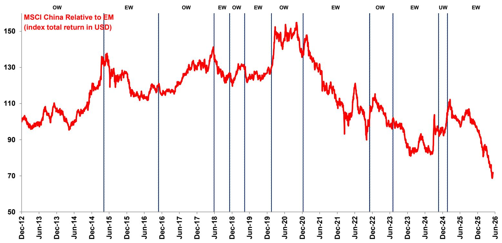

line chart

| Date     | MSCI China Relative to EM (index total return in USD) |
| -------- | ---------------------------------------------------- |
| Dec-12   | ~95                                                  |
| Jun-13   | ~100                                                 |
| Dec-13   | ~105                                                 |
| Jun-14   | ~100                                                 |
| Dec-14   | ~110                                                 |
| Jun-15   | ~130                                                 |
| Dec-15   | ~125                                                 |
| Jun-16   | ~120                                                 |
| Dec-16   | ~125                                                 |
| Jun-17   | ~130                                                 |
| Dec-17   | ~135                                                 |
| Jun-18   | ~140                                                 |
| Dec-18   | ~130                                                 |
| Jun-19   | ~135                                                 |
| Dec-19   | ~140                                                 |
| Jun-20   | ~150                                                 |
| Dec-20   | ~145                                                 |
| Jun-21   | ~135                                                 |
| Dec-21   | ~125                                                 |
| Jun-22   | ~110                                                 |
| Dec-22   | ~90                                                  |
| Jun-23   | ~85                                                  |
| Dec-23   | ~80                                                  |
| Jun-24   | ~85                                                  |
| Dec-24   | ~90                                                  |
| Jun-25   | ~95                                                  |
| Dec-25   | ~90                                                  |
| Jun-26   | ~70                                                  |

Source: MSCI, FactSet, DataStream, MS. Data as of June 8, 2026. Past performance is no guarantee of future results.

## MS

Index performance and Sharpe Ratio (MSCI China, CSI 300, MSCI EM, S&P 500) – CSI 300 demonstrating superior risk-adjusted returns in 2025 and 2026 YTD

<table><tr><td rowspan="2"></td><td colspan="3">Total return in USD</td><td colspan="2">2025</td><td colspan="3">2026 YTD</td></tr><tr><td>24 Sep 2024 - Now</td><td>2025</td><td>2026 YTD</td><td>Standard deviation (Annualized)</td><td>Sharpe ratio (Annualized)</td><td>Annualized return</td><td>Standard deviation (Annualized)</td><td>Sharpe ratio (Annualized)</td></tr><tr><td>MSCI China</td><td>28%</td><td>27%</td><td>-10%</td><td>24%</td><td>0.95</td><td>-23%</td><td>21%</td><td>-1.34</td></tr><tr><td>CSI 300</td><td>53%</td><td>23%</td><td>5%</td><td>15%</td><td>1.44</td><td>12%</td><td>15%</td><td>0.68</td></tr><tr><td>Hang Seng</td><td>34%</td><td>28%</td><td>-4%</td><td>23%</td><td>1.00</td><td>-11%</td><td>20%</td><td>-0.76</td></tr><tr><td>MSCI EM</td><td>49%</td><td>31%</td><td>18%</td><td>15%</td><td>1.70</td><td>50%</td><td>25%</td><td>1.83</td></tr><tr><td>S&amp;P 500</td><td>30%</td><td>16%</td><td>8%</td><td>18%</td><td>0.66</td><td>21%</td><td>14%</td><td>1.25</td></tr></table>

Source: Datastream, Bloomberg, MS.  
Note: Data as of June 9, 2026. Past performance is no guarantee of future results. Results do not include transaction costs/fees. 10-year Chinese government bond yield is used in CSI300 related calculations, compared to US treasury 10-year yield for other cases.

Underneath the lackluster performance – A more thematic growth focused and better performing market masked by the index composition  
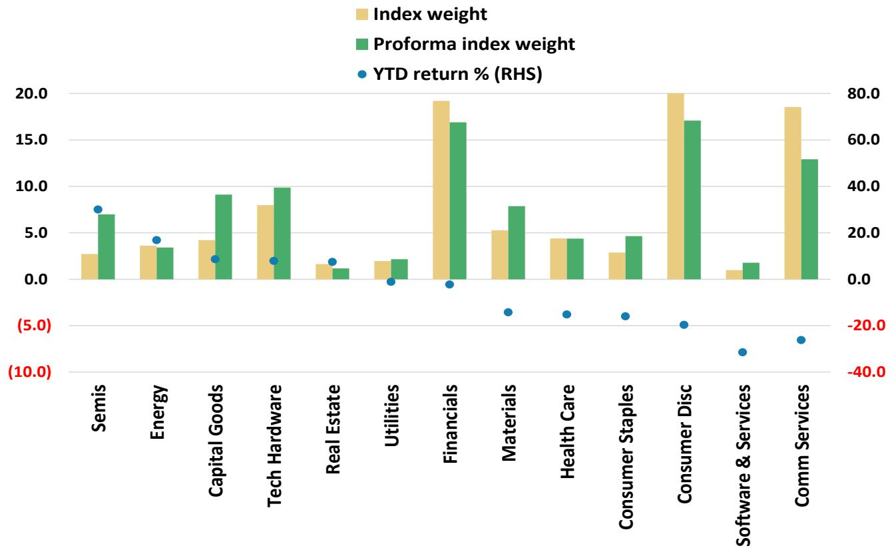

bar-line hybrid chart

| Category          | Index weight | Proforma index weight | YTD return % (RHS) |
| ----------------- | ------------ | --------------------- | ------------------ |
| Semis             | 2.5          | 7.0                   | 7.5                |
| Energy            | 3.5          | 3.0                   | 4.0                |
| Capital Goods     | 4.0          | 9.0                   | 2.0                |
| Tech Hardware     | 8.0          | 10.0                  | 2.0                |
| Real Estate       | 1.5          | 1.0                   | 2.0                |
| Utilities         | 2.0          | 2.0                   | -1.0               |
| Financials        | 19.0         | 17.0                  | -1.0               |
| Materials         | 5.0          | 8.0                   | -6.0               |
| Health Care       | 4.0          | 4.0                   | -6.0               |
| Consumer Staples  | 3.0          | 4.5                   | -6.0               |
| Consumer Disc     | 20.0         | 17.0                  | -5.0               |
| Software & Services | 1.0          | 1.5                   | -35.0              |
| Comm Services     | 18.5         | 13.0                  | -35.0              |

Source: FactSet, MS. Data as of June 8, 2026.

## MS

China has implemented a systemic framework on industrial upgrade and innovation  
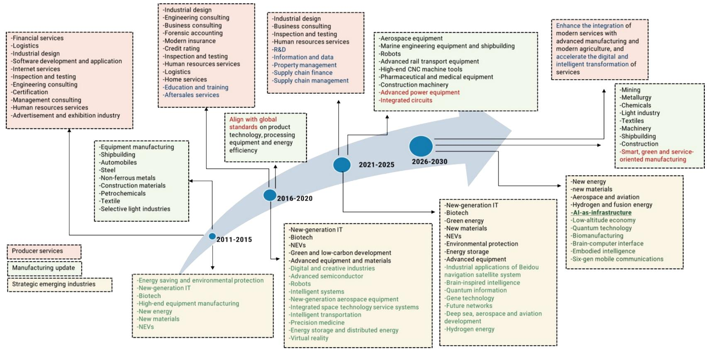

flowchart

```mermaid
graph TD
  A["2011-2015"] --> B["2016-2020"]
  B --> C["2021-2025"]
  C --> D["2026-2030"]
  D --> E["Enhance the integration of modern services with advanced manufacturing and modern agriculture, and accelerate the digital and intelligent transformation of services"]
  E --> F["-Mining"]
  E --> G["-Metallurgy"]
  E --> H["-Chemicals"]
  E --> I["-Light industry"]
  E --> J["-Textiles"]
  E --> K["-Machinery"]
  E --> L["-Shipbuilding"]
  E --> M["-Construction"]
  E --> N["-Smart, green and service-oriented manufacturing"]
  A --> O["Strategic emerging industries"]
  O --> P["Producer services"]
  O --> Q["Manufacturing update"]
  O --> R["Equipment manufacturing"]
  R --> S["Financial services"]
  O --> T["Industrial design"]
  T --> U["-Logistics"]
  T --> V["-Industrial design"]
  T --> W["-Software development and application"]
  T --> X["-Internet services"]
  T --> Y["-Inspection and testing"]
  T --> Z["-Engineering consulting"]
  T --> AA["-Certification"]
  T --> AB["-Management consulting"]
  T --> AC["-Human resources services"]
  T --> AD["-Advertisement and exhibition industry"]
  O --> AE["New generation IT"]
  AE --> AF["-Biotech"]
  AE --> AG["-High-end equipment manufacturing"]
  AE --> AH["-New energy"]
  AE --> AI["-New materials"]
  AE --> AJ["-NEVs"]
  O --> AK["Energy saving and environmental protection"]
  AK --> AL["-New-generation IT"]
  AK --> AM["-Biotech"]
  AK --> AN["-High-end equipment manufacturing"]
  AK --> AO["-New energy"]
  AK --> AP["-New materials"]
  AK --> AQ["-NEVs"]
  B --> AR["Align with global standards on product technology, processing equipment and energy efficiency"]
  B --> AS["Align with global standards on product technology, processing equipment and energy efficiency"]
  B --> AT["Align with global standards on product technology, processing equipment and energy efficiency"]
```

Source: Government website, MS.

## MS

Evolution of recent Five-Year Plans – A clear focus on quality growth and tech innovation  
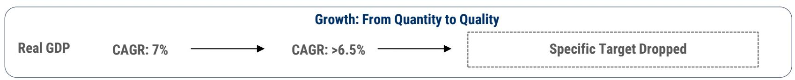

flowchart

| Category             | Value     |
| -------------------- | --------- |
| Real GDP             | CAGR: 7%  |
| Growth: From Quantity to Quality | CAGR: >6.5% |
| Specific Target Dropped | (not labeled) |

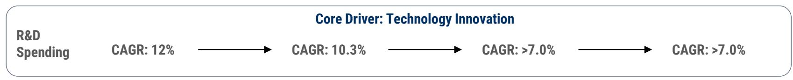

line chart

| R&D Spending | CAGR   |
| ------------ | ------ |
|          | 12%    |
|          | 10.3%  |
|          | >7.0%  |
|          | >7.0%  |

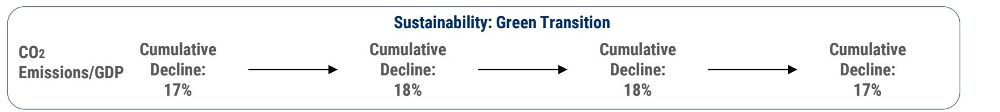

line chart

| CO₂ Emissions/GDP | Cumulative Decline |
| ----------------- | ------------------ |
| 2017              | 17%                |
| 2018              | 18%                |
| 2019              | 18%                |
| 2020              | 17%                |

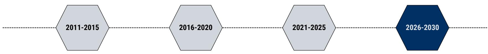

flowchart

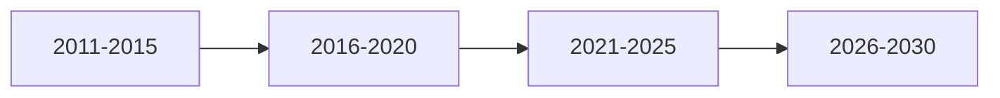
```mermaid
graph LR
  A["2011-2015"] --> B["2016-2020"]
  B --> C["2021-2025"]
  C --> D["2026-2030"]
```

Source: NPC, MS.

## Exports continue to anchor cyclical growth, positioning China's electronics and renewable supply chains as direct beneficiaries

Two structural drivers for export growth  
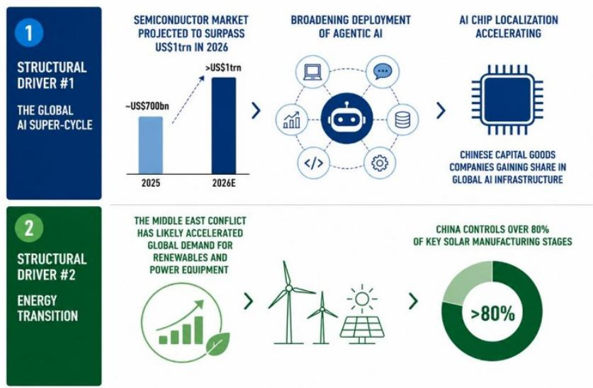

flowchart

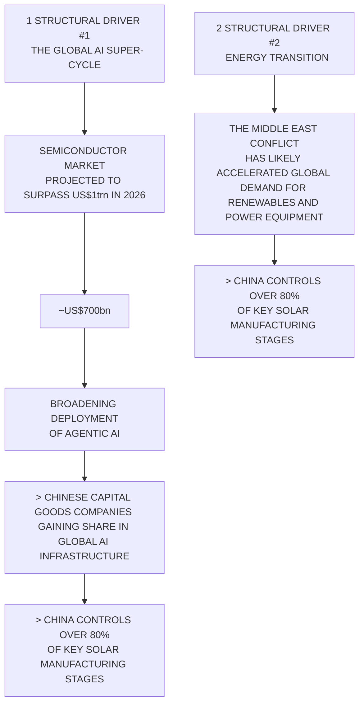
```mermaid
graph TD
    A["1 STRUCTURAL DRIVER #1<br>  THE GLOBAL AI SUPER-CYCLE"] --> B["SEMICONDUCTOR MARKET<br>PROJECTED TO SURPASS US$1trn IN 2026"]
  B --> C["~US$700bn"]
  C --> D["BROADENING DEPLOYMENT<br>OF AGENTIC AI"]
  D --> E["> CHINESE CAPITAL GOODS COMPANIES GAINING SHARE IN GLOBAL AI INFRASTRUCTURE"]
  E --> F["> CHINA CONTROLS OVER 80%<br>OF KEY SOLAR MANUFACTURING STAGES"]
    G["2 STRUCTURAL DRIVER #2<br>  ENERGY TRANSITION"] --> H["THE MIDDLE EAST CONFLICT<br>HAS LIKELY ACCELERATED GLOBAL DEMAND FOR RENEWABLES AND POWER EQUIPMENT"]
  H --> I["> CHINA CONTROLS OVER 80%<br>OF KEY SOLAR MANUFACTURING STAGES"]
```

China's deep electronics and renewable supply chains will be direct beneficiary  
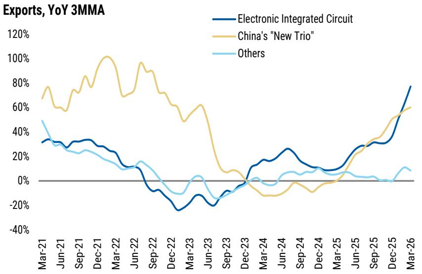

line chart

| Date    | Electronic Integrated Circuit | China's "New Trio" | Others |
|---------|----------------------------------|--------------------|--------|
| Mar-21  | ~35%                             | ~70%               | ~50%   |
| Jun-21  | ~30%                             | ~60%               | ~30%   |
| Sep-21  | ~35%                             | ~80%               | ~25%   |
| Dec-21  | ~30%                             | ~100%              | ~20%   |
| Mar-22  | ~25%                             | ~90%               | ~15%   |
| Jun-22  | ~15%                             | ~70%               | ~10%   |
| Sep-22  | ~10%                             | ~60%               | ~5%    |
| Dec-22  | ~-10%                            | ~50%               | ~0%    |
| Mar-23  | ~-25%                            | ~40%               | ~5%    |
| Jun-23  | ~-15%                            | ~60%               | ~0%    |
| Sep-23  | ~-5%                             | ~10%               | ~-5%   |
| Dec-23  | ~5%                              | ~5%                | ~0%    |
| Mar-24  | ~15%                             | ~0%                | ~5%    |
| Jun-24  | ~25%                             | ~-5%               | ~10%   |
| Sep-24  | ~15%                             | ~-10%              | ~5%    |
| Dec-24  | ~10%                             | ~-5%               | ~0%    |
| Mar-25  | ~15%                             | ~5%                | ~5%    |
| Jun-25  | ~25%                             | ~15%               | ~10%   |
| Sep-25  | ~30%                             | ~30%               | ~5%    |
| Dec-25  | ~40%                             | ~45%               | ~0%    |
| Mar-26  | ~80%                             | ~60%               | ~10%   |

Source: CEIC, MS estimates. "New Trio" includes EVs, lithium batteries, and solar cells.

## China has been widening its lead in global export since 2022; We expect further acceleration given China's best positioning in global AI/Energy Capex super cycle supply chain

China likely to contribute 16.5% of global export market share by 2030...  
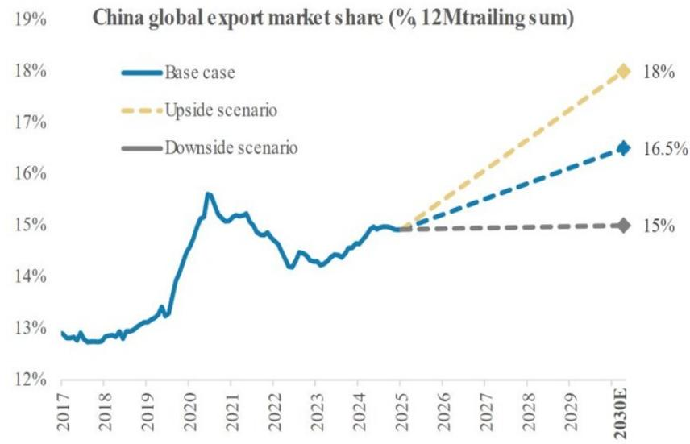

line chart

China global export market share (% 12Mtrailing sum)
| Year | Base case (%) | Upside scenario (%) | Downside scenario (%) |
| :--- | :--- | :--- | :--- |
| 2017 | 12.8 | - | - |
| 2018 | 12.9 | - | - |
| 2019 | 13.2 | - | - |
| 2020 | 15.6 | - | - |
| 2021 | 15.2 | - | - |
| 2022 | 14.8 | - | - |
| 2023 | 14.3 | - | - |
| 2024 | 14.8 | - | - |
| 2025 | 15.0 | 15.0 | 15.0 |
| 2026 | - | 15.5 | 15.0 |
| 2027 | - | 16.0 | 15.0 |
| 2028 | - | 16.5 | 15.0 |
| 2029 | - | 17.0 | 15.0 |
| 2030E | 16.5 | 18.0 | 15.0 |

...while continuing to play a critical role in global supply chain despite diversification  
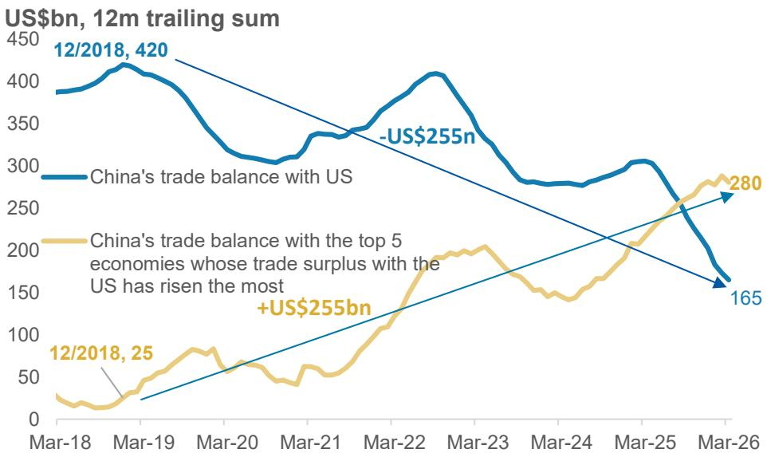

line chart

| Date     | China's trade balance with US (US$bn) | China's trade balance with the top 5 economies whose trade surplus with US ($bn) |
|----------|----------------------------------------|------------------------------------------------------------------|
| 12/2018  | 420                                    | 25                                                               |
| Mar-26   | 165                                    | 280                                                              |

Source: Haver, MS estimates.

Asia/EM/China 2Q 2027 index targets – Wide range across bull/base/bear cases

<table><tr><td rowspan="2"></td><td rowspan="2">Index</td><td rowspan="2">Current Price</td><td rowspan="2">MS Target Price (Jun-2027)</td><td colspan="3">MS Top-Down EPS YoY %</td><td colspan="3">Consensus EPS Forecast YoY %</td><td rowspan="2">MS Target Fwd P/E Jun - 2027</td><td rowspan="2">Consensus 12m Fwd P/E Current</td></tr><tr><td>Dec-26</td><td>Dec-27</td><td>Dec-28</td><td>Dec-26</td><td>Dec-27</td><td>Dec-28</td></tr><tr><td rowspan="7">Base Case</td><td>TOPIX</td><td>3,852</td><td>4,30012%</td><td>2169%</td><td>2359%</td><td>26312%</td><td>25111%</td><td>27610%</td><td>2760%</td><td>17.5x</td><td>16.4x</td></tr><tr><td>MSCI EM</td><td>1,655</td><td>1,8009%</td><td>12540%</td><td>1369%</td><td>1414%</td><td>13456%</td><td>16020%</td><td>17811%</td><td>13.0x</td><td>11.5x</td></tr><tr><td>MSCI APxJ</td><td>854</td><td>9005%</td><td>5940%</td><td>648%</td><td>652%</td><td>6357%</td><td>7620%</td><td>8411%</td><td>14.0x</td><td>12.5x</td></tr><tr><td>Hang Seng</td><td>24,657</td><td>28,40015%</td><td>2,2547%</td><td>2,4087%</td><td>2,5576%</td><td>2,30412%</td><td>2,53810%</td><td>2,79410%</td><td>11.4x</td><td>10.3x</td></tr><tr><td>HSCEI</td><td>8,341</td><td>9,90019%</td><td>9395%</td><td>9936%</td><td>10506%</td><td>9235%</td><td>9837%</td><td>1,0547%</td><td>9.7x</td><td>9.3x</td></tr><tr><td>MSCI China</td><td>75</td><td>9121%</td><td>6.67%</td><td>7.210%</td><td>7.77%</td><td>6.614%</td><td>7.615%</td><td>8.614%</td><td>12.2x</td><td>10.8x</td></tr><tr><td>CSI300</td><td>4,714</td><td>5,40015%</td><td>31510%</td><td>34710%</td><td>3789%</td><td>35720%</td><td>40814%</td><td>45812%</td><td>14.8x</td><td>13.9x</td></tr><tr><td rowspan="7">Bull Case</td><td>TOPIX</td><td>3,852</td><td>4,90027%</td><td>22413%</td><td>25514%</td><td>29014%</td><td>25111%</td><td>27610%</td><td>2760%</td><td>18.0x</td><td>16.4x</td></tr><tr><td>MSCI EM</td><td>1,655</td><td>2,10027%</td><td>13550%</td><td>1479%</td><td>1545%</td><td>13456%</td><td>16020%</td><td>17811%</td><td>14.0x</td><td>11.5x</td></tr><tr><td>MSCI APxJ</td><td>854</td><td>1,08027%</td><td>6553%</td><td>7210%</td><td>732%</td><td>6357%</td><td>7620%</td><td>8411%</td><td>15.0x</td><td>12.5x</td></tr><tr><td>Hang Seng</td><td>24,657</td><td>32,40031%</td><td>2,2998%</td><td>2,5049%</td><td>2,6757%</td><td>2,30412%</td><td>2,53810%</td><td>2,79410%</td><td>12.5x</td><td>10.3x</td></tr><tr><td>HSCEI</td><td>8,341</td><td>11,00032%</td><td>9586%</td><td>1,0136%</td><td>1,0797%</td><td>9235%</td><td>9837%</td><td>1,0547%</td><td>10.6x</td><td>9.3x</td></tr><tr><td>MSCI China</td><td>75</td><td>10338%</td><td>6.78%</td><td>7.411%</td><td>8.08%</td><td>6.614%</td><td>7.615%</td><td>8.614%</td><td>13.3x</td><td>10.8x</td></tr><tr><td>CSI300</td><td>4,714</td><td>6,09029%</td><td>32111%</td><td>36112%</td><td>40111%</td><td>35720%</td><td>40814%</td><td>45812%</td><td>16.0x</td><td>13.9x</td></tr><tr><td rowspan="7">Bear Case</td><td>TOPIX</td><td>3,852</td><td>2,600-33%</td><td>2022%</td><td>2094%</td><td>2226%</td><td>25111%</td><td>27610%</td><td>2760%</td><td>12.0x</td><td>16.4x</td></tr><tr><td>MSCI EM</td><td>1,655</td><td>1,100-34%</td><td>10316%</td><td>101-2%</td><td>99-2%</td><td>13456%</td><td>16020%</td><td>17811%</td><td>11.0x</td><td>11.5x</td></tr><tr><td>MSCI APxJ</td><td>854</td><td>590-31%</td><td>5021%</td><td>512%</td><td>510%</td><td>6357%</td><td>7620%</td><td>8411%</td><td>11.5x</td><td>12.9x</td></tr><tr><td>Hang Seng</td><td>24,657</td><td>18,000-27%</td><td>2,1414%</td><td>2,2395%</td><td>2,3786%</td><td>2,30412%</td><td>2,53810%</td><td>2,79410%</td><td>7.8x</td><td>10.3x</td></tr><tr><td>HSCEI</td><td>8,341</td><td>6,200-26%</td><td>8923%</td><td>9234%</td><td>9452%</td><td>9235%</td><td>9837%</td><td>10547%</td><td>6.7x</td><td>9.3x</td></tr><tr><td>MSCI China</td><td>75</td><td>60-20%</td><td>6.13%</td><td>6.45%</td><td>6.75%</td><td>6.614%</td><td>7.615%</td><td>8.614%</td><td>9.1x</td><td>10.8x</td></tr><tr><td>CSI300</td><td>4,714</td><td>3,550-25%</td><td>3047%</td><td>3195%</td><td>3334%</td><td>35720%</td><td>40814%</td><td>45812%</td><td>10.9x</td><td>13.9x</td></tr></table>

Source: MSCI, IBES, Bloomberg, FactSet, RIMES, MS estimates. Note: Data as of June 8, 2026.

## MS bull/base/bear case index target history for MSCI China and the Hang Seng Index

MS target price history for MSCI China  
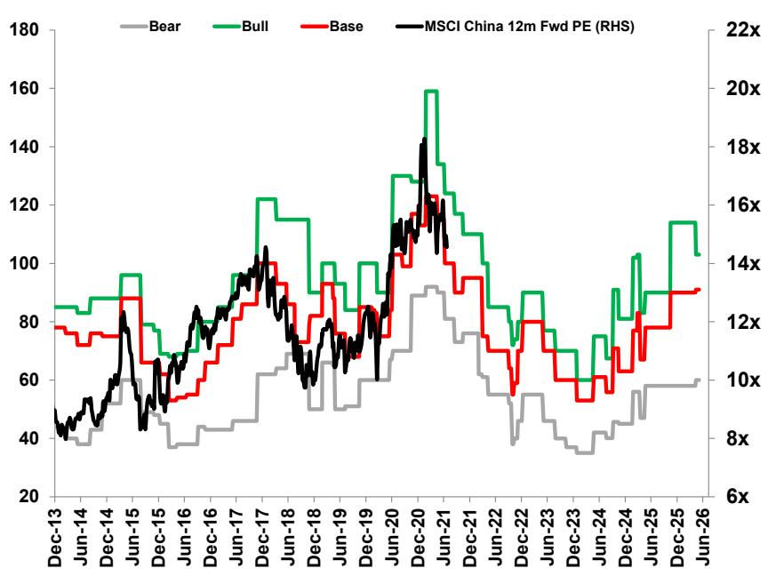

line chart

| Date    | Bear | Bull | Base | MSCI China 12m Fwd PE (RHS) |
|---------|------|------|------|-----------------------------|
| Dec-13  |      |      |      |                             |
| Jun-14  |      |      |      |                             |
| Dec-14  |      |      |      |                             |
| Jun-15  |      |      |      |                             |
| Dec-15  |      |      |      |                             |
| Jun-16  |      |      |      |                             |
| Dec-16  |      |      |      |                             |
| Jun-17  |      |      |      |                             |
| Dec-17  |      |      |      |                             |
| Jun-18  |      |      |      |                             |
| Dec-18  |      |      |      |                             |
| Jun-19  |      |      |      |                             |
| Dec-19  |      |      |      |                             |
| Jun-20  |      |      |      |                             |
| Dec-20  |      |      |      |                             |
| Jun-21  |      |      |      |                             |
| Dec-21  |      |      |      |                             |
| Jun-22  |      |      |      |                             |
| Dec-22  |      |      |      |                             |
| Jun-23  |      |      |      |                             |
| Dec-23  |      |      |      |                             |
| Jun-24  |      |      |      |                             |
| Dec-24  |      |      |      |                             |
| Jun-25  |      |      |      |                             |
| Dec-25  |      |      |      |                             |
| Jun-26  |      |      |      |                             |

MS target price history for Hang Seng  
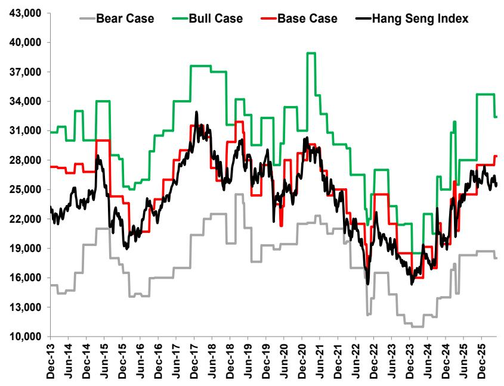

line chart

| Date    | Bear Case | Bull Case | Base Case | Hang Seng Index |
|---------|-----------|-----------|-----------|-----------------|
| Dec-13  | 15,000    | 31,000    | 28,000    | 22,000          |
| Jun-14  | 16,000    | 31,500    | 27,500    | 23,000          |
| Dec-14  | 17,000    | 32,000    | 28,500    | 24,000          |
| Jun-15  | 18,000    | 34,000    | 29,500    | 25,000          |
| Dec-15  | 19,000    | 31,500    | 28,500    | 26,000          |
| Jun-16  | 20,000    | 31,500    | 29,500    | 27,000          |
| Dec-16  | 21,000    | 32,500    | 31,500    | 28,500          |
| Jun-17  | 22,000    | 34,500    | 32,500    | 31,500          |
| Dec-17  | 23,000    | 37,500    | 33,500    | 33,500          |
| Jun-18  | 24,000    | 37,500    | 34,500    | 31,500          |
| Dec-18  | 25,000    | 34,500    | 33,500    | 29,500          |
| Jun-19  | 26,000    | 34,500    | 32,500    | 28,500          |
| Dec-19  | 27,000    | 34,500    | 31,500    | 27,500          |
| Jun-20  | 28,000    | 34,500    | 31,500    | 26,500          |
| Dec-20  | 29,500    | 39,500    | 31,500    | 28,500          |
| Jun-21  | 31,500    | 34,500    | 31,500    | 27,500          |
| Dec-21  | 32,500    | 34,500    | 31,500    | 26,500          |
| Jun-22  | 34,500    | 34,500    | 31,500    | 25,500          |
| Dec-22  | 36,500    | 34,500    | 31,500    | 24,500          |
| Jun-23  | 38,500    | 34,500    | 31,500    | 23,500          |
| Dec-23  | 41,500    | 34,500    | 31,500    | 22,500          |
| Jun-24  | 44,500    | 34,500    | 31,500    | 21,500          |
| Dec-24  | 47,500    | 34,500    | 31,500    | 21,500          |
| Jun-25  | 49,500    | 34,500    | 31,500    | 21,500          |
| Dec-25  | 51,500    | 34,500    | 31,500    | 21,500          |

Source: RIMES, FactSet, MS forecasts. Note: Weekly price index data as of June 3, 2026.

## Assessing MS's China framework – We see brighter spots in earnings and currency

<table><tr><td colspan="2"></td><td>2018</td><td>2020 Post Covid-19</td><td>2H 2021</td><td>Dec-22</td><td>Aug-23</td><td>Feb-25</td><td>2025 Year End</td><td>2026 Mid Year</td></tr><tr><td>1</td><td>Economic/Earnings Estimates</td><td>X</td><td>✓</td><td>Neutral</td><td>XX</td><td>XX</td><td>X</td><td>X</td><td>Neutral</td></tr><tr><td>2</td><td>Valuation</td><td>X</td><td>✓</td><td>X</td><td>Neutral</td><td>Neutral</td><td>✓</td><td>Neutral</td><td>Neutral</td></tr><tr><td>3</td><td>Liquidity</td><td>X</td><td>✓</td><td>X</td><td>✓</td><td>X</td><td>✓</td><td>✓</td><td>Neutral</td></tr><tr><td>4</td><td>Policy Cycle</td><td>X</td><td>✓</td><td>X</td><td>✓✓</td><td>✓</td><td>✓</td><td>✓</td><td>✓</td></tr><tr><td>5</td><td>USDCNY trend</td><td>X</td><td>✓</td><td>Neutral</td><td>✓</td><td>X</td><td>XX</td><td>X</td><td>✓</td></tr><tr><td>6</td><td>US/China &amp; geopolitical tension</td><td>X</td><td>Neutral/Slightly negative</td><td>Neutral/Slightly negative</td><td>Neutral/Slightly negative</td><td>Neutral/Slightly negative</td><td>X</td><td>Interim truce</td><td>Interim truce</td></tr><tr><td>7</td><td>Regulatory/Policy priority</td><td>X</td><td>Neutral</td><td>X</td><td>✓</td><td>XX</td><td>✓</td><td>✓</td><td>✓</td></tr><tr><td colspan="2"></td><td>Downgrade</td><td>Upgrade</td><td>Downgrade</td><td>Upgrade</td><td>Downgrade</td><td>Upgrade</td><td>PT increase</td><td>PT increase</td></tr></table>

Source: MS. Note: Tick indicates our view on the factor is improving, while x indicates the factor is deteriorating, and xx indicates a greater level of deterioration.

## Consensus earnings estimates for MSCI China and CSI300 – We expect further downward revisions for 2026 EPS but at decelerating speed

MS EPS base-case forecasts for MSCI China at Dec-26 and Dec-27  
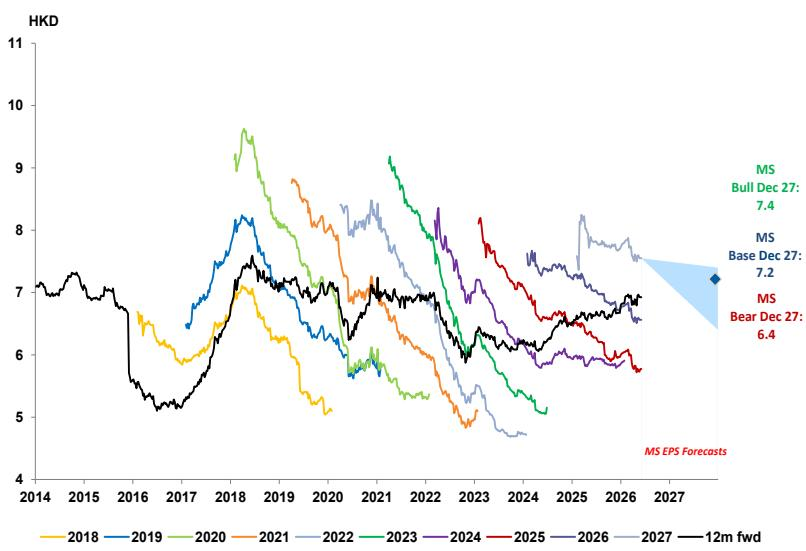

line chart

| Year | Value |
|------|-------|
| 2027 | 6.4 |
| 2027 | 7.2 |
| 2027 | 7.4 |

Source: IBES, Datastream, MS. Note: Weekly data as of June 4, 2026.

MS EPS base-case forecasts for CSI 300 at Dec-26 and Dec-27  
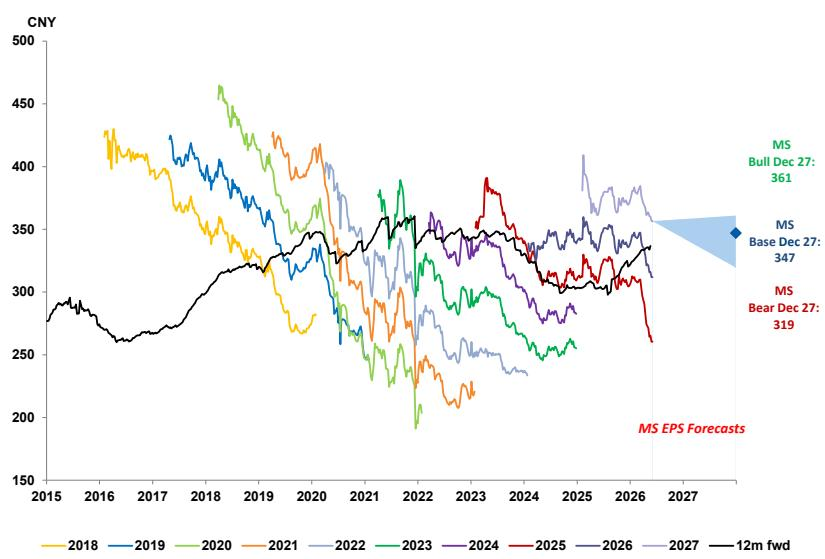

line chart

| Year | Value |
|------|-------|
| 2018 | ~430  |
| 2019 | ~410  |
| 2020 | ~460  |
| 2021 | ~400  |
| 2022 | ~350  |
| 2023 | ~380  |
| 2024 | ~340  |
| 2025 | ~360  |
| 2026 | ~350  |
| 2027 | ~340  |

Source: IBES, Datastream, MS. Note: Weekly data as of June 4, 2026.

## Downward earnings estimates revision pressure to peak out in 2Q and then improve

History of Chinese equity market quarterly earnings surprises by number of companies  
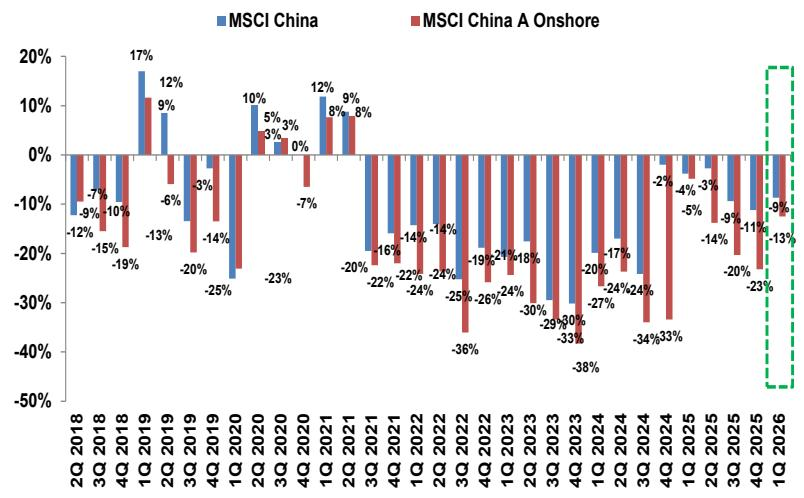

12-month forward consensus earnings estimate revision breadth (ERB, 3mma)  
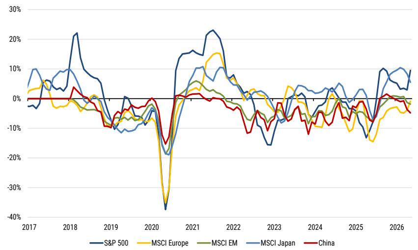

line chart

| Year | S&P 500 | MSCI Europe | MSCI EM | MSCI Japan | China |
|------|---------|-------------|---------|------------|-------|
| 2017 | ~-5%    | ~3%         | ~5%     | ~10%       | ~0%   |
| 2018 | ~22%    | ~-2%        | ~-3%    | ~10%       | ~4%   |
| 2019 | ~-10%   | ~-5%        | ~-5%    | ~-10%      | ~-5%  |
| 2020 | ~-35%   | ~-35%       | ~-35%   | ~-20%      | ~-15% |
| 2021 | ~15%    | ~5%         | ~5%     | ~10%       | ~0%   |
| 2022 | ~22%    | ~15%        | ~10%    | ~10%       | ~0%   |
| 2023 | ~-15%   | ~-5%        | ~-5%    | ~-5%       | ~-5%  |
| 2024 | ~-5%    | ~-5%        | ~-5%    | ~-5%       | ~-5%  |
| 2025 | ~-10%   | ~-10%       | ~-10%   | ~-5%       | ~-5%  |
| 2026 | ~10%    | ~-5%        | ~-5%    | ~10%       | ~-5%  |

Source: MSCI, Bloomberg, RIMES, Factset, MS. Data as of May 28, 2026.  
Source: Factset, MS. Note: Monthly data as of May 2026.

MSCI China consensus EPS composition by industry group

<table><tr><td></td><td colspan="3">Consensus EPS Contribution</td><td colspan="3">EPS Growth</td><td colspan="3">EPS Growth Contribution</td></tr><tr><td>MSCI China</td><td>2025E</td><td>2026E</td><td>2027E</td><td>2025E</td><td>2026E</td><td>2027E</td><td>2025E</td><td>2026E</td><td>2027E</td></tr><tr><td>Automobiles &amp; Components</td><td>0.09</td><td>0.18</td><td>0.26</td><td>26%</td><td>103%</td><td>41%</td><td>0.3%</td><td>1.4%</td><td>1.0%</td></tr><tr><td>Banks</td><td>1.61</td><td>1.59</td><td>1.66</td><td>2%</td><td>-1%</td><td>5%</td><td>0.6%</td><td>-0.4%</td><td>1.0%</td></tr><tr><td>Capital Goods</td><td>0.16</td><td>0.24</td><td>0.27</td><td>-15%</td><td>52%</td><td>14%</td><td>-0.5%</td><td>1.2%</td><td>0.4%</td></tr><tr><td>Commercial &amp; Professional Services</td><td>0.00</td><td>0.01</td><td>0.02</td><td>NM</td><td>NM</td><td>14%</td><td>0.0%</td><td>0.2%</td><td>0.0%</td></tr><tr><td>Consumer Durables &amp; Apparel</td><td>0.10</td><td>0.12</td><td>0.13</td><td>23%</td><td>14%</td><td>10%</td><td>0.3%</td><td>0.2%</td><td>0.2%</td></tr><tr><td>Consumer Services</td><td>0.14</td><td>0.15</td><td>0.28</td><td>-52%</td><td>5%</td><td>88%</td><td>-2.6%</td><td>0.1%</td><td>1.7%</td></tr><tr><td>Diversified Financials</td><td>0.13</td><td>0.16</td><td>0.18</td><td>3%</td><td>30%</td><td>9%</td><td>0.1%</td><td>0.6%</td><td>0.2%</td></tr><tr><td>Energy</td><td>0.21</td><td>0.27</td><td>0.27</td><td>-13%</td><td>25%</td><td>0%</td><td>-0.6%</td><td>0.8%</td><td>0.0%</td></tr><tr><td>Consumer Staples Distribution &amp; Retail</td><td>0.01</td><td>0.01</td><td>0.02</td><td>16%</td><td>7%</td><td>17%</td><td>0.0%</td><td>0.0%</td><td>0.0%</td></tr><tr><td>Food Beverage &amp; Tobacco</td><td>0.10</td><td>0.12</td><td>0.14</td><td>-19%</td><td>16%</td><td>15%</td><td>-0.4%</td><td>0.3%</td><td>0.2%</td></tr><tr><td>Health Care Equipment &amp; Services</td><td>0.03</td><td>0.02</td><td>0.03</td><td>-22%</td><td>-13%</td><td>10%</td><td>-0.1%</td><td>-0.1%</td><td>0.0%</td></tr><tr><td>Household &amp; Personal Products</td><td>0.01</td><td>0.01</td><td>0.01</td><td>20%</td><td>13%</td><td>5%</td><td>0.0%</td><td>0.0%</td><td>0.0%</td></tr><tr><td>Insurance</td><td>0.69</td><td>0.62</td><td>0.67</td><td>29%</td><td>-10%</td><td>8%</td><td>2.7%</td><td>-1.0%</td><td>0.7%</td></tr><tr><td>Materials</td><td>0.19</td><td>0.41</td><td>0.45</td><td>25%</td><td>116%</td><td>9%</td><td>0.7%</td><td>3.4%</td><td>0.5%</td></tr><tr><td>Media &amp; Entertainment</td><td>1.08</td><td>1.07</td><td>1.19</td><td>16%</td><td>0%</td><td>11%</td><td>2.6%</td><td>0.0%</td><td>1.5%</td></tr><tr><td>Pharmaceuticals, Biotechnology &amp; Life Sciences</td><td>0.09</td><td>0.12</td><td>0.15</td><td>88%</td><td>32%</td><td>24%</td><td>0.7%</td><td>0.4%</td><td>0.4%</td></tr><tr><td>Real Estate</td><td>0.08</td><td>0.09</td><td>0.11</td><td>14%</td><td>12%</td><td>15%</td><td>0.2%</td><td>0.2%</td><td>0.2%</td></tr><tr><td>Consumer Discretionary Distribution &amp; Retail</td><td>0.63</td><td>0.83</td><td>1.09</td><td>-36%</td><td>32%</td><td>32%</td><td>-6.1%</td><td>3.0%</td><td>3.5%</td></tr><tr><td>Semiconductors &amp; Semiconductor Equipment</td><td>-0.01</td><td>0.02</td><td>0.04</td><td>54%</td><td>NM</td><td>87%</td><td>0.2%</td><td>0.5%</td><td>0.3%</td></tr><tr><td>Software &amp; Services</td><td>-0.01</td><td>-0.01</td><td>0.00</td><td>-29%</td><td>NM</td><td>44%</td><td>0.0%</td><td>0.0%</td><td>0.0%</td></tr><tr><td>Technology Hardware &amp; Equipment</td><td>0.18</td><td>0.25</td><td>0.33</td><td>23%</td><td>38%</td><td>32%</td><td>0.6%</td><td>1.0%</td><td>1.1%</td></tr><tr><td>Telecommunication Services</td><td>0.02</td><td>0.02</td><td>0.02</td><td>10%</td><td>26%</td><td>7%</td><td>0.0%</td><td>0.1%</td><td>0.0%</td></tr><tr><td>Transportation</td><td>0.09</td><td>0.10</td><td>0.11</td><td>-27%</td><td>10%</td><td>4%</td><td>-0.6%</td><td>0.1%</td><td>0.0%</td></tr><tr><td>Utilities</td><td>0.15</td><td>0.14</td><td>0.15</td><td>4%</td><td>-5%</td><td>6%</td><td>0.1%</td><td>-0.1%</td><td>0.1%</td></tr><tr><td>MSCI China</td><td>5.8</td><td>6.6</td><td>7.6</td><td>-2%</td><td>14%</td><td>15%</td><td>-2%</td><td>14%</td><td>15%</td></tr></table>

Source: IBES, MSCI, FactSet, Datastream, MS. Note: Data as June 9, 2026.

MSCI China index level earnings growth forecasts by industry based on MS bottom-up estimates

<table><tr><td>MSCI China SectorsEPS Growth Decomposition</td><td>Index weight*</td><td>2025E</td><td>2026E</td><td>2027E</td></tr><tr><td>Consumer Discretionary</td><td>22%</td><td>(28%)</td><td>5%</td><td>44%</td></tr><tr><td>Consumer Staples</td><td>2%</td><td>(1%)</td><td>25%</td><td>10%</td></tr><tr><td>Information Technology</td><td>9%</td><td>22%</td><td>15%</td><td>33%</td></tr><tr><td>Health Care</td><td>3%</td><td>43%</td><td>23%</td><td>(1%)</td></tr><tr><td>Communication Services</td><td>18%</td><td>9%</td><td>9%</td><td>14%</td></tr><tr><td>Utilities</td><td>1%</td><td>8%</td><td>(7%)</td><td>1%</td></tr><tr><td>Real Estate</td><td>1%</td><td>(39%)</td><td>26%</td><td>15%</td></tr><tr><td>Financials</td><td>18%</td><td>7%</td><td>(2%)</td><td>7%</td></tr><tr><td>Energy</td><td>3%</td><td>(12%)</td><td>30%</td><td>8%</td></tr><tr><td>Materials</td><td>4%</td><td>27%</td><td>79%</td><td>5%</td></tr><tr><td>Industrials</td><td>4%</td><td>1%</td><td>4%</td><td>15%</td></tr><tr><td colspan="5"></td></tr><tr><td>MS bottom up forecasts of EPS growth for MSCI China</td><td></td><td>(1%)</td><td>7%</td><td>16%</td></tr><tr><td>MS top down forecasts of EPS growth for MSCI China</td><td></td><td>5%</td><td>7%</td><td>10%</td></tr><tr><td>Consensus EPS growth for MSCI China</td><td></td><td>(2%)</td><td>14%</td><td>15%</td></tr></table>

Source: FactSet, Datastream, ModelWare, MS. Note: Data as of June 9, 2026. \*Only index weight of MS-covered stocks that are MSCI China constituents are counted. Hence it may not sum to $100\%$ due to coverage.

## We see stronger exports growth benefiting from global AI/Energy Capex super cycle; More clarity needs to be seen to call a sustainable reflation

Exports driving growth amid AI and energy capex super-cycle  
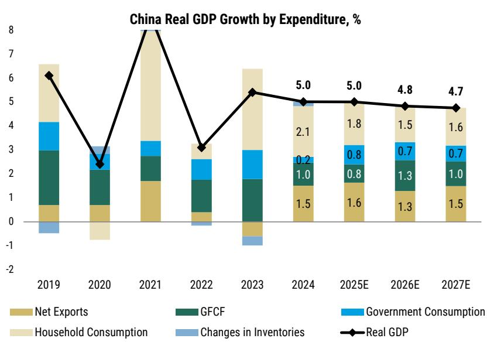

bar-line hybrid

China Real GDP Growth by Expenditure, %
| Year | Net Exports (%) | GFCF (%) | Government Consumption (%) | Household Consumption (%) | Changes in Inventories (%) | Real GDP (in %) |
| :--- | :--- | :--- | :--- | :--- | :--- | :--- |
| 2019 | 0.6 | 2.3 | 1.4 | 2.0 | -0.5 | 6.1 |
| 2020 | 0.7 | 1.4 | 0.5 | -0.8 | 0.1 | 2.4 |
| 2021 | 1.7 | 1.1 | 0.8 | 4.8 | -0.1 | 8.0 |
| 2022 | 0.3 | 1.4 | 1.1 | 0.1 | -0.2 | 3.1 |
| 2023 | -0.5 | 1.7 | 1.3 | 3.3 | -0.9 | 5.4 |
| 2024 | 1.5 | 1.0 | 0.2 | 2.1 | 0.1 | 5.0 |
| 2025E | 1.6 | 0.8 | 0.8 | 1.8 | 0.1 | 5.0 |
| 2026E | 1.3 | 1.3 | 0.7 | 1.5 | 0.1 | 4.8 |
| 2027E | 1.5 | 1.0 | 0.7 | 1.6 | 0.1 | 4.7 |

Inflation is rising but reflation is narrow  
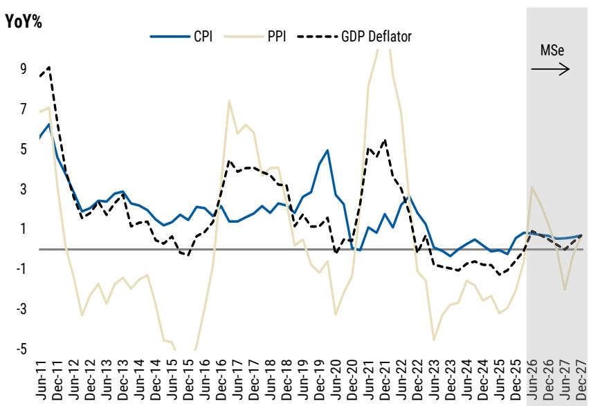

line chart

| Date    | CPI  | PPI  | GDP Deflator |
|---------|------|------|--------------|
| Jun-11  | 5.5  | 7.0  | 9.0          |
| Dec-11  | 6.0  | 7.5  | 8.5          |
| Jun-12  | 4.0  | -3.0 | 3.0          |
| Dec-12  | 3.0  | -2.0 | 2.0          |
| Jun-13  | 3.5  | -1.5 | 2.5          |
| Dec-13  | 3.0  | -1.0 | 2.0          |
| Jun-14  | 2.5  | -0.5 | 1.5          |
| Dec-14  | 2.0  | -0.5 | 1.0          |
| Jun-15  | 1.5  | -4.0 | -0.5         |
| Dec-15  | 2.0  | -5.0 | -1.0         |
| Jun-16  | 2.5  | -3.0 | -0.5         |
| Dec-16  | 3.0  | -1.0 | 0.0          |
| Jun-17  | 3.5  | 7.0  | 4.0          |
| Dec-17  | 4.0  | 6.0  | 3.5          |
| Jun-18  | 4.5  | 5.0  | 3.0          |
| Dec-18  | 5.0  | 4.0  | 2.5          |
| Jun-19  | 4.5  | 3.0  | 2.0          |
| Dec-19  | 5.0  | -3.0 | -1.0         |
| Jun-20  | 4.0  | -2.0 | -0.5         |
| Dec-20  | 3.0  | -1.0 | -0.5         |
| Jun-21  | 2.0  | -3.0 | -1.0         |
| Dec-21  | 1.0  | -4.0 | -2.0         |
| Jun-22  | 0.5  | -5.0 | -3.0         |
| Dec-22  | -0.5 | -6.0 | -4.0         |
| Jun-23  | -1.0 | -7.0 | -5.0         |
| Dec-23  | -1.5 | -8.0 | -6.0         |
| Jun-24  | -2.0 | -9.0 | -7.0         |
| Dec-24  | -2.5 | -10.0| -8.0         |
| Jun-25  | -3.0 | -11.0| -9.0         |
| Dec-25  | -3.5 | -12.0| -10.0        |
| Jun-26  | -4.0 | -13.0| -11.0        |
| Dec-26  | -4.5 | -14.0| -12.0        |
| Jun-27  | -5.0 | -15.0| -13.0        |
| Dec-27  | -5.5 | -16.0| -14.0        |

Source: CEIC, MS estimates.

## Policy to stay on cruise control given resilient organic growth and export strength

Augmented fiscal deficit will likely stay flat at this year, with no supplementary budget in 2H  
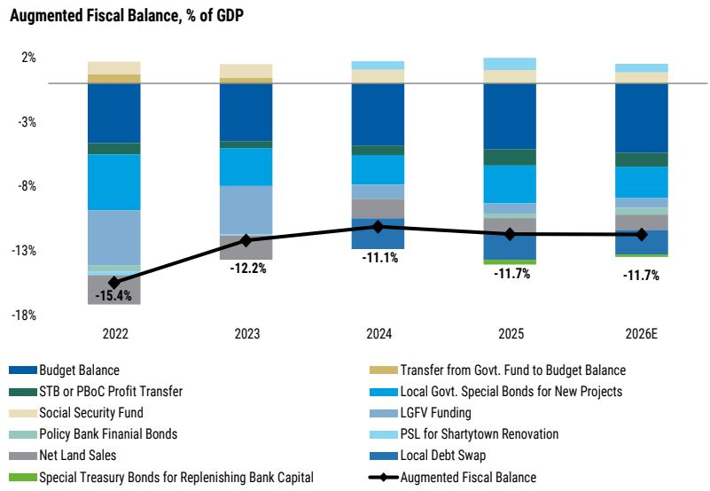

stacked bar chart

Augmented Fiscal Balance, % of GDP
| Year | Budget Balance (%) | STB or PBoC Profit Transfer (%) | Social Security Fund (%) | Policy Bank Financial Bonds (%) | Net Land Sales (%) | Special Treasury Bonds for Replenishing Bank Capital (%) | Local Govt. Special Bonds for New Projects (%) | LGFV Funding (%) | PSL for Shartytown Renovation (%) | Local Debt Swap (%) | Augmented Fiscal Balance (%) |
|---|---|---|---|---|---|---|---|---|---|---|---|
| 2022 | -1.5 | -0.8 | -0.3 | -0.4 | -0.7 | -1.2 | -1.8 | -1.9 | -0.1 | -1.6 | -15.4 |
| 2023 | -1.4 | -0.7 | -0.3 | -0.4 | -0.7 | -1.2 | -1.8 | -1.9 | -0.1 | -1.6 | -12.2 |
| 2024 | -1.3 | -0.6 | -0.3 | -0.4 | -0.7 | -1.2 | -1.8 | -1.9 | -0.1 | -1.6 | -11.1 |
| 2025 | -1.3 | -0.6 | -0.3 | -0.4 | -0.7 | -1.2 | -1.8 | -1.9 | -0.1 | -1.6 | -11.7 |
| 2026E | -1.3 | -0.6 | -0.3 | -0.4 | -0.7 | -1.2 | -1.8 | -1.9 | -0.1 | -1.6 | -11.7 |

Export resilience reduces urgency for additional countercyclical easing  
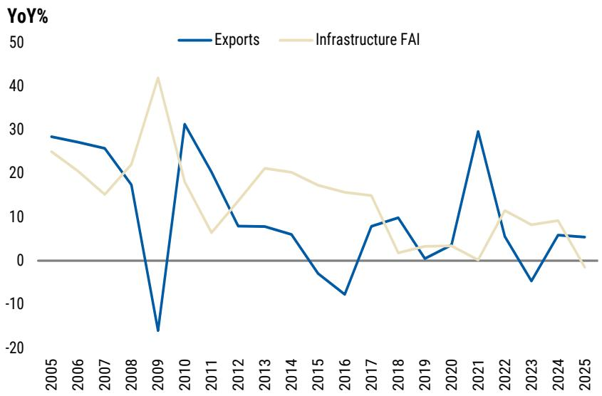

line chart

| Year | Exports | Infrastructure FAI |
|------|---------|---------------------|
| 2005 | 28.5    | 25.0                |
| 2006 | 27.0    | 22.0                |
| 2007 | 25.5    | 15.0                |
| 2008 | 18.0    | 20.0                |
| 2009 | -17.0   | 42.0                |
| 2010 | 31.0    | 18.0                |
| 2011 | 25.0    | 6.0                 |
| 2012 | 8.0     | 12.0                |
| 2013 | 8.0     | 21.0                |
| 2014 | 6.0     | 20.0                |
| 2015 | -3.0    | 17.0                |
| 2016 | -8.0    | 15.0                |
| 2017 | 8.0     | 14.0                |
| 2018 | 10.0    | 2.0                 |
| 2019 | 1.0     | 3.0                 |
| 2020 | 3.0     | 3.0                 |
| 2021 | 30.0    | 1.0                 |
| 2022 | 6.0     | 11.0                |
| 2023 | -5.0    | 8.0                 |
| 2024 | 6.0     | 9.0                 |
| 2025 | 5.0     | -2.0                |

Source: CEIC, MS estimates.

## Tier-1 city property sales showing signs of improvement, but sustainability remains key to watch

Monthly primary housing sales  
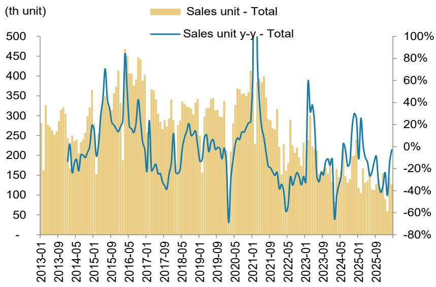

bar-line hybrid chart

| Date     | Sales unit - Total (th unit) | Sales unit y-y - Total (%) |
|----------|------------------------------|----------------------------|
| 2013-01  | ~300                         | ~0%                        |
| 2013-09  | ~350                         | ~10%                       |
| 2014-05  | ~250                         | ~-20%                      |
| 2015-01  | ~350                         | ~30%                       |
| 2015-09  | ~450                         | ~60%                       |
| 2016-05  | ~400                         | ~80%                       |
| 2017-01  | ~350                         | ~40%                       |
| 2017-09  | ~300                         | ~-20%                      |
| 2018-05  | ~350                         | ~10%                       |
| 2019-01  | ~350                         | ~20%                       |
| 2019-09  | ~350                         | ~-20%                      |
| 2020-05  | ~350                         | ~-60%                      |
| 2021-01  | ~450                         | ~100%                      |
| 2021-09  | ~350                         | ~-20%                      |
| 2022-05  | ~300                         | ~-40%                      |
| 2023-01  | ~350                         | ~-20%                      |
| 2023-09  | ~350                         | ~-40%                      |
| 2024-05  | ~350                         | ~-60%                      |
| 2025-01  | ~350                         | ~-40%                      |
| 2025-09  | ~350                         | ~-60%                      |

Source: CREIS, MS. Note: Monthly data as of end-April 2026.

Housing inventory among 70 cities  
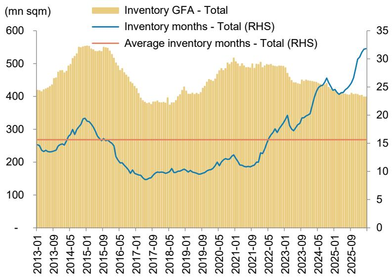

bar-line hybrid chart

| Date     | Inventory GFA - Total (mn sqm) | Inventory months - Total (RHS) | Average inventory months - Total (RHS) |
|----------|-------------------------------|----------------------------------|----------------------------------------|
| 2013-01  | ~420                          | ~25                              | 15                                     |
| 2013-09  | ~480                          | ~24                              | 15                                     |
| 2014-05  | ~550                          | ~28                              | 15                                     |
| 2015-01  | ~560                          | ~33                              | 15                                     |
| 2015-09  | ~540                          | ~27                              | 15                                     |
| 2016-05  | ~480                          | ~20                              | 15                                     |
| 2017-01  | ~380                          | ~16                              | 15                                     |
| 2017-09  | ~390                          | ~17                              | 15                                     |
| 2018-05  | ~400                          | ~18                              | 15                                     |
| 2019-01  | ~420                          | ~19                              | 15                                     |
| 2019-09  | ~440                          | ~18                              | 15                                     |
| 2020-05  | ~480                          | ~20                              | 15                                     |
| 2021-01  | ~500                          | ~22                              | 15                                     |
| 2021-09  | ~490                          | ~20                              | 15                                     |
| 2022-05  | ~480                          | ~25                              | 15                                     |
| 2023-01  | ~460                          | ~30                              | 15                                     |
| 2023-09  | ~440                          | ~35                              | 15                                     |
| 2024-05  | ~430                          | ~40                              | 15                                     |
| 2025-01  | ~420                          | ~45                              | 15                                     |
| 2025-09  | ~410                          | ~50                              | 15                                     |

Source: CREIS, MS. Note: Monthly data as of end-April 2026.

## Recovery emerging in secondary property prices across select tier 1 cities, while the national market continues to lag

Beijing, Shanghai and Shenzhen secondary property prices showing signs of recovery since Feb-26  
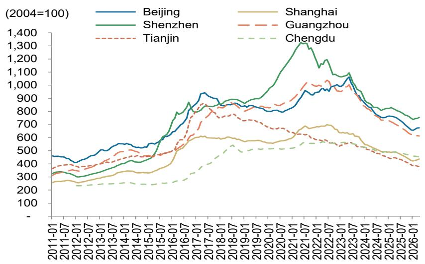

line chart

| Date | Beijing | Shenzhen | Tianjin | Shanghai | Guangzhou | Chengdu |
| --- | --- | --- | --- | --- | --- | --- |
| 2011-01 | 450 | 350 | 380 | 280 | 320 | 250 |
| 2011-07 | 470 | 360 | 390 | 290 | 330 | 260 |
| 2012-01 | 480 | 370 | 400 | 300 | 340 | 270 |
| 2012-07 | 490 | 380 | 410 | 310 | 350 | 280 |
| 2013-01 | 500 | 390 | 420 | 320 | 360 | 290 |
| 2013-07 | 510 | 400 | 430 | 330 | 370 | 300 |
| 2014-01 | 520 | 410 | 440 | 340 | 380 | 310 |
| 2014-07 | 530 | 420 | 450 | 350 | 390 | 320 |
| 2015-01 | 540 | 430 | 460 | 360 | 400 | 330 |
| 2015-07 | 550 | 440 | 470 | 370 | 410 | 340 |
| 2016-01 | 560 | 450 | 480 | 380 | 420 | 350 |
| 2016-07 | 570 | 460 | 490 | 390 | 430 | 360 |
| 2017-01 | 580 | 470 | 500 | 400 | 440 | 370 |
| 2017-07 | 590 | 480 | 510 | 410 | 450 | 380 |
| 2018-01 | 600 | 490 | 520 | 420 | 460 | 390 |
| 2018-07 | 610 | 500 | 530 | 430 | 470 | 400 |
| 2019-01 | 620 | 510 | 540 | 440 | 480 | 410 |
| 2019-07 | 630 | 520 | 550 | 450 | 490 | 420 |
| 2020-01 | 640 | 530 | 560 | 460 | 500 | 430 |
| 2020-07 | 650 | 540 | 570 | 470 | 510 | 440 |
| 2021-01 | 660 | 550 | 580 | 480 | 520 | 450 |
| 2021-07 | 670 | 560 | 590 | 490 | 530 | 460 |
| 2022-01 | 680 | 570 | 600 | 500 | 540 | 470 |
| 2022-07 | 690 | 580 | 610 | 510 | 550 | 480 |
| 2023-01 | 700 | 590 | 620 | 520 | 560 | 490 |
| 2023-07 | 710 | 600 | 630 | 530 | 570 | 500 |
| 2024-01 | 720 | 610 | 640 | 540 | 580 | 510 |
| 2024-07 | 730 | 620 | 650 | 550 | 590 | 520 |
| 2025-01 | 740 | 630 | 660 | 560 | 600 | 530 |
| 2025-07 | 750 | 640 | 670 | 570 | 610 | 540 |
| 2026-01 | 760 | 650 | 680 | 580 | 620 | 550 |

Top 10 cities secondary prices approaching flat m-m; Top 100 still declining but at a slower pace  
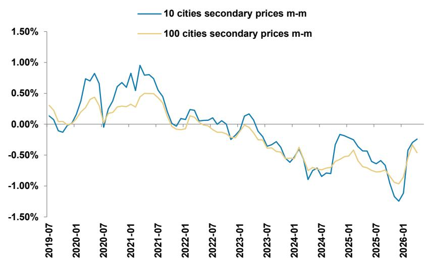

line chart

| Date     | 10 cities secondary prices m-m | 100 cities secondary prices m-m |
|----------|----------------------------------|----------------------------------|
| 2019-07  | ~0.1%                            | ~0.3%                            |
| 2020-01  | ~-0.2%                           | ~0.0%                            |
| 2020-07  | ~0.8%                            | ~0.4%                            |
| 2021-01  | ~0.9%                            | ~0.5%                            |
| 2021-07  | ~0.7%                            | ~0.4%                            |
| 2022-01  | ~0.1%                            | ~-0.1%                           |
| 2022-07  | ~0.2%                            | ~-0.2%                           |
| 2023-01  | ~-0.3%                           | ~-0.4%                           |
| 2023-07  | ~-0.5%                           | ~-0.6%                           |
| 2024-01  | ~-0.7%                           | ~-0.8%                           |
| 2024-07  | ~-0.9%                           | ~-0.9%                           |
| 2025-01  | ~-0.6%                           | ~-0.7%                           |
| 2025-07  | ~-0.8%                           | ~-0.9%                           |
| 2026-01  | ~-1.3%                           | ~-1.1%                           |

Source: CREIS, MS. Note: Monthly data as of end-April 2026.  
Source: CREIS, MS. Note: Monthly data as of end-April 2026.

## MSCI China trades at 11x 12-month forward P/E, \~8% discount vs. MSCI EM

MSCI China Fwd P/E vs. MSCI EM Fwd P/E  
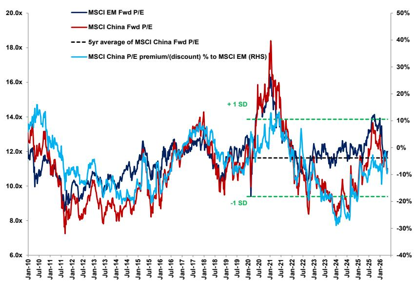

line chart

| Date   | MSCI EM Fwd P/E | MSCI China Fwd P/E | 5yr average of MSCI China Fwd P/E | MSCI China P/E premium/(discount) % to MSCI EM (RHS) |
|--------|-----------------|--------------------|-----------------------------------|------------------------------------------------------|
| Jan-10 | ~12.0x          | ~13.0x             | ~10%                              | ~14%                                                 |
| Jul-10 | ~11.5x          | ~12.5x             | ~9%                               | ~13.5%                                               |
| Jan-11 | ~10.5x          | ~11.5x             | ~8%                               | ~12.5%                                               |
| Jul-11 | ~9.5x           | ~10.5x             | ~7%                               | ~11.5%                                               |
| Jan-12 | ~8.5x           | ~9.5x              | ~6%                               | ~10.5%                                               |
| Jul-12 | ~9.0x           | ~10.0x             | ~7%                               | ~11.0%                                               |
| Jan-13 | ~9.5x           | ~10.5x             | ~8%                               | ~11.5%                                               |
| Jul-13 | ~10.0x          | ~11.0x             | ~9%                               | ~12.0%                                               |
| Jan-14 | ~10.5x          | ~11.5x             | ~10%                              | ~12.5%                                               |
| Jul-14 | ~11.0x          | ~12.0x             | ~11%                              | ~13.0%                                               |
| Jan-15 | ~11.5x          | ~12.5x             | ~12%                              | ~13.5%                                               |
| Jul-15 | ~12.0x          | ~13.0x             | ~13%                              | ~14.0%                                               |
| Jan-16 | ~12.5x          | ~13.5x             | ~14%                              | ~14.5%                                               |
| Jul-16 | ~13.0x          | ~14.0x             | ~15%                              | ~15.0%                                               |
| Jan-17 | ~13.5x          | ~14.5x             | ~16%                              | ~15.5%                                               |
| Jul-17 | ~14.0x          | ~15.0x             | ~17%                              | ~16.0%                                               |
| Jan-18 | ~14.5x          | ~15.5x             | ~18%                              | ~16.5%                                               |
| Jul-18 | ~15.0x          | ~16.0x             | ~19%                              | ~17.0%                                               |
| Jan-19 | ~15.5x          | ~16.5x             | ~20%                              | ~17.5%                                               |
| Jul-19 | ~16.0x          | ~17.0x             | ~21%                              | ~18.0%                                               |
| Jan-20 | ~16.5x          | ~17.5x             | ~22%                              | ~18.5%                                               |
| Jul-20 | ~17.0x          | ~18.0x             | ~23%                              | ~19.0%                                               |
| Jan-21 | ~17.5x          | ~18.5x             | ~24%                              | ~19.5%                                               |
| Jul-21 | ~18.0x          | ~19.0x             | ~25%                              | ~20.0%                                               |
| Jan-22 | ~18.5x          | ~19.5x             | ~26%                              | ~20.5%                                               |
| Jul-22 | ~19.0x          | ~20.0x             | ~27%                              | ~21.0%                                               |
| Jan-23 | ~19.5x          | ~20.5x             | ~28%                              | ~21.5%                                               |
| Jul-23 | ~20.0x          | ~21.0x             | ~29%                              | ~22.0%                                               |
| Jan-24 | ~20.5x          | ~21.5x             | ~30%                              | ~22.5%                                               |
| Jul-24 | ~21.0x          | ~22.0x             | ~31%                              | ~23.0%                                               |
| Jan-25 | ~21.5x          | ~22.5x             | ~32%                              | ~23.5%                                               |
| Jul-25 | ~22.0x          | ~23.0x             | ~33%                              | ~24.0%                                               |
| Jan-26 | ~22.5x          | ~23.5x             | ~34%                              | ~24.5%                                               |

MSCI China still trades at discounts to other major global equity markets  
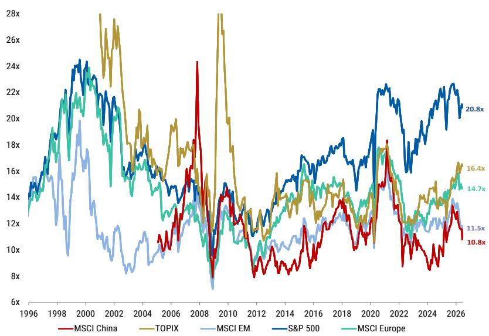

line chart

| Year | MSCI China | TOPIX | MSCI EM | S&P 500 | MSCI Europe |
|------|------------|-------|---------|---------|-------------|
| 2026 | 10.8x      | 16.4x | 11.5x   | 20.8x   | 14.7x       |

Source: Datastream, MSCI, MS. Note: Data as of June 9, 2026.

MSCI China vs. USDCNY – We see mild appreciation to continue; positive for equities  
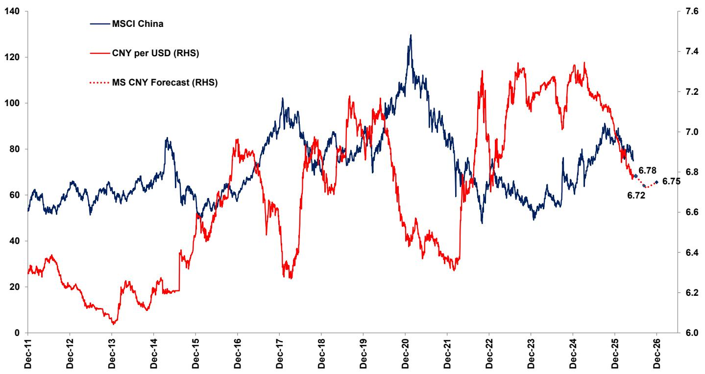

line chart

| Date    | MSCI China | CNY per USD (RHS) | MS CNY Forecast (RHS) |
|---------|------------|-------------------|------------------------|
| Dec-26  | 6.78       | 6.75              | 6.72                   |

Source: CEIC, MS. Data as of June 9, 2026. MS China Economics team expects USDCNY to reach 6.78, 6.72 and 6.75 by 2Q26, 3Q26 and 2026.

## US-China relationship – We expect the truce to continue with selected relaxation re trade and tech restrictions; Overall a positive catalyst for equity market but not a game changer

## Summit cancelled or punted ahead of proposed meeting

## Triggers:

- Escalation in US-Iran conflict (and China's possible more explicit role in the conflict).  
• Deterioration in US-China relations.

## Outcome:

• Existing trade tensions and tech restrictions persist or intensify.  
- Potential planned concessions (e.g. expanded Chinese purchase of US agricultural products or limited tariff relief) would likely be deferred.  
• Additional (and likely targeted) export controls or investment restrictions could emerge

## Little change to the existing relationship, potential escalation following the summit

## Outcome:

• Vague statements emphasizing dialogue without substance.  
• Tariffs and export controls would remain largely unchanged.  
- Renewed tensions of policy escalation might follow, particularly if domestic political pressures or geopolitical developments become a larger focus of the administration vs. these negotiations.

## Trump-Xi Summit Scenarios

## Our base case

## More durable stabilization of the bilateral agreement

## Outcome:

• Large-scale Chinese commitments to purchasing US agricultural and energy products.  
• Formal tariff rollbacks.  
• Reciprocal market access commitments, and clearer frameworks addressing investment screening and supply-chain security.  
- Possibly extended to fentanyl cooperation or financial market access.  
- Advanced chip restrictions remain, but both sides establish clearer licensing for lower-end chips and commercial semi equipment.  
• Stable and predictable rare earth exports from China

## Limited truce/cooperation with symbolic deliverables side

## Outcome:

- China could agree to incremental purchases of US commodities (e.g. soybeans, aircraft and energy), signal greater openness to non-advanced US chips, ease regulatory pressure on certain US companies operating locally and offer more clarity on future exports of critical materials.  
- US might offer modest tariff adjustments, exemptions or delays in additional trade restrictions.

Overall, incremental commitments rather than structural change

Source: MS.

Active weights of China/HK equities by regional fund category and manager domicile – Long-only positions in China have remained heavily UW, suggesting room to add  
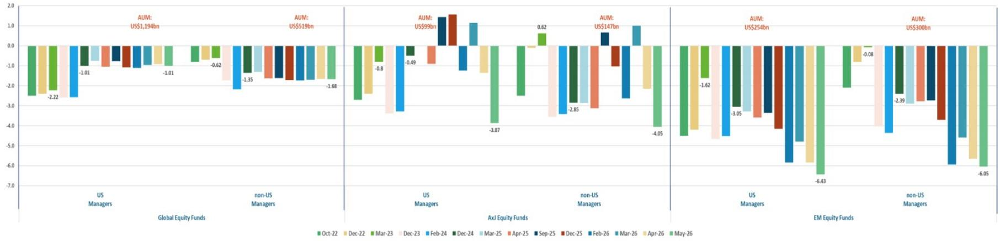

bar chart

| Category | Period | AUM ($) |
| :--- | :--- | :--- |
| Global Equity Funds | Oct-22 | -1.94 |
| Global Equity Funds | Dec-22 | -1.94 |
| Global Equity Funds | Mar-23 | -1.94 |
| Global Equity Funds | Dec-23 | -1.94 |
| Global Equity Funds | Feb-24 | -1.94 |
| Global Equity Funds | Dec-24 | -1.94 |
| Global Equity Funds | Mar-25 | -1.94 |
| Global Equity Funds | Apr-25 | -1.94 |
| Global Equity Funds | Sep-25 | -1.94 |
| Global Equity Funds | Dec-25 | -1.94 |
| Global Equity Funds | Feb-26 | -1.94 |
| Global Equity Funds | Mar-26 | -1.94 |
| Global Equity Funds | Apr-26 | -1.94 |
| Global Equity Funds | May-26 | -1.94 |
| AxJ Equity Funds | Oct-22 | 99 |
| AxJ Equity Funds | Dec-22 | 99 |
| AxJ Equity Funds | Mar-23 | 99 |
| AxJ Equity Funds | Dec-23 | 99 |
| AxJ Equity Funds | Feb-24 | 99 |
| AxJ Equity Funds | Dec-24 | 99 |
| AxJ Equity Funds | Mar-25 | 99 |
| AxJ Equity Funds | Apr-25 | 99 |
| AxJ Equity Funds | Sep-25 | 147 |
| AxJ Equity Funds | Dec-25 | 147 |
| AxJ Equity Funds | Feb-26 | 147 |
| AxJ Equity Funds | Mar-26 | 147 |
| AxJ Equity Funds | Apr-26 | 147 |
| AxJ Equity Funds | May-26 | 147 |
| EM Equity Funds | Oct-22 | 254 |
| EM Equity Funds | Dec-22 | 254 |
| EM Equity Funds | Mar-23 | 254 |
| EM Equity Funds | Dec-23 | 254 |
| EM Equity Funds | Feb-24 | 254 |
| EM Equity Funds | Dec-24 | 254 |
| EM Equity Funds | Mar-25 | 254 |
| EM Equity Funds | Apr-25 | 254 |
| EM Equity Funds | Sep-25 | 254 |
| EM Equity Funds | Dec-25 | 254 |
| EM Equity Funds | Feb-26 | 254 |
| EM Equity Funds | Mar-26 | 254 |
| EM Equity Funds | Apr-26 | 254 |
| EM Equity Funds | May-26 | 254 |
| non-US Managers | Oct-22 | 300 |
| non-US Managers | Dec-22 | 300 |
| non-US Managers | Mar-23 | 300 |
| non-US Managers | Dec-23 | 300 |
| non-US Managers | Feb-24 | 300 |
| non-US Managers | Dec-24 | 300 |
| non-US Managers | Mar-25 | 300 |
| non-US Managers | Apr-25 | 300 |
| non-US Managers | Sep-25 | 300 |
| non-US Managers | Dec-25 | 300 |
| non-US Managers | Feb-26 | 300 |
| non-US Managers | Mar-26 | 300 |
| non-US Managers | Apr-26 | 300 |
| non-US Managers | May-26 | 300 |
| US Managers (Em) | Oct-22 | -0.08 |
| US Managers (Em) | Dec-22 | -0.08 |
| US Managers (Em) | Mar-23 (Em) | -0.08 |
| US Managers (Em) | Dec-23 (Em) | -0.08 |
| US Managers (Em) | Feb-24 (Em) | -0.08 |
| US Managers (Em) | Dec-24 (Em) | -0.08 |
| US Managers (Em) | Mar-25 (Em) | -0.08 |
| US Managers (Em) | Apr-25 (Em) | -0.08 |
| US Managers (Em) | Sep-25 (Em) | -0.08 |
| US Managers (Em) | Dec-25 (Em) | -0.08 |
| US Managers (Em) | Feb-26 (Em) | -0.08 |
| US Managers (Em) | Mar-26 (Em) | -0.08 |
| US Managers (Em) | Apr-26 (Em) | -0.08 |
| US Managers (Em) | May-26 (Em) | -0.08 |
| non-US Managers (Em) (Em) (Em) (US) (US$)<fcel>Oct-23<fcel>$519bn
AUM: US$519bn
US$519bn
AUM: US$519bn
US$519bn
AUM: US$519bn
US$519bn
AUM: US$519bn
US$519bn
AUM: US$519bn
US$519bn
AUM: US$519bn
US$519bn
AUM: US$519bl
US$519bl
AUM: US$519bl
US$519bl
AUM: US$519bl
US$519bl
AUM: US$519bl
US$519bl
AUM: US$519bl
US$519bl
AUM: US$519bl
US$519bl
AUM: US$519bl
US$530bn
US$530bn
AUM: US$530bn
US$530bn
AUM: US$530bn
US$530bn
AUM: US$530bn
US$530bn
AUM: US$530bn
US$530bn
AUM: US$530bn
US$530bn
AUM: US$530bn
US$530bn
Aum: US$530bn
US$530bn
Aum: US$530bn
US$530bn
Aum: US$530bn
US$530bn
Aum: US$530bn
US$530bn
Aum: US$530bn
US$530bn
Aum: US$530bn
US$530bn

Source: Morningstar, FactSet, EPFR, MS; Note: Data as of May 31, 2026, most funds have disclosed data up to Apr 30. Fund universe of each category is formed by the largest 30 active mutual funds under Morningstar regional category. Funds under "non-US Managers" are mostly domiciled in Europe. We exclude ESG funds, Income funds, and Systematic funds. All the covered funds are benchmarking to either MSCI or FTSE standard regional indices of All Country World, Asia ex Japan, or Emerging Markets. The EPFR data and charts displayed here must not be extracted and republished (whether internally or externally). Such use will violate the terms of MS's contract with EPFR which only covers named users.

## Foreign mutual fund flows strengthened further in 2026, YTD inflows reaching 60% of full-year 2025 level, though still largely driven by passive funds

Daily cumulative fund flows – Foreign active funds  
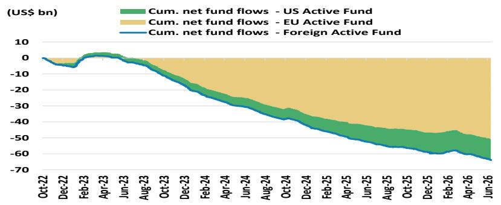

area chart

| Date    | Cum. net fund flows - US Active Fund | Cum. net fund flows - EU Active Fund | Cum. net fund flows - Foreign Active Fund |
|---------|--------------------------------------|--------------------------------------|-------------------------------------------|
| Oct-22  | ~0                                   | ~0                                   | ~0                                        |
| Dec-22  | ~-5                                  | ~0                                   | ~0                                        |
| Feb-23  | ~0                                   | ~0                                   | ~0                                        |
| Apr-23  | ~5                                   | ~0                                   | ~0                                        |
| Jun-23  | ~0                                   | ~0                                   | ~0                                        |
| Aug-23  | ~-10                                 | ~0                                   | ~0                                        |
| Oct-23  | ~-20                                 | ~0                                   | ~0                                        |
| Dec-23  | ~-25                                 | ~0                                   | ~0                                        |
| Feb-24  | ~-30                                 | ~0                                   | ~0                                        |
| Apr-24  | ~-35                                 | ~0                                   | ~0                                        |
| Jun-24  | ~-40                                 | ~0                                   | ~0                                        |
| Aug-24  | ~-45                                 | ~0                                   | ~0                                        |
| Oct-24  | ~-50                                 | ~0                                   | ~0                                        |
| Dec-24  | ~-55                                 | ~0                                   | ~0                                        |
| Feb-25  | ~-60                                 | ~0                                   | ~0                                        |
| Apr-25  | ~-65                                 | ~0                                   | ~0                                        |
| Jun-25  | ~-70                                 | ~0                                   | ~0                                        |
| Aug-25  | ~-75                                 | ~0                                   | ~0                                        |
| Oct-25  | ~-80                                 | ~0                                   | ~0                                        |
| Dec-25  | ~-85                                 | ~0                                   | ~0                                        |
| Feb-26  | ~-90                                 | ~0                                   | ~0                                        |
| Apr-26  | ~-95                                 | ~0                                   | ~0                                        |
| Jun-26  | ~-100                                | ~0                                   | ~0                                        |

Daily net fund flows – Foreign active funds

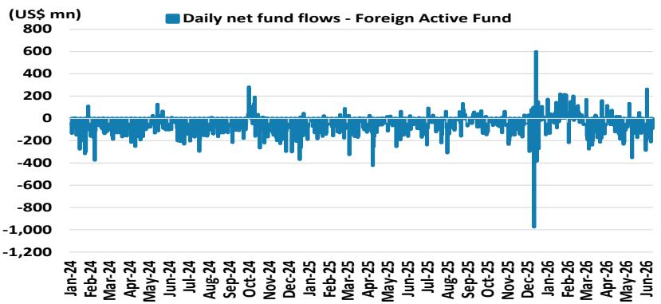

line chart

| Date    | Daily net fund flows (US$ mn) |
|---------|-------------------------------|
| Jan-24  | ~0                            |
| Feb-24  | ~100                          |
| Mar-24  | ~-200                         |
| Apr-24  | ~0                            |
| May-24  | ~100                          |
| Jun-24  | ~-200                         |
| Jul-24  | ~0                            |
| Aug-24  | ~0                            |
| Sep-24  | ~300                          |
| Oct-24  | ~-200                         |
| Nov-24  | ~0                            |
| Dec-24  | ~-400                         |
| Jan-25  | ~0                            |
| Feb-25  | ~0                            |
| Mar-25  | ~100                          |
| Apr-25  | ~-400                         |
| May-25  | ~0                            |
| Jun-25  | ~0                            |
| Jul-25  | ~0                            |
| Aug-25  | ~100                          |
| Sep-25  | ~0                            |
| Oct-25  | ~0                            |
| Nov-25  | ~0                            |
| Dec-25  | ~600                          |
| Jan-26  | ~-1,000                       |
| Feb-26  | ~200                          |
| Mar-26  | ~100                          |
| Apr-26  | ~100                          |
| May-26  | ~300                          |
| Jun-26  | ~0                            |

Source: EPFR, MS. Note: Data as of June 11, 2026.

Daily cumulative fund flows – Foreign passive funds  
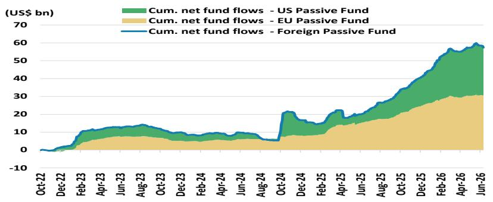

area chart

| Date | Cum. net fund flows - US Passive Fund (US$ bn) | Cum. net fund flows - EU Passive Fund (US$ bn) | Cum. net fund flows - Foreign Passive Fund (US$ bn) |
|---|---|---|---|
| Oct-22 | 0 | 0 | 0 |
| Dec-22 | 1 | 0 | 0 |
| Feb-23 | 5 | 3 | 8 |
| Apr-23 | 7 | 4 | 10 |
| Jun-23 | 8 | 5 | 11 |
| Aug-23 | 9 | 6 | 13 |
| Oct-23 | 7 | 5 | 10 |
| Dec-23 | 6 | 4 | 9 |
| Feb-24 | 7 | 4 | 9 |
| Apr-24 | 8 | 5 | 10 |
| Jun-24 | 7 | 4 | 9 |
| Aug-24 | 6 | 3 | 8 |
| Oct-24 | 15 | 8 | 20 |
| Dec-24 | 14 | 7 | 18 |
| Feb-25 | 15 | 8 | 19 |
| Apr-25 | 16 | 10 | 21 |
| Jun-25 | 18 | 12 | 23 |
| Aug-25 | 20 | 14 | 26 |
| Oct-25 | 25 | 18 | 30 |
| Dec-25 | 30 | 22 | 35 |
| Feb-26 | 35 | 26 | 40 |
| Apr-26 | 40 | 30 | 45 |
| Jun-26 | 45 | 32 | 50 |

Daily net fund flows – Foreign passive funds  
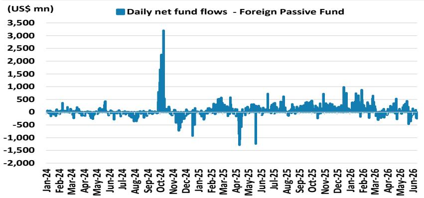

line chart

| Month    | Daily net fund flows (US$ mn) |
| -------- | ----------------------------- |
| Jan-24   | ~0                            |
| Feb-24   | ~0                            |
| Mar-24   | ~0                            |
| Apr-24   | ~0                            |
| May-24   | ~0                            |
| Jun-24   | ~0                            |
| Jul-24   | ~0                            |
| Aug-24   | ~0                            |
| Sep-24   | ~0                            |
| Oct-24   | ~3,300                        |
| Nov-24   | ~0                            |
| Dec-24   | ~-1,000                       |
| Jan-25   | ~0                            |
| Feb-25   | ~0                            |
| Mar-25   | ~0                            |
| Apr-25   | ~-1,500                       |
| May-25   | ~-1,500                       |
| Jun-25   | ~0                            |
| Jul-25   | ~0                            |
| Aug-25   | ~0                            |
| Sep-25   | ~0                            |
| Oct-25   | ~0                            |
| Nov-25   | ~0                            |
| Dec-25   | ~1,000                        |
| Jan-26   | ~0                            |
| Feb-26   | ~0                            |
| Mar-26   | ~0                            |
| Apr-26   | ~0                            |
| May-26   | ~0                            |
| Jun-26   | ~0                            |

EM and China active managers' active exposure in China/HK equities by GICS Industry Group

<table><tr><td rowspan="2">GICS Industry Group</td><td rowspan="2">MSCI China Index Weights</td><td colspan="3">International &amp; US Funds</td><td colspan="3">International Funds - UCITS</td><td colspan="3">US Funds</td></tr><tr><td>Portfolio Composite Weights</td><td>Active Weights</td><td>Active Weights Changes vs. last month</td><td>Portfolio Composite Weights</td><td>Active Weights</td><td>Active Weights Changes vs. last month</td><td>Portfolio Composite Weights</td><td>Active Weights</td><td>Active Weights Changes vs. last month</td></tr><tr><td>Capital Goods</td><td>3.8%</td><td>13.6%</td><td>9.7%</td><td>0.7%</td><td>14.4%</td><td>10.6%</td><td>0.4%</td><td>12.6%</td><td>8.8%</td><td>0.9%</td></tr><tr><td>Insurance</td><td>4.9%</td><td>8.5%</td><td>3.6%</td><td>0.1%</td><td>7.6%</td><td>2.7%</td><td>0.0%</td><td>9.6%</td><td>4.7%</td><td>0.2%</td></tr><tr><td>Semiconductors &amp; Semiconductor Equipment</td><td>2.3%</td><td>4.2%</td><td>1.9%</td><td>0.4%</td><td>4.9%</td><td>2.5%</td><td>0.7%</td><td>3.4%</td><td>1.1%</td><td>0.1%</td></tr><tr><td>Consumer Durables &amp; Apparel</td><td>1.7%</td><td>3.6%</td><td>1.9%</td><td>-0.1%</td><td>4.1%</td><td>2.4%</td><td>-0.1%</td><td>3.1%</td><td>1.4%</td><td>0.0%</td></tr><tr><td>Food Beverage &amp; Tobacco</td><td>2.6%</td><td>3.4%</td><td>0.8%</td><td>-0.1%</td><td>3.5%</td><td>0.9%</td><td>-0.1%</td><td>3.3%</td><td>0.7%</td><td>-0.2%</td></tr><tr><td>Commercial &amp; Professional Services</td><td>0.2%</td><td>0.6%</td><td>0.4%</td><td>0.0%</td><td>0.8%</td><td>0.6%</td><td>0.0%</td><td>0.5%</td><td>0.3%</td><td>0.0%</td></tr><tr><td>Health Care Equipment &amp; Services</td><td>0.4%</td><td>0.7%</td><td>0.3%</td><td>0.0%</td><td>0.7%</td><td>0.4%</td><td>0.0%</td><td>0.6%</td><td>0.3%</td><td>0.0%</td></tr><tr><td>Real Estate Management &amp; Development</td><td>1.5%</td><td>1.7%</td><td>0.1%</td><td>0.0%</td><td>2.1%</td><td>0.6%</td><td>0.0%</td><td>1.2%</td><td>-0.4%</td><td>0.0%</td></tr><tr><td>Transportation</td><td>1.4%</td><td>1.6%</td><td>0.2%</td><td>0.0%</td><td>1.8%</td><td>0.4%</td><td>0.0%</td><td>1.4%</td><td>-0.1%</td><td>-0.1%</td></tr><tr><td>Household &amp; Personal Products</td><td>0.1%</td><td>0.2%</td><td>0.0%</td><td>0.0%</td><td>0.2%</td><td>0.1%</td><td>0.0%</td><td>0.2%</td><td>0.0%</td><td>0.0%</td></tr><tr><td>Materials</td><td>5.6%</td><td>5.6%</td><td>0.0%</td><td>-0.1%</td><td>5.5%</td><td>-0.1%</td><td>-0.3%</td><td>5.7%</td><td>0.1%</td><td>0.1%</td></tr><tr><td>Telecommunication Services</td><td>0.3%</td><td>0.2%</td><td>-0.1%</td><td>-0.1%</td><td>0.3%</td><td>0.0%</td><td>-0.1%</td><td>0.1%</td><td>-0.2%</td><td>0.0%</td></tr><tr><td>Consumer Staples Distribution &amp; Retail</td><td>0.4%</td><td>0.3%</td><td>-0.1%</td><td>0.0%</td><td>0.4%</td><td>0.1%</td><td>0.0%</td><td>0.1%</td><td>-0.3%</td><td>0.0%</td></tr><tr><td>Financial Services</td><td>1.9%</td><td>1.5%</td><td>-0.3%</td><td>-0.3%</td><td>2.0%</td><td>0.1%</td><td>-0.3%</td><td>1.0%</td><td>-0.9%</td><td>-0.3%</td></tr><tr><td>Pharmaceuticals Biotechnology &amp; Life Sciences</td><td>4.6%</td><td>4.4%</td><td>-0.2%</td><td>-0.3%</td><td>4.2%</td><td>-0.4%</td><td>-0.4%</td><td>4.6%</td><td>0.0%</td><td>-0.2%</td></tr><tr><td>Software &amp; Services</td><td>1.1%</td><td>0.2%</td><td>-0.9%</td><td>0.0%</td><td>0.4%</td><td>-0.8%</td><td>0.0%</td><td>0.1%</td><td>-1.0%</td><td>0.0%</td></tr><tr><td>Consumer Services</td><td>4.9%</td><td>3.9%</td><td>-1.0%</td><td>-0.5%</td><td>4.0%</td><td>-0.9%</td><td>-0.1%</td><td>3.7%</td><td>-1.2%</td><td>-1.0%</td></tr><tr><td>Technology Hardware &amp; Equipment</td><td>6.2%</td><td>4.6%</td><td>-1.6%</td><td>0.6%</td><td>5.2%</td><td>-1.0%</td><td>0.7%</td><td>3.8%</td><td>-2.4%</td><td>0.5%</td></tr><tr><td>Utilities</td><td>1.9%</td><td>0.6%</td><td>-1.3%</td><td>0.1%</td><td>0.5%</td><td>-1.4%</td><td>0.1%</td><td>0.7%</td><td>-1.2%</td><td>0.1%</td></tr><tr><td>Automobiles &amp; Components</td><td>4.8%</td><td>3.3%</td><td>-1.5%</td><td>0.1%</td><td>3.3%</td><td>-1.5%</td><td>0.0%</td><td>3.3%</td><td>-1.5%</td><td>0.2%</td></tr><tr><td>Energy</td><td>3.6%</td><td>1.4%</td><td>-2.1%</td><td>-0.2%</td><td>1.2%</td><td>-2.3%</td><td>-0.2%</td><td>1.7%</td><td>-1.9%</td><td>-0.2%</td></tr><tr><td>Media &amp; Entertainment</td><td>18.4%</td><td>17.2%</td><td>-1.1%</td><td>0.1%</td><td>14.7%</td><td>-3.7%</td><td>0.4%</td><td>20.2%</td><td>1.8%</td><td>-0.1%</td></tr><tr><td>Consumer Discretionary Distribution &amp; Retail</td><td>15.0%</td><td>11.5%</td><td>-3.5%</td><td>-0.6%</td><td>10.8%</td><td>-4.2%</td><td>-0.6%</td><td>12.2%</td><td>-2.8%</td><td>-0.6%</td></tr><tr><td>Banks</td><td>12.4%</td><td>7.1%</td><td>-5.3%</td><td>0.1%</td><td>7.0%</td><td>-5.4%</td><td>-0.3%</td><td>7.2%</td><td>-5.2%</td><td>0.6%</td></tr></table>

Source: FactSet, MorningStar, EPFR, MS. Note: Data as of May 31, 2026, most funds have disclosed data up to Apr 30.

Top 50 China/HK holdings among long-only EM and China active managers

<table><tr><td rowspan="2">Ticker</td><td rowspan="2">Company Name</td><td rowspan="2">GICS Industry Group</td><td colspan="4">International &amp; US Funds</td><td colspan="3">International Funds - UCITS</td><td colspan="3">US Funds</td></tr><tr><td>Portfolio Composite Weights</td><td>MSCI China Index Weights</td><td>Active Weights</td><td>Active Wgt. Changes vs. last month</td><td>Portfolio Composite Weights</td><td>Active Weights</td><td>Active Wgt. Changes vs. last month</td><td>Portfolio Composite Weights</td><td>Active Weights</td><td>Active Wgt. Changes vs. last month</td></tr><tr><td>700-HK</td><td>Tencent Holdings</td><td>Media &amp; Entertainment</td><td>13.4%</td><td>14.2%</td><td>0.7%</td><td>-0.1%</td><td>10.7%</td><td>3.4%</td><td>0.2%</td><td>16.5%</td><td>2.4%</td><td>-0.4%</td></tr><tr><td>9988-HK</td><td>Alibaba Group Holding</td><td>Consumer Discretionary Distribution &amp; Retail</td><td>9.1%</td><td>10.3%</td><td>1.2%</td><td>-0.6%</td><td>8.1%</td><td>2.1%</td><td>-0.6%</td><td>10.1%</td><td>0.1%</td><td>-0.6%</td></tr><tr><td>300750-CN</td><td>Contemporary Amperex Technology</td><td>Capital Goods</td><td>4.7%</td><td>0.9%</td><td>3.8%</td><td>0.2%</td><td>4.6%</td><td>3.7%</td><td>0.0%</td><td>4.8%</td><td>3.9%</td><td>0.4%</td></tr><tr><td>2318-HK</td><td>Ping An Insurance Group</td><td>Insurance</td><td>3.4%</td><td>2.2%</td><td>1.2%</td><td>0.0%</td><td>3.4%</td><td>1.2%</td><td>0.0%</td><td>3.4%</td><td>1.2%</td><td>0.1%</td></tr><tr><td>939-HK</td><td>China Construction Bank</td><td>Banks</td><td>3.4%</td><td>4.1%</td><td>0.7%</td><td>-0.1%</td><td>2.4%</td><td>1.7%</td><td>-0.1%</td><td>4.4%</td><td>0.3%</td><td>0.0%</td></tr><tr><td>1299-HK</td><td>AIA Group</td><td>Insurance</td><td>2.9%</td><td>0.0%</td><td>2.9%</td><td>0.1%</td><td>2.5%</td><td>2.5%</td><td>0.1%</td><td>3.4%</td><td>3.4%</td><td>0.1%</td></tr><tr><td>9999-HK</td><td>NetEase</td><td>Media &amp; Entertainment</td><td>2.0%</td><td>1.5%</td><td>0.5%</td><td>0.3%</td><td>2.3%</td><td>0.8%</td><td>0.2%</td><td>1.7%</td><td>0.2%</td><td>0.3%</td></tr><tr><td>2899-HK</td><td>Zijin Mining Group</td><td>Materials</td><td>1.8%</td><td>1.2%</td><td>0.6%</td><td>0.0%</td><td>1.4%</td><td>0.1%</td><td>-0.1%</td><td>2.3%</td><td>1.1%</td><td>0.0%</td></tr><tr><td>3968-HK</td><td>China Merchants Bank</td><td>Banks</td><td>1.7%</td><td>1.1%</td><td>0.6%</td><td>0.0%</td><td>2.1%</td><td>1.0%</td><td>0.0%</td><td>1.2%</td><td>0.1%</td><td>0.0%</td></tr><tr><td>688008-CN</td><td>Montage Technology</td><td>Semiconductors &amp; Semiconductor Equipment</td><td>1.6%</td><td>0.1%</td><td>1.6%</td><td>0.6%</td><td>1.7%</td><td>1.6%</td><td>0.7%</td><td>1.6%</td><td>1.5%</td><td>0.6%</td></tr><tr><td>PDD-US</td><td>PDD Holdings</td><td>Consumer Discretionary Distribution &amp; Retail</td><td>1.5%</td><td>2.6%</td><td>1.2%</td><td>0.0%</td><td>1.6%</td><td>1.0%</td><td>-0.1%</td><td>1.3%</td><td>1.3%</td><td>0.0%</td></tr><tr><td>1211-HK</td><td>BYD</td><td>Automobiles &amp; Components</td><td>1.4%</td><td>2.0%</td><td>0.6%</td><td>0.2%</td><td>0.6%</td><td>1.3%</td><td>0.1%</td><td>2.2%</td><td>0.3%</td><td>0.2%</td></tr><tr><td>000333-CN</td><td>Midea Group</td><td>Consumer Durables &amp; Apparel</td><td>1.3%</td><td>0.3%</td><td>1.1%</td><td>0.0%</td><td>1.3%</td><td>1.1%</td><td>0.0%</td><td>1.3%</td><td>1.1%</td><td>0.0%</td></tr><tr><td>HTHT-US</td><td>H World Group</td><td>Consumer Services</td><td>1.2%</td><td>0.4%</td><td>0.8%</td><td>-0.2%</td><td>1.0%</td><td>0.6%</td><td>-0.1%</td><td>1.4%</td><td>1.0%</td><td>-0.3%</td></tr><tr><td>600519-CN</td><td>Kweichow Moutai</td><td>Food Beverage &amp; Tobacco</td><td>1.2%</td><td>0.6%</td><td>0.6%</td><td>0.0%</td><td>1.3%</td><td>0.7%</td><td>0.0%</td><td>1.1%</td><td>0.5%</td><td>0.0%</td></tr><tr><td>002028-CN</td><td>Sievuan Electric</td><td>Capital Goods</td><td>1.1%</td><td>0.0%</td><td>1.1%</td><td>0.0%</td><td>0.9%</td><td>0.9%</td><td>0.0%</td><td>1.3%</td><td>1.3%</td><td>0.0%</td></tr><tr><td>2359-HK</td><td>WuXi AppTec</td><td>Pharmaceuticals Biotechnology &amp; Life Sciences</td><td>1.0%</td><td>0.3%</td><td>0.7%</td><td>-0.1%</td><td>0.6%</td><td>0.3%</td><td>-0.1%</td><td>1.5%</td><td>1.2%</td><td>-0.1%</td></tr><tr><td>300308-CN</td><td>Zhongji Innolight</td><td>Technology Hardware &amp; Equipment</td><td>0.9%</td><td>0.3%</td><td>0.6%</td><td>0.2%</td><td>1.0%</td><td>0.7%</td><td>0.3%</td><td>0.7%</td><td>0.4%</td><td>0.1%</td></tr><tr><td>2338-HK</td><td>Weichai Power</td><td>Capital Goods</td><td>0.8%</td><td>0.4%</td><td>0.4%</td><td>0.0%</td><td>0.7%</td><td>0.3%</td><td>0.0%</td><td>1.0%</td><td>0.6%</td><td>0.0%</td></tr><tr><td>2628-HK</td><td>China Life Insurance</td><td>Insurance</td><td>0.8%</td><td>1.0%</td><td>0.3%</td><td>0.0%</td><td>0.4%</td><td>0.7%</td><td>-0.1%</td><td>1.3%</td><td>0.2%</td><td>0.0%</td></tr><tr><td>992-HK</td><td>Lenovo Group</td><td>Technology Hardware &amp; Equipment</td><td>0.8%</td><td>0.4%</td><td>0.3%</td><td>0.3%</td><td>0.4%</td><td>0.0%</td><td>0.2%</td><td>1.2%</td><td>0.8%</td><td>0.4%</td></tr><tr><td>9888-HK</td><td>Baidu</td><td>Media &amp; Entertainment</td><td>0.8%</td><td>1.3%</td><td>0.5%</td><td>0.0%</td><td>0.7%</td><td>0.5%</td><td>0.0%</td><td>0.8%</td><td>0.4%</td><td>0.0%</td></tr><tr><td>1398-HK</td><td>Industrial and Commercial Bank of China</td><td>Banks</td><td>0.7%</td><td>2.3%</td><td>1.6%</td><td>0.0%</td><td>1.0%</td><td>1.3%</td><td>-0.1%</td><td>0.5%</td><td>1.9%</td><td>0.1%</td></tr><tr><td>002371-CN</td><td>NAURA Technology Group</td><td>Semiconductors &amp; Semiconductor Equipment</td><td>0.7%</td><td>0.1%</td><td>0.6%</td><td>0.1%</td><td>0.7%</td><td>0.6%</td><td>0.1%</td><td>0.8%</td><td>0.6%</td><td>0.1%</td></tr><tr><td>2328-HK</td><td>PICC Property &amp; Casualty</td><td>Insurance</td><td>0.7%</td><td>0.5%</td><td>0.3%</td><td>0.1%</td><td>0.6%</td><td>0.1%</td><td>0.1%</td><td>0.9%</td><td>0.5%</td><td>0.1%</td></tr><tr><td>9961-HK</td><td>Trip.com Group</td><td>Consumer Services</td><td>0.7%</td><td>1.2%</td><td>0.5%</td><td>-0.1%</td><td>1.0%</td><td>0.3%</td><td>-0.2%</td><td>0.4%</td><td>0.8%</td><td>-0.1%</td></tr><tr><td>857-HK</td><td>PetroChina</td><td>Energy</td><td>0.7%</td><td>1.3%</td><td>0.6%</td><td>0.0%</td><td>0.7%</td><td>0.6%</td><td>-0.1%</td><td>0.8%</td><td>0.5%</td><td>0.1%</td></tr><tr><td>600660-CN</td><td>Fuyao Glass Industry Grp</td><td>Automobiles &amp; Components</td><td>0.7%</td><td>0.2%</td><td>0.5%</td><td>-0.1%</td><td>0.9%</td><td>0.7%</td><td>-0.1%</td><td>0.4%</td><td>0.2%</td><td>-0.1%</td></tr><tr><td>388-HK</td><td>Hong Kong Exchanges &amp; Clearing</td><td>Financial Services</td><td>0.7%</td><td>0.0%</td><td>0.7%</td><td>0.0%</td><td>0.7%</td><td>0.7%</td><td>0.0%</td><td>0.6%</td><td>0.6%</td><td>0.0%</td></tr><tr><td>YMM-US</td><td>Full Truck AlIn</td><td>Transportation</td><td>0.6%</td><td>0.0%</td><td>0.6%</td><td>0.0%</td><td>0.7%</td><td>0.7%</td><td>0.0%</td><td>0.5%</td><td>0.5%</td><td>0.0%</td></tr><tr><td>1810-HK</td><td>Xiaomi</td><td>Technology Hardware &amp; Equipment</td><td>0.6%</td><td>2.4%</td><td>1.8%</td><td>0.3%</td><td>0.7%</td><td>1.7%</td><td>0.2%</td><td>0.5%</td><td>1.8%</td><td>0.4%</td></tr><tr><td>669-HK</td><td>Techtronic Industries</td><td>Capital Goods</td><td>0.6%</td><td>0.0%</td><td>0.6%</td><td>0.0%</td><td>0.5%</td><td>0.5%</td><td>0.0%</td><td>0.7%</td><td>0.7%</td><td>0.0%</td></tr><tr><td>3690-HK</td><td>Meituan</td><td>Consumer Services</td><td>0.6%</td><td>2.0%</td><td>1.4%</td><td>-0.2%</td><td>0.7%</td><td>1.3%</td><td>0.0%</td><td>0.5%</td><td>1.5%</td><td>-0.5%</td></tr><tr><td>600031-CN</td><td>Sany Heavy Industry</td><td>Capital Goods</td><td>0.6%</td><td>0.1%</td><td>0.5%</td><td>0.0%</td><td>0.5%</td><td>0.4%</td><td>0.0%</td><td>0.7%</td><td>0.6%</td><td>-0.1%</td></tr><tr><td>1109-HK</td><td>China Resources Land</td><td>Real Estate Management &amp; Development</td><td>0.6%</td><td>0.5%</td><td>0.1%</td><td>0.0%</td><td>0.6%</td><td>0.1%</td><td>0.0%</td><td>0.5%</td><td>0.0%</td><td>0.0%</td></tr><tr><td>3692-HK</td><td>Hansoh Pharmaceutical Group</td><td>Pharmaceuticals Biotechnology &amp; Life Sciences</td><td>0.6%</td><td>0.3%</td><td>0.3%</td><td>-0.1%</td><td>0.3%</td><td>0.0%</td><td>-0.1%</td><td>0.9%</td><td>0.7%</td><td>-0.2%</td></tr><tr><td>2020-HK</td><td>ANTA Sports Products</td><td>Consumer Durables &amp; Apparel</td><td>0.5%</td><td>0.5%</td><td>0.1%</td><td>0.0%</td><td>0.7%</td><td>0.2%</td><td>0.0%</td><td>0.3%</td><td>0.1%</td><td>0.0%</td></tr><tr><td>688012-CN</td><td>Advanced Micro-Fabrication Equipment</td><td>Semiconductors &amp; Semiconductor Equipment</td><td>0.5%</td><td>0.1%</td><td>0.5%</td><td>-0.1%</td><td>0.5%</td><td>0.4%</td><td>-0.1%</td><td>0.6%</td><td>0.5%</td><td>-0.1%</td></tr><tr><td>600690-CN</td><td>Haier Smart Home</td><td>Consumer Durables &amp; Apparel</td><td>0.5%</td><td>0.3%</td><td>0.2%</td><td>0.0%</td><td>0.5%</td><td>0.2%</td><td>0.0%</td><td>0.5%</td><td>0.2%</td><td>0.0%</td></tr><tr><td>1801-HK</td><td>Innovent Biologics</td><td>Pharmaceuticals Biotechnology &amp; Life Sciences</td><td>0.5%</td><td>0.6%</td><td>0.1%</td><td>0.0%</td><td>0.5%</td><td>0.1%</td><td>0.0%</td><td>0.4%</td><td>0.2%</td><td>0.0%</td></tr><tr><td>6160-HK</td><td>BeOne Medicines</td><td>Pharmaceuticals Biotechnology &amp; Life Sciences</td><td>0.5%</td><td>0.7%</td><td>0.2%</td><td>0.1%</td><td>0.3%</td><td>0.4%</td><td>0.0%</td><td>0.6%</td><td>0.1%</td><td>0.1%</td></tr><tr><td>BZ-US</td><td>Kanzhun</td><td>Commercial &amp; Professional Services</td><td>0.5%</td><td>0.2%</td><td>0.3%</td><td>0.0%</td><td>0.5%</td><td>0.3%</td><td>0.0%</td><td>0.4%</td><td>0.2%</td><td>0.0%</td></tr><tr><td>600276-CN</td><td>Jiangsu Hengrui Pharmaceuticals</td><td>Pharmaceuticals Biotechnology &amp; Life Sciences</td><td>0.4%</td><td>0.1%</td><td>0.3%</td><td>0.0%</td><td>0.6%</td><td>0.5%</td><td>0.0%</td><td>0.3%</td><td>0.2%</td><td>0.0%</td></tr><tr><td>002463-CN</td><td>Wus Printed Circuit</td><td>Technology Hardware &amp; Equipment</td><td>0.4%</td><td>0.1%</td><td>0.4%</td><td>0.1%</td><td>0.5%</td><td>0.5%</td><td>0.1%</td><td>0.3%</td><td>0.2%</td><td>0.1%</td></tr><tr><td>386-HK</td><td>China Petroleum Chemical</td><td>Energy</td><td>0.4%</td><td>0.6%</td><td>-0.1%</td><td>-0.1%</td><td>0.1%</td><td>0.4%</td><td>0.0%</td><td>0.7%</td><td>0.2%</td><td>-0.2%</td></tr><tr><td>2259-HK</td><td>Zijin Gold International</td><td>Materials</td><td>0.4%</td><td>0.2%</td><td>0.2%</td><td>0.0%</td><td>0.4%</td><td>0.3%</td><td>-0.1%</td><td>0.4%</td><td>0.2%</td><td>0.0%</td></tr><tr><td>300274-CN</td><td>Sungrow Power Supply</td><td>Capital Goods</td><td>0.4%</td><td>0.1%</td><td>0.3%</td><td>0.1%</td><td>0.6%</td><td>0.6%</td><td>0.2%</td><td>0.1%</td><td>0.0%</td><td>0.0%</td></tr><tr><td>TME-US</td><td>Tencent Music Entertainment</td><td>Media &amp; Entertainment</td><td>0.4%</td><td>0.2%</td><td>0.2%</td><td>0.0%</td><td>0.3%</td><td>0.1%</td><td>0.0%</td><td>0.5%</td><td>0.3%</td><td>-0.1%</td></tr><tr><td>291-HK</td><td>China Resources Beer (Holdings)</td><td>Food Beverage &amp; Tobacco</td><td>0.4%</td><td>0.2%</td><td>0.2%</td><td>0.0%</td><td>0.2%</td><td>0.0%</td><td>0.0%</td><td>0.5%</td><td>0.3%</td><td>-0.1%</td></tr></table>

Source: FactSet, MorningStar, EPFR, MS. Note: Data as of May 31, 2026, most funds have disclosed data up to April 30.

## Hong Kong IPO fund raising hit US\$37bn and US\$23bn in 2025 and 2026 YTD, respectively, making Hong Kong one of the most active IPO markets globally

Historical IPO US\$ amount in Hong Kong by year  
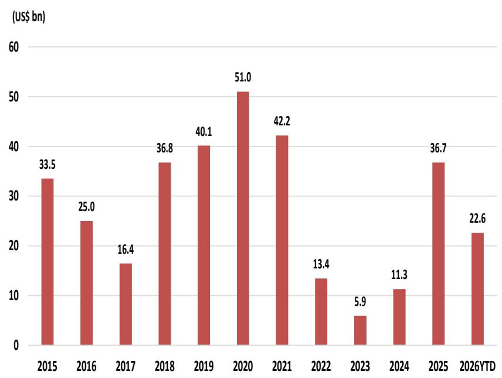

bar chart

| Year | Value (US$ bn) |
| :--- | :--- |
| 2015 | 33.5 |
| 2016 | 25.0 |
| 2017 | 16.4 |
| 2018 | 36.8 |
| 2019 | 40.1 |
| 2020 | 51.0 |
| 2021 | 42.2 |
| 2022 | 13.4 |
| 2023 | 5.9 |
| 2024 | 11.3 |
| 2025 | 36.7 |
| 2026YTD | 22.6 |

2025-26 YTD IPO fund raising by market  
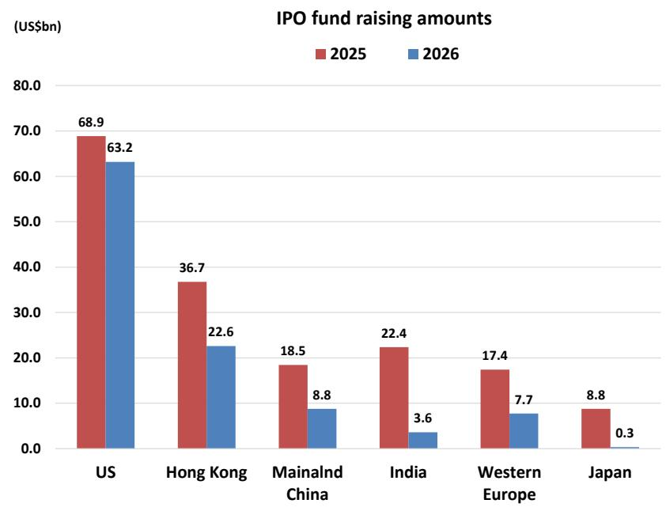

bar chart

IPO fund raising amounts
| Region | 2025 (US$bn) | 2026 (US$bn) |
| :--- | :--- | :--- |
| US | 68.9 | 63.2 |
| Hong Kong | 36.7 | 22.6 |
| Mainalnd China | 18.5 | 8.8 |
| India | 22.4 | 3.6 |
| Western Europe | 17.4 | 7.7 |
| Japan | 8.8 | 0.3 |

Source: Wind, Bloomberg, MS. Data as of June 10, 2026.

## CSI 300 trades at 14.5x with \~32% valuation premium to MSCI China

Valuation of CSI300 absolute and relative to MSCI China  
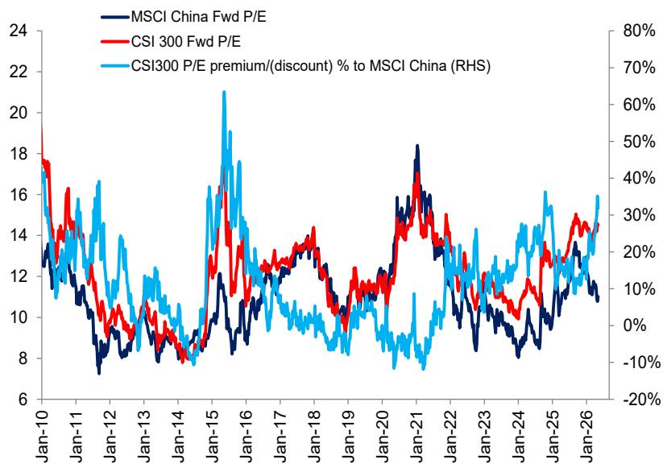

line chart

| Date   | MSCI China Fwd P/E | CSI 300 Fwd P/E | CSI300 P/E premium/(discount) % to MSCI China (RHS) |
|--------|--------------------|-----------------|--------------------------------------------------|
| Jan-10 | ~13                | ~17             | ~17%                                             |
| Jan-11 | ~11                | ~15             | ~15%                                             |
| Jan-12 | ~9                 | ~10             | ~10%                                             |
| Jan-13 | ~8                 | ~9              | ~9%                                              |
| Jan-14 | ~8                 | ~8              | ~8%                                              |
| Jan-15 | ~12                | ~16             | ~16%                                             |
| Jan-16 | ~13                | ~18             | ~18%                                             |
| Jan-17 | ~12                | ~14             | ~14%                                             |
| Jan-18 | ~13                | ~14             | ~14%                                             |
| Jan-19 | ~12                | ~13             | ~13%                                             |
| Jan-20 | ~13                | ~15             | ~15%                                             |
| Jan-21 | ~18                | ~17             | ~17%                                             |
| Jan-22 | ~14                | ~15             | ~15%                                             |
| Jan-23 | ~12                | ~13             | ~13%                                             |
| Jan-24 | ~10                | ~12             | ~12%                                             |
| Jan-25 | ~12                | ~14             | ~14%                                             |
| Jan-26 | ~11                | ~15             | ~16%                                             |

Source: Datastream, MS. Weekly data as of June 4, 2026.

Hang Seng A-H Premium index  
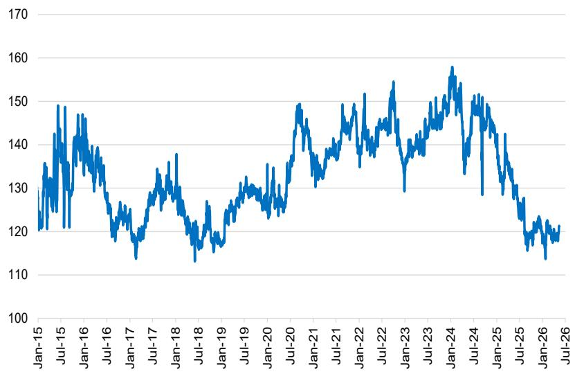

line chart

| Date   | Value |
|--------|-------|
| Jan-15 | 125   |
| Jul-15 | 148   |
| Jan-16 | 145   |
| Jul-16 | 135   |
| Jan-17 | 120   |
| Jul-17 | 130   |
| Jan-18 | 138   |
| Jul-18 | 125   |
| Jan-19 | 128   |
| Jul-19 | 132   |
| Jan-20 | 135   |
| Jul-20 | 148   |
| Jan-21 | 138   |
| Jul-21 | 145   |
| Jan-22 | 150   |
| Jul-22 | 140   |
| Jan-23 | 130   |
| Jul-23 | 145   |
| Jan-24 | 158   |
| Jul-24 | 150   |
| Jan-25 | 140   |
| Jul-25 | 130   |
| Jan-26 | 120   |
| Jul-26 | 118   |

Source: Factset, MS. Data as of June 10, 2026

## We stay OW on A-shares vs. offshore China – Bigger concentration in high-end upstream and deep tech space while National Team stands by with deep pocket

Bigger concentration in high-end manufacturing and hard-tech companies in onshore China  
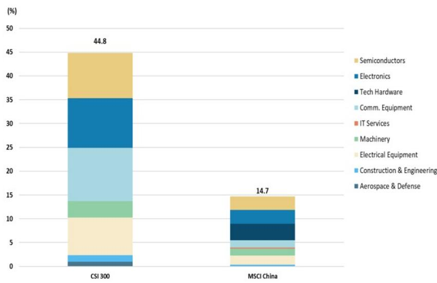

stacked bar chart

| Category | CSI 300 (%) | MSCI China (%) |
|---|---|---|
| Semiconductors | 14.8 | 14.7 |
| Electronics | 12.5 | 11.6 |
| Tech Hardware | 1.9 | 6.8 |
| Comm. Equipment | 13.8 | 3.5 |
| IT Services | 0.5 | 2.2 |
| Machinery | 4.2 | 2.5 |
| Electrical Equipment | 0.8 | 2.1 |
| Construction & Engineering | 1.2 | 0.5 |
| Aerospace & Defense | 0.7 | 0.3 |

Source: Datastream, MS. Weekly data as of June 10, 2026.

National team retains significant dry power after selling \~US\$88bn in Jan-Apr 2026  
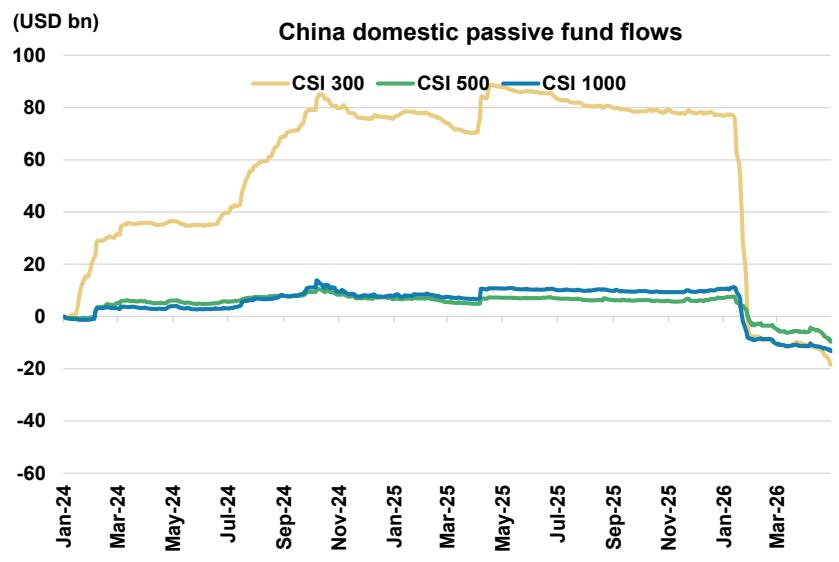

line chart

| Date   | CSI 300 | CSI 500 | CSI 1000 |
|--------|---------|---------|----------|
| Jan-24 | 0       | 0       | 0        |
| Mar-24 | 30      | 5       | 5        |
| May-24 | 35      | 5       | 5        |
| Jul-24 | 40      | 5       | 5        |
| Sep-24 | 70      | 5       | 5        |
| Nov-24 | 85      | 5       | 10       |
| Jan-25 | 80      | 5       | 5        |
| Mar-25 | 75      | 5       | 5        |
| May-25 | 90      | 5       | 10       |
| Jul-25 | 85      | 5       | 10       |
| Sep-25 | 80      | 5       | 10       |
| Nov-25 | 80      | 5       | 10       |
| Jan-26 | 75      | 5       | 10       |
| Mar-26 | -20     | -10     | -15      |

Source: Factset, MS. Data as of June 11, 2026

MS A-share Sentiment Index (MSASI) – Helps capture critical inflection points signaling regulatory intervention and/or technical reversals  
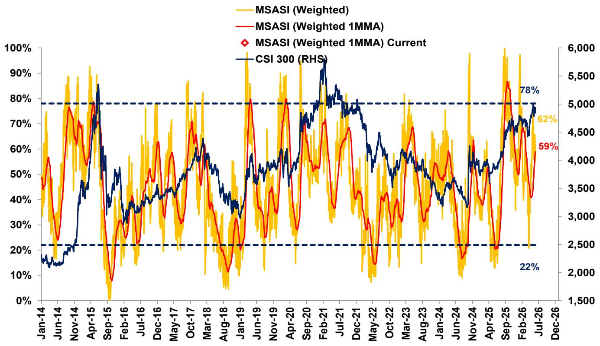

bar-line hybrid chart

| Date | MSASI (Weighted) | MSASI (Weighted 1MMA) | MSASI (Weighted 1MMA) Current | CSI 300 (RHS) |
| --- | --- | --- | --- | --- |
| Dec-26 | 62% | 59% | - | 78% |
| Feb-26 | - | - | - | - |
| Jul-26 | - | - | - | - |
| Sep-25 | - | - | - | - |
| Apr-25 | - | - | - | - |
| Jan-24 | - | - | - | - |
| Aug-23 | - | - | - | - |
| Mar-23 | - | - | - | - |
| Oct-22 | - | - | - | - |
| May-22 | - | - | - | - |
| Dec-21 | - | - | - | - |
| Jul-21 | - | - | - | - |
| Feb-21 | - | - | - | - |
| Sep-20 | - | - | - | - |
| Apr-20 | - | - | - | - |
| Nov-19 | - | - | - | - |
| Dec-18 | - | - | - | - |
| Mar-18 | - | - | - | - |
| Oct-17 | - | - | - | - |
| May-17 | - | - | - | - |
| Dec-16 | - | - | - | - |
| Jul-16 | - | - | - | - |
| Feb-16 | - | - | - | - |
| Sep-15 | - | - | - | - |
| Apr-15 | - | - | - | - |
| Nov-14 | - | - | - | - |
| Jun-14 | - | - | - | - |
| Dec-14 | - | - | - | - |
| Jan-14 | 75% | 55% | 15% | 15% |
| Feb-14 | 85% | 75% | 20% | 20% |
| May-14 | 90% | 80% | 25% | 25% |
| Sep-14 | 85% | 75% | 30% | 30% |
| Dec-14 | 80% | 70% | 35% | 35% |
| Jan-14 | 75% | 65% | 40% | 40% |
| Feb-14 | 70% | 60% | 45% | 45% |
| May-14 | 65% | 55% | 50% | 50% |
| Sep-14 | 60% | 50% | 55% | 55% |
| Dec-14 | 55% | 45% | 60% | 60% |
| Jan-14 | 50% | 40% | 65% | 65% |
| Feb-14 | 45% | 35% | 70% | 70% |
| May-14 | 40% | 30% | 75% | 75% |
| Sep-14 | 35% | 25% | 80% | 80% |
| Dec-14 | 30% | 20% | 85% | 85% |
| Jan-15 | 25% | 15% | 90% | 90% |
| Feb-15 | 20% | 10% | 95% | 95% |
| May-15 | 15% | 5% | 100% | 100% |
| Sep-15 | 10% | - | 105% | 105% |
| Dec-15 | 5% | - | 110% | 110% |
| Jan-16 | - | - | 115% | 115% |
| Feb-16 | - | - | 120% | 120% |
| May-16 | - | - | 125% | 125% |
| Sep-16 | - | - | 130% | 130% |
| Dec-16 | - | - | 135% | 135% |
| Jan-17 | - | - | 140% | 140% |
| Feb-17 | - | - | 145% | 145% |
| May-17 | - | - | 150% | 150% |
| Sep-17 | - | - | 155% | 155% |
| Dec-17 | - | - | 160% | 160% |
| Jan-18 | - | - | 165% | 165% |
| Feb-18 | - | - | 170% | 170% |
| May-18 | - | - | 175% | 175% |
| Sep-18 | - | - | 180% | 180% |
| Dec-18 | - | - | 185% | 185% |
| Jan-19 | - | - | 190% | 190% |
| Feb-19 | - | - | 195% | 195% |
| May-19 | - | - | 200% | 200% |
| Sep-19 | - | - | 205% | 205% |
| Dec-19 | - | - | 210% | 210% |
| Jan-20 | - | - | 215% | 215% |
| Feb-20 | - | - | 220% | 220% |
| May-20 | - | - | 225% | 225% |
| Sep-20 | - | - | 230% | 230% |
| Dec-20 | - | - | 235% | 235% |

Source: CEIC, Bloomberg, Wind, RIMES, MS. Data as of June 3, 2026.

Chinese A-share market foreign ownership as a percentage of total and free float market cap – Marginal pickup since mid-2025  
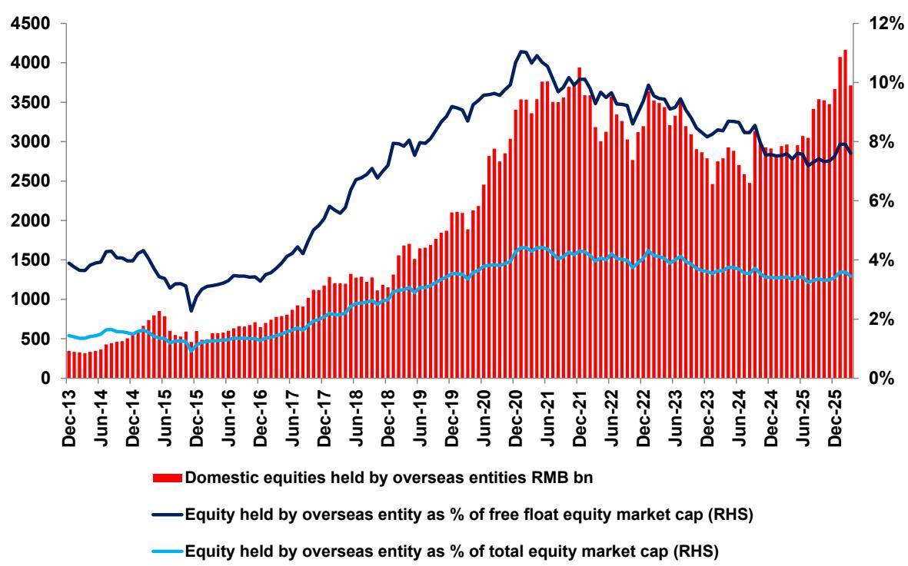

bar-line hybrid chart

| Date    | Domestic equities held by overseas entities RMB bn | Equity held by overseas entity as % of free float equity market cap (RHS) | Equity held by overseas entity as % of total equity market cap (RHS) |
|---------|--------------------------------------------------|------------------------------------------------------------------------|--------------------------------------------------------------------------|
| Dec-13  | 300                                              | 1.5%                                                                   | 1.0%                                                                     |
| Jun-14  | 400                                              | 1.6%                                                                   | 1.2%                                                                     |
| Dec-14  | 500                                              | 1.7%                                                                   | 1.3%                                                                     |
| Jun-15  | 800                                              | 1.8%                                                                   | 1.4%                                                                     |
| Dec-15  | 600                                              | 1.9%                                                                   | 1.5%                                                                     |
| Jun-16  | 700                                              | 2.0%                                                                   | 1.6%                                                                     |
| Dec-16  | 800                                              | 2.1%                                                                   | 1.7%                                                                     |
| Jun-17  | 900                                              | 2.2%                                                                   | 1.8%                                                                     |
| Dec-17  | 1000                                             | 2.3%                                                                   | 1.9%                                                                     |
| Jun-18  | 1200                                             | 2.4%                                                                   | 2.0%                                                                     |
| Dec-18  | 1300                                             | 2.5%                                                                   | 2.1%                                                                     |
| Jun-19  | 1500                                             | 2.6%                                                                   | 2.2%                                                                     |
| Dec-19  | 1700                                             | 2.7%                                                                   | 2.3%                                                                     |
| Jun-20  | 2000                                             | 2.8%                                                                   | 2.4%                                                                     |
| Dec-20  | 2500                                             | 3.0%                                                                   | 2.5%                                                                     |
| Jun-21  | 3500                                             | 3.5%                                                                   | 2.6%                                                                     |
| Dec-21  | 3800                                             | 3.6%                                                                   | 2.7%                                                                     |
| Jun-22  | 3500                                             | 3.5%                                                                   | 2.6%                                                                     |
| Dec-22  | 3700                                             | 3.6%                                                                   | 2.7%                                                                     |
| Jun-23  | 3400                                             | 3.5%                                                                   | 2.6%                                                                     |
| Dec-23  | 3200                                             | 3.4%                                                                   | 2.5%                                                                     |
| Jun-24  | 3000                                             | 3.3%                                                                   | 2.4%                                                                     |
| Dec-24  | 3100                                             | 3.4%                                                                   | 2.5%                                                                     |
| Jun-25  | 3500                                             | 3.5%                                                                   | 2.6%                                                                     |
| Dec-25  | 4100                                             | 3.6%                                                                   | 2.7%                                                                     |

Source: CEIC, Wind, Bloomberg, FactSet, MS. Note: Quarterly data as of end-March 2026.

MS top-down sector allocation for China market – We strongly prefer upstream sectors positioned to benefit from AI/Energy capex super cycle  
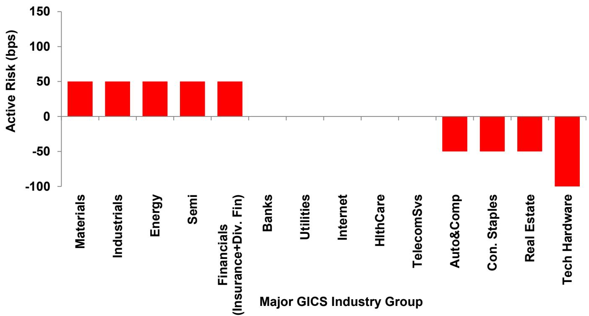

bar chart

| Major GICS Industry Group | Active Risk (bps) |
| :--- | :--- |
| Materials | 50 |
| Industrials | 50 |
| Energy | 50 |
| Semi | 50 |
| Financials (Insurance+Div. Fin) | 50 |
| Banks | 0 |
| Utilities | 0 |
| Internet | 0 |
| HlthCare | 0 |
| TelecomSvs | 0 |
| Auto&Comp | -50 |
| Con. Staples | -50 |
| Real Estate | -50 |
| Tech Hardware | -100 |

Source: MS.

## MS

## Key recommended trades for the next 6-12 months

- Overweight A-shares vs. offshore;  
- MS China/Hong Kong Focus List and A-share Thematic Focus List;  
- China Best Business Model;  
- China's Global Export Champions;  
- Event-driven tactical trade of Stock Connect Southbound inclusion/deletion.

Source: MS.

## MS

## China Best Business Models – Robust stock selection to weather global macro uncertainty with superior risk-adjusted return

US\$32bn

Mkt Cap\*\*\*

10%

Trailing RNOA\*\*

1.5x

Trailing ROE\* vs MSCI China

14.8x

12-mth Fwd P/E\*

2.5x

12-mth Trailing P/B\*

1.16

3-year Sharpe Ratio

<table><tr><td></td><td colspan="2">Annualized total return in US$</td><td colspan="2">Standard deviation</td><td colspan="2">Sharpe ratio</td></tr><tr><td></td><td>China BBM v2</td><td>MSCI China</td><td>China BBM v2</td><td>MSCI China</td><td>China BBM v2</td><td>MSCI China</td></tr><tr><td>5 Yr (2021 - 2025)</td><td>15.3%</td><td>(3.0%)</td><td>22.5%</td><td>27.1%</td><td>0.53</td><td>(0.24)</td></tr><tr><td>3 Yr (2023 - 2025)</td><td>27.8%</td><td>11.8%</td><td>20.4%</td><td>24.0%</td><td>1.16</td><td>0.32</td></tr><tr><td>1 Yr (May 2025 - May 2026)</td><td>91.0%</td><td>14.5%</td><td>20.0%</td><td>19.0%</td><td>4.34</td><td>0.54</td></tr></table>

Source: IBES, FactSet, MS. Data as of May 7, 2026.

China Best Business Models – Aligns with MS Global Theme as well as China’s long-term national growth strategy plan  
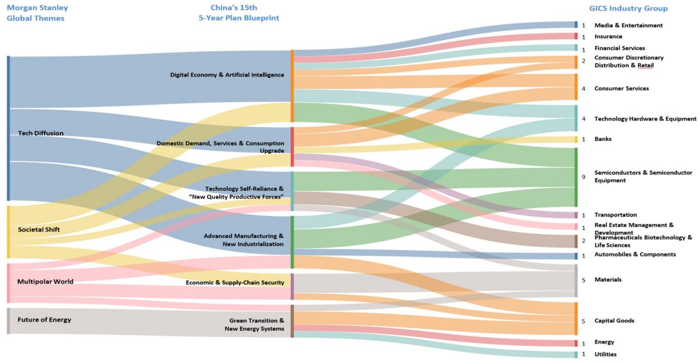

sankey diagram

| Digital Economy & Artificial Intelligence | Media & Entertainment |
| --- | --- |
| Domestic Demand, Services & Consumption Upgrade | Financial Services |
| Technology Self-Reliance & "New Quality Productive Forces" | Consumer Discretionary Distribution & Retail |
| Advanced Manufacturing & New Industrialization | Consumer Services |
| Economic & Supply-Chain Security | Financial Services |
| Green Transition & New Energy Systems | Consumer Discretionary Distribution & Retail |
| Future of Energy | Consumer Services |
| Future of Energy | Financial Services |
| Future of Energy | Consumer Discretionary Distribution & Retail |
| Future of Energy | Consumer Services |
| Future of Energy | Financial Services |
| Future of Energy | Consumer Discretionary Distribution & Retail |
| Future of Energy | Consumer Services |
| Future of Energy | Financial Services |
| Future of Energy | Consumer Discretionary Distribution & Retail |
| Future of Energy | Consumer Services |
| Future of Energy | Financial Services |
| Future de Energy | Media & Entertainment |
| Future de Energy | Insurance |
| Future de Energy | Financial Services |
| Future de Energy | Consumer Discretionary Distribution & Retail |
| Future de Energy | Consumer Services |
| Future de Energy | Financial Services |
| Future de Energy | Consumer Discretionary Distribution & Retail |
| Future de Energy | Consumer Services |
| Future de Energy | Financial Services |
| Future de Energy | Consumer Discretionary Distribution & Retail |
| Future de Energy | Consumer Services |
| Future de Energy | Financial Services |
| Future de Energy | Consumer Discretionary Distribution & Retail |
| Future de Energy | Financial Services |
| Future de Energy | Consumer Discretionary Distribution & Retail |
| Future de Energy | Consumer Services |
| Future de Energy | Financial Services |
| Future de Energy | Consumer Discretionary Distribution & Retail |
| Future de Energy | Consumer Services |
| Future de Energy | Financial Services |
| Future de Energy | Consumer Discretionary Distribution & Retail |
| Future de Energy | Commercial Finance |
| Future de Energy | Financial Finance |
| Future de Energy | Consumer Finance |
| Future de Energy | Consumer Finance |
| Future de Energy | Consumer Finance |
| Future de Energy | Consumer Finance |
| Future de Energy | Consumer Finance |
| Future de Energy | Consumer Finance |
| Future de Energy | Consumer Finance |
| Future de Energy | Consumer Finance |
| Future de Energy | Consumer Finance |
| Future de Energy | Consumer Finance |
| Future de Energy | Consumer Finance |
| Future de Energy | Consumer Finance |
| Future de Energy | Consumer Finance |
| Future de Energy | Consumer Finance |
| Future de Energy | Consumer Finance |
| Future de Energy | Consumer Finance |
| Future de Energy | Consumer Finance |
| Future de Energy | Consumer Finance |
| Future de Energy | Consumer Finance |
| Future de Energy | Consumer Finance |
| Future de Energy | Consumer Finance |
| Future de Energy | Consumer Finance |
| Future de Energy | Consumer Finance |
| Future de Energy | Consumer Finance |
| Future de Energy | Consumer Finance |
| Future de Energy | Consumer Finance |
| Future de Energy | Consumer Finance |
| Future de Energy | Consumer Finance |
| Future de Energy | Consumer Finance |
| Future de Energy | Consumer Finance |
| Future de Energy | Consumer Finance |
| Future de Energy | Consumer Finance |
| Future de Energy | Consumer Finance |
| Future de Energy | Consumer Finance |
| Future de Energy | Consumer Finance |
| Future de Energy | Consumer Finance |
| Future de Energy | Consumer Finance |
| Future de Energy | Consumer Finance |
| Future de Energy | Consumer Finance |
| Future de Energy | Consumer Finance |
| Future de Energy | Consumer Finance |
| Future de Energy | Consumer Finance |
| Future de Energy | Consumer Finance |
| Future de Energy | Consumer Finance |
| Future de Energy | Consumer Finance |
| Future de Energy | Consumer Finance |
| Future de Energy | Consumer Finance |
| Future de Energy | Consumer Finance |
| Future de Energy | Consumer Finance |
| Future de Energy | Consumer Finance |
| Future de Energy | Consumer Finance |
| Future de Energy | Consumer Finance |
| Future de Energy | Consumer Finance |
| Future de Energy | Consumer Finance |
| Future de Energy | Consumer Finance |
| Future de Energy | Consumer Finance |
| Future de Energy | Consumer Finance |
| Future de Energy | Consumer Finance |
| Future de Energy | Commercial Finance |
| Future de Energy | Financial Services |

Source: MS.

China Best Business Models – 25 champions identified with best competitive advantages and industry moats from 16 industry groups

<table><tr><td>Ticker</td><td>Company Name</td><td>GICS Sector</td><td>GICS Industry Group</td><td>MS Rating</td><td>MS Analyst</td><td>New Inclusion</td><td>MS Global Themes</td><td>AI Exposure</td></tr><tr><td>0700.HK</td><td>Tencent Holdings Ltd.</td><td>Communication Services</td><td>Media &amp; Entertainment</td><td>OW</td><td>Yu, Gary</td><td></td><td>Tech Diffusion</td><td>AI enabler</td></tr><tr><td>3606.HK</td><td>Fuyao Glass Industry Group</td><td>Consumer Discretionary</td><td>Automobiles &amp; Components</td><td>EW</td><td>Wang, Shelley</td><td></td><td>Multipolar World</td><td>Others – protected from AI disruption</td></tr><tr><td>BABA.N</td><td>Alibaba Group Holding</td><td>Consumer Discretionary</td><td>Consumer Discretionary Distribution &amp; Retail</td><td>OW</td><td>Yu, Gary</td><td></td><td>Tech Diffusion</td><td>AI enabler</td></tr><tr><td>YUMC.N</td><td>Yum China Holdings Inc.</td><td>Consumer Discretionary</td><td>Consumer Services</td><td>OW</td><td>Lou, Lillian</td><td></td><td>Societal Shift</td><td>AI adopter</td></tr><tr><td>HTHT.O</td><td>H World Group Ltd</td><td>Consumer Discretionary</td><td>Consumer Services</td><td>OW</td><td>Chee, Dan</td><td></td><td>Societal Shift</td><td>AI adopter</td></tr><tr><td>0857.HK</td><td>PetroChina</td><td>Energy</td><td>Energy</td><td>OW</td><td>Lu, Jack</td><td></td><td>Future of Energy</td><td>Others – protected from AI disruption</td></tr><tr><td>002142.SZ</td><td>Bank of Ningbo Co. Ltd</td><td>Financials</td><td>Banks</td><td>OW</td><td>Xu, Richard</td><td></td><td>Tech Diffusion</td><td>AI adopter</td></tr><tr><td>FUTU.O</td><td>Futu Holdings Ltd</td><td>Financials</td><td>Financial Services</td><td>OW</td><td>Huang, Chiyao</td><td>+</td><td>Tech Diffusion</td><td>AI adopter</td></tr><tr><td>2318.HK</td><td>Ping An Insurance Group Co of China Ltd</td><td>Financials</td><td>Insurance</td><td>OW</td><td>Xu, Richard</td><td></td><td>Societal Shift</td><td>AI adopter</td></tr><tr><td>600276.SS</td><td>Jiangsu Hengrui</td><td>Health Care</td><td>Pharmaceuticals Biotechnology &amp; Life Sciences</td><td>OW</td><td>Yan, Alexis</td><td>+</td><td>Societal Shift</td><td>AI adopter</td></tr><tr><td>3696.HK</td><td>Insilico Medicine</td><td>Health Care</td><td>Pharmaceuticals Biotechnology &amp; Life Sciences</td><td>OW</td><td>Lin, Jack</td><td>+</td><td>Tech Diffusion</td><td>AI enabler</td></tr><tr><td>300750.SZ</td><td>Contemporary Amperex Technology Co. Ltd.</td><td>Industrials</td><td>Capital Goods</td><td>OW</td><td>Lu, Jack</td><td>+</td><td>Future of Energy</td><td>AI enabler</td></tr><tr><td>0669.HK</td><td>Techtronic Industries Co Ltd</td><td>Industrials</td><td>Capital Goods</td><td>OW</td><td>Cheng, Terence</td><td>+</td><td>Multipolar World</td><td>AI adopter</td></tr><tr><td>002028.SZ</td><td>Sieyuan Electric Co.Ltd.</td><td>Industrials</td><td>Capital Goods</td><td>OW</td><td>Hou, Eva</td><td>+</td><td>Future of Energy</td><td>AI enabler</td></tr><tr><td>ZTO.N</td><td>ZTO Express</td><td>Industrials</td><td>Transportation</td><td>OW</td><td>Fan, Qianlei</td><td>+</td><td>Tech Diffusion</td><td>AI adopter</td></tr><tr><td>002371.SZ</td><td>NAURA Technology Group Co Ltd</td><td>Information Technology</td><td>Semiconductors &amp; Semiconductor Equipment</td><td>OW</td><td>Chan, Charlie</td><td>+</td><td>Tech Diffusion</td><td>AI enabler</td></tr><tr><td>688008.SS</td><td>Montage Technology Co Ltd</td><td>Information Technology</td><td>Semiconductors &amp; Semiconductor Equipment</td><td>OW</td><td>Yen, Daniel</td><td>+</td><td>Tech Diffusion</td><td>AI enabler</td></tr><tr><td>0522.HK</td><td>ASMPT Ltd</td><td>Information Technology</td><td>Semiconductors &amp; Semiconductor Equipment</td><td>OW</td><td>Dai, Daisy</td><td>+</td><td>Tech Diffusion</td><td>AI enabler</td></tr><tr><td>601138.SS</td><td>Foxconn Industrial Internet Co. Ltd.</td><td>Information Technology</td><td>Technology Hardware &amp; Equipment</td><td>OW</td><td>Shih, Sharon</td><td>+</td><td>Tech Diffusion</td><td>AI enabler</td></tr><tr><td>002475.SZ</td><td>Luxshare Precision Industry Co., Ltd.</td><td>Information Technology</td><td>Technology Hardware &amp; Equipment</td><td>OW</td><td>Shih, Sharon</td><td></td><td>Tech Diffusion</td><td>Others – protected from AI disruption</td></tr><tr><td>2899.HK</td><td>Zijin Mining Group</td><td>Materials</td><td>Materials</td><td>OW</td><td>Zhang, Rachel</td><td>+</td><td>Multipolar World</td><td>AI enabler</td></tr><tr><td>6655.HK</td><td>Huaxin Cement Co</td><td>Materials</td><td>Materials</td><td>OW</td><td>Zhang, Rachel</td><td>+</td><td>Societal Shift</td><td>Others – protected from AI disruption</td></tr><tr><td>300487.SZ</td><td>Sunresin New Materials Co Ltd</td><td>Materials</td><td>Materials</td><td>EW</td><td>Xu, Kaylee</td><td>+</td><td>Societal Shift</td><td>Others – protected from AI disruption</td></tr><tr><td>1109.HK</td><td>China Resources Land Ltd.</td><td>Real Estate</td><td>Real Estate Management &amp; Development</td><td>OW</td><td>Cheung, Stephen</td><td>+</td><td>Tech Diffusion</td><td>AI adopter</td></tr><tr><td>600900.SS</td><td>China Yangtze Power Co.</td><td>Utilities</td><td>Utilities</td><td>OW</td><td>Hou, Eva</td><td></td><td>Future of Energy</td><td>Others – protected from AI disruption</td></tr></table>

Source: MS.

MS Global Export Champion Stock List

<table><tr><td rowspan="2">Ticker</td><td rowspan="2">Company name</td><td rowspan="2">Analyst Rating</td><td rowspan="2">GICS industry group</td><td rowspan="2">Last Price (US$)</td><td>Avg daily t/o</td><td>Mkt cap.</td><td rowspan="2">Upside to target</td><td colspan="2">EPS Growth (MS estimate)</td><td colspan="2">ROE</td><td colspan="2">PE</td><td colspan="2">DY</td><td rowspan="2">Analyst</td><td rowspan="2">2025 Overseas revenue</td></tr><tr><td>US$ mn</td><td>US$ bn</td><td>2026e</td><td>2027e</td><td>2026e</td><td>2027e</td><td>2026e</td><td>2027e</td><td>2026e</td><td>2027e</td></tr><tr><td>603308.SS</td><td>Anhui Yingliu Electromechanical Co Ltd</td><td>OW</td><td>Capital Goods</td><td>8.47</td><td>127</td><td>6</td><td>76.3%</td><td>67%</td><td>93%</td><td>10.9%</td><td>18.6%</td><td>67.4</td><td>35.0</td><td>0.3%</td><td>0.4%</td><td>Li, Tom</td><td>53%</td></tr><tr><td>2590.HK</td><td>Beijing Geekplus Technology Co., Ltd.</td><td>OW</td><td>Capital Goods</td><td>1.62</td><td>12</td><td>2</td><td>128.7%</td><td>506%</td><td>408%</td><td>1.8%</td><td>8.8%</td><td>232.7</td><td>45.8</td><td>NA</td><td>NA</td><td>Zhong, Sheng</td><td>71%</td></tr><tr><td>300750.SZ</td><td>Contemporary Amperex Technology Co. Ltd.</td><td>OW</td><td>Capital Goods</td><td>56.42</td><td>1,641</td><td>272</td><td>55.7%</td><td>27%</td><td>35%</td><td>25.8%</td><td>29.4%</td><td>18.6</td><td>13.7</td><td>2.7%</td><td>3.6%</td><td>Lu, Jack</td><td>32%</td></tr><tr><td>002487.SZ</td><td>Dajin Heavy Industry</td><td>OW</td><td>Capital Goods</td><td>8.63</td><td>154</td><td>6</td><td>93.9%</td><td>77%</td><td>46%</td><td>21.2%</td><td>25.0%</td><td>19.1</td><td>13.1</td><td>0.4%</td><td>0.7%</td><td>Hou, Eva</td><td>75%</td></tr><tr><td>600885.SS</td><td>Hongfa Technology Co Ltd</td><td>OW</td><td>Capital Goods</td><td>4.68</td><td>88</td><td>7</td><td>10.4%</td><td>6%</td><td>39%</td><td>14.4%</td><td>16.9%</td><td>25.0</td><td>18.0</td><td>1.1%</td><td>1.2%</td><td>Zhong, Sheng</td><td>31%</td></tr><tr><td>002270.SZ</td><td>Huaming Power Equipment</td><td>OW</td><td>Capital Goods</td><td>2.70</td><td>54</td><td>2</td><td>88.5%</td><td>17%</td><td>23%</td><td>25.2%</td><td>28.2%</td><td>19.8</td><td>16.2</td><td>3.3%</td><td>4.0%</td><td>Li, Tom</td><td>20%</td></tr><tr><td>600522.SS</td><td>Jiangsu Zhongtian Technology Co. Ltd.</td><td>OW</td><td>Capital Goods</td><td>7.27</td><td>479</td><td>25</td><td>8.0%</td><td>121%</td><td>29%</td><td>16.2%</td><td>18.2%</td><td>26.2</td><td>20.2</td><td>1.2%</td><td>1.6%</td><td>Hou, Eva</td><td>19%</td></tr><tr><td>603606.SS</td><td>Ningbo Orient Wires &amp; Cables Co Ltd</td><td>OW</td><td>Capital Goods</td><td>5.97</td><td>93</td><td></td><td>51.2%</td><td></td><td></td><td>18.2%</td><td>19.8%</td><td>NA</td><td>NA</td><td>NA</td><td>NA</td><td>Hou, Eva</td><td>14%</td></tr><tr><td>601567.SS</td><td>Ningbo Sanxing Medical Electric Co. Ltd.</td><td>OW</td><td>Capital Goods</td><td>2.06</td><td>80</td><td>3</td><td>159.3%</td><td>27%</td><td>31%</td><td>16.3%</td><td>19.2%</td><td>9.2</td><td>7.1</td><td>4.7%</td><td>6.0%</td><td>Li, Tom</td><td>20%</td></tr><tr><td>600031.SS</td><td>Sany Heavy Industry Co., Ltd.</td><td>OW</td><td>Capital Goods</td><td>2.69</td><td>230</td><td>25</td><td>53.7%</td><td>12%</td><td>39%</td><td>11.1%</td><td>14.5%</td><td>16.6</td><td>12.0</td><td>3.1%</td><td>4.2%</td><td>Zhong, Sheng</td><td>64%</td></tr><tr><td>002028.SZ</td><td>Sieyuan Electric Co.Ltd.</td><td>OW</td><td>Capital Goods</td><td>25.39</td><td>210</td><td>20</td><td>66.6%</td><td>42%</td><td>43%</td><td>25.6%</td><td>28.8%</td><td>30.1</td><td>21.0</td><td>0.4%</td><td>0.6%</td><td>Hou, Eva</td><td>29%</td></tr><tr><td>0669.HK</td><td>Techtronic Industries Co Ltd</td><td>OW</td><td>Capital Goods</td><td>14.73</td><td>67</td><td>27</td><td>17.0%</td><td>20%</td><td>11%</td><td>20.8%</td><td>21.3%</td><td>18.8</td><td>16.9</td><td>2.2%</td><td>2.7%</td><td>Cheng, Terence</td><td>97%</td></tr><tr><td>2338.HK</td><td>WeiChai Power</td><td>OW</td><td>Capital Goods</td><td>4.37</td><td>50</td><td>36</td><td>37.3%</td><td>22%</td><td>29%</td><td>13.8%</td><td>16.4%</td><td>19.3</td><td>15.0</td><td>3.0%</td><td>4.0%</td><td>Zhong, Sheng</td><td>53%</td></tr><tr><td>300450.SZ</td><td>Wuxi Lead Intelligent</td><td>OW</td><td>Capital Goods</td><td>6.17</td><td>536</td><td>10</td><td>108.3%</td><td>53%</td><td>79%</td><td>15.5%</td><td>21.7%</td><td>27.3</td><td>15.3</td><td>0.7%</td><td>1.1%</td><td>Zhong, Sheng</td><td>24%</td></tr><tr><td>603338.SS</td><td>Zhejiang Dingli Machinery Co Ltd.</td><td>OW</td><td>Capital Goods</td><td>7.16</td><td>49</td><td>4</td><td>38.1%</td><td>10%</td><td>27%</td><td>17.2%</td><td>19.2%</td><td>11.8</td><td>9.3</td><td>2.6%</td><td>3.3%</td><td>Zhong, Sheng</td><td>82%</td></tr><tr><td>688006.SS</td><td>Zhejiang Hangke Technology</td><td>OW</td><td>Capital Goods</td><td>4.82</td><td>55</td><td>3</td><td>53.2%</td><td>52%</td><td>45%</td><td>12.9%</td><td>16.3%</td><td>25.7</td><td>17.8</td><td>0.4%</td><td>0.6%</td><td>Zhong, Sheng</td><td>56%</td></tr><tr><td>603799.SS</td><td>Zhejiang Huayou Cobalt Co Ltd</td><td>OW</td><td>Capital Goods</td><td>7.02</td><td>602</td><td>13</td><td>57.8%</td><td>35%</td><td>29%</td><td>16.5%</td><td>18.2%</td><td>10.5</td><td>8.1</td><td>1.0%</td><td>1.4%</td><td>Jiang, Chris</td><td>64%</td></tr><tr><td>1157.HK</td><td>Zoomlion Heavy Industry</td><td>OW</td><td>Capital Goods</td><td>0.98</td><td>10</td><td>9</td><td>27.9%</td><td>6%</td><td>40%</td><td>8.7%</td><td>11.7%</td><td>11.3</td><td>8.1</td><td>6.4%</td><td>8.9%</td><td>Zhong, Sheng</td><td>60%</td></tr><tr><td>6655.HK</td><td>Huaxin Building Materials</td><td>OW</td><td>Materials</td><td>1.70</td><td>18</td><td>5</td><td>86.7%</td><td>30%</td><td>6%</td><td>11.3%</td><td>11.2%</td><td>6.4</td><td>6.1</td><td>6.2%</td><td>6.6%</td><td>Zhang, Rachel</td><td>35%</td></tr><tr><td>600219.SS</td><td>Shandong Nanshan Aluminium Co.</td><td>OW</td><td>Materials</td><td>0.68</td><td>191</td><td>8</td><td>59.4%</td><td>20%</td><td>11%</td><td>11.4%</td><td>12.6%</td><td>9.6</td><td>8.7</td><td>9.8%</td><td>10.9%</td><td>Zhang, Rachel</td><td>54%</td></tr><tr><td>600309.SS</td><td>Wanhua Chemical</td><td>OW</td><td>Materials</td><td>9.91</td><td>378</td><td>31</td><td>50.4%</td><td>44%</td><td>16%</td><td>15.7%</td><td>16.3%</td><td>11.7</td><td>10.1</td><td>2.7%</td><td>3.1%</td><td>Xu, Kaylee</td><td>47%</td></tr><tr><td>688008.SS</td><td>Montage Technology Co Ltd</td><td>OW</td><td>Semiconductors &amp; Semiconductor Equipment</td><td>33.76</td><td>875</td><td>38</td><td>19.8%</td><td>61%</td><td>89%</td><td>20.0%</td><td>25.7%</td><td>73.2</td><td>38.7</td><td>0.0%</td><td>0.0%</td><td>Yen, Daniel</td><td>72%</td></tr><tr><td>300373.SZ</td><td>Yangjie Technology</td><td>OW</td><td>Semiconductors &amp; Semiconductor Equipment</td><td>14.79</td><td>173</td><td>8</td><td>-9.2%</td><td>23%</td><td>36%</td><td>14.7%</td><td>17.5%</td><td>35.2</td><td>25.8</td><td>0.5%</td><td>0.6%</td><td>Dai, Daisy</td><td>25%</td></tr><tr><td>601138.SS</td><td>Foxconn Industrial Internet Co. Ltd.</td><td>OW</td><td>Technology Hardware &amp; Equipment</td><td>10.26</td><td>1,553</td><td>193</td><td>19.1%</td><td>73%</td><td>31%</td><td>36.1%</td><td>45.9%</td><td>22.6</td><td>17.2</td><td>4.1%</td><td>5.4%</td><td>Shih, Sharon</td><td>44%</td></tr><tr><td>601231.SS</td><td>Universal Scientific Ind. (Shanghai)</td><td>OW</td><td>Technology Hardware &amp; Equipment</td><td>5.19</td><td>158</td><td>12</td><td>29.1%</td><td>42%</td><td>48%</td><td>12.5%</td><td>16.7%</td><td>29.6</td><td>20.0</td><td>1.2%</td><td>1.8%</td><td>Dai, Daisy</td><td>46%</td></tr></table>

Source: ModelWare, RIMES, FactSet, MS. Note: OW = Overweight. Data as of June 11, 2026. This assumes the Focus List constitutes an equal-weighted portfolio, rebalanced whenever positions are added or subtracted. Results shown represent total absolute return (including dividends) and exclude brokerage commissions. These figures are not audited. Past performance is no guarantee of future results. (X) indicates stock has outperformed MSCI China Index since inclusion in the Focus List.

## MS

MS China/HK Focus List

<table><tr><td rowspan="2">Company Name</td><td rowspan="2">Ticker</td><td rowspan="2">Rating</td><td rowspan="2">Market</td><td rowspan="2">GICS Sector</td><td rowspan="2">Mkt Cap (US$bn)</td><td rowspan="2">Date Added</td><td rowspan="2">Total US$ Returns Since Added</td><td rowspan="2">12M Total Return Perf.</td><td rowspan="2">Last Price (US $)</td><td rowspan="2">Upside to Target Price</td><td colspan="2">MS P/E</td><td>MS P/B</td><td>MS ROE</td><td>MS Div. Yld</td><td>MS P/Sales</td><td rowspan="2">Analyst</td></tr><tr><td>2026E</td><td>2027E</td><td>2026E</td><td>2026E</td><td>2026E</td><td>2026E</td></tr><tr><td>Alibaba Group Holding</td><td>BABA.N</td><td>OW</td><td>China</td><td>Consumer Discretionary</td><td>285.6</td><td>24-Feb-25</td><td>-19.5%</td><td>-8.3%</td><td>112.7</td><td>68.6%</td><td>22.7x</td><td>24.0x</td><td>1.6x</td><td>7.2%</td><td>-</td><td>2.1x</td><td>Yu, Gary</td></tr><tr><td>Aluminum Corp. of China Ltd.</td><td>601600.SS</td><td>OW</td><td>China</td><td>Materials</td><td>25.1</td><td>2-Feb-26</td><td>-16.7%</td><td>63.0%</td><td>1.6</td><td>66.4%</td><td>7.3x</td><td>8.4x</td><td>2.0x</td><td>27.3%</td><td>5.1%</td><td>0.7x</td><td>Zhang, Rachel</td></tr><tr><td>China Petroleum &amp; Chemical Corp.</td><td>0386.HK</td><td>OW</td><td>China</td><td>Energy</td><td>81.0</td><td>2-Mar-26</td><td>-24.3%</td><td>3.2%</td><td>0.5</td><td>68.7%</td><td>7.4x</td><td>5.4x</td><td>0.5x</td><td>6.8%</td><td>9.8%</td><td>0.2x</td><td>Lu, Jack</td></tr><tr><td>China Shenhua Energy</td><td>1088.HK</td><td>OW</td><td>China</td><td>Energy</td><td>134.6</td><td>25-Mar-26</td><td>-4.5%</td><td>45.2%</td><td>√</td><td>5.8</td><td>18.7%</td><td>13.1x</td><td>12.4x</td><td>1.7x</td><td>13.1%</td><td>5.8%</td><td>2.8x</td></tr><tr><td>Contemporary Amperex Technology Co. Ltd.</td><td>300750.SZ</td><td>OW</td><td>China</td><td>Industrials</td><td>272.4</td><td>10-Mar-24</td><td>174.8%</td><td>64.9%</td><td>√</td><td>58.0</td><td>51.5%</td><td>19.1x</td><td>14.1x</td><td>4.7x</td><td>25.8%</td><td>2.6%</td><td>3.2x</td></tr><tr><td>Duality Biotherapeutics Inc</td><td>9606.HK</td><td>OW</td><td>China</td><td>Health Care</td><td>2.0</td><td>21-Aug-25</td><td>-46.1%</td><td>-25.6%</td><td>23.0</td><td>173.1%</td><td>51.7x</td><td>-38.0x</td><td>-6.8x</td><td>-13.2%</td><td>0.0%</td><td>10.4x</td><td>Lin, Jack</td></tr><tr><td>GigaDevice Semiconductor Beijing Inc</td><td>603986.SS</td><td>OW</td><td>China</td><td>Information Technology</td><td>47.6</td><td>2-Mar-26</td><td>67.8%</td><td>332.1%</td><td>√</td><td>73.5</td><td>17.5%</td><td>38.8x</td><td>24.0x</td><td>12.2x</td><td>31.3%</td><td>0.8%</td><td>14.7x</td></tr><tr><td>HK Exchanges &amp; Clearing</td><td>0388.HK</td><td>OW</td><td>Hong Kong</td><td>Financials</td><td>60.7</td><td>24-Feb-25</td><td>12.1%</td><td>-8.3%</td><td>√</td><td>48.3</td><td>36.2%</td><td>26.2x</td><td>24.6x</td><td>7.8x</td><td>29.9%</td><td>3.4%</td><td>15.7x</td></tr><tr><td>HKT Trust and HKT Ltd.</td><td>6823.HK</td><td>OW</td><td>Hong Kong</td><td>Communication Services</td><td>0.0</td><td>24-Mar-21</td><td>62.1%</td><td>12.8%</td><td>√</td><td>1.5</td><td>16.9%</td><td>16.3x</td><td>15.7x</td><td>2.5x</td><td>15.4%</td><td>7.1%</td><td>0.0x</td></tr><tr><td>Jiangsu Zhongtian Technology Co. Ltd.</td><td>600522.SS</td><td>OW</td><td>China</td><td>Industrials</td><td>24.8</td><td>25-Mar-26</td><td>81.2%</td><td>290.9%</td><td>√</td><td>7.3</td><td>7.9%</td><td>26.2x</td><td>20.3x</td><td>4.0x</td><td>15.1%</td><td>1.2%</td><td>2.7x</td></tr><tr><td>NARI Technology</td><td>600406.SS</td><td>OW</td><td>China</td><td>Industrials</td><td>27.1</td><td>13-Jun-19</td><td>157.9%</td><td>11.6%</td><td>√</td><td>3.4</td><td>39.4%</td><td>19.7x</td><td>17.4x</td><td>3.2x</td><td>16.4%</td><td>2.7%</td><td>2.5x</td></tr><tr><td>Ping An Insurance Group Co of China Ltd</td><td>2318.HK</td><td>OW</td><td>China</td><td>Financials</td><td>29.3</td><td>2-Dec-25</td><td>1.8%</td><td>23.1%</td><td>√</td><td>7.4</td><td>59.1%</td><td>6.0x</td><td>5.4x</td><td>0.8x</td><td>14.3%</td><td>5.7%</td><td>0.8x</td></tr><tr><td>Sinoma Science &amp; Technology Co. Ltd.</td><td>002080.SZ</td><td>OW</td><td>China</td><td>Materials</td><td>15.8</td><td>12-Jan-26</td><td>79.7%</td><td>310.7%</td><td>√</td><td>9.5</td><td>-13.1%</td><td>47.8x</td><td>35.3x</td><td>5.0x</td><td>10.5%</td><td>0.5%</td><td>3.0x</td></tr><tr><td>Zijin Mining Group</td><td>2899.HK</td><td>OW</td><td>China</td><td>Materials</td><td>105.3</td><td>14-Nov-22</td><td>212.8%</td><td>56.4%</td><td>√</td><td>3.9</td><td>81.7%</td><td>8.7x</td><td>8.5x</td><td>2.8x</td><td>31.7%</td><td>2.9%</td><td>1.4x</td></tr></table>

<table><tr><td rowspan="2">Total Return</td><td colspan="2">Since Inception</td><td colspan="2">12 Months</td><td colspan="2">1 Month</td></tr><tr><td>Absolute</td><td>Relative</td><td>Absolute</td><td>Relative</td><td>Absolute</td><td>Relative</td></tr><tr><td>China Focus List (US$)</td><td>116.7%</td><td>73.4%</td><td>22.6%</td><td>21.5%</td><td>-2.4%</td><td>4.4%</td></tr></table>

Source: ModelWare, RIMES, FactSet, MS. Note: OW = Overweight. Data as of June 11, 2026. This assumes the Focus List constitutes an equal-weighted portfolio, rebalanced whenever positions are added or subtracted. Results shown represent total absolute return (including dividends) and exclude brokerage commissions. These figures are not audited. Past performance is no guarantee of future results. (X) indicates stock has outperformed MSCI China Index since inclusion in the Focus List.

MS China A-share thematic stock list

<table><tr><td rowspan="2">Company Name</td><td rowspan="2">Ticker</td><td rowspan="2">Rating</td><td rowspan="2">Market</td><td rowspan="2">GICS Sector</td><td rowspan="2">Mkt Cap (US$bn)</td><td rowspan="2">Date Added</td><td rowspan="2">Total US$ Returns Since Added</td><td rowspan="2" colspan="2">12M Total Return Perf.</td><td rowspan="2">Last Price (US $)</td><td rowspan="2">Upside to Target Price</td><td colspan="2">MS P/E</td><td>MS P/B</td><td>MS ROE</td><td>MS Div. Yld</td><td>MS P/Sales</td><td rowspan="2">Analyst</td></tr><tr><td>2026E</td><td>2027E</td><td>2026E</td><td>2026E</td><td>2026E</td><td>2026E</td></tr><tr><td>Aluminum Corp. of China Ltd.</td><td>601600.SS</td><td>OW</td><td>China</td><td>Materials</td><td>24.6</td><td>2-Feb-26</td><td>-16.7%</td><td>63.0%</td><td></td><td>1.6</td><td>73.3%</td><td>7.3x</td><td>8.5x</td><td>2.0x</td><td>27.3%</td><td>5.0%</td><td>0.6x</td><td>Zhang, Rachel</td></tr><tr><td>Contemporary Amperex Technology Co. Ltd.</td><td>300750.SZ</td><td>OW</td><td>China</td><td>Industrials</td><td>276.5</td><td>10-Mar-24</td><td>174.8%</td><td>64.9%</td><td>√</td><td>57.6</td><td>53.2%</td><td>19.0x</td><td>14.0x</td><td>4.6x</td><td>25.8%</td><td>2.6%</td><td>3.2x</td><td>Lu, Jack</td></tr><tr><td>GigaDevice Semiconductor Beijing Inc</td><td>603986.SS</td><td>OW</td><td>China</td><td>Information Technology</td><td>47.4</td><td>2-Mar-26</td><td>67.8%</td><td>332.1%</td><td>√</td><td>73.0</td><td>21.7%</td><td>38.6x</td><td>23.9x</td><td>12.1x</td><td>31.3%</td><td>0.8%</td><td>14.6x</td><td>Yen, Daniel</td></tr><tr><td>Hongfa Technology Co Ltd</td><td>600885.SS</td><td>OW</td><td>China</td><td>Industrials</td><td>6.9</td><td>16-Apr-24</td><td>84.5%</td><td>49.4%</td><td>√</td><td>4.9</td><td>10.0%</td><td>26.0x</td><td>18.7x</td><td>3.5x</td><td>13.3%</td><td>1.1%</td><td>2.4x</td><td>Zhong, Sheng</td></tr><tr><td>Jiangsu Zhongtian Technology Co. Ltd.</td><td>600522.SS</td><td>OW</td><td>China</td><td>Industrials</td><td>25.3</td><td>25-Mar-26</td><td>81.2%</td><td>290.9%</td><td>√</td><td>7.3</td><td>6.0%</td><td>26.2x</td><td>20.2x</td><td>4.0x</td><td>15.1%</td><td>1.2%</td><td>2.7x</td><td>Hou, Eva</td></tr><tr><td>NARI Technology</td><td>600406.SS</td><td>OW</td><td>China</td><td>Industrials</td><td>26.9</td><td>13-Jun-19</td><td>157.9%</td><td>11.6%</td><td>√</td><td>3.4</td><td>42.2%</td><td>19.7x</td><td>17.3x</td><td>3.2x</td><td>16.4%</td><td>2.7%</td><td>2.5x</td><td>Hou, Eva</td></tr><tr><td>Ping An Insurance Group Co of China Ltd</td><td>601318.SS</td><td>OW</td><td>China</td><td>Financials</td><td>138.1</td><td>12-Jan-26</td><td>-17.2%</td><td>10.7%</td><td></td><td>7.9</td><td>57.8%</td><td>6.4x</td><td>5.8x</td><td>0.9x</td><td>0.1x</td><td>5.3%</td><td>0.8x</td><td>Xu, Richard</td></tr><tr><td>Sinoma Science &amp; Technology Co. Ltd.</td><td>002080.SZ</td><td>OW</td><td>China</td><td>Materials</td><td>15.6</td><td>17-Nov-25</td><td>106.0%</td><td>310.7%</td><td>√</td><td>9.5</td><td>-10.8%</td><td>47.9x</td><td>35.3x</td><td>5.0x</td><td>10.5%</td><td>0.5%</td><td>2.9x</td><td>Hou, Eva</td></tr><tr><td>Zijin Mining Group</td><td>601899.SS</td><td>OW</td><td>China</td><td>Materials</td><td>106.9</td><td>28-Nov-22</td><td>222.2%</td><td>58.7%</td><td>√</td><td>4.2</td><td>87.7%</td><td>9.4x</td><td>9.3x</td><td>3.0x</td><td>31.7%</td><td>2.7%</td><td>1.5x</td><td>Zhang, Rachel</td></tr></table>

<table><tr><td rowspan="2">Total Return</td><td colspan="2">Since Inception</td><td colspan="2">12 Months</td><td colspan="2">1 Month</td></tr><tr><td>Absolute</td><td>Relative</td><td>Absolute</td><td>Relative</td><td>Absolute</td><td>Relative</td></tr><tr><td>China A-Share Thematic Focus List (US$)</td><td>227.0%</td><td>153.9%</td><td>53.9%</td><td>25.6%</td><td>2.3%</td><td>6.8%</td></tr></table>

Source: MSCI, RIMES, MS. Note: OW = Overweight. Data as June 11, 2026. This assumes the group of selected stocks constitutes an equal-weighted portfolio, rebalanced whenever positions are added or subtracted. Results shown represent total absolute returns (including dividends) and exclude brokerage commissions. These figures are not audited. Past performance is no guarantee of future results. Tick-mark indicates stock has outperformed Shanghai Composite Index since inclusion in the Focus List.

Appendix – MS cross-asset allocation and key forecasts

<table><tr><td rowspan="2">Index</td><td rowspan="2">Current Price</td><td rowspan="2">Jun 2027 Base Case Index Target (% Upside)</td><td rowspan="2">Prior Target Dec 2026 (% Upside)</td><td colspan="3">MS Top-Down EPS YoY %</td><td colspan="3">Consensus EPS Forecast YoY %</td><td rowspan="2">MS Base Case N12M P/E Jun 2027</td><td rowspan="2">Current Consensus N12M P/E</td><td rowspan="2">10 Year Avg. Consensus N12M P/E</td></tr><tr><td>2026</td><td>2027</td><td>2028</td><td>2026</td><td>2027</td><td>2028</td></tr><tr><td rowspan="2">S&amp;P 500</td><td rowspan="2">7,399</td><td>8,300</td><td>7,800</td><td>339</td><td>380</td><td>429</td><td>333</td><td>383</td><td>427</td><td rowspan="2">20.5</td><td rowspan="2">21.2</td><td rowspan="2">18.8</td></tr><tr><td>12%</td><td>5%</td><td>23%</td><td>12%</td><td>13%</td><td>21%</td><td>15%</td><td>12%</td></tr><tr><td rowspan="2">MSCI Europe</td><td rowspan="2">2,426</td><td>2,700</td><td>2,430</td><td>154</td><td>163</td><td>174</td><td>159</td><td>177</td><td>194</td><td rowspan="2">16.0</td><td rowspan="2">14.7</td><td rowspan="2">14.3</td></tr><tr><td>11%</td><td>0%</td><td>11%</td><td>6%</td><td>7%</td><td>15%</td><td>11%</td><td>10%</td></tr><tr><td rowspan="2">TOPIX</td><td rowspan="2">3,829</td><td>4,300</td><td>4,250</td><td>210</td><td>225</td><td>246</td><td>210</td><td>237</td><td>263</td><td rowspan="2">17.5</td><td rowspan="2">16.5</td><td rowspan="2">14.2</td></tr><tr><td>12%</td><td>11%</td><td>12%</td><td>7%</td><td>9%</td><td>12%</td><td>13%</td><td>11%</td></tr><tr><td rowspan="2">MSCI EM</td><td rowspan="2">1,648</td><td>1,800</td><td>1,700</td><td>125</td><td>136</td><td>141</td><td>130</td><td>154</td><td>174</td><td rowspan="2">13.0</td><td rowspan="2">12.0</td><td rowspan="2">12.3</td></tr><tr><td>9%</td><td>3%</td><td>40%</td><td>9%</td><td>4%</td><td>51%</td><td>19%</td><td>13%</td></tr></table>

Source: Markit Box, MSCI, RIMES, DataStream, IBES, Bloomberg, MS forecasts.

Appendix – MS cross-asset allocation and key forecasts  
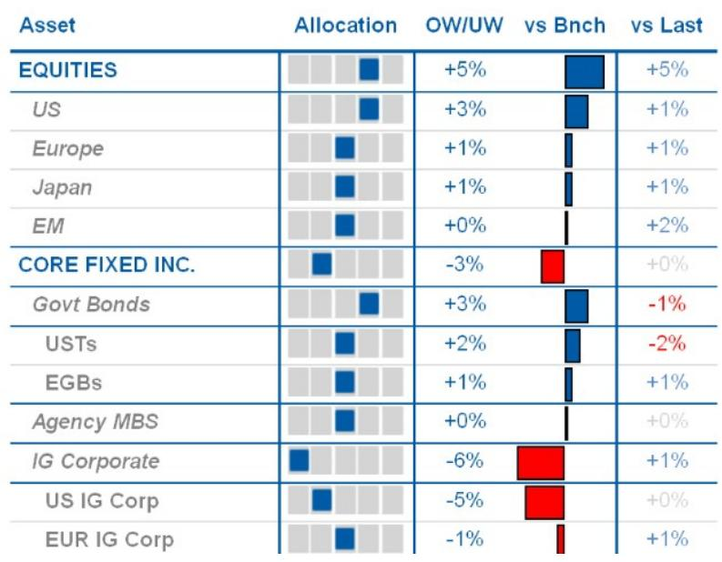

bar chart

| Asset | Allocation (%) | OW/UW (%) | vs Bnch (%) | vs Last (%) |
| :--- | :--- | :--- | :--- | :--- |
| EQUITIES | [value] | +5 | [value] | +5 |
| US | [value] | +3 | [value] | +1 |
| Europe | [value] | +1 | [value] | +1 |
| Japan | [value] | +1 | [value] | +1 |
| EM | [value] | +0 | [value] | +2 |
| CORE FIXED INC. | [value] | -3 | [red] | +0 |
| Govt Bonds | [value] | +3 | [red] | -1 |
| USTs | [value] | +2 | [red] | -2 |
| EGBs | [value] | +1 | [red] | +1 |
| Agency MBS | [value] | +0 | [red] | +0 |
| IG Corporate | [value] | -6 | [red] | +1 |
| US IG Corp | [value] | -5 | [red] | +0 |
| EUR IG Corp | [value] | -1 | [red] | +1 |

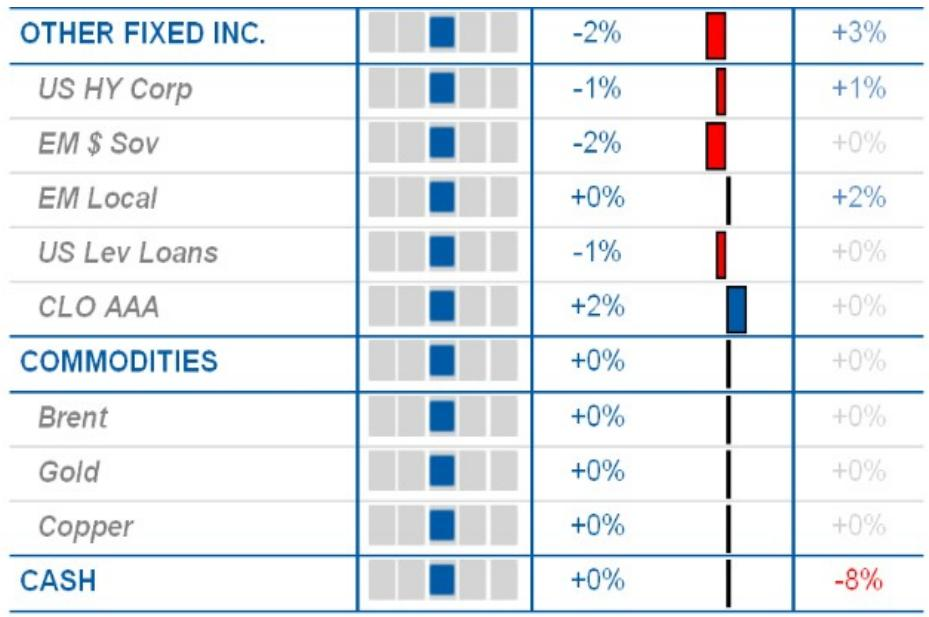

bar chart

| Category | Blue Bar (%) | Red Bar (%) | Grey Bar (%) |
| :--- | :--- | :--- | :--- |
| OTHER FIXED INC. | -2% | +3% | |
| US HY Corp | -1% | +1% | |
| EM $ Sov | -2% | +0% | |
| EM Local | +0% | +2% | |
| US Lev Loans | -1% | +0% | |
| CLO AAA | +2% | +0% | |
| COMMODITIES | +0% | +0% | |
| Brent | +0% | +0% | |
| Gold | +0% | +0% | |
| Copper | +0% | +0% | |
| CASH | +0% | -8% | |

Source: Markit Box, MSCI, RIMES, DataStream, IBES, Bloomberg, MS forecasts.

Appendix – MS global real GDP growth forecasts

<table><tr><td rowspan="3">Real GDP (%Y)</td><td colspan="16">Quarterly</td><td colspan="4">Annual</td></tr><tr><td colspan="4">2024</td><td colspan="4">2025</td><td colspan="4">2026</td><td colspan="4">2027</td><td rowspan="2">2024</td><td rowspan="2">2025</td><td rowspan="2">2026E</td><td rowspan="2">2027E</td></tr><tr><td>1Q</td><td>2Q</td><td>3Q</td><td>4Q</td><td>1Q</td><td>2Q</td><td>3Q</td><td>4Q</td><td>1Q</td><td>2QE</td><td>3QE</td><td>4QE</td><td>1QE</td><td>2QE</td><td>3QE</td><td>4QE</td></tr><tr><td>Global (%Y)</td><td>3.3</td><td>3.3</td><td>3.3</td><td>3.7</td><td>3.5</td><td>3.5</td><td>3.6</td><td>3.4</td><td>3.5</td><td>3.1</td><td>3.2</td><td>3.2</td><td>3.4</td><td>3.6</td><td>3.4</td><td>3.4</td><td>3.4</td><td>3.5</td><td>3.2</td><td>3.4</td></tr><tr><td>Global ex US (%Y)</td><td>3.4</td><td>3.4</td><td>3.5</td><td>3.9</td><td>3.9</td><td>3.8</td><td>3.8</td><td>3.7</td><td>3.8</td><td>3.3</td><td>3.5</td><td>3.4</td><td>3.6</td><td>3.8</td><td>3.6</td><td>3.6</td><td>3.5</td><td>3.8</td><td>3.5</td><td>3.6</td></tr><tr><td>G10 (%Y)</td><td>1.4</td><td>1.6</td><td>1.9</td><td>1.9</td><td>1.8</td><td>1.9</td><td>1.8</td><td>1.5</td><td>1.5</td><td>1.4</td><td>1.1</td><td>1.3</td><td>1.6</td><td>1.6</td><td>1.8</td><td>1.9</td><td>1.7</td><td>1.7</td><td>1.3</td><td>1.7</td></tr><tr><td>US</td><td>2.9</td><td>3.1</td><td>2.8</td><td>2.4</td><td>2.0</td><td>2.1</td><td>2.3</td><td>2.0</td><td>2.6</td><td>2.2</td><td>1.7</td><td>2.2</td><td>2.4</td><td>2.4</td><td>2.5</td><td>2.6</td><td>2.8</td><td>2.1</td><td>2.2</td><td>2.6</td></tr><tr><td>Euro Area</td><td>0.6</td><td>0.7</td><td>1.1</td><td>1.4</td><td>1.7</td><td>1.6</td><td>1.4</td><td>1.2</td><td>0.3</td><td>0.6</td><td>0.5</td><td>0.5</td><td>1.0</td><td>0.9</td><td>1.1</td><td>1.2</td><td>0.9</td><td>1.5</td><td>0.5</td><td>1.0</td></tr><tr><td>Japan</td><td>-1.1</td><td>-1.1</td><td>0.9</td><td>0.6</td><td>1.5</td><td>2.0</td><td>0.5</td><td>0.2</td><td>0.6</td><td>0.1</td><td>0.6</td><td>0.5</td><td>0.4</td><td>1.0</td><td>1.2</td><td>1.2</td><td>-0.2</td><td>1.1</td><td>0.4</td><td>1.0</td></tr><tr><td>UK</td><td>0.2</td><td>0.8</td><td>1.3</td><td>2.0</td><td>1.8</td><td>1.4</td><td>1.3</td><td>1.0</td><td>1.1</td><td>1.0</td><td>0.9</td><td>0.6</td><td>0.5</td><td>0.8</td><td>1.3</td><td>1.9</td><td>1.1</td><td>1.4</td><td>0.9</td><td>1.1</td></tr><tr><td>Global (%Q, SAAR)^</td><td>3.6</td><td>3.6</td><td>3.6</td><td>3.7</td><td>3.1</td><td>3.8</td><td>3.7</td><td>3.2</td><td>3.0</td><td>2.1</td><td>4.3</td><td>3.7</td><td>3.2</td><td>3.1</td><td>3.5</td><td>3.4</td><td>3.7</td><td>3.4</td><td>3.2</td><td>3.4</td></tr><tr><td>G10 (%Q, SAAR)^</td><td>1.1</td><td>2.1</td><td>2.5</td><td>1.8</td><td>1.1</td><td>2.1</td><td>2.2</td><td>0.6</td><td>0.9</td><td>1.6</td><td>1.4</td><td>1.5</td><td>1.7</td><td>2.0</td><td>1.9</td><td>1.9</td><td>1.9</td><td>1.5</td><td>1.3</td><td>1.9</td></tr><tr><td>US</td><td>0.8</td><td>3.6</td><td>3.3</td><td>1.9</td><td>-0.6</td><td>3.8</td><td>4.4</td><td>0.5</td><td>1.6</td><td>2.3</td><td>2.3</td><td>2.5</td><td>2.4</td><td>2.6</td><td>2.6</td><td>2.6</td><td>2.4</td><td>2.0</td><td>2.2</td><td>2.6</td></tr><tr><td>Euro Area</td><td>1.3</td><td>0.9</td><td>1.8</td><td>1.5</td><td>2.7</td><td>0.5</td><td>1.1</td><td>0.7</td><td>-0.9</td><td>1.6</td><td>0.6</td><td>0.8</td><td>1.0</td><td>1.2</td><td>1.3</td><td>1.3</td><td>1.4</td><td>1.2</td><td>0.5</td><td>1.2</td></tr><tr><td>Japan</td><td>-1.4</td><td>0.1</td><td>2.7</td><td>1.5</td><td>1.8</td><td>1.4</td><td>-2.5</td><td>0.8</td><td>2.1</td><td>-0.7</td><td>0.2</td><td>0.7</td><td>1.2</td><td>2.2</td><td>0.7</td><td>1.0</td><td>0.6</td><td>0.2</td><td>0.5</td><td>1.2</td></tr><tr><td>UK</td><td>3.1</td><td>2.5</td><td>0.9</td><td>1.4</td><td>2.6</td><td>0.8</td><td>0.3</td><td>0.2</td><td>2.5</td><td>0.2</td><td>0.0</td><td>-0.4</td><td>2.2</td><td>1.6</td><td>1.9</td><td>1.9</td><td>2.0</td><td>1.0</td><td>0.6</td><td>1.9</td></tr><tr><td>EM (%Y)</td><td>4.8</td><td>4.7</td><td>4.5</td><td>5.0</td><td>4.8</td><td>4.7</td><td>4.9</td><td>4.9</td><td>5.1</td><td>4.3</td><td>4.7</td><td>4.5</td><td>4.7</td><td>5.0</td><td>4.5</td><td>4.5</td><td>4.7</td><td>4.9</td><td>4.6</td><td>4.6</td></tr><tr><td>EM ex China (%Y)</td><td>4.4</td><td>4.7</td><td>4.4</td><td>4.7</td><td>4.3</td><td>4.4</td><td>5.0</td><td>5.2</td><td>5.1</td><td>4.1</td><td>4.5</td><td>4.2</td><td>4.7</td><td>5.0</td><td>4.4</td><td>4.4</td><td>4.5</td><td>4.7</td><td>4.5</td><td>4.6</td></tr><tr><td>AXJ (%Y)</td><td>5.6</td><td>5.3</td><td>4.9</td><td>5.5</td><td>5.4</td><td>5.4</td><td>5.5</td><td>5.4</td><td>5.8</td><td>5.1</td><td>5.2</td><td>5.0</td><td>5.2</td><td>5.3</td><td>5.1</td><td>4.9</td><td>5.3</td><td>5.5</td><td>5.3</td><td>5.1</td></tr><tr><td>China</td><td>5.3</td><td>4.7</td><td>4.6</td><td>5.4</td><td>5.4</td><td>5.2</td><td>4.8</td><td>4.5</td><td>5.0</td><td>4.7</td><td>4.8</td><td>4.9</td><td>4.7</td><td>4.8</td><td>4.8</td><td>4.6</td><td>5.0</td><td>5.0</td><td>4.8</td><td>4.7</td></tr><tr><td>India</td><td>7.5</td><td>7.5</td><td>6.6</td><td>7.4</td><td>7.0</td><td>6.8</td><td>8.3</td><td>8.0</td><td>7.8</td><td>6.5</td><td>6.7</td><td>6.8</td><td>7.0</td><td>7.0</td><td>7.2</td><td>7.0</td><td>7.2</td><td>7.5</td><td>7.0</td><td>7.0</td></tr><tr><td>Hong Kong</td><td>2.9</td><td>3.0</td><td>2.1</td><td>2.5</td><td>3.2</td><td>3.3</td><td>3.8</td><td>4.0</td><td>5.9</td><td>5.0</td><td>4.4</td><td>3.8</td><td>3.3</td><td>4.6</td><td>5.1</td><td>5.0</td><td>2.6</td><td>3.6</td><td>4.8</td><td>4.5</td></tr><tr><td>Korea</td><td>3.3</td><td>2.3</td><td>1.5</td><td>1.2</td><td>-0.1</td><td>1.0</td><td>1.7</td><td>1.6</td><td>3.6</td><td>3.1</td><td>2.8</td><td>1.5</td><td>2.2</td><td>3.7</td><td>1.6</td><td>1.5</td><td>2.1</td><td>1.1</td><td>2.8</td><td>2.2</td></tr><tr><td>Taiwan</td><td>7.2</td><td>5.3</td><td>4.7</td><td>4.1</td><td>5.5</td><td>7.7</td><td>8.2</td><td>12.7</td><td>13.7</td><td>10.1</td><td>9.0</td><td>2.8</td><td>6.4</td><td>6.1</td><td>3.7</td><td>2.4</td><td>5.3</td><td>8.6</td><td>8.9</td><td>4.7</td></tr></table>

Source: Haver Analytics, IMF, MS forecasts. Note: Global and regional aggregates are GDP-weighted averages.

Appendix – MS CPI forecasts

<table><tr><td rowspan="3">Headline CPI Inflation (%Y)</td><td colspan="16">Quarterly</td><td colspan="4">Annual</td></tr><tr><td colspan="4">2024</td><td colspan="4">2025</td><td colspan="4">2026</td><td colspan="4">2027</td><td rowspan="2">2024</td><td rowspan="2">2025</td><td rowspan="2">2026E</td><td rowspan="2">2027E</td></tr><tr><td>1Q</td><td>2Q</td><td>3Q</td><td>4Q</td><td>1Q</td><td>2Q</td><td>3Q</td><td>4Q</td><td>1Q</td><td>2QE</td><td>3QE</td><td>4QE</td><td>1QE</td><td>2QE</td><td>3QE</td><td>4QE</td></tr><tr><td>Global</td><td>2.5</td><td>2.5</td><td>2.3</td><td>2.3</td><td>2.1</td><td>1.9</td><td>1.8</td><td>1.9</td><td>2.2</td><td>2.8</td><td>2.9</td><td>3.0</td><td>2.8</td><td>2.2</td><td>2.0</td><td>1.9</td><td>2.4</td><td>1.9</td><td>2.7</td><td>2.2</td></tr><tr><td>G10</td><td>3.0</td><td>2.9</td><td>2.5</td><td>2.5</td><td>2.6</td><td>2.4</td><td>2.7</td><td>2.6</td><td>2.4</td><td>3.4</td><td>3.4</td><td>3.4</td><td>3.2</td><td>2.1</td><td>1.9</td><td>1.8</td><td>2.7</td><td>2.6</td><td>3.2</td><td>2.3</td></tr><tr><td>US</td><td>3.2</td><td>3.2</td><td>2.7</td><td>2.7</td><td>2.7</td><td>2.5</td><td>2.9</td><td>2.7</td><td>2.7</td><td>4.0</td><td>3.7</td><td>3.4</td><td>3.2</td><td>1.9</td><td>1.9</td><td>2.1</td><td>3.0</td><td>2.7</td><td>3.5</td><td>2.4</td></tr><tr><td>Euro Area</td><td>2.6</td><td>2.5</td><td>2.2</td><td>2.2</td><td>2.3</td><td>2.0</td><td>2.1</td><td>2.1</td><td>2.0</td><td>3.2</td><td>3.3</td><td>3.4</td><td>3.2</td><td>2.3</td><td>1.9</td><td>1.7</td><td>2.4</td><td>2.1</td><td>3.0</td><td>2.3</td></tr><tr><td>Japan^</td><td>2.5</td><td>2.7</td><td>2.8</td><td>2.9</td><td>3.8</td><td>3.4</td><td>2.9</td><td>2.7</td><td>1.4</td><td>1.8</td><td>2.3</td><td>3.5</td><td>4.0</td><td>2.2</td><td>1.8</td><td>0.2</td><td>2.7</td><td>3.2</td><td>2.3</td><td>2.0</td></tr><tr><td>UK</td><td>3.5</td><td>2.1</td><td>2.0</td><td>2.5</td><td>2.8</td><td>3.5</td><td>3.8</td><td>3.4</td><td>3.1</td><td>2.9</td><td>3.3</td><td>3.4</td><td>3.2</td><td>2.8</td><td>2.3</td><td>2.1</td><td>2.5</td><td>3.4</td><td>3.2</td><td>2.6</td></tr><tr><td>Canada</td><td>2.9</td><td>2.8</td><td>2.1</td><td>1.9</td><td>2.3</td><td>1.8</td><td>2.0</td><td>2.2</td><td>2.3</td><td>2.9</td><td>2.7</td><td>2.4</td><td>2.0</td><td>1.8</td><td>1.8</td><td>2.0</td><td>2.4</td><td>2.1</td><td>2.6</td><td>1.9</td></tr><tr><td>Norway</td><td>4.4</td><td>3.1</td><td>2.8</td><td>2.4</td><td>2.8</td><td>2.9</td><td>3.4</td><td>3.1</td><td>3.3</td><td>3.4</td><td>3.4</td><td>3.4</td><td>2.6</td><td>2.5</td><td>2.4</td><td>2.1</td><td>3.2</td><td>3.0</td><td>3.3</td><td>2.5</td></tr><tr><td>Sweden</td><td>4.7</td><td>3.4</td><td>2.0</td><td>1.3</td><td>0.9</td><td>0.4</td><td>0.9</td><td>0.5</td><td>0.5</td><td>1.0</td><td>2.0</td><td>2.2</td><td>1.9</td><td>2.0</td><td>1.4</td><td>1.6</td><td>2.8</td><td>0.7</td><td>1.4</td><td>1.7</td></tr><tr><td>Australia</td><td>3.6</td><td>3.8</td><td>2.9</td><td>2.4</td><td>2.4</td><td>2.1</td><td>3.2</td><td>3.7</td><td>4.1</td><td>5.0</td><td>4.6</td><td>4.2</td><td>3.4</td><td>2.5</td><td>2.3</td><td>2.6</td><td>3.2</td><td>2.9</td><td>4.5</td><td>2.7</td></tr><tr><td>EM</td><td>2.1</td><td>2.2</td><td>2.2</td><td>2.2</td><td>1.7</td><td>1.5</td><td>1.2</td><td>1.4</td><td>2.0</td><td>2.4</td><td>2.5</td><td>2.7</td><td>2.6</td><td>2.2</td><td>2.0</td><td>2.0</td><td>2.1</td><td>1.5</td><td>2.4</td><td>2.2</td></tr><tr><td>AXJ</td><td>1.7</td><td>1.8</td><td>1.7</td><td>1.8</td><td>1.1</td><td>0.9</td><td>0.6</td><td>0.9</td><td>1.7</td><td>2.1</td><td>2.1</td><td>2.4</td><td>2.3</td><td>2.0</td><td>1.8</td><td>1.7</td><td>1.7</td><td>0.9</td><td>2.1</td><td>1.9</td></tr><tr><td>China</td><td>0.0</td><td>0.3</td><td>0.5</td><td>0.2</td><td>-0.1</td><td>0.0</td><td>-0.2</td><td>0.6</td><td>0.8</td><td>0.8</td><td>0.7</td><td>0.7</td><td>0.5</td><td>0.6</td><td>0.6</td><td>0.7</td><td>0.2</td><td>0.1</td><td>0.8</td><td>0.6</td></tr><tr><td>India</td><td>5.0</td><td>4.9</td><td>4.2</td><td>5.6</td><td>3.7</td><td>2.7</td><td>1.7</td><td>0.8</td><td>3.1</td><td>4.0</td><td>4.6</td><td>5.8</td><td>5.6</td><td>5.1</td><td>4.1</td><td>3.6</td><td>4.9</td><td>2.2</td><td>4.4</td><td>4.6</td></tr><tr><td>Hong Kong</td><td>1.9</td><td>1.2</td><td>2.4</td><td>1.4</td><td>1.6</td><td>1.8</td><td>1.1</td><td>1.3</td><td>1.6</td><td>2.1</td><td>2.2</td><td>2.1</td><td>1.7</td><td>1.8</td><td>1.9</td><td>1.8</td><td>1.7</td><td>1.4</td><td>2.0</td><td>1.8</td></tr><tr><td>Korea</td><td>3.0</td><td>2.7</td><td>2.2</td><td>1.4</td><td>2.1</td><td>2.1</td><td>1.9</td><td>1.9</td><td>2.1</td><td>2.9</td><td>2.6</td><td>2.5</td><td>2.4</td><td>1.9</td><td>2.1</td><td>2.3</td><td>2.3</td><td>2.0</td><td>2.5</td><td>2.2</td></tr><tr><td>Taiwan</td><td>2.3</td><td>2.2</td><td>2.5</td><td>2.3</td><td>2.2</td><td>1.9</td><td>1.7</td><td>1.6</td><td>1.2</td><td>2.3</td><td>2.1</td><td>1.8</td><td>2.1</td><td>2.2</td><td>1.9</td><td>2.1</td><td>2.3</td><td>1.9</td><td>1.8</td><td>2.1</td></tr><tr><td>Singapore</td><td>3.2</td><td>2.8</td><td>2.2</td><td>1.4</td><td>1.0</td><td>0.8</td><td>0.6</td><td>1.2</td><td>1.5</td><td>2.7</td><td>2.5</td><td>2.3</td><td>2.1</td><td>1.9</td><td>1.9</td><td>1.9</td><td>2.4</td><td>0.9</td><td>2.3</td><td>1.9</td></tr><tr><td>Indonesia</td><td>2.8</td><td>2.8</td><td>2.0</td><td>1.6</td><td>0.6</td><td>1.8</td><td>2.4</td><td>2.8</td><td>3.9</td><td>2.6</td><td>2.6</td><td>2.7</td><td>2.6</td><td>2.4</td><td>2.4</td><td>2.4</td><td>2.3</td><td>1.9</td><td>3.0</td><td>2.4</td></tr><tr><td>Malaysia</td><td>1.7</td><td>1.9</td><td>1.9</td><td>1.8</td><td>1.5</td><td>1.3</td><td>1.3</td><td>1.4</td><td>1.6</td><td>2.0</td><td>2.4</td><td>2.5</td><td>2.5</td><td>2.1</td><td>2.1</td><td>2.0</td><td>1.8</td><td>1.4</td><td>2.1</td><td>2.2</td></tr><tr><td>Thailand</td><td>-0.8</td><td>0.8</td><td>0.6</td><td>1.0</td><td>1.1</td><td>-0.3</td><td>-0.7</td><td>-0.5</td><td>-0.5</td><td>2.9</td><td>3.2</td><td>3.2</td><td>3.1</td><td>1.4</td><td>1.2</td><td>1.2</td><td>0.4</td><td>0.0</td><td>2.2</td><td>1.7</td></tr><tr><td>Philippines</td><td>3.3</td><td>3.8</td><td>3.2</td><td>2.6</td><td>2.2</td><td>1.4</td><td>1.4</td><td>1.7</td><td>2.8</td><td>7.7</td><td>7.4</td><td>7.3</td><td>6.7</td><td>2.1</td><td>3.1</td><td>3.9</td><td>3.2</td><td>1.7</td><td>6.3</td><td>3.9</td></tr><tr><td colspan="21">Core Inflation (%Y)</td></tr><tr><td>Global (G4+Selected EM)</td><td>2.5</td><td>2.2</td><td>2.2</td><td>2.2</td><td>2.3</td><td>2.4</td><td>2.5</td><td>2.6</td><td>2.5</td><td>2.5</td><td>2.5</td><td>2.6</td><td>2.4</td><td>2.3</td><td>2.2</td><td>2.1</td><td>2.3</td><td>2.4</td><td>2.5</td><td>2.3</td></tr><tr><td>G4</td><td>3.2</td><td>2.8</td><td>2.8</td><td>2.8</td><td>2.8</td><td>2.7</td><td>2.8</td><td>2.7</td><td>2.8</td><td>2.8</td><td>2.7</td><td>2.7</td><td>2.6</td><td>2.4</td><td>2.4</td><td>2.3</td><td>2.9</td><td>2.7</td><td>2.7</td><td>2.4</td></tr><tr><td>US (core PCE)</td><td>3.1</td><td>2.8</td><td>2.8</td><td>3.0</td><td>2.8</td><td>2.7</td><td>2.9</td><td>2.9</td><td>3.1</td><td>3.3</td><td>3.1</td><td>2.9</td><td>2.6</td><td>2.3</td><td>2.2</td><td>2.3</td><td>2.9</td><td>2.8</td><td>3.1</td><td>2.4</td></tr><tr><td>Euro Area</td><td>3.1</td><td>2.8</td><td>2.8</td><td>2.7</td><td>2.6</td><td>2.4</td><td>2.3</td><td>2.4</td><td>2.3</td><td>2.4</td><td>2.5</td><td>2.5</td><td>2.7</td><td>2.5</td><td>2.4</td><td>2.3</td><td>2.8</td><td>2.4</td><td>2.4</td><td>2.5</td></tr><tr><td>Japan^</td><td>3.2</td><td>2.2</td><td>2.0</td><td>2.4</td><td>2.7</td><td>3.2</td><td>3.2</td><td>3.0</td><td>2.5</td><td>1.7</td><td>1.9</td><td>2.5</td><td>2.6</td><td>3.0</td><td>2.6</td><td>1.9</td><td>2.5</td><td>3.0</td><td>2.2</td><td>2.5</td></tr><tr><td>UK</td><td>4.6</td><td>3.6</td><td>3.3</td><td>3.3</td><td>3.6</td><td>3.7</td><td>3.6</td><td>3.3</td><td>3.2</td><td>2.5</td><td>2.6</td><td>2.6</td><td>2.5</td><td>2.5</td><td>2.4</td><td>2.2</td><td>3.7</td><td>3.5</td><td>2.7</td><td>2.4</td></tr><tr><td>Selected EM</td><td>1.9</td><td>1.7</td><td>1.5</td><td>1.6</td><td>1.8</td><td>2.1</td><td>2.3</td><td>2.5</td><td>2.3</td><td>2.3</td><td>2.3</td><td>2.5</td><td>2.3</td><td>2.2</td><td>2.1</td><td>2.0</td><td>1.7</td><td>2.2</td><td>2.4</td><td>2.1</td></tr><tr><td>China</td><td>0.7</td><td>0.6</td><td>0.3</td><td>0.3</td><td>0.3</td><td>0.6</td><td>0.9</td><td>1.2</td><td>1.2</td><td>1.2</td><td>1.1</td><td>0.9</td><td>0.8</td><td>0.8</td><td>0.9</td><td>0.9</td><td>0.5</td><td>0.8</td><td>1.1</td><td>0.8</td></tr><tr><td>India</td><td>3.4</td><td>3.2</td><td>3.5</td><td>3.7</td><td>4.0</td><td>4.4</td><td>4.3</td><td>4.6</td><td>3.7</td><td>3.8</td><td>4.3</td><td>5.2</td><td>4.6</td><td>4.5</td><td>4.1</td><td>3.7</td><td>3.4</td><td>4.3</td><td>4.2</td><td>4.2</td></tr><tr><td>Brazil</td><td>3.6</td><td>3.1</td><td>3.5</td><td>3.8</td><td>4.7</td><td>5.2</td><td>5.0</td><td>4.7</td><td>4.5</td><td>4.4</td><td>4.4</td><td>4.6</td><td>4.3</td><td>3.7</td><td>3.4</td><td>3.4</td><td>3.5</td><td>4.9</td><td>4.4</td><td>3.7</td></tr><tr><td>Mexico</td><td>4.7</td><td>4.2</td><td>4.0</td><td>3.7</td><td>3.7</td><td>4.1</td><td>4.3</td><td>4.4</td><td>4.5</td><td>4.4</td><td>4.4</td><td>4.6</td><td>4.4</td><td>4.3</td><td>4.2</td><td>4.1</td><td>4.1</td><td>4.1</td><td>4.5</td><td>4.2</td></tr></table>

Source: Haver Analytics, national central banks, MS forecasts. ^7-day reverse repo rate.

Appendix – MS policy rate forecasts

<table><tr><td rowspan="2">Policy Rates</td><td rowspan="2">Current</td><td colspan="4">2024</td><td colspan="4">2025</td><td colspan="4">2026</td><td colspan="4">2027</td></tr><tr><td>1Q</td><td>2Q</td><td>3Q</td><td>4Q</td><td>1Q</td><td>2Q</td><td>3Q</td><td>4Q</td><td>1Q</td><td>2QE</td><td>3QE</td><td>4QE</td><td>1QE</td><td>2QE</td><td>3QE</td><td>4QE</td></tr><tr><td>US</td><td>3.625</td><td>5.375</td><td>5.375</td><td>4.875</td><td>4.375</td><td>4.375</td><td>4.375</td><td>4.125</td><td>3.625</td><td>3.625</td><td>3.625</td><td>3.625</td><td>3.625</td><td>3.375</td><td>3.125</td><td>3.125</td><td>3.125</td></tr><tr><td>Euro Area*</td><td>2.00</td><td>4.00</td><td>3.75</td><td>3.50</td><td>3.00</td><td>2.50</td><td>2.00</td><td>2.00</td><td>2.00</td><td>2.00</td><td>2.25</td><td>2.50</td><td>2.50</td><td>2.50</td><td>2.25</td><td>2.00</td><td>2.00</td></tr><tr><td>Japan**</td><td>0.50</td><td>0.10</td><td>0.10</td><td>0.25</td><td>0.25</td><td>0.50</td><td>0.50</td><td>0.50</td><td>0.75</td><td>0.75</td><td>1.00</td><td>1.00</td><td>1.00</td><td>1.00</td><td>1.25</td><td>1.25</td><td>1.25</td></tr><tr><td>UK</td><td>3.75</td><td>5.25</td><td>5.00</td><td>4.75</td><td>4.75</td><td>4.50</td><td>4.25</td><td>4.00</td><td>3.75</td><td>3.75</td><td>3.75</td><td>3.75</td><td>3.75</td><td>3.75</td><td>3.75</td><td>3.50</td><td>3.50</td></tr><tr><td>China^</td><td>1.40</td><td>1.80</td><td>1.80</td><td>1.50</td><td>1.50</td><td>1.50</td><td>1.40</td><td>1.40</td><td>1.40</td><td>1.40</td><td>1.40</td><td>1.40</td><td>1.40</td><td>1.40</td><td>1.40</td><td>1.40</td><td>1.40</td></tr><tr><td>India</td><td>5.25</td><td>6.50</td><td>6.50</td><td>6.50</td><td>6.50</td><td>6.25</td><td>5.50</td><td>5.50</td><td>5.25</td><td>5.25</td><td>5.25</td><td>5.25</td><td>5.25</td><td>5.25</td><td>5.50</td><td>5.75</td><td>5.75</td></tr><tr><td>Hong Kong</td><td>4.00</td><td>5.75</td><td>5.75</td><td>5.25</td><td>4.75</td><td>4.75</td><td>4.75</td><td>4.50</td><td>4.00</td><td>4.00</td><td>4.00</td><td>4.00</td><td>4.00</td><td>3.75</td><td>3.50</td><td>3.50</td><td>3.50</td></tr><tr><td>S. Korea</td><td>2.50</td><td>3.50</td><td>3.50</td><td>3.50</td><td>3.00</td><td>3.00</td><td>2.75</td><td>2.50</td><td>2.50</td><td>2.50</td><td>2.50</td><td>2.75</td><td>3.00</td><td>3.25</td><td>3.50</td><td>3.50</td><td>3.50</td></tr><tr><td>Taiwan</td><td>2.00</td><td>2.00</td><td>2.00</td><td>2.00</td><td>2.00</td><td>2.00</td><td>2.00</td><td>2.00</td><td>2.00</td><td>2.00</td><td>2.00</td><td>2.00</td><td>2.00</td><td>2.13</td><td>2.13</td><td>2.25</td><td>2.25</td></tr></table>

Source: Haver Analytics, national central banks, MS forecasts. \*ECB Deposit Facility rate; \*\*Uncollateralized Overnight Call Rate Upper Limit; ^7-day reverse repo rate.

## MS

Appendix – MS global currency forecasts

<table><tr><td rowspan="2"></td><td colspan="3">2026</td><td colspan="4">2027</td></tr><tr><td>2Q</td><td>3Q</td><td>4Q</td><td>1Q</td><td>2Q</td><td>3Q</td><td>4Q</td></tr><tr><td>EUR/USD</td><td>1.19</td><td>1.23</td><td>1.20</td><td>1.18</td><td>1.16</td><td>1.15</td><td>1.14</td></tr><tr><td>USD/JPY</td><td>160</td><td>160</td><td>157</td><td>159</td><td>156</td><td>153.84</td><td>151.69</td></tr><tr><td>GBP/USD</td><td>1.36</td><td>1.39</td><td>1.38</td><td>1.36</td><td>1.34</td><td>1.32</td><td>1.30</td></tr><tr><td>USD/CHF</td><td>0.76</td><td>0.73</td><td>0.74</td><td>0.74</td><td>0.75</td><td>0.77</td><td>0.78</td></tr><tr><td>USD/SEK</td><td>8.99</td><td>8.62</td><td>8.67</td><td>8.73</td><td>8.79</td><td>8.87</td><td>8.95</td></tr><tr><td>USD/NOK</td><td>9.08</td><td>8.70</td><td>8.83</td><td>8.90</td><td>9.05</td><td>9.27</td><td>9.48</td></tr><tr><td>USD/CAD</td><td>1.36</td><td>1.35</td><td>1.35</td><td>1.36</td><td>1.36</td><td>1.36</td><td>1.36</td></tr><tr><td>AUD/USD</td><td>0.72</td><td>0.74</td><td>0.75</td><td>0.74</td><td>0.73</td><td>0.72</td><td>0.71</td></tr><tr><td>NZD/USD</td><td>0.59</td><td>0.61</td><td>0.62</td><td>0.61</td><td>0.60</td><td>0.61</td><td>0.61</td></tr><tr><td>EUR/JPY</td><td>190</td><td>197</td><td>188</td><td>188</td><td>181</td><td>177</td><td>173</td></tr><tr><td>EUR/GBP</td><td>0.88</td><td>0.88</td><td>0.87</td><td>0.87</td><td>0.87</td><td>0.87</td><td>0.88</td></tr><tr><td>EUR/CHF</td><td>0.91</td><td>0.90</td><td>0.89</td><td>0.87</td><td>0.87</td><td>0.88</td><td>0.89</td></tr><tr><td>EUR/SEK</td><td>10.70</td><td>10.60</td><td>10.40</td><td>10.30</td><td>10.20</td><td>10.21</td><td>10.21</td></tr><tr><td>EUR/NOK</td><td>10.80</td><td>10.70</td><td>10.60</td><td>10.50</td><td>10.50</td><td>10.54</td><td>10.59</td></tr><tr><td>USD/CNY</td><td>6.78</td><td>6.72</td><td>6.75</td><td>6.77</td><td>6.80</td><td>6.77</td><td>6.75</td></tr><tr><td>USD/HKD</td><td>7.81</td><td>7.79</td><td>7.77</td><td>7.81</td><td>7.80</td><td>7.79</td><td>7.78</td></tr><tr><td>USD/IDR</td><td>17300</td><td>17150</td><td>17100</td><td>17200</td><td>17400</td><td>17111</td><td>16826</td></tr><tr><td>USD/INR</td><td>94.0</td><td>93.0</td><td>93.5</td><td>94.2</td><td>95.0</td><td>93.8</td><td>92.7</td></tr><tr><td>USD/KRW</td><td>1450</td><td>1430</td><td>1420</td><td>1430</td><td>1440</td><td>1418</td><td>1397</td></tr><tr><td>USD/MYR</td><td>3.89</td><td>3.83</td><td>3.80</td><td>3.83</td><td>3.86</td><td>3.86</td><td>3.87</td></tr><tr><td>USD/PHP</td><td>60.3</td><td>59.8</td><td>59.6</td><td>60.0</td><td>60.5</td><td>60.0</td><td>59.4</td></tr><tr><td>USD/SGD</td><td>1.260</td><td>1.240</td><td>1.230</td><td>1.240</td><td>1.250</td><td>1.266</td><td>1.282</td></tr><tr><td>USD/TWD</td><td>31.2</td><td>30.7</td><td>30.5</td><td>30.8</td><td>31.0</td><td>30.7</td><td>30.4</td></tr><tr><td>USD/THB</td><td>31.9</td><td>31.4</td><td>31.2</td><td>31.6</td><td>31.9</td><td>31.8</td><td>31.8</td></tr><tr><td>USD/BRL</td><td>4.80</td><td>5.10</td><td>5.00</td><td>4.95</td><td>4.90</td><td>4.85</td><td>4.80</td></tr><tr><td>USD/MXN</td><td>17.50</td><td>17.25</td><td>17.15</td><td>17.10</td><td>17.20</td><td>17.30</td><td>17.40</td></tr><tr><td>USD/ARS</td><td>1402</td><td>1503</td><td>1579</td><td>1675</td><td>1726</td><td>1874</td><td>1874</td></tr><tr><td>USD/CLP</td><td>890</td><td>880</td><td>870</td><td>860</td><td>850</td><td>840</td><td>840</td></tr><tr><td>USD/COP</td><td>3750</td><td>3800</td><td>3825</td><td>3850</td><td>3875</td><td>3900</td><td>3925</td></tr><tr><td>USD/PEN</td><td>3.55</td><td>3.58</td><td>3.60</td><td>3.58</td><td>3.56</td><td>3.54</td><td>3.56</td></tr><tr><td>USD/ZAR</td><td>16.3</td><td>16.1</td><td>15.7</td><td>16.0</td><td>16.3</td><td>16.3</td><td>16.4</td></tr><tr><td>USD/TRY</td><td>46.3</td><td>48.4</td><td>50.6</td><td>53.0</td><td>55.4</td><td>58.0</td><td>60.5</td></tr><tr><td>USD/EGP</td><td>51.0</td><td>50.0</td><td>49.0</td><td>50.0</td><td>51.0</td><td>51.5</td><td>52.0</td></tr><tr><td>EUR/PLN</td><td>4.28</td><td>4.33</td><td>4.35</td><td>4.32</td><td>4.30</td><td>4.33</td><td>4.36</td></tr><tr><td>EUR/CZK</td><td>24.4</td><td>24.4</td><td>24.5</td><td>24.4</td><td>24.3</td><td>25.1</td><td>26.0</td></tr><tr><td>EUR/HUF</td><td>358</td><td>353</td><td>345</td><td>350</td><td>355</td><td>366</td><td>378</td></tr><tr><td>DXY Index</td><td>97</td><td>95</td><td>96</td><td>98</td><td>99</td><td>99</td><td>99</td></tr><tr><td>Fed&#x27;s Broad USD</td><td>118</td><td>116</td><td>116</td><td>117</td><td>118</td><td>118</td><td>118</td></tr></table>

Source: MS forecasts.

## MS

This report references U.S. Executive Order 14032 and/or entities or securities that are designated thereunder. U.S. persons may be prohibited from buying certain securities of entities named in this report. Readers are solely responsible for ensuring that their investment activities are carried out in compliance with applicable laws.

This report references export controls and/or entities that may be subject to export control restrictions. Readers are solely responsible for ensuring that their investment or trade activities are carried out in compliance with applicable laws.

# MS

## Disclosure section

The information and opinions in MS were prepared or are disseminated by MS Asia Limited (which accepts the responsibility for its contents) and/or MS Asia (Singapore) Pte. (Registration number 199206298Z) and/or MS Asia (Singapore) Securities Pte Ltd (Registration number 200008434H), regulated by the Monetary Authority of Singapore (which accepts legal responsibility for its contents and should be contacted with respect to any matters arising from, or in connection with, MS), and/or MS Taiwan Limited and/or MS & Co International plc, Seoul Branch, and/or MS Australia Limited (A.B.N. 67 003 734 576, holder of Australian financial services license No. 233742, which accepts responsibility for its contents), and/or MS Wealth Management Australia Pty Ltd (A.B.N. 19 009 145 555, holder of Australian financial services license No. 240813, which accepts responsibility for its contents), and/or MS India Company Private Limited having Corporate Identification No (CIN) U22990MH1998PTC115305, regulated by the Securities and Exchange Board of India (“SEBI”) and holder of licenses as a Research Analyst (SEBI Registration No. INH000001105); Stock Broker (SEBI Stock Broker Registration No. INZ000244438), Merchant Banker (SEBI Registration No. INM000011203), and depository participant with National Securities Depository Limited (SEBI Registration No. IN-DP-NSDL-567-2021) having registered office at Altimus, Level 39 & 40, Pandurang Budhkar Marg, Worli, Mumbai 400018, India; Telephone no. +91-22-61181000; Compliance Officer Details: Mr. Tejarshi Hardas, Tel. No.: +91-22-61181000 or Email: tejarshi.hardas@morganstanley.com; Grievance officer details: Mr. Tejarshi Hardas, Tel. No.: +91-22-61181000 or Email: msic-compliance@morganstanley.com which accepts the responsibility for its contents and should be contacted with respect to any matters arising from, or in connection with, MS, and their affiliates (collectively, "MS"). MS India Company Private Limited (MSICPL) may use AI tools in providing research services. All recommendations contained herein are made by the duly qualified research analysts.

For important disclosures, stock price charts and equity rating histories regarding companies that are the subject of this report, please see the MS Disclosure Website at www.morganstanley.com/eqr/disclosures/webapp/generalresearch, or contact your investment representative or MS at 1585 Broadway, (Attention: Research Management), New York, NY, 10036 USA.

For valuation methodology and risks associated with any recommendation, rating or price target referenced in this research report, please contact the Client Support Team as follows: US/Canada +1 800 303-2495; Hong Kong +852 2848-5999; Latin America +1 718 754-5444 (U.S.); London +44 (0)20-7425-8169; Singapore +65 6834-6860; Sydney +61 (0)2-9770-1505; Tokyo +81 (0)3-6836-9000. Alternatively you may contact your investment representative or MS at 1585 Broadway, (Attention: Research Management), New York, NY 10036 USA.

## Analyst Certification

The following analysts hereby certify that their views about the companies and their securities discussed in this report are accurately expressed and that they have not received and will not receive direct or indirect compensation in exchange for expressing specific recommendations or views in this report: Chloe Liu; Laura Wang; Vicky Wu.

## Global Research Conflict Management Policy

MS has been published in accordance with our conflict management policy, which is available at www.morganstanley.com/institutional/research/conflictpolicies. A Portuguese version of the policy can be found at www.morganstanley.com.br

## Important Regulatory Disclosures on Subject Companies

As of April 30, 2026, MS beneficially owned 1% or more of a class of common equity securities of the following companies covered in MS: Alibaba Group Holding, Aluminum Corp. of China Ltd., Anhui Yingliu Electromechanical Co Ltd, ASMPT Ltd, Beijing Geekplus Technology Co., Ltd., China Shenhua Energy, Contemporary Amperex Technology Co. Ltd., Futu Holdings Ltd, H World Group Ltd, HK Exchanges & Clearing, Huaming Power Equipment, Jiangsu Hengrui, Jiangsu Zhongtian Technology Co. Ltd., Luxshare Precision Industry Co., Ltd., Montage Technology Co Ltd, NAURA Technology Group Co Ltd, PetroChina, Ping An Insurance Group Co of China Ltd, Sany Heavy Industry Co., Ltd., Sieyuan Electric Co.Ltd., Sunresin New Materials Co Ltd, WeiChai Power, Wuxi Lead Intelligent, Zhejiang Dingli Machinery Co Ltd., Zijin Mining Group, Zoomlion Heavy Industry, ZTO Express.

Within the last 12 months, MS managed or co-managed a public offering (or 144A offering) of securities of Alibaba Group Holding, Beijing Geekplus Technology Co., Ltd., Contemporary Amperex Technology Co. Ltd., Duality Biotherapeutics Inc, Insilico Medicine, Jiangsu Hengrui, Montage Technology Co Ltd, Ping An Insurance Group Co of China Ltd, Tencent Holdings Ltd., Zijin Mining Group, Zoomlion Heavy Industry.

# MS

## Disclosure section (cont.)

Within the last 12 months, MS has received compensation for investment banking services from Alibaba Group Holding, ASMPT Ltd, Contemporary Amperex Technology Co. Ltd., Insilico Medicine, Jiangsu Hengrui, Montage Technology Co Ltd, Ping An Insurance Group Co of China Ltd, Shenzhen Inovance Technology, Tencent Holdings Ltd., Zijin Mining Group, Zoomlion Heavy Industry.

In the next 3 months, MS expects to receive or intends to seek compensation for investment banking services from Alibaba Group Holding, Aluminum Corp. of China Ltd., Anhui Yingliu Electromechanical Co Ltd, ASMPT Ltd, Bank of Ningbo Co. Ltd, Beijing Geekplus Technology Co., Ltd., China Petroleum & Chemical Corp., China Resources Land Ltd., Contemporary Amperex Technology Co. Ltd., Duality Biotherapeutics Inc, Futu Holdings Ltd, Fuyao Glass Industry Group, GigaDevice Semiconductor Beijing Inc, H World Group Ltd, HK Exchanges & Clearing, Huaxin Building Materials, Insilico Medicine, Jiangsu Hengrui, Luxshare Precision Industry Co., Ltd., Montage Technology Co Ltd, Ping An Insurance Group Co of China Ltd, Sany Heavy Industry Co., Ltd., Shenzhen Inovance Technology, Techtronic Industries Co Ltd, Tencent Holdings Ltd., Universal Scientific Ind. (Shanghai), Wanhua Chemical, Wuxi Lead Intelligent, Zhejiang Hangke Technology, Zhejiang Huayou Cobalt Co Ltd, Zijin Mining Group, Zoomlion Heavy Industry.

Within the last 12 months, MS has received compensation for products and services other than investment banking services from Alibaba Group Holding, Bank of Ningbo Co. Ltd, China Petroleum & Chemical Corp., Futu Holdings Ltd, H World Group Ltd, HK Exchanges & Clearing, PetroChina, Ping An Insurance Group Co of China Ltd, Techtronic Industries Co Ltd, Tencent Holdings Ltd., Universal Scientific Ind. (Shanghai), Wanhua Chemical, Yum China Holdings Inc., Zijin Mining Group, ZTO Express.

Within the last 12 months, MS has provided or is providing investment banking services to, or has an investment banking client relationship with, the following company: Alibaba Group Holding, Aluminum Corp. of China Ltd., Anhui Yingliu Electromechanical Co Ltd, ASMPT Ltd, Bank of Ningbo Co. Ltd, Beijing Geekplus Technology Co., Ltd., China Petroleum & Chemical Corp., China Resources Land Ltd., Contemporary Amperex Technology Co. Ltd., Duality Biotherapeutics Inc, Futu Holdings Ltd, Fuyao Glass Industry Group, GigaDevice Semiconductor Beijing Inc, H World Group Ltd, HK Exchanges & Clearing, Huaxin Building Materials, Insilico Medicine, Jiangsu Hengrui, Luxshare Precision Industry Co., Ltd., Montage Technology Co Ltd, Ping An Insurance Group Co of China Ltd, Sany Heavy Industry Co., Ltd., Shenzhen Inovance Technology, Techtronic Industries Co Ltd, Tencent Holdings Ltd., Universal Scientific Ind. (Shanghai), Wanhua Chemical, Wuxi Lead Intelligent, Zhejiang Hangke Technology, Zhejiang Huayou Cobalt Co Ltd, Zijin Mining Group, Zoomlion Heavy Industry.

Within the last 12 months, MS has either provided or is providing non-investment banking, securities-related services to and/or in the past has entered into an agreement to provide services or has a client relationship with the following company: Alibaba Group Holding, Bank of Ningbo Co. Ltd, Beijing Geekplus Technology Co., Ltd., China Petroleum & Chemical Corp., China Resources Land Ltd., Duality Biotherapeutics Inc, Futu Holdings Ltd, H World Group Ltd, HK Exchanges & Clearing, Insilico Medicine, Montage Technology Co Ltd, PetroChina, Ping An Insurance Group Co of China Ltd, Techtronic Industries Co Ltd, Tencent Holdings Ltd., Universal Scientific Ind. (Shanghai), Wanhua Chemical, Yum China Holdings Inc., Zijin Mining Group, ZTO Express.

An employee, director or consultant of MS is a director of Beijing Geekplus Technology Co., Ltd.. This person is not a research analyst or a member of a research analyst's household.

The equity research analysts or strategists principally responsible for the preparation of MS have received compensation based upon various factors, including quality of research, investor client feedback, stock picking, competitive factors, firm revenues and overall investment banking revenues. Equity Research analysts' or strategists' compensation is not linked to investment banking or capital markets transactions performed by MS or the profitability or revenues of particular trading desks.

MS and its affiliates do business that relates to companies/instruments covered in MS, including market making, providing liquidity, fund management, commercial banking, extension of credit, investment services and investment banking. MS sells to and buys from customers the securities/instruments of companies covered in MS on a principal basis. MS may have a position in the debt of the Company or instruments discussed in this report. MS trades or may trade as principal in the debt securities (or in related derivatives) that are the subject of the debt research report.

Certain disclosures listed above are also for compliance with applicable regulations in non-US jurisdictions.

## STOCK RATINGS

MS uses a relative rating system using terms such as Overweight, Equal-weight, Not-Rated or Underweight (see definitions below). MS does not assign ratings of Buy, Hold or Sell to the stocks we cover. Overweight, Equal-weight, Not-Rated and Underweight are not the equivalent of buy, hold and sell.

## Disclosure section (cont.)

Investors should carefully read the definitions of all ratings used in MS. In addition, since MS contains more complete information concerning the analyst's views, investors should carefully read MS, in its entirety, and not infer the contents from the rating alone. In any case, ratings (or research) should not be used or relied upon as investment advice. An investor's decision to buy or sell a stock should depend on individual circumstances (such as the investor's existing holdings) and other considerations.

## Global Stock Ratings Distribution

(as of April 30, 2026)

The Stock Ratings described below apply to MS's Fundamental Equity Research and do not apply to Debt Research produced by the Firm.

For disclosure purposes only (in accordance with FINRA requirements), we include the category headings of Buy, Hold, and Sell alongside our ratings of Overweight, Equal-weight, Not-Rated and Underweight. MS does not assign ratings of Buy, Hold or Sell to the stocks we cover. Overweight, Equal-weight, Not-Rated and Underweight are not the equivalent of buy, hold, and sell but represent recommended relative weightings (see definitions below). To satisfy regulatory requirements, we correspond Overweight, our most positive stock rating, with a buy recommendation; we correspond Equal-weight and Not-Rated to hold and Underweight to sell recommendations, respectively.

<table><tr><td rowspan="2">STOCK RATING CATEGORY</td><td colspan="2">COVERAGE UNIVERSE</td><td colspan="3">INVESTMENT BANKING CLIENTS (IBC)</td><td colspan="2">OTHER MATERIAL INVESTMENT SERVICES CLIENTS (MISC)</td></tr><tr><td>COUNT</td><td>% OF TOTAL</td><td>COUNT</td><td>% OF TOTAL IBC</td><td>% OF RATING CATEGORY</td><td>COUNT</td><td>% OF TOTAL OTHER MISC</td></tr><tr><td>Overweight/Buy</td><td>1546</td><td>42%</td><td>467</td><td>51%</td><td>30%</td><td>709</td><td>44%</td></tr><tr><td>Equal-weight/Hold</td><td>1568</td><td>43%</td><td>358</td><td>39%</td><td>23%</td><td>715</td><td>44%</td></tr><tr><td>Not-Rated/Hold</td><td>4</td><td>0%</td><td>0</td><td>0%</td><td>0%</td><td>1</td><td>0%</td></tr><tr><td>Underweight/Sell</td><td>555</td><td>15%</td><td>84</td><td>9%</td><td>15%</td><td>202</td><td>12%</td></tr><tr><td>TOTAL</td><td>3,673</td><td></td><td>909</td><td></td><td></td><td>1627</td><td></td></tr></table>

Data include common stock and ADRs currently assigned ratings. Investment Banking Clients are companies from whom MS received investment banking compensation in the last 12 months. Due to rounding off of decimals, the percentages provided in the "% of total" column may not add up to exactly 100 percent.

## Analyst Stock Ratings

Overweight (O). The stock's total return is expected to exceed the average total return of the analyst's industry (or industry team's) coverage universe, on a risk-adjusted basis, over the next 12-18 months.

Equal-weight (E). The stock's total return is expected to be in line with the average total return of the analyst's industry (or industry team's) coverage universe, on a risk-adjusted basis, over the next 12-18 months.

Not-Rated (NR). Currently the analyst does not have adequate conviction about the stock's total return relative to the average total return of the analyst's industry (or industry team's) coverage universe, on a risk-adjusted basis, over the next 12-18 months.

Underweight (U). The stock's total return is expected to be below the average total return of the analyst's industry (or industry team's) coverage universe, on a risk-adjusted basis, over the next 12-18 months.

Unless otherwise specified, the time frame for price targets included in MS is 12 to 18 months.

## MS

## Disclosure section (cont.)

## Analyst Industry Views

Attractive (A): The analyst expects the performance of his or her industry coverage universe over the next 12-18 months to be attractive vs. the relevant broad market benchmark, as indicated below.

In-Line (I): The analyst expects the performance of his or her industry coverage universe over the next 12-18 months to be in line with the relevant broad market benchmark, as indicated below.

Cautious (C): The analyst views the performance of his or her industry coverage universe over the next 12-18 months with caution vs. the relevant broad market benchmark, as indicated below.

Benchmarks for each region are as follows: North America - S&P 500; Latin America - relevant MSCI country index or MSCI Latin America Index; Europe - MSCI Europe; Japan - TOPIX; Asia - relevant MSCI country index or MSCI sub-regional index or MSCI AC Asia Pacific ex Japan Index.

## Important Disclosures for MS Smith Barney LLC Customers

Important disclosures regarding any material conflict of interest that can reasonably be expected to have influenced MS Smith Barney LLC's choice of a third-party research provider or the subject company of a third-party research report, are available on the MS Wealth Management disclosure website at www.morganstanley.com/online/researchdisclosures. For MS specific disclosures, you may refer to https://www.morganstanley.com/eqr/disclosures/webapp/generalresearch.

Each MS report is reviewed and approved on behalf of MS Smith Barney LLC. This review and approval is conducted by the same person who reviews the research report on behalf of MS. This could create a conflict of interest.

## Other Important Disclosures

MS policy is to update research reports as and when the Research Analyst and Research Management deem appropriate, based on developments with the issuer, the sector, or the market that may have a material impact on the research views or opinions stated therein. In addition, certain Research publications are intended to be updated on a regular periodic basis (weekly/monthly/quarterly/annual) and will ordinarily be updated with that frequency, unless the Research Analyst and Research Management determine that a different publication schedule is appropriate based on current conditions.

MS is not acting as a municipal advisor and the opinions or views contained herein are not intended to be, and do not constitute, advice within the meaning of Section 975 of the Dodd-Frank Wall Street Reform and Consumer Protection Act.

MS produces an equity research product called a "Tactical Idea." Views contained in a "Tactical Idea" on a particular stock may be contrary to the recommendations or views expressed in research on the same stock. This may be the result of differing time horizons, methodologies, market events, or other factors. For all research available on a particular stock, please contact your sales representative or go to Matrix at http://www.morganstanley.com/matrix.

MS is provided to our clients through our proprietary research portal on Matrix and also distributed electronically by MS to clients. Certain, but not all, MS products are also made available to clients through third-party vendors or redistributed to clients through alternate electronic means as a convenience. For access to all available MS, please contact your sales representative or go to Matrix at http://www.morganstanley.com/matrix.

Any access and/or use of MS is subject to MS's Terms of Use (http://www.morganstanley.com/terms.html). By accessing and/or using MS, you are indicating that you have read and agree to be bound by our Terms of Use (http://www.morganstanley.com/terms.html). In addition you consent to MS processing your personal data and using cookies in accordance with our Privacy Policy and our Global Cookies Policy (http://www.morganstanley.com/privacy\_pledge.html), including for the purposes of setting your preferences and to collect readership data so that we can deliver better and more personalized service and products to you. To find out more information about how MS processes personal data, how we use cookies and how to reject cookies see our Privacy Policy and our Global Cookies Policy (http://www.morganstanley.com/privacy\_pledge.html). Please use the provided link to review the Terms and Conditions and Most Important Terms and Conditions for MS India Company Private Limited (https://www.morganstanley.com/assets/pdfs/about-us-global-offices/india/Terms\_and\_conditions.pdf) and the following link to review the audit report

# MS

## Disclosure section (cont.)

(https://ny.matrix.ms.com/eqr/research/webapp/researchdocs/MSICPL\_Morgan\_Stanley\_Research\_Audit\_Report.pdf).

If you do not agree to our Terms of Use and/or if you do not wish to provide your consent to MS processing your personal data or using cookies please do not access our research.

MS does not provide individually tailored investment advice. MS has been prepared without regard to the circumstances and objectives of those who receive it. MS recommends that investors independently evaluate particular investments and strategies, and encourages investors to seek the advice of a financial adviser. The appropriateness of an investment or strategy will depend on an investor's circumstances and objectives. The securities, instruments, or strategies discussed in MS may not be suitable for all investors, and certain investors may not be eligible to purchase or participate in some or all of them. MS is not an offer to buy or sell or the solicitation of an offer to buy or sell any security/instrument or to participate in any particular trading strategy. The value of and income from your investments may vary because of changes in interest rates, foreign exchange rates, default rates, prepayment rates, securities/instruments prices, market indexes, operational or financial conditions of companies or other factors. There may be time limitations on the exercise of options or other rights in securities/instruments transactions. Past performance is not necessarily a guide to future performance. Estimates of future performance are based on assumptions that may not be realized. If provided, and unless otherwise stated, the closing price on the cover page is that of the primary exchange for the subject company's securities/instruments.

The fixed income research analysts, strategists or economists principally responsible for the preparation of MS have received compensation based upon various factors, including quality, accuracy and value of research, firm profitability or revenues (which include fixed income trading and capital markets profitability or revenues), client feedback and competitive factors. Fixed Income Research analysts', strategists' or economists' compensation is not linked to investment banking or capital markets transactions performed by MS or the profitability or revenues of particular trading desks.

The "Important Regulatory Disclosures on Subject Companies" section in MS lists all companies mentioned where MS owns 1% or more of a class of common equity securities of the companies. For all other companies mentioned in MS, MS may have an investment of less than 1% in securities/instruments or derivatives of securities/instruments of companies and may trade them in ways different from those discussed in MS. Employees of MS not involved in the preparation of MS may have investments in securities/instruments or derivatives of securities/instruments of companies mentioned and may trade them in ways different from those discussed in MS. Derivatives may be issued by MS or associated persons.

With the exception of information regarding MS, MS is based on public information. MS makes every effort to use reliable, comprehensive information, but we make no representation that it is accurate or complete. We have no obligation to tell you when opinions or information in MS change apart from when we intend to discontinue equity research coverage of a subject company. Facts and views presented in MS have not been reviewed by, and may not reflect information known to, professionals in other MS business areas, including investment banking personnel.

MS personnel may participate in company events such as site visits and are generally prohibited from accepting payment by the company of associated expenses unless pre-approved by authorized members of Research management.

MS may make investment decisions that are inconsistent with the recommendations or views in this report.

To our readers based in Taiwan or trading in Taiwan securities/instruments: Information on securities/instruments that trade in Taiwan is distributed by MS Taiwan Limited ("MSTL"). Such information is for your reference only. The reader should independently evaluate the investment risks and is solely responsible for their investment decisions. MS may not be distributed to the public media or quoted or used by the public media without the express written consent of MS. Any non-customer reader within the scope of Article 7-1 of the Taiwan Stock Exchange Recommendation Regulations accessing and/or receiving MS is not permitted to provide MS to any third party (including but not limited to related parties, affiliated companies and any other third parties) or engage in any activities regarding MS which may create or give the appearance of creating a conflict of interest. Information on securities/instruments that do not trade in Taiwan is for informational purposes only and is not to be construed as a recommendation or a solicitation to trade in such securities/instruments. MSTL may not execute transactions for clients in these securities/instruments.

# MS

## Disclosure section (cont.)

Certain information in MS was sourced by employees of the Shanghai Representative Office of MS Asia Limited for the use of MS Asia Limited.

MS is not incorporated under PRC law and the research in relation to this report is conducted outside the PRC. MS does not constitute an offer to sell or the solicitation of an offer to buy any securities in the PRC. PRC investors shall have the relevant qualifications to invest in such securities and shall be responsible for obtaining all relevant approvals, licenses, verifications and/or registrations from the relevant governmental authorities themselves. Neither this report nor any part of it is intended as, or shall constitute, provision of any consultancy or advisory service of securities investment as defined under PRC law. Such information is provided for your reference only.
MS is disseminated in Brazil by MS C.T.V.M. S.A. located at Av. Brigadeiro Faria Lima, 3600, 6th floor, São Paulo - SP, Brazil; and is regulated by the Comissão de Valores Mobiliários; in Mexico by MS México, Casa de Bolsa, S.A. de C.V which is regulated by Comision Nacional Bancaria y de Valores. Paseo de los Tamarindos 90, Torre 1, Col. Bosques de las Lomas Floor 29, 05120 Mexico City; in Japan by MS MUFG Securities Co., Ltd. and, for Commodities related research reports only, MS Capital Group Japan Co., Ltd; in Hong Kong by MS Asia Limited (which accepts responsibility for its contents) and by MS Bank Asia Limited; in Singapore by MS Asia (Singapore) Pte. (Registration number 199206298Z) and/or MS Asia (Singapore) Securities Pte Ltd (Registration number 200008434H), regulated by the Monetary Authority of Singapore (which accepts legal responsibility for its contents and should be contacted with respect to any matters arising from, or in connection with, MS) and by MS Bank Asia Limited, Singapore Branch (Registration number T14FC0118J); in Australia to "wholesale clients" within the meaning of the Australian Corporations Act by MS Australia Limited A.B.N. 67 003 734 576, holder of Australian financial services license No. 233742, which accepts responsibility for its contents; in Australia to "wholesale clients" and "retail clients" within the meaning of the Australian Corporations Act by MS Wealth Management Australia Pty Ltd (A.B.N. 19 009 145 555, holder of Australian financial services license No. 240813, which accepts responsibility for its contents; in Korea by MS & Co International plc, Seoul Branch; in India by MS India Company Private Limited having Corporate Identification No (CIN) U22990MH1998PTC115305, regulated by the Securities and Exchange Board of India ("SEBI") and holder of licenses as a Research Analyst (SEBI Registration No. INH000001105); Stock Broker (SEBI Stock Broker Registration No. INZ000244438), Merchant Banker (SEBI Registration No. INM000011203), and depository participant with National Securities Depository Limited (SEBI Registration No. IN-DP-NSDL-567-2021) having registered office at Altimus, Level 39 & 40, Pandurang Budhkar Marg, Worli, Mumbai 400018, India; Telephone no. +91-22-61181000; Compliance Officer Details: Mr. Tejarshi Hardas, Tel. No.: +91-22-61181000 or Email: tejarshi.hardas@morganstanley.com; Grievance officer details: Mr. Tejarshi Hardas, Tel. No.: +91-22-61181000 or Email: msic-compliance@morganstanley.com. MS India Company Private Limited (MSICPL) may use AI tools in providing research services. All recommendations contained herein are made by the duly qualified research analysts; in Canada by MS Canada Limited; in Germany and the European Economic Area where required by MS Europe S.E., authorised and regulated by Bundesanstalt fuer Finanzdienstleistungsaufsicht (BaFin) under the reference number 149169; in the US by MS & Co. LLC, which accepts responsibility for its contents. MS & Co. International plc, authorized by the Prudential Regulation Authority and regulated by the Financial Conduct Authority and the Prudential Regulation Authority, disseminates in the UK research that it has prepared, and research which has been prepared by any of its affiliates, only to persons who (i) are investment professionals falling within Article 19(5) of the Financial Services and Markets Act 2000 (Financial Promotion) Order 2005 (as amended, the "Order"); (ii) are persons who are high net worth entities falling within Article 49(2)(a) to (d) of the Order; or (iii) are persons to whom an invitation or inducement to engage in investment activity (within the meaning of section 21 of the Financial Services and Markets Act 2000, as amended) may otherwise lawfully be communicated or caused to be communicated. RMB MS Proprietary Limited is a member of the JSE Limited and A2X (Pty) Ltd. RMB MS Proprietary Limited is a joint venture owned equally by MS International Holdings Inc. and RMB Investment Advisory (Proprietary) Limited, which is wholly owned by FirstRand Limited. The information in MS is being disseminated by MS Saudi Arabia, regulated by the Capital Market Authority in the Kingdom of Saudi Arabia, and is directed at Sophisticated investors only.

MS Hong Kong Securities Limited is the liquidity provider/market maker for securities of Alibaba Group Holding, Aluminum Corp. of China Ltd., ASMPT Ltd, China Petroleum & Chemical Corp., China Resources Land Ltd., China Shenhua Energy, Contemporary Amperex Technology Co. Ltd., HK Exchanges & Clearing, HKT Trust and HKT Ltd., PetroChina, Ping An Insurance Group Co of China Ltd, Techtronic Industries Co Ltd, Tencent Holdings Ltd., WeiChai Power, Zijin Mining Group, Zoomlion Heavy Industry, ZTO Express listed on the Stock Exchange of Hong Kong Limited. An updated list can be found on HKEx website: http://www.hkex.com.hk.

# MS

## Disclosure section (cont.)

The information in MS is being communicated by MS & Co. International plc (DIFC Branch), regulated by the Dubai Financial Services Authority (the DFSA) or by MS & Co. International plc (ADGM Branch), regulated by the Financial Services Regulatory Authority Abu Dhabi (the FSRA), and is directed at Professional Clients only, as defined by the DFSA or the FSRA, respectively. The financial products or financial services to which this research relates will only be made available to a customer who we are satisfied meets the regulatory criteria of a Professional Client. A distribution of the different MS Research ratings or recommendations, in percentage terms for Investments in each sector covered, is available upon request from your sales representative.

The information in MS is being communicated by MS & Co. International plc (QFC Branch), regulated by the Qatar Financial Centre Regulatory Authority (the QFCRA), and is directed at business customers and market counterparties only and is not intended for Retail Customers as defined by the QFCRA.

As required by the Capital Markets Board of Turkey, investment information, comments and recommendations stated here, are not within the scope of investment advisory activity. Investment advisory service is provided exclusively to persons based on their risk and income preferences by the authorized firms. Comments and recommendations stated here are general in nature. These opinions may not fit to your financial status, risk and return preferences. For this reason, to make an investment decision by relying solely to this information stated here may not bring about outcomes that fit your expectations.

The trademarks and service marks contained in MS are the property of their respective owners. Third-party data providers make no warranties or representations relating to the accuracy, completeness, or timeliness of the data they provide and shall not have liability for any damages relating to such data. The Global Industry Classification Standard (GICS) was developed by and is the exclusive property of MSCI and S&P.

MS, or any portion thereof may not be reprinted, sold or redistributed without the written consent of MS.

Indicators and trackers referenced in MS may not be used as, or treated as, a benchmark under Regulation EU 2016/1011, or any other similar framework.

The issuers and/or fixed income products recommended or discussed in certain fixed income research reports may not be continuously followed. Accordingly, investors should regard those fixed income research reports as providing stand-alone analysis and should not expect continuing analysis or additional reports relating to such issuers and/or individual fixed income products.

MS may hold, from time to time, material financial and commercial interests regarding the company subject to the Research report.

Registration granted by SEBI and certification from the National Institute of Securities Markets (NISM) in no way guarantee performance of the intermediary or provide any assurance of returns to investors. Investment in securities market are subject to market risks. Read all the related documents carefully before investing.

## MS

<table><tr><td>The Americas</td><td>Europe</td><td>Japan</td><td>Asia/Pacific</td></tr><tr><td>1585 BroadwayNew York, NY 10036-8293United States+1 212 761 4000</td><td>20 Bank Street, Canary WharfLondon E14 4ADUnited Kingdom+44 (0)20 7425 8000</td><td>1-9-7 Otemachi, Chiyoda-kuTokyo 100-8109Japan+81 (0) 3 6836 5000</td><td>1 Austin Road WestKowloonHong Kong+852 2848 5200</td></tr></table>

©2026 MS

## Disclosure Section

The information and opinions in MS were prepared or are disseminated by MS Asia Limited (which accepts the responsibility for its contents) and/or MS Asia (Singapore) Pte. (Registration number 199206298Z) and/or MS Asia (Singapore) Securities Pte Ltd (Registration number 200008434H), regulated by the Monetary Authority of Singapore (which accepts legal responsibility for its contents and should be contacted with respect to any matters arising from, or in connection with, MS), and/or MS Taiwan Limited and/or MS & Co International plc, Seoul Branch, and/or MS Australia Limited (A.B.N. 67 003 734 576, holder of Australian financial services license No. 233742, which accepts responsibility for its contents), and/or MS Wealth Management Australia Pty Ltd (A.B.N. 19 009 145 555, holder of Australian financial services license No. 240813, which accepts responsibility for its contents), and/or MS India Company Private Limited having Corporate Identification No (CIN) U22990MH1998PTC115305, regulated by the Securities and Exchange Board of India ("SEBI") and holder of licenses as a Research Analyst (SEBI Registration No. INH000001105); Stock Broker (SEBI Stock Broker Registration No. INZ000244438), Merchant Banker (SEBI Registration No. INM000011203), and depository participant with National Securities Depository Limited (SEBI Registration No. IN-DP-NSDL-567-2021) having registered office at Altimus, Level 39 & 40, Pandurang Budhkar Marg, Worli, Mumbai 400018, India; Telephone no. +91-22-61181000; Compliance Officer Details: Mr. Tejarshi Hardas, Tel. No.: +91-22-61181000 or Email: tejarshi.hardas@morganstanley.com; Grievance officer details: Mr. Tejarshi Hardas, Tel. No.: +91-22-61181000 or Email: msic-compliance@morganstanley.com which accepts the responsibility for its contents and should be contacted with respect to any matters arising from, or in connection with, MS, and their affiliates (collectively, "MS"). MS India Company Private Limited (MSICPL) may use AI tools in providing research services. All recommendations contained herein are made by the duly qualified research analysts.

For important disclosures, stock price charts and equity rating histories regarding companies that are the subject of this report, please see the MS Disclosure Website at www.morganstanley.com/eqr/disclosures/webapp/generalresearch, or contact your investment representative or MS at 1585 Broadway, (Attention: Research Management), New York, NY, 10036 USA.

For valuation methodology and risks associated with any recommendation, rating or price target referenced in this research report, please contact the Client Support Team as follows: US/Canada +1800 303-2495; Hong Kong +852 2848-5999; Latin America +1718 754-5444 (U.S.); London +44 (0)20-7425-8169; Singapore +65 6834-6860; Sydney +61(0)2-9770-1505; Tokyo +81(0)3-6836-9000. Alternatively you may contact your investment representative or MS at 1585 Broadway, (Attention: Research Management), New York, NY 10036 USA.

## Analyst Certification

The following analysts hereby certify that their views about the companies and their securities discussed in this report are accurately expressed and that they have not received and will not receive direct or indirect compensation in exchange for expressing specific recommendations or views in this report: Chloe Liu; Laura Wang; Vicky Wu.

## Global Research Conflict Management Policy

MS has been published in accordance with our conflict management policy, which is available at www.morganstanley.com/institutional/research/conflictpolicies. A Portuguese version of the policy can be found at www.morganstanley.com.br

## Important Regulatory Disclosures on Subject Companies

As of May 29, 2026, MS beneficially owned 1% or more of a class of common equity securities of the following companies covered in MS: Alibaba Group Holding, Aluminum Corp. of China Ltd., ASMPT Ltd, Beijing Geekplus Technology Co., Ltd., China Shenhua Energy, Contemporary Amperex Technology Co. Ltd., Dajin Heavy Industry, Futu Holdings Ltd, GigaDevice Semiconductor Beijing Inc, H World Group Ltd, HK Exchanges & Clearing, Huaming Power Equipment, Jiangsu Hengrui, Montage Technology Co Ltd, NAURA Technology Group Co Ltd, PetroChina, Ping An Insurance Group Co of China Ltd, Sany Heavy Industry Co., Ltd., Shenzhen Inovance Technology, Sieyuan Electric Co.Ltd., Sunresin New Materials Co Ltd, WeiChai Power, Wuxi Lead Intelligent, Zhejiang Dingli Machinery Co Ltd., Zijin Mining Group, ZTO Express.

Within the last 12 months, MS managed or co-managed a public offering (or 144A offering) of securities of Alibaba Group Holding, Beijing Geekplus Technology Co., Ltd., Contemporary Amperex Technology Co. Ltd., Duality Biotherapeutics Inc, Insilico Medicine, Jiangsu Hengrui, Montage Technology Co Ltd, Tencent Holdings Ltd., Zijin Mining Group, Zoomlion Heavy Industry.

Within the last 12 months, MS has received compensation for investment banking services from Alibaba Group Holding, ASMPT Ltd, Contemporary Amperex Technology Co. Ltd., Insilico Medicine, Jiangsu Hengrui, Montage Technology Co Ltd, Ping An Insurance Group Co of China Ltd, Shenzhen Inovance Technology, Tencent Holdings Ltd., Zijin Mining Group, Zoomlion Heavy Industry.

In the next 3 months, MS expects to receive or intends to seek compensation for investment banking services from Alibaba Group Holding, Aluminum Corp. of China Ltd., Anhui Yingliu Electromechanical Co Ltd, ASMPT Ltd, Bank of Ningbo Co. Ltd, Beijing Geekplus Technology Co., Ltd., China Petroleum & Chemical Corp., China Resources Land Ltd., Contemporary Amperex Technology Co. Ltd., Duality Biotherapeutics Inc, Futu Holdings Ltd, Fuyao Glass Industry Group, GigaDevice Semiconductor Beijing Inc, H World Group Ltd, HK Exchanges & Clearing, HKT Trust and HKT Ltd., Huaxin Building Materials, Insilico Medicine, Jiangsu Hengrui, Luxshare Precision Industry Co., Ltd., Montage Technology Co Ltd, Ping An Insurance Group Co of China Ltd, Sany Heavy Industry Co., Ltd., Shenzhen Inovance Technology, Techtronic Industries Co Ltd, Tencent Holdings Ltd., Wanhua Chemical, Wuxi Lead Intelligent, Zhejiang Hangke Technology, Zhejiang Huayou Cobalt Co Ltd, Zijin Mining Group, Zoomlion Heavy Industry. Within the last 12 months, MS has received compensation for products and services other than investment banking services from Alibaba Group Holding, Bank of Ningbo Co. Ltd, China Petroleum & Chemical Corp., Futu Holdings Ltd, H World Group Ltd, HK Exchanges & Clearing, PetroChina, Ping An Insurance Group Co of China Ltd, Techtronic Industries Co Ltd, Tencent Holdings Ltd., Universal Scientific Ind. (Shanghai), Wanhua Chemical, Yum China Holdings Inc., Zijin Mining Group, ZTO Express. Within the last 12 months, MS has provided or is providing investment banking services to, or has an investment banking client relationship with, the following company: Alibaba Group Holding, Aluminum Corp. of China Ltd., Anhui Yingliu Electromechanical Co Ltd, ASMPT Ltd, Bank of Ningbo Co. Ltd, Beijing Geekplus Technology Co., Ltd., China Petroleum & Chemical Corp., China Resources Land Ltd., Contemporary Amperex Technology Co. Ltd., Duality Biotherapeutics Inc, Futu Holdings Ltd, Fuyao Glass Industry Group, GigaDevice Semiconductor Beijing Inc, H World Group Ltd, HK Exchanges &Clearing, HKT Trust and HKT Ltd., Huaxin Building Materials, Insilico Medicine, Jiangsu Hengrui, Luxshare Precision Industry Co., Ltd., Montage Technology Co Ltd, Ping An Insurance Group Co of China Ltd, Sany Heavy Industry Co., Ltd., Shenzhen Inovance Technology, Techtronic Industries Co Ltd, Tencent Holdings Ltd., Wanhua Chemical, Wuxi Lead Intelligent, Zhejiang Hangke Technology, Zhejiang Huayan

Cobalt Co Ltd, Zijin Mining Group, Zoomlion Heavy Industry.

Within the last 12 months, MS has either provided or is providing non-investment banking, securities-related services to and/or in the past has entered into an agreement to provide services or has a client relationship with the following company: Alibaba Group Holding, Bank of Ningbo Co. Ltd, Beijing Geekplus Technology Co., Ltd., China Petroleum & Chemical Corp., China Resources Land Ltd., Duality Biotherapeutics Inc, Futu Holdings Ltd, H World Group Ltd, HK Exchanges & Clearing, Insilico Medicine, Montage Technology Co Ltd, PetroChina, Ping An Insurance Group Co of China Ltd, Techtronic Industries Co Ltd, Tencent Holdings Ltd., Universal Scientific Ind. (Shanghai), Wanhua Chemical, Yum China Holdings Inc., Zijin Mining Group, ZTO Express. An employee, director or consultant of MS is a director of Beijing Geekplus Technology Co., Ltd.. This person is not a research analyst or a member of a research analyst's household.

The equity research analysts or strategists principally responsible for the preparation of MS have received compensation based upon various factors, including quality of research, investor client feedback, stock picking, competitive factors, firm revenues and overall investment banking revenues. Equity Research analysts' or strategists' compensation is not linked to investment banking or capital markets transactions performed by MS or the profitability or revenues of particular trading desks.

MS and its affiliates do business that relates to companies/instruments covered in MS, including market making, providing liquidity, fund management, commercial banking, extension of credit, investment services and investment banking. MS sells to and buys from customers the securities/instruments of companies covered in MS on a principal basis. MS may have a position in the debt of the Company or instruments discussed in this report. MS trades or may trade as principal in the debt securities (or in related derivatives) that are the subject of the debt research report.

Certain disclosures listed above are also for compliance with applicable regulations in non-US jurisdictions.

## STOCK RATINGS

MS uses a relative rating system using terms such as Overweight, Equal-weight, Not-Rated or Underweight (see definitions below). MS does not assign ratings of Buy, Hold or Sell to the stocks we cover. Overweight, Equal-weight, Not-Rated and Underweight are not the equivalent of buy, hold and sell. Investors should carefully read the definitions of all ratings used in MS. In addition, since MS contains more complete information concerning the analyst's views, investors should carefully read MS, in its entirety, and not infer the contents from the rating alone. In any case, ratings (or research) should not be used or relied upon as investment advice. An investor's decision to buy or sell a stock should depend on individual circumstances (such as the investor's existing holdings) and other considerations.

## Global Stock Ratings Distribution

(as of May 31, 2026)

The Stock Ratings described below apply to MS's Fundamental Equity Research and do not apply to Debt Research produced by the Firm.

For disclosure purposes only (in accordance with FINRA requirements), we include the category headings of Buy, Hold, and Sell alongside our ratings of Overweight, Equal-weight, Not-Rated and Underweight. MS does not assign ratings of Buy, Hold or Sell to the stocks we cover. Overweight, Equal-weight, Not-Rated and Underweight are not the equivalent of buy, hold, and sell but represent recommended relative weightings (see definitions below). To satisfy regulatory requirements, we correspond Overweight, our most positive stock rating, with a buy recommendation; we correspond Equal-weight and Not-Rated to hold and Underweight to sell recommendations, respectively.

<table><tr><td></td><td colspan="2">Coverage Universe</td><td colspan="3">Investment Banking Clients (IBC)</td><td colspan="2">Other Material Investment Services Clients (MISC)</td></tr><tr><td>Stock Rating Category</td><td>Count</td><td>% of Total</td><td>Count</td><td>% of Total IBC</td><td>% of Rating Category</td><td>Count</td><td>% of Total Other MISC</td></tr><tr><td>Overweight/Buy</td><td>1542</td><td>42%</td><td>465</td><td>51%</td><td>30%</td><td>707</td><td>43%</td></tr><tr><td>Equal-weight/Hold</td><td>1571</td><td>43%</td><td>369</td><td>40%</td><td>23%</td><td>723</td><td>44%</td></tr><tr><td>Not-Rated/Hold</td><td>3</td><td>0%</td><td>0</td><td>0%</td><td>0%</td><td>1</td><td>0%</td></tr><tr><td>Underweight/Sell</td><td>551</td><td>15%</td><td>86</td><td>9%</td><td>16%</td><td>201</td><td>12%</td></tr><tr><td>Total</td><td>3,667</td><td></td><td>920</td><td></td><td></td><td>1632</td><td></td></tr></table>

Data include common stock and ADRs currently assigned ratings. Investment Banking Clients are companies from whom MS received investment banking compensation in the last 12 months. Due to rounding off of decimals, the percentages provided in the "% of total" column may not add up to exactly 100 percent.

## Analyst Stock Ratings

Overweight (O). The stock's total return is expected to exceed the average total return of the analyst's industry (or industry team's) coverage universe, on a risk-adjusted basis, over the next 12-18 months.

Equal-weight (E). The stock's total return is expected to be in line with the average total return of the analyst's industry (or industry team's) coverage universe, on a risk-adjusted basis, over the next 12-18 months.

Not-Rated (NR). Currently the analyst does not have adequate conviction about the stock's total return relative to the average total return of the analyst's industry (or industry team's) coverage universe, on a risk-adjusted basis, over the next 12-18 months.

Underweight (U). The stock's total return is expected to be below the average total return of the analyst's industry (or industry team's) coverage universe, on a risk-adjusted basis, over the next 12-18 months.

Unless otherwise specified, the time frame for price targets included in MS is 12 to 18 months.

## Analyst Industry Views

Attractive (A): The analyst expects the performance of his or her industry coverage universe over the next 12-18 months to be attractive vs. the relevant broad market benchmark, as indicated below.

In-Line (I): The analyst expects the performance of his or her industry coverage universe over the next 12-18 months to be in line with the relevant broad market benchmark, as indicated below.

Cautious (C): The analyst views the performance of his or her industry coverage universe over the next 12-18 months with caution vs. the relevant broad market benchmark, as indicated below.

Benchmarks for each region are as follows: North America - S&P 500; Latin America - relevant MSCI country index or MSCI Latin America Index; Europe - MSCI Europe; Japan - TOPIX; Asia - relevant MSCI country index or MSCI sub-regional index or MSCI AC Asia Pacific ex Japan Index.

## Important Disclosures for MS Smith Barney LLC Customers

Important disclosures regarding any material conflict of interest that can reasonably be expected to have influenced MS Smith Barney LLC's choice of a third-party research provider or the subject company of a third-party research report, are available on the MS Wealth Management disclosure website at www.morganstanley.com/online/researchdisclosures. For MS specific disclosures, you may refer to https://www.morganstanley.com/eqr/disclosures/webapp/generalresearch.

Each MS report is reviewed and approved on behalf of MS Smith Barney LLC. This review and approval is conducted by the same person who reviews the research report on behalf of MS. This could create a conflict of interest.

## Other Important Disclosures

MS policy is to update research reports as and when the Research Analyst and Research Management deem appropriate, based on developments with the issuer, the sector, or the market that may have a material impact on the research views or opinions stated therein. In addition, certain Research publications are intended to be updated on a regular periodic basis (weekly/monthly/quarterly/annual) and will ordinarily be updated with that frequency, unless the Research Analyst and Research Management determine that a different publication schedule is appropriate based on current conditions.

MS is not acting as a municipal advisor and the opinions or views contained herein are not intended to be, and do not constitute, advice within the meaning of Section 975 of the Dodd-Frank Wall Street Reform and Consumer Protection Act. MS produces an equity research product called a "Tactical Idea." Views contained in a "Tactical Idea" on a particular stock may be contrary to the recommendations or views expressed in research on the same stock. This may be the result of differing time horizons, methodologies, market events, or other factors. For all research available on a particular stock, please contact your sales representative or go to Matrix at http://www.morganstanley.com/matrix.

MS is provided to our clients through our proprietary research portal on Matrix and also distributed electronically by MS to clients. Certain, but not all, MS products are also made available to clients through third-party vendors or redistributed to clients through alternate electronic means as a convenience. For access to all available MS, please contact your sales representative or go to Matrix at http://www.morganstanley.com/matrix.Any access and/or use of MS is subject to MS's Terms of Use (http://www.morganstanley.com/terms.html). By accessing and/or using MS, you are indicating that you have read and agree to be bound by our Terms of Use (http://www.morganstanley.com/terms.html). In addition you consent to MS processing your personal data and using cookies in accordance with our Privacy Policy and our Global Cookies Policy (http://www.morganstanley.com/privacy\_pledge.html), including for the purposes of setting your preferences and to collect readership data so that we can deliver better and more personalized service and products to you. To find out more information about how MS processes personal data, how we use cookies and how to reject cookies see our Privacy Policy and our Global Cookies Policy (http://www.morganstanley.com/privacy\_pledge.html). Please use the provided link to review the Terms and Conditions and Most Important Terms and Conditions for MS India Company Private Limited (https://www.morganstanley.com/assets/pdfs/about-us-global-offices/india/Terms\_and\_conditions.pdf) and the following link to review the audit report (https://ny.matrix.ms.com/eqr/research/webapp/researchdocs/MSICPL\_Morgan\_Stanley\_Research\_Audit\_Report.pdf).

If you do not agree to our Terms of Use and/or if you do not wish to provide your consent to MS processing your personal data or using cookies please do not access our research.

MS does not provide individually tailored investment advice. MS has been prepared without regard to the circumstances and objectives of those who receive it. MS recommends that investors independently evaluate particular investments and strategies, and encourages investors to seek the advice of a financial adviser. The appropriateness of an investment or strategy will depend on an investor's circumstances and objectives. The securities, instruments, or strategies discussed in MS may not be suitable for all investors, and certain investors may not be eligible to purchase or participate in some or all of them. MS is not an offer to buy or sell or the solicitation of an offer to buy or sell any security/instrument or to participate in any particular trading strategy. The value of and income from your investments may vary because of changes in interest rates, foreign exchange rates, default rates, prepayment rates, securities/instruments prices, market indexes, operational or financial conditions of companies or other factors. There may be time limitations on the exercise of options or other rights in securities/instruments transactions. Past performance is not necessarily a guide to future performance. Estimates of future performance are based on assumptions that may not be realized. If provided, and unless otherwise stated, the closing price on the cover page is that of the primary exchange for the subject company's securities/instruments.

The fixed income research analysts, strategists or economists principally responsible for the preparation of MS have received compensation based upon various factors, including quality, accuracy and value of research, firm profitability or revenues (which include fixed income trading and capital markets profitability or revenues), client feedback and competitive factors. Fixed Income Research analysts', strategists' or economists' compensation is not linked to investment banking or capital markets transactions performed by MS or the profitability or revenues of particular trading desks.

The "Important Regulatory Disclosures on Subject Companies" section in MS lists all companies mentioned where MS owns $1\%$ or more of a class of common equity securities of the companies. For all other companies mentioned in MS, MS may have an investment of less than $1\%$ in securities/instruments or derivatives of securities/instruments of companies and may trade them in ways different from those discussed in MS. Employees of MS not involved in the preparation of MS may have investments in securities/instruments or derivatives of securities/instruments of companies mentioned and may trade them in ways different from those discussed in MS. Derivatives may be issued by MS or associated persons.

With the exception of information regarding MS, MS is based on public information. MS makes every effort to use reliable, comprehensive information, but we make no representation that it is accurate or complete.

We have no obligation to tell you when opinions or information in MS change apart from when we intend to discontinue equity research coverage of a subject company. Facts and views presented in MS have not been reviewed by, and may not reflect information known to, professionals in other MS business areas, including investment banking personnel.

MS personnel may participate in company events such as site visits and are generally prohibited from accepting payment by the company of associated expenses unless pre-approved by authorized members of Research management. MS may make investment decisions that are inconsistent with the recommendations or views in this report.

To our readers based in Taiwan or trading in Taiwan securities/instruments: Information on securities/instruments that trade in Taiwan is distributed by MS Taiwan Limited ("MSTL"). Such information is for your reference only. The reader should independently evaluate the investment risks and is solely responsible for their investment decisions. MS may not be distributed to the public media or quoted or used by the public media without the express written consent of MS. Any non-customer reader within the scope of Article 7-1 of the Taiwan Stock Exchange Recommendation Regulations accessing and/or receiving MS is not permitted to provide MS to any third party (including but not limited to related parties, affiliated companies and any other third parties) or engage in any activities regarding MS which may create or give the appearance of creating a conflict of interest. Information on securities/instruments that do not trade in Taiwan is for informational purposes only and is not to be construed as a recommendation or a solicitation to trade in such securities/instruments. MSTL may not execute transactions for clients in these securities/instruments.

Certain information in MS was sourced by employees of the Shanghai Representative Office of MS Asia Limited for the use of MS Asia Limited.

MS is not incorporated under PRC law and the research in relation to this report is conducted outside the PRC. MS does not constitute an offer to sell or the solicitation of an offer to buy any securities in the PRC. PRC investors shall have the relevant qualifications to invest in such securities and shall be responsible for obtaining all relevant approvals, licenses, verifications and/or registrations from the relevant governmental authorities themselves. Neither this report nor any part of it is intended as, or shall constitute, provision of any consultancy or advisory service of securities investment as defined under PRC law. Such information is provided for your reference only.

MS is disseminated in Brazil by MS C.T.V.M. S.A. located at Av. Brigadeiro Faria Lima, 3600, 6th floor, São Paulo - SP, Brazil; and is regulated by the Comissão de Valores Mobiliários; in Mexico by MS México, Casa de Bolsa, S.A. de C.V which is regulated by Comision Nacional Bancaria y de Valores. Paseo de los Tamarindos 90, Torre 1, Col. Bosques de las Lomas Floor 29, 05120 Mexico City; in Japan by MS MUFG Securities Co., Ltd. and, for Commodities related research reports only, MS Capital Group Japan Co., Ltd; in Hong Kong by MS Asia Limited (which accepts responsibility for its contents) and by MS Bank Asia Limited; in Singapore by MS Asia (Singapore) Pte. (Registration number 199206298Z) and/or MS Asia (Singapore) Securities Pte Ltd (Registration number 200008434H), regulated by the Monetary Authority of Singapore (which accepts legal responsibility for its contents and should be contacted with respect to any matters arising from, or in connection with, MS) and by MS Bank Asia Limited, Singapore Branch (Registration number T14FC0118); in Australia to "wholesale clients" within the meaning of the Australian Corporations Act by MS Australia Limited A.B.N. 67 003 734 576, holder of Australian financial services license No. 23374-2, which accepts responsibility for its contents; in Australia to "wholesale clients" and "retail clients" within the meaning of the Australian Corporations Act by MS Wealth Management Australia Pty Ltd (A.B.N. 19 009 145 555, holder of Australian financial services license No. 240813, which accepts responsibility for its contents; in Korea by MS & Co International plc, Seoul Branch; in India by MS India Company Private Limited having Corporate Identification No (CIN) U22990MH1998PTC115305, regulated by the Securities and Exchange Board of India ("SEBI") and holder of licenses as a Research Analyst (SEBI Registration No. INH000001105); Stock Broker (SEBI Stock Broker Registration No. INZ000244438), Merchant Banker (SEBI Registration No. INM000011203), and depository participant with National Securities Depository Limited (SEBI Registration No. IN-DP-NSDL-567-2021) having registered office at Altimus, Level 39 & 40, Pandurang Budhkar Marg, Worli, Mumbai 400018, India; Telephone no. +91-22-61181000; Compliance Officer Details: Mr. Tejarshi Hardas, Tel. No.: +91-22-61181000 or Email: tejarshi.hardas@morganstanley.com; Grievance officer details: Mr. Tejarshi Hardas, Tel. No.: +91-22-61181000 or Email: msic-compliance@morganstanley.com. MS India Company Private Limited (MSICPL) may use AI tools in providing research services. All recommendations contained herein are made by the duly qualified research analysts; in Canada by MS Canada Limited; in Germany and the European Economic Area where required by MS Europe S.E., authorised and regulated by Bundesanstalt fuer Finanzdienstleistungsaufsicht (BaFin) under the reference number 149169; in the US by MS & Co. LLC, which accepts responsibility for its contents. MS & Co. International plc, authorized by the Prudential Regulation Authority and regulated by the Financial Conduct Authority and the Prudential Regulation Authority, disseminates in the UK research that it has prepared, and research which has been prepared by any of its affiliates, only to persons who (i) are investment professionals falling within Article 19(5) of the Financial Services and Markets Act 2000 (Financial Promotion) Order 2005 (as amended, the "Order"); (ii) are persons who are high net worth entities falling within Article 49(2)(a) to (d) of the Order; or (iii) are persons to whom an invitation or inducement to engage in investment activity (within the meaning of section 21 of the Financial Services and Markets Act 2000, as amended) may otherwise lawfully be communicated or caused to be communicated. RMB MS Proprietary Limited is a member of the JSE Limited and A2X (Pty) Ltd. RMB MS Proprietary Limited is a joint venture owned equally by MS International Holdings Inc. and RMB Investment Advisory (Proprietary) Limited, which is wholly owned by FirstRand Limited. The information in MS is being disseminated by MS Saudi Arabia, regulated by the Capital Market Authority in the Kingdom of Saudi Arabia, and is directed at Sophisticated investors only.

MS Hong Kong Securities Limited is the liquidity provider/market maker for securities of Alibaba Group Holding, Aluminum Corp. of China Ltd., ASMPT Ltd, China Petroleum & Chemical Corp., China Resources Land Ltd., China Shenhua Energy, Contemporary Amperex Technology Co. Ltd., HK Exchanges & Clearing, HKT Trust and HKT Ltd., PetroChina, Ping An Insurance Group Co of China Ltd, Techtronic Industries Co Ltd, Tencent Holdings Ltd., WeiChai Power, Zijin Mining Group, Zoomlion Heavy Industry, ZTO Express listed on the Stock Exchange of Hong Kong Limited. An updated list can be found on HKEx website: http://www.hkex.com.hk.

The information in MS is being communicated by MS & Co. International plc (DIFC Branch), regulated by the Dubai Financial Services Authority (the DFSA) or by MS & Co. International plc (ADGM Branch), regulated by the Financial Services Regulatory Authority Abu Dhabi (the FSRA), and is directed at Professional Clients only, as defined by the DFSA or the FSRA, respectively. The financial products or financial services to which this research relates will only be made available to a customer who we are satisfied meets the regulatory criteria of a Professional Client. A distribution of the different MS Research ratings or recommendations, in percentage terms for Investments in each sector covered, is available upon request from your sales representative.

The information in MS is being communicated by MS & Co. International plc (QFC Branch), regulated by the Qatar Financial Centre Regulatory Authority (the QFCRA), and is directed at business customers and market counterparties only and is not intended for Retail Customers as defined by the QFCRA.

As required by the Capital Markets Board of Turkey, investment information, comments and recommendations stated here, are not within the scope of investment advisory activity. Investment advisory service is provided exclusively to persons based on their risk and income preferences by the authorized firms. Comments and recommendations stated here are general in nature. These opinions may not fit to your financial status, risk and return preferences. For this reason, to make an investment decision by relying solely to this information stated here may not bring about outcomes that fit your expectations.

The trademarks and service marks contained in MS are the property of their respective owners. Third-party data providers make no warranties or representations relating to the accuracy, completeness, or timeliness of the data they provide and shall not have liability for any damages relating to such data. The Global Industry Classification Standard (GICS) was developed by and is the exclusive property of MSCI and S&P.

MS, or any portion thereof may not be reprinted, sold or redistributed without the written consent of MS.

Indicators and trackers referenced in MS may not be used as, or treated as, a benchmark under Regulation EU 2016/1011, or any other similar framework.

The issuers and/or fixed income products recommended or discussed in certain fixed income research reports may not be continuously followed. Accordingly, investors should regard those fixed income research reports as providing stand-alone analysis and should not expect continuing analysis or additional reports relating to such issuers and/or individual fixed income products.

MS may hold, from time to time, material financial and commercial interests regarding the company subject to the Research report.

Registration granted by SEBI and certification from the National Institute of Securities Markets (NISM) in no way guarantee performance of the intermediary or provide any assurance of returns to investors. Investment in securities market are subject to market risks. Read all the related documents carefully before investing.

© 2026 MS