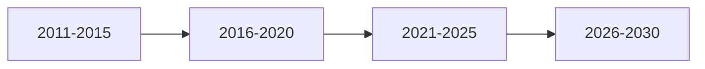
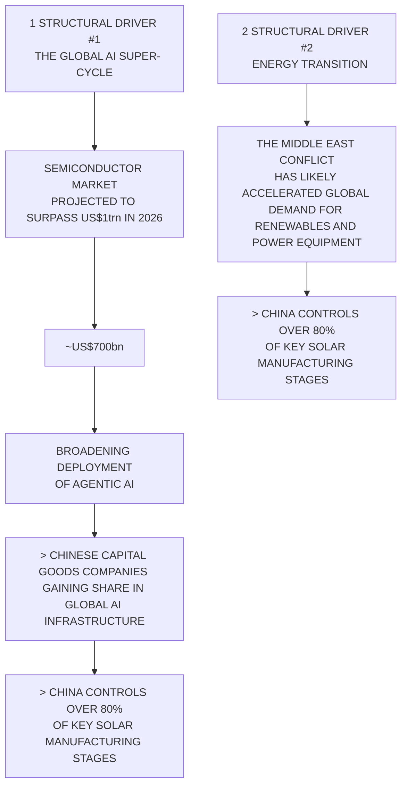

你是麦肯锡/投研风格的微信公众号财经文章主笔，擅长用金字塔原理把研报内容转化为“有主张、有层次、有洞察、但仍保留完整报告阅读欲望”的长文。

【目标】
- 基于下面的研报解析内容，写一篇微信公众号文章 Markdown。
- 风格：稳重、专业、克制、有洞察，像咨询公司合伙人写给高净值读者/产业决策者的研报导读。
- 长度：约 3000 字，允许上下浮动 15%。
- 不要使用 emoji。
- 可以基于报告内容做适度发散，但必须是从原文逻辑推出的判断，不要编造数据、公司动作或引用。
- 不要把研报所有正文内容讲完，要留下明确但自然的伏笔，让读者愿意加入社群阅读完整报告。

【金字塔原理写作原则】
1. 结论先行：文章开头先回答“这份报告最值得看的判断是什么”，而不是介绍背景。
2. 统领思想：全文只能服务一个主判断，避免变成摘要合集。
3. 纵向回答：每一层都要回答上一层提出的“为什么”或“所以呢”。
4. 横向 MECE：每个一级小节必须彼此独立、共同支撑主判断，避免重叠。
5. Synthesis over summary：不要复述报告段落，要提炼“这些事实合在一起意味着什么”。
6. So what：每个小节末尾必须落到对行业、公司、竞争格局、资产定价或读者观察框架的含义。
7. Action title：所有 `##` 小标题必须是“直接讲述洞察的完整句子”，不能是目录标签。

【标题与小标题硬性要求】
- `# 标题` 必须直接表达一个判断，例如“市场真正低估的不是需求，而是供给侧的再定价”。
- `# 标题` 必须包含报告机构的中文名称。已识别机构名：`摩根斯坦利`。标题格式建议：`# 摩根斯坦利：一句主判断`。如果识别机构名为空，请从研报标题/正文中识别机构并使用中文名，例如GS、摩根斯坦利、HSBC、JPM、UBS、Citi、美国银行、BARC、DB、NOM。
- 机构名只要求出现在 `# 标题` 中，正文可以克制提及，不要为了重复机构名牺牲可读性。
- 禁止使用以下机械标题：
  - 一、核心判断
  - 二、真正重要的是结构性变量
  - 三、报告没有说透
  - 四、对读者的启发
  - 关键变化
  - 投资启示
  - 总结
- 所有 `##` 标题都要像麦肯锡报告里的 action title：读完标题就知道这一节结论。
- 小标题可以带序号，但序号后必须是一句洞察，例如：`## 1. 这轮变化真正考验的是企业能否把规模转化为议价权`。

【建议结构，但不要机械照抄标题】
1. `# 标题`：机构中文名 + 一句主判断，不超过 40 字。
2. 开头 4-6 段：直接给出主判断、为什么现在重要、报告提供了什么新信号。
3. 4-6 个 `##` 小节：每个小节标题都是洞察句，不是栏目名。
4. 至少一个小节讨论“报告尚未完全回答的关键问题”，但标题也要是洞察句。
5. 至少一个小节给出读者的观察框架，但不要命名为“对读者的启发”。
6. 文末自然承接未解问题，引导读者加入社群/微信群继续讨论。不要照抄固定话术，请基于本文未解问题每次重新写一段自然 CTA；语义可以参考：欢迎来星球微信群里继续讨论。
7. 在免责声明前，单独插入这张图片链接：``
8. 结尾只输出英文灰色免责声明：`
Personal reading notes and learning share only. Not investment advice.
`

【hook 要求】
- 不要硬插“加入社群”。
- hook 应该来自正文自然出现的未解问题，比如：关键假设尚未验证、竞争优势仍需拆解、图表背后的二阶影响没有展开。
- 文末 CTA 要像“顺着这些未解问题继续读完整报告/继续讨论”，不是广告口吻。
- CTA 必须每篇重新写，不能固定输出“加入社群，领取完整研报解读与原始图表”。可以类似“欢迎来星球微信群里继续讨论”。

【图片要求】
- 不要主动生成 MinerU 图片 markdown；系统会在文章生成后自动插入 MinerU 原始图片。
- 但文末免责声明前必须保留知识星球图片：``。

【内容边界】
- 只能基于研报原文和解析结果推导，不要编造数据、公司动作、引用。
- 遇到不确定内容，要用“这里仍需验证”“报告没有完全展开”等表达。
- 避免“震惊”“爆款”“一文看懂”等浮夸表达。
- 不要出现小红书话题标签。
- 不要出现 emoji。
- 不要隐藏报告机构名；标题必须出现机构中文名。正文如需概括来源，可写“这份摩根斯坦利研报”或“该机构报告”，但不要编造机构观点以外的信息。
- 不要解释你的思考过程，不要输出多余说明。

【研报解析内容】
"""
## Investor Presentation | Asia Pacific

## China Equity Strategy: Forging New Horizons

MS ASIA LIMITED+

## Laura Wang

Equity Strategist

Laura.Wang@morganstanley.com +852 2848-6853

## Chloe Liu

Equity Strategist

Chloe.Liu1@morganstanley.com +852 2848-5497

## Vicky Wu

Equity Strategist

Vicky.Wu@morganstanley.com +852 3963-3928

## Asia Summer School 2026

MS does and seeks to do business with companies covered in MS. As a result, investors should be aware that the firm may have a conflict of interest that could affect the objectivity of MS. Investors should consider MS as only a single factor in making their investment decision.

## For analyst certification and other important disclosures, refer to the Disclosure Section, located at the end of this report.

+= Analysts employed by non-U.S. affiliates are not registered with FINRA, may not be associated persons of the member and may not be subject to FINRA restrictions on communications with a subject company, public appearances and trading securities held by a research analyst account.

## FOUNDATION

## MS

Jun 15, 2026

## INVESTOR PRESENTATION

## China Equity Strategy Forging New Horizons

MS
Asia/Pacific

MS Asia Limited+

## Laura Wang

## Equity Strategist

Laura.Wang@morganstanley.com

+852 2848-6853

## Chloe Liu

## Equity Strategist

Chloe.Liu1@morganstanley.com

+852 2848-5497

## Vicky Wu

## Equity Strategist

Vicky.Wu@morganstanley.com

+852 3963-3928

MS does and seeks to do business with companies covered in MS. As a result, investors should be aware that the firm may have a conflict of interest that could affect the objectivity of MS. Investors should consider MS as only a single factor in making their investment decision.

For analyst certification and other important disclosures, refer to the Disclosure Section, located at the end of this report.

+= Analysts employed by non-U.S. affiliates are not registered with FINRA, may not be associated persons of the member and may not be subject to FINRA restrictions on communications with a subject company, public appearances and trading securities held by a research analyst account.

MSCI China has underperformed Emerging Market YTD mainly due to AI memory super-cycle; We stay Equal-weight on China  

line chart

| Date     | MSCI China Relative to EM (index total return in USD) |
| -------- | ---------------------------------------------------- |
| Dec-12   | ~95                                                  |
| Jun-13   | ~100                                                 |
| Dec-13   | ~105                                                 |
| Jun-14   | ~100                                                 |
| Dec-14   | ~110                                                 |
| Jun-15   | ~130                                                 |
| Dec-15   | ~125                                                 |
| Jun-16   | ~120                                                 |
| Dec-16   | ~125                                                 |
| Jun-17   | ~130                                                 |
| Dec-17   | ~135                                                 |
| Jun-18   | ~140                                                 |
| Dec-18   | ~130                                                 |
| Jun-19   | ~135                                                 |
| Dec-19   | ~140                                                 |
| Jun-20   | ~150                                                 |
| Dec-20   | ~145                                                 |
| Jun-21   | ~135                                                 |
| Dec-21   | ~125                                                 |
| Jun-22   | ~110                                                 |
| Dec-22   | ~90                                                  |
| Jun-23   | ~85                                                  |
| Dec-23   | ~80                                                  |
| Jun-24   | ~85                                                  |
| Dec-24   | ~90                                                  |
| Jun-25   | ~95                                                  |
| Dec-25   | ~90                                                  |
| Jun-26   | ~70                                                  |

Source: MSCI, FactSet, DataStream, MS. Data as of June 8, 2026. Past performance is no guarantee of future results.

## MS

Index performance and Sharpe Ratio (MSCI China, CSI 300, MSCI EM, S&P 500) – CSI 300 demonstrating superior risk-adjusted returns in 2025 and 2026 YTD

<table><tr><td rowspan="2"></td><td colspan="3">Total return in USD</td><td colspan="2">2025</td><td colspan="3">2026 YTD</td></tr><tr><td>24 Sep 2024 - Now</td><td>2025</td><td>2026 YTD</td><td>Standard deviation (Annualized)</td><td>Sharpe ratio (Annualized)</td><td>Annualized return</td><td>Standard deviation (Annualized)</td><td>Sharpe ratio (Annualized)</td></tr><tr><td>MSCI China</td><td>28%</td><td>27%</td><td>-10%</td><td>24%</td><td>0.95</td><td>-23%</td><td>21%</td><td>-1.34</td></tr><tr><td>CSI 300</td><td>53%</td><td>23%</td><td>5%</td><td>15%</td><td>1.44</td><td>12%</td><td>15%</td><td>0.68</td></tr><tr><td>Hang Seng</td><td>34%</td><td>28%</td><td>-4%</td><td>23%</td><td>1.00</td><td>-11%</td><td>20%</td><td>-0.76</td></tr><tr><td>MSCI EM</td><td>49%</td><td>31%</td><td>18%</td><td>15%</td><td>1.70</td><td>50%</td><td>25%</td><td>1.83</td></tr><tr><td>S&amp;P 500</td><td>30%</td><td>16%</td><td>8%</td><td>18%</td><td>0.66</td><td>21%</td><td>14%</td><td>1.25</td></tr></table>

Source: Datastream, Bloomberg, MS.  
Note: Data as of June 9, 2026. Past performance is no guarantee of future results. Results do not include transaction costs/fees. 10-year Chinese government bond yield is used in CSI300 related calculations, compared to US treasury 10-year yield for other cases.

Underneath the lackluster performance – A more thematic growth focused and better performing market masked by the index composition  

bar-line hybrid chart

| Category          | Index weight | Proforma index weight | YTD return % (RHS) |
| ----------------- | ------------ | --------------------- | ------------------ |
| Semis             | 2.5          | 7.0                   | 7.5                |
| Energy            | 3.5          | 3.0                   | 4.0                |
| Capital Goods     | 4.0          | 9.0                   | 2.0                |
| Tech Hardware     | 8.0          | 10.0                  | 2.0                |
| Real Estate       | 1.5          | 1.0                   | 2.0                |
| Utilities         | 2.0          | 2.0                   | -1.0               |
| Financials        | 19.0         | 17.0                  | -1.0               |
| Materials         | 5.0          | 8.0                   | -6.0               |
| Health Care       | 4.0          | 4.0                   | -6.0               |
| Consumer Staples  | 3.0          | 4.5                   | -6.0               |
| Consumer Disc     | 20.0         | 17.0                  | -5.0               |
| Software & Services | 1.0          | 1.5                   | -35.0              |
| Comm Services     | 18.5         | 13.0                  | -35.0              |

Source: FactSet, MS. Data as of June 8, 2026.

## MS

China has implemented a systemic framework on industrial upgrade and innovation  

```mermaid
graph TD
  A["2011-2015"] --> B["2016-2020"]
  B --> C["2021-2025"]
  C --> D["2026-2030"]
  D --> E["Enhance the integration of modern services with advanced manufacturing and modern agriculture, and accelerate the digital and intelligent transformation of services"]
  E --> F["-Mining"]
  E --> G["-Metallurgy"]
  E --> H["-Chemicals"]
  E --> I["-Light industry"]
  E --> J["-Textiles"]
  E --> K["-Machinery"]
  E --> L["-Shipbuilding"]
  E --> M["-Construction"]
  E --> N["-Smart, green and service-oriented manufacturing"]
  A --> O["Strategic emerging industries"]
  O --> P["Producer services"]
  O --> Q["Manufacturing update"]
  O --> R["Equipment manufacturing"]
  R --> S["Financial services"]
  O --> T["Industrial design"]
  T --> U["-Logistics"]
  T --> V["-Industrial design"]
  T --> W["-Software development and application"]
  T --> X["-Internet services"]
  T --> Y["-Inspection and testing"]
  T --> Z["-Engineering consulting"]
  T --> AA["-Certification"]
  T --> AB["-Management consulting"]
  T --> AC["-Human resources services"]
  T --> AD["-Advertisement and exhibition industry"]
  O --> AE["New generation IT"]
  AE --> AF["-Biotech"]
  AE --> AG["-High-end equipment manufacturing"]
  AE --> AH["-New energy"]
  AE --> AI["-New materials"]
  AE --> AJ["-NEVs"]
  O --> AK["Energy saving and environmental protection"]
  AK --> AL["-New-generation IT"]
  AK --> AM["-Biotech"]
  AK --> AN["-High-end equipment manufacturing"]
  AK --> AO["-New energy"]
  AK --> AP["-New materials"]
  AK --> AQ["-NEVs"]
  B --> AR["Align with global standards on product technology, processing equipment and energy efficiency"]
  B --> AS["Align with global standards on product technology, processing equipment and energy efficiency"]
  B --> AT["Align with global standards on product technology, processing equipment and energy efficiency"]
```

flowchart

Source: Government website, MS.

## MS

Evolution of recent Five-Year Plans – A clear focus on quality growth and tech innovation  

flowchart

| Category             | Value     |
| -------------------- | --------- |
| Real GDP             | CAGR: 7%  |
| Growth: From Quantity to Quality | CAGR: >6.5% |
| Specific Target Dropped | (not labeled) |

line chart

| R&D Spending | CAGR   |
| ------------ | ------ |
|          | 12%    |
|          | 10.3%  |
|          | >7.0%  |
|          | >7.0%  |

line chart

| CO₂ Emissions/GDP | Cumulative Decline |
| ----------------- | ------------------ |
| 2017              | 17%                |
| 2018              | 18%                |
| 2019              | 18%                |
| 2020              | 17%                |

flowchart

Source: NPC, MS.

## Exports continue to anchor cyclical growth, positioning China's electronics and renewable supply chains as direct beneficiaries

Two structural drivers for export growth  

flowchart

China's deep electronics and renewable supply chains will be direct beneficiary  

line chart

| Date    | Electronic Integrated Circuit | China's "New Trio" | Others |
|---------|----------------------------------|--------------------|--------|
| Mar-21  | ~35%                             | ~70%               | ~50%   |
| Jun-21  | ~30%                             | ~60%               | ~30%   |
| Sep-21  | ~35%                             | ~80%               | ~25%   |
| Dec-21  | ~30%                             | ~100%              | ~20%   |
| Mar-22  | ~25%                             | ~90%               | ~15%   |
| Jun-22  | ~15%                             | ~70%               | ~10%   |
| Sep-22  | ~10%                             | ~60%               | ~5%    |
| Dec-22  | ~-10%                            | ~50%               | ~0%    |
| Mar-23  | ~-25%                            | ~40%               | ~5%    |
| Jun-23  | ~-15%                            | ~60%               | ~0%    |
| Sep-23  | ~-5%                             | ~10%               | ~-5%   |
| Dec-23  | ~5%                              | ~5%                | ~0%    |
| Mar-24  | ~15%                             | ~0%                | ~5%    |
| Jun-24  | ~25%                             | ~-5%               | ~10%   |
| Sep-24  | ~15%                             | ~-10%              | ~5%    |
| Dec-24  | ~10%                             | ~-5%               | ~0%    |
| Mar-25  | ~15%                             | ~5%                | ~5%    |
| Jun-25  | ~25%                             | ~15%               | ~10%   |
| Sep-25  | ~30%                             | ~30%               | ~5%    |
| Dec-25  | ~40%                             | ~45%               | ~0%    |
| Mar-26  | ~80%                             | ~60%               | ~10%   |

Source: CEIC, MS estimates. "New Trio" includes EVs, lithium batteries, and solar cells.

## China has been widening its lead in global export since 2022; We expect further acceleration given China's best positioning in global AI/Energy Capex super cycle supply chain

China likely to contribute 16.5% of global export market share by 2030...  

line chart

China global export market share (% 12Mtrailing sum)
| Year | Base case (%) | Upside scenario (%) | Downside scenario (%) |
| :--- | :--- | :--- | :--- |
| 2017 | 12.8 | - | - |
| 2018 | 12.9 | - | - |
| 2019 | 13.2 | - | - |
| 2020 | 15.6 | - | - |
| 2021 | 15.2 | - | - |
| 2022 | 14.8 | - | - |
| 2023 | 14.3 | - | - |
| 2024 | 14.8 | - | - |
| 2025 | 15.0 | 15.0 | 15.0 |
| 2026 | - | 15.5 | 15.0 |
| 2027 | - | 16.0 | 15.0 |
| 2028 | - | 16.5 | 15.0 |
| 2029 | - | 17.0 | 15.0 |
| 2030E | 16.5 | 18.0 | 15.0 |

...while continuing to play a critical role in global supply chain despite diversification  

line chart

| Date     | China's trade balance with US (US$bn) | China's trade balance with the top 5 economies whose trade surplus with US ($bn) |
|----------|----------------------------------------|------------------------------------------------------------------|
| 12/2018  | 420                                    | 25                                                               |
| Mar-26   | 165                                    | 280                                                              |

Source: Haver, MS estimates.

Asia/EM/China 2Q 2027 index targets – Wide range across bull/base/bear cases

<table><tr><td rowspan="2"></td><td rowspan="2">Index</td><td rowspan="2">Current Price</td><td rowspan="2">MS Target Price (Jun-2027)</td><td colspan="3">MS Top-Down EPS YoY %</td><td colspan="3">Consensus EPS Forecast YoY %</td><td rowspan="2">MS Target Fwd P/E Jun - 2027</td><td rowspan="2">Consensus 12m Fwd P/E Current</td></tr><tr><td>Dec-26</td><td>Dec-27</td><td>Dec-28</td><td>Dec-26</td><td>Dec-27</td><td>Dec-28</td></tr><tr><td rowspan="7">Base Case</td><td>TOPIX</td><td>3,852</td><td>4,30012%</td><td>2169%</td><td>2359%</td><td>26312%</td><td>25111%</td><td>27610%</td><td>2760%</td><td>17.5x</td><td>16.4x</td></tr><tr><td>MSCI EM</td><td>1,655</td><td>1,8009%</td><td>12540%</td><td>1369%</td><td>1414%</td><td>13456%</td><td>16020%</td><td>17811%</td><td>13.0x</td><td>11.5x</td></tr><tr><td>MSCI APxJ</td><td>854</td><td>9005%</td><td>5940%</td><td>648%</td><td>652%</td><td>6357%</td><td>7620%</td><td>8411%</td><td>14.0x</td><td>12.5x</td></tr><tr><td>Hang Seng</td><td>24,657</td><td>28,40015%</td><td>2,2547%</td><td>2,4087%</td><td>2,5576%</td><td>2,30412%</td><td>2,53810%</td><td>2,79410%</td><td>11.4x</td><td>10.3x</td></tr><tr><td>HSCEI</td><td>8,341</td><td>9,90019%</td><td>9395%</td><td>9936%</td><td>10506%</td><td>9235%</td><td>9837%</td><td>1,0547%</td><td>9.7x</td><td>9.3x</td></tr><tr><td>MSCI China</td><td>75</td><td>9121%</td><td>6.67%</td><td>7.210%</td><td>7.77%</td><td>6.614%</td><td>7.615%</td><td>8.614%</td><td>12.2x</td><td>10.8x</td></tr><tr><td>CSI300</td><td>4,714</td><td>5,40015%</td><td>31510%</td><td>34710%</td><td>3789%</td><td>35720%</td><td>40814%</td><td>45812%</td><td>14.8x</td><td>13.9x</td></tr><tr><td rowspan="7">Bull Case</td><td>TOPIX</td><td>3,852</td><td>4,90027%</td><td>22413%</td><td>25514%</td><td>29014%</td><td>25111%</td><td>27610%</td><td>2760%</td><td>18.0x</td><td>16.4x</td></tr><tr><td>MSCI EM</td><td>1,655</td><td>2,10027%</td><td>13550%</td><td>1479%</td><td>1545%</td><td>13456%</td><td>16020%</td><td>17811%</td><td>14.0x</td><td>11.5x</td></tr><tr><td>MSCI APxJ</td><td>854</td><td>1,08027%</td><td>6553%</td><td>7210%</td><td>732%</td><td>6357%</td><td>7620%</td><td>8411%</td><td>15.0x</td><td>12.5x</td></tr><tr><td>Hang Seng</td><td>24,657</td><td>32,40031%</td><td>2,2998%</td><td>2,5049%</td><td>2,6757%</td><td>2,30412%</td><td>2,53810%</td><td>2,79410%</td><td>12.5x</td><td>10.3x</td></tr><tr><td>HSCEI</td><td

[中间内容因长度限制已省略]

lysts; in Canada by MS Canada Limited; in Germany and the European Economic Area where required by MS Europe S.E., authorised and regulated by Bundesanstalt fuer Finanzdienstleistungsaufsicht (BaFin) under the reference number 149169; in the US by MS & Co. LLC, which accepts responsibility for its contents. MS & Co. International plc, authorized by the Prudential Regulation Authority and regulated by the Financial Conduct Authority and the Prudential Regulation Authority, disseminates in the UK research that it has prepared, and research which has been prepared by any of its affiliates, only to persons who (i) are investment professionals falling within Article 19(5) of the Financial Services and Markets Act 2000 (Financial Promotion) Order 2005 (as amended, the "Order"); (ii) are persons who are high net worth entities falling within Article 49(2)(a) to (d) of the Order; or (iii) are persons to whom an invitation or inducement to engage in investment activity (within the meaning of section 21 of the Financial Services and Markets Act 2000, as amended) may otherwise lawfully be communicated or caused to be communicated. RMB MS Proprietary Limited is a member of the JSE Limited and A2X (Pty) Ltd. RMB MS Proprietary Limited is a joint venture owned equally by MS International Holdings Inc. and RMB Investment Advisory (Proprietary) Limited, which is wholly owned by FirstRand Limited. The information in MS is being disseminated by MS Saudi Arabia, regulated by the Capital Market Authority in the Kingdom of Saudi Arabia, and is directed at Sophisticated investors only.

MS Hong Kong Securities Limited is the liquidity provider/market maker for securities of Alibaba Group Holding, Aluminum Corp. of China Ltd., ASMPT Ltd, China Petroleum & Chemical Corp., China Resources Land Ltd., China Shenhua Energy, Contemporary Amperex Technology Co. Ltd., HK Exchanges & Clearing, HKT Trust and HKT Ltd., PetroChina, Ping An Insurance Group Co of China Ltd, Techtronic Industries Co Ltd, Tencent Holdings Ltd., WeiChai Power, Zijin Mining Group, Zoomlion Heavy Industry, ZTO Express listed on the Stock Exchange of Hong Kong Limited. An updated list can be found on HKEx website: http://www.hkex.com.hk.

The information in MS is being communicated by MS & Co. International plc (DIFC Branch), regulated by the Dubai Financial Services Authority (the DFSA) or by MS & Co. International plc (ADGM Branch), regulated by the Financial Services Regulatory Authority Abu Dhabi (the FSRA), and is directed at Professional Clients only, as defined by the DFSA or the FSRA, respectively. The financial products or financial services to which this research relates will only be made available to a customer who we are satisfied meets the regulatory criteria of a Professional Client. A distribution of the different MS Research ratings or recommendations, in percentage terms for Investments in each sector covered, is available upon request from your sales representative.

The information in MS is being communicated by MS & Co. International plc (QFC Branch), regulated by the Qatar Financial Centre Regulatory Authority (the QFCRA), and is directed at business customers and market counterparties only and is not intended for Retail Customers as defined by the QFCRA.

As required by the Capital Markets Board of Turkey, investment information, comments and recommendations stated here, are not within the scope of investment advisory activity. Investment advisory service is provided exclusively to persons based on their risk and income preferences by the authorized firms. Comments and recommendations stated here are general in nature. These opinions may not fit to your financial status, risk and return preferences. For this reason, to make an investment decision by relying solely to this information stated here may not bring about outcomes that fit your expectations.

The trademarks and service marks contained in MS are the property of their respective owners. Third-party data providers make no warranties or representations relating to the accuracy, completeness, or timeliness of the data they provide and shall not have liability for any damages relating to such data. The Global Industry Classification Standard (GICS) was developed by and is the exclusive property of MSCI and S&P.

MS, or any portion thereof may not be reprinted, sold or redistributed without the written consent of MS.

Indicators and trackers referenced in MS may not be used as, or treated as, a benchmark under Regulation EU 2016/1011, or any other similar framework.

The issuers and/or fixed income products recommended or discussed in certain fixed income research reports may not be continuously followed. Accordingly, investors should regard those fixed income research reports as providing stand-alone analysis and should not expect continuing analysis or additional reports relating to such issuers and/or individual fixed income products.

MS may hold, from time to time, material financial and commercial interests regarding the company subject to the Research report.

Registration granted by SEBI and certification from the National Institute of Securities Markets (NISM) in no way guarantee performance of the intermediary or provide any assurance of returns to investors. Investment in securities market are subject to market risks. Read all the related documents carefully before investing.

© 2026 MS
"""
