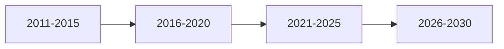
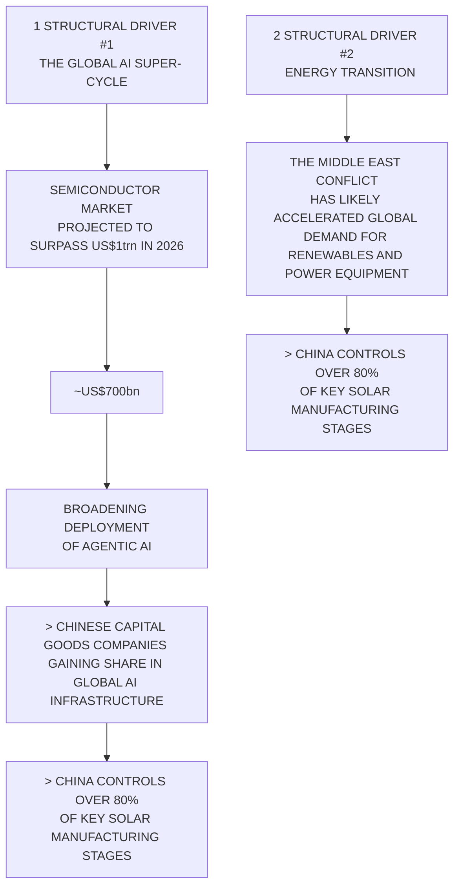

你是闲鱼资料类商品文案编辑，擅长把一份投研/行业/公司研报改写成适合闲鱼发布的商品说明。

【目标】
- 基于下面研报解析内容，生成一份可以复制到闲鱼商品详情里的中文文案。
- 风格参考用户提供的闲鱼对标笔记：标题直给、信息密度高、用途明确、适合人群明确、交付方式清楚。
- 语言要自然，像真实卖家发布，不要像公众号文章、小红书笔记或 AI 摘要。
- 不要使用太夸张的营销词，不要承诺收益，不要说“稳赚”“内幕”“必涨”。
- 可以适度口语化，但不要低俗。
- 硬性要求：全文不要使用任何 emoji 或符号表情。
- 硬性要求：全文必须低于 1500 字，宁可少写，也不要超长。

【必须输出结构】
1. `闲鱼标题：` 一行，控制在 30 字以内，适合商品标题。
2. `商品描述：` 正文，适合直接粘贴到闲鱼详情页。
3. `Hashtag：` 一行，给 6-10 个平台可用标签，用 `#` 开头，空格分隔。

【长度硬性要求】
- 输出总字数必须低于 1500 字，包括标题、商品描述、Hashtag。
- 商品描述控制在 900-1200 字以内，避免写成长文。
- 亮点 bullet 每条控制在 30 字以内。

【严禁输出】
- 不要输出 `建议价格：`。
- 不要输出 `搜索关键词：`。
- 不要输出“搜索词”“关键词”“搜索关键词”等栏目。
- 不要给具体价格区间、成交承诺或价格建议。
- 不要使用任何 emoji，例如 ✅、🔥、📌、👉、💰、⭐ 等。

【商品描述写法】
- 第一段：直接说明这是什么报告，页数/语言/主题/公司或行业。如果页数、日期、语言不确定，就不要编。
- 第二段：说明适合谁，比如投研、券商面试、PE/VC、行业研究、学习参考、写报告等。
- 第三段：用 3-5 个亮点 bullet，风格参考：
  - 三大情景框架：DCF、P/ARR、EV/Sales
  - 关键变量分析
  - 估值逻辑、假设、终值占比等核心内容覆盖
  - 适合准备 AI 相关面试、研究 AI 估值的同学
- 第四段：交付说明，参考：`资料为电子版 PDF，拍下后 24 小时内发网盘链接或邮箱。`
- 第五段：虚拟商品说明，参考：`电子类资料一经发货不退不换，有问题可以提前咨询。`
- 可以补一句：`需要其他报告也可以私聊，支持一站式咨询。`

【Hashtag 写法】
- 只输出平台相对安全、偏学习和资料属性的标签。
- 推荐从这些里选择：`#学习资料` `#研究笔记` `#学习笔记` `#行业研究` `#研报资料` `#资料整理` `#报告学习` `#案例研究`。
- 不要输出 `#财经` `#投资` `#股票` `#基金` `#理财` `#暴富` `#内幕` 等敏感标签。

【平台发布合规要求】
- 不要出现“投资建议”“买入”“卖出”“强烈推荐”“稳赚”“保本”“必涨”“抄底”“上车”“内幕”“翻倍”等金融操作或收益承诺表达。
- “投资”相关词尽量改成“投研”“研究”“观察”“学习参考”；如果必须保留，也要保持中性。
- 不要出现“独家”“原版”“内部”“无水印”“全网最低”“最全”“最强”“必看”等高风险或极限词。
- 不要写“关注”“点赞”“求关注”“评论区留言”等直接互动诱导。
- 不要承诺资料一定可用于获利、就业、通过面试或获得收益。

【合规与避坑】
- 默认避免出现具体投行品牌名，比如“GS”“GS”“MS”，统一写作“投行研报”或“投行研报”。
- 不要承诺研究或交易结果。
- 不要伪造页数、日期、作者、公司覆盖范围。研报未给出时就不写。
- 不要输出解释说明，只输出闲鱼文案本身。

【研报解析内容】
"""
## Investor Presentation | Asia Pacific

## China Equity Strategy: Forging New Horizons

MS ASIA LIMITED+

## Laura Wang

Equity Strategist

Laura.Wang@morganstanley.com +852 2848-6853

## Chloe Liu

Equity Strategist

Chloe.Liu1@morganstanley.com +852 2848-5497

## Vicky Wu

Equity Strategist

Vicky.Wu@morganstanley.com +852 3963-3928

## Asia Summer School 2026

MS does and seeks to do business with companies covered in MS. As a result, investors should be aware that the firm may have a conflict of interest that could affect the objectivity of MS. Investors should consider MS as only a single factor in making their investment decision.

## For analyst certification and other important disclosures, refer to the Disclosure Section, located at the end of this report.

+= Analysts employed by non-U.S. affiliates are not registered with FINRA, may not be associated persons of the member and may not be subject to FINRA restrictions on communications with a subject company, public appearances and trading securities held by a research analyst account.

## FOUNDATION

## MS

Jun 15, 2026

## INVESTOR PRESENTATION

## China Equity Strategy Forging New Horizons

MS
Asia/Pacific

MS Asia Limited+

## Laura Wang

## Equity Strategist

Laura.Wang@morganstanley.com

+852 2848-6853

## Chloe Liu

## Equity Strategist

Chloe.Liu1@morganstanley.com

+852 2848-5497

## Vicky Wu

## Equity Strategist

Vicky.Wu@morganstanley.com

+852 3963-3928

MS does and seeks to do business with companies covered in MS. As a result, investors should be aware that the firm may have a conflict of interest that could affect the objectivity of MS. Investors should consider MS as only a single factor in making their investment decision.

For analyst certification and other important disclosures, refer to the Disclosure Section, located at the end of this report.

+= Analysts employed by non-U.S. affiliates are not registered with FINRA, may not be associated persons of the member and may not be subject to FINRA restrictions on communications with a subject company, public appearances and trading securities held by a research analyst account.

MSCI China has underperformed Emerging Market YTD mainly due to AI memory super-cycle; We stay Equal-weight on China  

line chart

| Date     | MSCI China Relative to EM (index total return in USD) |
| -------- | ---------------------------------------------------- |
| Dec-12   | ~95                                                  |
| Jun-13   | ~100                                                 |
| Dec-13   | ~105                                                 |
| Jun-14   | ~100                                                 |
| Dec-14   | ~110                                                 |
| Jun-15   | ~130                                                 |
| Dec-15   | ~125                                                 |
| Jun-16   | ~120                                                 |
| Dec-16   | ~125                                                 |
| Jun-17   | ~130                                                 |
| Dec-17   | ~135                                                 |
| Jun-18   | ~140                                                 |
| Dec-18   | ~130                                                 |
| Jun-19   | ~135                                                 |
| Dec-19   | ~140                                                 |
| Jun-20   | ~150                                                 |
| Dec-20   | ~145                                                 |
| Jun-21   | ~135                                                 |
| Dec-21   | ~125                                                 |
| Jun-22   | ~110                                                 |
| Dec-22   | ~90                                                  |
| Jun-23   | ~85                                                  |
| Dec-23   | ~80                                                  |
| Jun-24   | ~85                                                  |
| Dec-24   | ~90                                                  |
| Jun-25   | ~95                                                  |
| Dec-25   | ~90                                                  |
| Jun-26   | ~70                                                  |

Source: MSCI, FactSet, DataStream, MS. Data as of June 8, 2026. Past performance is no guarantee of future results.

## MS

Index performance and Sharpe Ratio (MSCI China, CSI 300, MSCI EM, S&P 500) – CSI 300 demonstrating superior risk-adjusted returns in 2025 and 2026 YTD

<table><tr><td rowspan="2"></td><td colspan="3">Total return in USD</td><td colspan="2">2025</td><td colspan="3">2026 YTD</td></tr><tr><td>24 Sep 2024 - Now</td><td>2025</td><td>2026 YTD</td><td>Standard deviation (Annualized)</td><td>Sharpe ratio (Annualized)</td><td>Annualized return</td><td>Standard deviation (Annualized)</td><td>Sharpe ratio (Annualized)</td></tr><tr><td>MSCI China</td><td>28%</td><td>27%</td><td>-10%</td><td>24%</td><td>0.95</td><td>-23%</td><td>21%</td><td>-1.34</td></tr><tr><td>CSI 300</td><td>53%</td><td>23%</td><td>5%</td><td>15%</td><td>1.44</td><td>12%</td><td>15%</td><td>0.68</td></tr><tr><td>Hang Seng</td><td>34%</td><td>28%</td><td>-4%</td><td>23%</td><td>1.00</td><td>-11%</td><td>20%</td><td>-0.76</td></tr><tr><td>MSCI EM</td><td>49%</td><td>31%</td><td>18%</td><td>15%</td><td>1.70</td><td>50%</td><td>25%</td><td>1.83</td></tr><tr><td>S&amp;P 500</td><td>30%</td><td>16%</td><td>8%</td><td>18%</td><td>0.66</td><td>21%</td><td>14%</td><td>1.25</td></tr></table>

Source: Datastream, Bloomberg, MS.  
Note: Data as of June 9, 2026. Past performance is no guarantee of future results. Results do not include transaction costs/fees. 10-year Chinese government bond yield is used in CSI300 related calculations, compared to US treasury 10-year yield for other cases.

Underneath the lackluster performance – A more thematic growth focused and better performing market masked by the index composition  

bar-line hybrid chart

| Category          | Index weight | Proforma index weight | YTD return % (RHS) |
| ----------------- | ------------ | --------------------- | ------------------ |
| Semis             | 2.5          | 7.0                   | 7.5                |
| Energy            | 3.5          | 3.0                   | 4.0                |
| Capital Goods     | 4.0          | 9.0                   | 2.0                |
| Tech Hardware     | 8.0          | 10.0                  | 2.0                |
| Real Estate       | 1.5          | 1.0                   | 2.0                |
| Utilities         | 2.0          | 2.0                   | -1.0               |
| Financials        | 19.0         | 17.0                  | -1.0               |
| Materials         | 5.0          | 8.0                   | -6.0               |
| Health Care       | 4.0          | 4.0                   | -6.0               |
| Consumer Staples  | 3.0          | 4.5                   | -6.0               |
| Consumer Disc     | 20.0         | 17.0                  | -5.0               |
| Software & Services | 1.0          | 1.5                   | -35.0              |
| Comm Services     | 18.5         | 13.0                  | -35.0              |

Source: FactSet, MS. Data as of June 8, 2026.

## MS

China has implemented a systemic framework on industrial upgrade and innovation  

```mermaid
graph TD
  A["2011-2015"] --> B["2016-2020"]
  B --> C["2021-2025"]
  C --> D["2026-2030"]
  D --> E["Enhance the integration of modern services with advanced manufacturing and modern agriculture, and accelerate the digital and intelligent transformation of services"]
  E --> F["-Mining"]
  E --> G["-Metallurgy"]
  E --> H["-Chemicals"]
  E --> I["-Light industry"]
  E --> J["-Textiles"]
  E --> K["-Machinery"]
  E --> L["-Shipbuilding"]
  E --> M["-Construction"]
  E --> N["-Smart, green and service-oriented manufacturing"]
  A --> O["Strategic emerging industries"]
  O --> P["Producer services"]
  O --> Q["Manufacturing update"]
  O --> R["Equipment manufacturing"]
  R --> S["Financial services"]
  O --> T["Industrial design"]
  T --> U["-Logistics"]
  T --> V["-Industrial design"]
  T --> W["-Software development and application"]
  T --> X["-Internet services"]
  T --> Y["-Inspection and testing"]
  T --> Z["-Engineering consulting"]
  T --> AA["-Certification"]
  T --> AB["-Management consulting"]
  T --> AC["-Human resources services"]
  T --> AD["-Advertisement and exhibition industry"]
  O --> AE["New generation IT"]
  AE --> AF["-Biotech"]
  AE --> AG["-High-end equipment manufacturing"]
  AE --> AH["-New energy"]
  AE --> AI["-New materials"]
  AE --> AJ["-NEVs"]
  O --> AK["Energy saving and environmental protection"]
  AK --> AL["-New-generation IT"]
  AK --> AM["-Biotech"]
  AK --> AN["-High-end equipment manufacturing"]
  AK --> AO["-New energy"]
  AK --> AP["-New materials"]
  AK --> AQ["-NEVs"]
  B --> AR["Align with global standards on product technology, processing equipment and energy efficiency"]
  B --> AS["Align with global standards on product technology, processing equipment and energy efficiency"]
  B --> AT["Align with global standards on product technology, processing equipment and energy efficiency"]
```

flowchart

Source: Government website, MS.

## MS

Evolution of recent Five-Year Plans – A clear focus on quality growth and tech innovation  

flowchart

| Category             | Value     |
| -------------------- | --------- |
| Real GDP             | CAGR: 7%  |
| Growth: From Quantity to Quality | CAGR: >6.5% |
| Specific Target Dropped | (not labeled) |

line chart

| R&D Spending | CAGR   |
| ------------ | ------ |
|          | 12%    |
|          | 10.3%  |
|          | >7.0%  |
|          | >7.0%  |

line chart

| CO₂ Emissions/GDP | Cumulative Decline |
| ----------------- | ------------------ |
| 2017              | 17%                |
| 2018              | 18%                |
| 2019              | 18%                |
| 2020              | 17%                |

flowchart

Source: NPC, MS.

## Exports continue to anchor cyclical growth, positioning China's electronics and renewable supply chains as direct beneficiaries

Two structural drivers for export growth  

flowchart

China's deep electronics and renewable supply chains will be direct beneficiary  

line chart

| Date    | Electronic Integrated Circuit | China's "New Trio" | Others |
|---------|----------------------------------|--------------------|--------|
| Mar-21  | ~35%                             | ~70%               | ~50%   |
| Jun-21  | ~30%                             | ~60%               | ~30%   |
| Sep-21  | ~35%                             | ~80%               | ~25%   |
| Dec-21  | ~30%                             | ~100%              | ~20%   |
| Mar-22  | ~25%                             | ~90%               | ~15%   |
| Jun-22  | ~15%                             | ~70%               | ~10%   |
| Sep-22  | ~10%                             | ~60%               | ~5%    |
| Dec-22  | ~-10%                            | ~50%               | ~0%    |
| Mar-23  | ~-25%                            | ~40%               | ~5%    |
| Jun-23  | ~-15%                            | ~60%               | ~0%    |
| Sep-23  | ~-5%                             | ~10%               | ~-5%   |
| Dec-23  | ~5%                              | ~5%                | ~0%    |
| Mar-24  | ~15%                             | ~0%                | ~5%    |
| Jun-24  | ~25%                             | ~-5%               | ~10%   |
| Sep-24  | ~15%                             | ~-10%              | ~5%    |
| Dec-24  | ~10%                             | ~-5%               | ~0%    |
| Mar-25  | ~15%                             | ~5%                | ~5%    |
| Jun-25  | ~25%                             | ~15%               | ~10%   |
| Sep-25  | ~30%                             | ~30%               | ~5%    |
| Dec-25  | ~40%                             | ~45%               | ~0%    |
| Mar-26  | ~80%                             | ~60%               | ~10%   |

Source: CEIC, MS estimates. "New Trio" includes EVs, lithium batteries, and solar cells.

## China has been widening its lead in global export since 2022; We expect further acceleration given China's best positioning in global AI/Energy Capex super cycle supply chain

China likely to contribute 16.5% of global export market share by 2030...  

line chart

China global export market share (% 12Mtrailing sum)
| Year | Base case (%) | Upside scenario (%) | Downside scenario (%) |
| :--- | :--- | :--- | :--- |
| 2017 | 12.8 | - | - |
| 2018 | 12.9 | - | - |
| 2019 | 13.2 | - | - |
| 2020 | 15.6 | - | - |
| 2021 | 15.2 | - | - |
| 2022 | 14.8 | - | - |
| 2023 | 14.3 | - | - |
| 2024 | 14.8 | - | - |
| 2025 | 15.0 | 15.0 | 15.0 |
| 2026 | - | 15.5 | 15.0 |
| 2027 | - | 16.0 | 15.0 |
| 2028 | - | 16.5 | 15.0 |
| 2029 | - | 17.0 | 15.0 |
| 2030E | 16.5 | 18.0 | 15.0 |

...while continuing to play a critical role in global supply chain despite diversification  

line chart

| Date     | China's trade balance with US (US$bn) | China's trade balance with the top 5 economies whose trade surplus with US ($bn) |
|----------|----------------------------------------|------------------------------------------------------------------|
| 12/2018  | 420                                    | 25                                                               |
| Mar-26   | 165                                    | 280                                                              |

Source: Haver, MS estimates

[中间内容因长度限制已省略]

 of its affiliates, only to persons who (i) are investment professionals falling within Article 19(5) of the Financial Services and Markets Act 2000 (Financial Promotion) Order 2005 (as amended, the "Order"); (ii) are persons who are high net worth entities falling within Article 49(2)(a) to (d) of the Order; or (iii) are persons to whom an invitation or inducement to engage in investment activity (within the meaning of section 21 of the Financial Services and Markets Act 2000, as amended) may otherwise lawfully be communicated or caused to be communicated. RMB MS Proprietary Limited is a member of the JSE Limited and A2X (Pty) Ltd. RMB MS Proprietary Limited is a joint venture owned equally by MS International Holdings Inc. and RMB Investment Advisory (Proprietary) Limited, which is wholly owned by FirstRand Limited. The information in MS is being disseminated by MS Saudi Arabia, regulated by the Capital Market Authority in the Kingdom of Saudi Arabia, and is directed at Sophisticated investors only.

MS Hong Kong Securities Limited is the liquidity provider/market maker for securities of Alibaba Group Holding, Aluminum Corp. of China Ltd., ASMPT Ltd, China Petroleum & Chemical Corp., China Resources Land Ltd., China Shenhua Energy, Contemporary Amperex Technology Co. Ltd., HK Exchanges & Clearing, HKT Trust and HKT Ltd., PetroChina, Ping An Insurance Group Co of China Ltd, Techtronic Industries Co Ltd, Tencent Holdings Ltd., WeiChai Power, Zijin Mining Group, Zoomlion Heavy Industry, ZTO Express listed on the Stock Exchange of Hong Kong Limited. An updated list can be found on HKEx website: http://www.hkex.com.hk.

The information in MS is being communicated by MS & Co. International plc (DIFC Branch), regulated by the Dubai Financial Services Authority (the DFSA) or by MS & Co. International plc (ADGM Branch), regulated by the Financial Services Regulatory Authority Abu Dhabi (the FSRA), and is directed at Professional Clients only, as defined by the DFSA or the FSRA, respectively. The financial products or financial services to which this research relates will only be made available to a customer who we are satisfied meets the regulatory criteria of a Professional Client. A distribution of the different MS Research ratings or recommendations, in percentage terms for Investments in each sector covered, is available upon request from your sales representative.

The information in MS is being communicated by MS & Co. International plc (QFC Branch), regulated by the Qatar Financial Centre Regulatory Authority (the QFCRA), and is directed at business customers and market counterparties only and is not intended for Retail Customers as defined by the QFCRA.

As required by the Capital Markets Board of Turkey, investment information, comments and recommendations stated here, are not within the scope of investment advisory activity. Investment advisory service is provided exclusively to persons based on their risk and income preferences by the authorized firms. Comments and recommendations stated here are general in nature. These opinions may not fit to your financial status, risk and return preferences. For this reason, to make an investment decision by relying solely to this information stated here may not bring about outcomes that fit your expectations.

The trademarks and service marks contained in MS are the property of their respective owners. Third-party data providers make no warranties or representations relating to the accuracy, completeness, or timeliness of the data they provide and shall not have liability for any damages relating to such data. The Global Industry Classification Standard (GICS) was developed by and is the exclusive property of MSCI and S&P.

MS, or any portion thereof may not be reprinted, sold or redistributed without the written consent of MS.

Indicators and trackers referenced in MS may not be used as, or treated as, a benchmark under Regulation EU 2016/1011, or any other similar framework.

The issuers and/or fixed income products recommended or discussed in certain fixed income research reports may not be continuously followed. Accordingly, investors should regard those fixed income research reports as providing stand-alone analysis and should not expect continuing analysis or additional reports relating to such issuers and/or individual fixed income products.

MS may hold, from time to time, material financial and commercial interests regarding the company subject to the Research report.

Registration granted by SEBI and certification from the National Institute of Securities Markets (NISM) in no way guarantee performance of the intermediary or provide any assurance of returns to investors. Investment in securities market are subject to market risks. Read all the related documents carefully before investing.

© 2026 MS
"""
