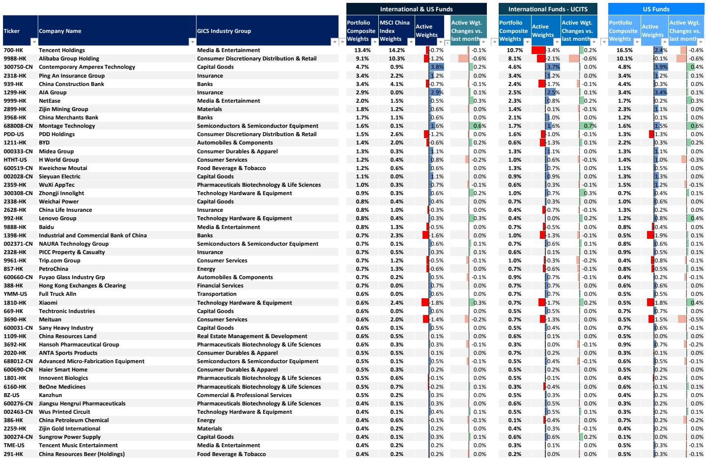
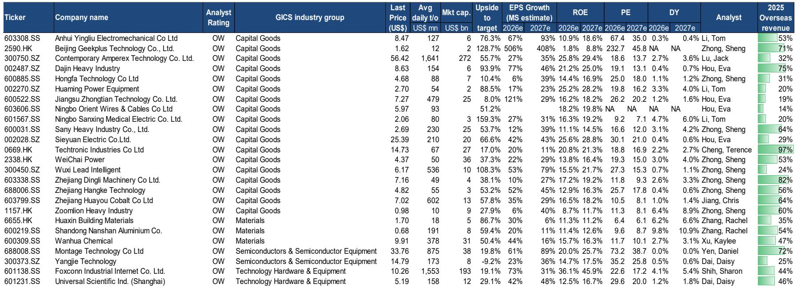
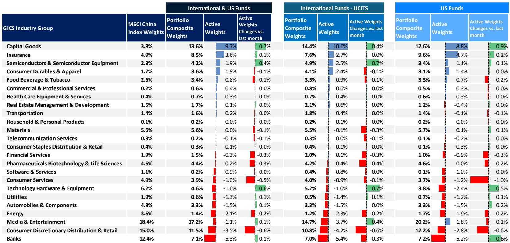

# China's Market Is Not Underperforming — The Index Is Masking a Structural Transformation

The dominant narrative surrounding Chinese equities in 2026 is one of disappointment. MSCI China has fallen 10 percent year-to-date in USD terms, trailing the broader emerging market index by a wide margin. To the casual observer, this looks like a market in retreat. But that reading is dangerously incomplete. The headline performance of MSCI China obscures a deeper, more consequential story: the index itself is a poor proxy for the structural shifts underway in the Chinese economy. The CSI 300, which better captures domestically oriented, policy-aligned sectors, has delivered a positive 5 percent return year-to-date and posted a Sharpe ratio of 0.68 in 2026 — superior to both MSCI China and the S&P 500 on a risk-adjusted basis. The divergence is not noise. It is a signal.

The gap between these two indices tells us something critical. MSCI China is heavily weighted toward internet platforms, consumer discretionary, and communication services — sectors that have been hammered by regulatory recalibration and the global AI memory super-cycle. The CSI 300, by contrast, tilts toward industrials, capital goods, and technology hardware — sectors that are direct beneficiaries of China's long-term industrial policy. The market is not underperforming. The market is repricing. And the sectors that are falling are not the ones that matter most for China's next growth phase.

This report from a leading global investment bank provides the analytical architecture to understand this shift. It argues that China is in the early stages of a multi-decade industrial upgrade, one that is being systematically funded, coordinated, and executed through successive Five-Year Plans. The export data confirms the thesis: China's share of global exports is projected to reach 16.5 percent by 2030, driven by its dominant position in the global AI and energy capex super-cycle. The question for investors is not whether China can grow, but whether they are positioned for the kind of growth that is actually happening.

The argument that follows is not a bullish call on Chinese equities broadly. It is a call for precision — for understanding that the old index-heavy approach to China investing is no longer fit for purpose. The structural winners are emerging, and they are not where most portfolios are looking.

## The CSI 300's Superior Risk-Adjusted Returns Reveal a Market That Has Already Rotated Toward Structural Winners

The performance data from the report is unambiguous. Since September 2024, the CSI 300 has returned 53 percent in USD terms, compared to 28 percent for MSCI China. In 2025, the CSI 300 delivered a Sharpe ratio of 1.44 — nearly double that of MSCI China and more than double the S&P 500. In 2026 year-to-date, the CSI 300 is the only major China index with a positive return and a positive Sharpe ratio.

This is not a cyclical bounce. It is a structural rotation. The CSI 300's composition gives it heavier exposure to financials, industrials, and materials — sectors that align with China's industrial policy priorities. MSCI China, by contrast, is dominated by consumer discretionary and communication services, which have been caught in a crosscurrent of regulatory tightening and shifting consumer sentiment. The index is not the market. The CSI 300 is telling us where the real economic momentum is.

The implication is straightforward: investors who continue to use MSCI China as their benchmark for China exposure are systematically underweighting the sectors that are benefiting from the country's industrial transformation. They are also overweighting sectors that face structural headwinds. The performance gap is not a temporary anomaly. It is a reflection of a fundamental divergence in earnings trajectories.

## China's Industrial Policy Framework Has Evolved from Quantity to Quality, and the Market Is Only Beginning to Price This

The report traces the evolution of China's Five-Year Plans from 2011 through 2030. The early plans focused on strategic emerging industries and manufacturing upgrades. The 2021-2025 cycle shifted toward aligning with global standards on product technology, processing equipment, and energy efficiency. The 2026-2030 plan goes further: it emphasizes the integration of modern services with advanced manufacturing, accelerating digital and intelligent transformation.

This is not empty rhetoric. The data on R&D spending tells the story. During the 2011-2015 period, R&D spending grew at a compound annual rate of 12 percent. That pace has moderated to above 7 percent in the current cycle, but the base is now enormous. China is not just spending more on research; it is spending more effectively, with a clear focus on commercial application in semiconductors, new energy vehicles, biotech, and advanced materials.

The market has not fully priced this shift. The sectors that are most aligned with the policy framework — capital goods, tech hardware, and semiconductors — have index weights that are significantly lower than their economic importance. The report's proforma index weight analysis shows that semiconductors, for example, would need to be nearly three times their current weight to reflect their true contribution to China's growth. The market is structurally mispriced.

## Exports Are the Transmission Mechanism: China's Supply Chain Dominance in AI and Energy Is Deepening, Not Reversing

The report identifies two structural drivers for China's export growth: the global AI super-cycle and the energy transition. Both are capex-intensive, both are global in scale, and both play directly to China's strengths.

On AI, the semiconductor market is projected to surpass $1 trillion by 2026. Chinese capital goods companies are gaining share in global AI infrastructure. On energy, China controls over 80 percent of key solar manufacturing stages, and the Middle East conflict has accelerated global demand for renewables and power equipment. The "New Trio" — EVs, lithium batteries, and solar cells — has seen export growth accelerate dramatically in 2026, with year-over-year growth approaching 60 percent.

The data on China's trade balance with the United States is revealing. While China's direct trade surplus with the US has declined from $420 billion in 2018 to $165 billion as of March 2026, the combined surplus of the top five economies that now intermediate China's exports to the US has risen to $280 billion. The supply chain has diversified in form, but not in function. China's manufacturing ecosystem remains the indispensable node in global production networks.

The report projects China's global export market share will reach 16.5 percent by 2030 in the base case, with an upside scenario of 18 percent. This is not a forecast of stagnation. It is a forecast of continued deepening, even as geopolitical pressures mount.

## The Index Targets Imply a Wide Dispersion of Outcomes — and the Bull Case Depends on Earnings Delivery, Not Multiple Expansion

The report provides index targets for June 2027 across bull, base, and bear cases. The base case for MSCI China implies a 21 percent upside from current levels, with a target price of 91 and a forward P/E of 12.2 times. The CSI 300 base case target is 5,400, implying a 15 percent upside and a forward P/E of 14.8 times.

What is striking is the range. The bull case for MSCI China implies a 55 percent upside, while the bear case implies a 21 percent downside. This is not a market with a clear directional consensus. It is a market where earnings delivery will determine outcomes.

The report's top-down EPS estimates are notably more conservative than consensus in some sectors and more aggressive in others. For MSCI China, the report projects 7 percent EPS growth in 2026, 10 percent in 2027, and 7 percent in 2028. Consensus is more optimistic on 2027 and 2028. The gap between the report's estimates and consensus is a source of both risk and opportunity. If the report is right and consensus is wrong, the downside to current valuations could be significant. If the report is too conservative, there is room for upward earnings surprises that would support higher prices.

The critical variable is not valuation. At 10.8 times forward earnings for MSCI China, the market is not expensive. The question is whether earnings can grow into those valuations. That depends on the pace of the industrial transformation, the trajectory of exports, and the resolution of regulatory and geopolitical uncertainties.

## What the Report Does Not Fully Answer: The Sustainability of the Export-Led Model Under Escalating Trade Frictions

The report is clear about the structural drivers of China's export growth. It is less clear about the sustainability of that growth under the weight of escalating trade frictions. The data shows that China's trade surplus with the US has fallen, while its surplus with intermediate economies has risen. This is a workaround, not a resolution. The risk is that the workaround itself becomes a target.

The report acknowledges the diversification of supply chains but does not model a scenario in which that diversification accelerates beyond its current trajectory. What happens if the US imposes broad-based tariffs on all countries that intermediate China's exports? What happens if the European Union follows suit? The report's export market share projections assume a continuation of current trends. They do not fully account for the possibility of a coordinated decoupling.

This is the unresolved question. China's industrial transformation is real. Its supply chain dominance is real. But the geopolitical environment is deteriorating, and the tools available to contain China's export machine are expanding. The report provides the foundation for a bullish case on China's structural winners. It does not provide a clear answer on how those winners would fare in a scenario of full-scale trade decoupling.

## A Decision Framework for Investors: Three Questions to Determine Your China Allocation

The report's analysis points to a simple but powerful decision framework. Investors should ask three questions before making any China allocation decision.

First, which China are you buying? The performance of the CSI 300 versus MSCI China is not a short-term divergence. It is a structural signal. If you are buying MSCI China, you are buying consumer platforms and communication services. If you are buying CSI 300, you are buying industrials, capital goods, and policy-aligned technology. These are fundamentally different portfolios with fundamentally different risk-return profiles. Your benchmark should match your conviction.

Second, what is your time horizon? The report's bull case depends on earnings delivery over the next two to three years. The industrial transformation is a multi-year process. If you are investing with a one-year horizon, you are trading on sentiment and macro data. If you are investing with a three-to-five-year horizon, you are betting on structural change. The report supports the latter. It does not support the former.

Third, how do you hedge geopolitical tail risk? The report does not model a full decoupling scenario, but prudence demands that investors consider it. The most direct hedge is to focus on sectors that are domestically oriented and policy-supported — the very sectors that dominate the CSI 300. The second-best hedge is to maintain a barbell approach, combining China exposure with other Asian markets that benefit from supply chain diversification.

These three questions do not produce a single answer. They produce a framework for making a deliberate, informed decision. The report provides the data. The investor must provide the judgment.

## The Structural Case for China Is Strong, But It Requires a New Investment Paradigm

The old paradigm for China investing was simple: buy the index, ride the growth, and diversify globally. That paradigm is broken. The index no longer represents the economy. The growth is no longer uniform. And the global diversification argument is undercut by the very supply chains that China dominates.

The new paradigm requires precision. It requires understanding which sectors are aligned with China's industrial policy and which are not. It requires accepting that the CSI 300, not MSCI China, is the better proxy for the country's structural transformation. And it requires a willingness to hold positions through the volatility that comes with geopolitical uncertainty.

The report makes a compelling case that China's industrial upgrade is real, that its export machine is deepening, and that the structural winners are identifiable. But the case is not without risk. The unanswered questions around trade frictions, regulatory consistency, and earnings delivery are real. The investor who ignores them is speculating, not investing.

For those who want to see the original charts, the full data tables, and the detailed sector-level analysis that supports this argument, the full report is available. Join the community to read the full report and review the original charts. The data is too rich, and the implications too important, to rely on a summary.

*This article is for learning and discussion only and does not constitute investment advice.*

Personal reading notes and learning share only. Not investment advice.

