## Investor Presentation | Asia Pacific

## Stronger Trade, Weaker Domestic Demand

MS ASIA LIMITED

## Robin Xing

Chief China Economist

Robin.Xing@morganstanley.com +852 2848-6511

## Jenny Zheng, CFA

Economist

Jenny.L.Zheng@morganstanley.com +852 3963-4015

text_image

Asia Summer School 2026

## Broadening Export Improvement

Global AI cycle drives China trade growth  
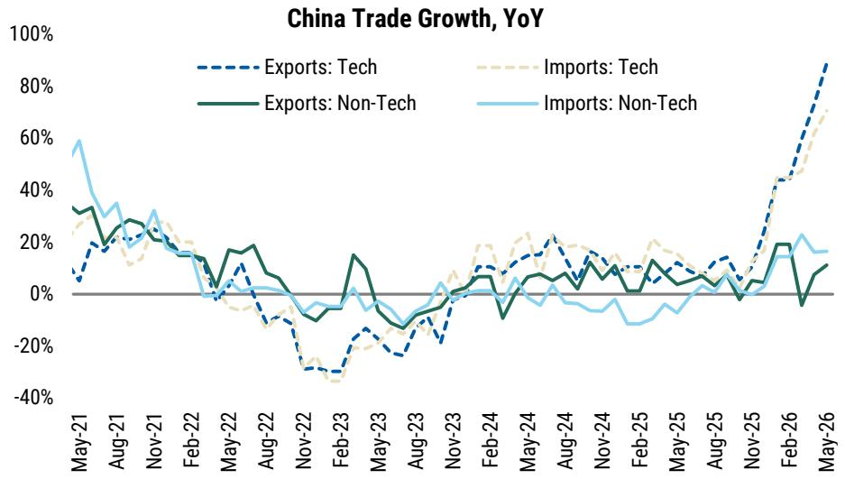

line chart

| Month   | Exports: Tech | Imports: Tech | Exports: Non-Tech | Imports: Non-Tech |
|---------|---------------|---------------|-------------------|-------------------|
| May-21  | ~5%           | ~30%          | ~35%              | ~60%              |
| Aug-21  | ~20%          | ~15%          | ~25%              | ~35%              |
| Nov-21  | ~15%          | ~20%          | ~20%              | ~30%              |
| Feb-22  | ~0%           | ~-5%          | ~-10%             | ~-5%              |
| May-22  | ~10%          | ~-10%         | ~-15%             | ~-10%             |
| Aug-22  | ~-10%         | ~-15%         | ~-20%             | ~-15%             |
| Nov-22  | ~-30%         | ~-35%         | ~-25%             | ~-20%             |
| Feb-23  | ~-25%         | ~-30%         | ~-20%             | ~-15%             |
| May-23  | ~-15%         | ~-20%         | ~-10%             | ~-5%              |
| Aug-23  | ~-10%         | ~-15%         | ~-5%              | ~0%               |
| Nov-23  | ~5%           | ~0%           | ~0%               | ~5%               |
| Feb-24  | ~10%          | ~15%          | ~5%               | ~10%              |
| May-24  | ~20%          | ~25%          | ~10%              | ~15%              |
| Aug-24  | ~15%          | ~20%          | ~5%               | ~10%              |
| Nov-24  | ~10%          | ~15%          | ~0%               | ~5%               |
| Feb-25  | ~5%           | ~10%          | ~5%               | ~0%               |
| May-25  | ~10%          | ~15%          | ~10%              | ~5%               |
| Aug-25  | ~15%          | ~20%          | ~15%              | ~10%              |
| Nov-25  | ~20%          | ~25%          | ~20%              | ~15%              |
| Feb-26  | ~40%          | ~45%          | ~30%              | ~35%              |
| May-26  | ~90%          | ~70%          | ~10%              | ~15%              |

Elsewhere, export breadth is improving  
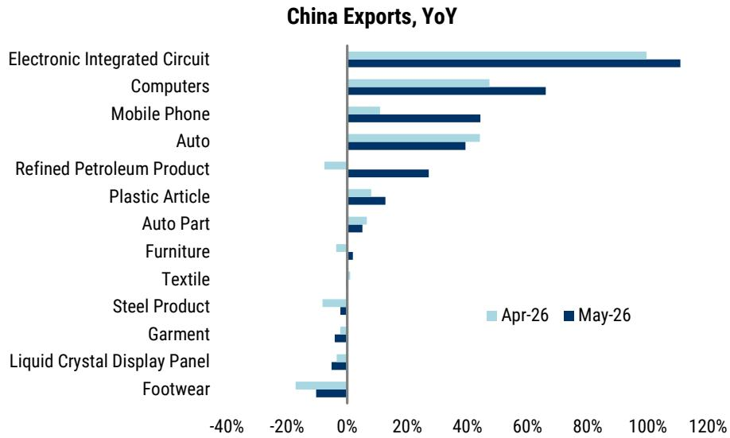

bar chart

China Exports, YoY
| Category | Apr-26 (%) | May-26 (%) |
|---|---|---|
| Electronic Integrated Circuit | 100 | 110 |
| Computers | 45 | 65 |
| Mobile Phone | 10 | 45 |
| Auto | 45 | 40 |
| Refined Petroleum Product | -5 | 28 |
| Plastic Article | 8 | 13 |
| Auto Part | 6 | 4 |
| Furniture | -3 | 2 |
| Textile | -1 | 0 |
| Steel Product | -5 | 1 |
| Garment | -1 | 2 |
| Liquid Crystal Display Panel | -3 | -3 |
| Footwear | -15 | -8 |

Source: CEIC, MS

## Yet Private Credit Demand Weakened Further

Broad-based private credit demand weakness  
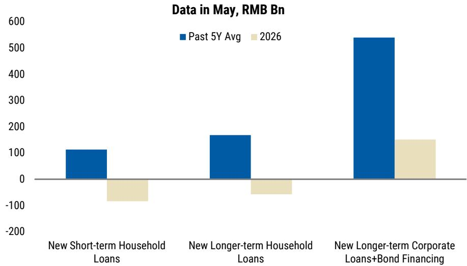

bar chart

Data in May, RMB Bn
| Category | Past 5Y Avg (RMB Bn) | 2026 (RMB Bn) |
| :--- | :--- | :--- |
| New Short-term Household Loans | 110 | -70 |
| New Longer-term Household Loans | 165 | -50 |
| New Longer-term Corporate Loans+Bond Financing | 535 | 145 |

Continued household deleveraging in aggregate suggests the recent housing sales rebound is narrow  
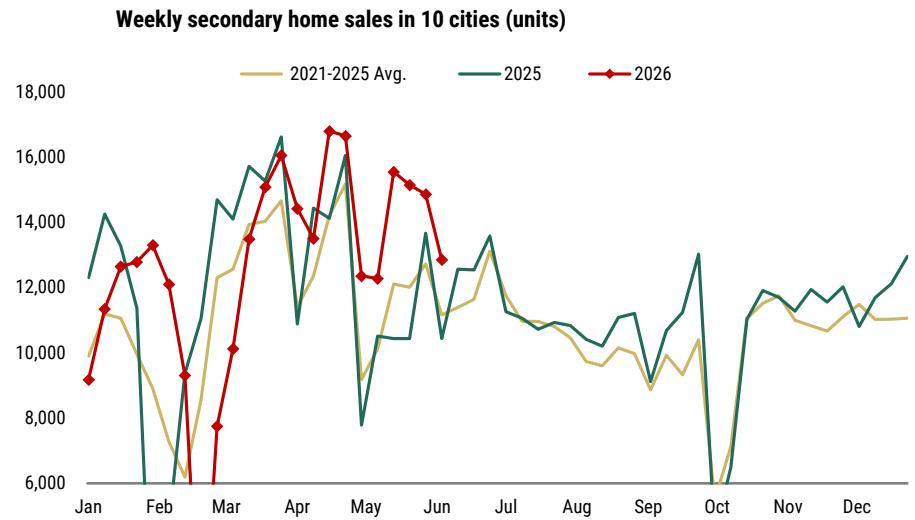

line chart

| Month | 2021-2025 Avg. | 2025 | 2026 |
|-------|----------------|------|------|
| Jan   | ~11,000        | ~14,000 | ~9,000 |
| Feb   | ~10,000        | ~13,000 | ~13,000 |
| Mar   | ~12,000        | ~14,500 | ~7,800 |
| Apr   | ~14,500        | ~16,500 | ~16,000 |
| May   | ~12,500        | ~8,000 | ~12,500 |
| Jun   | ~13,500        | ~13,500 | ~15,500 |
| Jul   | ~12,500        | ~13,500 | ~12,500 |
| Aug   | ~11,500        | ~11,500 | ~11,500 |
| Sep   | ~10,500        | ~9,500 | ~9,500 |
| Oct   | ~6,500         | ~6,500 | ~6,500 |
| Nov   | ~11,500        | ~12,500 | ~12,500 |
| Dec   | ~11,500        | ~13,500 | ~13,500 |

Source: CEIC, MS

## Sequentially Slower Oil Push, Limited Reflation Elsewhere

PPI MoM slipped on reduced oil price impulse  
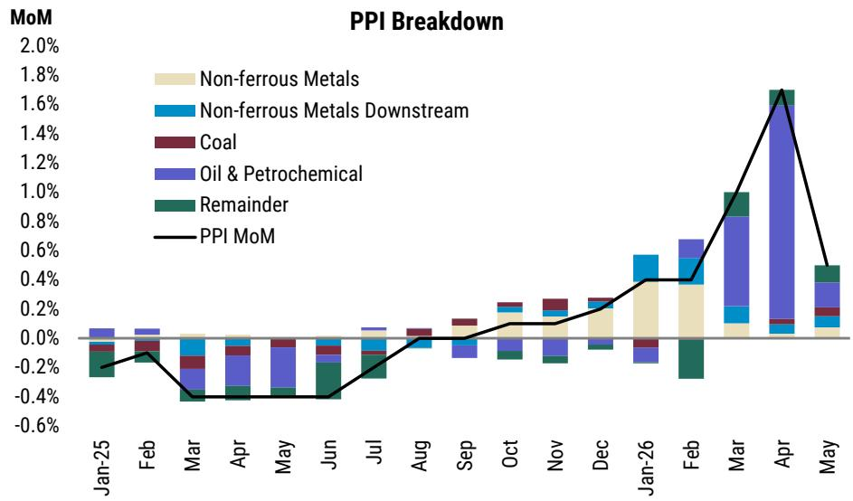

bar-line hybrid

PPI Breakdown
| Month | Non-ferrous Metals (%) | Non-ferrous Metals Downstream (%) | Coal (%) | Oil & Petrochemical (%) | Remainder (%) | PPI MoM |
|---|---|---|---|---|---|---|
| Jan-25 | -0.1 | -0.1 | -0.1 | -0.1 | -0.2 | -0.2 |
| Feb | -0.1 | -0.1 | -0.1 | -0.1 | -0.2 | -0.1 |
| Mar | -0.1 | -0.1 | -0.1 | -0.1 | -0.4 | -0.4 |
| Apr | -0.1 | -0.1 | -0.1 | -0.1 | -0.3 | -0.4 |
| May | -0.1 | -0.1 | -0.1 | -0.1 | -0.3 | -0.4 |
| Jun | -0.1 | -0.1 | -0.1 | -0.1 | -0.3 | -0.4 |
| Jul | -0.1 | -0.1 | -0.1 | -0.1 | -0.3 | -0.2 |
| Aug | -0.1 | -0.1 | 0.05 | 0.05 | 0.05 | 0.05 |
| Sep | 0.05 | 0.05 | 0.1 | 0.1 | 0.15 | 0.1 |
| Oct | 0.15 | 0.15 | 0.15 | 0.15 | 0.25 | 0.2 |
| Nov | 0.15 | 0.15 | 0.25 | 0.25 | 0.25 | 0.2 |
| Dec | 0.25 | 0.25 | 0.25 | 0.25 | 0.25 | 0.3 |
| Jan-26 | 0.45 | 0.55 | 0.15 | 0.15 | 0.35 | 0.4 |
| Feb | 0.45 | 0.35 | 0.15 | 0.65 | -0.35 | 0.4 |
| Mar | 0.15 | 0.25 | 0.15 | 0.85 | 0.95 | 1.2 |
| Apr | 0.15 | 0.15 | 0.15 | 1.75 | 1.75 | 1.7 |
| May | 0.15 | 0.15 | 0.15 | 0.35 | 0.35 | 0.45 |

Limited transmission to core CPI  
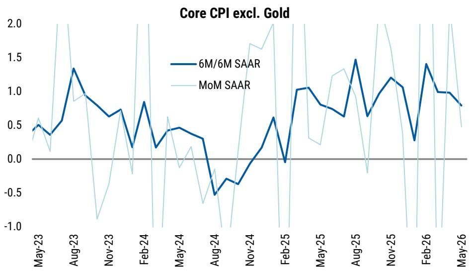

line chart

| Month   | 6M/6M SAAR | MoM SAAR |
|---------|------------|----------|
| May-23  | 0.5        | 0.6      |
| Aug-23  | 1.3        | 0.9      |
| Nov-23  | 0.7        | -0.8     |
| Feb-24  | 0.8        | -0.2     |
| May-24  | 0.4        | 0.6      |
| Aug-24  | -0.5       | -0.7     |
| Nov-24  | 0.6        | 1.7      |
| Feb-25  | 1.0        | -0.1     |
| May-25  | 0.8        | 0.3      |
| Aug-25  | 1.5        | -0.3     |
| Nov-25  | 1.2        | 1.9      |
| Feb-26  | 1.4        | -0.9     |
| May-26  | 0.8        | 0.5      |

Source: CEIC, MS

## Budget Rollout May Accelerate from 3Q to Support AI and Energy Transition

Pace of fiscal rollout slowed in Apr-May  
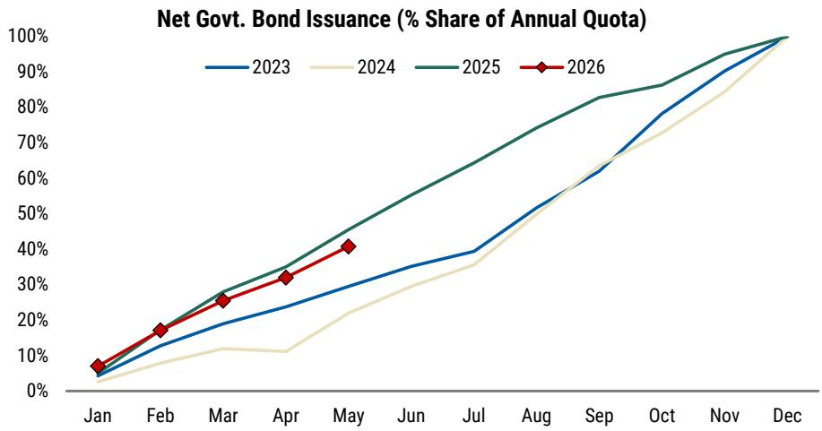

line chart

| Month | 2023 | 2024 | 2025 | 2026 |
|-------|------|------|------|------|
| Jan   | ~5%  | ~3%  | ~7%  | ~8%  |
| Feb   | ~10% | ~6%  | ~15% | ~17% |
| Mar   | ~15% | ~10% | ~25% | ~25% |
| Apr   | ~20% | ~10% | ~30% | ~32% |
| May   | ~25% | ~15% | ~40% | ~40% |
| Jun   | ~30% | ~20% | ~50% | -    |
| Jul   | ~35% | ~35% | ~60% | -    |
| Aug   | ~40% | ~45% | ~70% | -    |
| Sep   | ~50% | ~55% | ~80% | -    |
| Oct   | ~60% | ~65% | ~85% | -    |
| Nov   | ~75% | ~75% | ~90% | -    |
| Dec   | 100% | 100% | 100% | 100% |

Expecting stronger budget execution from 3Q, with Focus on AI and Energy Transition in the “Six Networks”  

flowchart

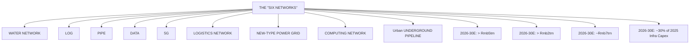

- Only 41% of annual government bond quota was utilized (46% by May-25)  
• We thus expect an accelerated budget rollout, not additional stimulus, from 3Q  
- Policy focus will remain capex-centric, particularly on AI computing networks, internet data centers and smart grids under the "Six Networks" initiative

Source: CEIC, MS

## Smarter Industrial Policy Alone May Not Narrow Supply-Demand Imbalances

Investment ex-property growth slowed from 2021-23's spike, but only at a modest pace  
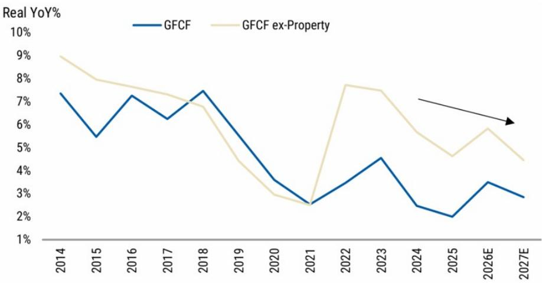

line chart

| Year | GFCF (%) | GFCF ex-Property (%) |
|---|---|---|
| 2014 | 7.4 | 9.0 |
| 2015 | 5.5 | 8.0 |
| 2016 | 7.3 | 7.7 |
| 2017 | 6.3 | 7.3 |
| 2018 | 7.5 | 6.9 |
| 2019 | 5.8 | 4.5 |
| 2020 | 3.7 | 2.9 |
| 2021 | 2.5 | 2.5 |
| 2022 | 3.5 | 7.8 |
| 2023 | 4.6 | 7.5 |
| 2024 | 2.5 | 5.8 |
| 2025 | 2.0 | 4.7 |
| 2026E | 3.5 | 5.9 |
| 2027E | 2.9 | 4.4 |

The "baton" of investment has been passed from sectors with overcapacity to those with less oversupply, for now  

scatter plot

| FAI CAGR in 2021-23 | FAI Growth in 2024-25 |
| ------------------- | --------------------- |
| -8%                 | 16%                   |
| -5%                 | 5%                    |
| 0%                  | 0%                    |
| 5%                  | -5%                   |
| 10%                 | 10%                   |
| 15%                 | 14%                   |
| 20%                 | -10%                  |
| 25%                 | 21%                   |
| 30%                 | -7%                   |
| 35%                 | -10%                  |

## "National unified market" and anti-involution are in the right direction but challenging to implement:

- Top-down coordination unworkable; market mechanisms for specialization still weak  
- Local incentives misaligned  
• Tax system biases production

Source: CEIC, MS estimates

## Reforms Needed for Economic Rebalancing

## Five-year plan remains supply-centric

## Growth Target

\- Not Specified

## Consumption

• Commitments to boost consumption/GDP ratio

## Tech & Green Transition

Clear numerical targets:

• R&D (5Y CAGR: >7%)  
• Labor productivity growth (>GDP growth)  
• Digital economy ( $\uparrow$ 2pp of GDP by 2030)  
• CO2 emissions per unit of GDP ( $\downarrow$ 17% by 2030 vs. 2025)  
• Additional target on non-fossil fuel consumption

## Local government incentives should be reoriented towards consumption

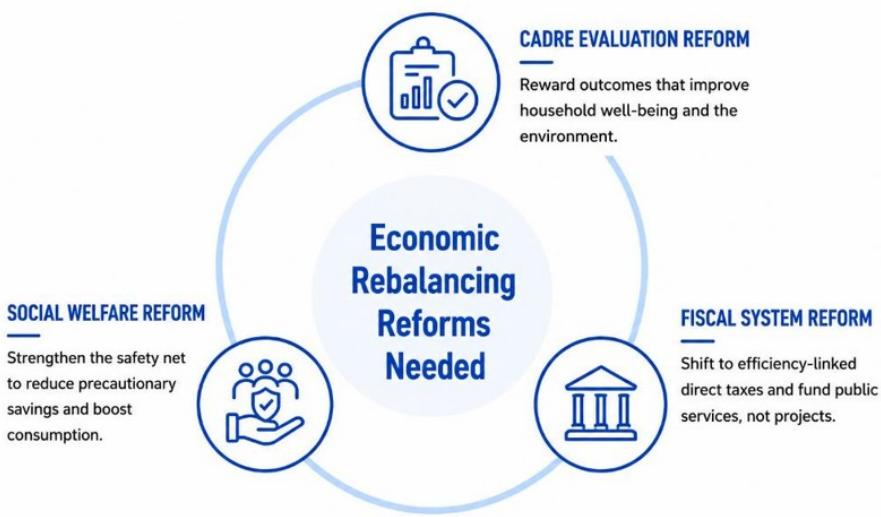

flowchart

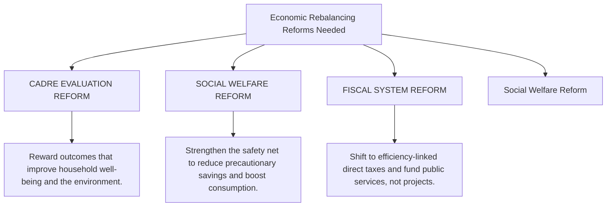

Source: CEIC, MS

## Outbound Investment

## Tightening Outbound Investment Controls to Regulate Flows...

China's non-reserve balance of payments: from a unique "twin surplus" to the more common "mirror image"...  
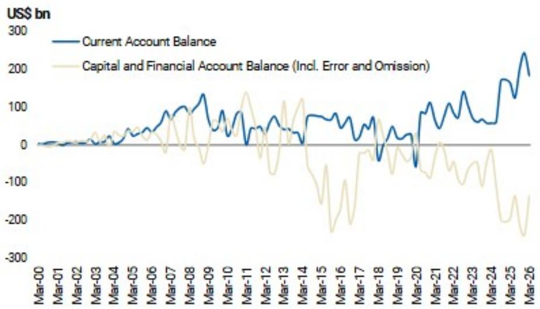

line chart

| Date   | Current Account Balance | Capital and Financial Account Balance (Incl. Error and Omission) |
|--------|--------------------------|------------------------------------------------------------------|
| Mar-00 | 0                        | 0                                                                |
| Mar-01 | 0                        | 0                                                                |
| Mar-02 | 0                        | 0                                                                |
| Mar-03 | 0                        | 0                                                                |
| Mar-04 | 0                        | 0                                                                |
| Mar-05 | 0                        | 0                                                                |
| Mar-06 | 0                        | 0                                                                |
| Mar-07 | 0                        | 0                                                                |
| Mar-08 | 0                        | 0                                                                |
| Mar-09 | 0                        | 0                                                                |
| Mar-10 | 0                        | 0                                                                |
| Mar-11 | 0                        | 0                                                                |
| Mar-12 | 0                        | 0                                                                |
| Mar-13 | 0                        | 0                                                                |
| Mar-14 | 0                        | 0                                                                |
| Mar-15 | 0                        | 0                                                                |
| Mar-16 | 0                        | 0                                                                |
| Mar-17 | 0                        | 0                                                                |
| Mar-18 | 0                        | 0                                                                |
| Mar-19 | 0                        | 0                                                                |
| Mar-20 | 0                        | 0                                                                |
| Mar-21 | 0                        | 0                                                                |
| Mar-22 | 0                        | 0                                                                |
| Mar-23 | 0                        | 0                                                                |
| Mar-24 | 0                        | 0                                                                |
| Mar-25 | 0                        | 0                                                                |
| Mar-26 | 0                        | 0                                                                |

...with capital outflows increasingly led by portfolio investment  
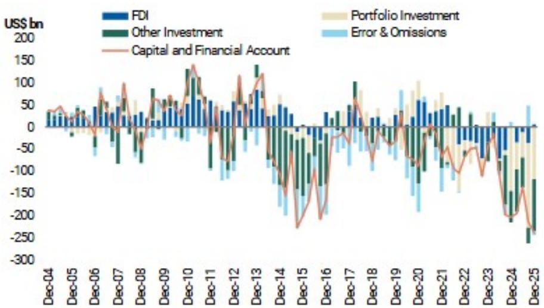

bar-line hybrid chart

| Date   | FDI  | Portfolio Investment | Other Investment | Capital and Financial Account |
|--------|------|----------------------|------------------|-------------------------------|
| Dec-04 | 0    | 0                    | 0                | 0                             |
| Dec-05 | 0    | 0                    | 0                | 0                             |
| Dec-06 | 0    | 0                    | 0                | 0                             |
| Dec-07 | 0    | 0                    | 0                | 0                             |
| Dec-08 | 0    | 0                    | 0                | 0                             |
| Dec-09 | 0    | 0                    | 0                | 0                             |
| Dec-10 | 0    | 0                    | 0                | 0                             |
| Dec-11 | 0    | 0                    | 0                | 0                             |
| Dec-12 | 0    | 0                    | 0                | 0                             |
| Dec-13 | 0    | 0                    | 0                | 0                             |
| Dec-14 | 0    | 0                    | 0                | 0                             |
| Dec-15 | 0    | 0                    | 0                | 0                             |
| Dec-16 | 0    | 0                    | 0                | 0                             |
| Dec-17 | 0    | 0                    | 0                | 0                             |
| Dec-18 | 0    | 0                    | 0                | 0                             |
| Dec-19 | 0    | 0                    | 0                | 0                             |
| Dec-20 | 0    | 0                    | 0                | 0                             |
| Dec-21 | 0    | 0                    | 0                | 0                             |
| Dec-22 | 0    | 0                    | 0                | 0                             |
| Dec-23 | 0    | 0                    | 0                | 0                             |
| Dec-24 | 0    | 0                    | 0                | 0                             |
| Dec-25 | 0    | 0                    | -300             | -300                          |

Source: CEIC, MS

## Outbound Investment

## ...Not Shut Down Overseas Investment Channels

Mainland residents still have several legal routes to gain offshore securities exposure...

CHANNELS FOR OFFSHORE
SECURITIES EXPOSURE  

flowchart

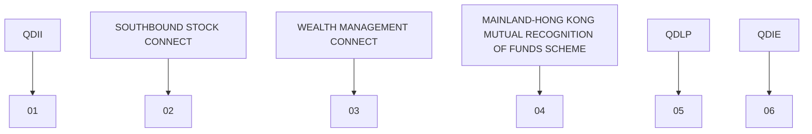

...albeit with various limitations such as insufficient quotas, product eligibility and regional restrictions etc.

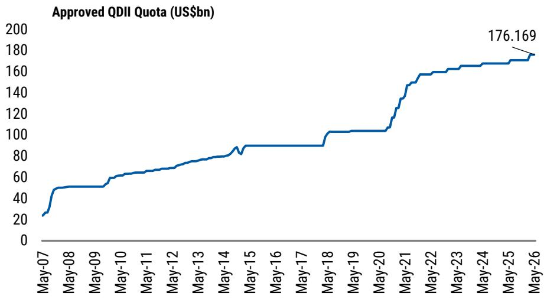

line chart

| Date   | Approved QDII Quota (US$bn) |
|--------|-----------------------------|
| May-26 | 176.169                     |

Source: CEIC, MS

## Outbound Investment

## Implications: Near-term Support to RMB; Marginal Impact on Growth

## Regulatory impact on RMB and growth

## IMPACT ON RMB

NEAR-TERM SUPPORT, FLOW-BASED

  
Tighter capital controls

  
Less unmonitored outflow & narrowing informal channels

  
Lower FX demand from households & corporates

  
More current account surplus converted → Near-term RMB support

## IMPACT ON GROWTH

NEAR-TERM IMPACT LIKELY MARGINAL

  
More private savings kept onshore

  
Supports liquidity & asset prices

  
Lowers financing costs & eases financial conditions

  
Supports growth — if credit demand picks up

  
CONFIDENCE IMPROVES  
More borrowing, investment & stronger growth

## OUTCOME DEPENDS ON CONFIDENCE

  
CONFIDENCE REMAINS WEAK  
Funds sit in deposits, money-market products or government bonds, pressuring risk-free rates

## Tighter controls could reduce risk-adjusted return opportunities for domestic portfolio investors

China Outbound Investment Return, 2025  
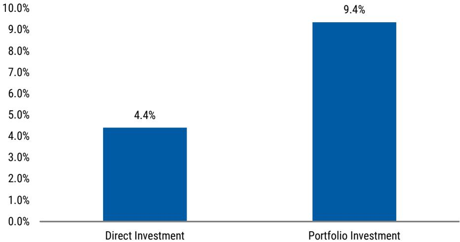

bar chart

| Category | Value (%) |
|---|---|
| Direct Investment | 4.4 |
| Portfolio Investment | 9.4 |

## Outbound Investment

## China Will Likely Continue with Its Prevailing Capital Account Opening Approach

## Capital-Account Opening and RMB Internationalization: A Managed Symbiosis

Mutually Reinforcing. Selectively Opened. Strategically Balanced.

flowchart

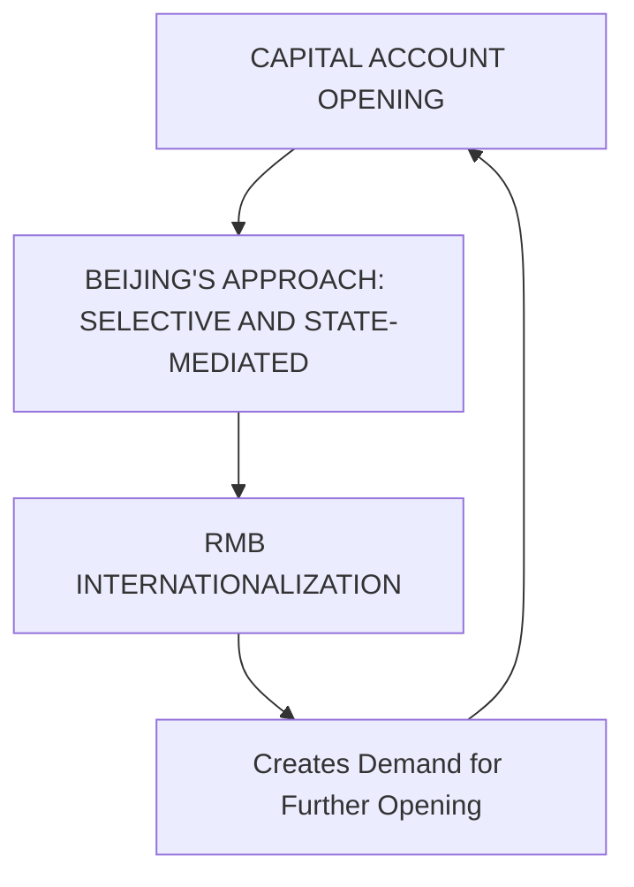

Source: CEIC, MS

## Disclosure Section

Information and opinions in MS were prepared or are disseminated by one or more of the following, which accept responsibility for its contents: MS Asia Limited, and/or MS Asia (Singapore) Pte. (Registration number 199206298Z) and/or MS Asia (Singapore) Securities Pte Ltd (Registration number 200008434H), regulated by the Monetary Authority of Singapore (which accepts legal responsibility for its contents and should be contacted with respect to any matters arising from, or in connection with, MS), and/or MS Taiwan Limited and/or MS & Co International plc, Seoul Branch, and/or MS Australia Limited (A.B.N. 67 003 734 576, holder of Australian financial services license No. 233742), and/or MS Wealth Management Australia Pty Ltd (A.B.N. 19 009 145 555, holder of Australian financial services license No. 240813, and/or MS India Company Private Limited having Corporate Identification No (CIN) U22990MH1998PTC115305, regulated by the Securities and Exchange Board of India ("SEBI") and holder of licenses as a Research Analyst (SEBI Registration No. INH000001105), Stock Broker (SEBI Stock Broker Registration No. INZ000244438), Merchant Banker (SEBI Registration No. INM000011203), and depository participant with National Securities Depository Limited (SEBI Registration No. IN-DP-NSDL-567-2021) having registered office at Altimus, Level 39 & 40, Pandurang Budhkar Marg, Worli, Mumbai 400018, India; Telephone no. +91-22-61181000; Compliance Officer Details: Mr. Tejarshi Hardas, Tel. No.: +91-22-61181000 or Email: tejarshi.hardas@morganstanley.com; Grievance officer details: Mr. Tejarshi Hardas, Tel. No.: +91-22-61181000 or Email: msic-compliance@morganstanley.com which accepts the responsibility for its contents and should be contacted with respect to any matters arising from, or in connection with, MS and their affiliates (collectively, "MS"). MS India Company Private Limited (MSICPL) may use AI tools in providing research services. All recommendations contained herein are made by the duly qualified research analysts;

For important disclosures, stock price charts and equity rating histories regarding companies that are the subject of this report, please see the MS Disclosure Website at www.morganstanley.com/eqr/disclosures/webapp/generalresearch, or contact your investment representative or MS at 1585 Broadway, (Attention: Research Management), New York, NY, 10036 USA.

For valuation methodology and risks associated with any recommendation, rating or price target referenced in this research report, please contact the Client Support Team as follows: US/Canada +1800 303-2495; Hong Kong +852 2848-5999; Latin America +1718 754-5444 (U.S.); London +44 (0)20-7425-8169; Singapore +65 6834-6860; Sydney +61(0)2-9770-1505; Tokyo +81(0)3-6836-9000. Alternatively you may contact your investment representative or MS at 1585 Broadway, (Attention: Research Management), New York, NY 10036 USA.

## Global Research Conflict Management Policy

MS has been published in accordance with our conflict management policy, which is available at www.morganstanley.com/institutional/research/conflictpolicies. A Portuguese version of the policy can be found at www.morganstanley.com.br

## Important Disclosures

MS is not acting as a municipal advisor and the opinions or views contained herein are not intended to be, and do not constitute, advice within the meaning of Section 975 of the Dodd-Frank Wall Street Reform and Consumer Protection Act. MS does not provide individually tailored investment advice. MS has been prepared without regard to the circumstances and objectives of those who receive it. MS recommends that investors independently evaluate particular investments and strategies, and encourages investors to seek the advice of a financial adviser. The appropriateness of an investment or strategy will depend on an investor's circumstances and objectives. The securities, instruments, or strategies discussed in MS may not be suitable for all investors, and certain investors may not be eligible to purchase or participate in some or all of them. MS is not an offer to buy or sell or the solicitation of an offer to buy or sell any security/instrument or to participate in any particular trading strategy. The value of and income from your investments may vary because of changes in interest rates, foreign exchange rates, default rates, prepayment rates, securities/instruments prices, market indexes, operational or financial conditions of companies or other factors. There may be time limitations on the exercise of options or other rights in securities/instruments transactions. Past performance is not necessarily a guide to future performance. Estimates of future performance are based on assumptions that may not be realized. If provided, and unless otherwise stated, the closing price on the cover page is that of the primary exchange for the subject company's securities/instruments.

The fixed income research analysts, strategists or economists principally responsible for the preparation of MS have received compensation based upon various factors, including quality, accuracy and value of research, firm profitability or revenues (which include fixed income trading and capital markets profitability or revenues), client feedback and competitive factors. Fixed Income Research analysts', strategists' or economists' compensation is not linked to investment banking or capital markets transactions performed by MS or the profitability or revenues of particular trading desks.

With the exception of information regarding MS, MS is based on public information. MS makes every effort to use reliable, comprehensive information, but we make no representation that it is accurate or complete. We have no obligation to tell you when opinions or information in MS change apart from when we intend to discontinue equity research coverage of a subject company. Facts and views presented in MS have not been reviewed by, and may not reflect information known to, professionals in other MS business areas, including investment banking personnel.

MS may make investment decisions that are inconsistent with the recommendations or views in this report.

To our readers based in Taiwan or trading in Taiwan securities/instruments: Information on securities/instruments that trade in Taiwan is distributed by MS Taiwan Limited ("MSTL"). Such information is for your reference only. The reader should independently evaluate the investment risks and is solely responsible for their investment decisions. MS may not be distributed to the public media or quoted or used by the public media without the express written consent of MS. Any non-customer reader within the scope of Article 7-1 of the Taiwan Stock Exchange Recommendation Regulations accessing and/or receiving MS is not permitted to provide MS to any third party (including but not limited to related parties, affiliated companies and any other third parties) or engage in any activities regarding MS which may create or give the appearance of creating a conflict of interest. Information on securities/instruments that do not trade in Taiwan is for informational purposes only and is not to be construed as a recommendation or a solicitation to trade in such securities/instruments. MSTL may not execute transactions for clients in these securities/instruments.

MS is not incorporated under PRC law and the research in relation to this report is conducted outside the PRC. MS does not constitute an offer to sell or the solicitation of an offer to buy any securities in the PRC. PRC investors shall have the relevant qualifications to invest in such securities and shall be responsible for obtaining all relevant approvals, licenses, verifications and/or registrations from the relevant governmental authorities themselves. Neither this report nor any part of it is intended as, or shall constitute, provision of any consultancy or advisory service of securities investment as defined under PRC law. Such information is provided for your reference only.

MS is disseminated in Brazil by MS C.T.V.M. S.A. located at Av. Brigadeiro Faria Lima, 3600, 6th floor, São Paulo - SP, Brazil; and is regulated by the Comissão de Valores Mobiliários; in Mexico by MS México, Casa de Bolsa, S.A. de C.V which is regulated by Comision Nacional Bancaria y de Valores. Paseo de los Tamarindos 90, Torre 1, Col. Bosques de las Lomas Floor 29, 05120 Mexico City; in Japan by MS MUFG Securities Co., Ltd. and, for Commodities related research reports only, MS Capital Group Japan Co., Ltd; in Hong Kong by MS Asia Limited (which accepts responsibility for its contents) and by MS Bank Asia Limited; in Singapore by MS Asia (Singapore) Pte. (Registration number 199206298Z) and/or MS Asia (Singapore) Securities Pte Ltd (Registration number 200008434H), regulated by the Monetary Authority of Singapore (which accepts legal responsibility for its contents and should be contacted with respect to any matters arising from, or in connection with, MS) and by MS Bank Asia Limited, Singapore Branch (Registration number T14FC0118); in Australia to "wholesale clients" within the meaning of the Australian Corporations Act by MS Australia Limited A.B.N. 67 003 734 576, holder of Australian financial services license No. 233742, which accepts responsibility for its contents; in Australia to "wholesale clients" and "retail clients" within the meaning of the Australian Corporations Act by MS Wealth Management Australia Pty Ltd (A.B.N. 19 009 145 555, holder of Australian financial services license No. 240813, which accepts responsibility for its contents; in Korea by MS & Co International plc, Seoul Branch; in India by MS India Company Private Limited having Corporate Identification No (CIN) U22990MH1998PTC115305, regulated by the Securities and Exchange Board of India ("SEBI") and holder of licenses as a Research Analyst (SEBI Registration No. INH000001105); Stock Broker (SEBI Stock Broker Registration No. INZ000244438), Merchant Banker (SEBI Registration No. INM000011203), and depository participant with National Securities Depository Limited (SEBI Registration No. IN-DP-NSDL-567-2021) having registered office at Altimus, Level 39 & 40, Pandurang Budhkar Marg, Worli, Mumbai 400018, India; Telephone no. +91-22-61181000; Compliance Officer Details: Mr. Tejarshi Hardas, Tel. No.: +91-22-61181000 or Email: tejarshi.hardas@morganstanley.com; Grievance officer details: Mr. Tejarshi Hardas, Tel. No.: +91-22-61181000 or Email: msic-compliance@morganstanley.com. MS India Company Private Limited (MSICPL) may use AI tools in providing research services. All recommendations contained herein are made by the duly qualified research analysts; in Canada by MS Canada Limited; in Germany and the European Economic Area where required by MS Europe S.E., regulated by Bundesanstalt fuer Finanzdienstleistungsaufsicht (BaFin) under the reference number 149169; in the United States by MS & Co. LLC, which accepts responsibility for its contents. MS & Co. International plc, authorized by the Prudential Regulation Authority and regulated by the Financial Conduct Authority and the Prudential Regulation Authority, disseminates in the UK research that it has prepared, and research which has been prepared by any of its affiliates, only to persons who (i) are investment professionals falling within Article 19(5) of the Financial Services and Markets Act 2000 (Financial Promotion) Order 2005 (as amended, the "Order"); (ii) are persons who are high net worth entities falling within Article 4.9(2)(a) to (d) of the Order; or (iii) are persons to whom an invitation or inducement to engage in investment activity (within the meaning of section 21 of the Financial Services and Markets Act 2000, as amended) may otherwise lawfully be communicated or caused to be communicated. RMB MS Proprietary Limited is a member of the JSE Limited and A2X (Pty) Ltd. RMB MS Proprietary Limited is a joint venture owned equally by MS International Holdings Inc. and RMB Investment Advisory (Proprietary) Limited, which is wholly owned by FirstRand Limited. The information in MS is being disseminated by MS Saudi Arabia, regulated by the Capital Market Authority in the Kingdom of Saudi Arabia, and is directed at Sophisticated investors only.

The trademarks and service marks contained in MS are the property of their respective owners. Third-party data providers make no warranties or representations relating to the accuracy, completeness, or timeliness of the data they provide and shall not have liability for any damages relating to such data. The Global Industry Classification Standard (GICS) was developed by and is the exclusive property of MSCI and S&P.

MS, or any portion thereof may not be reprinted, sold or redistributed without the written consent of MS.

Indicators and trackers referenced in MS may not be used as, or treated as, a benchmark under Regulation EU 2016/1011, or any other similar framework.

The information in MS is being communicated by MS & Co. International plc (DIFC Branch), regulated by the Dubai Financial Services Authority (the DFSA) or by MS & Co. International plc (ADGM Branch), regulated by the Financial Services Regulatory Authority Abu Dhabi (the FSRA), and is directed at Professional Clients only, as defined by the DFSA or the FSRA, respectively. The financial products or financial services to which this research relates will only be made available to a customer who we are satisfied meets the regulatory criteria of a Professional Client. A distribution of the different MS Research ratings or recommendations, in percentage terms for Investments in each sector covered, is available upon request from your sales representative.

The information in MS is being communicated by MS & Co. International plc (QFC Branch), regulated by the Qatar Financial Centre Regulatory Authority (the QFCRA), and is directed at business customers and market counterparties only and is not intended for Retail Customers as defined by the QFCRA.

As required by the Capital Markets Board of Turkey, investment information, comments and recommendations stated here, are not within the scope of investment advisory activity. Investment advisory service is provided exclusively to persons based on their risk and income preferences by the authorized firms. Comments and recommendations stated here are general in nature. These opinions may not fit to your financial status, risk and return preferences. For this reason, to make an investment decision by relying solely to this information stated here may not bring about outcomes that fit your expectations.

Registration granted by SEBI and certification from the National Institute of Securities Markets (NISM) in no way guarantee performance of the intermediary or provide any assurance of returns to investors. Investment in securities market are subject to market risks. Read all the related documents carefully before investing.

© 2026 MS