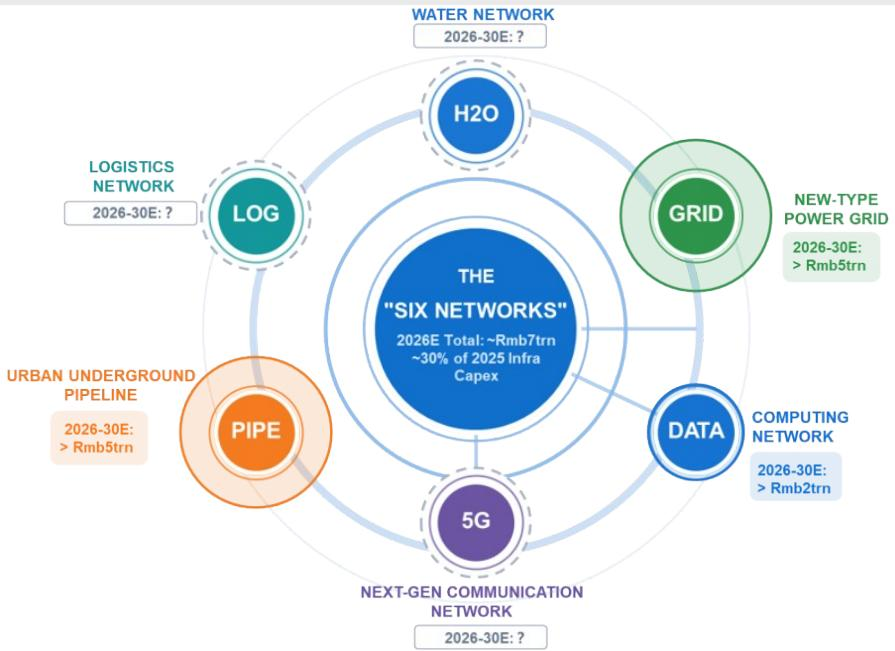

# China's Trade Surge Masks a Deeper Domestic Weakness That No Amount of Smarter Industrial Policy Can Fix

The narrative emerging from Asia's largest economy is one of stark divergence. On the surface, China's export machine is roaring back to life, driven by a global AI cycle that has supercharged demand for semiconductors, computers, and electronics. Yet beneath this veneer of trade-led strength, the domestic economy is sending a far more troubling signal. Private credit demand has not merely softened; it has collapsed. In May, new short-term household loans turned negative for the first time in the modern data series, while longer-term household borrowing fell to a fraction of its five-year average. This is not a cyclical pause. It is a structural disconnect between a supply-side economy that can produce for the world and a domestic demand engine that is running on empty.

The critical question for investors is no longer whether China can export its way to growth. It can, and it is. The question is whether the leadership can rebalance an economy that has become addicted to production-centric investment while its households retreat into deleveraging. The evidence from a recent global investment bank report on Asia Pacific suggests that the answer, for now, is no. The policy toolkit is being deployed with greater precision—targeting AI networks, data centers, and smart grids under the "Six Networks" initiative—but precision does not address the fundamental imbalance. Smarter industrial policy is still industrial policy. It does not put disposable income into the pockets of cautious consumers.

Why now matters is simple. The window for reform is narrowing. The trade boost from the global AI cycle will eventually moderate, as all cycles do. When it does, the underlying weakness in domestic demand will be fully exposed. The report's data on household deleveraging, combined with a slowdown in fiscal rollout and subdued inflation transmission, paints a picture of an economy that is running two separate races. One race is winning. The other is losing ground. Investors who focus only on the export headline risk missing the structural shift that will determine China's medium-term trajectory.

## The Global AI Cycle Has Created a Trade Supercycle That Masks Domestic Fragility

The most striking data point in the report is the explosion in China's tech exports. By May 2026, year-on-year growth in tech exports had surged to approximately 90 percent, with electronic integrated circuits alone posting a 110 percent increase. This is not a gradual recovery. It is a vertical spike that has lifted the entire trade complex. Non-tech exports have also improved, but the driver is unmistakable: the global artificial intelligence buildout is pulling Chinese manufacturing capacity into a new orbit.

The breadth of this export improvement is noteworthy. It is not confined to a single product category. Computers, mobile phones, and automobiles all show strong double-digit growth. Even categories that had been under pressure, such as refined petroleum products and plastic articles, have turned positive. The pattern is consistent with a broad-based demand shock from the global technology supply chain, as AI-related capital expenditure cascades through semiconductor fabrication, assembly, and component manufacturing.

Yet the very breadth of the export surge should give investors pause. An economy that relies on external demand to generate growth is an economy that has not solved its internal demand problem. The report's data on private credit demand makes this explicit. In May, new short-term household loans were negative by 70 billion renminbi, compared to a five-year average of positive 110 billion. New longer-term household loans were negative by 50 billion, against a five-year average of positive 165 billion. Corporate borrowing was also weak, with new longer-term corporate loans and bond financing combined reaching only 145 billion renminbi, against a five-year average of 535 billion.

The implication is clear. The trade supercycle is providing a lifeline to corporate profits and employment in the export sector, but it is not translating into domestic confidence. Households are not borrowing to consume. They are not borrowing to invest in housing. They are deleveraging. This is the behavior of an economy where precautionary saving has become the dominant household strategy, and no amount of export growth will change that calculus.

## The Housing Rebound Is Narrow and Does Not Signal a Broader Consumption Recovery

One of the most watched indicators for China's domestic economy is the housing market. After a prolonged downturn, there have been signs of stabilization in property sales. The report shows that in May 2026, the 30-city home sales volume rebounded to approximately 12,500 units, roughly in line with the 2021-2025 average. This is an improvement from the trough of around 8,000 units in May 2025.

But the aggregate number is misleading. The report explicitly states that the rebound is "narrow." The evidence is in the credit data. If the housing recovery were broad-based, one would expect to see a corresponding increase in longer-term household loans, which are primarily used for mortgage financing. Instead, those loans turned negative in May. This suggests that the sales rebound is concentrated in cash-rich buyers or in specific cities, rather than reflecting a genuine recovery in household willingness to take on mortgage debt.

The implication for investors is that the housing market is not yet a reliable indicator of domestic demand revival. A narrow recovery driven by pent-up demand in premium segments does not create the multiplier effects that a broad-based housing recovery would generate. It does not boost demand for furniture, home appliances, or renovation services. It does not restore household balance sheets. It is, at best, a stabilization signal, not a reflation signal.

The report's data on producer prices reinforces this caution. The month-on-month PPI moved from a positive 1.7 percent in April to a much lower 0.45 percent in May, driven by a reduced impulse from oil and petrochemical prices. Core CPI transmission remains limited, with the six-month seasonally adjusted annualized rate hovering around 0.8 percent. This is not an economy experiencing demand-pull inflation. It is an economy where pricing power remains weak, because domestic demand is insufficient to absorb the output that the supply side can produce.

## Fiscal Rollout Has Slowed, and the Focus on Capex Will Not Address the Consumption Gap

The report identifies a critical policy dynamic: the pace of fiscal rollout has slowed. By May 2026, only about 40 percent of the annual government bond quota had been utilized, compared to 46 percent by May 2025. This is a meaningful deceleration. The report expects an acceleration from the third quarter, but it emphasizes that this will be an acceleration of existing budget execution, not new stimulus.

The direction of fiscal spending is equally important. The "Six Networks" initiative—covering water, logistics, pipelines, data, 5G, and power grids—is expected to see cumulative investment of over 5 trillion renminbi in the 2026-2030 period for the computing network alone, and approximately 7 trillion for the new-type power grid. This is a supply-side vision. It is about building infrastructure for the next generation of industrial production, not about supporting household consumption.

The problem with this approach is that it reinforces the very imbalance the economy needs to correct. Capital expenditure on AI computing networks and smart grids will create demand for industrial goods and construction services, but it will not directly increase household disposable income. It will not strengthen the social safety net. It will not reduce the precautionary saving motive that is driving household deleveraging. The report's own analysis of the "national unified market" and anti-involution efforts acknowledges that top-down coordination is unworkable and that local government incentives remain misaligned. The tax system, the report notes, still biases production over consumption.

Investors should ask a hard question: if the policy framework continues to prioritize production-side investment, what catalyst will shift the economy toward consumption-led growth? The report does not provide a clear answer. It identifies the need for cadre evaluation reform, social welfare reform, and fiscal system reform, but it does not suggest that these reforms are imminent. The five-year plan remains supply-centric, with clear numerical targets for R&D growth, labor productivity, and digital economy expansion, but no corresponding target for the consumption-to-GDP ratio.

## The Report Does Not Fully Answer How Capital Controls and Outbound Investment Policy Will Evolve

One of the most intriguing sections of the report deals with outbound investment. The data shows that China's balance of payments is transitioning from a unique "twin surplus" structure—where both the current account and the capital account were in surplus—to a more common "mirror image" pattern, where a current account surplus is offset by a capital account deficit. The capital and financial account, including errors and omissions, is now showing a deficit of approximately 300 billion dollars, driven increasingly by portfolio investment outflows.

The report notes that authorities are tightening outbound investment controls to regulate these flows, but it also clarifies that they are not shutting down overseas investment channels. Mainland residents still have access to QDII, Southbound Stock Connect, Wealth Management Connect, and other programs, albeit with limitations on quotas, product eligibility, and regional access. The approved QDII quota stood at 176.2 billion dollars as of May 2026.

What the report does not fully answer is how this tension will resolve. On one hand, capital controls provide near-term support to the renminbi by reducing outflows. On the other hand, they create a friction for Chinese households and institutions that want to diversify their savings globally. If domestic investment opportunities remain unattractive due to weak consumption and low returns, the pent-up demand for overseas investment will only grow. The report acknowledges that the regulatory impact on growth is "marginal," but it does not explore the second-order effects on financial market development, corporate governance, or the internationalization of the renminbi.

This is a meaningful open question for investors. If capital controls become more restrictive, the renminbi may remain stable in the near term, but at the cost of reducing China's integration with global financial markets. If controls are loosened, the currency could face depreciation pressure, but Chinese households would gain access to higher-return assets abroad. The report's data suggests that the authorities are currently leaning toward tighter controls, but the sustainability of this approach is uncertain, especially if domestic asset returns remain compressed.

## A Decision Framework for Investors Navigating the China Divergence

For investors trying to make sense of this conflicting data, a structured decision framework is essential. The first step is to separate the trade cycle from the domestic demand cycle. The trade cycle is driven by global AI capital expenditure, which has its own momentum and its own risks. The domestic demand cycle is driven by household balance sheets, fiscal policy, and structural reforms, which operate on a completely different timeline.

The second step is to assess which sectors are exposed to which cycle. Export-oriented technology companies, particularly those in the semiconductor and electronics supply chain, are benefiting from the global AI boom. Their earnings are likely to remain strong as long as the cycle persists. Domestic-facing sectors—consumer goods, real estate, retail, and services—are exposed to the household deleveraging trend. Their recovery depends on a shift in policy toward consumption support, which the report suggests is not imminent.

The third step is to monitor the fiscal rollout. The report expects an acceleration from the third quarter, but the composition of spending matters. If the acceleration is concentrated in the "Six Networks" and other supply-side investments, it will not change the domestic demand trajectory. If, however, there is a surprise shift toward direct household transfers or consumption subsidies, that would be a meaningful signal that the policy framework is evolving.

The fourth step is to watch the capital account data. The transition from twin surplus to mirror image is a structural shift that has implications for the renminbi, for asset prices, and for the cost of capital. If portfolio outflows continue to grow despite tighter controls, it will signal that domestic investors are voting with their feet. If outflows stabilize, it will suggest that controls are effective, but at the cost of reduced financial liberalization.

The final step is to accept uncertainty. The report identifies the reforms needed—cadre evaluation reform, social welfare reform, fiscal system reform—but it does not predict when or if they will occur. Investors should build scenarios that account for both the continuation of the current policy mix and the possibility of a sudden shift toward consumption-led growth. The probability of each scenario depends on factors that are inherently unpredictable, including political dynamics, external pressures, and the evolution of the global trade environment.

## Join the Community to Read the Full Report and Review the Original Charts

The analysis above is based on a detailed parsing of a recent investor presentation from a leading global investment bank. The full report contains additional data on the breakdown of export categories, the trajectory of producer prices, the specific components of the "Six Networks" initiative, and the evolution of China's balance of payments since 2000. It also includes the original charts that illustrate the divergence between trade strength and domestic weakness with greater precision than any summary can capture.

For investors who want to understand the full picture—including the nuances of the credit data, the sectoral shifts in fixed asset investment, and the implications of the tightening outbound investment controls—the original report is indispensable. The charts alone tell a story that no written summary can fully convey. Join the community to read the full report and review the original charts.

*This article is for learning and discussion only and does not constitute investment advice.*

Personal reading notes and learning share only. Not investment advice.

