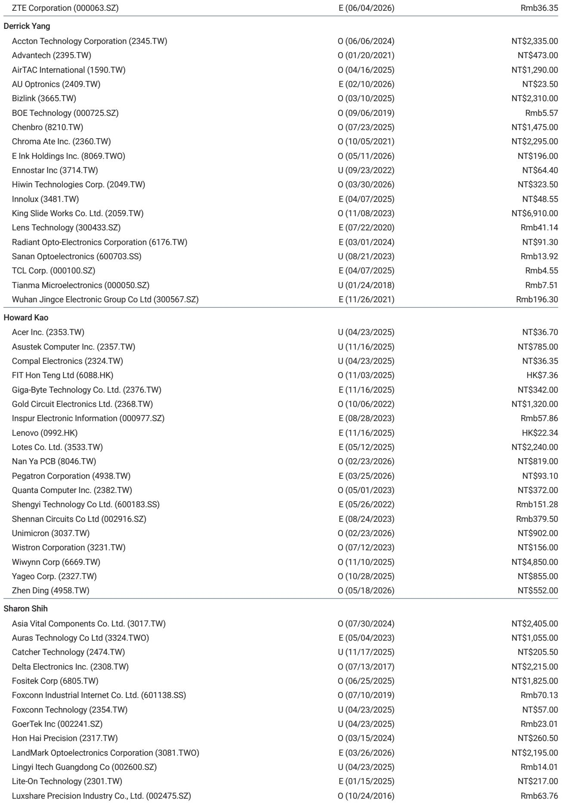
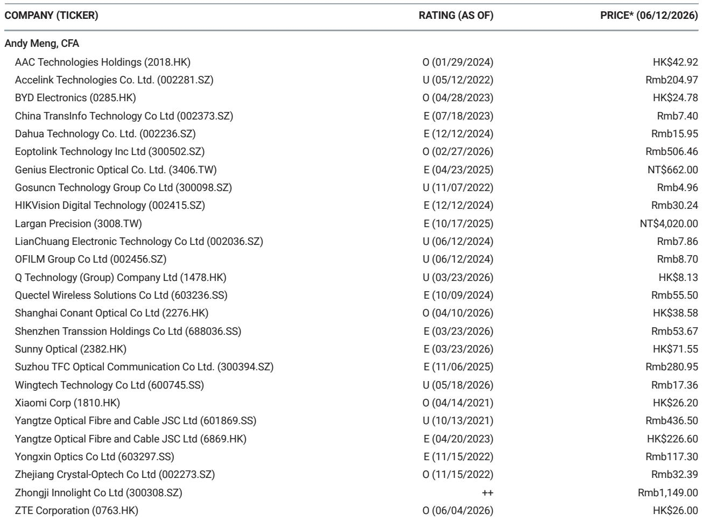
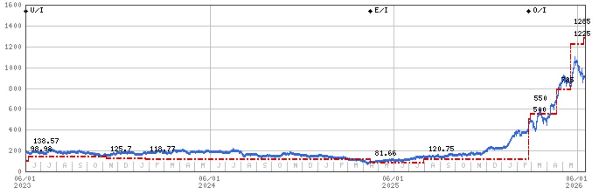

# AT&S's Malaysia Expansion Confirms the ABF Supply Deficit Narrative — But the Real Question Is Who Captures the Value

The semiconductor substrate industry just received its clearest signal yet that the AI-driven demand wave for advanced packaging is not a cyclical uptick but a structural transformation. AT&S, the Austrian IC substrate manufacturer, announced it has signed key terms with AMD and another major technology customer to add AI and high-performance computing IC substrate capacity in Kulim, Malaysia. The investment, valued between EUR 1.5 billion and EUR 2 billion, is fully supported and financed by long-term customer commitments. This is not speculative capacity building. It is demand-pull of the highest order.

What makes this announcement strategically important is not merely the size of the investment, but what it reveals about the timing and nature of the supply-demand dynamics in the ABF substrate market. AT&S simultaneously raised its fiscal year 2026/2027 guidance sharply: currency-adjusted revenue growth now expected at 45-55 percent, up from 30-35 percent; EBITDA margin guidance raised to 32-37 percent from 25-29 percent; and capital expenditure guidance more than doubled to EUR 1-1.2 billion from EUR 0.4 billion, with the company projecting significantly positive operating free cash flow. These are not incremental adjustments. They represent a fundamental re-rating of the company's growth trajectory.

The market has been debating whether the ABF substrate supply deficit, which many analysts have forecasted for 2027 onwards, would materialize or be eroded by capacity additions. AT&S's move effectively settles that debate. The company is not building a new facility from scratch; it is adding production lines within existing buildings at its Kulim site. This means the new capacity will come online by the end of fiscal year 2026/2027, or March 2027. The fact that AT&S needs to accelerate capacity expansion despite already having a Kulim facility operational tells us that existing industry capacity is insufficient to meet forward demand. The deficit is real, and it is arriving on schedule.

But the more interesting strategic question is this: if the supply deficit is confirmed, which companies are best positioned to capture the pricing power and margin expansion that a tight market creates? The answer is not uniform across the substrate supply chain, and the divergence between winners and also-rans will become one of the most important investment themes in Asian technology hardware over the next 18 months.

## The AT&S Announcement Is a Positive Read-Across for Taiwan-Based Substrate Leaders, but the Mechanism Matters More Than the Headline

The report identifies three Taiwanese companies as direct beneficiaries of the AT&S news: Unimicron, Nan Ya PCB, and Zhen Ding. All three carry Overweight ratings from the analyst. The logic is straightforward: if one of the world's leading substrate manufacturers needs to accelerate capacity expansion to meet customer demand, the entire industry benefits from tighter supply-demand dynamics, higher utilization rates, and improved pricing power.

However, the transmission mechanism from AT&S's announcement to these companies' financial performance is not uniform. Unimicron and Nan Ya PCB are pure-play ABF substrate manufacturers with direct exposure to the AI and HPC end markets. Zhen Ding, while also a beneficiary, has a more diversified product mix that includes flexible printed circuit boards for smartphones, which introduces a different set of demand drivers and competitive dynamics. The analyst's Overweight rating on Zhen Ding is supported by expectations of higher F-PCB content in iPhones and share gains in higher-margin segments, not solely by ABF substrate demand.

This distinction is critical. Investors who treat the AT&S announcement as a rising-tide-lifts-all-boats signal risk missing the nuances that will determine relative performance. The ABF substrate market is not a homogeneous commodity market. It is a technology-intensive, yield-sensitive, customer-relationship-driven business where the gap between the best and average operators can translate into significant margin differentials. The companies that have the strongest relationships with the leading AI chip designers, the highest yields on complex multilayer substrates, and the most efficient capacity expansion plans will capture a disproportionate share of the value created by the supply deficit.

The report's valuation methodology for these companies relies on residual income models with cost of equity assumptions ranging from 9.2 percent to 10 percent and medium-term growth rates of 15 percent to 17 percent. These assumptions imply a sustained period of above-trend growth. The AT&S announcement increases the probability that these growth rates are achievable, but it does not make them inevitable. Execution risk remains, particularly in ramping new capacity to target yields within the required timeframes.

## The Supply Deficit Is Confirmed, but the Shape of the Deficit Will Determine Which Segments Benefit Most

A supply deficit is not a single event. It is a dynamic condition that evolves over time and manifests differently across product segments, customer tiers, and geographic regions. The AT&S announcement provides strong evidence that the deficit will be most acute in the highest-layer-count, largest-body-size substrates used for AI accelerators and high-end server processors. These are the products that require the most advanced manufacturing capabilities and the longest qualification cycles. They are also the products that command the highest prices and generate the best margins.

The implication is that the companies with the most advanced technology nodes and the strongest track records of qualifying new products with leading customers will be the primary beneficiaries. This favors Unimicron and Nan Ya PCB, which have established relationships with the major AI chip companies and have demonstrated the ability to ramp complex substrates to volume production. It also suggests that the value creation in the ABF substrate market will be concentrated among a small number of suppliers, rather than broadly distributed across the industry.

At the same time, the report identifies risks that could undermine this thesis. The risks to the downside for Unimicron and Nan Ya PCB include technological change that would not require ABF substrates, such as continued yield improvements in alternative packaging technologies like CoWoS (Chip-on-Wafer-on-Substrate). If the industry finds ways to reduce its reliance on large, complex ABF substrates through advanced packaging innovations, the demand growth that underpins the supply deficit thesis could be partially mitigated. This is not a near-term risk, but it is a structural consideration that investors should monitor.

The report also highlights the risk of intensifying competition. AT&S's expansion is not the only capacity addition in the industry. Other manufacturers are also investing. The question is whether the cumulative capacity additions will overshoot demand in the 2028-2029 timeframe, creating a cyclical downturn after the current upcycle. The analyst's view is that the deficit will persist from 2027 onwards, but the duration and depth of that deficit depend on the pace of demand growth and the timing of competitor capacity additions.

## What the Report Does Not Fully Answer: The Demand Elasticity Question and the Threat of Substitution

Every investment thesis has its weakest link, and for the ABF substrate bull case, the weakest link is the assumption that demand growth will remain robust enough to absorb all planned capacity additions without a significant deterioration in pricing. The report provides strong evidence that demand is currently strong, but it does not fully address the question of demand elasticity at higher price levels.

ABF substrates are not a negligible cost component in the overall system bill of materials for AI servers, but they are also not the largest cost item. If substrate prices rise significantly due to supply constraints, the impact on the total cost of an AI server is manageable. However, if substrate prices rise to the point where they incentivize customers to accelerate investment in alternative packaging technologies, the demand outlook could change more rapidly than the supply-side models predict.

The report mentions CoWoS and other alternative technologies as risks to the downside, but it does not provide a detailed analysis of the probability or timeline of substitution. This is a meaningful gap. The semiconductor industry has a long history of finding ways to circumvent supply constraints through innovation. The question is not whether substitution will occur, but when and at what scale. Investors who are building positions based on the ABF substrate supply deficit thesis need to have a view on this question, even if the available data is insufficient to provide a definitive answer.

Another area where the report is necessarily incomplete is the competitive dynamics among the Taiwan-based substrate manufacturers themselves. The report rates all three companies as Overweight, but in a real portfolio context, investors must make relative allocation decisions. Which company has the best risk-reward profile? Which one is most exposed to the downside risks? The report provides the building blocks for this analysis through its valuation models and risk factor disclosures, but it does not synthesize them into a relative ranking. This is an analytical task that each investor must complete based on their own risk preferences and portfolio constraints.

## A Decision Framework for Investors Evaluating ABF Substrate Exposure

The AT&S announcement provides a natural catalyst for reassessing ABF substrate investments, but it should not be the sole basis for a decision. Investors should use a structured framework that evaluates three dimensions: demand visibility, supply dynamics, and company-specific execution capability.

First, demand visibility. The strongest signal of demand visibility is customer commitment to capacity financing. AT&S stated that its EUR 1.5-2 billion investment is fully supported and financed by long-term customer commitments. This is the gold standard of demand visibility. Investors should seek evidence that the Taiwan-based substrate manufacturers have similar arrangements with their customers. Unimicron, Nan Ya PCB, and Zhen Ding may have different levels of customer commitment, and this should be a differentiating factor in investment decisions.

Second, supply dynamics. The ABF substrate market is not a single market. It is a series of sub-markets defined by substrate size, layer count, and end application. Investors should analyze which sub-markets are likely to be in the tightest supply and which companies have the most exposure to those sub-markets. The highest-value substrates are those used for AI accelerators and high-end server processors. Companies with strong positions in these segments should benefit disproportionately.

Third, company-specific execution capability. Capacity expansion is not just about spending money. It is about bringing new capacity online at target yields within the planned timeframe. The report identifies yield issues and production hiccups as risks to the downside for all three companies. Investors should assess each company's track record of capacity ramps, its technology leadership in high-layer-count substrates, and its relationship with key customers. The companies that have the strongest execution capabilities will be best positioned to capture the value created by the supply deficit.

The report also provides a useful framework for thinking about the risk factors. The upside risks for Unimicron and Nan Ya PCB include better-than-expected ABF substrate demand from PC and server customers and continued yield issues of alternative technologies. The downside risks include sudden demand shortfalls, technological change, and intensifying competition. Investors should weight these risks based on their own assessment of the probability of each scenario.

## Why This Moment Demands a Deeper Dive into the Original Data

The AT&S announcement is a significant data point, but it is one data point in a complex and rapidly evolving industry. The full report contains detailed valuation models, risk factor analyses, and price targets for each of the three Taiwan-based companies. It also includes the analyst's industry view, which is rated In-Line. This rating suggests that the analyst sees balanced risks and opportunities across the sector, even as individual stock ratings are Overweight.

The charts and data in the original report provide the quantitative foundation for the qualitative arguments presented here. They show the revenue growth trajectories, margin assumptions, and valuation multiples that underpin the investment thesis. They also show the sensitivity of the price targets to changes in key assumptions, which allows investors to stress-test their own views.

For serious investors who want to build a well-informed position in the ABF substrate space, the full report is essential reading. The analysis presented here is a synthesis and interpretation of the key arguments, but it cannot replace the depth and granularity of the original research. The valuation methodology, the risk factor disclosures, and the price target calculations all contain nuances that are relevant to investment decision-making.

The ABF substrate market is entering a period of structural change driven by AI demand. The AT&S announcement confirms that the supply deficit thesis is playing out as expected. But the investment opportunity is not in the thesis itself. It is in identifying which companies will capture the value that the thesis creates. That requires a detailed, company-specific analysis that goes beyond the headlines.

Join the community to read the full report and review the original charts.

*This article is for learning and discussion only and does not constitute investment advice.*

Personal reading notes and learning share only. Not investment advice.

