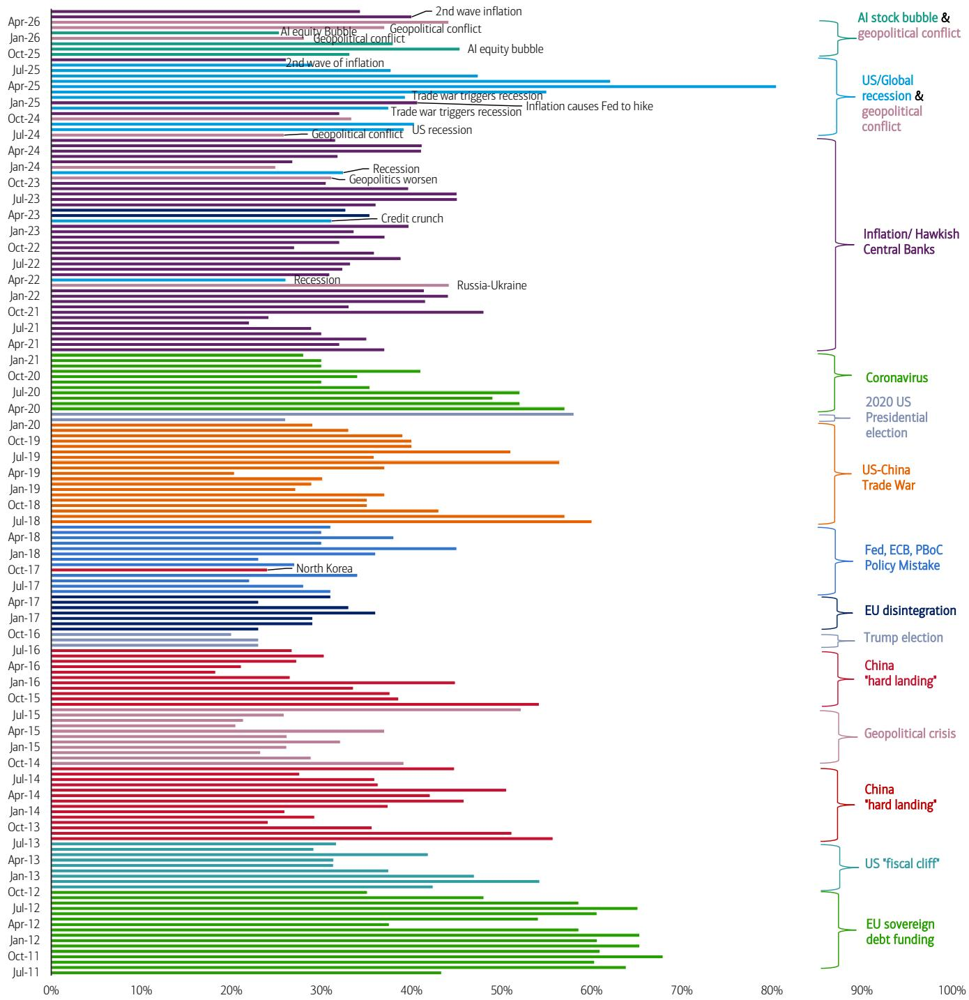
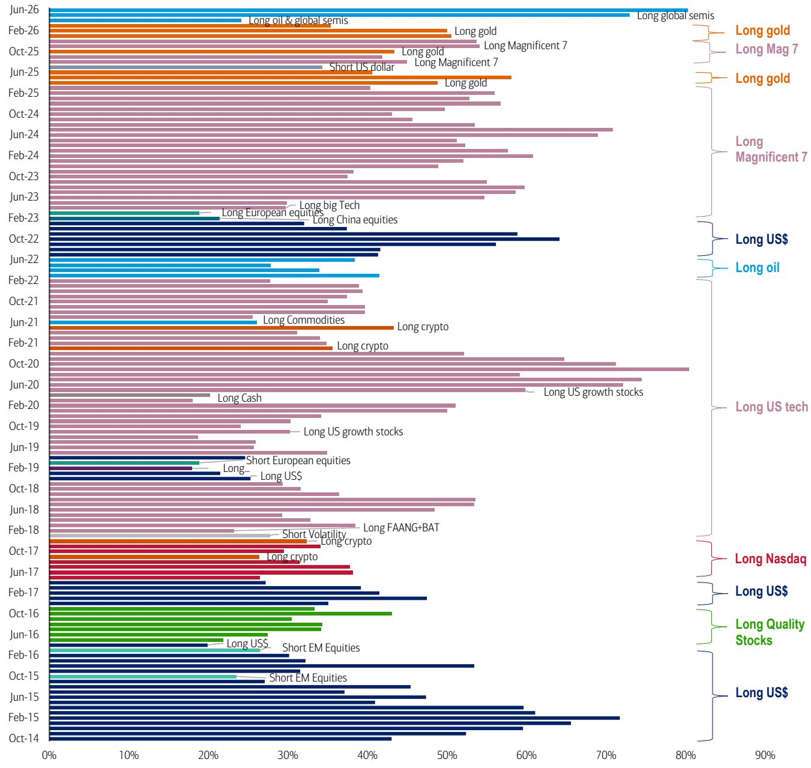
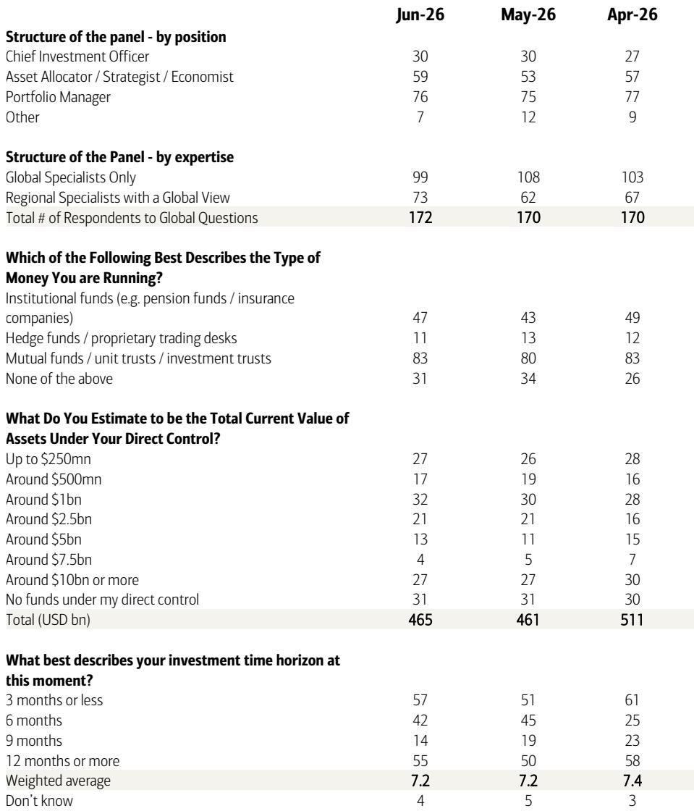

# The Bull Market Has Not Peaked, But the Conviction Has Cracked: What the June Global Fund Manager Survey Really Tells Us

The June Global Fund Manager Survey reveals a market that is still bullish but no longer complacent. Investors remain steadfastly optimistic, with the BofA Bull & Bear Indicator flashing a contrarian sell signal at 8.9, yet they have begun to hedge their bets in a way that suggests the easy money has been made. Cash levels rose from 3.9% to 4.1%, equity overweight was trimmed from 50% to 38%, and technology exposure was reduced from 33% to 26%. This is not the behavior of a market about to collapse, but it is the behavior of a market entering a more fragile and selective phase. The core argument of this analysis is that the current positioning reflects a "frozen bull" — a cohort of investors who still believe in the macro recovery but are increasingly wary of the two biggest risks on the horizon: a second wave of inflation and an AI bubble that has reached unprecedented crowding. The strategic implication is clear: the next leg of the market will not be driven by broad beta but by the ability to navigate a regime shift in interest rate expectations and to identify the sectors that are most dislocated from consensus.

Why now matters is because the survey captures a rare moment of tension. Global growth and profit optimism have risen to three-month highs, yet expectations for higher short-term interest rates have surged to their highest level since September 2022. A full 40% of fund managers now expect the Federal Reserve to hike rates at least once in the next twelve months, up from just 16% in May. This is a dramatic repricing of the rate outlook, and it is happening alongside a macroeconomic narrative that has shifted from "hard landing" fears to a split between "soft landing" (47%) and "no landing" (40%). The market is pricing in a scenario where growth holds up but inflation refuses to die, forcing central banks to keep policy tighter for longer. That is a recipe for a style rotation, not a systemic sell-off. The question every investor must answer is whether they are positioned for that rotation or still clinging to the trades that worked in the first half of the year.

## The Crowding of Semiconductors Has Reached an All-Time High, and That Is a Contrarian Signal, Not a Crash Signal

The single most striking data point in the June survey is that 80% of fund managers now identify "long global semiconductors" as the most crowded trade. This is not just a high reading; it is an all-time record in the history of the survey. In April, that figure was 24%. In two months, the trade has gone from interesting to ubiquitous. The natural instinct is to interpret extreme crowding as a signal of an imminent reversal. But the survey data suggests a more nuanced conclusion. When asked what stage of the investment cycle AI stocks are currently in, 56% of respondents said "boom" — defined as a phase where prices gain momentum and fear of missing out attracts more participants. Only 21% said "euphoria," the stage where prices and valuations skyrocket to extremes and danger becomes visible.

This distribution matters. In previous market cycles, the transition from "boom" to "euphoria" has been the inflection point where crowded trades begin to unwind violently. That transition has not yet happened. The majority of investors still see the AI trade as having more buyers to come, not as a speculative mania that is about to end. The strategic implication is that semiconductor and AI stocks may continue to grind higher, but the risk-reward is deteriorating rapidly. The trade is no longer a source of alpha; it is a source of beta that everyone already owns. The real opportunity lies not in joining the crowd but in understanding what the crowd is ignoring. If 80% of investors are long semiconductors, then the marginal buyer is exhausted. The next move in these stocks will depend on earnings surprises, not on positioning shifts. Investors should be asking themselves whether they have a differentiated view on AI fundamentals or whether they are simply riding a wave that has already crested in terms of sentiment.

## The Repricing of Rate Expectations Is the Most Underappreciated Macro Shift in the Survey

While the AI bubble dominates the headlines, the more consequential shift in the June survey is the dramatic repricing of interest rate expectations. A net 34% of investors now expect higher short-term rates, the highest reading since September 2022. This is a complete reversal from just a few months ago, when the consensus was for a series of cuts. The breakdown is even more telling: 40% of fund managers expect at least one Fed hike in the next twelve months, up from 16% in May, while only 28% expect at least one cut, down from 50% last month. Furthermore, 55% of respondents expect the new Fed chair to deliver a "hawkish hold" at the upcoming meeting, with only 33% expecting a dovish signal.

This repricing has not yet been fully absorbed into asset allocation decisions. Equity investors trimmed their overweight but did not rotate aggressively into defensive sectors. Bond allocations were trimmed, and the most crowded trade remains a high-beta technology play. There is a disconnect between the macro outlook and the portfolio construction. The survey suggests that fund managers are intellectually aware that rates are likely to stay higher for longer, but they have not yet acted on that conviction in a meaningful way. This creates an opportunity for those who are willing to front-run the inevitable rotation. If the Fed does indeed deliver a hawkish hold and the market begins to price a higher terminal rate, the stocks that will suffer most are those with the longest duration of earnings — precisely the technology and semiconductor names that are currently the most crowded. Conversely, value sectors, financials, and commodities could benefit from a regime of higher growth and higher rates.

The contrarian trades identified in the survey — long bonds, Europe, consumer, and REITs, while short commodities, semis, materials, and banks — are effectively a bet that the rate repricing will prove temporary. That is a plausible thesis, but it is not a consensus thesis. The smart money may be positioning for a scenario where inflation recedes and the Fed is forced to pivot back to accommodation. But the survey data suggests that the majority of fund managers are not yet convinced. They are stuck in the middle, unwilling to fully embrace the reflation trade and unwilling to abandon the growth trade. This indecision is itself a signal that volatility is likely to increase.

## The Biggest Tail Risks Have Shifted From Geopolitics to Inflation and AI, and That Changes the Playbook

The evolution of tail risk perceptions in the survey is a powerful narrative in itself. Two months ago, geopolitical conflict was the dominant concern, cited by 44% of respondents. In June, that figure has collapsed to 12%. The market has effectively priced out the risk of a major escalation, or at least concluded that the immediate threat has passed. In its place, two new risks have surged: a second wave of inflation (34%) and an AI bubble (28%). These are not exogenous shocks; they are endogenous risks generated by the market's own success. The inflation risk is a direct consequence of the "no landing" scenario, where growth remains resilient and the labor market stays tight, preventing inflation from returning to target. The AI bubble risk is a direct consequence of the extraordinary returns in technology stocks, which have created a self-reinforcing cycle of inflows and price appreciation.

This shift from geopolitical to financial risks has important implications for portfolio construction. Geopolitical risks are typically diversifiable — they tend to lift gold, oil, and defense stocks while hurting cyclicals and emerging markets. Financial risks, by contrast, are more systemic and tend to affect all risk assets in a correlated fashion. A second wave of inflation would force central banks to tighten policy more aggressively, which would compress valuations across the board. An AI bubble bursting would likely trigger a sharp but potentially brief correction in growth stocks, with spillover effects into the broader market. The playbook for the second half of the year should therefore focus on hedging against these two scenarios. Duration is the enemy in an inflation scare, so long-duration bonds and high-multiple growth stocks are the most vulnerable. Commodities, real assets, and value stocks are the natural hedges.

The survey also provides a useful contrarian framework. The trades that are most hated — long bonds, Europe, consumer stocks, and REITs — are all positioned for a scenario where growth slows and inflation falls. That is not the consensus view, which is why these trades offer asymmetric upside. The key question is whether the consensus is wrong. The survey data cannot answer that question, but it can tell us where the most pain is likely to occur if the consensus is wrong. If inflation does recede and the Fed does cut, the crowded long semiconductor trade will suffer severe multiple compression. If inflation stays high and the Fed holds, the crowded trade will suffer from a reassessment of earnings sustainability. Either way, the trade that everyone owns is the trade that is most vulnerable.

## What the Survey Does Not Answer: The Critical Missing Piece Is the Earnings Trajectory

For all its depth, the June Global Fund Manager Survey leaves a critical question unanswered. It tells us what investors think about growth, inflation, rates, and positioning, but it does not tell us what they think about earnings. The survey asks about profit optimism, which rose to a three-month high, but that is a sentiment indicator, not a fundamental forecast. The real question for the second half of the year is whether earnings can validate the current valuation levels. The S&P 500 is trading at a forward P/E that is well above its historical average, and the technology sector is trading at an even larger premium. If earnings growth disappoints, the multiple will have to compress. If earnings growth surprises to the upside, the market can continue to grind higher even if rates rise.

The survey also does not address the potential impact of the US midterm elections, which are now just a few months away. The survey shows that 42% of investors expect a split outcome (Democratic House, Republican Senate), which is essentially a status quo scenario. But only 22% expect a Democratic sweep, down from 36% two months ago. The market is not pricing any significant policy change from the election, but that could be a mistake. A surprise outcome could trigger a reassessment of fiscal policy, regulation, and sector-specific risks. Investors who are positioned for a continuation of the current policy regime may be caught off guard if the election produces a different result.

Finally, the survey does not address the question of liquidity. The rise in cash levels from 3.9% to 4.1% is small in absolute terms, but it represents a significant shift in marginal demand for risk assets. If cash levels continue to rise, it will signal that investors are becoming more defensive. If cash levels stabilize or fall, it will suggest that the current level of bullishness is sustainable. The direction of cash levels over the next two months will be one of the most important indicators to watch.

## How to Use This Survey as a Decision Framework

The June Global Fund Manager Survey is not a forecast; it is a snapshot of consensus. The value of a survey like this lies not in following the consensus but in identifying where the consensus is most vulnerable to being wrong. The following framework can help investors translate the survey data into actionable decisions.

First, identify the trades that are most crowded and ask whether the underlying fundamentals support the positioning. The long semiconductor trade is the most crowded in the history of the survey. The fundamental case for AI is strong, but the valuation and positioning suggest that the easy money has been made. Investors should consider reducing exposure to this trade or hedging it with puts or short positions in related ETFs.

Second, identify the trades that are most unloved and ask whether the consensus is too pessimistic. The contrarian trades in the survey — long bonds, Europe, consumer, and REITs — are all positioned for a slowdown that the majority of investors do not expect. If the economy does slow, these trades will outperform. If the economy remains strong, they will underperform. The key is to have a view on the macro outcome and position accordingly.

Third, monitor the rate repricing. The sharp increase in expectations for Fed hikes is the most important macro shift in the survey. If this repricing continues, it will favor value, financials, and commodities over growth and technology. If the repricing reverses, the growth trade will regain its momentum. Investors should be prepared to rotate quickly if the macro narrative changes.

Fourth, use the tail risk distribution as a guide to portfolio hedging. The two biggest tail risks are a second wave of inflation and an AI bubble. A portfolio that is hedged against these two scenarios will be better positioned to withstand a shock. Inflation hedging can be achieved through commodities, TIPS, and value stocks. AI bubble hedging can be achieved through short positions in high-multiple technology stocks or through put options on the Nasdaq.

The bottom line is that the June survey paints a picture of a market that is still bullish but increasingly nervous. The conviction is cracking, and the positioning is becoming more defensive. This is not the setup for a crash, but it is the setup for a rotation. The investors who will outperform in the second half of the year are those who are willing to go against the consensus and position for the scenarios that the crowd is ignoring.

Join the community to read the full report and review the original charts.

*This article is for learning and discussion only and does not constitute investment advice.*

Personal reading notes and learning share only. Not investment advice.

