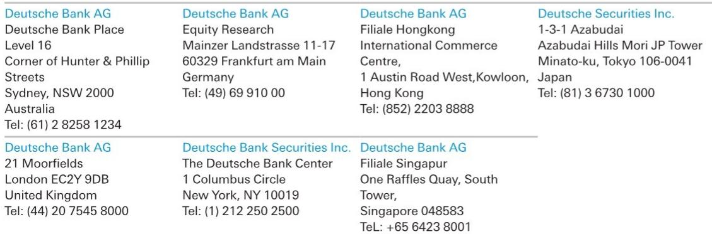
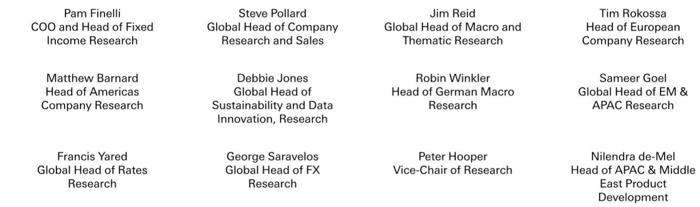
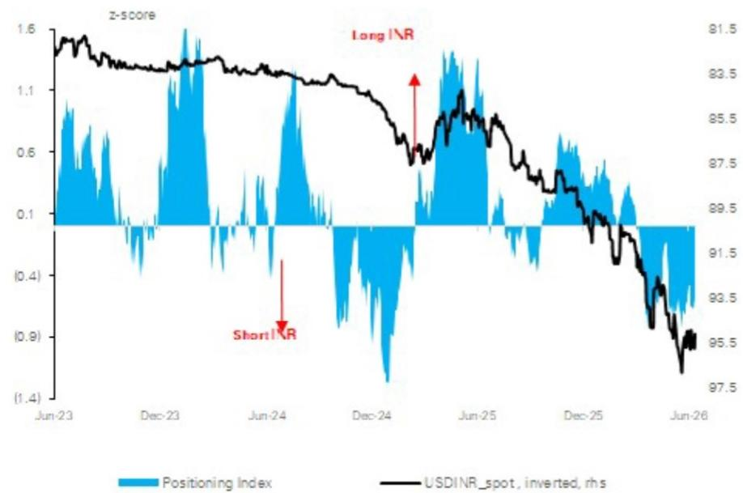

# A US-Iran Peace Deal Will Reshape Currency Markets: These Four Trades Offer the Clearest Risk-Reward

The prospect of a US-Iran peace deal represents more than a geopolitical milestone. It is a structural shift in global energy logistics, trade flows, and risk pricing. For currency investors, the implications are immediate and measurable. The core thesis is straightforward: the faster supertankers can resume full transit through the Strait of Hormuz, the more certain currencies will rally. This is not a speculative call on sentiment. It is a trade built on the mechanics of oil dependency, terms-of-trade exposure, and positioning extremes.

The report from a global investment bank identifies four currencies—the Swedish krona, the South African rand, the Chilean peso, and the Indian rupee—as the most compelling beneficiaries. Each offers a distinct pathway to appreciation, yet they share a common catalyst: the removal of an oil risk premium that has distorted relative value for months. The window for entry is narrowing. Positioning data suggests the market has only partially priced in the deal. The asymmetry favors those who act before the consensus catches up.

Why now matters is a function of timing. The conflict-driven underperformance in these currencies has created a dislocation that is unlikely to persist once the deal is finalized. The risk of being late outweighs the risk of being early. The following analysis unpacks the logic behind each trade, the second-order implications for portfolio construction, and the questions the report leaves unanswered.

## The Swedish Krona Is the Most Mispriced G10 Currency, and the Energy Channel Is the Reason

The krona has been the worst-performing developed-market currency against the dollar since the conflict began in March, with a cumulative decline of 3.5 percent. This underperformance is anomalous. Sweden is a mild energy importer with a pro-cyclical domestic economy that should benefit from lower oil prices and improved global growth prospects. The disconnect between the krona's fundamental positioning and its price action is the central opportunity.

The report frames the krona as a higher-beta version of the euro. This is a useful heuristic. When the euro rallies on improved risk sentiment, the krona should rally more. When the euro weakens, the krona should fall further. Since March, however, the krona has underperformed even this elevated beta relationship. The gap represents a catch-up trade waiting to happen.

Domestic factors reinforce the case. Swedish growth is on track to exceed 2 percent this year, supported by fiscal stimulus and increased defense spending. The rate market is not pricing an overly hawkish central bank, which removes the risk of a policy-driven headwind. Positioning data shows the market remains net short the krona, meaning any positive catalyst will trigger a squeeze. The peace deal is that catalyst.

The open question is whether the krona's recovery will be a one-off revaluation or the beginning of a sustained trend. The answer depends on the durability of the growth differential between Sweden and the euro area. If Swedish outperformance persists into the second half of the year, the krona could re-rate higher than current estimates suggest. If the euro area catches up, the catch-up trade may prove short-lived.

## The South African Rand Offers a Multi-Layered Hedge Against Oil Disruption, but the Domestic Story Is Equally Important

The rand has remained resilient throughout the conflict, a fact that might surprise investors who associate South Africa with commodity-driven volatility. The resilience is not accidental. High real interest rates, a still-improving domestic backdrop, and an undervalued currency have provided a buffer against external shocks. The peace deal adds a new layer of support.

The most immediate benefit is lower oil prices. South Africa is a net oil importer, and every dollar decline in the price of crude improves the country's terms of trade. But the report identifies additional channels that are less obvious. Renewed access to fertilizer imports could boost agricultural output, and a recovery in tourism flows would provide a further tailwind for the current account. Gold prices may also benefit from a reduction in geopolitical uncertainty, and South Africa remains a significant gold producer.

The domestic story is equally supportive. Growth and fiscal expectations have been revised upward. Politics has remained relatively benign by South African standards. Model-based estimates continue to suggest the rand is cheap on a purchasing power parity basis. The South African Reserve Bank has a strong incentive to maintain a hawkish bias given the shift toward a lower inflation target, which leaves the rand with a meaningful real-rate advantage over its peers.

The unanswered question is whether the rand can sustain its outperformance once the initial relief rally fades. The domestic economy faces structural challenges that are not resolved by a peace deal. High unemployment, infrastructure constraints, and governance risks remain. The rand's rally may be real, but it is not a free option. Investors need to monitor whether the domestic improvements are cyclical or structural.

## The Chilean Peso Has Been Held Back by Oil, but a Closing Current Account Deficit Could Unlock Significant Appreciation

The Chilean peso is the most undervalued currency in Latin America according to the report's valuation framework. The disconnect between its price and its fundamentals is striking. Chile is a major copper exporter, and copper prices remain elevated. Yet the peso has underperformed its terms of trade, largely because higher oil prices have widened the current account deficit.

The logic is simple. Chile imports oil and exports copper. When oil prices rise, the trade balance deteriorates. When copper prices rise, the trade balance improves. The net effect depends on the relative magnitude of the two moves. Since the conflict began, the oil channel has dominated. The peace deal reverses that dynamic. If oil prices recede and copper remains elevated, the current account deficit should close by year end. That would be clearly positive for the peso.

Positioning data supports the case. While short positions have been partially pared, the peso still screens as the best value currency in the region. The combination of cheap valuation, improving external backdrop, and potential for a current account improvement creates a compelling risk-reward profile. The peso has room to appreciate significantly if the macro conditions align.

The open question is whether copper prices can remain elevated in a lower oil price environment. The relationship between the two commodities is not fixed. A peace deal could reduce risk premiums across the board, but it could also signal a slowdown in global growth if it reflects a broader de-escalation of geopolitical tensions. Copper is sensitive to growth expectations. If the peace deal is interpreted as a negative signal for global demand, the peso's copper tailwind could weaken.

## The Indian Rupee Is the Most Direct Oil Sensitivity Trade, and Positioning Data Suggests the Move Has Only Just Begun

India is one of the world's largest oil importers, and the rupee is correspondingly sensitive to changes in the price of crude. The report estimates that the market has unwound only about a third of the long-dollar positioning that built up during the conflict. The remaining two-thirds represent fuel for a potential rally.

The Reserve Bank of India has taken forceful measures to attract inflows and improve sentiment. These include steps to encourage short-term capital inflows and longer-term bond market reforms that increase the likelihood of Euroclear settlement and global aggregate index inclusion. The combination of lower oil prices, policy support, and residual short positioning creates a powerful setup.

The rupee's sensitivity to oil is well understood, but the report highlights a nuance that is often overlooked. The positioning unwind is not a linear process. The first third of the unwind happened quickly, driven by the initial news of a potential deal. The remaining two-thirds may take longer to materialize, as it requires confirmation of the deal and evidence that oil prices are sustainably lower. This creates a multi-month opportunity for investors who are willing to be patient.

The unanswered question is whether the RBI's measures are sufficient to attract the kind of structural inflows that would sustain a rupee rally beyond the initial positioning squeeze. Index inclusion is a multi-year process, and the timeline is uncertain. If inflows disappoint, the rupee could struggle to hold its gains. The trade is high conviction, but it is not without risk.

## The Report Leaves Unanswered Questions About the Dollar, the Euro, and the Sequencing of Trades

The report recommends paring longs in all four currencies against either the dollar or the euro, depending on one's view of the Federal Reserve and the European Central Bank. It explicitly states that its EUR/USD view is neutral, which means the choice of funding currency is left to the investor. This is a sensible acknowledgment of uncertainty, but it also reveals a gap in the analysis.

The sequencing of the peace deal matters for currency markets. If the deal is announced before the Fed signals a shift in policy, the dollar could rally on improved risk sentiment, which would dampen the returns on the proposed trades. If the deal is announced after the Fed has already pivoted, the dollar could weaken, amplifying the gains. The report does not resolve this timing question.

Similarly, the euro's role is ambiguous. The krona is explicitly linked to the euro, but the relationship is not one-to-one. If the euro strengthens on a peace deal, the krona should strengthen more. But if the euro weakens, the krona could weaken as well. The trade depends on being right about both the peace deal and the euro's direction. That is two bets, not one.

The report also does not address the possibility that the peace deal could be partial or delayed. A phased agreement could reduce the immediate impact on oil prices, which would weaken the case for the proposed trades. Investors need to consider the range of possible outcomes and size their positions accordingly.

## A Decision Framework for Investors: Three Questions to Ask Before Entering Any of These Trades

The report provides a clear thesis, but implementing it requires a framework. Here are three questions that every investor should answer before committing capital.

First, what is your view on oil prices? The entire trade rests on the assumption that a peace deal will lead to lower oil prices. If you believe that oil prices will remain elevated regardless of the geopolitical outcome, you should not enter these trades. The currencies are all sensitive to oil, and a sustained oil rally would undermine the thesis.

Second, what is your view on the dollar? The choice of funding currency matters. If you expect the dollar to weaken, you should fund the trades in dollars. If you expect the dollar to strengthen, you should fund them in euros. The report is neutral on EUR/USD, but you cannot be neutral if you are taking a position. You need to have a view.

Third, what is your time horizon? The positioning unwind in the rupee suggests a multi-month opportunity. The krona catch-up trade could happen more quickly. The peso requires a current account improvement that may take until year end. Each trade has a different time profile, and your portfolio construction should reflect that. A single entry point may not work for all four.

The answers to these questions will determine whether these trades are appropriate for your portfolio. The report provides the raw material, but the synthesis is yours to make.

## Join the Community to Read the Full Report and Review the Original Charts

The analysis above is based on a single report from a global investment bank, but the implications extend far beyond the four currencies discussed. The peace deal, if realized, will reshape trade flows, risk premiums, and central bank policy across multiple asset classes. The full report contains additional charts on positioning, valuation, and terms-of-trade dynamics that are essential for a complete understanding of the opportunity.

Join the community to read the full report and review the original charts. The community provides access to the underlying data, the original research, and the ongoing analysis that turns a single report into a living investment framework. The questions that remain unanswered in this article are exactly the questions that the community discusses every day.

*This article is for learning and discussion only and does not constitute investment advice.*

Personal reading notes and learning share only. Not investment advice.

