June 15, 2026 10:13 PM GMT

# The Oil Manual

# 'Let the Oil Flow'

We adjust our forecast following the US/Iran MOU. We still see a tight summer ahead, and suspect Dated Brent can rebound from current levels into 3Q. However, with prospects of SoH recovery improved, our previous forecasts now appear too high. From 4Q onwards, we see Brent anchored around \$80/b.

## Key Takeaways

Our previous modelling assumptions reflected a political agreement by late July; with the MOU announced over the weekend, this has come \~2 weeks earlier  
From here, it likely takes several weeks for tanker flow to be restored; we see 50% of production back by Sept, and 80% by Dec, slightly faster than before  
Despite the disruption, a broad range of indicators has signaled weakness in physical oil markets in recent weeks; notably, unsold cargos are above-average  
The 'twin solvers' of high US exports and low China imports are the key drivers; in the short term (i.e. next weeks) they do not seem to come to an end just yet  
In the end, we still see a tight summer that can support a modest rebound, but that period now appears too short to support our previous Brent forecast

Exhibit 1: For any given month, information on tanker movements firms up over time. Based on known voyages, it appears that net seaborne oil imports into China will decline even further in June vs May, and even July is tracking below May as well.  
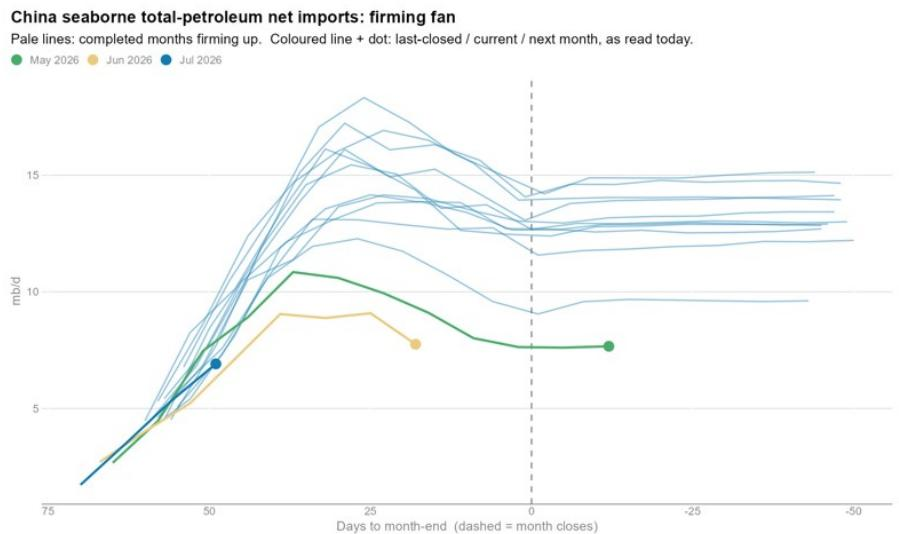

line chart

| Days to month-end | May 2026 | Jun 2026 | Jul 2026 |
| ----------------- | -------- | -------- | -------- |
| 75                | ~3       | ~3       | ~3       |
| 50                | ~8       | ~7       | ~7       |
| 25                | ~11      | ~9       | ~17      |
| 0                 | ~8       | ~8       | ~14      |
| -50               | ~8       | ~8       | ~14      |

Source: Vortexa /pit/cargo-movements vintages, MS

MS & CO. INTERNATIONAL PLC+

## Martijn Rats, CFA

Equity Analyst and Commodities Strategist

Martijn.Rats@morganstanley.com +44 20 7425-6618

## Charlotte Firkins

Commodities Strategist

Charlotte.Firkins@morganstanley.com +44 20 7425-3866

## Amy Gower (Amy Sergeant), CFA

Commodities Strategist

Amy.Gower1@morganstanley.com +44 20 7677-6937

Exhibit 2: We revise our near-term Brent price lower; our long-term forecast remains anchored around \$80/b

Dated Brent price forecasts

<table><tr><td>($/bbl)</td><td>3Q26</td><td>4Q26</td><td>1Q27</td><td>2Q27</td><td>3Q27</td><td>4Q27</td></tr><tr><td>New</td><td>90.0</td><td>80.0</td><td>80.0</td><td>80.0</td><td>80.0</td><td>80.0</td></tr><tr><td>Previous</td><td>100.0</td><td>95.0</td><td>85.0</td><td>80.0</td><td>80.0</td><td>80.0</td></tr><tr><td>Change</td><td>-10.0</td><td>-15.0</td><td>-5.0</td><td>0.0</td><td>0.0</td><td>0.0</td></tr></table>

Source: MS

## Previous research:

- The Oil Manual: How Fast Can Middle East Production Return? (1 June 2026)  
• The Oil Manual: SPR Tracker: How Much Has Been Released? What's Next? (28 May 2026)  
- The Oil Manual: Why is the Price of Oil Not Higher? (11 May 2026)  
- The Oil Manual: US Gasoline: Tight Balance; Fair Value For Now (4 May 2026)  
• The Oil Manual: Schrodinger's Strait (27 Apr 2026)  
- The Oil Manual: Hormuz Closure – Six Weeks In: Where Do We Stand? (13 Apr 2026)  
- The Oil Manual: 'Paper' vs 'Physical' Oil - A Short Primer (7 Apr 2026)

MS does and seeks to do business with companies covered in MS. As a result, investors should be aware that the firm may have a conflict of interest that could affect the objectivity of MS. Investors should consider MS as only a single factor in making their investment decision.

## For analyst certification and other important disclosures, refer to the Disclosure Section, located at the end of this report.

+= Analysts employed by non-U.S. affiliates are not registered with FINRA, may not be associated persons of the member and may not be subject to FINRA restrictions on communications with a subject company, public appearances and trading securities held by a research analyst account.

## 'Let the Oil Flow'

## Re-opening of the Strait agreed

106 days after the start of the conflict, President Trump announced yesterday that the United States and Iran have reached an intermediate agreement. Although the precise content of this MoU has not been released, both sides have indicated that it calls for 1) an end to hostilities on all fronts, 2) the opening of the Strait of Hormuz from both sides, and 3) a negotiation over Iran's nuclear programme and highly enriched uranium over a 60-day period.

In the end, this announcement came even slightly earlier than our modelling assumptions had implied. In our note How Fast Can Middle East Production Return? (1 Jun 2026), we had updated our estimate for the timing of a political break-through to 'late June'; it turned out to be 'mid-June' instead.

Much is still to be negotiated and key risks remain, but for now, this is a key step towards a de-escalation of the conflict and higher oil exports via the Strait of Hormuz.

## Trajectory for production recovery brought forward by 1-2 weeks

Full restoration of tanker flow through the Strait will first require a period for the clearing of sea mines. There are alternative routes that avoid the traditional shipping lanes, but the capacity of these routes is likely only a fraction of pre-conflict transits.

Then, some time is likely needed to rebuild commercial confidence amongst ship owners and insurance companies, and allow tankers - many of which have relocated elsewhere - to come back to the region.

Also, for production to be restored, export tanks need to be cleared first, which means that the pace at which empty tankers enter the Gulf is arguably even more important than laden tankers leaving.

For these reasons, we estimated that the ramp-up in production would start from late-July, which we now bring forward to mid-July. After that, we assume that 50% of lost production will be back by September, 80% by December, with the rest to follow in early 2027.

Exhibit 3: Outbound tanker transit are still sharply below pre-conflict levels but notably improved since early May  
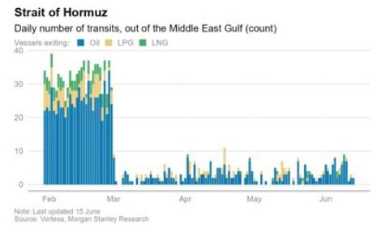

bar chart

| Date       | Oil  | LPG  | LNG  |
| ---------- | ---- | ---- | ---- |
| Feb        | 25   | 10   | 15   |
| Mar        | 10   | 5    | 10   |
| Apr        | 5    | 5    | 5    |
| May        | 5    | 5    | 5    |
| Jun        | 5    | 5    | 5    |

Exhibit 4: With that, also oil exports from the region have seen a small but notable bounce from the low  
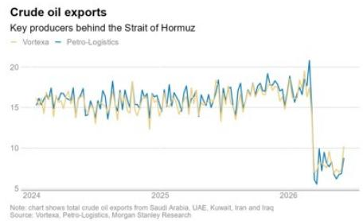

line chart

| Year | Vortexa | Petro-Logistics |
|------|---------|-----------------|
| 2024 | ~15     | ~15             |
| 2025 | ~15     | ~15             |
| 2026 | ~10     | ~10             |

## Despite ongoing supply loss, physical market has softened

By now, the cumulative supply loss from the Middle East since 1 March has reached $\sim 1.4$ billion barrels across both crude oil and refined products, relative to the same period in 2025. Nevertheless, the Brent market has softened visibly in recent weeks.

This has not only been a story of Brent futures anticipating the Strait to re-open. Dated Brent has come under pressure too, both the DFL and CFD curves have weakened in both level and structure, physical diffs have softened, the cash Dubai premium has been on a steady decline, and refined product cracks have mostly been on a downward slope too. The stand-out here is the naphtha crack spread in Asia relative to Dubai crude; this has fallen \$13/b in the last four weeks to \$(11)/b, close to its 1-year low - quite a counter-intuitive weakening for a production for which 33% of seaborne supply has been cut off by the Strait of Hormuz.

This weakening can also be seen in the overview of unsold cargoes. The table below summarises indications of unsold cargoes over the last two weeks. To be clear, the oil industry always has some cargoes that struggle to sell - it's part of the friction of buying and selling. However, we would characterise the current level as higher-than-normal and broadening. And that would be compared against 'normal' times. Considering that 11 mb/d of crude oil production is currently shut-in across the Middle East, this is quite unusual and highlights the physical weakness in the market.

Exhibit 5: We'd characterise the current number of unsold cargoes as above-normal and broadening in recent weeks  
Unsold crude cargoes - latest estimate by region/grade  
As of 15 June 2026. Trader anecdotes, not a continuous series.

<table><tr><td>Region / grade</td><td>Unsold estimate</td><td>As of</td><td>Source</td></tr><tr><td>Nigeria</td><td>July programme &quot;largely unsold&quot;; Bonny Light &amp; Forcados &quot;numerous unsold cargoes&quot;; ~15mn bl June unplaced earlier in cycle</td><td>Jun 12 / Jun 5</td><td>Platts / Argus</td></tr><tr><td>Angola</td><td>~a dozen stems (10-12 cargoes) July; ~10mn bl July explicitly unsold</td><td>Jun 12 / Jun 10</td><td>Platts / Argus</td></tr><tr><td>Congo (Djeno)</td><td>Some July cargoes unsold at ~$4/bl under Dated - &quot;not attractive enough for Chinese refiners&quot;</td><td>Jun 10</td><td>Argus</td></tr><tr><td>CPC Blend</td><td>June 2-3 cargoes; rebounded off Jan-2023 low (Jun 11) but July &quot;plenty unsold first decade&quot;, Asia arb unviable; 11-Suezmax injection lingering</td><td>Jun 9-11</td><td>Platts</td></tr><tr><td>Libya / Es Sider</td><td>7-10 June cargoes (incl. 4-5 Es Sider); unplaced Libyan barrels persist into July trade</td><td>Jun 5 / Jun 12</td><td>Platts / Argus</td></tr><tr><td>Azeri BTC / Kirkuk</td><td>Kirkuk unsold in June; Socar/Eni CPC offers went unplaced; first Basrah offers reaching Europe</td><td>Jun 3-5</td><td>Platts / Argus</td></tr><tr><td>North Sea</td><td>Forties ~1/3 of 9 June cargoes (May 26) - since cleared; Atlantic overhang still capping diffs &amp; US exports</td><td>May 26 - Jun 2</td><td>Platts</td></tr><tr><td>Mideast Gulf</td><td>Spot thin but placing July cargoes - cleared</td><td>May 26</td><td>Platts</td></tr><tr><td>Russian ESPO</td><td>&gt;50% of July programme unsold; June cargoes still unsold</td><td>Jun 12 / Jun 8</td><td>Argus / Platts</td></tr><tr><td>Brazil</td><td>Unsold July-delivery to China (late May); Aug cycle ~18mn bl taken - lower than prior</td><td>May 25-29</td><td>Argus</td></tr><tr><td>Guyana</td><td>July cycle &quot;quiet&quot;, buying limited into third week; June stragglers still offered</td><td>Jun 11</td><td>Argus</td></tr><tr><td>Canada / TMX</td><td>August injection cargoes &quot;still to be sold&quot;, count unclear</td><td>Jun 12</td><td>Argus</td></tr><tr><td>Asia-Pac condensate</td><td>July NWS unsold, pressuring August values &amp; cracks</td><td>Jun 3-5</td><td>Argus</td></tr><tr><td colspan="4">Source: Platts, Argus, MS</td></tr></table>

## High US exports, low Chinese imports...but little change expected in June

The reasons for this are the same as those discussed in prior research: unusually large exports from the United States, unusually low imports into China, and weak apparent demand.

The charts below show the first two. In rounded numbers, net exports of crude oil and refined products have increased from \~5 mb/d last year to nearly \~9 mb/d recently. At the same time, China's net imports of crude and products have declined from \~13 mb/d last year to \~7 mb/d recently. With \~4 mb/d more from the US, and \~6 mb/d less going into China, these two countries have shielded the rest of the world - including the Brent market - of 10 mb/d of tightness.

Exhibit 6: US seaborne net exports are nearly 4 mb/d higher than last year...  
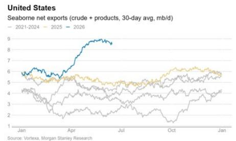

line chart

| Month | 2021-2024 | 2025 | 2026 |
|-------|-----------|------|------|
| Jan   | ~5.5      | ~5.8 | ~5.7 |
| Apr   | ~6.5      | ~5.5 | ~5.3 |
| Jul   | ~8.5      | ~5.8 | ~5.6 |
| Oct   | ~5.0      | ~5.5 | ~5.4 |
| Jan   | ~5.5      | ~5.8 | ~5.7 |

Exhibit 7: ...whilst China's seaborne net imports are down \~ 6mb/d  
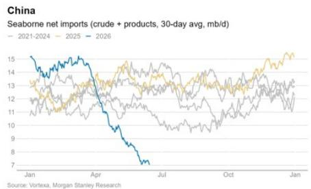

line chart

| Month | 2021-2024 | 2025 | 2026 |
|-------|-----------|------|------|
| Jan   | 15.0      | 13.0 | 12.0 |
| Apr   | 9.0       | 14.0 | 13.0 |
| Jul   | 7.0       | 13.0 | 14.0 |
| Oct   | 11.0      | 14.0 | 13.0 |
| Jan   | 13.0      | 15.0 | 14.0 |

It is unlikely, however, that both countries can sustain this. The key question is, of course, when will this come to an end? We previously mentioned that if US exports were to fall and/or China's imports were to increase before the Strait of Hormuz was open, the Brent market could have a period of strength again. That may still happen, but it has become less likely.

We can estimate US exports and China imports based on known future tanker movements. Naturally, fewer tanker movements are known further in advance, but they 'firm up' as time goes by. The two exhibits below show the 'firming fans' for both time series - they show how known tanker movements related to US exports and China imports have developed over time.

US net exports for June 2026 are currently tracking the path of April, so is still likely to end up in the 8.5-9 mb/d range, broadly where the May level ended as well. It is still early to judge July exports on this basis, which are still tracking below both the May and June trajectories so far, but are still above any of the previous 12 months.

Exhibit 8: Based on the pace at which known tanker movements firm up, seaborne net exports from the US are tracking similar to April, which is also where May levels ended up  
US seaborne total-petroleum net exports: firming fan  
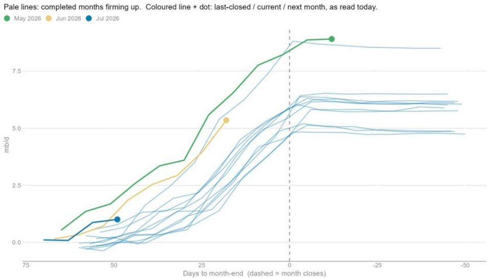

line chart

| Days to month-end | May 2026 | Jun 2026 | Jul 2026 |
| ----------------- | -------- | -------- | -------- |
| 75                | 0.0      | 0.0      | 0.0      |
| 50                | 1.0      | 1.0      | 1.0      |
| 25                | 3.0      | 3.0      | 3.0      |
| 0                 | 5.0      | 5.0      | 5.0      |
| -25               | 8.0      | 8.0      | 8.0      |
| -50               | 8.0      | 8.0      | 8.0      |

Source: Vortexa /pit/cargo-movements vintages, MS

Known tanker movements for June imply even lower net imports into China than for May, and data for July is also still tracking below the May path so far:

Exhibit 9: Along similar lines, known tanker movements in/out of China suggest that June net imports will likely be even lower than May, and July is also tracking below the May level as well  
China seaborne total-petroleum net imports: firming fan  
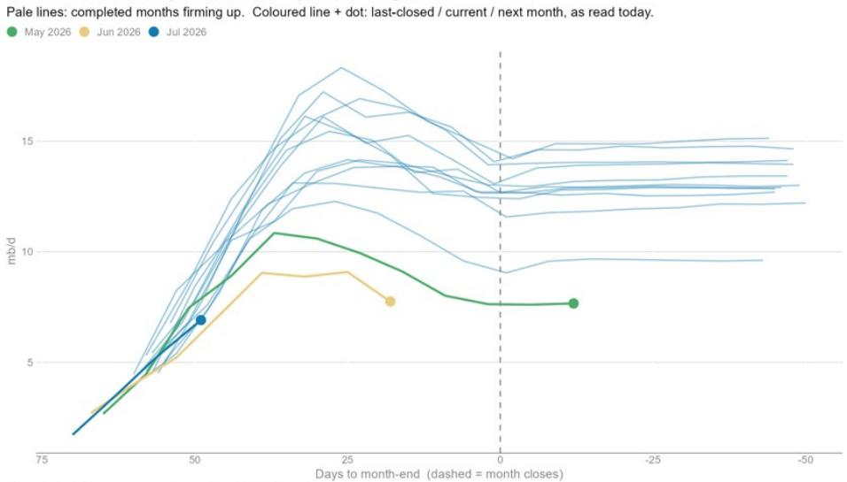

line chart

| Days to month-end | May 2026 | Jun 2026 | Jul 2026 |
| ----------------- | -------- | -------- | -------- |
| 75                | ~3       | ~3       | ~3       |
| 50                | ~7       | ~7       | ~7       |
| 25                | ~11      | ~9       | ~18      |
| 0                 | ~8       | ~8       | ~14      |
| -50               | ~8       | ~8       | ~14      |

Source: Vortexa /pit/cargo-movements vintages, MS

In addition to this, we can track China's buying activity by aggregating individual spot crude deals entered into by Chinese refiners, trading houses and other companies. Spot deals usually only cover \~6 mb/d out of \~11 mb/d of crude oil imports; the remainder comes from deliveries under longer-term contracts.

Spot deals supplied an unusually low $\sim 4.5$ mb/d in April, and an even lower $\sim 4.1$ mb/d in

May. So far, known-deals for June are tracking even lower than the paths for April and May, and data for July and August shows little to no improvement either:

Exhibit 10: Known spot crude deals entered into by Chinese players do not signal a pickup in buying interest yet

China crude deals tracking  
Known crude supply agreements, relative to last day of delivery month (mb/d)  
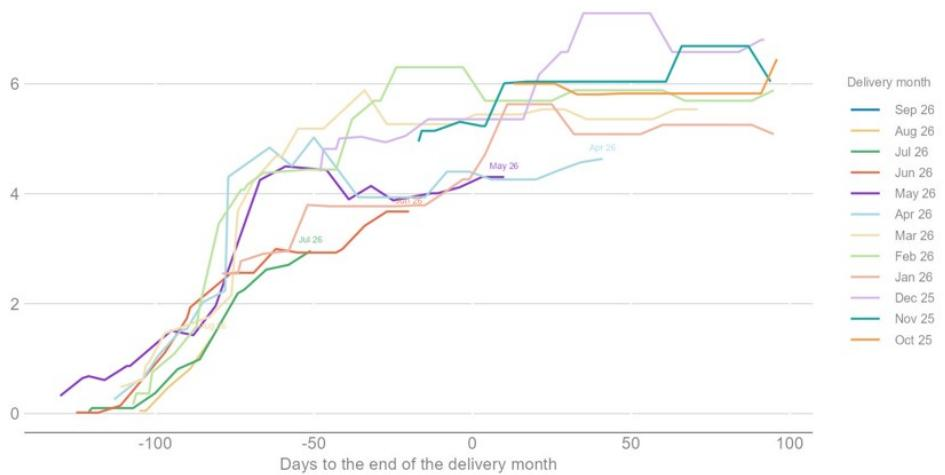

line chart

| Days to the end of the delivery month | Sep 26 | Aug 26 | Jul 26 | Jun 26 | May 26 | Apr 26 | Mar 26 | Feb 26 | Jan 26 | Dec 25 | Nov 25 | Oct 25 |
| -------------------------------------- | ------ | ------ | ------ | ------ | ------ | ------ | ------ | ------ | ------ | ------ | ------ | ------ |
| -100                                   | 0.5    | 0.3    | 0.4    | 0.6    | 0.7    | 0.8    | 0.9    | 1.0    | 1.1    | 1.2    | 1.3    | 1.4    |
| -50                                    | 1.5    | 1.3    | 1.4    | 1.6    | 1.7    | 1.8    | 1.9    | 2.0    | 2.1    | 2.2    | 2.3    | 2.4    |
| 0                                      | 2.5    | 2.3    | 2.4    | 2.6    | 2.7    | 2.8    | 2.9    | 3.0    | 3.1    | 3.2    | 3.3    | 3.4    |
| 50                                     | 3.5    | 3.3    | 3.4    | 3.6    | 3.7    | 3.8    | 3.9    | 4.0    | 4.1    | 4.2    | 4.3    | 4.4    |
| 100                                    | 4.5    | 4.3    | 4.4    | 4.6    | 4.7    | 4.8    | 4.9    | 5.0    | 5.1    | 5.2    | 5.3    | 5.4    |

Source: Argus, MS

Finally, on demand. We estimate that global refinery crude runs were down \~5.8 mb/d year-on-year in May, and with this, global crude demand was down by the same. This too has had a significant impact on crude oil prices.

However, our strong suspicion is that this sharply overstates the underlying demand decline. Instead, this decline in crude demand - and the associated decline in refined products production - is largely driven by delayed purchasing, not necessarily lower consumption. We have limited data to describe this effect fully on a global basis, but Exhibit 11 provides an example:

Exhibit 11: Expecting the Strait of Hormuz to open soon, German households have not been filling their heating oil tanks - consumption has continued but buying is delayed  
German heating oil tank fill  
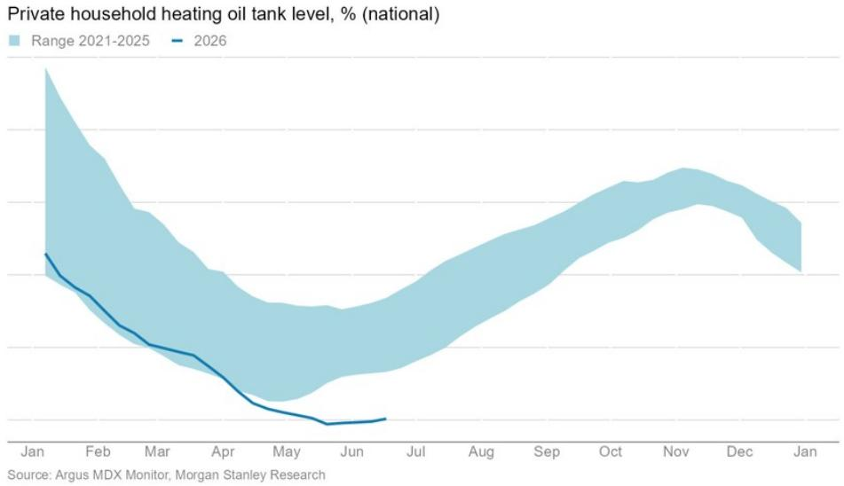

area chart

Private household heating oil tank level, % (national)
| Month | 2021-2025 Range (%) | 2026 |
| :--- | :--- | :--- |
| Jan | ~98 | ~75 |
| Feb | ~85 | ~65 |
| Mar | ~75 | ~55 |
| Apr | ~65 | ~45 |
| May | ~60 | ~30 |
| Jun | ~55 | ~15 |
| Jul | ~60 | ~20 |
| Aug | ~65 | ~30 |
| Sep | ~70 | ~40 |
| Oct | ~75 | ~50 |
| Nov | ~80 | ~60 |
| Dec | ~75 | ~55 |
| Jan | ~70 | ~45 |

Exhibit 11 shows data on the average fill rate of heating oil tanks owned by German households. In total, approximately 4 million German households use heating oil (which is practically identical to diesel) and have their own storage facility for this. In total, their tank capacity is close to 100 million barrels - i.e. not small.

The fill rate of these tanks typically follows a seasonal pattern - they draw over the winter, and build in the summer. However, this has not been the case recently. By now, German households would typically have started to refill storages ahead of next winter but they have not done so yet in 2026. The most likely reason: they too have been waiting from the Strait of Hormuz to re-open, expecting to buy at lower prices later.

In short: they continue to consume, but they are not buying. In the end, 'buying' is what matters for oil prices. Data on tertiary inventories (i.e. inventories held by end-consumers directly) is notoriously limited; this is the only real example we have. However, given that the re-opening of the Strait has been imminent at any point over the last 3 months, our strong suspicion is that the buying-vs-consumption pattern of German heating oil consumers has been symptomatic for many other part of the oil complex.

## Putting it all together - still a tight summer, but prices likely remain lower than estimates before

In the end our balances still show a tight summer. For 3Q, we estimate a deficit of 3.4 mb/d, with observable stocks likely drawing 2.1 mb/d, of which 1.1 mb/d in the OECD (which weighs heavier in price formation). However, with yesterday's MOU announcement, this undersupply is likely to remain limited to 3Q - that's it. With our current supply recovery assumptions, the oil market is likely to be back in balance in 4Q again.

We've previously estimated that in a balanced market with inventories at average levels, Brent is likely anchored around \~\$80/b. Therefore, that is what we pencil in for 4Q (down from \$95/b before).

Exhibit 12: We lower our Brent forecast for the next few quarters

<table><tr><td colspan="7">Dated Brent price forecasts</td></tr><tr><td>($/bbl)</td><td>3Q26</td><td>4Q26</td><td>1Q27</td><td>2Q27</td><td>3Q27</td><td>4Q27</td></tr><tr><td>New</td><td>90.0</td><td>80.0</td><td>80.0</td><td>80.0</td><td>80.0</td><td>80.0</td></tr><tr><td>Previous</td><td>100.0</td><td>95.0</td><td>85.0</td><td>80.0</td><td>80.0</td><td>80.0</td></tr><tr><td>Change</td><td>-10.0</td><td>-15.0</td><td>-5.0</td><td>0.0</td><td>0.0</td><td>0.0</td></tr><tr><td colspan="7">Source: MS</td></tr></table>

Given the market is still likely in a considerable deficit in 3Q, we suspect Dated Brent prices will average above that level over the summer, especially as demand is likely to firm up from here. However, given that the 'twin-solvers' of high US exports and low Chinese imports seem to continue for now, the spread over \$80/b can only be so much. With that in mind, we peg our average 3Q Dated Brent forecast at \$90/b, down from \$100/b before.

In our experience, 'next year's balance' has a habit of looking soft in the middle of the year before - and so it is again this year. In the end, there is often an unexpected supply outage somewhere that changes this outcome, but modelling the 'unknown unknowns' is not straightforward. Based on our current assumptions, the oil market returns to a surplus again in 2027, with observable stocks building 2.4 mb/d.

If \$80/b is the reference price for a balanced market, in principle this suggests prices lower than that. However, there are offsetting effects. We now know that the Strait of Hormuz can be closed, and how much oil will flow through the Strait next year exactly is still unknown. Also, more inventory filling may be required. Based on heating oil inventories held by German households, our suspicion is that tertiary inventories have drawn significantly. On top of that, several countries are likely to expand/start building SPRs - and building SPRs acts like 'demand'. With that in mind, we stick to a \$80/b Brent forecast for 2027, which implies a small downgrade to our 1Q 27 forecast (which was \$85/b).

## Supply/demand balance

Exhibit 13:  
Total oil liquids

<table><tr><td></td><td>2025</td><td>1Q26</td><td>2Q26</td><td>3Q26</td><td>4Q26</td><td>2026</td><td>1Q27</td><td>2Q27</td><td>3Q27</td><td>4Q27</td><td>2027</td><td>&#x27;25-26</td><td>&#x27;26-27</td><td></td></tr><tr><td>Demand</td><td>104.9</td><td>104.6</td><td>101.0</td><td>103.8</td><td>105.5</td><td>103.7</td><td>104.8</td><td>105.1</td><td>106.3</td><td>107.3</td><td>105.9</td><td>-</td><td>1.2</td><td>2.1</td></tr><tr><td>OECD</td><td>45.9</td><td>45.7</td><td>44.7</td><td>45.9</td><td>45.8</td><td>45.5</td><td>45.2</td><td>45.3</td><td>46.0</td><td>46.0</td><td>45.6</td><td>-</td><td>0.3</td><td>0.1</td></tr><tr><td>Non-OECD</td><td>59.0</td><td>59.0</td><td>56.3</td><td>57.9</td><td>59.7</td><td>58.2</td><td>59.6</td><td>59.8</td><td>60.3</td><td>61.2</td><td>60.2</td><td>-</td><td>0.9</td><td>2.0</td></tr><tr><td>Non-OPEC supply</td><td>72.2</td><td>71.7</td><td>72.0</td><td>73.4</td><td>73.7</td><td>72.7</td><td>74.0</td><td>74.2</td><td>74.7</td><td>75.2</td><td>74.5</td><td></td><td>0.5</td><td>1.8</td></tr><tr><td>United States C+C</td><td>13.6</td><td>13.6</td><td>14.0</td><td>13.9</td><td>14.0</td><td>13.9</td><td>14.1</td><td>14.1</td><td>14.1</td><td>14.1</td><td>14.1</td><td></td><td>0.3</td><td>0.2</td></tr><tr><td>FSU C+C</td><td>10.3</td><td>10.0</td><td>10.0</td><td>10.3</td><td>10.3</td><td>10.2</td><td>10.3</td><td>10.2</td><td>10.2</td><td>10.3</td><td>10.2</td><td>-</td><td>0.1</td><td>0.1</td></tr><tr><td>Other</td><td>48.3</td><td>48.1</td><td>48.0</td><td>49.2</td><td>49.3</td><td>48.7</td><td>49.6</td><td>49.9</td><td>50.4</td><td>50.7</td><td>50.2</td><td></td><td>0.3</td><td>1.5</td></tr><tr><td>OPEC NGLs and condensate</td><td>5.5</td><td>5.2</td><td>3.7</td><td>4.7</td><td>5.1</td><td>4.7</td><td>5.3</td><td>5.4</td><td>5.4</td><td>5.4</td><td>5.4</td><td>-</td><td>0.9</td><td>0.7</td></tr><tr><td>Call on OPEC crude</td><td>27.2</td><td>27.7</td><td>25.4</td><td>25.7</td><td>26.7</td><td>26.4</td><td>25.6</td><td>25.6</td><td>26.3</td><td>26.7</td><td>26.0</td><td>-</td><td>0.9</td><td>0.3</td></tr><tr><td>OPEC crude</td><td>29.6</td><td>27.3</td><td>19.6</td><td>22.3</td><td>27.4</td><td>24.2</td><td>29.2</td><td>30.0</td><td>30.4</td><td>30.5</td><td>30.0</td><td>-</td><td>5.5</td><td>5.8</td></tr><tr><td>Implied balance</td><td>2.4</td><td>0.4</td><td>5.8</td><td>3.4</td><td>0.7</td><td>2.2</td><td>3.7</td><td>4.4</td><td>4.1</td><td>3.8</td><td>4.0</td><td>-</td><td>4.6</td><td>6.2</td></tr><tr><td>Misc to bal</td><td>1.2</td><td>1.0</td><td>3.8</td><td>1.3</td><td>0.3</td><td>0.9</td><td>1.5</td><td>1.8</td><td>1.7</td><td>1.5</td><td>1.6</td><td></td><td>2.1</td><td>2.6</td></tr><tr><td>Observed stock change</td><td>1.2</td><td>1.4</td><td>2.0</td><td>2.1</td><td>0.4</td><td>1.3</td><td>2.2</td><td>2.6</td><td>2.5</td><td>2.2</td><td>2.4</td><td>-</td><td>2.5</td><td>3.6</td></tr><tr><td colspan="15">of which:</td></tr><tr><td>SPR (IEA members)</td><td>0.0</td><td>0.1</td><td>2.0</td><td>1.0</td><td>-</td><td>0.8</td><td>0.5</td><td>0.5</td><td>0.5</td><td>0.5</td><td>0.5</td><td>-</td><td>0.8</td><td>1.3</td></tr><tr><td>China</td><td>0.3</td><td>0.6</td><td>0.1</td><td>-</td><td>-</td><td>0.1</td><td>0.3</td><td>0.3</td><td>0.3</td><td>0.3</td><td>0.3</td><td>-</td><td>0.2</td><td>0.2</td></tr><tr><td>Other non-OECD</td><td>0.1</td><td>0.2</td><td>-</td><td>-</td><td>-</td><td>0.1</td><td>0.3</td><td>0.3</td><td>0.3</td><td>0.3</td><td>0.3</td><td>-</td><td>0.1</td><td>0.2</td></tr><tr><td>Commercial OECD</td><td>0.1</td><td>0.1</td><td>0.0</td><td>1.1</td><td>0.4</td><td>0.2</td><td>1.1</td><td>1.5</td><td>1.4</td><td>1.1</td><td>1.3</td><td>-</td><td>0.3</td><td>1.5</td></tr><tr><td>Oil-on-water</td><td>0.6</td><td>2.0</td><td>0.1</td><td>-</td><td>-</td><td>0.5</td><td>-</td><td>-</td><td>-</td><td>-</td><td>-</td><td>-</td><td>1.1</td><td>0.5</td></tr></table>

Crude + condensate only

<table><tr><td></td><td>2025</td><td>1Q26</td><td>2Q26</td><td>3Q26</td><td>4Q26</td><td>2026</td><td>1Q27</td><td>2Q27</td><td>3Q27</td><td>4Q27</td><td>2027</td><td>&#x27;25-26</td><td>&#x27;26-27</td></tr><tr><td>Runs</td><td>84.2</td><td>83.6</td><td>78.1</td><td>82.5</td><td>84.6</td><td>82.2</td><td>84.9</td><td>84.7</td><td>85.6</td><td>85.3</td><td>85.2</td><td>-</td><td>2.0</td></tr><tr><td>West of Suez</td><td>43.3</td><td>42.9</td><td>42.9</td><td>44.0</td><td>43.2</td><td>43.2</td><td>42.8</td><td>43.1</td><td>43.9</td><td>43.2</td><td>43.2</td><td>-</td><td>0.1</td></tr><tr><td>East of Suez</td><td>40.9</td><td>40.6</td><td>35.2</td><td>38.5</td><td>41.3</td><td>38.9</td><td>42.1</td><td>41.7</td><td>41.7</td><td>42.2</td><td>41.9</td><td>-</td><td>2.0</td></tr><tr><td>Direct use</td><td>0.9</td><td>0.7</td><td>0.9</td><td>1.0</td><td>0.6</td><td>0.8</td><td>0.6</td><td>0.8</td><td>1.0</td><td>0.6</td><td>0.8</td><td>-</td><td>0.1</td></tr><tr><td>Non-OPEC C+C supply</td><td>54.6</td><td>54.5</td><td>54.5</td><td>55.2</td><td>55.7</td><td>55.0</td><td>56.1</td><td>56.0</td><td>56.2</td><td>56.7</td><td>56.3</td><td>0.3</td><td>1.3</td></tr><tr><td>United States</td><td>13.6</td><td>13.6</td><td>14.0</td><td>13.9</td><td>14.0</td><td>13.9</td><td>14.1</td><td>14.1</td><td>14.1</td><td>14.1</td><td>14.1</td><td>0.3</td><td>0.2</td></tr><tr><td>Other</td><td>41.1</td><td>40.9</td><td>40.5</td><td>41.3</td><td>41.7</td><td>41.1</td><td>42.1</td><td>41.9</td><td>42.1</td><td>42.6</td><td>42.2</td><td>0.0</td><td>1.1</td></tr><tr><td>OPEC</td><td>31.6</td><td>29.1</td><td>20.9</td><td>23.9</td><td>29.2</td><td>25.8</td><td>31.0</td><td>31.8</td><td>32.2</td><td>32.2</td><td>31.8</td><td>-</td><td>5.9</td></tr><tr><td>Crude</td><td>29.6</td><td>27.3</td><td>19.6</td><td>22.3</td><td>27.4</td><td>24.2</td><td>29.2</td><td>30.0</td><td>30.4</td><td>30.5</td><td>30.0</td><td>-</td><td>5.5</td></tr><tr><td>Condensate</td><td>2.0</td><td>1.8</td><td>1.3</td><td>1.6</td><td>1.7</td><td>1.6</td><td>1.8</td><td>1.8</td><td>1.8</td><td>1.8</td><td>1.8</td><td>-</td><td>0.4</td></tr><tr><td>Implied stock change</td><td>1.2</td><td>-</td><td>0.7</td><td>-</td><td>4.3</td><td>-</td><td>0.3</td><td>-</td><td>2.2</td><td>1.5</td><td>2.2</td><td>1.8</td><td>3.0</td></tr><tr><td colspan="14">Dated Brent forecasts (period averages)</td></tr><tr><td>Base</td><td>69.1</td><td>75.7</td><td>110</td><td>90</td><td>80</td><td>89</td><td>80</td><td>80</td><td>80</td><td>80</td><td>80</td><td></td><td></td></tr><tr><td>Bull</td><td>69.1</td><td>75.7</td><td>110</td><td>120</td><td>120</td><td>106</td><td>120</td><td>120</td><td>120</td><td>120</td><td>120</td><td></td><td></td></tr><tr><td>Bear</td><td>69.1</td><td>75.7</td><td>110</td><td>75</td><td>65</td><td>81</td><td>65</td><td>65</td><td>65</td><td>65</td><td>65</td><td></td><td></td></tr><tr><td colspan="14">WTI</td></tr><tr><td>Base</td><td>64.7</td><td>71.4</td><td>102</td><td>84</td><td>75</td><td>84</td><td>75</td><td>75</td><td>75</td><td>75</td><td>75</td><td></td><td></td></tr><tr><td>Bull</td><td>64.7</td><td>71.4</td><td>145</td><td>145</td><td>145</td><td>145</td><td>145</td><td>145</td><td>145</td><td>145</td><td>145</td><td></td><td></td></tr><tr><td>Bear</td><td>64.7</td><td>71.4</td><td>106</td><td>71</td><td>61</td><td>77</td><td>61</td><td>61</td><td>61</td><td>61</td><td>61</td><td></td><td></td></tr></table>

Source: Argus, IEA, EIA/DOE, Vortexa, S&P Global Energy, Petro-Logistics, Rystad Energy, MS

## Key market indicators

## Exhibit 14:

Global oil prices  
Latest value as per 15 Jun 2026

<table><tr><td rowspan="2">Instrument</td><td colspan="4">Change</td><td rowspan="2">Last 1m</td><td rowspan="2">1Y low</td><td rowspan="2">1Y range</td><td rowspan="2">1Y high</td><td rowspan="2">Rationale for including</td></tr><tr><td>Latest</td><td>1 wk</td><td>4 wk</td><td>Unit</td></tr><tr><td colspan="10">Global benchmarks</td></tr><tr><td>ICE Brent M1 future (Aug)</td><td>83.2</td><td>-11.0</td><td>-28.9</td><td>$/bbl</td><td></td><td>58.9</td><td></td><td>118.3</td><td>Global crude benchmark; anchor for Atlantic pricing</td></tr><tr><td>NYMEX WTI M1 future (Jul)</td><td>80.5</td><td>-10.8</td><td>-28.2</td><td>$/bbl</td><td></td><td>55.3</td><td></td><td>113.0</td><td>US marginal barrel; key global risk benchmark</td></tr><tr><td>Dubai M+2 swap</td><td>78.9</td><td>-14.7</td><td>-29.0</td><td>$/bbl</td><td></td><td>58.2</td><td></td><td>169.8</td><td>Asia sour benchmark; core signal for Middle East flows</td></tr><tr><td colspan="10">Term structure</td></tr><tr><td>ICE Brent future M1-M2 (Aug/Sep)</td><td>0.96</td><td>-1.0</td><td>-3.7</td><td>$/bbl</td><td></td><td>-0.39</td><td></td><td>14.38</td><td>Prompt tightness/storage signal in Brent complex</td></tr><tr><td>ICE Brent future M2-M3 (Sep/Oct)</td><td>1.0</td><td>-1.0</td><td>-3.7</td><td>$/bbl</td><td></td><td>0.0</td><td></td><td>8.0</td><td>Cleaner structure signal when M1 rolls/noisy</td></tr><tr><td>NYMEX futures M1-M2 (Jul/Aug)</td><td>1.4</td><td>-0.7</td><td>-2.9</td><td>$/bbl</td><td></td><td>0.0</td><td></td><td>13.9</td><td>US prompt balance signal; inventories &amp; pipeline pull</td></tr><tr><td>NYMEX futures M2-M3 (Aug/Sep)</td><td>1.2</td><td>-1.1</td><td>-3.7</td><td>$/bbl</td><td></td><td>0.0</td><td></td><td>8.6</td><td>Back-end prompt signal; reduces expiry distortion</td></tr><tr><td>Dubai swap M1-M2</td><td>0.25</td><td>-1.8</td><td>-3.8</td><td>$/bbl</td><td></td><td>-0.11</td><td></td><td>14.25</td><td>Asia prompt balance; sour crude tightness indicator</td></tr><tr><td>Dubai swap M2-M3</td><td>0.33</td><td>-1.0</td><td>-2.8</td><td>$/bbl</td><td></td><td>-0.10</td><td></td><td>6.11</td><td>Structure beyond front; filters front-month noise</td></tr><tr><td colspan="10">North Sea</td></tr><tr><td>Dated Brent</td><td>88.2</td><td>-9.6</td><td>-24.0</td><td>$/bbl</td><td></td><td>60.2</td><td></td><td>144.4</td><td>Physical spot benchmark; sets Atlantic Basin crude value</td></tr><tr><td>Brent DFL (M1)</td><td>1.2</td><td>-1.9</td><td>-4.5</td><td>$/bbl</td><td></td><td>-0.7</td><td></td><td>13.8</td><td>Bridge between Dated and futures; spot vs paper alignment</td></tr><tr><td>Brent CFD (Week 1)</td><td>2.2</td><td>-3.5</td><td>-4.7</td><td>$/bbl</td><td></td><td>-1.2</td><td></td><td>43.9</td><td>Very prompt NS tightness; near-term cargo availability</td></tr><tr><td>Forties vs Dated Brent strip</td><td>1.0</td><td>0.1</td><td>-0.3</td><td>$/bbl</td><td></td><td>-1.1</td><td></td><td>21.2</td><td>Marginal sour North Sea grade; barometer for basin length</td></tr><tr><td>Ekofisk vs Dated Brent strip</td><td>3.6</td><td>0.0</td><td>0.7</td><td>$/bbl</td><td></td><td>0.6</td><td></td><td>22.6</td><td>Sweet premium proxy; refinery demand for light/sweet yield</td></tr><tr><td>J. Sverdrup vs Dated Brent strip</td><td>3.7</td><td>1.3</td><td>1.2</td><td>$/bbl</td><td></td><td>-2.9</td><td></td><td>16.7</td><td>Medium sour NS value; competes with ME grades</td></tr><tr><td colspan="10">United States</td></tr><tr><td>WTI Cushing M1 (cash)</td><td>84.9</td><td>-5.7</td><td>-20.5</td><td>$/bbl</td><td></td><td>55.3</td><td></td><td>113.0</td><td>Physical WTI anchor at Cushing; pipeline hub clearing price</td></tr><tr><td>WTI Midland vs WTI Cushing</td><td>0.25</td><td>-0.3</td><td>-0.8</td><td>$/bbl</td><td></td><td>-0.35</td><td></td><td>4.50</td><td>Permian takeaway stress signal; pipes vs production growth</td></tr><tr><td>WTI MEH vs WTI Cushing</td><td>0.50</td><td>-0.3</td><td>-1.0</td><td>$/bbl</td><td></td><td>-0.35</td><td></td><td>7.75</td><td>Export outlet premium/discount; USGC pull vs inland</td></tr><tr><td>WCS Hardisty vs WTI Cushing CMA</td><td>-11.5</td><td>0.5</td><td>4.3</td><td>$/bbl</td><td></td><td>-16.9</td><td></td><td>-9.4</td><td>Heavy-light &amp; Canada logistics; refinery margin barometer</td></tr><tr><td>WTI-Brent spread</td><td>-4.1</td><td>0.9</td><td>3.6</td><td>$/bbl</td><td></td><td>-17.0</td><td></td><td>0.5</td><td>Key east-west arb signal; drives US export economics</td></tr><tr><td colspan="10">Middle East</td></tr><tr><td>Brent-Dubai EFS (M1)</td><td>6.5</td><td>-2.9</td><td>-6.3</td><td>$/bbl</td><td></td><td>-0.3</td><td></td><td>18.5</td><td>Atlantic vs Asia arb; key driver of Brent vs Dubai relative value</td></tr><tr><td>Cash Dubai premium</td><td>2.3</td><td>-4.5</td><td>-7.9</td><td>$/bbl</td><td></td><td>-0.6</td><td></td><td>65.7</td><td>Spot tightness vs swaps; immediate OSP pressure signal</td></tr><tr><td>Oman vs Dubai (M1)</td><td>2.3</td><td>-4.5</td><td>-7.9</td><td>$/bbl</td><td></td><td>-0.3</td><td></td><td>65.7</td><td>ME benchmark for China; complements Dubai for sour/light</td></tr><tr><td>Murban Quality Premium</td><td>0.00</td><td>0.0</td><td>0.0</td><td>$/bbl</td><td></td><td>-34.54</td><td></td><td>1.11</td><td>Measures Murban&#x27;s quality value vs Dubai benchmark</td></tr><tr><td colspan="10">West Africa</td></tr><tr><td>Kissanje vs Dated Brent strip</td><td>-3.0</td><td>0.0</td><td>-0.1</td><td>$/bbl</td><td></td><td>-4.9</td><td></td><td>10.1</td><td>China-bound WAF barrel; marginal Atlantic supply signal</td></tr><tr><td>Jubilee vs Dated Brent strip</td><td>-1.5</td><td>0.0</td><td>0.0</td><td>$/bbl</td><td></td><td>-2.7</td><td></td><td>10.0</td><td>Atlantic sweet clearing level; tracks China/Europe demand</td></tr><tr><td>Hungo vs Dated Brent strip</td><td>-4.5</td><td>0.0</td><td>0.0</td><td>$/bbl</td><td></td><td>-6.2</td><td></td><td>11.3</td><td>Medium sweet WAF value; sensitive to China buying swings</td></tr><tr><td>Djeno vs Dated Brent strip</td><td>-6.2</td><td>0.2</td><td>0.6</td><td>$/bbl</td><td></td><td>-8.2</td><td></td><td>10.6</td><td>Sour WAF grade; key China-bound arb and freight sensitivity</td></tr><tr><td colspan="10">Long-haul arbitrage grades</td></tr><tr><td>WTI FOB USGC vs Dated Brent strip</td><td>-1.1</td><td>0.6</td><td>1.2</td><td>$/bbl</td><td></td><td>-11.0</td><td></td><td>2.0</td><td>US export competitiveness vs Brent; arb opens/closes</td></tr><tr><td>Guyana Liza vs Dated Brent strip</td><td>-1.4</td><td>0.0</td><td>-0.3</td><td>$/bbl</td><td></td><td>-3.9</td><td></td><td>8.3</td><td>Growth light sweet barrel; clears into China/Europe</td></tr><tr><td>Tupi (Brazil) vs Dated Brent strip</td><td>-2.5</td><td>-0.5</td><td>-1.5</td><td>$/bbl</td><td></td><td>-10.6</td><td></td><td>9.4</td><td>Core Brazil export arb; long-haul pull indicator</td></tr><tr><td>CPC Blend vs Dated Brent strip</td><td>-9.5</td><td>1.7</td><td>-3.4</td><td>$/bbl</td><td></td><td>-11.2</td><td></td><td>0.0</td><td>Black Sea arb barrel; freight/geopolitics sensitive</td></tr><tr><td colspan="10">Freight</td></tr><tr><td>Platts Global VLCC TCE Index</td><td>268.8</td><td>3.7</td><td>-24.4</td><td>k$/day</td><td></td><td>18.1</td><td></td><td>519.1</td><td>Single global crude freight gauge; ton-mile weighted signal</td></tr><tr><td>Persian Gulf → China (VLCC)</td><td>73.5</td><td>0.0</td><td>-5.7</td><td>$/mt</td><td></td><td>9.5</td><td></td><td>124.1</td><td>Main ME→Asia flow cost; drives Dubai/Murban economics</td></tr><tr><td>US Gulf Coast → China (VLCC)</td><td>61.1</td><td>1.9</td><td>-3.7</td><td>$/mt</td><td></td><td>24.3</td><td></td><td>108.5</td><td>Key cost for US exports; links WTI FOB to Asia clearing</td></tr><tr><td>West Africa → China (VLCC)</td><td>44.1</td><td>4.4</td><td>-4.2</td><td>$/mt</td><td></td><td>17.1</td><td></td><td>95.0</td><td>Cost for China-bound Atlantic grades; clears WAF differentials</td></tr><tr><td colspan="10">Refined products</td></tr><tr><td>Asian Naphtha crack vs Dubai</td><td>-11.1</td><td>1.4</td><td>-12.7</td><td>$/bbl</td><td></td><td>-13.8</td><td></td><td>27.4</td><td>Petchem demand gauge; Asia light-end support signal</td></tr><tr><td>USGC Gasoline crack vs WTI</td><td>33.6</td><td>4.0</td><td>-7.2</td><td>$/bbl</td><td></td><td>10.8</td><td></td><td>43.1</td><td>Gasoline margin driver; swing refining runs and crude demand</td></tr><tr><td>Spore Jet crack vs Dubai</td><td>35.0</td><td>-11.4</td><td>-16.5</td><td>$/bbl</td><td></td><td>15.8</td><td></td><td>114.2</td><td>Asia travel demand proxy; middle distillate strength signal</td></tr><tr><td>ICE Gasoil crack vs Brent</td><td>41.5</td><td>-5.9</td><td>-14.5</td><td>$/bbl</td><td></td><td>20.4</td><td></td><td>69.4</td><td>Global distillate benchmark margin; key crude demand driver</td></tr><tr><td>Spore 380 CST FO crack vs Dubai</td><td>0.29</td><td>-3.0</td><td>-6.2</td><td>$/bbl</td><td></td><td>-9.45</td><td></td><td>14.04</td><td>Residual value signal; heavy sour crude support/drag</td></tr></table>

Source: Argus, Bloomberg, Platts, General Index, MS

## Prices

Exhibit 15:  
Global energy prices compared  
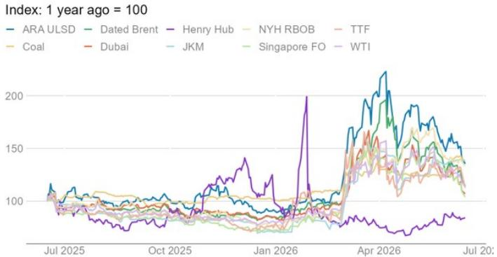

line chart

| Date       | ARA ULSD | Dated Brent | Henry Hub | NYH RBOB | TTF | Coal | Dubai | JKM | Singapore FO | WTI |
| ---------- | -------- | ----------- | --------- | -------- | --- | ---- | ----- | --- | ------------ | --- |
| Jul 2025   | ~100     | ~100        | ~100      | ~100     | ~100 | ~100 | ~100  | ~100 | ~100         | ~100 |
| Oct 2025   | ~100     | ~100        | ~100      | ~100     | ~100 | ~100 | ~100  | ~100 | ~100         | ~100 |
| Jan 2026   | ~100     | ~100        | ~200      | ~100     | ~100 | ~100 | ~100  | ~100 | ~100         | ~100 |
| Apr 2026   | ~220     | ~210        | ~80       | ~170     | ~160 | ~150 | ~140  | ~130 | ~120         | ~110 |
| Jul 2026   | ~150     | ~140        | ~85       | ~130     | ~120 | ~110 | ~105  | ~100 | ~95          | ~90  |

Source: Bloomberg, Platts, MS

Exhibit 16:  
Benchmark crude oil prices  
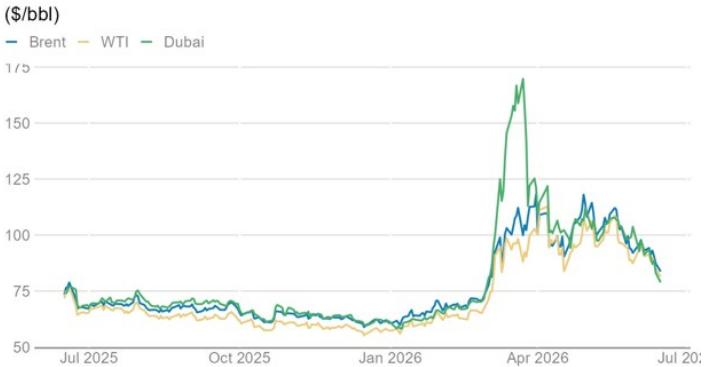

line chart

| Date     | Brent | WTI  | Dubai |
| -------- | ----- | ---- | ----- |
| Jul 2025 | 75    | 70   | 75    |
| Oct 2025 | 65    | 60   | 70    |
| Jan 2026 | 60    | 55   | 65    |
| Apr 2026 | 110   | 100  | 170   |
| Jul 2026 | 80    | 75   | 85    |

Source: Bloomberg, Platts, MS

Exhibit 17:  
Calendar spreads Mo1 vs Mo2  
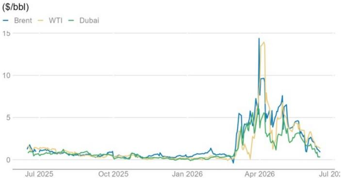

line chart

| Date     | Brent | WTI  | Dubai |
| -------- | ----- | ---- | ----- |
| Jul 2025 | 1.5   | 1.2  | 1.0   |
| Oct 2025 | 0.8   | 0.7  | 0.6   |
| Jan 2026 | 0.9   | 0.8  | 0.7   |
| Apr 2026 | 14.5  | 13.8 | 12.0  |
| Jul 2026 | 1.0   | 0.9  | 0.8   |

Source: Bloomberg, Platts, MS

Exhibit 18:  
Calendar spreads Mo2 vs Mo6  
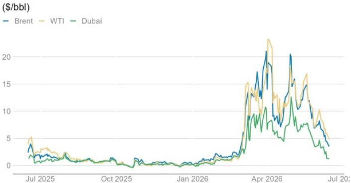

line chart

| Date     | Brent | WTI  | Dubai |
| -------- | ----- | ---- | ----- |
| Jul 2025 | 3.0   | 5.0  | 1.0   |
| Oct 2025 | 1.0   | 1.0  | 0.5   |
| Jan 2026 | 1.5   | 1.5  | 1.0   |
| Apr 2026 | 20.0  | 22.0 | 10.0  |
| Jul 2027 | 5.0   | 8.0  | 3.0   |

Source: Bloomberg, Platts, MS

Exhibit 19:  
WTI/Brent spread  
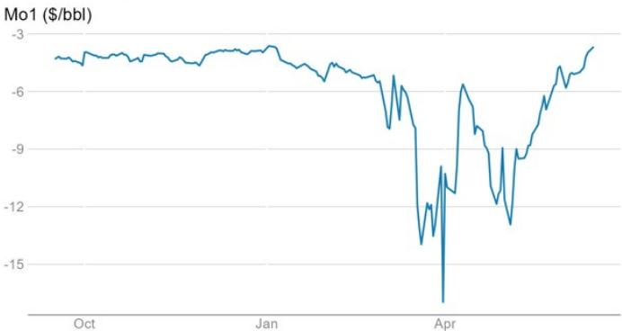

line chart

| Month | Mo1 ($/bbl) |
|-------|-------------|
| Oct   | -3.0        |
| Jan   | -3.0        |
| Apr   | -15.0       |
| End   | -3.0        |

Source: Bloomberg, MS

Exhibit 20:  
Brent futures  
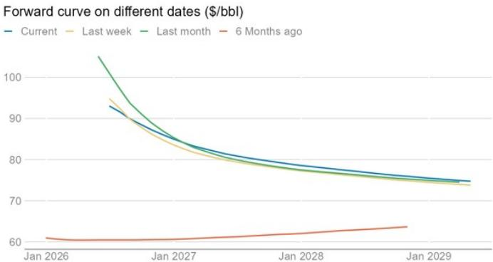

line chart

| Date     | Current | Last week | Last month | 6 Months ago |
| -------- | ------- | --------- | ---------- | ------------ |
| Jan 2026 | 93      | 95        | 105        | 61           |
| Jan 2027 | 85      | 83        | 88         | 61           |
| Jan 2028 | 78      | 77        | 79         | 62           |
| Jan 2029 | 75      | 74        | 75         | 64           |

Source: Platts, MS

Exhibit 21:  
Brent CFD curve  
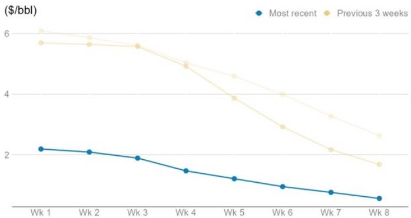

line chart

| Week | Most recent ($/bbl) | Previous 3 weeks ($/bbl) |
|---|---|---|
| Wk 1 | 2.2 | 5.7 |
| Wk 2 | 2.1 | 5.6 |
| Wk 3 | 1.9 | 5.5 |
| Wk 4 | 1.4 | 4.9 |
| Wk 5 | 1.1 | 3.8 |
| Wk 6 | 0.8 | 2.9 |
| Wk 7 | 0.6 | 2.1 |
| Wk 8 | 0.4 | 1.6 |

Source: S&P Global Platts, MS

Exhibit 22:  
CFD curve structure  
Spread between week 2 and week 6 (\$/bbl)  
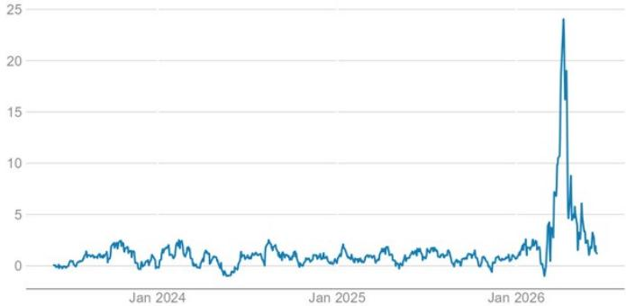

line chart

| Date       | Value |
| ---------- | ----- |
| Jan 2024   | ~1    |
| Jan 2025   | ~1    |
| Jan 2026   | ~24   |

Source: S&P Global Platts, MS

Exhibit 23:  
Brent DFL curve  
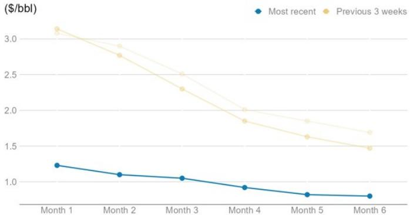

line chart

| Month | Most recent ($/bbl) | Previous 3 weeks ($/bbl) |
|---|---|---|
| Month 1 | 1.25 | 3.15 |
| Month 2 | 1.12 | 2.85 |
| Month 3 | 1.07 | 2.55 |
| Month 4 | 0.92 | 2.05 |
| Month 5 | 0.80 | 1.85 |
| Month 6 | 0.78 | 1.70 |

Source: S&P Global Platts, MS

Exhibit 24:  
DFL curve structure  
Spread between month 1 and month 6 (\$/bbl)  
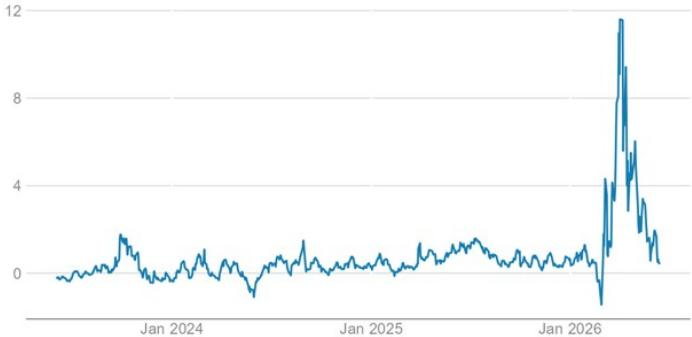

line chart

| Date       | Value |
| ---------- | ----- |
| Jan 2024   | ~0    |
| Jan 2025   | ~0    |
| Jan 2026   | ~12   |

Source: S&P Global Platts, MS

Exhibit 25:  
Cash Dubai premium  
Platts Cash Dubai vs M2 Dubai swaps spread (\$/bbl)  
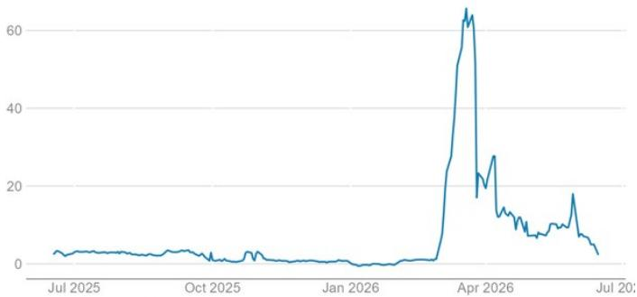

line chart

| Date       | Value |
| ---------- | ----- |
| Jul 2025   | ~3    |
| Oct 2025   | ~3    |
| Jan 2026   | ~1    |
| Apr 2026   | ~65   |
| Jul 2026   | ~18   |

Source: S&P Global Platts, MS

Exhibit 26:  
Brent/Dubai spread  
(\$/bbl)  
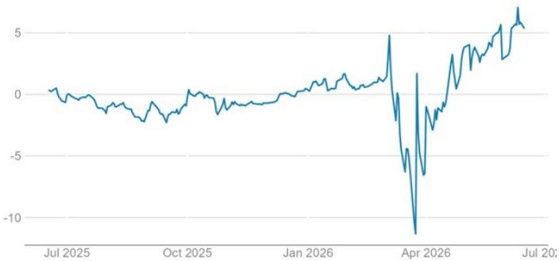

line chart

| Date       | Value |
| ---------- | ----- |
| Jul 2025   | 0     |
| Oct 2025   | -2    |
| Jan 2026   | 1     |
| Apr 2026   | -10   |
| Jul 2026   | 5     |

Source: S&P Global Platts, MS

## Differentials

Exhibit 27:  
North sea  
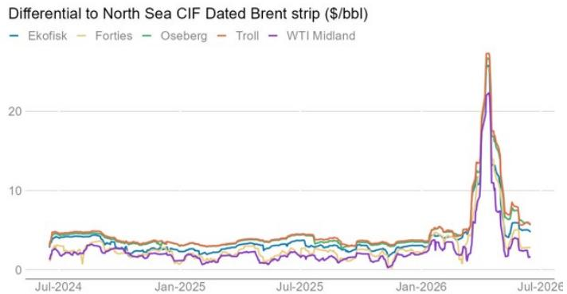

line chart

| Date     | Ekofisk | Forties | Oseberg | Troll | WTI Midland |
|----------|---------|---------|---------|-------|-------------|
| Jul-2024 | 3.5     | 2.8     | 4.2     | 3.9   | 2.5         |
| Jan-2025 | 3.0     | 2.5     | 3.8     | 3.6   | 2.0         |
| Jul-2025 | 3.2     | 2.7     | 4.0     | 3.8   | 2.3         |
| Jan-2026 | 3.8     | 3.0     | 4.5     | 4.3   | 2.8         |
| Jul-2026 | 5.0     | 4.5     | 6.0     | 5.8   | 4.0         |

Source: S&P Global Platts, MS

Exhibit 29:  
Nigeria  
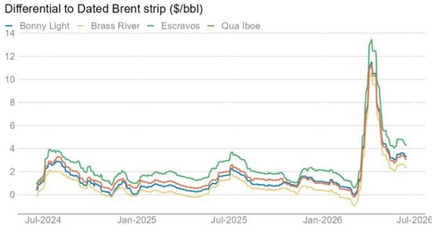

line chart

| Date     | Bonny Light | Brass River | Escravos | Qua Iboe |
|----------|-------------|-------------|----------|----------|
| Jul-2024 | 1.5         | 1.8         | 3.5      | 2.8      |
| Jan-2025 | 1.2         | 1.0         | 2.0      | 1.5      |
| Jul-2025 | 1.8         | 1.5         | 3.0      | 2.5      |
| Jan-2026 | 1.0         | 0.8         | 1.5      | 1.2      |
| Jul-2026 | 3.0         | 2.5         | 13.0     | 3.5      |

Source: S&P Global Platts, MS

Exhibit 31:  
Russia  
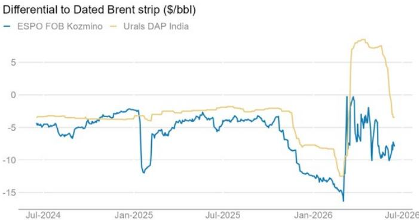

line chart

| Date     | ESPO FOB Kozmino | Urals DAP India |
| -------- | ---------------- | --------------- |
| Jul-2024 | -5               | -3              |
| Jan-2025 | -10              | -3              |
| Jul-2025 | -5               | -3              |
| Jan-2026 | -15              | -10             |
| Jul-2026 | -8               | 5               |

Source: S&P Global Platts, MS

Exhibit 28:  
Angola  
Differential to Dated Brent strip (\$/bbl)  
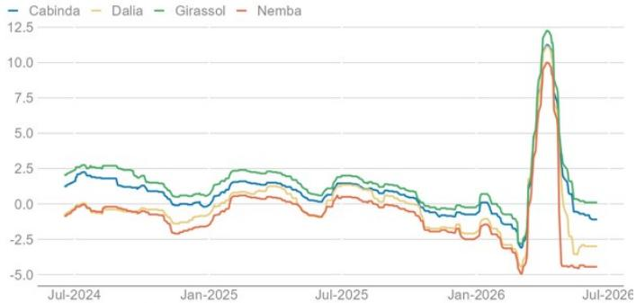

line chart

| Date     | Cabinda | Dalia | Girassol | Nemba |
|----------|---------|-------|----------|-------|
| Jul-2024 | 2.0     | 1.5   | 2.5      | -0.5  |
| Jan-2025 | 1.5     | 1.0   | 2.0      | -1.0  |
| Jul-2025 | 1.0     | 0.5   | 1.5      | -0.5  |
| Jan-2026 | -1.0    | -1.5  | -2.0     | -3.0  |
| Jul-2026 | -2.0    | -2.5  | -3.0     | -4.0  |

Source: S&P Global Platts, MS

Exhibit 30:  
Kazakhstan  
Differential to Dated Brent strip (\$/bbl)  
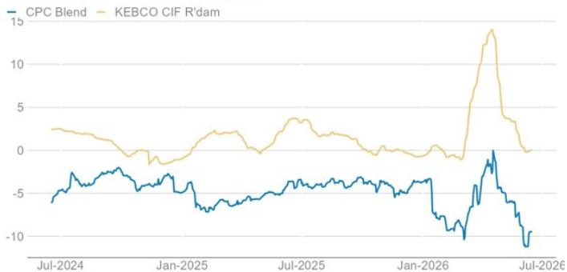

line chart

| Date     | CPC Blend | KEBCO CIF R'dam |
| -------- | --------- | --------------- |
| Jul-2024 | -6        | 3               |
| Jan-2025 | -7        | 1               |
| Jul-2025 | -5        | 4               |
| Jan-2026 | -8        | 0               |
| Jul-2026 | -10       | 15              |

Source: S&P Global Platts, MS

Exhibit 32:  
Iran  
Differential to Dated Brent strip (\$/bbl)  
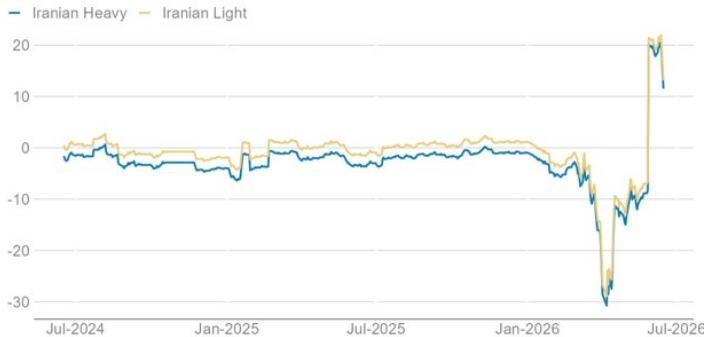

line chart

| Date     | Iranian Heavy | Iranian Light |
| -------- | ------------- | -------------- |
| Jul-2024 | ~0            | ~0             |
| Jan-2025 | ~-5           | ~0             |
| Jul-2025 | ~-2           | ~0             |
| Jan-2026 | ~-10          | ~-5            |
| Jul-2026 | ~-30          | ~-10           |

Source: S&P Global Platts, MS

## Crude Quality

Exhibit 33:  
Heavy vs Light  
Premium/(discount) for every 1 degree increase in API Gravity (\$/bbl)  
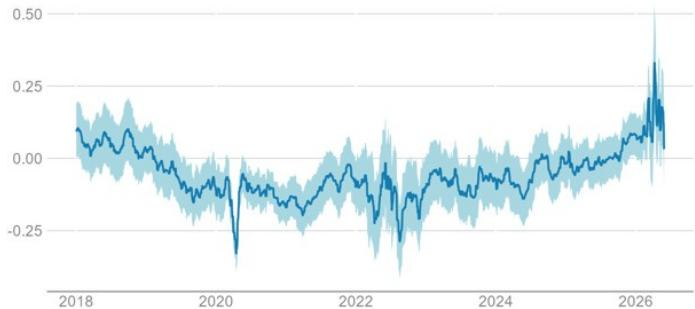

line chart

| Year | Value |
|------|-------|
| 2018 | 0.10  |
| 2019 | 0.05  |
| 2020 | -0.30 |
| 2021 | -0.15 |
| 2022 | -0.25 |
| 2023 | -0.10 |
| 2024 | 0.00  |
| 2025 | 0.15  |
| 2026 | 0.35  |

Note: analysis based on weekly regression across 95 seaborne crudes  
Source: Platts, MS

Exhibit 34:  
Sweet vs Sour  
Premium/(discount) for every 1% increase in sulfur content (\$/bbl)  

line chart

| Year | Value |
|------|-------|
| 2018 | -2.5  |
| 2020 | -4.0  |
| 2022 | -9.0  |
| 2024 | -3.0  |
| 2026 | -7.0  |

Note: analysis based on weekly regression across 95 seaborne crudes  
Source: Platts, MS

Exhibit 35:  
East vs West of Suez  
Premium/(discount) for West- over East-of-Suez crudes (\$/bbl)  

line chart

| Year | Value |
| ---- | ----- |
| 2018 | ~0    |
| 2019 | ~-1   |
| 2020 | ~-6   |
| 2021 | ~-1   |
| 2022 | ~-3   |
| 2023 | ~-5   |
| 2024 | ~-2   |
| 2025 | ~-1   |
| 2026 | ~7    |

Note: analysis based on weekly regression across 95 seaborne crudes  
Source: Platts, MS

Exhibit 36:  
Russian vs non-Russian origin  
Premium/(discount) for Russian crudes (\$/bbl)  

line chart

| Year | Value |
|------|-------|
| 2018 | ~0    |
| 2020 | ~-5   |
| 2022 | ~-40  |
| 2024 | ~-10  |
| 2026 | ~-30  |

Note: analysis based on weekly regression across 95 seaborne crudes  
Source: Platts, MS

The analyses above are based on a daily regression of the price of 95 seaborne crudes against 1) their API gravity, 2) their sulphur content, 3) a dummy variable indicating whether the crude's origin is East or West of Suez, and 4) another dummy variable indicating whether the grade is from Russian origin or not. The charts above show how the sensitivity of these 95 crude prices to each of these variables has changed over time.

## Refining Margins

Exhibit 37:  
Cracking netback margin - Northwest Europe  
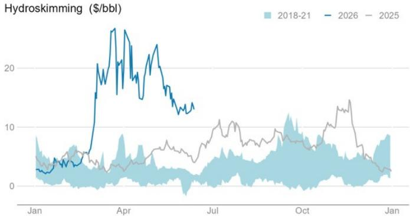

line chart

| Month | 2018-21 | 2026 | 2025 |
|-------|---------|------|------|
| Jan   | ~3      | ~3   | ~3   |
| Apr   | ~8      | ~25  | ~5   |
| Jul   | ~4      | ~15  | ~10  |
| Oct   | ~7      | ~10  | ~15  |
| Jan   | ~9      | ~5   | ~3   |

Source: S&P Global Platts, MS

Exhibit 38:  
Cracking netback margin - Northwest Europe  
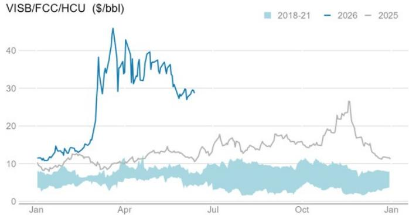

line chart

| Month | 2018-21 | 2026 | 2025 |
|-------|---------|------|------|
| Jan   | ~7      | ~10  | ~9   |
| Apr   | ~8      | ~45  | ~10  |
| Jul   | ~8      | ~30  | ~15  |
| Oct   | ~8      | ~25  | ~18  |
| Jan   | ~8      | ~10  | ~10  |

Source: S&P Global Platts, MS

Exhibit 39:  
Cracking netback margin - Southeast Asia  
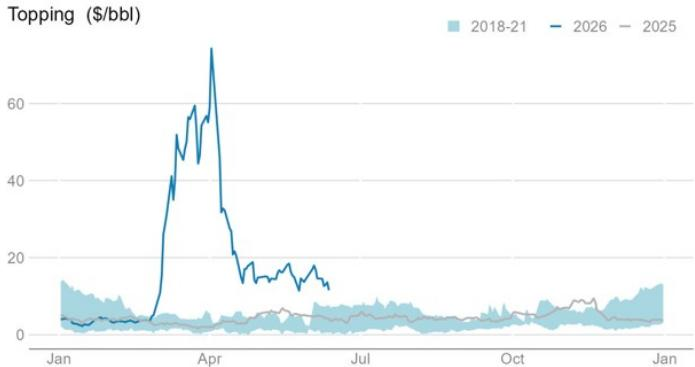

line chart

| Month | 2018-21 | 2026 | 2025 |
|-------|---------|------|------|
| Jan   | ~10     | ~5   | ~5   |
| Apr   | ~10     | ~70  | ~5   |
| Jul   | ~10     | ~15  | ~5   |
| Oct   | ~10     | ~5   | ~5   |
| Jan   | ~10     | ~5   | ~5   |

Source: S&P Global Platts, MS

Exhibit 40:  
Cracking netback margin - Southeast Asia  
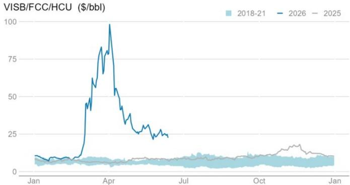

line chart

| Month | 2018-21 | 2025 | 2026 |
|-------|---------|------|------|
| Jan   | ~5      | ~5   | ~5   |
| Apr   | ~5      | ~5   | ~100 |
| Jul   | ~5      | ~5   | ~30  |
| Oct   | ~5      | ~10  | ~10  |
| Jan   | ~5      | ~5   | ~5   |

Source: S&P Global Platts, MS

Exhibit 41:  
Cracking netback margin - Western Mediterranean  
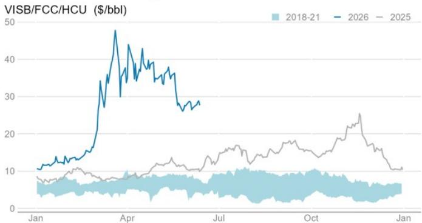

line chart

| Month | 2018-21 | 2026 | 2025 |
|-------|---------|------|------|
| Jan   | ~7      | ~10  | ~8   |
| Apr   | ~9      | ~48  | ~10  |
| Jul   | ~10     | ~35  | ~15  |
| Oct   | ~10     | ~25  | ~20  |
| Jan   | ~10     | ~10  | ~10  |

Source: S&P Global Platts, MS

Exhibit 42:  
Cracking netback margin - USGC  
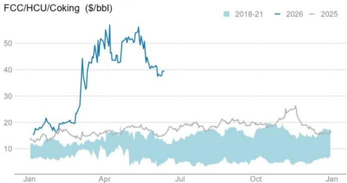

line chart

| Month | 2018-21 | 2026 | 2025 |
|-------|---------|------|------|
| Jan   | ~10     | ~15  | ~13  |
| Apr   | ~12     | ~45  | ~15  |
| Jul   | ~10     | ~55  | ~18  |
| Oct   | ~12     | ~40  | ~25  |
| Jan   | ~10     | ~38  | ~17  |

Source: S&P Global Platts, MS

# Product Crack Spreads

## Exhibit 43:

## Refined product crack spreads

vs Dated Brent; basis: Antwerp-Rotterdam-Amsterdam (\$/bbl)  
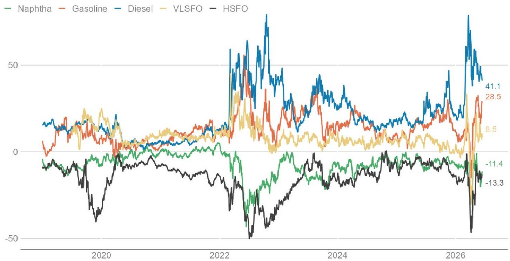

line chart

| Year | Naphtha | Gasoline | Diesel | VLSFO | HSFO |
|------|---------|----------|--------|-------|------|
| 2026 | -11.4   | 28.5     | 41.1   | 8.5   | -13.3 |

Source: Platts, MS

## Exhibit 44:

Forward refining margins  
Based on typical European configuration (\$/bbl)  
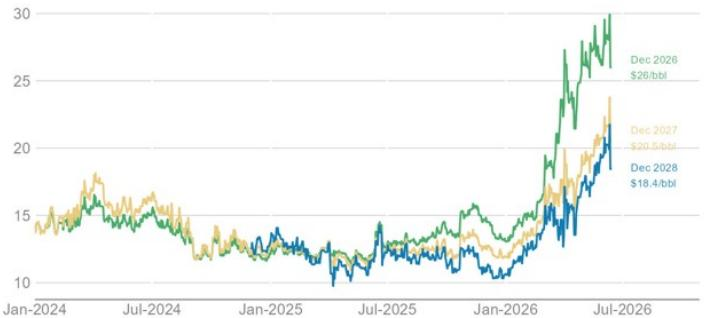

line chart

| Date     | Dec 2026 | Dec 2027 | Dec 2028 |
| -------- | -------- | -------- | -------- |
| Jul-2026 | $26/bbl  | $20.5/bbl| $18.4/bbl|

Note: Analysis assumes yields of 30% gasoline, 60% middle distillate, 5% naphtha and 5% HSFO Source: Bloomberg, MS

## Exhibit 45:

China  
Bohai Bay product crack spreads, excl. tax, \$/bbl)  
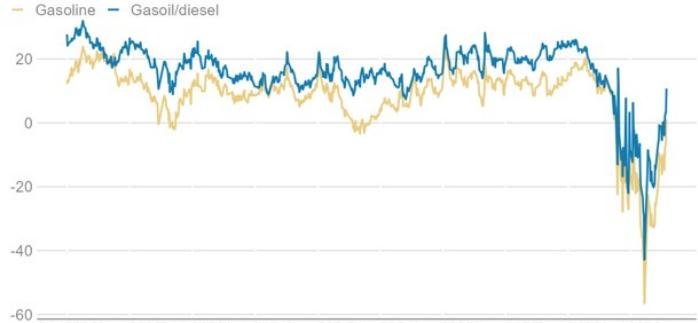

line chart

| Time | Gasoline | Gasoil/diesel |
|------|----------|---------------|
| 0    | 20       | 25            |
| 10   | 15       | 20            |
| 20   | 10       | 15            |
| 30   | 5        | 10            |
| 40   | 0        | 5             |
| 50   | -5       | 0             |
| 60   | -10      | -5            |
| 70   | -20      | -10           |
| 80   | -30      | -20           |
| 90   | -40      | -30           |
| 100  | -50      | -40           |
| 110  | -60      | -50           |
| 120  | -50      | -40           |
| 130  | -40      | -30           |
| 140  | -30      | -20           |
| 150  | -20      | -10           |
| 160  | -10      | 0             |
| 170  | 0        | 10            |
| 180  | 10       | 20            |
| 190  | 20       | 30            |
| 200  | 30       | 40            |
| 210  | 40       | 50            |
| 220  | 50       | 60            |
| 230  | 60       | 70            |
| 240  | 70       | 80            |
| 250  | 80       | 90            |
| 260  | 90       | 100           |
| 270  | 100      | 110           |
| 280  | 110      | 120           |
| 290  | 120      | 130           |
| 300  | 130      | 140           |
| 310  | 140      | 150           |
| 320  | 150      | 160           |
| 330  | 160      | 170           |
| 340  | 170      | 180           |
| 350  | 180      | 190           |
| 360  | 190      | 200           |
| 370  | 200      | 210           |
| 380  | 210      | 220           |
| 390  | 220      | 230           |
| 400  | 230      | 240           |
| 410  | 240      | 250           |
| 420  | 250      | 260           |
| 430  | 260      | 270           |
| 440  | 270      | 280           |
| 450  | 280      | 290           |
| 460  | 290      | 300           |
| 470  | 300      | 310           |
| 480  | 310      | 320           |
| 490  | 320      | 330           |
| 500  | 330      | 340           |
| 510  | 340      | 350           |
| 520  | 350      | 360           |
| 530  | 360      | 370           |
| 540  | 370      | 380           |
| 550  | 380      | 390           |
| 560  | 390      | 400           |
| 570  | 400      | 410           |
| 580  | 410      | 420           |
| 590  | 420      | 430           |
| 600  | 430      | 440           |
| 610  | 440      | 450           |
| 620  | 450      | 460           |
| 630  | 460      | 470           |
| 640  | 470      | 480           |
| 650  | 480      | 490           |
| 660  | 490      | 500           |
| 670  | 500      | 510           |
| 680  | 510      | 520           |
| 690  | 520      | 530           |
| 700  | 530      | 540           |
| 710  | 540      | 550           |
| 720  | 550      | 560           |
| 730  | 560      | 570           |
| 740  | 570      | 580           |
| 750  | 580      | 590           |
| 760  | 590      | 600           |
| 770  | 600      | -65           |
| ... (approx) - Gasoline / Gasoil/diesel

Apr 2023 Aug 2023 Dec 2023 Apr 2024 Aug 2024 Dec 2024 Apr 2025 Aug 2025 Dec 2025 Apr 2026  
Source: Argus, MS

Exhibit 46:  
Naphtha  
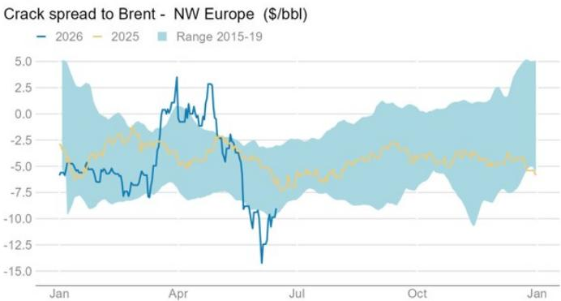

line chart

| Month | 2026 | 2025 | Range 2015-19 |
|-------|------|------|---------------|
| Jan   | -5.0 | -3.0 | 4.0           |
| Apr   | 3.0  | -2.0 | 1.0           |
| Jul   | -15.0| -7.0 | -8.0          |
| Oct   | 0.0  | -5.0 | 0.0           |
| Jan   | -5.0 | -6.0 | 5.0           |

Source: S&P Global Platts, MS

Exhibit 47:  
Gasoline  
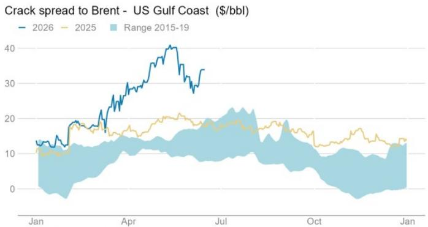

line chart

| Month | 2026 | 2025 | Range 2015-19 |
|-------|------|------|---------------|
| Jan   | ~13  | ~11  | ~10           |
| Apr   | ~30  | ~18  | ~15           |
| Jul   | ~40  | ~20  | ~22           |
| Oct   | ~15  | ~15  | ~10           |
| Jan   | ~13  | ~14  | ~10           |

Source: S&P Global Platts, MS

Exhibit 48:  
Jet fuel  
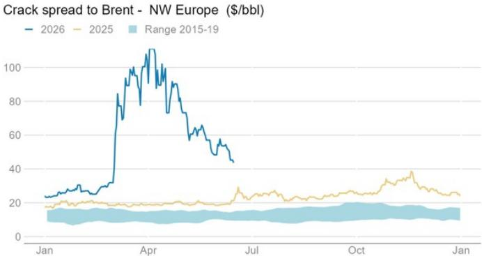

line chart

| Month | 2026 | 2025 | Range 2015-19 |
|-------|------|------|---------------|
| Jan   | ~25  | ~18  | ~10-15        |
| Apr   | ~110 | ~18  | ~10-15        |
| Jul   | ~45  | ~25  | ~10-15        |
| Oct   | ~35  | ~30  | ~10-15        |
| Jan   | ~25  | ~25  | ~10-15        |

Source: S&P Global Platts, MS

Exhibit 49:  
Gasoil/diesel  
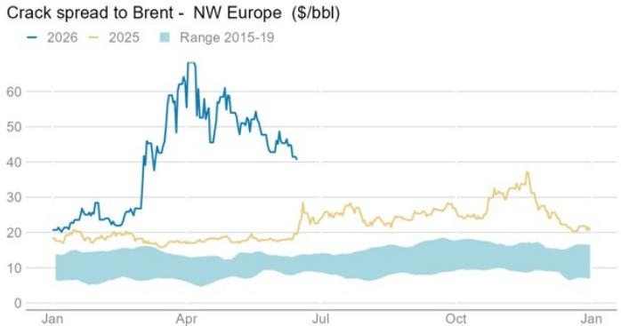

line chart

| Month | 2026 | 2025 | Range 2015-19 |
|-------|------|------|---------------|
| Jan   | ~20  | ~18  | ~10           |
| Apr   | ~65  | ~18  | ~10           |
| Jul   | ~45  | ~28  | ~10           |
| Oct   | ~35  | ~35  | ~10           |
| Jan   | ~20  | ~20  | ~10           |

Source: S&P Global Platts, MS

Exhibit 50:  
Gasoil/diesel  
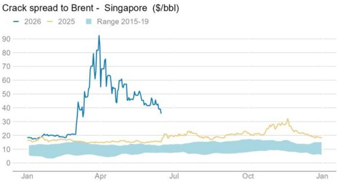

line chart

| Month | 2026 | 2025 | Range 2015-19 |
|-------|------|------|---------------|
| Jan   | ~18  | ~15  | ~10           |
| Apr   | ~90  | ~15  | ~10           |
| Jul   | ~40  | ~20  | ~10           |
| Oct   | ~30  | ~25  | ~10           |
| Jan   | ~20  | ~20  | ~10           |

Source: S&P Global Platts, MS

Exhibit 51:  
High-sulphur fuel oil  
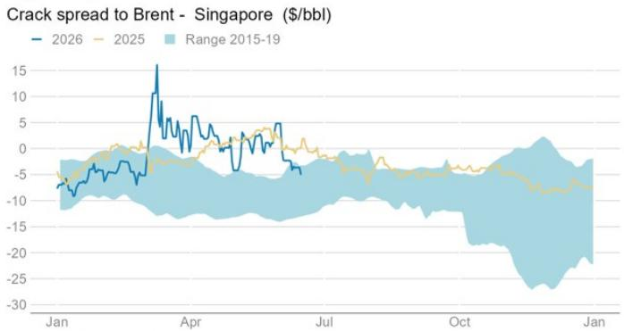

line chart

| Month | 2026 | 2025 | Range 2015-19 |
|-------|------|------|---------------|
| Jan   | -8   | -4   | -10           |
| Apr   | 15   | 0    | -10           |
| Jul   | 0    | -2   | -15           |
| Oct   | -10  | -4   | -25           |
| Jan   | -10  | -6   | -30           |

Source: S&P Global Platts, MS

## Refinery Outages

## Exhibit 52:

Refinery outages  
(mb/d)

<table><tr><td rowspan="2">region</td><td colspan="13">Actual</td><td colspan="2">Known outlook</td></tr><tr><td>May 2025</td><td>Jun 2025</td><td>Jul 2025</td><td>Aug 2025</td><td>Sep 2025</td><td>Oct 2025</td><td>Nov 2025</td><td>Dec 2025</td><td>Jan 2026</td><td>Feb 2026</td><td>Mar 2026</td><td>Apr 2026</td><td>May 2026</td><td>Jun 2026</td><td>Jul 2026</td></tr><tr><td>Africa</td><td>0.70</td><td>0.60</td><td>0.47</td><td>0.67</td><td>0.60</td><td>0.38</td><td>0.37</td><td>0.36</td><td>0.61</td><td>0.56</td><td>0.27</td><td>0.13</td><td>0.09</td><td>0.11</td><td>0.13</td></tr><tr><td>Brazil</td><td>0.11</td><td>0.14</td><td>0.16</td><td>0.09</td><td>0.09</td><td>0.12</td><td>0.07</td><td>0.07</td><td>0.05</td><td>0.04</td><td>0.05</td><td>0.04</td><td>0.04</td><td>0.01</td><td>0.02</td></tr><tr><td>China</td><td>2.10</td><td>1.51</td><td>1.20</td><td>0.91</td><td>0.86</td><td>0.96</td><td>1.22</td><td>1.19</td><td>1.12</td><td>0.53</td><td>0.82</td><td>1.39</td><td>1.82</td><td>2.03</td><td>1.24</td></tr><tr><td>Europe</td><td>1.51</td><td>1.12</td><td>0.38</td><td>0.17</td><td>0.57</td><td>1.03</td><td>1.16</td><td>0.36</td><td>0.31</td><td>0.80</td><td>1.20</td><td>0.69</td><td>0.61</td><td>0.34</td><td>0.10</td></tr><tr><td>India</td><td>0.15</td><td>0.20</td><td>0.08</td><td>0.26</td><td>0.35</td><td>0.23</td><td>0.27</td><td>0.20</td><td>0.09</td><td>0.10</td><td>0.18</td><td>0.52</td><td>0.56</td><td>0.53</td><td>0.35</td></tr><tr><td>Japan</td><td>0.60</td><td>0.79</td><td>0.52</td><td>0.35</td><td>0.42</td><td>0.46</td><td>0.42</td><td>0.10</td><td>0.13</td><td>0.15</td><td>0.25</td><td>0.44</td><td>0.40</td><td>0.48</td><td>0.33</td></tr><tr><td>Korea</td><td>0.08</td><td>0.12</td><td>0.00</td><td>0.00</td><td>0.00</td><td>0.17</td><td>0.17</td><td>0.17</td><td>0.00</td><td>0.24</td><td>0.38</td><td>0.64</td><td>0.53</td><td>0.47</td><td>0.03</td></tr><tr><td>Middle East</td><td>0.51</td><td>0.40</td><td>0.11</td><td>0.16</td><td>0.21</td><td>0.77</td><td>1.19</td><td>0.54</td><td>0.45</td><td>0.41</td><td>1.55</td><td>1.88</td><td>1.73</td><td>1.32</td><td>0.25</td></tr><tr><td>Other</td><td>2.84</td><td>2.12</td><td>1.73</td><td>1.59</td><td>1.91</td><td>2.08</td><td>1.37</td><td>1.11</td><td>1.26</td><td>1.66</td><td>2.48</td><td>3.26</td><td>3.08</td><td>2.06</td><td>0.78</td></tr><tr><td>Russia</td><td>0.60</td><td>0.72</td><td>0.92</td><td>1.48</td><td>2.05</td><td>2.21</td><td>1.98</td><td>1.50</td><td>0.72</td><td>0.78</td><td>0.98</td><td>2.01</td><td>2.29</td><td>1.63</td><td>0.39</td></tr><tr><td>Taiwan</td><td>0.16</td><td>0.00</td><td>0.00</td><td>0.00</td><td>0.24</td><td>0.24</td><td>0.24</td><td>0.31</td><td>0.15</td><td>0.00</td><td>0.18</td><td>0.32</td><td>0.16</td><td>0.14</td><td>0.15</td></tr><tr><td>US</td><td>0.75</td><td>0.31</td><td>0.29</td><td>0.32</td><td>0.83</td><td>1.55</td><td>0.63</td><td>0.19</td><td>0.88</td><td>1.37</td><td>0.95</td><td>1.10</td><td>0.43</td><td>0.15</td><td>0.14</td></tr><tr><td>World</td><td>10.11</td><td>7.97</td><td>5.86</td><td>5.94</td><td>7.95</td><td>10.11</td><td>9.09</td><td>5.84</td><td>5.69</td><td>6.43</td><td>9.27</td><td>12.42</td><td>11.76</td><td>8.97</td><td>3.63</td></tr></table>

Source: IIR, MS

Exhibit 53:  
Refinery outages  
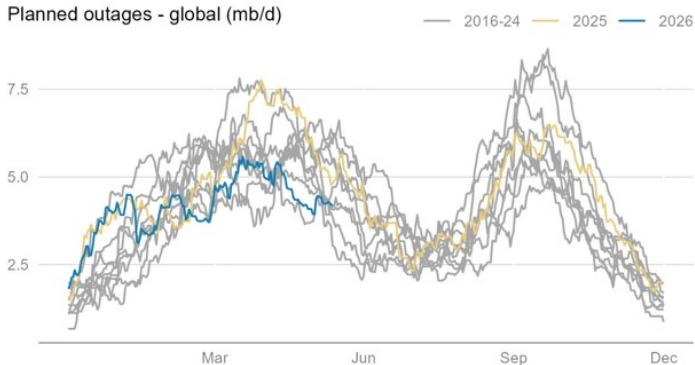

line chart

| Month | 2016-24 | 2025 | 2026 |
|-------|---------|------|------|
| Jan   | ~1.5    | ~2.0 | ~1.8 |
| Feb   | ~3.0    | ~3.5 | ~3.2 |
| Mar   | ~5.0    | ~6.0 | ~4.8 |
| Apr   | ~6.5    | ~7.0 | ~5.5 |
| May   | ~7.5    | ~7.8 | ~5.8 |
| Jun   | ~6.0    | ~5.5 | ~4.5 |
| Jul   | ~4.0    | ~3.5 | ~3.0 |
| Aug   | ~5.0    | ~4.5 | ~3.5 |
| Sep   | ~7.0    | ~6.5 | ~5.0 |
| Oct   | ~8.0    | ~7.0 | ~6.0 |
| Nov   | ~6.5    | ~5.5 | ~4.5 |
| Dec   | ~3.0    | ~2.5 | ~2.0 |

Source: IIR, MS

Exhibit 54:  
Refinery outages  
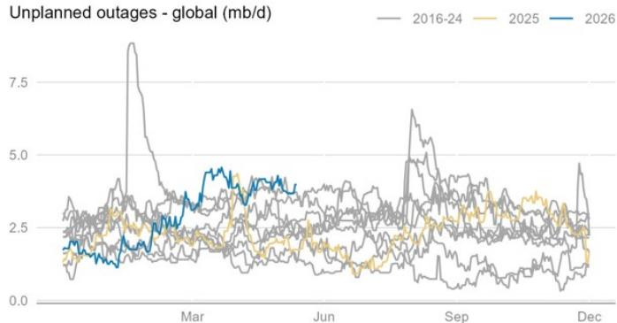

line chart

| Month | 2016-24 | 2025 | 2026 |
|-------|---------|------|------|
| Mar   | ~3.5    | ~3.0 | ~2.5 |
| Jun   | ~3.0    | ~2.5 | ~3.5 |
| Sep   | ~6.0    | ~3.5 | ~4.0 |
| Dec   | ~4.5    | ~3.0 | ~2.0 |

Source: IIR, MS

# Inventories

Exhibit 55:

Observable crude oil inventories  
(million bbl)

<table><tr><td rowspan="2" colspan="2"></td><td>Level</td><td colspan="6">Average daily change</td></tr><tr><td>Current</td><td>-4 wks</td><td>-13 wks</td><td>-26 wks</td><td>May</td><td>Apr</td><td>Mar</td></tr><tr><td colspan="9">Commercial</td></tr><tr><td></td><td>United States</td><td>424.9</td><td>-0.85</td><td>-0.24</td><td>0.03</td><td>-0.85</td><td>-0.08</td><td>0.73</td></tr><tr><td></td><td>Japan</td><td>58.1</td><td>0.35</td><td>-0.06</td><td>-0.06</td><td>0.39</td><td>-0.15</td><td>-0.39</td></tr><tr><td></td><td>ARA region</td><td>55.3</td><td>0.26</td><td>0.06</td><td>0.01</td><td>0.00</td><td>-0.19</td><td>0.33</td></tr><tr><td></td><td>Other OECD</td><td>549.9</td><td>0.34</td><td>-0.36</td><td>-0.14</td><td>-0.12</td><td>-0.42</td><td>-0.25</td></tr><tr><td></td><td>China</td><td>1,111.2</td><td>-0.25</td><td>0.20</td><td>0.54</td><td>-0.86</td><td>0.58</td><td>1.26</td></tr><tr><td></td><td>Other non-OECD</td><td>1,136.9</td><td>0.01</td><td>-0.20</td><td>0.05</td><td>0.03</td><td>-0.67</td><td>0.32</td></tr><tr><td></td><td>Floating storage</td><td>81.7</td><td>-0.21</td><td>-0.06</td><td>-0.27</td><td>-1.72</td><td>-0.48</td><td>1.18</td></tr><tr><td></td><td>Oil-in-transit</td><td>1,132.0</td><td>-0.21</td><td>-0.02</td><td>-0.37</td><td>-0.20</td><td>1.32</td><td>-3.61</td></tr><tr><td>Sub-total</td><td>—</td><td>4,550.1</td><td>-0.6</td><td>-0.7</td><td>-0.2</td><td>-3.3</td><td>-0.1</td><td>-0.4</td></tr><tr><td colspan="9">SPR</td></tr><tr><td></td><td>United States</td><td>349.2</td><td>-1.25</td><td>-0.73</td><td>-0.34</td><td>-1.32</td><td>-0.57</td><td>-0.01</td></tr><tr><td></td><td>Japan</td><td>262.2</td><td>-0.13</td><td>0.01</td><td>0.01</td><td>0.08</td><td>-0.04</td><td>-0.02</td></tr><tr><td></td><td>ARA region</td><td>1.0</td><td>0.00</td><td>0.00</td><td>0.00</td><td>0.00</td><td>0.00</td><td>0.00</td></tr><tr><td></td><td>Other OECD</td><td>257.0</td><td>0.00</td><td>0.01</td><td>-0.01</td><td>0.00</td><td>0.00</td><td>0.03</td></tr><tr><td></td><td>China</td><td>188.8</td><td>-0.06</td><td>0.00</td><td>0.01</td><td>0.05</td><td>0.07</td><td>-0.07</td></tr><tr><td>Sub-total</td><td>—</td><td>1,058.2</td><td>-1.4</td><td>-0.7</td><td>-0.3</td><td>-1.2</td><td>-0.5</td><td>-0.1</td></tr><tr><td>Total</td><td>—</td><td>5,608.3</td><td>-2.0</td><td>-1.4</td><td>-0.5</td><td>-4.5</td><td>-0.6</td><td>-0.5</td></tr></table>

Source: IEA, EIA/DOE, PJK, IE, Genscape, PAJ, Platts, Vortexa, MS

## Exhibit 56:

Observable oil products inventories  
(million bbl)

<table><tr><td rowspan="2" colspan="2"></td><td>Level</td><td colspan="6">Average daily change</td></tr><tr><td>Current</td><td>-4 wks</td><td>-13 wks</td><td>-26 wks</td><td>May</td><td>Apr</td><td>Mar</td></tr><tr><td colspan="9">On land</td></tr><tr><td></td><td>Light ends</td><td>428.9</td><td>-0.08</td><td>-0.56</td><td>-0.07</td><td>-0.29</td><td>-0.86</td><td>-0.65</td></tr><tr><td></td><td>Middle distillates</td><td>688.1</td><td>-0.07</td><td>-0.24</td><td>-0.12</td><td>-0.07</td><td>-0.54</td><td>-0.25</td></tr><tr><td></td><td>Fuel oil &amp; resid</td><td>117.2</td><td>-0.23</td><td>-0.25</td><td>-0.19</td><td>-0.07</td><td>-0.29</td><td>-0.25</td></tr><tr><td></td><td>Other/not specified</td><td>566.1</td><td>-0.04</td><td>0.09</td><td>-0.27</td><td>0.26</td><td>0.27</td><td>-0.23</td></tr><tr><td>Sub-total</td><td>—</td><td>1,800.34</td><td>-0.42</td><td>-0.96</td><td>-0.65</td><td>-0.17</td><td>-1.42</td><td>-1.38</td></tr><tr><td colspan="9">At sea</td></tr><tr><td></td><td>Light ends</td><td>180.3</td><td>-0.36</td><td>-0.16</td><td>-0.12</td><td>-0.68</td><td>0.32</td><td>-0.58</td></tr><tr><td></td><td>Middle distillates</td><td>331.1</td><td>0.17</td><td>-0.26</td><td>-0.05</td><td>-0.04</td><td>-0.22</td><td>-0.89</td></tr><tr><td></td><td>Fuel oil &amp; resid</td><td>126.9</td><td>0.14</td><td>-0.04</td><td>-0.06</td><td>-0.15</td><td>-0.01</td><td>-0.40</td></tr><tr><td></td><td>Other/not specified</td><td>171.2</td><td>0.30</td><td>0.30</td><td>0.09</td><td>0.37</td><td>0.40</td><td>-0.26</td></tr><tr><td>Sub-total</td><td>—</td><td>809.44</td><td>0.25</td><td>-0.16</td><td>-0.14</td><td>-0.50</td><td>0.49</td><td>-2.13</td></tr><tr><td>Total</td><td>—</td><td>2,609.79</td><td>-0.17</td><td>-1.12</td><td>-0.79</td><td>-0.67</td><td>-0.93</td><td>-3.51</td></tr></table>

Source: IEA, EIA/DOE, PJK, IE, Genscape, PAJ, Platts, Vortexa, MS

## Exhibit 57:

Observable crude oil and oil products inventories  
On land, at sea and in-transit (mln bbl)  
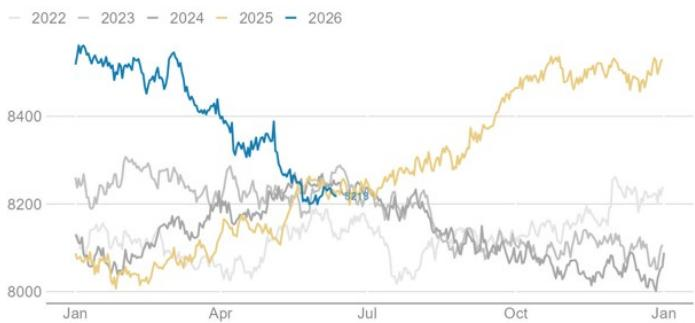

line chart

| Month | 2022  | 2023  | 2024  | 2025  | 2026  |
|-------|-------|-------|-------|-------|-------|
| Jan   | ~8150 | ~8180 | ~8170 | ~8160 | ~8550 |
| Apr   | ~8180 | ~8200 | ~8190 | ~8170 | ~8450 |
| Jul   | ~8150 | ~8180 | ~8170 | ~8250 | ~8250 |
| Oct   | ~8170 | ~8190 | ~8160 | ~8450 | ~8350 |
| Jan   | ~8160 | ~8170 | ~8150 | ~8450 | ~8350 |

Note: Inventories include SPR  
Source: IEA, EIA/DOE, PJK, IE, Genscape, PAJ, Platts, Vortexa, MS

## Exhibit 58:

Observable crude oil inventories  
On land, at sea and in-transit (mln bbl)  
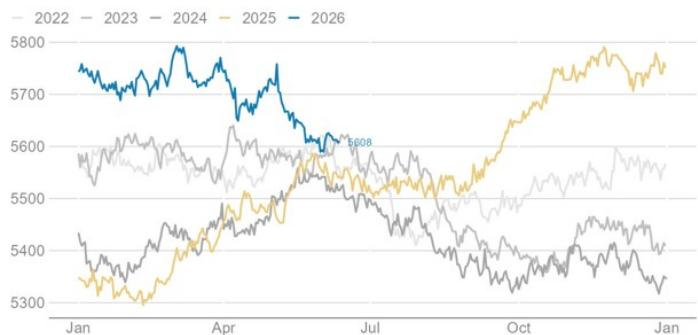

line chart

| Month | 2022 | 2023 | 2024 | 2025 | 2026 |
|---|---|---|---|---|---|
| Jan | 5580 | 5590 | 5430 | 5340 | 5750 |
| Apr | 5610 | 5630 | 5480 | 5490 | 5780 |
| Jul | 5590 | 5570 | 5490 | 5520 | 5608 |
| Oct | 5560 | 5540 | 5470 | 5680 | - |
| Jan | 5570 | 5530 | 5440 | 5780 | - |

Source: IEA, EIA/DOE, PJK, IE, Genscape, PAJ, Platts, Vortexa, MS

## Exhibit 59:

Observable crude oil and oil products inventories  
In commercial storage only (mln bbl)  
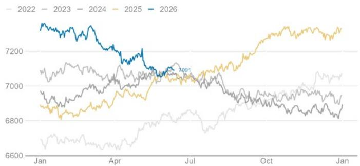

line chart

| Month | 2022 | 2023 | 2024 | 2025 | 2026 |
|-------|------|------|------|------|------|
| Jan   | ~6850 | ~6950 | ~6900 | ~6850 | ~7300 |
| Apr   | ~6800 | ~6950 | ~6950 | ~6950 | ~7150 |
| Jul   | ~6850 | ~6950 | ~6950 | ~7050 | 7091 |
| Oct   | ~6850 | ~6950 | ~6950 | ~7250 | -    |
| Jan   | ~6850 | ~6950 | ~6950 | ~7300 | -    |

Note: inventories on land, at sea and in-transit, not including SPR in OECD countries  
Source: IEA, EIA/DOE, PJK, IE, Genscape, PAJ, Platts, Vortexa, MS

## Exhibit 60:

OECD commercial oil inventories  
Total oil, on land only (mln bbl)  
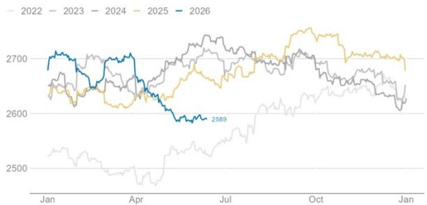

line chart

| Month | 2022 | 2023 | 2024 | 2025 | 2026 |
|-------|------|------|------|------|------|
| Jan   | ~2550 | ~2650 | ~2650 | ~2650 | ~2700 |
| Apr   | ~2500 | ~2650 | ~2650 | ~2650 | ~2650 |
| Jul   | ~2550 | ~2700 | ~2700 | ~2700 | 2589 |
| Oct   | ~2600 | ~2650 | ~2650 | ~2750 | ~2650 |
| Jan   | ~2650 | ~2600 | ~2600 | ~2700 | ~2600 |

Source: IEA, EIA/DOE, PJK, PAJ, Platts, Vortexa, MS

## Exhibit 61:

Observable refined oil products inventories  
On land, at sea and in-transit (mln bbl)  
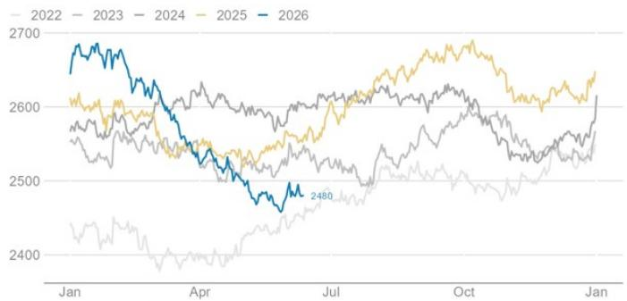

line chart

| Month | 2022 | 2023 | 2024 | 2025 | 2026 |
|-------|------|------|------|------|------|
| Jan   | ~2450 | ~2580 | ~2590 | ~2610 | ~2680 |
| Apr   | ~2480 | ~2550 | ~2570 | ~2580 | ~2550 |
| Jul   | ~2500 | ~2530 | ~2560 | ~2590 | ~2480 |
| Oct   | ~2550 | ~2570 | ~2600 | ~2680 | ~2550 |
| Jan   | ~2600 | ~2610 | ~2630 | ~2650 | ~2600 |

Source: IEA, EIA/DOE, PJK, IE, PAJ, Platts, MS

## Exhibit 62:

Observable refined oil products inventories, on-land only (mln bbl)  
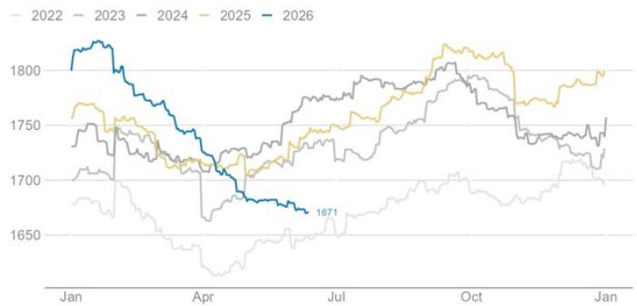

line chart

| Month | 2022 | 2023 | 2024 | 2025 | 2026 |
|-------|------|------|------|------|------|
| Jan   |      |      |      |      | 1800 |
| Apr   |      |      |      |      | 1700 |
| Jul   |      |      |      |      | 1671 |
| Oct   |      |      |      |      |      |
| Jan   |      |      |      |      |      |

Source: IEA, EIA/DOE, PJK, IE, PAJ, Platts, MS

## Exhibit 63:

Observable crude oil inventories in China  
On land (mln bbl)  
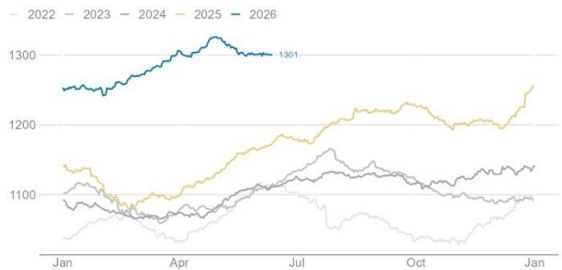

line chart

| Month | 2022 | 2023 | 2024 | 2025 | 2026 |
|-------|------|------|------|------|------|
| Jan   |      |      |      |      | 1250 |
| Apr   |      |      |      |      | 1301 |
| Jul   |      |      |      |      |      |
| Oct   |      |      |      |      |      |
| Jan   |      |      |      |      | 1301 |

Source: Vortexa, MS

## Exhibit 64:

Observable crude oil inventories outside China  
On land, at sea and in-transit (mln bbl)  
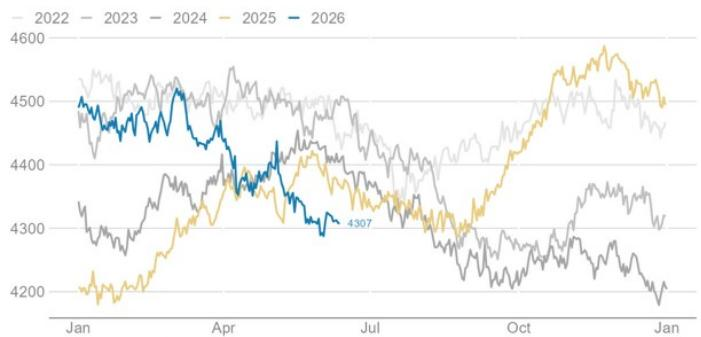

line chart

| Month | 2022 | 2023 | 2024 | 2025 | 2026 |
|-------|------|------|------|------|------|
| Jan   |      |      |      |      |      |
| Apr   |      |      |      |      |      |
| Jul   |      |      |      |      | 4307 |
| Oct   |      |      |      |      |      |
| Jan   |      |      |      |      |      |

Source: IEA, EIA/DOE, PJK, IE, PAJ, Platts, MS

## Seaborne Exports

Exhibit 65:  
OPEC 9+3  
Seaborne exports of crude oil and oil products (mb/d)  
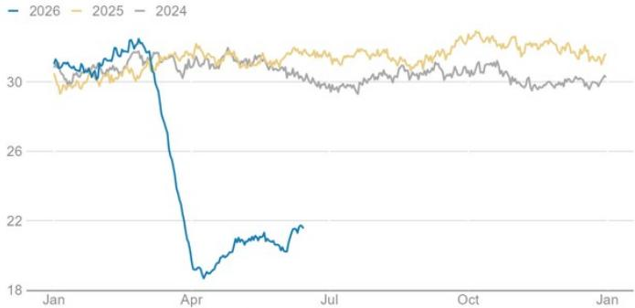

line chart

| Month | 2026 | 2025 | 2024 |
|-------|------|------|------|
| Jan   | 31   | 30   | 30   |
| Apr   | 18   | 31   | 31   |
| Jul   | 22   | 31   | 30   |
| Oct   | 31   | 32   | 30   |
| Jan   | 31   | 31   | 30   |

Source: Vortexa, MS

Exhibit 66:  
Non-OPEC  
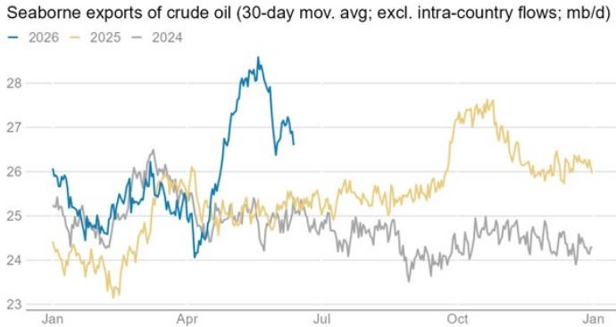

line chart

| Month | 2026 | 2025 | 2024 |
|-------|------|------|------|
| Jan   | 26.0 | 24.5 | 25.0 |
| Apr   | 24.0 | 25.5 | 26.0 |
| Jul   | 27.0 | 25.5 | 24.5 |
| Oct   | 27.5 | 27.0 | 24.0 |
| Jan   | 26.5 | 26.0 | 24.0 |

Source: Vortexa, MS

Exhibit 67:  
Saudi Arabia  
Seaborne crude oil exports (mb/d)  
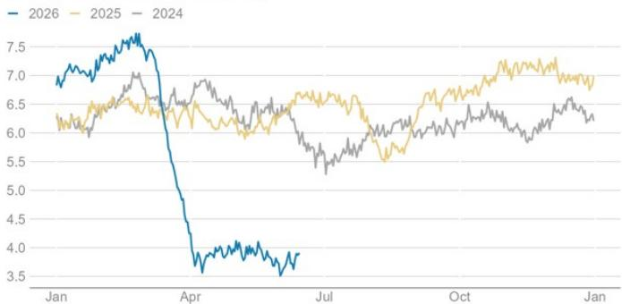

line chart

| Month | 2026 | 2025 | 2024 |
|-------|------|------|------|
| Jan   | 7.0  | 6.3  | 6.1  |
| Apr   | 3.8  | 6.5  | 6.8  |
| Jul   | 3.9  | 6.7  | 5.5  |
| Oct   | 4.0  | 7.0  | 6.3  |
| Jan   | 4.1  | 7.1  | 6.4  |

Source: Vortexa, MS

Exhibit 68:  
Brazil and Guyana  
Seaborne exports of crude oil (30-day moving avg; mb/d)  

line chart

| Month | 2026 | 2025 | 2024 |
|-------|------|------|------|
| Jan   | 3.5  | 2.5  | 2.3  |
| Apr   | 3.6  | 2.7  | 2.4  |
| Jul   | 3.0  | 2.9  | 1.8  |
| Oct   | 3.4  | 3.1  | 2.5  |
| Jan   | 3.5  | 3.4  | 2.4  |

Source: Vortexa, MS

Exhibit 69:  
Russia  
Seaborne crude oil exports (mb/d)  
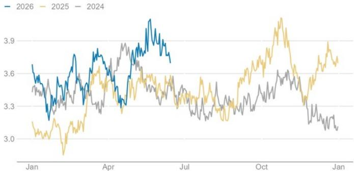

line chart

| Month | 2026 | 2025 | 2024 |
|-------|------|------|------|
| Jan   | 3.6  | 3.1  | 3.4  |
| Apr   | 3.8  | 3.6  | 3.7  |
| Jul   | 3.5  | 3.4  | 3.3  |
| Oct   | 3.7  | 3.9  | 3.5  |
| Jan   | 3.6  | 3.7  | 3.2  |

Source: Vortexa, MS

Exhibit 70:  
Iran  
Seaborne crude oil exports (mb/d)  
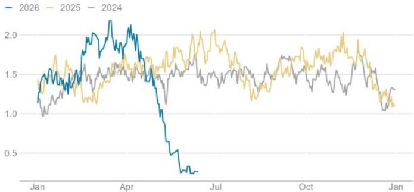

line chart

| Month | 2026 | 2025 | 2024 |
|-------|------|------|------|
| Jan   | 1.3  | 1.4  | 1.0  |
| Apr   | 2.1  | 1.7  | 1.5  |
| Jul   | 0.3  | 1.8  | 1.4  |
| Oct   | 1.7  | 1.9  | 1.6  |
| Jan   | 1.1  | 1.2  | 1.3  |

Note: chart shows data to 13 Jun  
Source: Vortexa, MS

## Positioning

Exhibit 71:  
Total oil  
COT report - Managed money and Other reportables (number of contracts)  
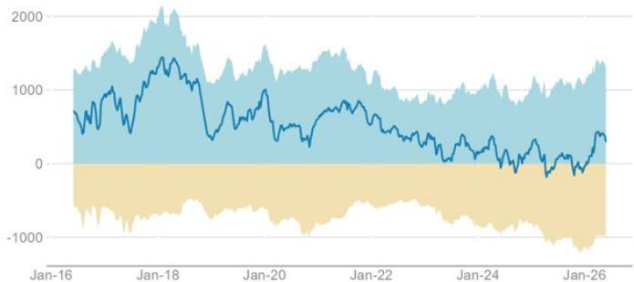

area chart

| Date   | Value |
|--------|-------|
| Jan-16 | ~500  |
| Jan-17 | ~1000 |
| Jan-18 | ~1500 |
| Jan-19 | ~500  |
| Jan-20 | ~1000 |
| Jan-21 | ~500  |
| Jan-22 | ~1000 |
| Jan-23 | ~500  |
| Jan-24 | ~0    |
| Jan-25 | ~500  |
| Jan-26 | ~1000 |

Note: light blue = long positions, yellow = short position, dark blue = net position  
Source: CFTC, MS

Exhibit 73:  
Gasoil and Heating Oil  
COT report - Managed money and Other reportables (number of contracts)  
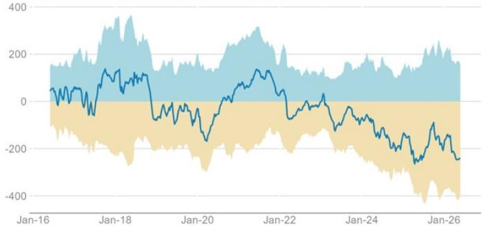

area chart

| Date   | Value |
|--------|-------|
| Jan-16 | 0     |
| Jan-17 | 50    |
| Jan-18 | 100   |
| Jan-19 | 50    |
| Jan-20 | -100  |
| Jan-21 | 0     |
| Jan-22 | 50    |
| Jan-23 | -50   |
| Jan-24 | -100  |
| Jan-25 | -200  |
| Jan-26 | -300  |

Note: light blue = long positions, yellow = short position, dark blue = net position  
Source: CFTC, MS

Exhibit 72:  
Brent and WTI  
COT report - Managed money and Other reportables (number of contracts)  
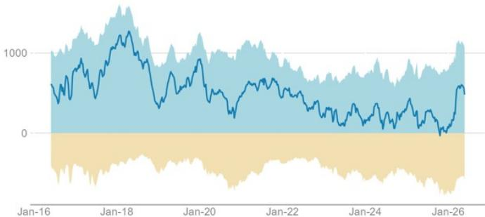

area chart

| Date   | Value |
|--------|-------|
| Jan-16 | ~500  |
| Jan-17 | ~800  |
| Jan-18 | ~1200 |
| Jan-19 | ~400  |
| Jan-20 | ~900  |
| Jan-21 | ~300  |
| Jan-22 | ~500  |
| Jan-23 | ~300  |
| Jan-24 | ~400  |
| Jan-25 | ~200  |
| Jan-26 | ~600  |

Note: light blue = long positions, yellow = short position, dark blue = net position  
Source: CFTC, MS

Exhibit 74:  
Gasoline - NY Harbour RBOB  
COT report - Managed money and Other reportables (number of contracts)  
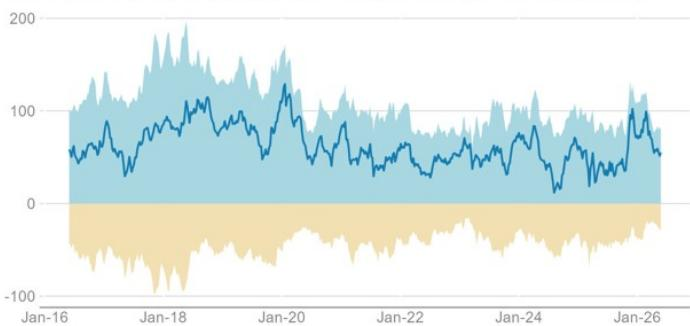

area chart

| Date   | Value |
|--------|-------|
| Jan-16 | 50    |
| Jan-17 | 70    |
| Jan-18 | 90    |
| Jan-19 | 110   |
| Jan-20 | 130   |
| Jan-21 | 100   |
| Jan-22 | 80    |
| Jan-23 | 60    |
| Jan-24 | 40    |
| Jan-25 | 20    |
| Jan-26 | 60    |

Note: light blue = long positions, yellow = short position, dark blue = net position  
Source: CFTC, MS

## Other Selected Charts

Exhibit 75:  
Motor fuel imports  
Top 100 ports (mb/d)  
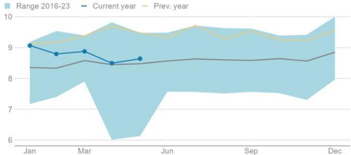

line chart

| Month | Current year | Prev. year |
|-------|--------------|----------|
| Jan   | 9.0          | 9.0      |
| Feb   | 8.8          | 9.1      |
| Mar   | 8.9          | 9.2      |
| Apr   | 8.5          | 9.3      |
| May   | 8.6          | 9.4      |
| Jun   | 8.7          | 9.5      |
| Jul   | 8.7          | 9.6      |
| Aug   | 8.7          | 9.5      |
| Sep   | 8.7          | 9.4      |
| Oct   | 8.7          | 9.3      |
| Nov   | 8.7          | 9.2      |
| Dec   | 8.8          | 9.3      |

Note: analysis based on the 100 largest ports where imports are $>90\%$ of total flow, excluding large trading ports like Singapore, Rotterdam, etc  
Source: Vortexa, MS

Exhibit 77:  
Clean products net imports  
Nigeria (30-day moving avg; mb/d)  
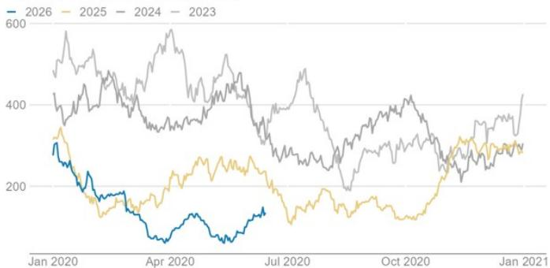

line chart

| Date     | 2026 | 2025 | 2024 | 2023 |
|----------|------|------|------|------|
| Jan 2020 | 300  | 350  | 450  | 550  |
| Apr 2020 | 150  | 250  | 350  | 450  |
| Jul 2020 | 100  | 200  | 300  | 400  |
| Oct 2020 | 150  | 250  | 350  | 350  |
| Jan 2021 | 300  | 300  | 400  | 450  |

Source: Vortexa, MS

Exhibit 79:  
Global oil & gas capex (by Woodmac)  
(\$bn)  
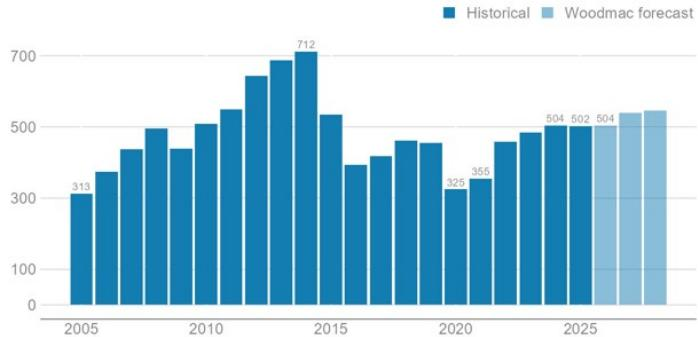

bar chart

| Year | Historical | Woodmac forecast |
|---|---|---|
| 2005 | 313 | |
| 2006 | 340 | |
| 2007 | 370 | |
| 2008 | 495 | |
| 2009 | 470 | |
| 2010 | 505 | |
| 2011 | 525 | |
| 2012 | 675 | |
| 2013 | 695 | |
| 2014 | 712 | |
| 2015 | 515 | |
| 2016 | 345 | |
| 2017 | 355 | |
| 2018 | 480 | |
| 2019 | 475 | |
| 2020 | 325 | |
| 2021 | 325 | |
| 2022 | 480 | |
| 2023 | 495 | |
| 2024 | 504 | |
| 2025 | 502 | |
| 2026 | 504 | |
| 2027 | 515 | |
| 2028 | 520 | |

Source: Wood Mackenzie, MS

Exhibit 76:  
Seaborne crude oil arrivals - Europe  
Change vs seasonal average from 2016-23 (mb/d)  
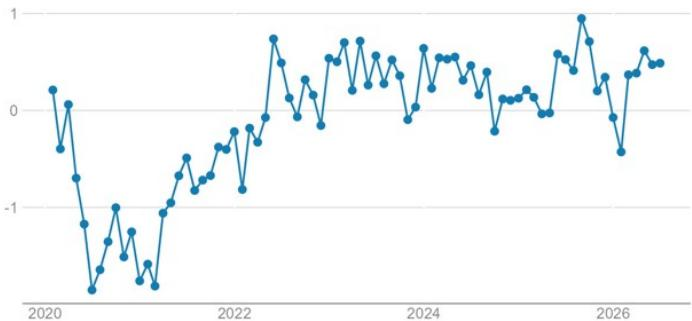

line chart

| Year | Value |
| ---- | ----- |
| 2020 | 0.3   |
| 2020 | -0.4  |
| 2020 | -1.3  |
| 2020 | -1.8  |
| 2020 | -1.9  |
| 2020 | -1.7  |
| 2020 | -1.5  |
| 2020 | -1.3  |
| 2020 | -1.1  |
| 2020 | -0.9  |
| 2020 | -0.7  |
| 2020 | -0.5  |
| 2020 | -0.3  |
| 2020 | -0.1  |
| 2020 | 0.1   |
| 2020 | 0.3   |
| 2021 | -0.5  |
| 2021 | -0.7  |
| 2021 | -0.9  |
| 2021 | -1.1  |
| 2021 | -1.3  |
| 2021 | -1.5  |
| 2021 | -1.7  |
| 2021 | -1.9  |
| 2021 | -1.7  |
| 2021 | -1.5  |
| 2021 | -1.3  |
| 2021 | -1.1  |
| 2021 | -0.9  |
| 2021 | -0.7  |
| 2021 | -0.5  |
| 2021 | -0.3  |
| 2021 | -0.1  |
| 2021 | 0.1   |
| 2021 | 0.3   |
| 2021 | 0.5   |
| 2021 | 0.7   |
| 2021 | 0.9   |
| 2021 | 1.1   |
| 2021 | 1.3   |
| 2021 | 1.5   |
| 2021 | 1.7   |
| 2021 | 1.9   |
| 2021 | 2.1   |
| 2021 | 2.3   |
| 2021 | 2.5   |
| 2021 | 2.7   |
| 2021 | 2.9   |
| 2021 | 3.1   |
| 2021 | 3.3   |
| 2021 | 3.5   |
| 2021 | 3.7   |
| 2021 | 3.9   |
| 2021 | 4.1   |
| 2021 | 4.3   |
| 2021 | 4.5   |
| 2021 | 4.7   |
| 2021 | 4.9   |
| 2021 | 5.1   |
| 2021 | 5.3   |
| 2021 | 5.5   |
| 2021 | 5.7   |
| 2021 | 5.9   |
| 2021 | 6.1   |
| 2021 | 6.3   |
| 2021 | 6.5   |
| 2021 | 6.7   |
| 2021 | 6.9   |
| 2021 | 7.1   |
| 2021 | 7.3   |
| 2021 | 7.5   |
| 2021 | 7.7   |
| 2021 | 7.9   |
| 2021 | 8.1   |
| 2021 | 8.3   |
| 2021 | 8.5   |
| 2021 | 8.7   |
| 2021 | 8.9   |
| 2021 | 9.1   |
| 2021 | 9.3   |
| 2021 | 9.5   |
| 2021 | 9.7   |
| 2021 | 9.9   |
| 2021 | -6.8  |
| Note: The actual values are not provided in the code provided in the code image.

Note: analysis based on EU + Norway + UK  
Source: Vortexa, MS

Exhibit 78:  
Crude oil imports  
China, split by origin  
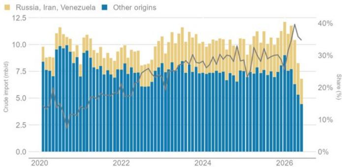

bar-line hybrid

| Year | Russia, Iran, Venezuela (mb/d) | Other origins (mb/d) | Share (%) |
|---|---|---|---|
| 2020 | 9.5 | 7.8 | 14 |
| 2021 | 10.5 | 9.5 | 10 |
| 2022 | 9.0 | 7.5 | 18 |
| 2023 | 10.0 | 8.0 | 25 |
| 2024 | 10.5 | 7.5 | 28 |
| 2025 | 10.0 | 7.0 | 30 |
| 2026 | 12.0 | 8.5 | 35 |
Note: The chart displays a line graph on the right axis labeled 'Share (%)', but it does not contain any data series for the bars or line. The values for the bar segments are estimated based on the y-axis scale.

Source: Vortexa, MS

Exhibit 80:  
Upstream capital cost  
Index: 1Q 2000 = 100  
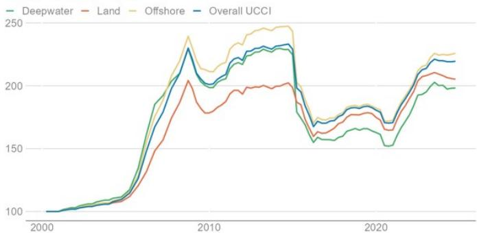

line chart

| Year | Deepwater | Land | Offshore | Overall UCCI |
|------|-----------|------|----------|--------------|
| 2000 | 100       | 100  | 100      | 100          |
| 2005 | 180       | 160  | 200      | 190          |
| 2010 | 230       | 200  | 240      | 230          |
| 2015 | 170       | 160  | 180      | 170          |
| 2020 | 160       | 170  | 180      | 170          |
| 2025 | 200       | 210  | 230      | 220          |

Source: S&P Global, MS

This report references jurisdiction(s) or person(s) which may be the subject of economic sanctions. Readers are solely responsible for ensuring that their investment activities are carried out in compliance with applicable laws.

## Disclosure Section

The information and opinions in MS were prepared or are disseminated by MS & Co. LLC and/or MS C.T.V.M. S.A. and/or MS México, Casa de Bolsa, S.A. de C.V. and/or MS Canada Limited and/or MS & Co. International plc and/or MS Europe S.E. and/or RMB MS Proprietary Limited and/or MS MUFG Securities Co., Ltd. and/or MS Capital Group Japan Co., Ltd. and/or MS Asia Limited and/or MS Asia (Singapore) Pte. (Registration number 199206298Z) and/or MS Asia (Singapore) Securities Pte Ltd (Registration number 200008434H), regulated by the Monetary Authority of Singapore (which accepts legal responsibility for its contents and should be contacted with respect to any matters arising from, or in connection with, MS) and/or MS Taiwan Limited and/or MS & Co International plc, Seoul Branch, and/or MS Australia Limited (A.B.N. 67 003 734 576, holder of Australian financial services license No. 233742, which accepts responsibility for its contents), and/or MS Wealth Management Australia Pty Ltd (A.B.N. 19 009 145 555, holder of Australian financial services license No. 24-0813, which accepts responsibility for its contents), and/or MS India Company Private Limited having Corporate Identification No (CIN) U22990MH1998PTC115305, regulated by the Securities and Exchange Board of India ("SEBI") and holder of licenses as a Research Analyst (SEBI Registration No. INH000001105), Stock Broker (SEBI Stock Broker Registration No. INZ000244438), Merchant Banker (SEBI Registration No. INM000011203), and depository participant with National Securities Depository Limited (SEBI Registration No. IN-DP-NSDL-567-2021) having registered office at Altimus, Level 39 & 40, Pandurang Budhkar Marg, Worli, Mumbai 400018, India; Telephone no. +91-22-61181000; Compliance Officer Details: Mr. Tejarshi Hardas, Tel. No.: +91-22-61181000 or Email: tejarshi.hardas@morganstanley.com; Grievance officer details: Mr. Tejarshi Hardas, Tel. No.: +91-22-61181000 or Email: msic-compliance@morganstanley.com which accepts the responsibility for its contents and should be contacted with respect to any matters arising from, or in connection with, MS, and their affiliates (collectively, "MS"). MS India Company Private Limited (MSICPL) may use AI tools in providing research services. All recommendations contained herein are made by the duly qualified research analysts.

For important disclosures, stock price charts and equity rating histories regarding companies that are the subject of this report, please see the MS Disclosure Website at www.morganstanley.com/eqr/disclosures/webapp/generalresearch, or contact your investment representative or MS at 1585 Broadway, (Attention: Research Management), New York, NY, 10036 USA.

For valuation methodology and risks associated with any recommendation, rating or price target referenced in this research report, please contact the Client Support Team as follows: US/Canada +1 800 303-2495; Hong Kong +852 2848-5999; Latin America +1 718 754-5444 (U.S.); London +44 (0)20-7425-8169; Singapore +65 6834-6860; Sydney +61 (0)2-9770-1505; Tokyo +81 (0)3-6836-9000. Alternatively you may contact your investment representative or MS at 1585 Broadway, (Attention: Research Management), New York, NY 10036 USA.

## Analyst Certification

The following analysts hereby certify that their views about the companies and their securities discussed in this report are accurately expressed and that they have not received and will not receive direct or indirect compensation in exchange for expressing specific recommendations or views in this report: Amy Gower (Amy Sergeant), CFA; Martijn Rats, CFA.

## Global Research Conflict Management Policy

MS has been published in accordance with our conflict management policy, which is available at www.morganstanley.com/institutional/research/conflictpolicies. A Portuguese version of the policy can be found at www.morganstanley.com.br

## Important Regulatory Disclosures on Subject Companies

The equity research analysts or strategists principally responsible for the preparation of MS have received compensation based upon various factors, including quality of research, investor client feedback, stock picking, competitive factors, firm revenues and overall investment banking revenues. Equity Research analysts' or strategists' compensation is not linked to investment banking or capital markets transactions performed by MS or the profitability or revenues of particular trading desks.

MS and its affiliates do business that relates to companies/instruments covered in MS, including market making, providing liquidity, fund management, commercial banking, extension of credit, investment services and investment banking. MS sells to and buys from customers the securities/instruments of companies covered in MS on a principal basis. MS may have a position in the debt of the Company or instruments discussed in this report. MS trades or may trade as principal in the debt securities (or in related derivatives) that are the subject of the debt research report.

Certain disclosures listed above are also for compliance with applicable regulations in non-US jurisdictions.

## STOCK RATINGS

MS uses a relative rating system using terms such as Overweight, Equal-weight, Not-Rated or Underweight (see definitions below). MS does not assign ratings of Buy, Hold or Sell to the stocks we cover. Overweight, Equal-weight, Not-Rated and Underweight are not the equivalent of buy, hold and sell. Investors should carefully read the definitions of all ratings used in MS. In addition, since MS contains more complete information concerning the analyst's views, investors should carefully read MS, in its entirety, and not infer the contents from the rating alone. In any case, ratings (or research) should not be used or relied upon as investment advice. An investor's decision to buy or sell a stock should depend on individual circumstances (such as the investor's existing holdings) and other considerations.

## Global Stock Ratings Distribution

(as of May 31, 2026)

The Stock Ratings described below apply to MS's Fundamental Equity Research and do not apply to Debt Research produced by the Firm.

For disclosure purposes only (in accordance with FINRA requirements), we include the category headings of Buy, Hold, and Sell alongside our ratings of Overweight, Equal-weight, Not-Rated and Underweight. MS does not assign ratings of Buy, Hold or Sell to the stocks we cover. Overweight, Equal-weight, Not-Rated and Underweight are not the equivalent of buy, hold, and sell but represent recommended relative weightings (see definitions below). To satisfy regulatory requirements, we correspond Overweight, our most positive stock rating, with a buy recommendation; we correspond Equal-weight and Not-Rated to hold and Underweight to sell recommendations, respectively.

<table><tr><td></td><td colspan="2">Coverage Universe</td><td colspan="3">Investment Banking Clients (IBC)</td><td colspan="2">Other Material Investment ServicesClients (MISC)</td></tr><tr><td>Stock RatingCategory</td><td>Count</td><td>% of Total</td><td>Count</td><td>% of Total IBC</td><td>% of RatingCategory</td><td>Count</td><td>% of Total OtherMISC</td></tr><tr><td>Overweight/Buy</td><td>1542</td><td>42%</td><td>465</td><td>51%</td><td>30%</td><td>707</td><td>43%</td></tr><tr><td>Equal-weight/Hold</td><td>1571</td><td>43%</td><td>369</td><td>40%</td><td>23%</td><td>723</td><td>44%</td></tr><tr><td>Not-Rated/Hold</td><td>3</td><td>0%</td><td>0</td><td>0%</td><td>0%</td><td>1</td><td>0%</td></tr><tr><td>Underweight/Sell</td><td>551</td><td>15%</td><td>86</td><td>9%</td><td>16%</td><td>201</td><td>12%</td></tr><tr><td>Total</td><td>3,667</td><td></td><td>920</td><td></td><td></td><td>1632</td><td></td></tr></table>

Data include common stock and ADRs currently assigned ratings. Investment Banking Clients are companies from whom MS received investment banking compensation in the last 12 months. Due to rounding off of decimals, the percentages provided in the "% of total" column may not add up to exactly 100 percent.

## Analyst Stock Ratings

Overweight (O or Over) - The stock's total return is expected to exceed the total return of the relevant country MSCI Index or the average total return of the analyst's industry (or industry team's) coverage universe, on a risk-adjusted basis over the next 12-18 months.

Equal-weight (E or Equal) - The stock's total return is expected to be in line with the total return of the relevant country MSCI Index or the average total return of the analyst's industry (or industry team's) coverage universe, on a risk-adjusted basis over the next 12-18 months.

Not-Rated (NR) - Currently the analyst does not have adequate conviction about the stock's total return relative to the relevant country MSCI Index or the average total return of the analyst's industry (or industry team's) coverage universe, on a risk-adjusted basis, over the next 12-18 months.

Underweight (U or Under) - The stock's total return is expected to be below the total return of the relevant country MSCI Index or the average total return of the analyst's industry (or industry team's) coverage universe, on a risk-adjusted basis, over the next 12-18 months.

Unless otherwise specified, the time frame for price targets included in MS is 12 to 18 months.

## Analyst Industry Views

Attractive (A): The analyst expects the performance of his or her industry coverage universe over the next 12-18 months to be attractive vs. the relevant broad market benchmark, as indicated below.

In-Line (I): The analyst expects the performance of his or her industry coverage universe over the next 12-18 months to be in line with the relevant broad market benchmark, as indicated below. Cautious (C): The analyst views the performance of his or her industry coverage universe over the next 12-18 months with caution vs. the relevant broad market benchmark, as indicated below. Benchmarks for each region are as follows: North America - S&P 500; Latin America - relevant MSCI country index or MSCI Latin America Index; Europe - MSCI Europe; Japan - TOPIX; Asia - relevant MSCI country index or MSCI sub-regional index or MSCI AC Asia Pacific ex Japan Index.

## Important Disclosures for MS Smith Barney LLC Customers

Important disclosures regarding any material conflict of interest that can reasonably be expected to have influenced MS Smith Barney LLC's choice of a third-party research provider or the subject company of a third-party research report, are available on the MS Wealth Management disclosure website at www.morganstanley.com/online/researchdisclosures. For MS specific disclosures, you may refer to https://www.morganstanley.com/eqr/disclosures/webapp/generalresearch.

Each MS report is reviewed and approved on behalf of MS Smith Barney LLC. This review and approval is conducted by the same person who reviews the research report on behalf of MS. This could create a conflict of interest.

## Other Important Disclosures

MS policy is to update research reports as and when the Research Analyst and Research Management deem appropriate, based on developments with the issuer, the sector, or the market that may have a material impact on the research views or opinions stated therein. In addition, certain Research publications are intended to be updated on a regular periodic basis (weekly/monthly/quarterly/annual) and will ordinarily be updated with that frequency, unless the Research Analyst and Research Management determine that a different publication schedule is appropriate based on current conditions.

MS is not acting as a municipal advisor and the opinions or views contained herein are not intended to be, and do not constitute, advice within the meaning of Section 975 of the Dodd-Frank Wall Street Reform and Consumer Protection Act.

MS produces an equity research product called a "Tactical Idea." Views contained in a "Tactical Idea" on a particular stock may be contrary to the recommendations or views expressed in research on the same stock. This may be the result of differing time horizons, methodologies, market events, or other factors. For all research available on a particular stock, please contact your sales representative or go to Matrix at http://www.morganstanley.com/matrix.

MS is provided to our clients through our proprietary research portal on Matrix and also distributed electronically by MS to clients. Certain, but not all, MS products are also made available to clients through third-party vendors or redistributed to clients through alternate electronic means as a convenience. For access to all available MS, please contact your sales representative or go to Matrix at http://www.morganstanley.com/matrix.

Any access and/or use of MS is subject to MS's Terms of Use (http://www.morganstanley.com/terms.html). By accessing and/or using MS, you are indicating that you have read and agree to be bound by our Terms of Use (http://www.morganstanley.com/terms.html). In addition you consent to MS processing your personal data and using cookies in accordance with our Privacy Policy and our Global Cookies Policy (http://www.morganstanley.com/privacy\_pledge.html), including for the purposes of setting your preferences and to collect readership data so that we can deliver better and more personalized service and products to you. To find out more information about how MS processes personal data, how we use cookies and how to reject cookies see our Privacy Policy and our Global Cookies Policy (http://www.morganstanley.com/privacy\_pledge.html). Please use the provided link to review the Terms and Conditions and Most Important Terms and Conditions for MS India Company Private Limited (https://www.morganstanley.com/assets/pdfs/about-us-global-offices/india/Terms\_and\_conditions.pdf) and the following link to review the audit report (https://ny.matrix.ms.com/eqr/research/webapp/researchdocs/MSICPL\_Morgan\_Stanley\_Research\_Audit\_Report.pdf).

If you do not agree to our Terms of Use and/or if you do not wish to provide your consent to MS processing your personal data or using cookies please do not access our research.

MS does not provide individually tailored investment advice. MS has been prepared without regard to the circumstances and objectives of those who receive it. MS recommends that investors independently evaluate particular investments and strategies, and encourages investors to seek the advice of a financial adviser. The appropriateness of an investment or strategy will depend on an investor's circumstances and objectives. The securities, instruments, or strategies discussed in MS may not be suitable for all investors, and certain investors may not be eligible to purchase or participate in some or all of them. MS is not an offer to buy or sell or the solicitation of an offer to buy or sell any security/instrument or to participate in any particular trading strategy. The value of and income from your investments may vary because of changes in interest rates, foreign exchange rates, default rates, prepayment rates, securities/instruments prices, market indexes, operational or financial conditions of companies or other factors. There may be time limitations on the exercise of options or other rights in securities/instruments transactions. Past performance is not necessarily a guide to future performance. Estimates of future performance are based on assumptions that may not be realized. If provided, and unless otherwise stated, the closing price on the cover page is that of the primary exchange for the subject company's securities/instruments.

The fixed income research analysts, strategists or economists principally responsible for the preparation of MS have received compensation based upon various factors, including quality, accuracy and value of research, firm profitability or revenues (which include fixed income trading and capital markets profitability or revenues), client feedback and competitive factors. Fixed Income Research analysts', strategists' or economists' compensation is not linked to investment banking or capital markets transactions performed by MS or the profitability or revenues of particular trading desks.

The "Important Regulatory Disclosures on Subject Companies" section in MS lists all companies mentioned where MS owns 1% or more of a class of common equity securities of the companies. For all other companies mentioned in MS, MS may have an investment of less than 1% in securities/instruments or derivatives of securities/instruments of companies and may trade them in ways different from those discussed in MS. Employees of MS not involved in the preparation of MS may have investments in securities/instruments or derivatives of securities/instruments of companies mentioned and may trade them in ways different from those discussed in MS. Derivatives may be issued by MS or associated persons.

With the exception of information regarding MS, MS is based on public information. MS makes every effort to use reliable, comprehensive information, but we make no representation that it is accurate or complete. We have no obligation to tell you when opinions or information in MS change apart from when we intend to discontinue equity research coverage of a subject company. Facts and views presented in MS have not been reviewed by, and may not reflect information known to, professionals in other MS business areas, including investment banking personnel.

MS personnel may participate in company events such as site visits and are generally prohibited from accepting payment by the company of associated expenses unless pre-approved by authorized members of Research management.

MS may make investment decisions that are inconsistent with the recommendations or views in this report.

To our readers based in Taiwan or trading in Taiwan securities/instruments: Information on securities/instruments that trade in Taiwan is distributed by MS Taiwan Limited ("MSTL"). Such information is for your reference only. The reader should independently evaluate the investment risks and is solely responsible for their investment decisions. MS may not be distributed to the public media or quoted or used by the public media without the express written consent of MS. Any non-customer reader within the scope of Article 7-1 of the Taiwan Stock Exchange Recommendation Regulations accessing and/or receiving MS is not permitted to provide MS to any third party (including but not limited to related parties, affiliated companies and any other third parties) or engage in any activities regarding MS which may create or give the appearance of creating a conflict of interest. Information on securities/instruments that do not trade in Taiwan is for informational purposes only and is not to be construed as a recommendation or a solicitation to trade in such securities/instruments. MSTL may not execute transactions for clients in these securities/instruments.

Certain information in MS was sourced by employees of the Shanghai Representative Office of MS Asia Limited for the use of MS Asia Limited. MS is not incorporated under PRC law and the research in relation to this report is conducted outside the PRC. MS does not constitute an offer to sell or the solicitation of an offer to buy any securities in the PRC. PRC investors shall have the relevant qualifications to invest in such securities and shall be responsible for obtaining all relevant approvals, licenses, verifications and/or registrations from the relevant governmental authorities themselves. Neither this report nor any part of it is intended as, or shall constitute, provision of any consultancy or advisory service of securities investment as defined under PRC law. Such information is provided for your reference only.

MS is disseminated in Brazil by MS C.T.V.M. S.A. located at Av. Brigadeiro Faria Lima, 3600, 6th floor, São Paulo - SP, Brazil; and is regulated by the Comissão de Valores Mobiliários; in Mexico by MS México, Casa de Bolsa, S.A. de C.V which is regulated by Comision Nacional Bancaria y de Valores. Paseo de los Tamarindos 90, Torre 1, Col. Bosques de las Lomas Floor 29, 05120 Mexico City; in Japan by MS MUFG Securities Co., Ltd. and, for Commodities related research reports only, MS Capital Group Japan Co., Ltd; in Hong Kong by MS Asia Limited (which accepts responsibility for its contents) and by MS Bank Asia Limited; in Singapore by MS Asia (Singapore) Pte. (Registration number 199206298Z) and/or MS Asia (Singapore) Securities Pte Ltd (Registration number 200008434H), regulated by the Monetary Authority of Singapore (which accepts legal responsibility for its contents and should be contacted with respect to any matters arising from, or in connection with, MS) and by MS Bank Asia Limited, Singapore Branch (Registration number T14FC0118J); in Australia to "wholesale clients" within the meaning of the Australian Corporations Act by MS Australia Limited A.B.N. 67 003 734 576, holder of Australian financial services license No. 233742, which accepts responsibility for its contents; in Australia to "wholesale clients" and "retail clients" within the meaning of the Australian Corporations Act by MS Wealth Management Australia Pty Ltd (A.B.N. 19 009 145 555, holder of Australian financial services license No. 240813, which accepts responsibility for its contents; in Korea by MS & Co International plc, Seoul Branch; in India by MS India Company Private Limited having Corporate Identification No (CIN) U22990MH1998PTC115305, regulated by the Securities and Exchange Board of India ("SEBI") and holder of licenses as a Research Analyst (SEBI Registration No. INH000001105); Stock Broker (SEBI Stock Broker Registration No. INZ000244438), Merchant Banker (SEBI Registration No. INM000011203), and depository participant with National Securities Depository Limited (SEBI Registration No. IN-DP-NSDL-567-2021) having registered office at Altimus, Level 39 & 40, Pandurang Budhkar Marg, Worli, Mumbai 400018, India; Telephone no. +91-22-61181000; Compliance Officer Details: Mr. Tejarshi Hardas, Tel. No.: +91-22-61181000 or Email: tejarshi.hardas@morganstanley.com; Grievance officer details: Mr. Tejarshi Hardas, Tel. No.: +91-22-61181000 or Email: msic-compliance@morganstanley.com. MS India Company Private Limited (MSICPL) may use AI tools in providing research services. All recommendations contained herein are made by the duly qualified research analysts; in Canada by MS Canada Limited; in Germany and the European Economic Area where required by MS Europe S.E., authorised and regulated by Bundesanstalt fuer Finanzdienstleistungsaufsicht (BaFin) under the reference number 149169; in the US by MS & Co. LLC, which accepts responsibility for its contents. MS & Co. International plc, authorized by the Prudential Regulation Authority and regulated by the Financial Conduct Authority and the Prudential Regulation Authority, disseminates in the UK research that it has prepared, and research which has been prepared by any of its affiliates, only to persons who (i) are investment professionals falling within Article 19(5) of the Financial Services and Markets Act 2000 (Financial Promotion) Order 2005 (as amended, the "Order"); (ii) are persons who are high net worth entities falling within Article 49(2)(a) to (d) of the Order; or (iii) are persons to whom an invitation or inducement to engage in investment activity (within the meaning of section 21 of the Financial Services and Markets Act 2000, as amended) may otherwise lawfully be communicated or caused to be communicated. RMB MS Proprietary Limited is a member of the JSE Limited and A2X (Pty) Ltd. RMB MS Proprietary Limited is a joint venture owned equally by MS International Holdings Inc. and RMB Investment Advisory (Proprietary) Limited, which is wholly owned by FirstRand Limited. The information in MS is being disseminated by MS Saudi Arabia, regulated by the Capital

Market Authority in the Kingdom of Saudi Arabia, and is directed at Sophisticated investors only.

The information in MS is being communicated by MS & Co. International plc (DIFC Branch), regulated by the Dubai Financial Services Authority (the DFSA) or by MS & Co. International plc (ADGM Branch), regulated by the Financial Services Regulatory Authority Abu Dhabi (the FSRA), and is directed at Professional Clients only, as defined by the DFSA or the FSRA, respectively. The financial products or financial services to which this research relates will only be made available to a customer who we are satisfied meets the regulatory criteria of a Professional Client. A distribution of the different MS Research ratings or recommendations, in percentage terms for Investments in each sector covered, is available upon request from your sales representative.

The information in MS is being communicated by MS & Co. International plc (QFC Branch), regulated by the Qatar Financial Centre Regulatory Authority (the QFCRA), and is directed at business customers and market counterparties only and is not intended for Retail Customers as defined by the QFCRA.

As required by the Capital Markets Board of Turkey, investment information, comments and recommendations stated here, are not within the scope of investment advisory activity. Investment advisory service is provided exclusively to persons based on their risk and income preferences by the authorized firms. Comments and recommendations stated here are general in nature. These opinions may not fit to your financial status, risk and return preferences. For this reason, to make an investment decision by relying solely to this information stated here may not bring about outcomes that fit your expectations.

The trademarks and service marks contained in MS are the property of their respective owners. Third-party data providers make no warranties or representations relating to the accuracy, completeness, or timeliness of the data they provide and shall not have liability for any damages relating to such data. The Global Industry Classification Standard (GICS) was developed by and is the exclusive property of MSCI and S&P.

MS, or any portion thereof may not be reprinted, sold or redistributed without the written consent of MS.

Indicators and trackers referenced in MS may not be used as, or treated as, a benchmark under Regulation EU 2016/1011, or any other similar framework.

The issuers and/or fixed income products recommended or discussed in certain fixed income research reports may not be continuously followed. Accordingly, investors should regard those fixed income research reports as providing stand-alone analysis and should not expect continuing analysis or additional reports relating to such issuers and/or individual fixed income products. MS may hold, from time to time, material financial and commercial interests regarding the company subject to the Research report.

Registration granted by SEBI and certification from the National Institute of Securities Markets (NISM) in no way guarantee performance of the intermediary or provide any assurance of returns to investors. Investment in securities market are subject to market risks. Read all the related documents carefully before investing.

© 2026 MS